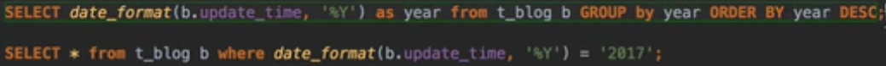

### 前端构建

#### Blog插件集成

[编辑器Markdown](https://github.com/pandao/editor.md)

[markdwon转html](https://github.com/atlassian/commonmark-java)

[中文排版](https://github.com/sofish/typo.css)

[动画效果](https://github.com/animate-css/animate.css)

[语法高亮](https://github.com/PrismJS/prism)

[目录生成](https://github.com/tscanlin/tocbot)

[滚动侦测](https://github.com/imakewebthings/waypoints)

[平滑滚动](https://github.com/flesler/jquery.scrollTo)

[二维码生成](https://github.com/davidshimjs/qrcodejs)

### 框架搭建

#### 配置文件及日志配置文件

##### application配置文件：

```yaml
spring:
  #thymeleaf配置
  thymeleaf:
    mode: HTML
  profiles:
    active: dev #指定活跃的配置文件
    
  #数据库配置
  datasource:
    driver-class-name: com.mysql.cj.jdbc.Driver
    url: jdbc:mysql://localhost:3306/myblog?useUnicode=true&characterEncoding=utf-8&serverTimezone=Asia/Shanghai
    username: root
    password: wpd
  #jpa配置
  jpa:
    hibernate:
      ddl-auto: none #是否自动更新数据库的内容
      show-sql: true #把sql语句输出到控制台及日志里面

#mybatis配置
mybatis:
  #包扫描
  type-aliases-package: cn.dut.domain
  #映射文件
  mapper-locations: classpath:mapper/*Mapper.xml

#日志配置
logging:
  level:
    root: warn #springboot框架本身的级别
    cn.dut.myblog: info #自定义的包的级别
  file:
    path: log/blog-pro.log #日志位置
server:
  port: 8081
```

##### 日志配置文件

```xml
<?xml version="1.0" encoding="UTF-8" ?>
<configuration>
<!--    包含spring boot对logback日志的默认配置-->
    <include resource="org/springframework/boot/logging/logback/defaults.xml"/>
    <property name="LOG_FILE" value="${LOG_FILE}:-${LOG_PATH:-${LOG_TEMP:-${java.io.tmpdir:-/tmp}}}/spring.log}"/>
    <include resource="org/springframework/boot/logging/logback/console-appender.xml"/>
<!--    重写spring boot框架 org/springframework/boot/logging/logback/file-appender.xml配置-->
    <appender name="TIME_FILE"
              class="ch.qos.logback.core.rolling.RollingFileAppender">
        <encoder>
            <pattern>${FILE_LOG_PATTERN}</pattern>
        </encoder>
        <file>${LOG_FILE}</file>
        <rollingPolicy class="ch.qos.logback.core.rolling.TimeBasedRollingPolicy">
            <fileNamePattern>${LOG_FILE}.%d{yyyy-MM-dd}.%i</fileNamePattern>
<!--            保留历史日志一个月时间-->
            <maxHistory>30</maxHistory>
<!--            spring boot默认为日志10M时切分日志，设置日志文件为100M时切分-->
            <timeBasedFileNamingAndTriggeringPolicy class="ch.qos.logback.core.rolling.SizeAndTimeBasedFNATP">
                <maxFileSize>100MB</maxFileSize>
            </timeBasedFileNamingAndTriggeringPolicy>
        </rollingPolicy>
    </appender>
    <root level="INFO">
        <appender-ref ref="CONSOLE"/>
        <appender-ref ref="TIME_FILE"/>
    </root>
</configuration>
```


##### QUESTIONS

Q1：重写springboot对日志文件的xml配置后怎么与application.yml对应起来


##### PROBLEMS AND SOLUTIONS

```java
java.lang.IllegalStateException: Failed to load property source from 'file:/C:/Users/hp/Desktop/java/myblog/target/classes/application-dev.yml' (classpath:/application-dev.yml) for profile dev
```

 原因为文件编码格式的问题（原yml文件为GBK格式），将GBK格式改为UTF-8。


```java
java.lang.IllegalStateException: Logback configuration error detected: 
ERROR in ch.qos.logback.core.joran.spi.Interpreter@5:117 - no applicable action for [properties], current ElementPath  is [[configuration][properties]]
```

logback配置文件中有错误，父节点不支持此节点，可能是因为版本原因，也可能是因为单词写错。


```java
java.sql.SQLException: The server time zone value '�й���׼ʱ��' is unrecognized or represents more than one time zone. You must configure either the server or JDBC driver (via the 'serverTimezone' configuration property) to use a more specifc time zone value if you want to utilize time zone support.
```

1、JDBC连接Mysql5 `com.mysql.jdbc.Driver`:

```properties
driverClassName=com.mysql.jdbc.Driver
url=jdbc:mysql://localhost:3306/test?useUnicode=true&characterEncoding=utf8&useSSL=false
username=root
password=
```

2、JDBC连接Mysql6 `com.mysql.cj.jdbc.Driver`， 需要指定时区serverTimezone:

```properties
driverClassName=com.mysql.cj.jdbc.Driver
url=jdbc:mysql://localhost:3306/test?serverTimezone=Asia/Shanghai&?useUnicode=true&characterEncoding=utf8&useSSL=false
username=root
password=
```

#### 异常处理

- 错误页面可以定义在static/templates下面，但static是静态的页面，无法动态更新数据。

- 在templates下面需要定义一个error目录，当发生异常时，spring boot会依赖文件名寻找该目录下的404.html及500.html。

- 统一的异常处理：自定义的error页面需要为springboot添加一个拦截器。

#### 日志处理

- 使用AOP的方式记录日志内容
  - 请求url
  - 访问者ip
  - 调用方法classMethod
  - 参数args
  - 返回内容

#### 页面处理

- 静态页面导入项目中

  - PROBLEMS AND SOLUTIONS

    ```
    使用相对路径的静态资源不加载
    ```

    使用thymeleaf的提供的静态资源引用方式，创建相对于服务器根目录的URL（而不是上下文根目录的URL），以便链接到同一服务器中的不同上下文。

    如：`th:href="@{/Semantic-UI-CSS-master/semantic.min.css}"`

    ```
    每个页面做上面的修改太麻烦
    ```

    使用thymeleaf定义片段，在其他页面上直接引入，如下。

- thymeleaf布局

  - 两个作用，一是将重复性的html块定义成片段在其它页面上直接引入，二是后台查询的数据在页面上动态替换并完成布局。

  - 定义fragment

    header：

    ```html
    <head th:fragment="head(title)">
        <meta charset="UTF-8">
        <meta name="viewport" content="width=device-width, initial-scale=1.0">
        <title th:replace="${title}">博客详情</title>
        <link rel="stylesheet" href="../static/Semantic-UI-CSS-master/semantic.min.css"
              th:href="@{/Semantic-UI-CSS-master/semantic.min.css}">
        <script src="../static/js/jquery-3.4.1.min.js" th:src="@{/js/jquery-3.4.1.min.js}"></script>
    </head>
    ```

    1. 改变静态资源引用方式
    2. 通过传递参数替换标签体内容

    nav：

    ```html
    <nav th:fragment="menu(n)" class="ui inverted attached segment m-padded-tb-mini m-shadow-small">
        <div class="ui container">
            <div class="ui inverted secondary stackable menu">
                <h2 class="ui teal header item">Volatile</h2>
                <a href="#" class="m-item item m-mobile-hide" th:classappend="${n==1} ? 'active'"><i class="home icon"></i>首页</a>
                <a href="#" class="m-item item m-mobile-hide" th:classappend="${n==2} ? 'active'"><i class="idea icon"></i>分类</a>
                <a href="#" class="m-item item m-mobile-hide" th:classappend="${n==3} ? 'active'"><i class="tags icon"></i>标签</a>
                <a href="#" class="m-item item m-mobile-hide" th:classappend="${n==4} ? 'active'"><i class="archive icon"></i>归档</a>
                <a href="#" class="m-item item m-mobile-hide" th:classappend="${n==5} ? 'active'"><i class="info icon"></i>关于</a>
                <div class="right m-item item m-mobile-hide">
                    <div class="ui icon inverted transparent input">
                        <input type="text" placeholder="Search...">
                        <i class="search link icon"></i>
                    </div>
                </div>
            </div>
        </div>
        <a href="#" class="ui menu toggle black icon button m-right-top m-mobile-show">
            <i class="sidebar icon"></i>
        </a>
    </nav>
    ```

    1. 通过传递参数增加标签的类属性

  - 使用fragment布局

     header：

      ```html
      <head th:replace="_fragments::head(~{::title})">
          <meta charset="UTF-8">
          <meta name="viewport" content="width=device-width, initial-scale=1.0">
          <title>首页</title>
          <link rel="stylesheet" href="../static/Semantic-UI-CSS-master/semantic.min.css">
          <link rel="stylesheet" href="../static/css/me.css">
          <script src="../static/Semantic-UI-CSS-master/semantic.min.js"></script>
          <script src="../static/js/jquery-3.4.1.min.js"></script>
      </head>
      ```

     nav：

     ```html
     <nav th:replace="_fragments::menu(1)" class="ui inverted attached segment m-padded-tb-mini m-shadow-small">
         <div class="ui container">
             <div class="ui inverted secondary stackable menu">
                 <h2 class="ui teal header item">Volatile</h2>
                 <a href="#" class="active m-item item m-mobile-hide"><i class="home icon"></i>首页</a>
                 <a href="#" class="m-item item m-mobile-hide"><i class="idea icon"></i>分类</a>
                 <a href="#" class="m-item item m-mobile-hide"><i class="tags icon"></i>标签</a>
                 <a href="#" class="m-item item m-mobile-hide"><i class="archive icon"></i>归档</a>
                 <a href="#" class="m-item item m-mobile-hide"><i class="info icon"></i>关于</a>
                 <div class="right m-item item m-mobile-hide">
                     <div class="ui icon inverted transparent input">
                         <input type="text" placeholder="Search...">
                         <i class="search link icon"></i>
                     </div>
                 </div>
             </div>
         </div>
         <a href="#" class="ui menu toggle black icon button m-right-top m-mobile-show">
             <i class="sidebar icon"></i>
         </a>
     </nav>
     ```

     对各页面的header、nav、footer定义成片段，在其他页面上直接引入。

  相比jsp的好处：静态页面也可以看到效果，jsp需要启动服务器才能。

- 错误页面美化

### 设计规范

#### 实体设计

根据原型抽象实体类以及设计其中需要的属性

- 博客Blog
  - 对象属性：一个分类、一组标签、一组评论、一个用户
  - 成员属性：标题、内容、首图、标记、浏览次数、赞赏开启、版权开启、评论开启、是否发布、是否推荐、创建时间、更新时间
- 博客分类Type
  - 名称
- 标签Tag
  - 名称
- 评论Comment
  - 昵称、邮箱、头像、评论内容、创建时间
- 用户User
  - 昵称、用户名、密码、邮箱、类型、头像、创建时间、更新时间

关系：

Blog——Type 多对一，一个blog只能属于一个type，一个type有很多blog

Blog——Tag 多对多，一个blog有很多tag，一个tag也有很多blog

Blog——Comment 一对多，一个blog有很多评论，一条评论只能属于一个blog

Blog——User 多对一，一个blog只能属于管理员，一个管理员可以发布多个blog

Comment在数据库中是一张表，但它有自关联关系：

一个Comment下面有回复Comment，这样是一个一对多的父子关系

#### 应用分层

- 终端显示层
- 请求处理层（Web层）
- 业务逻辑层（Service层）
- 持久层（DAO层）
- 数据源

#### 命名约定

Service/DAO层命名约定：

- 获取单个对象的方法用get做前缀
- 获取多个对象的方法用list做前缀
- 获取统计值的方法用count做前缀
- 插入的方法用save或insert做前缀
- 删除的方法用remove或delete做前缀
- 修改的方法用update做前缀

### 数据库构建

#### mybatis（待完成）

根据实体类的属性及关系进行构建。

QUESTIONS AND SOLUTIONS

```
每个列的具体值以及属性如何设置？如博客内容的varchar长度，主键、自增等约束如何确定。
```

##### JPA


### 功能构建


#### 后台管理

由持久层向前一层一层编写，持久层$\rightarrow$业务层$\rightarrow$控制层$\rightarrow$修改页面上访问地址（thymeleaf的静态资源引用方式）

- 登录
  - 构建登陆页面和后台管理页面
  - UserService和UserRepository
  - LoginController实现登录
  - MD5加密
  - 登录拦截器

QUESTIONS AND SOLUTIONS

```
当出现404或500错误时，跳转到的错误页面样式加载失败
```

`th:href="@{/css/me.css}"`这句中的"/"非常重要，会导致跳转后的请求路径发生变化。

```
当为登录添加过滤器后，所有的页面样式加载失败
```

`import org.springframework.web.servlet.config.annotation.WebMvcConfigurationSupport;`
`import org.springframework.web.servlet.config.annotation.WebMvcConfigurerAdapter;`

上边类会出现这种情况，具体原因有待查找；下边类没有问题，但是被弃用。

- 分类 由于博客管理需要涉及到分类、标签，因此先做分类、标签管理。

  - 分类管理页面

  - 分类列表分页

    ```json
    {
      "content":[
        {"id":123,"title":"blog122","content":"this is blog content"},
        {"id":122,"title":"blog121","content":"this is blog content"},
        {"id":121,"title":"blog120","content":"this is blog content"},
        {"id":120,"title":"blog119","content":"this is blog content"},
        {"id":119,"title":"blog118","content":"this is blog content"},
        {"id":118,"title":"blog117","content":"this is blog content"},
        {"id":117,"title":"blog116","content":"this is blog content"},
        {"id":116,"title":"blog115","content":"this is blog content"},
        {"id":115,"title":"blog114","content":"this is blog content"},
        {"id":114,"title":"blog113","content":"this is blog content"},
        {"id":113,"title":"blog112","content":"this is blog content"},
        {"id":112,"title":"blog111","content":"this is blog content"},
        {"id":111,"title":"blog110","content":"this is blog content"},
        {"id":110,"title":"blog109","content":"this is blog content"},
        {"id":109,"title":"blog108","content":"this is blog content"}],
      "last":false,
      "totalPages":9,
      "totalElements":123,
      "size":15,
      "number":0,
      "first":true,
      "sort":[{
        "direction":"DESC",
        "property":"id",
        "ignoreCase":false,
        "nullHandling":"NATIVE",
        "ascending":false
      }],
      "numberOfElements":15
    }
    ```

    通过Pageable对象调用service中的方法返回一个Page对象，它以json的形式包含了数据列表、每页显示条数、当前页等信息。

  - 分类新增、修改、删除

    - 上一页下一页显示优化
    - 新增输入不能为空的校验（前端和后端两个校验）
    - 不能新增重复的校验（通过后端校验）

    QUESTIONS AND SOLUTIONS

    ```
    后端校验的NotBlank注解无法引入
    ```

    springboot2.3后spring-boot-starter-web的依赖项已经去除了依赖hibernate-validator

    需要手动引入

    ```xml
    <dependency>
        <groupId>org.springframework.boot</groupId>
        <artifactId>spring-boot-starter-validation</artifactId>
    </dependency>
    ```

- 标签与分类类似

- 博客
  - 博客分页条件查询

    jpa具有该条件查询功能的接口`JpaSpecificationExecutor<Blog>`。

    可以将所有条件封装到一个新的类中，专门用于条件查询。
  
    ```java
        @Override
        public Page<Blog> listBlog(Pageable pageable, BlogQuery blogQuery) {
            return blogRepository.findAll(new Specification<Blog>() {
                //root代表被查询的对象，criteriaQuery为查询条件的容器，criteriaBuilder可以进行条件查询、模糊查询等
                @Override
                public Predicate toPredicate(Root<Blog> root, CriteriaQuery<?> cq, CriteriaBuilder cb) {
                    List<Predicate> predicates = new ArrayList<>();
                    if (!"".equals(blogQuery.getTitle()) && blogQuery.getTitle() != null)
                        //第一个参数为模糊查询的属性，第二个参数为查询条件
                        predicates.add(cb.like(root.<String>get("title"), "%" + blogQuery.getTitle() + "%"));
                    //注意，页面中让分类条件传入的值为Long类型的值，即主键
                    if (blogQuery.getTypeId() != null)
                        predicates.add(cb.equal(root.<Type>get("type").get("typeId"), blogQuery.getTypeId()));
                    //如果查询推荐，则进行该条件查询，否则不用
                    if (blogQuery.isRecommend())
                        predicates.add(cb.equal(root.<Boolean>get("recommend"), blogQuery.isRecommend()));
                    cq.where(predicates.toArray(new Predicate[predicates.size()]));
                    return null;
                }
            }, pageable);
      }
    ```

    前端页面渲染的难点在于thymeleaf模板的使用以及html5新增的data-xxx自定义属性的用法。

    
  
    这个分类框选择之后不能清除，因此需要一个清除按钮。清除时不能只设置文本内容，还应该清除typeId域中的value属性，因为默认什么都不选择时该属性是不存在的。实际操作时发现`removeAttr()`方法不起效果，原因未知。。只能设置为空字符串。
  
    ```javascript
    $('.ui.clear').click(function () {
        $("[name='typeId']").attr("value","");
        $('.active.selected').removeClass('active selected');
        $('.selection .text').addClass('default');
        $('.selection .text').text("分类");
    });
    ```
  
  - 博客新增
  
    QUESTIONS AND SOLUTIONS
  
    ```
    org.springframework.dao.DataIntegrityViolationException: could not execute statement; SQL [n/a]; nested exception is org.hibernate.exception.DataException: could not execute statement
    
    Caused by: com.mysql.cj.jdbc.exceptions.MysqlDataTruncation: Data truncation: Data too long for column 'content' at row 1
    ```
  
    jpa生成表时String会自动设置为varchar(255)，因此内容字段是放不下的。
  
    解决方法一是直接修改数据库表字段，改成longtext。
  
    二是在实体类中的字段上加@Lob注解。
  
  - 博客修改
  
    QUESTIONS AND SOLUTIONS
  
    ```
    org.springframework.transaction.TransactionSystemException: Could not commit JPA transaction; nested exception is javax.persistence.RollbackException: Error while committing the transaction
    Caused by: javax.persistence.RollbackException: Error while committing the transaction
    Caused by: javax.validation.ConstraintViolationException: Validation failed for classes [cn.dut.myblog.po.Blog] during update time for groups 
    ```
  
    实体类加了验证，在controller中的方法blog对象必须加@Valid。另外
  
    @NotNull：不能为null，但可以为empty
  
    @NotEmpty：不能为null，而且长度必须大于0
  
    @NotBlank：只能作用在String上，不能为null，而且调用trim()后，长度必须大于0
  
    ```
    后端验证的结果出现错误，返回博客输入页面时分类与标签列表不回写
    ```
  
    ```java
    if (result.hasErrors()) {
        //如果后端验证失败，直接返回博客输入页面不能正常显示type和tag列表，需要重新设置一下
        setTypeAndTag(model);
        return INPUT;
    }
    ```
  
    ```
    更新博客时createTime、views被重新设置为空。
    ```
  
    这是因为它们在前端页面没有隐藏域，每次更新时springmvc创建好的blog对象这些字段都是null。更新时将一些空字段忽略掉，通过反射获取这些值为空的字段。
  
  - 博客删除
  
    可以加一个简单的confirm框进行确认。

#### 前端展示

- 博客展示

  - 博客列表

  - top分类

  - top标签

  - 最新博客推荐

    右侧的分类top、标签top展示需要进行自定义查询，根据它们中的blogs列表的size进行排序查询，因此可以利用分页对象进行自定义查询。

    ```java
    @Query("select t from Type t")//自定义查询
    List<Type> findTop(Pageable pageable);
    ```

    这个查询的条件应该是jpa的写法，即不管数据库中表名具体是什么，写它对应的实体类名称即可。

    ```java
    @Override
    public List<Type> listTypeTop(Integer size) {
        //定义好排序方式、分页对象，进行自定义查询
        //根据type对象下的blogs列表属性的size属性进行倒序排列
        Sort sort = Sort.by(Sort.Direction.DESC, "blogs.size");
        Pageable pageable = PageRequest.of(0, size, sort);
        return typeRepository.findTop(pageable);
    }
    ```

    由于spring的迭代，创建排序对象、分页对象不再使用new的构造函数，而是使用静态的获取方法。

    QUESTIONS AND SOLUTIONS

    ```java
    完成字符串作为条件搜索时抛出
    org.springframework.dao.InvalidDataAccessApiUsageException: At least 2 parameter(s) provided but only 1 parameter(s) present in query.; nested exception is java.lang.IllegalArgumentException: At least 2 parameter(s) provided but only 1 parameter(s) present in query.
    ```

    条件查询的方法为

    ```java
    //将第二个参数即query字符串传入对应位置
    @Query("select b from Blog b where b.title like ?2 or b.content like ?2")
    Page<Blog> findByQuery(Pageable pageable, String query);
    ```

    这里原本想说第二个参数为模糊查询的条件，这里将2改为1就没有问题，有点神奇。

    更好的写法是

    ```java
    @Query("select b from Blog b where b.title like :query or b.content like :query")
    Page<Blog> findByQuery(Pageable pageable, @Param("query") String query);
    ```

    这里query的"%"已经以前拼好，也可以使用SQL的concat函数拼接。

    ```java
    //将第二个参数即query字符串传入对应位置
    @Query("select b from Blog b where b.title like concat('%', :query, '%') or b.content like concat('%', :query, '%')")
    Page<Blog> findByQuery(Pageable pageable, @Param("query") String query);
    ```

  - 博客详情

    由于需要将markdown文本转换成html元素，使用一个第三方插件完成

    [commonmark-java](https://github.com/atlassian/commonmark-java)

    ```xml
            <dependency>
                <groupId>com.atlassian.commonmark</groupId>
                <artifactId>commonmark</artifactId>
                <version>0.15.1</version>
            </dependency>
    <!--        生成目录插件需要h元素带有id属性，需要引入这个扩展-->
            <dependency>
                <groupId>com.atlassian.commonmark</groupId>
                <artifactId>commonmark-ext-heading-anchor</artifactId>
                <version>0.15.1</version>
            </dependency>
    <!--        处理表格数据-->
            <dependency>
                <groupId>com.atlassian.commonmark</groupId>
                <artifactId>commonmark-ext-gfm-tables</artifactId>
                <version>0.15.1</version>
            </dependency>
    ```

    评论功能：

    评论信息提交与回复

    评论信息列表层级展示

    - 将顶级评论的所有子级评论都融合进一个容器中，即最终形成两级评论。

    管理员回复评论

- 分类展示

- 标签展示

- 归档展示

  

  首先按updateTIme帅选出有几个年份，

  ```sql
  SELECT DATE_FORMAT(update_time, '%Y') AS YEAR FROM t_blog GROUP BY YEAR ORDER BY YEAR DESC;
  ```

  将某年份对应的blog加入map中。

  ```sql
  SELECT * FROM t_blog WHERE DATE_FORMAT(update_time, '%Y') = '2019';
  ```

  

### 部署过程

使用mvn打包时遇到的错误

```
Fatal error compiling: invalid target release: 1.11 -> [Help 1]
```

```xml
<plugin>                    
	<groupId>org.apache.maven.plugins</groupId>                    
	<artifactId>maven-compiler-plugin</artifactId>                    						<version>3.8.1</version>                    
	<configuration>                        
		<source>11</source>                        
		<target>11</target>                        	                   						</configuration>                
</plugin>
```


```
Cause: java.sql.SQLSyntaxErrorException: Table 'xxx' doesn't exist
```

其实是因为

```
jpa:
  hibernate:
    ddl-auto: none
```

开发环境不希望表结构发生变化，但没有创建表之前这个选项不能为none，应该先使用create、update等运行一次创建表之后再改回none。


创建博客写入内容时

```java
org.springframework.dao.DataIntegrityViolationException: could not execute statement; SQL [n/a]; nested exception is org.hibernate.exception.DataException: could not execute statement
Data truncation: Incorrect string value: '\xE6\xB5\x8B\xE8\xAF\x95' for column 'content' at row 1
```

这是因为数据库的编码问题，database和server的编码方式与其他几个不同。实际上连接数据库的时候指定了编码格式，本地好用，但Linux下不好用，可能与MariaDB有关?


进入/etc/my.cnf。

在[mysqld]标签下添加：`character-set-server=utf8`；增加一个`[client]`标签，并且在`[client]`标签下添加：`default-character-set=utf8`。

重启数据库服务，`systemctl restart mariadb.service`。


保存功能其实没有做，因为管理（不需要管有没有发布）和展示（只展示发布的）的controller共用一套service和repository中的一些方法，除非对这些方法作出区分，否则只能在页面上通过判断published状态进行展示，但总记录条数又不是很好处理，尤其是top分类下每个分类的记录条数，显示的时候是用type对象中blogs属性的size，这个size与发布还是保存无关，虽然使用SQL可以查询出分类对应的发布的博客数，但是实体类中没有保存该数据的字段，总体而言可以做但稍复杂。


