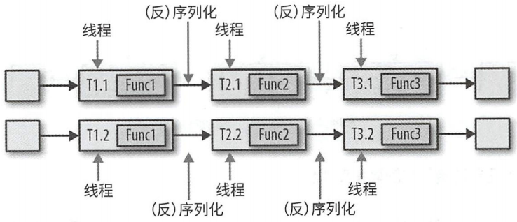

### 第1章 状态化流处理概述

#### 传统数据处理架构

##### 事务型处理

企业资源规划（ERP）系统、客户关系管理（CRM）、基于Web的应用，这些应用系统通常都会设置独立的数据处理层（应用程序本身）和数据存储层（事务型数据库系统）。


微服务架构


##### 分析型处理

用于存储事务性数据的多个数据库系统通常都是相互隔离的，如能将它们联合分析必然会创造更高的价值。此外，开发人员还经常需要将这些数据转换为某种通用格式。对于分析类查询，我们通常不会直接在事务型数据库上执行，而是将数据复制到一个专门用来处理分析类询的数据仓库。。这个向数据仓库拷贝数据的过程被称为提取－转换－加载（Extract-Transform-Load, ETL）。

通常数据仓库中的询可以分为两类：第一类是定期报告查询。它可用于计算业务相关的统计数据，如收入、用户增长、产出等。将这些指标整合成报告，能够帮助管理层评估企业整体健康状况。第二类是即席查询（ad - hoc query）。其主要目的是通过解答特定问题来辅助关键性的商业诀策，例如通过查询来整合营收数字和电台广告中的投入，以评估市场营销的有效性。


#### 状态化流处理应用

##### 事件驱动型应用

事件驱动型应用是一类通过接收事件流触发特定应用业务逻辑的有状态的流式应用。根据业务逻辑的不同，此类应用可支持触发报警或发送电子邮件之类的操作，也可支持将事件写入输出流以供其他同类应用消费使用。 

事件驱动型应用的典型应用场景有：

- 实时推荐（例如在客户浏览商家页面的同时进行产品推荐）。 

- 模式识别或复杂事件处理（例如根据信用卡交易记录进行欺诈识）。 

- 异常检测（例如计算机网络入侵检测）。

事件驱动型应用利用事件日志进行通信，其数据以本地状态形式存储。上游应用将结果写人事件日志供下游应用消费使用 。事件日志将发送端和接收端解耦，并提供异步非阻塞的事件传输机制 。


##### 数据管道应用

以低延迟的方式获取、转换并插入数据，我们将此类应用称为数据管道。它需要在短时间内处理大批量数据，以在不同存储系统间同步数据。

##### 数据分析应用

ETL作业会周期性地把数据导人数据存储系统，并通过即席或计划查询处理数据。无论它们的架构是基于数据仓库还是Hadoop生态系统组件，这都属于批处理。

流式分析应用不再需要等待周期性地触发。相反，它会持续获取事件流，以极低的延迟整合最新事件，从而可以不断更新结果。通常情况下，流式应用会把它们的 结果保存在某种支持高效更新的外部数据存储中，例如数据库或键值存储。

流式分析应用常用于：

- 手机网络质量监控。

- 移动应用中的用户行为分析。

- 消费者技术中的实时数据即席分析。

#### Flink快览

Apache Flink是一个集众多具有竞争力的特性于一身的第三代流处理引擎。它支持精确的流处理，能同时满足各种规模下对高吞吐和低延迟的要求，尤其是以下功能使其在同类系统中脱颖而出：

- 同时支持事件时间和处理时间语义。事件时间语义能够针对无序事件提供一致、精确的结果；处理时间语义能够用在具有极低延迟需求的应用中。

- 提供精确一次（ exactly-once）的状态一致性保障。

- 在每秒处理数百万条事件的同时保持毫秒级延迟。基于flink的应用可以扩展到数千核心之上。

- 层次化的API表达能力和易用性方面各有权衡。DataStream API和处理函数（process function）提供了通用的流处理操作原语（如窗口划分和异步操作）以及精确控制时间和状态的接口。 

- 用于最常见存储系统的连接器，如 Apache Kafka、Apache Cassandra、Elasticsearch、JDBC、Kinesis 以及（分布式）文件系统（HDFS、S3 等）。

- 支持高可用性配置（无单点失效），和Kubernetes、YARN、Apache Mesos紧密集成，快速故障恢复，动态扩缩容作业等。基于上述特点，它可以 24 小时运行流式应用，几乎无须停机。

- 允许在不丢失应用状态的前提下更新作业的程序代码，或进行跨 Flink 群的作业迁移。 

- 提供了详细、可自由定制的系统及应用指标（metrics）集合，用于提前定位和响应问题。

- 同时也是个成熟的批处理引擎。

### 第2章 流处理基础

#### Dataflow编程概述

##### Dataflow图

Dataflow 程序描述了数据如何在不同操作之间流动。Dataflow 程序通常表示为有向图。图中顶点称为算子，表示计算：而边表示数据依赖关系。算子是 Dataflow 程序的基本功能单元，它们从输入获取数据，对其进行计算，然后产生数据并发往输出以供后续处理。没有输入端的算子称为数据源，没有输出端的算子称为数据汇。


##### 数据并行和任务并行

Dataflow 图的并行性可以通过多种方式加以利用。首先，你可以将输入数据分组，让同一操作的多个任务并行执行在不同数据子集上，这种并行称为数据并行。数据并行非常有用，因为它能够将计算负载分配到多个节点上从而允许处理大规模的数据。再者，你可以让不同算子的任务（基于相同或不同的数据）并行计算，这种并行称为任务并行。通过任务并行，可以更好地利用集群的计算资源。

##### 数据交换策略

数据交换策略定义了如何将数据项分配给物理 Dataflow 图中的不同任务。常见的数据交换策略有：

- 转发策略在发送端任务和接收端任务之间一对一地进行数据传输。如果两端任务运行在同一物理机器上（通常由任务调度器决定），该交换策略可以避免网络通信。

- 广播策略会把每个数据项发往下游算子的全部并行任务。 该策略会把数据复制多份且涉及网络通信，因此代价十分昂贵。

- 基于键值的策略根据某一键值属性对数据分区，并保证键值相同的数据项会交由同一任务处理。

- 随机策略会将数据均匀分配至算子的所有任务，以实现计算任务的负载均衡。


#### 并行流处理

##### 延迟和吞吐

###### 延迟

表示处理一个事件所需的时间。本质上，它是从接收事件到在输出中观察到事件处理效果的时间间隔。

在流处理中，延迟是以时间片（例如毫秒）为单位测量的。根据应用的不同，你可能会关注平均延迟，最大延迟或延迟的百分位数值。例如：平均延迟为 10 毫秒表示平均每条数据会在 10 毫秒内处理；而第 95 百分位延迟在 10 秒意味着 95% 的事件会在 10 秒内处理。

###### 吞吐

是用来衡量系统处理能力（处理速率）的指标，它告诉我们系统每单位时间可以处理多少事件。

吞吐的衡量方式是计算每个单位时间的事件或操作数。但要注意，处理速率取决于数据到来速率，因此吞吐低不 定意味着性能差。换言之，首要的关注点是确定峰值吞吐，即系统满负载时的性能上限。

##### 数据流上的操作

流处理引擎通常会提供一系列内置操作来实现数据流的获取、转换，以及输出。这些算子可以组合生成 Dataflow 处理图，从而实现流式应用所需的逻辑。

这些操作既可以是无状态的，也可以是有状态的。无状态的操作不会维持内部状态，即处理事件时无需依赖己处理过的事件，也不保存历史数据。相反，有状态算子可能需要维护之前接收的事件信息，它们的状态会根据传入的事 件更新，并用于未来事件的处理逻辑中。

###### 数据接入和数据输出

数据接入和数据输出操作允许流处理引擎和外部系统进行通信。

数据接入操作是从外部数据源获取原始数据并将其转换成适合后续处理的格式。实现数据接入操作逻辑的算子称为数据源。数据源可以从 TCP、文件、 Kafka 主题或传感器数据接口中获取数据。

数据输出操作是将数据以适合外部系统使用的格式输出。负责数据输出的算子称为数据汇，其写入的目标可以是文件、数据库、消息队列或监控接口等。

###### 转换操作

转换操作是一类“只过一次”的操作，它会分别处理每个事件。这些操作逐个读取事件，对其应用某些转换并产生一条新的输出流。

###### 滚动聚合

滚动聚合（如求和、求最小值和求最大值）根据每个到来的事件持续更新结果。聚合操作都是有状态的，它们通过将新到来的事件合并到已有状态生成更新后的聚合值。

###### 窗口操作

窗口操作会持续创建一些称为“桶”的有限事件集合，并允许我们基于这些有限集进行计算。事件通常会根据其时间或其他数据属性分配到不同桶中。

- 滚动窗口将分配到长度固定且互不重叠的桶中 。在窗口边界通过后，所有事件会发送给计算函数进行处理。基于数量的滚动窗口定义了触发计算需要集齐多少条事件。基于时间的滚动窗口定义了在桶中缓冲数据的时间间隔。

  

- 滑动窗口将事件分配到大小固定且允许相互重叠的桶中，这意味着每个事件可能同时属于多个桶。我们通过指定长度和滑动间隔来定义滑动窗口。滑动间隔决定每隔多久生成一个新的桶。

  

- 会话窗口在一些常见的真实场景中非常有用，这些场景既不适合用滚动窗口也不适合用滑动窗口。它根据会话间隔将事件分为不同的会话，该间隔值定义了会话在关闭前的非活动时间长度。

  

#### 时间语义

流式应用可以使用两个不同概念的时间，即处理时间和事件时间。

##### 处理时间

处理时间是当前流处理算子所在机器上的本地时钟时间。基于处理时间的窗口会包含那些恰好在一段时间内到达窗口算子的事件，这里的时间段是按照机器时间测量的。

处理时间窗口能够将延迟降至最低。由于无需考虑、迟到或乱序的事件，窗口只需简单地缓冲事件，然后在达到
特定时间后立即触发窗口计算即可。因此对于那些更重视处理速度而非准确度的应用，处理时间就会派上用场。另一种情况是，你需要周期性地实时报告结果而无论其准确性如何。

##### 事件时间

事件时间是数据流中事件实际发生的时间，它以附加在数据流中事件的时间戳为依据。这些时间戳通常在事件数据进入流处理管道之前就存在（例如事件的生成时间）。

事件时间将处理速度和结果内容彻底解祸。基于事件时间的操作是可预测的，其结果具有确定性。无论数据流的 理速度如何、事件到达算子的顺序怎样，基于事件时间的窗口都会生成同样的结果。

##### 水位线

怎样决定事件时间窗口的触发时机？换言之，我们需要等多久才能确定已经收到了所有发生在某个特定时间点之前的事件？此外，我们如何得知数据会产生延迟？

水位线是一个全局进度指标 ，表示我们确信不会再有延迟事件到来的某个时间点。本质上，水位线提供了一个逻辑时钟，用来通知系统当前的事件时间。当一个算子接收到时间为T的水位线，就可以认为不会再收到任何时间戳小于或等于T的事件了。

#### 状态和一致性语义

支持有状态算子将面临很多实现上的挑战：

- 状态管理：系统需要高效地管理状态并保证它们不受并发更新的影响。
- 状态划分：由于结果需要同时依赖状态和到来的事件，所以状态并行化会变得异常复杂。幸运的是，在很多情况下可以把状态按照键值划分，井独立管理每部分。举例而言，如果你要处理从一组传感器得到的测量值数据流，则可以用分区算子状态、（ partitioned operator state ）来单独维护每个传感器的状态。
- 状态恢复：有状态算子需要保证状态可以恢复，并且即使出现故障也要确保结果正确。

##### 任务故障

对于输入流中的每个事件，任务都需要执行以下步骤： 接收事件井将它存在本地缓冲区；②选择性地更新内部状态；①产生输出记录。上述任何一个步骤都可能发生故障，而系统必须在故障情况下明确定义其行为。

##### 结果保障

指的是流处理引擎内部状态的一致性。

###### 至多一次

保证每个事件至多被处理一次。换句话说，事件可以随意丢弃，没有任何机制来保证结果的正确性。

###### 至少一次

意味着所有事件最终都会处理，虽然有些可能会处理多次。为了确保至少一次结果语义的正确性，需要想办怯从源头或缓冲区中重放事件。

###### 精确一次

表示不但没有事件丢失，而且每个事件对于内部状态的更新都只有一次。提供精确一次保障是以至少一次保障为前提，因此同样需要数据重放机制。此外，流处理引擎需要确保内部状态一致性，即在故障恢复后，引擎需要知道某个事件对应的更新是否已经反映到状态上。事务性更新是实现该目标一个方法，但它可能会带来极大的性能开销。 Flink采用了轻量级检查点机来实现精确一次结果保障。

###### 端到端的精确一次

在实际流处理应用中，除了流处理引擎也至少还要有一个数据来源组件和一个数据终点组件。端到端的保障指的是在整个数据处理管道上结果都是正确的。

### 第3章 Apache Flink 架构

#### 系统架构

Flink是一个用于状态化并行流处理的分布式系统。分布式系统需要应对的常见挑战包括分配和管理集群计算资源，进程协调，持久且高可用的数据存储及故障恢复等。
Flink并没有依靠自身实现所有上述功能，而是在已有集群基础设施和服务之上专注于它的核心功能 分布式数据流处理。Flink和很多集群管理器（如Apache Mesos、YARN、Kubernetes）都能很好地集成；同时它也可以通过配置，作为独立集群来运行。Flink没有提供分布式持久化存储，而是利用了现有的分布式文件系统（如HDFS）或对象存储（如S3）。它依赖 Apache ZooKeeper 来完成高可用性设置中的领导选举工作。

##### 搭建 Flink 所需组件

Flink 的搭建需要四个不同组件，分别是：JobManager、ResourceManager、TaskManager和Dispatcher。

- 作为主进程，JobManager 控制着单个应用程序的执行。换句话说，每个应用都由一个不同的 JobManager 掌控。 JobManager可以接收需要执行的应用，该应用会包含一个所谓的 JobGraph，即逻Dataflow 图，以及 一个打包了全部所需类、库以及其他资源的 JAR 文件。 JobManager将JobGraph 转化成名为Execution Graph 的物理 Dataflow 图，该图包含了那些可以并行执行的任务。JobManager从ResourceManager 申请执行任务的必要资源（TaskManager 处理槽）。 旦它收到了足够数量的 TaskManager 处理槽（slot），就会将ExecutionGraph 中的任务分发给 TaskManager 来执行。在执行过程中，JobManager 还要负责所有需要集中协调的操作，如创建检查点。

- 针对不同的环境和资源提供者（如 YARN、Mesos、Kubernetes或独立部署）, Flink 提供了不同的 ResourceManager。ResourceManager 负责管理 Flink 的处理资源单元一一TaskManager 处理槽。当 JobManager 申请 TaskManager 处理槽时， ResourceManager 会指一个拥有空闲处理槽的 TaskManager 将其处理槽提供给 JobManager。如果 ResourceManager 的处理槽数无住满足 JobManager 的请求，则ResourceManager 可以和资源提供者通信，让它们提供额外容器来启动更多 TaskManager 进程。同时， ResourceManager 还负责终止空闲的 TaskManager 以释放计算资源。
- TaskManager Flink 的工作进程。通常在 Flink 搭建过程中要启动多个 TaskManager。每个 TaskManager 提供一定数量的处理槽。处理槽的数目限制了一个 TaskManager 可执行的任务数。 TaskManager 在启动后，
  会向 ResourceManager 注册它的处理槽。当接收到 ResourceManager 的指示时，TaskManager 会向 JobManager 提供一个或多个处理槽。之后， JobManager 可以向处理槽中分配任务来执行。在执行期间，运行同一应用不同任务的TaskManager之间会产生数据交换。
- Dispatcher 会跨多个作业运行，它提供了 REST 接口来让我们提交需要执行的应用。一旦某个应用提交执行， Dispatcher 会启动一个 JobManager 并将应用转交给它。REST 接口意味着 Dispatcher 这一集群 HTTP 入口可以受到防火墙的保护。Dispatcher 同时还会启动 Web UI，用来提供有关作业执行的信息。某些应用提交执行的方式可能用不到 Dispatcher。


##### 应用部署

Flink 应用可以通过两种模式进行部署。基于框架的模式采用的是传统方式，即通过客户端提交应用（或查询）到正在运行的服务上；而在库模式中，Flink 不是作为服务，而是以库的形式绑定到应用所在的容器镜像中。后者常用于微服务架构。

- 框架模式：在该模式下，Flink应用打包成 JAR文件，通过客户端提交到运行的服务上。这里的服务可以是 Flink Dispatcher, Flink JobManager 或是YARN的ResourceManager。无论哪种情况，运行的服务都会接收 Flink 应用井确保其执行。如果应用提交 JobManager，会立即开始执行；如果应用提交到 Dispatcher或 YARN ResourceManager，它们会启动一个 JobManager 并将应用转交给它，随后由 JobManager 负责执行该应用。
- 库模式：在该模式下，Flink 应用会绑定到一个特定应用的容器镜像（如 Docker 镜像）中。镜像中还包含着运行 JobManager 以及 ResourceManager 的代码。当容器从镜像启动后会自动加载 ResourceManager 和Job Manager，并将绑定的作业提交执行。另一个和作业无关的镜像负责部署 TaskManager 容器。容器通过镜像启动后会自动运行 TaskManager，后者可以连接 ResourceManager 并注册处理槽。通常情况下，外部资源管理框架（Kubernetes）负责启动镜像，并确保在发生故障时容器能够重启。

##### 任务执行

一个 TaskManager 允许同时执行多个任务，这些任务可以属于同一个算子（数据并行），也可以是不同算子（任务井行），甚至还可以来自不同的应用（作业并行）。TaskManager 通过提供固定数量的处理槽来控制可以并行执行的任务数。每个处理槽可以执行应用的一部分，即算子的一个井行任务。


TaskManager 会在同一个 JVM 进程内以多线程的方式执行任务。和独立进程相比，线程更加轻量并且通信开销更低，但无法严格地将任务彼此隔离。因此只要有一个任务运行异常，就有可能“杀死” TaskManager 进程，导致它上面运行的所有任务都停止。如果将每个 TaskManager 配置成只有一个处理槽，则可以限制应用在 TaskManager 级别进行隔离。

##### 高可用性设置

###### TaskManager 故障

为了执行应用的全部任务， Flink 需要足够数量的处理槽。 假设一个 Flink 设置包含4个 TaskManager ，每个 TaskManager有2个处理槽，那么一个流式应用最多支持以并行度8来运行。如果有一个 TaskManager 出现故障，则可用处理槽的数量就降到了6个。这时候 JobManager 会向 ResourceManager 申请更多的处理槽。若无法完成（例如应用运行在一个独立集群上），JobManager 将无法重启应用，直至有足够数量的可用处理槽 。应用的重启策略决定了 JobManager 以何种频率重启应用以及重启尝试之间的等待间隔。

###### JobManager 故障

如果负责管理的 JobManager 进程消失，流式应用将无法继续处理数据。高可用模式支持在原 JobManager 消失的情况下将作业的管理职责及元数据迁移到另一个 JobManager。

JobManager 在高可用模式下工作时，会将 JobGraph 以及全部所需的元数据（例如应用的 JAR 文件）写入一个远程持久化存储系统中。此外，JobManager 还会将存储位置的路径地址写入 ZooKeeper 的数据存储。在应用执行过程中， JobManager 会接收每个任务检查点的状态句柄。在检查点即将完成的时候，如果所有任务已经将各自状态成功写入远程存储，JobManager 就会将状态句柄写入远程存储，并将远程位置的路径地址写入ZooKeeper。因此所有用于 JobManager 故障恢复的数据都在远程存储上面，而 ZooKeeper 持有这些存储位置的路径。


新接手工作的 JobManager 会执行以下步骤：

1. 向 ZooKeeper 请求存储位置，以获取 JobGraph、JAR 文件及应用最新检查点在远程存储的状态句柄。
2. 向 ResourceManager 申请处理槽来继续执行应用。
3. 重启应用并利用最近一次检查点重置任务状态。

#### Flink 中的数据传输

在运行过程中，应用的任务会持续进行数据交换。 TaskManager 负责将数据从发送端任务传输至接收端任务。每个 TaskManager 都有一个用于收发数据的网络缓冲池（每个缓冲默认32KB大小）。

如果发送端和接收端的任务运行在不同的 TaskManager 进程中，它们就要用到操作系统的网络栈进行通信。流式应用需要以流水线方式交换数据，因此每对 TaskManager 之间都要维护一个或多个永久的 TCP 连接来执行数据交换。 在Shuffle 连接模式下，每个发送端任务都需要向任意一个接收端任务传输数据。对于每一个接收端任务， TaskManager 都要提供一个专用的网络缓冲区，用于接收其他任务发来的数据。


当发送任务和接收任务处于同一个 TaskManager 进程肘，发送任务会将要发送的记录序列化到一个字节缓冲区中，一旦该缓冲区占满就会被放到一个队列里。接收任务会从这个队列里获取缓冲区并将其中的记录反序列化。这意味着同一个 TaskManager 内不同任务之间的数据传输不会涉及网络通信。

Flink 采用多种技术来降低任务之间的通信开销。

##### 基于信用值的流量控制

接收任务会给发送任务授予一定的信用值，其实就是保留一些用来接收它数据的网络缓冲。一旦发送端收到信用通知，就会在信用值所限定的范围尽可能多传输缓冲数据，并会附带上积压量（已经填满准备传输的网络缓冲数目）大小。接收端使用保留的缓冲来处理收到的数据，同时依据各发送端的积压量信息来计算所有相连的发送端在下一轮的信用优先级。

##### 任务链接

Flink 采用一种名为任务链接的优化技术来降低某些情况下的本地通信开销。任务链接的前提条件是多个算子必须有相同的井行度且通过本地转发通道相连。

任务链接模式：多个算子的函数被“融合”到同一个任务中，在同一个线程内执行。函数生成的记录只需通过简单
法调用就可以分别发往各自的下游函数。因此函数之间的记录传输基本上不存在序列化及通信开销。


非任务链接模式：有时候我们需要对过长任务链接进行切分或者将两个计算量大的函数分配到不同的处理槽中。



#### 事件时间处理

##### 时间戳

在事件时间模式下，Flink 流式应用处理的所有记录都必须包含时间戳。时间戳将记录和特定时间点进行关联，这些时间点通常是记录所对应事件的发生时间。

当 Flink 以事件时间模式处理数据流时，会根据记录的时间戳触发时间相关算子的计算。Flink 内部采用8字节的 Long 值对时间戳进行编码，并将它们以元数据的形式附加在记录上。内置算子会将这个 Long 值解析为毫秒精度的 Unix 时间戳（自 1970 -01-01-00 :00:00.000 以来的毫秒数）。

##### 水位线

除了记录的时间戳， Flink 基于事件时间的应用还必须提供水位线。水位线用于在事件时间应用中推断每个任务当前的事件时间。基于时间的算子会使用这个时间来触发计算并推动进度前进。

Flink 中，水位线是利用一些包含 Long 值时间戳的特殊记录来实现的。它们像带有额外时间戳的常规记录一样在数据流中移动。


水位线拥有两个基本属性：

1. 必须单调递增。这是为了确保任务中的事件时间时钟正确前进，不会倒退。

2. 和记录的时间戳存在联系。一个时间戳为T的水位线表示，接下来所有记录的时间戳一定都大于T。

##### 水位线传播和事件时间

Flink 内部将水位线实现为特殊的记录，它们可以通过算子任务进行接收和发送。任务内部的时间服务会维护一些计时器，它们依靠接收到水位线来激活。当任务接收到一个水位线时会执行以下操作：

1. 基于水位线记录的时间戳更新内部事件时间时钟。
2. 任务的时间服务会找出所有触发时间小于更新后事件时间的计时器。对于每个到期的计时器，调用回调函数，利用它执行计算或发出记录。
3. 任务根据更新后的事件时间将水位线发出。

Flink 将数据流划分为不同的分区，井将它交由不同的算子任务来并行执行。每个分区作为一个数据流，都会包含带有时间戳的记录以及水位线。根据算子的上下游连接情况，其任务可能需要同时接收来自多个输入分区的记录和水位线，也可能需要将它发送到多个输出分区。

一个任务会为它的每个输入分区都维护一个分区水位线。当收到某个分区传来的水位线后，任务会以接收值和当前值中较大的那个去更新对应分区水位线的值。随后，任务会把事件时间时钟调为所有分区水位线中最小的那个值。如果事件时间时钟向前推动，任务会先处理因此而触发的所有计时器，之后才会把对应的水位线发往所有连接的输
出分区，以实现事件时间到全部下游任务的广播。


##### 时间戳分配和水位线生成

时间戳和水位线通常都是在数据流刚进入流处理应用的时候分配和生成的。由于不同的应用会选择不同的时间
戳，而水位线依赖于时间戳和数据流本身的特征，所以应用必须显式地分配时间戳和生成水位线。 Flink DataStream 应用可以通过三种方式完成该工作：

1. 在数据源完成：我们可以利用 Source Function 在应用读入数据流的时候分配时间戳和生成水位线。源函数会发出一条记录流。每个发出的记录都可以附加一个时间戳，水位线可以作为特殊记录在任何时间点发出。如果源函数（临时性地）不再发出水位线，可以把自己声明成空闲。 Flink 会在后续算子计算水位线的时候把那些来自于空闲源函数的流分区排除在外。数据源空闲声明机制可以用来解决上面提到的水位线不向前推进的问题。
2. 周期分配器：DataStream API 提供了一个名为 AssignerWithPeriodicWatermarks 的用户自定义函数，它可以从每条记录提取时间戳，并周期性地响应获取当前水位线的查询请求。提取出来的时间戳会附加到各自的记录上，查询得到的水位线会注入到数据流中。
3. 定点分配器：另一个支持从记录中提取时间戳的用户自定义函数叫作 AssignerWithPunctuatedWatermarks 。它可用于需要根据特殊输入记录生成水位线的情况。和 AssignerWithPeriodicWatermark 函数不同，这个函数不会强制你从每条记录中都提取一个时间戳（虽然这样也行）。

#### 状态管理

通常意义上，函数里所有需要任务去维护并用来计算结果的数据都属于任务的状态。在 Flink 中，状态都是和特定算子相关联。为了让 Flink 的运行层知道算子有哪些状态，算子需要自己对其进行注册。根据作用域的不同，状态可以分为两类：算子状态和键值分区状态。

##### 算子状态

算子状态的作用域是某个算子任务，这意味着所有在同一个并行任务之内的记录都能访问到相同的状态。算子状态不能通过其他任务访问，无论该任务是否来自相同算子。


Flink 为算子状态提供了三类原语：

- 列表状态：将状态表示为一个条目列表。
- 联合列表状态： 同样是将状态表示为一个条目列表，但在进行故障恢复或从某个保存点启动应用时，状态的恢复方式和普通列表状态有所不同。
- 广播状态： 专门为那些需要保证算子的每个任务状态都相同的场景而设计。这种相同的特性将有利于检查点保存或算子扩缩容。

##### 键值分区状态

键值分区状态会按照算子输入记录所定义的键值来进行维护或访问。Flink 为每个键值都维护了一个状态实例，该实例总是位于那个处理对应键值记录的算子任务上。当任务在处理一个记录时，会自动把状态的访问范围限制为当前记录的键值。因此所有键值相同的记录都能访问到同样的状态。


Flink 为键值分区状态提供了不同原语，它们的区别在于分布式键值映射中每个键所对应存储值的类型不同。

- 单值状态：每个键对应存储一个任意类型的值，该值也可以是某个复杂数据结构。
- 列表状态：每个键对应存储一个值的列表。列表中的条目可以是任意类型。
- 映射状态：每个键对应存储一个键值映射，该映射的键和值可以是任意类型。

##### 状态后端

为了保证快速访问状态，每个并行任务都会把状态维护在本地。至于状态具体的存储、访问和维护，则是由一个名为状态后端的可插拔组件来决定。状态后端主要负责两件事：本地状态管理和将状态以检查点的形式写入远程存储。

对于本地状态管理，状态后端会存储所有键值分区状态，并保证能将状态访问范围正确地限制在当前键值。 Flink 提供的一类状态后端会把键值分区状态作为对象，以内存数据结构的形式存在 JVM 堆中；另一类状态后端会把状态对象序列化后存到 Rocks DB 中，RocksDB 负责将它们写到本地硬盘上。前者状态访问会更快一些，但会受到内存大小的限制；后者状态访问会慢一些，但允许状态变得很大。

由于 Flink 是一个分布式系统但只在本地维护状态，所以状态检查点就显得极其重要。状态后端负责将任务状态以检查点形式写入远程持久化存储，该远程存储可能是一个分布式文件系统，也可能是某个数据库系统。

##### 有状态算子的扩缩容

流式应用的一项基本需求是根据输入数据到达速率的变化调整算子并行度。Flink 对不同类型的状态提供了四种扩缩容模式。

- 带有键值分区状态的算子在扩缩容时会根据新的任务数量对键值重新分区。但为了降低状态在不同任务之间迁移的必要成本， Flink 不会对单独的键值实施再分配，而是会把所有键值分为不同的键值组。每个键值组都包含了部分键值， Flink 以此为单位把键值分配给不同任务。

  

- 带有算子列表状态的算子在扩缩容时会对列表中的条目进行重新分配。理论上，所有并行算子任务的列表条目会被统一收集起来，随后均匀分配到更少或更多的任务之上。如果列表条目的数量小于算子新设置的并行度，部分任务在启动时的状态就可能为空。

  

- 带有算子联合列表状态的算子会在扩缩容时把状态列表的全部条目广播到全部任务上。随后由任务自己决定哪些条目该保留，哪些该丢弃。

  

- 带有算子广播状态的算子在扩缩容时会把状态拷贝到全部新任务上。这样做原因是广播状态能确保所有任务的状态相同。在缩容的情况下，由于状态经过复制不会丢失，我们可以简单地停掉多出的任务。

  

#### 检查点、保存点及状态恢复

##### 一致性检查点

Flink 的故障恢复机制需要基于应用状态的一致性检查点。有状态的流式应用的一致性检查点是在所有任务处理完等量的原始输入后对全部任务状态进行的一个拷贝。我们可以通过一个朴素算法对应用建立一致性检查点的过程**进**
**行解释**：

1. 暂停接收所有输入流。
2. 等待已经流入系统的数据被完全处，即所有任务已经处理完所有的输入数据。
3. 将所有任务的状态拷贝到远程持久化存储，生成检查点。在所有任务完成自己的拷贝工作后，检查点生成完毕。
4. 恢复所有数据流的接收。

##### 从一致性检查点中恢复

在流式应用执行过程中， Flink 会周期性地为应用状态生成检查点。一旦发生故障， Flink 会利用最新的检查点将应用状态恢复到某个一致性的点并重启处理进程。应用恢复要经过3个步骤：

1. 重启整个应用。
2. 利用最新的检查点重置任务状态。
3. 恢复所有任务的处理。


**如果所有算子都将它们全部的状态写入检查点井从中恢复，并且所有输入流的消费位置都能重置到检查点生成那一刻，那么该检查点和恢复机制就能为整个应用的状态提供精确一次的一致性保障。**数据源能否重置其输入流取决于它的具体实现以及所消费外部系统是否提供相关接口。例如，类似 Apache Kafka 事件日志系统就允许从之前的某个偏移读取记录。相反，如果数据流是从套接字消费而来则无法重置，因为套接字会在数据被取走后将它们丢弃。

需要强调的是， Flink 的检查点和恢复机制**仅能重置流式应用内部的状态**。根据应用所采用的数据汇算子，在恢复期间，某些结果记录可能会向下游系统（如事件日志系统、文件系统或数据库）发送多次。对于某些存储系统， Flink 提供的数据汇函数支持精确一次输出，例如在检查点完成后才会把写出的记录正式提交。另一种适用于很多存储系统的方法是幂等更新。

##### Flink 检查点算法

Flink 的检查点是基于 Chandy-Lamport 分布式快照算法来实现的。该算法不会暂停整个应用，而是会把生成检查点的过程和处理过程分离，这样在部分任务持久化状态的过程中，其他任务还可以继续执行。

Flink 的检查点算法中会用到一类名为检查点分隔符的特殊记录。和水位线类似，这些检查点分隔符会通过数据源算子注入到常规的记录流中。相对其他记录，它们在流中的位置无法提前或延后。为了标识所属的检查点，每个检查点分隔符都会带有一个检查点编号，这样就把一条数据流从逻辑上分成了两个部分。所有先于分隔符的记录所引起的状态更改都会被包含在分隔符所对应的检查点之中；而所有晚于分隔符的记录所引起的状态更改都会被纳入之
后的检查点中。

- 示例：

  

  应用包含了两个数据源任务，每个任务都会各自消费一条自增数字流。数据源任务的输出会被分成奇数流和偶数流两个部分，每一部分都会有一个任务负责对收到的全部数字求和，并将结果值更新至下游数据汇。

  

  JobManager 会向每个数据源任务发送一个新的检查点编号，以此来启动检查点生成流程。

  

  当一个数据源任务收到消息后，会暂停发出记录，利用状态后端触发生成本地状态的检查点，并把该检查点分隔符连同检查点编号广播至所有传出的数据流分区。状态后端会在状态存为检查点完成后通知任务，随后任务会给 JobManager 发送确认消息。在将所有分隔符发出后，数据源将恢复正常工作。通过向输出流中注入分隔符，数据源函数定义了需要在流中哪些位置生成检查点。

  

  数据源任务发出的检查点分隔符会传输到与之相连的任务。和水位线类似，检查点分隔符总是以广播形式发送，从而可以确保每个任务能从它们的每个输入都收到一个分隔符。当任务收到一个新检查点的分隔符时，会继续等待所有其他输入分区也发来这个检查点的分隔符。在等待过程中，它会继续处理那些从还未提供分隔符的分区发来的数据。对于已经提供分隔符的分区，它们新到来的记录会被缓冲起来，不能处理。这个等待所有分隔符到达的过程称为分隔符对齐。

  

  任务在收齐全部输入分区发送的分隔符后，就会通知状态后端开始生成检查点，同时把检查点分隔符广播到下游相连的任务。

  

  任务在发出所有的检 点分隔符后就会开始处理 冲的记录。待所有缓冲的记录处理完后，任务就会继续处理输入流。

  

  最终检查点分隔符到达数据汇任务。数据汇任务在收到分隔符后会依次执行分隔符对齐，将自身状态写入检查点，向 JobManager 确认已接收分隔符等一系列动作。 JobManager 在接收到所有应用任务返回的检查点确认消息后，就会将此次检查点标记为完成。

##### 检查点对性能的影响

任务在将其状态存入检查点的过程中，会处于阻塞状态，此时的输入会进入缓冲区。由于状态可能会很大， 且生成检查点需要把这些数据通过网络写入远程存储系统，该过程可能持续数秒，甚至数分钟。这对于一些延迟敏感的应用而言时间过久。

按照 Flink 的设计，是由状态后端负责生成检查点，因此任务的状态的具体拷贝过程完全取决于状态后端的实现。举例而言，文件系统状态后端和 RocksDB 状态后端支持**异步**生成检查点。当检查点生成过程触发时，状态后端会为当前状态创建一个本地拷贝。在本地拷贝创建完成后，任务就可以继续它的常规处理。后台进程会异步将本地状态快照拷贝到远程存储，然后在完成检查点后通知任务。异步生成检查点可以有效降低任务恢复数据处理所需等待的时间 。除此之外， RocksDB 状态后端还支持增量生成检查点，这可以有效降低需要传输的数据。

对于那些需要极低延迟且能容忍至少一次状态保障的应用，可以通过配置让 Flink 在分隔符对齐的过程中不缓冲那些己收到分隔符所对应分区的记录，而是直接处理它们。待所有的检查点分隔符都到达以后，算子才将状态存入检查点，这时候状态可能会包含一些由本应出现在下一次检查点的记录所引起的改动。一旦出现故障，这些记录会被重复处理，而这意味着检查点只能提供至少一次而非精确一次的一致性保障。

##### 保存点

Flink 最具价值且独具一格的功能之一是保存点。原则上，保存点的生成算法和检查点完全一样，因此可以把保存点看做包含一些额外元数据的检查点。保存点的生成不是由 Flink 自动完成，而是需要由用户（或外部调度器）显式触发。同时，Flink 也不会自动清理保存点。

###### 保存点的使用

给定一个应用和一个兼容的保存点，我们可以从该保存点启动应用。这样就能用保存点内的数据初始化状态并从生成保存点的那一刻继续运行应用。这个行为看上去和利用检查点将应用从故障中恢复完全一致，但其实故障恢复只是一种特殊情况，它会在完全相同的集群上，以完全相同的配置，运行完全相同的应用。

- 从保存点启动一个不同但相互兼容的应用。这意味着你可以修复应用的一些逻辑bug，然后在数据流来源的支持范围内下尽可能多地重新处理输入事件，以此来修复结果。应用修改还可用于A/B测试或需要不同业务逻辑
  的假想场景。需要注意的是，应用和保存点必须相互兼容，只有这样应用才能加载保存点内的状态。
- 用不同的并行度启动原应用，从而实现应用的扩缩容。
- 在另一个集群上启动相同的应用。这允许你把应用迁移到一个新的 Flink 版本，或是一个不同的集群或数据中心。
- 利用保存点暂停某个应用，稍后再把它启动起来。这样可以为更高优先级的应用腾出集群资源，或者在输入数据不连续的情况下及时释放资源。
- 为保存点设置不同版本并将应用状态归档。

###### 从保存点启动应用

保存点中的状态副本会按照算子标识和状态名称进行组织。该算子标识和状态名需要能将保存点的状态数据映射到应用启动后的算子状态上。当应用从保存点启动时，Flink 会将保存点的数据分发到对应算子的任务上。


注意，保存点没有包含算子任务的相关信息，这是因为任务数目可能会随着应用启动时所指定的并行度而改变。

默认情况下， Flink 会给每个算子分配一个唯一标识，但该标识是根据前置算子的标识按照某种确定规则生成的。这意味着任何一个前置算子发生改变（例如添加或删除某个算子）都会导致该标识发生变化。因此使用默认算子标识的应用如果不想丢失状态，那么改动空间会比较有限。所以我们强烈建议手工指定算子标识，而不要依赖 Flink的默认分配机制。

### 第5章 DataStream API

#### Hello, Flink

构建一个典型的 Flink 流式应用需要以下几步:

1. 设置执行环境。

   执行环境决定了应用是在本地机器上还是集群上运行。 DataStream API 的执行环境由 StreamExecutionEnvironment 来表示。根据调用时所处上下文的不同，该方法可能会返回一个本地或远程环境。如果是一个连接远程集群的提交客户端调用了该方法，则会返回一个远程执行环境；否则会返回一个本地环境。

   显式指定本地或远程执行环境：

   ```scala
   //创建一个本地的流式执行环境
   val localEnv: StreamExecutionEnvironment.createlocalEnvironment() 
   //创建一个远程的流式执行环境
   val remoteEnv = StreamExecutionEnvironment.createRemoteEnvironment(
   "host", // JobManager 的主机名
   1234, // JobManager 的端口号
   "path/to/jarFile.jar") //需要传输到 JobManager的JAR包
   ```

2. 从数据源中读取一条或多条流。

   StreamExecutionEnvironment 为我们提供了一系列创建流式数据源的方法，用以将数据流读取到应用中。这些数据流的来源可以是消息队列或文件，也可以是实时生成的。

3. 通过一系列流式转换来实现应用逻辑。

   一旦得到了 Data Stream 对象，我们就可以对它应用转换。转换的类型多种多样：有些会生成新的 DataStream （类型可能会发生变化）；而另外的一些不会修改 Data Stream 中的记录，仅会通过分区或分组的方式将其重新组织。应用程序的逻辑是通过一系列转换来定义的。

4. 选择性地将结果输出到一个或多个数据汇中。

   流式应用通常都会把结果发送到某些外部系统，例如 Apache Kafka，文件系统或数据库。 Flink 提供一组维护状态良好的流式数据汇，可用来完成上述工作。你也可以选择自己实现流式数据汇。还有一些应用不会发 出结果，而是将它们保存在内部，利用 Flink 的可查询式状态功能对外提供服务。

5. 执行程序。

   Flink 程序都是通过延迟计算的方式执行。也就是说，那些创建数据源和转换操作的 API 调用不会立即触发数据处理，而只会在执行环境中构建一个执行计划。计划中包含了从环境创建的流式数据源以及应用于这些数据源之上的一系列转换。只有在调用 execute 方法时，系统才会触发程序执行。

#### 转换操作

大多数流式转换都是基于用户自定义函数来完成的。这些函数封装了用户应用逻辑，指定了输入流的元素将如何转换为输出流的元素。

函数可以通过实现某个特定转换的接口类来定义。DataStream API 为那些最常见的数据转换操作都提供了对应的转换抽象。分为四类：

1. 作用于单个事件的基本转换。
2. 针对相同键值事件的 KeyedStream 转换。
3. 将多条数据流合并为一条或将一条数据流拆分成多条流的转换。
4. 对流中的事件进行重新组织的分发转换。

##### 基本转换

基本转换会单独处理每个事件，这意味着每条输出记录都由单条输入记录所生成。常见的基本转换函数有：简单的值转换，记录拆分或过滤等。

###### Map

通过调用 DataStream.map 方法可以指定 map 转换产生一个新的 DataStream。该转换将每个到来的事件传给一个用户自定义的映射器， 针对每个输入只返回一个（可能类型发生改变的）输出。


MapFunction 的两个类型参数分别是输入事件和输出事件的类型，它们可以通过 MapFunction 接口来指定。该接口的 map 方法将每个输入事件转换为一个输出事件：

```scala
//T：输入元素类型
//O：输出元素的类
MapFunction[T, O] 
	> map(T)：O
```

###### Filter

filter 转换利用一个作用在流中每条输入事件上的布尔条件来决定事件的去留：返回值为 true，那么它会保留输入 事件井将其转发到输出，否则它会把事件丢弃。 通过调用 DataStream.filter 方法可以指定 filter 转换产生一个数据类型不变的 DataStream。


FilterFunction 接口的类型为输入流的类型，它的 filter 方法会接收输入事件，返回一个布尔值：

```scala
//T：元素类型
FilterFunction[T] 
	> filter(T): Boolean 
```

###### FlatMap

flatMap 转换类似于 map，但它可以对每个输入产生零个、一个或多个输出事件。事实上，flatMap 转换可以看做是 fiIter 和 map 的泛化，它能够实现后两者的操作。


FlatMapFunction 定义了 flatMap 方法，你可以在其中通过向 Collector 对象传递数据的方式返
回零个、一个或多个事件作为结果：

```scala
//T：输入元素的类型
//O：输出元素的类型
FlatMapFunction[T, O] 
	> flatMap(T, Collector[O]): Unit 
```

##### 基于 KeyedStream 的转换

KeyedStream 抽象可以从逻辑上将事件按照键值分配到多条独立的子流中。

###### keyBy

keyBy 转换通过指定键值的方式将 DataStream 转化为 KeyedStream。流事件会根据各自键值被分到不同分区，这样一来，有着相同键值的事件一定会在后续算子的同一个任务上处理。


###### 滚动聚合

滚动聚合转换作用于 Keyed Stream 上，它将生成一个包含聚合结果（例如求和、最小值、最大值等）的 DataStream。该动聚合算子会对每一个遇到过的键值保存一个聚合结果。每当有新事件到来，该算子都会更新相应的聚合结果，井将其以事件的形式发送出去。

- sum()：滚动计算输入流中指定字段的和。
- min()：滚动计算输入流中指定字段的最小值。
- max()：滚动计算输入流中指定字段的最大值。
- minBy()：滚动计算输入流中迄今为止最小值，返回该值所在事件。
- maxBy() ：滚动计算输入流中迄今为止最大值，返回该值所在事件。

###### Reduce

reduce 转换是滚动聚合转换的泛化。它将 ReduceFunction 应用在 KeyedStream 上，每个到来事件都会和 reduce 结果进行一次组合，从而产生一个新的 DataStream。reduce 转换不会改变数据类型，因此输出流的类型会永远和输入流保持一致。

通过实现 ReduceFunction 接口来指定 reduce 函数。它当中定义的 reduce 方法每次接收两个输入事件，生成一个类型相同的输出事件：

```scala
//T：元素类型
ReduceFunction[T] 
	> reduce(T, T): T 
```

在下面的示例中 ，数据流会以语言字段 （即第一个字段）为键值进行分区，最终结果是针对每种语言产生一个不断更新的单词列表：

```scala
val inputStream: DataStream[(String, List[String])] = env.fromElements( 
	("en", List("tea")), ("fr", List("vin")), ("en", List("cake"))) 
val resultStream: DataStream[(String, List[String])] = inputStream 
	.keyBy(0) 
	.reduce((x, y) => (x._1, x._2 ::: y._2)) 
```

##### 多流转换

很多应用需要将多条输入流联合起来处理，或将一条流分割成多条子流以应用不同逻辑。

###### Union

DataStream.union 方法可以合并两条或多条类型相同的 DataStream，生成一个新的类型相同的 DataStream。这样后续的转换操作就可以对所有输入流中的元素统一处理。


union 执行过程中， 来自两条流 事件会 FIFO （先进先出）的方式合并，其顺序无法得到任何保证。此外，union 算子不会对数据进行去重，每个输入消息都会被发往下游算子。

###### Connect，coMap，coFlatMap

DataStream.connect 方法接收一个 DataStream 并返回一个 ConnectedStreams 对象，该对象表示两个联结起来的流。

ConnectedStreams 对象提供了 map 和 flatMap 方法，它们分别接收一个 CoMapFunction 和一个CoFlatMapFunction 作为参数。两个函数都是以两条输入流的类型外加输出流的类型作为其类型参数，它们为两条输入流定义了各自的处理方法。

```scala
//IN1：第一条输入流的类型
//IN2：第二条输入流的类型
//OUT：输出元素的类型
CoMapFunction[IN1, IN2, OUT] 
	> map1(IN1): OUT 
	> map2(IN2): OUT 
//IN1：第一条输入流的类型
//IN2：第二条输入流的类型
//OUT：输出元素的类型
CoFlatMapFunction[IN1, IN2, OUT] 
	> flatMap1(IN1, Collector[OUT]): Unit 
	> flatMap2(IN2, Collector[OUT]): Unit
```

###### Split 和 Select

split 转换是 union 转换的逆操作。它将输入流分割成两条或多条类型和输入流相同的输出流。每一个到来的事件都可以被发往零个、一个或多个输出流。因此，split 也可以用来过滤或复制事件。


DataStream.split 方法接收 OutputSelector，它用来定义如何将数据流的元素分配到不同的命名输出。 OutputSelector 中定义的 select 方法会在每个输入事件到来时被调用，并随即返回一个 java.lang.Iterable[String] 对象。针对某记录所返回的一系列 String 值指定了该记录需要被发往哪些输出流。

```scala
//IN：拆分流的元素类型
OutputSelector[IN] 
	> select(IN): Iterable[String]
```

DataStream.split 方法会返回一个 SplitStream 对象，它提供的 select 方法可以让我们通过指定输出名称的方式从 SplitStream 中选择一条或多条流。

##### 分发转换

DataStream中用于控制分区策略或自定义分区策略的方法：

- 随机：我们可以利用 DataStream.shuffle 方住实现随机数据交换策略。该方法会依照均匀分布随机地将记录发往后继算子的并行任务。

- 轮流：rebalance 方法会将输入流中的事件以轮流方式均匀分配给后继任务。

- 重调：rescale 也会以轮流方式对事件进行分发，但分发目标仅限于部分后继任务。本质上看，重调分区策略为发送端和接收端任务不等的情况提供了一种轻量级的负载均衡方法。当接收端任务远大于发送端任务的时候，该方法会更有效，反之亦然。
  rebalance 和 rescale 的本质不同体现在生成任务连接的方式。rebalance 会在所有发送任务和接收任务之间建立通信通道；而 rescale 中每个发送任务只会和下游算子的部分任务建立通道。

  

- 广播：broadcast 方法会将输入流中的事件复制井发往所有下游算子的并行任务。

- 全局：global 方法会将输入流中的所有事件发往下游算子的第一个并行任务。使用此分区策略时务必小心，因为将所有事件发往同一任务可能会影响程序性能。

- 自定义：如果所有预定义的分区策略都不合适，你可以利用 partitionCustom 方法自己定义分区策略。该方法接收 Partitioner 对象，你在其中可以实现分区逻辑，定义分区需要参照的字段或键值位置。

#### 设置并行度

每个算子都会产生 个或 个并行任务。每个任务负责处理算子的部分输入流。算子并行化任务的数目称为该算子的并行度。它决定了算子处理的并行化程度以及能够处理的数据规模。

算子的并行度可以在执行环境级别或单个算子级别进行控制。默认情况下，应用内所有算子的并行度都会被设置为应用执行环境的并行度。而环境的并行度（即所有算子的默认并行度）则会根据应用启动时所处的上下文自动初始化。

如果应用是在 个本地执行环境中运行，并行度会设置为 CPU 的线程数目。如果应用是提交到 Flink 集群运行，那么除非提交客户端明确指定，否则环境井行度将设置为集群默认并行度。

一般情况下，最好将算子并行度设置为随环境默认井行度变化的值。这样就可以通过提交客户端来轻易调整并行度，从而实现应用的扩缩容。你可以按照下面的示例来访问环境的默认井行度。

```scala
val env: StreamExecutionEnvironment.getExecutionEnvironment 
//获取通过集群配置或提交客户揣指定的默认并行度
val defaultP = env.getParallelism
```

你也可以覆盖环境的默认并行度，然而一旦如此，将无法通过提交客户端控应用并行度。

```scala
val env: StreamExe cutionEnvironment.getExecutionEnvironment 
//设置环境的并行度
env.setParallelism(32) 
```

你可以通过显式指定的方式来覆盖算子的默认并行度。下面的示例中，数据
漉算子会以环境默认井行度执行， map 转换的任务数是数据惊的两倍，数据
汇操作固定以两个井行任务执行：

```scala
val env = StreamExecutionEnvironment.getExecutionEnvironment 
//获取默认并行度
val defaultP = env.getParallelism
//数据源以默认并行度运行
val result: = env.addSource(new CustomSource) 
	//设置 map 的并行度为默认并行度的两倍
	.map(new MyMapper).setParallelism(defaultP * 2) 
	//print 数据汇的并行度固定为
	.print().setParallelism(2) 
```

#### 类型

Flink DataStream 应用所处理的事件会以数据对象的形式存在。出于网络传输，读写状态、检查点和保存点等目的，需要对它们进行序列化和反序列。为了提高效率，Flink 有必要详细了解应用处理的数据类型。Flink 利用类型信息的概念来表示数据类型，并且对于每种类型，都会为其生成特定的序列化器、反序列化器以及比较器。

此外， Flink 中还有一个类型提取系统，它可以通过分析函数的输入、输出类型来自动获取类型信息，继而得到相应的序列化器和反序列化器。但在某些情况下，例如使用了 Lambda 函数或泛型类型，则必须显式指定类型信息才能启动应用或提高其性能。

##### 支持的数据类型

Flink 支持 Java Scala 中所有常见数据类型，使用最多的可以分为以下几类：

- 原始类型。

  Flink 支持所有 Java 和 Scala 的原始类型，例如 Int（Java 中是 Integer）、String 和 Double 。

- Java 和 Scala 元组。

  元组是由固定数量的强类型字段所组成的复合数据类型。

  Scala DataStream API 使用常规 Scala 元组。

  Flink 提供了 Java 元组的高效实现，它最多可包含 25 个字段，每个字段长度都对应一个单独的实现类一一Tuple1、Tuple2，直到 Tuple25。这些元组类都是强类型的。

  ```java
  //DataStream of Tuple2<String, Integer> for Person(name, age) 
  DataStream<Tuple2<String, Integer> persons = env.fromElements( 
  Tuple2.of("Adam", 17), 
  Tuple2.of("Sarah", 23)); 
  //过滤出那些年龄大干18的人
  persons.filter(p -> p.f1 > 18); 
  ```

- Scala 样例类。

  Flink 对 Scala 样例类也提供了相应支持。样例类的字段可以按名称访问。

  ```scala
  case class Person(name: String, age: Int) 
  val persons: DataStream[Person] = env.fromElements( 
  Person ("Adam", 17), 
  Person ("Sarah", 23)) 
  //过滤出那些年龄大于 18 的人
  persons.filter(p => p.age > 18) 
  ```

- POJO （包括 Apache Avro 生成的类）。

  Flink 会分析那些不属于任何一类的数据类型，并尝试将它们作为 POJO 类型进行处理。如果一个类满足如下条件， Flink 会将它看做 POJO:

  - 是一个公有类。

  - 有一个公有的无参默认构造函数。

  - 所有字段都是公有的或提供了相应的 getter 和 setter 方法 。这些方法需要遵循默认的命名规范，即对于 Y 类型的 x 字段方法头分别为`Y getX()` 和`setX(Y x)`。

  - 所有类型都必须是 Flink 所支持的。

    例如，以下 Java 类就会被 Flink 识别为 POJO:

  ```java
  public class Person { 
      //两个字段都是公有类型
      public String name; 
      public int age; 
      //提供了默认构造函数
      public Person() {} 
      public Person(String name, int age) { 
          this.name = name; 
          this.age = age;
      }
  }
  ```

- 数组、列表、 枚举以及其他特殊类型。Flink 支持多种具有特殊用途的类型，例如：原始或对象类型的数组，
  Java 的 ArrayList、HashMap 以及 Enum，Hadoop 的 Writable 类型等。此外，它还为 Scala 的 Either、Option、Try 类型以及 Flink 内部 Java 版本的 Either 类型提供了相应的类型信息。

那些无法特别处理的类型会被当做泛型类型交给 Kryo 序列化框架进行序列化。

##### 为数据类型创建类型信息

Flink 类型系统的核心类是 TypeInformation，它为系统生成序列化器和比较器提供了必要的信息。 例如：如果需要通过某个键值进行 Join 或分组，Typelnformation 允许 Flink 对能否使用某字段作为键值进行语义检测。
当应用提交执行时，Flink 的类型系统会为将来所需处理的每种类型自动推断 Typelnformation。一个名为类型提取器的组件会分析所有函数的泛型类型及返回类型，以获取相应的 TypeInformation 对象。

Flink 为 Java 和 Scala 提供了两个辅助类，其中的静态方法可以用来生成 TypeInformation。Java 中的这个辅助类是 org.apache.flink.api.common.typeinfo.Types ，它的用法如下：

```java
//原始类型的TypeInformation
TypeInformation<Integer> intType = Types.INT; 
//Java元组的TypeInformation
TypeInformation<Tuple2<Long, String> tupleType = 
Types.TUPLE(Types.LONG, Types.STRING);
//POJO的TypeInformation 
TypeInformation<Person> personType = Types.POJO(Person.class); 
```

Scala API 中有关 TypeInformation 的辅助类是 org.apache.flink.api.scala.typeutils.Types ，它的用法如下：

```scala
//原始类型的 TypeInformation
val stringType: TypeInformation[String] = Types.STRING 
//Scala元组的 TypeInformation
val tupleType: TypeInformatin[(Int, Long)] = Types.TUPLE[(Int, Long)] 
//样例类的 TypeInformation
val caseClassType: TypeInformation[Person] = Types.CASE_CLASS[Person]
```

##### 显式提供类型信息

大多数情况下， Flink 可以自动推断类型并生成正确的 Typelnformation。但有时候一些必要的信息可能无法提取（例如：由于 Java 会擦除泛型信息）。此外，某些情况下 Flink 选择的 TypeInformation 可能无法生成最高效的序列化和反序列化器。因此对于应用中的部分数据类型，可能需要你向 Flink 显式提供 TypeInformation 对象。

提供 TypeInformation 方法有两种。其一是通过实现 ResultTypeQueryable 接口来扩展函数，在其中提供返回类型的 Typelnformation。下面的例子展示了一个提供返回类型的 MapFunction：

```scala
class Tuple2ToPersonMapper extends MapFunction[(String, Int), Person] with ResultTypeQueryable[Person] { 
	override def map(v: (String, Int)): Person= Person(v._1, v._2) 
	//为输出数据类型提供 TypeInformation 
	override def getProducedType: Typelnformation[Person] = Types.CASE_CLASS[Person] 
}
```

你还可以像下面这样，在定义 Dataflow 时使用 Java DataStream API 中的 returns 方法来显式指定某算子的返 回类型

```java
DataStream<Tuple2<String, Integer> tuples = ... 
DataStream<Person> persons = tuples 
	.map(t -> new Person(t.f0, t.f1)) 
	//为 map lambda 函数的返回类型提供 TypeInformation 
	.returns(Types.POJO(Person.class)); 
```

#### 定义键值和引用字段

和某些使用键值对的系统不同，Flink 不是在输入类型中提前定义好键值，而是将键值定义为输入数据上的函数。

##### 字段位置

针对元组数据类型，你可以简单地使用元组相应元素的字段位置来定义键值。下面示例以输入元组的第二个字段作为输入流的键值：

```scala
val input: DataStream[(Int, String, Long)] = ... 
val keyed = input.keyBy(1) 
```

你还可以利用多个元组字段定义复合键值，只需将所有位置以列表的形式逐一提供即可。可以像下面这样利用第二、三字段作为输入流的键值：

```scala
val keyed2 = input.keyBy(1, 2)
```

 ##### 字段表达式

另一种定义键值和选择字段的方法是使用基于字符串的字段表达式。它可用于元组、POJO 以及样例类，同时还支持选择嵌套的字段。

为了将传感器 ID 设为数据流的键值，我们可以把字段名称 id 传给 keyBy 函数：

```scala
case class SensorReading(id: 
    String, timestamp: Long, 
    temperature: Double) 
val sensorStream: DataStream[SensorReading] = ... 
val keyedSensors = sensorStream.keyBy ("id") 
```

POJO 或样例类的字段也可以像上面那样根据宇段名称进行选择。元组字段的引用既可以利用字段名称（Scala 元组编号从1开始，Java 元组编号从0开始），也可以利用从0开始的字段索引：

```
val input: DataStream[(Int, String, Long)] = ...
val keyed1 = input.keyBy("2") //以第3个字段为键值
val keyed2 = input.keyBy("_1")//以第1个字段为键值

DataStream<Tuple3<Integer, String, Long> javainput = ... 
javainput.keyBy("f2") //Java元组以第3字段为键值
```

如需选择 POJO 和元组中嵌套字段，可以利用"."来区分嵌套级别。

```scala
case class Address( 
    address: String, 
    zip: String 
    country: String)
case class Person( 
    name: String, 
    birthday: (Int, Int, Int), //年、月、日
    address: Address ) 
val persons: DataStream[Person] = ...
persons.keyBy("address.zip") //以 POJO 字段为键值
```

Flink 还支持在混合类型上嵌套表达式。下面表达式用于访问嵌套在 POJO 元组的字段：

```scala
persons.keyBy("birthday._1") //以嵌套元组的字段为键值
```

可以使用通配符字段表达式”\_”选择全部字段：

```scala
persons.keyBy("birthday._") //以元组中的全部字段为键值
```

##### 键值选择器

第三种指定键值的方住是使用 KeySelector 函数，它可以从输入事件中提取键值：

```scala
//T：输入元素的类型
//KEY: 键值类型
KeySelector[IN, KEY] 
	> getKey(IN): KEY
```

KeySelector 函数接收一个输入项，返回一个键值。这个键值不但可以是输入事件中的一个字段，还可以是经由任意计算得来的。

```scala
val sensorData: DataStream[SensorReading] = ... 
val byid: KeyedStream[SensorReading, String] = sensorData.keyBy(r => r.id)

val input : DataStream[(Int, Int)] = ... 
val keyedStream = input.keyBy(value => math.max(value._1, value._2)) 
```

和使用字段位置以及字段表达式相比，KeySelector 函数的一大好处是它返回的键值是强类型的，因为 KeySelector 类需要提供泛型参数。

#### 实现函数

##### 函数类

Flink 中所有用户自定义函数（如 MapFunction、FilterFunction 及 ProcessFunction）的接口都是以接口或抽象类的形式对外暴露。我们可以通过实现接口或继承抽象类的方式实现函数。

下面的例子实现了一个 FilterFunction，用来过滤出所有包含“flink“一词的字符串。

```scala
class FlinkFilter extends FilterFunction[String] { 
	override def filter(value: String): Boolean = { 
		value.contains("flink")
	}
}
```

随后可将函数类的实例作为参数传递给 filter 转换

```scala
val flinkTweets = tweets.filter(new FlinkFilter) 
```

还可以通过匿名类来实现函数：

```scala
val flinkTweets = tweets.filter(
	new RichFilterFunction[String] {
		override def filter(value: String): Boolean = {
			value.contains("flink")
		}
	}
)
```

函数可以通过其构造函数接收参数。我们为上述示例添加参数并将“flink”字符串以参数形式传给 KeywordFilter：

```scala
val tweets: DataStream[String] = ... 
val flinkTweets = tweets.filter(new KeywordFilter("flink"))

class KeywordFilter(keyWord: String) extends FilterFunction[String] { 
	override def filter(value: String): Boolean = {
    	value.contains(keyWord) 
    }
}
```

当程序提交执行时，所有参数对 都会利用 Java 自身的序列化机制进行序列化，然后发送到对应算子的所有并行任务上。这样在对象反序列化后，全部配置值都可以保留。因此用户函数中的全部内容都必须是可序列化的。如果你有函数需要一个无法序列化的对象实例，可以选择使用富函数（rich function），在 epen 方法中将其初始化或者覆盖 Java 的序列化和反序列化方法。

##### Lambda函数

大多数 DataStream API 的方法都接收 Lambda 函数。Lambda 函数可用于Scala 或 Java，它在不需要进行高级操作（如访问状态或配置）的情况下提供一种简洁明了的方式来实现应用逻辑。

```scala
val tweets: DataStream[String] = ... 
//用于检查是否包含“flink”一词的过滤器 lambda 函数
val flinkTweets = tweets.filter(_.contains( "flink”)) 
```

##### 富函数

DataStream API 中所有的转换函数都有对应的富函数。富函数的使用位置和普通函数以及 Lambda 函数相同。它们可以像普通函数类一样接收参数。富函数的命名规则是以 Rich 开头，后面跟着普通转换函数的名字， 例如：
RichMapFunction、RichFlatMapFunction 等。

在使用富函数的时候，你可以对应函数的生命周期实现两个额外的方法：

- open 是富函数中的初始化方法。它在每个任务首次调用转换方法（如 filter 或 map）前调用一次。open 通常用于那些只需进行一次的设置工作。
- close 作为函数的终止方法，会在每个任务最后一次调用转换方法后调用一次。它通常用于清理和释放资源。

此外，你可以利用 getRuntimeContext 方法访问函数的 RuntimeContext。从 RuntimeContext 中能够获取到一些信息，例如函数的并行度，函数所在子任务的编号以及执行函数的任务名称。 同时，它还提供了访问分区状态的方法。

### 第6章 基于时间和窗口的算子

#### 配置时间特性

时间特性是 StreamExecutionEnvironment 的一个属性，它可以接收以下值：

- ProcessingTime：指定算子根据处理机器的系统时钟决定数据流当前的时间。处理时间窗口基于机器时间触发，它可以涵盖触发时间点之前到达算子的任意元素。通常情况下，在窗口算子中使用处理时间会导致不确定的结果，这是因为窗口内容取决于元素到达的速率。在该配置下，由于处理任务无须依靠等待水位线来驱动事件时间前进，所以可以提供极低的延迟。
- EventTime：指定算子根据数据自身包含的信息决定当前时间。每个事件时间都带有一个时间戳，而系统的逻辑时间是由水位线来定义。时间戳或是在数据进入处理管道之前就已经存在其中，或是需要由应用在数据源处分配。只有依靠水位线声明某个时间间隔内所有时间戳都已接收时，事件时间窗口才会触发。即便事件乱序到达，事件时间窗口也会计算出确定的结果。窗口结果不会取决于数据流的读取或处理速度。
- IngestionTime：指定每个接收的记录都把在数据源算子的处理时间作为事件时间的时间戳，并自动生成水位线。 IngestionTime 是 EventTime 和 ProcessingTime 的混合体，它表示事件进入流处理引擎的时间。和事件时间相比，摄入时间的价值不大，因为它的性能和事件时间类似，但却无法提供确定的结果。

```scala
object AverageSensorReadings { 
    //通过 main 方法定义并执行 DataStream程序
    def main(args: Array[String]) { 
        //设置流式执行环境
        val env = StreamExecutionEnvironment.getExecutionEnvironment
        //在应用中使用事件时问
        env.setStreamTimeCharacteristic(TimeCharacteristic.EventTime) 
        //读入传感器流
        val sensorData: DataStream[SensorReading] = env.addSource(...) 
    }
}
```

##### 分配时间戳和生成水位线

时间戳分配和水位线生成既可以通过 SourceFunction，也可以显式使用一个用户自定义的时间戳分配及水位线生成器。

DataStream API 中提供了 TimestampAssigner 接口，用于从已读入流式应用的元素中提取时间戳。通常情况下，应该在数据源函数后面立即调用时间戳分配器，因为大多数分配器在生成水位线的时候都会做出一些有关元素 顺序相对时间戳的假设。由于元素的读取过程通常都是并行的，所以一切引起 Flink 跨并行数据流分区进行重新分发的操作（例如改变并行度，keyBy 或显式重新分发）都会导致元素的时间戳发生乱序。最佳做法就是在尽可能靠近数据源的地方，甚至是 SourceFunction 内部，分配时间戳并生成水位线。

为了保证事件时间相关操作能够正常工作，必须将分配器放在任何依赖事件时间的转换之前（例如在第一个事件时间窗口之前）。

时间戳分配器的工作原理和其他转换算子类似。它们会作用在数据流的元素上面，生成一条带有时间戳和水位线的新数据流。时间戳分配器不会改变 DataStream 的数据类型。

```scala
val env = StreamExecutionEnvironment.getExecutionEnvironment
//设置为事件时间特性
env.setStreamTimeCharacteristic(TimeCharacteristic.EventTime) 
//读入传感器流
val readings: DataStream[SensorReading] = env 
	.addSource(new SensorSource) 
	//分配时间戳并生成水位线
	.assignTimestampsAndWatermarks(new MyAssigner())
```

在上面的例子中， MyAssigner 既可以是 AssignerWithPeriodicWatermarks，也可以是 AssignerWithPunctuatedWatermarks。这两个接口都继承自 DataStream API 所提供的 TimestampAssigner 接口，前者定义的分配器会周期性地发出水位线，而后者会根据输入事件的属性来生成水位线。

###### 周期性水位线分配器

周期性分配水位线的含义是我们会指示系统以固定的机器时间间隔来发出水位线井推动事件时间前进。默认的时间间隔为 200 毫秒，但你可以使用 ExecutionConfig.setAutoWatermarkInterval 方法对其进行配置：

```scala
val env = StreamExecutionEnvironment.getExecutionEnvironment 
env.setStreamTimeCharacteristic(TimeCharacteristic.EventTime) 
//每5秒生成一次水位线
env.getConfig.setAutoWatermarkinterval(5000)
```

Flink 会每隔5秒调用 AssignerWithPeriodicWatermarks 中的 getCurrentWatermark 方法。如果该方法的返回值非空，且它的时间戳大于上一个水位线的时间戳，那么算子就会发出一个新的水位线。这项检查对于保证事件时间持续递增十分必要，一旦检查失败将不会生成水位线。

```scala
class PeriodicAssigner 
	extends AssignerWithPeriodicWatermarks[SensorReading] { 
	val bound: Long = 60 * 1000 //1分钟的毫秒数
	var maxTs: Long = Long.MinValue //观察到的最大时间戳
	
	override def getCurrentWatermark: Watermark = { 
		//生成具有1分钟容忍度的水位线
		new Watermark(maxTs - bound)
    }
    
	override def extractTimestamp( 
		r: SensorReading, 
		previousTS: Long): Long = { 
		//更新最大时间戳
		maxTs = maxTs.max(r.timestamp) 
		//返回记录的时间戳
		r.timestamp
	}
}
```

DataStream API 内置了两个针对常见情况的周期性水位线时间戳分配器。如果你输入元素的时间戳是单调增加的，则可以使用一个简便方法 assignAscendingTimeStamps。基于时间戳不会回退的事实，该方法使用当前时间戳生成水位线。

```scala
val stream: DataStream[SensorReading] = ... 
val withTimestampsAndWatermarks = stream 
	.assignAscendingTimestamps(e => e.timestamp) 
```

另一个周期性生成水位线的常见情况是，你知道输入流中的延迟（任意新到元素和已到时间戳最大元素之间的时间 差）上限。针对这种情况，Flink 提供了 BoundedOutOfOrdernessTimeStampExtractor，它接收一个表示最大预期延迟的参数：

```scala
val stream: DataStream[SensorReading] = ... 
val output = stream.assignTimestampsAndWatermarks( 
	new BoundedOutOfOrdernessTimeStampExtractor[SensorReading](
		Time.seconds(10))(e => e.timestamp) 
```

###### 定点水位线分配器

有时候输入流中会包含一些用于指示系统进度的特殊元组或标记。Flink 为此类情形以及可根据输入元素生成水位线的情形提供了 AssignerWithPunctuatedWatermarks 接口。该接口中的 checkAndGetNextWatermark 方法
会在针对每个事件的 extractTimestamp 方法后立即调用。它可以决定是否生成一个新的水位线，如果该方法返回一个非空、且大于之前值的水位线，算子就会将这个新水位线发出。

```scala
class PunctuatedAssigner 
	extends AssignerWithPunctuatedWatermarks[SensorReading] { 
	val bound: Long = 60 * 1000 //1分钟的毫秒数

	override def checkAndGetNextWatermark( 
		r: SensorReading, 
		extractedTS: Long): Watermark = { 
		if (r.id == "sensor_1") { 
			//如果读数来自 sensor_1 则发出水位线
        	new Watermark(extractedTS - bound) 
        } else { 
        	//不发出水位线
        	null
        }
    }
    
	override def extractTimestamp( 
		r: SensorReading, 
		previousTS: Long): Long = { 
		//为记录分配时间
		r.timestamp
	} 
} 
```

##### 水位线、延迟及完整性问题

水位线可用于平衡结果的延迟和完整性。它们控制着在执行某些计算（例如完成窗口计算并发出结果）前需要等待数据到达的时间。基于事件时间的算子使用水位线来判断输入记录的完整度以及自身的操作进度。根据收到的水位线，算子会计算一个所有相关输入记录都已接收完毕的预期时间点。

如果生成的水位线过于宽松，即水位线远落后于已处理记录（已到达记录？）的时间戳，那么将导致产生结果的延迟增大。换言之，你可能早就能够生成结果，但却必须等待水位线来触发。此外，由于应用需要在计算之前缓冲更多的数据，所以通常会导致状态大小也随之增加。但这样的好处是在执行计算时你能确保全部相关数据都已收集完毕。

反之，如果生成的水位线过于紧迫，即水位线可能大于部分后来数据的时间戳，那么计算可能会在所有相关数据到齐之前就已触发。虽然这会导致结果不完整或不准确，但相应地可以做到以较低延迟及时生成结果。

#### 处理函数

DataStream API 提供了一组相对底层的转换，处理函数。除了基本功能，它们还可以访问记录的时间戳和水位线，并支持注册在将来某个特定时间触发的计时器。此外，处理函数的副输出功能还允许将记录发送到多个输出流中。处理函数常被用于构建事件驱动型应用，或实现一些内置窗口及转换无法实现的自定义逻辑。

目前，Flink 提供了8种不同的处理函数：ProcessFunction、KeyedProcessFunction、CoProcessFunction、 ProcessJoinFunction、BroadcastProcessFunction、KeyedBroadcastprocessFunction、ProcessWindowFunction 以及 ProcessAllWindowFunction。

KeyedProcessFunction 作用于 KeyedStream 之上，它的用法非常灵活。函数会针对流中的每条记录调用一次，并返回零个、一个或多个记录。所有处理函数都实现了 RichFunction 接口，因此支持 open、close、getRuntimeContext 等方法。除此之外，KeyedProcessFunction [KEY, IN, OUT] 还提供了以下两个方怯：

1. processElement(v: IN, ctx: Context, out: Collector[OUT]) 会针对流中的每条记录都调用一次。你可以像往常 样在方法中将结果记录传递给 Collector 发送出去。Context 对象是让处理函数与众不同的精华所在。你可以通过它访问时间戳、当前记录的键值以及 TimerService。此外，Context 还支持将结果发送到副输出。
2. onTimer(timestamp: Long, ctx: OnTimerContext, out: Collector[OUT]) 是一个回调函数，它会在之前注册的计时器触发时被调用。 timestamp 参数给出了所触发计时器的时间戳，Collector 可用来发出记录。
   OnTimerContext 能够提供和 processElement 方法中的 Context 对象相同的服务，此外，它还会返回触发计 器的时间域（处理时间还是事件时间）。

##### 时间服务和计时器

Context 和 OnTimerContext 对象中的 TimerService 提供了以下方法：

- currentprocessingTime()：Long 返回当前的处理时间。
- currentWatermark()：Long 返回当前水位线的时间戳。
- registerProcessingTimeTimer(timestamp: Long): Unit 针对当前键值注册一个处理时间计时器。当执行机器的处理时间到达给定的时间戳时，计时器就会触发。
- registerEventTimeTimer(timestamp: Long): Unit 针对当前键值注册个事件时间计时器。当更新后的水位线时间戳大于或等于计时器的时间戳时，它就会触发。
- deleteProcessingTimeTimer (timestamp : Long) : Unit 针对当前键值删除一个注册过的处理时间计时器。如果该计时器不存在，则方法不会有任何作用。
- deleteEventTimeTimer(timestamp : Long): Unit 针对当前键值删除一个注册过的事件时间计时器。如果该计时器不存在，则方法不会有任何作用。

计时器触发时会调用 onTimer 回调函数。系统对于 processElement 和 onTimer 两个方法的调用是同步的，这样可以防止并发访问和操作状态。

所有计时器会和其他状态一起写入检查点。如果应用需要从故障中恢复，那么所有在应用重启过程中过期的处理时间计时器会在应用恢复后立即触发，存入保存点中的处理时间计时器也是如此。

以下代码展示了如何在一个 KeyedStream 上面使用 KeyedProcessFunction。该函数对传感器温度进行监测，如果某个传感器的温度在1秒的处理时间内持续上升则发出警告：

```scala
val warnings = readings 
//以传感器 id 为键值进行分区
.keyBy(_.id) //使用 KeyedProcessFunction 来监测温度
.process(new TempincreaseAlertFunction) 

class TempincreaseAlertFunction 
	extends KeyedProcessFunction[String, SensorReading, String] { 
	//存储最近一次传感器温度读数
	lazy val lastTemp: ValueState[Double] = getRuntimeContext.getState( 
		new ValueStateDescriptor[Double]("lastTemp", Types.of[Double])) 
	//存储当前活动计时器的时间戳
	lazy val currentTimer: ValueState[Long] = getRuntimeContext.getState( 
		new ValueStateDescriptor[Long]("timer", Types.of[Long]))

	override def processElement( 
		r : SensorReading, 
		ctx : KeyedProcessFunction[String, SensorReading, String]#Context, 
		out: Collector[String]): Unit = { 
		// 获取前一个温度
		val prevTemp = lastTemp.value() 
		//更新最近一次的温度
		lastTemp.update(r.temperature)
        
		val curTimerTimestamp = currentTimer.value(); 
		if (prevTemp == 0.0 || r.temperature < prevTemp) { 
			//温度下降，删除当前计时器
            ctx.timerService().deleteProcessingTimeTimer(curTimerTimestamp) 
            currentTimer.clear() 
        } else if (r.temperature > prevTemp && curTimerTimestamp == 0) { 
			//温度升高并且还未设置计时器
			//以当前时间+1秒设置处理时间计时器
			val timerTs = ctx.timerService().currentProcessingTime() + 1000 
			ctx.timerService().registerProcessingTimeTimer(timerTs) 
			//记住当前的计时器
			currentTimer.update(timerTs) 
		}
	}
	
	override def onTimer(
		ts: Long, 
		ctx: KeyedProcessFunction[String, SensorReading, String]#OnTimerContext, 
		out: Collector[String]): Unit = { 
		out.collect("Temperature of sensor '" + ctx.getCurrentKey + 
			"' monotonically increased for 1 second.")
        currentTimer.clear()
    }
}
```

##### 向副输出发送数据

处理函数提供的副输出功能允许从同一函数发出多条数据流，且它们的类型可以不同。每个副输出都由OutputTag[X] 对象标识，其中 X 是副输出结果流的类型。处理函数可以利用 Context 对象将记录发送至一个或多个副输出。

```scala
val monitoredReadings: DataStream[SensorReading] = readings 
	//监控冷冻温度数据流
	.process(new FreezingMonitor) 
//获取并打印包含冷冻警报的富 输出
monitoredReadings 
    .getSideOutput(new OutputTag[String]("freezing alarms")) 
    .print() 
//打印主输出
readings.print()

/**对于温度低于 32F 的读数
*向副输出发送冻结警报。 */
class FreezingMonitor extends ProcessFunction[SensorReading, SensorReading] { 
	//定义副输出标签
	lazy val freezingAlarmOutput: OutputTag[String] = 
		new OutputTag[String]("reezing-alarms")
		
	override def processElement( 
		r: SensorReading, 
		ctx: ProcessFunction[SensorReading, SensorReading]#Context, 
		out: Collector[SensorReading]): Unit= { 
		//如果温度低干 32F 则发出冻结警
		if (r.temperature < 32.0) { 
			ctx.output(freezingAlarmOutput, s"Freezing Alarm for ${r.id}") 
		//将所有读数发到常规输出
		out.collect(r)
	}
}
```

##### CoProcessFunction

针对有两个输入的底层操作，DataStream API 还提供 CoProcessFunction。CoProcessFunction 提供了一对作用在每个输入上的转换方法，processElement1 和 processElement2。它们和 ProcessFunction 中的方法类似，在被调用时都会传入一个 Context，用于访问元素或计时器时间戳、TimerService 及副输出。CoProcessFunction 同样提供了 onTimer 回调方法。

```scala
//读入传感器流
val sensorData: DataStream[SensorReading] = ... 
//开启读数转发的过滤开关
val filterSwitches: DataStream[(String, Long)] = env 
	.fromCollection(Seq(
		("sensor_2", 10 * 1000L), // sensor_2 转发 10 秒
		("sensor_7", 60 * 1000L)) // sensor_7 转发 1 分钟
val forwardedReadings = readings 
	//联结读数和开关
	.connect(filterSwitches) 
	//以传感器 id 为键值进行分区
	.keyBy(_.id, _._1) 
	//应用过滤 CoProcessFunction
	.process(new ReadingFilter)
    
class ReadingFilter 
	extends CoProcessFunction[SensorReading, (String, Long), SensorReading] { 
	//转发开关
	lazy val forwardingEnabled: ValueState[Boolean] = getRuntimeContext.getState( 
		new ValueStateDescriptor[Boolean]("filterSwitch", Types.of[Boolean])) 
	//用于保存当前活动的停止计时器的时间戳
	lazy val disableTimer: ValueState[Long] = getRuntimeContext.getState( 
		new ValueStateDescriptor[Long]("timer", Types.of[Long]))
    
    override def processElement1( 
		reading: SensorReading, 
		ctx: CoProcessFunction[SensorReading, (String, Long), SensorReading)#Context, 
		out: Collector[SensorReading]): Unit = { 
		//检查是否可以转发读数
		if (forwardingEnabled.value()) {
        	out.collect(reading) 
		}
	}

	override def processElement2( 
		switch: (String, Long), 
        ctx: ProcessFunction[SensorReading, (String, Long), SensorReading) #Context, 
        out: Collector[SensorReading]): Unit = { 
		//开启读数转发
		forwardingEnabled.update(true) 
		//设置停止计时器
		val timerTimestamp = ctx.timerService().currentprocessingTime() + switch._2 
		val curTimerTimestamp = disableTimer.value() 
		if (timerTimestamp > curTimerTimestamp) { 
			//移除当前计时器并注册一个新的
			ctx.timerService().deleteEventTimeTimer(curTimerTimestamp) 
			ctx.timerService().registerProcessingTimeTimer(timerTimestamp) 
			disableTimer.update(timerTimestamp)
        }
    }
    
    override def onTimer( 
        ts: Long, 
        ctx: CoProcessFunction(SensorReading, (String, Long), SensorReading] 					#OnTimerContext, 
        out: Collector[SensorReading]): Unit = { 
        //移除所有状态，默认情况下转发开关关闭
        forwardingEnabled.clear() 
        disableTimer.clear()
    }
}
```

#### 窗口算子

窗口是流式应用中一类十分常见的操作。它们可以在无限数据流上基于有界区间实现聚合等转换。通常情况下，这些区间都是基于时间逻辑定义的。窗口算子提供了一种基于有限大小的桶对事件进行分组，并对这些桶中的有限内容进行计算的方法。

##### 定义窗口算子

窗口算子可用在键值分区或非键值分区的数据流上。用于键值分区窗口算子可以并行计算，而非键值分区窗口只能单线程处理。

新建一个窗口算子需要指定两个窗口组件：
1. 一个用于决定输入流中的元素该如何划分的窗口分配器。窗口分配器会产生一个 WindowedStream （如果用在非键值分区的 DataStream 上则是 AllWindowedStream）。
2. 一个作用于 WindowedStream（或 AllWindowedStream）上，用于处理分配到窗口中元素的函数。

以下代码展示了如何在键值分区和非键值分区指定窗口分配器和窗口函数：

```scala
//定义键值分区窗口算子
stream 
	.keyBy(...) 
	.window(...) //指定窗口分配器
	.reduce/aggregate/process(...) //指定窗口函数
//定义一个非键值分区的全量窗口算子：收集全部数据且不支持并行计算。
stream 
	.windowAll(...) //指定窗口分配器
	.reduce/aggregate/process(...) //指定窗口函数
```

##### 内置窗口分配器

Flink 为一些最常见的窗口使用场景提供了内置窗口分配器。

基于时间的窗口分配器会根据元素事件时间的时间戳或当前处理时间将其分配到一个或多个窗口。每个时间窗口都有一个开始时间戳和结束时间戳。

所有内置的窗口分配器都提供了一个默认的触发器， 一旦（处理或事件）时间超过了窗口的结束时间就会触发窗口计算。

Flink 内置窗口分配器所创建的窗口类型为 TimeWindow 。该窗口类型实际上表示两个时间戳之间的时间区间（左闭右开）。它对外提供了获取窗口边界、检查窗口是否相交以及合并重叠窗口等方法。

###### 滚动窗口

滚动窗口分配器会将元素放入大小固定且互不重叠的窗口中。


DataStream API 对事件时间和处理时间的滚动窗口分别提供了对应的分配器一一TumblingEventTimeWindows 和 TumblingProcessingTimeWindows。滚动窗口分配器只接收一个参数：以时间单元表示的窗口大小。它可以利用分配器的 of(Time size) 方法指定。时间间隔允许以毫秒、秒、分钟、小时或天数来表示。

```scala
val sensorData: DataStream[SensorReading] = ... 
val avgTemp = sensorData 
	.keyBy (_.id) 
	//读数按照1秒事件时间窗口分组
	.window(TumblingEventTimeWindows.of(Time.seconds(1))) 
	.process(new TemperatureAverager) 
val avgTemp = sensorData 
	.keyBy(_.id) 
	//将读数按照1秒处理时间窗口分组
	.window(TumblingProcessingTimeWindows.of(Time.seconds(1))) 
	.process(new TemperatureAverager) 
```

###### 滑动窗口

滑动窗口分配器将元素分配给大小固定且按指定滑动间隔移动的窗口。 


对于滑动窗口而言，需要指定窗口大小以及用于定义新窗口开始频率的滑动间隔。如果滑动间隔小于窗口大小，则窗口会出现重叠，此时元素会被分配给多个窗口；如果滑动间隔大于窗口大小，则一些元素可能不会分配给任何窗口，因此可能会被直接丢弃。

```scala
//事件时间滑动窗口分配器
val slidingAvgTemp = sensorData 
	.keyBy(_.id) 
	//每隔 15 分钟创建 1 小时的事件时间窗口
	.window(SlidingEventTimeWindows.of(Time.hours(1), Time.minutes(15))) 
	.process(new TemperatureAverager) 
//处理时间滑动窗口分配器
val slidingAvgTemp = sensorData 
	.keyBy(_.id) 
	//每隔 15 分钟创建 1 小时的处理时间窗口
	.window(SlidingProcessingTimeWindows.of(Time.hours(1), Time.minutes(15))) 
	.process(new TemperatureAverager) 
//使用窗口分配器简写方法
val slidingAvgTemp = sensorData 
	.keyBy(_.id) 
	//window.(SlidingEventTimeWindow.of(size, slide))的简写
	.timeWindow(Time.hours(1), Time.minutes(l5))) 
	.process(new TemperatureAverager)
```

###### 会话窗口

会话窗口将元素放入长度可变且不重叠的窗口中。会话窗口的边界由非活动间隔，即持续没有收到记录的时间间隔来定义。


```scala
//事件时间会话窗口分配器
val sessionWindows = sensorData 
	.keyBy(_.id) 
	//创建 15 分钟间隔的事件时间会话窗口
	.window(EventTimSessionWindows.withGap(Time.minutes(15))) 
	.process(...) 
//处理时间会话窗口分配器
val sessionWindows = sensorData
	.keyBy(_.id) 
	//创建 15 分钟间隔的处理时间会话窗口
	.window(ProcessingTimeSessionWindows.withGap(Time.minutes(15)))
	.process(...) 
```

由于会话窗口的开始和结束都取决于接收的元素，所以窗口分配器无法实时将所有元素分配到正确的窗口。事实上，SessionWindows 分配器会将每个到来的元素映射到一个它自己的窗口中。该窗口的起始时间是元素的时间 戳，大小为会话间隔。随后分配器会将所有范围存在重叠的窗口合并。

##### 在窗口上应用函数

窗口函数定义了针对窗口内元素的计算逻辑。可用于窗口的函数类型有两种：
1. 增量聚合函数。它的应用场景是窗口内以状态形式存储某个值且需要根据每个加入窗口的元素对该值进行更新。此类函数通常会十分节省空间且最终会将聚合值作为单个结果发送出去。 ReduceFunction 和AggregateFunction 就属于增量聚合函数。
2. 全量窗口函数。它会收集窗口内的所有元素，并在执行计算时对它们进行遍历。虽然全量窗口函数通常需要占用更多空间，但它和增量聚合函数相比，支持更复杂的逻辑。 ProcessWindowFunctio 就是一个全量窗口函数。

###### ReduceFunction

ReduceFunction 接收两个同类型的值并将它们组合生成一个类型不变的值。当被用在窗口化数据流上时， ReduceFunction 会对分配给窗口的元素进行增量聚合。窗口只需要存储当前聚合结果，一个和 ReduceFunction 的输入及输出类型都相同的值。每当收到一个新元素，算子都会以该元素和从窗口状态取出的当前聚合值为参数调用 ReduceFunction，随后用 ReduceFunction 的结果替换窗口状态。

```scala
val minTempPerWindow: DataStream[(String, Double)] = sensorData 
	.map(r => (r.id, r.temperature)) 
	.keyBy(_._1)
	.timeWindow(Time.seconds(15)) 
	.reduce((r1, r2) => (r1._1, r1._2.min(r2._2))) 
```

###### AggregateFunction 

AggregateFunction 也会以增量方式应用于窗口的元素。此外，使用了 AggregateFunction 的窗口算子，其状态也只有一个值。

```java
public interface AggregateFunction<IN, ACC, OUT> extends Function, Serializable { 
    //创建一个累加器来启动聚合
    ACC createAccumulator() ; 
    //向累加器中添加一个输入元素并返回累加器
    ACC add(IN value, ACC accumulator);
    //根据累加器计算并返回结果
    OUT getResult(ACC accumulator); 
    //合并两个累加器并返回合并结果
    ACC merge(ACC a, ACC b); 
}
```

该接口定义了输入类型 IN、累加器类型 ACC 及结果类型 OUT。它和 ReduceFunction 不同的是中间数据类型以及结果类型不再依赖输入类型。

```scala
val avgTempPerWindow: DataStream[(String, Double)] = sensorData 
	.map(r => (r.id, r.temperature)) 
	.keyBy(_._1)
	.timeWindow(Time.seconds(15)) 
	.aggregate(new AvgTempFunction) 

//用于计算每个传感器平均温度的 AggregateFunction
//累加器用于保存温度总和及事件数量
class AvgTempFunction extends AggregateFunction 
	[(String, Double), (String, Double, Int), (String, Double)] { 
	
	override def createAccumulator() = { 
		("", 0.0, 0)
	}
	
	override def add(in: (String, Double), ace: (String, Double, Int)) = { 
		(in._1, in._2 + acc._2, 1 + acc._3)
    }
    
	override def getResult(acc: (String, Double, Int)) = { 
		(acc._1, acc._2 / acc._3)
    }
    
	override def merge(acc1: (String, Double, Int), acc2: (String, Double, Int)) = { 
		(acc1._1, acc1._2 + acc2._2, acc1._3 + acc2._3) 
	}
}
```

###### ProcessWindowFunction

ReduceFunction 和 AggregateFunction 都是对分配到窗口的事件进行增量计算。然而有些时候我们需要访问窗口内的所有元素来执行一些更加复杂的计算，例如计算窗口内数据的中值或出现频率最高的值。对于此类应用，
ReduceFunction 和 AggregateFunction 都不适合。Flink DataStream API 提供的 ProcessWindowFunction 可以对窗口内容执行任意计算。

```java
public abstract class ProcessWindowFunction<IN, OUT, KEY, W extends Window> 
	extends AbstractRichFunction {
	//对窗口执行计算
	void process( 
		KEY key, Context ctx, Iterable<IN> vals, Collector<OUT> out) throws Exception; 
	
	//在窗口清除时删除自定义的单个窗口状态
	public void clear(Context ctx) throws Exception {} 

	//保存窗口元数据的上下文
	public abstract class Context implements Serializable { 
        //返回窗口的元数据
        public abstract W window();
        
        //返回当前处理时间
        public abstract long currentprocessingTime();
        
        //返回当前事件时间水位线
        public abstract long currentWatermark();
        
        //用于单个窗口状态的访问器
        public abstract KeyedStateStore windowState(); 
        
        //用于每个键值全局状态的访问
        public abstract KeyedStateStore globalState();
        
        //向 OutputTag 标识的副输出发送记录
        public abstract <X> void output(OutputTag<X> outputTag, X value);
    }
}
```

ProcessWindowFunction 的 Context 对象还提供了一些特有的功能。窗口的元数据通常包含了一些可用作窗口标识的信息，例如时间窗口中的开始和结束时间。另一项功能是访问单个窗口的状态及每个键值的全局状态。其中单个窗口的状态指的是当前正在计算的窗口实例的状态，而全局状态指的是不属于任何一个窗口的键值分区状态。

```scala
//每5秒输出最低温和最高温读数
val minMaxTempPerWindow: DataStream[MinMaxTemp] = sensorData 
	.keyBy(_.id) 
	.timeWindow(Time.seconds(5)) 
	.process(new HighAndlowTempProcessFunction)
   
case class MinMaxTemp(id: String, min: Double, max:Double, endTs: Long)

/ ** 
＊该 ProcessWindowFunction 用干计算每个
＊窗口内的最低和最高温度读数
＊它会将读数连同窗口结束时间戳一起发出。
* / 
class HighAndlowTempProcessFunction 
	extends ProcessWindowFunction[SensorReading, MinMaxTemp, String, TimeWindow] { 
	override def process(key: String, 
		ctx: Context, 
		vals: Iterable[SensorReading], 
		out: Collector[MinMaxTemp]): Unit = { 
		val temps = vals.map(_.temperature)
		val windowEnd = ctx.window.getEnd 
		out.collect(MinMaxTemp(key, temps.min, temps.max, windowEnd))
    }
}
```

###### 增量聚合与 ProcessWindowFunction

ProcessWindowFunction 和增量聚合函数比起来通常需要在状态中保存更多数据。但很多情况下用于窗口的逻辑都可以表示为增量聚合，只不过还需要访问窗口的元数据或状态。

可以将 Reduce Function 或 AggregateFunction 与功能更强的 ProcessWindowFunction 组合使用。你可以对分配给窗口的元素立即执行聚合，随后当窗口触发器触发时，再将聚合后的结果传给 ProcessWindowFunction。这样传递给 ProcessWindowFunction.process 方法的 Iterable 参数内将只有一个值，即增量聚合的结果。

在DataStream API 中，实现上述过程的途径是将 ProcessWindowFunction 作为 reduce 或 aggregate 方法的第 二个参数：

```scala
input
	.keyBy(...) 
	.timeWindow(...) 
	.reduce( 
		incrAggregator: ReduceFunction[IN], 
		function: ProcessWindowFunction[IN, OUT, K, W]) 
input 
	.keyBy(...) 
	.timeWindow(...) 
	.aggregate( 
		incrAggregator: AggregateFunction [IN, ACC, V], 
		windowFunction: ProcessWindowFunction[V, OUT, K, W]) 
```

```scala
case class MinMaxTemp(id: String, min: Double, max: Double, endTs: Long)

val minMaxTempPerWindow2: DataStream[MinMaxTemp] = sensorData 
	.map(r => (r.id, r.temperature, r.temperature)) 
	.keyBy(_._1) 
	.timeWindow(Time.seconds(5)) 
	.reduce( 
		//增量计算最低和最高温度
		(rl: (String, Double, Double), r2:(String, Double, Double)) => { 
			(rl._1, rl._2.min(r2._2), rl._3.max(r2._3)) 
		}, 
		//ProcessWindowFunction 中计算最终结果
		new AssignWindowEndProcessFunction()
     )

class AssignWindowEndProcessFunction 
	extends
	ProcessWindowFunction[(String, Double, Double), MinMaxTemp, String, TimeWindow) { 
	override def process( 
		key: String, 
		ctx: Context, 
		minMaxIt: Iterable[(String, Double, Double)], 
		out: Collector[MinMaxTemp]): Unit = { 
		val minMax = minMaxIt.head 
		val windowEnd = ctx.window.getEnd 
		out.collect(MinMaxTemp(key, minMax._2, minMax._3, windowEnd))
    }
}
```

##### 自定义窗口算子

DataStream API 对外暴露了自定义窗口算子的接口和方法，你可以实现自己的分配器（assigner）、触发器（ trigger）以及移除器（evictor）。

当一个元素进入窗口算子时会被移交给 WindowAssigner。该分配器决定了元素应该被放入哪（几）个窗口中。如果目标窗口不存在，则会创建它。

如果为窗口算子配置的是增量聚合函数（如 ReduceFunction 或 AggregateFunction），那么新加入的元素会立即执行聚合，其结果会作为窗口内容存储。如果窗口算子没有配置增量聚合函数，那么新加入的元素会附加到一个用于存储所有窗口分配元素的 ListState 上。

每个元素在加入窗口后还会被传递至该窗口的触发器。触发器定义了窗口何时准备好执行计算（触发），何时需要清除自身及保存的内容。触发器可以根据已分配的元素或注册的计时器（类似处理函数）来决定在某些特定时刻执行计算或清除窗口中的内容。

触发器成功触发后的行为取决于窗口算子所配置的函数。如果算子只是配置了一个增量聚合函数，就会发出当前聚合结果。


如果算子只包含一个全量窗口函数，那么该函数将一次性作用于窗口内的所有元素上，之后便会发出结果。


最后， 如果算子同时拥有一个增量聚合函数和一个全量窗口函数，那么后者将作用于前者产生的聚合值上，之后便会发出结果。


移除器作为一个可选组件，允许在 ProcessWindowFunction 调用之前或之后引入。它可以用来从窗口中删除已经收集的元素。由于需要遍历所有元素，移除器只有在未指定增量聚合函数的时候才能使用。

```scala
stream
	.keyBy(...)
	.window(...) //指定窗口分配器
	.trigger(...) //可选项：指定触发器
	.evictor(...) //可选项：指定移除器
	.reduce/aggregate/process(...) //指定窗口函数
// 为了使窗口算子 API 保持简沽，系统对于没有显式定义触发器的 WindowAssigner 都会提供一个默认的触发器。
```

###### 窗口的生命周期

窗口会在 WindowAssigner 首次向它分配元素时创建。因此，每个窗口至少会有一个元素。窗口内的状态由以下几部分组成：

- 窗口内容：窗口内容包含了分配给窗口的元素，或当窗口算子配置了 ReduceFunction 或 AggregateFunction 时增量聚合所得到的结果。
- 窗口对象：WindowAssigner 会返回零个、一个或多个窗口对象。窗口算子会根据返回的对象对元素进行分组。因此窗口对象中保存着用于区分窗口的信息。每个窗口对象都有一个结束时间戳，它定义了可以安全删除窗口及其状态的时间点。
- 触发器计时器：你可以在触发器中注册计时器，用于在将来某个时间点触发回调（例如对窗口进行计算或清理其内容）。这些计时器由窗口算子负责维护。
- 触发器中的自定义状态：触发器中可以定义和使用针对每个窗口、每个键值的自定义状态。该状态并非由窗口算子进行维护，而是完全由触发器来控制。

窗口算子会在窗口结束时间（由窗口对象中的结束时间戳定义）到达时删除窗口。该时间是处理时间还是事件时间语义取决于 WindowAssigner.isEventTime 方法的返回值。

当窗口需要删除时，窗口算子会自动清除窗口内容并丢弃窗口对象。自定义触发器状态和触发器中注册的计时器将不会被清除，因为这些状态对于窗口算子而言是不可见的。为了避免状态泄露，触发器需要在 Trigger.clear 方法中清除自身所有状态。

###### 窗口分配器
WindowAssigner 用于决定将到来的元素分配给哪些窗口。每个元素可以被加零个、一个或多个窗口中。

```java
public abstract class WindowAssigner<T, W extends Window> 
	implements Serializable { 
    //返回元素分配的目标窗口集合
    public abstract Collection<W> assignWindows( 
    	T element , 
    	long timestamp, 
    	WindowAssignerContext context); 
    	
    //返回 WindowAssigner 的默认触发器
    public abstract Trigger<T, W> getDefaultTrigger( 
    	StreamExecutionEnvironnent env);
        
    //返回 WindowAssigner 中窗口的 TypeSerializer
    public abstract TypeSerializer<W> getWindowSerializer( 
    	ExecutionConfig executionConfig);
        
    //表明此分配器是否创建基于事件时间的窗口
    public abstract boolean isEventTime();
    
    //用于访问当前处理时间的上下文
    public abstract static class WindowAssignerContext { 
        //返回当前处理时间
        public abstract long getCurrentprocessingTime();
    }
}
```

WindowAssigner 的类型由到达元素的类型以及元素分配的目标窗口类型组成。它还需要返回一个默认触发，用 于没有显式指定触发器的情况。

```scala
//将事件按照每 30 秒滚动窗口进行分组的自定义窗口
class ThirtySecondsWindows 
	extends WindowAssigner[Object, TimeWindow] { 
    val windowSize: Long = 30 * 1000L
    
    override def assignWindows( 
    	o: Object,
    	ts: Long, 
    	ctx: WindowAssigner. WindowAssignerContext): java.util.List[TimeWindow] = { 
    	//30秒取余
    	val startTime = ts - (ts % windowSize) 
    	val endTime = startTime + windowSize 
    	//发出相应的时间窗口
    	Collectins.singletonlist(new TimeWindow(startTime, endTime))
    }
    
    override def getDefaultTrigger( 
    	env: environment.StreamExecutionEnvironment): Trigger[Object, TimeWindow] = { 
    	EventTimeTrigger.create()
    }
    
    override def getWindowSerializer( 
    	executionConfig: ExecutionConfig): TypeSerializer[TimeWindow] = { 
    	new TimeWindow.Serializer
    }
    
    override def isEventTime = true
}
```

###### 触发器

触发器用于定义何时对窗口进行计算并发出结果。它的触发条件可以是时间，也可以是某些特定的数据条件，如元素数量或某些观测到的元素值。对时间窗口而言，其默认触发器会在处理时间或水位线超过了窗口结束边界的时间戳时触发。

触发器不仅能够访问时间属性和计时器，还可以使用状态，因此它在某种意义上等价于处理函数。举例而言，你可以在触发器中实现以下触发逻辑：当窗口接收到一定数量的元素时，当含有某个特定值的元素加入窗口时，或当检测到添加的元素满足某种模式时（如5秒内出现了两个相同类型的事件）。自定义触发器还可以用来在水位线到达窗口的结束时间戳以前，为事件时间窗口计算并发出早期结果。这是一个在保守的水位线策略下依然可以产生（非
完整的）低延迟结果的常用方法。

每次调用触发器都会生成一个 TriggerResult，它用于决定窗口接下来的行为。TriggerResult 可以是以下值之一：

- CONTINUE：什么都不做。
- FIRE：如果窗口算子配置了 ProcessWindowFunction，就会调用该函数并发出结果；如果窗口只包含一个增量聚合函数 （ReduceFunction 或 AggregateFunction），则直接发出当前聚合结果。窗口状态不会发生任何变化。
- PURGE ：完全清除窗口内容，并删除窗口自身及其元数据。同时，调用 ProcessWindowFunction.clear 方法来清理那些自定义的单个窗口状态。
- FIRE_AND_PURGE：先进行窗口计算（FIRE），随后删除所有状态及元数据（PURGE）。

```java
public abstract class Trigger<T, W extends Window> implements Serializable { 
    //每当有元素添加到窗口中时都会调用
    TriggerResult onElement( 
    	T element, long timestamp, W window, TriggerContext ctx);
        
    //在处理时间计时器触发时调用
    public abstract TriggerResult onProcessingTime(
    	long timestamp, W window, Trigger context ctx);
        
    //在事件时间计时器触发时调用
    public abstract TriggerResult onEventTime( 
    	long timestamp, W window, TriggerContext ctx); 
    
    //如果触发器支持合并触发器状态则返回 true
    public boolean canMerge();
    
    //当多个窗口合并为一个窗口
    //且需要合并触发器状态时调用
    public void onMerge(W window, OnMergeContext ctx); 
    
    //在触发器中清除那些为给定窗口保存的状态
    //该方法会在请除窗口时调用
    public abstract void clear(W window, TriggerContext ctx);
    
    //用于触发器中方法的上下文对象
    //使其可以注册计时器回调并处理状态
    public interface TriggerContext { 
        //返回当前处理时间
        long getCurrentProcessingTime();
        
        //返回当前水位线时间
        long getCurrentWatermark();
        
        //注册一个处理时间计时器
        void registerProcessingTimeTimer(long time);
        
        //注册一个事件时间计时器
        void registerEventTimeTimer(long time);
        
        //删除一个处理时间计时器
        void deleteProcessiTimeTimer(long time);
        
        //删除一个事件时间计时器
        void deleteEventTimeTimer(long time);
        
        //获取一个作用域为触发器健值和当前窗口的状态对象
        <S extends State> S getPartitionedState(StateDescriptor<S, ?> stateDescriptor);
    }
    
    //用于Trigger.onMerge方法的TriggerContext扩展
    public interface OnMergeContext extends TriggerContext { 
        //合并触发器中的单个窗口状态
        //目标状态自身需要支持合并
        void mergePartitionedState(StateDescriptor<S, ?> stateDescriptor);
    }
}
```

下面的触发器会在时间到达窗口结束时间之前提前触发。它在第一个事件分配给窗口时注册了一个比当前水位线快 1秒的计时器。当一个计时器触发时又会注册一个新计时器。 因此该触发器最多每秒触发一次。

```scala
/** 可提前触发的触发器。触发周期不小于1秒 */
class OneSecondintervalTrigger 
	extends Trigger[SensorReading, TimeWindow] { 
	override def onElement( 
		r: SensorReading, 
		timestamp: Long, 
		window: TimeWindow, 
		ctx: Trigger.TriggerContext): TriggerResult = { 
		//如果之前没有设置过值 firstSeen为false
		val firstSeen: ValueState[Boolean] = ctx.getpartitionedState( 
			new ValueStateDescriptor[Boolean]("firstSeen", classOf[Boolean])) 
		//仅为第一个元素注册初始计时器
		if (!firstSeen.value()) {  
            //将水位线上取整到秒来计算下一次触发时间
            val t = ctx.getCurrentWatermark + (1000 - (ctx.getCurrentWatermark % 1000)) 
            ctx.registerEventTimeTimer(t) 
            //为窗口结束时间注册计时器
            ctx.registerEventTimeTimer(window.getEnd) 
            firstSeen.update(true)
        }
        //继续。不会对每个元素都计算
        TriggerResult.CONTINUE
   	}
   	
   	override def onEventTime( 
        timestamp: Long, 
        window: TimeWindow, 
        ctx: Trigger.TriggerContext): TriggerResult = { 
        if (timestamp == window.getEnd) { 
        	//进行最终计算井清除窗口状态
        	TriggerResult.FIRE_AND_PURGE 
        } else { 
        	//注册下一个用于提前触发的计时器
        	val t = ctx.getCurrentWatermark + (1000 - (ctx.getCurrentWatermark % 1000)) 
        	if ( t < window.getEnd) { 
        		ctx.registerEventTimeTimer(t) 
        	}
        	//触发进行窗口计算
        	TriggerResult.FIRE 
        }
    }
    
    override def onProcessingTime ( 
		timestamp: Long, 
		window: TimeWindow, 
		ctx: Trigger.TriggerContext) : TriggerResult = { 
		//继续。不使用处理时间计时器
		TriggerResult.CONTINUE
    }
    
    override def clear( 
        window: TimeWindow, 
        ctx: Trigger. TriggerContext): Unit = { 
        //清理触发器状态
        val firstSeen: ValueState[Boolean] = ctx.getpartitionedState( 
        	new ValueStateDescriptor[Boolean]("firstSeen", classOf[Boolean])) 
        firstSeen.clear()
    }
}
```

###### 移除器
Evictor 是 Flink 窗口机制中的一个可选组件，可用于在窗口执行计算前或后从窗口中删除元素。

```java
public interface Evictor<T, W extends Window> extends Serializable {
    //选择性地移除元素。在窗口函数之前调用
    void evictBefore(Iterable<TimestampedValue<T>> elements, int size, W window, Evictor.EvictorContext evictorContext);
	
	//选择性地移除元素。在窗口函数之后调用
    void evictAfter(Iterable<TimestampedValue<T>> elements, int size, W window, Evictor.EvictorContext evictorContext);

	//用于移除器内方法的上下文对象
    public interface EvictorContext {
    	//返回当前处理时间
        long getCurrentProcessingTime();
		
        MetricGroup getMetricGroup();
		//返回当前事件时间水位线
        long getCurrentWatermark();
    }
}
```

evictBefore 和 evictAfter 方法分别会在窗口函数作用于窗口内容之前和之后调用。它们的参数都包含一个针对窗口内已有元素 Iterable 对象、窗口内的元素数量、窗口对象以及一个用于访问当前处理时间和水位线的 EvictorContext。从 Iterable 中可以取得 Iterator 对象，调用后者的 remove 方法就能删除元素。

#### 基于时间的双流 Join

数据流操作的另一个常见需求是对两条数据流中的事件进行联结（connect）或 Join。Flink DataStream API 中内 置两个可以根据时间条件对数据流进行 Join 的算子：基于时间隔的 Join 和基于窗口的 Join。

如果 Flink 内置的 Join 算子无法表达所需的 Join 语义，那么你可以通过 CoProcessFunction、BroadcastProcessFunction 或 KeyedBroadcastProcessFunction 实现自定义的 Join 逻辑。

##### 基于间隔的 Join

基于间隔的 Join 会对两条流中拥有相同键值以及彼此之间时间戳不超过某一指定间隔的事件进行 Join。


两条流（A 和 B）上基于间隔的 Join，如果 B 中事件的时间戳相较于 A 中事件的时间戳不早于1小时且不晚于15分钟，则会将两个事件 Join 起来。Join 间隔具有对称性，因此上面的条件可以表示为 A 中事件的时间戳相较B中事件的时间戳不早于15分钟且不晚于1小时。

基于间隔的 Join 目前只支持事件时间以及 INNER JOIN 语义（无法发出未匹配成功的事件）。

```scala
input1
	.keyBy(...) 
	.between(<lower-bound>, <upper-bound>) //相对于 input1 的上下界
	.process(ProcessJoinFunction) //处理匹配的事件对
```

Join 成功的事件对会发送给 ProcessJoinFunction。下界和上界分别由负时间间隔和正时间隔来定义，例如 between(Time.hour(-1), Time.minute(15))。

基于间隔的 Join 需要同时对双流的记录进行缓冲。对第一个输入而言，所有时间戳大于当前水位线减去间隔上界的数据都会被缓冲起来；对第二个输入而言，所有时间戳大于当前水位线减去间隔下界的数据都会被缓冲起来。图中的 Join 需要存储数据流 A 中所有间戳大于当前水位线减去 15 分钟的记录，以及数据流 B 中所有时间戳大于当前水位线减去1小时的记录（当前水位线为正在执行的事件，执行A时需要缓存往前1小时以内的 B 事件，执行B时需要缓存往前15分钟以内的 A 事件）。

##### 基于窗口的 Join

基于窗口的 Join 需要用到 Flink 中的窗口机制。其原理是将两条输入流中的元素分配到公共窗口中并在窗口完成 进行 Join（或 Cogroup）。

```scala
input1.join(input2) 
	.where(...) //为input1指定键值属性
	.equalTo(...) //为input2指定键值属性
	.window(...) //指定WindowAssigner 
	[.trigger(...)] //选择性地指定 Trigger
	[.evictor(...)] //选择性地指定 Evictor
	.apply(...) //指定 JoinFunction
```


两条输入流都会根据各自的键值属性进行分区，公共窗口分配器会将二者的事件映射到公共窗口内（其中同时存储了两条流中数据）。当窗口的计时器触发时，算子会遍历两个输入中元素的每个组合（叉乘积）去调用JoinFunction。同时你也可以自定义触发器或移除器。由于两条流中的事件会被映射到同一个窗口中，因此该过程中的触发器和移除器与常规窗口算子中的完全相同。
除了对窗口中的两条流进行 Join，你还可以对它们进行 Cogroup，只需将算子定义开始位置的 join 改为 coGroup 即可。Join 和 Cogroup 的总体逻辑相同，二者的唯一区别是 Join 会为两侧输入中的每个事件对调用 JoinFunction；Cogroup 中用到的 CoGroupFunction 以两个输入的元素遍历器为参数，只在每个窗口中被调用一次。

#### 处理迟到数据

所谓迟到指的是元素到达算子后，它本应参与贡献的计算已经执行完毕。在事件时间窗口算子的环境下，如果事件到达算子时窗口分配器为其分配的窗口已经因为算子水位线超过了它的结束时间而计算完毕，那么该事件就被认为是迟到的。
DataStream API 提供了不同的选项来应对迟到事件：

- 简单地将其丢弃。
- 将迟到事件重定向到单独的数据流中。
- 根据迟到事件更新并发出计算结果。

##### 丢弃迟到事件

处理迟到事件最简单的方式就是直接将其丢弃，这也是事件时间窗口的默认行为。因此，迟到的元素将不会创建新的窗口。处理函数可以通过比较时间戳和当前水位线的方式轻松过滤掉迟到事件。

##### 重定向迟到事件

我们还能利用副输出将迟到事件重定向到另一个 DataStream，这样就可以对它们进行后续处理或利用常规的数据汇函数将其写出。根据业务需求，迟到数据可通过定期的回填操作（backfill process）集成到流式应用的结果中。

```scala
//在窗口算子中指定副输出
val readings: DataStream[SensorReading] = ??? 
val countper10Secs: DataStream[(String, Long, Int)] = readings 
	.keyBy(_.id) 
	.timeWindow(Time.seconds(10)) 
    //将迟到读数发至副输出
    .sideOutputLateData(new OutputTag[SensorReading]("late-readings")) 
    //计算每个窗口内的读数个数
    .process(new CountFunction()) 

//从副输出中获取迟到事件的数据流
val lateStream: DataStream[SensorReading] = countPer10Secs 
	.getSideOutput(new OutputTag[SensorReading]("late-readings")) 
```

```scala
//ProcessFunction 如何从输入中过滤出迟到的传感器读数，并将其重定位到副输出流中
val readings: DataStream[SensorRead ng] = ??? 
val filteredReadings: DataStream[SensorReading] = readings 
	.process(new LateReadingsFilter) 

//获取迟到读数
val lateReadings: DataStream(SensorReading] = filteredReadings 	
	.getSideOutput(new OutputTag[SensorReading]("late-readings")) 

/** 用于过滤出迟到的传感器读数
*并将其重定定向到副输出的 ProcessFunction */ 
class LateReadingsFilter 
	extends ProcessFunction(SensorReading, SensorReading] { 
	val lateReadingsOut = new OutputTag[SensorReading]("late-readings") 
	override def processElement( 
		r: SensorReading,
        ctx: ProcessFunction[SensorReading, SensorReading]#Context, 
		out: Collector[SensorReading]): Unit = { 
		//比较记录时间戳和当前水位线
        if (r.timestamp < ctx.timerService().currentWatermark()) { 
        //将迟到读数量定向到副输出
        	ctx.output(lateReadingsOut, r) 
        } else { 
        	out.collect(r)
        }
    }
}
```

##### 基于迟到事件更新结果

迟到事件抵达算子后，它们本应参与贡献的计算可能已经执行完毕。如果想重新计算和更新结果，就必须考虑几个问题。支持重新计算和对已发出结果进行更新的算子需要保留那些用于再次计算结果的状态。除了在算子中保持状态，受结果更新影响下游算子或外部系统还得能够处理这些更新。

窗口算子 API 提供了一个方法，可用来显式声明支持迟到的元素。在使用事件时间窗口时，你可以指定一个名为延迟容忍度（allowed lateness）的额外时间段。配置了该属性的窗口算子在水位线超过窗口结束时间戳之后不会立即删除窗口，而是会将窗口继续保留该延迟容忍度的时间。在这段额外时间内到达的迟到元素会像按时到达的元素一样交给触发器处理。当水位线超窗口结束时间加延迟容忍度间隔，窗口才会被最终删除，此后所有的迟到元素 都将直接丢弃。

```scala
val readings: DataStream[SensorReading] = ??? 
val countperlOSecs: DataStream[(String, Long, Int, String)] =readings 
    .keyBy(_.id) 
    .timeWindow(Time .seconds(10)) 
    //额外处理5秒的迟到读数
    .allowedLateness(Time.seconds(5)) 
    //如果遇到迟到读数，则重新计数并更新结果
    .process(new UpdatingWindowCountFunction)
    
/**用于计数的 WindowProcessFunction
*会区分首次结果和后续更新 */
class UpdatingWindowCountFunction 
	extends ProcessWindowFunction[ 
		SensorReading, (String, Long, Int, String), String, TimeWindow] {
    override def process( 
        id: String, 
        ctx: Context, 
        elements: Iterable[SensorReading],
        out: Collector[(String, Long, Int, String)]): Unit = {
        
        //计算读数个数
        val cnt = elements.count(_ => true) 
        
        //该状态用于标识是否是第一次对窗口进行计算
        val isUpdate = ctx.windowState.getState( 
	        new ValueStateDescriptor[Boolean]("isUpdate", Types.of[Boolean])) 
        
        if (!isUpdate.value()) { 
        	//首次计算并发出结果
        	out.collect((id, ctx.window.getEnd, cnt, "first")) 
        	isUpdate.update(true) 
        } else { 
        //并非首次计算，发出更新
        	out.collect((id, ctx.window.getEnd, cnt, "update"))
        }
    }
}
```

### 第7章 有状态算子和应用

#### 实现有状态函数

##### 在 RuntimeContext 中声明键值分区状态

Flink 为键值分区状态提供了很多原语。状态原语定义了单个键值对应的状态结构。它的选择取决于函数和状态的交互方式。同时，由于每个状态后端都为这些原语提供了自己的实现，该选择还会影响函数的性能。Flink 目前支持以下状态原语：

- ValueState[T] 用于保存类型为 T 的单个值。你可以利用 ValueState.value() 来读取该值并通过 ValueState.update(value: T) 来更新它。
- ListState[T］用于保存类型为 T 的元素列表。你可以调用 ListState.add(value: T) 或 ListState.addAll(values: java.util.List[T]) 将新元素附加到列表中，还可以使用 ListState.get() 访问状态元素（它会返回一个可遍历所有元素的 Iterable[T] 对象）。虽然 ListState 不支持删除单个元素，但你可以调用 ListState.update(values: java.util.List [T]) 来更新整个列表，该方法将使用给定的值替换已有值。
- MapState[K, V] 用于保存一组键到值的映射。该状态原语提供了很多常规 Java Map 中的方法，例如 get(key: K)，put(key: K, value: V), contains(key: K)，remove(key: K) 以及用于遍历所含条目（entry）、键和值的遍历器。
- ReducingState[T] 提供了和 ListState[T] 相同的方法（除了 addAll() 和 update()），但它的 ReducingState.add(value: T) 方法会立刻返回一个使用 ReduceFunction 聚合后的值。你可以通过调用 ReducingState.get() 方法获取该值。
- AggregatingState[I, 0] 和 ReducingState 行为类似，但它使用了更加通用的 AggregateFunction 来聚合内部的值。AggregatingState.get() 方法会计算最终结果并将其返回。

```scala
//实现带有键值分区 ValueState 的 FlatMapFunction
val sensorData: DataStream(SensorReading] = ???
//根据传感器 ID 进行键值分区
val keyedData: KeyedStream[SensorReading, String] = sensorData 
	.keyBy(_.id) 
	//在也键值分区数据流上应用一个有状态的 FlatMapFunction
	//来比较读数并发出警报
val alerts: DataStream[(String, Double, Double)] = keyedData 
	.flatMap(new TemperatureAlertFunction(1.7))

class TemperatureAlertFunction(val threshold: Double) 
	extends RichFlatMapFunction[SensorReading, (String, Double, Double)] { 
	//状态引用对象
	private var lastTempState: ValueState[Double] = _

	override def open(parameters: Configuration): Unit= { 
		//创建状态描述符
		val lastTempDescriptor = 
			new ValueStateDescriptor[Double]("lastTemp", classOf[Double]) 
		//获得状态引用
		lastTempState = getRuntimeContext.getState[Double](lastTempDescriptor) 
	}
	
	override def flatMap(
		reading: SensorReading, 
		out: Collector[(String, Double, Double)]): Unit = { 
		//从状态中获取上一次的温度
		val lastTemp = lastTempState.value() 
		//检查是否需要发出警报
		val tempDiff = (reading.temperature - lastTemp).abs 
		if (tempDiff > threshold) { 
			//温度变化超过阀值
			out.collect((reading.id, reading.temperature, tempDiff)) 
		} 
		//更新lastTemp状态
		this.lastTempState.update(reading.temperature)
    }
}
```

为了创建一个状态对象，我们需要利用 RichFunction 中的 RuntimeContext 在 Flink 运行时中注册一个StateDescriptor。每个状态原语都有自己特定的 StateDescriptor，它里面包含了状态名称和类型。ReducingState 和 AggregatingState 的描述符还需要接收一个 ReduceFunction 或 AggregateFunction 对象，以此来对加入的值进行聚合。状态名称的作用域是整个算子，你可以通过在函数内注册多个状态描述符来创建多个状态对象。状态处理的数据类型可以通过 Class 或 TypeInformation 对象指定。由于 Flink 需要为状态创建合适的序列化器，所以数据类型指定是强制的。或者也可以显式指定 TypeSerializer 来控制状态如何写入状态后端、检查点及保存点。

通常情况下，状态引用对象要在 RichFunction 的 open() 方法中初始化。该方法会在任意处理方法（例如 FlatMapFunction 中的 flatMap()）之前调用。一般会将状态引用对象声明为函数类的普通成员变量。

Scala DataStream API 为只有单个 ValueState 的 map 和 flatMap 等函数提供了更为简洁的写法。

```scala
val alerts: DataStream[(String, Double, Double)] = keyedData 
	.flatMapWithState[(String, Double, Double), Double] { 
		case (in: SensorReading, None) => 
            //之前的温度还未定义，只需更新前一个温度值
            (List.empty, Some(in.temperature)) 
		case (r: SensorReading, lastTemp: Some[Double]) => 
			//比较温差和阈值
			val tempDiff = (r.temperature - lastTemp.get).abs 
			if (tempDiff > 1.7) { 
				//超出阈值，发出警报并更新前一个温度值
				(List((r.id, r.temperature, tempDiff)), Some(r.temperature))
			} else { 
				//没有超出阈值，仅更新前一个温度值
				(List.empty, Some(r.temperature))
            }
}
```

##### 通过 ListCheckpointed 接口实现算子列表状态

Flink 支持三种算子状态：列表状态、联合列表状态以及广播状态。

若要在函数中使用算子列表状态，需要实现 ListCheckpointed 接口。该接口不像 ValueState 或 ListState 那样直接在状态后端注册，而是需要将算子状态实现为成员变量并通过接口提供的回调函数与状态后端进行交互。
ListCheckpointed 提供了两个方法：

```scala
//以列表形式返回一个函数状态的快照
snapshotState(checkpointid: Long, timestamp: Long): ]ava.util.List[T] 
//根据提供的列表恢复函数状态
restoreState(java.util.List[T] state): Unit 
```

snapshotState() 方法会在 Flink 触发为有状态函数生成检查点时调用。它接收两个参数：一个唯一且单调递增的检查点编号 checkpointId 和一个 JobManager 开始创建检查点的机器时间 timestamp。该方法需要将算子状态以列表的形式返回。
restoreState() 方法会在初始化函数状态时调用。该过程可能发生在作业启动（无论是否从保存点启动）或故障恢复的情况下。该方法接收一个状态对象列表，井需要基于这些对象恢复算子状态。

```scala
//使用算子状态列表的 RichFlatMapFunction
class HighTempCounter(val threshold: Double) 
	extends RichFlatMapFunction(SensorReading, (Int, Long)] 
	with ListCheckpointed[java.lang.Long] { 
	//子任务的索引号
	private lazy val subtaskidx = getRuntimeContext.getindexOfThisSubtask 
	//本地计数器变量
	private var highTempCnt = 0L 
	override def flatMap( 
		in: SensorReading, 
		out: Collector[(Int, Long)]): Unit= { 
		if (in.temperature > threshold) { 
			//如果超过阀值计数器+1
			highTempCnt += 1
			//发出由子任务索引号和数目组成的更新元组
			out.collect((subtaskidx, hihTempCnt))
        }
    }
    override def restoreState( 
		state: util.List[java.lang.Long]): Unit= { 
		highTempCnt = 0 
		//将状态恢复为列表中的全部 long 值之和
		for (cnt <- state.asScala) { 
			highTempCnt += cnt 
		}
	}
	override def snapshotState( 
		chkpntid: Long, 
		ts: Long): java.util.List[java.lang.Long] = { 
		//将一个包含单个数目值的列表作为状态快照
		java.util.Collections.singletonlist(highTempCnt)
	}
}
```

上述例子中的函数会统计每个井行实例中超过阈值的温度值数目。它其中用到了算子状态，该状态会为每个并行算子实例保存一个状态变量并通过 ListCheckpointed 接口定义的方法创建检查点和进行恢复。请注意，ListCheckpointed 接口是用 Java 实现的，所以它内部使用的是 java.util.List 而非 Scala 原生列表。

HighTempCounter 函数，每个算子并行实例所提供的状态列表都只含了一个项目。如果我们增加算子的并行度，那么部分新的子任务就只能得到空的状态，从而需要从零开始计数。为了让状态在 HighTempCounter 函数扩缩容时分布地更好，我们可以在实现 snapshotState() 方法时将计数值分成多个子部分。

```scala
override def snapshotState( 
	chkpntid: Long, 
	ts: Long): java.util.List[java.lang.Long] = { 
	//将计数值分成 10 个子部分
	val div = highTempCnt / 10 
	val mod = (highTempCnt % 10).toInt 
	//将计数值作为 10 个子部分返回
	(List .fill(mod)(new java.lang.Long(div + 1)) ++ 
	List.fill(10 - mod)(new java.lang.Long(div))).asJava
}
```

###### 使用联结的广播状态

流式应用的一个常见需求是将相同信息发送到函数的所有并行实例上，并将它们作为可恢复的状态进行维护。一个典型的例子是有一条规则流和一条需要应用这些规则的事件流。规则应用函数需要同时接收这两条输入流，它会将规则存为算子状态，然后将它们应用到事件流中的全部事件上。由于函数的所有并行实例都需要在算子状态中保存全部规则，所以规则流需要以广播形式发送，以便每个实例都能收到全部规则。

```scala
//联结广播流和键值分区事件流
val sensorData: DataStream[SensorReading] = ??? 
val thresholds: DataStream[ThresholdUpdate] = ??? 
val keyedSensorData: KeyedStream[SensorReading, String] = sensorData.keyBy(_.id)

//广播状态的描述符
val broadcastStateDescriptor = 
	new MapStateDescriptor[String, Double]( 
		"thresholds", classOf[String], classOf[Double]) 

val broadcastThresholds: BroadcastStream[ThresholdUpdate] = thresholds 
	.broadcast(broadcastStateDescriptor)
    
//联结键值分区传感数据流和广播的规则流
val alerts: DataStream[(String, Double, Double)] = keyedSensorData 
    .connect(broadcastThresholds) 
    .process(new UpdatableTemperatureAlertFunction()) 
```

在两条数据流上应用带有广播状态的函数需要三个步骤：
1. 调用 DataStream.broadcast() 方法创建一个 BroadcastStream 并提供一个或多个 MapStateDescriptor 对象。每个描述符都会为将来用于 BroadcastStream 的函数定义一个单独的广播状态。
2. 将 BroadcastStream 和 DataStream 或 KeyedStream 联结起来。必须将 BroadcastStream 作为参数传给 connect() 方法。
3. 在联结后的数据流上应用一个函数。根据另一条流是否已经按键值分区，该函数可能是 KeyedBoadcastProcessFunction 或 BroadcastProcessFunction。

```scala
class UpdatableTemperatureAlertFunction() 
    extends KeyedBroadcastProcessFunction 
    	[String, SensorReading, ThresholdUpdate, (String, Double, Double)] { 
    //广播状态的描述符
	private lazy val thresholdStateDescriptor = 
		new MapStateDescriptor[String, Double]( 
			"thresholds", classOf[String], classOf[Double])
	//键值分区状态引用对象
	private var lastTempState: ValueState[Double] = _
	
	override def open(parameters: Configuration): Unit= { 
		//创建键值分区状态描述符
		val lastTempDescriptor = new ValueStateDescriptor[Double]( 
			"lastTemp", classOf[Double]) 
		//获取键值分区状态、引用对象
		lastTempState = getRuntimeContext.getState[Double](lastTempDescriptor)
	}
	
	override def processBroadcastElement( 
        update: ThresholdUpdate, 
        ctx: KeyedBroadcastProcessFunction 
        [String, SensorReading, ThresholdUpdate, (String, Double, Double)]#Context, 
        out: Collector[(String, Double, Double)]): Unit= { 
        //获取广播状态引用对象
        val thresholds = ctx.getBroadcastState(thresholdStateDescriptor) 
        if (update.threshold != 0.0d) { 
     		//为指定传感器配置新的阈值
        	thresholds.put(update.id, update.threshold) 
        } else { 
        	//删除该传感器的阈值
        	thresholds.remove(update.id) 
		}
	}
	
	override def processElement( 
        reading: SensorReading, 
        readOnlyCtx: KeyedBroadcastProcessFunction
        [String, SensorReading, ThresholdUpdate, 
        (String, Double, Double)]#ReadOnlyContext, 
        out: Collector[(String, Double, Double)]): Unit = { 
		//获取只读的广播状态
		val thresholds = readOnlyCtx.getBroadcastState(thresholdStateDescriptor) 
		//检查阈值是否已经存在
		if (thresholds.contains(reading.id)) { 
			//获取指定传感器的阙值
			val sensorThreshold: Double = thresholds.get(reading.id)
			//从状态中获取上一次的温度
			val lastTemp = lastTempState.value() 
			//检查是否需要发出警报
			val tempDiff = (reading.temperature - lastTemp).abs
			if (tempDiff > sensorThreshold) { 
				//温度增加超过阈值
				out.collect((reading.id, reading.temperature, tempDiff)) 
			}
		}
		//更新 lastTemp 状态
		this.lastTempState.update(reading.temperature) 
	}
}
```

BroadcastProcessFunction 和 KeyedBroadcastProcessFunction 与常规 CoProcessFunction 不同，它们针对两条流内元素的处理方法是非对称的。processElement() 和 processBroadcastElement() 两个方法在调用时会传入
不同的上下文对象。前者传入的是只读上下文，只能对使用 getBroadcastState(MapStateDescriptor) 方法获得的广播状态进行读操作；而后者传入的是可读写上下文，可以对获得的广播状态进行读写操作。这其实是一种安全机制，用于确保所有并行实例中广播状态所保存的信息完全相同。

如果发出广播消息的算子并行度大于1，那么广播事件到达广播状态算子不同并行任务的顺序可能会不同。因此你需要确保广播状态的值不依赖于收到广播消息的顺序，或者将上游播算子的并行度设置为1。

##### 使用 CheckpointedFunction 接口 

CheckpointedFunction 是用于指定有状态函数的最底层接口。它提供了用于注册和维护键值分区状态以及算子状态的钩子函数（hook），同时也是唯一支持使用算子联合列表状态的接口。

CheckpointedFunction 接口定义了两个方法：initializeState() 和 snapshotState()。它的工作模式和算子列表状态中 ListCheckpointed 接口的方法类似。

initializeState() 方法会在创建 CheckpointedFunction 并行实例时被调用。其触发时机是应用启动或由于故障而重启任务。该方法会传入一个 FunctioninitializationContext 对象，可以利用它访 OperatorStateStore 及 KeyedStateStore 对象。这两个状态存储对象够使用 Flink 运行时来注册函数状态并返回状态对象（ValueState、
ListState 或 BroadcastState）。在注册任意一个状态时，都要提供一个函数范围唯一的名称。在函数注册状态过程中，状态存储首先会利用给定名称检查状态后端中是否存在一个为当前函数注册过的同名状态，并尝试用它对状态进行初始化。如果是重启任务（无论由于故障还是从保存点恢复）的情况，Flink 就会用保存的数据初始化状态；如果应用不是从检查点或保存点启动，那状态就会初始化为空。

snapshotState() 方法会在生成检查点之前调用，它需要接收一个 FunctionSnapshotContext 作为参数。从 FunctionSnapshotContex 中，我们可以获取检查点编号以及 JobManager 在初始化检查点时的时间戳。
snapshotState() 方法的目的是确保检查点开始之前所有状态对象都己更新完毕。此外，该方法还可以结合 CheckpointListener 接口使用，在检查点同步阶段将数据一致性地写入外部存储中。

```scala
class HighTempCounter(val threshold: Double) 
	extends FlatMapFunction[SensorReading, (String, Long, Long)] 
		with CheckpoinedFunction { 
	//在本地用于存储算子实例高温数目的变量
    var opHighTempCnt: Long = 0 
    var keyedCntState: ValueState[Long] = _ 
    var opCntState: ListState[Long] = _ 
    
    override def flatMap(
        v: SensorReading, 
        out: Collector[(String, Long, Long)]): Unit = { 
        //检查温度是否过高
        if (v.temperature > threshold) { 
      		//更新本地算子实例的高温计数器
        	opHighTempCnt += 1 
        	//更新键值分区的高温计数器
        	val keyHighTempCnt = keyedCntState.value() + 1 
        	keyedCntState.update(keyHighTempCnt) 
        	//发出新的计数器值
        	out.collect((v.id, keyHighTempCnt, opHighTempCnt))
        }
    }
    
    override def initializeState(initContext: FunctioninitializationContext): Unit = { 
        //初始化键值分区状态
        val keyCntDescriptor = 
        	new ValueStateDescriptor[Long]("keyedCnt", classOf[Long]) 
        keyedCntState = initContext.getKeyedStateStore.getState(keyCntDescriptor) 
        
        //初始化算子状态
        val opCntDescriptor = 
        	new ListStateDescriptor[Long ]("opCnt", classOf[Long]) 
        opCntState = initContext.getOperatorStateStore.getListState(opCntDescriptor) 
        //利用算子状态初始化本地的变量
        opHighTempCnt = opCntState.get().asScala.sum
    }
    
    override def snapshotState(snapshotContext: FunctionSnapshotContext): Unit = { 
        //利用本地的状态更新算子状态
        opCntState.clear() 
        opCntState.add(opHighTempCnt)
    }
}
```

##### 接收检查点完成通知

频繁地同步是分布式系统产生性能瓶颈的主要原因。 Flink 的设计旨在减少同步点的数量，其内部的检查点是基于和数据一起流动的分隔符来实现的，因此可以避免对应用所有算子实施全局同步。

但这意味着除了生成检查点的几个逻辑时间点外，应用程序的状态无法做到强一致。对一些算子而言，了解检查点的完成情况非常重要。例如，数据汇函数为了以精确一次语义将数据写入外部系统，只能发出那些在检查点成功创建前收到的记录。这样做是为了保证在出现故障时不会重复发送接收的数据。

在所有算子任务都成功将其状态写入检查点存储后，整体的检查点才算创建成功。因此，只有 JobManager 才能对此做出判断。算子为了感知检查点创建成功，可以实现 Checkpointlistener 接口。该接口提供的 notifyCheckpointComplete(long checkpointld) 方法，会在 JobManager 将检查点注册为已完成时（即所有算子都成功将其状态复制到远程存储后）被调用。

#### 为有状态的应用开启故障恢复

一致性检查点的机制：在所有算子都处理到应用输入流的某一特定位置时，为全部内置或用户定义的有状态函数基于该时间点创建一个状态快照。为了支持应用容错， JobManager 以固定间隔创建检查点。

```scala
val env = StreamExecutionEnvironment.getExecutionEnvironment 
//将检查点的生成周期设置为 10 秒（ 10000 毫秒）
env.enableCheckpointing(10000L) 
```

检查点间隔是影响常规处理期间创建检查点的开销以及故障恢复所需时间的一个重要参数。较短的间隔会为常规处理带来较大的开销，但由于恢复时要重新处理的数据量较小，所以恢复速度会更快。

#### 确保有状态应用的可维护性

在应用运行较长时间后，其状态就会变得成本十分昂贵，甚至无法重新算。同时，我们也需要对长时间运行的应用进行一些维护。 例如修复Bug，添加、删除或调整功能，或针对不同的数据到来速率调整算子的井行度。所以说，能够将状态迁移到一个新版本的应用或重新分配到不同数量的算子任务上就显得十分重要。

Flink 利用保存点机制来对应用及其状态进行维护，但它需要初始版本应用的全部有状态算子都指定好两个参数，才可以在未来正常工作。这两个参数是算子唯一标识和最大并行度（只针对具有键值分区状态的算子）。

算子的唯一标识和最大并行度会被固化到保存点中，不可更改。如果新应用这两个参数发生了变化，则无法从之前生成的保存点启动。

##### 指定算子唯一标识

该标识会作为元数据和算子的实际状态一起写入保存点。当应用从保存点启动，会利用这些标识将保存点中的状态映射到目标应用对应的算子。只有当目标应用的算子标识和保存点中的算子标识相同时，状态才能顺利恢复。

```scala
val alerts: DataStream[(String, Double, Double)] = keyedSensorData 
	.flatMap(new TemperatureAlertFunction(1.1)) 
	.uid("TempAlert") 
```

##### 为使用键值分区状态的算子定义最大并行度

算子的最大并行度参数定义了算子在对键值状态进行分割时，所能用到的键值组数量。该数量限制了键值分区状态可以被扩展到的最大并行任务数。

```scala
val env = StreamExecutionEnvironment.getExecutionEnvironment 
//为应用设置最大并行度
env.setMaxParallelism(512) 
val alerts: DataStream[(String, Double, Double)] = keyedSensorData 
	.flatMap(new TemperatureAlertFunction(1.1)) 
	//为此算子设置最大并行度，会覆盖应用级别的数值
	.setMaxParallelism(1024) 
```

算子的默认最大并行度会取决于应用首个版本中算子的并行度：

- 如果并行度小于或等于128，则最大并行度会设置成128。
- 如果算子并行度大于128，那么最大并行度会取 nextPowerOfTwo(parallelism + (parallelism / 2)) 和 $2^{15}$ 之中的较小值。

#### 有状态应用的性能及鲁棒性

有状态算子（无论是内置的还是用户自定义的）的性能取决于多个方面，包括状态的数据类型，应用的状态后端以及所选的状态原语。

##### 选择状态后端

状态后端负责存储每个状态实例的本地状态，并在生成检查点时将它们写入远程持久化存储。由于本地状态的维护及写入检查点的方式多种多样，所状态后端被设计为“可插拔的” （pluggable），应用可以选择不同的状态后端实现来维护其状态。

目前，Flink 提供了三种状态后端：MemoryStateBackend，FsStateBackend 以及 RocksDBStateBackend：

- MemoryStateBackend 将状态以常规对象的方式存储在 TaskManager 进程的 JVM 堆里。例如，MapState 的后端其实是 Java HashMap 对象。虽然这种方法读写状态的延迟会很低，但它会影响应用的鲁棒性。如果某个任务实例的状态变得很大，那么它所在的 JVM 连同所有运行在该 JVM 之上的任务实例都可能由于 OutOfMemoryError 而终止。此外，该方法可能由于堆中放置了过多常驻内存的对象而引发垃圾回收停顿问题。在生成检查点时，MemoryStateBackend 会将状态发送 JobManager 并保存到它的堆内存中 。因此 JobManager 的内存需要装得下应用的全部状态。因为内存具有易失性，所以一旦 JobManager 出现故障，状态就会丢失。由于存在这些限制，我们建议仅将 MemoryStateBackend 用于开发和调试。
- FsStateBacken 和 MemoryStateBacken 一样，将本地状态保存在 TaskManager 的 JVM 堆内 。但它不会在创建检查点时将状态存到 JobManager 的易失内存中，而是会将它们写入远程持久化文件系统。因此， FsStateBackend 既让本地访问享有内存的速度，又可以支持故障容错。但它同样会受到 TaskManager 内存大小的限制，并且也可能导致垃圾回收停顿问题。
- RocksDBStateBackend 会把全部状态存到本地 RocksDB 实例中。RocksDB 是一个嵌入式键值存处，它可以将数据保存到本地磁盘上。为了从 RocksDB 中读写数据，系统需要对数据进行序列化和反序列化。 RocksDBStateBackend 同样会将状态以检查点形式写入远程持久化文件系统。因为它能够将数据写入磁盘，且支持增量检查点，所以对于状态非常大的应用是一个很好的选择。

```scala
val env = StreamExecutionEnvironment.getExecutionEnvironment 
val checkpointPath: String = ??? 
//远程文件系统检查点配置路径
val backend = new RocksDBStateBackend(checkpointPath) 
//配置状态后端
env.setStateBackend(backend) 
```

##### 选择状态原语

对于那些在读写状态时涉及对象序列化和反序列化的状态后端（如 RocksDBStateBackend），状态原语（ ValueState、ListState 或 MapState）的选择将对应用性能产生决定性的影响。例如，ValueState 需要在更新和访问时分别进行完整的序列化和反序列化。在构造用于数据访问的 Iterable 对象之前，RocksDBStatBackend 的ListState 需要将它所有的列表条目反序列化。但向 ListState 中添加一个值（将其附加到列表最后）的操作会相对轻量一些，因为它只会序列化新添加的值。RocksDBStateBackend 的 MapState 允许按照每个键对其数据值进行读写，并且只有那些读写的键和数据值才需要进行（反）序列化。在遍历 MapState 的条目集时，状态后端会从 RocksDB 中预取出序列化好的所有条目，并只有在实际访问某个键或数据值的时候才会将其反序列化。

##### 防止状态泄露

流式应用经常会被设计成需要长年累月地连续运行。应用状态如果不断增加，总有一天会变得过大并“杀死”应用，为了防止应用资源逐渐耗尽，关键要控制算子状态大小。由于对状态的处理会直接影响算子语义，所以 Flink 无法通过自动清理状态来释放资源。所有有状态算子都要控制自身状态大小，确保它们不会无限制增长。

导致状态增长的一个常见原因是键值状态的键值域不断发生变化。在该场景下，有状态函数所接收记录的键值只有一段特定时间的活跃期，此后就再也不会收到。此时，具有键值分区状态的函数就会积累越来越多的键值。随着键值空间的不断变化，状态中那些过期的旧键值会变得毫无价值。很多情况下，函数不会知道某条记录是否是该键值所对应的最后一条，因此它根本无法准确移除某一键值的状态。

这意味着你在设计和实现有状态算子的时候，需要把应用需求和输入数据属性（如键值域）都考虑在内。如果你的应用需要用到键值域不断变化的值分区状态，那么必须要确保能够对那些无用的状态进行清除。该工作可以通过注册针对未来某个时间点的计时器来完成。和状态类似，计时器也会注册在当前活动键值的上下文中。计时器在触发时，会调用回调方法并加载计时器键值的上下文。因此在回调方法内你可以获得当前键值状态的完整访问权限井将其清除。只有窗口的 Trigger 接口以及处理函数才支持注册计时器。

```scala
//可以清除状态的 KeyedProcessFunction
class SelfCleaningTemperaturAlertFunction(val threshold: Double) 
	extends KeyedProcessFunction[String, SensorReading, (String, Double, Double)] { 
	//用于存储最近一次温度的键值分区状态引用
    private var lastTempState: ValueState[Double] = _ 
    //前一个注册的计时器的键值分区状态引用
    private var lastTimerState: ValueState[Long] = _
    
    override def open(parameters: Configuration): Unit= { 
        //注册用于最近一次温度的状态
        val lastTempDesc = new ValueStateDescriptor[Double]("lastTemp", classOf[Double])
        lastTempState = getRuntimeContext.getState[Double](lastTempDescriptor) 
        //注册用于前一个计时器的状态
        val lastTimerDesc = new ValueStateDescriptor[Long]("lastTimer", classOf[Long]) 
        lastTimerState = getRuntimeContext.getState(timestampDescriptor)
    }
    
    override def processElement(
    	reading: SensorReading,
    	ctx: KeyedProcessFunction[String, SensorReading, (String, Double, Double)],
    	out: Collector[(String, Double, Double)]): Unit = {
    	//将清理状态的计时器设置为比记录时间戳晚1小时
		val newTimer = ctx.timestamp() + (3600 * 1000)
        //获取当前计时器的时间戳
		val curTimer = lastTimerState.value()
		//删除前一个计时器并注册一个新的计时器
		ctx.timerService().deleteEventTimeTimer(curTimer) 
		ctx.timerService().registerEventTimeTimer(newTimer)
		//更新计时器时间戳状态
		lastTimerState.update(newTimer) 
		
		//从状态中获取上一次的温度
		val lastTemp = lastTempState.value()
        //检查是否需要发出警报
		val tempDiff = (reading.temperature - lastTemp).abs
		if (tempDiff > threshold) { 
			//温度增加超过阈值
			out.collect((reading.id, reading.temperature, tempDiff))
        }
        //更新 lastTemp 状态
		this.lastTempState.update (reading.temperature) 
    }
    
    override def onTimer(
    	timestamp: Long,
    	ctx: KeyedProcessFunction[String, SensorReading, (String, Double, Double)],
    	out: Collector[(String, Double, Double)]): Unit = {
    	//清除当前键值的所有状态
		lastTempState.clear()
		lastTimerState.clear()
    }
}
```

上述 KeyedProcessFunction 实现的状态清除策略的工作机制如下。对于每个输入事件，都会调用 processElenent() 方法。在对温度值进行比较并更新最近一次温度之前，该方法会通过删除已有计时器并注册新计时器的方怯达到“延期清理”的目的。清理时间被设置为比当前记录时间晚一小时。为了删除当前已经注册的计时器，KeyedProcessFunction 会使用一个名为 lastTimerState 的 ValueState[Long] 来记录它的时间。随后，方法就会比较两个相邻的温度值，依照逻辑决定是否发出警报，井更新最近一次温度的状态。
由于 KeyedProcessFunction 总会在注册新计时器之前将已有的计时器删除，所以每个键值在同一时间最多只会有一个注册的计时器。一旦该计时器触发，就会调用 onTimer() 方法。该回调方法会清除所有当前键值的状态，包括用于保存最近一次温度以及前一个计时器时间的状态。

#### 更新有状态应用

很多时候我们需要对一个长时间运行的有状态的流式应用进行 Bug 修复或业务逻辑调整。这往往要求我们在不丢失状态的前提下对当前运行的应用进行版本更新。Flink 可以通过为运行的应用生成保存点，停止该应用，重启新版本等三个步骤来实现此类更新。

当应用从保存点启动，它的算子会使用算子标识和状态名称从保存点中查找对应的状态进行初始化。从保存点兼容性的角度来看，应用可以通过以下三种方式进行更新：
1. 在不对已有状态进行更改或删除的前提下更新或扩展应用逻辑，包括向应用中添加有状态或无状态算子。
2. 从应用中移除某个状态。
3. 通过改变状态原语或数据类型来修改已有算子的状态。

##### 保持持现有状态更新应用

如果应用在更新时不删除或改变已有状态，那么它一定是保存点兼容的，并且能够从旧版本的保存点启动。如果你向应用中添加了新的有状态算子或为已有算子增加了状态，那么在应用从保存点启动时，这些状态都会被初始化为空。

注意，改变内置有状态算子（例如窗口聚合，基于时间的 Join 或异步函数）的输入数据类型通常都使它们内部状态的类型发生变化。因此，这些看上去不显眼的改动会破坏保存点的兼容。

##### 从应用中删除状态

这些删除操作所针对的可以是一个完整的有状态算子，也可以是函数中的某个状态。当新版本的应用从一个旧版本的保存点启动时，保存点中的部分状态将无法映射到重启的应用中。Flink 在默认情况下不允许那些无法将保存点
中的状态全部恢复的应用启动，但你可以禁用这一安全检查。因此，通过删除有状态算子或其中的状态来更新应用其实并不困难。

##### 修改算子的状态

有两种办法可以对状态进行修改：

- 通过更改状态的数据类型，例如将 ValueState[Int] 改为 ValueState[Double]。
- 通过更改状态原语类型，例如将 ValueState[List[String]] 改为 ListState[String]。 

在些特定情况下，你可以改变状态的数据类型，但是目前 Flink 还不支持改变状态的原语（或结构）。

保存点主要由序列化后的状态数据组成。用于转换 JVM 中状态对象的序列化器是由 Flink 的类型系统生成和配置的，其转换过程基于状态的数据类型。举例而言，如果你有一个 ValueState[String]，Flink 的类型系统会生成一个 StringSerializer 来将 String 对象转换成字节。该序列化器还用于将原始字节转换回 JVM 对象。所以当状态的数据类型发生改变时，序列化器也可能随之改变。举例而言，如果你将 ValueState[String] 改为 ValueState[Double], Flink 将创建一个 DoubleSerializer 来访问状态。毫无疑问，使用 DoubleSerializer 去反序列化一个由 StringSerializer 序列化的二进制 String 数据一定会失败。所以修改状态的数据类型仅限于某些特定情况。

#### 可查询式状态

很多处理应用需要将它们的结果与其他应用分享。常见的分享模式是先把结果写入数据库或键值存储中，再由其他应用从这些存储中获取结果。为了解决以往需要外部数据存储才能分享数据的问题， Apache Flink 提供了可查询式状态功能。在 Flink 中，任何键值分区状态都可以作为可查询式状态暴露给外部应用，就像一个只读的键值存储 一样。注意，Flink 仅能按照单个键值进行查询，而不支持健值范围或更复杂的条件查询。

可查询式状态无法应对所有需要外部数据存储的场景。原因之一是：它只有在应用运行过程中才可以访问。如果应用正在因为错误而重启 、正在进行扩缩容或正在迁移至其他集群，那么可查询式状态将无法访问。

##### 可查询式状态服务的架构及启用方式

Flink 的可查询式状态服务包含三个进程：

- QueryableStateClient 用于外部系统提交查询及获取结果。
- QueryableStateClientProxy 用于接收并响应客户端请求。该客户端代理需要在每个 TaskManager 上面都运行一个实例。由于键值分区状态会分布在算子所有井行实例上面，所以代理需要识别请求键值对应的状态所在的 TaskManager。该信息可以从负责键值组分配的 JobManager 上面获得，代理在一次请求过后就会将它们缓存下来。客户端代理从各自 TaskManager 的状态服务器上取得状态，然后把结果返给客户端。
- QueryableStateServer 用于处理客户端代理的请求。状态服务器同样需要运行在每个 TaskManager 上面。它会根据查询的键值从本地状态后端取得状态，然后将其返回给提交请求的客户端代理。


为了在 Flink 设置中启用可查询式状态服务（即在 TaskManager 中启动客户端代理和服务器线程），你需要将flink-queryable-state-runtime JAR 文件放到 TaskManager 进程的 Classpath 中。为此，你可以直接将 JAR 文件从 Flink 安装路径的 ./opt 目录拷贝到 ./lib 目录中。如果 Classpath 中存在该 JAR 文件，可查询式状态的线程就会自动启动，以响应客户端的请求。客户端代理和服务器所使用的端口以及一些额外的参数可以在 ./conf/flink-conf.yaml 文件中配置。

##### 对外暴露可查询式状态

实现一个支持可查询式状态的流式应用非常简单。你要做的就是定义一个具有键值分区状态的函数，然后在获取状态引用之前调用 StateDescriptor.setQueryable(String) 方法。这样，目标状态就变为可查询的了。

```scala
override def open(parameters: Configuration): Unit = { 
   	//创建状态描述符
    val lastTempDescriptor = 
    	new ValueStateDescriptor[Double]("lastTemp", classOf[Double])
    //启用可查询式状态并设置其外部标识符
    lastTempDescriptor.setQueryable("lastTemperature")
    //获得状态引用
    lastTempState = getRuntimeContext.getState[Double](lastTempDescriptor)
}
```

除了这种将任意类型的键值分区状态设置为可查询式的通用方法外，Flink 还提供了一种简便方法，支持利用数据汇将流中所有事件都存到可查询式状态中。

```scala
val tenSecsMaxTemps: DataStream[(String, Double)] = sensorData
	//仅保留传感器 id 和温度字段
	.map(r => (r.id, r.temperature))
	//每 10 秒为每个传感器计算一次最高温度
	.keyBy(_._1) 
	.timeWindow(Time.seconds(10)) 
	.max(1) 

//将每个传感器每 10 秒的最高温度
//存入可查询式状态中
tenSecsMaxTemps 
	//以传感器 id 为键值进行分区
	.keyBy(_._1) 
	.asQueryableState("maxTemperature") 
```

asQueryableState() 方法会在数据流后面添加一个可查询式状态的数据汇。可查询式状态的类型是 ValueState，它内部的数据类型和输入流的类型相同。对于每个收到的记录，可查询式状态的数据汇都会用它去更新 ValueState 的值，这样就能为每个键值保存最新的事件。

##### 从外部系统查询状态

所有基于 JVM 的应用都可以使用 QueryableStateClient 对运行中 Flink 的可查询式状态进行查询。这个类由 flink-queryable-state-client-java 依赖提供，你可以像下面这样把它添加到你的项目里：

```xml
<dependency> 
	<groupid>org.apache.flink</groupid> 
	<artifactid>flink-queryable-state-client-java_2.12</artifactid> 
	<version>1.7.1</version> 
</dependency> 
```

为了初始化 QueryableStateClient，你需要提供任意一个 TaskManager 以及其上可查询式状态客户端代理的监听端口。客户端代理的默认监听端口是9067，你可以在 ./conf/flink-conf.yaml 文件中对它进行配置：

```scala
val client: QueryableStateClient = 
	new QueryableStateClient(tmHostname, proxyPort)
```

在你得到一个状态客户端对象之后，就可以调用它的 getKvState() 方法来查询应用的状态。该方法需要接收几个参数，包括：当前运行应用的 JobID，状态标识符，所需状态的键值，键值的 TypeInformation 以及可查询式状态的 StateDescriptor。其中的 JobID 可以通过 REST API、Web UI 或者日志文件得到。getKvState() 方法返回一个 CompletableFuture[S]，其中S是状态类型（例如 ValueState[\_] 或 MapState[_, _]。因此，客户端可以同时发出多个异步请求并等待其返回结果。

```scala
//一个简单的 Flink 应用状态查询仪表盘
object TemperatureDashboard { 
	//假设使用 TM 和客户端运行在相同机器上
	val proxyHost = "127.0.0.1"
	val proxyPort = 9069 
	//运行 QueryableStateJob 的 jobId 
	//可以通过运行作业的日志或WebUI获取
	val jobld = "d2447b1aseod952c372064c886d222oa" 
	//需要查询的传感器数量
	val numSensors = 5 
	//状态的查询频率
	val refreshInterval = 10000 
	def main(args : Array[String]): Unit = { 
		//利用可查询式状态代理和端口来配置客户揣
		val client = new QueryableStateClient(proxyHost, proxyPort)
        val futures = new Array[
        	CompletableFuture[ValueState[(String, Double)]]](numSensors)
        val results = new Array[Double](numSensors)
        
        //打印仪表盘展示表的标题行
		val header = (for (i <- 0 until numSensors) yield "sensor_" +(i + 1)) 
			.mkString("\t|") println(header)
        //不断循环查询
        while (true) {
        	//发出异步查询
        	for (i <- 0 until numSensors) {
        		futures(i) = queryState("sensor_" + (i + 1), client)
        	}
        	//等待结果
			for (i <- 0 until numSensors) { 
				results(i) = futures(i).get().value()._2 
			} 
			//打印结果
			val line = results.map(t => f"$t%1.3f").mkString("\t|")
			println(line) 
			//等待发送下一组查询
			Thread.sleep(refreshInterval)
        }
		client.shutdownAndWait() 
    }
    
    def queryState( 
        key: String, 
        client: QueryableStateClient) 
        : CompletableFuture[ValueState[(String, Double)]] = { 
		client 
			.getKvState[String, ValueState[(String, Double)], (String, Double)]( 
				jobId.fromHexString(jobId), 
				"maxTemperature", 
				key, 
				Types.STRING, 
				new ValueStateDescriptor[(String, Double)]( 
					"",//此处和状态名称无关
					Types.TUPLE[(String, Double)])) 
	}
}
```

### 第8章 读写外部系统

#### 应用的一致性保障

为了在应用中实现精确一次的状态一致性保障，应用的每个数据源连接器都需要支持将读取位置重置为某个已有检查点中的值。支持将读取位置写入检查点的数据源连接器有：基于文件的连接器（会存储文件字节流的读取偏移）以及 Kafka 连接器（会存储消费主题分区的读取偏移）等。

Flink 的检查点和恢复机制结合可重置的数据源连接器能够确保应用不会丢失数据。但由于在前一次成功的检查点 （故障恢复时的回退位置）后发出的数据会被再次发送，所以应用可能会发出两次结果。因此，可重置的数据源以
及 Flink 的恢复机制虽然可以为应用状态提供精确一次的一致性保障，但无法提供端到端的精确一次保障。

应用若想提供端到端的精确一次性保障，需要一些特殊的**数据汇**连接器。根据情况不同，这些连接器可以使用两种技术来实现精确一次保障：幂等性写和事务性写。

##### 幂等性写

幂等操作可以多次执行，但只会引起一次改变。例如，将相同的键值对插入一个哈希映射就是一个幕等操作。因为在首次将键值对插入映射中后，目标键值对就已经存在，此时无论该操作重复几次都不会改变这个映射。相反，追加操作就不是幕等的，因为多次追加某个元素会导致它出现多次。幂等性写操作对于流式应用而言具有重要意义，因为它们可以在不改变结果的前提下多次执行。因此，幂等性写操作可以在一定程度上减轻 Flink 检查点机制所带来的重复结果的影响。

##### 事务性写

基本思路是只有在上次成功的检查点之前计算的结果才会被写入外部数据汇系统。该行为可以提供端到端的精确 一次保障。因为在发生故障后，应用会被重置到上一个检查点，而接收系统不会收到任何在该检查点之后生成的结果。通过只在检查点完成后写入数据，事务性写虽然不会像幂等性写那样出现重放过程中的不一致现象，但会增加 一定延迟，因为结果只有在检查点完成后才对外可见。

Flink 提供了两个构件来实现事务性的数据汇连接器：一个通用的 WAL（write ahead log，写前日志）数据汇和 一个 2PC（two-phase commit，两阶段提交）数据汇。 

WAL 数据汇会将所有结果记录写入应用状态，并在收到检查点完成通知后将它们发送到数据汇系统。由于该数据汇利用状态后端缓冲记录，所以它适用于任意数据汇系统。然而，WAL 数据汇无法 100% 供精确一次保障，此外还会导致应用状态大小增加以及接收系统需要处理一次次的“波峰式”写入。

相反，2PC 数据汇需要数据汇系统支持事务或提供可用来模拟事务的构件。每次生成检查点，数据汇都会开启一次事务并将全部收到的记录附加到该事务中，即将它们写入接收系统但先不提交。直至收到检查点完成通知后，数
据汇才会通过提交事务真正写入结果。该机制需要数据汇在故障恢复后能够提交某检查点完成前开启的事务。

2PC 协议需要基于 Flink 现有的检查点机制来完成。检查点分隔符可认为是开启新事务的通知，所有算子完成各自检查点的通知可看做是提交投票（commit vote），而来自 JobManager 的检查点创建成功的消息其实是提交事务的指令。和 WAL 数据汇不同，2PC 数据汇可依赖数据汇系统和数据汇的实现来完成精一次的结果输出。此外，2PC 数据汇可以持续平稳地将记录写入接收系统，而不会像 WAL 数据汇那样经历周期性的“波峰式”写入。


#### 内置连接器

Apache Flink 为很多外部存储系统都提供了相应的数据读写连接器（Apac Kafka、Kinesis、RabbitMQ、Apache Nifi、多种文件系统、Apache Cassandra、ElasticSearch 以及 JDBC）。消息队列（如 Apache Kafka、Kinesis 或 RabbitMQ）是一类常见的数据流消息来源。在以批处理为主的环境中，我们还经常通过监视文件系统目录并读取其中新增文件的方式来获取数据流。
在数据汇一端，数据流中的事件经常会写入消息队列中，以支撑后续流式应用；或者是写入文件系统，实现归档或支撑后续离线分析及批处理应用；也可以插入到键值存储或数据库系统中（如 Cassandra、ElasticSearch 或
MySQL），以供查询、搜索或仪表盘应用使用。

##### Apache Kafka 数据源连接器

Apache Kafka 是一个分布式流处理平台。它的核心是一个分布式的发布/订阅消息系统，该系统被广泛用于获取和分发事件流。

Flink 提供了一个通用的 Kafka 连接器，可用于 Kafka 0.11 之后的版本；同时它还为 Kafka 0.8 0.9 0.10 以及 0.11 版本分别提供了专用的连接器。

```xml
<dependency> 
    <groupid>org.apache.flink</groupid> 
    <artifactid>flink-connector-kafka_2.12</artifactid> 
    <version>1.7.1</version> 
</dependency>
```

Flink Kafka 连接器会以并行方式获取事件流。每个并行数据源任务都可以从一个或多个分区读取数据。任务会跟踪每一个它所负责分区的偏移，并将它们作为检查点数据的一部分。在进行故障恢复时，数据源实例将恢复那些写
入检查点的偏移，并从它们指示的位置继续读取数据。


```scala
val properties = new Properties() 
properties.setProperty("bootstrap.servers", "localhost:9092") 
properties.setproperty("group.id", "test")
val stream: DataStream[String] = env.addSource( 
	new FlinkKafkaConsumer[String]( 
		"topic",
        new SimpleStringSchema(), 
		properties)) 
```

构造方法需要三个参数。第一个参数是要读取的主题，它可以是单个主题，某个主题列表或是一个匹配所有目标主题的正则表达式。当选择多个主题时，Kafka 连接器会对所有主题的分区一视同仁，将它们的事件也合成为一条数据流。

第二个参数是一个 DeserializationSchema 或 KeyedDeserializationSchema。Kafka 中的消息是以原始字节的方式存储，因此需要被反序列化成 Java 或 Scala 对象。SimpleStringSchema 是一个内置的 DeserializationSchema ，它会简单地将字节数组反序列化成 String。除此之外，Flink 还为 Apache Avro 和基于文本的 JSON 编码提供了相应的实现。DeserializationSchema 和 KeyedDeserializationSchema 都是公开接口，因此你可以随意实现自定义的反序列化逻辑。

第三个参数是一个 Properties 对象，它用于配置连接器内部负责连接和从 Kafka 读取数据的 Kafka 客户端。 Properties 至少需要两个配置项，"bootstrap.servers"和"group.id"。

为了提取事件时间的时间戳井生成水位线，你可以通过调用 FlinkKafkaConsumer.assignTimestampsAndWatermark() 方法向 Kafka 消费者提供一个 AssignerWithPeiodicWatermark 或 AssignerWithPunctuatedWatermark 对象。

除了上面提到的，还有一些值得关注的配置项。可选配置有：

- 通过 group.id 参数配置的 Kafka 消费者组所记录的最后读取位置，这也是默认的行为：
  FlinkKafkaConsumer.setStartFromGroupOffsets()
- 每个分区最早的偏移：
  FlinkKafkaConsumer.setStartFromEarliest()
- 每个分区最晚的偏移：
  FlinkKafkaConsumer.setStartFromlatest() 
- 所有时间戳大于某个给定值的记录（需要 Kafka 0.10.x 或之后的版本）：
  FlinkKafkaConsumer.setStartFromTimestamp(long) 
- 利用一个 Map 对象为所有分区指定读取位置：
  FlinkKafkaConsumer.setStartFromSpecificOffsets(Map) 

##### Apache Kafka 数据汇连接器

Flink 为 Kafka 0.8 之后的所有版本都提供了数据汇连接器。

```scala
val stream: DataStream[String] = ... 
val myProducer = new FlinkKafkaProducer[String]( 
	"localhost:9092", // Kafka Broker列表
	"topic", //目标主题
	new SimpleStringSchema) //序列化的 Schema
stream.addSink(myProducer) 
```

构造方法接收三个参数。第一个参数是英文逗号分隔的 Kafka Broker 地址字符串。第二个参数是数据写入的目标主题。最后一个参数 Serialization Schema 用于将数据汇的输入类型转换为字节数组。SerializationSchema 和DeserializationSchema 作用相反。

FlinkKafkaProducer 还提供了很多具有不同参数组合的构造方法：

- 和 Kafka 数据源连接器类似，你可以利用 Properties 对象为内部 Kafka 客户端提供一些自定义选项。在使用 Properties 对象时，需要通过"bootstrap.servers"属性提供 Broker 列表。
- 你可以指定 FlinkKafkaPartitioner 来控制记录如何映射到 Kafka 的不同分区。
- 除了使用 SerializationSchema 将记录转换成字节数组，你还可以选用 KeyedSerializationSchema。它会将一条记录序列化成两个字节数组，分别作为 Kafka 消息的键和值。此外，KeyedSerializationSchema 还支持其他一些 Kafka 特定的功能，例如覆盖目标主题配置或将记录写入多个主题。

###### Kafka 数据汇的至少一次保障

Flink Kafka 数据汇所提供的一致性保障取决于它的配置。在满足以下条件时，该数据汇才可以提供至少一次保障：

- Flink 的检查点功能处于开启状态，应用所有的数据源都是可重置的。
- 如果数据汇连接器写入不成功，则会抛出异常，继而导致应用失败井进行故障恢复。这是默认的行为。你可以通过将重试属性（retries property ）设置为一个大于0的值来配置内部的 Kafka 客户端在宣告写入失败之前重试几次。也可以在数据汇对象上调用 setLogFailuresOnly(true) 让它仅将故障写入日志中，但这样应用将无法提供任何输出保障。
- 数据汇连接器要在检查点完成前等待 Kafka 确认记录写入完毕。这是默认的行为。你可以在数据汇连接器对象上调用 setFlushOnCheckpoint(false) 来禁用该等待，但这同样会导致输出没有任何保障。

###### Kafka 数据汇的精确一次保障

Flink 应用依然需要启用检查点并从可重置的数据源消费数据。此外，FlinkKafkaProducer 还提供了一个带有Semantic 参数的构造函数，用来控制数据汇提供的一致性保障。可配置的一致性选项有：

- Semantic.NONE，不做任何一致性保障，记录可能会丢失或写入多次。
- Semantic.AT_LEAST_ONCE，保证数据不会丢失，但可能会重复写入。这是默认设置。
- Semantic.EXACTLY_ONCE，基于 Kafka 的事务机制，保证记录可以精确一次写入。

Kafka 中事务的实现原理是把全部消息都追加到分区日志中，并将未完成事务的消息标记为未提交。一旦事务提交，这些标记就会被改为己提交。针对某一主题的消费者可以通过隔离级别配置（isolation.level 属性）来声明自己能够读取未提交的消息（read uncommitted，默认配置）还是不能（read committed）。如果将一个消费者配置为 read committed，那么它一旦遇到一条未提交的消息，就会停止对该分区消费，直到消息被提交为止。因 ，开启事务可能会阻碍消费者从分区中读取消息井带来明显延迟。Kafka 通过在一定时间间隔后（可以通过 transaction.timeout.ms 属性进行配置）拒绝并关闭事务来防止这种情况发生。

###### 自定义分区和写入消息时间戳

在将消息写入 Kafka 某个主题时，Flink Kafka 数据汇可以选择写入目标主题的哪个分区。Kafka 数据汇的某些构造函数允许你定义 FlinkKafkaPartitioner 来控制数据到主题分区的路由方式。在不指定的情况下，默认的分区器将每个数据汇任务映射到一个单独的 Kafka 分区，即单个任务的所有记录都会被发往同一分区。如果任务数多于分区数，则每个分区可能会包含多个任务发来的记录。而如果分区数多于任务数，则默认配置会导致有些分区收不到数据。若此时恰好有使用事件时间的 Flink 应用消费了该主题，那么可能会导致问题。

Flink Kafka 数据汇可以通过配置，为0.10之后版本的 Kafka 写入消息时间戳。你可以在数据汇对象上调用 setWriteTimestampToKafka(true) 方法来将事件时间的时间戳写入 Kafka 记录。

##### 文件系统数据源连接器

Apache Flink 提供了一个可重置的数据源连接器，支持将文件中的数据提取成数据流。该文件系统数据源是 flink-streaming-java 模块的一部分，因此你在用它的时候无需添加任何额外依赖。Flink 支持多种类型的文件系统，例如，本地文件系统（包括挂载到本地的 NFS 或 SAN），Hadoop HDFS，Amazon S3 以及 OpenStack Swift FS。

```scala
val lineReader = new TextInputFormat(null)
val lineStream: DataStream[String] = env.readFile[String]( 
	lineReader, //FileinputFormat 
	"hdfs:///path/to/my/data", //读取路径
	FileProcessingMode.PROCESS_CONTINUOUSLY, //处理模式
	30000L) //以毫秒为单位的监控
```

StreamExecutionEnvironment.readFile() 方法的参数包括：

- 一个FileInputFormat，负责读数文件内容。
- 要读取的目标路径。如果路径指一个文件，则读取该文件；如果路径指向一个目录，FileInputFormat 会扫描并读取该目录中的文件。
- 目标路径的读取模式。可选项为 ROCESS_ONCE 或 PROCESS_CONTINUOUSLY。在 PROCESS_ONCE 模式下，目标路径只会在作业启动时扫描一次，随后数据源就会读取所有满足条件的文件；而在 PROCESS_CONTINUOUSLY 模式下，数据源会（在首次扫描后）对路径进行周期性扫描，所有新添加的或是修改过的文件都会被持续读入。
- 针对目标路径周期性扫描的时间间隔（以毫秒为单位）。如果选择 PROCESS_ONCE，该参数会被忽略。

FilelnputFormat 是一个专门用来从文件系统中读文件的 InputFormat。其读取过程分为两步。首先，它会扫描文件系统的路径并为所有满足条件的文件创建一些名为输入划分（input split）的对象。每个输入划分都定义了文件中的某个范围，该范围通常由起始偏移和长度来决定。在将一个大文件分割后，这些划分就可以分配给多个读取任务来并行读取。根据文件的编码方式，有时候只能生成一个划分，即将文件作为一个整体读入。第二步是接收一个输入划分，按照划分中限定的范围读取文件并返回所有对应的记录。

Data stream 应用中所用到 FileInputFormat 还需要实现 CheckpointablelnputFormat 接口，该接口定义了生成检查点以及针对某个输入划分重置 InputFormat 中读取位置的相关方法。如果 FilelnputFormat 没有实现 CheckpointablelnputFormat 接口，则文件系统数据源连接器在启用检查点的情况下只能提供至少一次保障。这是因为 InputFormat 会从划分的起点 （也就是上一次成功生成检查点时的处理位置）开始读取数据。

Flink 提供了一组继承自 FilelnputFormat 并实现了 CheckpointablelnputFormat 的类。TextlnputFormat 会按（由换行符指定的）行读取文本文件，CsvlnputFormat 的子类可用来读取 CSV 文件，AvrolnputFormat 可以读取存有 Avro 编码格式记录的文件。

当你想在一个基于事件时间的应用中使用文件系统数据源连接器时需要注意，生成水位线的工作可能并不好做。因为输入划分是在单个进程中生成的，且会被循环发送至所有并行读取器，这些读取器会按照**文件修改时间**的顺序处
理它们。

##### 文件系统数据汇连接器

和文件系统数据源连接器类似，Flink 的 StreamingFileSink 连接器也包含在 flink-streaming-java 模块中。因此在使用它时无需向构建文件中添加额外的依赖。

```scala
//以行编码方式创建一个 StreamingFileSink
val input: DataStream[String] = ... 
val sink: StreamingFileSink[String] = StreamingFileSink
	.forRowFormat( 
		new Path("/base/path"), 
		new SimpleStringEncoder[String]("UTF-8")) 
	.build() 
input.addSink(sink)
```

StreamingFileSink 在接收到一条记录后，会将它分配到一个桶中 。每个桶都代表了由 StreamingFileSink 构建器配置的基础路径下的一个子目录。

桶的选择由一个公开接口 BucketAssigner 来完成，它可以为每条记录返回一个用来决定记录写入目录的 BucketId 。我们可以使用构建器的 withBucketAssigner() 方法配置 BucketAssigner。如果没有显式指定 BucketAssigner ，数据汇将使用 DateTimeBucketAssigner，按照记录写出时的处理时间将它们分到每小时一个的桶中。
每个桶对应的目录下都会包含很多分块文件（part file），由 StreamingFileSink 多个并行实例对它们进行并发写入。每个并行实例会把自己的输出写到多个分块文件中。这些文件的路径遵循以下规则：

```
[base-path]/[bucket-path]/part-[task-idx]-[id]
```

RollingPolicy 用来决定任务何时创建一个新的分块文件。你可以通过调用构建器的 withRollingPolicy() 方法来对它进行配置。默认情况下，StreamingFileSink 将使用 DefaultRollingPolicy，它会在现有文件大小超过 128MB 或打开时间超过 60 秒时创建一个新的分块文件。此外，你还可以配置一个非活动间隔，并在该间隔过后滚动生成新的分块文件。

StreamingFileSink 支持两种分块文件的写入模式：行编码（row encoding）和批量编码（bulk encoding）。在行编码模式下，每条记录都会被单独编码并添加到分块文件里。而在批量编码模式下，记录会被攒成批，然后一次性写入。

StreamingFileSink 可以提供精确一次的输出保障。它的实现方式是采用一种提交协议，该协议会基于 Flink 的检查点机制将文件在不同阶段（进行，等待及完成）间转移。当数据汇写入文件时，文件会进入处理状态。当
RollingPolicy 决定生成新文件时，原文件会被关闭，并通过重命名进入等待状态。在下一次检查点完成后，处于等待状态的文件将（通过再一次重命名）进入完成状态。

在发生故障的情况下，数据汇任务需要将它当前正在写入文件的写入偏移重置到上一次成功的检查点。该工作可以通过关闭当前正在写入的文件，并丢弃文件末尾的无效部分（例如通过文件系统的截断操作）来完成。

##### Apache Cassandra 数据汇连接器

Apache Cassandra 是一个非常流行的、具有可伸缩和高可用特性的列式存储数据库系统。 Cassandra 将数据集建模成由多个类型的列所组成的行表。其中必须有一个或多个列被定义为（复合）主键，每一行都以其主键作为唯一标识。

为了避免在恢复期间出现短暂的不一致现象，并为逻辑不确定的应用提供精一次的输出保障，Flink Cassandra 连接器可以通过配置启用 WAL。为了在应用中使用 Cassandra 数据汇连接器，你需要在应用构建文件中添加以下依赖：

```xml
<dependency> 
    <groupld>org.apache.flink</groupld> 
    <artifactid>flink-connector-cassandra_2.12</artifactid> 
    <version>1.7.1</version> 
</dependency> 
```

为了说明 Cassandra 数据汇连接器的使用方法，我们以一个简单的 Cassandra 表为例。表中包含了两个列，分别用来保存传感器读数的传感器 ID 和温度。

```cql
CREATE KEYSPACE IF NOT EXISTS example 
	WITH replication = {'class': 'SimpleStrategy','replication_factor': '1'};
    
CREATE TABLE IF NOT EXISTS example.sensors ( 
	sensorId VARCHAR, 
	temperature FLOAT, 
	PRIMARY KEY(sensorid)
}
```

Flink 为写入 Cassandra 的不同类型的数据流提供了不同的数据汇实现。Java 元组、Row 类型以及 Scala 的内置元组和样例类，与用户自定义 POJO 类型的处理方式有所差异。

```scala
//一个针对元组的 Cassandra 数据汇
val readings: DataStream[(String, Float)] = ??? 
val sinkBuilder: CassandraSinkBuilder[(String, Float)] = 
	CassandraSink.addSink(readings) 
sinkBuilder 
	.setHost("localhost").setQuery(
        "INSERT INTO example.sensors(sensorId, temperature) VALUES (?, ?);") 
	.build() 
```

若是要创建针对元组、样例类或 Row 类型的 Cassandra 数据汇构建器，你需要提供一个 CQL INSERT查询。该查询可以用 CassandraSinkBuilder.setQuery() 方法配置。程序执行过程中，数据汇会将该查询注册为一个预编译语句，并将元组、样例类或 Row 类型的字段转化为该语句相应的参数。

```scala
//为 POJO 类型创建 Cassandra 数据汇
val readings: DataStream[SensorReading] = ??? 
CassandraSink.addSink(readings) 
	.setHost("localhost") 
	.build() 

@Table(keyspace = "example", name = "sensors") 
class SensorReadings( 
	@Column(name = "sensirId") var id: String, 
	@Column(name = "temperature") var temp: Float) { 
	def this() = { 
		this("", 0.0)//默认构造方法
    }
    def setId(id: String): Unit = this.id = id
    def getId: String = id
    def setTemp(temp: Float): Unit = this.temp = temp
    def getTemp: Float = temp
}
```

POJO 对象会交给 Cassandra 的 Object Mapper 来处理，它会自动把 POJO 字段映射到 Cassandra 中的字段。 为了让映射能正常工作，我们需要为 POJO 类和它的字段添加 Cassandra 注解，并针对所有字段提供 setter 和getter 方法，以及一个默认构造方法。

Cassandra 数据汇构建器还提供了其他一些配置方法：

- setClusterBuilder(ClusterBuilder)：ClusterBuilder 可以构建一个 Cassandra Cluster 对象，用以管理和 Cassandra 的连接。Cluster 的配置选项包括针对一个或多个连接点的主机名和端口、定义负载均衡、 重试及重连策略，提供访问凭据等。
- setHost(String, [Int])：是一个针对单个连接点的简单 ClusterBuilder 配置主机名和端口的快捷方法。如果不指定端口，则它会使用 Cassandra 的默认端口 9042。
- setQuery(String)：该方怯用于指定向 Cassandra 插入元组、样例类或 Row 的 CQL INSERT 查询。如果是POJO 的情况，则不可指定。
- setMapperOptions(MapperOptions)：该方法用于指定 Cassandra Object Mapper 的一些选项，例如一致性配置、TTL（time-to-live，生存时间）和空字段处理等。如果是写元组、样例类或 Row 的情况，这些选项将被忽略。
- enableWriteAheadLog([CheckpointCommitter])：开启 WAL，为非确定性的应用逻辑提供精确一次输出保障。CheckpointCommitter 用来将已完成的检查点信息写入外部数据存储中。如果该参数没有配置，数据汇会将相关信息写入一个特定的 Cassandra 表中。

#### 实现自定义数据源函数

DataStream API 提供了两个接口以及二者对应的 RichFunction 抽象类来实现数据源连接器：

- SourceFunction 和 RichSourceFunction 可用于定义非并行的数据源连接器，即只能以单任务运行。
- ParallelSourceFunction 和 RichParallelSourceFunction 可用于定义能够同时运行多个任务实例的数据源连接器。

Source Function 和 ParallelSourceFunction 定义了两个方法：

- void run(SourceContext\<T> ctx)：负责执行具体的记录读入或接收工作。它会将这些记录传入 Flink 应用中。根据上游数据源系统的不同，数据可能以推送或拉取的形式获得。只会调用一次，Flink 会专门为它开一个线程，该线程通常会不断循环读取或接收数据并将它们发出（无限流）。其任务可以在某个时间点被显式取消，或是在有限流的情况下待数据全部消费完毕后自动终止。 
- void cancel()：在应用被取消或关闭时调用。为了关闭过程可以顺利完成，运行在单独线程内的 run() 方法需要在 cancel() 方法调用后立即终止。  

```scala
//从0数到 Long.MaxValue 的 SourceFunction
class CountSource extends SourceFunction[Long] { 
	var isRunning: Boolean = true 
	override def run(ctx: SourceFunction.SourceContext[Long]) = { 
		var cnt: Long = -1 
		while (isRunning && cnt < Long.MaxValue) { 
			cnt += 1 
			ctx.collect(cnt)
        }
    }
    
	override def cancel() = isRunning = false 
}
```

##### 可重置的数据源函数

支持输出重放的数据源函数需要和 Flink 的检查点机制集成，并在生成检查点时持久化所有当前的读取位置。当应用从某个保存点或故障重新恢复时，它再从最近一次的检查点或保存点中将读取偏移取出来。如果应用在没有状态的情况下启动，则读取偏移需要被设置成默认值。可重置的数据源函数需要实现 CheckpointedFunction 接口，并把所有读取偏移和相关的元数据信息（例如文件路经或分区 ID）存入算子列表状态或算子联合列表状态中。

此外，我们必须确保由单独线程运行的 SourceFunction.run() 方法不会在检查点生成过程中（即 CheckpointedFunction.snapshotState() 调用期间）向前推进偏移和发出数据。为此，可以通过 SourceContext.getCheckpointlock() 方法获取一个锁对象，并用它对 run() 方法中推进偏移和发出数据的代码进行同步处理。

```scala
//可重置的 SourceFunction
class ResettableCountSource 
	extends SourceFunction[Long] with CheckpointedFunction {
    var isRunning: Boolean = true 
    var cnt: Long = _
    var offsetState = ListState[Long] = _
    
    override def run(ctx: SourceFunction.SourceContext[Long]) = { 
		while (isRunning && cnt < Long.MaxValue) { 
			//使数据发出和检查点同步
			ctx.getCheckpointlock.synchronized { 
				cnt += 1 
				ctx.collect(cnt)
            }
        }
    }
    
    override def cancel() = isRunning = false
    
    override def snapshotState(snapshotCtx: FunctionSnapshotContext): Unit= { 
        //删除之前的 cnt
        offsetState.clear() 
		//添加当前的 cnt
		offsetState.add(cnt)
    }
    
    override def initializeState( 
		initCtx: FunctioninitializationContext) : Unit = {
		val desc = new ListStateDescriptor[Long]("offset", classOf[Long]) 
        offsetState = initCtx.getOperatorStateStore.getListState(desc) 
        //初始化 cnt 变量
        val it = offsetState.get()
        cnt = if (null == it || !it.iterator().hasNext) { 
        	-1L 
        } else { 
        	it.iterator().next()
        }
    }
}
```

 ##### 数据源函数、时间戳及水位线

数据源函数分配时间戳和发出水位线需要依靠内部的 SourceContext 对象。SourceContext 类提供了以下方法：

- def collectWithTimestamp(T record, long timestamp): Unit：用来发出记录和与之关联的时间戳。
- def emitWatermark(Watermark watermark): Unit：用来发出传入的水位线。

在数据源函数中分配时间戳和生成水位线除了免去一个额外的算子外，还会在单个数据源并行实例从多个数据流分区（例如 Kafka 某主题的多个分区）中消费数据时受益。数据源函数可以为每个数据流分区独立生成水位线，并将它们中的最小值作为整条数据流的水位线发出。这样的话，它就可以充分利用每个分区的保序性，避免发出不必要的迟到记录。

数据源函数面临的另一个问题是实例空闲下来后就不再发出任何数据，该行为可能阻碍全局水位线前进，继而导致应用无法正常工作。Flink 提供了一个机制，可以将数据源函数标记为暂时空闲。在数据源空闲状态下，水位线传播机制会忽略掉所有空闲的数据流分区。数据源一旦开始接收记录，就会恢复活动状态。数据源函数可以在任何时间通过调用 SourceContext.markAsTemporarilyidle() 方法将自身标记为空闲状态。

#### 实现自定义数据汇函数

DataStream API 提供了一个 SinkFunction 接口以及它对应的 RichSinkFunction 抽象类。SinkFunction 接口只有 一个方法：void invoke(IN value, Context ctx)。

```scala
//一个简单的套接字写入 SinkFunction
val readings : DataStream[SensorReading] = ???

//将传感器读数写入套接字
readings.addSink(new SimpleSocketSink("localhost", 9191)) 
//因为只有一个线程可以写入，所以并行度为1
.setParallelism(1)

class SimpleSocketSink(val host: String, val port: Int) 
	extends RichSinkFunction[SensorReading] {
    var socket: Socket = _
	var writer: PrintStream = _
	override def open(config: Configuration): Unit= { 
		//打开套接字并获得写入器
		socket = new Socket(InetAddress.getByName(host), port) 
		writer = new PrintStream(socket.getOutputStream)
    }
    
    override def invoke( 
		value: SensorReading, 
		ctx: SinkFunction.Context[_]): Unit = {
        //将传感器读数写入套接字
		writer.print(value.toString)
		writer.flush()
	}
    
    override def close(): Unit = { 
		//关闭写入器和套接字
		writer.close() 
		socket.close()
    }
}
```

##### 幂等性数据汇连接器

对于很多应用而言，利用 SinkFunction 接口足以实现幂等性数据汇连接器。该类型的连接器有以下两个实施前提：
1. 结果数据中用于幂等更新的（复合）键是确定的。对于每分钟为每个传感器计算平均温度的应用而言，其确定的键可以由传感器 ID 和每分钟的时间戳组成。确定性的键对于恢复期间覆盖写入的正确性非常重要。
2. 外部系统支持按照键更新，例如关系型数据库或键值存储。

```scala
//利用 JDBC 写数据库的幂等性 SinkFunction
val readings: DataStream[SensorReading] = ???

//将传感器参数写入Derby表中
readings.addSink(new DerbyUpsertSink)

class DerbyUpsertSink extends RichSinkFunction[SensorReading] { 
	var conn: Connection = _
	var insertStmt: PreparedStatement = _ 
	var updateStmt: PreparedStatement = _

	override def open(parameters: Configuration): Unit= { 
		//连接到嵌入式内存 Derby 数据库
		conn = DriverManager.getConnection(
			"jdbc:derby:memory: flinkExample",
			new Properties()) 
		//预编译插入及更新语句
		insertStmt = conn.prepareStatement( 
			"INSERT INTO Temperatures(sensor, temp) VALUES(?, ?)") 
		updateStmt = conn.prepareStatement( 
			"UPDATE Temperatures SET temp = ? WHERE sensor = ?")
    }
    
    override def invoke(r: SensorReading, context: Context[_]): Unit = { 
		//设置更新语句的参数并执行
		updateStmt.setDouble(1, r.temperature)
		updateStmt.setString(2, r.id) 
		updateStmt.execute()
		//如果数据更新条数为零则执行插入语句
		if (updateStmt.getUpdateCount == 0) { 
			//为插入语句设置参数
			insertStmt.setString(1, r.id) 
			insertStmt.setDouble(2, r.temperature) 
			//执行插入语句
			insertStmt.execute()
        }
    }
    
    override def close(): Unit = { 
        insertStmt.close() 
        updateStmt.close() 
        conn.close()
    }
}
```

##### 事务性数据汇连接器

为了简化事务性数据汇的实现，Flink DataStream API 提供了两个模板，可供其他类继承以实现自定义数据汇算子。这两个模板都实现了 CheckpointListener 接口，支持从 JobManager 接收有关检查点完成的通知。

- GenericWriteAheadSink 模板会收集每个检查点周期内所有需要写出的记录，并将它们存储到数据汇任务的算子状态中。该状态会被写入检查点，并在故障时恢复。当一个任务接收到检查点完成通知时，会将此次检查点周期内的所有记录写入外部系统。
- TwoPhaseCommitSinkFunction 模板充分利用了外部数据汇系统的事务功能。对于每个检查点，它都会开启 一个新的事务，并以当前事务为上下文将所有后续记录写入数据汇系统。数据汇在接收到对应检查点的完成通知后才会提交事务。

###### GenericWriteAheadSink

GenericWriteAheadSink 的工作原理是将经由各个检查点“分段”后的接收记录以追加形式写入 WAL 中。数据汇算子每收到一个检查点分隔符都会生成一个新的“记录章节”，并将接下来的所有记录追加写入该章节。WAL 会以算子状态的形式存储和写入检查点。由于它在发生故障时可以恢复，所以不会导致数据丢失。

当 GenericWriteAheadSink 接收到检查点完成通知时，会将 WAL 内所有对应该检查点的记录发出。根据数据汇算子的具体实现，这些记录可以被写入任意一个存储或消息系统中。当所有记录成功发出后，数据汇需要在内部提交对应的检查点。检查点的提交分为两步。首先，数据汇要将检查点已提交的信息持久化；随后，它会从 WAL 中删除相应的记录。实际上，GenericWriteAheadSink 依赖一个名为 CheckpointCommitter 的可插拔组件来控制外部持久化系统存储和查找已提交的检查点信息。

GenericWriteAheadSink 完善的内部逻辑使得我们可以相对容易地实现基于 WAL 的数据汇。继承自 GenericWriteAheadSink 的算子需要在构造方法内提供三个参数：

- 一个 CheckpointCommitter。
- 一个用于序列化输入记录的 TypeSerializer。
- 一个传递给 CheckpointCommitter，用于应用重启后标识提交信息的任务ID。

此外，算子还需要实现一个方法：boolean sendValues(Iterable\<IN> values, long chkpntId, long timestamp) 

GenericWriteAheadSink 会调用 sendValues() 方法将已完成检查点对应的记录写入外部存储系统。该方法接收的参数为针对检查点对应全部记录的 Iterable 对象，检查点 ID，以及检查点的生成时间。它会在全部记录写出成功时返回 true，如果失败则会返回 false。

```scala
//写入标准输出的 WAL 数据汇
val readings: DataStream[SensorReading] = ??? 
//利用 WAL 将传感器读数写入标准输出
readings.transform( 
	"WriteAheadSink", new SocketWriteAheadSink)
    
class StdOutWriteAheadSink extends GenericWriteAheadSink[SensorReading]( 
	//将检查点对应的数据写入本地文件系统的 CheckpointCommitter
	new FileCheckpointCommitter(System.getProperty("java.io.tmpdir")), 
	//记录的序列化器
	createTypeinformation[SensorReading].createSerializer(new ExecutionConfig), 
	//用于 CheckpointCommitter 的随机 JobID 
	UUID.randomUUID.toString) { 
	override def sendValues( 
		readings: Iterable[SensorReading], 
		checkpointId: Long, 
		timestamp: Long): Boolean= { 
		for (r <- readings.asScala) { 
			//将记录写到标准输出
			println(r)
        }
        true
    }
} 
```

GenericWriteAheadSink 无法百分之百提供精确一次保障。有两种故障会导致记录发出多次：
1. 程序在任务运行 sendValues() 方法时发生故障。如果外部数据汇系统不支持原子性地写入多个记录（全写或全不写），那么就会出现部分数据已经写入而部分数据没能写入的情况。由于此时检查点还未提交，下次恢复时会重写全部记录。
2. 所有记录都已成功写入，sendValues() 方法返回 true，但程序在调用 CheckpointCommitter 前出现故障或 CheckpointComitter 未能成功提检查点。这样，在故障恢复期间，未提交的检查点所对应的全部记录都会被重写一次。

###### TwoPhaseCommitSinkFunction

TwoPhaseCommitSinkFunction 实现的协议如下。数据汇任务在发出首个记录之前，会先在外部数据汇系统中开启一个事务。所有针对接下来所接收记录的写出操作都会被纳入到这个事务中。2PC 协议的投票阶段始于 JobManager 对某个检查点进行初始化并向应用数据源中注入分隔符。当算子收到分隔符时，它会将内部状态写入检查点，并在工作完成后向 JobManager 发送确认消息。而当数据汇任务收到分隔符时，它会将内部状态持久化，为当前事务的提交做好准备，并向 JobManager 发送检查点的确认消息。该确认消息对于 JobManager 而言相当于 2PC 协议中的提交投票。由于数据汇任务此时还不能保证所有作业任务都可以顺利完成检查点工作，所以它暂时无法提交事务。同时，它还会为在下一个检查点分隔符之前到来的所有记录开启一个新的事务。

JobManager 在收到从所有任务实例返回的检查点成功的消息后，就会将检查点的完成通知发送至所有相关任务。 该完成通知相当于 2PC 协议中的提交指令。数据汇任务在收到通知后，会提交所有和之前检查点相关、处于开启状态的事务。一旦它确认完成了检查点就必然会提交相应的事务，故障情况下也不例外。事务提交失败将导致数据汇丢失数据。在全部数据汇任务成功提交自己的事务后，一轮 2PC 协议的周期就此结束。

对于外部数据汇系统的要求：

- 外部数据汇系统必须支持事务，否则就要在数据汇上模拟外部系统的事务。如果是后者，数据汇需要能向外部系统写入数据，但在正式提交之前，这些数据对外不可见。
- 在检查点的间隔期内，事务需要保持开启状态并允许数据写入。
- 事务只有在接收到检查点完成通知后才可以提交。若恰好赶上恢复周期，等待时间可能会比较久。此时如果数据汇系统因为超时等原因将事务关闭，那么所有未提交的数据都将丢失。
- 数据汇需要在进程发生故障时进行事务恢复。部分数据汇系统可以提供用于提交或终止已开启事务的事务 ID。
- 提交事务的操作必须是幂等的，即数据汇或外部系统需要知道某个事务是否已经提交，或者让重复提交变得无效。

```scala
//写文件的事务性数据汇
class TransactionalFileSink (val targetpath: String, val tempPath: String) 
	extends TwoPhaseCommitSinkFunction[(String, Double), String, Void]( 
	createTypeInformation[String].createSerializer(new ExecutionConfig),
	createTypeInformation[Void].createSerializer(new ExecutionConfig)) { 
	var transactionWriter: BufferedWriter = _
	
	/*为写入记录的事务创建一个
    *临时文件。
    */
    override def beginTransaction(): String = { 
		//事务文件的路径由当前时间和任务索引决定
		val timeNow = LocalDateTime.now(ZoneId.of("UTC")) 
			.format(DateTimeFormatter.ISO_LOCAL_DATE_TIME)
		val taskidx = this.getRuntimeContext.getindexOfThisSubtask 
		val transactionFile = s"$timeNow-$taskidx"
        
        //创建事务文件及写入器
		val tFilePath = Paths.get(s"$tempPath/$transactionFile") 
		Files.createFile(tFilePath) 
		this.transactionWriter = Files.newBufferedWriter(tFilePath) 
		println(s"Creating Transaction File: $tFilePath")
        //返回事务文件名，便于日后识别
		transactionFile
    }
    
    /**将记录写入当前事务文件中。*/
	override def invoke( 
		transaction: String, 
		value: (String, Double), 
		context: Context[_]): Unit = { 
		transactionWriter.write(value.toString) 
		transactionWriter.write('\n')
	}
	
	/**强制写出文件内容并关闭当前事务文件。*/
	override def preCommit(transaction: String): Unit= { 
		transactionWriter.flush() 
		transactionWriter.close() 
	}
	
	/**通过将预提交的事务文件移动到目标目录
    *来提交事务。
    */ 
	override def commit(transaction: String): Unit = { 
		val tFilePath = Paths.get(s"$tempPath/$transaction") 
		//检查目标文件是否存在以保证提交的幂等性
		if (Files.exists(tFilePath)) { 
			val cFilePath = Paths.get(s"$targetPath/$transaction") 
			Files.move(tFilePath, cFilePath)
        }
    }
    
    /**通过删除事务文件来终止事务。*/
	override def abort(transaction String): Unit = { 
		val tFilePath = Paths.get(s"$tempPath/$transaction") 
		if (Files.exists(tFilePath)) { 
			Files.delete(tFilePath)
        }
    }
}
```

TwoPhaseCommitSinkFunction[IN, TXN, CONTEXT] 需要三个类型参数：

- IN 用于指定输入记录的类型。
- TXN 定义了可用于故障后事务识别与恢复的事务标识符的类型。
- CONTEXT 用于指定一个可选的自定义上下文对象的类型。例中 TransactionalFileSink 不需要该上下文对象，因此将其类型设置为 Void。

TwoPhaseCommitSinkFunction 的构造函数需要传入两个 TypeSerializer，一个用于 TXN 类型，另一个用于 CONTEXT 类型。

TwoPh seCommit inkFunction 中需要实现的五个方法：

- beginTransaction()：用于启动一个新的事务并返回事务标识符。
- invoke(txn: TXN , value: IN , context : Context[_]): Unit：将传入值写入当前事务中。
- preCommit(txn: TXN) : Unit：预提交事务。预提交过后的事务将不再接收额外的数据写入。
- commit(txn: TXN): Unit：提交指定事务。该操作必须是幂等的，即在多次调用的情况下它不会将记录多次写入输出系统。
- abort(txn: TXN): Unit：终止给定事务。该方法可能同样会针对一个事务调用多次。

#### 异步访问外部系统

Flink 提供的 AsyncFunction 可以有效降低 I/O 调用所带来的延迟。该函数能够同时发出多个查询并对其结果进行异步处理。它可以通过配置选择对记录进行保序（请求结果的返回顺序可能和请求发出的顺序不同），也可以为了追求更低的延迟按照请求结果的返回顺序处理记录。 AsyncFunction 还与 Flink 的检查点机制进行了良好的集成，所有正在等待响应的输入记录都会被写入检查点并支持在恢复时重新发送请求。此外，AsyncFunction 可以在事件时间处理模式下正确工作，因为即使允许结果乱序，它也能保证记录不会被之后的水位线超过。

AsyncFunction 接口内容如下所示：

```scala
trait AsyncFunction[IN, OUT] extends Function { 
	def asyncInvoke(input: IN, resultFuture: ResultFuture[OUT]): Unit
}
```

函数的类型参数定义了输入和输出的数据类型。对于每个输入记录我们都会使用两个参数去调用 asynclnvoke() 方法。第一个参数是输入记录，第二个参数是用来返回函数结果或异常的回调对象。

```scala
//在 DataStream 上应用 AsyncFunction
val readings: DataStream[SensorReading] = ??? 
val sensorLocations: DataStream[(String, String)] = AsyncDataStream 
	.orderedWait( 
		readings, 
		new DerbyAsyncFunction, 
		5, TimeUnit.SECONDS, //请求超时时间为5秒
		100) //最多 100 个并发请求
```

接收 AsyncFunction 异步算子可以通过 AsyncDataStream 对象来配置，它提供了两个静态方法：orderedWait()和 unorderedWait()。它们二者都提供了多个不同参数组合的重载方法。orderedWait() 会启用一个按照数据记录顺序发出结果的异步算子，而 unorderWait() 中的异步算子只保持水位线和检查点分隔符对齐。其他参数包括异步调用的超时时间以及请求的并发度等。

```scala
//利用 JDBC 查询数据库的 AsyncFunction
class DerbyAsyncFunction 
	extends AsyncFunction[SensorReading, (String, String)] { 
	//缓存用于处理查询线程的执行环境
	private lazy val cachingPoolExecCtx = 					
		ExecutionContext.fromExecutor(Executors.newCachedThreadPool())
	//用于将结果 Future 转发给回调对象
	private lazy val directExecCtx = 
		ExecutionContext.fromExecutor(
			org.apache.flink.runtime.concurrent.Executors.directExecutor())
    /** 
    *在一个线程内执行 JDBC 查询并通过异步回调
    *处理产生的 Future 对象
    */
    override def asyncInvoke( 
		reading: SensorReading, 
		resultFuture: ResultFuture[(String, String)]): Unit = {
        val sensor = reading.id
        //以 Future 形式从 Derby 表中获取房间
		val room: Future[String] = Future {
            //为每条记录创建一个新的连接及语句
            //注意：实际应用中不要这么做
            //你应该对连接和预编译语句进行缓存。
            val conn = DriverManager 
            	.getConnection( 
            		"jdbc:derby:memory:flinkExample", 
            		new Properties())
            val query = conn.createStatement()
            //提交查询并等待结果，该调用是异步的
			val result = query.executeQuery( 
				s"SELECT room FROM Sensorlocations WHERE sensor = '$sensor'")
			//如果有剩余房间就获取一个
			val room = if (result.next()) { 
				result.getString(1) 
			} else { 
				"UNKNOWN ROOM"
			}
			//关闭结果集、语句及连接
            result.close() 
            query.close() 
            conn.close() 
            //返回房间
            room
        }(cachingPoolExecCtx)
        
        //对房间 Future 对象应用结果处理回调
		room.onComplete {
        	case Success(r) => resultFuture.complete(Seq((sensor, r)))
            case Failure(e) => resultFuture.completeExceptionally(e)
        }(directExecCtx)
    }
}
```

DerbyAsyncFunction 的 asynclnvoke() 方法将阻塞式的 JDBC 查询封装在 Future 对象中，后者会通过CachedThreadPool 来执行。最终我们调用了 Future 的 onComplete() 回调函数，将结果（可能是异常）传给 ResultFuture 处理器。和 JDBC 查询使用 Future 不同，onComplete() 回调是通过 DirectExecutor 来处理的，因为将结果传递给 ResultFuture 对象是一个相对轻量级的操作，我们无须为它分配一个单独的线程。

### 第9章 搭建 Flink 运行流式应用

#### 部署模式

Flink 支持多种环境下的部署， 例如本地机器、裸机集群、Hadoop YARN 集群或 Kubernete 集群。

##### 独立集群

一个 Flink 独立集群至少包含一个主进程和一个 TaskManager 进程，它们可以运行在一台或多台机器上。所有进程都是作为普通的 JVM 进程来运行。


主进程会启动单独的线程来运行 Dispatcher 和 ResourceManager。一旦它们运行起来，TaskManager 就会将自己注册到 ResourceManager 中。


客户端将作业提交到 Dispatcher，后者会在内部启动一个 JobManager 线程并提供用于执行的 JobGraph。 JobManager 向 ResourceManager 申请必要数量的处理槽，井在处理槽准备完毕后将作业部署执行。

在独立集群部署模式下，主进程和工作进程不会因为故障而重启。只要有足够多的剩余处理槽，作业就可以从工作进程故障中恢复。我们可以通过运行一个或多个后备工作进程来对此进行保障。

为了搭建 Flink 独立集群，你可以从 Apache Flink 的官网下载它的二进制发行版，然后利用以下命令对 tar 文件进行解压

```shell
tar xfz ./flink-1.7.1-bin-scala_2.12.tgz
```

解压后的目录包含了一个 ./bin 文件夹，里面包含了用于启动和停止 Flink 进程的 bash 脚本。./bin/start-cluster.sh 脚本会在本地机器上启动一个主进程，并在本地或远程机器上启动一个或多个 TaskManager。

Flink 中预定义的本地设置模式会在本地机器分别启动一个主进程和一个 TaskManager，你可以通过 http://localhost:8081 地址访问 Flink Web UI 并检查相连的 TaskManager 及可用处理槽的数目。

为了在多台机器上搭建 Flink 集群，你需要调整一下默认的配置并完成几个额外步骤。

- 将所有需要运行 TaskManager 的主机名（或 IP 地址）列在 ./conf/slaves 文件中。
- start-cluster.sh 脚本需要针对所有运行 TaskManager 进程的机器配置无密码 SSH 登录。
- Flink 发行版目录在所有机器上的路径必须一致。常用方法是将存有 Flink 发行版的网络共享目录（network-shared directory）挂载到每台机器上。
- 在 ./conf/flink-conf.yaml 文件中将 jobmanager.rpc.address 项配置为主进程所在机器的主机名（或 IP 地址）。

一切就绪后，你就可以利用 ./bin/start-cluster.sh 脚本来启动 Flink 集群。该脚本会在本地启用 JobManager，并针对 slaves 文件中的每一个条目启动一个 TaskManager。你可以通过访问主进程所在机器的 Web UI 来检查主进程的启动以及 TaskManager 的注册情况，还可以利用 ./bin/stop-cluster.sh 脚本来停止本地或分布式独立集群。

##### Docker

Docker 是一个将应用打包并在容器中运行的流行平台。Docker 容器由宿主机器的操作系统内核负责运行，因此它比虚拟机更为轻量级。此外，容器之间处于相互隔离的状态，它们只会通过明确定义的通道进行通信。容器需要通过用于定义目标软件的镜像启动。Flink 社区成员已经为 Apache Flink 配置和构建了 Docker 镜像，并把它们上
传到了 Docker Hub （一个用于存放 Docker 镜像的公共仓库）上面。

对于本地 Docker 设置，你需要启动两类容器，一个运行 Dispatcher 和 ResourceManager 的主容器，以及多个运行 TaskManager 的工作容器。这些容器的工作原理和独立集群部署类似。TaskManager 启动后会在 ResourceManager 上注册自己。Dispatcher 在收到一个提交的作业后，会启动一个 JobManager 线程用以从 ResourceManager 请求处理槽。ResourceManager 负责将 TaskManager 分配给 JobManager，而 JobManager 在所有资源备齐后会对作业进行部署。

```
//在 Docker 中启动一个主容器和一个工作容器
//启动主进程
docker run -d --name flink-jobmanager \ 
	-e JOB_MANAGER_RPC_ADDRESS=jobmanager \ 
	-p 8081:8081 flink:1.7 jobmanager 
//启动工作进程（启动多个 TM 时请选用不同名称）
docker run -d --name flink-taskmanager-1 \ 
	--link flink-jobmanager:jobmanager \ 
	-e JOB_MANAGER_RPC_ADDRESS=jobmanager flink:1.7 taskmanager 
```

第一个命令中的"-p 8081:8081"参数将主容器的 8081 端口映射到宿主机的 8081 端口，使得 Flink Web UI 能够从外部宿主机访问到。

##### Apache Hadoop YARN

YARN 是 Apache Hadoop 的资源管理组件。它负责管理集群环境下的计算资源----集群机器的 CPU 和内存，并将它们提供给请求资源的应用。YARN 以容器的形式发放资源，这些容器分布在集群之上并允许应用在其中运行自己
的进程。由于源自 Hadoop 生态系统，YARN 通常会用于数据处理框架。

Flink 能够以两种模式和 YARN 进行集成：作业模式和会话模式。在作业模式下，Flink 集群启动后只会运行单个作业。一旦作业结束，集群就会停止，全部资源都会归还。


客户端在提交作业执行时，会连接到 YARN 的 ResourceManager 来启一个新的 YARN 应用进程。该进程包括 一个 JobManager 线程和一个 ResourceManager。JobManager 会向 ResourceManager 申请运行 Flink 作业所需的处理槽。随后，Flink 的 ResourceManager 会向 YARN 的 ResourceManager 申请容器并启动 TaskManager 进程。一旦启动成功，TaskManager 会将自己的处理槽在 Flink 的 ResourceManager 中注册。后者会把它们提供给 JobManager。最后，JobManager 将作业任务提交至 TaskManager 执行。

在会话模式下，系统会启动一个长时间运行的 Flink 集群，该集群可以运行多个作业，需要我们手动停止。如果在会话模式下启动，Flink 会连接 YARN 的 ResourceManager 来启动包含一个 Dispatcher 线程和一个 ResourceManager 线程的 ApplicationMaster。


当接收到一个提交执行的任务时，Dispatcher 会启动一个 JobManager 线程，负责从 Flink 的 ResourceManager 申请处理槽。如果处理槽数量不足，Flink 的 ResourceManager 会向 YARN 的 ResourceManager 申请更多容器来启动 TaskManager 进程，这些进程在启动后会把自己注册到 Flink 的 ResourceManager 中。一旦有足够的处理槽，Flink 的 ResourceManager 就会将它们分配给 JobManager，使其可以运行作业。


无论是作业模式还是会话模式，Flink 的 ResourceManager 都会自动对故障的 TaskManager 进行重启。你可以通过 ./conf/flink-conf.yaml 配置文件来控制 Flink 在 YARN 上的故障恢复行为。

你可以通过 ./bin/yarn-session.sh 脚本启动一个 Flink YARN 会话。在 YARN 和 HDFS 都搭建完成且能够正常工作的前提下，就可以使用 Flink 的 CLI 客户端运行以下命令将作业提交到 YARN 上执行：

```
./bin/flink run -m yarn-cluster ./path/to/job.jar 
```

参数 -m 用来定义提交作业的目标主机。如果加上关键字“yarn-cluster”，客户端会将作业提交到由 Hadoop 配置所指定的 YARN 集群上。

##### Kubernetes

Kubernetes 是一个开源平台，它允许用户在分布式环境下部署容器化应用，并对其进行扩缩容。给定一个 Kubernetes 集群以和一个打包到容器镜像中的应用，你可以通过创建应用 Deployment 的方式告诉 Kubernetes 启动多少个应用实例。Kubernetes 会利用其下任意位置的资源运行所需数量的容器，并在出现故障时重启它们。 Kubernet 还负责为内外网络通信打开端口，并可以提供进程发现及负载均衡服务。它能够运行在内部部署、云环境或混合基础架构之上。

几个 Kubernetes 中的常用术语：

- Pod 是由 Kubernetes 启动并管理的容器。
- 一个 Deployment 定义了一组需要运行的特定数量的 Pod。Kubernetes 能够确保所需数目的 Pod 可以持续运行，并在故障时自动重启。Deployment 可以自由伸缩。
- Kubernetes 可能会在其集群的任意位置运行 Pod。当 Pod 从故障中重启或 Deployment 进行扩缩容后，它们的 IP 地址可能会发生变。显然，这在 Pod 需要相互通信时会导致问题。为此，Kubernete 提供了 Service。Service 定义了 Pod 的访问策略。它在 Pod 从集群内另一个节点启动时负责更新路由。

在 Kubernetes 上搭 Flink 需要通过两个 Deployment 来完成，一个用于运行主进程的 Pod，另一个用于工作进程的 Pod。此外还有一个 Service，用于将主进程 Pod 的端口暴露给工作进程所在 Pod。这两类 Pod 的工作原理和独立集群模式以 Docker 部署模式中的进程相同。

为了创建 Flink Kubernete Deployment，你可以将每个配置单独存为一个文件，例如 master-deployment.yaml 、worker-deployment.yaml、master-service.yaml。一旦有了这些配置文件，你就可以使用 kubectl 命令将它们注册到 Kubernete：

```
kubectl create -f master-deployment.yaml 
kubectl create -f worker-deployment.yaml 
kubectl create -f master-service.yaml
```

运行这些命令会让 Kubernete 开始部署所请求的容器。

#### 高可用性设置

虽然工作进程的故障可以由 ResourceManager 来解决，但 JobManager 组件的故障就需要额外的高可用（HA）配置。

Flink 的 JobManager 中存放了应用以及和它执行有关的元数据，例如应用的 JAR 文件、JobGraph 及已完成检查点的路径信息。这些信息都需要在主进程发生故障时进行恢复。Flink 的 HA 模式需要依赖 Apache ZooKeeper （一项可用于分布式协调和一致性存储的服务）以及某种持久化远程存储（例如 HDFS、NFS、S3）。JobManager 将所有相关数据保存到持久化存储并把存储路径写入 ZooKeeper。 一旦发生故障，新的 JobManager 就可以从 ZooKeeper 中查找相关路径并根据它从持久化存储中加载元数据。

首先，你需要在 ./conf/zoo.cfg 文件里配置集群中全部 ZooKeeper 进程的主机和端口。完成后，就可以调用 ./bin/start-zookeeper-quorum.sh 在配置的节点上启动 ZooKeeper 进程。在 ./conf/flink-conf.yaml 文件中设置参数来配置 Flink HA 模式。

```
#必填参数：通过 ZooKeeper 开启 HA 模式 
high-availability: zookeeper 
#必填参数：提供 ZooKeeper Quorum 的服务器列表
high-availability.zookeeper.quorum: address1:2181, ..., addressX: 2181 
#必填参数：设置作业元数据的远程存储位置
high-availability.storageDir: hdfs:///flink/recovery 
#建议参数：在 ZooKeeper 中为全部 Flink 集群设置基础路径
#将 Flink 和其他使用 ZooKeeper 集群的框架进行隔离
high-availability.zookeeper.path.root: /flink 
```

##### 独立集群的 HA 设置

Flink 独立集群部署模式无须依赖 YARN 或 Kubernetes 这样的资源提供者。所有进程都是手动启动，没有一个用于监控或在它们发生故障时将其重启的组件。因此，在独立集群模式下，Flink 需要后备 Dispatcher 和 TaskManager 进程，用来接管故障进程的工作。

有了后备 TaskManager，独立集群部署无需额外配置就可以从 TaskManager 故障中恢复。所有启动后的 TaskManager 进程都会将自己在主 ResourceManager 中注册。只要有足够多的处理槽随时来接替那些无法工作的 TaskManager，应用就可以从 TaskManager 故障中恢复。

如果进行了 HA 配置，则所有独立集群设置下的 Dispatcher 都会在 ZooKeeper 中注册。ZooKeeper 会在所有 Dispatcher 中选出一个负责执行应用的领导者。在应用提交时，当前负责的 Dispatcher 会启动一个 JobManager 线程。该线程将它的元数据存储在配置好的持久化存储中，并将路径写入 ZooKeeper。如果当前运行 Dispatcher 和 JobManager 的主进程出现故障，ZooKeeper 就会选出一个新的 Dispatcher 作为领导者。该 Dispatcher 会启动一个新的 JobManager 线程来恢复故障应用。新 JobManager 会从 ZooKeeper 中查找元数据的存储路径，并依此从持久化存储中读取元数据。

##### YARN 上的 HA 设置

默认情况下它会自动重启发生故障的主进程容器和 TaskManager 容器。因此你无须在 YARN 中设置后备进程就能实现 HA。

如果已经基于一个运行的 ZooKeeper 集群配置好 YARN 和 Flink，你就可以和非 HA 模式一样，通过 ./bin/flink run -m yarn-cluster 和 ./bin/yarn-session.sh 分别在作业模式和会话模式下启动 Flink 集群。

##### Kubernetes 上的 HA 设置

当在 Kubernetes 上使用主进程 Deployment 及工作进程 Deployment 启动 Flink 时，Kubernetes 将自动重启故障容器以确保 Pod 运行数目的正确性。为了启用 Flink HA 模式，你需要调整 Flink 的配置并提供一些信息。例如，ZooKeeper Quorum 节点的主机名，持久化存储路径以及 Flink 集群 ID。这些都需要作为参数添加到 Flink 的配置文件中。

#### 集成 Hadoop 组件

为 Flink 添加 Hadoop 依赖的方式有三种：

1. 使用针对特定 Hadoop 版本构建的 Flink 二进制发行版。Flink 为最常使用的 Vanilla Hadoop 版本都提供了相应的构建。

2. 针对特定版本的 Hadoop 构建 Flink 。该方法可用于你环境中的 Hadoop 版本和所有 Flink 二进制发行版都不匹配的情况。进入 Flink 源码根目录，运行下列命令之一：

   ```
   //针对某一特定官方版本的 Hadoop 构建 Flink
   mvn clean install -DskipTests -Dhadoop.version=2.6.1 
   //针对某一发行商版本的 Hadoop 构建 Flink
   mvn clean install -DskipTests -Pvendor-repos -Dhadoop.version=2.6.1-cdh5.0.0
   ```

   完整的构建结果将出现在 ./build-target 文件夹中。

3. 使用不带 Hadoop 的 Flink 发行版并为 Hadoop 依赖手动配置 Classpath。本方法适用于上面所提供的构建方式都无法满足你所需设置的情况。Hadoop 依赖的 Classpath 需要在 HADOOP_CLASSPATH 环境变量中声明。如果该变量没有配置，则可以在能访问 hadoop 命令的前提下，通过以下指令自动设置该变量： export HADOOP_CLASSPATH = 'hadoop classpath'。

除了配置 Hadoop 依赖，你还需要提 Hadoop 配置目录的位置。该工作可以通过export HADOOP_CONF_DIR （推荐选项）或 HADOOP_CONF_PATH 环境变量的方式来完成。一旦取得 Hadoop 的配置，Flink 就可以连接 YARN 的 ResourceManager 和 HDFS。

#### 文件系统配置

和其他数据处理系统类似， Flink 通过检查路径 URI 的协议来识别目标文件系统。例如， file:///home/user/data.txt 指向本地文件系统中的文件，hdfs :///namenode:50010/home/user/data.txt 指向某HDFS 集群中的一个文件。

Flink 中，每个文件系统都由 org.apache.flink.core.fs.FileSystem 类的一个实现来表示。每个 FileSystem 类都实现了文件系统的基本操作，包括读写文件、创建文件或目录，以及列出目录内容等。Flink 进程（JobManager 或TaskManager）会为每个配置的文件系统实例化一个 FileSystem 对象，并让它们在所有本地任务之间共享以保证配置的约束（如开启的最大连接数）可以生效。

Flink 为一些常用的文件系统都提供了对应的实现，具体如下：

- 本地文件系统：Flink 内部支持本地文件系统，其中还包括本地挂载的网络文件系统（例 NFS 或 SAN），你无须对它们进行额外配置。本地文件系统的 URI 协议是 file://。
- Hadoop HDFS：虽然 Flink 的 HDFS 连接器始终存在于 Classpath 中，但为了让它工作，还必须在 Classpath 里加入 Hadoop 依赖。HDFS 路径会以 hdfs:// 协议开头。
- Amazon S3：Flink 分别基于 Apache Hadoop 和 Presto 实现了两个可选的 S3 文件系统连接器。这两个连接器都可以独立工作，没有暴露任何对外的依赖。要安装它们中的一个，请将对应的 JAR 文件从 ./opt 文件夹移动到 ./lib 中。S3 路径的协议是 s3://。
- OpenStack Swift FS：Flink 提供了一个基于 Apache Hadoop 的 Swift FS 连接器。该连接器同样可以独立工作，没有暴露任何对外的依赖。你可以通过将 swift-connector JAR 文件从 ./opt 中移动到 ./lib 目录来安装它。 Swift FS 路径协议是 swift://。

Flink 在./conf/flink/conf.yaml 中提供了一些配置项，可用来指定默认的文件系统并限制文件系统连接数。

如果指定了默认文件系统协议（fs.default.scheme），那么在路径本身不包含协议的情况下，Flink 会自动将默认协议作为其前缀。

限制读（输入）写（输出）文件系统的连接数，配置支持为每个 URI 协议单独定义，相关配置的键是：

```
fs.<scheme>.limit.total: （数字，0或-1表示无限制）
fs.<scheme>.limit.input: （数字，0或-1表示无限制）
fs.<scheme>.limit.output: （数字，0或-1表示无限制）
fs.<scheme>.limit.timeout: （毫秒数，0表示无限）
fs.<scheme>.limit.stream-timeout: （毫秒数，0表示无限）
```

连接数会以每个 TaskManager 进程、每个路径为单位分别追踪，例如，hdfs://nnode1:50010 和 hdfs://nnode2:50010 会分别追踪。你既可以为输入和输出单独限制连接数，也可以对总的连接数加以限制。当文件系统已经达到最大连接数井还要尝试创建新连接时，请求会被阻塞，直到某个已有连接关闭。超时参数可用来控制连接请求失败前的等待时间（fs.\<schema>.limit. timeout）以及空闲连接关闭的等待时间（fs.\<scheme>.limit.stream-timeout）。

#### 系统配置

Apache Flink 提供了很多用来配置其行为以及调节性能的参数。所有这些参数都可以在 ./conf/flink-conf.yaml 文件中定义。该文件是一个存储键值的扁平化 YAML 文件，会供不同组件（如启动脚本、主进程和工作进程以及 CLI户端）读取使用。

##### Java 和类加载

Flink 默认会使用 PATH 环境变量中的 Java 执行文件来启动 JVM 进程。如果 PATH 中没有配置 Java 或者需要使用其他 Java 版本，你可以利用配置文件中的 JAVA_HOME 环境变量或 env.java.home 键对应的参数来指定 Java 安装目录。Flink 的 JVM 进程支持在启动时自定义 Java 选项。例如，你可以使用 env.java.opts、env.java.opts.jobmanager 及 env.java.opts.taskmanager 来对垃圾收集器进行微调或开启远程调试。

为了防止作业和 Flink 使用相同依赖而引起冲突，Flink 在默认情况下会先从用户类加载器中查找用户类，如果没有发现再去父（系统）类加载器中查找。但你也可以使用 classloader.resolve-order 配置项反转这一顺序。

##### CPU

Flink 不会主动限制自身消耗的 CPU 资源 ，但会采用处理槽来控制可以分配给工作进程（TaskManager）的任务数。任务会在工作进程（TaskManager）中以线程方式执行，它们可以按需获取足够的 CPU 资源。

TaskManager 所提供的处理槽数量是由配置文件中的 taskmanager.numberOfTaskSlots 项来指定的。它的默认值是每个 TaskManager 一个处理槽。通常你只需要在独立集群模式下设置处理槽的数量，因为基于资源管理框架
（YARN、Kubernetes、Mesos）运行 Flink 可以轻松在每个计算节点上启动多个（单处理槽的） TaskManager。

##### 内存和网络缓冲

Flink 的主进程和工作进程对内存有着不同需求 。主进程主要管理计算资源（ResourceManager）和协调应用（ JobManager）执行；而工作进程要负责繁重的工作以及处理潜在规模庞大的数据。

通常，主进程对于内存的要求并不苛刻，它默认的 JVM 堆内存数量只有 1GB。但如果主进程需要管理多个应用或某个应用具有很多算子，你可能需要利用 jobmanager.heap.size 配置项来增加 JVM 堆的容量。

配置工作进程的内存所涉及最重要的参数是 JVM 堆内存大小，它可以通过 taskmanager.heap.size 配置项设置。堆内存需要供所有对象使用，包括 TaskManager 运行时，应用的算子和函数以及处理中的数据。应用中基于内存或文件系统后端的状态同样会存到 JVM。如果将每个 TaskManager 配置成只有单个处理槽可以更好地隔离资源，防止行为不当的应用对其他无关应用的干扰。

除了 JVM，还有两个组件同样会消耗很多内存，Flink 的网络栈和 RocksDB（如果选它作为状态后端）。

Flink 的网络栈基于 Netty 库，它会从本地（堆外）内存分配网络缓冲区。其数目取决于算子任务之间的网络连接总数。对于通过分区或广播策略连接的两个算子，其网络缓冲区的需求量取决于发送和接收算子并行度的乘积。而对于包含多次分区的应用，这种乘积依赖关系会迅速导致网络传输占用大量内存。默认配置仅适用于规模较小的分布式环境，设置网络内存分配量的配置项是 taskmanager.network.memory.fraction，它的值决定了 JVM 为网络缓冲区分配的内存比例，默认配置是使用 JVM 堆内存的 10%。由于分配后会以堆外内存的方式使用，所以 JVM 堆内存会有相应的减少。配置项 taskmanager.memory.segment-size 决定了网络缓冲区的大小，其默认值是 32K 。降低单个网络缓冲区的大小可以增加其数量，但会降低网络栈整体的工作效率。你也可以指定一个用于网络缓冲区的最小（taskmanager.network.memory.min）和最大（taskmanager.network.memory.max ）内存（二者的默认值分别是 64MB 和 1GB），从而可以为上述的相对配置加上绝对限制。

RocksDB 的内存占用量没有什么直观的计算方法，因为具体值取会决于应用中键值分区状态的数量。Flink 会为每个键值分区算子的任务创建一个单独的（嵌入式）RocksDB 实例。每个实例都会将其独有的算子状态存入单独的列簇（或表）中。默认配置的情况下，每个列簇需要大约 200MB 到 240MB 的堆外内存。

##### 磁盘存储

Flink 的工作进程需要在本地文件系统上存储数据，其中包括接收应用的 JAR 包、写日志、以及在配置了 RocksDB 状态后端时维护状态。利用 io.tmp.dir 配置项，你可以指定一个或多个目录（英文冒号分割）用以在本地文件系统上存储数据。默认情况下，数据会写入默认临时目录（由 Java 系统变量 java.io.tmpdir 决定，或 Linux 及 MacOS 下的 /tmp 目录）。

部分 Linux 发行版会定期清理 /tmp 临时目录。如果你的应用需要长时间地持续运行，请确保上述行为已被禁用或选择一个其他目录。否则作业在进行恢复时可能会因为找不到临时目录中的元数据而失败。

blob.storage.directory 参数项用于配置 blob 服务器的本地存储目录，该目录常用于大文件（例如应用 JAR 包）交换。env.log.dir 参数用于配置 TaskManager 的日志文件目录（默认值是 Flink 安装位置的 ./log 目录）。最后，RocksDB 状态后端会将应用状态维护在本地文件系统中。维护目录可以利用 state.backend.rocksdb.localdir 参数来设置。如果没有显式指定该配置参数， RocksDB 会使用 io.tmp.dirs 的值。

##### 检查点和状态后端

你可以使用 state.backend 参数定义集群的默认状态后端。此外，还可以启用异步检查点（state.backend.async ）和增量检查点（state.backend.incremental）。如果状态后端不支持某些选项，则可能会自动忽略它们。你还可以配置于写入检查点（state.checkpoints.dir）和保存点（state.savepoints.dir）的远程存储路径。

部分检查点配置选项是某些状态后端所特有的。对于 RocksDB 状态后端，你可以定义用于本地文件存储的路径（ state.backend.rocksdb.localdir）以及是将计时器状态存放在堆中（默认配置）还是 RocksDB 中（state.backend.rocksdb.timer-service.factory）。

最后，你可以通过将参数 state.backend.local-recovery 设置为 true 来让 Flink 集群默认启用和配置本地恢复。 本地状态副本的存储位置同样可配置（taskmanager.state.local.root-dirs）。

##### 安全性

Apache Flink 支持 Kerberos 身份验证，也可以利用 SSL 对网络通信进行加密。

Flink Kerberos 用于 Hadoop 及相关组件（YARN、HDFS、HBase）、ZooKeeper 以及 Kafka 的验证，你可以单独为每个服务启用和配置 Kerberoso。Flink 支持两种身份验证模式，keytabs 和 Hadoop 委托令牌（delegation
token）。其中 keytabs 应该是首选方法，因为令牌会在一段时间后过期，这可能会为长时间运行的流处理应用带来问题。注意，授权证书是和 Flink 集群绑定的，而非某个运行的作业；在同一集群上运行的所有应用都会使用相同的验证令牌。如果你需要使用不同的证书，请启动一个新的集群。

Flink 允许对内部或外部的网络通信进行 SSL 加密。对于内部通信（RPC 调用，数据传输，用以分发类库或其他工件的 Blob 服务通信），所有 Flink 进程（Dispatcher、ResourceManager、JobManager 及 TaskManager）都会相互验证身份，发送者和接受者需要利用 SSL 证书完成验证。证书的作用相当于密钥，可以嵌入到容器里或附加到 YARN 的设置上。所有访问 Flink 服务的外部通信（提交和控制应用以及访问 REST 接口）都是通过 REST/HTTP 服务端点来进行的。同样可以为这些连接启用 SSL 加密或相互验证。但我们建议的方法是搭建和配置专用的代理服务来控制对于 REST 服务端点的访问。其原因在于代理服务和 Flink 相比，提供了更多的身份验证及配置选项。Flink 暂不支持对于可查询式状态通信进行加密和身份验证。

### 第10章 Flink 和流式应用运维

#### 运行并管理流式应用

为了对主进程、工作进程以及应用进行监控， Flink 对外公开了以下接口：

1. 一个用于提交和控制应用的命令行客户端工具。
2. 一套用于命令行客户端和 Web UI 的底层 REST API。它可以供用户或脚本访问，还可用于获取所有系统及应用指标井作为提交和管理应用的服务端点。
3. 一个用于提供有关 Flink 集群和当前运行应用详细信息及指标的 Web UI。它同时提供了基本的应用提交和管理功能。

##### 保存点

保存点和检查点的本质相同，二者都是应用状态的一致性完整快照。但它们的生命周期有所差异。检查点会自动创建，在发生故障时自动加载并由 Flink 自动删除（取决于应用具体配置）。此外，除非应用显式指定要保留检查点，否则它们会在应用取消时自动被删除。而保存点与之相反，它们需要由用户或外部服务手动触发，且永远不会被 Flink 自动删除。

每个保存点都对应一个持久化数据存储上的目录。它由一个包含了所有任务状态数据文件的子目录和一个包含了全部数据文件绝对路径的二进制元数据文件组成。由于元数据文件中存储的是绝对路径，所以将保存点移动到其他路径会使其失效。

```
#保存点根路径
/savepoints/ 
#某一具体保存点的路径
/savepoints/savepoint-:shortjobid-:savepointid/ 
#某一保存点的二进制元数据文件
/savepoints/savepoint-:shortjobid-:savepointid/_metadata 
#存储的算子状态
/savepoints/savepoint-:shortjobid-:savepointid/:xxx 
```

##### 通过命令行客户端管理应用

Flink 命令行客户端提供了启动、停止和管理 Flink 应用的功能。你可以在 Flink 安装根目录下通过命令 ./bin/flink来调用它。

###### 启动应用
你可以使用命令行客户端的 run 命令来启动应用：

./bin/flink run ~/myApp.jar

上述命令会从 JAR 包中 META-INF/MANIFEST.MF 文件内的 program-class 属性所指示的 main() 方法启动应用，且不会向其传递任何参数。客户端会将 JAR 包提交到主进程，随后再由主进程分发至工作节点。

你可以通过在命令末尾附加参数的方式将其传递给应用的 main() 方法:

./bin/flink run ~/myApp.jar my-arg1 my-arg2 my-arg3 

默认情况下，客户端在提交应用后不会立即返回，而是会等待其终止。你可以像下面这样使用 -d 参数以分离模式提交应用：

./bin/flink run -d ~/myApp.jar 

此时客户端不会再等应用结束，而会立即返回并打印提交作业的 JobID。JobID 可以在生成保存点、取消应用或对应用进行扩缩容时用来指定作业。你可以通过 -p 参数指定某个应用的默认并行度：

./bin/flink run -p 16 ~/myApp.jar 

上述命令会将执行环境的默认并行度设置为 16 。执行环境的默认并行度可以被代码中显式设置的并行度所覆盖，换言之，通过 StreamExecutionEnvironment 或算子的 setParallelism() 方法定义的并行度比默认值优先级更高。

如果应 JAR 包的 manifest 文件没有指定入口类，则你可以使用 -c 参数指定它：

./bin/flink run -c my.app.MainClass ~/myApp.jar

客户端将尝试启动 my.app.MainClass 类的静态 main() 方法。

默认情况下，客户端会将应用提交到 ./conf/flink-conf.yaml 文件中所指定的 Flink 主进程。你可以使用 -m 参数将应用提交到特定的主进程：

./bin/flink run -m myMasterHost: 9876 ~/myApp.jar 

上述命令会将应用提交到 myMasterHost 主机 9876 端口上的主进程。

###### 列出正在运行的应用

你可以使用以下命令控制客户端打印出所有正在运行作业（包括其 JoblD ）的列表：

./bin/flink list -r 

###### 生成和清除保存点

你可以在命令行客户端使用如下命令为正在运行的应用生成一个保存点：

./bin/flink savepoint \<jobld> [savepointPath] 

该命令会触发 JobID 所指定的作业生成一个保存点。如果你显式指定了保存点路径，它就会存到你所提供的目录中。否则，Flink 会使用 flink-conf.yaml 文件中配置的默认保存点路径。

删除保存点的命令是：

./bin/flink savepoint -d \<savepointpath>

###### 取消应用

你可以通过两种方式取消应用：使用或不使用保存点。如果要在不使用保存点的情况下取消当前运行的应用，请运行以下命令：

./bin/flink cancel \<jobid> 

如果要在取消当前运行的应用之前生成一个保存点，请在 cancel 命令后面加上 -s 参数：

./bin/flink cancel -s [savepointPath] \<jobld>

如果保存点文件夹既没有在命令中指定，也无法从配置中获取，则命令会执行失败。

###### 从保存点启动应用
从保存点启动应用非常简单。你只需在使用 run 命令启动应用时利用 -s 选项提供额外的保存点路径即可：

./bin/flink run -s \<savepointpath> [options] \<jobJar> [arguments]  

###### 应用的扩缩容
减少或增加应用的并行度并不困难。你只需生成一个保存点，取消应用，然后再将井行度调整后的应用从保存点启动起来即可。

你如果需要精确一次的结果，则应该使用复合命令 savepoint-and-cancel 生成保存点并停止应用。这可以防止在生成保存点后又出现一次检查点的情况，该情况会触发精确一次数据汇在保存点后发出额外数据。

如果应用算子并行度是基于环境默认并行度计算而来，则你可以在使用相同 JAR 文件运行应用的同时指定一个新的并行度，从而实现对应用的扩缩容。但你如果是以硬编码的方式为 StreamExecutionEnvironment 或部分算子设置的并行度，那么可能就需要修改源码并重新编译打包后，再将应用提交执行。

针对应用程序并行度依赖环境默认并行度的情况，Flink 提供了一个原子性的扩缩容命令，它可以生成一个保存点，取消应用，随后再以新的并行度将应用重启：

./bin/flink modify \<jobid> -p \<newParallelism> 

##### 通过 REST API 管理应用

REST API 可供用户或脚本直接访问，它可以对外公开有关 Flink 集群和应用的信息，包括指标数据及用于提交和控制应用程序的服务端点等。Flink 使用一个 Web 服务器来同时支持 REST API 和 Web UI，该服务器会作为Dispatcher 进程的一部分来运行。默认情况下，二者都会使用 8081 端口。你可以通过 ./conf/flink-conf.yaml 文件内的 rest.port 配置项对该端口进行修改。将值设为 -1 表示禁用 REST API 和 WebUI。

curl 是一个在命令行模式下与 REST API 进行交互的常见工具。一个典型的 curl REST 命令就像下面这样：

curl -X \<HTTP-Method > [-d \<parameters>] http://hostname:port/v1/\<REST-point> 

v1 表示 REST API 的版本。Flink 1.7 公开的是第一版本（v1）的 API。假设你所搭建和运行的本地 Flink 其 REST API 使用的端口是 8081，以下 curl 命令将向 /overview 的 REST 服务端点提交一个 GET 请求：

curl -X GET http://localhost:8081/v1/overview 

该命令会返回集群的一些基本信息（例如，Flink 版本，TaskManager 和处理槽的数量，以及当前正在运行、已完成、已取消或已失败的作业）。

###### 管理和监控 Flink 集群

REST API 公开的一些服务端点可用来查询有关正在运行集群的信息或关闭集群。

| 请求                                                         | 响应                                                         |
| ------------------------------------------------------------ | :----------------------------------------------------------- |
| GET /overview                                                | 基本的集群信息                                               |
| GET /jobmanager/config                                       | 返回 ./conf/flink-conf.yaml 中定义的 JobManager 配置         |
| GET /taskmanagers                                            | 返回一个涵盖所有 TaskManager 的列表，其中包括它们的 ID 以及基本信息 ，例如内存统计数据以及连接的端口 |
| GET /jobmanager/metrics                                      | 返回 JobManager 上可获得的指标(curl -X GET http://hostname:port/v1/jobmanager/metrics?get=metric1,metric2) |
| GET /taskmanagers/\<tmld>/metrics tmld：连接的 TaskManager 的 ID | 返回指定 TaskManager 上可获得的指标(curl -X GET http://hostname:port/vl/taskmanagers/\<tmid>/metrics?get=metric1) |
| DELETE /cluster                                              | 关闭 Flink 集群。在独立集群模式下，只有主进程会被终止，其他工作进程将继续运行。 |

###### 管理和监控 Flink 应用
REST API 还可用于管理和监控 Flink 应用。

| 请求                           | 参数                                                         | 行为                                                         | 响应                                                         |
| ------------------------------ | ------------------------------------------------------------ | ------------------------------------------------------------ | ------------------------------------------------------------ |
| POST /jars/upload              | 文件必须 Multipart 数据形式上传                              | 将 JAR 文件上传到集群                                        | 上传 JAR 文件的存储位置(curl -X POST -H "Expect:" -F "jarfile=@path/to/flink-job.jar" http://hostnarne:port/v1/jars/upload) |
| GET /jars                      |                                                              |                                                              | 所有己上传 JAR 文件的列表。该列表包含 JAR 文件的内部 ID、其原始名称以及上传时间。 |
| DELETE /jars/\<jarld>          | jarld：使用列出 JAR 文件命令所得到的 JAR 文件 ID             | 删除给定 ID 对应的 JAR 文件                                  |                                                              |
| POST /jars/\<jarld >/run       | jarId：启动应用的 JAR 文件 ID。你还可以传入一些额外参数，例如作业参数、入口类、默认并行度、保存点路径以及以 JSON 对象形式的 allow-nonrestored-state 标志 | 使用指定参数启动 JAR 文件（以及入口类）所指定的应用。如果提供了保存点路径，会使用该保存点初始化应用状态 | 应用启动后的作业 ID(curl -d '{"parallelism":"4"}' -X POST http://localhost:8081/v1/jars/43e844ef-382f-4Sc3-aa2f-00549acd961e_App.jar/run) |
| GET /jobs                      |                                                              |                                                              | 所有正在运行应用的作业 ID 列表以及近期失败的、取消的和结束应用的作业 ID 列表 |
| GET /jobs/\<jobId>             | jobId 使用列出应用命令所得到的作业 ID                        |                                                              | 基本统计信息，例如：应用名称，开始时间（和结束时间），有关执行任务的信息（包括接收和发出的记录数和字节数） |
| PATCH /jobs/\<jobid>           | jobId：使用列出应用命令所得到的作业 ID                       | 取消应用                                                     |                                                              |
| POST /jobs/\<jobid>/savepoints | jobId：使用列出应用命令所得到的作业 ID 此外，你需要提供一个包含了保存点文件夹路径的 JSON 对象和一个是否在生成保存点后终止应用的标志 | 为指定应用生成一个保存点                                     | 一个用于检查保存点所触发的操作是否已经成功完成的请求 ID(curl '{"target-directory":"file:/// savepoints", "cancel-job":"false"}' -X POST http://localhost:8081/v1/jobs/e99cdb41b422631c8ee2218caa6aflcc/savepoints {"request-id":" ebde90836b89dc2dagoege7655 4179"}) |
| POST /savepoint-disposal       | 需要以 JSON 对象的形式提供要删除的保存点路径                 | 删除保存点                                                   | 用于检查保存点是否已经成功删除的请求 ID(curl -d '{"savepoint-path":"file:///savepoints/savepoint-e99cdb-34410597"}' -X POST http://localhost:8081/v1/savepoint-disposal {"request-id":"217a4ffe935ceac2c281bdded76729d6 "}) |
| PATCH /jobs/\<jobID>/rescaling | jobID：使用列出 应用命令所得到的应用 ID。此外，你还需要以 URL 参数的形式提供一个新的应用并行度 | 生成一个保存点，取消应用，并将它以新的默认并行度从保存点中重启 | 一个用于检查扩缩容操作是否成功完成的请求 ID(curl -X PATCH http://localhost:8081/v1/jobs/129ced9aacf1618ebcaoba81a4b222c6/rescaling?parallelism=16{"request-id ":"39584c242C3594776653f27833e3eb"}) |

##### 在容器中打包并部署应用

在库模式下，绑定的应用和所需的 Flink 二进制文件会一起放入 Docker 镜像中。该镜像允许以两种方式启动：作为 JobMaster 容器或 TaskManager 容器。当镜像作为 JobMaster 部署时，容器会启动一个 Flink 主进程，该进程会立即获取并启动绑定的应用。TaskManager 容器会将自身和所提供的处理槽在 JobMaster 上注册。一旦有了足够多的处理槽，JobMaster 容器就会部署并执行应用。

以库模式运行 Flink 应用有些类似于容器化环境中的微服务部署。当部署在容器编排框架（如 Kubernetes）上时，框架会重启失败的容器。

###### 针对特定作业构建 Flink Docker 镜像

Apache Flink 提供了一个用于针对特定作业构建 Flink Docker 镜像的脚本。该构建脚本会基于一个内置 Java 的最小基本镜像 Java Alpine 来创建并注册一个新的 Docker 镜像。脚本所需参数如下：

- Flink 归档文件路径。
- 应用程序 JAR 文件路径。
- 新镜像的名称。

```
cd ./flink-container/docker 
./build.sh \ 
	--from-archive <path-to-Flink-1.7.1-archive> \ 
	--job-jar <path-to-example-apps-JAR-flle> \ 
	--image-name flink-book-apps 
```

./flink-container/docker 目录还包含了一个 docker-compose.yml 文件，用于通过 docker-compose 部署 Flink 应用。

```
FLINK_DOCKER_IMAGE_NAME=flink-book-jobs \ 
	FLINK_JOB=io.github.streamingwithflink.chapter1.AverageSensorReadings \ 
	DEFAULT_PARALLELISM=3 \ 
	docker-compose up -d 
```

###### 在 Kubernetes 上运行针对特定作业的 Docker 镜像

你只需通过调整 YAML 文件把 Deployment 设置为使用包含作业代码的镜像，并将它配置为在容器启动时自动启动作业即可。

Flink 在源码发行版以及项目 Git 仓库中提供了 YAML 文件模板。基于根目录，模板位于：

./flink-container/kubernetes 

该目录包含了两个模板文件：

- job-cluster-job.yaml.template 将主容器配置为 Kubernetes 作业。
- task-manager-deployment.yaml.template 将工作容器配置为 Kubernetes Deployment。

两个模板文件都包含需要用实际值替换的占位符：

- \${FLINK_IMAGE_NAME}：特定作业镜像的名称。
- \${FLINK_JOB}：用于启动作业的主类。
- \${FLINK_JOB_PARALLELISM}：作业的并行度。该参数还用于决定启动工作容器的数量。

此处使用的参数和使用 docker-compose 部署针对特定作业的镜像相同。模板目录中还包含了一个 YAML 文件job-cluster-service.yaml，可用于定义 Kubernetes 的 Service。一旦将模板文件复制好并完成必要配置，你就可以使用 kubectl 将应用部署到 Kubernetes 上：

```
kubectl create -f job-cluster-service.yaml 
kubectl create -f job-cluster-job.yaml 
kubectl create -f task-manager-deployment.yaml
```

#### 控制任务调度

##### 控制任务链接

任务链接指的是将两个或多个算子的并行任务融合在一起，从而可以让它们在同一线程中执行。融合的任务只需通过方法调用就可以进行记录交换，因此几乎没有通信成本。由于任务链接可以提高大多数应用的性能，所以 Flink
默认会启用它。

然而，也有特定的应用可能无法从中受益。其中一种情况是我们希望将一连串负载较重的函数拆开，让它们在不同的处理槽内执行。你可以通过 StreamExecutionEnvironment 来完全禁用应用内的任务链接：

StreamExecutionEnvironment.disableOperatorChaining()

除了对整个应用禁用任务链接，你还可以控制单个算子的链接行为。例如，可以通过调用算子的 disableChaining() 方法禁用其链接功能。

```scala
val input: DataStream[X] = ... 
val result: DataStream[Y] = input 
	.filter(new Filter1()) 
	.map(new Map1()) 
	// 禁止 Map2 进行任务链接
	.map(new Map2()).disableChaining() 
	.filter(new Filter2()) 
```

代码会生成三个任务：一个 Filter1 和 Map1 的链接任务，一个针对 Map2 的单独任务以及一个 Filter2 的任务（不允许和 Map2 进行链接）。

你还可以调用 startNewChain() 方法为算子开启一个新的链接。该方法会让对应算子的任务断开与之前的任务链接，但可以在满足链接条件时和链接到后续任务。

```scala
val input: DataStream[X] = ... 
val result: DataStream[Y] = input 
	.filter(new Filter1()) 
	.map(new Map1()) 
	// 为 Map2 和 Filter2 开启一个新的链接
	.map(new Map2()).startNewChain() 
	.filter(new Filter2()) 
```

创建两个链接任务，一个由 Filter1 和 Map1 组成，另一个由 Map2 和 Filter2 组成。

##### 定义处理槽共享组

每个算子都会属于一个处理槽共享组。所属同一处理槽共享组的算子，其任务都会由相同的处理槽处理。同一处理槽共享组内的任务会分配到不同处理槽中，每个处理槽只能处理同一共享组内每个算子至多一个任务。因此，一个处理槽共享组所需的处理槽数等于它内部算子的最大并行度。属于不同处理槽共享组的算子，其任务会交由不同的处理槽执行。


默认情况下，所有算子都属于“default”处理槽共享组。对于每个算子，你都可以利用 slotSharingGroup(String) 方法为其指定处理槽共享组。如果一个算子所有输入都属于同一处理槽共享组，那么该算子也会继承这个组；如
果输入算子属于不同的处理槽共享组，那么该算子会被加入“default”组中。

```scala
//通过处理糟共享纽控制任务调度
//处理槽共享组"green" 
val a: DataStream[A] = env.createInput(...) 
	.slotSharingGroup("green") 
	.setparallelism(4) 
val b: DataStream[B] = a.map(...) 
	//从a继承处理槽共享组"green" 
	.setparallelism(4) 
//处理槽共享组"yellow"
val c: DataStream[C] = env.createInput(...) 
	.slotSharingGroup("yellow") 
	.setparallelism(2) 
//处理槽共享组"blue"
val d: DataStream[D] = b.connect(c.broadcast(...)).process(...) 
	.slotSharingGroup("blue") 
	.setparallelism(4) 
val e = d.addSink() 
	//从d继承处理槽共享组"blue"
	.setparallelism(2) 
```


应用总共需要 10 个处理槽。blue 和 green 处理槽共享组由于其所含算子的最大并行度为4，因此分别需要4个处理槽。yellow 处理槽共享组只需2个处理槽。

#### 调整检查点及恢复

Flink 提供了一系列用于调整检查点和状态后端的参数。配置好这些参数，对于保证生产环境中流式应用的可靠、稳定运维非常重要。举例而言，减小每一次检查点的生成开销可以促使其频率加快，从而使恢复周期缩短。

##### 配置检查点

检查点可以通过 StreamExecutionEnvironment 启用：

```scala
val env: StreamExecutionEnvironment = ??? 
//启用 10 秒为间隔的检查点
env.enableCheckpointing(10000);
```

你还可以利用从 StreamExecutionEnvironment 中获取的 CheckpointConfig 对检查点进行额外配置：

```scala
//从 StreamExecutionEnvironment 获取 CheckpointConfig
val cpConfig: CheckpointConfig = env.getCheckpointConfig
```

默认情况下，Flink 会通过创建检查点保证内部状态的精确一次语义。你也可以将该保障调整为至少一次：

```scala
//设置为至少一次模式
cpConfig.setCheckpointingMode(CheckpointingMode.AT_LEAST_ONCE);
```

如果很多或全部检查点的生成时间都长于生成间隔，那么出于以下两个原因，你可能需要对此进行调优。首先它意味着应用内常规的数据处理将始终和并发的检查点生成争夺资源。因此，数据处理可能会变慢，导致跟不上数据接
入的速率。其次，检查点生成会被推迟，因为等待当前正在进行的检查点完成会导致更高的生成间隔，继而导致在恢复时需要更长时间去处理数据和追赶进度。

为了避免应用的正常运行受到过多干扰，Flink 允许你配置检查点之间的最小暂停时间。如果你配置了 30 秒的最小暂停时间，那么在检查点完成后的 30 秒内不会开始生成新的检查点。而这也意味着有效检查点生成间隔至少要为 30 秒，且同时最多只可以生成一个检查点。

```scala
//确保我们至少可以在不受检查点干扰情况下处理 30 秒
cpConfig.setMinPauseBetweenCheckpoints(30000);
```

在某些情况下，你可能希望即使检查点的生成时间长于间隔，也要保证检查点严格按照配置的间隔生成。一个例子是当生成检查点耗时较长但不会消耗太多资源（例如由于涉及外部系统调用的操作延迟很高）。在该情况下，你可以为生成检查点配置最大并发数。

```scala
//允许同时生成3个检查点
cpConfig.setMaxConcurrentCheckpoints(3);
```

为了避免检查点生成时间过长，你可以配置一个超时间隔，在该间隔过后生成操作会被取消。默认情况下，检查点生成操作会在 10 分钟后被取消。

```scala
//检查点生成必须在五分钟内完成，否则就会终止执行
cpConfig.setCheckpointTimeout(300000);
```

最后，你可能还希望配置检查点生成失败时的行为。默认情况下，检查点生成失败会抛出异常导致应用重启。你可以禁用此行为，让应用在检查点错误后继续运行。

```scala
//不要因为检查点生成错误导致作业失败
cpConfig.setFailOnCheckpointingErrors(false);
```

###### 启用检查点压缩

Flink 支持对检查点和保存点进行压缩。截至 1.7 版本，内置的压缩算法还只有 Snappy。你可以像下面这样为检查点和保存点启用压缩：

```scala
val env: StreamExecutionEnvironment = ??? 
//开启检查点压缩
env.getConfig.setUseSnapshotCompression(true)
```

###### 应用停止后保留检查点

检查点的目的是用于应用故障恢复。因此它们会在作业停止运行时（无论由于故障还是显式取消）被清理。但你可以启用一个名为外化检查点的功能，在应用停止后保留检查点。

```scala
//启用外化检查点
cpConfig.enableExternalizedCheckpoints(
	ExternalizedCheckpointCleanup.RETAIN_ON_CANCELLATION) 
```

检查点有两个选项：

- RETAIN_ON_CANCELLATION：在应用完全失败和显式取消时保留检查点。
- DELETE_ON_CANCELLATION：只有在应用完全失败后才会保留检查点。如果应用被显式取消，检查点会删除。

##### 配置状态后端

针对某个应用显式指定状态后端：

```scala
val env: StreamExecutionEnvironment = ??? 
//创建并配置所选的状态
val stateBackend: StateBackend = ??? 
//设置状态后端
env.setStateBackend(stateBackend)
```

MemoryStateBackend 无需任何参数。但它有一些构造函数，可以通过接收参数来决定是否开启异步检查点（默认开启）及限制状态大小（默认 5MB)：

```scala
//创建 MemoryStateBackend
val memBackend = new MemoryStateBackend() 
```

FsStateBackend 只需一个用于定义检查点存储位置的路径。还有一些构造函数可用来选择是否开启异步检查点（默认开启）：

```scala
//创建一个检查点路径为 /tmp/ckp 的 FsStateBackend
val fsBackend = new FsStateBackend("file:///tmp/ckp", true) 
```

RocksDBStateBackend 只需一个用于定义检查点存储位置的路径，此外还有一个可选参数可用来启用增量检查点（默认关闭）。RocksDBStateBackend 生成检查点的过程总是异步进行的：

```scala
//创建一个将检查点增量写入 /tmp/ckp 目录 RocksDBStateBackend
val rocksBackend = new RocksDBStateBackend("flle:///tmp/ckp", true)
```

在应用中对状态后端进行配置，从而覆盖其默认值或针对整个集群的配置：

```scala
//所有 Flink 内置的状态后端都是可配置的
val backend: ConfigurableStateBackend = ??? 
//创建配置并设置选项
val sbConfig = new Configuration() 
sbConfig.setBoolean("state.backend.async", true) 
sbConfig.setString("state.savepoints.dir","file:///tmp/svp") 
//为已配置状态后端创建一个副本
val configuredBackend = backend.configure(sbConfig) 
```

##### 配置故障恢复

为了能够赶得上数据流的进度（到达其尾部），应用处理积累数据的速率必须要高于新数据到来的速率。它在追赶进度期间的处理延迟（输入从可用到实际处理的时间间隔）会有所增加。因此，从重启到成功恢复常规处理的进度追赶期间，应用需要足够多的备用资源。这也意味着应用在常规处理期间不应该消耗近 100% 的资源。用于恢复的资源越多，追赶阶段的时长就会越短，处理延迟也就恢复得越快。

###### 重启策略
某些时候，应用有可能会被相同的故障不断“杀死”。一个常见的例子是输入中出现了应用无法处理的无效或已损坏数据。在该情况下，应用将陷入无休止的恢复周期，虽然消耗大量资源但无法恢复常规处理。为应对该问题，Flink 提供了三种重启策略：

- fixed-delay 策略会以配置的固定间隔尝试将应用重启某个固定次数。
- failure-rate 策略允许在未超过故障率的前提下不断重启应用。故障率定义为某个时间间隔内的最大故障次数。例如，你可以配置应用只要在过去十分钟内发生故障的次数没超过三次，就可以一直重启。
- no-restart 策略不会重启应用，而是让它立即失败。

```scala
//配置应用重启策略
val env = StreamExecutionEnvironment.getExecutionEnvironment 
env.setRestartStrategy( 
	RestartStrategies.flxedDelayRestart( 
		5, // 重启尝试次数
		Time.of(30, TimeUnit.SECONDS) //尝试之间的延迟
)) 
```

如果没有显式指定重启策略，系统默认是以 10 秒延迟尝试 Integer.MAX_VALUE 次的固定延迟重启策略。

###### 本地恢复

Flink 支持一种称为本地恢复的特性，能够在应用从相同机器重启时显著提高恢复速度。在启用该功能后，状态后端除了将数据写入远程存储系统外，还会将检查点数据在工作进程所在节点的本地磁盘复制一份。当应用需要重启时，Flink 会尝试将相同的任务调度到和之前相同的工作节点执行。如果成功，则任务会优先尝试从本地磁盘加载检查点数据。如果出现任何问题，则将退回到使用远程存储进行处理。

当然，只有当远程写入成功后，任务才会确认检查点完成。同时，检查点也不会因为本地状态副本出现问题而失败。由于检查点数据需要被写入两次，所以本地恢复会为检查点生成带来一定额外开销。

你可以通过在 flink-conf.yaml 文件中加入以下内容为集群开启和配置本地恢复，也可以在状态后端配置中加入以下内容为每个应用单独开启和配置本地恢复：

- state.backend.local-recovery：用于启用或禁用本地恢复。默认情况下，本地恢复处于禁用状态。

- taskmanager.state.local.root-dirs：该参数用于指定用于存储本地状态副本的一个或多个本地路径。

#### 监控 Flink 集群和应用

监控流式作业对于保证其健康运行和尽早发现潜在问题（例如配置错误、资源不足或其他异常行为）十分关键。你可能需要尽可能准确地监控其性能，确保它可以满足延迟、吞吐和资源利用等目标。

##### Flink Web UI 

你可以通过 http://\<jobmanager-hostname>:8081 地址来访问它。

在主界面上，你将看到有关集群配置的概览信息，其中包括 TaskManager、配置和可用的任务处理槽以及正在运行和已完成的作业。

点击一个正在运行的作业就会打开像图中所示的界面。从中你能够快速了解每个任务或子任务的运行统计信息。你可以查看任务的持续时间、交换的字节和记录数，并根据需求对它们按照 TaskManager 进行聚合。


点击 Task Metrics 选项卡，你可以从下拉菜单中选择更多指标，包含了有关任务细粒度的统计信息，例如缓冲区的使用情况、水位线以及输入输出速率。

Checkpoints 选项卡用于展示有关以往和正在进行的检查点的统计信息。在 Overview 中，你可以查看己触发正在进行中、已经成功完成和已经失败的检查点的数目。点击 History 视图可以获取更多细粒度的信息，例如任务状态、触发时间、状态大小以及在检查点对齐阶段缓冲的字节数。Summary 页面会对检查点的统计信息进行聚合，提供所有已完成检查点的最小值、最大值和平均值。最后在 Configuration 中，你可以查看有关检查点的配置属性，例如设置的检查点间隔和超时值。

Back Pressure 选项卡内展示了每个算子和子任务的背压（back-pressure）统计信息。单击某一行可以触发背压采样，你将看到持续约 5 秒钟的“Sampling in progress ...” 信息。一旦采样结束，你就可以在第二列中看到背压状态。如果任务已经触发背压将显示一个 HIGH 标志，否则你会看到一个绿色 OK 信息。

##### 指标系统

Flink 在默认情况下会收集很多系统和应用指标。指标的收集是按照每个算子、每个 TaskManager 或 JobManager 来进行的。

指标类别包括 CPU 利用率，内存使用情况，活动的线程数，垃圾回收统计，网络指标（如输入或输出缓冲区的堆积情况），集群范围的指标（如正在运行的作业数量或信息及可用资源），作业指标（包括运行时信息、重试次数
和检查点信息），I/O 统计数据（包括本地或远程交换的记录数），水位线信息以及连接器特定指标等。

###### 注册和使用指标
为了注册指标，你需要调用 RuntimeContext.getMetrics() 方法获取一个 MetricGroup 对象。

```scala
//在 FilterFunction 中注册和使用指标
class PositiveFilter extends RichFilterFunction[Int] { 
	@transient private var counter: Counter = _
	override def open(parameters: Configuration): Unit = { 
		counter = getRuntimeContext 
			.getMetricGroup 
			.counter("droppedElements")
    }
    
    override def filter(value: Int): Boolean= { 
        if (value > 0) { 
        	true
        }
        else { 
        	counter.inc() 
        	false
        }
   	}
}
```

###### 指标组

Flink 指标的注册和访问需要通过 MetricGroup 接口完成。MetricGroup 提供了各种创建嵌套、命名指标层次（ metric hierarchy）的方法，并支持注册以下类型的指标：

- Counter：org.apache.flink.metrics.Counter 指标用于测量计数井提供了相应的增减方法。你可以使用 MetricGroup 上的 counter(String name, Counter counter）方法注册一个 Counter 指标。

- Gauge：Gauge 指标用于计算在某个时间点一个任意类型的值。要使用 Gauge，你需要实现 org.apache.flink.metrics.Gauge 接口并利用 MetricGroup 的 gauge(String name, Gauge gauge) 方法将其注册。

    ```java
    //对外提供当前水位线的 WatermarkGauge 指标的实现
    public class WatermarkGauge implements Gauge<Long> { 
        private long currentWatermark = Long.MIN_VALUE; 
        public void setCurrentWatermark(long watermark) { 
            this.currentWatermark = watermark; 
        } 
        @Override 
        public Long getValue() { 
            return currentWatermark;
        }
    }
    ```

- Histogram：你可以使用直方图来表示数值类型数据的分布。Flink 的直方图特别适合用来展示 Long 类型的指标。你可以通过 org.apache.flink.metrics.Histogram 接口来收集数值，获取收集值的数量并为到目前为止收集的值生成统计信息（如最小值、 最大值、标准差、均值等）。

- Meter：你可以使用 Meter 标来衡量某些事件发生的速率（每秒的事件数）。org.apache.flink.metrics.Meter 接口提供的方法可用于标记一个或多个事件发生、获取每秒事件发生的速率以及获取当前 meter 标记的事件数目。

###### 域和格式指标
Flink 的指标都有各自所属的域（scope），系统指标所属的域被称为系统域，用户自定义指标所属的域被称为用户域。用于引用指标的唯一标识最多包含三个部分：

1. 用户在注册指标时指定的名称。
2. 一个可选的用户域。
3. 一个系统域。

举例而言，指标名称“myCounter”、用户域“MyMetrics”和系统域“localhost.taskmanager.512”将会生成标识“ localhost.taskmanager.512.MyMetric”。你可以通过 metrics.scope.delimiter 配置项改变默认的分隔符“.”。

系统域用于声明指标所对应的系统组件以及包含的上下文信息。它的范围可以是 JobManager、某个 TaskManager、某个作业、某个算子或任务。你可以通过在 flink-conf.yaml 文件中设置对应的指标选项来配置指标所包含的上下文信息。

| 系统域             | 配置键                 | 默认值                                                       |
| ------------------ | ---------------------- | ------------------------------------------------------------ |
| JobManager         | metrics.scope.jm       | \<host>.jobmanager                                           |
| JobManager 及作业  | metrics.scope.jm.job   | \<host>.jobmanager.<job_name>                                |
| TaskManager        | metrics.scope.tm       | \<host>.taskmanager.<tm_id>                                  |
| TaskManager 及作业 | metrics.scope.trn.job  | \<host>.taskmanager.<tm_id>.<job_name>                       |
| 任务               | metrics.scope.task     | \<host>.taskmanager.<tm_id>.<job_name>.\<task name>.\<subtask index> |
| 算子               | metrics.scope.operator | \<host>.taskmanager.<tm_id>.<job_name>.<operator_name>.<subtask_index> |

如果相同作业同时运行了多个副本，那么由于字符串冲突，度量标准可能会不准确。为了避免类似状况，你需要确保每个作业的域标识都是唯一的。为此你可以将<job_id>加入到标识中。

通过调用 MetricGroup.addGroup() 方法为指标定义一个用户域：

```scala
//定义用户域 "MyMetrics"
counter = getRuntimeContext.getMetricGroup 
	.addGroup("MyMetrics") 
	.counter("myCounter") 
```

###### 发布指标

你可以通过汇报器（reporter）将指标发布到外部后端（external backend）, Flink 内部为它们提供了几种实现。

| 汇报器                | 实现                                                         |
| --------------------- | ------------------------------------------------------------ |
| JMX                   | org.apache.flink.metrics.jmx.JMXReporter                     |
| Graphite              | org.apache.flink.metrics.graphite.GraphiteReporter           |
| Prometheus            | org.apache.flink.metrics.prometheus.PrometheusReporter       |
| PrometheusPushGateway | org.apache.flink.metrics.prometheus.PrometheusPushGatewayReporter |
| StatsD                | org.apache.flink.metrics.statsd.StatsDReporter               |
| Datadog               | org.apache.flink.metrics.datadog.DatadogHttpReporter         |
| Slf4j                 | org.apache.flink.metrics.slf4j.Slf4jReporter                 |

汇报器需要在 flink-conf.yaml 中配置。你可以通过在配置中添加以下几行来定义一个名为“my_reporter”、监听端口 9020-9040 的 JMX 汇报器：

```
metrics.reporters: my_reporter 
metrics.reporter.my_jmx_reporter.class: org.apache.flink.metrics.jmx.JMXReporter
metrics.reporter.my_jmx_reporter.port: 9020-9040
```

##### 延迟监控

为了提供一个实用的延迟指标测量手段，Flink 选取了一个非常简单且低开销的方法。它没有严格测量每个事件的延迟，而是通过在数据源周期性地发出一些特殊记录并允许用户跟踪它们到达数据汇的时间来近似估计延迟。这些特殊的记录被称为延迟标记（latency marker），每个延迟标记都带有一个标明发出时间的时间戳。

为了启用延迟追踪，你需要配置从数据源发出延迟标记的频率。该配置通过在 ExecutionConfig 中设置 latencyTrackinglnterval 来完成：

```scala
env.getConfig.setLatencyTrackingInterval(500L)
```

隔以毫秒为单位。在收到延迟标记后，除数据汇以外的所有算子都会将它们直接转发到下游。延迟标记和普通流记录共享 Dataflow 通道和队列，因此它们所追踪的延迟能够反映出记录等待处理的时间。然而，它们无法测量记录处理所需的时间或记录在状态中等待处理的时间。

数据汇算子会为每个数据源的并行实例分别保存延迟标记的统计信息，因此通过检查数据汇的延迟标记可以估计出记录流遍整个 Dataflow 所需的时间。如果你想在算子中自定义延迟标记处理逻辑，可以覆盖 processLatencyMarker() 方法，在其中使用 LatencyMarker 的 getMarkedTime()、getVertexId() 和 getSubTaskIndex() 方法获取相关信息。

#### 配置日志行为

日志是你调试和理解应用行为的另一个重要工具。默认情况下，Flink 使用 SLF4J 日志抽象和 log4j 日志框架。

```scala
//在 MapFunction 中使用日志
import org.apache.flink.api.common.functions.MapFunction 
import org.slf4j.LoggerFactory 
import org.slf4j.Logger 
class MyMapFunction extends MapFunction[Int, String] { 
	Logger LOG = LoggerFactory.getlogger(MyMapFunction.class) 
	override def map(value: Int): String = { 
		LOG.info("Converting value {} to string.", value) 
		value.toString
    }
}
```

要修改 log4j 记录器的属性，请修改 conf 目录中的 log4j.properties 文件。如果要使用自定义文件名和位置的配置文件，可以通过 -Dlog4j.configuration=parameter 方式将参数传递给 JVM。Flink 还为命令行客户端提供了 log4j-cli.properties 文件，为启用 YARN 会话的命令行客户端提供了 log4j-yarn-session.properties 文件。

### 第11章 还有什么

#### Flink 生态的其他组成部分

Flink 为关系查询、 CEP（complex event processing，复杂事件处理）和图计算都提供了领域相关的库和 API。

##### 用于批处理的 Dataset API 

作为一个成熟的批处理引擎，Flink 可用于实现对有界数据的一次性或定期查询。DataSet 程序和 DataStream 程序一样，都是由一系列转换操作组成。二者不同在于 DataSet 是一个有界的数据集。DataSet API 提供了用于过滤、映射、选择、连接以及分组的算子，以及从外部系统（如文件系统和数据库）读写数据集的连接器。

在内部，批处理作业同样会表示为 Dataflow 程序并和流式作业共享底层运行环境。目前，这两类 API 都有各自独立的执行环境，还无法混合使用。

##### 用于关系型分析的 Table API 及 SQL

Table API 是一个在 Scala 和 Java 之上的 LINQ (language-integrated query，语言集成查询）API。你无须修改查询就可以将其用于批或流的分析之中。Table API 提供了通用的算子来完成关系型查询，其中包括选择、投影、聚合及连接等，此外还支持 IDE 自动补全和语法验证。

Flink SQL 遵循 ANSI SQL 标准，。你可以将 SQL 查询嵌入到常规的 Flink DataSet 或 DataStream 程序中，或使用 SQL CLI 客户端直接将 SQL 查询提交到 Flink 集群上。

##### 用于复杂事件处理和模式匹配的 FlinkCEP

FlinkCEP 是一个用于复杂事件模式检测的高层次的 API 库。它基于 DataStrearn API 实现，允许你指定期望在数据流中检测到的模式。常见的 CEP 应用场景包括金融应用，欺诈检测，复杂系统中的监控和报警，以及检测网络入侵或异常用户行为。

##### 用于图计算的 Gelly
Gelly 是 Flink 的图计算 API 库。它建立在 DataSet API 和 Flink 的高效批量迭代之上。Gelly 为执行图转换、聚合及迭代提供了用于 Java 和 Scala 高层次的编程抽象。它还包含了一组常见的图算法，方便日常使用。