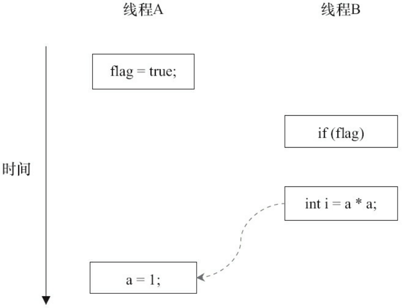
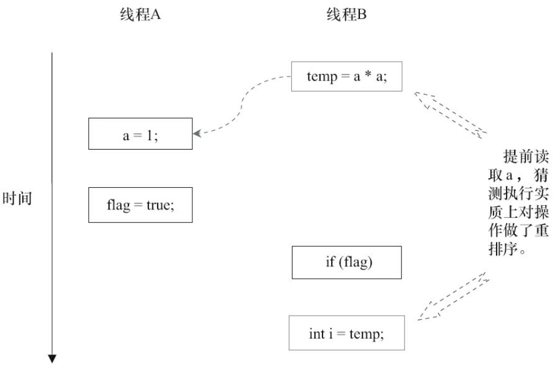
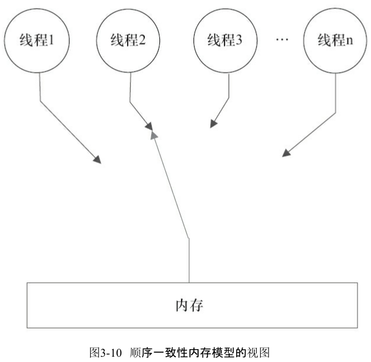
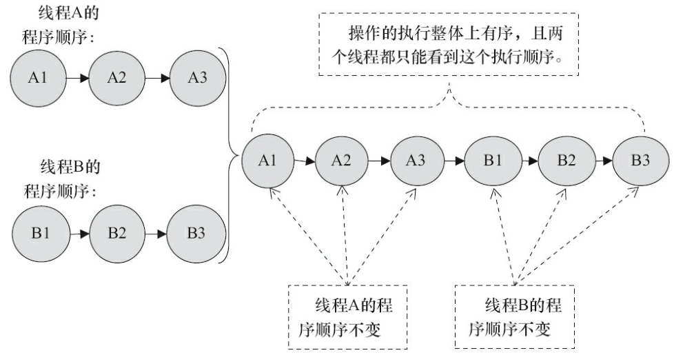
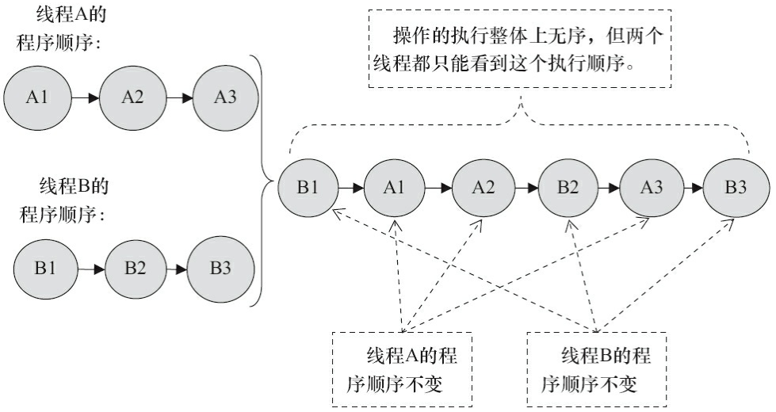
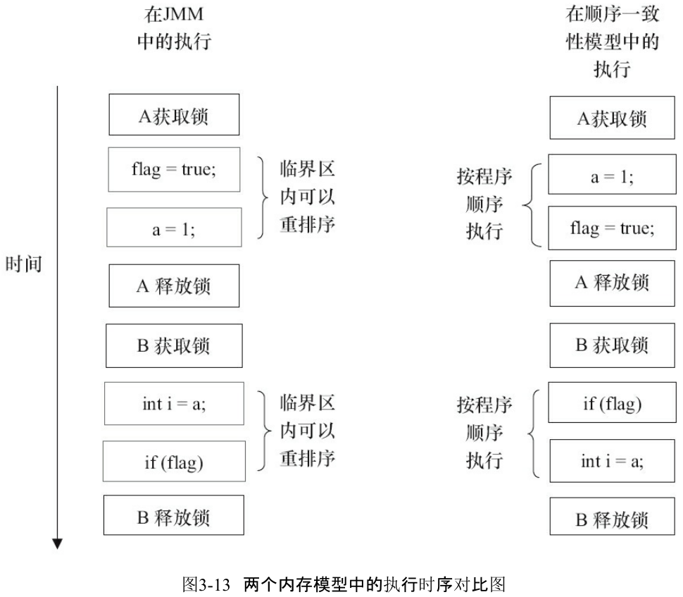

### 第一章

##### 1.1 上下文切换

* 任务从保存到再加载的过程为一次上下文切换。

* 如何减少上下文切换

  * 无锁并发编程
  * CAS算法 Q：CAS是什么？A：比较并交换 Q：怎么减少了上下文切换？
    
    * CAS：需要输入两个数值，一个旧值和一个新值，在操作期间先比较相对于旧值有没有发生变化，如果没有发生变化才交换成新值，否则不交换。
    
      
  * 使用最少线程
  * 协程

##### 1.2 死锁

* 避免死锁的方法
  * 避免一个线程同时获取多个锁
  * 避免一个线程在锁内同时占用多个资源
  * 尝试使用定时锁lock.tryLock(timeout)替代内部锁机制
  * 对于数据库锁，枷锁和解锁必须在一个数据库连接里

### 第二章

##### 2.1 volatile

* 定义：Java编程语言允许线程访问共享变量，为了确保共享变量能被准确和一致地更新，线程应该确保通过排他锁单独获得这个变量。

* 有volatile变量修饰的共享变量在进行写操作时会多一行汇编代码，执行Lock指令。做两件事：
  * 将当前处理器缓存行的数据写回到内存（Lock指令将总线锁住，其他处理器将不能访问）。
  * 写回内存的操作使其他处理器里缓存了该内存地址的数据无效（嗅探机制，发现数据过时）。
  
  当其他处理器对这个数据进行修改操作的时候，会重新从内存中把数据读到处理器缓存中。Q：使用的是总线锁还是缓存锁？
  
* volatile的使用优化
	* LinkedTransferQueue类，使用一个内部类定义队列的头节点和尾节点，将共享变量追加到64字节，避免头节点和尾节点加载到同一个缓存行。原因在于一些处理器的高速缓存行是64个字节，不支持部分填充缓存行，这样头节点和尾节点会填充到同一个缓存行，当头节点被修改时，其他处理器的尾节点也无法访问，影响入队出队效率。Q：所以这个队列是用来干嘛的？
  * 缓存非64字节的处理器或共享变量不会被频繁地写，不用追加到64字节。
  * 在Java 7下可能不会生效，因为它会淘汰或重新排列无用字段，需要使用其他追加字节的方式。Q：那这个类还有什么意义？

##### 2.2 synchronized

* 所谓“重量级锁”。

* 实现同步的基础：Java中每一个对象都可以作为锁，具体表现为：

  * 对于普通同步方法，锁是当前实例对象。

  * 对于静态同步方法，锁是当前类的Class对象。

  * 对于同步代码块，锁是synchronized括号中配置的对象。

* JVM基于进入和退出Monitor对象来实现方法同步和代码块同步，但两者的实现细节不同。
  * 代码块同步使用monitorenter和monitorexit指令实现，方法同步使用另一种方式。

  * monitorenter在编译后插入到同步代码块的开始位置，而monitorexit插入到方法结束和异常位置。

  * monitorenter指令被执行时，将会尝试获取对象所对应的monitor对象，即对象的锁。

* synchronized用的锁存在Java对象头的Mark Word。

* 锁的升级与对比

  * 偏向锁：锁总是由同一线程多次获得，为了让线程获得锁的代价更低而引入偏向锁。

    * 加锁：当一个线程访问同步代码块并获取锁时，会在对象头和栈帧中的锁记录里存储锁偏向的线程id。如果有存储信息，直接获得锁，否则测试对象头Mark Word的偏向锁标识是否为1，如果为1则使用CAS将偏向锁存储为当前线程，否则使用CAS竞争锁。

    * 解锁：当其他线程尝试竞争偏向锁时，持有偏向锁的线程才会释放锁。释放锁时，首先暂停持有偏向锁的线程，如果线程不处于活动状态，将对象头Mark Word设置为无锁状态，否则该线程的栈帧将遍历对象的锁记录，要么重新偏向于其他线程，要么恢复到无锁状态或偏向锁标识设为0，最后唤醒暂停的线程。
    
  * 轻量级锁：
  
      * 加锁：当一个线程访问同步代码块之前，首先在栈帧中创建存储锁记录的空间，将对象头的Mark Word复制到锁记录中。然后尝试使用CAS将对象头的Mark Word替换为指向锁记录的指针。如果成功则获得锁，否则尝试使用自旋来获取锁。Q：自旋是什么？A：自旋即重复执行CAS操作。
  
      * 解锁：释放锁时，使用原子的CAS操作将栈帧中的锁记录替换回对象头的Mark Word。如果成功则释放成功，表明之前没有对该锁对象的竞争发生，否则锁会膨胀为重量级锁（为了避免无用的自旋）。在重量级锁状态下，尝试竞争的线程会被阻塞，当锁被成功释放后才会被唤醒。Q：释放锁还有竞争？还会失败？
      
  * 优缺点对比
  
      |    锁    |                   优点                   |                             缺点                             |              适用场景              |
      | :------: | :--------------------------------------: | :----------------------------------------------------------: | :--------------------------------: |
      |  偏向锁  |        加锁和解锁不需要额外的消耗        | 如果线程之间存在锁竞争，会带来额外的锁撤销的消耗（不竞争就不会释放锁） |       只有一个线程访问同步块       |
      | 轻量级锁 | 竞争的线程不会阻塞，提高了程序的响应速度 |        如果始终得不到锁竞争的线程，使用自旋会消耗CPU         | 追求响应时间，同步块执行速度非常快 |
      | 重量级锁 |     线程竞争不使用自旋，不会消耗CPU      |                    线程阻塞，响应时间缓慢                    |   追求吞吐量，同步块执行速度较慢   |
  
##### 2.3 原子操作

* 处理器使用缓存锁定或总线锁定的方式保证复杂内存操作的原子性。
  * 使用总线锁保证原子性，通过在总线上输出LOCK#信号，阻塞其他处理器的请求。总线锁将导致其他处理器不能对内存进行操作，开销较大。
  * 使用缓存锁保证原子性，内存缓存在处理器的缓存中时，通过使其他处理器放弃已被锁定的缓存行数据，阻塞其他处理器对共享数据的操作。
  * 两种情况不使用缓存锁定：
    * 当操作的数据不能被缓存在处理器内部，或操作的数据跨多个缓存行时，调用总线锁定。
    * 不支持缓存锁定的处理器。
  
* Java通过循环CAS或锁的方式实现原子操作。

  * 循环CAS实现原子操作的三个问题

    * ABA问题：在与旧值比较的时候，如果它从A变化到B再变回A，CAS算法会认为该值没有发生变化。解决方法为在变量前面加上版本号，每次变量更新时版本号加1。类：AtomicStampedReference。

    * 循环时间长开销大：自旋不成功CPU会一直执行。

    * 只能保证一个共享变量的原子操作：解决方法为使用锁或将多个共享变量合并成一个共享变量。类：AtomicReference。

   * JVM实现了多种锁，如偏向锁、轻量级锁和互斥锁。除了偏向锁，其他锁的实现都用到了循环CAS，即当一个线程进入同步块时，使用循环CAS的方式来获取锁，退出同步块时使用循环CAS释放锁。Q：释放锁为什么不会直接成功？
  
### 第三章

##### 3.1 Java内存模型

* 并发编程模型的两个关键问题：线程之间如何通信及线程之间如何同步。
  * 通信指线程之间以何种机制交换信息，通常有两种：
    * 共享内存：线程之间共享程序的公共状态，通过读、写内存中的公共状态进行隐式通信。
    * 消息传递：通过发送消息进行显式通信。
  * 同步指程序中用于控制不同线程间操作发生相对顺序的机制。 
    * 在共享内存模型中，必须显式指定某个方法或某段代码需要在线程之间互斥执行。
    * 在消息传递模型中，由于消息的发送必须在消息的接收之前，因此同步是隐式执行的。
  * Java采用共享内存模型。
* Java内存模型的抽象结构
  *  所有的实例域、静态域和数组元素存储在堆内存中，堆内存在线程之间共享。Q：静态域是什么？
  *  局部变量、方法定义参数和异常处理器参数不会在线程之间共享。
  *  线程之间的共享变量存储在主内存中，每个线程有一个私有的本地内存，本地内存存储了该线程以读写共享变量的副本。本地内存是一个抽象概念，并不真实存在。Q：不真实存在是什么意思？
  *  线程A和线程B通信，必须经历两个步骤：
     *  线程A把本地内存A中更新过的共享变量刷新到主内存中。
     *  线程B到主内存中读取线程A已经更新过的共享变量。


* 从源代码到指令序列的重排序
  * 为了提高性能，编译器和处理器会对指令做重排序，分三种类型：
    * 编译器优化的重排序。
    * 指令级并行的重排序。
    * 内存系统的重排序。
  * 重排序可能会导致多线程程序出现内存可见性问题，Java内存模型通过禁止特定类型的重排序来保证一致的内存可见性。
    * 对于编译器，Java内存模型的编译器重排序规则会禁止特定类型的编译器重排序。
    * 对于处理器，Java内存模型的处理器重排序规则会要求Java编译器生成指令序列时，插入特定类型的内存屏障指令，禁止特定类型的处理器重排序。

* 并发编程模型的分类（可能是指并行执行的线程的读写情况）
  * 常见处理器的重排序规则

    
  
  * Java内存模型的内存屏障类型
  
    
  
    Q：虽然分了4类，但感觉都是保证先执行屏障前的指令？

* happens-before：在Java内存模型中，如果一个操作执行的结果需要对另一个操作可见，那么这两个操作之间必须存在happens-before关系。这两个操作既可以在一个线程中，也可以在不同线程之间。规则如下：
  * 程序顺序规则：一个线程中的每个操作，happens-before于该线程中的任意后续操作。
  * 监视器锁规则：对一个锁的解锁，happens-before于随后对这个锁的加锁。
  * volatile变量规则：对一个volatile域的写，happens-before于任意后续对这个volatile域的读。
  * 传递性：如果A happens-before B，且B happens-before C，则A happens-before C。
  
  两个操作之间具有happens-before关系，并非要求前一个操作必须要在后一个操作之前执行，而是前一个操作的结果对后一个操作可见，且前一个操作按顺序排在第二个操作之前。
  
  * Q：最后这句话的意思是前一个操作的结果排在第二个操作之前？如果有数据依赖那执行顺序必然很重要，但没有数据依赖前一个操作的结果对后一个操作可见又有什么影响呢？

##### 3.2 重排序

- 数据依赖性：如果两个操作访问同一个变量，其中一个为写操作，此时这两个操作之间存在数据依赖性。

- as-if-serial语义：编译器和处理器在重排序时会遵守数据依赖性，但仅针对单个处理器或单个线程中的指令序列。对于没有数据依赖关系的操作，可能发生重排序，如

  ```java
  double pi = 3.14; //A
  double r = 1.0; //B
  double area = pi * r * r; //C 
  ```

  A与C、B与C都存在数据依赖，因此这两个操作不会发生重排序，但A与B没有数据依赖，可能先执行任何一个，这样看起来程序是as-if-serial的。

- 重排序对多线程的影响

  ```java
  class ReorderExample {
  	int a = 0;
  	boolean flag = false;
  	public void writer() {
          a = 1; // 1
          flag = true; // 2
      }
      public void reader() {
          if (flag) { // 3
              int i = a * a; // 4
              ……
      	}
  	}
  }
  ```

  线程B执行`reader()`的操作4时不一定能看到线程A执行`writer()`的操作1。

  1与2、3与4并没有数据依赖性，因此可能发生重排序。

  1与2发生重排序：

  

  2先执行，3、4接着执行，这时会对a进行错误的读操作，因为1还没有被执行。

  3与4发生重排序：

  

  通过猜测执行克服控制依赖，先执行3，后续2执行后再执行4，将3的结果存入局部变量i。但这种情况下先执行3就会对a进行错误的读操作，因为1还没有被执行。

  这两种情况说明重排序会破坏多线程程序的语义。

##### 3.3 顺序一致性

- 顺序一致性内存模型

  两个特性：

  - 一个线程中的所有操作必须按照程序的顺序来执行。
  - 所有线程都只能看到一个单一的操作执行顺序，每个操作都必须原子执行并且立刻对所有线程可见。
  
  
  
  如果两个线程采用同步，那么执行顺序可能是：
  
  
  
  如果两个线程不采用同步，那么执行顺序可能是：
  
  

- 同步程序的顺序一致性效果

  JMM对正确同步的多线程程序的内存一致性做了如下保证。

  如果程序是正确同步的，程序的执行将具有顺序一致性（Sequentially Consistent）——即程
  序的执行结果与该程序在顺序一致性内存模型中的执行结果相同。

  ```java
  class SynchronizedExample {
      int a = 0;
      boolean flag = false;
      public synchronized void writer() { // 获取锁
          a = 1;
          flag = true;
      } // 释放锁
      public synchronized void reader() { // 获取锁
          if (flag) {
              int i = a;
              ……
          } // 释放锁
      }
  }
  ```

  假设A线程执行writer方法，B线程执行reader方法。

  

  顺序一致性模型中，所有操作完全按程序的顺序串行执行。而在JMM中，临界区内的代码可以重排序。虽然

  线程A在临界区内做了重排序，但由于监视器互斥执行的特性，这里的线程B根本无法“观察”到线程A在临界区

  内的重排序。这种重排序既提高了执行效率，又没有改变程序的执行结果。

- 未同步程序的执行特性

  对于未同步或未正确同步的多线程程序，JMM只提供最小安全性：线程执行时读取到的值，要么是之前某个线

  程写入的值，要么是默认值（0，Null，False），JMM保证线程读操作读取到的值不会无中生有（Out Of 

  Thin Air）的冒出来。

  未同步多线程程序在JMM中执行时，整体上是无序的，其执行结果无法预知。未同步程序在两个模型中的执行

  特性有如下几个差异。

  - 顺序一致性模型保证单线程内的操作会按程序的顺序执行，而JMM不保证单线程内的操作会按程序的顺序

    执行（重排序）。

  - 顺序一致性模型保证所有线程只能看到一致的操作执行顺序，而JMM不保证所有线程能看到一致的操作执

    行顺序。

  - JMM不保证对64位的long型和double型变量的写操作具有原子性，而顺序一致性模型保证对所有的内存

    读/写操作都具有原子性。