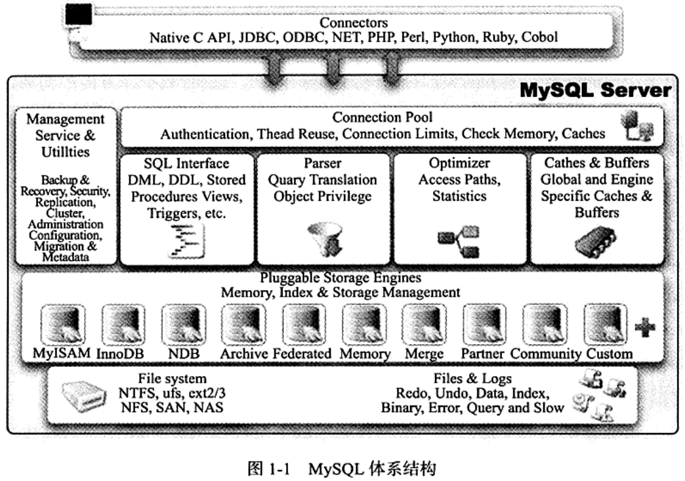
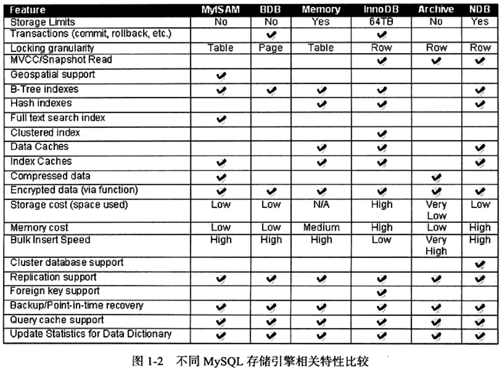
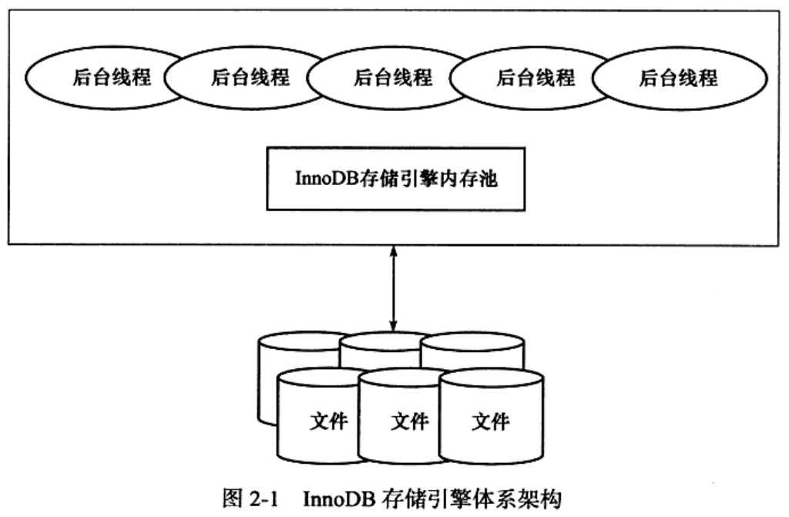
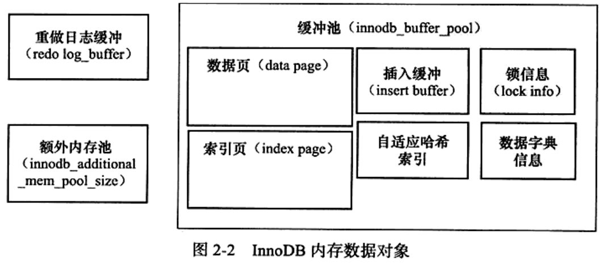

#### 第一章 MySQL体系结构和存储引擎

##### 1.2 MySQL体系结构

组成部分：连接池、管理服务和工具、sql接口、查询分析器、优化器、缓存、插件式存储引擎、物理文件。

##### 1.3 存储引擎对比

#### 第二章 innoDB存储引擎

##### 2.3 innoDB体系架构

- 后台线程：

  - master thread：负责将缓冲区的数据异步刷新到磁盘，保证数据一致性，包括脏页的刷新、合并插入缓冲、undo页的回收等。
  - IO thread：负责IO请求的回调。
  - purge thread：负责回收已经使用并分配的undo页，减轻master thread的工作。

- 内存池：

  - 缓冲池：在数据库中读取页的操作，首先将从磁盘读到的页存放在缓冲池中。下一次再读相同的页时，首先判断该页是否在缓冲区中。若在则直接读取，否则读取磁盘上的页。在数据库中页的修改操作，首先修改在缓冲区中的页，然后再以一定的频率刷新到磁盘上。

    

  - LRU List、Free List、和Flush List

    - 缓冲池通过LRU算法管理，最频繁使用的页在LRU列表前端，最少使用的页在LRU列表末尾，缓冲区不能存放新读取到的页时，先释放LRU列表末尾的页。

      innoDB的LRU算法做的改动为，新插入的页在列表的5/8位置，而不是列表头部，在等待一段时间后才会被加入头部。这是因为某些扫描操作需要访问表中的许多页，但这些页仅在本次查询中需要，直接放入列表头部就会将一直处于热点的数据清除出缓冲区。

    - Free List管理空闲页。
    - LRU List中的页被修改后，称为脏页。Flush List管理脏页。

  - 重做日志缓冲

    首先将重做日志信息放入到该缓冲区，然后按一定频率将其刷新到重做日志文件。

    - master thread每一秒刷新一次。
    - 每个事务提交时刷新一次。
    - 缓冲剩余空间不足1/2时刷新一次。

  - 额外的内存池

    对一些数据结构本身的内存进行分配时，需要从额外的内存池进行申请。

##### 2.4 checkpoint技术

- 目的：
  - 缩短数据库的恢复时间。
  - 缓冲池不够用时，将脏页刷新到磁盘。
  - 重做日志不可用时，刷新脏页。
- 分类：
  - sharp checkpoint：数据库关闭时，将所有脏页刷新到磁盘。
  - fuzzy checkpoint：只刷新一部分脏页。
    - master thread checkpoint：每秒或每十秒从缓冲池的脏页列表中以异步方式刷新一定比例的页回磁盘。
    - flush_lru_list checkpoint：当LRU列表中的空闲页数目不足100，尾部的页是需要被移除的，如果它脏页，需要进行checkpoint刷新回磁盘。
    - async/sync flush checkpoint：当重做日志文件不可用时，需要强制将一些脏页刷新回磁盘。
    - dirty page too much checkpoint：脏页数目太多。