### 第一章 网络基础知识

#### 1.5 OSI参考模型

- OSI参考模型（open systems interconnection）

  

  

表示层起类似于将本地的字符编码转换为网络传输使用的字符编码的作用。

会话层决定何时建立连接，并不实际建立连接，这是传输层的作用。

#### 1.6 七层通信

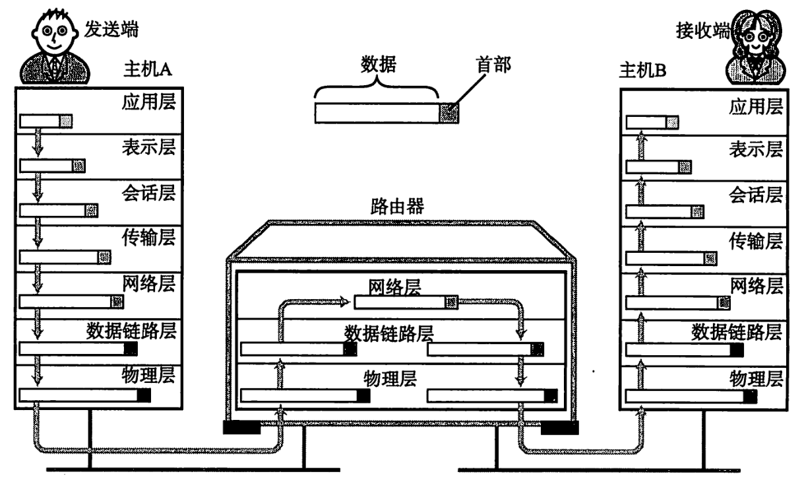

发送方从第七层到第一层传输数据，在每一层附上当前层的协议所必须的首部。接收方从第一层到第七层传输数据，在每一层将首部与内容分离。

应用层写入特定应用的数据、表示层格式化编码、会话层标记发送顺序。

传输层真正地进行建立或断开连接并保证数据可靠传输、网络层负责在通信线路中找到目标主机、数据链路层负责在通过传输介质互连的设备之间进行数据处理、物理层将二进制数据转换为电压和脉冲光传输给物理介质。

物理层的地址为MAC（Media Access Control，介质访问控制）地址/硬件地址。

#### 1.7 传输方式的分类

- 面向有连接和面向无连接

  前者需要双方建立连接，而后者不需要，发送端可以在任何时刻自由发送数据，接收方需要自行确认是否收到数据。

  - 连接是指进行通信的两个应用程序为了传输信息而专用的虚拟通信线路。

- 电路交换与分组交换

  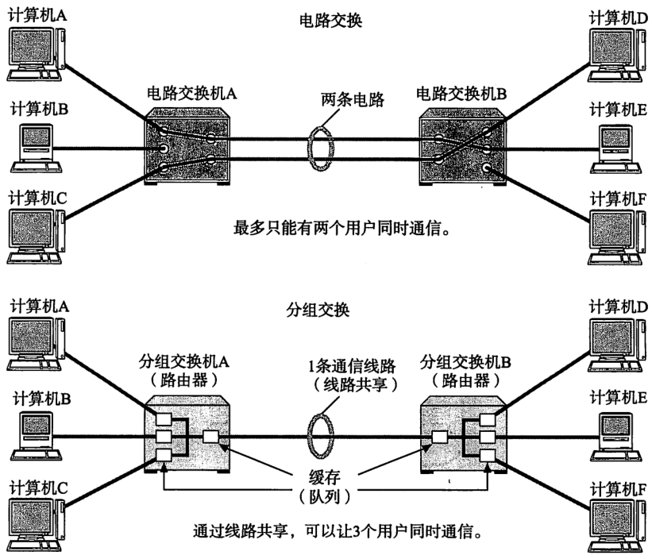

  前者是两台计算机独占一条线路，接在这条线路上的其他计算机想要通信只能等待。

  后者是将数据分组发送，数据被排好序，且带有目的地址，因此多台计算机可以使用一条线路通信。

  分组交换的大致处理过程是：发送端将数据分组发送给路由器，路由器收到这些分组数据后，缓存到自己的缓存区，例如一个队列，然后再转发给目标端。

- 根据接收端数量分类

  单播（unicast）：1对1通信，如电话。

  广播（broadcast）：1对多通信，如电视。

  多播（multicast）：类似广播，但是指定一组主机接收，如网络会议。

  任播（anycast）：在特定的多台主机中选择一台接收，如DNS根域名解析服务器。

#### 1.8 地址

计算机网络通信时，每一层协议使用的地址都不同，如TCP/IP通信使用MAC地址、IP地址和端口号，应用层中可以将邮件地址作为通信地址。

- 地址的唯一性

- 地址的层次性

  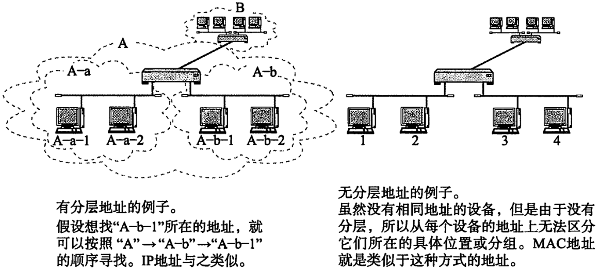

  MAC地址由设备的制造厂商针对每块网卡分别指定。它虽然有制造商识别号、产品编号、通用编号等具有一定层次性的信息，但对于寻址没有帮助。

  IP地址由网络号和主机号两部分组成。网络号相同的主机在组织结构、提供商类型和地域分布上比较集中，方便用于寻址。

#### 1.9 网络的构成要素

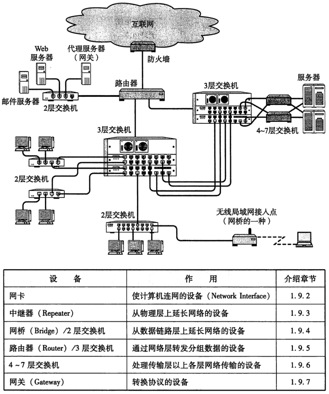

- 中继器位于**物理层**，用于在两条传输媒介之间放大信号。集线器可以看作多口中继器。

- 网桥位于**数据链路层**，能够识别数据链路中的数据帧，并将这些帧临时存储起来，重新生成一个全新的帧转发给相邻的另一个网段（LAN）。

  由于存储功能，可以连接不同速率的数据链路，并且不限制连接网段的个数。

  还具有**MAC地址**自学机制，判断是否需要转发数据帧。

- 路由器位于**网络层**，根据**IP地址**，转发分组数据到目标地址。

- 4~7层交换机，如负载均衡，带宽控制，防火墙等。

- 网关负责将传输层到应用层的数据进行**转换**和转发。转换是指两端使用的协议不同，需要网关进行协议的转换，如互联网邮件与手机邮件。

### 第二章 TCP/IP基础知识

#### 2.4 TCP/IP协议分层模型

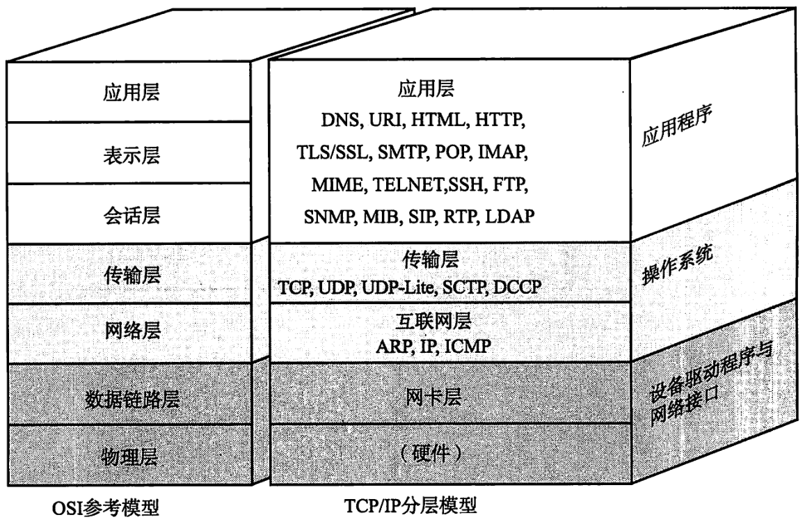

- 硬件（物理层）：以太网、电话线等物理层的设备。
- 网络接口层（数据链路层）：利用以太网中的数据链路层进行通信，可以认为是网卡的驱动程序。
- 互联网层（网络层）：基于IP地址转发分包数据。
  - IP：跨网络传送数据，使整个互联网都能收到数据的协议。
  - ICMP：IP数据包发送失败时，ICMP负责给发送端发送一个异常通知。
  - ARP：从分组数据包的IP地址中解析MAC地址的协议。
- 传输层：实现两台主机的通信，建立连接。
  - TCP：面向有连接的协议，可以保证两台主机的通信可达。
  - UDP：面向无连接的协议，不保证对方一定收到数据。
- 应用层（会话层以上的层）：需要同时实现OSI模型中会话层和表示层的功能。
  - Web：HTTP协议属于应用层，而HTML属于表示层。
  - E-mail：SMTP（simple mail transfer protocol）协议。数据格式协议MIME属于表示层。
  - 文件传输：FTP协议。
- 远程登陆：TELNET（teletypewriter network）和SSH（secure shell）协议。
  - 网络管理：SNMP（simple network management protocol）协议属于应用层，MIB（management information base）协议属于表示层。

#### 2.5 TCP/IP通信

- 一个邮件应用的发送过程

  - 应用程序处理：填好所需内容后点击发送，应用程序会做一些处理，如编码等，然后开始TCP/IP通信。

  - TCP模块的处理：TCP负责建立连接，发送数据以及断开连接。发送前会在应用层数据前端附加一个TCP首部，包括源端口号和目标端口号（识别应用）、序号（识别哪部分是数据）、校验和（检验数据是否损坏）。

  - IP模块的处理：IP在TCP数据前附加一个IP首部，包含接收端和发送端的IP地址等。然后参考路由控制表决定接受此IP包的路由或主机。此时可以利用ARP查找接收端的MAC地址。

  - 网络接口的处理：给IP数据附加以太网首部并发送。以太网首部包含接收端MAC地址、发送端MAC地址以及标志以太网类型的协议。接着通过物理层传输给接收端。

    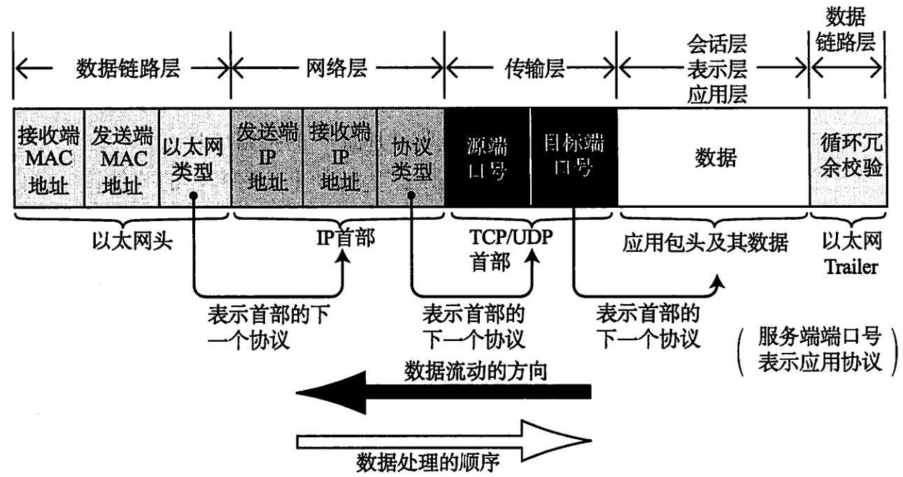

- 接收过程
  - 网络接口的处理：收到包后，首先根据接收端MAC地址判断是否为发给自己的包。如果不是则丢弃掉，否则就从以太网类型判断数据类型，IP包则丢给处理IP的程序，ARP包则丢给处理ARP的程序。如果无法识别协议类型，则丢弃掉。
  - IP模块的处理：类似的处理，判断接收端IP地址、判断协议类型。如果是路由器接收到的包，则会根据路由控制表将IP包转发给正确的终端。
  - TCP模块的处理：首先计算校验和，判断数据是否损坏。然后检查是否按照序号接收数据。最后检查端口号，确定具体的应用程序。接收完毕后向发送端发送一个确认回执的信息。
  - 应用程序的处理：应用程序解析接收到的数据，判断收件人地址，如果主机上有收件人的邮件信箱，并保存到本地成功，则此次通信结束（这有点像最古老的邮件系统，现在的邮件都是保存在邮件提供商的服务器中）。

### 第三章 数据链路层

#### 3.1 数据链路的作用

- 数据链路层的协议定义了通过通信媒介互连的设备之间传输的规范。
- **数据链路可以看作网络传输的最小单位，如以太网、FDDI、ATM、WLAN、蓝牙等，即在互连同一种数据链路的节点之间进行包传递**。

#### 3.2 数据链路相关技术

- MAC地址

  **MAC地址用于识别同一个数据链路中互连的节点**。IEEE802.3规范的MAC地址格式：

  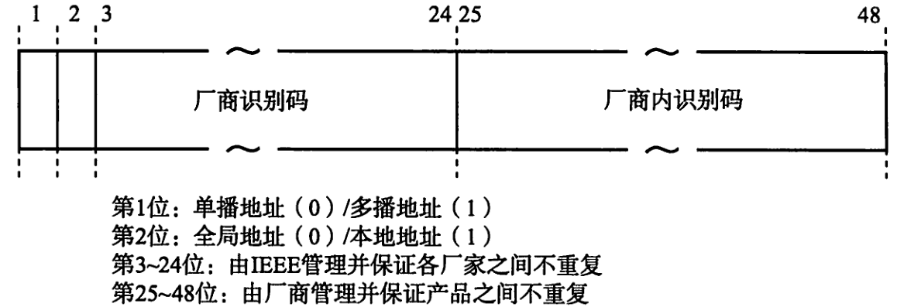

- 共享介质网络

  指由多个设备共享一个通信介质的一种网络，如早期的以太网和FDDI。基本上为半双工，有两种介质访问控制方式：

  - 争用方式：网络中的节点争夺数据传输的权力，先到先得方式占用信道。
  - 令牌传递方式：沿着令牌环传递一种叫做“令牌”的特殊报文，只有获得令牌的节点才能发送数据。

- 非共享介质网络

  指不共享介质，对介质采取专用的一种传输控制方式，如ATM和以太网。网络中的节点直连交换机，由交换机负责转发数据帧，可以做到全双工。

- 根据MAC地址进行转发

  以太网交换机就是持有多个端口（接口）的网桥。他们根据数据链路层中每个帧的目标MAC地址，决定从哪个网络接口发送数据，这时所参考的、用以记录发送接口的表叫做转发表，它可以通过自学得到。

  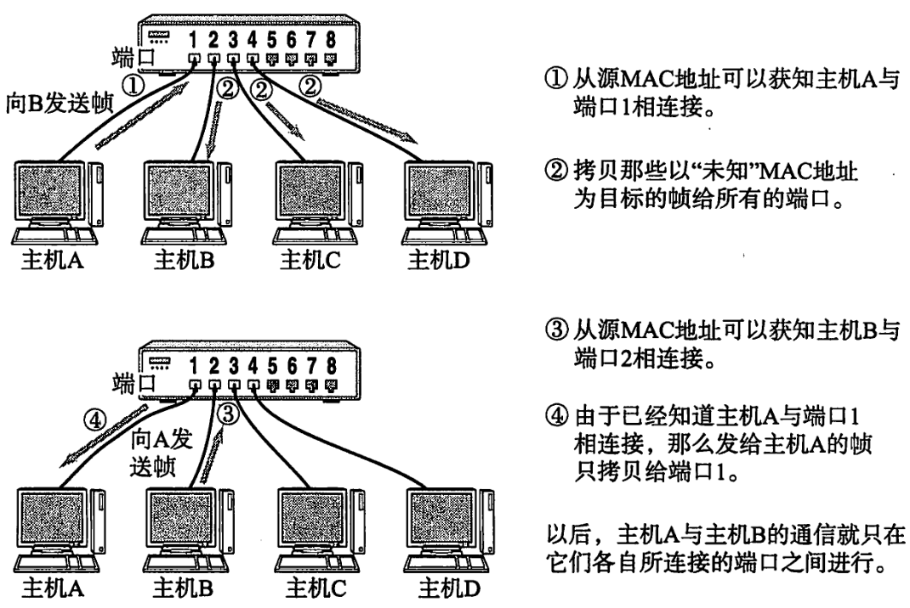

- 环路检测技术

  - 生成树：每个网桥必须在每1-10秒内相互交换BPDU（bridge protocol data unit）包，判断哪些端口使用哪些不使用，以消除环路。

    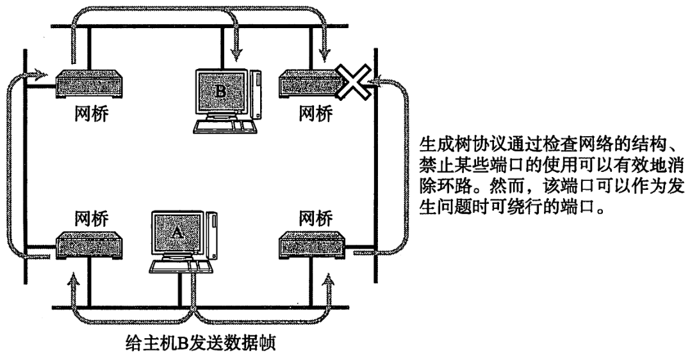

  - 源路由：判断发送数据的源地址是通过哪个网桥实现传输的，并将帧写入RIF（routing information field）。网桥根据这个信息发送帧给目标地址，而不会在环中反复转发。

- VLAN

  交换机按照其端口划分多个网段，通常情况下异构的两个网段之间需要具有路由功能的交换机或路由器实现通信。而带有VLAN技术的交换机则不必重新修改布线，它通过给每个网段分配一个VLAN ID，数据传输时在以太网首部中加入这个VID，交换机根据它决定将数据帧发送给哪个网段。

#### 3.3 以太网

- 以太网连接形式

  初期采用多台终端使用同一根同轴电缆的共享介质型连接方式。

  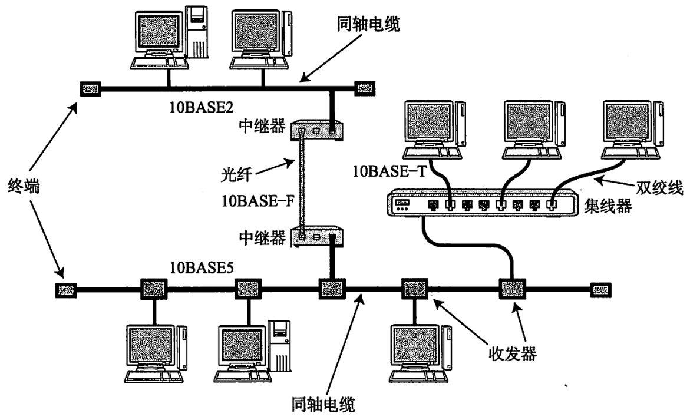

  如今采用终端与交换机之间独占电缆的连接方式。

  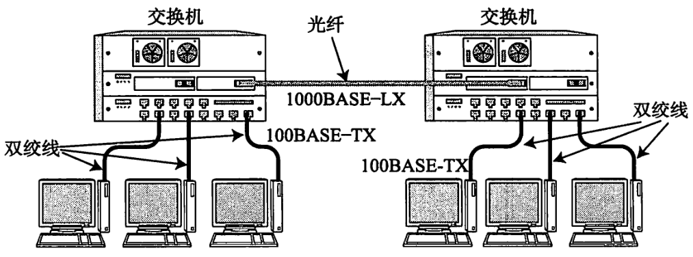

- 以太网种类

  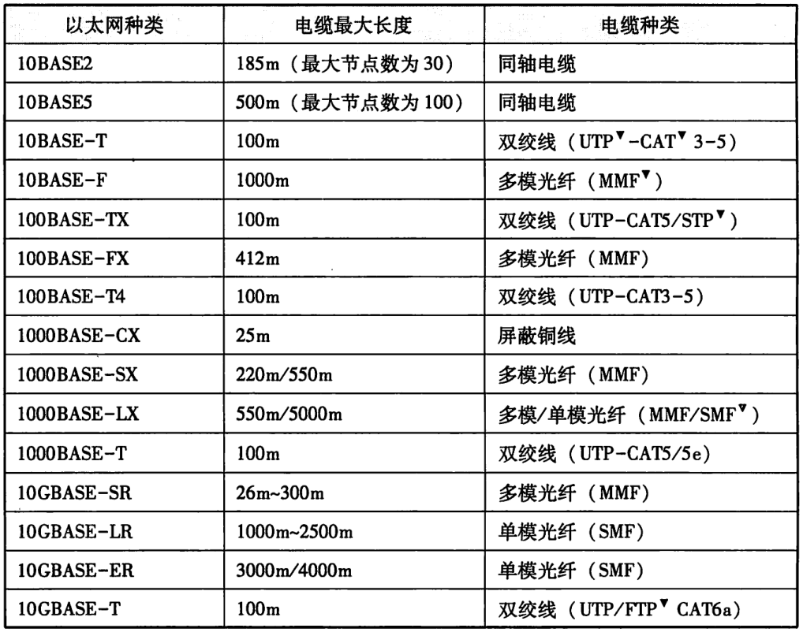

  前边表示传输速率，后边表示传输介质

- 以太网帧格式

  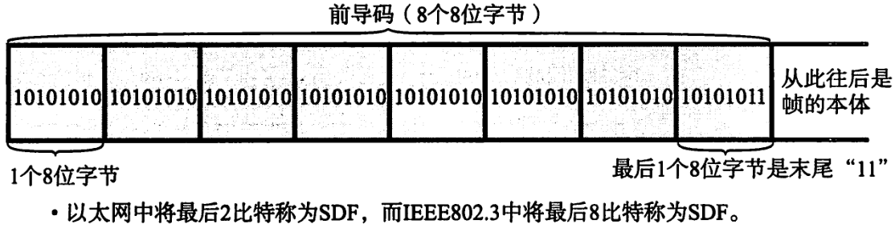

  前端为一个8个字节的前导码，表示一个以太帧的开始，也是对端网卡确保能与其同步的标志。

  

  帧本体前端是14字节的以太网首部，包含6个字节的目标MAC地址、6个字节的源MAC地址以及2个字节的上层协议类型。

  帧本体数据容纳的最大数据范围是46~1500字节。

  帧尾为4字节的FCS（frame check sequence，帧检验序列），用于检测帧是否损坏。保存整个帧除以生成多项式的余数，接收端进行同样的计算，与FCS进行比较。

  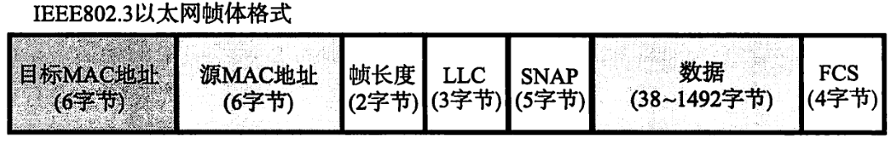

  LLC：logical link control，逻辑链路控制层。

  协议类型出现在SNAP中。

#### 3.4 无线通信

- 无线通信的种类

  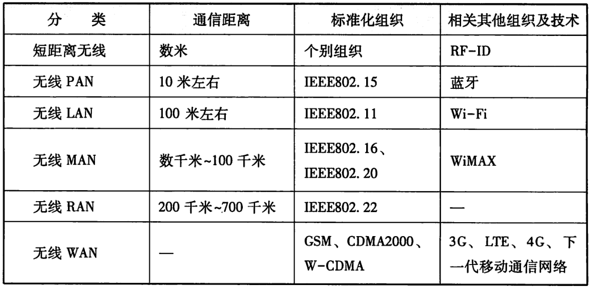

- IEEE 802.11

  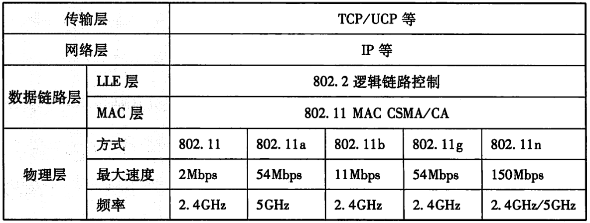

  wi-fi：wireless fidelity，高质量WLAN。

- 蓝牙

  使用2.4GHz，通信距离有1m、10m、100m三种类型，通信终端最多允许8台设备。

- WiMAX（worldwide interoperability for microware access）

  使用微波在企业或家庭实现无线通信的一种方式，支持城域网范围。

- ZigBee

  主要应用于各领域的远程控制，是一种短距离、低功耗的无线通信技术。

#### 3.5 PPP

- 定义

  point-to-point protocol，点对点，1对1连接计算机的协议。它属于纯粹的数据链路层，而以太网与物理层也有关，可以选择不同类型的传输电缆。

  PPP需要物理层支持，可以使用电话线、ISDN、专线、ATM线路。近些年更多用ADSL或有线电视通过PPPoE实现互联网接入（应该过时了吧）。

- LCP与NCP

  LCP（link control protocol）协议不依赖上层协议，主要负责建立和断开连接，设置最大接收单元，设置验证协议以及设置是否进行通信质量的监控。

  NCP（network control protocol）协议依赖上层协议，如使用IP协议，称为IPCP。IPCP负责IP地址设置以及是否进行TCP/IP首部压缩等。

  建立连接时需要进行验证，验证协议有PAP（password authentication protocol）和CHAP（challenge handshake authentication protocol）。前者使用明文密码，后者使用一次性密码。

- PPP的帧格式

  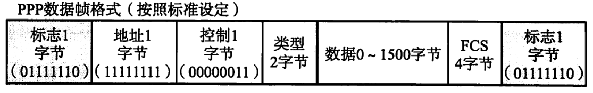

- PPPoE（PPP over Ethernet）

  通过以太网作为通信线路提供PPP功能。

  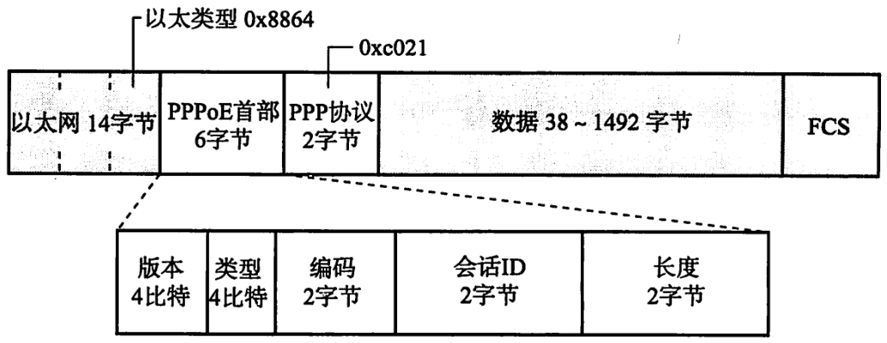

#### 3.6 其他数据链路

- ATM（asynchronous transfer mode）

  以一个叫做信元（5字节首部和48字节数据）的单位进行传输的数据链路，面向连接，并且没有发送权限的限制。

  信元的数据量太小，因此一般使用AAL（ATM adapter layer）。将TCP数据分为信元再传输。

  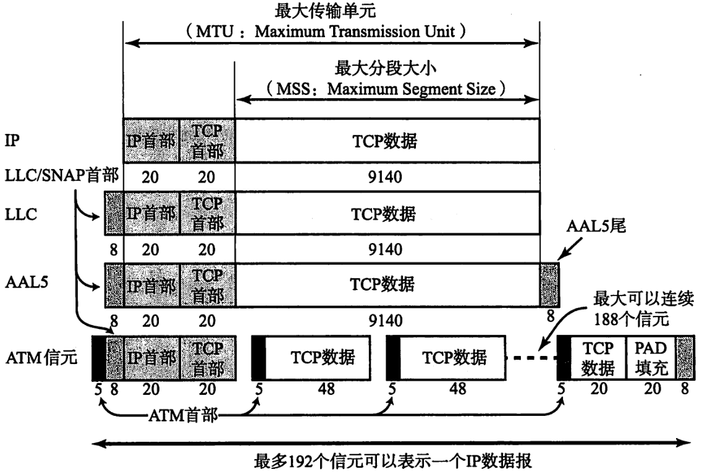

  缺陷：丢失一个信元就要重发整个数据。

- POS（packet over SDH/SONET）是一种在SDH上进行包通信的协议。SDH（synchronous digital hierarchy，同步数字体系）是在光纤上传输数字信号的物理层规范。
- FDDI（fiber distributed data interface），分布式光纤数据接口，采用令牌环的访问方式。

等等。

#### 3.7 公共网络

- 模拟电话线路

  利用固定电话进行通信，即拨号连接，需要调制解调器将数字信号转换为模拟信号。

- 移动通信服务

  运营商网络。

- ADSL（asymmetric digital subscriber line）

  对模拟电话线路的扩展，加快从话机到电信局之间的传输速度。

- FTTH（fiber to the home）

  光纤入户。

- 有线电视

  通过有线电视空闲的频道传输互联网数据。

- 专线

  对特定服务提供专门线路，进行一对一连接。

- VPN

  虚拟专用网络，用于连接距离较远的地域。包括IP-VPN，广域以太网。

  - IP-VPN指在IP网（互联网）上建立VPN。通过MPLS（multiprotocol label switching）在IP包中附加一个标签进行传输控制。

    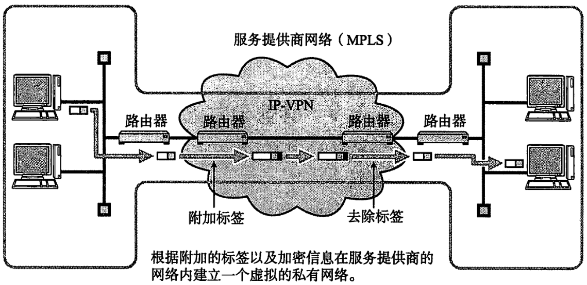

  - 广域以太网指在数据链路层的以太网上利用VLAN实现VPN。

- 公共WLAN
- 其他公共无线服务：X.25、帧中继、ISDN。

### 第四章 网络层/IP协议

#### 4.1 网络层的作用

- **IP协议属于网络层，网络层的主要作用是地址管理、路由选择等，实现跨数据链路的通信**。

  精确的定义下，主机：配有IP地址，但是不进行路由控制。路由器：既配有IP地址，又进行路由控制。它们在网络中统称节点。

  但一般把配有IP地址的设备都叫做主机。

- 网络层与数据链路层的关系

  **数据链路层只能负责互连的一个局域网内（通信区间）的通信。网络层负责指定数据包在整个互联网上的目的地址，不管中间到底经历了什么类型的局域网。**

  **数据链路层就像车票，网络层就像行程表。信息的传输需要车票一站一站地前进，但是也需要行程表指引信息购买什么车票，怎么走。**

#### 4.2 IP的主要功能

IP主要有三个功能：IP地址、路由控制、IP分包与组包。

- IP地址属于网络层地址

  用于在连接到网络中的所有主机中识别出进行通信的目标地址。

  不论一台主机与哪种数据链路连接，其IP地址的形式保持不变。

- 路由控制是将分组数据发送到最终目标地址的功能。

  路由器或主机在转发IP数据包时只指定下一个路由器或主机，而不是将到达最终目标地址的所有通路全部指定出来。

  为了将数据包发给目标主机，所有主机都维护着一张路由控制表，它记录IP与IP之间的映射关系。

  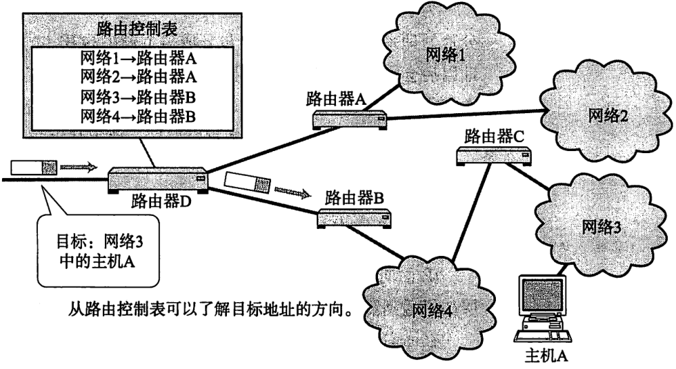

- 数据链路的抽象化

  不同数据链路的最大传输单位不同，如以太网为1500字节、FDDI为4352字节等。因此IP进行分片处理，将大的IP包分成多个小的IP包，到达目标端后再组合起来传送上一层。这样上一层无需关注数据链路层的传输过程，只需要按照给定的IP包长度接收数据包即可。

- 面向无连接型

  即发包之前不需要建立连接。这样做是为了简化和提速，需要有连接时可以委托上一层提供（解耦）。

#### 4.3 IP地址

- IPv4使用32位正整数表示，因此容量约为43亿。

- IP地址由网络标识和主机标识两部分标识组成。网络标识在数据链路的每个段配置不同的值，相同段内连接的主机必须有相同的网络地址，不同的主机地址。

  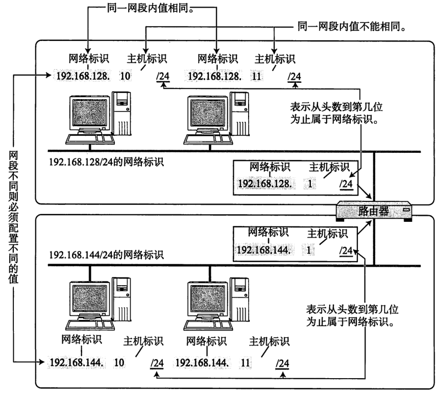

  网络标识用于路由器进行路由。

- IP地址分为A、B、C、D四个级别，根据IP地址中从第1位到第4位的比特列对其网络标识和主机标识进行区分。

  - A类：首位为0的地址，第2位到第8位是网络标识，后24位为主机标识，即**0**.0.0.0~**127**.255.255.255。
  - B类：前两位为10的地址，第3位到第16位是网络标识，后16位为主机标识，即**128.0**.0.0~**191.255**.255.255。
  - C类：前三位为110的地址，第4位到第24位是网络标识，后8位为主机标识，即**192.0.0**.0~**223.255.255**.255。
  - D类：前四位为1110的地址，从第5位到第32位是网络标识，没有主机标识，即**224.0.0.0**~**239.255.255.255**，常用于多播。

  分配主机地址时，全为0表示对应的网络地址或IP地址不可知，全为1表示广播。

  广播地址：用于给同一个链路中所有的主机发送数据包。将主机地址全部设置为1即为该网段的广播地址。有本地广播（当前网段内）和直接广播（跨网段）两种。

  IP多播：广播会给所有主机发送数据， 由主机判断是否接收，这样造成不必要的流量，而且广播无法穿透路由，需要另外的机制实现。多播既可以穿透路由，又可以只给必要的主机发送数据。

  多播使用D类地址，224.0.0.0~224.0.0.255的范围不需要路由控制，这个范围以外会给全网所有组内成员发送多播的包。

  （没有讲清楚到底怎么做到只给必要的主机发送。）

- 子网掩码，标记IP地址的分类，1表示网络地址的比特范围，0表示主机地址的比特范围。

  A类即为**255**.0.0.0，B类即为**255.255**.0.0，C类为**255.255.255**.0。

  但它并不是仅仅为了给上面已有的分类做个标记，而是如它的名字一样用于划分子网。对于A类和B类地址，一个网络段（数据链路）下面就连接着1600万和65534台主机，这种网络结构基本上不存在。

  因此子网掩码可以将网络地址划分为更细的粒度，如将一个B类地址扩大10位网络标识，即前26位划分为网络地址，仅用后6位作为主机地址，适用于更小的局域网范围（62台主机）。

  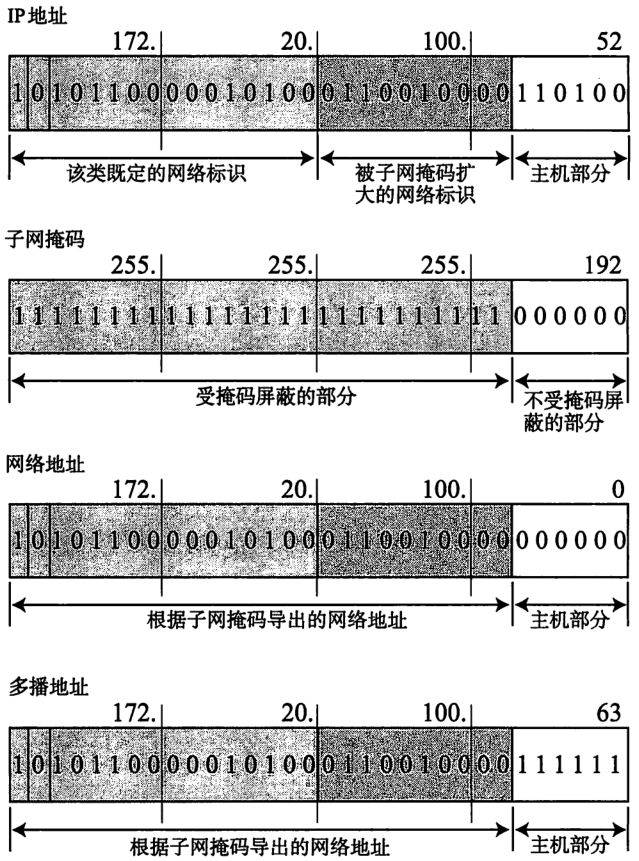

  - CIDR（classless inter-domain routing），无类型域间选路（子网掩码的应用）。

    采用任意长度分割IP地址的网络标识和主机标识。例如将多个C类地址划分为一个较大的网络，通过路由集中降低了路由器的负担。

    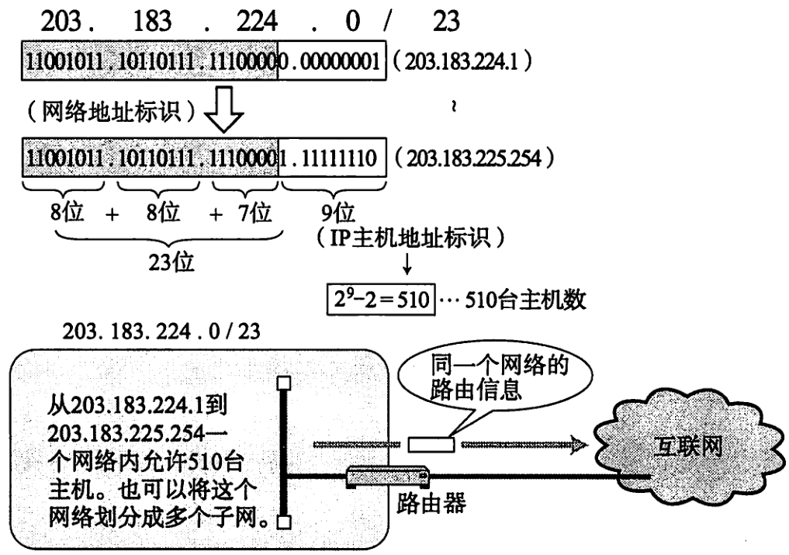

  - VLSM（variable length subnet mask），可变长子网掩码。

    因为CIDR中只能采用固定长度的子网掩码，这样不同网段下的主机数量差别较大时，仍然存在IP地址浪费。VLSM可以灵活修改子网掩码的长度。

- 全局地址与私有地址（公网和内网）

  不要求为每一台主机分配一个固定的IP地址，而是在必要的时候（接入互联网）为相应数量的设备分配唯一的IP地址。

  但独立网络也不能随意设置IP，因此私有网络的IP地址范围规定为：

  A类：10.0.0.0~10.255.255.255（10/8）。

  B类：172.16.0.0~172.31.255.255（172.16/12）。

  C类：192.168.0.0~192.168.255.255（192.168/16）。

  这样可以为每个终端配置私有IP，而在路由器或必要的服务器上配置全局IP。通过私有IP结合NAT技术，实现配备私有IP的地址主机与互联网通信。

  优点是一定程度上解决了IP地址分配问题，缺点是对于需要在数据首部附加IP地址和端口的应用，直接使用内网IP无法通信。

  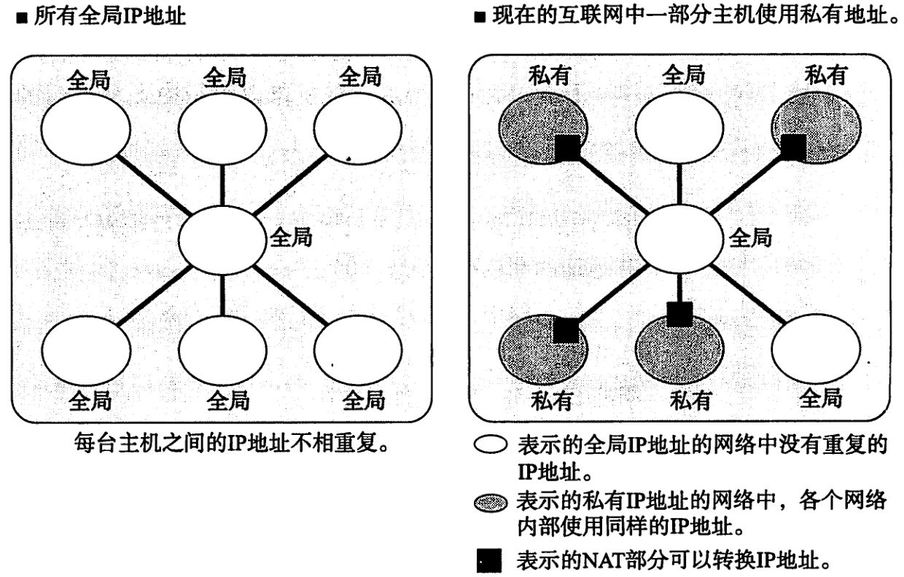

#### 4.4 路由控制

- IP地址的网络地址部分用于进行路由控制。路由控制表中记录着网络地址与下一步应该发送至路由器的地址。

  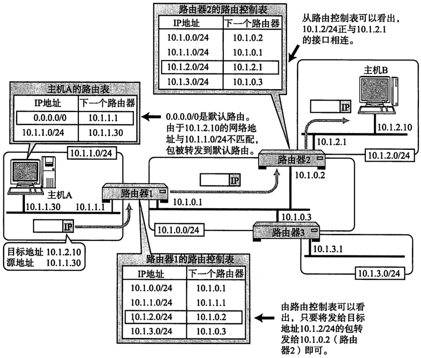

  发送IP包时，首先确定IP包首部中的目标地址，再从路由控制表中找出与该地址相同的记录，根据记录将IP包转发给下一个路由器。如果存在多条相同的记录，那就选择一个最匹配（相同位数最多）的地址，如172.20.100.52与172.20/16和172.20.100/24都匹配，选择后者。

  - 默认路由是指路由表中任何一个地址都能与之匹配的记录。一般标记为0.0.0.0/0或default。
  - 主机路由标记为”IP地址/32“，它的意思是整个IP地址的所有位都参与路由，意味着通过网卡上配置的IP地址本身进行路由，而不是网络地址。
  - 环回地址是同一台计算机上的程序之间进行网络通信时所使用的一个默认地址，即127.0.0.1，也可以用主机名localhost表示。使用这个地址时，数据包不会传向网络。

- 路由汇总利用网络地址的比特分布进行分层配置，有效地减少路由表的条目。

  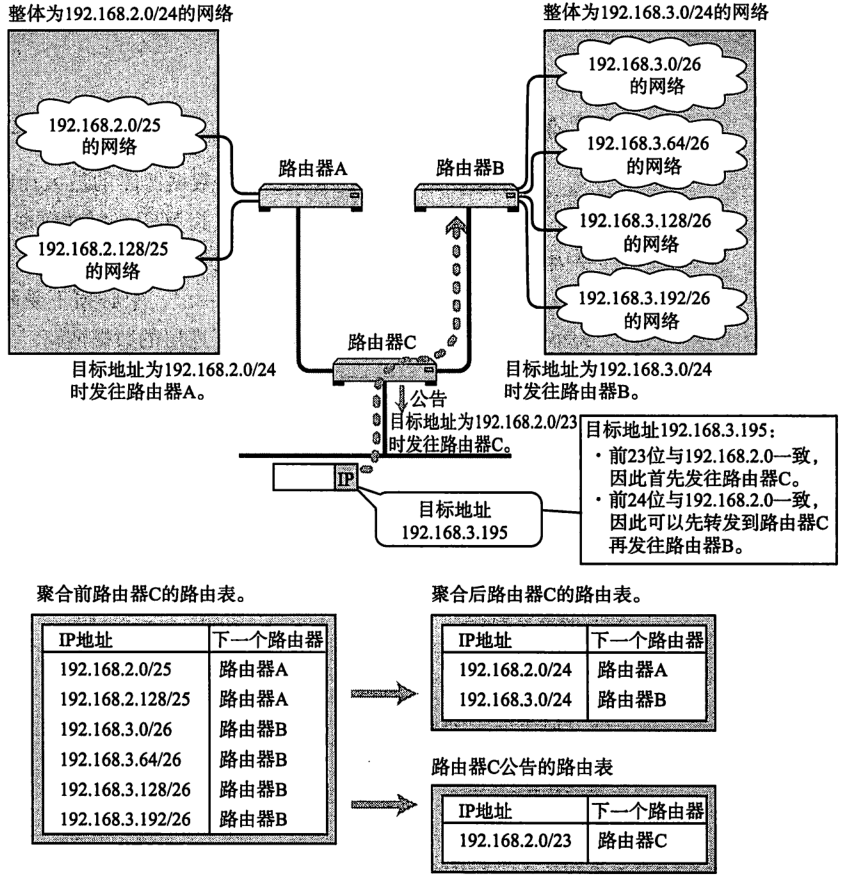

#### 4.5 IP分包与组包

- 路由器进行分片处理，而重组只能由主机进行。这是因为无法保证所有分片都会经由一条路径传输，而且在中途重组到下一站可能还会被拆分，分片还可能会丢失，这些原因导致路由器不进行重组。

  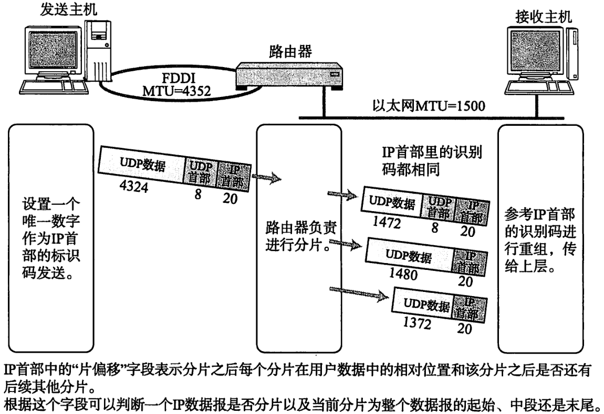

  - 路径MTU发现

    针对分片机制的不足，即路由器负荷加重，希望路由器完成更多功能，分片一旦丢失IP数据就作废等，路径MTU发现由发送主机按照路径MTU的大小提前将IP包分片后发送，避免在中途路由器上进行分片处理。路径MTU就是指从发送端到接收端之间不再需要分片时的最大MTU大小。

    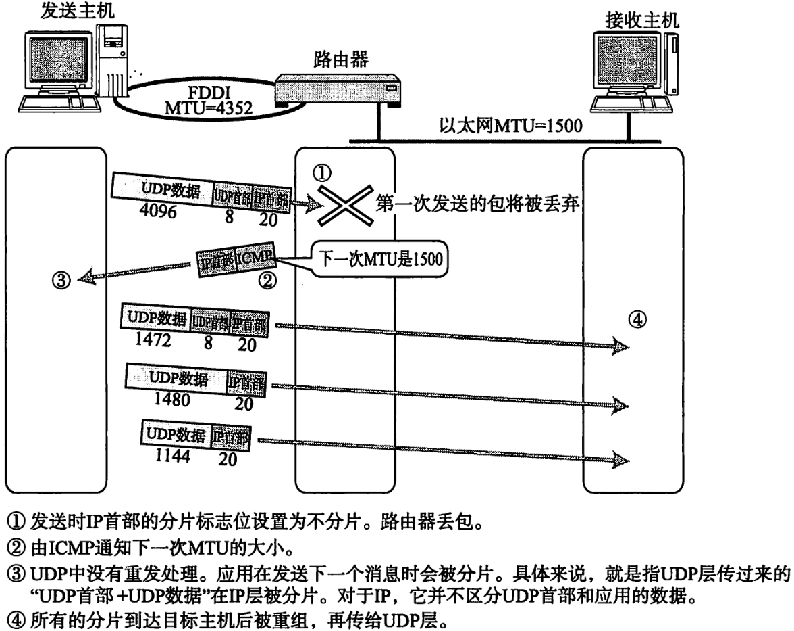

    发送端根据ICMP通知的MTU大小对数据进行分片处理后发送，会反复进行该过程，直到没有再收到任何ICMP，就认为最后一次通知的MTU为路径MTU，使用它进行分片。

    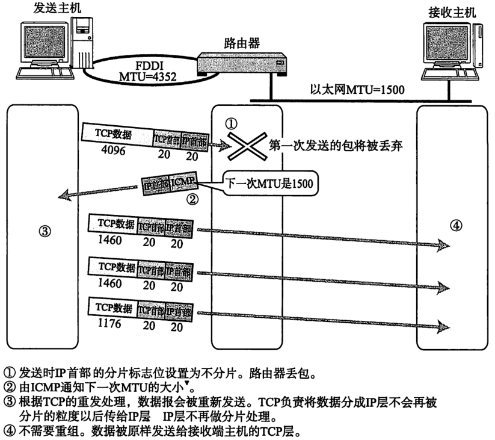

    对于TCP数据，得到MTU时，TCP层负责将数据划分成适合大小（TCP以段为单位发送数据），IP层不再进行分片处理。到达接收端也不需要再重组。

#### 4.7 IPv4首部

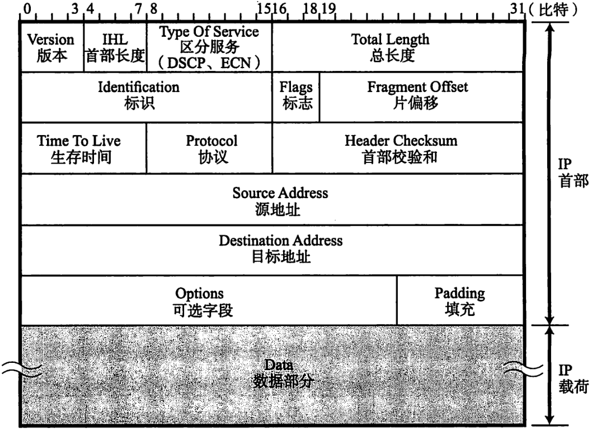

- version：由4比特构成，标识IP首部的版本号。IPv4版本即为4。IP有很多版本。

- internet header length：由4比特构成，标识首部的长度，单位为4字节。默认长度为5，即20字节。

- type of service：由8比特构成，用来表示服务质量。由于难以控制几乎没有被使用。每一位的含义为：

  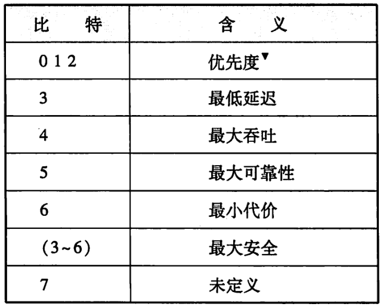

- total length：由16比特构成，表示首部与数据合起来的总字节数。因此IP包的最大长度为65536字节。

- identification：由16比特构成，用于分片重组。同一个分片的标识值相同。

- flags：由3比特构成，表示包被分片的相关信息。每一位的含义为：

  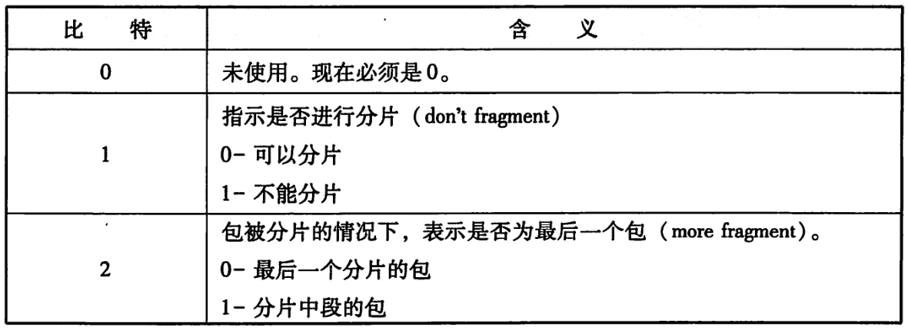

- fragment offset：由13比特构成，用来标识分片的每一个分段相对于原始数据的位置。单位为8字节。

- time to live：由8比特构成，指可以中转多少个路由器。每经过一个路由器（256个路由器），TTL减1，直到为0时丢弃该包。避免IP包在路由出现环时无休止地转发。

- protocol：由8比特构成，表示IP首部的下一个首部属于哪个协议。
- header checksum：由16比特构成，只校验首部，不校验数据部分，用于确保数据包没有损坏。
- source address：由32比特构成，表示发送端IP地址。
- destination address：由32比特构成，表示接收端IP地址。
- options：长度可变，通常只在实验或诊断时使用。可以包含安全级别、源路径、路径记录、时间戳。

- padding：有options的时候，通过填充0将首部调整为32比特的整数倍。
- data：数据。上层协议的首部也是数据。

#### 4.6 IPv6

- 为了解决IPv4地址耗尽的问题，使用128位正整数。

- 特点：路由控制表聚合、性能提升、支持即插即用功能、采用认证与加密功能、多播与Mobile IP成为扩展功能。

- 标记方法：每16比特为一组，每组用”：“隔开。

- 结构：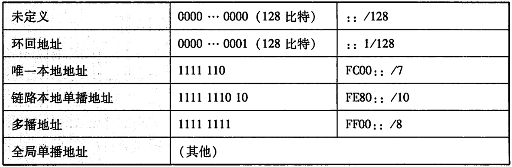

  - 全局单播地址：n=48，m=16，主机标识为64位。

    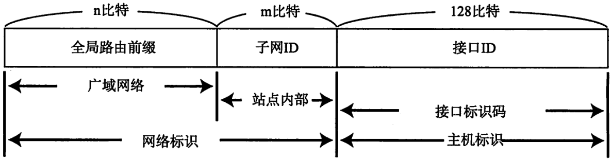

    接口ID可以保存64比特版的MAC地址，也可以设置一个临时地址。

  - 链路本地单播地址：同一数据链路下的唯一地址。

    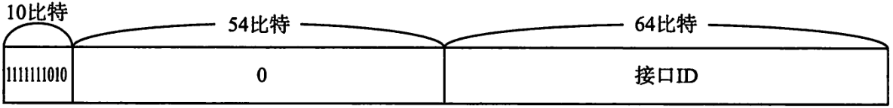

  - 唯一本地地址：不进行互联网通信时使用的地址。但可能用于接入网络，所以不同于环回地址（localhost）。

    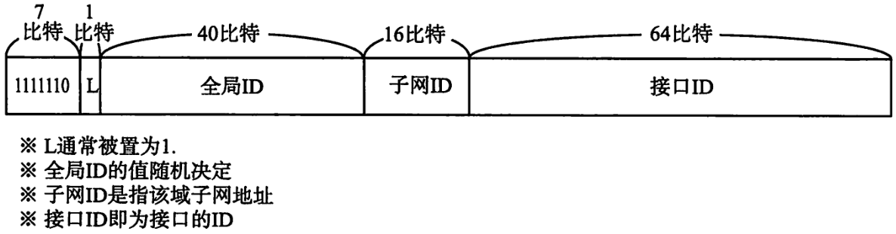

- 分包：只在发送端主机上进行，需要路径MTU发现功能，最小MTU为1280字节。

#### 4.8 IPv6首部

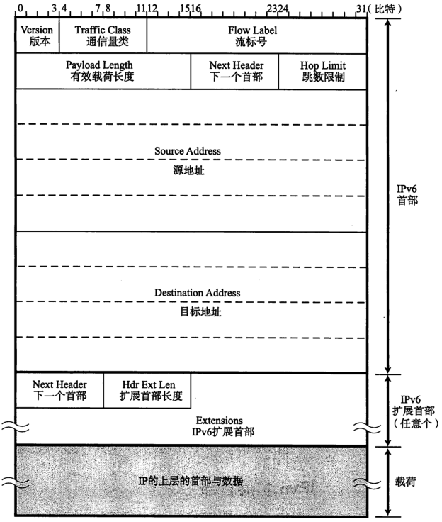

- version：版本，IPv6的版本号为6。
- traffic class：相当于IPv4的TOS字段，由8比特构成。
- flow label：由20比特构成，准备用于服务质量控制。
- payload length：数据部分的长度，有可选项时包含它们的长度。
- next header：相当于IPv4的协议字段，通常表示上一层的协议。有扩展首部时，表示第一个扩展首部。
- hop limit：相当于IPv4的TTL字段，可通过路由器个数。
- source address：128比特，发送端IP地址。
- destination address：128比特，接收端IP地址。
- 扩展首部：任意长度，可以设置多个扩展协议，例如管理分片的协议。

### 第五章 IP协议相关技术

#### 5.1 为什么需要其他技术

实际应用中基本不直接使用IP地址，而是使用域名或者邮件地址等，因此需要解析主机名称的功能，将应用层的地址映射为IP地址。

数据链路层传输时也不使用IP地址，而是只用MAC地址，因此需要解析MAC地址的功能。

数据在传输过程遇到异常情况也需要异常处理的功能。等等。

#### 5.2 DNS

- DNS是一个表示主机名与IP地址之间对应关系的数据库。`nslookup`指令用于查找域名对应的IP地址。

- 域名是为了识别主机名称和组织机构名称的一种具有分层的名称。

  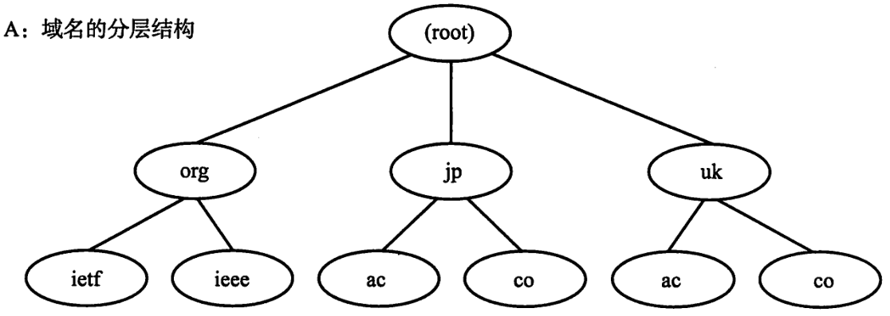

  root是未使用的，从上至下依次为顶级域名、二级域名等等。从自定义的域名开始，在该子域下可以创建任何新的域名。

  - 每一层中的域名都有至少一个域名服务器，它负责它的子树中所有的域名映射。所有的域名服务器都必须注册根域名服务器的IP地址，因为解析时需要从根域名开始进行。

    **但是注意只有叶子节点的域名服务器才保管着域名到资源所在主机的IP地址，其他的域名服务器保管着域名到下一层域名服务器的IP地址。**

    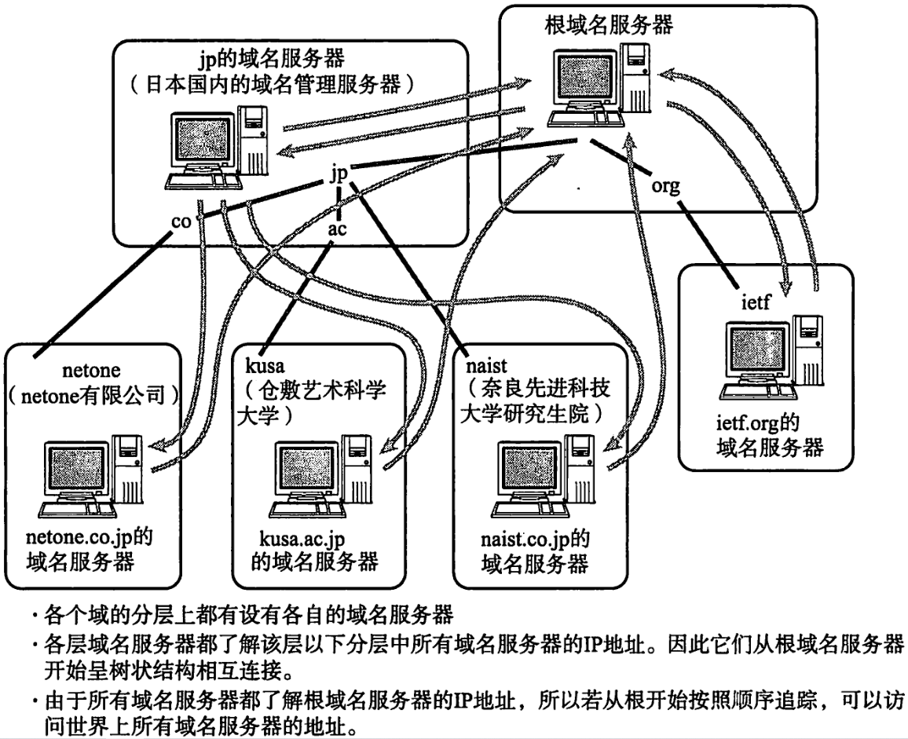

  - 进行DNS查询的软件叫做DNS解析器。一个解析器至少注册一个以上域名服务器的IP地址，通常它至少包括组织内部的域名服务器的IP地址。

- DNS查询

  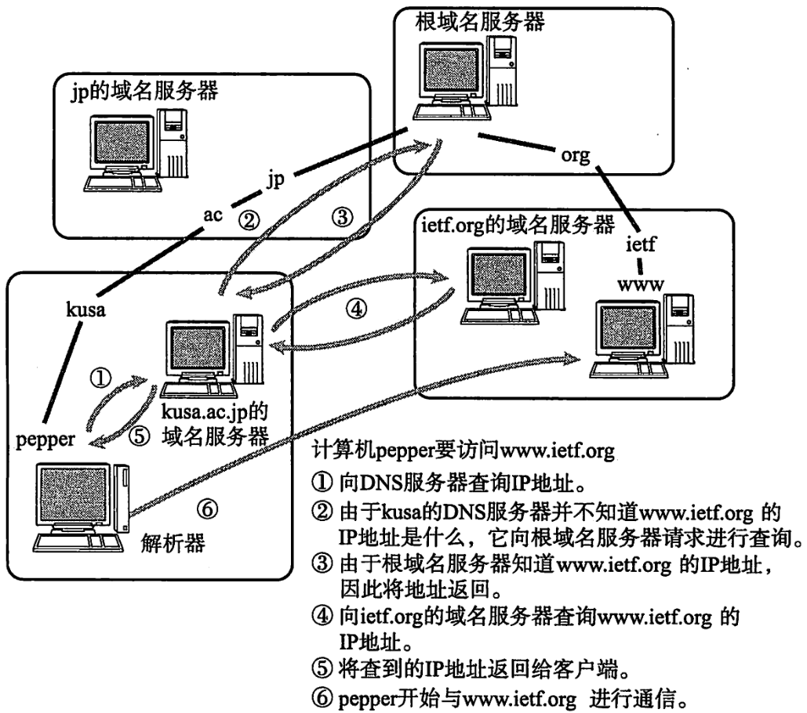

- DNS不只是记录主机名到IP的映射，还有其他记录，如IP地址反向解析、到下层域名服务器的IP映射等等。

#### 5.3 ARP

- ARP是以目标IP地址为线索，定位下一个接收数据的网络设备对应的MAC地址。只能用于IPv4。

- ARP是借助ARP请求与ARP响应两种类型的广播包确定MAC地址。

  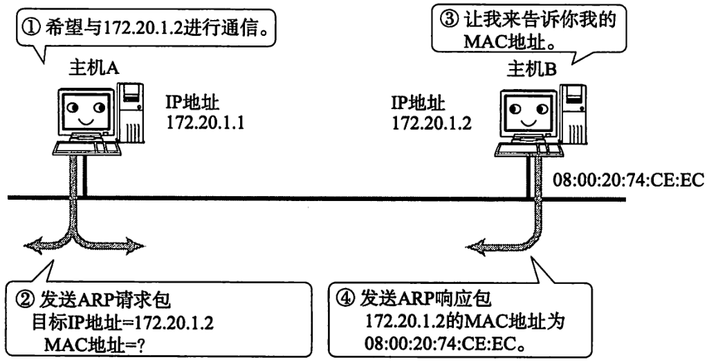

  根据ARP可以动态地进行地址解析，因此在TCP/IP的网络通信中无需事先知道MAC地址，只需要IP地址即可。

  为了减少ARP包的流量，发送端和接收端通常会把获取到的MAC地址缓存一段时间，过期后再重新解析。

  跨数据链路传输时，通过ARP获取下一个路由器的MAC地址。

- RARP是从MAC地址解析得到IP地址的协议，应用于将小型嵌入式设备接入网络的情况。需要一台RARP服务器，注册设备的MAC地址及其对应的IP地址。然后设备接入网络时会向服务器发送RARP请求包，服务器告知设备的IP地址后，设备将其设置为自己的IP地址。

- 代理ARP是路由器将ARP请求转发给邻近的网段（通常情况会被阻隔），应用于不能设置子网掩码的老设备。

#### 5.4 ICMP

- ICMP（Internet Control Message Protocol）用于确认网络是否正常、遇到异常时的问题诊断等，只负责与IP协议相关的问题，如IP包是否成功到达目的地址，IP包被丢弃的具体原因等。

  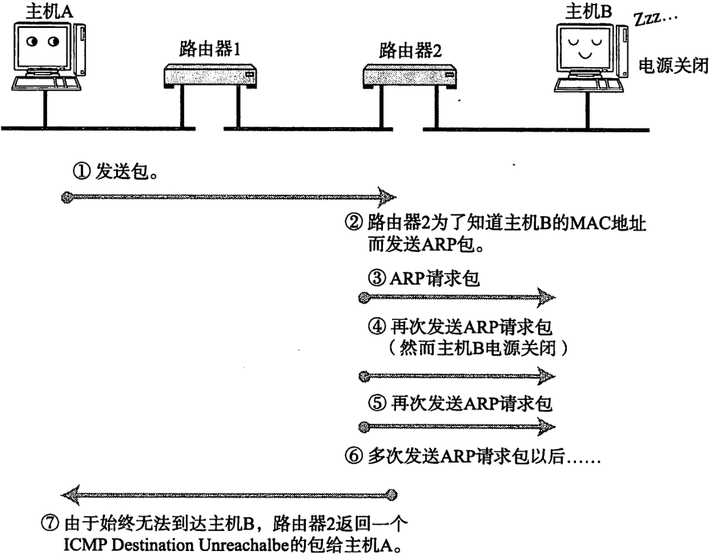

  大致分为两类消息，即通知出错原因的错误消息，用于诊断的查询消息。

  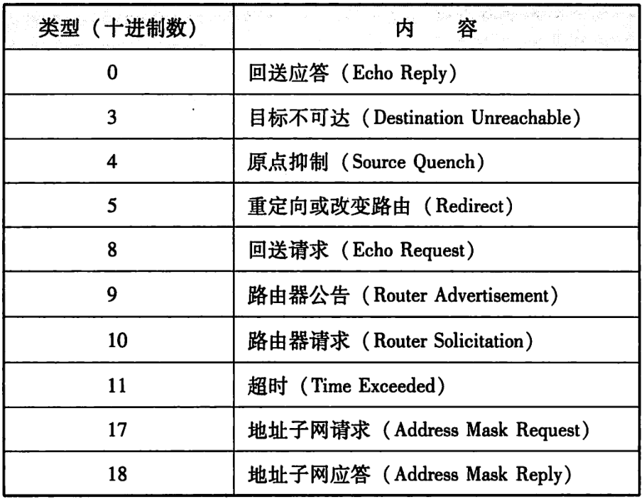

- 目标不可达（类型3）

  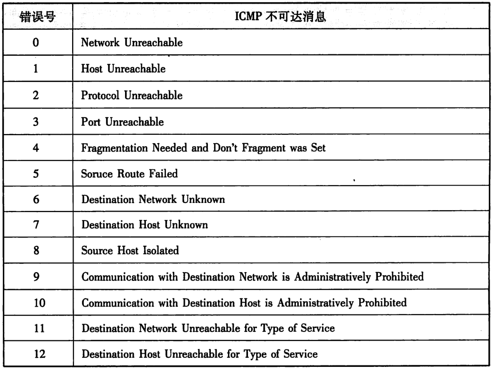

- 重定向（类型5）：对于主机发送的IP包，路由器有更好的路由信息。

  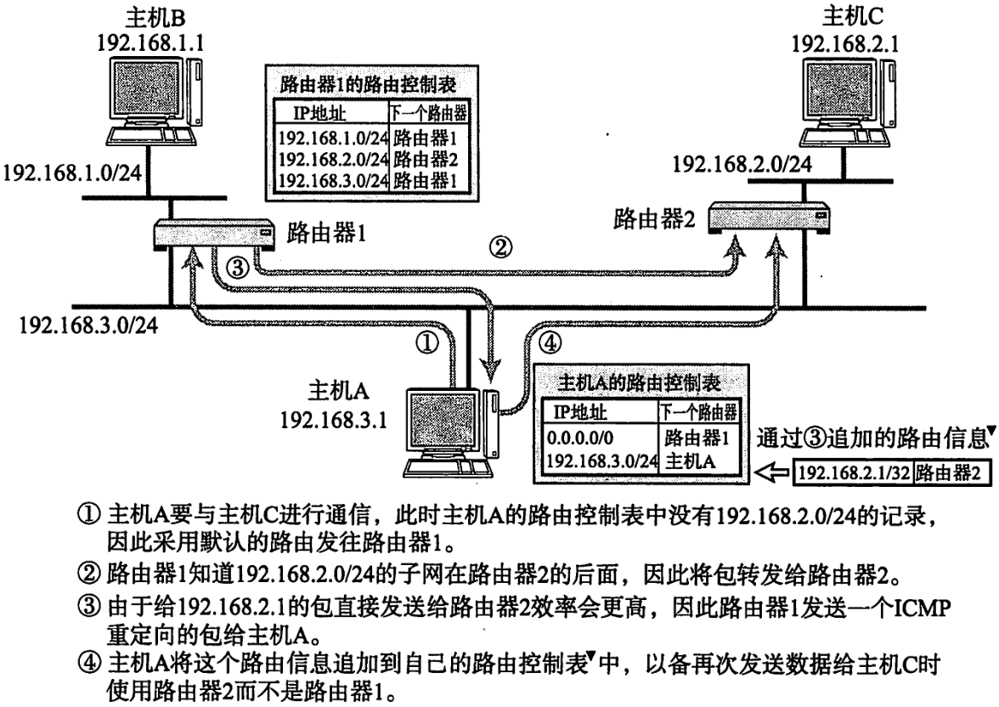

- 超时（类型11）：当TLL字段减为0时，路由器会发送一个超时消息，通知该包被丢弃。

  `traceroute`/`tracert`指令可以查看到达目标主机经过的路由器。

- 回送（类型0、8）：用于进行通信的主机或路由器之间，判断发送的数据包是否已到达对端的一种消息。向对端主机发送回送请求后，通信成功则可接收到对端主机发送回的回送应答。**`ping`命令就是利用它实现的**。

- 其他

  - 原点抑制（类型4）：当路由器的发送残存为零而无法发送IP包，即网络拥堵时，向源地址发送一个原点抑制消息。发送主机据此可能会扩大IP包的传输间隔。几乎不用。

  - 路由器探索消息（类型9、10）：主要用于发现与自己相连的网络中的路由器。
  - 地址掩码消息（类型17、18）：主要用于主机或路由器获取子网掩码的情况。

#### 5.5 DHCP

- DHCP（dynamic host configuration protocol）协议用于自动设置IP地址、统一管理IP地址分配。

  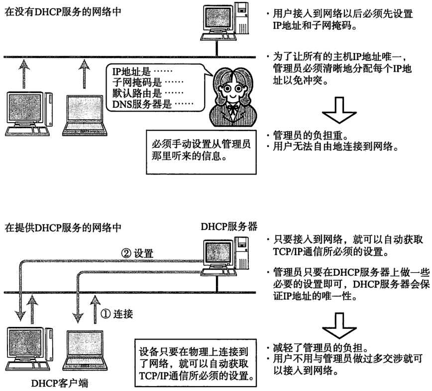

- 工作机制：管理员需要首先设置可分配的IP地址、子网掩码以及默认路由。一般路由器可充当DHCP服务器。因此当设备设置使用dhcp，连入路由器时，进行IP地址的自动分配过程。

  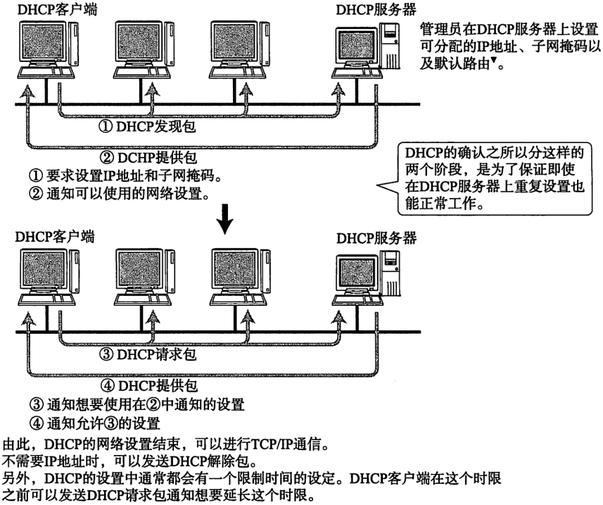

- DHCP中继代理：当大型机构具有很多网段时，需要配置很多路由器的DHCP功能。这时可以采用一个DHCP服务器统一管理和维护，路由器作为DHCP中继代理，保存DHCP服务器的IP地址。

  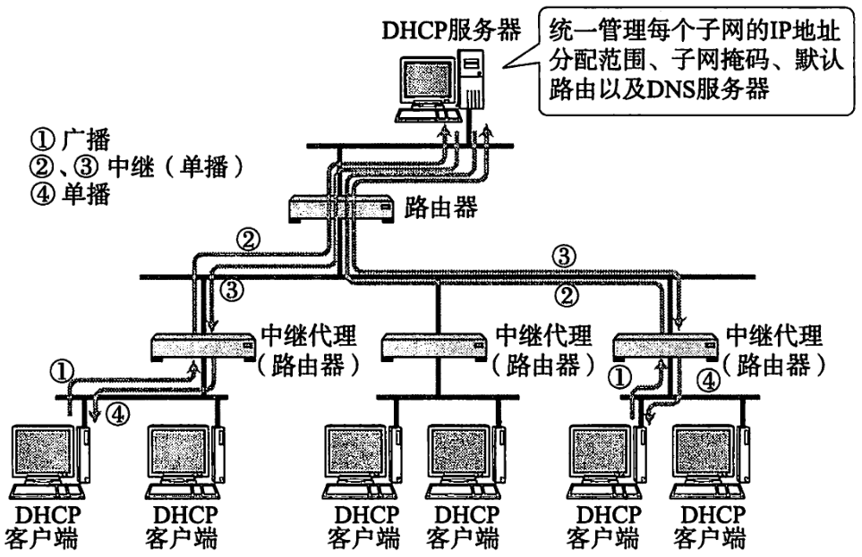

#### 5.6 NAT

- NAT（Network Address Translator）是用于在本地网络中使用私有地址，在连接互联网时使用全局IP的技术。当私有网络内的多台机器同时与外部进行通信时，将端口号一起转换（NAPT）。

  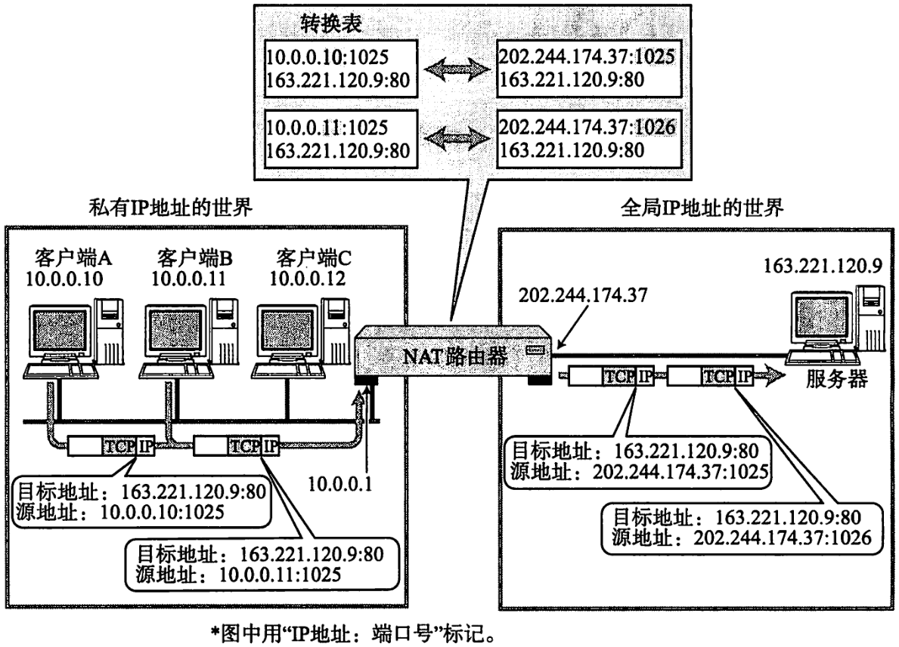

- 限制：无法从外部向内部建立连接、转换表的生成与转换会产生开销、遇到异常需要重启时所有TCP连接都会被重置。

  解决办法是使用IPv6，或者在应用层上解决问题。

#### 5.7 IP隧道

- IP隧道：在网络层首部后面继续追加网络层首部的通信方法。

  例如两个IPv6网络中间夹着一个IPv4网络，此时IPv6网络之间无法直接通信。需要将第一个IPv6网络的数据包装起来，追加IPv4首部后再传给第二个IPv6网络。

#### 5.8 其他IP相关技术

- IP多播：通过IGMP（internet group management protocol）确认接收端是否存在。ICMP有两个作用：一是向路由器通知接收多播的主机，二是通知交换集线器接收多播的主机。

  路由器根据第一个作用通知其他路由器，而交换集线器根据第二个作用过滤掉不需要发送的端口。

- IP任播：为提供同一种服务的服务器配置同一个IP地址，通信时数据将发送到最近的服务器上，类似110、120。主要应用为DNS根域名服务器。

  不能提供连续多个包进行通信的情况。

- 通信质量控制：包括带宽、延迟、抖动、丢包率等。通过RSVP（resolution reservation protocol）协议提供点对点的详细优先控制（IntServ）或粗粒度的优先控制（DiffServ）。

  前者也叫流量设置，在特定的应用以及必要的时候，对收发端之间所有的路由器进行质量控制设定，之后路由器根据这些设定对转发过程中的包进行不同的处理。机制过于复杂，每一次通信都需要设置，实用性较差。

  后者针对特定的网络，该网络内的路由器对IP包首部的DSCP字段进行替换，设定优先级，之后的转发过程中路由器根据优先级进行优先处理。机制相对简单，实用性好。

- 显式阻塞通知（explicit congestion notification，ECN）：在发送包的IP首部中记录路由器是否**遇到**拥塞，并在返回包的TCP首部中通知是否**发生过**拥塞。

  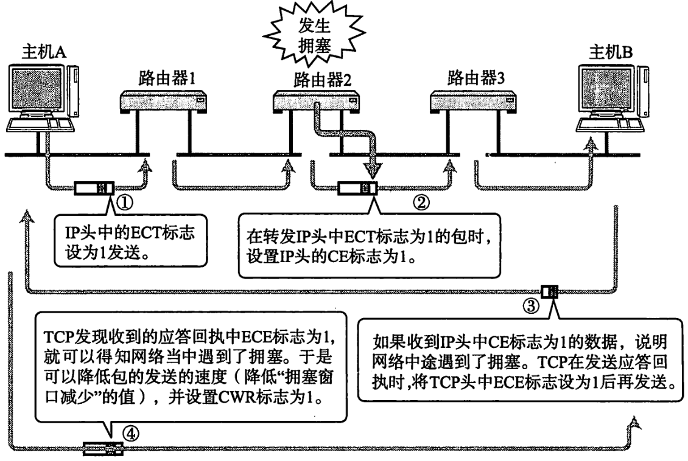

- Mobile IP：在主机所连接的子网IP发生变化时，主机IP地址仍然保持不变（移动网络IP，非WLAN）。这是通过外部代理向归属代理通知自己的地址做到的。

  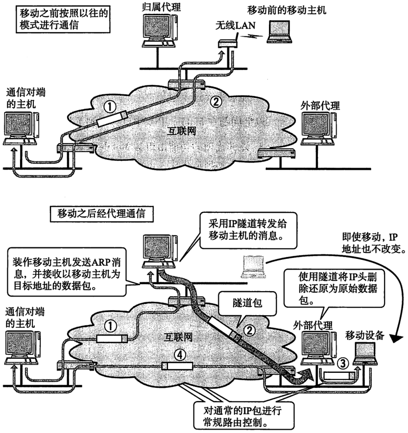

### 第七章 路由协议

#### 7.1 路由控制的定义

- 路由器根据路由控制表转发数据包。路由控制分为静态路由和动态路由。
  - 静态路由指事先设定好路由器和主机中的路由信息并固定的方法。
  - 动态路由指让路由协议在运行过程中自动设置路由控制信息的方法。
- 动态路由的基础是路由器给相邻路由器发送自己已知的网络连接信息，当（一定范围内的）整个网络都了解时，路由控制表就制作完成了。

#### 7.2 路由控制的范围

- 网路太大时，不可能让每一个路由器对其他所有的网络的了如指掌，因此路由控制需要范围。
- 自治系统：制定自己的路由策略，并以此为准在一个或多个网络群体中采用的小型单位，例如区域网络、互联网服务提供商等。自治系统内部动态路由采用的协议是内部网关协议，即IGP（interior gateway protocol），自治系统之间的路由采用的是外部网关协议，即EGP（external gateway protocol）。
- IGP中有RIP（routing information protocol）、RIP2、OSPF（open shortest path first）等众多协议。EGP使用BGP（border gateway protocol）协议。

#### 7.3 路由算法

- 距离向量算法：以距离作为代价，根据距离和方向决定目标网络或主机的方法。每个路由器可以持有不同的信息，因此可能出现路由循环等不稳定情况。
- 链路状态算法：在了解网络整体连接状态的基础上生成路由控制表的方法。每个路由器都持有相同的信息，这样可以保证路由的正确稳定。

- 主要路由协议

  

#### 7.4 RIP

- RIP将路由控制信息定期向全网广播。

  如果路由器后面的网络已经断开，但由于接收到自己发出去的信息，可能存在无限计数问题：

  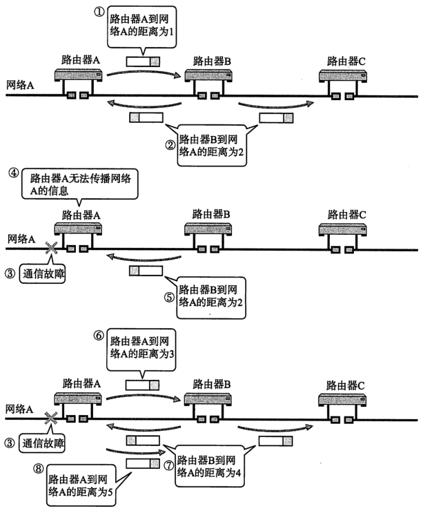

  解决办法：一是限制最长距离，二是规定路由器不把收到的信息原路返回给发送端，也叫水平分割。

  但是网络本身有环的时候仍然会出现错误的路由信息。

  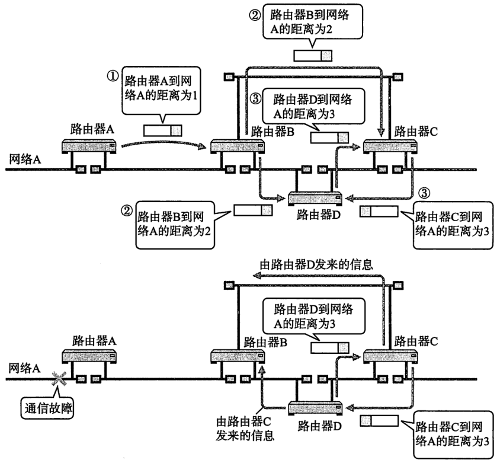

  这时可以通过触发更新通知路由信息，即网络断开时，不等待30s而是立即发送一个最长距离的信息表明网络不可用，避免错误的路由信息来回传递。

  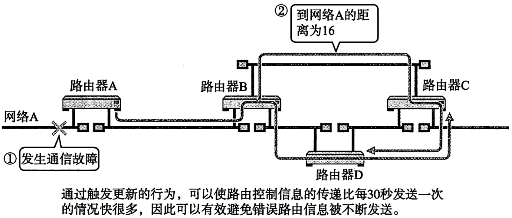

- 根据距离向量方法确定路由，距离的单位是“跳数”，即所经过路由器的个数。首先根据距离向量生成距离向量表，然后找出最短的距离生成最终的路由控制表。

  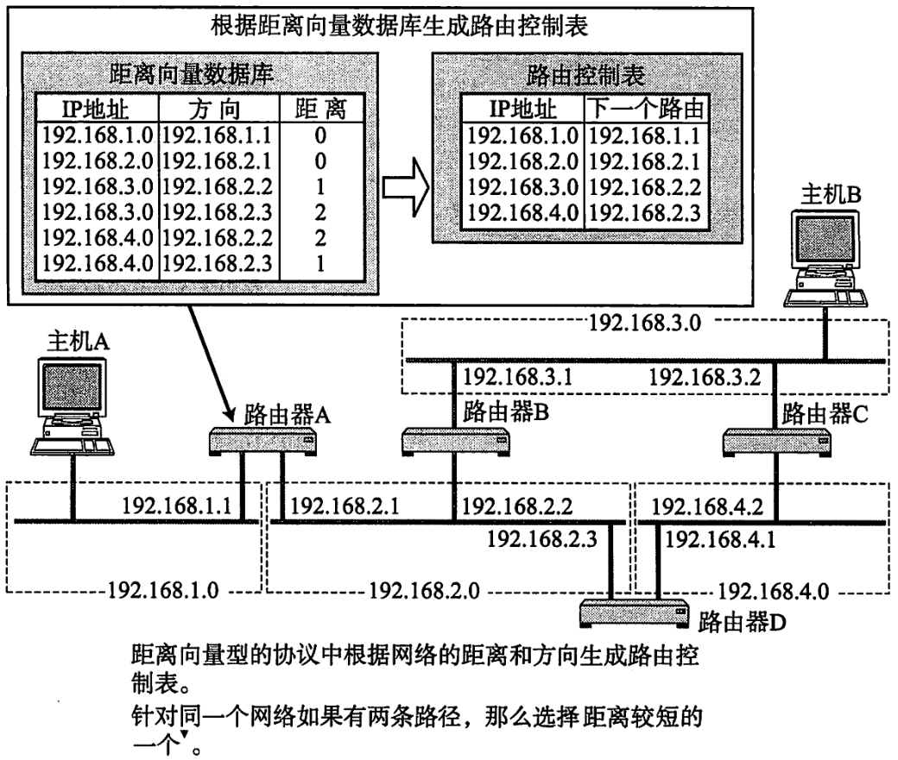

- 使用子网掩码时，对比接口的IP地址中的网络地址与传过来的路由控制信息中的IP网络地址，如果相同则以接口的网络地址长度为准，否则以IP地址的分类所确定的网络地址长度为准。

  如路由器接口的IP地址为192.168.1.33/27，如果传输过来的路由控制信息中有IP地址为192.168.1.xx/24，则将其网络地址长度视为27，否则仍然视为192.168.1.xx/24。

  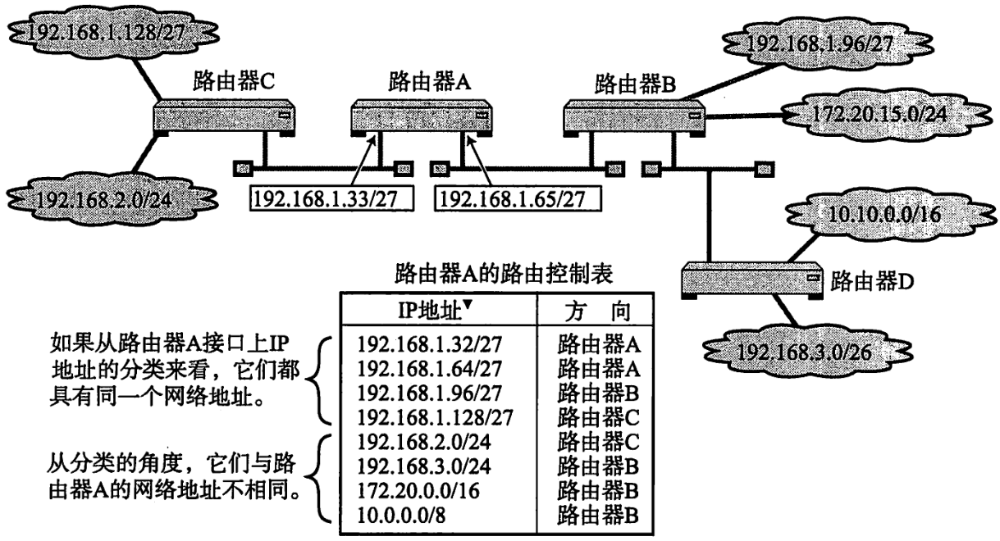

#### 7.5 OSPF

- 路由器之间交换链路状态（网络链路状态和路由器链路状态）生成网络拓扑信息，再根据这个拓扑信息生成路由控制表（带权的dijkstra算法）。

  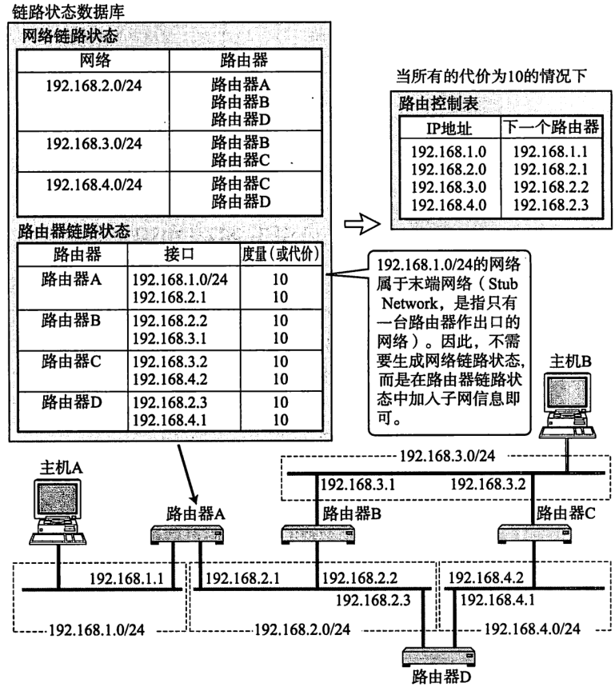

- 建立图的时候会给每条链路赋予一个权重，始终选择一个权重最小的路径作为最终路由。

  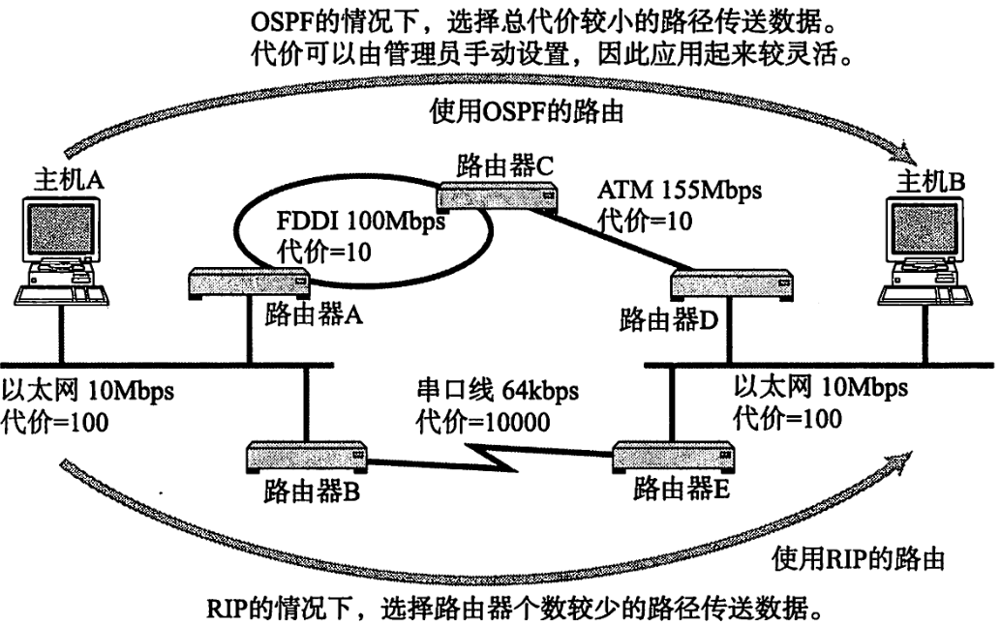

- OSPF有五种包：

  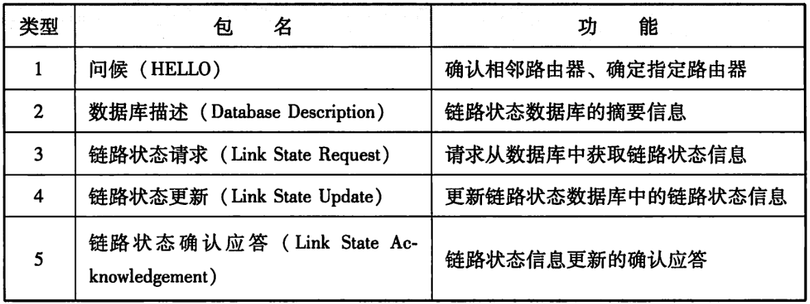

  LAN中每10s发送一个HELLO包，如果没有收到某个路由器返回的HELLO包，则进行连接是否断开的判断。空等3次后，第4次仍无反馈信息则认为连接已断开，则向其他路由器发送一个链路状态更新包进行通知。

  链路状态信息包含两种，一是网络LSA（link state advertisement），二是路由器LSA。

  前者是以网络为中心生成的信息，表示该网络与哪些路由器相连。后者是以路由器为中心生成的信息，表示该路由器与哪些网络相连。

- 为了减少网络规模变大时的计算代价，引入区域概念，将连接在一起的网络和主机划分成区域，其中一个区域作为主干区域。

  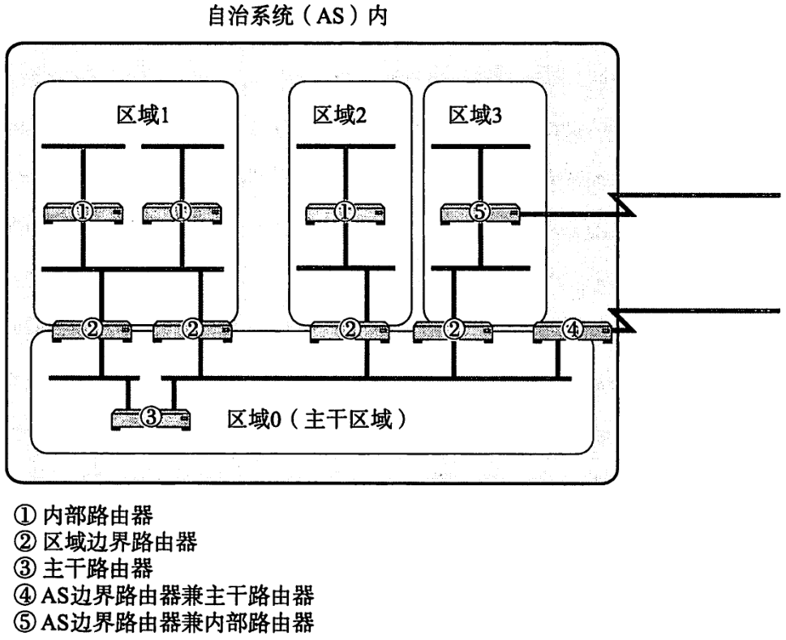

  每个区域内的路由器都持有本区域网络拓扑的数据库，关于区域外的路径信息，只能从区域边界的路由器获知。区域边界路由器并不发送区域内的详细路由信息，只会发送到达这些路由器的距离信息。

#### 7.6 BGP

- 最终路由控制表由网络地址和下一站的路由器组来表示，根据所要经过的AS个数进行路由控制。

  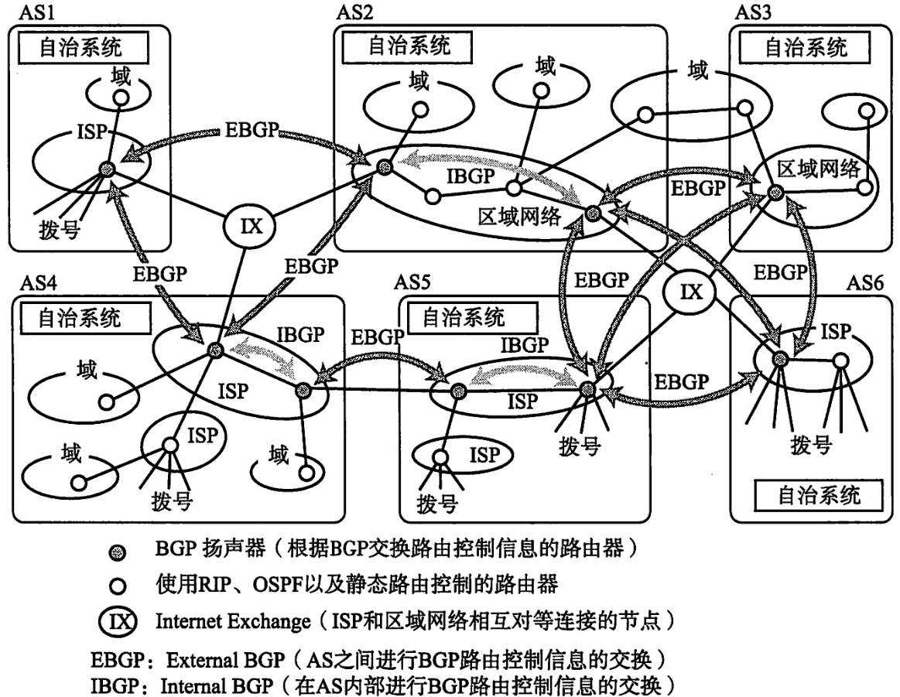

  区域网络、ISP组成一个个自治系统进行管理，每个自治系统分配一个16比特的AS编号。BGP根据AS编号进行相应的路由控制。

- 采用路径向量方法交换路由控制信息，到达目标网络时，生成一个中途经过的所有AS的编号列表。根据这个编号列表选择较短的路由生成路由控制表。

  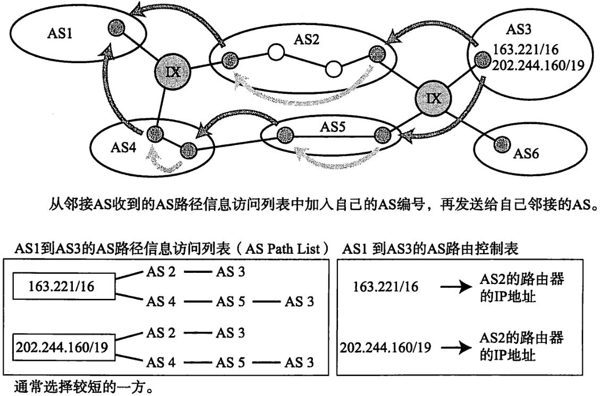

#### 7.7 MPLS

- 路由技术基于IP地址中最长匹配原则进行转发，而标记交换则对每个IP包都设定一个“标记”值，然后根据“标记”进行转发。代表性技术MPLS（multi protocol label switching），但是并不被互联网所用。

  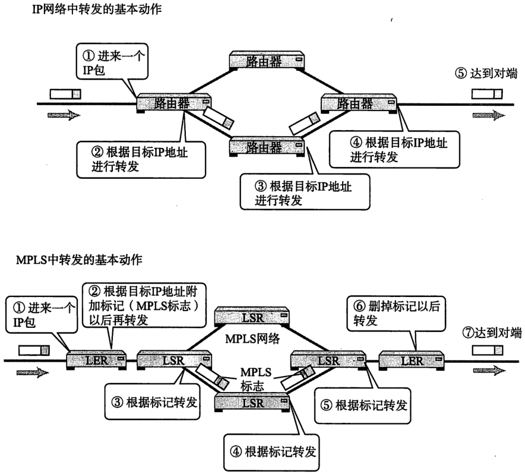

### 第六章 传输层/TCP/UDP

#### 6.1 传输层的作用

- 为两个进程提供通用的数据传输。

- 传输层的两个代表协议：
  - TCP提供可靠的通信传输，实行顺序控制或重发控制机制，还有流量控制、拥塞控制等功能。
  - UDP不保证可靠性传输，速度更快，常用于广播和实时性要求较高的通信传输。
- 传输层协议通过接收数据中的目标端口号确定上一层数据应当由哪个应用所接收。

#### 6.2 端口号

- 端口号用于识别同一台计算机中进行通信的不同应用程序，也被称为程序地址。

-  **TCP/IP通信中采用源IP地址、目标IP地址、协议号、源端口号、目标端口号5个信息来识别一个通信。**只要有一项不同就是不同的通信。

  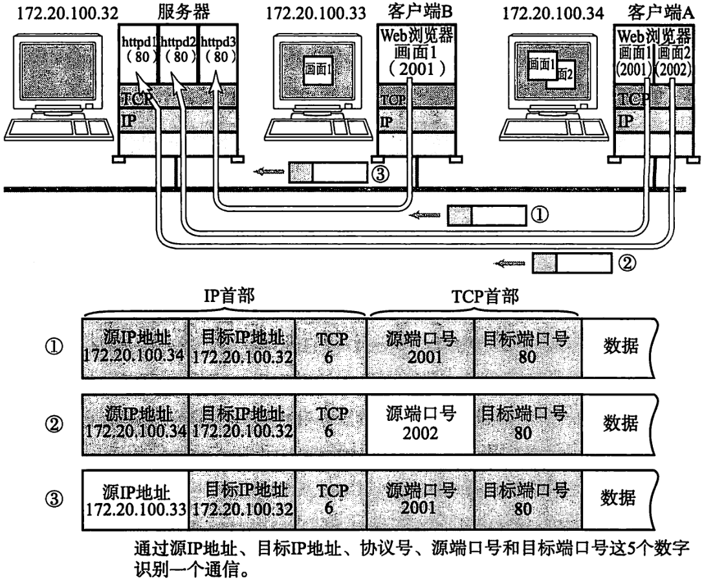

- 确定端口号的方法有两种：

  - 静态分配法：标准既定的端口号，即每个应用本身指定的端口号。知名端口号一般在0~1023，如ssh为22，http为80，ftp为21，smtp为25等等。
  - 时虚/动态分配法：由操作系统为应用程序动态地分配端口。动态分配的取值范围在49152~65535之间（不会占用已注册的端口）。

- 端口号与协议的关系：传输层协议决定它开放的端口号（应用），因此不同传输协议可以使用相同的端口号，如TCP与UDP均开放53端口提供DNS服务，TCP开放80端口提供HTTP服务，但UDP不开放80端口。

#### 6.3 UDP

UDP（user data protocol）利用IP提供面向无连接的通信，可以随时发送数据，不需要接收端进行确认。

不提供流量控制、丢包重发、纠正包的顺序等等复杂控制功能，因此不能保证可靠传输。

面向报文，一次传输交付一个完整报文，因此传输时不合并、拆分，不存在粘包问题。

没有拥塞控制，网络出现拥塞后不会使发送端降低速率。

支持一对一、一对多、多对一和多对多的通信。

首部开销小。

适合于

- 包总量较少的通信（dns、snmp等）
- 视频、音频等多媒体的即时通信
- 限定于LAN等特定网络中的应用通信
- 广播、多播通信

#### 6.6 UDP首部

- 源端口号：发送端端口号，16位。可选项，没有源端口号时设置为0，一般用于不需要返回的通信中，如各种更新推送（面向无连接）。

- 目标端口号：接收端端口号，16位。

- 包长度：首部和数据的长度之和，单位为字节。

- 校验和：为了保证首部和数据的完整性，以及一定的可靠性。收到UDP数据报后，从IP首部获知IP地址构造UDP伪首部，再进行校验和的计算。因为IP首部的信息如果被破坏，可能导致无关接收端收到该数据，因此校验时最好将五项信息全都检查一遍。

  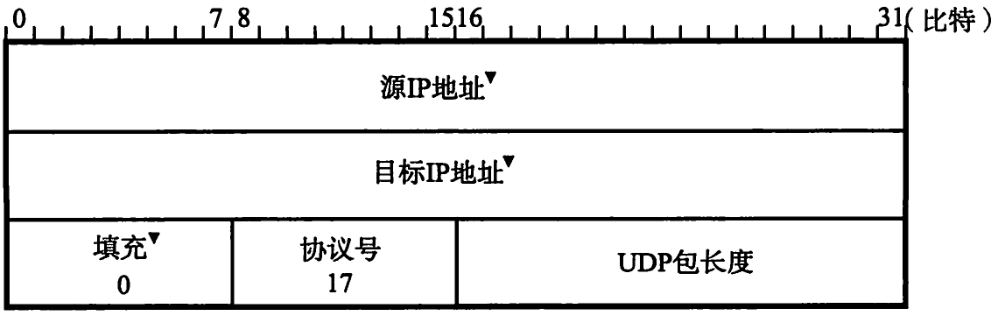

#### 6.4 TCP

- TCP（transmission control protocol）提供面向有连接的通信。

  提供了数据传输时充分的控制功能，以实现可靠性传输。

  面向字节流，传输时拆分为数据段，因此可能出现粘包问题。

  提供一对一的通信。

  提供全双工通信。

- TCP通过检验和、序列号、确认应答、重发控制、连接管理、窗口控制、流量控制、拥塞控制等机制实现可靠性传输。

  - 序列号与确认应答（停止等待协议，ARQ，automatic repeat request）

    当发送端的数据到达接收端，接收端会返回一个已收到消息的通知，这个消息叫做确认应答（positively acknowledgement，ACK）。发送端在一定时间内没有收到ACK，则会进行重发。

    但没有收到ACK的原因很多，一是数据包确实丢失，接收端没有收到；二是接收端收到了数据包，但是ACK在返回过程中丢失了。还有可能出现只是ACK延迟太久，发送端重发后才收到ACK的情况。

    因此接收端可能会收到重复的数据，这需要序列号实现确认应答处理、重发控制、重复控制等功能。序列号按顺序给发送数据的**每一个字节**都标上编号，接收端查询接收数据TCP首部中的序列号和数据的长度，将自己下一步应该接收的序号作为确认应答返回。

  - 重发控制（停止等待协议，ARQ，automatic repeat request）

    重发超时指在重发数据前等待的时间间隔。通过发包时计算往返时间及其偏差，将往返时间与偏差相加作为重发超时。

    

    往返时间与偏差的最小单位为0.5s，因此最小的重发时间至少为1s。由于最初的数据无法测量，其重发超时一般设置为6s。

    重发后若还是收不到ACK，则再次发送，重发超时以2倍、4倍的指数增长。达到一定重发次数后，强制关闭连接。

  - 连接管理

    通过三次握手建立连接、四次挥手断开连接。

    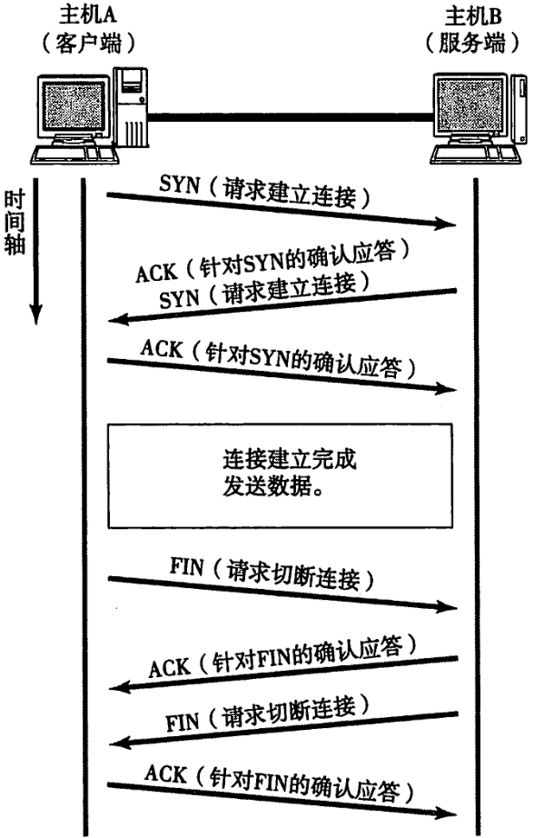
    
  - TCP以段（分组）为单位发送数据

    建立连接时，双方根据TCP首部中的MSS字段告诉对方自己的接口适应的MSS大小，在两者之间选择一个较小值使用，发送数据与重发时都是用MSS作为单位分割数据。

  - 窗口控制（连续ARQ协议）

    发送端每发送一个段就需要等待接收接收端的ACK，这样会造成网络的吞吐量下降。引入滑动窗口控制，ACK不再以一个段，而是更大的单位进行确认。

    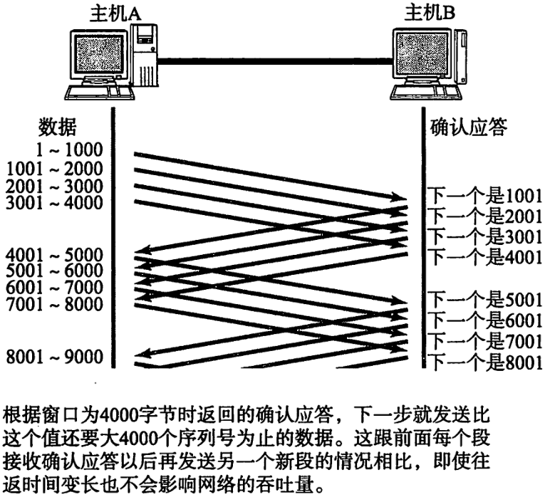

    这个图感觉有问题，应该是4001的ACK到达以后才发送4001~8000的数据。（当1001的ACK到达以后，发送端可以确认1~1000的数据发送成功了，因此可以将它从缓冲区移除掉。只要窗口分段的ACK没有接收完整，例如只收到了3001的ACK，没有4001，那么接下来应当发送3001~7000的数据。）

    **实际上接收端采用累积确认的方式，即接收端只对按序到达的最后一个分组发送确认**。即上图中接收端直接发送4001，而不会发送前三个确认应答号。

    滑动窗口内的数据会直接发送，每等到一个确认应答窗口就移动到确认应答中的序列号位置，并将已经成功的数据从缓冲区中移除。

    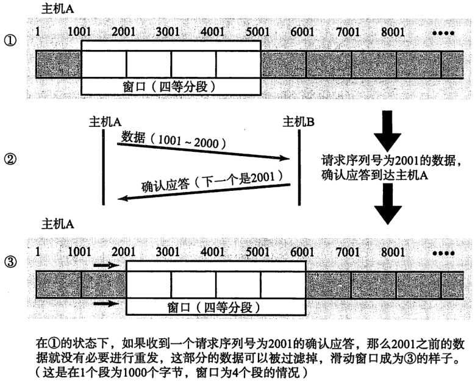

  - 窗口控制与重发控制（快重传）

    使用窗口控制，在数据到达对端，而ACK在中途丢失的情况下无需重发。因为可以根据到达的ACK移动窗口位置，从而得知对方已收到数据。

    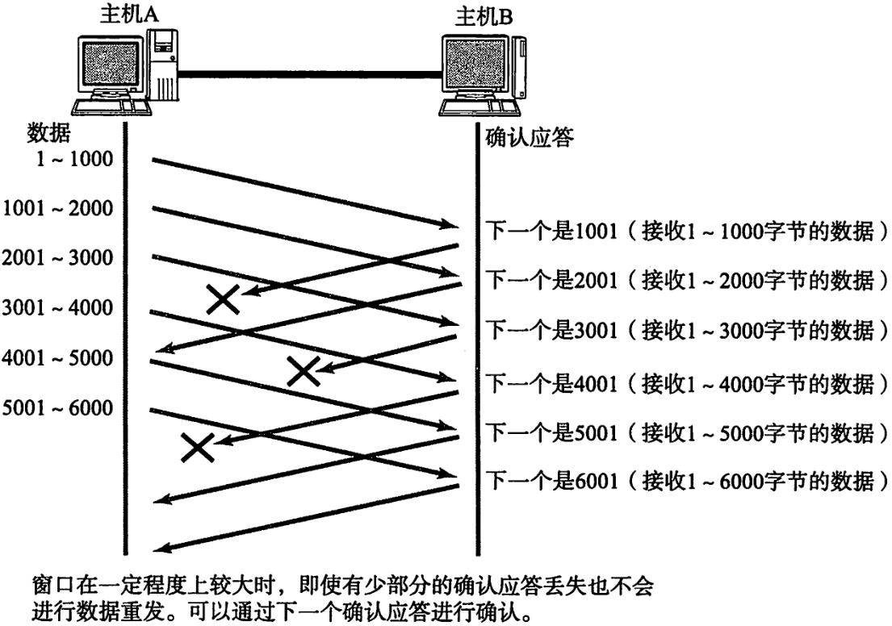

    窗口为6000字节，只要收到6001的ACK，就可以确定前面的数据接收端都收到了。

    在数据丢失的情况下，接收端收到序列号不连续的数据时，会向发送端提示中间丢失的数据包的序列号。当窗口比较大，数据丢失时，同一个序列号的ACK会被反复不断地返回，当发送端主机连续3次收到同一个确认应答时，就将对应的数据重发。

    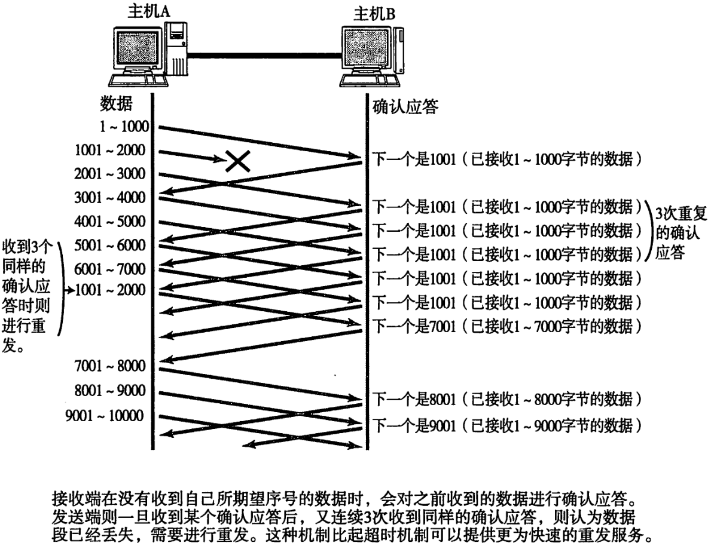

    当收到1~1000后接收到2001~3000的数据时，出现不连续，因此给发送端反复发送1001的ACK。

  - 流量控制

    为了避免接收端处于高负荷无法接收数据导致发送端不断重发的问题，发送端通过流量控制根据接收端的实际接收能力控制发送的数据量。

    接收端通知发送端自己可以接收数据的大小（接收缓冲区），这个接收能力即为窗口大小。接收端缓冲区一旦面临数据溢出，窗口大小的值被随之设置为一个更小的值发送给发送端。

    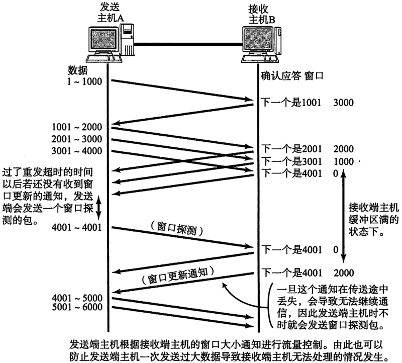

  - 拥塞控制

    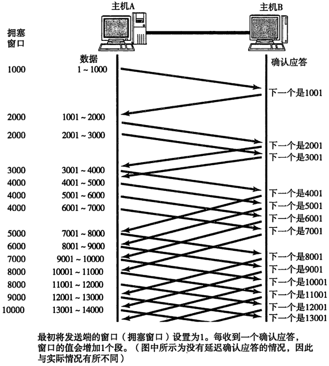

    通信开始时并不清楚网络的负载情况，为了避免发送一个大量数据导致网络瘫痪，通信开始时使用慢启动算法对发送数据量进行控制。 **在发送时，将拥塞窗口和接收端通知的滑动窗口的大小比较，选择其中较小的那个值作为发送的数据量。**

    通信开始时拥塞窗口设置为1个报文段（MSS），之后每接收到一个ACK，拥塞窗口增加一个报文段（慢开始算法）。随着ACK的接收，拥塞窗口以1、2、4的指数增加，超过慢启动阈值后，拥塞窗口线性增长（拥塞避免算法）。

    在超时重发时，将慢启动阈值设置为当前窗口长度的一半，并将拥塞窗口回归1个报文段。

    在收到重复确认应答（快重传算法）时（拥塞状况比超时稍好），慢启动阈值被设置为当前窗口长度的一半，并将拥塞窗口设置为该值（快恢复算法）。

    
    
    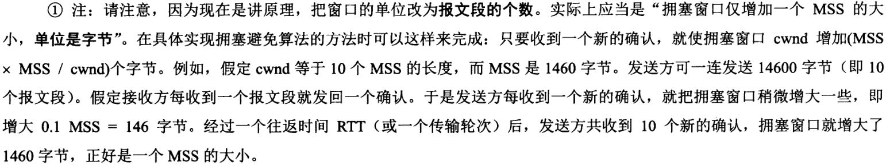

- 提高网络利用率的规范

  - Nagle算法：仅当满足已发送的数据都已经收到ACK，或可以发送MSS长度的数据时进行发送数据，否则就延迟发送数据。
  - 延迟确认应答：接收端收到数据后不马上发送ACK，如收到MSS长度2倍的数据，或延迟0.5s再发送ACK。避免每次接收到数据后由于缓冲区的占用发送小的窗口大小。
  - **捎带应答：确认应答和回执数据通过一个包发送。例如三次握手中服务器给客户都发送ACK和SYN在一个包中。**这需要启动延迟确认应答功能。

#### 6.7 TCP首部

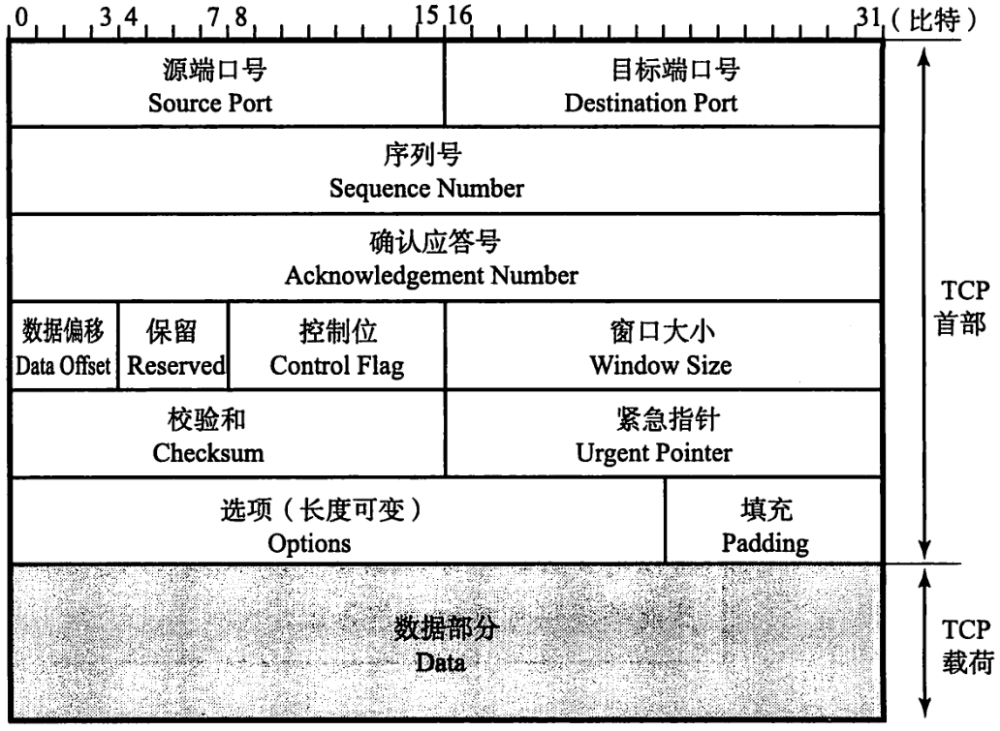

TCP首部中没有包长度和数据长度的字段，可以由IP层获知。

- 源端口号：发送端端口号，16位。

- 目标端口号：接收端端口号，16位。

- 序列号：发送数据的位置，32位。建立连接时由发送端生成随机数作为初始值。

- 确认应答号：接收端下一次应该收到的数据的序列号，表示已收到之前的数据。32位。

- 数据偏移：表示数据部分从哪个位置开始。长4位，单位为4字节。不包含可选项时，首部长度为20字节，即默认值为5。

- 保留：为以后扩展使用，长6位。一般为0。

- 控制位：6位，其他的参考书中控制位都不包含前两个。

  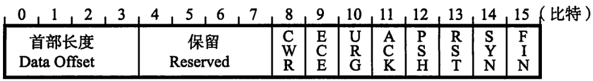

  - URG（urgent）：为1时表明包中有需要紧急处理的数据，在紧急指针中具体说明。

  - ACK（acknowledgement）：为1时表明确认应答号的字段有效。除了最初建立连接的SYN包之外该位必须为1。
  - PSH（push）：为1时表明需要将收到的数据立即传输给上层应用协议，否则可以先缓存。
  - RST（reset）：为1时表明TCP连接出现异常，必须强制断开连接。
  - SYN（synchronize）：为1时表明希望建立连接，并在序列号的字段进行序列号初始值设定。
  - FIN（fin，法语的”结束”）：为1时表明希望断开连接，当双方交换FIN包，并回复ACK包时才断开连接。

- 窗口大小：通知发送端从确认应答号开始处可以发送的数据大小，16位，即64KB。窗口为0时，表示发送端不能再发送数据，但是可以发送窗口探测。

- 校验和：与UDP类似，根据IP首部构造TCP伪首部后再进行校验和计算。但TCP校验和无法关闭。

  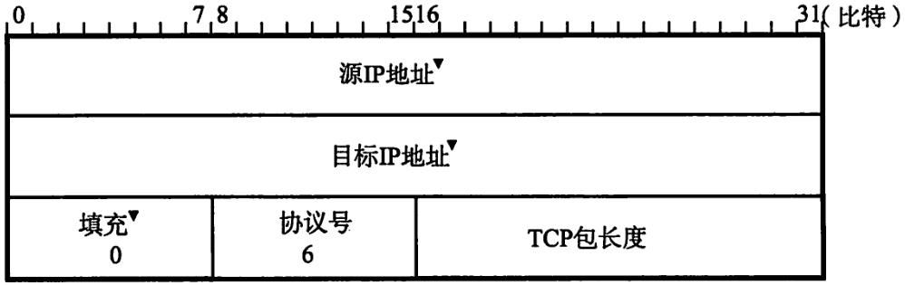

- 紧急指针：只有在URG为1时有效，16位。表示紧急数据的结束位置，一般从数据部分的首位到紧急指针所指示的位置为止为紧急数据。

- 可选项：用于提升TCP的传输性能，根据数据偏移最大60字节，固定首部占有20字节，因此它长度最大为40字节。具有代表性的选项为

  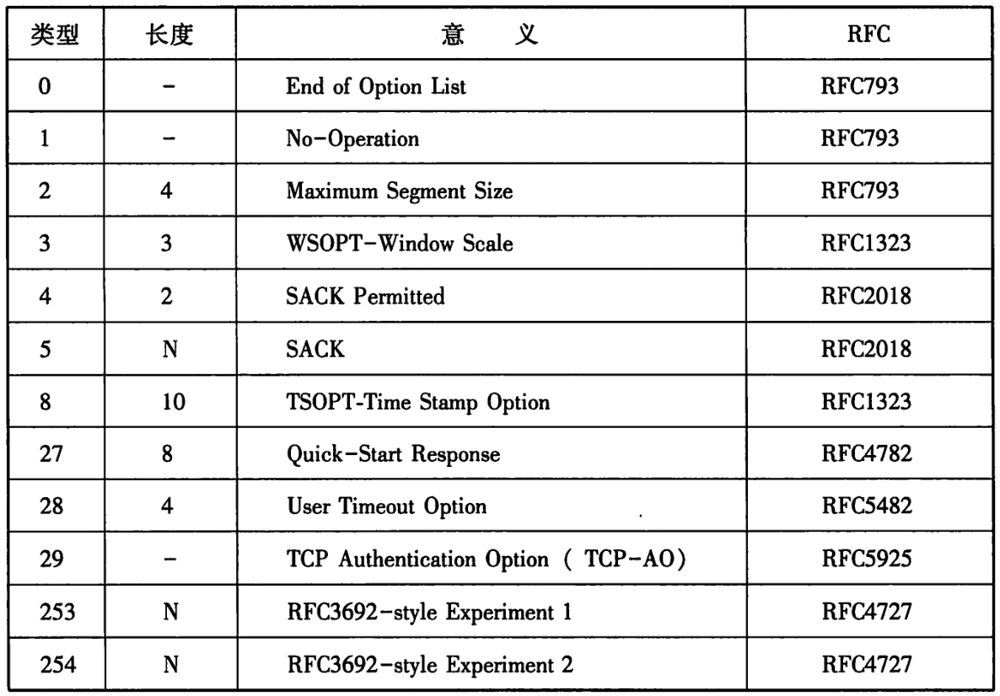

  - 类型2：MSS，用于在建立连接时决定最大段长度，即数据部分长度。**注意MSS与滑动窗口并无直接关系，MSS是为了保证数据包在IP层不需要被分片后再传输，滑动窗口以字节为单位，只要长度超过MSS，就可以组装成一段，其中包含MSS与TCP首部、IP首部之和。**

  - 类型3：窗口扩大，用于改善TCP吞吐量。使用该选项，窗口的最大值可扩展到1G字节。

  - 类型8：时间戳，用于高速通信中对序列号的管理，传输超过4个G的数据时，32位的序列号可能迅速用完，这时序列号将退回去，新序列号小于老序列号。因此时间戳用于区分新老序列号。还可以用于计算往返时间RTT。

  - 类型4、5：选择确认应答（selective ack），将不连续的数据块的左右边界返回给发送端，最多只能包含4个数据块的边界（可选项一共40字节， ACK为4个字节，4个数据块有8个边界，剩余8个字节分别指明使用SACK和占用字节数）。

    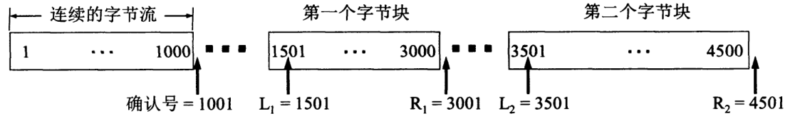

#### 6.5 其他传输层协议

- UDP-Lite：轻量级用户报协议，是扩展UDP功能的一种协议。它计算校验和的范围可以由应用层自行决定，这样可以只针对不允许发生错误的部分进行校验，其他部分发生错误也会被忽略掉，从而不用将已接收到的含有部分错误的数据全部丢弃掉。
- SCTP（stream control transmission protocol）：保证传输可靠性，主要特点有：
  - 以消息为单位发送
  - 支持多重宿主（一台主机有多个NIC）
  - 支持多数据流通信
  - 可以定义消息的生存期限
- DDCP（datagram congestion control protocol）：辅助UDP的传输层协议，提供拥塞控制，主要特点有：
  - 不提供发送数据的可靠性传输。
  - 面向连接，具备建立连接和断开连接的处理。
  - 能够根据网络拥堵情况进行拥塞处理。
  - 为了进行拥塞控制，接收端收到包后返回确认应答。

### 第八章 应用层

#### 8.2 远程登陆

- telnet利用一条TCP连接，向远程主机发送命令并执行，无需登陆密码。可以仿真终端，并且提供行模式（一行命令才发送）/透明模式（每个字符都发送）的切换。
- ssh（secure shell）是加密的远程登录系统，还包括很多方便功能如
  - 使用更强的认证机制。
  - 转发文件。
  - 端口转发功能（将特定端口号所收到的信息转发到特定的IP地址和端口号，可用于实现VPN）。

#### 8.3 文件传输

- FTP使用两条TCP连接，一条用于控制（端口21），另一条用于文件传输（端口20）。
- 控制部分涉及用户名和密码的验证、发送文件的名称、发送方式等等。当进行文件GET、PUT、LIST等操作时，每个操作都将新建一条连接用于数据传输，数据传输完毕就断开这条数据连接。

#### 8.4 电子邮件

- 电子邮件早期直接在发送端与接收端之间建立TCP连接进行传输，现在需要经过邮件服务器进行中转。

- 电子邮件的机制由三部分组成，分别是邮件地址、数据格式及发送协议。
  - 邮件地址格式为 名称@地址，邮件地址由DNS进行管理。
  - 数据格式为MIME类型。
  - 发送协议为SMTP，使用TCP端口25
  
- 接收协议为POP（post office protocol），发送协议考虑的是发送端的行为，因此接收协议用于接收端请求服务器获取邮件，邮件由客户端进行管理（也就是服务器只是进行邮件暂存，换一个终端将看不到邮件信息，还得重新下载一遍）。

  IMAP（internet message access protocol）也是接收协议，与POP区别在于它的邮件由服务器管理，这样可以在不同的终端上同步邮件信息。

#### 8.5 WWW

- 万维网的三个基本构成技术：
  - URI用于标识资源。一般使用URL标识资源在互联网中的具体位置。URI有多种方案，如网络中的资源用http，本机资源用file，如`file:///C:/Users/hp/Desktop/计算机网络（第7版）-谢希仁.pdf`。
  - HTML用于构建web页面的超文本。
  - HTTP用于超文本传输。客户端将首先向服务器发送一个TCP连接，在这个连接上进行请求和应答以及数据报文的发送。

#### 8.6 网络管理

- SNMP通过UDP连接，与被管理端进行通信，获取被管理端的必要信息，或者修改被管理端的参数设置。

  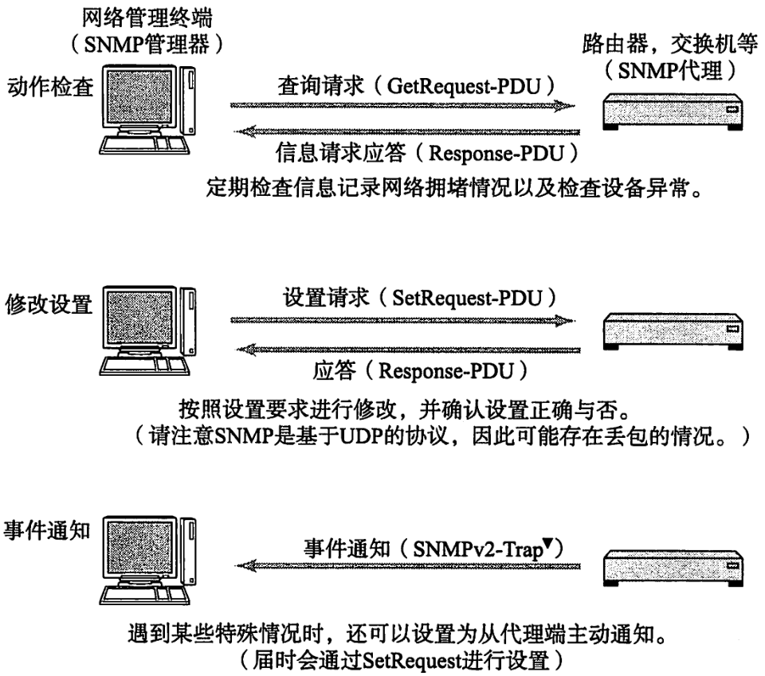

- 交互信息为MIB（management information base），是由被管理端的各种参数组成的树形数据结构。

#### 8.7 其他应用层协议

- 多媒体通信实现技术

  只使用UDP协议还不足以进行实时多媒体通信，还需要H.323、SIP等呼叫控制的协议，以建立连接；RTP协议，以结合多媒体数据本身的特性进行传输；压缩技术，实时传输大容量多媒体数据时进行压缩。

- P2P

  不经过服务器，直接进行1对1相互通信的技术，如Skype。

- LDAP（lightweight directory access protocol）

  轻量级访问目录协议，目录服务是指网络上各种资源的管理服务，类似于DNS对域名的管理。

### 第九章 网络安全

#### 9.2 网络安全的构成要素

- 防火墙：专门过滤特定数据包的包过滤防火墙，或者由应用处理并拒绝访问的应用网关。主要目的是避免域内受到非法访问。
- IDS（入侵检测系统）：只要符合防火墙的通过标准，就能通过防火墙，但是无法确定是否为非法访问，IDS用于检测这种已经入侵的非法访问。
- 杀毒软件。

#### 9.3 加密技术

- 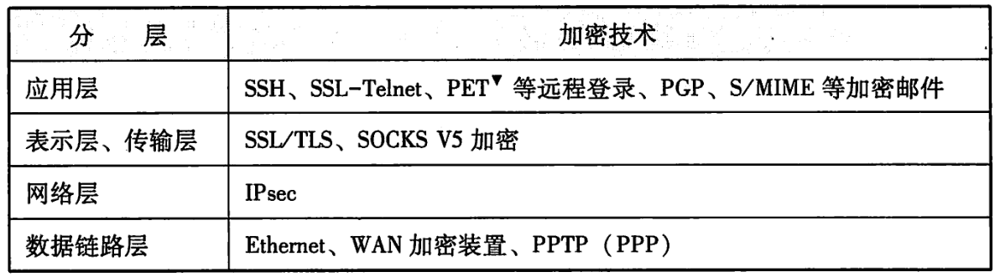

- 对称密码体系和公钥密码体系

  对称密码体系加密和解密使用相同的密钥，包括AES（advanced encryption standard）、DES（data encryption standard）等。

  公钥密码体系使用两个密钥，即对方的公钥进行加密、自己的密钥进行解密，包括RSA、DH、椭圆曲线等。

- 身份认证技术

  根据私有信息认证，如密码、私有识别码等。

  根据公开信息认证，如ID卡、电子证书、电话号码等。

  根据体态特征认证，如指纹、视网膜等。

#### 9.4 安全协议

- IPsec和VPN

  为了防止秘密信息泄露，一般不希望直接在互联网上传输，但是搭建专线网络成本较高，因此出现了VPN（virtual private network），它通过加密和认证技术实现。

  在构建VPN时，最常使用的IPsec，它是指在IP首部后面追加“封装安全有效载荷”和“认证首部”，对后面的数据进行加密。

  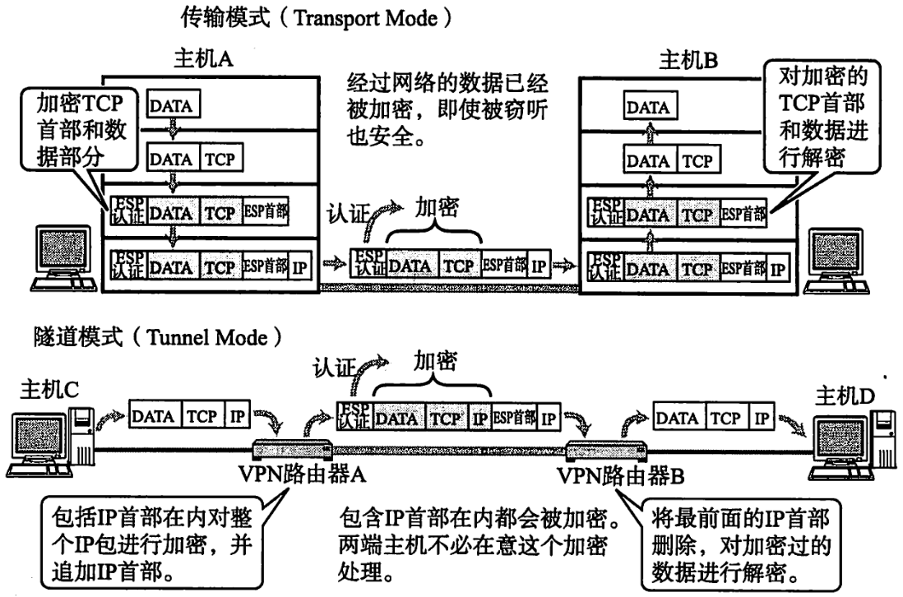

- TLS/SSL和HTTPS

  Web中可以使用SSL对HTTP通信进行加密，即HTTPS。它在发送共享密钥时采用非对称加密方式，在传送普通数据时采用对称加密方式。

  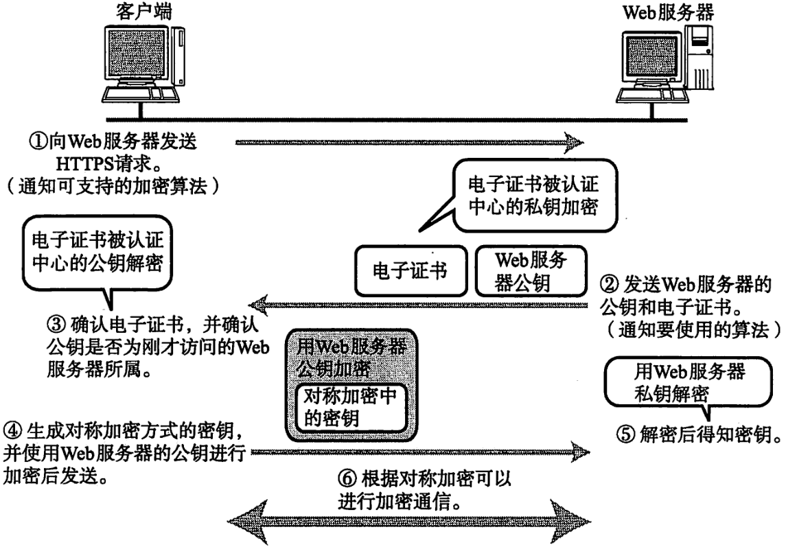

- IEEE802.1X

  接入无线网的认证协议。

  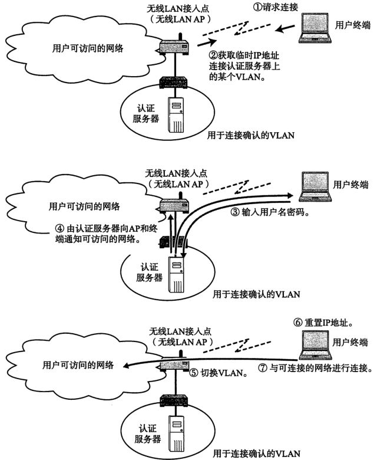