### 第1章 分布式架构

#### 1.1 从集中式到分布式

##### 1.1.1 集中式的特点

所谓的集中式系统就是指由一台或多台主计算机组成中心节点，数据集中存储于这个中 心节点中，并且整个系统的所有业务单元都集中部署在这个中心节点上，系统的所有功 能均由其集中处理。也就是说，在集中式系统中，每个终端或客户端机器仅仅负责数据 的录入和输出，而数据的存储与控制处理完全交由主机来完成。

集中式系统最大的特点就是部署结构简单。由于集中式系统往往基于底层性能卓越的大 型主机，因此无须考虑如何对服务进行多个节点的部署，也就不用考虑多个节点之间的 分布式协作问题。 

##### 1.1.2分布式的特点

在《分布式系统概念与设计》一书中，对分布式系统做了如下定义：

分布式系统是一个硬件或软件组件分布在不同的网络计算机上，彼此之间仅仅通过消息传递进行通信和协调的系统。

一个标准的分布式系统在没有任何特定业务逻辑约束的情况下，都会有如下几个特征。

- 分布性：分布式系统中的多台计算机都会在空间上随意分布，同时，机器的分布情况也会随时变动。
- 对等性：分布式系统中的计算机没有主/从之分，既没有控制整个系统的主机，也没有被控制的从机，组成分布式系统的所有计算机节点都是对等的。副本（Replica）是分布式系统最常见的概念之一，指的是分布式系统对数据和服务提供的一种冗余方式。在常见的分布式系统中，为了对外提供高可用的服务，我们往往会对数据和服务进行副本处理。数据副本是指在不同的节点上持久化同一份数据，当某一个节点上存 储的数据丢失时，可以从副本上读取到该数据，这是解决分布式系统数据丢失问题最为有效的手段。另一类副本是服务副本，指多个节点提供同样的服务，每个节点 都有能力接收来自外部的请求并进行相应的处理。
- 并发性：在一个计算机网络中，程序运行过程中的并发性操作是非常常见的行为，例如同一个分布式系统中的多个节点，可能会并发地操作一些共享的资源，诸如数据库或分布式存储等，如何准确并高效地协调分布式并发操作也成为了分布式系统架构与设计中最大的挑战之一。
- 缺乏全局时钟：一个典型的分布式系统是由一系列在空间上随意分布的多个进程组成的，具有明显的分布性，这些进程之间通过交换消息来进行相互通信。因此，在分布式系统中，很难定义两个事件究竟谁先谁后，原因就是分布式系统缺乏一个全局的时钟序列控制。
- 故障总是会发生：组成分布式系统的所有计算机，都有可能发生任何形式的故障。一个被大量工程实践所检验过的黄金定理是：任何在设计阶段考虑到的异常情况，一定会在系统实际运行中发生，并且，在系统实际运行过程中还会遇到很多在设计时未能考虑到的异常故障。所以，除非需求指标允许，在系统设计时不能放过任何异常情况。

##### 1.1.3 分布式环境的各种问题

- 通信异常：从集中式向分布式演变的过程中，必然引入了网络因素，而由于网络本身的不可靠性， 因此也引入了额外的问题。分布式系统需要在各个节点之间进行网络通信，因此每次网 络通信都会伴随着网络不可用的风险，网络光纤、路由器或是DNS等硬件设备或是系统不可用都会导致最终分布式系统无法顺利完成一次网络通信。另外，即使分布式系统 各节点之间的网络通信能够正常进行，其延时也会远大于单机操作。通常我们认为在现代计算机体系结构中，单机内存访问的延时在纳秒数量级（通常是10ns左右），而正常的一次网络通信的延迟在0.1〜1ms左右（相当于内存访问延时的105〜106倍），如此巨大的延时差别，也会影响消息的收发的过程，因此消息丢失和消息延迟变得非常普遍。

- 网络分区：当网络由于发生异常情况，导致分布式系统中部分节点之间的网络延时不断增大，最终导致组成分布式系统的所有节点中，只有部分节点之间能够进行正常通信，而另一些节点则不能——我们将这个现象称为网络分区，就是俗称的“脑裂”。当网络分区出现时，分布式系统会出现局部小集群，在极端情况下，这些局部小集群会独立完成原本需要整个分布式系统才能完成的功能，包括对数据的事务处理，这就对分布式一致性提出了非常大的挑战。

- 三态：从上面的介绍中，我们已经了解到了在分布式环境下，网络可能会出现各式各样的问题， 因此分布式系统的每一次请求与响应，存在特有的“三态”概念，即成功、失败与超时。在传统的单机系统中，应用程序在调用一个函数之后，能够得到一个非常明确的响应：成功或失败。而在分布式系统中，由于网络是不可靠的，虽然在绝大部分情况下，网络通信也能够接收到成功或失败的响应，但是当网络出现异常的情况下，就可能会出现超时现象，通常有以下两种情况：

  - 由于网络原因，该请求（消息）并没有被成功地发送到接收方，而是在发送过程就发生了消息丢失现象。
  - 该请求（消息）成功的被接收方接收后，并进行了处理，但是在将响应反馈给发送方的过程中，发生了消息丢失现象。

  当出现这样的超时现象时，网络通信的发起方是无法确定当前请求是否被成功处理的。

- 节点故障：节点故障则是分布式环境下另一个比较常见的问题，指的是组成分布式系统的服务器节点出现的宕机或“僵死”现象。通常根据经验来说，每个节点都有可能会出现故障，并且每天都在发生。

#### 1.2 从 ACID 到 CAP/BASE

##### 1.2.1 ACID

事务（Transaction）是由一系列对系统中数据进行访问与更新的操作所组成的一个程序执行逻辑单元（Unit），狭义上的事务特指数据库事务。一方面，当多个应用程序并发访问数据库时，事务可以在这些应用程序之间提供一个隔离方法，以防止彼此的操作互相干扰。另一方面，事务为数据库操作序列提供了一个从失败中恢复到正常状态的方法，同时提供了数据库即使在异常状态下仍能保持数据一致性的方法。 

事务具有四个特征，分别是原子性(Atomicity)、一致性(Consistency)、隔离性(Isolation)和持久性(Durability)，简称为事务的ACID特性。

###### 原子性

事务的原子性是指事务必须是一个原子的操作序列单元。事务中包含的各项操作在一次执行过程中，只允许出现以下两种状态之一。

- 全部成功执行。
- 全部不执行。

任何一项操作失败都将导致整个事务失败，同时其他已经被执行的操作都将被撤销并回滚，只有所有的操作全部成功，整个事务才算是成功完成。

###### —致性

事务的一致性是指事务的执行不能破坏数据库数据的完整性和一致性，一个事务在执行之前和执行之后，数据库都必须处于一致性状态。也就是说，事务执行的结果必须是使数据库从一个一致性状态转变到另一个一致性状态，因此当数据库只包含成功事务提交的结果时，就能说数据库处于一致性状态。而如果数据库系统在运行过程中发生故障，有些事务尚未完成就被迫中断，这些未完成的事务对数据库所做的修改有一部分已写入物理数据库，这时数据库就处于一种不正确的状态，或者说是不一致的状态。

###### 隔离性

事务的隔离性是指在并发环境中，并发的事务是相互隔离的，一个事务的执行不能被其他事务干扰。也就是说，不同的事务并发操纵相同的数据时，每个事务都有各自完整的数据空间，即一个事务内部的操作及使用的数据对其他并发事务是隔离的，并发执行的各个事务之间不能互相干扰。

在标准SQL规范中，定义了 4 个事务隔离级别，不同的隔离级别对事务的处理不同，如未授权读取、授权读取、可重复读取和串行化。

- 未授权读取：未授权读取也被称为读未提交(Read Uncommitted)，该隔离级别允许脏读取，其隔离级别最低。换句话说，如果一个事务正在处理某一数据，并对其进行了更新，但同时尚未完成事务，因此还没有进行事务提交；而与此同时，允许另一个事务也能够访问该数据。举个例子来说，事务A和事务B同时进行，事务A在整个执行阶段，会将某数据项的值从1开始，做一系列加法操作(比如说加1操作)直到变成10之后进行事务提交，此时，事务B能够看到这个数据项在事务A操作过程中的所有中间值(如1变成2、2变成3等)，而对这一系列的中间值的读取就是未授权读取。

- 授权读取：授权读取也被称为读已提交(Read Committed)，它和未授权读取非常相近，唯一的区别就是授权读取只允许获取已经被提交的数据。同样以上面的例子来说，事务A和事务B同时进行，事务A进行与上述同样的操作，此时，事务B无法看到这个数据项在事务A操作过程中的所有中间值，只能看到最终的10。另外，如果说有一个事务C，和事务A进行非常类似的操作，只是事务C是将数据项从10加到20，此时事务B也同样可以读取到20，即授权读取允许不可重复读取。

- 可重复读取：可重复读取(Repeatable Read)，简单地说，就是保证在事务处理过程中，多次读取同一个数据时，其值都和事务开始时刻是一致的。因此该事务级别禁止了不可重复读取和脏读取，但是有可能出现幻影数据。所谓幻影数据，就是指同样的事务操作， 在前后两个时间段内执行对同一个数据项的读取，可能出现不一致的结果。在上面的例子，可重复读取隔离级别能够保证事务B在第一次事务操作过程中，始终对数据项读取到1，但是在下一次事务操作中，即使事务B (注意，事务名字虽然相同， 但是指的是另一次事务操作)采用同样的査询方式，就可能会读取到10或20。
- 串行化：串行化(Serializable)是最严格的事务隔离级别。它要求所有事务都被串行执行，即事务只能一个接一个地进行处理，不能并发执行。


| 隔离级别   | 脏 读  | 可重复读 | 幻 读  |
| ---------- | ------ | -------- | ------ |
| 未授权读取 | 存在   | 不可以   | 存在   |
| 授权读取   | 不存在 | 不可以   | 存在   |
| 可重复读取 | 不存在 | 可以     | 存在   |
| 串行化     | 不存在 | 可以     | 不存在 |

事务隔离级别越高，就越能保证数据的完整性和一致性，但同时对并发性能的影响也越大。通常，对于绝大多数的应用程序来说，可以优先考虑将数据库系统的隔离级别设置为授权读取，这能够在避免脏读取的同时保证较好的并发性能。尽管这种事务隔离级别会导致不可重复读、虚读和第二类丢失更新等并发问题，但较为科学的做法是在可能出现这类问题的个别场合中，由应用程序主动采用悲观锁或乐观锁来进行事务控制。

###### 持久性

事务的持久性也被称为永久性，是指一个事务一旦提交，它对数据库中对应数据的状态变更就应该是永久性的。换句话说，一旦某个事务成功结束，那么它对数据库所做的更新就必须被永久保存下来——即使发生系统崩溃或机器宕机等故障，只要数据库能够重新启动，那么一定能够将其恢复到事务成功结束时的状态。

##### 1.2.2 分布式事务

分布式事务是指事务的参与者、支持事务的服务器、资源服务器以及事务管理器分别位于分布式系统的不同节点之上。通常一个分布式事务中会涉及对多个数据源或业务系统的操作。

我们可以设想一个最典型的分布式事务场景：一个跨银行的转账操作涉及调用两个异地的银行服务，其中一个是本地银行提供的取款服务，另一个则是目标银行提供的存款服务，这两个服务本身是无状态并且是互相独立的，共同构成了一个完整的分布式事务。如果从本地银行取款成功，但是因为某种原因存款服务失败了，那么就必须回滚到取款前的状态，否则用户可能会发现自己的钱不翼而飞了。

从上面这个例子中，我们可以看到，一个分布式事务可以看作是由多个分布式的操作序列组成的，例如上面例子中的取款服务和存款服务，通常可以把这一系列分布式的操作序列称为子事务。

##### 1.2.3 CAP 和 BASE 理论

###### CAP 定理

CAP 理论告诉我们，一个分布式系统不可能同时满足一致性（C：Consistency），可用性（A：Availability）和分区容错性（P：Partition tolerance）这三个基本需求，最多只能同时满足其中的两项。

- 一致性：在分布式环境中，一致性是指数据在多个副本之间是否能够保持一致的特性。在一致性的需求下，当一个系统在数据一致的状态下执行更新操作后，应该保证系统的数据仍然处于一致的状态。

  对于一个将数据副本分布在不同分布式节点上的系统来说，如果对第一个节点的数据进行了更新操作并且更新成功后，却没有使得第二个节点上的数据得到相应的更新，于是在对第二个节点的数据进行读取操作时，获取的依然是老数据（或称为脏数据），这就是典型的分布式数据不一致情况。在分布式系统中，如果能够做到针对一个数据项的更新操作执行成功后，所有的用户都可以读取到其最新的值，那么这样的系统就被认为具有强一致性（或严格的一致性）。

- 可用性：可用性是指系统提供的服务必须一直处于可用的状态，对于用户的每一个操作请求总是能够在有限的时间内返回结果。

  “有限的时间内”是指，对于用户的一个操作请求，系统必须能够在指定的时间（即响应时间）内返回对应的处理结果，如果超过了这个时间范围，那么系统就被认为是不可用的。另外，“有限的时间内”是一个在系统设计之初就设定好的系统运行指标，通常不同的系统之间会有很大的不同。

  “返回结果”是可用性的另一个非常重要的指标，它要求系统在完成对用户请求的处理后，返回一个正常的响应结果。正常的响应结果通常能够明确地反映出对请求的处理结果，即成功或失败，而不是一个让用户感到困惑的返回结果（“OutOfMemoryErrorw“或”System Has Crashed” ）。

- 分区容错性：分区容错性约束了一个分布式系统需要具有如下特性：分布式系统在遇到任何网络分区故障的时候，仍然需要能够保证对外提供满足一致性和可用性的服务，除非是整个网络环境都发生了故障。

  网络分区是指在分布式系统中，不同的节点分布在不同的子网络（机房或异地网络等）中，由于一些特殊的原因导致这些子网络之间出现网络不连通的状况，但各个子网络的内部网络是正常的，从而导致整个系统的网络环境被切分成了若干个孤立的区域。需要注意的是，组成一个分布式系统的每个节点的加入与退出都可以看作是一个特殊的网络分区。

| 放弃CAP定理 | 说 明                                                        |
| ----------- | ------------------------------------------------------------ |
| 放弃P       | 如果希望能够避免系统出现分区容错性问题，一种较为简单的做法是将所有的数据（或者仅仅是那些与事务相关的数据）都放在一个分布式节点上。这样的做法虽然无法100%地保证系统不会出错，但至少不会碰到由于网络分区带来的负面影响。但同时需要注意的是，放弃P的同时也就意味着放弃了系统的可扩展性。 |
| 放弃A       | 相对于放弃“分区容错性”来说，放弃可用性则正好相反，其做法是一旦系统遇到网络分区或其他故障时，那么受到影响的服务需要等待一定的时间，因此在等待期间系统无法对外提供正常的服务，即不可用。 |
| 放弃C       | 这里所说的放弃一致性，并不是完全不需要数据一致性，如果真是这样的话，那么系统的数据都是没有意义的，整个系统也是没有价值的。事实上，放弃一致性指的是放弃数据的强一致性，而保留数据的最终一致性。这样的系统无法保证数据保持实时的一致性，但是能够承诺的是，数据最终会达到一个一致的状态。这就引入了一个时间窗口的概念，具体多久能够达到数据一致取决于系统的设计，主要包括数据副本在不同节点之间的复制时间长短。 |

对于一个分布式系统而言，分区容错性可以说是一个最基本的要求。为什么这样说，其实很简单，因为既然是一个分布式系统，那么分布式系统中的组件必然需要被部署到不同的节点，否则也就无所谓分布式系统了，因此必然出现子网络。而对于分布式系统而言，网络问题又是一个必定会出现的异常情况，因此分区容错性也就成为了一个分布式系统必然需要面对和解决的问题。 因此系统架构设计师往往需要把精力花在如何根据业务特点在C（一致性）和A（可用性）之间寻求平衡。

###### BASE理论

BASE 是 Basically Available（基本可用）、Soft state（软状态）和 Eventually consistent（最终一致性）三个短语的简写，是对CAP中一致性和可用性权衡的结果，其来源于对大规模互联网系统分布式实践的总结，是基于CAP定理逐步演化而来的，其核心思想是即使无法做到强一致性(Strong consistency)，但每个应用都可以根据自身的业务特点，采用适当的方式来使系统达到最终一致性(Eventual consistency)。

- 基本可用：基本可用是指分布式系统在出现不可预知故障的时候，允许损失部分可用性——但请注意，这绝不等价于系统不可用。以下两个就是“基本可用”的典型例子。

  - 响应时间上的损失：正常情况下，一个在线搜索引擎需要在0.5秒之内返回给用户相应的查询结果，但由于出现故障(比如系统部分机房发生断电或断网故障)，查询结果的响应时间增加到了 1〜2 秒。
  - 功能上的损失：正常情况下，在一个电子商务网站上进行购物，消费者几乎能够顺利地完成每一笔订单，但是在一些节日大促购物高峰的时候，由于消费者的购物行为激增，为了保护购物系统的稳定性，部分消费者可能会被引导到一个降级页面。

- 弱状态：弱状态也称为软状态，和硬状态相对，是指允许系统中的数据存在中间状态，并认为该中间状态的存在不会影响系统的整体可用性，即允许系统在不同节点的数据副本之间进行数据同步的过程存在延时。

- 最终一致性：最终一致性强调的是系统中所有的数据副本，在经过一段时间的同步后，最终能够达到一个一致的状态。因此，最终一致性的本质是需要系统保证最终数据能够达到一致，而不需要实时保证系统数据的强一致性。

  在实际工程实践中，最终一致性存在以下五类主要变种。

  - 因果一致性(**Causal consistency**)：因果一致性是指，如果进程A在更新完某个数据项后通知了进程B，那么进程B之后对该数据项的访问都应该能够获取到进程A更新后的最新值，并且如果进程B要对该数据项进行更新操作的话，务必基于进程A更新后的最新值，即不能发生丢失更新情况。与此同时，与进程A无因果关系的进程C的数据访问则没有这样的限制。
  - 读己之所写(**Read your writes**)：读己之所写是指，进程A更新一个数据项之后，它自己总是能够访问到更新过的最新值，而不会看到旧值。也就是说，对于单个数据获取者来说，其读取到的数据， 一定不会比自己上次写入的值旧。因此，读己之所写也可以看作是一种特殊的因果一致性。
  - 会话一致性 (**Session consistency**)：会话一致性将对系统数据的访问过程框定在了一个会话当中：系统能保证在同一个有效的会话中实现“读己之所写”的一致性，也就是说，执行更新操作之后，客户端能够在同一个会话中始终读取到该数据项的最新值。
  - 单调读一致性(**Monotonic read consistency**)：单调读一致性是指如果一个进程从系统中读取出一个数据项的某个值后，那么系统对于该进程后续的任何数据访问都不应该返回更旧的值。
  - 单调写一致性(**Monotonic write consistency**)：单调写一致性是指，一个系统需要能够保证来自同一个进程的写操作被顺序地执行。

  总的来说，BASE理论面向的是大型高可用可扩展的分布式系统，和传统事务的ACID特性是相反的，它完全不同于ACID的强一致性模型，而是提出通过牺牲强一致性来获得可用性，并允许数据在一段时间内是不一致的，但最终达到一致状态。但同时，在实际的分布式场景中，不同业务单元和组件对数据一致性的要求是不同的，因此在具体的分布式系统架构设计过程中，ACID特性与BASE理论往往又会结合在一起使用。

### 第2章 一致性协议

#### 2.1 2PC 与 3PC

在分布式系统中，每一个机器节点虽然都能够明确地知道自己在进行事务操作过程中的结果是成功或失败，但却无法直接获取到其他分布式节点的操作结果。因此，当一个事务操作需要跨越多个分布式节点的时候，为了保持事务处理的ACID特性，就需要引入一个称为“协调者(Coordinator)"的组件来统一调度所有分布式节点的执行逻辑，这 些被调度的分布式节点则被称为“参与者”(Participant)。协调者负责调度参与者的行为，并最终决定这些参与者是否要把事务真正进行提交。基于这个思想，衍生出了二阶段提交和三阶段提交两种协议。

##### 2.1.1 2PC

2PC，是Two-Phase Commit的缩写，即二阶段提交，是计算机网络尤其是在数据库领域内，为了使基于分布式系统架构下的所有节点在进行事务处理过程中能够保持原子性和一致性而设计的一种算法。通常，二阶段提交协议也被认为是一种一致性协议，用来保证分布式系统数据的一致性。目前，绝大部分的关系型数据库都是采用二阶段提交协议来完成分布式事务处理的，利用该协议能够非常方便地完成所有分布式事务参与者的协调，统一决定事务的提交或回滚，从而能够有效地保证分布式数据一致性，因此二阶段提交协议被广泛地应用在许多分布式系统中。

###### 阶段一：提交事务请求，“投票阶段”

1. 事务询问。协调者向所有的参与者发送事务内容，询问是否可以执行事务提交操作，并开始等待各参与者的响应。

2. 执行事务。各参与者节点执行事务操作，并将Undo和Redo信息记入事务日志中。

3. 各参与者向协调者反馈事务询问的响应。如果参与者成功执行了事务操作，那么就反馈给协调者Yes响应，表示事务可以执行；如果参与者没有成功执行事务，那么就反馈给协调者No响应，表示事务不可以执行。

###### 阶段二：执行事务提交，“执行阶段”

- 执行事务提交：假如协调者从所有的参与者获得的反馈都是Yes响应，那么就会执行事务提交。
  1. 发送提交请求。协调者向所有参与者节点发出Commit请求。
  2. 事务提交。参与者接收到Commit请求后，会正式执行事务提交操作，并在完成提交之后释放在整个事务执行期间占用的事务资源。
  3. 反馈事务提交结果。参与者在完成事务提交之后，向协调者发送Ack消息。
  4. 完成事务。协调者接收到所有参与者反馈的Ack消息后，完成事务。
- 中断事务：假如任何一个参与者向协调者反馈了No响应，或者在等待超时之后，协调者尚无法接收到所有参与者的反馈响应，那么就会中断事务。
  1. 发送回滚请求。协调者向所有参与者节点发出Rollback请求。
  2. 事务回滚。参与者接收到Rollback请求后，会利用其在阶段一中记录的Undo信息来执行事务回滚操作，并在完成回滚之后释放在整个事务执行期间占用的资源。
  3. 反馈事务回滚结果。参与者在完成事务回滚之后，向协调者发送Ack消息。
  4. 中断事务。协调者接收到所有参与者反馈的Ack消息后，完成事务中断。

简单地讲，二阶段提交将一个事务的处理过程分为了投票和执行两个阶段，其核心是对每个事务都采用先尝试后提交的处理方式，因此也可以将二阶段提交看作一个强一致性的算法。


###### 优缺点

二阶段提交协议的优点：原理简单，实现方便。

二阶段提交协议的缺点：同步阻塞、单点问题、脑裂、太过保守。

- 同步阻塞：二阶段提交协议存在的最明显也是最大的一个问题就是同步阻塞，这会极大地限制分布式系统的性能。在二阶段提交的执行过程中，所有参与该事务操作的逻辑都处于阻塞状态，也就是说，各个参与者在等待其他参与者响应的过程中，将无法进行其他任何操作。

- 单点问题：协调者的角色在整个二阶段提交协议中起到了非常重要的作用。一旦协调者出现问题，那么整个二阶段提交流程将无法运转，更为严重的是，如果协调者是在阶段二中出现问题的话，那么其他参与者将会一直处于锁定事务资源的状态中，而无法继续完成事务操作。

- 数据不一致：在二阶段提交协议的阶段二，即执行事务提交的时候，当协调者向所有的参与者发送Commit请求之后，发生了局部网络异常或者是协调者在尚未发送完Commit请求之前自身发生了崩溃，导致最终只有部分参与者收到了Commit请求。于是，这部分收到了 Commit请求的参与者就会进行事务的提交，而其他没有收到Commit请求的参与者则无法进行事务提交，于是整个分布式系统便出现了数据不一致性现象。

- 太过保守：如果在协调者指示参与者进行事务提交询问的过程中，参与者出现故障而导致协调者始终无法获取到所有参与者的响应信息的话，这时协调者只能依靠其自身的超时机制来判断是否需要中断事务，这样的策略显得比较保守。换句话说，二阶段提交协议没有设计较为完善的容错机制，任意一个节点的失败都会导致整个事务的失败。

##### 2.1.2 3PC

3PC，是Three-Phase Commit的缩写，即三阶段提交，是2PC的改进版，其将二阶段提交协议的“提交事务请求” 过程一分为二，形成了由 CanCommit，PreCommit 和 doCommit 三个阶段组成的事务处理协议。


###### 阶段一：CanCommit

1. 事务询问。协调者向所有的参与者发送一个包含事务内容的canCommit请求，询问是否可以执行事务提交操作，并开始等待各参与者的响应。

2. 各参与者向协调者反馈事务询问的响应。参与者在接收到来自协调者的canCommit请求后，正常情况下，如果其自身认为可以顺利执行事务，那么会反馈Yes响应，并进入预备状态，否则反馈No响应。

###### 阶段二：PreCommit

- 执行事务预提交：假如协调者从所有的参与者获得的反馈都是Yes响应，那么就会执行事务预提交。

  1. 发送预提交请求。协调者向所有参与者节点发出preCommit的请求，并进入Prepared阶段。

  2. 事务预提交。参与者接收到preCommit请求后，会执行事务操作，并将Undo和Redo信息记录到事务日志中。

  3. 各参与者向协调者反馈事务执行的响应。如果参与者成功执行了事务操作，那么就会反馈给协调者Ack响应，同时等待最终的指令：提交(commit)或中止(abort)。

- 中断事务：假如任何一个参与者向协调者反馈了No响应，或者在等待超时之后，协调者尚无法接收到所有参与者的反馈响应，那么就会中断事务。

  1. 发送中断请求。协调者向所有参与者节点发出abort请求。

  2. 中断事务。无论是收到来自协调者的abort请求，或者是在等待协调者请求过程中出现超时，参与者都会中断事务。

###### 阶段三：doCommit

- 执行提交

  1. 发送提交请求。进入这一阶段，假设协调者处于正常工作状态，并且它接收到了来自所有参与者的Ack响应，那么它将从“预提交”状态转换到“提交”状态，并向所有的参与者发送doCommit请求。

  2. 事务提交。参与者接收到doCommit请求后，会正式执行事务提交操作，并在完成提交之后释放在整个事务执行期间占用的事务资源。

  3. 反馈事务提交结果。参与者在完成事务提交之后，向协调者发送Ack消息。

  4. 完成事务。协调者接收到所有参与者反馈的Ack消息后，完成事务。

- 中断事务：进入这一阶段，假设协调者处于正常工作状态，并且有任意一个参与者向协调者反馈了No响应，或者在等待超时之后，协调者尚无法接收到所有参与者的反馈响应，那么就会中断事务。

  1. 发送中断请求。协调者向所有的参与者节点发送abort请求。

  2. 事务回滚。参与者接收到abort请求后，会利用其在阶段二中记录的Undo信息来执行事务回滚操作，并在完成回滚之后释放在整个事务执行期间占用的资源。

  3. 反馈事务回滚结果。参与者在完成事务回滚之后，向协调者发送Ack消息。

  4. 中断事务。协调者接收到所有参与者反馈的Ack消息后，中断事务。

###### 优缺点

三阶段提交协议的优点：相较于二阶段提交协议，三阶段提交协议最大的优点就是降低了参与者的阻塞范围（因为加了第一阶段只确认一下能不能提交），并且能够在出现单点故障后继续达成一致（是指协调者在三阶段即使因为故障问题无法发出指令，参与者由于在二阶段已经完成了事务操作，因此会在超时后进行事务提交，而不会像2pc那样收不到二阶段的指令就一直处于等待状态）。

三阶段提交协议的缺点：三阶段提交协议在去除阻塞的同时也引入了新的问题，那就是在参与者接收到preCommit 消息后，如果网络出现分区，此时协调者所在的节点和参与者无法进行正常的网络通信，在这种情况下，该参与者依然会进行事务的提交，这必然出现数据的不一致性。

#### 2.2 Paxos 算法

Paxos算法是莱斯利•兰伯特(Leslie Lamport)于1990年提出的一种基于消息传递且具有高度容错特性的一致性算法，是目前公认的解决分布式一致性问题最有效的算法之一。

Paxos算法需要解决的问题就是如何在一个可能发生异常的分布式系统中，快速且正确地在集群内部对某个数据的值达成一致，并且保证不论发生以上任何异常，都不会破坏整个系统的一致性。

Paxos算法引入了“过半”的理念，通俗地讲就是少数服从多数的原则。同时，Paxos算法支持分布式节点角色之间的轮换，这极大地避免了分布式单点的出现，因此Paxos算法既解决了无限期等待问题，也解决了“脑裂”问题，是目前来说最优秀的分布式一致性协议之一。

##### 2.2.3 Paxos算法详解

###### 问题描述

假设有一组可以提出提案的进程集合，那么对于一个一致性算法来说需要保证以下几点:

- 在这些被提出的提案中，只有一个会被选定。

- 如果没有提案被提出，那么就不会有被选定的提案。

- 当一个提案被选定后，进程应该可以获取被选定的提案信息。

对于一致性来说，安全性(Safety)需求如下：

- 只有被提出的提案才能被选定(Chosen)。

- 只能有一个值被选定。

- 如果某个进程认为某个提案被选定了，那么这个提案必须是真的被选定的那个。

Paxos算法的目标就是要保证最终有一个提案会被选定，当提案被选定后，进程最终也能获取到被选定的提案。

在该一致性算法中，有三种参与角色，我们用Proposer，Acceptor和Learner来表示。假设不同参与者之间可以通过收发消息来进行通信，那么：

- 每个参与者以任意的速度执行，可能会因为出错而停止，也可能会重启。同时，即使一个提案被选定后，所有的参与者也都有可能失败或重启，因此除非那些失败或重启的参与者可以记录某些信息，否则将无法确定最终的值。

- 消息在传输过程中可能会出现不可预知的延迟，也可能会重复或丢失，但是消息不会被损坏，即消息内容不会被篡改。

###### 提案的选定

要选定一个唯一提案的最简单方式莫过于只允许一个Accpetor存在，这样的话，Proposer 只能发送提案给该Accpetor，Acceptor会选择它接收到的第一个提案作为被选定的提案。这种解决方式尽管实现起来非常简单，但是却很难让人满意，因为一旦这个Accpetor 出现问题，那么整个系统就无法工作了。

因此，应该寻找一种更好的解决方式，例如可以使用多个Accpetor来避免Accpetor的单点问题。现在我们就来看看，在存在多个Acceptor的情况下，如何进行提案的选取：Proposer向一个Acceptor集合发送提案，同样，集合中的每个Acceptor都可能会批准(Accept)该提案，当有足够多的Acceptor批准这个提案的时候，我们就可以认为该提案被选定了。那么，什么是足够多呢？我们假定足够多的Acceptor是整个Acceptor集合的一个子集，并且让这个集合大得可以包含Acceptor集合中的大多数成员，因为任意两个包含大多数Acceptor的子集至少有一个公共成员（至少为一半+1）。另外我们再规定，每个Acceptor最多只能批准一个提案，那么就能保证只有一个提案被选定了。

###### 推导过程

在没有失败和消息丟失的情况下，如果我们希望即使在只有一个提案被提出的情况下，仍然可以选出一个提案，这就暗示了如下的需求。

```
P1: 一个Acceptor必须批准它收到的第一个提案。
```

在P1的基础上，再加上一个提案被选定需要由半数以上的Acceptor批准的需求暗示着一个Acceptor必须能够批准不止一个提案。

虽然允许多个提案被选定，但同时必须要保证所有被选定的提案都具有相同的Value值一一这是一个关于提案Value的约定，结合提案的编号，该约定可以定义如下：

```
P2：如果编号为M0、Value值为V0的提案（即[M0, V0]）被选定了，那么所有比编号M0更高的，且被选定的提案，其Value值必须也是V0。
```

因为提案的编号是全序的，条件P2就保证了只有一个Value值被选定这一关键安全性属性。同时，一个提案要被选定，其首先必须被至少一个Acceptor批准，因此我们可以通过满足如下条件来满足P2。

```
P2a：如果编号为M0、Value值为V0的提案（即[M0, V0]）被选定了，那么所有比编号M0更高的，且被Acceptor批准的提案，其Value值必须也是V0。
```

如果要同时满足P1和P2a，需要对P2a进行如下强化：

```
P2b：如果一个提案[M0, V0]被选定后，那么之后任何Proposer产生的编号更高的提案，其Value值都为V0。
```

因为编号为M0的提案已经被选定了，这就意味着肯定存在一个由半数以上的Acceptor组成的集合C, C中的每个Acceptor都批准了该提案。因为任何包含半数以上Acceptor的集合S都至少包含C中的一个成员，因此我们可以认为如果保持了下面P2c的不变性，那么编号为Mn的提案的Value也为V0。

```
P2c：对于任意的Mn和Vn，如果提案[Mn，Vn]被提出，那么肯定存在一个由半数以上的Acceptor组成的集合S，满足以下两个条件中的任意一个。
• S中不存在任何批准过编号小于Mn的提案的Acceptor。
• 选取S中所有Acceptor批准的编号小于Mn的提案，其中编号最大的那个提案其Value值是Vn。
```

###### Proposer生成提案

对于一个Proposer来说，获取那些已经被通过的提案远比预测未来可能会被通过的提案来得简单。因此，Proposer在产生一个编号为Mn的提案时，必须要知道当前某一个将要或已经被半数以上Acceptor批准的编号小于Mn但为最大编号的提案。并且，Proposer会要求所有的Acceptor都不要再批准任何编号小于Mn的提案——这就引出了如下的提案生成算法。

1. Proposer选择一个新的提案编号Mn，然后向某个Acceptor集合的成员发送请求，要求该集合中的Acceptor做出如下回应。

   - 向Proposer承诺，保证不再批准任何编号小于Mn的提案。
   - 如果Acceptor已经批准过任何提案，那么其就向Proposer反馈当前该Acceptor已经批准的编号小于Mn但为最大编号的那个提案的值。

   我们将该请求称为编号为Mn的提案的Prepare请求。

2. 如果Proposer收到了来自半数以上的Acceptor的响应结果，那么它就可以产生编号为Mn、Value值为Vn的提案，这里的Vn是所有响应中编号最大的提案的Value值。当然还存在另一种情况，就是半数以上的Acceptor都没有批准过任何提案，即响应中不包含任何的提案，那么此时Vn值就可以由Proposer任意选择。

在确定提案之后，Proposer就会将该提案再次发送给某个Acceptor集合，并期望获得它们的批准，我们称此请求为Accept请求。需要注意的一点是，此时接受Accept请求的Acceptor集合不一定是之前响应Prepare请求的Acceptor集合。因为任意两个半数以上的Acceptor集合，必定包含至少一个公共Acceptor。

###### Acceptor批准提案

一个Acceptor可能会收到来自Proposer的两种请求，分别是Prepare请求和Accept请求，对这两类请求做出响应的条件分别如下。

- Prepare请求：Acceptor可以在任何时候响应一个Prepare请求。

- Accept请求：在不违背Accept现有承诺的前提下，可以任意响应Accept请求。

因此，对Acceptor逻辑处理的约束条件，大体可以定义如下。

```
P1a：一个Acceptor只要尚未响应过任何编号大于Mn的Prepare请求，那么它就可以接受这个编号为Mn的提案。
```

从上面这个约束条件中，我们可以看出，P1a包含了P1。同时，值得一提的是，Paxos 算法允许Acceptor忽略任何请求而不用担心破坏其算法的安全性。

###### 算法优化

假设一个Acceptor收到了一个编号为Mn的Prepare请求，但此时该Acceptor已经对编号大于Mn的Prepare请求做出了响应，因此它肯定不会再批准任何新的编号为Mn的提案，那么很显然，Acceptor就没有必要对这个Prepare请求做出响应，于是Acceptor可以选择忽略这样的Prepare请求。同时，Acceptor也可以忽略掉那些它已经批准过的提案的Prepare请求。

通过这个优化，每个Acceptor只需要记住它已经批准的提案的最大编号以及它已经做出Prepare请求响应的提案的最大编号，以便在出现故障或节点重启的情况下，也能保证P2c的不变性。而对于Proposer来说，只要它可以保证不会产生具有相同编号的提案， 那么就可以丢弃任意的提案以及它所有的运行时状态信息。

###### 算法陈述

- 阶段一

  1. Proposer选择一个提案编号Mn，然后向Acceptor的某个超过半数的子集成员发送编号为Mn的Prepare请求。

  2. 如果一个Acceptor收到一个编号为Mn的Prepare请求，且编号Mn大于该Acceptor已经响应的所有Prepare请求的编号，那么它就会将它已经批准过的最大编号的提案作为响应反馈给Proposer，同时该Acceptor会承诺不会再批准任何编号小于Mn的提案。

     举个例子来说，假定一个Acceptor已经响应过的所有Prepare请求对应的提案编号分别为1、2、…、5和7,那么该Acceptor在接收到一个编号为8的Prepare请求后，就会将编号为7的提案作为响应反馈给Proposer。

- 阶段二

  1. 如果Proposer收到来自半数以上的Acceptor对于其发出的编号为Mn的Prepare请求的响应，那么它就会发送一个针对[Mn,Vn]提案的Accept请求给Acceptor。注意，Vn的值就是收到的响应中编号最大的提案的值，如果响应中不包含任何提案，那么它就是任意值。
  2. 如果Acceptor收到这个针对[Mn, VnJ提案的Accept请求，只要该Acceptor尚未对编号大于Mn的Prepare请求做出响应，它就可以通过这个提案。

###### 提案的获取

- 方案一：Learner获取一个已经被选定的提案的前提是，该提案已经被半数以上的Acceptor批准。因此，最简单的做法就是一旦Acceptor批准了一个提案，就将该提案发送给所有的Learner。很显然，这种做法虽然可以让Learner尽快地获取被选定的提案，但是却需要让每个Acceptor与所有的Learner逐个进行一次通信，通信的次数至少为二者个数的乘积。

- 方案二：另一种可行的方案是，我们可以让所有的Acceptor将它们对提案的批准情况，统一发送给一个特定的Learner(下文中我们将这样的Learner称为“主Learner")，在不考虑拜占庭将军问题的前提下，我们假定Learner之间可以通过消息通信来互相感知提案的选定情况。基于这样的前提，当主Learner被通知一个提案已经被选定时，它会负责通知其他的Learner。

  在这种方案中，Acceptor首先会将得到批准的提案发送给主Learner，再由其同步给其他Learner，因此较方案一而言，方案二虽然需要多一个步骤才能将提案通知到所有的Learner，但其通信次数却大大减少了，通常只是Acceptor和Learner的个数总和。但同时，该方案引入了一个新的不稳定因素：主Learner随时可能出现故障。

- 方案三：对方案二进行改进，可以将主Learner的范围扩大，即Acceptor可以将批准的提案发送给一个特定的Learner集合，该集合中的每个Learner都可以在一个提案被选定后通知所有其他的Learner。这个Learner集合中的Learner个数越多，可靠性就越好，但同时网络通信的复杂度也就越高。

### 第3章 Paxos的工程实践

#### 3.1 Chubby

##### 3.1.1 概述

Chubby是一个面向松耦合分布式系统的锁服务，通常用于为一个由大量小型计算机构成的松耦合分布式系统提供高可用的分布式锁服务。一个分布式锁服务的目的是允许它的客户端进程同步彼此的操作，并对当前所处环境的基本状态信息达成一致。针对这个目的，Chubby提供了粗粒度的分布式锁服务，开发人员不需要使用复杂的同步协议，而是直接调用Chubby的锁服务接口即可实现分布式系统中多个进程之间粗粒度的同步控制，从而保证分布式数据的一致性。

Chubby的客户端接口设计非常类似于UNIX文件系统结构，应用程序通过Chubby的客户端接口，不仅能够对Chubby服务器上的整个文件进行读写操作，还能够添加对文件节点的锁控制，并且能够订阅Chubby服务端发出的一系列文件变动的事件通知。

##### 3.1.2 应用场景

在Chubby的众多应用场景中，最为典型的就是集群中服务器的Master选举。例如在 Google 文件系统(Google File System,GFS)中使用 Chubby 锁服务来实现对 GFS Master 服务器的选举。而在BigTable中，Chubby同样被用于Master选举，并且借助Chubby，Master能够非常方便地感知到其所控制的那些服务器。

##### 3.1.3 设计目标

Chubby被设计成一个需要访问中心化节点的分布式锁服务，是因为锁服务具有以下4个传统算法库所不具有的优点。

- 对上层应用程序的侵入性更小：对于应用程序，尤其是上层的业务系统来说，在系统开发初期，开发人员并没有为 系统的高可用性做好充分的考虑。事实上，绝大部分的系统一开始都是从一个只需要支撑较小的负载，并且只需要保证大体可用的原型开始的，往往并没有在代码层面为分布式一致性协议的实现留有余地。当系统提供的服务日趋成熟，并且得到一定规模的用户认可之后，系统的可用性就会变得越来越重要了。于是，集群中副本复制和Master选举等一系列提高分布式系统可用性的措施，就会被加入到一个已有的系统中去。

  在这种情况下，尽管这些措施都可以通过一个封装了分布式一致性协议的客户端库来完成，但相比之下，使用一个分布式锁服务的接口方式对上层应用程序的侵入性会更小，并且更易于保持系统已有的程序结构和网络通信模式。

- 便于提供数据的发布与订阅：几乎在所有使用Chubby进行Master选举的应用场景中，都需要一种广播结果的机制，用来向所有的客户端公布当前的Master服务器。这就意味着Chubby应该允许其客户端在服务器上进行少量数据的存储与读取——也就是对小文件的读写操作。虽然这个特性也能够通过一个分布式命名服务来实现，但是根据实际的经验来看，分布式锁服务本身也非常适合提供这个功能，这一方面能够大大减少客户端依赖的外部服务，另一方面，数据的发布与订阅功能和锁服务在分布式一致性特性上是相通的。

- 开发人员对基于锁的接口更为熟悉：对于绝大部分的开发人员来说，在平常的编程过程中，他们对基于锁的接口都已经非常熟悉了。因此，Chubby为其提供了一套近乎和单机锁机制一致的分布式锁服务接口，这远比提供一个一致性协议的库来得更为友好。

- 更便捷地构建更可靠的服务：通常一个分布式一致性算法都需要使用Quorum机制来进行数据项值的选定。 Quorum机制是分布式系统中实现数据一致性的一个比较特殊的策略，它指的是在一个由若干个机器组成的集群中，在一个数据项值的选定过程中，要求集群中存在过半的机器达成一致，因此Quorum机制也被称作“过半机制”。在Chubby中通常使用5台服务器来组成一个集群单元(cell)，根据Quorum机制，只要整个集群中有3台服务器是正常运行的，那么整个集群就可以对外提供正常的服务。相反的，如果仅提供一个分布式一致性协议的客户端库，那么这些高可用性的系统部署都将交给开发人员自己来处理，这无疑提高了成本。

在Chubby的设计过程中，提出了以下几个设计目标。

- 提供一个完整的、独立的分布式锁服务，而非仅仅是一个一致性协议的客户端库：Chubby 对于使用它的应用程序的侵入性非常低，应用程序不需要修改已有程序的结构即可使用分布式一致性特性。例如，对于“Master选举同时将Master信息登记并广播”的场景，应用程序只需要向Chubby请求一个锁，并且在获得锁之后向相应的锁文件写入Master信息即可，其余的客户端就可以通过读取这个锁文件来获取Master信息。

- 提供粗粒度的锁服务：Chubby锁服务针对的应用场景是客户端获得锁之后会进行长时间持有（数小时或 数天），而非用于短暂获取锁的场景。针对这种应用场景，当锁服务短暂失效时（例如服务器宕机），Chubby需要保持所有锁的持有状态，以避免持有锁的客户端出现问题。这和细粒度锁的设计方式有很大的区别，细粒度锁通常设计为锁服务一旦失效就释放所有锁，因为细粒度锁的持有时间很短，相比而言放弃锁带来的代价较小。

- 在提供锁服务的同时提供对小文件的读写功能：Chubby提供对小文件的读写服务，以使得被选举出来的Master可以在不依赖额外服务的情况下，非常方便地向所有客户端发布自己的状态信息。具体的，当一个客 户端成功获取到一个Chubby文件锁而成为Master之后，就可以继续向这个文件里写入Master信息，其他客户端就可以通过读取这个文件得知当前的Master信息。

- 高可用、高可靠：在Chubby的架构设计中，允许运维人员通过部署多台机器（一般是5台机器）来组成一个Chubby集群，从而保证集群的高可用。基于对Paxos算法的实现，对于一个由5台机器组成的Chubby集群来说，只要保证存在3台正常运行的机器，整个集群对外服务就能保持可用。

  另外，由于Chubby支持通过小文件读写服务的方式来进行Master选举结果的发布与订阅，因此在Chubby的实际应用过程中，必须能够支撑成百上千个Chubby客户端对同一个文件进行监视和读取。

- 提供事件通知机制：在实际使用过程中，Chubby客户端需要实时地感知到Master的变化情况，当然这可以通过让客户端反复的轮询来实现，但是在客户端规模不断增大的情况下，客户端主动轮询的实时性效果并不理想，且对服务器性能和网络带宽压力都非常大。因此，Chubby需要有能力将服务端的数据变化情况(例如文件内容变更)以事件的形式通知到所有订阅的客户端。


##### 3.1.4 Chubby技术架构

###### 系统结构

Chubby的整个系统结构主要由服务端和客户端两部分组成，客户端通过RPC调用与服务端进行通信。


一个典型的Chubby集群，或称为Chubby cell，通常由5台服务器组成。这些副本服务器采用Paxos协议，通过投票的方式来选举产生一个获得过半投票的服务器作为Master。一旦某台服务器成为了Master，Chubby就会保证在一段时期内不会再有其他服务器成为Master，这段时期被称为Master租期(Master lease)。在运行过程中，Master服务器会通过不断续租的方式来延长Master租期，而如果Master服务器出现故障，那么余下的服务器就会进行新一轮的Master选举，最终产生新的Master服务器，开始新的 Master 租期。

集群中的每个服务器都维护着一份服务端数据库的副本，但在实际运行过程中，只有Master服务器才能对数据库进行写操作，而其他服务器都是使用Paxos协议从Master服务器上同步数据库数据的更新。

现在，我们再来看下Chubby的客户端是如何定位到Master服务器的。Chubby客户端通过向记录有Chubby服务端机器列表的DNS来请求获取所有的Chubby服务器列表，然后逐个发起请求询问该服务器是否是Master。在这个询问过程中，那些非Master的服务器，则会将当前Master所在的服务器标识反馈给客户端，这样客户端就能够非常快速地定位到Master服务器了。

一旦客户端定位到Master服务器之后，只要该Master正常运行，那么客户端就会将所有的请求都发送到该Master服务器上。针对写请求，Chubby Master会采用一致性协议将其广播给集群中所有的副本服务器，并且在过半的服务器接受了该写请求之后，再响应给客户端正确的应答。而对于读请求，则不需要在集群内部进行广播处理，直接由Master服务器单独处理即可。

在Chubby运行过程中，服务器难免会发生故障。如果当前的Master服务器崩溃了，那么集群中的其他服务器会在Master租期到期后，重新开启新一轮的Master选举。通常，进行一次Master选举大概需要花费几秒钟的时间。而如果是集群中任意一台非Master服务器崩溃，那么整个集群是不会停止工作的，这个崩潰的服务器会在恢复之后自动加入到Chubby集群中去。新加入的服务器首先需要同步Chubby最新的数据库数据，完成数据同步之后，新的服务器就可以加入到正常的Paxos运作流程中与其他服务器副本一起协同工作。

如果集群中的一个服务器发生崩溃并在几小时后仍无法恢复正常，那么就需要加入新的机器，并同时更新DNS列表。Chubby服务器的更换方式非常简单，只需要启动Chubby服务端程序，然后更新DNS上的机器列表（即使用新机器的IP地址替换老机器的IP地址）即可。在Chubby运行过程中，Master服务器会周期性地轮询DNS列表，因此其很快就会感知到服务器地址列表的变更，然后Master就会将集群数据库中的地址列表做相应的变更，集群内部的其他副本服务器通过复制方式就可以获取到最新的服务器地址列表了。

###### 目录与文件

Chubby对外提供了一套与Unix文件系统非常相近但是更简单的访问接口。Chubby的数据结构可以看作是一个由文件和目录组成的树，其中每一个节点都可以表示为一个使用斜杠分割的字符串，典型的节点路径表示如下：

```
/ls/foo/wombat/pouch
```

其中，ls是所有Chubby节点所共有的前缀，代表着锁服务，是Lock Service的缩写；foo则指定了Chubby集群的名字，从DNS可以査询到由一个或多个服务器组成该Chubby集群；剩余部分的路径/yvombat/pouch则是一个真正包含业务含义的节点名字，由Chubby服务器内部解析并定位到数据节点。

Chubby的命名空间，包括文件和目录，我们称之为节点。在同一个Chubby集群数据库中，每一 个节点都是全局唯一的。和Unix系统一样，每个目录都可以包含一系列的子文件和子目录列表，而每个文件中则会包含文件内容。当然，Chubby并非模拟一个完整的文件系统，因此没有符号链接和硬连接的概念。

Chubby上的每个数据节点都分为持久节点和临时节点两大类，其中持久节点需要显式地调用接口 API来进行删除，而临时节点则会在其对应的客户端会话失效后被自动删除。

另外，Chubby上的每个数据节点都包含了少量的元数据信息，其中包括用于权限控制的访问控制列表（ACL）信息。同时，每个节点的元数据中还包括4个单调递增的64位编号。

###### 锁与锁序列器

在分布式系统中，锁是一个非常复杂的问题，由于网络通信的不确定性，导致在分布式系统中锁机制变得非常复杂，消息的延迟或是乱序都有可能会引起锁的失效。一个典型的分布式锁错乱案例是，一个客户端G获取到了互斥锁L，并且在锁L的保护下发出请求R，但请求R迟迟没有到达服务端（可能出现网络延时或反复重发等），这时应用程序会认为该客户端进程已经失败，于是便会为另一个客户端C2分配锁L，然后再重新发起之前的请求R，并成功地应用到了服务器上。此时，不幸的事情发生了，客户端G发起的请求R在经过一波三折之后也到达了服务端，此时，它有可能会在不受任何锁控制的情况下被服务端处理，从而覆盖了客户端C2的操作，于是导致系统数据出现不一致。

在Chubby中，任意一个数据节点都可以充当一个读写锁来使用：一种是单个客户端以 排他（写）模式持有这个锁，另一种则是任意数目的客户端以共享（读）模式持有这个锁。同时，在Chubby的锁机制中需要注意的一点是，Chubby舍弃了严格的强制锁，客户端可以在没有获取任何锁的情况下访问Chubby的文件，也就是说，持有锁F既不是访问文件F的必要条件，也不会阻止其他客户端访问文件F。

在Chubby中，主要采用锁延迟和锁序列器两种策略来解决上面我们提到的由于消息延迟和重排序引起的分布式锁问题。

其中锁延迟是一种比较简单的策略。具体的，如果一个客户端以正常的方式主动释放了一个锁，那么Chubby服务端将会允许其他客户端能够立即获取到该锁。而如果一个锁是因为客户端的异常情况（如客户端无响应）而被释放的话，那么Chubby服务器会为该锁保留一定的时间，我们称之为“锁延迟“（lock-delay），在这段时间内，其他客户端无法获取这个锁。锁延迟措施能够很好地防止一些客户端由于网络闪断等原因而与服务器暂时断开的场景出现。

Chubby提供的另一种方式是使用锁序列器，当然该策略需要Chubby的上层应用配合在代码中加入相应的修改逻辑。任何时候，锁的持有者都可以向Chubby请求一个锁序列器，其包括锁的名字、锁模式（排他或共享模式），以及锁序号。当客户端应用程序在进行一些需要锁机制保护的操作时，可以将该锁序列器一并发送给服务端。Chubby服务端接收到这样的请求后，会首先检测该序列器是否有效，以及检查客户端是否处于恰当的锁模式；如果没有通过检查，那么服务端就会拒绝该客户端请求。

###### Chubby中的事件通知机制

为了避免大量客户端轮询Chubby服务端状态所带亲的压力，Chubby提供了事件通知机制。Chubby的客户端可以向服务端注册事件通知，当触发这些事件的时候，服务端就会向客户端发送对应的事件通知。在Chubby的事件通知机制中，消息通知都是通过异步的方式发送给客户端的，常见的Chubby事件如下。

- 文件内容变更：例如，BigTable集群使用Chubby锁来确定集群中的哪台BigTable机器是Master；获得锁的BigTable Master会将自身信息写入Chubby上对应的文件中。BigTable集群中的其他客户端可以通过监视这个Chubby文件的变化来确定新的BigTable Master机器。

- 节点删除：当Chubby上指定节点被删除的时候，会产生“节点删除”事件，这通常在临时节点中比较常见，可以利用该特性来间接判断该临时节点对应的客户端会话是否有效。

- 子节点新增、删除：当Chubby上指定节点的子节点新增或是减少时，会产生“子节点新增、删除”事件。

- Master服务器转移：当Chubby服务器发生Master转移时，会以事件的形式通知客户端。

###### Chubby中的缓存

为了提高Chubby的性能，同时也是为了减少客户端和服务端之间频繁的读请求对服务端的压力，Chubby除了提供事件通知机制之外，还在客户端中实现了缓存，会在客户端对文件内容和元数据信息进行缓存。使用缓存机制在提高系统整体性能的同时，也为系统带来了一定的复杂性，其中最主要的问题就是应该如何保证缓存的一致性。在 Chubby中，通过租期机制来保证缓存的一致性。

Chubby缓存的生命周期和Master租期机制紧密相关，Master会维护每个客户端的数据缓存情况，并通过向客户端发送过期信息的方式来保证客户端数据的一致性。在这种机制下，Chubby就能够保证客户端要么能够从缓存中访问到一致的数据，要么访问出错，而一定不会访问到不一致的数据。具体的，每个客户端的缓存都有一个租期，一旦该租期到期，客户端就需要向服务端续订租期以继续维持缓存的有效性。当文件数据或元数据信息被修改时，Chubby服务端首先会阻塞该修改操作，然后由Master向所有可能缓存了该数据的客户端发送缓存过期信号，以使其缓存失效，等到Master在接收到所有相关客户端针对该过期信号的应答（应答包括两类，一类是客户端明确要求更新缓存，另一类则是客户端允许缓存租期过期）后，再继续进行之前的修改操作。

通过上面这个缓存机制的介绍，Chubby的缓存数据保证了强一致性。尽管要保证严格的数据一致性对于性能的开销和系统的吞吐影响很大，但由于弱一致性模型在实际使用过程中极容易出现问题，因此Chubby在设计之初就决定了选择强一致性模型。

###### 会话和会话激活（KeepAlive）

Chubby客户端和服务端之间通过创建一个TCP连接来进行所有的网络通信操作，我们将这一连接称为会话（Session）。会话是有生命周期的，存在一个超时时间，在超时时间内，Chubby客户端和服务端之间可以通过心跳检测来保持会话的活性，以使会话周期得到延续，我们将这个过程称为KeepAlive （会话激活）。如果能够成功地通过KeepAlive过程将Chubby会话一直延续下去，那么客户端创建的句柄、锁和缓存数据等都依然有效。

- KeepAlive 请求：Master在接收到客户端的KeepAlive请求时，首先会将该请求阻塞住，并等到该客户端的当前会话租期即将过期时，才为其续租该客户端的会话租期，之后再向客户端响应这个KeepAlive请求，并同时将最新的会话租期超时时间反馈给客户端。Master对于会话续租时间的设置，默认是12秒，但这不是一个固定的值，Chubby会根据实际的运行情况，自行调节该周期的长短。举个例子来说，如果当前Master处于高负载运行状态的话，那 么Master会适当地延长会话租期的长度，以减少客户端KeepAlive请求的发送频率。客 户端在接收到来自Master的续租响应后，会立即发起一个新的KeepAlive请求，再由Master进行阻塞。因此我们可以看出，在正常运行过程中，每个Chubby客户端总是会有一个KeepAlive请求阻塞在Master服务器上。

  除了为客户端进行会话续租外，Master还将通过KeepAlive响应来传递Chubby事件通知和缓存过期通知给客户端。具体的，如果Master发现服务端已经触发了针对该客户端的事件通知或缓存过期通知，那么会提前将KeepAlive响应反馈给客户端。

- 会话超时：Chubby的客户端也会维持一个和Master端近似相同的会话租期。为什 么是近似相同呢？这是因为客户端必须考虑两方面的因素：一方面，KeepAlive响应在网络传输过程中会花费一定的时间；另一方面，Master服务端和Chubby客户端存在时钟不一致性现象。因此在Chubby会话中，存在Master端会话租期和客户端本地会话租期。

  如果Chubby客户端在运行过程中，按照本地的会话租期超时时间，检测到其会话租期已经过期却尚未接收到Master的KeepAlive响应，那么这个时候，它将无法确定Master服务端是否已经中止了当前会话，我们称这个时候客户端处于“危险状态”。此时，Chubby 客户端会清空其本地缓存，并将其标记为不可用。同时，客户端还会等待一个被称作“宽限期”的时间周期，这个宽限期默认是45秒。如果在宽限期到期前，客户端和服务端之间成功地进行了KeepAlive，那么客户端就会再次开启本地缓存，否则，客户端就会认为当前会话已经过期了，从而中止本次会话。

  当客户端进入上述提到的危险状态时，Chubby的客户端库会通过一个“jeopardy”事件来通知上层应用程序。如果恢复正常，客户端同样会以一个“safe”事件来通知应用程序可以继续正常运行了。但如果客户端最终没能从危险状态中恢复过来，那么客户端会以一个“expired”事件来通知应用程序当前Chubby会话已经超时。Chubby通过这些不同的事件类型通知，能够很好地辅助上层应用程序在不明确Chubby会话状态的情况下，根据不同的事件类型来做出不同的处理：等待或重启。有了这样的机制保证之后，对于那些在短时间内Chubby服务不可用的场景下，客户端应用程序可以选择等待，而不是重启，这对于那些重启整个应用程序需要花费较大代价的系统来说非常有帮助。

###### Chubby Master故障恢复

Chubby的Master服务器上会运行着会话租期计时器，用来管理所有会话的生命周期。如果在运行过程中Master出现了故障，那么该计时器会停止，直到新的Master选举产生后，计时器才会继续计时，也就是说，从旧的Master崩溃到新的Master选举产生所花费的时间将不计入会话超时的计算中，这等价于延长了客户端的会话租期。如果新的Master在短时间内就选举产生了，那么客户端就可以在本地会话租期过期前与其创建连接。而如果Master的选举花费了较长的时间，就会导致客户端只能清空本地的缓存，并进入宽限期进行等待。


一开始在旧的Master服务器上维持了会话租期“lease M1”，在客户端上维持了对应的“lease C1”，同时客户端的KeepAlive请求1一直被Master阻塞着。在一段时间之后，Master向客户端反馈了KeepAlive响应2，同时开始了新的会话租期“lease M2”，而客户端在接收到该KeepAlive响应之后，立即发送了新的KeepAlive请求3，并同时也开始了新的会话租期”lease C2“，至此，客户端和服务端Master之间的所有交互都是正常的。但是随后，Master发生了故障，从而无法反馈客户端的KeepAlive请求3。在这个过程中，客户端检测到会话租期“lease C2”已经过期，它会清空本地缓存，并进入宽限期。在这段时间内，客户端无法确定Master上的会话周期是否也已经过期，因此它不会销毁它的本地会话，而是将所有应用程序对它的API调用都阻塞住，以避免在这个期间进行的API调用导致数据不一致现象。同时，在客户端宽限期开始时，Chubby客户端会向上层应用程序发送一个“jeopardy”事件。一段时间之后，Chubby服务端选举产生了新的Master，并为该客户端初始化了新的会话租期“lease M3”。当客户端向新的Master发送KeepAlive请求4时，Master检测到该客户端的Master周期号(Master epoch number)已经过期，因此会在KeepAlive响应5中拒绝这个客户端请求，并将最新的Master周期号发送给客户端。之后，客户端会携带上新的Master周期号，再次发送KeepAlive请求6给Master，最终，整个客户端和服务端之间的会话就会再次恢复正常。

在Master转换的这段时间内，只要客户端的宽限期足 够长，那么客户端应用程序就可以在没有任何察觉的情况下，实现Chubby的故障恢复, 但如果客户端的宽限期设置得比较短，那么Chubby客户端就会丢弃当前会话，并将这个异常情况通知给上层应用程序。

一个新的Chubby Master服务器选举产生之后，会进行如下几个主要处理。

1. 新的Master选举产生后，首先需要确定Master周期。Master周期用来唯一标识一 个Chubby集群的Master统治轮次，以便区分不同的Master。一旦新的Master周期确定下来之后，Master就会拒绝所有携带其他Master周期编号的客户端请求，同时告知其最新的Master周期编号，例如上述提到的KeepAlive请求4。需要注意的一点是，只要发生Master重新选举，就一定会产生新的Master周期，即使是在选举前后Master都是同一台机器的情况下也是如此。

2. 选举产生的新Master能够立即对客户端的Master寻址请求进行响应，但是不会立即开始处理客户端会话相关的请求操作。

3. Master根据本地数据库中存储的会话和锁信息，来构建服务器的内存状态。

4. 到现在为止，Master已经能够处理客户端的KeepAlive请求了，但依然无法处理其他会话相关的操作。

5. Master会发送一个“Master故障切换”事件给每一个会话，客户端接收到这个事件后，会清空它的本地缓存，并警告上层应用程序可能已经丢失了别的事件，之后再向Master反馈应答。

6. 此时，Master会一直等待客户端的应答，直到每一个会话都应答了这个切换事件。

7. 在Master接收到了所有客户端的应答之后，就能够开始处理所有的请求操作了。

8. 如果客户端使用了一个在故障切换之前创建的句柄，Master会重新为其创建这个句柄的内存对象，并执行调用。而如果该句柄在之前的Master周期中已经被关闭 了，那么它就不能在这个Master周期内再次被重建了。这一机制就确保了即使由于网络原因使得Master接收到那些延迟或重发的网络数据包，也不会错误地重建一个已经关闭的句柄。

##### 3.1.5 Paxos协议实现

Chubby服务端的基本架构大致分为三层：

- 最底层是容错日志系统(Fault-Tolerant Log)，通过Paxos算法能够保证集群中所有机器上的日志完全一致，同时具备较好的容错性。

- 日志层之上是Key-Value类型的容错数据库(Fault-Tolerant DB)，其通过下层的日志来保证一致性和容错性。

- 存储层之上就是Chubby对外提供的分布式锁服务和小文件存储服务。

其整体架构如图所示。


Paxos算法的作用就在于保证集群内各个副本节点的日志能够保持一致。Chubby事务日志中的每一个Value对应Paxos算法中的一个Instance，由于Chubby需要对外提供不间断的服务，因此事务日志会无限增长，于是在整个Chubby运行过程中，会存在多个Paxos Instance。同时，Chubby会为每一个Paxos Instance都按序分配一个全局唯一的Instance编号，并将其顺序写入到事务日志中去。

在此基础上就可以在上层实现一个一致的状态机副本，“数据快照和事务日志回放”机制：集群中的某台机器在宕机重启以后，为了恢复状态机的状态，最简单的方法就是将已经记录的所有事务日志重新执行一遍。但这会有一个明显的问题，就是如果机器上的事务日志已经积累了很多，那么恢复的时间就会非常长，因此需要定期对状态机数据做一个数据快照并将其存入磁盘，然后就可以将数据快照点之前的事务日志清除。

通常副本节点在进行宕机后的恢复过程中，会出现磁盘未损坏和损坏两种情况。前者最为常见，一般通过磁盘上保存的数据库快照和事务日志就可以恢复到之前某个时间点的 状态，之后再向集群中其他正常运行的副本节点索取宕机后缺失的部分数据变更记录，这样即可实现宕机后的数据恢复。另外一种则是磁盘损坏，无法直接从本地数据恢复的情况。针对这种异常情况，就需要从其他副本节点上索取全部的状态数据。

#### 3.2 Hypertable

##### 3.2.1概述

Hypertable是一个使用C++语言开发的开源、高性能、可伸缩的数据库，采用与HBase非常相似的分布式模型，其目的是要构建一个针对分布式海量数据的高并发数据库。

目前Hypertable X支持最基本的添、删、改、查功能，对于事务处理和关联査询等关系型数据库的高级特性都尚未支持。同时，就少量数据记录的査询性能和吞吐量而言，Hypertable可能也不如传统的关系型数据库。和传统关系型数据库相比，Hypertable最大的优势在于以下几点。

- 支持对大量并发请求的处理。

- 支持对海量数据的管理。

- 扩展性良好，在保证可用性的前提下，能够通过随意添加集群中的机器来实现水平扩容。

- 可用性极高，具有非常好的容错性，任何节点的失效，既不会造成系统瘫痪也不会影响数据的完整性。

Hypertable的整体架构如图所示。


Hypertable 的核心组件包括 Hyperspace，RangeServer，Master 和 DFS Broker 四部分。

- Hyperspace是Hypertable中最重要的组件之一，其提供了对分布式锁服务的支持以及对元数据的管理，是保证Hypertable数据一致性的核心。Hyperspace类似于Google BigTable系统中的Chubby，在这里我们可以认为它是一个文件存储系统，主要用来存储一些元数据信息，同时提供分布式锁服务，另外还负责提供高效、可靠的主机选举服务。

- RangeServer是实际对外提供服务的组件单元，负责数据的读取和写入。在Hypertable的设计中，对每一张表都按照主键进行切分，形成多个Range（类似于关系型数据库中的分表），每个Range由一个RangeServer （RangeServer调用DFSBroker来进行数据的读写）负责管理。在Hypertable中，通常会部署多个RangeServer，毎个RangeServer都负责管理部分数据，由Master来负责进行RangeServer的集群管理。

- Master是元数据管理中心，管理包括创建表、删除表或是其他表空间变更在内的所有元数据操作，同时负责检测RangeServer的工作状态，一旦某一个RangeServer宕机或是重启，能够自动进行Range的重新分配，从而实现对RangeServer集群的管理和负载均衡。

- DFS Broker则是底层分布式文件系统的抽象层，用于衔接上层Hypertable和底层文件存储。所有对文件系统的读写操作，都是通过DFS Broker来完成的。目前已经可以接入Hypertable中的分布式文件系统包括HDFS、MapR、Ceph和KFS等，针对任何其他新的文件系统，只需要实现一个对应的DFS Broker，就可以将其快速接入到整个 Hypertable 系统中。

##### 算法实现

###### Active Server

Hyperspace通常以一个服务器集群的形式部署，一般由5~11台服务器组成，在运行过程中，会从集群中选举产生一个服务器作为Active Server，其余的服务器则是Standby Server，同时，Active Server和Standby Server之间会进行数据和状态的实时同步。

在Hypertable启动初始化阶段，Master模块会连接上Hyperspace集群中的任意一台服务器，如果这台Hyperspace服务器恰好处于Active状态，那么便完成了初始化连接，如果连接上的Hyperspace服务器处于Standby状态，那么该Hyperspace服务器会在此次连接创建后，将当前处于Active状态的Hyperspace服务器地址发送给Master模块，Master模块会重新与该Active Hyperspace服务器建立连接，并且之后对Hyperspace的所有操作请求都会发送给这个Hyperspace服务器。换句话说，只有Active Hyperspace才能真正地对外提供服务。

###### 事务请求处理

在Hyperspace集群中，还有一个非常重要的组件，就是BDB。BDB服务也是采用集群部署的，也存在Master的角色，是Hyperspace底层实现分布式数据一致性的精华所在（Hyperspace和BDB一一对应）。

在Hyperspace对外提供服务时，任何对于元数据的操作，Master模块都会将其对应的事务请求发送给Hyperspace服务器。在接收到该事务请求后，Hyperspace服务器就会向BDB集群中的Master服务器发起事务操作。BDB服务器在接收到该事务请求后，会在集群内部发起一轮事务请求投票流程，一旦BDB集群内部过半的服务器成功应用了该事务操作，就会反馈Hyperspace服务器更新已经成功，再由Hyperspace响应上层的Master模块。

###### Active Hyperspace 选举

当某台处于Active状态的Hyperspace服务器出现故障时，集群中剩余的服务器会自动重新选举出新的Active Hyperspace，这一过程称为Hyperspace集群的Active选举。Active 选举过程的核心逻辑就是根据所有服务器上事务日志的更新时间来确定哪个服务器的数据最新——事务日志更新时间越新，那么这台服务器被选举为Active Hyperspace的可能性就越大，因为只有这样，才能避免集群中数据不一致情况的发生。完成Active Hyperspace选举之后，余下所有的服务器就需要和Active Hyperspace服务器进行数据同步，即所有Hyperspace服务器对应的BDB数据库的数据都需要和Master BDB保持一致。

### 第4章 ZooKeeper 与 Paxos

#### 4.1 初识 ZooKeeper

##### 4.1.1 ZooKeeper 介绍

###### ZooKeeper是什么

ZooKeeper是一个典型的分布式数据一致性的解决方案，分布式应用程序可以基于它实现诸如数据发布/订阅、负载均衡、命名服务、分布式协调/通知、集群管理、Master选举、分布式锁和分布式队列等功能。ZooKeeper可以保证如下分布式一致性特性。

- 顺序一致性：从同一个客户端发起的事务请求，最终将会严格地按照其发起顺序被应用到 ZooKeeper 中去。
- 原子性：所有事务请求的处理结果在整个集群中所有机器上的应用情况是一致的，也就是说, 要么整个集群所有机器都成功应用了某一个事务，要么都没有应用，一定不会出现集群中部分机器应用了该事务，而另外一部分没有应用的情况。
- 单一视图(Single System Image)：无论客户端连接的是哪个ZooKeeper服务器，其看到的服务端数据模型都是一致的。
- 可靠性：一旦服务端成功地应用了一个事务，并完成对客户端的响应，那么该事务所引起的服务端状态变更将会被一直保留下来，除非有另一个事务又对其进行了变更。
- 实时性：通常人们看到实时性的第一反应是，一旦一个事务被成功应用，那么客户端能够立即从服务端上读取到这个事务变更后的最新数据状态。这里需要注意的是，ZooKeeper仅仅保证在一定的时间段内，客户端最终一定能够从服务端上读取到最新的数据状态。

###### ZooKeeper的设计目标

ZooKeeper致力于提供一个高性能、高可用，且具有严格的顺序访问控制能力(主要是写操作的严格顺序性)的分布式协调服务。高性能使得ZooKeeper能够应用于那些对系统呑吐有明确要求的大型分布式系统中，高可用使得分布式的单点问题得到了很好的解决，而严格的顺序访问控制使得客户端能够基于ZooKeeper实现一些复杂的同步原语。下面我们来具体看一下ZooKeeper的四个设计目标。

- 目标一：简单的数据模型

  ZooKeeper使得分布式程序能够通过一个共享的、树型结构的名字空间来进行相互协调。这里所说的树型结构的名字空间，是指ZooKeeper服务器内存中的一个数据模型，其由一系列被称为ZNode的数据节点组成，总的来说，其数据模型类似于一个文件系统，而ZNode之间的层级关系，就像文件系统的目录结构一样。不过和传统的磁盘文件系统不同的是，ZooKeeper将全量数据存储在内存中，以此来实现提高服务器吞吐、减少延迟 的目的。

- 目标二：可以构建集群

  一个ZooKeeper集群通常由一组机器组成，一般3〜5台机器就可以组成一个可用的ZooKeeper集群。组成ZooKeeper集群的每台机器都会在内存中维护当前的服务器状态，并且每台机器之间都互相保持着通信。只要集群中存在超过一半的机器能够正常工作， 那么整个集群就能够正常对外服务。

  ZooKeeper的客户端程序会选择和集群中任意一台机器共同来创建一个TCP连接，而一旦客户端和某台ZooKeeper服务器之间的连接断开后，客户端会自动连接到集群中的其他机器。

- 目标三：顺序访问

  对于来自客户端的每个更新请求，ZooKeeper都会分配一个全局唯一的递增编号，这个编号反映了所有事务操作的先后顺序，应用程序可以使用ZooKeeper的这个特性来实现更高层次的同步原语。

- 目标四：高性能

  由于ZooKeeper将全量数据存储在内存中，并直接服务于客户端的所有非事务请求，因此它尤其适用于以读操作为主的应用场景。

##### 4.1.3 ZooKeeper的基本概念

###### 集群角色

通常在分布式系统中，构成一个集群的每一台机器都有自己的角色，最典型的集群模式就是Master/Slave模式（主备模式）。在这种模式中，我们把能够处理所有写操作的机器称为Master机器，把所有通过异步复制方式获取最新数据，并提供读服务的机器称为Slave机器。

而在ZooKeeper中，这些概念被颠覆了。它没有沿用传统的Master/Slave概念，而是引入了 Leader，Follower和Observer三种角色。ZooKeeper集群中的所有机器通过一个Leader选举过程来选定一台被称为“Leader”的机器，Leader服务器为客户端提供读和写服务。Follower和Observer都能够提供读服务，唯一的区别在于，Observer机器不参与Leader选举过程，也不参与写操作的“过半写成功”策略，因此Observer可以在不影响写性能的情况下提升集群的读性能。

###### 会话 (Session)

Session是指客户端会话。在 ZooKeeper中，一个客户端连接是指客户端和服务器之间的一个TCP长连接。ZooKeeper 对外的服务端口默认是2181，客户端启动的时候，首先会与服务器建立一个TCP连接，从第一次连接建立开始，客户端会话的生命周期也开始了，通过这个连接，客户端能够通过心跳检测与服务器保持有效的会话，也能够向ZooKeeper服务器发送请求并接受响应，同时还能够通过该连接接收来自服务器的Watch事件通知。Session的sessionTimeout值用来设置一个客户端会话的超时时间。当由于服务器压力太大、网络故障或是客户端 主动断开连接等各种原因导致客户端连接断开时，只要在sessionTimeout规定的时间内能够重新连接上集群中任意一台服务器，那么之前创建的会话仍然有效。

###### 数据节点（Znode）

在谈到分布式的时候，我们通常说的“节点”是指组成集群的每一台机器。然而，在 ZooKeeper中，“节点”分为两类，第一类同样是指构成集群的机器，我们称之为机器节点；第二类则是指数据模型中的数据单元，我们称之为数据节点一一ZNode。ZooKeeper 将所有数据存储在内存中，数据模型是一棵树（ZNodeTree），由斜杠（/）进行分割的路径，就是一个Znode，例如/foo/path1。每个ZNode上都会保存自己的数据内容，同时还会保存一系列属性信息。

在ZooKeeper中，ZNode可以分为持久节点和临时节点两类。所谓持久节点是指一旦这个ZNode被创建了，除非主动进行ZNode的移除操作，否则这个ZNode将一直保存在 ZooKeeper上。而临时节点的生命周期和客户端会话绑定，一旦客户端会话失效，那么这个客户端创建的所有临时节点都会被移除。另外，ZooKeeper还允许用户为每个节点添加一个特殊的属性：SEQUENTIAL。一旦节点被标记上这个属性，那么在这个节点被创建的时候，ZooKeeper会自动在其节点名后面追加上一个整型数字，这个整型数字是一个由父节点维护的自增数字。

###### 版本

在前面我们已经提到，ZooKeeper的每个ZNode上都会存储数据，对应于每个ZNode，ZooKeeper都会为其维护一个叫作Stat的数据结构，Stat中记录了这个ZNode的三个数据版本，分别是version（当前ZNode的版本）、eversion（当前ZNode子节点的版本）和aversion（当前ZNode的ACL版本）。

###### Watcher

Watcher(事件监听器)，是ZooKeeper中的一个很重要的特性。ZooKeeper允许用户在指定节点上注册一些Watcher，并且在一些特定事件触发的时候，ZooKeeper服务端会将事件通知到感兴趣的客户端上去，该机制是ZooKeeper实现分布式协调服务的重要特性。

###### ACL

ZooKeeper采用ACL(Access Control Lists)策略来进行权限控制，类似于UNIX文件系统的权限控制。ZooKeeper定义了如下5种权限。

- CREATE：创建子节点的权限。

- READ：获取节点数据和子节点列表的权限。

- WRITE：更新节点数据的权限。

- DELETE：删除子节点的权限。

- ADMIN：设置节点ACL的权限。

其中尤其需要注意的是，CREATE和DELETE这两种权限都是针对子节点的权限控制。

#### 4.2 ZooKeeper 的 ZAB 协议

##### 4.2.1 ZAB 协议

ZAB协议是为分布式协调服务ZooKeeper专门设计的一种支持崩溃恢复的原子广播协议。Paxos算法是一种通用的分布式一致性算法。

基于该协议，ZooKeeper 实现了一种主备模式的系统架构来保持集群中各副本之间数据的一致性。具体的， ZooKeeper使用一个单一的主进程来接收并处理客户端的所有事务请求，并采用ZAB的原子广播协议，将服务器数据的状态变更以事务Proposal的形式广播到所有的副本进程上去。ZAB协议的这个主备模型架构保证了同一时刻集群中只能够有一个主进程来广播服务器的状态变更，因此能够很好地处理客户端大量的并发请求。

另一方面，考虑到在分布式环境中，顺序执行的一些状态变更其前后会存在一定的依赖关系，有些状态变更必须依赖于比它早生成的那些状态变更，例如变更C需要依赖变更A和变更B。这样的依赖关系也对ZAB协议提出了一个要求：ZAB协议必须能够保证一个全局的变更序列被顺序应用，也就是说，ZAB协议需要保证如果一个状态变更已经被处理了，那么所有其依赖的状态变更都应该已经被提前处理掉了。

最后，考虑到主进程在任何时候都有可能出现崩溃退出或重启现象，因此，ZAB协议还需要做到在当前主进程出现上述异常情况的时候，依旧能够正常工作。

ZAB协议的核心是定义了对于那些会改变ZooKeeper服务器数据状态的事务请求的处理方式，即：所有事务请求必须由一个全局唯一的服务器来协调处理，这样的服务器被称为Leader服务器，而余下的其他服务器则成为Follower服务器。Leader服务器负责将一个客户端事务请求转换成一个事务Proposal（提议），并将该Proposal分发给集群中所有的Follower服务器。之后Leader服务器需要等待所有Follower服务器的反馈，一旦超过半数的Follower服务器进行了正确的反馈后，那么Leader就会再次向所有的Follower服务器分发Commit消息，要求其将前一个Proposal进行提交。

##### 4.2.2 协议介绍

ZAB协议包括两种基本的模式，分别是崩溃恢复和消息广播。当整个服务框架在启动过程中，或是当Leader服务器出现网络中断、崩溃退出与重启等异常情况时，ZAB协议就会进入恢复模式并选举产生新的Leader服务器。当选举产生了新的Leader服务器，同时集群中已经有过半的机器与该Leader服务器完成了状态同步之后，ZAB协议就会退出恢复模式。其中，所谓的状态同步是指数据同步，用来保证集群中存在过半的机器能够和Leader服务器的数据状态保持一致。

当一台同样遵守ZAB协议的服务器启动后加入到集群中时，如果此时集群中已经存在一个Leader服务器在负责进行消息广播，那么新加入的服务器就会自觉地进入数据恢复模式：找到Leader所在的服务器，并与其进行数据同步，然后一起参与到消息广播流程中去。

Leader服务器在接收到客户端的事务请求后，会生成对应的事务提案并发起一轮广播协议；而如果集群中的其他 机器接收到客户端的事务请求，那么这些非Leader服务器会首先将这个事务请求转发给Leader服务器。

###### 消息广播

ZAB协议的消息广播过程使用的是一个原子广播协议，类似于一个二阶段提交过程。针对客户端的事务请求，Leader服务器会为其生成对应的事务Proposal，并将其发送给集群中其余所有的机器，然后再分别收集各自的选票，最后进行事务提交。


在ZAB协议的二阶段提交过程中，移除了中断逻辑，所有的Follower服务器要么正常反馈Leader提出的事务Proposal，要么就抛弃Leader服务器。同时，ZAB协议将二阶段提交中的中断逻辑移除意味着我们可以在过半的Follower服务器已经反馈Ack之后就开始提交事务Proposal了，而不需要等待集群中所有的Follower服务器都反馈响应。当然，在这种简化了的二阶段提交模型下，是无法处理Leader服务器崩溃退出而带来的数据不一致问题的，因此在ZAB协议中添加了另一个模式，即采用崩溃恢复模式来解决这个问题。另外，整个消息广播协议是基于具有FIFO特性的TCP协议来进行网络通信的，因此能够很容易地保证消息广播过程中消息接收与发送的顺序性。

在整个消息广播过程中，Leader服务器会为每个事务请求生成对应的Proposal来进行广播，并且在广播事务Proposal之前，Leader服务器会首先为这个事务Proposal分配一个全局单调递增的唯一ID,我们称之为事务ID（即ZXID）。由于ZAB协议需要保证每一个消息严格的因果关系，因此必须将每一个事务Proposal按照其ZXID的先后顺序来进行排序与处理。

具体的，在消息广播过程中，Leader服务器会为每一个Follower服务器都各自分配一个单独的队列，然后将需要广播的事务Proposal依次放入这些队列中去，并且根据FIFO策略进行消息发送。每一个Follower服务器在接收到这个事务Proposal之后，都会首先将其以事务日志的形式写入到本地磁盘中去，并且在成功写入后反馈给Leader服务器一个Ack响应。当Leader服务器接收到超过半数Follower的Ack响应后，就会广播一个Commit消息给所有的Follower服务器以通知其进行事务提交，同时Leader自身也会完成对事务的提交，而每一个Follower服务器在接收到Commit消息后，也会完成对事务的提交。

###### 崩溃恢复

在ZAB协议中，为了保证程序的正确运行，整个恢复过程结束后需要选举出一个新的Leader服务器。因此，ZAB协议需要一个高效且可靠的Leader选举算法，从而确保能够快速地选举出新的Leader。同时，Leader选举算法不仅仅需要让Leader自己知道其自身已经被选举为Leader，同时还需要让集群中的所有其他机器也能够快速地感知到选举产生的新的Leader服务器。

###### 基本特性

在崩溃恢复过程中，可能会出现的两个数据不一致性的隐患及针对这些情况ZAB协议所需要保证的特性。

- ZAB协议需要确保那些已经在Leader服务器上提交的事务最终被所有服务器都提交。

- ZAB协议需要确保丢弃那些只在Leader服务器上被提出的事务。

假设一个事务在Leader服务器上被提交了，并且已经得到过半Follower服务器的Ack反馈，但是在它将Commit消息发送给所有Follower机器之前，Leader服务器挂了。


需要确保S2和S3将P1和P2都提交，并且丢弃P3。

结合上面提到的这两个崩溃恢复过程中需要处理的特殊情况，就决定了ZAB协议必须设计这样一个Leader选举算法：能够确保提交已经被Leader提交的事务Proposal，同时丢弃已经被跳过的事务Proposal。针对这个要求，如果让Leader选举算法能够保证新选举出来的Leader服务器拥有集群中所有机器最高编号（即ZXID最大）的事务Proposal，那么就可以保证这个新选举出来的Leader一定具有所有已经提交的提案。更为重要的是，如果让具有最高编号事务Proposal的机器来成为Leader，就可以省去Leader服务器检查Proposal的提交和丢弃工作的这一步操作了。

###### 数据同步

所有正常运行的服务器，要么成为Leader，要么成为Follower并和Leader保持同步。Leader服务器需要确保所有的Follower服务器能够接收到每一条事务Proposal，并且能够正确地将所有已经提交了的事务Proposal应用到内存数据库中去。具体的，Leader服务器会为每一个Follower服务器都准备一个队列，并将那些没有被各Follower服务器同步的事务以Proposal消息的形式逐个发送给Follower服务器，并在每一个Proposal消息后面紧接着再发送一个Commit消息，以表示该事务已经被提交。等到Follower服务器将所有其尚未同步的事务Proposal都从Leader服务器上同步过来并成功应用到本地数据库中后，Leader服务器就会将该Follower服务器加入到真正的可用Follower列表中， 并开始之后的其他流程。

ZAB协议是如何处理那些需要被丢弃的事务Proposal的：在ZAB协议的事务编号ZXID设计中，ZXID是一个64位的 数字，其中低32位可以看作是一个简单的单调递增的计数器，针对客户端的每一个事务请求，Leader服务器在产生一个新的事务Proposal的时候，都会对该计数器进行加1操作；而高32位则代表了Leader周期epoch的编号，每当选举产生一个新的Leader服务器，就会从这个Leader服务器上取出其本地日志中最大事务Proposal的ZXID，并从 该ZXID中解析出对应的epoch值，然后再对其进行加1操作，之后就会以此编号作为新的epoch，并将低32位置0来开始生成新的ZXID。ZAB协议中的这一通过epoch编号来区分Leader周期变化的策略，能够有效地避免不同的Leader服务器错误地使用相同的ZXID编号提出不一样的事务Proposal的异常情况，这对于识别在Leader崩溃恢复 前后生成的Proposal非常有帮助，大大简化和提升了数据恢复流程。

基于这样的策略，当一个包含了上一个Leader周期中尚未提交过的事务Proposal的服务器启动时，其肯定无法成为Leader，因为当前集群中一定包含一个Quorum集合（半数以上），该集合中的机器一定包含了更高epoch的事务Proposal，因此这台机器的事务Proposal肯定不是最高，也就无法成为Leader了。当这台机器加入到集群中，以Follower角色连接上Leader服务器之后，Leader服务器会根据自己服务器上最后被提交的Proposal来和Follower服务器的Proposal进行比对，比对的结果当然是Leader会要求Follower进行一个回退操作——回退到一个确实已经被集群中过半机器提交的最新的事务Proposal。（S1连上集群后需要丢弃P3。）

##### 4.2.3 深入ZAB协议

###### 算法描述

整个ZAB协议主要包括消息广播和崩溃恢复两个过程，进一步可以细分为三个阶段，分别是发现(Discovery)，同步(Synchronization)和广播(Broadcast)阶段。组成ZAB协议的每一个分布式进程，会循环地执行这三个阶段，我们将这样一个循环称为一个主进程周期。

| 术语名      | 说 明                                                        |
| ----------- | ------------------------------------------------------------ |
| $F._p$      | Follower f处理过的最后一个事务Proposal                       |
| $F._{zxid}$ | Follower f处理过的历史事务Proposal中最后一个事务Proposal的事务标识ZXID |
| $h_f$       | 每一个Follower f通常都已经处理(接受)了不少事务Proposal，并且会有一个针对已经处理过的事务的集合，将其表示为$h_f$，表示Follower f已经处理过的事务序列 |
| $I_e$       | 初始化历史记录，在某一个主进程周期epoch e中，当准Leader完成阶段一之后， 此时它的$h_f$就被标记为$I_e$。 |

###### 阶段一：发现

阶段一主要就是Leader选举过程，用于在多个分布式进程中选举出主进程，准Leader L 和Follower F的工作流程分别如下。

- 步骤F.1.1 Follower F将自己最后接受的事务Proposal的epoch值CEPOCH(F.p)发送给准 Leader L。

- 步骤L.1.1 当接收到来自过半Follower的CEPOCH(F.p)消息后，准Leader L会生成NEWEPOCH(e‘)消息给这些过半的Follower。关于这个epoch值e’，准Leader L会从所有接收到的CEPOCH(F.p)消息中选取出最大的epoch值，然后对其进行加1操作，即为e‘。

- 步骤F.1.2 当Follower接收到来自准Leader L的NEWEPOCH(e')消息后，如果其检测到当前的CEPOCH(F.p)值小于e’，那么就会将CEPOCH(F.p)赋值为e‘，同时向这个准Leader L反馈Ack消息。在这个反馈消息(ACK-E(F.p, hf)) 中，包含了当前该Follower的epoch CEPOCH(F.p)，以及该Follower的历史事务Proposal集合：hf。

当Leader L接收到来自过半Follower的确认消息Ack之后，Leader L就会从这过半服务器中选取出一个Follower F,并使用其作为初始化事务集合Ie’。

关于这个Follower F的选取，对于Quorum中其他任意一个Follower F‘，F需要满足以下两个条件中的一个：

- CEPOCH (F'.p) < CEPOCH (F.p)（F的leader周期更大）

- (CEPOCH (F’.p) = CEPOCH (F.p)) & ( F‘.zxid < F.zxid 或 F'.zxid = F.zxid)（周期相同但F的事务编号更大）

至此，ZAB协议完成阶段一的工作流程。

###### 阶段二：同步

在完成发现流程之后，就进入了同步阶段。在这一阶段中，Leader L和Follower F的工作流程分别如下。

- 步骤L.2.1 Leader L会将e’和Ie‘以NEWLEADER(e,le’)消息的形式发送给所有Quorum中的Follower。

- 步骤F.2.1 当Follower接收到来自Leader L的NEWLEADER(e’,le’)消息后，如果 Follower发现CEPOCH (F.p)≠e‘ ，那么直接进入下一轮循环，因为此时Follower发现自己还在上一轮，或者更上轮，无法参与本轮的同步。

  如果CEPOCH (F.p) = e’，那么Follower就会执行事务应用操作。具体的，对于每一个事务 Proposal：<v,z> ∈ Ie‘，Follower 都会接受 <e',< v,z>>。最后，Follower会反馈给Leader，表明自己已经接受并处理了所有Ie‘中的事务 Proposal。

- 步骤L.2.2 当Leader接收到来自过半Follower针对NEWLEADER(e‘,le’)的反馈消息后，就会向所有的Follower发送Commit消息。至此Leader完成阶段二。

- 步骤F.2.2 当Follower收到来自Leader的Commit消息后，就会依次处理并提交所有在le’中未处理的事务。至此Follower完成阶段二。

###### 阶段三：广播

完成同步阶段之后，ZAB协议就可以正式开始接收客户端新的事务请求，并进行消息广播流程。

- 步骤L.3.1 Leader L接收到客户端新的事务请求后，会生成对应的事务Proposal，并根据ZXID的顺序向所有Follower发送提案<e‘,<v,z>>，其中epoch(z)=e'。

- 步骤F.3.1 Follower根据消息接收的先后次序来处理这些来自Leader的事务Proposal，并将他们追加到hf中去，之后再反馈给Leader。

- 步骤L.3.1 当Leader接收到来自过半Follower针对事务Proposal < e',< v,z >> 的Ack消息后，就会发送Commit<e’,<v,z>>消息给所有的Follower，要求它们进行事务的提交。

- 步骤F.3.2 当Follower F接收到来自Leader的Commit < e',< v,z >>消息后，就会开始提交事务Proposal <e‘,<v,z>>。需要注意的是，此时该Follower F必定已经提交了事务 Proposal <v',z'>，其中 <v',z'>∈hf，z'< z。


整个过程中各进程之间的消息收发情况，各消息说明依次如下：

- CEPOCH：Follower进程向准Leader发送自己处理过的最后一个事务Proposal的epoch值。

- NEWEPOCH：准Leader进程根据接收的各进程的epoch，来生成新一轮周期的epoch值。

- ACK-E：Follower进程反馈准Leader进程发来的NEWEPOCH消息。

- NEWLEADER：准Leader进程确立自己的领导地位，并发送NEWLEADER消息给各进程。

- ACK-LD：Follower进程反馈Leader进程发来的NEWLEADER消息。

- COMMIT-LD：要求Follower进程提交相应的历史事务Proposal。

- PROPOSE：Leader进程生成一个针对客户端事务请求的Proposal。

- ACK：Follower进程反馈Leader进程发来的PROPOSAL消息。

- COMMIT：Leader发送COMMIT消息，要求所有进程提交事务PROPOSE。

在正常运行过程中，ZAB协议会一直运行于阶段三来反复地进行消息广播流程。如果出现Leader崩溃或其他原因导致Leader缺失，那么此时ZAB协议会再次进入阶段一，重新选举新的Leader。

###### 运行分析

在ZAB协议的设计中，每一个进程都有可能处于以下三种状态之一。

- LOOKING：Leader选举阶段

- FOLLOWING：Follower服务器和Leader保持同步状态

- LEADING：Leader服务器作为主进程领导状态

组成ZAB协议的所有进程启动的时候，其初始化状态都是LOOKING状态，此时进程组中不存在Leader。所有处于这种状态的进程，都会试图去选举出一个新的Leader。随后，如果进程发现已经选举出新的Leader了，那么它就会马上切换到FOLLOWING状态，并开始和Leader保持同步。这里，我们将处于FOLLOWING状态的进程称为Follower，将处于LEADING状态的进程称为Leader。当检测出Leader已经崩溃或者是放弃了领导地位时，其余的Follower进程就会转换到LOOKING状态，并开始进行新一轮的Leader选举。因此在ZAB协议运行过程中，每个进程都会在LEADING、FOLLOWING和LOOKING状态之间不断地转换。

Leader的选举过程发生在前面两个阶段。只有在完成了阶段二，即完成各进程之间的数据同步之后，准Leader进程才能真正成为新的主进程周期中的Leader。具体的，我们将一个可用的Leader定义如下：

- 如果一个准Leader Le接收到来自过半的Follower进程针对Le的NEWLEADER (e,Ie)反馈消息，那么Le就成为了周期e的Leader。

完成Leader选举以及数据同步之后，ZAB协议就进入了原子广播阶段。在这一阶段中，Leader会以队列的形式为每一个与自己保持同步的Follower创建一个操作队列。同一时刻，一个Follower只能和一个Leader保持同步，Leader进程与所有的Follower进程之间都通过心跳检测机制来感知彼此的情况。如果Leader能够在超时时间内正常收到心跳检测，那么Follower就会一直与该Leader保持连接。而如果在指定的超时时间内Leader无法从过半的Follower进程那里接收到心跳检测，或者是TCP连接本身断开了，那么Leader就会终止对当前周期的领导，并转换到LOOKING状态，所有的Follower也会选择放弃这个Leader，同时转换到LOOKING状态。之后，所有进程就会开始新一轮的Leader选举，并在选举产生新的Leader之后开始新一轮的主进程周期。

### 第5章 使用 ZooKeeper

#### 5.1 部署与运行

##### 5.1.2 集群与单机

###### 集群模式

1. 准备Java运行环境。确保你已经安装了 Java 1.6或更高版本的JDK。

2. 下载ZooKeeper安装包。解压到一个目录，在下文中使用%ZK_HOME%代表该目录。

3. 配置文件zoo.cfg。

   初次使用ZooKeeper，需要将%ZK_HOME%/conf目录下的zoo_sample.cfg文件重命名为zoo.cfg，并且按照如下代码进行简单配置即可：

   ```
   tickTime=2000
   dataDir=/var/lib/zookeeper/
   clientPort=2181
   initLimit=5
   syncLimit=2
   server.1=IP1:2888:3888
   server.2=IP2:2888:3888
   server.3=IP3:2888:3888
   ```

   - 在集群模式下，集群中的每台机器都需要感知到整个集群是由哪几台机器组成的，在配置文件中，可以按照这样的格式进行配置，每一行都代表一个机器配置：

     server.id=host:port:port

     其中，id被称为Server ID，用来标识该机器在集群中的机器序号。同时，在每台ZooKeeper机器上，我们都需要在数据目录（即dataDir参数指定的那个目录）下创建一个文件，该文件只有一行内容，并且是一个数字，即对应于每台机器的Server ID数字。

   - 在ZooKeeper的设计中，集群中所有机器上zoo.cfg文件的内容都应该是一致的。因此最好使用SVN或是GIT把此文件管理起来，确保每个机器都能共享到一份相同的配置。

   - 上面也提到了，myid文件中只有一个数字，即一个Server ID。例如，server.1 的文件内容就是“1” 。注意，请确保每个服务器的myid文件中的数字不同，并且和自己所在机器的zoo.cfg中server.id=host:port:port的id值一致。另外，id的范围是1~255。

4. 创建myid文件。

   在dataDir所配置的目录下，创建一个名为myid的文件，在该文件的第一行写上一个数字，和zoo.cfg中当前机器的编号对应上。

5. 按照相同的步骤，为其他机器都配置上zoo.cfg和myid文件。

6. 启动服务器。

   至此，所有的选项都已经基本配置完毕，可以使用%ZK_HOME%/bin目录下的zkServer.sh脚本进行服务器的启动，如下：

    ```
   $sh zkServer.sh startJMX enabled by defaultUsing config: /opt/zookeeper-3.4.3/bin/../conf/zoo.cfgStarting zookeeper ... STARTED
    ```

7. 验证服务器。

启动完成后，可以使用如下命令来检査服务器启动是否正常：

```
$ telnet 127.0.0.1 2181Trying 127.0.0.1...Connected to localhost.localdomain (127.0.0.1).Escape character is '^]'.statZookeeper version: 3.4.3-1240972, built on 02/06/2012 10:48 GMTClients:/127.0.0.1:50257[0](queued=0,recved=l,sent=0)Latency min/avg/max: 0/1/4489Received: 844689Sent: 993100Outstanding: 0Zxid: 0x600084344Mode: leaderNode count: 37
```

上面就是通过Telnet方式，使用Stat命令进行服务器启动的验证，如果出现和上面类似的输出信息，就说明服务器已经正常启动了。

###### 单机模式

单机模式只是一种特殊的集群模式而已一一只有一台机器的集群，和集群模式的部署步骤基本一致， 只是在zoo.cfg文件的配置上有些差异。由于现在我们是单机模式，整个ZooKeeper集群中只有一台机器，所以需要对zoo.cfg做如下修改：

```
tickTime=2000dataDir=/var/lib/zookeeper/clientPort=2181initLimit=5syncLimit=2server.1=IP1:2888:3888
```

和集群模式唯一的区别就在机器列表上，在单机模式的zoo.cfg文件中，只有server.1这一项。修改完这个文件后，就可以启动服务器了。同样，验证服务器启动情况，然后得到如下的输出信息：

```
$ telnet 127.0.0.1 2181Trying 127.0.0.1...Connected to localhost.localdomain (127.0.0.1).Escape character is '^]'.statZookeeper version: 3.4.3-1240972, built on 02/06/2012 10:48 GMTClients:/127.0.0.1:50257[0](queued=0,recved=l,sent=0)Latency min/avg/max: 0/1/4489Received: 844689Sent: 993100Outstanding: 0Zxid: 0x600084344Mode: standaloneNode count: 37
```

###### 伪集群模式

和其他分布式系统（如Hadoop）一样，ZooKeeper也允许你在一台机器上完成一个伪集群的搭建。

所谓的伪集群，用一句话说就是，集群所有的机器都在一台机器上，但是还是以集群的特性来对外提供服务。这种模式和集群模式非常类似，只是把zoo.cfg做了如下修改：

```
tickTime=2000dataDir=/var/lib/zookeeper/clientPort=2181initLimit=5syncLimit=2server.1=IP1:2888:3888server.2=IP1:2889:3889server.3=IP1:2890:3890
```

##### 5.1.3 运行服务

###### 启动服务

首先我们来看下如何启动ZooKeeper服务。常见的启动方式有两种。

- Java命令行

  使用Java命令来运行JAR包，具体方法是在 ZooKeeper 3.4.3发行版本的%ZK_HOME%目录下执行如下命令：

  ```
  $java -cp zookeeper-3.4.3.jar:lib/ slf4j-api-1.6.1.jar:lib/slf4j-log4j12-1.6.1.jar:lib/log4j-1.2.15.jar:conf org.apache.zookeeper.server.quorum.QuorumPeerMain conf/zoo.cfg
  ```

  通过运行上面这个命令，ZooKeeper的主入口QuorumPeerMain类就会启动ZooKeeper服务器，同时，随着ZooKeeper服务的启动，其内部的JMX也会被启动，方便管理员在JMX管理控制台上进行一些对ZooKeeper的监控与操作。

- 使用ZooKeeper自带的启动脚本来启动ZooKeeper

  | 脚 本     | 说 明                                                 |
  | --------- | ----------------------------------------------------- |
  | zkCleanup | 清理ZooKeeper历史数据，包括事务日志文件和快照数据文件 |
  | zkCli     | ZooKeeper的一个简易客户端                             |
  | zkEnv     | 设置ZooKeeper的环境变量                               |
  | zkServer  | ZooKeeper服务器的启动、停止和重启脚本                 |

###### 停止服务

停止ZooKeeper服务最常用的方法就是使用上面介绍的zkServer脚本的Stop命令来完成，如下：

```
$ sh zkServer.sh stopJMX enabled by defaultUsing config: /opt/zookeeper-3.4.3/bin/../conf/zoo.cfgStopping zookeeper ... STOPPED
```

###### 常见异常

在启动的时候，通常会碰到一些异常。

- 端口被占用：java.net.BindException: **Address already in use**

- 磁盘没有剩余空间：java.io.lOException: **No space left on device**

- 无法找到myid文件：ERROR [main:QuorumPeerMain@85] **Invalid config, exiting abnormally**

  Caused by: java.lang.IllegalArgumentException: **/tmp/zookeeper/myid file is missing**

- 集群中其他机器Leader选举端口未开：

  WARN [QuorumPeer[myid=1]/0:0:0:0:0:0:0:0:2181:QuorumCnxManager@368]

  **Cannot open channel to 2 at election address /122.228.242.241:3888**

#### 5.2 客户端脚本

进入ZooKeeper的bin目录之后，直接执行如下命令：

```
$ sh zkCli.sh
```

当看到如下输出信息时，表示已经成功连接上本地的ZooKeeper服务器了：

```
WatchedEvent state:SyncConnected type:None path:null[zk: localhost:2181(CONNECTED) 0]
```

注意，上面的命令没有显式地指定ZooKeeper服务器地址，那么默认是连接本地的ZooKeeper服务器。如果希望连接指定的ZooKeeper服务器，可以通过如下方式实现：

```
$ sh zkCli.sh -server ip:port
```

##### 5.2.1 创建

使用create命令，可以创建一个ZooKeeper节点。用法如下：

```
create [-s] [-e] path data acl
```

其中，-s或-e分别指定节点特性：顺序或临时节点。默认情况下，即不添加-s或-e参数创建的是持久节点。acl它是用来进行权限控制的，缺省情况下，不做任何权限控制。

执行如下命令：

```
[zk: localhost:2181(CONNECTED) 0] create /zk-book 123 create /zk-book
```

执行完上面的命令，就在ZooKeeper的根节点下创建了一个叫作/zk-book的节点，并且节点的数据内容是“123”。

##### 5.2.2 读取

与读取相关的命令包括ls命令和set命令。

###### ls

使用ls命令，可以列出ZooKeeper指定节点下的所有子节点。当然，这个命令只能看到指定节点下第一级的所有子节点。用法如下：

```
ls path [watch]
```

其中，path表示的是指定数据节点的节点路径。

执行如下命令：

```
[zk: localhost:2181(CONNECTED) 0] ls /[zookeeper]
```

第一次部署的ZooKeeper集群，默认在根节点”/“下面有一个叫作/zookeeper的保留节点。

###### get

使用get命令，可以获取ZooKeeper指定节点的数据内容和属性信息。用法如下：

```
get path [watch]
```

执行如下命令：

```
[zk: localhost:2181(C0NNECTED) 0] get /zk-book123cZxid = Oxactime = Thu Jun 20 10:35:00 UTC 2013mZxid = Oxamtime = Thu Jun 20 10:35:00 UTC 2013pZxid = Oxaeversion = 0dataVersion = 0aclVersion = 0ephemeralOwner = 0x0dataLength = 3numChildren = 0
```

从上面的输出信息中，我们可以看到，第一行是节点/zk-book的数据内容，其他几行则是创建该节点的事务ID (cZxid)、最后一次更新该节点的事务ID (mZxid)和最后一次更新该节点的时间(mtime)等属性信息。

##### 5.2.3 更新

使用set命令，可以更新指定节点的数据内容。用法如下：

```
set path data [version]
```

其中，data就是要更新的新内容。注意，set命令后面还有一个version参数，在 ZooKeeper中，节点的数据是有版本概念的，这个参数用于指定本次更新操作是基于ZNode的哪一个数据版本进行的。

执行如下命令：

```
[zk: localhost:2181(CONNECTED) 3] set /zk-book 456cZxid = Oxactime = Thu Jun 20 10:35:00 UTC 2013mZxid = 0x11mtime = Fri Jun 21 01:05:49 UTC 2013pZxid = 0xaeversion = 0dataVersion = 1aclVersion = 0ephemeralOwner = 0x0dataLength = 3numChildren = 0
```

执行完以上命令后，节点/zk-book的数据内容就已经被更新成“456” 了。在输出信息中，dataVersion的值由原来的0变成了1，这是因为刚才的更新操作导致该节点的数据版本也发生了变更。

##### 5.2.4 删除

使用delete命令，可以删除ZooKeeepr上的指定节点。用法如下：

```
delete path [version]
```

此命令中的version参数和set命令中的version参数的作用是一致的。

执行如下命令：

```
[zk: localhost:2181(CONNECTED) 2] delete /zk-book
```

执行完以上命令后，就可以把/zk-book这个节点成功删除了。但是这里要注意的一点是，要想删除某一个指定节点，该节点必须没有子节点存在。

#### 5.3 Java客户端API使用

ZooKeeper作为一个分布式服务框架，主要用来解决分布式数据一致性问题，它提供了简单的分布式原语，并且对多种编程语言提供了 API。

##### 5.3.1 创建会话

客户端可以通过创建一个ZooKeeper(org.apache.zookeeper.ZooKeeper)实例来连接ZooKeeper服务器。ZooKeeper的4种构造方法如下。

```java
ZooKeeper(String connectstring, int sessionTimeout, Watcher watcher);ZooKeeper(String connectString, int sessionTimeout, Watcher watcher, booleancanBeReadOnly);ZooKeeper(String connectstring, int sessionTimeout, Watcher watcher, long sessionId, byte[] sessionPasswd);ZooKeeper(String connectstring, int sessionTimeout, Watcher watcher, long sessionId, byte[] sessionPasswd, boolean canBeReadOnly);
```

| 参数名                     | 说 明                                                        |
| -------------------------- | ------------------------------------------------------------ |
| connectstring              | **指ZooKeeper服务器列表，由英文状态逗号分开的host:port字符串组成**， 每一个都代表一台ZooKeeper机器，例如，192.168.1.1:2181，192.168.1.2:2181，192.168.1.3:2181，这样就为客户端指定了三台服务器地址。另外，**也可以在connectString中设置客户端连接上ZooKeeper后的根目录**，方法是在host:port字符串之后添加上这个根目录，例如，192.168.1.1: 2181，192.168.1.2:2181, 192.168.1.3:2181/zk- book，这样就指定了该客户端连接上ZooKeeper服务器之后，所有对ZooKeeper的操作，都会基于这个根目录。例如，客户端对/foo/bar的操作，都会指向节点/zk-book/foo/bar一一这个目录也叫Chroot，即客户端隔离命名空间。 |
| sessionTimeout             | **指会话的超时时间，是一个以“毫秒”为单位的整型值。**在ZooKeeper中有会话的概念、在一个会话周期内，ZooKeeper客户端和服务器之间会通过心跳检测机制来维持会话的有效性，一旦在sessionTimeout时间内没有进行有效的心跳检测，会话就会失效。 |
| watcher                    | ZooKeeper允许客户端在构造方法中传入一个接口Watcher(org.apache.zookeeper. Watcher)的实现类对象来作为默认的**Watcher事件通知处理器**。当然，该参数可以设置为null以表明不需要设置默认的 Watcher处理器。 |
| canBeReadOnly              | **用于标识当前会话是否支持"read-only (只读)”模式**。默认情况下，在ZooKeeper集群中，一个机器如果和集群中过半及以上机器失去了网络连接，那么这个机器将不再处理客户端请求(包括读写请求)。但是在某些使用场景下，当ZooKeeper服务器发生此类故障的时候，我们还是希望ZooKeeper服务器能够提供读服务(当然写服务肯定无法提供)一一这就是ZooKeeper的“read-only”模式。 |
| sessionId 和 sessionPasswd | **分别代表会话ID和会话秘钥。**这两个参数能够唯一确定一个会话，同时客户端使用这两个参数可以**实现客户端会话复用，从而达到恢复会话的效果。**具体使用方法是，第一次连接上ZooKeeper服务器时，通过调用ZooKeeper对象实例的以下两个接口，即可获得当前会话的ID和秘钥：long getSessionId() 和 byte[] getSessionPasswd() 获取到这两个参数值之后，就可以在下次创建ZooKeeper对象实例的时候传入构造方法了。 |

注意，ZooKeeper客户端和服务端会话的建立是一个异步的过程，也就是说在程序中，构造方法会在处理完客户端初始化工作后立即返回，在大多数情况下，此时并没有真正建立好一个可用的会话，在会话的生命周期中处于“CONNECTING”的状态。

当该会话真正创建完毕后，ZooKeeper服务端会向会话对应的客户端发送一个事件通知，以告知客户端，客户端只有在获取这个通知之后，才算真正建立了会话。

###### 创建一个最基本的**ZooKeeper**会话实例

```java
package book.chapter05.$5_3_1;import java.util.concurrent.CountDownLatch;import org.apache.zookeeper.WatchedEvent;import org.apache.zookeeper.Watcher;import org.apache.zookeeper.Watcher.Event.Keeperstate;import org.apache.zookeeper.ZooKeeper;public class ZooKeeper_Constructor_Usage_Simple implements Watcher { 	private static CountDownLatch connectedSemaphore = new CountDownLatch(1);	public static void main(String[] args) throws Exception{	ZooKeeper zookeeper =		new ZooKeeper("domain1.book.zookeeper:2181",			5000, //			new ZooKeeper_Constructor_Usage_Simple());	System.out.printin(zookeeper.getState());    try {    	connectedSemaphore.await();    } catch (InterruptedException e) {}    Systern.out.printIn("ZooKeeper session established.");}	/**实现了 Watcher 接口，重写了 process方法，该方法负责处理来自ZooKeeper服务端的Watcher通知，在	 *收到服务端发来的SyncConnected事件之后，解除主程序在CountDownLatch上的等待阻塞。至此，客户端会		*话创建完毕。*/	public void process(WatchedEvent event) {		System.out.println("Receive watched event： " + event);		if (Keeperstate.SyncConnected == event.getState()) { 										connectedSemaphore.countDown();		}	}}
```

###### 创建一个复用sessionld和sessionPasswd的**ZooKeeper**对象实例

```java
package book.chapter05.$5_3_1;import java.util.concurrent.CountDownLatch;import org.apache.zookeeper.WatchedEvent;import org.apache.zookeeper.Watcher;import org.apache.zookeeper.Watcher.Event.Keeperstate;import org.apache.zookeeper.ZooKeeper;public class ZooKeeper_Constructor_Usage_With_SID_PASSWD implements Watcher { 	private static CountDownLatch connectedSemaphore = new CountDownLatch(1); 	public static void main(String[] args) throws Exception{		ZooKeeper zookeeper = new ZooKeeper("domain1.book.zookeeper:2181",        	5000, //			new ZooKeeper_Constructor_Usage_With_SID_PASSWD()); 					connectedSemaphore.await();        long sessionId = zookeeper.getSessionId();        byte[] passwd = zookeeper.getSessionPasswd();		//Use illegal sessionId and sessionPasswd 		zookeeper = new ZooKeeper("domain1.book.zookeeper:2181",        	5000, //         	new ZooKeeper_Constructor_Usage_With_SID_PASSWD(),//         	1l,//			"test".getBytes());		//Use correct sessionId and sessionPassWd		zookeeper = new ZooKeeper("domain1.book.zookeeper:2181",			5000, //			new ZooKeeper_Constructor_Usage_With_SID_PASSWD()，// 			sessionId,// 			passwd);		Thread.sleep(Integer.MAX_VALUE);	}	public void process(WatchedEvent event) {		System.out.println("Receive watched event: " + event);		if (Keeperstate.SyncConnected == event.getState()) ( 				connectedSemaphore.countDown();		}	}}
```

##### 5.3.2 创建节点

客户端可以通过ZooKeeper的API来创建一个数据节点，有如下两个接口：

```java
String create(final String path, byte data[], List<ACL> acl, CreateMode createMode)//同步接口void create(final String path, byte data[], List<ACL> acl, CreateMode createMode, Stringcallback cb, Object ctx)//异步接口
```

| 参数名     | 说 明                                                        |
| ---------- | ------------------------------------------------------------ |
| path       | **需要创建的数据节点的节点路径**，例如，/zk-book/foo         |
| data[]     | 一个字节数组，是**节点创建后的初始内容**                     |
| acl        | **节点的ACL策略**                                            |
| createMode | **节点类型**，是一个枚举类型，通常有4种可选的节点类型：持久(PERSISTENT)，持久顺序(PERSISTENT_SEQUENTIAL)，临时(EPHEMERAL)，临时顺序(EPHEMERAL_SEQUENTIAL) |
| cb         | 注册一个**异步回调函数**。开发人员需要实现StringCallback接口，主要是对下面这个方法的重写：void processResult(int rc, String path, Object ctx, String name)，**当服务端节点创建完毕后，ZooKeeper客户端就会自动调用这个方法**，这样就可以处理相关的业务逻辑了 |
| ctx        | **用于传递一个对象，可以在回调方法执行的时候使用**，通常是放一个上下文(Context)信息 |

无论是同步还是异步接口，ZooKeeper都不支持递归创建，即无法在父节点不存在的情况下创建一个子节点。另外，如果一个节点已经存在了，那么创建同名节点的时候，会抛出NodeExistsException异常。

目前，ZooKeeper的节点内容只支持字节数组(byte[])类型，也就是说，ZooKeeper 不负责为节点内容进行序列化，开发人员需要自己使用序列化工具将节点内容进行序列化和反序列化。

###### 使用同步API创建一个节点

```java
package book.chapter05.$5_3_2;import java.util.concurrent.CountDownLatch;import org.apache.zookeeper.CreateMode;import org.apache.zookeeper.WatchedEvent;import org.apache.zookeeper.Watcher;import org.apache.zookeeper.Watcher.Event.KeeperState;import org.apache.zookeeper.ZooDefs.Ids;import org.apache.zookeeper.ZooKeeper;public class ZooKeeper_Create_API_Sync_Usage implements Watcher {	private static CountDownLatch connectedSemaphore = new CountDownLatch(1);	public static void main(String[] args) throws Exception{ 		ZooKeeper zookeeper = new ZooKeeper("domain1.book.zookeeper:2181",        	5000, //            new ZooKeeper_Create_API_Sync_Usage());		connectedSemaphore.await();		String path1 = zookeeper.create("/zk-test-ephemeral-",			"".getBytes(),			Ids.OPEN_ACL_UNSAFE,            CreateMode.EPHEMERAL);         System.out.printin("Success create znode: " + path1);        		String path2 = zookeeper.create("/zk-test-ephemeral-",			"".getBytes(),			Ids.OPEN_ACL_UNSAFE,			CreateMode.EPHEMERAL_SEQUENTIAL);		System.out.printin("Success create znode: " + path2);	}	public void process(WatchedEvent event) {		if (KeeperState.SyncConnected = event.getState()) { 			connectedSemaphore.countDown();		}	)}
```

###### 使用异步API创建一个节点

```java
import java.util.concurrent.CountDownLatch;import org.apache.zookeeper.AsyncCallback;import org.apache.zookeeper.CreateMode;import org.apache.zookeeper.WatchedEvent;import org.apache.zookeeper.Watcher;import org.apache.zookeeper.Watcher.Event.KeeperState;import org.apache.zookeeper.ZooDefs.Ids;import org.apache.zookeeper.ZooKeeper;public class ZooKeeper_Create_API_ASync_llsage implements Watcher {	private static CountDownLatch connectedSemaphore = new CountDownLatch(1);	public static void main(String[] args) throws Exception{		ZooKeeper zookeeper = new ZooKeeper("domain1.book.zookeeper:2181",        	5000, //         	new ZooKeeper_Create_API_ASync_Usage());		connectedSemaphore.await();		zookeeper.create("/zk-test-ephemeral-",        	"".getBytes(),            Ids.OPEN_ACL_UNSAFE,            CreateMode.EPHEMERAL,            new IStringCallback(),            "I am context.");				zookeeper.create("/zk-test-ephemeral-", 			"".getBytes(), 			Ids.OPEN_ACL_UNSAFE, 			CreateMode.EPHEMERAL, 			new IStringCallback(), 			"I am context.");				zookeeper.create("/zk-test-ephemeral-",        	"".getBytes(),			Ids.OPEN_ACL_UNSAFE,            CreateMode.EPHEMERAL_SEQUENTIAL,            new IStringCallback(),            "I am context.");		Thread.sleep(Integer.MAX_VALUE);	}	public void process(WatchedEvent event) {		if (Keeperstate.SyncConnected = event.getState()) { 			connectedSemaphore.countDown();		}	}}class IStringCallback implements AsyncCallback.StringCallback{	public void processResult(int rc, String path, Object ctx, String name) { 					System.out.println("Create path result: [" + rc + ", " + path + ", " + ctx + ", real path name: " + name);	}}
```

| 参数名 | 说 明                                                        |
| ------ | ------------------------------------------------------------ |
| rc     | Result Code，**服务端响应码**。客户端可以从这个响应码中识别出API调用的结果，常见的响应码如下。0(Ok)：接口调用成功。-4(ConnectionLoss)：客户端和服务端连接已断开。-110(NodeExists)：指定节点已存在。-112(SessionExpired)：会话已过期。 |
| path   | 接口调用时**传入API的数据节点的节点路径**参数值              |
| ctx    | 接口调用时**传入API的Ctx参数值**                             |
| name   | **实际在服务端创建的节点名。**在清单5-5中，第三次创建节点时，由于创建的节点类型是顺序节点，因此在服务端没有真正创建好顺序节点之前，客户端无法知道节点的完整节点路径。于是，在回调方法中，服务端会返回这个数据节点的完整节点路径。 |

##### 5.3.3 删除节点

客户端可以通过ZooKeeper的API来删除一个节点，有如下两个接口 ：

```java
public void delete(final String path, int version)public void delete(final String path, int version, VoidCallback cb, Object ctx)
```

| 参数名  | 说 明                                                        |
| ------- | ------------------------------------------------------------ |
| path    | 指定数据节点的节点路径，即API调用的目的是删除该节点          |
| version | 指定节点的数据版本，即表明本次删除操作是针对该数据版本进行的 |
| cb      | 注册一个异步回调函数                                         |
| ctx     | 用于传递上下文信息的对象                                     |

在ZooKeeper中，只允许删除叶子节点。也就是说，如果一个节点存在至少一个子节点的话，那么该节点将无法被直接删除，必须先删除掉其所有子节点。

##### 5.3.4 读取数据

读取数据，包括子节点列表的获取和节点数据的获取。

###### getChildren

客户端可以通过ZooKeeper的API来获取一个节点的所有子节点，有如下8个接口可供使用：

```java
List<String>getChildren(final String path, Watcher watcher)List<String>getChildren(String path, boolean watch)void getChildren(final String path, Watcher watcher, ChildrenCallback cb, Object ctx)void getChildren(String path, boolean watch, ChildrenCallback cb, Object ctx) List<String>getChildren(final String path, Watcher watcher, Stat stat)List<String>getChildren(String path, boolean watch, Stat stat)void getChildren(final String path, Watcher watcher, Children2Callback cb, Object ctx)void getChildren(String path, boolean watch, Children2Callback cb, Object ctx)
```

| 参数名  | 说 明                                                        |
| ------- | ------------------------------------------------------------ |
| path    | ****指定数据节点的节点路径****，即API调用的目的是获取该节点的子节点列表 |
| watcher | 注册的Watcher。一旦在本次子节点获取之后，子节点列表发生变更的话，那么就会向客户端发送通知。该参数允许传入null。 |
| watch   | 表明是否需要注册一个Watcher。如果这个参数是true，那么ZooKeeper客户端会自动使用上文中提到的那个默认Watcher；如果是false，表明不需要注册Watcher |
| cb      | 注册一个异步回调函数                                         |
| ctx     | 用于传递上下文信息的对象                                     |
| stat    | 指定数据节点的节点状态信息。用法是在接口中传入一个旧的stat变量，该stat变量会在方法执行过程中，被来自服务端响应的新stat对象替换 |

首先，我们来看看注册Watcher。如果ZooKeeper客户端在获取到指定节点的子节点列表后，还需要订阅这个子节点列表的变化通知，那么就可以通过注册一个Watcher来实现。当有子节点被添加或是删除时，服务端就会向客户端发送一个NodeChildrenChanged(EventType.NodeChildrenChanged)类型的事件通知。需要注意的是，在服务端发送给客户端的事件通知中，是不包含最新的节点列表的，客户端必须主动重新进行获取。通常客户端在收到这个事件通知后，就可以再次获取最新的子节点列表了。

再来看看用于描述节点状态信息的对象：stat。stat对象中记录了一个节点的基本属性信息，例如节点创建时的事务ID(cZxid)、最后一次修改的事务ID(mZxid)和节点数据内容的长度(dataLength)等。有时候，我们不仅需要获取节点最新的子节点列表，还要获取这个节点最新的节点状态信息。对于这种情况，我们可以将一个旧的stat变量传入API接口，该stat变量会在方法执行过程中，被来自服务端响应的新stat对象替换。

###### 使用同步API获取子节点列表

```java
package book.chapter05.$5_3_4;import java.util.List;import java.util.concurrent.CountDownLatch;import org.apache.zookeeper.CreateMode;import org.apache.zookeeper.WatchedEvent;import org.apache.zookeeper.Watcher;import org.apache.zookeeper.Watcher.Event.EventType;import org.apache.zookeeper.Watcher.Event.KeeperState;import org.apache.zookeeper.ZooDefs.Ids;import org.apache.zookeeper.ZooKeeper;public class ZooKeeperGetChildren_API_Sync_Usage implements Watcher {	private static CountDownLatch connectedSemaphore = new CountDownLatch(1); 	private static ZooKeeper zk = null;	public static void main(String[] args) throws Exception{		String path = "/zk-book";		zk = new ZooKeeper("domain1.book.zookeeper:2181",			5000, //			new ZooKeeper_GetChildren_API_Sync_Usage());		connectedSemaphore.await();				zk.create(path, 			"",getBytes(),			Ids.OPEN_ACL_UNSAFE,            GreateMode.PERSISTENT);		zk.create(path+"/c1", 			"".getBytes(),			Ids.0PEN_ACL_UNSAFE,            CreateMode.EPHEMERAL);            		List<String> childrenList = zk.getChildren(path, true);		System.out.println(childrenList);		zk.create(path+"/c2", 			"".getBytes(),			Ids.OPEN_ACL_UNSAFE,            CreateMode.EPHEMERAL);		Thread.sleep(Integer.MAX_VALUE);	}	public void process(WatchedEvent event) {		if (Keeperstate.SyncConnected = event.getState()) {			if (EventType.None = event.getType() && null = event.getPath()) { 						connectedSemaphore.countDown();			} else if (event.getType() == EventType.NodeChildrenChanged) { 				try {					System.out.println(						"ReGetChild:"+zk.getChildren(event.getPath(),true));				} catch (Exception e) {}			}		}	}}
```

###### 使用异步API获取子节点列表

```JAVA
package book.chapter05.$5_3_4;import java.util.List;import java.util.concurrent.CountDownLatch;import org.apache.zookeeper.AsyncCallback;import org.apache.zookeeper.CreateMode;import org.apache.zookeeper.WatchedEvent;import org.apache.zookeeper.Watcher;import org.apache.zookeeper.Watcher.Event.EventType;import org.apache.zookeeper.Watcher.Event.Keeperstate;import org.apache.zookeeper.ZooDefs.Ids;import org.apache.zookeeper.ZooKeeper;import org.apache.zookeeper.data.Stat;public class ZooKeeper_GetChildren_API_ASync_Usage implements Watcher {	private static CountDownLatch connectedSemaphore = new CountDownLatch(1); 	private static ZooKeeper zk = null;	public static void main(String[] args) throws Exception{		String path = "/zk-book";		zk = new ZooKeeper("domain1.book.zookeeper:2181",			5000, //			new ZooKeeper_GetChildren_API_ASync_Usage());		connectedSemaphore.await();				zk.create(path,        	"".getBytes(),			Ids.OPEN_ACL_UNSAFE,            CreateMode.PERSISTENT);                    zk.create(path+"/c1",        	"".getBytes(),        	Ids.OPEN_ACL_UNSAFE,            CreateMode.EPHEMERAL);        zk.getChildren(path, true, new IChildren2Callback(), null);                zk.create(path+"/c2",         	"".getBytes(),   	    	Ids.OPEN_ACL_UNSAFE,    	    	CreateMode.EPHEMERAL);        Thread.sleep(Integer.MAX_VALUE);	}	public void process(WatchedEvent event) {		if (Keeperstate.SyncConnected == event.getState()) {			if (EventType.None = event.getType() && null == event.getPath()) { 						connectedSemaphore.countDown();			} else if (event.getType() = EventType.NodeChildrenChanged) { 				try {					System.out.printin(					"ReGetChild:"+zk.getChildren(event.getPath(),true));				} catch (Exception e) {}			}		}	}}class IChildren2Callback implements AsyncCallback.Children2Callback{	public void processResult(int rc, String path, Object ctx, List<String> children, Stat stat) {	System.out.println("Get Children znode result: [response code: " + rc + ", param path: " + path + ", ctx: " + ctx + ", children list: " + children + ", stat: " + stat);	}}
```

###### getData

客户端可以通过ZooKeeper的API来获取一个节点的数据内容，有如下4个接口：

```java
byte[] getData(final String path, Watcher watcher, Stat stat)byte[] getData(String path, boolean watch, Stat stat)void getData(final String path, Watcher watcher, DataCallback cb, Object ctx)void getData(String path, boolean watch, DataCallback cb, Object ctx)
```

| 参数名  |                                                              |
| ------- | ------------------------------------------------------------ |
| path    | 指定数据节点的节点路径，即API调用的目的是获取该节点的数据内容 |
| watcher | 注册的Watcher，一旦之后节点内容有变更，就会向客户端发送通知。该参数允许传入null。 |
| stat    | 指定数据节点的节点状态信息。用法是在接口中传入一个旧的stat变量，该stat变量会在方法执行过程中，被来自服务端响应的新stat对象替换。 |
| watch   | 表明是否需要注册一个Watcher。如果这个参数是true，那么ZooKeeper客户端会自动使用上文中提到的那个默认Watcher；如果是false，表明不需要注册Watcher。 |
| cb      | 注册—个异步回调函数。                                        |
| ctx     | 用于传递上下文信息的对象。                                   |

###### 使用同步API获取节点数据内容

```java
package book.chapter05.$5_3_4:import java.util.concurrent.CountDownLatch;import org.apache.zookeeper.CreateMode;import org,apochc.zookeeper.WatchedCvent;import org.apache.zookeeper.Watcher;import org.apache.zookeeper.Watcher.Event.EventType;import org.apache.zookeeper.Watcher.Event.Keeperstate;import org.apache.zookeeper.ZooDefs.Ids;import org.apache.zookeeper.ZooKeeper;import org.apache.zookeeper.data.Stat;public class GetData_API_Sync_Usage implements Watcher {	private static CountDownLatch connectedSemaphore = new CountDownLatch(1); 	private static ZooKeeper zk = null;	private static Stat stat = new Stat();	public static void main(String[] args) throws Exception {		String path = "/zk-book";		zk = new ZooKeeper("domain1.book.zookeeper:2181",			5000, //			new GetData_API_Sync_Usage());		connectedSemaphore.await();				zk.create(path,        	"123".getBytes(),            Ids.OPEN_ACL_UNSAFE,            GreateMode.EPHEMERAL);        System.out.printIn(new String(zk.getData(path, true, stat)));        System.out.println(stat.getCzxid()+","+stat.getMzxid()+","+stat.getVersion());                zk.setData(path, "123".getBytes(), -1);        Thread.sleep(Integer.MAX_VALUE);	}    public void process(WatchedEvent event) {        if (Keeperstate.SyncConnected = event.getState()) (	        if (EventType.None == event.getType() && null == event.getPath()) { 	        	connectedSemaphore.countDown();            } else if (event.getType() == EventType.NodeDataChanged) {                 try {                   System.out.printIn(new String(zk.getData(event.getPath(), true, stat)));                    System.out.println(stat.getCzxld()+","+                        stat.getMzxid()+","+                        stat.getVersion());                } catch (Exception e) {}            }        }	}}
```

###### 使用异步API获取节点数据内容

```java
package book.chapter05.$5_3_4;import java.util.concurrent.CountDownLatch;import org.apache.zookeeper.AsyncCalIback;import org.apache.zookeeper.CreateMode;import org.apache.zookeeper.WauhedEvent;import org.apache.zookeeper.Watcher;import org.apache.zookeeper.Watcher.Event.EventType;import org.apache.zookeeper.Watcher,Event.Keeperstate：import org.apache.zookeeper.ZooDefs.Ids： import org.apache.zookeeper.ZooKeeper;import org.apache.zookeeper.data.Stat;public class GetData_API_ASync_Usage implements Watcher {	private static CountDownLatch connectedSemaphore = new CountDownLatch(1); 	private static ZooKeeper zk;	public static void main(String[] args) throws Exception {		String path = "/zk-book";		zk = new ZooKeeper("domain1.book.zookeeper:2181",			5000, //			new GetData_API_ASync_Usage());        connectedSemaphore.await();		zk.create(path,        	"123".getBytes(),            Ids.OPEN_ACL_UNSAFE,            CreateMode.EPHEMERAL);		zk.getData(path, true, new IDataCallback(), null);		zk.setData(path,        	"123".getBytes(),            -1);		Thread.sleep(Integer.MAX_VALUE);}	public void process(WatchedEvent event) (		if (KeeperState.SyncConnected = event.getState()) {			if (EventType.None = event.getType() && null = event.getPath()) { 				connectedSemaphore.countDown();			} else if (event.getType() = EventType.NodeDataChanged) { 				try {					zk.getData(event.getPath(), true, new IDataCallback(), null);				} catch (Exception e) {}			}		}	}}class IDataCallback implements AsyncCallback.DataCallback{	public void processResult(int rc, String path, Object ctx, byte[] data. Stat stat) {		System.out.println(rc + ", " + path + ", " + new String(data)); 				System.out.println(stat.getCzxid()+","+			stat.getMzxid()+","+			stat.getVersion());	}}
```

##### 5.3.5 更新数据

客户端可以通过ZooKeeper的API来更新一个节点的数据内容，有如下两个接口 ：

```java
Stat setData(final String path, byte[] data, int version)void setData(final String path, byte[] data, int version, StatCallback cb, Object ctx)
```

| 参数名  | 说 明                                                        |
| ------- | ------------------------------------------------------------ |
| path    | 指定数据节点的节点路径，即API调用的目的是更新该节点的数据内容 |
| data    | 一个字节数组，即需要使用该数据内容来覆盖节点现在的数据内容   |
| version | 指定节点的数据版本，即表明本次更新操作是针对该数据版本进行的 |
| cb      | 注册一个异步回调函故                                         |
| ctx     | 用于传递上下文信息的时象                                     |

###### 使用同步API更新节点数据内容

```java
package book.chapter05.$5_3_5：import java.util.concurrent.CountDownLatch;import org.apache.zookeeper.CreateMode;import org.apache.zookeeper.KeeperException;import org.apache.zookeeper.WatchedEvent;import org.apache.zookeeper.Watcher;import org.apache.zookeeper.Watcher.Event.EventType;import org.apache.zookeeper.Watcher.Event.Keeperstate:import org.apache.zookeeper.ZooDefs.Ids;import org.apache.zookeeper.ZooKeeper:import org.apache.zookeeper.data.Stat;public class SetData_API_Sync_Usage implements Watcher {	private static CountDownLatch connectedSemaphore = new CountDownLatch(1); 	private static ZooKeeper zk;	public static void main(String[] args) throws Exception {		String path = "/zk-book";		zk = new ZooKeeper("donain1.book.zookeeper:2181",		5000, //		new SetData_API_Sync_Usage());        connectedSemaphore.await();        zk.create(path,            "123".getBytes(),            Ids.OPEN_ACL_UNSAFE,            CreateMode.EPHEMERAL);        zk.getData(path, true, null):        Stat stat = zk.setData(path,            "456".getBytes(), -1);        System.out.println(stat.getCzxid()+","+            stat,getMzxid()+","+            stat.getVersion());        Stat stat2 = zk.setData(path,            "456".getBytes(),            stat.getVersion());        System.out.println(stat2.getCzxid()+","+            stat2.getMzxid()+","+             stat2.getVersion());        try {            zk.setData(path, "456".getBytes(), stat.getVersion());//注意用第一次的stat变量的版本号，已经过期        } catch (KeeperException e) {            System.out.println("Error: " + e.code() + "," + e.getMessage());         }        Thread.sleep(Integer.MAX_VALUE);    }    @Override     public void process(WatchedEvent event) {    	if (Keeperstate.SyncConnected = event,getState()) {    		if (EventType.None == event.getType() && null == event.getPath())) {     			connectedSemaphore.countDown();    		}    	}    }}
```

###### 使用异步API更新节点数据内容

```java
package book.chapters.$5_3_5;import java.util.concurrent.CountDownLatch;import org.apache.zookeeper.AsyncCallback;import org.apache.zookeeper.CreateMode;import org,apache.zookeeper.WatchedEvent;import org.apache.zookeeper.Watcher;import org.apache.zookeeper.Watcher.Event.EventType;import org.apache.zookeeper.Watcher.Event.Keeperstate;import org.apache.zookeeper.ZooDefs.Ids;import org.apache.zookeeper.ZooKeeper;import org.apache.zookeeper.data.Stat;public class SetData_API_ASync_Usage implements Watcher (	private static CountDownLatch connectedSemaphore = new CountDownLatch(1); 	private static ZooKeeper zk;	public static void main(String[] args) throws Exception {		String path = "/zk-book";		zk = new ZooKeeper("domain1.book.zookeeper:2181",			5000, //			new SetData_API_ASync_Usage());		connectedSemaphore.await();		zk.create(path,        	"123".get8ytes(),            Ids.OPEN_ACL_UNSAFE,            CreateMode.EPHEMERAL);		zk.setData(path, 			"456".getBytes(),            -1,            new IStatCallback(),            null);		Thread.sleep(Integer.MAX_VALUE);	}	@Override	public void process(WatchedEvent event) (		if (KeeperState.SyncConnected == event.getState()) (			if (EventType.None = event.getType() && null = event.getPath()) ( 				connectedSemaphore.countDown();			}		}	}}class IStatCallback implements AsyncCallback.StatCallback{ 	public void processResult(int rc, String path, Object ctx, Stat stat) { 		if (rc == 0) {			System.out.printin("SUCCESS");		}	}}
```

##### 5.3.6 检测节点是否存在

客户端以通过ZooKeeper的API来删除一个节点，有如下4个接口:

```java
public Stat exists(final String path. Watcher watcher)public Stat exists(String path, boolean watch)public void exists(final String path, Watcher watcher, StatCallback cb, Object ctx)public void exists(String path, boolean watch, StatCallback cb, Object ctx)
```

| 参教名  | 说 明                                                        |
| ------- | ------------------------------------------------------------ |
| path    | 捐定数据节点的节点路径，即API调用的目的是检测该节点是否存在  |
| watcher | 注册的Walther。用于监听以下三类事件：节点被创建；节点被删除；节点被更新 |
| watch   | 指定是否复用ZooKeeper中默认的Watcher                         |
| cb      | 注册一个异步回调函数                                         |
| ctx     | 用于传递上下文信息的对象                                     |

###### 使用同步API检测节点是否存在

```java
package book.chapter05.$5_3_6：import java.util.concurrent.CountDownLatch; import org.apache.zookeeper.CreateMode; import org.apache.zookeeper.WatchedEvent; import org.apache.zookeeper.Watcher;import org.apache.zookeeper.Watcher.Event.EventType; import org.apache.zookeeper.Watcher.Event.KeeperState; import org.apache.zookeeper.ZooDefs.Ids;import org.apache.zookeeper.ZooKeeper;public class Exist_API_Sync_Usage implements Watcher {	private static CountDownLatch connectedSemaphore = new CountDownLatch(1); 	private static ZooKeeper zk;	public static void main(String[] args) throws Exception {		String path = "/zk-book";		zk = new ZooKeeper("domain1.book.zookeeper:2181",			5000, //			new Exist_API_Sync_Usage());		connectedSemaphore.await();				zk.exists(path, true);		zk.create(path, "".getBytes(), Ids.0PEN_ACL_UNSAFE, CreateMode.PERSISTENT);		zk.setData(path, "123".getBytes(), -1);		zk.create(path+"/c1", "".getBytes(), Ids.OPEN_ACL_UNSAFE, CreateMode.PERSISTENT);		zk.delete(path+"/c1", -1);		zk.delete(path, -1);		Thread.sleep(Integer.MAX_VALUE);	}	@Override	public void process(WatchedEvent event) {		try (			if (KeeperState.SyncConnected == event.getState()) (				if (EventType.None == event.getType() && null == event.getPath())					connectedSemaphore.countDown();				} else if (EventType.NodeCreated == event.getType()) { 								System.out.printIn("Node(" + event.getPath() + ")Created"); 						zk.exists(event.getPath(), true);				} else if (EventType.NodeDeleted == event.getType()) { 					System.out.println("Node(" + event.getPath() + ")Deleted"); 					zk.exists(event.getPath(), true);				} else if (EventType.NodeDataChanged == event.getType()) { 					System.out.println("Node(" + event.getPath() + ")DataChanged");					zk.exists(event.getPath(), true);		} catch (Exception e) {}	}}
```

针对节点/zk-book (初始状态，服务器上是不存在该节点的)，我们先后进行了如下操作。

1. 通过exists接口来检测是否存在指定节点，同时注册了一个Watcher。

2. 创建节点/zk-book，此时服务端马上会向客户端发送一个事件通知：NodeCreated。客户端在收到该事件通知后，**再次调用exists接口，同时注册Watcher**。

3. 更新该节点的数据。这个时候，服务端又会向客户端发送一个事件通知：NodeDataChanged。客户端在收到该事件通知后，继续调用exists接口，同时注册Watcher.

4. 创建子节点 /zk-book/c1。

5. 删除子节点/zk-book/c1。

6. 删除节点/zk-book。此时客户端会收到服务端的事件通知：NodeDeleted。

从上面6个操作步骤以及服务端对应的通知发送中，我们可以得出如下结论。

- 无论指定节点是否存在，通过调用exists接口都可以注册Watcher。

- exists接口中注册的Watcher，能够对节点创建，节点删除和节点数据更新事件进行监听。

- 对于指定节点的子节点的各种变化，都不会通知客户端。

##### 5.3.7 权限控制

为了避免存储在ZooKeeper服务器上的数据被其他进程干扰或人为操作修改，需要对 ZooKeeper上的数据访问进行权限控制(Access Control)。ZooKeeper通过设置服务器上数据节点的ACL，来控制客户端对该数据节点的访问权限：如果一个客户端符合该ACL控制，那么就可以对其进行访问，否则将无法操作。针对这样的控制机制，ZooKeeper提供了多种权限控制模式 (Scheme)，分别是world、auth、digest、ip和super。

开发人员如果要使用ZooKeeper的权限控制功能，需要在完成ZooKeeper会话创建后，给该会话添加上相关的权限信息(Authlnfo)。ZooKeeper客户端提供了相应的API接口来进行权限信息的设置，如下：

```
addAuthInfo(String scheme, byte[] auth)
```

| scheme | 权限控制模式，分别为world、auth、digest、ip和super。 |
| ------ | ---------------------------------------------------- |
| auth   | 具体的权限信息                                       |

###### 使用包含权限信息的**ZooKeeper**会话创建数据节点

```java
package book.chapter05.$5_3_7;import org.apache.zookeeper.CreateMode;Import org.apache.zookeeper.ZooDefs.Ids;import org.apache.zookeeper.ZooKeeper;public class AuthSample {	final static String PATH = "/zk-book-auth_tesf";	public static void main(String[] args) throws Exception {		ZooKeeper zookeeper = new ZooKeeper("domain1.book.zookeeper:2181", 50000, null);		zookeeper.addAuthlnfo("digest", "foo:true".getBytes());		zookeeper.create(PATH, "init".getBytes(), Ids.CREATOR_ALL_ACL, 					CreateMode.EPHEMERAL);		Thread.sleep(Integer.MAX_VALUE);	}}
```

###### 删除节点接口的权限控制

```java
package book.chapter05.$5_3_7;import org.apache.zookeeper.CreateMode;import org.apache.zookeeper.ZooOefs.Ids;import org.apache.zookeeper.ZooKeeper;public class AuthSample_Delete {	final static String PATH = "/zk-book-auth_tesf";	final static String PATH2 = "/zk-book-auth_test/child":	public static void main(String[] args) throws Exception (		ZooKeeper zookeeper1 = new ZooKeeper("domain1.book.zookeeper:2181", 5000, null);		zookeeper1.addAuthInfo("digest", "foo:true".getBytes());		zookeeper1.create(PATH,	"init".getBytes(), Ids.CREATOR_ALL_ACL,			CreateMode.PERSISTENT);		zookeeper1.create(PATH2, "init".getBytes(),	Ids.CREATOR_ALL_ACL,			CreateMode.EPHEMERAL);				try (			ZooKeeper zookeeper2 = new ZooKeeper("domain1.book.zookeeper:2181", 						50000, null);			zookeeper2.delete(PATH2, -1);		} catch (Exception e) {			System.out.println("删除节点失败："+ e.getMessage());				ZooKeeper zookeeper3 = new ZooKeeper("domain1.book.zookeeper:2181", 50000, null);		zookeeper3.addAuthInfo("digest", "foo:true".getBytes()); 		zookeeper3.delete(PATH2, -1);		System.out.println("成功删除节点："+ PATH2);				ZooKeeper zookeeper4 = new ZooKeeper("domain1.book.zookeeper:2181", 50000, null);		zookeeper4.delete(PATH, -1);		System.out.println(“成功删除节点："+ PATH);	}}运行程序，输出结果如下：删除节点失败：KeeperErrorCode = NoAuth for /zk-book-auth_test/child成功删除节点：/zk-book-auth_test/child成功删除节点：/zk-book-auth_test
```

第一次，我们使用没有包含权限信息的客户端会话进行数据节点删除操作，显然，程序运行过程中抛出了异常信息：KeeperErrorCode = NoAuth for /zk-book-auth_test/child。而在第二次接口调用中，由于使用了正确的权限信息，因此成功删除了数据节点。

第三次节点删除操作中，我们使用的是没有包含权限信息的客户端会活，但最终却成功删除了数据节点。从这个 例子中，我们可以看到，删除节点接口的权限控制比较特殊。当客户端对一个数据节点添加了权限信息后，对于删除操作而言，其作用范围是其子节点。也就是说，当我们对一个数据节点添加权限信息后，依然可以自由地删除这个节点，但是对于这个节点的子节点，就必须使用相应的权限信息才能够删除掉它。

#### 5.4 开源客户端

##### 5.4.2 Curator

Curator是Netflix公司开源的一套ZooKeeper客户端框架，解决了很多ZooKeeper客户端非常底层的细节开发工作，包括连接重连、反复注册Watcher和NodeExistsException异常等，目前已经成为Apache的顶级项目，是全世界范围内使用最广泛的ZooKeeper客户端之一。

###### 创建会话

1. 使用CuratorFrameworkFactory这个工厂类的两个静态方法来创建一个客户端：

   ```java
   static CuratorFramework newClient(String connectString, RetryPolicy retryPolicy);
   static CuratorFramework newtClient(String connectString,
                                      int sessionTimeoutMs, int connectionTimeoutMs,
                                      RetryPolicy retryPolicy);
   ```

2. 通过调用CuratorFramework中的start()方法来启动会话。

| 参数名              | 说明                                                         |
| ------------------- | ------------------------------------------------------------ |
| connectString       | 指ZooKeeper服务器列表。由英文状态逗号分开的host:port字符串组成。每一个都代表一台ZooKeeper机器。 |
| retryPolicy         | 重试策略。默认有四种实现，分别是Exponential Backoff Retry、RetryNTimes、RetryOneTime、RetryUntilElapsed |
| sessionTimeoutMs    | 会话超时时间，单位为毫秒，默认是60000ms                      |
| connectionTimeoutMs | 连接创建超时时间，单位为毫秒，默认是15000ms                  |

在重试策略上，Curator通过一个接口RetryPolicy来让用户实现自定义的重试策略。在RetryPolicy接口中只定义了 一个方法：

```java
boolean allowRetry(int retryCount, long elapsedTimeMs, RetrySleeper sleeper)
```

| 参数名        | 说明                                                         |
| ------------- | ------------------------------------------------------------ |
| retryCount    | 已经重试的次数，如果是第一次重试，那么该参数为0              |
| elapsedTimeMs | 从第一次重试开始已经花费的时间，单位为毫秒                   |
| sleeper       | 用于sleep指定时间，Curator建议不使用Thread.SIeep来进行sleep操作 |

- 使用Curator创建会话

  ```java
  package book.chapter05.$5_4_2;
  import org.apache.curator.RetryPolicy;
  import org.apache.curator.framework.CuratorFramework;
  import org.apache.curator.framework.CuratorFrameworkFactory;
  import org,apache.curator.retry.ExponentialBackoffRetry;
  public class Create_Session_Sample {
      public static void main(String[] args) throws Exception{
          RetryPolicy retryPolicy = new ExponentialBackoffRetry(1900, 3);
          CuratorFramework client =
              CuratorFrameworkFactory.newClient("dotnainl.book.zookeeper:2181",
                                                5000, 3000, retryPolicy);
          client.start();
          Thread.sleep(Integer.MAX_VALUE);
      }
  }
  ```

  ExponentialBackoffRetry重试策略是Curator默认提供的几种试策略之一，其构造方法如下：

  ```java
  ExponentialBackoffRetry(int baseSleepTimeMs, int maxRetries);
  ExponentialBackoffRetry(int baseSleepTimeMs, int maxRetries, int maxSleepMs);
  ```

  | 参数名          | 说明          |
  | --------------- | ------------- |
  | baseSleepTimeMs | 初始sleep时间 |
  | maxRetries      | 最大重试次数  |
  | maxSleepMs      | 最大sleep时间 |

  ExponentialBackoffRetry的重试策略设计如下：

  给定一个初始sleep时间baseSleepTimeMs，在这个基础上结合重试次数，通过以下公式计算出当前需要sleep的时间：

  ​	当前 sleep 时间=baseSleepTimeMs * Math.max(1, random.nextlnt(1 << (retryCount + 1)))

  可以看出随着重试次数的増加，计算出的sleep时间会越来越大。如果该sleep时间在maxSleepMs的范围之内，那么就使用该sleep时间，否则使用maxSleepMs。另外，maxRetries参数控制了最大重试次数，以避免无限制的重试。

- 使用Fluent风格的API接口来创建会话

  ```java
  package book.chapter05.$5_4_2;
  import org.apache.curator.RetryPolicy; 
  import org.apache.curator.framework.CuratorFramework;
  import org.apache.curator.framework.CuratorFrameworkFactory;
  import org.apache.curator.retry.ExponentialBackoffRetry;
  public class Create_Session_Sample_fluent {	
      public static void main(String[] args) throws Exception{		
          RetryPolicy retryPolicy = new ExponentialBackoffRetry(1000, 3); 					CuratorFramework client = CuratorFrameworkFactory.builder()			
              .connectstring("domain1.book.zookeeper:2181")				
              .sessionTimeoutMs(5000)
              .retryPolicy(retryPolicy)
              .build();
          client.start();
          Thread.sleep(Integer.MAX_VALUE);
      }
  }
  ```

- 使用Curator创建含隔离命名空间的会话

  为了实现不同的ZooKeeper业务之间的隔离，往往会为毎个业务分配一个独立的命名空间，即指定一个ZooKeeper根路径。例如，下面所示的代码片段中定义了某个客户端的独立命名空间为/base，那么该客户端对ZooKeeper上数据节点的任何操作，都是基于该相对目录进行的：

  ```java
  CuratorFrameworkFactory.builder()	.connectString("domain1.book.zookeeper:2181")	.sessiontimeoutMs(5000)	.retryPolicy(retryPolicy)    .namespace("base")	.build();
  ```

###### 创建节点

```java
CuratorFramework	--public CreateBuilder create();CreateBuilder	--public ProtectACLCreateModePathAndBytesable<String>creatingParentsIfNeeded(); CreateModable	--public T withMode(CreateMode mode);PathAndBytesable<T>	--public T forPath(String path, byte[] data) throws Exception;	--public T forPath(String path) throws Exception;
```

- 创建一个节点，初始内变为空

  ```
  client.create().forPath(path)
  ```

  注意，如果没有设置节点属性，那么Curator默认创建的是持久节点，内容默认为空。

- 创建一个节点，附带初始内容

  ```
  client.create().forPath(path, "init".getBytes());
  ```

- 创建一个临时节点，初始内容为空

  ```
  client.create().withMode(CreateMode.EPHEMERAL).forPath(path);
  ```

- 创建一个临时节点，并自动递归创建父节点

  ```
  client.create()	.creatingParentsIfNeeded().withMode(CreateMode.EPHEMERAL).forPath(path);
  ```

  由于在ZooKeeper中规定所有非叶子节点必须为持久节点，调用上面这个API之后，只有path参数对应的数据节点是临时步点，其父节点均为持久节点。

###### 删除节点

```
CuratorFramework	--public DeleteBuilder delete()；Versionable<T>	--public T withVersion(int version):DeleteBuilder	--public DeleteBuilderBase guaranteed()；PathAndBytesable<T>	--public T forPath(String path, byte[] data) throws Exception;	--public T forPath(String path) throws Exception;
```

- 删除一个节点

  ```
  client.delete().forPath(path);
  ```

  注意使用该接口只能删除叶子节点。

- 删除一个节点，并递归删除其所有子节点

  ```
  client.delete().deletingChildrenIfNeeded().forPath(path);
  ```

- 删除一个节点，强制指定版本进行删除

  ```
  client.delete().withVersion(version).forPath(path);
  ```

- 删除一个节点，强制保证删除

  ```
  client.delete().guaranteed().forPath(path);
  ```

  注意，guaranteed()接口是一个保障措施，只要客户端会话有效，那么Curator会在后台持续进行删除操作直到节点删除成功。

###### 读取数据

```
CuratorFramework
	--public GetDataBuilder getData();
Statable<T>
	--public T storingStatIn(Stat stat);
Pathable<T>
	--public T forPath(String path) throws Exception;
```

- 读取一个节点的数据内容

  ```
  client.getData().forPath(path);
  ```

  注意该接口调用后的返回值是byte[]。

- 读取一个节点的数据内容，同时获取到该节点的stat

  ```
  client.getData().storingStatIn(stat).forPath(path);
  ```

  Curator通过传入一个旧的Stat变量的方式来存储服务端返回的最新的节点状态信息。

###### 更新数据

```
CuratorFramework
	--public SetDataBuilder setData();
Versionable<T>
    --public T withVersiondnt version): 
PathAndBytesable<T>
    --public T forPath(String path, byte[] data) throws Exception;
    --public T forPath(String path) throws Exception;
```

- 更新一个节点的数据内容

  ```
  client.setData().forPath(path);
  ```

  调用该接口后，会返回一个stat对象。

- 更新一个节点的数据内容，强制指定版本进行更新

  ```
  client.setDataO.withVersion(version).forPath(path);
  ```

  注意，withVersion 接口就是用来实现 CAS (Compare and Swap)的，version (版本信息)通常是从一个旧的stat对象中获取到的。

###### 异步接口

Curator中引入了Backgroundcallback接口，用来处理异步接口调用之后服务端返回的结果信息，接口定义如下。

```
public interface BackgroundCallback{
	public void processResult(CuratorFramework client, CuratorEvent event)
    	throws Exception;
}
```

| 参数名 | 说明           |
| ------ | -------------- |
| client | 当前客户端实例 |
| event  | 服务端事件     |

CuratorEvent定义了ZooKeeper服务端发送到客户端的一系列事件参数，其中比较重要的有事件类型和响应码两个参数。

- 事件类型(CuratorEventType)

  getType()，代表本次拥的类型，主要有 CREATE、DELETE、EXISTS、GET_DATA、SET_DATA、CHILDREN、 SYNC、GET_ACL、WATCHED 和 CLOSING。

- 响应码(int)

  响应码用于标识事件的结果状态，所有响应码都被定义在org.apache.zookeeper.KeeperException.Code 类中。比较常见的响应码有 0(Ok)、-4(ConnectionLoss)、-110(NodeExists) 和 -112(SessionExpired)等，分别代表接口调用成功、客户端与服务端连接已断开、指定节点已存在和会话已过期等。

```
Backgroundable<T>
    --public T inBackground();
    --public T inBackground(Object context);
    --public T inBackground(BackgroundCallback callback);
    --public T inBackground(Backgroundcallback callback, Object context);
    --public T inBackground(BackgroundCallback callback, Executor executor);
    --public T inBackground(BackgroundCallback callback, Object context. Executor executor);
```

在ZooKeeper中，所有异步通知事件处理都是由EventThread这个线程来处理的——EventThread线程用于串行处理所有的事件通知。EventThread的“串行处理机制”在绝大部分应用场景下能够保证对事件处理的顺序性，但这个特性也有其弊端，就是一旦碰上一个复杂的处理单元，就会消耗过长的处理时间，从而影响对其他事件的处理。因此在上面的inBackground接口中，允许用户传入一个Executor实例，这样一来，就可以把那些比较复杂的事件处理放到一个专门的线程池中去，如Executors. newFixedThreadPool(2).

```java
package book.chapter05.$5_4_2;
import java.util.concurrent.CountDownLatch;
import java.util.concurrent.ExecutorService;
import java.util.concurrent.Executors;
import org.apache.curator.framework.CuratorFramework;
import org.apache.curator.framework.CuratorFrameworkFactory;
import org.apache.curator.framework.api.BackgroundCallback;
import org.apache.curator.framework.api.CuratorEvent;
import org.apache.curator.retry.ExponentialBackoffRetry;
import org.apache.zookeeper.CreateMode;

public class CreateNodeBackground_Sample {
    static String path = "/zk-book";
    static CuratorFramework client = CuratorFrameworkFactory.builder()
        .connectString("domain1.book.zookeeper:2181")
        .sessionTimeoutMs(5000)
        .retryPolicy(new ExponentialBackoffRetry(1000, 3))
        .build();
    static CountDownLatch semaphore = new CountDownLatch(2);
    static ExecutorService tp = Executors.newFixedThreadPool(2);
	
	public static void main(String!) args) throws Exception {
    	client.start();
		System.out.printIn("Main thread: " + Thread.currentThread().getName()); 
		//此处传入了自定义的Executor
		client.create().creatingParentsIfNeeded()
			.withMode(CreateMode.EPHEMERAL)
			.inBackground(new BackgroundCallback() {
				@Override
				public void processResult(CuratorFramework client, CuratorEvent event) 						throws Exception {
					System.out.printIn("event[code: " + event.getResultCode() + ", type: " + event.getType() + "]");
					System.out.printIn("Thread of processResult: " + Thread.currentThread ().getName());
					semaphore.countDown();
				}
			}, tp)
			.forPath(path, "init".getBytes());
    	//此处没有传入自定义的Executor
    	client.create().creatingParentsIfNeeded()
    		.withMode(CreateMode.EPHEMERAL)
    		.inBackground(new BackgroundCallback() {
    			@Override
	    		public void processResult(CuratorFramework client, CuratorEvent event) 						throws Exception {
				    System.out.println("event[code: " + event.getResultCode() + ", type: " + event.getType() + "]");
    				System.out.printIn("Thread of processResult: " + Thread.currentThread ().getName());
    				semaphore.countDown();
    			}
			})
			.forPath(path, "init".getBytes());
        semaphore.await();
        tp.shutdown();
    }
}
```

###### 事件监听

ZooKeeper原生支持通过注册Watcher来进行事件监听，但是其使用并不是特别方便，需要开发人员自己反复注册Watcher，比较繁琐。Curator引入了 Cache来实现对 ZooKeeper服务端事件的监听。Cache是Curator中对事件监听的包装，其对事件的监听其实可以近似看作是一个本地缓存视图和远程ZooKeeper视图的对比过程。同时Curator 能够自动为开发人员处理反夏注册监听，从而大大简化了原生API开发的繁琐过程。Cache分为两类监听类型：节点监听和子节点监听。

- NodeCache用于监听指定ZooKeeper数据节点本身的变化，其构造方法有如下两个：

  ```
  public NodeCache(CuratorFramework client. String path);
  public NodeCache(CuratorFramework client, String path, boolean dataIsCompressed);
  ```

  | 参数名           | 说明               |
  | ---------------- | ------------------ |
  | client           | Curator客户端实例  |
  | path             | 数据节点的节点路径 |
  | dataIsCompressed | 是否进行数据压缩   |

  同时，NodeCache定义了事件处理的回调接口 NodeCacheListener。

  ```
  public interface NodeCacheListener{
  	public void nodeChanged() throws Exception;
  }
  ```
  
  ```java
  package book.chapterOS.$5_4_2;
  import org.apache.curator.framework.CuratorFramework;
  import org.apache.curator.framework.CuratorFrameworkFactory;
  import org.apache.curator.framework.recipes.cache.NodeCache;
  import org.apache.curator.framework.recipes.cache.NodeCacheListener;
  import org.apache.curator.retry.ExponentialBackoffRetry;
  import org.apache.zookeeper.CreateMode;
  public class NodeCache_Sample {
  	static String path = "/zk-book/nodecache";
  	static CuratorFramework client = CuratorFrameworkFactory.builder() 
  		.connectstring("domain1.book.zookeeper:2181") 
  		.sessionTimeoutMs(5000)
  		.retryPolicy(new ExponentialBackoffRetry(1000, 3)) 
  		.build();
  	public static void main(String[] args) throws Exception {
      	ciient.start();
  		client.create()
  			.creatingParentsIfNeeded()
  			.withMode(CreateMode.EPHEMERAL)
  			.forPath(path, "init".getBytes());
  		
  		final NodeCache cache = new NodeCache(client,path,false);
          cache.start(true);
  		cache.getListenable().addListener(new NodeCacheListener() {
          	@Override
  			public void nodeChanged() throws Exception {
  				System.out.printin("Node data update, new data: " + 
  					new String(cache.getCurrentData().getData()));
  			}
  		});
  		
  		client.setData().forPath(path, "u".getBytes());
  		Thread.sleep(1000);
  		client.delete().deletingChildrenIfNeeded().forPath(path);
          Thread.sleep(Integer.MAX_VALUE);
      }
  }
  ```
  
  start方法有个boolean类型的参数，默认是false，如果设置为true，那么NodeCache在第一次启动的时候就会立刻从ZooKeeper上读取对应节点的数据内容，并保存在 Cache 中。
  
  NodeCache不仅可以用于监听数据节点的内容变更，也能监听指定节点是否存在。如果原本节点不存在，那么Cache就会在节点被创建后触发NodeCacheListener。但是，如果该数据节点被删除，那么Curator就无法触发NodeCacheListener了。
  
- PathChildrenCache用于监听指定ZooKeeper数据节点的子节点变化情况。

  PathChildrenCache有如下几个构造方法的定义:

  ```
  public PathChildrenCache(CuratorFramework client, String path, boolean cacheData); public PathChildrenCache(CuratorFramework client, String path, boolean cacheData, 		ThreadFactory threadFactory);
  public PathChildrenCache(CuratorFramework client, String path, boolean cacheData, 		boolean dataIsCompressed, ThreadFactory threadFactory);
  public PathChildrenCache(CuratorFramework client, String path, boolean cacheData, 		boolean dataIsCompressed, final ExecutorService executorService);
  putlic PathChildrenCache(CuralorFramewort client, String path, boolean cacheData,
  	boolean dataIsCompressed, final CloseableExecutorSetvice executorSenzice);
  ```

  | 参数名           | 说明                                                         |
  | ---------------- | ------------------------------------------------------------ |
  | client           | Curator 客户端实例                                           |
  | path             | 数据节点的节点路径                                           |
  | datalsCompressed | 是否进行数据压缩                                             |
  | cacheData        | 用于配置是否把节点内容缓存起来，如果true，那么客户端在收到节点列表变更的同时，也能够获取到节点的数据内容；如果配置为false，则无法获取到节点的数据内容 |
  | threadFactory    | 利用这两个参数，开发者可以通过构造一个专门的线程池来处       |
  | executorService  | 理事件通知                                                   |

  PathChildrenCache 定义了事件处理的回调接口PathChildrenCacheListener，其定义如下。

  ```
  public interface PathChildrenCacheListener{
  	public void childEvent(CuratorFramework client, PathChildrenCacheEvent event) 			throws Exception；
  }
  ```

  PathChildrenCacheEvent 类中定义了所有的事件类型。主要包括新增子节点(CHILD_ADDED)，子节点数据变更(CHILD_UPDATED)和子节点删除(CHILD_REMOVED)三类。

  ```java
  package book.chapter05.$5_4_2:
  import org.apache.curator.framework.CuratorFramework;
  import org.apache.curator.framework.CuratorFrameworkFactory;
  import org.apache.curator.framework.recipes.cache.PathChildrenCache;
  import org.apache,curator.framework.recipes.cache.PathChildrenCache.StartMode;
  import org.apache.curator.framework.recipes.cache.PathChildrenCacheEvent;
  import org.apache.curator.framework.recipes.cache.PathChildrenCacheListener;
  import org.apache.curator.retry.ExponentialBackoffRetry;
  import org.apache.zookeeper.CreateMode;
  public class PathChildrenCache_Sample {
      static String path = "/zk-book";
      static CuratorFramework client = CuratorFrameworkFactory.builder() 						.connectstring("domain1.book.zookeeper:2181")
      	.retryPolicy(new ExponentialBackoffRetry(1000, 3))
      	.sessionTimeoutMs(5000)
      	.build();
  	public static void main(String[] args) throws Exception ( 
  		client.start();
  		PathChildrenCache cache = new PathChildrenCache(client, path, true); 				cache.start(StartMode.POST_INITIALIZED_EVENT);
  		cache.getListenable().addListener(new PathChildrenCacheListener() { 
  			public void childEvent(CuratorFramework client,
  				PathChildrenCacheEvent event) throws Exception {
  				switch (event.getType()) {
  					case CHILD_ADDED:
  						System.out.println("CHILD_ADOED," + 													event.getData().getPath());break;
  					case CHILD_UPDATED:
  						System.out.println("CHILD_UPDATED," + 
  							event.getData().getPath());break;
  					case CHILD_REMOVED:
  						System.out.println("CHILD_REMOVED," + 													event.getData().getPath());break;
  					default: break;
  		});
  		
  		client.create().withMode(CreateMode.PERSISTENT).forPath(path);
  		Thread.sleep(1000);
  		client.create().withMode(CreateMode.PERSISTENT).forPath(path+"/c1");
  		Thread.sleep(1000);
  		client.delete().forPath(path+"/c1");
  		Thread.sleep(1000);
  		client.delete().forPath(path);
  		Thread.sleep(Integer.MAX_VALUE);
  	}
  }
  ```

  对于节点/zk-book本身的变更，并没有通知到客户端。

  另外，和其他ZooKeeper客户端产品一样，Curator也无法对二级子节点逬行事件监听。也就是说，如果使用PathChildrenCache对/zk-book进行监听，那么当 /zk-book/c1/c2 节点被创建或删除的时候，是无法触发节点变更事件的。

###### Master选举

在分布式系统中，经常会碰到这样的场景：对于一个复杂的任务，仅需要从集群中选举出一台进行处理即可。诸如此类的分布式问题，我们统称为"Master选举”。借助 ZooKeeper，我们可以比较方便地实现Master选举的功能，其大体思路非常简单：**选择一个根节点，例如/master_select，多台机器同时向该节点创建一个子节点 /master_select/lock，利用ZooKeeper的特性，最终只有一台机器能够创建成功，成功的那台机器就作为Master。**

Curator也是基于这个思路，但是它将节点创建、事件监听和自动选举过程进行了封装。开发人员只需要调用简单的API即可实现Master选举。

```java
package book.chapter95.S5_4_2;
import org.apache.curator,framework,CuratorFramework;
import org.apache.curator.framework.CuratorFrameworkFactory;
import org.apache.curator.framework.recipes.leader.Leaderselector;
import org.apache.curator.framework.recipes.leader.LeaderSelectorListenerAdapter;
import org.apache.curator.retry.ExponentialBackoffRetry;
public class Recipes_MasterSelect {
	static String master_path = "/curator_recipes_master_path";
    static CuratorFramework client = CuratorFrameworkFactory.builder() 							.connectString("domain1.book.zookeeper:2181")
		.retryPolicy(new ExponentialBackoffRetry(1000, 3)).build();
	public static void main(String[] args) throws Exception {
    	client.start();
		LeaderSelector selector = new Leaderselector(client, master_path,
        	new LeaderSelectorListenerAdapter() {
				public void takeLeadership(CuratorFramework client) throws Exception {
					System.out.printin("成为Master角色");
					Thread.sleep(3000);
					System.out.println("完成Master操作，释放Master权利"); 
				} 
			});
        selector.autoRequeue();
        selector.start();
		Thread.sleep(Integer.MAX_VALUE);
	}
}
```

在创建Leaderselector实例的时候，还会传入一个监听器：LeaderselectorListenerAdapter，这需要开发人员自行实现，Curator会在成功获取Master权利的时候回调该监听器。其定义如下。

```java
public interface LeaderSelectorListener extends ConnectionStateListener{
	public void takeLeadership(CuratorFramework client) throws Exception;
}

public abstract class LeaderSelectorListenerAdapter implements LeaderSelectorListener{ 		@Override
	public void statethanged(Curatorhramework client, Connectlonbtate newState){ 
		if ((newState == Connectionstate.SUSPENDED) || (newState == Connectionstate.LOST) ){
			throw new CancelLeadershipException();
		}
	}
}
```

LeaderSelectorListener接口中最主要的方法就是takeLeadership方法，Curator会在竞争到Master后自动调用该方法，开发者可以在这个方法中实现自己的业务逻辑。需要注意的一点是，一旦执行完takeLeadership方法，Curator就会立即释放Master权利，然后重新开始新一轮的Master选举。

###### 分布式锁

在分布式环境中，为了保证数据的一致性，经常在程序的某个运行点(例如，减库存操作或流水号生成等)需要进行同步控制。

```java
package book.chapterQS.$5_4_2:
import java.text.SimpleDateFormat:
import java.util.Date;
import java-util.concurrent.CountOownLatch;
import org.apache.curator.framework.CuratorFramework;
import org.apache.curator.framework.CuratorFrameworkFactory;
import org.apache.curator.framework.recipes.locks.InterProcessMutex;
import org.apache.curator.retry.ExponentlalBackoffRetry;

public class Recipes_Lock (
    static String lock_path = "/curator_recipes_lock_path";
    static CuratorFramework client = CuratorFrameworkFactory.builder()
		.connectString("domain1.book.zookeeper:2181")
		.retryPolicy(new ExponentialBackoffRetry(1000, 3)).build();
	public static void main(StrIng[] args) throws Exception {
		client.start();
		final InterProcessMutex lock = new InterProcessMutex(client, lock_path); 
		final CountDownLatch down = new CountDownLatch(1);
		for(int i = 0; i < 30; i++)(
			new Thread(new Runnable() {
				public void run() (
                    try (
                    	down.await()：
                    	lock.acquire();
                    } catch (Exception e) {}
					SimpleDateFormat sdf = new SimpleDateFormat("HH:mm:ss|SSS"); 
					String orderNo = sdf.format(new Date());
					System.out.printin("生成的订单号是: " + orderNo);
					try (
						lock.release();
					} catch (Exception e) {}
				}
			}).start();
		}
		down.countDown();
	}
}
```

其核心接口如下：

```
public interface InterProcessLock
    -public void acquire() throws Exception;
    -public void release() throws Exception;
```

这两个接口分别用来实现分布式锁的获取与释放过程。

###### 分布式计数器

有了上述分布式锁实现的基础之后，我们就很容易基于其实现一个分布式计数器。分布式计数器的一个典型场景是统计系统的在线人数。基于ZooKeeper的分布式计数器的实现思路也作常简单：**指定一个ZooKeeper数据节点作为计数器，多个应用实例在分布式锁的控制下，通过更新该数据节点的内容来实现计数功能。**

Curator同样将这一系列逻辑封装在了DistributedAtomicInteger类中，从其类名我们可以看出这是一个可以在分布式环境中使用的原子整型。

```java
package book.chapter05.$5_4_2:
import org.apache.curator.framework.CuratorFramework;
import org.apache.curator.framework.CuratorFrameworkFactory;
import org.apache.curator.framework.recipes.atomic.AtomicValue;
import org.apache.curator.framework.recipes.atomic.DistributedAtomicInteger;
import org.apache.curator.retry.ExponentialBackoffRetry;
import org.apache.curator.retry.RetryNTimes;

public class Recipes_DistAtomicInt {
	static String distatomicint_path = "/curator_recipes_distatondcint_path";
    static CuratorFramework client = CuratorFrameworkFactory.builder()
		.connectString("domain1.book.zookeeper:2181")
		.retryPolicylnew ExponentialBackoffRetry(1000, 3)).build();
	public static void main(String[] args ) throws Exception { 
		client.start();
		DistributedAtomicInteger atomicInteger =
			new DistributedAtomicInteger(client, distatomlcxnt_path,
				new RetryNTimes(3, 1000));
		AtomicValue<Integer> rc = atomicInteger.add(8);
		System.out.println("Result: " + rc.succeeded());
	}
}
```

###### 分布式Barrier

Barrier是一种用来控制多线程之间同步的经典方式，在JDK中也自带了CyclicBarrier实现。

```
package book.chapter05.$5_4_2:
import java.io.lOException;
import java.util.concurrent.CyclicBarrier;
import java.util.concurrent.ExecutorService；
import java.util.concurrent.Executors;
public class Recipes_CyclicBarrier {
	public static CyclicBarrier barrier = new CyclicBarrier(3);
	pubLic static void main(String[] args)throws IOException, InterruptedException {
		ExecutorService executor= Executors.newFixedThreadPooL(3);
        executor.submit(new Thread(new Runner("1号选手"))); 
        executor.submit(new Thread(new Runner("2号选手"))); 
        executor.submit(new Thread(new Runner("3号选手"))); 
        executor.shutdown();
    }
}
class Runner implements Runnable {
    private String name;
    public Runner(String name){
    	this.name = name;
    }
    pubLic void run(){
    	System.out.println(name ＋"准备好了.");
        try{
        	Recipes_CyclicBarrier.barrier.await();
        } catch (Exception e){}
    	System.out.println(name ＋"起跑!");
	]
}
```

Curator 中提供的 DistributedBarrier 就是用来实现分布式 Barrier 的。

```java
package book.chapter05.$5_4_2;
import org.apache.curator.framework.CuratorFramework;
import org.apache.curator.framework.CuratorFrameworkFactory;
import orq.apache.curator.framework.recipes.barriers.DistributedBarrier;
import org.apache.curator.retry.ExponentialBackoffRetry;

public class Recipes_Barrier {
	static String barrier_path = "/curator_recipes_barrier_path";
    static DistributedBarrier barrier;
	pubLic static void main(String[] args) throws Exception {
		for(int i = 0; i < 5; i++){
			new Thread(new Runnable() {
				public void run() {
					try{
						CuratorFramework client = CuratorFrameworkFactory.buitder()
							.connectString("domain1.book.zookeeper:2181") 											.retryPolicy(new ExponentialBackoffRetry(1000,3)).build();
						client.start();
						barrier = new DistributedBarrier(client, barrier_path); 								System.out.printLn(Thread.currentThread().getName()+
							"号 barrier 设置");
						barrier.setBarrier();
                        barrier.wait0nBarrier();
                        System.err.println("启动...");}
                    catch (Exception e){}
                }
            }).start();
		Thread.sleep(2000);
        barrier.removeBarrier();//由主线程控制释放
    }
}
```

```java
package book.chapter05.$5_4_2;
import org.apache.curator.framework.CuratorFramework;
import org.apache.curator.framework.CuratorFrameworkFactory;
import org.apache.curator.framework.recipes.barriers.DistributedDoubleBarrier;
import org.apache.curator.retry.ExponentialBackoffRetry;

public class Recipes_Barrier2 {
	static String barrier_path = "/curator_recipes_barrier_path";
	pubLic static void main(String[] args) throws Exception {
		for(int i = 0; i < 5; i++){
			new Thread(new Runnable() {
				public void run() {
					try{
						CuratorFramework client = CuratorFrameworkFactory.buitder()
							.connectString("domain1.book.zookeeper:2181") 											.retryPolicy(new ExponentialBackoffRetry(1000,3)).build();
						client.start();
						DistributedDoubleBarrier barrier = 
							new DistributedDoubleBarrier(client, barrier_path, 5);
                        Thread.sleep(Math.round(Math.random()*3000));     
                        System.out.println(Thread.currentThread().getName()+
							"号进入barrier");
						barrier.enter();
                        System.err.println("启动...");
                        Thread.sleep(Math.round(Math.random()*3000));
                        barrier.leave();//进入线程达到5后自动释放
						System.out.printLn("退出...");
						} catch (Exception e){}
                }
            }).start();
    	}
    }
}
```

###### EnsurePath

EnsurePath 提供了一种能够确保数据节点存在的机制，多用于这样的业务场景中∶上层业务希望对一个数据节点进行一些操作，但是操作之前需要确保该节点存在。基于ZooKeeper 提供的原始 API 接口，为解决上述场景的问题，开发人员需要首先对该节点进行一个判断，如果该节点不存在，那么就需要创建节点。而与此同时，在分布式环境中，在 A 机器试图进行节点创建的过程中，由于并发操作的存在，另一台机器，如 B 机器，也在同时创建这个节点，于是 A机器创建的时候，可能会抛出诸如"节点已经存在"的异常。因此开发人员还必须对这些异常进行单独的处理，逻辑通常非常琐碎。

EnsurePath 正好可以用来解决这些烦人的问题，它采取了静默的节点创建方式，其内部实现就是试图创建指定节点，如果节点已经存在，那么就不进行任何操作，也不对外抛出异常，否则正常创建数据节点。

```java
package book.chapter05.$5_4_2;
import org.apache.curator.framework.CuratorFramework;
import org.apache.curator.framework.CuratorFrameworkFactory;
import org.apache.curator.retry.ExponentialBackoffRetry;
import org.apache.curator,utils.EnsurePath;
public class EnsurePathDemo {
    static String path = "/zk-book/cl";
    static CuratorFramework client = CuratorFrameworkFactory.builder()
		.connectString("domain1.book.zookeeper:2181") 
		.sessionTimeoutMs(5000)
		.retryPolicy(new ExponentialBackoffRetry(1000,3)).build();
	public static void main(String[]args)throws Exception {(
        cLient.start();
        cLient.usingNamespace("zk-book");
        EnsurePath ensurePath = new EnsurePath(path); 						
        ensurePath.ensure(cLient.getZookeeperCLient()); 
        ensurePath.ensure(cLient.getZookeeperClient());
        EnsurePath ensurePath2 = client.newNamespaceAwareEnsurePath("/c1"); 	
        ensurePath2.ensure(client.getZookeeperClient());
    }
}
```

###### TestingServer&TestingCluster

为了便于开发人员进行ZooKeeper的开发与测试，Curator提供了一种启动简易ZooKeeper服务的方法——TestingServer。TestingServer 允许开发人员非常方便地启动一个标准的 ZooKeeper 服务器，并以此来进行一系列的单元测试。

```java
package book.chapter05.$5_4_2; 
import java.io.File;
import org.apache.curator.framework.CuratorFramework; 
import org.apache.curator.framework.CuratorFrameworkFactory; 
import org.apache.curator.retry.ExponentiaLBackoffRetry; 
import org.apache.curator.test.TestingServer;
public class TestingServer Sample {
    static String path = "/zookeeper";
	public static void main(String[] args) throws Exception {
		TestingServer server = new TestingServer(2181, new File("/home/admin/zk-book-data"));
		CuratorFramework cLient = CuratorFrameworkFactory.builder()
			.connectString(server.getConnectString()).sessionTimeoutMs(5000)
			.retryPoLicy(new ExponentialBackoffRetry(1000,3)) .build(); 
		client.start();
		System.out.printIn( cLient.getChildren(.forPath( path ));
        server.close();
    }
}
```

Curator 也提供了启动 ZooKeeper 集群的工具类。TestingCluster是一个可以模拟ZooKeeper集群环境的 Curator工具类，能够便于开发人员在本地模拟由n台机器组成的集群环境。

```java
package book.chapter65.$5 4 2;
import org.apache.curator.test.TestingCLuster;
import org.apache.curator.test.TestingZooKeeperServer;
public class TestingCluster_Sample {
	public static void main(String[] args)throws Exception { 
		TestingCluster cluster = new TestingCluster(3);
        cluster.start();
        Thread.sleep(2000);
		TestingZooKeeperServer leader = null;
		for(TestingZooKeeperServer zs:cluster.getServers()){
			System.out.print(zs.getInstanceSpec().getServerId()+"."); 		
			System.out.print(zs.getQuorumPeer().getServerState()+".");
			System.out.printIn(zs.getInstanceSpec()
				.getDataDirectory().getAbsolutePath());

            if(zs.getQuorumPeer().getServerState().equaLs("Leading")){
                leader = zs;
            }
		leader.kill();

		System.out.println( ".-After leader kill;" );
        for(TestingZooKeeperServer zs: cluster.getServers()){
	        System.out.print(zs.getInstanceSpec().getServerId()+"."); 			
	        System.out.print(zs.getQuorumPeer().getServerState()+"-");
        	System.out.printLn(zs.getInstanceSpec()
        		.getDataDirectory().getAbsolutePath());
       	}
        cluster.stop();
    }
}
运行程序，输出结果如下∶
1-following-C:\Users\nieader\AppData\Local\Temp\1404044185801-0 
2-following-C:\Users\nileader\AppData\LocaL\Temp\1404044185814-0
3-Leading-C:\Users\nileader\AppData\Local\Temp\1404044185823-0
--After leader kill;
1-leaderelection-C:\Users\nileader\AppData\Local\Temp\1404044185801-0
2-Leaderelection-C:\Users\nileader\AppData\Local\Temp\1404044185814-0
3-leaderelection-C:\Users\nileader\AppData\Local\Temp\1404844185823-0
```

### 第6章 ZooKeeper 的典型应用场景

#### 6.1典型应用场景及实现

##### 6.1.1 数据发布/订阅

数据发布/订阅（PublishSubseribe）系统，即所谓的配置中心，顾名思义就是发布者将数据发布到 ZooKeeper 的一个或一系列节点上，供订阅者进行数据订阅，进而达到动态获取数据的目的，实现配置信息的集中式管理和数据的动态更新。

发布/阅系统一般有两种设计模式，分别是推（Push）模式和拉（Pull）模式。在推模式中，服务端主动将数据更新发送给所有订阅的客户端，而拉模式则是由客户端主动发起请求来获取最新数据，通常客户端都采用定时进行轮询拉取的方式。ZooKeeper 采用的是推拉相结合的方式∶客户端向服务端注册自己需要关注的节点，一旦该节点的数据发生变更，那么服务端就会向相应的客户端发送 Watcher 事件通知，客户端接收到这个消息通知之后，需要主动到服务端获取最新的数据。

如果将配置信息存放到 ZooKeeper 上进行集中管理，那么通常情况下，应用在启动的时候都会主动到 ZooKeeper 服务端上进行一次配置信息的获取，同时，在指定节点上注册一个 Watcher 监听，这样一来，但凡配置信息发生变更，服务端都会实时通知到所有订阅的客户端，从而达到实时获取最新配置信息的目的。

在我们平常的应用系统开发中，经常会碰到这样的需求：系统中需要使用一些通用的配置信息，例如机器列表信息、运行时的开关配置、数据库配置信息等。这些全局配置信息通常具备以下 3 个特性：

- 数据量通常比较小。

- 数据内容在运行时会发生动态变化。
- 集群中各机器共享，配置一致。

对于这类配置信息，一般的做法通常可以选择将其存储在本地配置文件或是内存变量中。但是，一旦机器规模变大，且配置信息变更越来越频繁后，我们发现依靠现有的这两种方式解决配置管理就变得越来越困难了。我们既希望能够快速地做到全局配置信息的变更，同时希望变更成本足够小，因此我们必须寻求一种更为分布式化的解决方案。

###### 配置管理

- 配置存储

  在进行配置管理之前，首先我们需要将初始化配置存储到 ZooKeeper 上去。一般情况下，我们可以在 ZooKeeper 上选取一个数据节点用于配置的存储，例如/app1/database_config。将需要集中管理的配置信息写入到该数据节点中去。例如

  ```
  #DBCP
  dbcp.driverClassName=com.mysqL.jdbc.Driver
  dbcp.dbDBCUrl=jdbc:mysgl://1.1.1.1:3306/taokeeper 
  dbcp.characterEncoding=GBK 
  dbcp. username=xiaoming
  dbcp.password=123456 
  dbcp.maxActive=30 
  dbcp.maxIde=10 
  dbcp.maxWait=10000
  ```

- 配置获取

  集群中每台机器在启动初始化阶段，首先会从上面提到的 ZooKeeper 配置节点上读取数据库信息，同时，客户端还需要在该配置节点上注册一个数据变更的 Watcher监听，一旦发生节点数据变更，所有订阅的客户端都能够获取到数据变更通知。
- 配置变更

  在系统运行过程中。可能会出现需要进行数据库切换的情况，这个时候就需要进行配置变更。借助 ZooKeeper，我们只需要对 ZooKeeper 上配置节点的内容进行更新， ZooKeeper 就能够帮我们将数据变更的通知发送到各个客户端，每个客户端在接收到这个变更通知后，就可以重新进行最新数据的获取。

##### 6.1.2 负载均衡

负载均衡（Load Balance）是一种相当常见的计算机网络技术，用来对多个计算机（计算机集群），网络连接、CPU、磁盘驱动器或其他资源进行分配负载，以达到优化资源使用、最大化吞吐率、最小化响应时间和避免过载的目的。

###### 一种动态的 DNS 服务

通常情况下，我们可以向域名注册服务商申请域名注册，但是这种方式最大的缺陷在于只能注册有限的域名。

因此，在实际开发中，往往使用本地 HOST绑定来实现域名解析的工作。可以很容易解决域名紧张的问题，然而一旦机器规模变大后，就常常会碰到这样的情况∶我们在应用上线的时候，需要在应用的每台机器上去绑定域名，但是在机器规模相当庞大的情况下，这种做法就相当不方便。另外，如果想要临时更新城名，还需要到每个机器上去逐个进行变更，要消耗大量时间，因此完全无法保证实时性。

- 域名配置

  和配置管理一样，我们首先需要在 ZooKeeper 上创建一个节点来进行域名配置，例如 /DDNS/app1/server.app1.company1.com（以下简称"域名节点"）。

  ```
  IP 地址和端口配置
  #单个IP∶PORT 
  192.168.0.1:8080
  #多个IP∶PORT
  192.168.0.1:8080,192.168.0.2:8080
  ```

- 域名解析

  在传统的 DNS 解析中，我们都不需要关心域名的解析过程，所有这些工作都交给了操作系统的域名和 IP 地址映射机制（本地 HOST 绑定）或是专门的域名解析服务器（由域名注册服务商提供）。因此，在这点上，DDNS 方案和传统的域名解析有很大的区别——在 DDNS 中，域名的解析过程都是由每一个应用自己负责的。通常应用都会首先从域名节点中获取一份 IP地址和端口的配置，进行自行解析。同时，每个应用还会在域名节点上注册一个数据变更 Watcher 监听，以便及时收到域名变更的通知。

- 域名变更

  在运行过程中，难免会碰上域名对应的 IP 地址或是端口变更，这个时候就需要进行域名变更操作。在 DDNS 中，我们只需要对指定的域名节点进行更新操作，ZooKeeper 就会向订阅的客户端发送这个事件通知，应用在接收到这个事件通知后，就会再次进行域名配置的获取。

##### 6.1.3 命名服务

命名服务（Name Service）也是分布式系统中比较常见的一类场景。在分布式系统中，被命名的实体通常可以是集群中的机器。提供的服务地址或远程对象等——这些我们都可以统称它们为名字（Name），其中较为常见的就是一些分布式服务框架（如 RPC、RMI）中的服务地址列表，通过使用命名服务，客户端应用能够根据指定名字来获取资源的实体、服务地址和提供者的信息等。

通过调用ZooKeeper 节点创建的 API接口可以创建一个顺序节点，并且在 API返回值中会返回这个节点的完整名字。利用这个特性，我们就可以借助 ZooKeeper 来生成全局唯一的 ID 了。


对于一个任务列表的主键，使用 ZooKeeper 生成唯一ID的基本步骤：

1. 所有客户端都会根据自己的任务类型，在指定类型的任务下面通过调用create()接口来创建一个顺序节点，例如创建"job-"节点。
2. 节点创建完毕后，create()接口会返回一个完整的节点名，例如"job-00000003"。
3. 客户端拿到这个返回值后，拼接上 type 类型，例如"type2-job-0000000003"，这就可以作为一个全局唯一的ID 了。

##### 6.1.4 分布式协调/通知

分布式协调/通知服务是分布式系统中不可缺少的一个环节，是将不同的分布式组件有机结合起来的关键所在。对于一个在多台机器上部署运行的应用而言，通常需要一个协调者（Coordinator）来控制整个系统的运行流程，例如分布式事务的处理、机器间的互相协调等。同时，引入这样一个协调者，便于将分布式协调的职责从应用中分离出来，从而可以大大减少系统之间的耦合性，而且能够显著提高系统的可扩展性。

ZooKeeper 中特有的 Watcher 注册与异步通知机制，能够很好地实现分布式环境下不同机器，甚至是不同系统之间的协调与通知，从而实现对数据变更的实时处理。基于 ZooKeeper 实现分布式协调与通知功能，通常的做法是不同的客户端都对 ZooKeeper上同一个数据节点进行Watcher 注册，监听数据节点的变化（包括数据节点本身及其子节点），如果数据节点发生变化，那么所有订阅的客户端都能够接收到相应的 Watcher 通知，并做出相应的处理。

###### 一种通用的分布式系统机器间通信方式

- 心跳检测

  机器间的心跳检测机制是指在分布式环境中，不同机器之间需要检测到彼此是否在正常运行，例如 A 机器需要知道 B 机器是否正常运行。在传统的开发中，我们通常是通过主机之间是否可以相互PING通来判断，更复杂一点的话，则会通过在机器之间建立长连接，通过 TCP 连接固有的心跳检测机制来实现上层机器的心跳检测，这些确实都是一些非常常见的心跳检测方法。

  基于 ZooKeeper 的临时节点特性，可以让不同的机器都在 ZooKeeper 的一个指定节点下创建临时子节点，不同的机器之间可以根据这个临时节点来判断对应的客户端机器是否存活。通过这种方式，检测系统和被检测系统之间并不需要直接相关联，而是通过 ZooKeeper 上的某个节点进行关联，大大减少了系统耦合。

- 工作进度汇报

  在一个常见的任务分发系统中，通常任务被分发到不同的机器上执行后，需要实时地将自己的任务执行进度汇报给分发系统。这个时候就可以通过 ZooKeeper 来实现。在 ZooKeeper 上选择一个节点，每个任务客户端都在这个节点下面创建临时子节点，这样便可以实现两个功能∶

  - 通过判断临时节点是否存在来确定任务机器是否存活；

  - 各个任务机器会实时地将自己的任务执行进度写到这个临时节点上去，以便中心系统能够实时地获取到任务的执行进度。

- 系统调度

  使用 ZooKeeper，能够实现另一种系统调度模式∶ 一个分布式系统由控制台和一些客户端系统两部分组成，控制台的职责就是需要将一些指令信息发送给所有的客户端，以控制它们进行相应的业务逻辑。后台管理人员在控制台上做的一些操作，实际上就是修改了 ZooKeeper 上某些节点的数据，而 ZooKeeper 进一步把这些数据变更以事件通知的形式发送给了对应的订阅客户端。

  总之，使用 ZooKeeper 来实现分布式系统机器间的通信，不仅能省去大量底层网络通信和协议设计上重复的工作，更为重要的一点是大大降低了系统之间的耦合，能够非常方便地实现异构系统之间的灵活通信。

##### 集群管理

所谓集群管理，包括集群监控与集群控制两大块，前者侧重对集群运行时状态的收集，后者则是对集群进行操作与控制。在日常开发和运维过程中，我们经常会有类似于如下的需求。

- 希望知道当前集群中究竟有多少机器在工作。
- 对集群中每台机器的运行时状态进行数据收集。
- 对集群中机器进行上下线操作。

ZooKeeper 具有以下两大特性。

- 客户端如果对 ZooKeeper 的一个数据节点注册 Watcher 监听，那么当该数据节点的内容或是其子节点列表发生变更时，ZooKeeper 服务器就会向订阅的客户端发送变更通知。

- 对在 ZooKeeper 上创建的临时节点，一旦客户端与服务器之间的会话失效，那么该临时节点也就被自动清除。

利用 ZooKeeper 的这两大特性，就可以实现另一种集群机器存活性监控的系统。例如，监控系统在 /clusterServers 节点上注册一个 Watcher 监听，那么但凡进行动态添加机器的操作，就会在/clusterServers 节点下创建一个临时节点：/clusterServers/[Hostname]。这样一来，监控系统就能够实时检测到机器的变动情况，至于后续处理就是监控系统的业务了。

###### 分布式日志收集系统

- 注册收集器机器

  使用 ZooKeeper 来进行日志系统收集器的注册，典型做法是在 ZooKeeper 上创建一个节点作为收集器的根节点，例如/logs/collector（下文我们以"收集器节点"代表该数据节点），每个收集器机器在启动的时候，都会在收集器节点下创建自己的节点，例如/logs/collector/[Hostname]。

- 任务分发

  待所有收集器机器都创建好自己对应的节点后，系统根据收集器节点下子节点的个数，将所有日志源机器分成对应的若干组，然后将分组后的机器列表分别写到这些收集器机器创建的子节点（例如 /logs/collector/host1）上去。这样一来，每个收集器机器都能够从自己对应的收集器节点上获取日志源机器列表，进而开始进行日志收集工作。

- 状态汇报

  完成收集器机器的注册以及任务分发后，我们还要考虑到这些机器随时都有挂掉的可能。因此，针对这个问题，我们需要有一个收集器的状态汇报机制：每个收集器机器在创建完自己的专属节点后，还需要在对应的子节点上创建一个状态子节点，例如/logs/collector/host1/status，每个收集器机器都需要定期向该节点写入自己的状态信息。我们可以把这种策略看作是一种心跳检测机制，通常收集器机器都会在这个节点中写入日志收集进度信息。日志系统根据该状态子节点的最后更新时间来判断对应的收集器机器是否存活。

- 动态分配

  如果收集器机器挂掉或是扩容了，就需要动态地进行收集任务的分配。在运行过程中，日志系统始终关注着/logs/collector这个节点下所有子节点的变更，一旦检测到有收集器机器停止汇报或是有新的收集器机器加入，就要开始进行任务的重新分配。无论是针对收集器机器停止汇报还是新机器加入的情况，日志系统都需要将之前分配给该收集器的所有任务进行转移。为了解决这个问题，通常有两种做法。

  - 全局动态分配

    日志系统需要根据新的收集器机器列表，立即对所有的日志源机器重新进行一次分组，然后将其分配给剩下的收集器机器。

  - 局部动态分配

    全局动态分配方式虽然策略简单，但是存在一个问题：一个或部分收集器机器的变更，就会导致全局动态任务的分配，影响面比较大，因此风险也就比较大。所谓局部动态分配，顾名思义就是在小范围内进行任务的动态分配。在这种策略中，每个收集器机器在汇报自己日志收集状态的同时，也会把自己的负载汇报上去。请注意，这里提到的负载并不仅仅只是简单地指机器 CPU 负载（Load），而是一个对当前收集器任务执行的综合评估，这个评估算法和 ZooKeeper 本身并没有太大的关系，这里不再赘述。
    
    在这种策略中，如果一个收集器机器挂了，那么日志系统就会把之前分配给这个机器的任务重新分配到那些负载较低的机器上去。同样，如果有新的收集器机器加入，会从那些负载高的机器上转移部分任务给这个新加入的机器。

##### 6.1.6 Master 选举

在分布式系统中，Master 往往用来协调集群中其他系统单元，具有对分布式系统状态变更的决定权。例如，在一些读写分离的应用场景中，客户端的写请求往往是由 Master来处理的；而在另一些场景中，Master 则常常负责处理一些复杂的逻辑，并将处理结果同步给集群中其他系统单元。

利用 ZooKeeper 的强一致性，能够很好地保证在分布式高并发情况下节点的创建一定能够保证全局唯一性，即 ZooKeeper 将会保证客户端无法重复创建一个已经存在的数据节点。也就是说，如果同时有多个客户端请求创建同一个节点，那么最终一定只有一个客户端请求能够创建成功。利用这个特性，就能很容易地在分布式环境中进行 Master 选举了。

在这个系统中，首先会在 ZooKeeper 上创建一个日期节点，例如"2013-09-20"。客户端集群每天都会定时往 ZooKeeper 上创建一个临时节点，例如/master_election/2013-09-20/binding。在这个过程中，只有一个客户端能够成功创建这个节点，那么这个客户端所在的机器就成为了Master。同时，其他没有在 ZooKeeper 上成功创建节点的客户端，都会在节点/master_election/2013-09-20 上注册一个子节点变更的 Watcher，用于监控当前的 Master 机器是否存活，一旦发现当前的 Master 挂了，那么其余的客户端将会重新进行 Master 选举。

##### 6.1.7 分布式锁

分布式锁是控制分布式系统之间同步访问共享资源的一种方式。如果不同的系统或是同一个系统的不同主机之间共享了一个或一组资源，那么访问这些资源的时候，往往需要通过一些互斥手段来防止彼此之间的干扰，以保证一致性，在这种情况下，就需要使用分布式锁了。

###### 排他锁

排他锁（Exclusive Locks，简称 X 锁），又称为写锁或独占锁，是一种基本的锁类型。如果事务T1对数据对象 O1加上了排他锁，那么在整个加锁期间，只允许事务 T1对 O1进行读取和更新操作，其他任何事务都不能再对这个数据对象进行任何类型的操作——直到T1释放了排他锁。

排他锁的核心是如何保证当前有且仅有一个事务获得锁，并且锁被释放后，所有正在等待获取锁的事务都能够被通知到。

- 定义锁：通过 ZooKeeper 上的临时节点来表示一个锁，例如/exclusive_lock/lock节点就可以被定义为一个锁。

- 获取锁：在需要获取排他锁时，所有的客户端都会试图通过调用 create()接口，在/exclusive_lock节点下创建临时子节点/exclusive_lock/lock。ZooKeeper 会保证在所有的客户端中，最终只有一个客户端能够创建成功，那么就可以认为该客户端获取了锁。同时，所有没有获取到锁的客户端就需要到/exclusive_lock 节点上注册一个子节点变更的 Watcher 监听，以便实时监听到 lock 节点的变更情况。

- 释放锁：/exclusive_lock/lock 是一个临时节点，因此在以下两种情况下，都有可能释放锁。

  - 当前获取锁的客户端机器发生宕机，那么 ZooKeeper 上的这个临时节点就会被移除。
  - 正常执行完业务逻辑后，客户端就会主动将自己创建的临时节点删除。

  无论在什么情况下移除了 lock 节点，ZooKeeper 都会通知所有在/exclusive_lock 节点上注册了子节点变更 Watcher 监听的客户端。这些客户端在接收到通知后，再次重新发起分布式锁获取，即重复"获取锁"过程。

###### 共享锁

共享锁（Shared Locks，简称 S 锁），又称为读锁，同样是一种基本的锁类型。如果事务 T1对数据对象 O1加上了共享锁，那么当前事务只能对 O1进行读取操作，其他事务也只能对这个数据对象加共享锁——直到该数据对象上的所有共享锁都被释放。

共享锁和排他锁最根本的区别在于，加上排他锁后，数据对象只对一个事务可见，而加上共享锁后，数据对所有事务都可见。

- 定义锁：和排他锁一样，同样是通过 ZooKeeper 上的数据节点来表示一个锁，是一个类似于 "/shared_lock/[Hostname]-请求类型-序号"的临时顺序节点，例如/shared_lock/192.168.0.1-R-00000001，那么，这个节点就代表了一个共享锁。

- 获取锁：在需要获取共享锁时，所有客户端都会到/shared_lock 这个节点下面创建一个临时顺序节点，如果当前是读请求，那么就创建例如/shared_lock/192.168.0.1-R-00000001 的节点；如果是写请求，那么就创建例如/shared_lock/192.168.0.1-W-000000007 的节点。

- 判断读写顺序：根据共享锁的定义，不同的事务都可以同时对同一个数据对象进行读取操作，而更新操作必须在当前没有任何事务进行读写操作的情况下进行。基于这个原则，我们来看看如何通过 ZooKeeper 的节点来确定分布式读写顺序，大致可以分为如下 4个步骤。

  1. 创建完节点后，获取/shared_lock节点下的所有子节点，并对该节点注册子节点变更的Watcher 监听。

  2. 确定自己的节点序号在所有子节点中的顺序。

  3. 对于读请求∶如果没有比自己序号小的子节点，或是所有比自己序号小的子节点都是读请求，那么表明自己已经成功获取到了共享锁，同时开始执行读取逻辑。如果比自己序号小的子节点中有写请求，那么就需要进入等待。

     对于写请求∶如果自己不是序号最小的子节点，那么就需要进入等待。
     
  4. 接收到 Watcher 通知后，重复步骤1。

- 释放锁：释放锁的逻辑和排他锁一致。

- 羊群效应：在整个分布式锁的竞争过程中，大量的"Watcher 通知"和"子节点列表获取"两个操作重复运行，并且绝大多数的运行结果都是判断出自己并非是序号最小的节点，从而继续等待下一次通知——这个看起来显然不怎么科学。客户端无端地接收到过多和自己并不相关的事件通知，如果在集群规模比较大的情况下，不仅会对ZooKeeper 服务器造成巨大的性能影响和网络冲击，更为严重的是，如果同一时间有多个节点对应的客户端完成事务或是事务中断引起节点消失，ZooKeeper 服务器就会在短时间内向其余客户端发送大量的事件通知——这就是所谓的羊群效应。上面这个 ZooKeeper 分布式共享锁实现中出现羊群效应的根源在于，没有找准客户端真正的关注点。我们再来回顾一下上面的分布式锁竞争过程，它的核心逻辑在于∶判断自己是否是所有子节点中序号最小的。于是，很容易可以联想到，每个节点对应的客户端只需要关注比自己序号小的那个相关节点的变更情况就可以了——而不需要关注全局的子列表变更情况（比自己小的节点可以读则自己就可以读了）。

- 改进后的共享锁：每个锁竞争者，只需要关注/shared_lock节点下序号比自己小的那个节点是否存在即可

  1. 客户端调用 create()方法创建一个类似于"/shared_lock/[Hostname]-请求类型-序号"的临时顺序节点。

  2. 客户端调用 getChildren()接口来获取所有已经创建的子节点列表，注意，这里不注册任何 Watcher。

  3. 如果无法获取共享锁，那么就调用exist()来对比自己小的那个节点注册 Watcher。

     读请求∶向比自己序号小的最后一个写请求节点注册 Watcher 监听。

     写请求∶向比自己序号小的最后一个节点注册 Watcher 监听。

  4. 等待 Watcher 通知，继续进入步骤 2。

##### 6.1.8 分布式队列

分布式队列，简单地讲分为两大类，一种是常规的先入先出队列，另一种则是要等到队列元素集聚之后才统一安排执行的 Barrier 模型。

###### FIFO：先入先出

所有客户端都会到/queue_fifo 这个节点下面创建一个临时顺序节点，例如queue_fifo/192.168.0.1-0000001。

创建完节点之后，根据如下 4 个步骤来确定执行顺序。

1. 通过调用 getChildren()接口来获取/queue_fifo 节点下的所有子节点，即获取队列中所有的元素。
2. 确定自己的节点序号在所有子节点中的顺序。
3. 如果自己不是序号最小的子节点，那么就需要进入等待，同时向比自己序号小的最后一个节点注册 Watcher 监听。
4. 接收到 Watcher 通知后，重复步骤 1。

###### Barrier：分布式屏障

Barrier 原意是指障碍物、屏障，而在分布式系统中，特指系统之间的一个协调条件，规定了一个队列的元素必须都集聚后才能统一进行安排，否则一直等待。这往往出现在那些大规模分布式并行计算的应用场景上∶ 最终的合并计算需要基于很多并行计算的子结果来进行。这些队列其实是在 FIFO 队列的基础上进行了增强，大致的设计思想如下∶开始时，/queue_barrier 节点是一个已经存在的默认节点，并且将其节点的数据内容赋值为一个数字n来代表 Barrier值，例如 n=10表示只有当/queue barrier 节点下的子节点个数达到10后，才会打开 Barrier。之后，所有的客户端都会到/queue_barrier节点下创建一个临时节点，例如/queue_barrier/192.168.0.1。

创建完节点之后，根据如下 5个步骤来确定执行顺序。

1. 通过调用 getData()接口获取/queue_barrier 节点的数据内容：10。
2. 通过调用getChildren()接口获取/queue_barrier节点下的所有子节点，即获取队列中的所有元素，同时注册对子节点列表变更的 Watcher 监听。
3. 统计子节点的个数。
4. 如果子节点个数还不足 10个，那么就需要进入等待。
5. 接收到 Watcher 通知后，重复步骤 2。

### 第7章 ZooKeeper 技术内幕

#### 7.1 系统模型

##### 7.1.1 数据模型

ZooKeeper的视图结构和标准的 Unix 文件系统非常类似，但没有引入传统文件系统中目录和文件等相关概念，而是使用了其特有的"数据节点"概念，我们称之为 ZNode。ZNode是 ZooKeeper 中数据的最小单元，每个 ZNode上都可以保存数据，同时还可以挂载子节点，因此构成了一个层次化的命名空间，我们称之为树。

###### 树

在 ZooKeeper 中，每一个数据节点都被称为一个 ZNode，所有 ZNode 按层次化结构进行组织，形成一棵树。ZNode 的节点路径标识方式和 Unix 文件系统路径非常相似，都是由一系列使用斜杠（/）进行分割的路径表示，开发人员可以向这个节点中写入数据，也可以在节点下面创建子节点。


###### 事务 ID

在 ZooKeeper 中，事务是指能够改变 ZooKeeper 服务器状态的操作，我们也称之为事务操作或更新操作，一般包括数据节点创建与删除、数据节点内容更新和客户端会话创建与失效等操作。对于每一个事务请求，ZooKeeper都会为其分配一个全局唯一的事务 ID，用 ZXID 来表示，通常是一个 64 位的数字。每一个 ZXID 对应一次更新操作，从这些 ZXID 中可以间接地识别出 ZooKeeper 处理这些更新操作请求的全局顺序。

##### 7.1.2 节点特性

###### 节点类型

在 ZooKeeper 中，每个数据节点都是有生命周期的，其生命周期的长短取决于数据节点的节点类型。在 ZooKeeper 中，节点类型可以分为持久节点（PERSISTENT）、临时节点（EPHEMERAL）和顺序节点（SEQUENTIAL）三大类，具体在节点创建过程中，通过组合使用，可以生成以下四种组合型节点类型∶

- 持久节点（PERSISTENT）：持久节点是 ZooKeeper 中最常见的一种节点类型。所谓持久节点，是指该数据节点被创建后，就会一直存在于ZooKeeper 服务器上，直到有删除操作来主动清除这个节点。
- 持久顺序节点（PERSISTENT_SEQUENTIAL）：持久顺序节点的基本特性和持久节点是一致的，额外的特性表现在顺序性上。在 ZooKeeper 中，每个父节点都会为它的第一级子节点维护一份顺序，用于记录下每个子节点创建的先后顺序。基于这个顺序特性，在创建子节点的时候，可以设置这个标记，那么在创建节点过程中，ZooKeeper 会自动为给定节点名加上一个数字后缀，作为一个新的、完整的节点名。另外需要注意的是，这个数字后缀的上限是整型的最大值。
- 临时节点（EPHEMERAL）：和持久节点不同的是，临时节点的生命周期和客户端的会话绑定在一起，也就是说，如果客户端会话失效，那么这个节点就会被自动清理掉。**注意，这里提到的是客户端会话失效，而非 TCP连接断开。另外，ZooKeeper 规定了不能基于临时节点来创建子节点，即临时节点只能作为叶子节点。**

- 临时顺序节点（EPHEMERAL SEQUENTIAL）：临时顺序节点的基本特性和临时节点也是一致的，同样是在临时节点的基础上，添加了顺序的特性。

###### 状态信息

Stat 类中包含了 ZooKeeper 上一个数据节点的所有状态信息，包括事务 ID、版本信息和子节点个数等。

| 状态属性       | 说明                                                         |
| -------------- | ------------------------------------------------------------ |
| czxid          | Created ZXID，表示该数据节点被创建时的事务 ID                |
| mzxid          | Modified ZXID，表示该节点最后一次被更新时的事务 ID           |
| ctime          | Created Time，表示节点被创建的时间                           |
| mtime          | Modified Time，表示该节点最后一次被更新的时间                |
| version        | 数据节点的版本号                                             |
| cversion       | 子节点的版本号                                               |
| aversion       | 节点的 ACL 版本号                                            |
| ephemeralOwner | 创建该临时节点的会话的 sessionlD。如果该节点是持久节点，那么这个属性值为0 |
| dataLength     | 数据内容的长度                                               |
| numChiLdren    | 当前节点的子节点个数                                         |
| pzxid          | 表示该节点的子节点列表最后一次被修改时的事务ID。注意，只有子节点列表变更了才会变更pzxid，子节点内客变更不会影响 |

##### 7.1.3 版本——保证分布式数据原子性操作

ZooKeeper 中为数据节点引入了版本的概念，每个数据节点都具有三种类型的版本信息，对数据节点的任何更新操作都会引起版本号的变化。

ZooKeeper 中的版本概念表示的是对数据节点的数据内容、子节点列表，或是节点ACL 信息的修改次数，我们以其中的 version这种版本类型为例来说明。在一个数据节点/zk-book 被创建完毕之后，节点的 version值是 0，表示的含义是"当前节点自从创建之后，被更新过 0次"。如果现在对该节点的数据内容进行更新操作，那么随后，version的值就会变成1。同时需要注意的是，在上文中提到的关于 version 的说明，其表示的是对数据节点数据内容的变更次数，强调的是变更次数，因此即使前后两次变更并没有使得数据内容的值发生变化，version的值依然会变更。

在 ZooKeeper 中，version 属性正是用来实现乐观锁机制中的"写入校验"的。在ZooKeeper服务器的PrepRequestProcessor处理器类中，在处理每一个数据更新（setDataRequest）请求时，会进行如清单 7-1 所示的版本检查。

```
version = setDataRequest.getVersion();
int currentVersion = nodeRecord.stat.getVersion(); 
if(version !=-1 && version != currentVersion){
	throw new KeeperException.BadVersionException(path);
}
version = currentVersion + 1;
```

##### 7.1.4 Watcher——数据变更的通知


ZooKeeper 的 Watcher 机制主要包括客户端线程、客户端 WatchManager 和 ZooKeeper 服务器三部分。在具体工作流程上，简单地讲，客户端在向 ZooKeeper 服务器注册 Watcher 的同时，会将 Watcher 对象存储在客户端的 WatchManager 中。当ZooKeeper 服务器端触发 Watcher 事件后，会向客户端发送通知，客户端线程从 WatchManager 中取出对应的 Watcher 对象来执行回调逻辑。

###### Watcher 接口

在 ZooKeeper 中，接口类 Watcher 用于表示一个标准的事件处理器，其定义了事件通知相关的逻辑，包含KeeperState 和 EventType 两个枚举类，分别代表了通知状态和事件类型，同时定义了事件的回调方法∶ process（WatchedEvent event）。

- Watcher 事件

  

  NodeDataChanged 事件，此处说的变更包括节点的数据内容和数据的版本号 dataVersion。因此，即使使用相同的数据内容来更新，还是会触发这个事件通知，因为对于 ZooKeeper 来说，无论数据内容是否变更，一旦有客户端调用了数据更新的接口，且更新成功，就会更新 dataVersion 值。

  NodeChildrenChanged 事件会在数据节点的子节点列表发生变更的时候被触发，这里说的子节点列表变化特指子节点个数和组成情况的变更，即新增子节点或删除子节点，而子节点内容的变化是不会触发这个事件的。

- 回调方法 process()

  process 方法是 Watcher 接口中的一个回调方法，当 ZooKeeper 向客户端发送一个 Watcher 事件通知时，客户端就会对相应的 process 方法进行回调，从而实现对事件的处理。process 方法的定义如下∶

  ```
  abstract pubLic void process(WatchedEvent event);
  ```

  这个回调方法的定义非常简单，我们重点看下方法的参数定义∶ WatchedEvent。

  WatchedEvent 包含了每一个事件的三个基本属性：通知状态（keeperState）、事件类型（eventType）和节点路径（path）。ZooKeeper 使用 WatchedEvent 对象来封装服务端事件并传递给 Watcher，从而方便回调方法 process 对服务端事件进行处理。

  WatchedEvent 和 WatcherEvent 两者表示的是同一个事物，都是对一个服务端事件的封装。不同的是，WatchedEvent 是一个逻辑事件，用于服务端和客户端程序执行过程中所需的逻辑对象，而 WatcherEvent 因为实现了序列化接口，因此可以用于网络传输。

- 工作机制

  
  1. 客户端注册 Watcher

     在创建一个 ZooKeeper 客户端对象实例时，可以向构造方法中传入一个默认的 Watcher∶

     ```
     public ZooKeeper(String connectString, int sessionTimeout, Watcher watcher);
     ```

     这个 Watcher 将作为整个 ZooKeeper 会话期间的默认 Watcher，会一直被保存在客户端 ZKWatchManager的 defaultwatcher 中。另外，ZooKeeper 客户端也可以通过getData、getChildren和exist三个接口来向 ZooKeeper 服务器注册 Watcher，无论使用哪种方式，注册 Watcher 的工作原理都是一致的，这里我们以 getData 这个接口为例来说明。getData 接口用于获取指定节点的数据内容，主要有两个方法∶

     ```
     public byte[] getData(String path, boolean watch, Stat stat) 
     public byte[] getData(finaL String path, Watcher watcher, Stat stat)
     ```

     在向 getData 接口注册 Watcher 后，客户端首先会对当前客户端请求 request 进行标记，将其设置为"使用Watcher监听"，同时会封装一个Watcher的注册信息WatchRegistration对象，用于暂时保存数据节点的路径和 Watcher 的对应关系，具体的逻辑代码如下：

     ```java
     public Stat getData(final String path,watcher watcher,Stat stat){
     	...
     	WatchRegistration wcb = null;
         if (watcher != null) {
     		wcb = new DatawatchRegistration(watcher,clientPath);
     	}
     	...
     	request.setWatch(watcher != null);
     	ReplyHeader r = cnxn.submitRequest(h,request,response,wcb);
     	...
     }
     ```

     在 ZooKeeper 中，Packet 可以被看作一个最小的通信协议单元，用于进行客户端与服务端之间的网络传输，任何需要传输的对象都需要包装成一个 Packet 对象。因此，在 CLientCnxn中watchRegistration又会被封装到 Packet中去，然后放入发送队列中等待客户端发送∶

     ```java
     Packet queuePacket(RequestHeader h,ReplyHeader r,Record request,
     		Record response,AsyncCallback cb,String clientPath,
     		String serverPath,Object ctx,watchRegistration watchRegistration){ 
     	Packet packet = null;
         ...
     	synchronized (outgoingQueue) {
     		packet = new Packet(h,r,request,response,watchRegistration);
     		...
     		outgoingQueue.add(packet);
     		...
     	}
     }
     ```

     随后，ZooKeeper 客户端就会向服务端发送这个请求，同时等待请求的返回。完成请求发送后，会由客户端 SendThread 线程的 readResponse 方法负责接收来自服务端的响应，finishPacket 方法会从Packet中取出对应的Watcher并注册到ZKWatchManager中去：

     ```java
     private void finishPacket(Packet p){
     	if (p.watchRegistration != null) {
     		p.watchRegistration.register(p.replyHeader.getErr());
     	}
     	...
     }
     ```

     从上面的内容中，我们已经了解到客户端已经将 Watcher 暂时封装在了WatchRegistration对象中，现在就需要从这个封装对象中再次提取出 Watcher 来∶

     ```java
     protected Map<String,Set<Watcher>> getwatches(int rc){ 
     	return watchManager.datawatches;
     }
     public void register(int rc) {
     	if(shouldAddWatch(rc)) {
     		Map<String,Set<latcher>> watches = getwatches(rc); 
     		synchronized(watches){
     			Set<Watcher> watchers = watches.get(clientPath);
                 if (watchers == null) {	
                 	watchers = new HashSet<Watcher>();
                 	watches.put(clientPath,watchers);
                 }
     			watchers.add(watcher);
     		}
     	}
     }
     ```

     在 register方法中，客户端会将之前暂时保存的 Watcher对象转交给 ZKWatchManager，并最终保存到 datawatches 中去。ZKwatchManager.datawatches 是一个 Map<String，Set\<Watcher>>类型的数据结构，用于将数据节点的路径和Watcher 对象进行一一映射后管理起来。

     客户端每调用一次 getData()接口，就会注册上一个 Watcher，那么这些 Watcher 实体都会随着客户端请求被发送到服务端去吗？答案是否定的。在上面的流程中，我们提到把 watchRegistration 封装到了Packet 对象中去，但事实上，在底层实际的网络传输序列化过程中，并没有将 WatchRegistration 对象完全地序列化到底层字节数组中去。在 Packet.createBB()方法中，ZooKeeper只会将 requestHeader 和 request 两个属性进行序列化。

  2. 服务端处理 Watcher

     

     - ServerCnxn 存储：对于标记了 Watcher 注册的请求，ZooKeeper 会将其对应的 ServerCnxn存储到 WatchManager中。

       服务端收到来自客户端的请求之后，在 FinalRequest.Processor.processRequest()中会判断当前请求是否需要注册 Watcher∶

       ```
       case OpCode.getData: {
       	...
       	byte b[]= zks.getZKDatabase().getData(getDataRequest.getPath(),stat.
       		getDataRequest.getwatch()? cnxn : null);
       	rsp = new GetDataResponse(b,stat);
           break;
       }
       ```

       从getData 请求的处理逻辑中，我们可以看到，当getDataRequest.getwatch()为 true 的时候， ZooKeeper 就认为当前客户端请求需要进行 Watcher 注册，于是就会将当前的 ServerCnxn 对象和数据节点路径传入 getData 方法中去。那么为什么要传入 ServerCnxn呢? ServerCnxn是一个ZooKeeper客户端和服务器之间的连接接口，代表了一个客户端和服务器的连接。ServerCnxn 接口的默认实现是 NIOServerCnxn，同时从3.4.0版本开始，引入了基于Netty 的实现∶NettyServerCnxn。无论采用哪种实现方式，都**实现了Watcher的process接口，因此我们可以把ServerCnxn看作是一个Watcher对象**。数据节点的节点路径和 ServerCnxn 最终会被存储在 WatchManager 的 watchTable 和 watch2Paths 中。

       WatchManager是 ZooKeeper 服务端 Watcher的管理者，其内部管理的watchTabLe和 watch2Paths 两个存储结构，分别从两个维度对 Watcher 进行存储。

       - watchTable 是从数据节点路径的粒度来托管 Watcher。

       - watch2Paths 是从 Watcher 的粒度来控制事件触发需要触发的数据节点。

       同时，WatchManager 还负责 Watcher 事件的触发，并移除那些已经被触发的 Watcher。注意，WatchManager 只是一个统称，在服务端，DataTree 中会托管两个WatchManager，分别是datawatches和childWatches，分别对应数据变更 Watcher 和子节点变更 Watcher。在本例中，因为是 getData 接口，因此最终会被存储在 datawatches 中。
       
     - Watcher 触发

       NodeDataChanged 事件的触发条件是"Watcher 监听的对应数据节点的数据内容发生变更"，其具体实现如下∶

       ```java
       public Stat setData(String path,byte[] data,int version,long zxid, Long 	
       	time)throws KeeperException.NoNodeException { 
       	Stat s = new Stat();
       	DataNode n = nodes.get(path); 
       	if (n == nuLL){
       		throw new KeeperException.NoNodeException();
           }
           byte[] lastdata = null; 
           synchronized (n){
           	lastdata = n.data; 
           	n.data = data; 
           	n.stat.setNtime(time); 
           	n.stat.setMzxid(zxid); 
           	n.stat.setVersion(version); 
           	n.copySstat(s);
           }
       	datawatches.triggerwatch(path,EventType.NodeDataChanged); 
       	return s;
       }
       ```

       在对指定节点进行数据更新后，通过调用 WatchManager的triggerwWatch 方法来触发相关的事件∶

       ```java
       public Set<watcher triggerwatch(String path,EventType type){
       	return triggerwatch(path,type,null));
       }
       public Set<watcher> triggermatch(String path,EventType type,Set<atcher> 	
       	supress){
       	WatchedEvent e = new watchedEvent(type, KeeperState.SyncConnected, path);
       	HashSet<Watcher> watchers; 
       	synchronized (this) {
       		watchers = watchTable.remove(path);
       		//如果不存在Watcher，直接返回
       		for (Watcher w: watchers){
       			HashSet<String> paths = watch2Paths.get(w);
                   if (paths != null) { 
                   	paths.remove(path);
                   }
               }
           }
       	for (watcher w: watchers){
       		if(supress != null s supress.contains(w)){
       			continue;
               }
               w.process(e); 
           }
           return watchers;
       }
       ```

       无论是 datawatches 还是 chidWatches 管理器，Watcher 的触发逻辑都是一致的，基本步骤如下。

       1. 封装 WatchedEvent。首先将通知状态（KeeperState）、事件类型（EventType）以及节点路径（Path）封装成一个 WatchedEvent 对象。 

       2. 查询 Watcher。根据数据节点的节点路径从 watchTabLe 中取出对应的 Watcher。如果没有找到 Watcher，说明没有任何客户端在该数据节点上注册过 Watcher，直接退出。而如果找到了这个 Watcher，会将其提取出来，同时会直接从 watchTable和 watch2Paths 中将其删除——从这里我们也可以看出，Watcher 在服务端是一次性的，即触发一次就失效了。 

       3. 调用 process 方法来触发 Watcher。在这一步中，会逐个依次地调用从步骤 2 中找出的所有 Watcher 的 process方法。那么这里的 process 方法究竟做了些什么呢?在上文中我们已经提到，对于需要注册 Watcher 的请求，ZooKeeper 会把当前请求对应的 ServerCnxn 作为一个 Watcher 进行存储，因此，这里调用的 process 方法，事实上就是 ServerCnxn 的对应方法∶

          ```java
          public class NIOServerCnxn extends ServerCnxn {
          	synchronized public void process(watchedEvent event){
          		ReplyHeader h = new ReplyHeader(-1,-1L,0);
          		// Convert watchedEvent to a type that can be sent over the wire 
                  watcherEvent e = event.getwrapper(); 	
          		sendResponse(h,e,"notification");
          	}
          }
          ```

          从上面的代码片段中，我们可以看出在 process 方法中，主要逻辑如下。

          - 在请求头中标记"-1"，表明当前是一个通知。
          - 将WatchedEvent包装成WatcherEvent，以便进行网络传输序列化。
          - 向客户端发送该通知。

          从以上几个步骤中可以看到，**ServerCnxn的 process方法中的逻辑非常简单，本质上并不是处理客户端 Watcher 真正的业务逻辑，而是借助当前客户端连接的 ServerCnxn 对象来实现对客户端的 WatchedEvent 传递，真正的客户端 Watcher回调与业务逻辑执行都在客户端**。

  3. 客户端回调 Watcher

     - SendThread 接收事件通知

       ```java
       class SendThread extends Thread {
       	void readResponse(ByteBuffer incomingBuffer)throws IOException {
       		...
       		if(replyHdr.getXid()==--1){
       		// -1 means notification/
       			WatcherEvent event = new watcherEvent(); 
       			event.deserialize(bbia,"response");
       			// convert from a server path to a client path 
       			if (chrootPath != null) {
       				String serverPath = event.getPath(); 
       				if(serverPath.compareTo(chrootPath)=0)
       					event.setPath("/");
       				else if(serverPath.length()> chrootPath.Length())
       					event.setPath(serverPath.substring(chrootPath.Length()));
       			}
       			WatchedEvent we = new watchedEvent(event);
       			eventThread.queueEvent(we);
                   return;
                }
                ...
            }
       }
       ```

       对于一个来自服务端的响应，客户端都是由 SendThread.readResponse(ByteBuffer incomingBuffer)方法来统一进行处理的，如果响应头 repLyHdr 中标识了 XID 为-1，表明这是一个通知类型的响应，对其的处理大体上分为以下4个主要步骤。

       1. 反序列化。ZooKeeper客户端接到请求后，首先会将字节流转换成 WatcherEvent 对象。
       2. 处理 chrootPath。如果客户端设置了chrootPath 属性，那么需要对服务端传过来的完整的节点路径进行 chrootPath处理，生成客户端的一个相对节点路径。例如客户端设置了 chrootPath 为/app1，那么针对服务端传过来的响应包含的节点路径为/app1/locks，经过chrootPath处理后，就会变成一个相对路径∶/locks。 
       3. 还原 WatchedEvent。process 接口的参数定义是 WatchedEvent，因此这里需要将 WatcherEvent 对象转换成 WatchedEvent。 
       4. 回调 watcher。最后将 WatchedEvent 对象交给 EventThread 线程，在下一个轮询周期中进行Watcher 回调。

     - EventThread 处理事件通知

       SendThread 接收到服务端的通知事件后，会通过调用 EventThread.queueEvent方法将事件传给EventThread线程，其逻辑如下：

       ```java
       public void queueEvent (WatchedEvent event){
       	if (event.getType()== EventType.None && sessionState == event.getState()){ 
       		return;
       	}
       	sessionState = event.getState();
       	// materialize the watchers based on the event 
       	WatcherSetEventPair pair = new WatcherSetEventPair(
       		//这个watcher就是客户端处理逻辑的watcher
       		watcher.materialize(event.getState(), event.getType(),
       			event.getPath()), event);
       		// queue the pair(watch set § event)for Later processing 	
       		waitingEvents.add(pair);
       	}
       }
       ```

       queueEvent 方法首先会根据该通知事件，从 ZKWatchManager中取出所有相关的 Watcher∶

       ```java
       public Set<Watcher> materialize(Watcher.Event.KeeperState state,
       						Watcher.Event.EventType type,
                               String clientPath){
       	Set<Watcher> result = new HashSet<watcher>();
           switch(type) {
       		...
       		case NodeDataChanged: 
       		case NodeCreated:
       			synchronized (datawatches) {
       				addTo(datawatches.remove(clientPath),result);
       			}
       			synchronized (existwatches) {
       				addTo(existwatches.remove(clientPath),result);
       			}
       			break;
       		...
       	}
       	return result;
       }
       final private void addTo(Set<natcher> from, Set<Natcher to){
       	if(from != null) {
       		to.addAll(from);
       	}
       }
       ```

       客户端在识别出事件类型 EventType 后，会从相应的 Watcher 存储（即 dataWatches、existwatches或 childWatches 中的一个或多个，本例中就是从 datawatches 和 existwatches 两个存储中获取）中去除对应的 Watcher。注意，此处使用的是 remove 接口，因此也表明了客户端的 Watcher 机制同样也是一次性的，即一旦被触发后，该 Watcher 就失效了。

       获取到相关的所有 Watcher 之后，会将其放入 waitingEvents 这个队列中去。WaitingEvents 是一个待处理 Watcher的队列，EventThread的 run方法会不断对该队列进行处理∶

       ```java
       public void run()(
       	try {
       		isRunning = true; 
       		while(true) {
       			0bject event = waitingEvents.take();
                   if (event == eventOfDeath) {
       				wasKilled = true;
       			} else {
       				processEvent (event);
       		...
       }
       private void processEvent(0bject event){ 
       	try {
       		if(event instanceof watcherSetEventPair) {
       		// each watcher will process the event
       			WatcherSetEventPair pair = (WatcherSetEventPair) event;
                   for (Watcher watcher : pair.watchers){ 
                   	try {
       					watcher.process(pair.event);
       				} catch (Throwable t) {
       		...
       }
       ```

       EventThread 线程每次都会从 waitingEvents队列中取出一个 Watcher，并进行串行同步处理。注意，此处 processEvent 方法中的 Watcher 才是之前客户端真正注册的 Watcher，调用其 process 方法就可以实现 Watcher的回调了。 

  4. Watcher 特性总结

     - 一次性：无论是服务端还是客户端，一旦一个 Watcher 被触发， ZooKeeper 都会将其从相应的存储中移除。因此，开发人员在 Watcher 的使用上要记住的一点是需要反复注册。这样的设计有效地减轻了服务端的压力。试想，如果注册一个 Watcher 之后一直有效，那么，针对那些更新非常频繁的节点，服务端会不断地向客户端发送事件通知，这无论对于网络还是服务端性能的影响都非常大。

     - 客户端串行执行：客户端 Watcher 回调的过程是一个串行同步的过程，这为我们保证了顺序，同时，需要开发人员注意的一点是，千万不要因为一个 Watcher 的处理逻辑影响了整个客户端的 Watcher 回调。

     - 轻量：WatchedEvent 是 ZooKeeper 整个 Watcher 通知机制的最小通知单元，这个数据结构中只包含三部分内容∶通知状态、事件类型和节点路径。也就是说，Watcher通知非常简单，只会告诉客户端发生了事件，而不会说明事件的具体内容。例如针对 NodeDataChanged 事件，ZooKeeper 的 Watcher 只会通知客户端指定数据节点的数据内容发生了变更，而对于原始数据以及变更后的新数据都无法从这个事件中直接获取到，而是需要客户端主动重新去获取数据——这也是ZooKeeper的 Watcher机制的一个非常重要的特性。

       另外，客户端向服务端注册 Watcher 的时候，并不会把客户端真实的 Watcher 对象传递到服务端，仅仅只是在客户端请求中使用 booLean 类型属性进行了标记，同时服务端也仅仅只是保存了当前连接的 ServerCnxn 对象。

       如此轻量的 Watcher 机制设计，在网络开销和服务端内存开销上都是非常廉价的。

##### 7.1.5 ACL———保障数据的安全

ZooKeeper 作为一个分布式协调框架，其内部存储的都是一些关乎分布式系统运行时状态的元数据，尤其是一些涉及分布式锁、Master 选举和分布式协调等应用场景的数据，会直接影响基于 ZooKeeper 进行构建的分布式系统的运行状态。因此，如何有效地保障 ZooKeeper 中数据的安全，从而避免因误操作而带来的数据随意变更导致的分布式系统异常就显得格外重要了。所幸的是，ZooKeeper 提供了一套完善的 ACL（Access Control List）权限控制机制来保障数据的安全。

提到权限控制，我们首先来看看大家都熟悉的、在 Unix/Linux 文件系统中使用的，也是目前应用最广泛的权限控制方式——UGO（User、Group 和 Others）权限控制机制。简单地讲，UGO 就是针对一个文件或目录，对创建者（User）、创建者所在的组（Group）和其他用户（Other）分别配置不同的权限。从这里可以看出，UGO 其实是一种粗粒度的文件系统权限控制模式，利用 UGO 只能对三类用户进行权限控制，即文件的创建者、创建者所在的组以及其他所有用户，很显然，UGO 无法解决下面这个场景∶

用户U1创建了文件F1，希望U1所在的用户组 G1，拥有对F1读写和执行的权限，另一个用户组 G2，拥有读权限，而另外一个用户U3则没有任何权限。

接下去我们来看另外一种典型的权限控制方式：ACL。ACL，即访问控制列表，是一种相对来说比较新颖且更细粒度的权限管理方式，可以针对任意用户和组进行细粒度的权限控制。目前绝大部分 Unix 系统都已经支持了 ACL 方式的权限控制，Linux 也从 2.6版本的内核开始支持这个特性。

###### ACL 介绍

ZooKeeper 的 ACL 权限控制和 Unix/Linux 操作系统中的 ACL 有一些区别，读者可以从三个方面来理解 ACL 机制，分别是∶ 权限模式（Scheme）、授权对象（ID）和权限（Permission），通常使用`scheme:id:permission`来标识一个有效的 ACL 信息。

- 权限模式∶ Scheme

  权限模式用来确定权限验证过程中使用的检验策略。在 ZooKeeper 中，开发人员使用最多的就是以下四种权限模式。 

  1. IP：IP 模式通过 IP 地址粒度来进行权限控制，例如配置了"ip∶192.168.0.110"，即表示权限控制都是针对这个 IP 地址的。同时，IP 模式也支持按照网段的方式进行配置，例如"ip∶192.168.0.1/24"表示针对192.168.0.*这个IP段进行权限控制。

  2. Digest：Digest是最常用的权限控制模式，也更符合我们对于权限控制的认识，其以类似于"username∶password"形式的权限标识来进行权限配置，便于区分不同应用来进行权限控制。

     当我们通过"username∶password"形式配置了权限标识后，ZooKeeper 会对其先后进行两次编码处理，分别是 SHA-1 算法加密和 BASE64 编码，其具体实现DigestAuthenticationProvider.generateDigest(String idPassword)函数进行封装。

  3. World：World 是一种最开放的权限控制模式，从其名字中也可以看出，事实上这种权限控制方式几乎没有任何作用，数据节点的访问权限对所有用户开放，即所有用户都可以在不进行任何权限校验的情况下操作 ZooKeeper 上的数据。另外，World 模式也可以看作是一种特殊的 Digest 模式，它只有一个权限标识，即"world∶anyone"。

  4. Super：Super 模式，顾名思义就是超级用户的意思，也是一种特殊的 Digest 模式。在 Super模式下，超级用户可以对任意 ZooKeeper 上的数据节点进行任何操作。

- 授权对象∶ID

  授权对象指的是权限赋予的用户或一个指定实体，例如 IP 地址或是机器等。在不同的权限模式下，授权对象是不同的，表 7-4中列出了各个权限模式和授权对象之间的对应关系。

  | 权限模式 | 授权对象                                                     |
  | -------- | ------------------------------------------------------------ |
  | IP       | 通常是一个IP地址或是IP段，例知"192.168.0.110"或-192.168.0.1/24 |
  | Digest   | 自定义，通常是"usemame:BASE64(SHA-1(username:password))"，例如"foo∶kWN6aNSbjcKWPqjV7cgON24raU=" |
  | World    | 只有一个 ID∶"anyone"                                         |
  | Super    | 与 Digest 模式一致                                           |

- 权限∶ Permission

  权限就是指那些通过权限检查后可以被允许执行的操作。在ZooKeeper 中，所有对数据的操作权限分为以下五大类∶

  - CREATE（C）∶数据节点的创建权限，允许授权对象在该数据节点下创建子节点。
  - DELETE（D）∶子节点的删除权限，允许授权对象删除该数据节点的子节点。
  - READ（R）：数据节点的读取权限，允许授权对象访问该数据节点并读取其数据内容或子节点列表等。
  - WRITE（W）：数据节点的更新权限，允许授权对象对该数据节点进行更新操作。
  - ADMIN（A）∶ 数据节点的管理权限，允许授权对象对该数据节点进行 ACL 相关的设置操作。

###### ACL 管理

- 设置ACL

  通过 zkCli 脚本登录 ZooKeeper 服务器后，可以通过两种方式进行 ACL的设置。一种是在数据节点创建的同时进行 ACL 权限的设置，命令格式如下∶

  ```
  create[-s] [-e] path data acl
  ```

  ```
  [zk: localhost coMMECTED 2] create -e /zk-book init digest: foo: MiGs3EiylpP4rvH1Q1MbP+oUF8=: cdrwa 
  Created /zk-book
  
  [zk: localhost CONNECTED 3] getAcl /zkbook
  'digest,'foo:MiGs3EiylpP4rvH101NwbP+oUF8=:cdrwa
  ```

  另一种方式则是使用 setAcl 命令单独对已经存在的数据节点进行 ACL 设置∶

  ```
  setAcl path acl
  ```

  ```
  [zk: LocaLhost CONNECTED 0] create -e /zk-book init 
  Created /zk-book
  [zk: LocaLhost cONNECTED 1] setAcl/zk-book digest:foo:MiGs3EiylpP4ryH101MwbP+oUF8=:cdrwa
  cZxid = 0x400000042
  ctime =Sun Jul 13 22:14:13 CST 2014
  mZxid = 0x400000042
  mtime = Sun Ju 13 22:14:13 CST 2014
  pZxid = 0x400000042
  cversion = 0
  dataVersion = 0
  aclVersion = 1
  ephemeral0wner = 0x1472ff49b020003
  dataLength = 4
  numChildren = 0.
  [zk; LocaLhost CONNECTED 3] getAcl /zkbook
  'digest,'foo:MiGs3EiylpP4rvH1Q1NwbP+oUF8=:cdrwa
  ```

- Super 模式的用法

  根据 ACL 权限控制的原理，一旦对一个数据节点设置了 ACL 权限控制，那么其他没有被授权的 ZooKeeper 客户端将无法访问该数据节点，这的确很好地保证了 ZooKeeper 的数据安全。但同时，ACL 权限控制也给 ZooKeeper 的运维人员带来了一个困扰∶ 如果一个持久数据节点包含了 ACL 权限控制，而其创建者客户端已经退出或已不再使用，那么这些数据节点该如何清理呢? 这个时候，就需要在 ACL 的 Super 模式下，使用超级管理员权限来进行处理了。要使用超级管理员权限，首先需要在 ZooKeeper 服务器上开启 Super 模式，方法是在 ZooKeeper 服务器启动的时候，添加如下系统属性∶

  ```
  -Dzookeeper.DigestAuthenticationProvider.superDigest=foo:kwN6aNSbjcKMPqjiV7cgON24raU=
  ```

  其中，"foo"代表了一个超级管理员的用户名；"kWN6aNSbjcKWPqjiV7cgON24raU="是可变的，由 ZooKeeper 的系统管理员来进行自主配置，此例中使用的是"foo∶zk-book"的编码。完成对 ZooKeeper 服务器的 Super 模式的开启后，就可以在应用程序中使用了。

#### 7.2 序列化与协议

##### 7.2.2 使用 Jute进行序列化

```java
pubLic class MockReqHeader implements Record {
	private Long sessionId;
    private String type;
    public MockReqHeader() {}
	public MockReqHeader(Long sessionId,String type){
		this.sessionId = sessionId;
        this.type = type;
    }
	public long getSessionId() { return sessionId;}
	public void setSessionId(long sessionId) {
		this.sessionId = sessionId;
	}
	pubLic String getType(){ return type;}
	pubLic void setType(String m_){
		type = m_;
	}
	public void serialize(OutputArchive a,String tag)throws java.io.IOException{
		a_.startRecord(this, tag);
		a_.writeLong(sessionId,"session1d"); 
		a_.writeString(type,"type"); 
		a_.endRecord(this,tag);
	}
	public void deserialize(InputArchive a,String tag)throws java.io.IOException{
		a_.startRecord(tag);
		sessionId = a_.readLong("sessionId");
        type = a_.readString("type"); 
        a_.endRecord(tag);
    }
}
```

```java
ByteArrayOutputStream baos = new ByteArrayOutputStream();
BinaryOutputArchive boa = BinaryOutputArchive.getArchive(baos);
new MockReqHeader(0x3422leccb92a34el,"ping"),serialize(boa,"header");
//这里通常是TCP 网络传输对象
ByteBuffer bb = ByteBuffer.wrap( baos.toByteArray());
//开始反序列化
ByteBufferInputStream bbis = new ByteBufferInputStream(bb);
BinaryInputArchive bbia = BinaryInputArchive.getArchive(bbis);
MockReqHeader header2 = new MockReqHeader();
header2.deserialize(bbia,"header");
bbis.close();
baos.close();
```

上面这个代码片段演示了如何使用 Jute 来对 MockReqHeader 对象进行序列化和反序列化，总的来说，大体可以分为4步。

1. 实体类需要实现 Record 接口的 serialize 和 deserialize方法。 
2. 构建一个序列化器 BinaryOutputArchive。 
3. 序列化。调用实体类的 serialize 方法，将对象序列化到指定 tag 中去。例如在本例中就将 MockReqHeader 对象序列化到 header 中去。 
4. 反序列化。调用实体类的 deserialize，从指定的 tag 中反序列化出数据内容。

##### 7.2.3 深入 Jute

###### Record 接口

Jute 定义了自己独特的序列化格式 Record，ZooKeeper 中所有需要进行网络传输或是本地磁盘存储的类型定义，都实现了该接口，其结构简单明了，操作灵活可变，是 Jute 序列化的核心。 Record 接口定义了两个最基本的方法，分别是 serialize 和 deserialize，分别用于序列化和反序列化∶

```java
package org.apache.jute;
import java.io.IOException;
public interface Record {
	public void serialize(OutputArchive archive,String tag) throws IOException;
    public void deseriaLize(InputArchive archive,String tag) throws IOException;
}
```

所有实体类通过实现 Record 接口的这两个方法，来定义自己将如何被序列化和反序列化。其中 archive 是底层真正的序列化器和反序列化器，并且每个 archive 中可以包含对多个对象的序列化和反序列化，因此两个接口方法中都标记了参数 tag，用于向序列化器和反序列化器标识对象自己的标记。

- OutputArchive 和 InputArchive

  0utputArchive 和 InputArchive 分别是 Jute 底层的序列化器和反序列化器接口定义。在最新版本的Jute中，分别有BinaryOutputArchive/BinaryInputArchive、 CsvOutputArchive/CsvInputArchive和XmLOutputArchive/XmLInputArchive三种实现。无论哪种实现，都是基于 OutputStream和 InputStream进行操作。

  BinaryOutputArchive 对数据对象的序列化和反序列化，主要用于进行网路传输和本地磁盘的存储，是 ZooKeeper 底层最主要的序列化方式。 CsvOutputArchive 对数据的序列化，则更多的是方便数据对象的可视化展现，因此被使用在 toString 方法中。最后一种XmLOutputArchive，则是为了将数据对象以 XML 格式保存和还原，但是目前在 ZooKeeper 中基本没有被使用到。

##### 7.2.4 通信协议


###### 协议解析∶请求部分


- 请求头∶ RequestHeader

  请求头中包含了请求最基本的信息，包括xid和type∶

  ```
  module org.apache.zookeeper.proto {
  	class RequestHeader { 
  		int xid;
  		int type;
  	}
  }
  ```

  xid 用于记录客户端请求发起的先后序号，用来确保单个客户端请求的响应顺序。type代表请求的操作类型，常见的包括创建节点（OpCode.create∶1）、删除节点（OpCode.create∶ 2）和获取节点数据（OpCode.getData∶ 4）等，所有这些操作类型都被定义在类org.apache.zookeeper.ZooDefs.OpCode 中。根据协议规定，除非是"会话创建"请求，其他所有的客户端请求中都会带上请求头。

- 请求体∶Request

  协议的请求体部分是指请求的主体内容部分，包含了请求的所有操作内容。不同的请求类型，其请求体部分的结构是不同的。

  - ConnectRequest∶ 会话创建

    ZooKeeper 客户端和服务器在创建会话的时候，会发送 ConnectRequest 请求，该请求体中包含了协议的版本号 protocoLVersion、最近一次接收到的服务器 ZXID LastZxidSeen、会话超时时间 timeOut、会话标识 sessionId 和会话密码 passwd，其数据结构定义如下∶

    ```
    module org.apache.zookeeper.proto { 
    	class ConnectRequest { 
    		int protocolVersion; 
    		Long LastZxidSeen; 
    		int timeOut;
            Long sessionId;
            buffer passwd;
        }
    }
    ```

  - GetDataRequest∶ 获取节点数据

    ZooKeeper 客户端在向服务器发送获取节点数据请求的时候，会发送 GetDataRequest请求，该请求体中包含了数据节点的节点路径 path 和是否注册 Watcher 的标识watch，其数据结构定义如下∶

    ```
    module org.apache.zookeeper.proto {
    	class GetDataRequest { 
    		ustring path;
            boolean watch;
        }
    }
    ```

  - SetDataRequest∶ 更新节点数据

    ZooKeeper 客户端在向服务器发送更新节点数据请求的时候，会发送 SetDataRequest 请求，该请求体中包含了数据节点的节点路径 path、数据内容 data 和节点数据的期望版本号 version，其数据结构定义如下∶

    ```
    module org.apache.zookeeper.proto { 
    	class SetDataRequest { 
    		ustring path;
            buffer data;
            int version;
        }
    }
    ```

###### 协议解析∶ 响应部分


- 响应头∶ ReplyHeader

  响应头中包含了每一个响应最基本的信息，包括xid、zxid 和 err∶

  ```
  module org.apache.zookeeper.proto {
  	class ReplyHeader {
          int xid;
          long zxid;
          int err;
      }
  }
  ```

  xid 和上文中提到的请求头中的 xid是一致的，响应中只是将请求中的 xid 原值返回。zxid代表 ZooKeeper 服务器上当前最新的事务 ID。err 则是一个错误码，当请求处理过程中出现异常情况时，会在这个错误码中标识出来，常见的包括处理成功（Code.0K∶0）、节点不存在（Code.NONODE∶101）和没有权限（Code．NOAUTH∶102）等，所有这些错误码都被定义在类org.apache.zookeeper.KeeperException.Code 中。

- 响应体∶ Response

  协议的响应体部分是指响应的主体内容部分，包含了响应的所有返回数据。不同的响应类型，其响应体部分的结构是不同的。

  - ConnectResponse∶ 会话创建

    针对客户端的会话创建请求，服务端会返同客户端一个 ConnectResponse 响应，该响应体中包含了协议的版本号 protocolVersion、会话的超时时间 timeOut、会话标识 sessionId 和会话密码 passwd，其数据结构定义如下∶

    ```
    module org.apache.zookeeper.proto {
    	class ConnectResponse {
        	int protocolVersion;
            int time0ut;
            Long sessionId;
            buffer passwd;
        }
    }
    ```

  - GetDataResponse∶ 获取节点数据

    针对客户端的获取节点数据请求，服务端会返回客户端一个 GetDataResponse响应，该响应体中包含了数据节点的数据内容 data 和节点状态 stat，其数据结构定义如下∶

    ```
    module org.apache.zookeeper.proto { 
    	class GetDataResponse { 
    		buffer data;
    		org.apache.zookeeper.data.Stat stat;
    	}
    }
    ```

  - SetDataResponse∶ 更新节点数据

    针对客户端的更新节点数据请求，服务端会返回客户端一个 SetDataResponse响应，该响应体中包含了最新的节点状态 stat，其数据结构定义如下∶

    ```
    module org.apache.zookeeper.proto { 
    	class SetDataResponse {
    		org.apache.zookeeper.data.Stat stat;
    	}
    }
    ```

#### 7.3 客户端

ZooKeeper 的客户端主要由以下几个核心组件组成。

- ZooKeeper 实例∶客户端的入口。

- ClientWatchManager∶客户端 Watcher 管理器。
- HostProvider∶ 客户端地址列表管理器。

- CLientCnxn∶ 客户端核心线程，其内部又包含两个线程，即 SendThread 和 EventThread。前者是一个 I/O 线程，主要负责 ZooKeeper 客户端和服务端之间的网络 I/O 通信；后者是一个事件线程，主要负责对服务端事件进行处理。


ZooKeeper 客户端的初始化与启动环节，实际上就是 ZooKeeper 对象的实例化过程。客户端的整个初始化和启动过程大体可以分为以下 3 个步骤。

1. 设置默认 Watcher。
2. 设置 ZooKeeper 服务器地址列表。
3. 创建 CLientCnxn。

##### 7.3.1 一次会话的创建过程


以白色作为底色的框图流程可以看作是第一阶段，我们称之为初始化阶段；以斜线底纹表示的流程是第二阶段，称之为会话创建阶段；以点状底纹表示的则是客户端在接收到服务端响应后的对应处理，称之为响应处理阶段。

###### 初始化阶段

1. 初始化 ZooKeeper 对象。

   通过调用ZooKeeper的构造方法来实例化一个ZooKeeper对象，在初始化过程中，会创建一个客户端的 Watcher 管理器∶ ClientwatchManager。

2. 设置会话默认 Watcher。

   如果在构造方法中传入了一个 Watcher 对象，那么客户端会将这个对象作为默认 Watcher 保存在 ClientwatchManager 中。

3. 构造 ZooKeeper 服务器地址列表管理器∶ HostProvider。

   对于构造方法中传入的服务器地址，客户端会将其存放在服务器地址列表管理器 HostProvider 中。
4. 创建并初始化客户端网络连接器∶ClientCnxn。

   ZooKeeper 客户端首先会创建一个网络连接器 ClientCnxn，用来管理客户端与服务器的网络交互。另外，客户端在创建 ClientCnxn的同时，还会初始化客户端两个核心队列 outgoingQueue 和 pendingQueue，分别作为客户端的请求发送队列和服务端响应的等待队列。

   在后面的章节中我们也会讲到，ClientCnxn 连接器的底层 I/O 处理器是 ClientCnxnSocket，因此在这一步中，客户端还会同时创建 ClientCnxnSocket处理器。
5. 初始化 SendThread 和 EventThread。

   客户端会创建两个核心网络线程 SendThread 和 EventThread，前者用于管理客户端和服务端之间的所有网络 I/O，后者则用于进行客户端的事件处理。同时，客户端还会将 ClientCnxnSocket 分配给 SendThread 作为底层网络 I/O处理器，并初始化 EventThread 的待处理事件队列waitingEvents，用于存放所有等待被客户端处理的事件。

###### 会话创建阶段

1. 启动 SendThread 和 EventThread。

   SendThread 首先会判断当前客户端的状态，进行一系列清理性工作，为客户端发送"会话创建"请求做准备。

2. 获取一个服务器地址。

   在开始创建 TCP连接之前，SendThread 首先需要获取一个 ZooKeeper 服务器的目标地址，这通常是从 HostProvider 中随机获取出一个地址，然后委托给 ClientCnxnSocket 去创建与ZooKeeper 服务器之间的 TCP连接。 

3. 创建 TCP 连接。

   获取到一个服务器地址后，ClientCnxnSocket 负责和服务器创建一个TCP长连接。

4. 构造 ConnectRequest 请求。

   在TCP连接创建完毕后，可能有的读者会认为，这样是否就说明已经和ZooKeeper服务器完成连接了呢?其实不然，步骤 8只是纯粹地从网络 TCP层面完成了客户端与服务端之间的 Socket 连接，但远未完成 ZooKeeper客户端的会话创建。SendThread 会负责根据当前客户端的实际设置，构造出一个ConnectRequest请求，该请求代表了客户端试图与服务器创建一个会话。同时，ZooKeeper 客户端还会进一步将该请求包装成网络 I/O 层的 Packet 对象，放入请求发送队列 outgoingQueue 中去。

5. 发送请求。

   当客户端请求准备完毕后，就可以开始向服务端发送请求了。ClientCnxnSocket 负责从outgoingQueue 中取出一个待发送的Packet对象，将其序列化成ByteBuffer后，向服务端进行发送。

###### 响应处理阶段

1. 接收服务端响应。

   ClientCnxnSocket 接收到服务端的响应后，会首先判断当前的客户端状态是否是"已初始化"，如果尚未完成初始化，那么就认为该响应一定是会话创建请求的响应，直接交由 readConnectResult 方法来处理该响应。 

2. 处理 Response。

   ClientCnxnSocket 会对接收到的服务端响应进行反序列化，得到 ConnectResponse 对象，并从中获取到 ZooKeeper 服务端分配的会话 sessionId。

3. 连接成功。

   连接成功后，一方面需要通知 SendThread 线程，进一步对客户端进行会话参数的设置，包括 readTimeout 和 connectTimeout 等，并更新客户端状态；另一方面，需要通知地址管理器 HostProvider 当前成功连接的服务器地址。

4. 生成事件∶SyncConnected-None。

   为了能够让上层应用感知到会话的成功创建，SendThread 会生成一个事件 SyncConnected-None，代表客户端与服务器会话创建成功，并将该事件传递给 EventThread 线程。 

5. 查询 Watcher。

   EventThread 线程收到事件后，会从 ClientWatchManager 管理器中查询出对应的 Watcher，针对 SyncConnected-None 事件，那么就直接找出存储的默认 Watcher，然后将其放到 EventThread 的 waitingEvents 队列中去。

6. 处理事件。

   EventThread 不断地从 waitingEvents 队列中取出待处理的 Watcher 对象，然后直接调用该对象的 process 接口方法，以达到触发 Watcher 的目的。

##### 7.3.2 服务器地址列表

在使用ZooKeeper 构造方法时，用户传入的ZooKeeper 服务器地址列表，即 connectString参数，通常是这样一个使用英文状态逗号分隔的多个IP 地址和端口的字符串：

192.168.0.1:2181,192.168.0.1:2181,192.168.0.1:2181

从这个地址串中我们可以看出，ZooKeeper客户端允许我们将服务器的所有地址都配置在一个字符串上，于是一个问题就来了∶ ZooKeeper 客户端在连接服务器的过程中，是如何从这个服务器列表中选择服务器机器的呢?是按序访问，还是随机访问呢? ZooKeeper 客户端内部在接收到这个服务器地址列表后，会将其首先放入一个 ConnectStringParser 对象中封装起来。ConnectStringParser 是一个服务器地址列表的解析器，该类的基本结构如下∶

```java
public final class ConnectStringParser { 
	String chrootPath;
	ArrayList<InetSocketAddress> serverAddresses= new ArrayList<InetSocketAddress>();
}
```

ConnectStringParser 解析器将会对传入的 connectString 做两个主要处理∶解析 chrootPath；保存服务器地址列表。

###### Chroot∶客户端隔离命名空间

在3.2.0及其之后版本的 ZooKeeper中，添加了"Chroot"特性"，该特性允许每个客户端为自己设置一个命名空间（Namespace）。如果一个 ZooKeeper 客户端设置了 Chroot，那么该客户端对服务器的任何操作，都将会被限制在其自己的命名空间下。

举个例子来说，如果我们希望为应用 X 分配apps/X 下的所有子节点，那么该应用可以将其所有 ZooKeeper客户端的 Chroot 设置为/apps/X。一旦设置了 Chroot 之后，那么对这个客户端来说，所有的节点路径都以/apps/X 为根节点，它和 ZooKeeper 发起的所有请求中相关的节点路径，都将是一个相对路径——相对于/apps/X 的路径。例如通过 ZooKeeper 客户端 API 创建节点/test_chroot，那么实际上在服务端被创建的节点是/apps/X/test_chroot，通过设置 Chroot，我们能够将一个客户端应用与ZooKeeper 服务端的一棵子树相对应，在那些多个应用共用一个 ZooKeeper 集群的场景下，这对于实现不同应用之间的相互隔离非常有帮助。

客户端可以通过在 connectString 中添加后缀的方式来设置 Chroot，如下所示：

192.168.0.1:2181,192.168.0.1:2181,192.168.0.1:2181/apps/X

将这样一个connectString传入客户端的 ConnectStringParser后就能够解析出 Chroot 并保存在 chrootPath 属性中。

###### HostProvider∶ 地址列表管理器

在 ConnectStringParser 解析器中会对服务器地址做一个简单的处理，并将服务器地址和相应的端口封装成一个 InetSocketAddress 对象，以 ArrayList 形式保存在 ConnectStringParser.serverAddresses 属性中。然后，经过处理的地址列表会被进一步封装到 StaticHostProvider 类中。

在讲解StaticHostProvider 之前，我们首先来看其对应的接口：HostProvider。HostProvider 类定义了一个客户端的服务器地址管理器∶

```java
public interface HostProvider { 
	pubLic int size();
    /**
    * The next host to try to connect to.
    * For a spinDelay of θ there should be no wait.
    * @param spinDelay
    * 		Milliseconds to wait if all hosts have been tried once.
	*/
    public InetSocketAddress next(Long spinDelay);

    /**
    * Notify the HostProvider of a successful connection.
	* The HostProvider may use this notification to reset it's inner state.
	*/
    pubLic void onConnected();
```

| 接口方法                               | 说 明                                                        |
| -------------------------------------- | ------------------------------------------------------------ |
| int size()                             | 该方法用于返回当前服务器地址列表的个数                       |
| InetSocketAddress next(Long spinDetay) | 该 方 法 用 于 返 回 一 个 服 务 器 地 址InetSocketAddress，以便客户端进行服务器连接 |
| void onConnected()                     | 这是一个回调方法，如果客户端与服务器成功创建连接，就通过调用这个方法来通知 HostProvider |

ZooKeeper规定，任何对于该接口的实现必须满足以下3点，这里简称为"HostProvider三要素"。

- next()方法必须要有合法的返回值

  ZooKeeper 规定，凡是对该方法的调用，必须要返回一个合法的 InetSocketAddress对象。也就是说，不能返回 null或其他不合法的Inet SocketAddress。

- next()方法必须返回已解析的 InetSocketAddress 对象。

  在上面我们已经提到，服务器的地址列表已经被保存在 ConnectStringParser.serverAddresses 中，但是需要注意的一点是，此时里面存放的都是没有被解析的 InetSocketAddress。在进一步传递到 HostProvider 后， HostProvider 需要负责来对这个 InetSocketAddress 列表进行解析，不一定是在 next()方法中来解析，但是无论如何，最终在 next()方法中返回的必须是已被解析的 InetSocketAddress 对象。

- size()方法不能返回 0。

  ZooKeeper 规定了该方法不能返回 0，也就是说，HostProvider 中必须至少有一个服务器地址。

##### 7.3.3 ClientCnxn∶ 网络 I/O

ClientCnxn是 ZooKeeper客户端的核心工作类，负责维护客户端与服务端之间的网络连接并进行一系列网络通信。

###### Packet

Packet是 ClientCnxn 内部定义的一个对协议层的封装，作为 ZooKeeper 中请求与响应的载体。


Packet 中包含了最基本的请求头（requestHeader）、响应头（replyHeader）、请求体（request）、响应体（response）、节点路径（clientPath/serverPath）和注册的 Watcher（watchReqistration）等信息。

Packet的 createBB()方法负责对 Packet 对象进行序列化，最终生成可用于底层网络传输的 ByteBuffer 对象。在这个过程中，只会将 requestHeader、request 和 readOnLy 三个属性进行序列化，其余属性都保存在客户端的上下文中，不会进行与服务端之间的网络传输。

###### outgoingQueue 和 pendingQueue

CLientCnxn中，有两个比较核心的队列 outgoingQueue 和 pendingQueue，分别代表客户端的请求发送队列和服务端响应的等待队列。0utgoing 队列是一个请求发送队列，专门用于存储那些需要发送到服务端的 Packet 集合。Pending 队列是为了存储那些已经从客户端发送到服务端的，但是需要等待服务端响应的 Packet 集合。

###### CLientCnxnSocket∶ 底层 Socket 通信层

ClientCnxnSocket 定义了底层 Socket 通信的接口。在使用 ZooKeeper客户端的时候，可以通过在 zookeeper.clientCnxnSocket 这个系统变量中配置 CLientCnxnSocket 实现类的全类名，以指定底层 Socket 通信层的自定义实现，例如，-Dzookeeper.clientCnxnSocket= org.apache.zookeeper.ClientCnxnSocketNIO。在ZooKeeper中，其默认的实现是 CLientCnxnSocketNIO。该实现类使用 Java 原生的 NIO接口，其核心是 doIO 逻辑，主要负责对请求的发送和响应接收过程。

- 请求发送：在正常情况下（即客户端与服务端之间的 TCP 连接正常且会话有效的情况下），会从 outgoingQueue 队列中提取出一个可发送的 Packet 对象，同时生成一个客户端请求序号 XID 并将其设置到 Packet 请求头中去，然后将其序列化后进行发送。这里提到了"获取一个可发送的 Packet 对象"，那么什么样的 Packet 是可发送的呢？在 outgoingQueue 队列中的 Packet整体上是按照先进先出的顺序被处理的，但是如果检测到客户端与服务端之间正在处理 SASL 权限的话，那么那些不含请求头（requestHeader）的 Packet（例如会话创建请求）是可以被发送的，其余的都无法被发送。

  请求发送完毕后，会立即将该 Packet 保存到 pendingQueue队列中，以便等待服务端响应返回后进行相应的处理。

- 响应接收：客户端获取到来自服务端的完整响应数据后，根据不同的客户端请求类型，会进行不同的处理。

  - 如果检测到当前客户端还尚未进行初始化，那么说明当前客户端与服务端之间正在进行会话创建，那么就直接将接收到的 ByteBuffer（incomingBuffer）序列化成 ConnectResponse 对象。

  - 如果当前客户端已经处于正常的会话周期，并且接收到的服务端响应是一个事件，那么 ZooKeeper 客户端会将接收到的 ByteBuffer（incomingBuffer）序列化成 WatcherEvent 对象，并将该事件放入待处理队列中。

  - 如果是一个常规的请求响应（指的是 Create、GetData 和 Exist 等操作请求），那么会从 pendingQueue 队列中取出一个 Packet来进行相应的处理。ZooKeeper客户端首先会通过检验服务端响应中包含的 XID 值来确保请求处理的顺序性，然后再将接收到的 ByteBuffer（incomingBuffer）序列化成相应的 Response对象。

  最后，会在 finishPacket 方法中处理 Watcher 注册等逻辑。

###### SendThread

SendThread 是客户端 ClientCnxn 内部一个核心的 I/O 调度线程，用于管理客户端和服务端之间的所有网络 I/O 操作。在 ZooKeeper 客户端的实际运行过程中，一方面， SendThread 维护了客户端与服务端之间的会话生命周期，其通过在一定的周期频率内向服务端发送一个 PING 包来实现心跳检测。同时，在会话周期内，如果客户端与服务端之间出现 TCP 连接断开的情况，那么就会自动且透明化地完成重连操作。另一方面，SendThread 管理了客户端所有的请求发送和响应接收操作，其将上层客户端 API操作转换成相应的请求协议并发送到服务端，并完成对同步调用的返回和异步调用的回调。同时，SendThread 还负责将来自服务端的事件传递给 EventThread 去处理。 

###### EventThread

EventThread 是客户端 ClientCnxn 内部的另一个核心线程，负责客户端的事件处理，并触发客户端注册的 Watcher 监听。EventThread 中有一个 waitingEvents 队列，用于临时存放那些需要被触发的 Object，包括那些客户端注册的 Watcher 和异步接口中注册的回调器 AsyncCallback。同时，EventThread 会不断地从 waitingEvents这个队列中取出 Object，识别出其具体类型（Watcher 或者 AsyncCallback），并分别调用 process 和 processResuLt 接口方法来实现对事件的触发和回调。

#### 7.4 会话

会话（Session）是 ZooKeeper 中最重要的概念之一，客户端与服务端之间的任何交互操作都与会话息息相关，这其中就包括临时节点的生命周期、客户端请求的顺序执行以及 Watcher 通知机制等。简单地说，ZooKeeper 的连接与会话就是客户端通过实例化 ZooKeeper 对象来实现客户端与服务器创建并保持 TCP 连接的过程。

##### 7.4.1 会话状态

在 ZooKeeper 客户端与服务端成功完成连接创建后，就建立了一个会话。ZooKeeper 会话在整个运行期间的生命周期中，会在不同的会话状态之间进行切换，这些状态一般可以分为 CONNECTING，CONNECTED，RECONNECTING，RECONNECTED 和 CLOSE等。

一旦客户端开始创建 ZooKeeper 对象，那么客户端状态就会变成 CONNECTING，同时客户端开始从上述服务器地址列表中逐个选取 IP 地址来尝试进行网络连接，直到成功连接上服务器，然后将客户端状态变更为 CONNECTED。

通常情况下，伴随着网络闪断或是其他原因，客户端与服务器之间的连接会出现断开情况。一旦碰到这种情况，ZooKeeper 客户端会自动进行重连操作，同时客户端的状态再次变为 CONNECTING，直到重新连接上 ZooKeeper 服务器后，客户端状态又会再次转变成 CONNECTED。因此，通常情况下，在 ZooKeeper 运行期间，客户端的状态总是介于 CONNECTING和 CONNECTED两者之一。

另外，如果出现诸如会话超时、权限检查失败或是客户端主动退出程序等情况，那么客户端的状态就会直接变更为 CLOSE。

##### 7.4.2 会话创建

###### Session

Session是ZooKeeper 中的会话实体，代表了一个客户端会话。其包含以下4个基本属性。

- sessionID∶会话 ID，用来唯一标识一个会话，每次客户端创建新会话的时候， ZooKeeper 都会为其分配一个全局唯一的 sessionID。
- TimeOut∶会话超时时间。客户端在构造 ZooKeeper 实例的时候，会配置一个sessionTimeout 参数用于指定会话的超时时间。ZooKeeper客户端向服务器发送这个超时时间后，服务器会根据自己的超时时间限制最终确定会话的超时时间。
- TickTime：下次会话超时时间点。为了便于ZooKeeper 对会话实行"分桶策略"管理，同时也是为了高效低耗地实现会话的超时检查与清理，ZooKeeper 会为每个会话标记一个下次会话超时时间点。TickTime 是一个13 位的 Long型数据，其值接近于当前时间加上 TimeOut，但不完全相等。
- isClosing∶ 该属性用于标记一个会话是否已经被关闭。通常当服务端检测到一个会话已经超时失效的时候，会将该会话的 isClosing 属性标记为"已关闭"，这样就能确保不再处理来自该会话的新请求了。

###### sessionID

在 SessionTracker 初始化的时候，会调用 initializeNextSession 方法来生成一个初始化的 sessionID，之后在 ZooKeeper 的正常运行过程中，会在该 sessionID 的基础上为每个会话进行分配，其初始化算法如下∶

```java
public static Long initializeNextSession(Long id) {
	Long nextSid = 0;
	nextSid =(System.currentTimeMillis()<< 24) >>> 8;
    nextSid = nextSid | (id <<56); 
    return nextSid;
}
```

- id代表机器编号，高8位确定了所在机器，低56位使用当前时间的毫秒表示进行随机。
- 使用无符号右移>>>确保即使首位为1，移位后高位也是0。

######  SessionTracker

SessionTracker 是 ZooKeeper 服务端的会话管理器，负责会话的创建、管理和清理等工作。可以说，整个会话的生命周期都离不开 SessionTracker 的管理。每一个会话在 SessionTracker 内部都保留了三份，具体如下。

- sessionsById∶这是一个 HashMap<Long，SessionImpl>类型的数据结构，用于根据 sessionID 来管理 Session 实体。

- sessionsWithTimeout∶ 这是一个 ConcurrentHashMap<Long，Integer>类型的数据结构，用于根据 sessionID 来管理会话的超时时间。该数据结构和 ZooKeeper 内存数据库相连通，会被定期持久化到快照文件中去。

- sessionSets∶ 这是一个HashMap<Long，SessionSet>类型的数据结构，用于根据下次会话超时时间点来归档会话，便于进行会话管理和超时检查。

##### 7.4.3 创建连接

服务端对于客户端的"会话创建"请求的处理，大体可以分为四大步骤，分别是处理 ConnectRequest 请求、会话创建、处理器链路处理和会话响应。在 ZooKeeper 服务端，首先将会由 NIOServerCnxn 来负责接收来自客户端的"会话创建"请求，并反序列化出 ConnectRequest 请求，然后根据 ZooKeeper 服务端的配置完成会话超时时间的协商。随后，SessionTracker 将会为该会话分配一个 sessionID，并将其注册到 sessionsById 和 sessionsWithTimeout中去，同时进行会话的激活。之后，该"会话请求"还会在 ZooKeeper 服务端的各个请求处理器之间进行顺序流转，最终完成会话的创建。

###### 分桶策略


ZooKeeper 的会话管理主要是由 SessionTracker 负责的，其采用了一种特殊的会话管理方式，我们称之为"分桶策略"。所谓分桶策略，是指将类似的会话放在同一区块中进行管理，以便于 ZooKeeper 对会话进行不同区块的隔离处理以及同一区块的统一处理。分配的原则是每个会话的"下次超时时间点"（ExpirationTime）。ExpirationTime是指该会话最近一次可能超时的时间点，对于一个新创建的会话而言，其会话创建完毕后， ZooKeeper 就会为其计算 ExpirationTime，计算方式如下∶

```
ExpirationTime = CurrentTime + SessionTimeout
```

其中 CurrentTime 指当前时间，单位是毫秒；SessionTimeout 指该会话设置的超时时间，单位也是毫秒。

在 ZooKeeper 的实际实现中，还做了一个处理。ZooKeeper的 Leader 服务器在运行期间会定时地进行会话超时检查，其时间间隔是 Expirationlnterval，单位是毫秒，默认值是 tickTime 的值，即默认情况下，每隔 2000 毫秒进行一次会话超时检查。为了方便对多个会话同时进行超时检查，完整的 ExpirationTime 的计算方式如下∶

```
ExpirationTime_ = CurrentTime+ SessionTimeout
ExpirationTime =(ExpirationTime_/ExpirationIntervaL+1)×ExpirationIntervaL
```

即ExpirationTime 值总是 Expirationlnterval的整数倍数。

###### 会话激活

为了保持客户端会话的有效性，在 ZooKeeper 的运行过程中，客户端会在会话超时时间过期范围内向服务端发送 PING 请求来保持会话的有效性，我们俗称"心跳检测"。同时，服务端需要不断地接收来自客户端的这个心跳检测，并且需要重新激活对应的客户端会话，我们将这个重新激活的过程称为 TouchSession。会话激活的过程，不仅能够使服务端检测到对应客户端的存活性，同时也能让客户端自己保持连接状态。

1. 检验该会话是否已经被关闭。

   Leader 会检查该会话是否已经被关闭，如果该会话已经被关闭，那么不再继续激活该会话。

2. 计算该会话新的超时时间 ExpirationTime_New。

   如果该会话尚未关闭，那么就开始激活会话。首先需要计算出该会话下一次超时时间点，使用的就是上面提到的计算公式。

3. 定位该会话当前的区块。

   获取该会话老的超时时间 ExpirationTime Old，并根据该超时时间来定位到其所在的区块。

4. 迁移会话

   将该会话从老的区块中取出，放入 ExpirationTime_New 对应的新区块中。

   

通过以上 4步，就基本完成会话激活的过程。在上面的会话激活过程中，我们可以看到，只要客户端发来心跳检测，那么服务端就会进行一次会话激活。心跳检测由客户端主动发起，以 PING 请求的形式向服务端发送。但实际上，在 ZooKeeper 服务端的设计中，只要客户端有请求发送到服务端，那么就会触发一次会话激活。因此，总的来讲，大体会出现以下两种情况下的会话激活。

- 只要客户端向服务端发送请求，包括读或写请求，那么就会触发一次会话激活。
- 如果客户端发现在 sessionTimeout /3 时间内尚未和服务器进行过任何通信，即没有向服务端发送任何请求，那么就会主动发起一个 PING 请求，服务端收到该请求后，就会触发上述第一种情况下的会话激活。

###### 会话超时检查

在 ZooKeeper 中，会话超时检查同样是由 SessionTracker 负责的。SessionTracker 中有一个单独的线程专门进行会话超时检查，这里我们将其称为"超时检查线程"，其工作机制的核心思路其实非常简单∶逐个依次地对会话桶中剩下的会话进行清理。

如果一个会话被激活，那么 ZooKeeper 会将其从上一个会话桶迁移到下一个会话桶中，例如图中的 session.n 这个会话，由于触发了会话激活，因此 ZooKeeper 会将其从 expirationTime 1桶迁移到 expirationTime n 桶中去。于是，expirationTime 1中留下的所有会话都是尚未被激活的。因此，超时检查线程的任务就是定时检查出这个会话桶中所有剩下的未被迁移的会话。

在会话分桶策略中，我们将 Expirationlnterval的倍数作为时间点来分布会话，因此，超时检查线程只要在这些指定的时间点上进行检查即可，这样既提高了会话检查的效率，而且由于是批量清理，因此性能非常好——这也是为什么 ZooKeeper 要通过分桶策略来管理客户端会话的最主要的原因。因为在实际生产环境中，一个 ZooKeeper集群的客户端会话数可能会非常多，逐个依次检查会话的方式会非常耗费时间。

##### 7.4.4 会话清理

当 SessionTracker 的会话超时检查线程整理出一些已经过期的会话后，那么就要开始进行会话清理了。会话清理的步骤大致可以分为以下 7 步。

1. 标记会话状态为"已关闭"。

   由于整个会话清理过程需要一段的时间，因此为了保证在此期间不再处理来自该客户端的新请求，SessionTracker 会首先将该会话的 isClosing 属性标记为 true。这样，即使在会话清理期间接收到该客户端的新请求，也无法继续处理了。 

2. 发起"会话关闭"请求。

   为了使对该会话的关闭操作在整个服务端集群中都生效，ZooKeeper 使用了提交"会话关闭"请求的方式，并立即交付给 PrepRequestProcessor处理器进行处理。

3. 收集需要清理的临时节点

   在 ZooKeeper 中，一旦某个会话失效后，那么和该会话相关的临时（EPHEMERAL）节点都需要被一并清除掉。因此，在清理临时节点之前，首先需要将服务器上所有和该会话相关的临时节点都整理出来。

   在 ZooKeeper 的内存数据库中，为每个会话都单独保存了一份由该会话维护的所有临时节点集合，因此在会话清理阶段，只需要根据当前即将关闭的会话的 sessionID 从内存数据库中获取到这份临时节点列表即可。

   但是，在实际应用场景中，情况并没有那么简单，有如下的细节需要处理∶在 ZooKeeper 处理会话关闭请求之前，正好有以下两类请求到达了服务端并正在处理中。
   - 节点删除请求，删除的目标节点正好是上述临时节点中的一个。
   - 临时节点创建请求，创建的目标节点正好是上述临时节点中的一个。

   对于这两类请求，其共同点都是事务处理尚未完成，因此还没有应用到内存数据库中，所以上述获取到的临时节点列表在遇上这两类事务请求的时候，会存在不一致的情况。

   假定我们当前获取的临时节点列表是 ephemerals，那么针对第一类请求，我们需要将所有这些请求对应的数据节点路径从 ephemerals 中移除，以避免重复删除。针对第二类请求，我们需要将所有这些请求对应的数据节点路径添加到 ephemerals 中去，以删除这些即将会被创建但是尚未保存到内存数据库中去的临时节点。

4. 添加"节点删除"事务变更。

   完成该会话相关的临时节点收集后，ZooKeeper 会逐个将这些临时节点转换成"节点删除"请求，并放入事务变更队列 outstandingChanges 中去。

5. 删除临时节点。

   在上面的步骤中，我们已经收集了所有需要删除的临时节点，并创建了对应的"节点删除"请求，FinaLRequestProcessor 处理器会触发内存数据库，删除该会话对应的所有临时节点。

6. 移除会话。

   完成节点删除后，需要将会话从 SessionTracker 中移除。主要就是从上面提到的三个数据结构（sessionsById、sessionsWithTimeout 和 sessionSets）中将该会话移除掉。 

7. 关闭 NIOServerCnxn。

   最后，从 NIOServerCnxnFactory 找到该会话对应的 NIOServerCnxn，将其关闭。

##### 7.4.5 重连

当客户端和服务端之间的网络连接断开时，ZooKeeper客户端会自动进行反复的重连，直到最终成功连接上 ZooKeeper 集群中的一台机器。在这种情况下，再次连接上服务端的客户端有可能会处于以下两种状态之一。

- CONNECTED;如果在会话超时时间内重新连接上了 ZooKeeper 集群中任意一台机器，那么被视为重连成功。
- EXPIRED∶如果是在会话超时时间以外重新连接上，那么服务端其实已经对该会话进行了会话清理操作，因此再次连接上的会话将被视为非法会话。

当客户端与服务端之间的连接断开后，用户在客户端可能主要会看到两类异常; CONNECTION_LOSS（连接断开）和 SESSION_EXPIRED（会话过期）。

###### 连接断开∶ CONNECTION_LOSS

在这种情况下，ZooKeeper 客户端会自动从地址列表中重新逐个选取新的地址并尝试进行重新连接，直到最终成功连接上服务器。举个例子，假设某应用在使用 ZooKceceper 客户端进行 setData 操作的时候，正好出现了 CONNECTION_LOSS 现象，那么客户端会立即按收到事件 None-Disconnected 通知，同时会抛出异常∶ org.apache.zookeeper.KeeperException$ConnectionLossException。**在这种情况下，我们的应用需要做的事情就是捕获住 ConnectionLossException，然后等待 ZooKeeper 的客户端自动完成重连。一旦客户端成功连接上一台 ZooKeeper 机器后，那么客户端就会收到事件 None-SyncConnected 通知，之后就可以重试刚刚出错的 setData 操作。**

###### 会话失效∶ SESSION_EXPIRED

SESSION_EXPIRED 是指会话过期，通常发生在 CONNECTION_LOSS 期间。客户端和服务器连接断开之后，由于重连期间耗时过长，超过了会话超时时间（sessionTimeout）限制后还没有成功连接上服务器、那么服务器认为这个会话已经结束了，就会开始进行会话清理。但是另一方面，该客户端本身不知道会话已经失效，并且其客户端状态还是 DISCONNECTED。之后，如果客户端重新连接上了服务器，那么很不幸，服务器会告诉客户端该会话已经失效（SESSION_EXPIRED）。**在这种情况下，用户就需要重新实例化一个 ZooKeeper 对象，并且看应用的复杂情况，重新恢复临时数据。**

###### 会话转移∶ SESSION_MOVED

会话转移是指客户端会话从一台服务器机器转移到了另一台服务器机器上。

在 3.2.0 版本之后，ZooKeeper 明确提出了会话转移的概念，同时封装了 SessionMovedException 异常。之后，在处理客户端请求的时候，会首先检查会话的所有者（Owner）∶如果客户端请求的会话 Owner 不是当前服务器的话，那么就会直接抛出 SessionMovedException 异常。当然，由于客户端已经和这个服务器断开了连接，因此无法收到这个异常的响应。只有多个客户端使用相同的 sessionId/ sessionPasSwd 创建会话时，才会收到这样的异常。因为一旦有一个客户端会话创建成功，那么 ZooKeeper 服务器就会认为该 sessionId 对应的那个会话已经发生了转移，于是，等到第二个客户端连接上服务器后，就被认为是"会话转移"的情况了。

#### 7.5 服务器启动

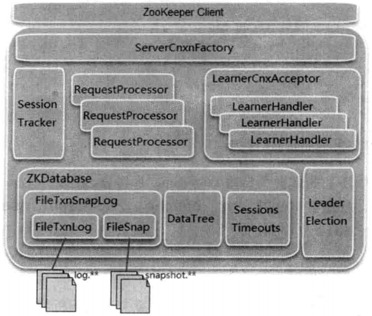

##### 7.5.1 单机版服务器启动

ZooKeeper 服务器的启动，大体可以分为以下五个主要步骤∶ 配置文件解析、初始化数据管理器、初始化网络I/O管理器、数据恢复和对外服务。

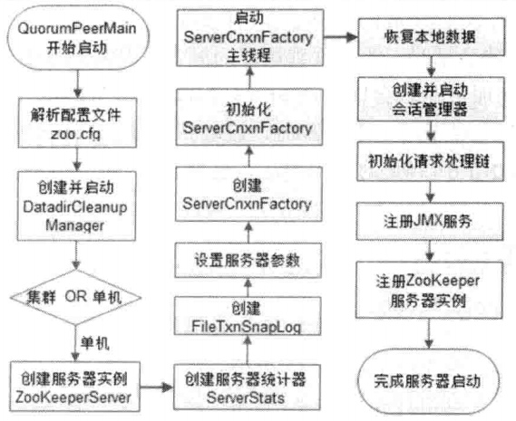

###### 预启动

1. 统一由 QuorumPeerMain 作为启动类。

   无论是单机版还是集群模式启动 ZooKeeper服务器，在zkServencmd和zkServersh两个脚本中，都配置了使用 org.apache.zookeeper.server.quorum.QuorumPeerMain 作为启动入口类。 

2. 解析配置文件 zoo.cfg。

   ZooKeeper 首先会进行配置文件的解析，配置文件的解析其实就是对 zoo.cfg文件的解析。该文件配置了 ZooKeeper 运行时的基本参数，包括 tickTime、 dataDir和 cLientPort 等参数。

3. 创建并启动历史文件清理器 DatadirCLeanupManager。

   从 3.4.0 版本开始，ZooKeeper 增加了自动清理历史数据文件的机制，包括对事务日志和快照数据文件进行定时清理。 

4. 判断当前是集群模式还是单机模式的启动。

   ZooKeeper 根据步骤 2 中解析出的集群服务器地址列表来判断当前是集群模式还是单机模式，如果是单机模式，那么就委托给 ZooKeeperServerMain 进行启动处理。

5. 再次进行配置文件 zoo.cfg 的解析。 

6. 创建服务器实例 ZooKeeperServer。

   org.apache.zookeeper.server.ZooKeeperServer 是单机版 ZooKeeper服务端最为核心的实体类。ZooKeeper 服务器首先会进行服务器实例的创建，接下去的步骤则都是对该服务器实例的初始化工作，包括连接器、内存数据库和请求处理器等组件的初始化。

###### 初始化

1. 创建服务器统计器 ServerStats。

   ServerStats 是 ZooKeeper 服务器运行时的统计器，包含了最基本的运行时信息。

   | 属性                               | 说明                                                         |
   | ---------------------------------- | ------------------------------------------------------------ |
   | packetsSent                        | 从ZooKeeper启动开始，或是最近一次重置服务端统计信息之后，服务端向客户端发送的响应包次数 |
   | packetsReceived                    | 从 ZooKeeper 启动开始，或是最近一次重置服务端统计信息之后，服务端接收到的来自客户端的请求包次数 |
   | maxLatency minLatency totalLatency | 从 ZooKeeper 启动开始，或是最近一次重置服务端统计信息之后，服务端请求处理的最大延时、最小延时以及总延时 |
   | count                              | 从ZooKeeper 启动开始，或是最近一次重置服务端统计信息之后，服务端处理的客户端请求总次数 |

2. 创建 ZooKeeper 数据管理器 FileTxnSnapLog。

   FileTxnSnapLog 是ZooKeeper 上层服务器和底层数据存储之间的对接层，提供了一系列操作数据文件的接口，包括事务日志文件和快照数据文件。ZooKeeper根据zoo.cfg文件中解析出的快照数据目录dataDir和事务日志目录dataLogDir来创建 FileTxnSnapLog。

3. 设置服务器 tickTime 和会话超时时间限制。

4. 创建 ServerCnxnFactory。

   在早期版本中，ZooKeeper都是自己实现NIO框架，从3.4.0版本开始，引入了Netty。读者可以通过配置系统属性 zookeeper.serverCnxnFactory 来指定使用 ZooKeeper 自己实现的 NIO 还是使用 Netty 框架来作为 ZooKeeper 服务端网络连接工厂。

5. 初始化 ServerCnxnFactory。

   ZooKeeper首先会初始化一个Thread，作为整个 ServerCnxnFactory的主线程，然后再初始化 NIO 服务器。

6. 启动 ServerCnxnFactory 主线程。

   启动步骤5中已经初始化的主线程 ServerCnxnFactory的主逻辑（run方法）。需要注意的一点是，虽然这里 ZooKeeper 的 NIO 服务器已经对外开放端口，客户端能够访问到 ZooKeeper 的客户端服务端口 2181，但是此时 ZooKeeper 服务器是无法正常处理客户端请求的。

7. 恢复本地数据。

   每次在 ZooKeeper 启动的时候，都需要从本地快照数据文件和事务日志文件中进行数据恢复。

8. 创建并启动会话管理器。

   在ZooKeeper 启动阶段，会创建一个会话管理器 SessionTracker。创建 SessionTracker 的时候，会初始化 expirationInterval、nextExpirationTime和 sessionsWithTimeout（用于保存每个会话的超时时间），同时还会计算出一个初始化的sessionlD。

   SessionTracker 初始化完毕后，ZooKeeper 就会立即开始会话管理器的会话超时检查。

9. 初始化 ZooKeeper 的请求处理链。

   ZooKeeper 的请求处理方式是典型的责任链模式的实现，在ZooKeeper 服务器上，会有多个请求处理器依次来处理一个客户端请求。在服务器启动的时候，会将这些请求处理器串联起来形成一个请求处理链。单机版服务器的请求处理链主要包括 PrepRequestProcessor，SyncRequestProcessor 和FinalRequestProcessor三个请求处理器。
10. 注册 JMX 服务。

    ZooKeeper 会将服务器运行时的一些信息以 JMX 的方式暴露给外部。
11. 注册 ZooKeeper 服务器实例。

    在步骤6 中，ZooKeeper 已经将 ServerCnxnFactory 主线程启动，但是同时我们提到此时 ZooKeeper 依旧无法处理客户端请求，原因就是此时网络层尚不能够访问 ZooKeeper 服务器实例。在经过后续步骤的初始化后，ZooKeeper 服务器实例已经初始化完毕，只需要注册给 ServerCnxnFactory 即可，之后， ZooKeeper 就可以对外提供正常的服务了。至此，单机版的 ZooKeeper 服务器启动完毕。

##### 7.5.2 集群版服务器启动

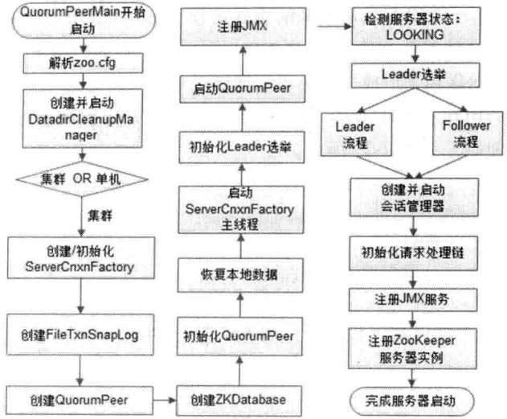

###### 预启动

1. 统一由QuorumPeerMain作为启动类。 

2. 解析配置文件 zoo.cfg。

3. 创建并启动历史文件清理器 DatadirCLeanupManager。

4. 判断当前是集群模式还是单机模式的启动。

   在集群模式中，由于已经在zoo.cfg中配置了多个服务器地址，因此此处选择集群模式启动 ZooKeeper。

###### 初始化

1. 创建 ServerCnxnFactory。

2. 初始化 ServerCnxnFactory。

3. 创建 ZooKeeper 数据管理器 FileTxnSnapLog。

4. 创建 QuorumPeer 实例。

   Quorum是集群模式下特有的对象，是ZooKeeper 服务器实例（ZooKeeperServer）的托管者，从集群层面看，QuorumPeer 代表了ZooKeeper集群中的一台机器。在运行期间，QuorumPeer 会不断检测当前服务器实例的运行状态，同时根据情况发起 Leader选举。

5. 创建内存数据库 ZKDatabase。

   ZKDatabase 是 ZooKeeper 的内存数据库，负责管理 ZooKeeper 的所有会话记录以及 DataTree 和事务日志的存储。 

6. 初始化 QuorumPeer。

   在步骤5中我们已经提到，QuorumPeer 是 ZooKeeperServer 的托管者，因此需要将一些核心组件注册到 QuorumPeer 中去，包括 FiLeTxnSnapLog、ServerCnxnFactory 和 ZKDatabase。同时 ZooKeeper 还会对 QuorumPeer配置一些参数，包括服务器地址列表、Leader 选举算法和会话超时时间限制等。

7. 恢复本地数据。

8. 启动 ServerCnxnFactory 主线程。

###### Leader 选举

1. 初始化 Leader 选举。

   Leader 选举可以说是集群和单机模式启动 ZooKeeper 最大的不同点。ZooKeeper首先会根据自身的 SID（服务器 ID）、lastLoggedZxid（最新的 ZXID）和当前的服务器 epoch （currentEpoch）来生成一个初始化的投票——简单地讲，在初始化过程中，每个服务器都会给自己投票。

   然后，ZooKeeper 会根据zoo.cfg中的配置，创建相应的 Leader 选举算法实现。

   在初始化阶段，ZooKeeper会首先创建Leader选举所需的网络I/O层QuorumCnxManager，同时启动对 Leader 选举端口的监听，等待集群中其他服务器创建连接。

2. 注册 JMX服务。

3. 检测当前服务器状态。

   在上文中，我们已经提到 QuorumPeer是 ZooKeeper 服务器实例的托管者，在运行期间，QuorumPeer 的核心工作就是不断地检测当前服务器的状态，并做出相应的处理。在正常情况下，ZooKeeper 服务器的状态在 LOOKING、LEADING 和 FOLLOWING/OBSERVING 之间进行切换。而在启动阶段，QuorumPeer 的初始状态是 LOOKING，因此开始进行 Leader 选举。

4. Leader 选举

   ZooKeeper 的 Leader 选举过程，简单地讲，就是一个集群中所有的机器相互之间进行一系列投票，选举产生最合适的机器成为 Leader，同时其余机器成为Follower或是 Observer 的集群机器角色初始化过程。关于Leader 选举算法，简而言之，就是集群中哪个机器处理的数据越新（通常我们根据每个服务器处理过的最大 ZXID来比较确定其数据是否更新），其越有可能成为 Leader。当然，如果集群中的所有机器处理的 ZXID一致的话，那么 SID 最大的服务器成为 Leader。

###### Leader 和 Follower 启动期交互过程

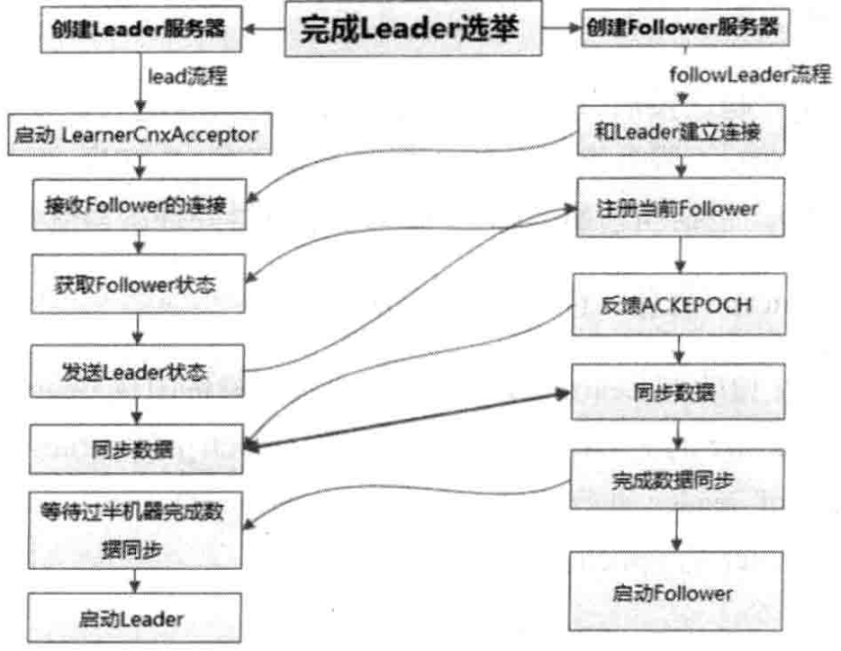

1. 创建 Leader 服务器和 Follower 服务器。

   完成 Leader 选举之后，每个服务器都会根据自己的服务器角色创建相应的服务器实例，并开始进入各自角色的主流程。

2. Leader 服务器启动 Follower 接收器 LearnerCnxAcceptor。

   在 ZooKeeper 集群运行期间，Leader 服务器需要和所有其余的服务器（使用"Learner"来指代这类机器）保持连接以确定集群的机器存活情况。LearnerCnxAcceptor 接收器用于负责接收所有非 Leader 服务器的连接请求。
3. Learner 服务器开始和 Leader 建立连接。

   所有的 Learner 服务器在启动完毕后，会从 Leader 选举的投票结果中找到当前集群中的 Leader 服务器，然后与其建立连接。

4. Leader 服务器创建 LearnerHander。

   Leader 接收到来自其他机器的连接创建请求后，会创建一个 LearnerHandLer实例。每个 LearnerHandLer 实例都对应了一个 Leader 与Learner 服务器之间的连接，其负责 Leader 和 Lcarner 服务器之间几乎所有的消息通信和数据同步

5. 向 Leader 注册。

   当和 Leader 建立起连接后，Learner 就会开始向 Leader 进行注册——所谓的注册，其实就是将 Learner 服务器自己的基本信息发送给 Leader 服务器，我们称之为 LearnerInfo，包括当前服务器的 SID 和服务器处理的最新的 ZXID。

6. Leader 解析 Learner 信息，计算新的 epoch。

   Leader服务器在接收到Learner的基本信息后，会解析出该Learner的 SID和ZXID，然后根据该Learner的 ZXID解析出其对应的 epoch_of_learner，和当前Leader 服务器的 epoch_of_leader 进行比较，如果该Learner 的 epoch_of_learner 更大的话，那么就更新Leader 的 epoch∶

   epoch_of_Leader = epoch_of_Learner ＋ 1

   然后，LearnerHandLer 会进行等待，直到过半的 Learner已经向 Leader 进行了注册，同时更新了 epoch_of_leader 之后，Leader就可以确定当前集群的epoch了。 

7. 发送 Leader 状态。

   计算出新的 epoch 之后，Leader 会将该信息以一个 LEADERINFO 消息的形式发送给 Learner，同时等待 Learner 的响应。

8. Learner 发送 ACK 消息。

   Follower 在收到来自 Leader 的LEADERINFO 消息后，会解析出 epoch 和 ZXID，然后向 Leader 反馈一个 ACKEPOCH 响应。

9. 数据同步。

   Leader 服务器接收到Learner 的这个 ACK 消息后，就可以开始与其进行数据同步了。

10. 启动 Leader 和 Learner 服务器。

    当有过半的 Learner 已经完成了数据同步，那么Leader 和 Learner 服务器实例就可以开始启动了。

###### Leader 和 Follower 启动

1. 创建并启动会话管理器。

2. 初始化 ZooKeeper 的请求处理链。

   和单机版服务器一样，集群模式下，每个服务器都会在启动阶段串联请求处理链，只是根据服务器角色不同，会有不同的请求处理链路。

3. 注册 JMX 服务。

至此，集群版的 ZooKeeper 服务器启动完毕。

#### 7.6 Leader 选举

##### 7.6.1 Leader 选举概述

###### 服务器启动时期的 Leader 选举

以3 台机器组成的服务器集群为例。

1. 每个 Server 会发出一个投票。

   由于是初始情况，因此对于 Serverl和 Server2来说，都会将自己作为Leader 服务器来进行投票，每次投票包含的最基本的元素包括∶所推举的服务器的 myid 和 ZXID，我们以（myid，ZXID）的形式来表示。因为是初始化阶段，因此无论是 Serverl 还是 Server2，都会投给自己，即 Serverl的投票为（1，0），Server2的投票为（2，0），然后各自将这个投票发给集群中其他所有机器。

2. 接收来自各个服务器的投票。

   每个服务器都会接收来自其他服务器的投票。集群中的每个服务器在接收到投票后，首先会判断该投票的有效性，包括检查是否是本轮投票、是否来自LOOKING状态的服务器。 

3. 处理投票。

   在接收到来自其他服务器的投票后，针对每一个投票，服务器都需要将别人的投票和自己的投票进行 PK，PK 的规则如下。

   - 优先检查 ZXID。ZXID 比较大的服务器优先作为 Leader。
   - 如果 ZXID 相同的话，那么就比较 myid。myid 比较大的服务器作为Leader服务器。

   现在我们来看 Server1 和 Server2 实际是如何进行投票处理的。对于 Server1 来说，它自己的投票是（1，0），而接收到的投票为（2，0）。首先会对比两者的 ZXID，因为都是 0，所以无法决定谁是 Leader。接下来会对比两者的 myid，很显然，Server1发现接收到的投票中的 myid 是2，大于自己，于是就会更新自己的投票为（2，0），然后重新将投票发出去。而对于 Server2 来说，不需要更新自己的投票信息，只是再一次向集群中所有机器发出上一次投票信息即可。

4. 统计投票。

   每次投票后，服务器都会统计所有投票，判断是否已经有过半的机器接收到相同的投票信息。对于 Server1 和 Server2服务器来说，都统计出集群中已经有两台机器接受了（2，0）这个投票信息。所谓"过半"就是指大于集群机器数量的一半，即大于或等于（n/2+1）。对于这里由3台机器构成的集群，大于等于2台即为达到"过半"要求。

   那么，当 Server1和 Server2都收到相同的投票信息（2，0）的时候，即认为已经选出了Leader。

5. 改变服务器状态。

   一旦确定了Leader，每个服务器就会更新自己的状态；如果是 Follower，那么就变更为 FOLLOWING，如果是 Leader，那么就变更为 LEADING。

###### 服务器运行期间的 Leader 选举

假设当前正在运行的 ZooKeeper 服务器由3台机器组成，分别是 Server1、Server2和 Server3，当前的Leader 是 Server2。假设在某一个瞬间，Leader挂了，这个时候便开始了Leader 选举。

1. 变更状态。

   当 Leader 挂了之后，余下的非 Observer 服务器都会将自己的服务器状态变更为 LOOKING，然后开始进入 Leader 选举流程。 

2. 每个 Server 会发出一个投票。

   在这个过程中，需要生成投票信息（myid，ZXID）。因为是运行期间，因此每个服务器上的ZXID可能不同，我们假定 Server1 的ZXID为 123，而 Server3 的 ZXID为 122。在第一轮投票中，Server1 和 Server3 都会投自己，即分别产生投票（1， 123）和（3，122），然后各自将这个投票发给集群中所有机器。

3. 接收来自各个服务器的投票。

4. 处理投票。

   对于投票的处理，和上面提到的服务器启动期间的处理规则是一致的。在这个例子里面，由于 Server1的 ZXID为 123，Server3的ZXID为122，那么显然，Server1会成为 Leader。

5. 统计投票。

6. 改变服务器状态。

##### 7.6.2 Leader 选举的算法分析

在 ZooKeeper 中，提供了三种Leader 选举的算法，分别是 LeaderElection，UDP 版本的 FastLeaderElection 和 TCP版本的 FastLeaderElection，可以通过在配置文件 zoo.cfg中使用 eLectionAlg 属性来指定，分别使用数字 0~3 来表示。0代表 LeaderElection，这是一种纯 UDP实现的 Leader 选举算法；1代表 UDP 版本的 FastLeaderElection，并且是非授权模式；2 也代表 UDP 版本的 FastLeaderElection，但使用授权模式；3 代表 TCP版本的 FastLeaderElection。值得一提的是，从 3.4.0 版本开始，ZooKeeper 废弃了0、1和2 这三种 Leader 选举算法，只保留了 TCP 版本的 FastLeaderElection 选举算法。

###### 术语解释

- SID∶服务器 ID。SID是一个数字，用来唯一标识一台 ZooKeeper集群中的机器，每台机器不能重复，和 myid的值一致。
- ZXID∶ 事务 ID。ZXID 是一个事务 ID，用来唯一标识一次服务器状态的变更。在某一个时刻，集群中每台机器的ZXID值不一定全都一致，这和 ZooKeeper 服务器对于客户端"更新请求"的处理逻辑有关。
- Vote∶ 投票。Leader 选举，顾名思义必须通过投票来实现。当集群中的机器发现自己无法检测到 Leader 机器的时候，就会开始尝试进行投票。
- Quorum∶过半机器数。这是整个 Leader 选举算法中最重要的一个术语，我们可以把这个术语理解为是一个量词，指的是 ZooKeeper 集群中过半的机器数，如果集群中总的机器数是 n的话，那么可以通过下面这个公式来计算 quorum 的值∶quorum =(n/2 +1)。例如，如果集群机器总数是 3，那么 quorum 就是 2。

###### 算法分析

- 进入 Leader 选举

  当ZooKeeper集群中的一台服务器出现以下两种情况之一时，就会开始进入Leader选举。

  - 服务器初始化启动。

  - 服务器运行期间无法和 Leader 保持连接。

  而当一台机器进入 Leader 选举流程时，当前集群也可能会处于以下两种状态。

  - 集群中本来就已经存在一个 Leader。这种情况通常是集群中的某一台机器启动比较晚，在它启动之前，集群已经可以正常工作，即已经存在了一台 Leader服务器。针对这种情况，当该机器试图去选举 Leader的时候，会被告知当前服务器的 Leader 信息，对于该机器来说，仅仅需要和Leader 机器建立起连接，并进行状态同步即可。
  - 集群中确实不存在 Leader。

- 开始第一次投票

  当一台服务器处于LOOKING状态的时候，那么它就会向集群中所有其他机器发送消息，我们称这个消息为"投票"。

  在这个投票消息中包含了两个最基本的信息∶所推举的服务器的 SID 和ZXID，分别表示了被推举服务器的唯一标识和事务 ID。下文中我们将以"（SID，ZXID）"这样的形式来标识一次投票信息。举例来说，如果当前服务器要推举 SID 为1、ZXID为8的服务器成为 Leader，那么它的这次投票信息可以表示为（1，8）。

  我们假设 ZooKeeper 由5 台机器组成， SID 分别为1、2、3、4 和 5，ZXID 分别为9、 9、9、8和8，并且此时 SID为 2的机器是Leader 服务器。某一时刻，1和 2 所在的机器出现故障，因此集群开始进行 Leader 选举。

  在第一次投票的时候，由于还无法检测到集群中其他机器的状态信息，因此每台机器都是将自己作为被推举的对象来进行投票。于是 SID为 3、4 和 5的机器，投票情况分别为∶（3，9）、（4，8）和（5，8）。

- 变更投票

  集群中的每台机器发出自己的投票后，也会接收到来自集群中其他机器的投票。每台机器都会根据一定的规则，来处理收到的其他机器的投票，并以此来决定是否需要变更自己的投票。这个规则也成为了整个Leader 选举算法的核心所在。

  - vote_sid∶接收到的投票中所推举 Leader 服务器的 SID。
  - vote_zxid∶接收到的投票中所推举 Leader 服务器的 ZXID。
  - self_sid∶ 当前服务器自己的 SID。
  - self_zxid∶当前服务器自己的 ZXID。

  每次对于收到的投票的处理，都是一个对（vote_sid，vote_zxid）和（self_sid，self_zxid）对比的过程。

  - 规则1∶如果 vote_zxid大于 self_zxid，就认可当前收到的投票，并再次将该投票发送出去。

  - 规则 2∶如果 vote_zxid 小于 self_zxid，那么就坚持自己的投票，不做任何变更。
  - 规则3∶如果 vote_zxid 等于 self_zxid，那么就对比两者的 SID。如果 vote_sid 大于self_sid，那么就认可当前接收到的投票，并再次将该投票发送出去。

  - 规则4：如果 vote_zxid 等于 self_zxid，并且 vote_sid 小于 self_sid，那么同样坚持自己的投票，不做变更。

  每台机器都把投票发出后，同时也会接收到来自另外两台机器的投票。

  - 对于 Server3 来说，它接收到了（4，8）和（5，8）两个投票，对比后，由于自己的 ZXID 要大于接收到的两个投票，因此不需要做任何变更。

  - 对于 Server4 来说，它接收到了（3，9）和（5，8）两个投票，对比后，由于（3， 9）这个投票的 ZXID 大于自己，因此需要变更投票为（3，9），然后继续将这个投票发送给另外两台机器。

  - 同样，对于 Server5 来说，它接收到了（3，9）和（4，8）两个投票，对比后，由于（3，9）这个投票的 ZXID 大于自己，因此需要变更投票为（3，9），然后继续将这个投票发送给另外两台机器。

- 确定 Leader

  经过这第二次投票后，集群中的每台机器都会再次收到其他机器的投票，然后开始统计投票。如果一台机器收到了超过半数的相同的投票，那么这个投票对应的 SID 机器即为 Leader。

  Leader 选举例子中，因为 ZooKeeper 集群的总机器数为5 台，那么 quorum = (5/2 +1)= 3

  也就是说，只要收到 3个或 3 个以上（含当前服务器自身在内）一致的投票即可。在这里，Server3、Server4 和 Server5都投票（3，9），因此确定了 Server3为Leader。

##### 7.6.3 Leader 选举的实现细节

###### 服务器状态

为了能够清楚地对 ZooKeeper 集群中每台机器的状态进行标识，在 org.apache.zookeeper.server.quorum.QuorumPeer.ServerState类中列举了4种服务器状态，分别是∶ LOOKING、FOLLOWING、LEADING 和 OBSERVING。

- LOOKING：寻找 Leader 状态。当服务器处于该状态时，它会认为当前集群中没有Leader，因此需要进入 Leader 选举流程。

- FOLLOWING∶跟随者状态，表明当前服务器角色是 Follower。
- LEADING∶ 领导者状态，表明当前服务器角色是 Leader。
- OBSERVING：观察者状态，表明当前服务器角色是 Observer。

###### 投票数据结构

org.apache.zookeeper.server.quorum.Vote

| 属 性         | 说 明                                                        |
| ------------- | ------------------------------------------------------------ |
| id            | 被推举的 Leader 的 SID 值                                    |
| zxid          | 被推举的 Leader 的事务 ID                                    |
| electionEpoch | 逻辑时钟，用来判断多个投票是否在同一轮选举周期中。该值在服务端是一个自增序列。每次进入新一轮的投票后，都会对该值进行加1操作 |
| peerEpoch     | 被推举的 Leader 的 epoch                                     |
| state         | 当前服务器的状态                                             |

###### QuorumCnxManager∶ 网络 I/O

每台服务器启动的时候，都会启动一个 QuorumCnxManager，负责各台服务器之间的底层 Leader 选举过程中的网络通信。

- 消息队列

  在 QuorumCnxManager 这个类内部维护了一系列的队列，用于保存接收到的、待发送的消息，以及消息的发送器。除接收队列以外，这里提到的所有队列都有一个共同点——按 SID 分组形成队列集合，我们以发送队列为例来说明这个分组的概念。假设集群中除自身外还有4台机器，那么当前服务器就会为这 4台服务器分别创建一个发送队列，互不干扰。

  - recvQueue∶消息接收队列，用于存放那些从其他服务器接收到的消息。
  - queueSendMap∶消息发送队列，用于保存那些待发送的消息。queueSendMap是一个 Map，按照 SID 进行分组，分别为集群中的每台机器分配了一个单独队列，从而保证各台机器之间的消息发送互不影响。

  - senderWorkerMap;发送器集合。每个 SendWorker 消息发送器，都对应一台远程 ZooKeeper 服务器，负责消息的发送。同样，在 senderWorkerMap中，也按照 SID 进行了分组。

  - LastMessageSent∶最近发送过的消息。在这个集合中，为每个 SID 保留最近发送过的一个消息。

- 建立连接

  为了能够进行互相投票，ZooKeeper 集群中的所有机器都需要两两建立起网络连接。 QuorumCnxManager 在启动的时候，会创建一个 ServerSocket 来监听 Leader 选举的通信端口。开启端口监听后，ZooKeepr 就能够不断地接收到来自其他服务器的"创建连接"请求，在接收到其他服务器的 TCP 连接请求时，会交由 receiveConnection 函数来处理。为了避免两台机器之间重复地创建 TCP 连接，ZooKeeper 设计了一种建立 TCP 连接的规则∶只允 许 SID 大的服务器主动和其他服务器建立连接，否则断开连接。 在 ReceiveConnection 函数中，服务器通过对比自己和远程服务器的 SID 值，来判断是否接受连接请求。如果当前服务器发现自己的 SID 值更大，那么会断开当前连接，然后自己主动去和远程服务器建立连接。

  一旦建立起连接，就会**根据远程服务器的 SID 来创建相应的消息发送器 SendWorker和消息接收器 ReCvWorker**，并启动他们。

- 消息接收与发送

  消息的接收过程是由消息接收器 Recvworker 来负责的，每个 RecvWorker 只需要不断地从这个 TCP 连接中读取消息，并将其保存到 recvQueue队列中。

  消息的发送过程也比较简单，由于ZooKeeper 同样也已经为每个远程服务器单独分别分配了消息发送器 SendWorker，那么每个 SendWorker 只需要不断地从对应的消息发送队列中获取出一个消息来发送即可，同时将这个消息放入 lastMessageSent 中来作为最近发送过的消息。在 SendWorker 的具体实现中，有一个细节需要我们注意一下∶一旦 ZooKeeper 发现针对当前远程服务器的消息发送队列为空，那么这个时候就需要从 LastMessageSent 中取出一个最近发送过的消息来进行再次发送。这个细节的处理主要是为了解决这样一类分布式问题∶接收方在消息接收前，或者是在接收到消息后服务器挂掉了，导致消息尚未被正确处理。那么如此重复发送是否会导致其他问题呢？当然，这里可以放心的一点是，ZooKeeper 能够保证接收方在处理消息的时候，会对重复消息进行正确的处理。

- FastLeaderElection∶ 选举算法的核心部分

  - 选票管理

    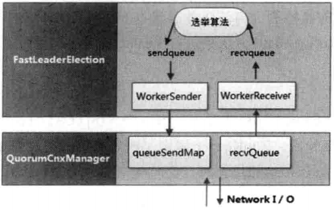
    - sendqueue∶选票发送队列，用于保存待发送的选票。

    - recvqueue∶ 选票接收队列，用于保存接收到的外部投票。

    - WorkerReceiver∶ 选票接收器。该接收器会不断地从 QuorumCnxManager 中获取出其他服务器发来的选举消息，并将其转换成一个选票，然后保存到 recvqueue 队列中去。在选票的接收过程中，如果发现该外部投票的选举轮次小于当前服务器，那么就直接忽略这个外部投票，同时立即发出自己的内部投票。当然，如果当前服务器并不是 LOOKING状态，即已经选举出了Leader，那么也将忽略这个外部投票，同时将 Leader 信息以投票的形式发送出去。

      另外，对于选票接收器，还有一个细节需要注意，如果接收到的消息来自 Observer服务器，那么就忽略该消息，并将自己当前的投票发送出去。

    - WorkerSender∶选票发送器，会不断地从 sendqueue 队列中获取待发送的选票，并将其传递到底层 QuorumCnxManager 中去。

  - 算法核心

    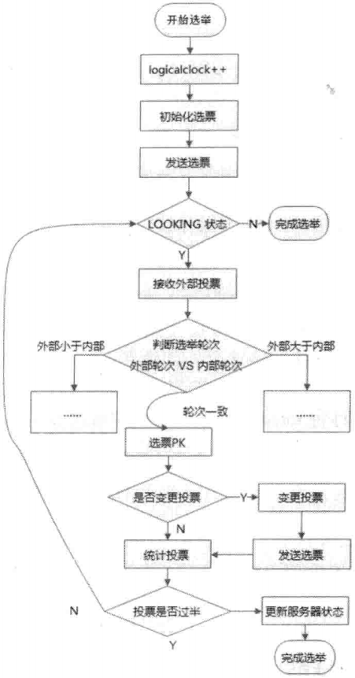

    1. 自增选举轮次。

       在 FastLeaderElection 实现中，有一个 Logicalclock属性，用于标识当前 Leader 的选举轮次，ZooKeeper 规定了所有有效的投票都必须在同一轮次中。ZooKeeper 在开始新一轮的投票时，会首先对 logicaLclock 进行自增操作。

    2. 初始化选票。

       在开始进行新一轮的投票之前，每个服务器都会首先初始化自己的选票。也就是对 Vote 属性的初始化。在初始化阶段，每台服务器都会将自己推举为 Leader。

    3. 发送初始化选票。

       在完成选票的初始化后，服务器就会发起第一次投票。ZooKeeper 会将刚刚初始化好的选票放入 sendqueue 队列中，由发送器 WorkerSender负责发送出去。

    4. 接收外部投票。

       每台服务器都会不断地从 recvqueue 队列中获取外部投票。如果服务器发现无法获取到任何的外部投票，那么就会立即确认自己是否和集群中其他服务器保持着有效连接。如果发现没有建立连接，那么就会马上建立连接。如果已经建立了连接，那么就再次发送自己当前的内部投票。

    5. 判断选举轮次。

       当发送完初始化选票之后，接下来就要开始处理外部投票了。在处理外部投票的时候，会根据选举轮次来进行不同的处理。

       - 外部投票的选举轮次大于内部投票。

         如果服务器发现自己的选举轮次已经落后于该外部投票对应服务器的选举轮次，那么就会立即更新自己的选举轮次（Logicalclock），并且清空所有已经收到的投票，然后使用初始化的投票来进行 PK 以确定是否变更内部投票，最终再将内部投票发送出去。

       - 外部投票的选举轮次小于内部投票。

         如果接收到的选票的选举轮次落后于服务器自身的，那么 ZooKeeper 就会直接忽略该外部投票，不做任何处理，并返回步骤 4。

       - 外部投票的选举轮次和内部投票一致。

         这也是绝大多数投票的场景，如果外部投票的选举轮次和内部投票一致的话，那么就开始进行选票 PK。

       总的来说，只有在同一个选举轮次的投票才是有效的投票。

    6. 选票 PK。

       在收到来自其他服务器有效的外部投票后，就要进行选票PK 了——也就是 FastLeaderElection.totalOrderPredicate 方法的核心逻辑。选票 PK 的目的是为了确定当前服务器是否需要变更投票，主要从选举轮次、ZXID和 SID 三个因素来考虑，具体条件如下∶在选票 PK 的时候依次判断，符合任意一个条件就需要进行投票变更。

       - 如果外部投票中被推举的 Leader 服务器的选举轮次大于内部投票，那么就需要进行投票变更。
       - 如果选举轮次一致的话，那么就对比两者的 ZXID。如果外部投票的 ZXID大于内部投票，那么就需要进行投票变更。
       - 如果两者的 ZXID 一致，那么就对比两者的 SID。如果外部投票的 SID 大于内部投票，那么就需要进行投票变更。

    7. 变更投票。

       通过选票 PK 后，如果确定了外部投票优于内部投票（所谓的"优于"，是指外部投票所推举的服务器更适合成为 Leader），那么就进行投票变更——使用外部投票的选票信息来覆盖内部投票。变更完成后，再次将这个变更后的内部投票发送出去。

    8. 选票归档。

       无论是否进行了投票变更，都会将刚刚收到的那份外部投票放入"选票集合" recvset 中进行归档。recvset 用于记录**当前服务器**在本轮次的 Leader选举中收到的所有外部投票——按照服务器对应的 SID来区分，例如，{(1, vote1),(2, vote2),…}。

    9. 统计投票。

       完成了选票归档之后，就可以开始统计投票了。统计投票的过程就是为了统计集群中是否已经有过半的服务器认可了当前的内部投票。如果确定已经有过半的服务器认可了该内部投票，则终止投票。否则返回步骤 4。

    10. 更新服务器状态。

        统计投票后，如果已经确定可以终止投票，那么就开始更新服务器状态。服务器会首先判断当前被过半服务器认可的投票所对应的Leader 服务器是否是自己，如果是自己的话，那么就会将自己的服务器状态更新为 LEADING。如果自己不是被选举产生的 Leader 的话，那么就会根据具体情况来确定自己是 FOLLOWING或是 OBSERVING。

    以上 10 个步骤，就是 FastLeaderElection 选举算法的核心步骤，其中步骤 4-9 会经过几轮循环，直到Leader 选举产生。另外还有一个细节需要注意，就是在完成步骤 9 之后，如果统计投票发现已经有过半的服务器认可了当前的选票，这个时候，ZooKeeper 并不会立即进入步骤 10 来更新服务器状态，而是会等待一段时间（默认是 200 毫秒）来确定是否有新的更优的投票。

#### 7.7 各服务器角色介绍

##### 7.7.1 Leader

Leader 服务器是整个ZooKeeper 集群工作机制中的核心，其主要工作有以下两个。

- 事务请求的唯一调度和处理者，保证集群事务处理的顺序性。
- 集群内部各服务器的调度者。

###### 请求处理链

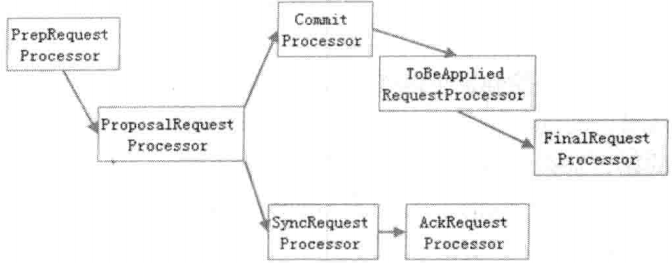

- PrepRequestProcessor

  PrepRequestProcessor 是 Leader 服务器的请求预处理器，也是 Leader服务器的第一个请求处理器。在 ZooKeeper 中，我们将那些会改变服务器状态的请求称为"事务请求"——通常指的就是那些创建节点、更新数据、删除节点以及创建会话等请求，PrepRequestProcessor 能够识别出当前客户端请求是否是事务请求。对于事务请求，PrepRequestProcessor 处理器会对其进行一系列预处理，诸如创建请求事务头、事务体，会话检查、ACL 检查和版本检查等。

- ProposalRequestProcessor

  ProposalRequestProcessor处理器是Leader服务器的事务投票处理器，也是 Leader服务器事务处理流程的发起者。对于非事务请求，ProposalRequestProcessor 会直接将请求流转到 CommitProcessor 处理器，不再做其他处理；而对于事务请求，除了将请求交给CommitProcessor处理器外，还会根据请求类型创建对应的Proposal提议，并发送给所有的 Follower 服务器来发起一次集群内的事务投票。同时， ProposalRequestProcessor 还会将事务请求交付给 SyncRequestProcessor 进行事务日志的记录。 

- SyncRequestProcessor

  SyncRequestProcessor 是事务日志记录处理器，该处理器主要用来将事务请求记录到事务日志文件中去，同时还会触发 ZooKeeper 进行数据快照。

- AckRequestProcessor

  AckRequestProcessor处理器是 Leader 特有的处理器，其主要负责在 SyncRequestProcessor 处理器完成事务日志记录后，向 Proposal 的投票收集器发送 ACK 反馈，以通知投票收集器当前服务器已经完成了对该 Proposal 的事务日志记录。

- CommitProcessor

  CommitProcesSor 是事务提交处理器。对于非事务请求，该处理器会直接将其交付给下一级处理器进行处理；而对于事务请求，CommitProcessor 处理器会等待集群内针对 Proposal 的投票直到该 Proposal 可被提交。利用 CommitProcessor 处理器，每个服务器都可以很好地控制对事务请求的顺序处理。

- ToBeCommitProcessor

  ToBeCommitProcessor处理器中有一个toBeApplied队列，专门用来存储那些已经被 CommitProcessor 处理过的可被提交的 Proposal。ToBeCommitProcessor 处理器将这些请求逐个交付给 FinalLRequestProcessor 处理器进行处理——等到 FinaLRequestProcessor 处理器处理完之后，再将其从 toBeApplied 队列中移除。

- FinalRequestProcessor

  FinaLRequestProcessor 是最后一个请求处理器。该处理器主要用来进行客户端请求返回之前的收尾工作，包括创建客户端请求的响应，针对事务请求，该处理器还会负责将事务应用到内存数据库中去。 

###### LearnerHandler

为了保持整个集群内部的实时通信，同时也是为了确保可以控制所有的 Follower/ Observer 服务器，Leader 服务器会与每一个Follower/Observer 服务器都建立一个TCP长连接，同时也会为每个 Follower/Observer 服务器都创建一个名为 LearnerHandLer 的实体。

LearnerHandLer，顾名思义，是 ZooKeeper 集群中 Learner 服务器的管理器，主要负责 Follower/Observer 服务器和 Leader 服务器之间的一系列网络通信，包括数据同步、请求转发和 Proposal 提议的投票等。Leader 服务器中保存了所有 Follower/Observer对应的 LearnerHandler。

##### 7.7.2 Follower

Follower 服务器是 ZooKeeper 集群状态的跟随者，其主要工作有以下三个。

- 处理客户端非事务请求，转发事务请求给 Leader 服务器。
- 参与事务请求 Proposal 的投票。
- 参与 Leader 选举投票。

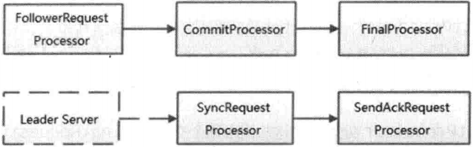

和 Leader 服务器的请求处理链最大的不同点在于，Follower 服务器的第一个处理器换成了FoLLowerRequestProcessor处理器，同时由于不需要处理事务请求的投票，因此也没有了ProposaLRequestProcessor处理器。

###### FollowerRequestProcessor

FollowerRequestProcessor是 Follower 服务器的第一个请求处理器，其主要工作就是识别出当前请求是否是事务请求。如果是事务请求，那么 Follower 就会将该事务请求转发给 Leader 服务器，Leader 服务器在接收到这个事务请求后，就会将其提交到请求处理链，按照正常事务请求进行处理。

###### SendAckRequestProcessor

Leader 服务器上有一个叫 AckRequestProcessor的请求处理器，其主要负责在 SyncRequestProcessor 处理器完成事务日志记录后，向 Proposal的投票收集器进行反馈。而在 Follower 服务器上，SendAckRequestProcessor 处理器同样承担了事务日志记录反馈的角色，在完成事务日志记录后，会向 Leader 服务器发送 ACK 消息以表明自身完成了事务日志的记录工作。两者的唯一区别在于，AckRequestProcessor处理器和 Leader 服务器在同一个服务器上，因此它的 ACK 反馈仅仅是一个本地操作，而 SendAckRequestProcessor处理器由于在 Follower 服务器上，因此需要通过以ACK 消息的形式来向 Leader 服务器进行反馈。

##### 7.7.3 Observer

Observer 是 ZooKeeper 自3.3.0 版本开始引入的一个全新的服务器角色。从字面意思看，该服务器充当了一个观察者的角色——其观察 ZooKeeper 集群的最新状态变化并将这些状态变更同步过来。Observer 服务器在工作原理上和 Follower 基本是一致的，对于非事务请求，都可以进行独立的处理，而对于事务请求，则会转发给 Leader 服务器进行处理。和Follower 唯一的区别在于，Observer 不参与任何形式的投票，包括事务请求 Proposal的投票和 Leader 选举投票。简单地讲，Observer 服务器只提供非事务服务，通常用干在不影响集群事务处理能力的前提下提升集群的非事务处理能力。

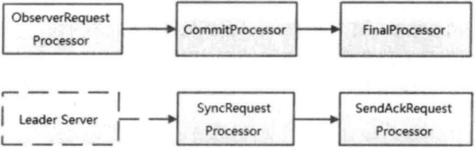

另外需要注意的一点是，虽然Observer 服务器在初始化阶段会将 SyncRequestProcessor 处理器也组装上去，但是在实际运行过程中，Leader 服务器不会将事务请求的投票发送给 Observer 服务器。

##### 7.7.4 集群间消息通信

ZooKeeper 的消息类型大体上可以分为四类，分别是∶数据同步型、服务器初始化型、请求处理型和会话管理型。

###### 数据同步型

数据同步型消息是指在 Learner 和 Leader 服务器进行数据同步的时候，网络通信所用到的消息，通常有 DIFF、TRUNC、SNAP和 UPTODATE 四种。

| 消息类型     | 发送方→接收方  | 说 明                                                        |
| ------------ | -------------- | ------------------------------------------------------------ |
| DIFF,I3      | Leader→Learner | 用于通知 Learner 服务器，Leader 即将与其进行"DIFF"方式的数据同步 |
| TRUNC,14     | Leader→Learner | 用于触发 Learner 服务器进行内存数据库的回滚操作              |
| SNAP, 15     | Leader→Learner | 用于通知 Learner 服务器，Leader 即将与其进行"全量"方式的数据同步 |
| UPTODATE, 12 | Leader→Learner | 用来告诉 Learner 服务器，已经完成了数据同步，可以开始对外提供服务了 |

###### 服务器初始化型

服务器初始化型消息是指在整个集群或是某些新机器初始化的时候，Leader 和 Learner之间相互通信所使用的消息类型，常见的有 OBSERVERINFO、FOLLOWERINFO、LEADERINFO、ACKEPOCH 和 NEWLEADER 五种。

| 消息类型        | 发送方→接收方   | 说 明                                                        |
| --------------- | --------------- | ------------------------------------------------------------ |
| OBSERVERINFO,16 | Observer→Leader | 该信息通常是由 Observer 服务器在启动的时候发送给 Leader 的，用于向 Leader 服务器注册自己，同时向 Leader服务器表明当前 Learner服务器的角色是Observer。消息中包含了当前 Observer 服务器的 SID和已经处理的最新ZXID |
| FOLLOWERINFO,11 | Follower→Leader | 该信息通常是由 Follower服务器在启动的时候发送给 Leader 的，用于向 Leader 服务器注册自己，同时向 Leader服务器表明当前 Learner服务器的角色是Follower。消息中包含了当前 Follower服务器的 SID和已经处理的最新ZXID |
| LEADERINFO, 17  | Leader→Learner  | 在 Learner连接上 Leader 后，会向Leader 发送 Learnerlnfo 消息（包含了OBSERVERINFO和 FOLLOWERINFO两类消息），Leader 服务器在接收到该消息后，也会将 Leader服务器的基本信息发送给这些Learner，这个消息就是LEADERINFO，通常包含了当前 Leader 服务器的最新 EPOCH值 |
| ACKEPOCH,18     | Learner→Leader  | Learner在接收到Leader 发来的LEADERINFO消息后，会将自己最新的ZXID和EPOCH以ACKEPOCH消息的形式发送给 Leader |
| NEWLEADER,10    | Leader→Learner  | 该消息通常用于 Leader 服务器向 Learner 发送一个阶段性的标识消息——Leader 会在和 Learner 完成一个交互流程后，向Learner发送NEWLEADER 消息，同时带上当前 Leader 服务器处理的最新 ZXID。这一系列交互流程包括∶ 足够多的 Follower 服务器连接上 Leader 或是完成数据同步 |

###### 请求处理型

请求处理型消息是指在进行请求处理的过程中，Leader 和 Learner 服务器之间互相通信所使用的消息，常见的有 REQUEST、PROPOSAL、ACK、COMMIT、INFORM 和 SYNC六种。

| 消息类型   | 发送方→接收方   | 说 明                                                        |
| ---------- | --------------- | ------------------------------------------------------------ |
| REQUEST,1  | Learner→Leader  | 该消息是 ZooKeeper 的请求转发消息。当 Learner 服务器接收到客户端的事务请求后，就会将请求以 REQUEST 消息的形式转发给 Leader 服务器来处理 |
| PROPOSAL,2 | Leader→Follower | 该消息是 ZooKeeper 实现ZAB算法的核心所在，即ZAB协议中的提议。在处理事务请求的时候，Leader服务器会将事务请求以 PROPOSAL 消息的形式创建投票发送给集群中所有的 Follower 服务器来进行事务日志的记录 |
| ACK,3      | Follower→Leader | Follower 服务器在接收到来自 Leader 的 PROPOSAL消息后，会进行事务日志的记录。如果完成了事务日志的记录，那么就会以 ACK 消息的形式反馈给Leader |
| COMMIT,4   | Leader→Follower | 该消息用于通知集群中所有的 Follower 服务器，可以进行事务请求的提交了。Leader 服务器在接收到过字的 Follower服务器发来的 ACK 消息后，就进入事务请求的最终提交流程——生成 COMMIT 消息，告知所有的 Follower 服务器进行事务请求的提交 |
| INFORM,8   | Leader→Observer | 在事务请求提交阶段，针对 Follower 服务器，Leader 仅仅只需要发送一个 COMMIT 消息，Follower 服务器就可以完成事务请求的提交了，因为在这之前的事务请求投票阶段， Follower 已经接收过 PROPOSAL 消息，该消息中色含了事务请求的内容，国此 Follower 可以从之前的 Proposal 缓存中再次获取到事务请。而对于 Observer 来说，由于之前没有参与事务请求的投票，因此没有该事务请求的上下文，显然，如果 Leader 同样对其发送一个简单的 COMMIT 消息， Observer 服务器是无法完成事务请求的提交的。为了解决这个问题，ZooKeeper 特别设计了INFORM消息，该消息不仅能够通知Observer 已经可以提交事务请求，同时还会在消息中携带事务请求的内容 |
| SYNC.7     | Leader→Learner  | 该消息用于通知 Learmner 服务器已经完成了 Sync 操作           |

###### 会话管理型

会话管理型消息是指 ZooKeeper 在进行会话管理的过程中，和 Learner 服务器之间互相通信所使用的消息，常见的有 PING 和 REVALIDATE 两种。

| 消息类型     | 发送方→接收方  | 说 明                                                        |
| ------------ | -------------- | ------------------------------------------------------------ |
| PING,5       | Leader→Learner | 该消息用于 Leader 同步 Learner 服务器上的客户端心跳检测，用以激活存活的客户端。ZooKeeper 的客户端往往会随机地和任意一个 ZooKeeper 服务器保持连接，因此 Leader 服务器无法直接接收到所有客户端的心跳检测，需要委托给Learner 来保存这些客户端的心跳检测记录。Leader 会定时地向 Learner 服务器发送 PING 消息，Learner 服务器在接收到 PING 消息后，会将这段时间内保持心跳检测的客户端列表，同样以 PING消息的形式反馈给 Leader 服务器，由Leader 服务器来负责逐个对这些客户端进行会话激活 |
| REVALIDATE,6 | Learner→Leader | 该消息用于 Leader 校验会话是否有效，同时也会激活会话。这通常发生在客户端重连的过程中，新的服务器需要向Leader发送 REVALIDATE 消息以确定该会话是否已经超时 |

#### 7.8 请求处理

##### 7.8.1 会话创建请求

ZooKeeper 服务端对于会话创建的处理，大体可以分为请求接收、会话创建、预处理、事务处理、事务应用和会话响应 6大环节。

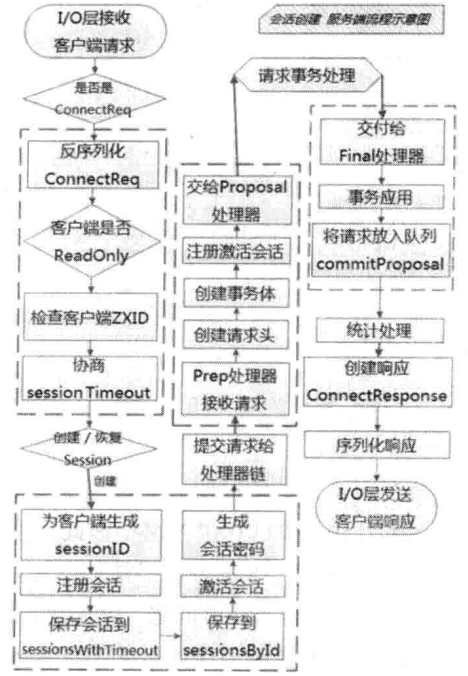

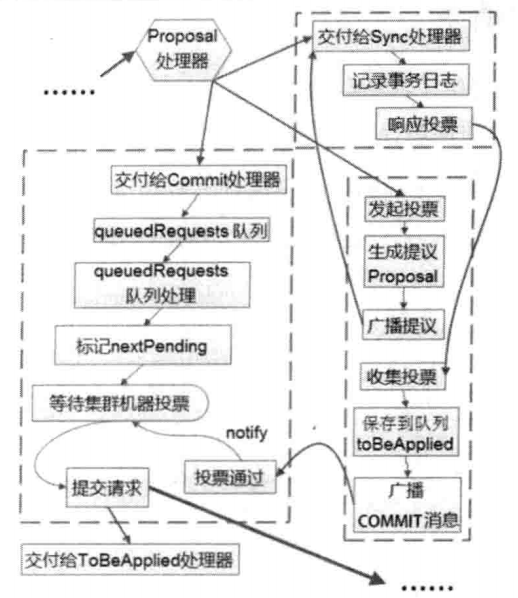

###### 请求接收

1. I/O 层接收来自客户端的请求。

   在 ZooKeeper 中，NIOServerCnxn 实例维护每一个客户端连接，客户端与服务端的所有通信都是由 NIOServerCnxn 负责的——其负责统一接收来自客户端的所有请求，并将请求内容从底层网络 I/O 中完整地读取出来。

2. 判断是否是客户端"会话创建"请求。

   NIOServerCnxn 在负责网络通信的同时，自然也承担了客户端会话的载体——每个会话都会对应一个 NIOServerCnxn 实体。因此，对于每个请求，ZooKeeper都会检查当前 NIOServerCnxn 实体是否已经被初始化。如果尚未被初始化，那么就可以确定该客户端请求一定是"会话创建"请求。很显然，在会话创建初期， NIOServerCnxn 尚未得到初始化，因此此时的第一个请求必定是"会话创建"请求。

3. 反序列化 ConnectRequest 请求

   一旦确定当前客户端请求是"会话创建"请求，那么服务端就可以对其进行反序列化，并生成一个 ConnectRequest 请求实体。

4. 判断是否是 ReadOnly 客户端。

   在 ZooKeeper 的设计实现中，如果当前 ZooKeeper 服务器是以 ReadOnly 模式启动的，那么所有来自非 ReadOnly 型客户端的请求将无法被处理。因此，针对 ConnectRequest，服务端会首先检查其是否是 ReadOnly 客户端，并以此来决定是否接受该"会话创建"请求。

5. 检查客户端 ZXID。

   在正常情况下，同一个ZooKeeper集群中，服务端的ZXID必定大于客户端的ZXID，因此如果发现客户端的 ZXID 值大于服务端的 ZXID 值，那么服务端将不接受该客户端的"会话创建"请求。

6. 协商 sessionTimeout。

   客户端在构造 ZooKeeper 实例的时候，会有一个 sessionTimeout 参数用于指定会话的超时时间。客户端向服务器发送这个超时时间后，服务器会根据自己的超时时间限制最终确定该会话的超时时间——这个过程就是 sessionTimeout协商过程。

   默认情况下，ZooKeeper 服务端对超时时间的限制介于 2 个 tickTime 到 20 个 tickTime 之间。即如果我们设置tickTime 值为 2000（单位∶ 毫秒）的话，那么服务端就会限制客户端的超时时间，使之介于4秒到 40秒之间。

7. 判断是否需要重新创建会话。

   服务端根据客户端请求中是否包含 sessionID 来判断该客户端是否需要重新创建会话。如果客户端请求中已经包含了sessionID，那么就认为该客户端正在进行会话重连。在这种情况下，服务端只需要重新打开这个会话，否则需要重新创建。

###### 会话创建

1. 为客户端生成 sessionID。

   在为客户端创建会话之前，服务端首先会为每个客户端都分配一个 sessionID。分配方式其实很简单，每个 ZooKeeper 服务器在启动的时候，都会初始化一个会话管理器（SessionTracker），同时初始化 sessionID，我们将其称为"基准 sessionID"。因此针对每个客户端，只需要在这个"基准 sessionID"的基础上进行逐个递增就可以了。

   由于 sessionID是 ZooKeeper 会话的一个重要标识，许多与会话相关的运行机制都是基于这个 sessionID 的，因此，无论是哪台服务器为客户端分配的 sessionlD，都务必保证全局唯一。在 ZooKeeper 中，是通过保证"基准 sessionID"的全局唯一来确保每次分配的 sessionID 在集群内部都各不相同。

2. 注册会话。

   创建会话最重要的工作就是向 SessionTracker 中注册会话。SessionTracker 中维护了两个比较重要的数据结构，分别是 sessionsWithTimeout 和 sessionsById。前者根据 sessionID 保存了所有会话的超时时间，而后者则是根据 sessionID 保存了所有会话实体。在会话创建初期，就应该将该客户端会话的相关信息保存到这两个数据结构中，方便后续会话管理器进行管理。

3. 激活会话。

   向 SessionTracker注册完会话后，接下来还需要对会话进行激活操作。此处，读者需要了解的就是，激活会话的核心是为会话安排一个区块，以便会话清理程序能够快速高效地进行会话清理。

4. 生成会话密码。

   服务端在创建一个客户端会话的时候，会同时为客户端生成一个会话密码，连同 sessionID 一起发送给客户端，作为会话在集群中不同机器间转移的凭证。会话密码的生成算法非常简单，如下∶

   ```
   static final private long superSecret = 0OXB3415C00L; 
   Random r = new Random(sessionId ^ superSecret); 
   r.nextBytes(passwd);
   ```

###### 预处理

1. 将请求交给 ZooKeeper 的PrepRequestProcessor处理器进行处理。

   ZooKeeper 对于每个客户端请求的处理模型采用了典型的责任链模式——每个客户端请求都会由几个不同的请求处理器依次进行处理。

   另外，在提交给第一个请求处理器前，ZooKeeper 还会根据该请求所属的会话，进行一次激活会话操作，以确保当前会话处于激活状态。完成会话激活之后， ZooKeeper就会将请求提交给第一个请求处理器∶PrepRequestProcessor。

2. 创建请求事务头。

   对于事务请求，ZooKeeper 首先会为其创建请求事务头。请求事务头是每一个 ZooKeeper 事务请求中非常重要的一部分，服务端后续的请求处理器都是基于该请求头来识别当前请求是否是事务请求。请求事务头包含了一个事务请求最基本的一些信息，包括sessionID、ZXID、CXID 和请求类型等。

3. 创建请求事务体。

   对于事务请求，ZooKeeper 还会为其创建请求的事务体。在此处由于是"会话创建"请求，因此会创建事务体 CreateSessionTxn。

4. 注册与激活会话。

   此处的注册与激活会话过程，和上面步骤 9中提到的过程是一致的，虽然重复了，但是读者可以放心，不会引起额外的问题。此处进行会话注册与激活的目的是处理由非 Leader 服务器转发过来的会话创建请求。在这种情况下，其实尚未在 Leader的SessionTracker中进行会话的注册，因此需要在此处进行一次注册与激活。

###### 事务处理

1. 将请求交给 ProposalRequestProcessor 处理器。

   完成对请求的预处理后，PrepRequestProcessor 处理器会将请求交付给自己的下一级处理器：ProposalRequestProcessor。

   ProposalRequestProcessor 处理器，顾名思义，是一个与提案相关的处理器。所谓的提案，是 ZooKeeper 中针对事务请求所展开的一个投票流程中对事务操作的包装。从 ProposalRequestProcessor 处理器开始，请求的处理将会进入三个子处理流程，分别是 Sync 流程、Proposal 流程和 Commit 流程。

   

   - Sync 流程

     所谓 Sync 流程，其核心就是使用 SyncRequestProcessor 处理器记录事务日志的过程。ProposaLRequestProcessor 处理器在接收到一个上级处理器流转过来的请求后，首先会判断该请求是否是事务请求。针对每个事务请求，都会通过事务日志的形式将其记录下来。Leader 服务器和 Follower 服务器的请求处理链路中都会有这个处理器，两者在事务日志的记录功能上是完全一致的。

     完成事务日志记录后，每个Follower 服务器都会向Leader服务器发送 ACK 消息，表明自身完成了事务日志的记录，以便 Leader 服务器统计每个事务请求的投票情况。

   - Proposal 流程

     在 ZooKeeper 的实现中，每一个事务请求都需要集群中过半机器投票认可才能被真正应用到 ZooKeeper 的内存数据库中去，这个投票与统计过程被称为"Proposal 流程"。

     1. 发起投票。

        如果当前请求是事务请求，那么 Leader 服务器就会发起一轮事务投票。在发起事务投票之前，首先会检查当前服务端的 ZXID 是否可用。关于 ZooKeeper的 ZXID 可用性检查，如果当前服务端的 ZXID 不可用，那么将会抛出 XidRolloverException 异常。

     2. 生成提议Proposal。

        如果当前服务端的 ZXID 可用，那么就可以开始事务投票了。ZooKeeper 会将之前创建的请求头和事务体，以及 ZXID 和请求本身序列化到 Proposal 对象中——此处生成的 Proposal 对象就是一个提议，即针对 ZooKeeper 服务器状态的一次变更申请。

     3. 广播提议。

        生成提议后，Leader 服务器会以 ZXID 作为标识，将该提议放入投票箱 outstandingProposals 中，同时会将该提议广播给所有的 Follower 服务器。

     4. 收集投票。

        Follower 服务器在接收到Leader发来的这个提议后，会进入 Sync 流程来进行事务日志的记录，一旦日志记录完成后，就会发送 ACK消息给Leader服务器， Leader 服务器根据这些 ACK 消息来统计每个提议的投票情况。

        当一个提议获得了集群中过半机器的投票，那么就认为该提议通过，接下去就可以进入提议的 Commit 阶段了。

     5. 将请求放入 toBeApplied 队列。

        在该提议被提交之前，ZooKeeper 首先会将其放入 toBeApplied 队列中去。

     6. 广播 COMMIT 消息。

        一旦 ZooKeeper 确认一个提议已经可以被提交了，那么 Leader 服务器就会向 Follower 和 Observer 服务器发送 COMMIT 消息，以便所有服务器都能够提交该提议。这里需要注意的一点是，由于 Observer 服务器并未参加之前的提议投票，因此 Observer 服务器尚未保存任何关于该提议的信息，所以在广播 COMMIT消息的时候，需要区别对待，Leader会向其发送一种被称为"INFORM"的消息，该消息体中包含了当前提议的内容。而对于 Follower 服务器，由于已经保存了所有关于该提议的信息，因此 Leader 服务器只需要向其发送 ZXID即可。

   - Commit 流程

     1. 将请求交付给 CommitProcessor 处理器。

        CommitProcessor 处理器在收到请求后，并不会立即处理，而是会将其放入 queuedRequests 队列中。

     2. 处理 queuedRequests 队列请求。

        CommitProcessor 处理器会有一个单独的线程来处理从上一级处理器流转下来的请求。当检测到 queuedRequests 队列中已经有新的请求进来，就会逐个从队列中取出请求进行处理。

     3. 标记 nextPending。

        如果从 queuedRequests 队列中取出的请求是一个事务请求，那么就需要进行集群中各服务器之间的投票处理，同时需要将 nextPending 标记为当前请求。标记 nextPending 的作用，一方面是为了确保事务请求的顺序性，另一方面也是便于CommitProcessor 处理器检测当前集群中是否正在进行事务请求的投票。

     4. 等待Proposal 投票。

        在 Commit 流程处理的同时，Leader 已经根据当前事务请求生成了一个提议 Proposal，并广播给了所有的 Follower 服务器。因此，在这个时候，Commit流程需要等待，直到投票结束。

     5. 投票通过。

        如果一个提议已经获得了过半机器的投票认可，那么将会进入请求提交阶段。 ZooKeeper 会将该请求放入 CommittedRequests 队列中，同时唤醒 Commit流程。

     6. 提交请求。

        一旦发现 committedRequests 队列中已经有可以提交的请求了，那么 Commit 流程就会开始提交请求。当然在提交以前，为了保证事务请求的顺序执行，Commit 流 程 还 会 对 比 之 前 标 记 的 nextPending 和 committedRequests 队列中第一个请求是否一致。

        如果检查通过，那么 Commit 流程就会将该请求放入 toProcess 队列中，然后交付给下一个请求处理器∶ FinalRequestProcessor。

###### 事务应用

1. 交付给 FinalRequestProcessor 处理器。

   请求流转到 FinalRequestProcessor 处理器后，也就接近请求处理的尾声了。 FinalRequestProcessor 处理器会首先检查 outstandingChanges 队列中请求的有效性，如果发现这些请求已经落后于当前正在处理的请求，那么直接从 outstandingChanges 队列中移除。

2. 事务应用。

   在之前的请求处理逻辑中，我们仅仅是将该事务请求记录到了事务日志中去，而内存数据库中的状态尚未变更。因此，在这个环节，我们需要将事务变更应用到内存数据库中。但是需要注意的一点是，对于"会话创建"这类事务请求， ZooKeeper 做了特殊处理——因为在 ZooKeeper 内存中，会话的管理都是由 SessionTracker 负责的，而在会话创建的步骤9中，ZooKeeper 已经将会话信息注册到了 SessionTracker 中，因此此处无须对内存数据库做任何处理，只需要再次向 SessionTracker 进行会话注册即可。

3. 将事务请求放入队列∶ commitProposal。

   一旦完成事务请求的内存数据库应用，就可以将该请求放入 commitProposal队列中。commitProposal 队列用来保存最近被提交的事务请求，以便集群间机器进行数据的快速同步。

###### 会话响应

客户端请求在经过 ZooKeeper 服务端处理链路的所有请求处理器的处理后，就进入最后的会话响应阶段了。会话响应阶段非常简单，大体分为以下 4 个步骤。

1. 统计处理。

   至此，客户端的"会话创建"请求已经从 ZooKeeper 请求处理链路上的所有请求处理器间完成了流转。到这一步，ZooKeeper 会计算请求在服务端处理所花费的时间，同时还会统计客户端连接的一些基本信息，包括 lastZxid（最新的 ZXID）、 lastOp（最后一次和服务端的操作）和 lastLatency（最后一次请求处理所花费的时间）等。

2. 创建响应 ConnectResponse。

   ConnectResponse 就是一个会话创建成功后的响应，包含了当前客户端与服务端之间的通信协议版本号 protocolVersion、会话超时时间、sessionID 和会话密码。

3. 序列化 ConnectResponse。

4. I/O 层发送响应给客户端。

##### 7.8.2 SetData 请求

服务端对于 SetData 请求的处理，大体可以分为 4大步骤，分别是请求的预处理、事务处理、事务应用和请求响应。

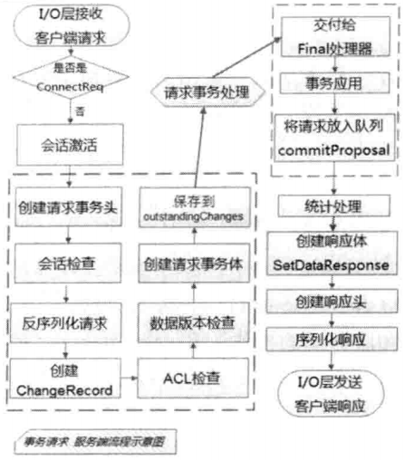

###### 预处理

1. I/O 层接收来自客户端的请求。

2. 判断是否是客户端"会话创建"请求。

   ZooKeeper 对于每一个客户端请求，都会检查是否是""会话创建"请求。如果确实是"会话创建"请求，那么就按照"会话创建"请求处理流程执行。然而对于 SetData 请求，因为此时已经完成了会话创建，因此按照正常的事务请求进行处理。

3. 将请求交给 ZooKeeper 的 PrepRequestProcessor 处理器进行处理。

4. 创建请求事务头。

5. 会话检查。

   客户端会话检查是指检查该会话是否有效，即是否已经超时。如果该会话已经超时，那么服务端就会向客户端抛出 SessionExpiredException 异常。 

6. 反序列化请求，并创建 ChangeRecord 记录。

   面对客户端请求，ZooKeeper 首先会将其进行反序列化并生成特定的 SetDataRequest 请求。SetDataRequest 请求中通常包含了数据节点路径 path、更新的数据内容 data 和期望的数据节点版本 version。同时，根据请求中对应的 path，ZooKeeper 会生成一个 ChangeRecord 记录，并放入 outstandingChanges 队列中。

   outstandingChanges 队列中存放了当前 ZooKeeper 服务器正在进行处理的事务请求，以便 ZooKeeper 在处理后续请求的过程中需要针对之前的客户端请求的相关处理，例如对于"会话关闭"请求来说，其需要根据当前正在处理的事务请求来收集需要清理的临时节点。

7. ACL 检查。

   由于当前请求是数据更新请求，因此 ZooKeeper 需要检查该客户端是否具有数据更新的权限。如果没有权限，那么会抛出 NoAuthException 异常。

8. 数据版本检查。

   在ZooKeeper 依靠 version 属性来实现乐观锁机制中的"写入校验"。如果 ZooKeeper 服务端发现当前数据内容的版本号与客户端预期的版本不匹配的话，那么将会抛出异常。

9. 创建请求事务体 SetDataTxn。

10. 保存事务操作到 outstandingChanges 队列中去。

###### 事务处理

对于事务请求，ZooKeeper 服务端都会发起事务处理流程。无论对于会话创建请求还是 SetData 请求，或是其他 事务请求，事务处理流程都是一致的，都是由 ProposalRequestProcessor 处理器发起，通过 Sync、Proposal 和 Commit 三个子流程相互协作完成的。

###### 事务应用

1. 交付给 FinaLRequestProcessor 处理器。

2.  事务应用。

   ZooKeeper 会将请求事务头和事务体直接交给内存数据库 ZKDatabase 进行事务应用，同时返回 ProcessTxnResult对象，包含了数据节点内容更新后的 stat。

3. 将事务请求放入队列∶ commitProposal。

###### 请求响应

1. 统计处理。

2. 创建响应体 SetDataResponse。

   SetDataResponse 是一个数据更新成功后的响应，主要包含了当前数据节点的最新状态 stat。

3. 创建响应头。

   响应头是每个请求响应的基本信息，方便客户端对响应进行快速的解析，包括当前响应对应的事务 ZXID 和请求处理是否成功的标识 err。

4. 序列化响应。
5. I/O 层发送响应给客户端。

##### 7.8.3 事务请求转发

ZooKeeper 实现了非常特别的事务请求转发机制：所有非 Leader 服务器如果接收到了来自客户端的事务请求，那么必须将其转发给 Leader 服务器来处理。

在Follower或是Observer服务器中，第一个请求处理器分别是 FollowerRequestProcessor和 ObserverRequestProcessor，无论是哪个处理器，都会检查当前请求是否是事务请求，如果是事务请求，那么就会将该客户端请求以 REQUEST 消息的形式转发给 Leader 服务器。Leader 服务器在接收到这个消息后，会解析出客户端的原始请求，然后提交到自己的请求处理链中开始进行事务请求的处理。

##### 7.8.4 GetData 请求

服务端对于 GetData请求的处理，大体可以分为3大步骤，分别是请求的预处理、非事务处理和请求响应。

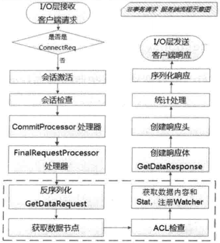

###### 预处理

1. I/O 层接收来自客户端的请求。
2. 判断是否是客户端"会话创建"请求。
3. 将请求交给 ZooKeeper 的 PrepRequestProcessor 处理器进行处理。
4. 会话检查。

由于 GetData 请求是非事务请求，因此省去了许多事务预处理逻辑，包括创建请求事务头、ChangeRecord 和事务体等，以及对数据节点版本的检查。

###### 非事务处理

1. 反序列化 GetDataRequest 请求。

2. 获取数据节点。

   根据反序列化出的完整 GetDataRequest对象（包括了数据节点的 path和 Watcher 注册情况），ZooKeeper会从内存数据库中获取到该节点及其ACL信息。

3.  ACL 检查。

4. 获取数据内容和 stat，注册 Watcher。

###### 请求响应

1. 创建响应体 GetDataResponse。

   GetDataResponse 是一个数据获取成功后的响应，主要包含了当前数据节点的内容和状态 stat。 10.创建响应头。

2. 统计处理。

3. 序列化响应。
4. I/O 层发送响应给客户端。

#### 7.9 数据与存储

在 ZooKeeper 中，数据存储分为两部分：内存数据存储与磁盘数据存储。

##### 7.9.1 内存数据

ZooKeeper 的数据模型是一棵树，而从使用角度看， ZooKeeper 就像一个内存数据库一样。在这个内存数据库中，存储了整棵树的内容，包括所有的节点路径、节点数据及其 ACL 信息等，ZooKeeper 会定时将这个数据存储到磁盘上。

###### DataTree

DateTree是 ZooKeeper 内存数据存储的核心，是一个"树"的数据结构，代表了内存中的一份完整的数据。DataTree 不包含任何与网络、客户端连接以及请求处理等相关的业务逻辑，是一个非常独立的 ZooKeeper 组件。

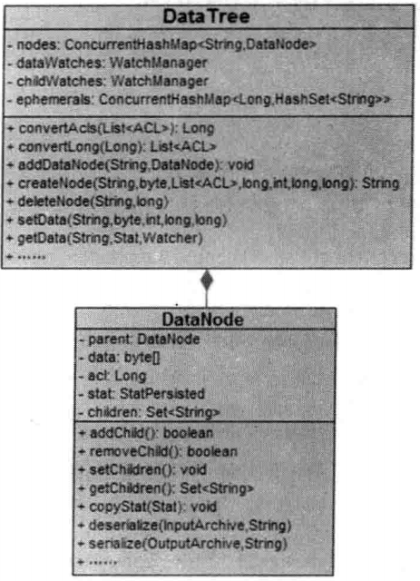

###### DataNode

DataNode 是数据存储的最小单元。DataNode 内部除了保存了节点的数据内容（data[]）、ACL 列表（acl）和节点状态（stat）之外，还记录了父节点（parent）的引用和子节点列表（children）两个属性。同时，DataNode 还提供了对子节点列表操作的各个接口。

###### nodes

DataTree 用于存储所有 ZooKeeper 节点的路径、数据内容及其 ACL 信息等，底层的数据结构其实是一个典型的 ConcurrentHashMap 键值对结构∶

```
private final ConcurrentHashMap<String,DataNode> nodes =
	new ConcurrentHashMap<String,DataNode>();
```

在 nodes 这个 Map中，存放了 ZooKeeper 服务器上所有的数据节点，可以说，对于 ZooKeeper 数据的所有操作，底层都是对这个 Map 结构的操作。nodes 以数据节点的路径（path）为 key，value 则是节点的数据内容∶ DataNode。

另外，对于所有的临时节点，为了便于实时访问和及时清理，DataTree 中还单独将临时节点保存起来∶

```
private final Map<Long,HashSet<String>> ephemerals =
	new ConcurrentHashMap<Long,HashSet<String>>(); 
```

##### 7.9.2 事务日志

###### 文件存储

事务日志文件都具有以下两个特点。

- 文件大小都是 67108880KB，即 64MB。
- 文件名后缀非常有规律，都是一个十六进制数字，同时随着文件修改时间的推移，这个十六进制后缀变大。该后缀其实是一个事务 ID：ZXID，并且是写入该事务日志文件第一条事务记录的 ZXID。使用 ZXID 作为文件后缀，可以帮助我们迅速定位到某一个事务操作所在的事务日志。同时，使用 ZXID 作为事务日志后缀的另一个优势是，ZXID 本身由两部分组成，高 32 位代表当前 Leader 周期（epoch），低 32 位则是真正的操作序列号。因此，将 ZXID 作为文件后缀，我们就可以清楚地看出当前运行时 ZooKeeper 的 Leader 周期。

###### 日志格式

ZooKeeper 提供了一套简易的事务目志格式化工具 org.apache.zookeeper.Server.LogFormatter，用于将这个默认的事务日志文件转换成可视化的事务操作日志，使用方法如下∶

```
Java LogFormatter 事务日志文件
```

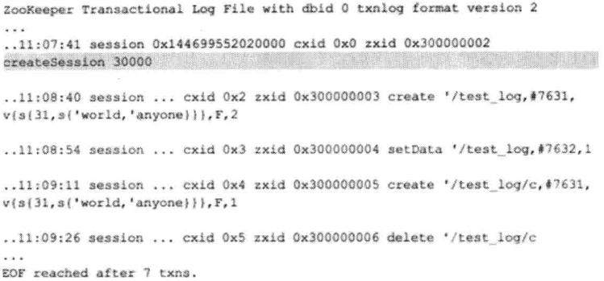

第一行∶

```
ZooKeeper Transactional Log File with dbid 0 txnlog format version 2
```

这一行是事务日志的文件头信息，这里输出的主要是事务目志的 DBID 和日志格式版本号。

第二行∶

```
..11:07:41 session 0x144699552820000 cxid θx0 zxid 0x300000002 createSession 30000
```

这一行就是一次客户端会话创建的事务操作日志，从左向右分别记录了事务操作时间、客户端会话 ID、CXID（客户端的操作序列号）、ZXID、操作类型和会话超时时间。

第三行：

```
..11∶08∶40 session 0x14469955202000 cxid θx2 zxid 0x300000003 create'/test_log,#7631,v{s{31,s{'world,'anyone}}},F,2
```

这一行是节点创建操作的事务操作日志，从左向右分别记录了事务操作时间、客户端会话 ID、CXID、ZXID、操作类型、节点路径、节点数据内容（在 LogFormatter中使用如下格式输出节点内容∶#内容的 ASCII 码值）、节点的 ACL 信息、是否是临时节点（F 代表持久节点，T 代表临时节点）和父节点的子节点版本号。

###### 日志写入

FileTxnLog 负责维护事务日志对外的接口，包括事务日志的写入和读取等，首先来看日志的写入。将事务操作写入事务日志的工作主要由 append 方法来负责∶

```
public synchronized boolean append(TxnHeader hdr,Record txn)
```

从方法定义中我们可以看到，ZooKeeper 在进行事务日志写入的过程中，会将事务头和事务体传给该方法。事务日志的写入过程大体可以分为如下 6 个步骤。

1. 确定是否有事务日志可写。

   当 ZooKeeper 服务器启动完成需要进行第一次事务日志的写入，或是上一个事务日志写满的时候，都会处于与事务日志文件断开的状态，即 ZooKeeper 服务器没有和任意一个日志文件相关联。因此，在进行事务日志写入前，ZooKeeper 首先会判断 FileTxnLog组件是否已经关联上一个可写的事务日志文件。如果没有关联上事务日志文件，那么就会使用与该事务操作关联的 ZXID 作为后缀创建一个事务日志文件，同时构建事务日志文件头信息（包含魔数 magic、事务日志格式版本 version 和 dbid），并立即写入这个事务日志文件中去。同时，将该文件的文件流放入一个集合∶streamsToFlush，用来记录当前需要强制进行数据落盘（将数据强制刷入磁盘上）的文件流。

2. 确定事务日志文件是否需要扩容（预分配）。

   ZooKeeper 的事务日志文件会采取"磁盘空间预分配"的策略。当检测到当前事务日志文件剩余空间不足 4096字节（4KB）时，就会开始进行文件空间扩容。文件空间扩容的过程其实非常简单，就是在现有文件大小的基础上，将文件大小增加 65536KB（64MB），然后使用"0"（\0）填充这些被扩容的文件空间。

   那么 ZooKeeper 为什么要进行事务日志文件的磁盘空间预分配呢?在前面的章节中我们已经提到，对于客户端的每一次事务操作，ZooKeeper 都会将其写入事务日志文件中。因此，事务日志的写入性能直接决定了 ZooKeeper 服务器对事务请求的响应，也就是说，事务写入近似可以被看作是—个磁盘 I/O 的过程。严格地讲，文件的不断追加写入操作会触发底层磁盘 I/O 为文件开辟新的磁盘块，即磁盘 Seek。因此，为了避免磁盘 Seek 的频率，提高磁盘 I/O的效率，ZooKeeper 在创建事务日志的时候就会进行文件空间"预分配"——在文件创建之初就向操作系统预分配一个很大的磁盘块，默认是 64MB，而一旦已分配的文件空间不足 4KB时，那么将会再次"预分配"，以避免随着每次事务的写入过程中文件大小增长带来的 Seek 开销，直至创建新的事务日志。事务日志"预分配"的大小可以通过系统属性 zookeeper.preAllocSize 来进行设置。

3. 事务序列化

   事务序列化包括对事务头和事务体的序列化，分别是对 TxnHeader（事务头）和Record（事务体）的序列化。其中事务体又可分为会话创建事务（CreateSessionTxn）、节点创建事务（CreateTxn）、节点删除事务（DeleteTxn）和节点数据更新事务（SetDataTxn）等。

4. 生成Checksum。

   为了保证事务日志文件的完整性和数据的准确性，ZooKeeper 在将事务日志写入文件前，会根据步骤 3中序列化产生的字节数组来计算 Checksum。ZooKeeper 默认使用 Adler32 算法来计算 Checksum 值。

5. 写入事务日志文件流。

   将序列化后的事务头、事务体及 Checksum 值写入到文件流中去。此时由于 ZooKeeper 使用的是 BufferedOutputStream，因此写入的数据并非真正被写入到磁盘文件上。

6. 事务日志刷入磁盘。

   在步骤 5中，已经将事务操作写入文件流中，但是由于缓存的原因，无法实时地写入磁盘文件中，因此我们需要将缓存数据强制刷入磁盘。在步骤 1 中我们已经将每个事务日志文件对应的文件流放入了 streamsToFLush，因此这里会从 streamsToFlush 中提取出文件流，并调用 FileChannel.force(boolean metaData)接口来强制将数据刷入磁盘文件中去。force 接口对应的其实是底层的 fsync 接口，是一个比较耗费磁盘 I/O 资源的接口，因此 ZooKeeper 允许用户控制是否需要主动调用该接口，可以通过系统属性 zookeeper.forceSync 来设置。

###### 日志截断

在 ZooKeeper 运行过程中，可能会出现这样的情况，非 Leader 机器上记录的事务 ID（我们将其称为 peerLastZxid）比 Leader 服务器大，无论这个情况是如何发生的，都是一个非法的运行时状态。同时，ZooKeeper 遵循一个原则∶ 只要集群中存在 Leader，那么所有机器都必须与该 Leader 的数据保持同步。

因此，一旦某台机器碰到上述情况，Leader 会发送 TRUNC 命令给这个机器，要求其进行日志截断。Learner 服务器在接收到该命令后，就会删除所有包含或大于 peerLastZxid的事务日志文件。

##### 7.9.3 snapshot——数据快照

数据快照是 ZooKeeper 数据存储中另一个非常核心的运行机制。顾名思义，数据快照用来记录 ZooKeeper 服务器上某一个时刻的全量内存数据内容，并将其写入到指定的磁盘文件中。

###### 文件存储

和事务日志文件的命名规则一致，快照数据文件也是使用 ZXID 的十六进制表示来作为文件名后缀，该后缀标识了本次数据快照开始时刻的服务器最新 ZXID。这个十六进制的文件后缀非常重要，在数据恢复阶段，ZooKeeper 会根据该 ZXID 来确定数据恢复的起始点。

和事务日志文件不同的是，ZooKeeper 的快照数据文件没有采用"预分配"机制，因此不会像事务日志文件那样内容中可能包含大量的"0"。每个快照数据文件中的所有内容都是有效的，因此该文件的大小在一定程度上能够反映当前 ZooKeeper 内存中全量数据的大小。

###### 存储格式

ZooKeeper 提供了一套简易的快照数据格式化工具org.apache.zookeeper.server.SnapshotFormatter，用于将这个默认的快照数据文件转换成可视化的数据内容，使用方法如下∶

```
Java SnapshotFormatter 快照数据文件
```

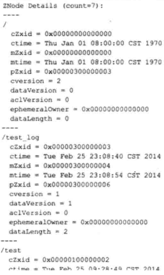

SnapshotFormatter 会将 ZooKeeper 上的数据节点逐个依次输出，但是需要注意的一点是，这里输出的仅仅是每个数据节点的元信息，并没有输出每个节点的数据内容，但这已经对运维非常有帮助了。

###### 数据快照

针对客户端的每一次事务操作，ZooKeeper都会将它们记录到事务日志中，当然，ZooKeeper 同时也会将数据变更应用到内存数据库中。另外， ZooKeeper 会在进行若干次事务日志记录之后，将内存数据库的全量数据 Dump 到本地文件中，这个过程就是数据快照。可以使用 snapCount参数来配置每次数据快照之间的事务操作次数，即 ZooKeeper 会在 snapCount 次事务日志记录后进行一个数据快照。

1. 确定是否需要进行数据快照。

   每进行一次事务日志记录之后，ZooKeeper 都会检测当前是否需要进行数据快照。理论上进行 snapCount 次事务操作后就会开始数据快照，但是考虑到数据快照对于 ZooKeeper 所在机器的整体性能的影响，需要尽量避免 ZooKeeper 集群中的所有机器在同一时刻进行数据快照。因此 ZooKeeper 在具体的实现中，并不是严格地按照这个策略执行的，而是采取"过半随机" 策略，即符合如下条件就进行数据快照

   logCount>(snapCount / 2 + randRoll)

   其中 logCount 代表了当前已经记录的事务日志数量，randRoll 为 1～snapCount/2之间的随机数，因此上面的条件就相当于：如果我们配置的 snapCount 值为默认的100000，那么ZooKeeper 会在 50000～100000 次事务日志记录后进行一次数据快照。

2. 切换事务日志文件。

   满足上述条件之后， ZooKeeper 就要开始进行数据快照了。首先是进行事务日志文件的切换。所谓的事务日志文件切换是指当前的事务日志已经"写满"（已经写入了 snapCount 个事务日志），需要重新创建一个新的事务日志。

3. 创建数据快照异步线程。

   为了保证数据快照过程不影响 ZooKeeper 的主流程，这里需要创建一个单独的异步线程来进行数据快照。 

4. 获取全量数据和会话信息。

   数据快照本质上就是将内存中的所有数据节点信息（DataTree）和会话信息保存到本地磁盘中去。因此这里会先从 ZKDatabase 中获取到 DataTree 和会话信息。

5. 生成快照数据文件名。

   在这一步中， ZooKeeper 会根据当前已提交的最大 ZXID 来生成数据快照文件名。

6. 数据序列化。

   接下来就开始真正的数据序列化了。在序列化时，首先会序列化文件头信息，这里的文件头和事务日志中的一致，同样也包含了魔数、版本号和dbid 信息。然后再对会话信息和 DataTree 分别进行序列化，同时生成一个 Checksum，一并写入快照数据文件中去。

##### 7.9.4 初始化

在 ZooKeeper 服务器启动期间，首先会进行数据初始化工作，用于将存储在磁盘上的数据文件加载到 ZooKeeper 服务器内存中。

###### 初始化流程

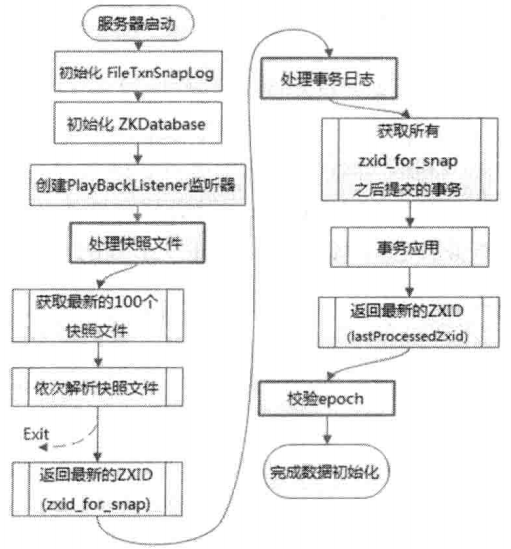

数据的初始化工作，其实就是从磁盘中加载数据的过程，主要包括了从快照文件中加载快照数据和根据事务日志进行数据订正两个过程。

1. 初始化 FileTxnSnapLog。

   FileTxnSnapLog 是 ZooKeeper 事务日志和快照数据访问层，用于衔接上层业务与底层数据存储。底层数据包含了事务日志和快照数据两部分，因此 FileTxnSnapLog内部又分为FiLeTxnLog 和FiLeSnap的初始化，分别代表事务日志管理器和快照数据管理器的初始化。

2. 初始化 ZKDatabase。

   完成 FileTxnSnapLog 的初始化后，我们就完成了 ZooKeeper 服务器和底层数据存储的对接，接下来就要开始构建内存数据库 ZKDatabase 了。在初始化过程中，首先会构建一个初始化的 DataTree，同时会将步骤1中初始化的 FileTxnSnapLog 交给 ZKDatabase，以便内存数据库能够对事务日志和快照数据进行访问。

   DataTree 在每个 ZooKeeper 服务器内部都是单例。在 ZKDatabase 初始化的时候，DataTree 也会进行相应的初始化工作——创建一些 ZooKeeper的默认节点，包括/、/zookeeper和/zookeeper/quota三个节点的创建。

   除了ZooKeeper 的数据节点，在 ZKDatabase 的初始化阶段还会创建一个用于保存所有客户端会话超时时间的记录器∶sessionsWithTimeouts——我们称之为"会话超时时间记录器"。

3. 创建 PlayBackListener 监听器。

   PlayBackListener 监听器主要用来接收事务应用过程中的回调。在 ZooKeeper 数据恢复后期，会有一个事务订正的过程，在这个过程中，会回调 PLayBackListener 监听器来进行对应的数据订正。

4. 处理快照文件。

   完成内存数据库的初始化之后，ZooKeeper 就可以开始从磁盘中恢复数据了。每一个快照数据文件中都保存了 ZooKeeper 服务器近似全量的数据，因此首先从这些快照文件开始加载。

5. 获取最新的 100 个快照文件。

   一般在 ZooKeeper 服务器运行一段时间之后，磁盘上都会保留许多个快照文件。另外由于每次数据快照过程中，ZooKeeper 都会将全量数据 Dump 到磁盘快照文件中，因此往往更新时间最晚的那个文件包含了最新的全量数据。那么是否我们只需要这个最新的快照文件就可以了呢? 在 ZooKeeper 的实现中，会获取最新的至多 100 个快照文件（如果磁盘上仅存在不到 100 个快照文件，那么就获取所有这些快照文件）。

6. 解析快照文件。

   获取到这至多 100 个文件之后，ZooKeeper 会开始"逐个"进行解析。每个快照文件都是内存数据序列化到磁盘的二进制文件，因此在这里需要对其进行反序列化，生成 DataTree 对象和 sessionsWithTimeouts 集合。同时在这个过程中，还会进行文件的 checkSum 校验以确定快照文件的正确性。

   需要注意的一点是，虽然在步骤 5中获取到的是 100 个快照文件，但其实在这里的"逐个"解析过程中，如果正确性校验通过的话，那么通常只会解析最新的那个快照文件。换句话说，**只有当最新的快照文件不可用的时候，才会逐个进行解析，直到将这 100 个文件全部解析完。**如果将步骤 4 中获取的所有快照文件都解析完后还是无法成功恢复一个完整的 DataTree 和 sessionsWithTimeouts，则认为无法从磁盘中加载数据，服务器启动失败。

7. 获取最新的ZXID。

   完成步骤6的操作之后，就已经基于快照文件构建了一个完整的 DataTree 实例和 sessionsWithTimeouts 集合了。此时根据这个快照文件的文件名就可以解析出一个最新的 ZXID∶zxid_for_snap，该 ZXID 代表了ZooKeeper 开始进行数据快照的时刻。

8. 处理事务日志。

   在经过前面 7 步流程的处理后，此时 ZooKeeper 服务器内存中已经有了一份近似全量的数据了，现在开始就要通过事务日志来更新增量数据了。

9. 获取所有zxid_for_snap之后提交的事务。

   到这里，我们已经获取到了快照数据的最新 ZXID。ZooKeeper 中数据的快照机制决定了快照文件中并非包含了所有的事务操作。但是未被包含在快照文件中的那部分事务操作是可以通过数据订正来实现的。因此这里我们只需要从事务日志中获取所有 ZXID 比步骤 7中得到的 zxid_for_snap 大的事务操作。

10.  事务应用。

    获取到所有 ZXID 大于 zxid_for_snap 的事务后，将其逐个应用到之前基于快照数据文件恢复出来的 DataTree 和 sessionsWithTimeouts 中去。

    在事务应用的过程中，还有一个细节需要我们注意，每当有一个事务被应用到内存数据库中去后，ZooKeeper 同时会回调 PLayBackListener 监听器，将这一事务操作记录转换成 Proposal，并保存到 ZKDatabase.committedLog 中，以便 Follower 进行快速同步。

11. 获取最新 ZXID。

    待所有的事务都被完整地应用到内存数据库中之后，基本上也就完成了数据的初始化过程，此时再次获取一个 ZXID，用来标识上次服务器正常运行时提交的最大事务 ID。

12. 校验 epoch

    epoch 是 ZooKeeper 中一个非常特别的变量，其字面意思是"纪元、时代"，在 ZooKeeper 中，epoch 标识了当前Leader 周期。每次选举产生一个新的 Leader 服务器之后，就会生成一个新的 epoch。在运行期间集群中机器相互通信的过程中，都会带上这个 epoch 以确保彼此在同一个 Leader 周期内。

    在完成数据加载后，ZooKeeper会从步骤 11中确定的 ZXID 中解析出事务处理的 Leader 周期∶ epochOfZxid。同时也会从磁盘的 currentEpoch 和 acceptedEpoch 文件中读取出上次记录的最新的 epoch 值，进行校验。

###### PlayBackListener

PlayBackListener是一个事务应用监听器，用于在事务应用过程中的回调∶每当成功将一条事务日志应用到内存数据库中后，就会调用这个监听器。其接口定义非常简单，只有一个方法∶

```
void onTxnLoaded(TxnHeader hdr,Record rec);
```

用于对单条事务进行处理。在完成步骤 2 ZKDatabase的初始化后，ZooKeeper 会立即创建一个PLayBackListener 监听器，并将其置于FileTxnSnapLog 中。在之后的步骤 10 事务应用过程中，会逐条回调该接口进行事务的二次处理。PLayBackListener会将这些刚刚被应用到内存数据库中的事务转存到ZKDatabase.committedLog 中，以便集群中服务器间进行快速的数据同步（并非立即开始，learner服务器向leader服务器注册后）。

##### 7.9.5 数据同步

整个集群完成 Leader 选举之后，Learner 会向 Leader 服务器进行注册。当 Learner 服务器向Leader 完成注册后，就进入数据同步环节。简单地讲，数据同步过程就是 Leader 服务器将那些没有在 Learner 服务器上提交过的事务请求同步给 Learner 服务器。

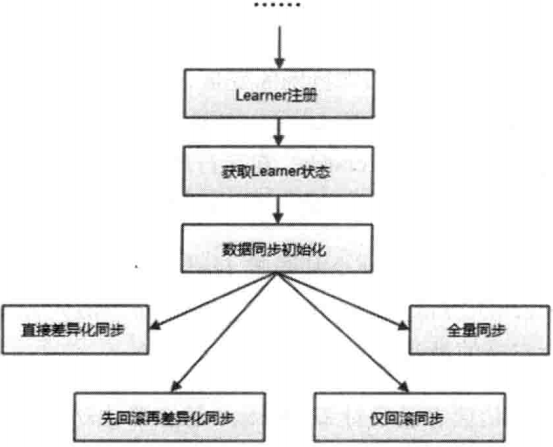

###### 获取 Learner 状态

在注册 Learner的最后阶段，Learner服务器会发送给 Leader 服务器一个 ACKEPOCH数据包，Leader 会从这个数据包中解析出该Learner 的 currentEpoch 和 lastZxid。

###### 数据同步初始化

在开始数据同步之前，Leader 服务器会进行数据同步初始化，首先会从 ZooKeeper 的内存数据库中提取出事务请求对应的提议缓存队列（下面我们用"提议缓存队列"来指代该队列）∶proposals，同时完成对以下三个 ZXID 值的初始化。

- peerLastZxid∶该 Learner 服务器最后处理的 ZXID。
- minCommittedLog∶Leader服务器提议缓存队列 committedLog中的最小ZXID
- maxCommittedLog∶Leader服务器提议缓存队列 committedLog 中的最大ZXID。

ZooKeeper 集群数据同步通常分为四类，分别是直接差异化同步（DIFF 同步）、先回滚再差异化同步（TRUNC+DIFF 同步）、仅回滚同步（TRUNC 同步）和全量同步（SNAP同步）。在初始化阶段，Leader 服务器会优先初始化以全量同步方式来同步数据——当然，这并非最终的数据同步方式，在以下步骤中，会根据Leader 和 Learner 服务器之间的数据差异情况来决定最终的数据同步方式。

###### 直接差异化同步（DIFF 同步）

场景∶peerLastZxid 介于 minCommittedLog 和 maxCommittedLog 之间。

对于这种场景，就使用直接差异化同步（DIFF 同步）方式即可。Leader 服务器会首先向这个Learner发送一个 DIFF 指令，用于通知 Learner"进入差异化数据同步阶段，Leader服务器即将把一些Proposal同步给自己"。在实际 Proposal同步过程中，针对每个Proposal，Leader 服务器都会通过发送两个数据包来完成，分别是 PROPOSAL 内容数据包和 COMMIT 指令数据包——这和 ZooKeeper 运行时 Leader 和 Follower 之间的事务请求的提交过程是一致的。

举个例子来说，假如某个时刻Leader 服务器的提议缓存队列对应的ZXID 依次是∶

0x50000001、θx50000002、8x50000003，0x50000004、0x50000005

而 Learner 服务器最后处理的 ZXID 为 0x50000003，于是 Leader 服务器就会依次将 0x50000004 和 0x50000005 两个提议同步给 Learner 服务器。

| 发送顺序 | 数据包类型 | 对应的 ZXID |
| -------- | ---------- | ----------- |
| 1        | PROPOSAL   | 0x50000004  |
| 2        | COMMIT     | 0x50000004  |
| 3        | PROPOSAL   | 0x50000005  |
| 4        | COMMIT     | 0x50000005  |

通过以上四个数据包的发送，Learner 服务器就可以接收到自己和 Leader 服务器的所有差异数据。Leader 服务器在发送完差异数据之后，就会将该 Learner 加入到 forwardingFollowers 或 observingLearners 队列中，这两个队列在ZooKeeper运行期间的事务请求处理过程中都会使用到。随后 Leader 还会立即发送一个 NEWLEADER 指令，用于通知 Learner，已经将提议缓存队列中的 Proposal 都同步给自己了。

下面我们再来看 Learner 对 Leader 发送过来的数据包的处理。根据 Leader服务器的数据包发送顺序，Learner 会首先接收到一个 DIFF 指令，于是便确定了接下来进入 DIFF 同步阶段。然后依次收到表中的四个数据包，Learner 会依次将其应用到内存数据库中。紧接着，Learner 还会接收到来自 Leader 的 NEWLEADER 指令，此时 Learner 就会反馈给 Leader 一个 ACK 消息，表明自己也确实完成了对提议缓存队列中 Proposal 的同步。

Leader 在接收到来自 Learner 的这个 ACK 消息以后，就认为当前 Learner 已经完成了数据同步，同时进入"过半策略"等待阶段——Leader 会和其他 Learner 服务器进行上述同样的数据同步流程，直到集群中有过半的 Learner 机器响应了Leader 这个 ACK 消息。一旦满足"过半策略"后，Leader 服务器就会向所有已经完成数据同步的 Learner 发送一个UPTODATE 指令，用来通知 Learner 已经完成了数据同步，同时集群中已经有过半机器完成了数据同步，集群已经具备了对外服务的能力了。

Learner 在接收到这个来自Leader 的 UPTODATE 指令后，会终止数据同步流程，然后向 Leader 再次反馈一个 ACK 消息。

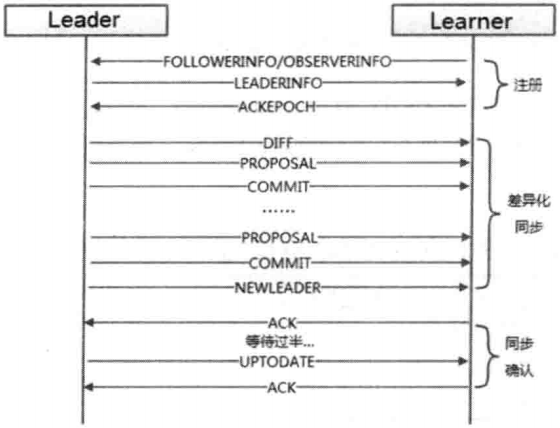

###### 先回滚再差异化同步（TRUNC+DIFF 同步）

场景：设有 A、B、C 三台机器，假如某一时刻 B是 Leader 服务器，此时的 Leader_Epoch为 5，同时当前已经被集群中绝大部分机器都提交的 ZXID 包括：0x500000001 和 0x500000002。此时，Leader 正要处理 ZXID： 0x500000003，并且已经将该事务写入到了 Leader 本地的事务日志中去——就在 Leader恰好要将该 Proposal 发送给其他 Follower 机器进行投票的时候，Leader 服务器挂了， Proposal 没有被同步出去。此时 ZooKeeper 集群会进行新一轮的 Leader 选举，假设此次选举产生的新的 Leader 是 A，同时 Leader_Epoch 变更为6，之后 A和 C两台服务器继续对外进行服务，又提交了0x600000001 和0x600000002 两个事务。此时，服务器 B再次启动，并开始数据同步。

简单地讲，上面这个场景就是 Leader 服务器在已经将事务记录到了本地事务日志中，但是没有成功发起 Proposal 流程的时候就挂了。在这个特殊场景中，我们看到，peerLastZxid、 minCommittedLog 和 maxCommittedLog 的值分别是 0x**5**00000003、0x**5**00000001 和 0x**6**00000002，显然，peerLastZxid 介于minCommittedLog 和 maxCommittedLog 之间。

对于这个特殊场景，就使用先回滚再差异化同步（TRUNC+DIFF 同步）的方式。当 Leader服务器发现某个 Learner 包含了一条自己没有的事务记录，那么就需要让该Learner 进行事务回滚——回滚到Leader 服务器上存在的，同时也是最接近于peerLastZxid的ZXID。在上面这个例子中，Leader 会需要Learner 回滚到 ZXID为 0x500000002 的事务记录。

先回滚再差异化同步的数据同步方式在具体实现上和差异化同步是一样的，都是会将差异化的Proposal发送给Learner。

| 发送顺序 | 数据包类型 | 对应的 ZXID |
| -------- | ---------- | ----------- |
| 1        | TRUNC      | 0x500000002 |
| 2        | PROPOSAL   | 0x600000001 |
| 3        | COMMIT     | 0x600000001 |
| 4        | PROPOSAL   | 0x600000002 |
| 5        | COMMIT     | 0x600000002 |

###### 仅回滚同步（TRUNC 同步）

场景∶ peerLastZxid 大于 maxCommittedLog（新选举了leader还未提交新事务）。

这种场景其实就是上述先回滚再差异化同步的简化模式，Leader 会要求 Learner 回滚到 ZXID 值为 maxCommitedLog 对应的事务操作。

###### 全量同步（SNAP 同步）

场景1：peerLastZxid 小于 minCommittedLog。

场景2：Leader 服务器上没有提议缓存队列，peerLastZxid 不等于 lastProcessedZxid（Leader 服务器数据恢复后得到的最大 ZXID）。

上述这两个场景非常类似，在这两种场景下，Leader 服务器都无法直接使用提议缓存队列和 Learner 进行数据同步，因此只能进行全量同步（SNAP 同步）。

所谓全量同步就是 Leader 服务器将本机上的全量内存数据都同步给 Learner。Leader 服务器首先向 Learner 发送一个 SNAP指令，通知 Learner 即将进行全量数据同步。随后，Leader 会从内存数据库中获取到全量的数据节点和会话超时时间记录器，将它们序列化后传输给Learner。Learner 服务器接收到该全量数据后，会对其反序列化后载入到内存数据库中。

以上就是 ZooKeeper 集群间机器的数据同步流程了。整个数据同步流程的代码实现主要在 LearnerHandLer 和 Learner 两个类中。

### 第 8 章 ZooKeeper运维

#### 8.1 配置详解

##### 8.1.1 基本配置

| 参数名     | 说 明                                                        |
| ---------- | ------------------------------------------------------------ |
| clientPort | 该参数无默认值，必须配置，不支持系统属性方式配置。用于配置当前服务器对外的服务端口，客户端会通过该端口和 ZooKeeper 服务器创建连接，一般设置为 2181。每台 ZooKeeper 服务器都可以配置任意可用的端口，同时，集群中的所有服务器不需要保持 clientPort 端口一致。 |
| dataDir    | 该参数无默认值，必须配置，不支持系统属性方式配置。用于配置 ZooKeeper 服务器存储快照文件的目录。默认情况下，如果没有配置参数dataLogDir，那么事务日志也会存储在这个目录中。考虑到事务日态的写性能直接影响 ZooKeeper 整体的服务能力，国此建议同时通过参数 dataLogDir 来配置 ZooKeeper 事务日志的存储目录。 |
| tickTime   | 该参数有默认值∶3000，单位是毫秒（ms），可以不配置，不支持系统属性方式配置。用于配置 ZooKeeper 中最小时间单元的长度，很多运行时的时间间隔都是使用tickTime 的倍数来表示的。例如，ZooKeeper 中会话的最小超时时间默认是 2*tickTime。 |

##### 8.1.2 高级配置

| 参数名                              | 说 明                                                        |
| ----------------------------------- | ------------------------------------------------------------ |
| dataLogDir                          | 该参数有默认值∶dataDir，可以不配置，不支持系统属性方式配置。参数dataLogDir用于配置ZooKeeper服务器存储事务日志文件的目录。默认情况下，ZooKeeper 会将事务日志文件和快照数据存储在同一个目录中，读者应尽量将这两者的目录区分开来。另外、如果条件允许，可以将事务日志的存储配置在一个单独的磁盘上。事务日志记录对于磁盘的性能要求非常高，为了保证数据的一致性，ZooKeeper 在返回客户端事务请求响应之前，必须将本次请求对应的事务日志写入到碰盘中。因此，事务日志写入的性能直接决定了 ZooKeper 在处理事务请求时的吞吐。针对同一块磁盘的其他并发读写操作（例如 ZooKeeper 运行时日志输出和操作系统自身的读写等），尤其是上文中提到的数据快照操作，会极大地影响事务日志的写性能。因此尽量给事务日志的输出配置一个单独的磁盘或是挂载点，将极大地提升 ZooKeeper 的整体性能。 |
| initLimit                           | 该参数有默认值∶10，即表示是参数tickTime 值的 10 倍，必须配置，且需要配置一个正整数，不支持系统属性方式配置。该参数用于配置 Leader服务器等待 Follower 启动，并完成数据同步的时间。Follower 服务器在启动过程中，会与Leader 建立连接并完成时数据的同步，从而确定自己对外提供服务的起始状态。Leader 服务器允许 Follower 在 initLimit 时间内完成这个工作。通常情况下，运维人员不用太在意这个参数的配置，使用其默认值即可。但如果随着 ZooKeeper 集群管理的数据量增大， Follower 服务器在启动的时候，从 Leader 上进行同步数据的时间也会相应变长，于是无法在较短的时间完成数据同步。因此，在这种情况下，有必要适当调大这个参数。 |
| syncLimit                           | 该参数有默认值∶5，即表示是参数 tickTime 值的5倍，必须配置，且需要配置一个正整数，不支持系统属性方式配置。该参数用于配置 Leader服务器和Follower之间进行心跳检测的最大延时时间。在ZooKeeper 集群运行过程中，Leader 服务器会与所有的 Follower 进行心跳检测来确定该服务器是否存活。如果Leader 服务器在 syncLimit 时间内无法获取到 Follower 的心跳检测响应，那么 Leader就会认为该 Follower 已经脱离了和自己的同步。通常情况下。运维人员使用该参数的默认值即可，但如果部署 ZooKeeper 集群的网络环境质量较低（例如网络延时较大或去包严重），那么可以适当调大这个参数。 |
| snapCount                           | 该参数有默认值∶ 100000，可以不配置，仅支持系统属性方式配置∶ zookeeper.snapCount。参数 snapCount 用于配置相邻两次数据快照之间的事务操作次数，即 ZooKeeper 会在 snapCount 次事务操作之后进行一次数据快照。 |
| preAllocSize                        | 该参数有默认值∶65536，单位是 KB，即 64MB，可以不配置，仅支持系统属性方式配置∶ zookeeper.preALlocSize。参数 preAllocSize 用于配置 ZooKeeper 事务日志文件预分配的磁盘空间大小。通常情况下，我们使用 ZooKeeper 的默认配置65536KB即可，但是知果我们将参数 snapCount 设置得比默认值更小或更大，那么 preAllocSize 参数也要随之做出变更。举个例子来说∶如果我们将 snapCount 的值设置为 500，同时预估每次事务操作的数据量大小至多 1KB，那么参数preAllocSize 设置为 500就足够了。 |
| minSessionTimeout maxSessionTimeout | 这两个参数有默认值，分别是参数 tickTime 值的2倍和 20 倍，即默认的会话超时时间在2\*tickTime～20\*tickTime 范围内，单位毫秒，可以不配置，不支持系统属性方式配置。这两个参数用于服务端对客户端会话的超时时间进行限制，如果客户端设置的超时时间不在该范围内，那么会被服务端强制设置为最大或最小超时时间。 |
| maxClientCnxns                      | 该参数有默认值：60，可以不配置，不支持系统属性方式配置。从Socket 层面限制单个客户端与单台服务器之间的并发连接数，即以 IP 地址粒度来进行连接数的限制。如果将该参数设置为 0，则表示对连接数不作任何限制。读者需要注意该连接数限制选项的使用范围，其仅仅是对**单台客户端机器与单台 ZooKeeper 服务器之间的连接数**限制，并不能控制所有客户端的连接数总和。 |
| jute.maxbuffer                      | 该参数有默认值∶ 1048575，单位是字节，可以不配置，仅支持系统属性方式配置∶jute.maxbuffer。该参数用于配置单个数据节点（ZNode）上可以存储的最大数据量大小。通常情况下运维人员不害要改动该参数，同时考虑到ZooKeeper 上不适宜存储太多的数据，往往还需要将该参数设置的更小。需要注意的是，在变更该参数的时候，需要在 ZooKeeper 集群的所有机器以及所有的客户端上均设置才能生效。 |
| clientPortAddress                   | 该参数没有默认值，可以不配置，不支持系统属性方式配置。针对那些多网卡的机器，该参数允许为每个 IP 地址指定不同的监听端口。 |
| server.id=host:port:port            | 该参数没有默认值，在单机模式下可以不配置，不支持系统属性方式配置。该参数用于配置组成 ZooKeeper 集群的机器列表，其中id 即为ServerID，与每台服务器myid 文件中的数字和对应。同时，在该参数中。会配置两个端口：第一个端口用于指定 Follower服务器与Leader 进行运行时通信和数据同步时所使用的端口，第二个端口则专门用于进行 Leader 选举过程中的投票通信。 在ZooKeeper 服务器启动的时候，其会根据 myid 文件中配置的 ServerID 来确定自己是哪台服务器，并使用对应配置的端口来进行启动。如果在实际使用过程中，需要在同一台服务器上部署多个 ZooKeeper 实例来构成伪集群的话，那么这些端口都需要配置成不同，例如∶server.1=192.168.0.1:2777:3777 server.2=192.168.0.1:2888:3888 server.3=192.168.0.1:2999:3999 |
| autopurge.snapRetainCount           | 该参数有默认值：3，可以不配置，不支持系统属性方式配置。从3.4.0 版本开始，ZooKeeper 提供了对历史事务日志和快照数据自动清理的支持。参数autopurge.snapRetainCount 用于配置 ZooKeeper 在自动清理的时候需要保留的快照数据文件数量和对应的事务日志文件。需要注意的是，并不是磁盘上的所有事务日志和快照数据文件都可以被清理掉——那样的话将无法恢复数据。因此参数 autopurge.snapRetainCount 的最小值是3，如果配置的 autopurge.snapRetainCount 值比3小的话，那么会被自动调整到3，即至少需要保留3个快照数据文件和对应的事务日志文件。 |
| autopurge.purgeInterval             | 该参数有获认值∶0，单位是小时，可以不配置，不支持系统属性方式配置。参数 autopurqe.purgeInterval 和参数 autopurge.snapRetainCount 配套使用，用于配置ZooKeeper进行历史文件自动清理的频率。如果配置该值为0或负数，那么就表明不需要开启定时清理功能。ZooKeeper默认不开启这项功能。 |
| fsync.warningthresholdms            | 该参数有默认值∶ 1000，单位是毫秒，可以不配置，仅支持系统属性方式配置∶fsync.warningthresholdms。参数 fsync.warningthresholdms 用于配置 ZooKeeper 进行事务日志 fsync 操作时消耗时间的报警阈值。一旦进行一个 fsync 操作消耗的时间大于参数fsync.warningthresholdms 指定的值，那么就在日志中打印出报警日志。 |
| forceSync                           | 该参数有默认值：yes，可以不配置，可选配置项为"yes"和"no"，仅支持系统属性方式配置∶zookeeper.forceSync。该参数用于配置 ZooKeeper服务器是否在事务提交的时候，将日志写入操作强制刷入磁盘（即调用 java.nio.channels.FileChannel.force接口），默认情况下是"yes"，即每次事务日态写入操作都会实时刷入磁盘。如果将其设置为 "no"，则能一定程度的提高 ZooKeeper 的写性能，但同时也会存在类似于机器断电这样的安全风险。 |
| globalOutstandingLimit              | 该参数有默认值∶ 1000，可以不配置，仅支持系统属性方式配置∶ zookeeper.globalOutstandingLimit。参数globalOutstandingLimit用于配置ZooKeeper服务器最大请求堆积数量。在 ZooKeeper 服务器运行的过程中，客户端会源源不断的将请求发送到服务端，为了防止服务端资源（包括 CPU、内存和网络等）耗尽，服务端必须限制同时处理的请求数，即最大请求堆积数量。 |
| leaderServes                        | 该参数有默认值：yes，可以不配置，可选配置项为"yes"和"no"，仅支持系统属性方式配置∶ zookeeperleaderServes。该参数用于配置 Leader服务器是否能够接受客户端的连接，即是否允许 Leader 向客户端提供服务，默认情况下，Leader服务器能够接受并处理客户端的所有读写请求。在ZooKeeper 的架构设计中，Leader 服务器主要用来进行对事务更新请求的协调以及集群本身的运行时协调，因此，可以设置让 Leader 服务器不接受客户端的连接，以使其专注于进行分布式协调。 |
| SkipAcl                             | 该参数有默认值∶ no，可以不配置，可选配置项为"yes"和"no"，仅支持系统属性方式配置∶ zookeeperskipACL。该参数用于配置ZooKeeper服务器是否跳过ACL 权限检查，默认情况下是"no"，即会对每一个客户端请求进行权限检查。如果将其设置为"yes"，则能一定程度的提高ZooKceper 的读写性能，但同时也将向所有客户端开放ZooKeeper 的数据，包括那些之前设置过ACL权限的数据节点，也将不再接受权限控制。 |
| cnxTimeout                          | 该参数有默认值∶ 5000，单位是毫秒，可以不配置，仅支持系统属性方式配置∶zookeeper.cnxTimeout。该参数用于配置在Leader 选举过程中，各服务器之间进行TCP连接创建的超时时间。 |
| electionAlg                         | 在之前的版本中， 可以使用该参数来配置选择ZooKeeper 进行 Leader 选举时所使用的算法，但从3.4.0 版本开始，ZooKeeper 废弃了其它选举算法，只留下了FastLeaderElection 算法，因此该参数目前看来没有用了。 |

#### 8.2 四字命令

四字命令的使用方式非常简单，通常有两种方式。

第一种是通过 Telnet 方式，使用 Telnet客户端登录 ZooKeeper 的对外服务端口，然后直接输入四字命令即可。

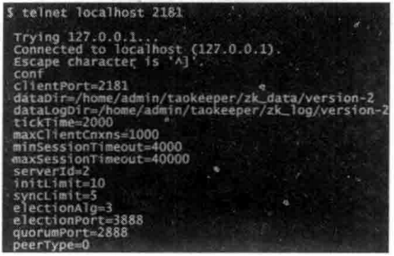

第二种则是使用nc方式。

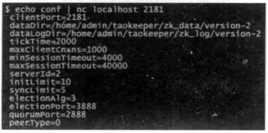

| 指令 | 说明                                                         |
| ---- | ------------------------------------------------------------ |
| conf | conf 命令用于输出ZooKeeper服务器运行时使用的基本配置信息，包括cLientPort、 dataDir 和 tickTime 等，以便运维人员快速地查看ZooKeeper 当前运行时的一些参数。另外，conf 命令会根据当前的运行模式来决定输出的信息。如果是单机模式（standalone），就不会输出诸如initLimit、syncLimit、eLectionAlg 和electionPort 等集群相关的配置信息。 |
| cons | cons 命令用于输出当前这台服务器上所有客户端连接的详细信息，包括每个客户端的客户端 IP、会话 ID 和最后一次与服务器交互的操作类型等。 |
| crst | crst 命令是一个功能性命令，用于重置所有的客户端连接统计信息。 |
| dump | dump命令用于输出当前集群的所有会话信息，包括这些会话的会话 ID，以及每个会话创建的临时节点等信息。另外，从前面章节的内容中，我们了解到只有 Leader 服务器会进行所有会话的超时检测，因此，如果在 Leader 服务器上执行该命令的话，我们还能够看到每个会话的超时时间。 |
| envi | envi 命令用于输出 ZooKeeper 所在服务器运行时的环境信息，包括 os.version、java.version和 user.home 等。 |
| ruok | ruok 命令用于输出当前 ZooKeeper 服务器是否正在运行。该命令的名字非常有趣，其谐音正好是"Are you ok"。执行该命令后，如果当前 ZooKeeper 服务器正在运行，那么返回"imok"，否则没有任何响应输出。请注意，ruok 命令的输出仅仅只能表明当前服务器是否正在运行，准确地讲，只能说明 2181 端口打开着，同时四字命令执行流程正常，但是不能代表 ZooKeeper 服务器是否运行正常。在很多时候，如果当前服务器无法正常处理客户端的读写请求，甚至已经无法和集群中的其他机器进行通信，ruok 命令依然返回"imok"。因此，一般来说，该命令并不是一个特别有用的命令，它不能反映 ZooKeeper 服务器的工作状态，想要更可靠地获取更多 ZooKeeper 运行状态信息，可以使用下面马上要讲到的 stat 命令。 |
| stat | stat命令用于获取ZooKeeper 服务器的运行时状态信息，包括基本的ZooKeeper版本、打包信息、运行时角色、集群数据节点个数等信息，另外还会将当前服务器的客户端连接信息打印出来。除了一些基本的状态信息外，stat 命令还会输出一些服务器的统计信息，包括延迟情况、收到请求数和返回的响应数等。注意，所有这些统计数据都可以通过 srst 命令进行重置。 |
| srvr | srvr 命令和 stat 命令的功能一致，唯一的区别是 Srvr 不会将客户端的连接情况输出，仅仅输出服务器的自身信息。 |
| srst | srst命令是一个功能行命令，用于重置所有服务器的统计信息。     |
| wchs | wchs 命令用于输出当前服务器上管理的 Watcher 的概要信息。     |
| wchc | wchc 命令用于输出当前服务器上管理的 Watcher的详细信息，以会话为单位进行归组，同时列出被该会话注册了 Watcher 的节点路径 |
| wchp | wchp 命令和 wchc 命令非常类似，也是用于输出当前服务器上管理的 Watcher 的详细信息，不同点在于 wchp 命令的输出信息以节点路径为单位进行归组 |
| mntr | mntr 命令用于输出比 stat 命令更为详尽的服务器统计信息，包括请求处理的延迟情况、服务器内存数据库大小和集群的数据同步情况。在输出结果中，每一行都是一个 key-value 的键值对 |
|      |                                                              |

#### 8.3 JMX

##### 8.3.1 开启远程 JMX

打开%ZK_HOME%/bin 目录下的zkServer.sh文件，加入以下三个配置才能开启远程 JMX。

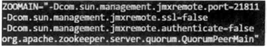

#### 8.5 构建一个高可用的集群

##### 8.5.1 集群组成

要搭建一个高可用的 ZooKeeper 集群，我们首先需要确定好集群的规模。关于 ZooKeeper集群的服务器组成，相信很多对 ZooKeeper 了解但是理解不深入的读者，都存在或曾经存在过这样一个错误的认识：为了使得 ZooKeeper 集群能够顺利地选举出 Leader，必须将 ZooKeeper 集群的服务器数部署成奇数。这里我们需要澄清的一点是∶任意台 ZooKeeper 服务器都能部署且能够正常运行。

那么存在于这么多读者中的这个错误认识是怎么回事呢?其实关于ZooKeeper集群服务器数，ZooKeeper 官方确实给出了关于奇数的建议，但绝大部分 ZooKeeper 用户对这个建议认识有偏差。在本书前面提到的"过半存活即可用"特性中，我们已经了解了，一个 ZooKeeper 集群如果要对外提供可用的服务，那么集群中必须要有过半的机器正常工作并且彼此之间能够正常通信。基于这个特性，如果想搭建一个能够允许F 台机器 down掉的集群，那么就要部署一个由 2×F+1 台服务器构成的 ZooKeeper 集群。因此，一个由 3台机器构成的 ZooKeeper 集群，能够在挂掉1台机器后依然正常工作，而对于一个由5台服务器构成的 ZooKeeper 集群，能够对2台机器挂掉的情况进行容灾。注意，如果是一个由6台服务器构成的 ZooKeeper 集群，同样只能够挂掉2 台机器，因为如果挂掉3台，剩下的机器就无法实现过半了。

因此，从上面的讲解中，我们其实可以看出，对于一个由6台机器构成的 ZooKeeper 集群来说，和一个由5 台机器构成的 ZooKeeper 集群相比，其在容灾能力上并没有任何显著的优势。基于这个原因，ZooKeeper 集群通常设计部署成奇数台服务器即可。

##### 8.5.2 容灾

ZooKeeper 确实已经很好地解决了单点问题。基于"过半"设计原则，ZooKeeper 在运行期间，集群中至少有过半的机器保存了最新的数据。因此，只要集群中超过半数的机器还能够正常工作，整个集群就能够对外提供服务。

解决了单点问题，是否就不需要考虑容灾了呢?答案是否定的。在进行 ZooKeeper的容灾方案设计过程中，我们要充分考虑到"过半"原则。也就是说，无论发生什么情况，我们必须要保证ZooKeeper 集群中有超过半数的机器能够正常工作。因此，通常有以下两种部署方案。

- 三机房部署

  在进行容灾方案设计的时候，我们通常是以机房为单位来考虑问题的。假如我们有三个机房可以部署服务，并且这三个机房间的网络情况良好，那么就可以在三个机房中都部署上若干个机器来组成一个 ZooKeeper 集群。

  我们假定构成ZooKeeper 集群的机器总数为N，在三个机房中部署的 ZooKeeper 服务器数分别为N1、N2和 N3，那么如果要使该 ZooKeeper 集群具有容灾能力，我们可以根据如下算法来计算 ZooKeeper 集群的机器部署方案。 

  1. 计算N1。

     如果 ZooKeeper 集群的服务器总数是N，那么N1=(N-1)/2。

  2. 计算 N2的可选值。

     N2的计算规则和 N1非常类似，只是 N2的取值是在一个取值范围内∶N2 的取值值范围是 1 ～ (N -N1)/2。

     即如果N为8，那么N1则为3，于是N2的取值范围就是1~2，分别是1和2。注意，1和2 仅仅是 N2的可选值，并非最终值——如果在 N2为某个可选值的时候，无法计算出 N3的值，那么该可选值也无效。

  3. 计算 N3，同时确定 N2的取值。

     很显然，现在只剩下 N3了，可以简单地认为 N3的取值就是剩下的机器数，即∶N3= N-N1- N2

     只是 N3的取值必须满足 N3< N1＋ N2。在满足这个条件的基础下，我们遍历步骤2中计算得到的N，的可选值，即可得到三机房部署时每个机房的服务器数量了。

  现在我们以7台机器为例，来看看如何分配三机房的机器分布。根据算法的步骤 1，我们首先确定 N1的取值为3。根据算法的步骤2，我们再确定了N2的可选值为1和 2。最后在步骤3中，我们遍历N2的可选值，即可得到两种部署方案，分别是（3，1，3）和（3，2，2）。

- 双机房部署

  在实际情况中，很多公司的机房规模无法达到三机房的条件，因此双机房部署成为了更为现实的方案。但是很遗憾的是，在目前版本（截止本书出版时，ZooKeeper 官方给出的最新的稳定版本是 3.4.6）的 ZooKeeper 中，还没有办法能够在双机房条件下实现较好的容灾效果——因为无论哪个机房发生异常情况，都有可能使得 ZooKeeper 集群中可用的机器无法超过半数。当然，在拥有两个机房的场景下，通常有一个机房是主要机房（一般而言，公司会花费更多的钱去租用一个稳定性更好、设备更可靠的机房，这个机房就是主要机房，而另一个机房的租用费相对而言则廉价一些）。我们唯一能做的，就是尽量在主要机房中部署更多的机器。例如，对于一个由7台机器组成的 ZooKeeper 集群，通常在主要机房中部署 4 台机器，剩下的 3 台机器部署到另一个机房中。

##### 8.5.3 扩容与缩容

水平可扩容可以说是对一个分布式系统在高可用性方面提出的基本的，也是非常重要的一个要求，通过水平扩容能够帮助系统在不进行或进行极少改进工作的前提下，快速提高系统对外的服务支撑能力。简单地讲，水平扩容就是向集群中添加更多的机器，以提高系统的服务容量。

很遗憾的是，ZooKeeper 在水平扩容方面做得并不十分完美，需要进行整个集群的重启。通常有两种重启方式：一种是集群整体重启，另一种是逐台进行服务器的重启。

###### 整体重启

所谓集群整体重启，就是先将整个集群停止，然后更新 ZooKeeper 的配置，然后再次启动。如果在你的系统中，ZooKeeper 并不是一个非常核心的组件，并且能够允许短暂的服务停止（通常是几秒钟的时间间隔），那么不妨选择这种方式。在整体重启的过程中，所有该集群的客户端都无法连接上集群。等到集群再次启动后，这些客户端就能够自动连接上——注意，整体重启前建立起的客户端会话，并不会因为此次整体重启而失效，也就是说，在整体重启期间花费的时间将不计入会话超时时间的计算中。

###### 逐台重启

第二种逐台重启的方式似乎更适合绝大多数的实际场景。在这种方式中，每次仅仅重启集群中的一台机器，然后逐台对整个集群中的机器进行重启操作。这种方式可以在重启期间依然保证集群对外的正常服务。

#### 8.6 日常运维

##### 8.6.1 数据与日志管理

###### 纯 Shell 脚本进行清理

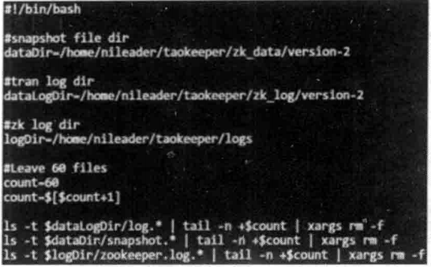

指定了快照数据、事务日志和 ZooKeeper 运行时日志文件的目录，同时还指定了目录中需要保留的文件个数为60。通常，我们可以将该脚本的执行任务配置到 crontab 中，并设置为每天凌晨 2 点执行一次即可。

###### 使用清理工具∶ PurgeTxnLog

ZooKeeper 提供了一个工具类 org.apache.zookeeper.server.PurgeTxnLog，实现了一种较为简单的文件清理策略，运维人员可以使用该工具进行历史文件的清理。

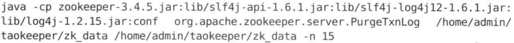

###### 使用清理脚本∶ zkCleanup.sh

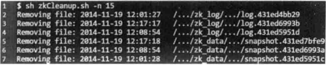

###### 自动清理机制

通过配置 autopurge.snapRetainCount 和 autopurge．purgeInterval 这两个参数来实现定时清理。

##### 8.6.3 磁盘管理

ZooKeeper 对于磁盘的依赖非常严重。在 ZooKeeper 中，但凡对 ZooKeeper 数据状态的变更，都会以事务日志的形式写入磁盘，并且只有当集群中过半的服务器已经记录了该事务日志后，服务端才会给予客户端响应。另一方面，ZooKeeper 还会定时将内存数据库中的所有数据和所有客户端的会话信息记录进行快照，保存到磁盘上的数据快照文件中去。明白这点之后，你就会意识到磁盘的吞吐性能对于 ZooKeeper 的影响了——磁盘的 I/O性能直接制约着 ZooKeeper每个更新操作的处理速度。为了尽量减少ZooKeeper 在读写磁盘上的性能损失，不仿试试下面说的几点。

- 使用单独的磁盘作为事务日志的输出目录。一方面，事务日志的写性能对 ZooKeeper处理客户端请求，尤其是更新操作的处理性能影响很大。另一方面，ZooKeeper 的事务日志输出是一个顺序写文件的过程，因此本身性能是非常高的，所以尽量保证不要和应用程序共享一块磁盘，以避免对磁盘的竞争。

- 尽量避免内存与磁盘空间的交换。如果希望 ZooKeeper 能够提供完全实时的服务，那么就不能出现此类内存与磁盘空间交换的现象。因此在分配 JVM 堆大小的时候一定要非常小心。

