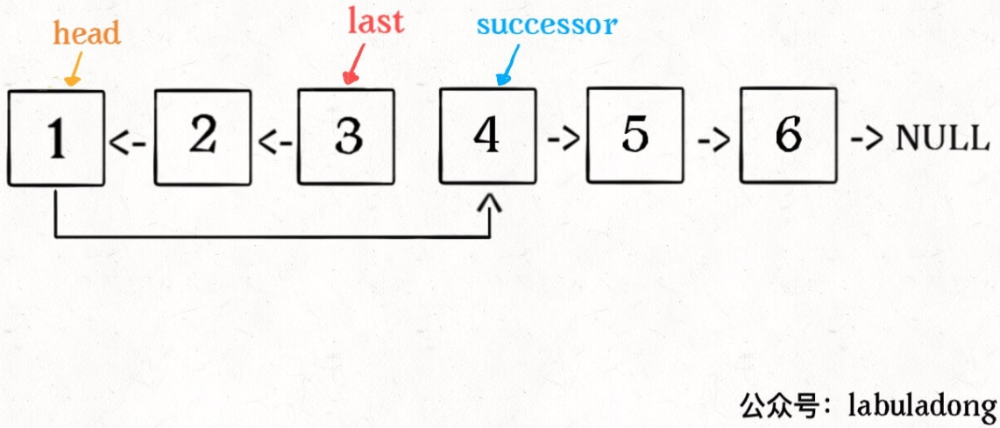
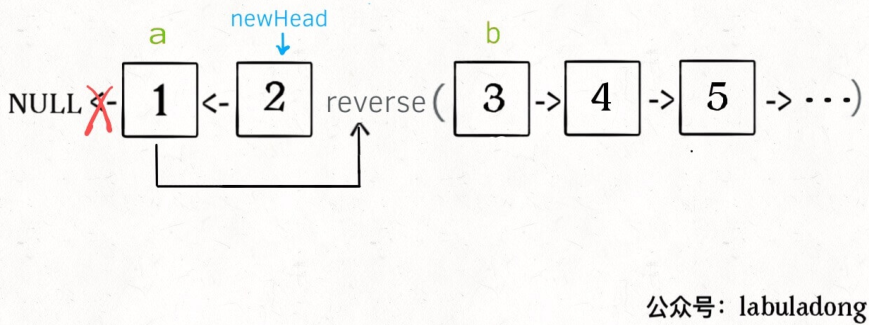
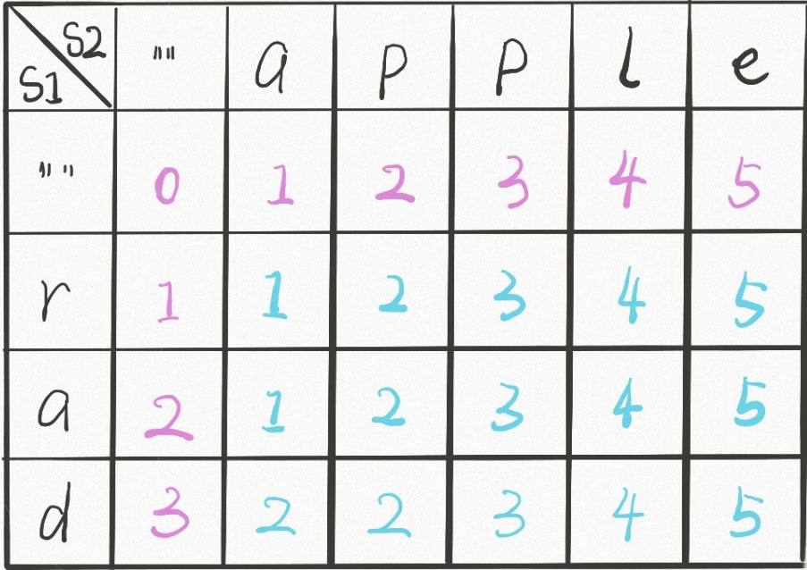
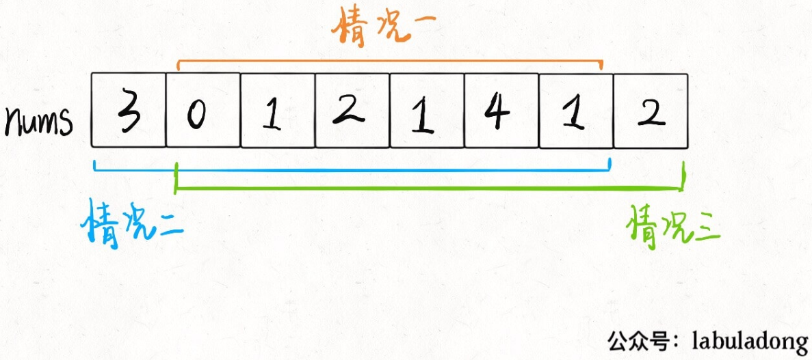
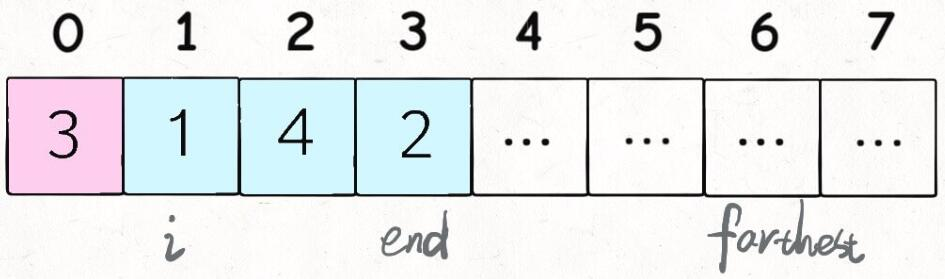
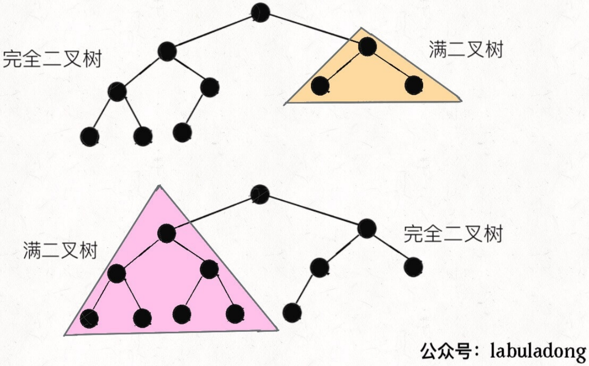
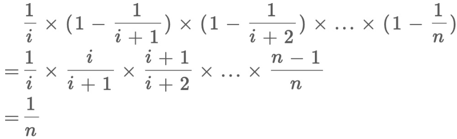

### leetcode

#### hash相关

##### q1 两数之和

```
给定一个整数数组 nums 和一个目标值 target，请你在该数组中找出和为目标值的那 两个整数，并返回他们的数组下标。
你可以假设每种输入只会对应一个答案。但是，数组中同一个元素不能使用两遍。

示例:
给定 nums = [2, 7, 11, 15], target = 9
因为 nums[0] + nums[1] = 2 + 7 = 9
所以返回 [0, 1]
```

- 暴力解法

  ```java
  class Solution {
      public int[] twoSum(int[] nums, int target) {
          for(int i = 0; i< nums.length; i++){
              for(int j = i + 1; j < nums.length; j++){
                  if(nums[i] + nums[j] == target){
                      return new int[] {i, j};
                  }
              }            
          }
          return null;
      }
  }
  ```

- 使用hash

  构建hashset，key为数组元素的值，value为数组元素的索引，遍历时判断hashset中是否存在`target-nums[i]`的键。

  但使用hashset的问题是数组中存在重复元素时，hashset无法存在重复的key。对于`[3,3]`这类数组，这段只想通过一次遍历完成的代码无法解决。

  ```java
  public int[] twoSum(int[] nums, int target) {
  	if (nums == null && nums.length < 2)
  		return null;
  	Map<Integer, Integer> map = new HashMap<>();
      for (int i = 0; i < nums.length; i++) {
          map.put(nums[i], i);
          int another = target - nums[i];
          if (map.containsKey(another)) {
              int j = map.get(another);
              if(j != i)
                  return new int[]{j, i};
          }
      }
      return null;
  }
  ```

  二次遍历可以完成，虽然重复的key在第一次遍历时会更新value，但第二次从头遍历时i和j是不相同的，因此可以找到。

  ```java
  public int[] twoSum2(int[] nums, int target) {
          if (nums == null && nums.length < 2)
              return null;
          Map<Integer, Integer> map = new HashMap<>();
          for (int i = 0; i < nums.length; i++) {
              map.put(nums[i], i);
          }
          for (int i = 0; i < nums.length; i++) {
              int another = target - nums[i];
              if (map.containsKey(another)) {
                  int j = map.get(another);
                  if (j != i)
                      return new int[]{i, j};
              }
          }
          return null;
      }
  ```

  但其实一次遍历是能完成任务的，关键在于执行顺序，先判断后添加（对同样的key是更新），这样才能保证i和j不相同。

  ```java
  public int[] twoSum(int[] nums, int target) {
  	if (nums == null && nums.length < 2)
  		return null;
  	Map<Integer, Integer> map = new HashMap<>();
      for (int i = 0; i < nums.length; i++) {
          int another = target - nums[i];
          if (map.containsKey(another)) {
              int j = map.get(another);
              if(j != i)
                  return new int[]{j, i};
          }
      	map.put(nums[i], i);
      }
      return null;
  }
  ```

- 边界情况：
  - 数组为null或长度为1
  - target为其中一个元素的2倍
  - target为两个相同元素的和

#### 链表相关

##### q2 两数相加

```
给出两个非空的链表用来表示两个非负的整数。其中，它们各自的位数是按照逆序的方式存储的，并且它们的每个节点只能存储一位数字。
如果，我们将这两个数相加起来，则会返回一个新的链表来表示它们的和。
您可以假设除了数字 0 之外，这两个数都不会以 0 开头。

示例：
输入：(2 -> 4 -> 3) + (5 -> 6 -> 4)
输出：7 -> 0 -> 8
原因：342 + 465 = 807
```

- 原始解法

  ```java
  /**
   * Definition for singly-linked list.
   * public class ListNode {
   *     int val;
   *     ListNode next;
   *     ListNode(int x) { val = x; }
   * }
   */
  class Solution {
      public ListNode addTwoNumbers(ListNode l1, ListNode l2) {
          
          int carry = 0;
          ListNode lastNode = null;
          ListNode cur = null;
          while (l1 != null && l2 != null) {
              int val = l1.val + l2.val + carry;
              if (val >= 10) {
                  val -= 10;
                  carry = 1;
              } else {
                  carry = 0;
              }
              cur = new ListNode(val);
              cur.next = lastNode;
              lastNode = cur;
              l1 = l1.next;
              l2 = l2.next;
          }
          
          while(l1 != null) {
              int val = l1.val + carry;
              if (val >= 10) {
                  val -= 10;
                  carry = 1;
              } else {
                  carry = 0;
              }
              cur = new ListNode(val);
              cur.next = lastNode;
              lastNode = cur;
              l1 = l1.next;
          }
  
          while(l2 != null) {
              int val = l2.val + carry;
              if (val >= 10) {
                  val -= 10;
                  carry = 1;
              } else {
                  carry = 0;
              }
              cur = new ListNode(val);
              cur.next = lastNode;
              lastNode = cur;
              l2 = l2.next;
          }
  
          if (carry != 0) {
              cur = new ListNode(carry);
              cur.next = lastNode;
          }
          return reverse(cur);
      }
  
      public ListNode reverse(ListNode h) {
          if (h.next == null)
              return h;
          ListNode t1 = h;
          ListNode t2 = h.next;
          ListNode t3 = h.next.next;
          while (t2 != null) {
              t2.next = t1;
              t1 = t2;
              t2 = t3;
              if (t3 != null)
                  t3 = t3.next;
          }
          h.next = null;
          return t1;
      }
  }
  ```

  按位相加，记录进位，每次创建新的节点指向上一次创建的节点，但这样最后需要逆转一下链表。

- 优化代码：

  ```java
  public ListNode addTwoNumbers(ListNode l1, ListNode l2) {
      ListNode dummyHead = new ListNode(0);
      ListNode p = l1, q = l2, curr = dummyHead;
      int carry = 0;
      while (p != null || q != null) {
          int x = (p != null) ? p.val : 0;
          int y = (q != null) ? q.val : 0;
          int sum = carry + x + y;
          carry = sum / 10;
          curr.next = new ListNode(sum % 10);
          curr = curr.next;
          if (p != null) p = p.next;
          if (q != null) q = q.next;
      }
      if (carry > 0) {
          curr.next = new ListNode(carry);
      }
      return dummyHead.next;
  }
  
  ```

  使用哑节点，这样在开始就有一个节点能指向新创建的节点，从而不需要逆转链表。

  另外两条链表的处理是可以写在一个循环里的，需要进行判断。

- 边界情况：
  - 一个链表比另一个长。
  - 加到最高位时出现进位，如11+89。

##### q19 删除链表的倒数第N个节点

```
给定一个链表，删除链表的倒数第 n 个节点，并且返回链表的头结点。

示例：
给定一个链表: 1->2->3->4->5, 和 n = 2.
当删除了倒数第二个节点后，链表变为 1->2->3->5.

说明：给定的 n 保证是有效的。

进阶：你能尝试使用一趟扫描实现吗？
```

- 原始解法

  ```java
  /**
   * Definition for singly-linked list.
   * public class ListNode {
   *     int val;
   *     ListNode next;
   *     ListNode(int x) { val = x; }
   * }
   */
  class Solution {
      public ListNode removeNthFromEnd(ListNode head, int n) {
          ListNode h = head;
          int size = 0;
          for (; h!=null; h=h.next, size++);
          //if(n <= 0 || n > size) return null;
          h = head;
          if (size == n) return head.next;
          for (int i=0; i<size-n-1; i++)
              h = h.next;
          h.next = h.next.next;
          return head;
      }
  }
  ```

  先遍历一遍得到链表长度，然后根据n找到要删除的节点的前一个节点。

  边界情况：删除第一个节点。但也可以使用哑节点来处理该情况。

- 一次遍历解法，双指针

  ```java
  class Solution {
      public ListNode removeNthFromEnd(ListNode head, int n) {//注意给定的n是有效的
          ListNode dummy = new ListNode(0);
          dummy.next = head;
          ListNode h1 = dummy, h2 = dummy;
          for (int i=0; i<n+1; i++, h2=h2.next);
          for (; h2!=null; h1=h1.next, h2=h2.next);
          h1.next = h1.next.next;
          return dummy.next;
      }
  }
  ```

  采用哑节点处理第一个节点的删除。

  双指针，两个指针初始时均指向哑节点，指针2先移动n+1个位置，然后开始同时移动两个指针，直到指针2为空，此时指针1指向的就是要删除的节点的前一个节点。

##### q61 旋转链表

```java
给定一个链表，旋转链表，将链表每个节点向右移动 k 个位置，其中 k 是非负数。

示例 1:

输入: 1->2->3->4->5->NULL, k = 2
输出: 4->5->1->2->3->NULL
解释:
向右旋转 1 步: 5->1->2->3->4->NULL
向右旋转 2 步: 4->5->1->2->3->NULL


示例 2:

输入: 0->1->2->NULL, k = 4
输出: 2->0->1->NULL
解释:
向右旋转 1 步: 2->0->1->NULL
向右旋转 2 步: 1->2->0->NULL
向右旋转 3 步: 0->1->2->NULL
向右旋转 4 步: 2->0->1->NULL
```

- 原始解法

  ```java
  /**
   * Definition for singly-linked list.
   * public class ListNode {
   *     int val;
   *     ListNode next;
   *     ListNode(int x) { val = x; }
   * }
   */
  class Solution {
      public ListNode rotateRight(ListNode head, int k) {
          if(head==null) return null;
          ListNode l = head;
          int len = 0;
          while(l.next != null) {
              len++;
              l = l.next;
          }
          len++;
          l.next = head;
          l = head;
          for(int i=0; i<len-k%len-1; i++){
              l = l.next;
          }
          head = l.next;
          l.next = null;
          return head;
      }
  }
  ```

  思路为先记录链表长度，并且将最后一个节点指向头节点形成一个环。然后类似于删除倒数第N个节点，找到倒数第k个节点的前一个节点，把头节点指向它的下一个节点，而它指向null即设为尾节点即可。

  因为输入的k可能超过链表的长度，因此在得知链表长度之前无法使用双指针，那双指针也就没有必要了。

##### q138 复制带随机指针的链表

```
给定一个链表，每个节点包含一个额外增加的随机指针，该指针可以指向链表中的任何节点或空节点。
要求返回这个链表的 深拷贝。 
我们用一个由 n 个节点组成的链表来表示输入/输出中的链表。每个节点用一个 [val, random_index] 表示：
	val：一个表示 Node.val 的整数。
	random_index：随机指针指向的节点索引（范围从 0 到 n-1）；如果不指向任何节点，则为  null 。
	
示例 1：
输入：head = [[7,null],[13,0],[11,4],[10,2],[1,0]]
输出：[[7,null],[13,0],[11,4],[10,2],[1,0]]

示例 2：
输入：head = [[1,1],[2,1]]
输出：[[1,1],[2,1]]

示例 3：
输入：head = [[3,null],[3,0],[3,null]]
输出：[[3,null],[3,0],[3,null]]

示例 4：
输入：head = []
输出：[]
解释：给定的链表为空（空指针），因此返回 null。

提示：
	-10000 <= Node.val <= 10000
	Node.random 为空（null）或指向链表中的节点。
	节点数目不超过 1000 。
```

- DFS解法

  ```java
  /*
  // Definition for a Node.
  class Node {
      int val;
      Node next;
      Node random;
  
      public Node(int val) {
          this.val = val;
          this.next = null;
          this.random = null;
      }
  }
  */
  
  class Solution {
      Map<Node, Node> visited = new HashMap<>();
      public Node copyRandomList(Node head) {
          if(head == null) return null;
          if(visited.containsKey(head)) return visited.get(head);
          Node node = new Node(head.val);
          visited.put(head, node);
          node.next = copyRandomList(head.next);
          node.random = copyRandomList(head.random);
          return node; 
      }
  }
  ```

  思路：因为带有随机指针，所以类似于图，可以考虑使用DFS来遍历图。需要一个散列表来记录访问情况，例如`Map<Node, Boolean>`，但这道题需要复制链表，因此可以将value设置成Node。对原链表遍历时如果访问过，那么直接返回该节点；如果没访问过，那就创建新节点，并将它设置为当前节点的值。这里进行节点连接的操作与二叉树的操作相同。

  ```java
  class Solution {
      public Node copyRandomList(Node head) {
          if(head == null) return null;
          Map<Node, Node> visited = new HashMap<>();
          Node h = head;
          while(h!=null) {
              visited.put(h, new Node(h.val));
              h = h.next;
          }
          h = head;
          Node node = visited.get(h);
          while(h != null){
              node.next = visited.get(h.next);
              node.random = visited.get(h.random);
              node = node.next;
              h = h.next;
          }
          return visited.get(head); 
      }
  }
  ```

  思路：不使用DFS，但关键仍然是散列表。先用散列表记录节点对应情况，然后按顺序遍历原链表，在此过程中完成新链表的连接关系。

##### q206 反转链表

```
反转一个单链表。

示例:

输入: 1->2->3->4->5->NULL
输出: 5->4->3->2->1->NULL

进阶:
你可以迭代或递归地反转链表。你能否用两种方法解决这道题？
```

- 迭代

  ```java
  /**
   * Definition for singly-linked list.
   * public class ListNode {
   *     int val;
   *     ListNode next;
   *     ListNode(int x) { val = x; }
   * }
   */
  class Solution {
      public ListNode reverseList(ListNode head) {
          if (head == null || head.next == null) return head;
          ListNode l1 = head;
          ListNode l2 = head.next;
          ListNode l3 = head.next.next;
  
          while(l2 != null) {
              l2.next = l1;
              l1 = l2;
              l2 = l3;
              if(l3 != null)
                  l3 = l3.next;
          }
          head.next = null;
          return l1;
      }
  }
  ```

- 更优雅的方法
    ```java
      public ListNode reverseList(ListNode head) {
          ListNode prev = null;
          ListNode curr = head;
          while (curr != null) {
              ListNode nextTemp = curr.next;
              curr.next = prev;
              prev = curr;
              curr = nextTemp;
          }
          return prev;
      }
    ```

- 递归

  ```java
  class Solution {
      public ListNode reverseList(ListNode head) {
          if (head == null || head.next == null) return head;
          ListNode p = reverseList(head.next);
          head.next.next = head;
          head.next = null;
          return p;
      }
  }
  ```

  关键在于首先沿着链表延伸到最后一个节点，然后沿着递归树往回爬时更新连接，这个过程其实并没有用到返回的节点，因此最终返回的就是最后一个节点，也就是逆转后的头节点。

##### q92 反转链表2

```
反转从位置 m 到 n 的链表。请使用一趟扫描完成反转。

说明:
1 ≤ m ≤ n ≤ 链表长度。

示例:
输入: 1->2->3->4->5->NULL, m = 2, n = 4
输出: 1->4->3->2->5->NULL
```

```java
class Solution {
    public ListNode reverseBetween(ListNode head, int m, int n) {
        ListNode h = head, before = null;
        int i = 1;
        while(i != m) {
            if(i+1 == m) before = h;
            h = h.next;
            i++;
        }

        ListNode newHead = reverse(h, n-m);
        if(before != null) {
            before.next = newHead;
            return head;
        }
        return newHead;
    }

    ListNode after = null;

    private ListNode reverse(ListNode x, int k) {
        if(k==0) {
            after = x.next;
            return x;
        }
        ListNode p = reverse(x.next, k-1);
        x.next.next = x;
        x.next = after;
        return p;
    }
}
```

采用递归形式翻转链表，需要在到达翻转的最后一个节点时记录一下后驱节点。以便退回到第一个节点时将它指向后驱节点。



这里使用循环找到第m个节点，同时考虑了前驱节点。

```java
class Solution {
    public ListNode reverseBetween(ListNode head, int m, int n) {
        if(m == 1) return reverse(head, n-m);
        head.next = reverseBetween(head.next, m-1, n-1);
        return head;
    }

    ListNode after = null;
    private ListNode reverse(ListNode x, int k) {
        if(k==0) {
            after = x.next;
            return x;
        }
        ListNode p = reverse(x.next, k-1);
        x.next.next = x;
        x.next = after;
        return p;
    }
}
```

也可以利用递归思想解决，m==1则直接翻转，否则可以递归地解决后面的链表。

##### q25 K个一组翻转链表

```
给你一个链表，每 k 个节点一组进行翻转，请你返回翻转后的链表。
k 是一个正整数，它的值小于或等于链表的长度。
如果节点总数不是 k 的整数倍，那么请将最后剩余的节点保持原有顺序。

示例：
给你这个链表：1->2->3->4->5
当 k = 2 时，应当返回: 2->1->4->3->5
当 k = 3 时，应当返回: 3->2->1->4->5

说明：
	你的算法只能使用常数的额外空间。
	你不能只是单纯的改变节点内部的值，而是需要实际进行节点交换。
```

```java
class Solution {
    public ListNode reverseKGroup(ListNode head, int k) {
        if(head == null) return null;
        ListNode a = head, b = head;
        for(int i=0; i<k; i++) {
            if(b == null) return a;
            b = b.next;
        }

        ListNode newHead = reverse(a, b);
        a.next = reverseKGroup(b, k);
        return newHead;
    }

    private ListNode reverse(ListNode a, ListNode b) {
        ListNode pre = null, cur = a;
        ListNode next;
        while(cur != b) {
            next = cur.next;
            cur.next = pre;
            pre = cur;
            cur = next;
        }
        return pre;
    }
}
```

它是一个可以递归解决的问题，翻转了前k个元素之后，剩余的链表仍然需要解决。

关键在于搞清楚连接的情况。



K个一组，因此可以选好头尾，a和b。然后在区间a和b进行翻转，返回新的链表头。连接时，需要当前的链表头a指向下一遍递归后返回的新的链表头。而这个下一遍递归则是以当前的链表尾b继续进行K个一组的翻转。

basecase为不满K个时直接返回当前的链表头a。

##### 回文链表

```
编写一个函数，检查输入的链表是否是回文的。

示例 1：
输入： 1->2
输出： false 

示例 2：
输入： 1->2->2->1
输出： true 

进阶：
你能否用 O(n) 时间复杂度和 O(1) 空间复杂度解决此题？
```

```java
class Solution {
    public boolean isPalindrome(ListNode head) {
        StringBuilder sb = new StringBuilder();
        StringBuilder sbr = new StringBuilder();
        ListNode h = head;
        while(h!= null) {
            sb.append(h.val);
            h = h.next;
        }
        head = reverse(head);
        while(head != null) {
            sbr.append(head.val);
            head = head.next;
        }

        return sb.toString().equals(sbr.toString());
    }

    private ListNode reverse(ListNode h) {
        if(h == null) return null;
        if(h.next == null) return h;
        ListNode rt = reverse(h.next);
        h.next.next = h;
        h.next = null;
        return rt;
    }
}
```

先遍历一遍链表并记录，完整地反转链表，再遍历一遍链表并记录，比较两个记录。

```java
class Solution {
    public boolean isPalindrome(ListNode head) {
        if(head == null || head.next == null) return true;

        ListNode slow = head;
        ListNode fast = head.next;

        while(fast != null) {
            slow = slow.next;
            fast = fast.next;
            if(fast != null) fast = fast.next;
        }

        ListNode last = reverse(slow);
        while(head != last) {
            if(head.val != last.val) return false;
            if(head.next != null) head = head.next;
            if(last.next != null) last = last.next;
        }
        return true;
    }

    private ListNode reverse(ListNode h) {
        if(h == null) return null;
        if(h.next == null) return h;
        ListNode rt = reverse(h.next);
        h.next.next = h;
        h.next = null;
        return rt;
    }
    
    private ListNode reverse(ListNode h) {
        ListNode pre = null, cur = h;
        ListNode next;
        while(cur != null) {
            next = cur.next;
            cur.next = pre;
            pre = cur;
            cur = next;
        }
        return pre;
    }
}
```

使用快慢指针先找到中间节点，然后翻转后面的部分链表。然后从两头遍历并比较。

偶数长度的链表翻转之后会变成1->2<-2<-1，第1个2的next会指向null，因此这点需要注意。

翻转链表的部分使用迭代实现即可达到`O(1)`的空间复杂度。

```java
class Solution {
    ListNode left;
    public boolean isPalindrome(ListNode head) {
		left = head;
		return isPalindromeR(head);
	}
	
	private boolean isPalindromeR(ListNode x) {
		if(x == null) return true;
		boolean res;
		res = isPalindromeR(x.next);
		res = res && (x.val == left.val);
		left = left.next;
		return res;
	}
}
```

利用后序遍历，定义一个全局的左指针，比较左右两个值是否相同。

#### 动态规划：求最值

特点：求最优解；整体问题的最优解依赖于各个子问题的最优解；大问题分解为小问题，小问题间存在重叠的更小的子问题；从上往下分析问题，从下往上求解问题。

基本解题套路见[labuladong](https://labuladong.gitbook.io/algo/di-ling-zhang-bi-du-xi-lie/dong-tai-gui-hua-xiang-jie-jin-jie)。

```
# 初始化 base case
dp[0][0][...] = base
# 进行状态转移
for 状态1 in 状态1的所有取值：
    for 状态2 in 状态2的所有取值：
        for ...
            dp[状态1][状态2][...] = 求最值(选择1，选择2...)
```

##### q322 零钱兑换

```
给定不同面额的硬币 coins 和一个总金额 amount。编写一个函数来计算可以凑成总金额所需的最少的硬币个数。如果没有任何一种硬币组合能组成总金额，返回 -1。

示例 1:
输入: coins = [1, 2, 5], amount = 11
输出: 3 
解释: 11 = 5 + 5 + 1

示例 2:
输入: coins = [2], amount = 3
输出: -1

说明:
你可以认为每种硬币的数量是无限的。
```

- 暴力解法：

  ```java
  	public int coinChange(int[] coins, int amount) {
          if(amount == 0) return 0;
          if(amount < 0) return -1;
  
          int res = Integer.MAX_VALUE;
          for (int coin : coins) {
              if (amount - coin < 0) continue;
              res = Math.min(res, 1 + coinChange(coins, amount - coin));
          }
          return res == Integer.MAX_VALUE ? -1 : res;
      }
  ```

  这段代码的错误之处在于，递归树最底层的子问题无解（amount=1，coin=2），返回-1，但是高层的子问题都满足`amount - coin > 0`，这样会使最底层的无解结果在高层进行累加，导致错误结果。

  正确的逻辑应该是最底层的子问题无解时，高层的子问题必然无解，因此递归返回时每一层的子问题都应当明确这个信息，即

  ```java
  	public int coinChange(int[] coins, int amount) {
          if(amount == 0) return 0;
          if(amount < 0) return -1;
  
          int res = Integer.MAX_VALUE;
          for (int coin : coins) {
              int subproblem = coinChange(coins, amount - coin);
              if (subproblem == -1) continue;//只要最底层子问题无解，高层子问题都不会再进行求解
              res = Math.min(res, 1 + subproblem);
          }
          return res == Integer.MAX_VALUE ? -1 : res;
      }
  ```

- 使用记忆集优化

  ```java
  	public int coinChangeM(int[] coins, int amount, int[] mem) {
          if (amount == 0) return 0;
          if (amount < 0) return -1;
          if (mem[amount] != 0) return mem[amount];
  
          int res = Integer.MAX_VALUE;
          for (int coin : coins) {
              int subproblem = coinChangeM(coins, amount - coin, mem);
              if (subproblem == -1) continue;
              res = Math.min(res, 1 + subproblem);
          }
  
          mem[amount] = (res == Integer.MAX_VALUE) ? -1 : res;
          return mem[amount];
      }
  
      public int coinChange2(int[] coins, int amount) {
          int[] mem = new int[amount + 1];
          return coinChangeM(coins, amount, mem);
      }
  ```
  
  amount作为状态，如果某个状态在记忆集中已经存在，即已经计算过，那么直接返回它。

- 迭代

  ```java
  class Solution {
      public int coinChange(int[] coins, int amount) {
          if(amount < 0) return -1;
  
          int[] dp = new int[amount+1];
          Arrays.fill(dp, amount+1);
          dp[0] = 0;
          for(int i = 0; i < dp.length; i++) {
              for(int j = 0; j < coins.length; j++) {
                  if(i - coins[j] >= 0) {
                      dp[i] = Math.min(dp[i], 1 + dp[i - coins[j]]);
                  }
              }
          }
  
          return dp[amount] == amount+1 ? -1 : dp[amount];
      }
  }
  ```

##### q518 零钱兑换2/背包问题

```
给定不同面额的硬币和一个总金额。写出函数来计算可以凑成总金额的硬币组合数。假设每一种面额的硬币有无限个。 

示例 1:
输入: amount = 5, coins = [1, 2, 5]
输出: 4
解释: 有四种方式可以凑成总金额:
5=5
5=2+2+1
5=2+1+1+1
5=1+1+1+1+1

示例 2:
输入: amount = 3, coins = [2]
输出: 0
解释: 只用面额2的硬币不能凑成总金额3。

示例 3:
输入: amount = 10, coins = [10] 
输出: 1

注意:
你可以假设：
	0 <= amount (总金额) <= 5000
	1 <= coin (硬币面额) <= 5000
	硬币种类不超过 500 种
	结果符合 32 位符号整数
```

```java
class Solution {
    public int change(int amount, int[] coins) {
        if(amount < 0) return 0;

        int[][] dp = new int[coins.length + 1][amount + 1];
        for(int i = 0; i < dp.length; i++) dp[i][0] = 1;
        for(int i = 1; i < dp.length; i++) {
            for(int j = 1; j < amount + 1; j++) {
                if (j - coins[i - 1] < 0) dp[i][j] = dp[i-1][j];
                else dp[i][j] = dp[i-1][j] + dp[i][j-coins[i-1]];
            }
        }

        return dp[coins.length][amount];
    }
}
```

这个类似背包问题，即背包容量为钱数，物品重量为硬币，只是可以选择无限多个物品。

因此仍然可以定义`dp[i][j]`为选择到第i个硬币，钱数为j时的组合数。

当要凑的钱数为0时，可以认为组合只有一种。当没有硬币可选时，可以认为组合为0。

当前钱数-当前要选择的硬币大于等于0时，可以选它，否则不能选，只能继承`dp[i-1][j]`。

可以选择的时候因为是求总共的组合数，因此就是选它和不选它的组合数之和。前者即为减去当前硬币的钱数对应 的组合数。

很自然地，可以看出问题要求个数的时候，状态转移的时候通常是做加法，问题要求最值的时候，状态转移的时候通常是求最值。

##### q673 最长递增子序列的个数

```
给定一个未排序的整数数组，找到最长递增子序列的个数。

示例 1:
输入: [1,3,5,4,7]
输出: 2
解释: 有两个最长递增子序列，分别是 [1, 3, 4, 7] 和[1, 3, 5, 7]。

示例 2:
输入: [2,2,2,2,2]
输出: 5
解释: 最长递增子序列的长度是1，并且存在5个子序列的长度为1，因此输出5。

注意: 给定的数组长度不超过 2000 并且结果一定是32位有符号整数。
```

```java
class Solution {
    public int findNumberOfLIS(int[] nums) {
        int len = nums.length;
        if(len <= 1) return len;
        
        int[] lengths = new int[len];
        int[] counts = new int[len];
        Arrays.fill(lengths, 1);
        Arrays.fill(counts, 1);

        for(int j = 0; j < len; j++) {
            for(int i = 0; i < j; i++) {
                if(nums[i] < nums[j]) {
                    if(lengths[i] >= lengths[j]){
                        lengths[j] = lengths[i] + 1;
                        counts[j] = counts[i];
                    } else if(lengths[i] + 1 == lengths[j]) {
                        counts[j] += counts[i];
                    }
                }
            }
        }

        int longest = 0;
        for(int length : lengths)
            if(length > longest) longest = length;
        int res = 0;
        for(int i=0; i<len; i++)
            if(lengths[i] == longest) res += counts[i];
        return res;
    }
}
```

关键是需要使用两个数组配合完成，一个用于保存当前数结尾的最长递增子列的长度，一个用于保存当前数结尾的最长递增子列的个数。

长度比较容易求解，对于第i个数，再遍历它前边的数，比当前数小则更新当前的长度。

对于数量，当前边的数的长度+1就等于当前数的长度时，则更新数量，即加上前边的数的数量。

```
序列：1 2 5 4 4 7
长度：1 2 3 3 3 4
数量：1 1 1 1 1 3
```

##### 背包问题

```
给你⼀个可装载重量为W的背包和N个物品，每个物品有重量和价值两个属性。其中第i个物品的重量为wt[i]，价值为val[i]，现在让你⽤这个背包装物品，最多能装的价值是多少？
```

```java
package cn.dut.leetcode;

public class BagProblem {

    public static void main(String[] args) {
        int[] wt = new int[]{2, 1, 3, 5};
        int[] val = new int[]{4, 2, 3, 6};
        int bag = 6;
        System.out.println(maxValue(wt, val, bag));
    }

    private static int maxValue(int[] wt, int[] val, int W) {
        int N = wt.length;
        int[][] dp = new int[N + 1][W + 1];

        for (int i = 1; i <= N; i++) {
            for (int w = 1; w <= W; w++) {
                if (w - wt[i - 1] < 0) dp[i][w] = dp[i - 1][w];
                else dp[i][w] = Math.max(dp[i - 1][w], dp[i - 1][w - wt[i - 1]] + val[i - 1]);
            }
        }
        return dp[N][W];
    }
}
```

这道题用回溯应该也能做。动态规划的难点在于考虑清楚状态和选择。

状态有两个：一个是选择到第i个物品，一个是此时背包的重量。它们两个组成状态数组dp，即`dp[i][w]`表示选择到第i个物品，且背包此时重量为w的最大价值。选择到第i个物品并不代表前面的物品都被选择。

选择则是对于第i个物品，是装入背包还是不装入背包。

结果则是选择完最后一个物品，背包的重量为W时的最大价值，即`dp[N][W]`。

因此状态转移方程为`dp[i][w] = max(dp[i-1][w], dp[i-1][w-wt[i-1]]+val[i-1])`，即对于第i个物品，最大价值为：不选择它，则继承选择到上一个物品时的最大价值；选择它，则寻找剩余重量w-wt[i-1]限制下的最大价值，加上当前物品的价值。

由于  i  是从 1 开始的，所以  val  和  wt  的索引是  i-1  时表⽰第i  个物品的价值和重量。

##### 416 分割等和子集/背包问题

```
给定一个只包含正整数的非空数组。是否可以将这个数组分割成两个子集，使得两个子集的元素和相等。
注意:
	每个数组中的元素不会超过 100
	数组的大小不会超过 200

示例 1:
输入: [1, 5, 11, 5]
输出: true
解释: 数组可以分割成 [1, 5, 5] 和 [11].

示例 2:
输入: [1, 2, 3, 5]
输出: false
解释: 数组不能分割成两个元素和相等的子集.
```

```java
class Solution {
    public boolean canPartition(int[] nums) {
        if(nums == null || nums.length == 0) return false;
        int sum = 0;
        for(int num : nums) sum += num;
        if(sum % 2 == 1) return false;

        int n = nums.length;
        sum = sum / 2;

        boolean[][] dp = new boolean[n + 1][sum + 1];
        for(int i = 0; i < dp.length; i++) dp[i][0] = true;

        for(int i = 1; i <= n; i++) {
            for(int j = 1; j <= sum; j++) {
                if(j - nums[i-1] >= 0) {
                    dp[i][j] = dp[i-1][j-nums[i-1]] | dp[i-1][j];
                } else {
                    dp[i][j] = dp[i-1][j];
                }
            }
        }

        return dp[n][sum];
    }
}
```

与背包问题类似，可以看作有N个物品，物品重nums[i]，有没有一种装法装满sum/2。

因此可以定义`dp[i][j]`为装到第i个物品，背包重量为j时，有没有一种装法。

则j-nums[i-1]>=0时，考虑不装它，即`dp[i-1][j]`，和装它，即装完上个物品时容量为j-nums[i-1]的情况，`dp[i-1][j-nums[i-1]]`。

状态压缩：

```java
class Solution {
    public boolean canPartition(int[] nums) {
        if(nums == null || nums.length == 0) return false;
        int sum = 0;
        for(int num : nums) sum += num;
        if(sum % 2 == 1) return false;

        int n = nums.length;
        sum = sum / 2;

        boolean[] dp = new boolean[sum + 1];
        dp[0] = true;

        for(int i = 0; i < n; i++) {
            for(int j = sum; j >= 0; j--) {
                if(j - nums[i] >= 0){
                    dp[j] = dp[j] || dp[j - nums[i]];
                }
            } 
        }
        return dp[sum];
    }
}
```

只用一维数组，思路不变，外层遍历仍然是选择到第i个物品。内层循环需要从大到小遍历，因为每次需要用到`j-nums[i]`的数据，因此不能从小到大。

每次遍历时，`dp[j-nums[i]]`就相当于`dp[i-1][j-nums[i]]`。

##### 72 编辑距离

```
给你两个单词 word1 和 word2，请你计算出将 word1 转换成 word2 所使用的最少操作数 。
你可以对一个单词进行如下三种操作：

	插入一个字符
	删除一个字符
	替换一个字符

示例 1：
输入：word1 = "horse", word2 = "ros"
输出：3
解释：
horse -> rorse (将 'h' 替换为 'r')
rorse -> rose (删除 'r')
rose -> ros (删除 'e')

示例 2：
输入：word1 = "intention", word2 = "execution"
输出：5
解释：
intention -> inention (删除 't')
inention -> enention (将 'i' 替换为 'e')
enention -> exention (将 'n' 替换为 'x')
exention -> exection (将 'n' 替换为 'c')
exection -> execution (插入 'u')
```

```java
class Solution {
    public int minDistance(String word1, String word2) {
        Map<String, Integer> mem = new HashMap<>();
        return dp(word1.length()-1, word2.length()-1, word1, word2, mem);
    }

    private int dp(int i, int j, String word1, String word2, Map<String, Integer> mem) {
        if(i == -1) return j+1;
        if(j == -1) return i+1;
        String key = i + "+" + j;
        if(mem.containsKey(key)) return mem.get(key);
        if(word1.charAt(i) == word2.charAt(j)) return dp(i-1, j-1, word1, word2, mem);
        else {
            int costOfInsert = dp(i, j-1, word1, word2, mem) + 1;
            int costOfDelete = dp(i-1, j, word1, word2, mem) + 1;
            int costOfReplace = dp(i-1, j-1, word1, word2, mem) + 1;
            int val = min(costOfInsert, costOfDelete, costOfReplace);
            mem.put(key, val);
            return val;
        }
    }

    private int min(int a, int b, int c) {
        int t = a < b ? a : b;
        return t < c ? t : c;
    }
}
```

加了记忆集的递归写法也比较慢。

整体思路是这样的：用两个指针指向两个字符串的开头，然后开始比较。

两个字符相同，则编辑距离取决于后面的子字符串，因此i+1，j+1。

两个字符不同，此时有三种选择：

- 为字符串A插入字符串B当前字符，则编辑距离取决于字符串B后面的子字符串，因此j+1。

  ```
  A:horse
  B:ros
  为A插入r，A变成rhorse，此时应该开始比较horse和os
  ```

- 为字符串A删除当前字符，则编辑距离取决于字符串A后面的子字符串，因此i+1。

  ```
  A:horse
  B:ros
  为A删除h，A变成orse，此时应该开始比较orse和ros
  ```

- 为字符串A替换为字符串B当前字符，则编辑距离取决于后面的子字符串，因此i+1，j+1。

  ```
  A:horse
  B:ros
  为A替换h，A变成rorse，此时应该开始比较orse和os
  ```

因此应该取这三种操作中最小的那个值。

`dp[i][j]`表示以i长度结尾的字符串转换成以j长度结尾的字符串的编辑距离。

基础情况为一个字符串为空，那么转换为另一个字符串的编辑距离就为它本身的长度。



```java
class Solution {
    public int minDistance(String word1, String word2) {
        int n = word1.length(), m = word2.length();
        int[][] dp = new int[n+1][m+1];
        for(int i=0; i<=n; i++) dp[i][0] = i;
        for(int i=0; i<=m; i++) dp[0][i] = i;

        for(int i=1; i<=n; i++) {
            for(int j=1; j<=m; j++) {
                if(word1.charAt(i-1) == word2.charAt(j-1)) dp[i][j] = dp[i-1][j-1];
                else {
                    int costOfInsert = dp[i][j-1] + 1;
                    int costOfDelete = dp[i-1][j] + 1;
                    int costOfReplace = dp[i-1][j-1] + 1;
                    dp[i][j] = min(costOfInsert, costOfDelete, costOfReplace);
                }
            }
        }
        return dp[n][m];
    }

    private int min(int a, int b, int c) {
        int t = a < b ? a : b;
        return t < c ? t : c;
    }
}
```

##### q1143 最长公共子序列

```
给定两个字符串 text1 和 text2，返回这两个字符串的最长公共子序列的长度。

一个字符串的 子序列 是指这样一个新的字符串：它是由原字符串在不改变字符的相对顺序的情况下删除某些字符（也可以不删除任何字符）后组成的新字符串。
例如，"ace" 是 "abcde" 的子序列，但 "aec" 不是 "abcde" 的子序列。两个字符串的「公共子序列」是这两个字符串所共同拥有的子序列。

若这两个字符串没有公共子序列，则返回 0。

示例 1:
输入：text1 = "abcde", text2 = "ace" 
输出：3  
解释：最长公共子序列是 "ace"，它的长度为 3。

示例 2:
输入：text1 = "abc", text2 = "abc"
输出：3
解释：最长公共子序列是 "abc"，它的长度为 3。

示例 3:
输入：text1 = "abc", text2 = "def"
输出：0
解释：两个字符串没有公共子序列，返回 0。

提示:
	1 <= text1.length <= 1000
	1 <= text2.length <= 1000
	输入的字符串只含有小写英文字符。
```

```java
class Solution {
    public int longestCommonSubsequence(String text1, String text2) {
        int n = text1.length(), m = text2.length();
        int[][] dp = new int[n+1][m+1];

        for(int i=1; i<=n; i++) {
            for(int j=1; j<=m; j++) {
                if(text1.charAt(i-1) == text2.charAt(j-1)){
                    dp[i][j] = dp[i-1][j-1] + 1;
                } else {
                    dp[i][j] = Math.max(dp[i-1][j], dp[i][j-1]);
                }
            }
        }

        return dp[n][m];
    }
}
```

两个字符串相关的动态规划问题，思路类似于编辑距离，用两个指针在字符串上移动，更新状态。

如果两个字符相同，那么它一定在最长公共子序列中。如果不相同，那么需要移动其中一个指针，在两种情况中选择公共子序列更长的那个。

`dp[i][j]`表示`t1[:i]`和`t2[:j]`的最长公共子序列长度。

```
		0	1	2	3	4	5
		""	a 	b	c	d	e
0	""	0	0	0	0	0	0
1	a	0	1	1	1	1	1
2	c	0	1	1	2	2	2
3	e	0	1	1	2	2	3
```

##### q5 最长回文子串

##### q887 鸡蛋掉落

```
你将获得 K 个鸡蛋，并可以使用一栋从 1 到 N  共有 N 层楼的建筑。
每个蛋的功能都是一样的，如果一个蛋碎了，你就不能再把它掉下去。
你知道存在楼层 F ，满足 0 <= F <= N 任何从高于 F 的楼层落下的鸡蛋都会碎，从 F 楼层或比它低的楼层落下的鸡蛋都不会破。

每次移动，你可以取一个鸡蛋（如果你有完整的鸡蛋）并把它从任一楼层 X 扔下（满足 1 <= X <= N）。
你的目标是确切地知道 F 的值是多少。
无论 F 的初始值如何，你确定 F 的值的最小移动次数是多少？

示例 1：
输入：K = 1, N = 2
输出：2
解释：
鸡蛋从 1 楼掉落。如果它碎了，我们肯定知道 F = 0 。
否则，鸡蛋从 2 楼掉落。如果它碎了，我们肯定知道 F = 1 。
如果它没碎，那么我们肯定知道 F = 2 。
因此，在最坏的情况下我们需要移动 2 次以确定 F 是多少。

示例 2：
输入：K = 2, N = 6
输出：3

示例 3：
输入：K = 3, N = 14
输出：4

提示：
	1 <= K <= 100
	1 <= N <= 10000
```

```java
class Solution {
    public int superEggDrop(int K, int N) {
        if(K==1) return N;
        if(N==0) return 0;
        int res = Integer.MAX_VALUE;
        for(int i=1; i<=N; i++) {
            res = Math.min(res, Math.max(superEggDrop(K-1,i-1), superEggDrop(K, N-i))+1);
        }
        return res;
    }
}
```

递归的思路较容易理解，但是会超时。

思路：状态有两个，鸡蛋个数K，楼高N。而选择为从哪一层往下扔。由于并不知道应该从哪一层往下扔，所以需要穷举所有情况，找出其中需要的最少次数。

假设从第i层往下扔，将出现两种可能，鸡蛋碎了，则鸡蛋个数-1，需要尝试的楼高变为i-1；鸡蛋没碎，则鸡蛋个数不变，需要尝试的楼高变为N-i。最坏情况应该是这两种可能中需要的次数更多的那种。

基础情况为，如果只有一个鸡蛋，那么只能线性探测。如果楼高为0，那么不需要测试。

```java
class Solution {
    public int superEggDrop(int K, int N) {
        if(K==1) return N;
        if(N==0) return 0;
        int[][] dp = new int[K+1][N+1];

        int m = 0;
        while(dp[K][m] < N) {
            m++;
            for(int k=1; k<=K; k++)
                dp[k][m] = dp[k][m-1] + dp[k-1][m-1] + 1;
        }

        return m;
    }
}
```

迭代时间复杂度为O(KN)，但是难以理解，关键是把探测到几层楼理解为探测的楼层高度。

迭代的思路为将原问题进行一个等价的转换，即K个鸡蛋，m次扔鸡蛋的机会，最多能探测的楼层高度？

这样状态变为鸡蛋个数K，扔鸡蛋的机会m。在`dp[k][m]`没有达到N层楼时，不断增加扔鸡蛋的机会，即外层循环。

对于某一层，扔鸡蛋的结果只有碎和不碎两种，碎了就探测下面的楼层，不碎就探测上面的楼层。因此探测的楼层就是下面的楼层、上面的楼层与当前楼层之和，即`dp[k][m] = dp[k][m-1] + dp[k-1][m-1] + 1;`。

`dp[k][m-1]`表示鸡蛋没碎，但机会减1，相当于从此楼层开始起，用m-1次机会扔k个鸡蛋能探测的楼层，即此楼层上面的楼层。`dp[k-1][m-1]`表示鸡蛋碎了，机会减1，相当于从此楼层开始起，用m-1次机会扔k-1个鸡蛋能探测的楼层，即此楼层下面的楼层。

##### q198 打家劫舍1

```
你是一个专业的小偷，计划偷窃沿街的房屋。每间房内都藏有一定的现金，影响你偷窃的唯一制约因素就是相邻的房屋装有相互连通的防盗系统，如果两间相邻的房屋在同一晚上被小偷闯入，系统会自动报警。

给定一个代表每个房屋存放金额的非负整数数组，计算你 不触动警报装置的情况下 ，一夜之内能够偷窃到的最高金额。

示例 1：
输入：[1,2,3,1]
输出：4
解释：偷窃 1 号房屋 (金额 = 1) ，然后偷窃 3 号房屋 (金额 = 3)。
     偷窃到的最高金额 = 1 + 3 = 4 。

示例 2：
输入：[2,7,9,3,1]
输出：12
解释：偷窃 1 号房屋 (金额 = 2), 偷窃 3 号房屋 (金额 = 9)，接着偷窃 5 号房屋 (金额 = 1)。
     偷窃到的最高金额 = 2 + 9 + 1 = 12 。

提示：
	0 <= nums.length <= 100
	0 <= nums[i] <= 400
```

```java
class Solution {
    public int rob(int[] nums) {
        int len = nums.length;
        int[] dp = new int[len+1];

        for(int i=1; i<=len; i++) {
            if(i-2>=0)
                dp[i] = Math.max(nums[i-1]+dp[i-2], dp[i-1]);
            else
                dp[i] = nums[i-1];
        }

        return dp[len];
    }
}
```

打家劫舍系列最简单的一道。状态dp[i]为到第i家时打劫的最大金额，选择为打劫或不打劫。打劫则需要当前家的金额加上i-2家的金额，不打劫则为i-1家的金额。

base case为第一家，只能打劫。

递归：

```java
class Solution {
    public int rob(int[] nums) {
        if(nums.length == 0) return 0;
        int[] mem = new int[nums.length];
        Arrays.fill(mem, -1);
        return dp(nums, 0, mem);
    }

    private int dp(int[] nums, int i, int[] mem) {
        if(i >= nums.length) return 0;
        if(mem[i] != -1) return mem[i];
        int res = Math.max(dp(nums, i+1, mem), nums[i]+dp(nums, i+2, mem));
        mem[i] = res;
        return res;
    }
}
```

##### q213 打家劫舍2

```
你是一个专业的小偷，计划偷窃沿街的房屋，每间房内都藏有一定的现金。这个地方所有的房屋都围成一圈，这意味着第一个房屋和最后一个房屋是紧挨着的。同时，相邻的房屋装有相互连通的防盗系统，如果两间相邻的房屋在同一晚上被小偷闯入，系统会自动报警。

给定一个代表每个房屋存放金额的非负整数数组，计算你在不触动警报装置的情况下，能够偷窃到的最高金额。

示例 1:
输入: [2,3,2]
输出: 3
解释: 你不能先偷窃 1 号房屋（金额 = 2），然后偷窃 3 号房屋（金额 = 2）, 因为他们是相邻的。


示例 2:
输入: [1,2,3,1]
输出: 4
解释: 你可以先偷窃 1 号房屋（金额 = 1），然后偷窃 3 号房屋（金额 = 3）。
     偷窃到的最高金额 = 1 + 3 = 4 。
```

```java
class Solution {
    public int rob(int[] nums) {
        int len = nums.length;
        if(len == 0) return 0;
        if(len == 1) return nums[0];
        
        return Math.max(robRange(nums, 0, len-2), robRange(nums, 1, len-1));
    }

    private int robRange(int[] nums, int left, int right) {
        int dp_i = 0;
        int dp_i_1 = 0, dp_i_2 = 0;

        for(int i=left; i<=right; i++) {
            dp_i = Math.max(nums[i] + dp_i_2, dp_i_1);
            dp_i_2 = dp_i_1;
            dp_i_1 = dp_i;
        }

        return dp_i;
    }
}
```

房子变成了环状，那么最终只有三种情况：选择情况2和情况3中较大的金额即可。



##### q337 打家劫舍3

```
在上次打劫完一条街道之后和一圈房屋后，小偷又发现了一个新的可行窃的地区。这个地区只有一个入口，我们称之为“根”。 除了“根”之外，每栋房子有且只有一个“父“房子与之相连。一番侦察之后，聪明的小偷意识到“这个地方的所有房屋的排列类似于一棵二叉树”。 如果两个直接相连的房子在同一天晚上被打劫，房屋将自动报警。

计算在不触动警报的情况下，小偷一晚能够盗取的最高金额。

示例 1:
输入: [3,2,3,null,3,null,1]

     3
    / \
   2   3
    \   \ 
     3   1

输出: 7 
解释: 小偷一晚能够盗取的最高金额 = 3 + 3 + 1 = 7.

示例 2:
输入: [3,4,5,1,3,null,1]

     3
    / \
   4   5
  / \   \ 
 1   3   1

输出: 9
解释: 小偷一晚能够盗取的最高金额 = 4 + 5 = 9.
```

```java
class Solution {
    Map<TreeNode, Integer> mem = new HashMap<>();
    public int rob(TreeNode root) {
        if(root == null) return 0;
        if(mem.containsKey(root)) return mem.get(root);
        int robbed = root.val 
                    + (root.left == null ? 0 : rob(root.left.left) + rob(root.left.right))
                    + (root.right == null ? 0 : rob(root.right.left) + rob(root.right.right));
        int notrobbed = rob(root.left) + rob(root.right);
        int res = robbed > notrobbed ? robbed : notrobbed;
        mem.put(root, res);
        return res;
    }
}
```

涉及到树，因此必然使用遍历的手段完成，不再使用dp table。

考虑到重复子问题，需要记录的是每个节点能打劫的最大金额，因此可以使用hashmap减少递归次数。

总体思路不变，即站在某一个节点上，选择只有打劫和不打劫两种。打劫，则往下下层前进，不打劫，则往下一层前进，比较这两种获得的金额哪个更多。

##### q121 买卖股票的最佳时机

```
给定一个数组，它的第 i 个元素是一支给定股票第 i 天的价格。
如果你最多只允许完成一笔交易（即买入和卖出一支股票一次），设计一个算法来计算你所能获取的最大利润。
注意：你不能在买入股票前卖出股票。

示例 1:
输入: [7,1,5,3,6,4]
输出: 5
解释: 在第 2 天（股票价格 = 1）的时候买入，在第 5 天（股票价格 = 6）的时候卖出，最大利润 = 6-1 = 5 。
     注意利润不能是 7-1 = 6, 因为卖出价格需要大于买入价格；同时，你不能在买入前卖出股票。


示例 2:
输入: [7,6,4,3,1]
输出: 0
解释: 在这种情况下, 没有交易完成, 所以最大利润为 0。
```

- 双指针：见双指针。

- 动态规划

  ```java
  class Solution {
      public int maxProfit(int[] prices) {
          if(prices==null || prices.length == 0) return 0;
          int n = prices.length;
          int[][] dp = new int[n][2];
  
          dp[0][1] = -prices[0];
          dp[0][0] = 0;
          for(int i=1; i<n; i++) {
              dp[i][1] = Math.max(dp[i-1][1], -prices[i]);
              dp[i][0] = Math.max(dp[i-1][0], dp[i-1][1]+prices[i]);
          }
  
          return dp[n-1][0];
      }
  }
  ```

  按照动态规划的思想解决，确定状态和选择。

  选择有三种：买入、卖出、休息（不动）。

  状态有三个：第i天，持有股票或是不持有股票，剩余的交易次数。

  则`dp[i][j][1/0]`表示第i天，剩余j次交易次数时，持有股票或不持有股票的最大利润。

  这道题交易次数固定为1。

  `dp[i][1][1]`可以是前一天持有股票，然后选择休息，即`dp[i-1][1][1]`；也可以是前一天不持有股票，然后选择买入，即利润为`dp[i-1][0][0]-prices[i]=-prices[i]`，因为剩余0次交易次数，也不持有股票，利润为0。因此交易次数这个状态不影响结果，**主要是因为只能交易一次，买入之前都是不持有状态，利润为0，买入的这天利润为`-prices[i]`，如果有多次交易机会，利润才可以累积。**

##### q122 买卖股票的最佳时机2

```
给定一个数组，它的第 i 个元素是一支给定股票第 i 天的价格。
设计一个算法来计算你所能获取的最大利润。你可以尽可能地完成更多的交易（多次买卖一支股票）。
注意：你不能同时参与多笔交易（你必须在再次购买前出售掉之前的股票）。
```

```java
class Solution {
    public int maxProfit(int[] prices) {
        if(prices == null || prices.length == 0) return 0;
        int n = prices.length;

        int[][] dp = new int[n][2];
        
        dp[0][1] = -prices[0];
        dp[0][0] = 0;

        for(int i=1; i<n; i++) {
            dp[i][1] = Math.max(dp[i-1][1], dp[i-1][0]-prices[i]);
            dp[i][0] = Math.max(dp[i-1][0], dp[i-1][1]+prices[i]);
        }

        return dp[n-1][0];
    }
}
```

与q121的区别是不限交易次数。

`dp[i][k][1]`可以是前一天持有股票，然后选择休息，即`dp[i-1][k][1]`；也可以是前一天不持有股票，然后选择买入，即利润为`dp[i-1][k-1][0]-prices[i]=dp[i-1][k][0]-prices[i]`，因为不限制交易次数，那么k-1和k其实没有区别。因此交易次数这个状态仍然不影响结果，**主要是因为可以交易多次，利润可以累积下来，每次买入时需要用已有利润减去当天的股价，即买入的这天利润为`dp[i-1][0]-prices[i]`。**

##### q309 买卖股票的最佳时机含冷冻期

```
给定一个整数数组，其中第 i 个元素代表了第 i 天的股票价格 。​
设计一个算法计算出最大利润。在满足以下约束条件下，你可以尽可能地完成更多的交易（多次买卖一支股票）:

	你不能同时参与多笔交易（你必须在再次购买前出售掉之前的股票）。
	卖出股票后，你无法在第二天买入股票 (即冷冻期为 1 天)。

示例:
输入: [1,2,3,0,2]
输出: 3 
解释: 对应的交易状态为: [买入, 卖出, 冷冻期, 买入, 卖出]
```

```java
class Solution {
    public int maxProfit(int[] prices) {
        if(prices == null || prices.length == 0) return 0;
        int n = prices.length;

        int[][] dp = new int[n][2];
        
        dp[0][1] = -prices[0];
        dp[0][0] = 0;

        for(int i=1; i<n; i++) {
            int t;
            if(i==1) t = 0;
            else t = dp[i-2][0];
            dp[i][1] = Math.max(dp[i-1][1], t-prices[i]);
            dp[i][0] = Math.max(dp[i-1][0], dp[i-1][1]+prices[i]);
        }

        return dp[n-1][0];
    }
}
```

仍然不限制交易次数，但是卖出后需要等一天才能买入。因此`dp[i][1]`要么为前一天持有股票即`dp[i-1][1]`，要么从不持有股票买入，但是需要为前两天即`dp[i-2][0]`，但不能为前一天不持有股票买入。

##### q123 买卖股票的最佳时机3 &q188

```
给定一个数组，它的第 i 个元素是一支给定的股票在第 i 天的价格。
设计一个算法来计算你所能获取的最大利润。你最多可以完成 两笔 交易。
注意: 你不能同时参与多笔交易（你必须在再次购买前出售掉之前的股票）。

示例 1:
输入: [3,3,5,0,0,3,1,4]
输出: 6
解释: 在第 4 天（股票价格 = 0）的时候买入，在第 6 天（股票价格 = 3）的时候卖出，这笔交易所能获得利润 = 3-0 = 3 。
     随后，在第 7 天（股票价格 = 1）的时候买入，在第 8 天 （股票价格 = 4）的时候卖出，这笔交易所能获得利润 = 4-1 = 3 。
```

```java
class Solution {
    public int maxProfit(int[] prices) {
        if(prices == null || prices.length == 0) return 0;
        int n = prices.length;
        int max_k = 2;
        int[][][] dp = new int[n][max_k+1][2];
        
        for(int i=0; i<n; i++) {
            for(int k=max_k; k>=1; k--) {
                if(i==0) {
                    dp[i][k][1] = -prices[i];//第一天持有股票，利润必然为负。
                    dp[i][k][0] = 0;
                    continue;
                }
                dp[i][k][1] = Math.max(dp[i-1][k][1], dp[i-1][k-1][0] - prices[i]);
                dp[i][k][0] = Math.max(dp[i-1][k][0], dp[i-1][k][1] + prices[i]);
            }
        }

        return dp[n-1][max_k][0];
    }
}

//或者数组长度多一点，无需在循环内初始化
class Solution {
    public int maxProfit(int[] prices) {
        if(prices == null || prices.length == 0) return 0;
        int n = prices.length;
        int max_k = 2;
        int[][][] dp = new int[n+1][max_k+1][2];
        
        for(int i=1; i<=n; i++) {
            for(int k=max_k; k>=1; k--) {
                dp[i][k][1] = Math.max(dp[i-1][k][1], dp[i-1][k-1][0] - prices[i-1]);
                dp[i][k][0] = Math.max(dp[i-1][k][0], dp[i-1][k][1] + prices[i-1]);
            }
        }

        return dp[n][max_k][0];
    }
}
```

限制了交易次数，最多完成k笔，因此交易次数k是一个需要考虑的状态。

`dp[i][k][1]`可以是前一天持有股票，然后选择休息，即`dp[i-1][k][1]`；也可以是前一天不持有股票，然后选择买入，即利润为`dp[i-1][k-1][0]-prices[i]`，需要在买入或者卖出中间选择其中之一对交易次数k进行修正。

由于k是一个需要考虑的状态，因此在迭代时需要穷举所有的可能。

k过大时（测试用例的需要），会导致状态数组太庞大，实际上买入、卖出作为一次交易需要两天，因此数组元素/2即为最大有效交易次数，k超过它之后相当于没有交易次数限制，回到问题q122。

#### 贪心问题

##### q55 跳跃游戏

```
给定一个非负整数数组，你最初位于数组的第一个位置。

数组中的每个元素代表你在该位置可以跳跃的最大长度。

判断你是否能够到达最后一个位置。

示例 1:

输入: [2,3,1,1,4]
输出: true
解释: 我们可以先跳 1 步，从位置 0 到达 位置 1, 然后再从位置 1 跳 3 步到达最后一个位置。


示例 2:

输入: [3,2,1,0,4]
输出: false
解释: 无论怎样，你总会到达索引为 3 的位置。但该位置的最大跳跃长度是 0 ， 所以你永远不可能到达最后一个位置。
```

```java
class Solution {
    public boolean canJump(int[] nums) {
        if(nums == null || nums.length == 0) return false;
        int n = nums.length;
        int farest = 0;

        for(int i=0; i<n-1; i++) {
            farest = Math.max(farest, i+nums[i]);
            if(farest <= i) return false;
        }

        return farest >= n - 1; 
    }
}
```

每一步都计算能跳到的最远距离。如果在中间卡住了，返回false。最终看最远距离是否大于等于最后一个位置。

##### q45 跳跃游戏2

```
给定一个非负整数数组，你最初位于数组的第一个位置。
数组中的每个元素代表你在该位置可以跳跃的最大长度。
你的目标是使用最少的跳跃次数到达数组的最后一个位置。

示例:
输入: [2,3,1,1,4]
输出: 2
解释: 跳到最后一个位置的最小跳跃数是 2。
     从下标为 0 跳到下标为 1 的位置，跳 1 步，然后跳 3 步到达数组的最后一个位置。

说明:
假设你总是可以到达数组的最后一个位置。
```

- 动态规划

  ```java
  class Solution {
      public int jump(int[] nums) {
          if(nums == null || nums.length == 0) return 0;
          int[] mem = new int[nums.length - 1];
          return dp(nums, 0, mem);
      }
  
      private int dp(int[] nums, int i, int[] mem) {
          if(i >= nums.length - 1) return 0;
          if(mem[i] != 0) return mem[i];
          int min = nums.length;//因为n个位置最多需要跳n-1次
          for(int j=1; j<=nums[i]; j++) {
              min = Math.min(min, 1 + dp(nums, i + j, mem));
          }
          mem[i] = min;
          return min;
      }
  }
  ```

  定义dp(i)为从第i个位置跳需要的最少次数。base case为当i到达最后一个位置时，需要次数为0。

  接下来从第1个位置开始穷举可以跳的步数。

- 贪心

  ```java
  class Solution {
      public int jump(int[] nums) {
          if(nums == null || nums.length == 0) return 0;
  
          int jumpIdx = 0, farest = 0, numOfJump = 0;
          for(int i=0; i<nums.length-1; i++) {
              farest = Math.max(farest, i+nums[i]);
              if(i == jumpIdx) {
                  numOfJump++;
                  jumpIdx = farest;
              }
          }
          return numOfJump;
      }
  }
  ```

  每次只选择跳得最远的地方作为起跳点，即用一个变量记录起跳点。

  例如`2 3 1 1 4`，第一次起跳点为下标0，最远可以到达下标2，因此将下一次起跳点记为下标2。到达下标1后，最远可以到达下标4，当然还没到起跳点下标2，但实际上用farest变量保存了最远可以到达的位置。到达起跳点下标2后，最远位置不变，因此将下一次起跳点记位下标4，下标4其实已经是最后一个位置了。每次修改起跳点时将跳跃次数加1。

  

##### q763 划分字母区间

#### 回溯问题：求所有可能情况

基本解题套路见[labuladong](https://labuladong.gitbook.io/algo/di-ling-zhang-bi-du-xi-lie/hui-su-suan-fa-xiang-jie-xiu-ding-ban)。

```
result = []
def backtrack(路径, 选择列表):
    if 满足结束条件:
        result.add(路径)
        return

    for 选择 in 选择列表:
        做选择
        backtrack(路径, 选择列表)
        撤销选择
```

##### q46 全排列

```
给定一个 没有重复 数字的序列，返回其所有可能的全排列。

示例:
输入: [1,2,3]
输出:
[
  [1,2,3],
  [1,3,2],
  [2,1,3],
  [2,3,1],
  [3,1,2],
  [3,2,1]
]
```

- 暴力解法：

  ```java
  class Solution {
      List<List<Integer>> res = new LinkedList<>();
      public List<List<Integer>> permute(int[] nums) {
          LinkedList<Integer> track = new LinkedList<>();
          backtrace(nums, track);
          return res;
      }
  
      public void backtrace(int[] nums, LinkedList<Integer> track) {
          if (track.size() == nums.length) {
              res.add(new LinkedList<Integer>(track));
              return;
          }
  
          for (int i = 0; i < nums.length; i++) {
              if (track.contains(nums[i]))
                  continue;
              track.add(nums[i]);
              backtrace(nums, track);
              track.removeLast();
          }
      }
  }
  ```

##### q51 N皇后

```
n 皇后问题研究的是如何将 n 个皇后放置在 n×n 的棋盘上，并且使皇后彼此之间不能相互攻击。
给定一个整数 n，返回所有不同的 n 皇后问题的解决方案。
每一种解法包含一个明确的 n 皇后问题的棋子放置方案，该方案中 'Q' 和 '.' 分别代表了皇后和空位。

示例:
输入: 4
输出: [
 [".Q..",  // 解法 1
  "...Q",
  "Q...",
  "..Q."],

 ["..Q.",  // 解法 2
  "Q...",
  "...Q",
  ".Q.."]
]
解释: 4 皇后问题存在两个不同的解法。
```

- 暴力解法（回溯）：

  ```java
  class Solution {
      List<List<String>> res = new LinkedList<>();
      public List<List<String>> solveNQueens(int n) {
          LinkedList<String> track = new LinkedList<>();
          char[] str = new char[n];
          for(int i=0; i<n; i++){
              str[i] = '.';
          }
          for(int i=0; i<n; i++){
              track.add(new String(str));
          }
          backtrack(track, 0);
          return res;            
      }
  
      public void backtrack(LinkedList<String> track, int row) {
          if (row == track.size()){
              res.add(new LinkedList<String>(track));
              return;
          }
  
          int n = track.size();
          for (int col = 0; col < n; col++) {
              if (!isValid(track, row, col)) 
                  continue;
              replace(track, row, col, 'Q');
              backtrack(track, row + 1);
              replace(track, row, col, '.');
          }
      }
  
      public boolean isValid(LinkedList<String> track, int row, int col) {
          int n = track.size();
          for (int i=0; i<row; i++) {
              if(track.get(i).charAt(col)=='Q')
                  return false;
          }
          for (int i=row-1, j=col-1; i>=0&&j>=0; i--,j--) {
              if(track.get(i).charAt(j)=='Q')
                  return false;
          }
          for (int i=row-1, j=col+1; i>=0&&j<n; i--,j++) {
              if(track.get(i).charAt(j)=='Q')
                  return false;
          }
          return true;
      }
  
      public void replace(LinkedList<String> track, int row, int col, char c) {
          String s = track.get(row);
          char[] chars = s.toCharArray();
          chars[col] = c;
          track.set(row, new String(chars));
      }
  }
  ```

##### q52 N皇后2

```
给定一个整数 n，返回 n 皇后不同的解决方案的数量。
```

- 类似q51的解法

  ```java
  class Solution {
   
      int res=0;
  
      public int totalNQueens(int n) {
          //设计一个棋盘，棋盘上什么都没放，都为.
          char[][] board=new char[n][n];
          for(int i=0;i<n;i++){
              Arrays.fill(board[i],'.');
          }
          backtrack(board,0);
          return res;
      }
  
     
  
      private void backtrack(char[][] board,int row){
          //结束条件，全部放好了
          if(row==board.length){
             res++;
              return;
          }
  
          //每一行都一列一列试着放，如果不合法，则跳过
          int col=board[0].length;
          for(int i=0;i<col;i++){
              if(!isValid(board,row,i)){
                  continue;
              }
              //防止
              board[row][i]='Q';
              //放置下一行
              backtrack(board,row+1);
              //取消放置
              board[row][i]='.';
          }
      }
  
      //判断这个位置是否合法
      private boolean isValid(char[][] board,int row,int column){
          //排查这一列有没有放置过皇后
          for(int i=0;i<board.length;i++){
              if(board[i][column]=='Q') return false;
          }
  
          //排查左对角线有没有放置果皇后
          for(int i=row-1,j=column-1;i>=0&&j>=0;i--,j--){
              if(board[i][j]=='Q'){
                  return false;
              }
          }
  
          //排查右对角线有没有放置过皇后
          for(int i=row-1,j=column+1;i>=0 && j<board[0].length;i--,j++){
              if(board[i][j]=='Q'){
                  return false;
              }
          }
  
          return true;
      }
  }
  ```

- 检查列的全排列

  ```java
  class Solution {
      int res = 0;
      public int totalNQueens(int n) {
          if(n <= 0) return 0;
          int[] rows = new int[n];
          for(int i=0; i<n; i++)
              rows[i] = i;
          backtrack(rows, 0);
          return res;
      }
  
      public void backtrack(int[] rows, int curPos) {
          if(curPos == rows.length-1) {
              boolean flag = true;
              for(int i=0; i<rows.length; i++) {
                  for(int j=i+1; j<rows.length; j++) {
                      int rowDiff = i-j < 0 ? j-i : i-j;
                      int iCol = rows[i];
                      int jCol = rows[j];
                      int colDiif = iCol - jCol < 0 ? jCol - iCol : iCol - jCol; 
                      if(rowDiff == colDiif) {
                          flag = false;
                          break;
                      }
                  }
                  if(!flag) break;
              }
              if(flag) res++;
              return;
          }
          for(int i=curPos; i< rows.length; i++) {
              swap(rows, i, curPos);
              backtrack(rows, curPos + 1);
              swap(rows, i, curPos);
          }
      }
  
      public void swap(int[] rows, int i, int j) {
          int temp = rows[i];
          rows[i] = rows[j];
          rows[j] = temp;
      }
  }
  ```

  由于皇后不能同行，因此必然在不同的行上，可以初始化一个数组保存每个皇后所在的列。对列进行全排列后，检查每一个排列是否存在同对角线即可。即`i-j == col[i]-col[j]`或`j-i == col[i]-col[j]`。

  

  原本以为这种做法应该会快一些，但实际上比较慢，无论是直接使用list容器操作还是数组中元素直接交换。一方面是需要列举所有列，无法像上面那样在放置过程中遇到不合法情况直接跳过，另一方面是容器的操作或者判断列是否存在同对角线的双层循环太耗时。

##### q93 复原IP地址

```
给定一个只包含数字的字符串，复原它并返回所有可能的 IP 地址格式。
有效的 IP 地址正好由四个整数（每个整数位于 0 到 255 之间组成），整数之间用 '.' 分隔。

示例:
输入: "25525511135"
输出: ["255.255.11.135", "255.255.111.35"]
```

```java
class Solution {
    List<String> addrs = new ArrayList<>();
    int[] segments = new int[4];

    public List<String> restoreIpAddresses(String s) {
        if (s == null || s.length() < 4) return new ArrayList<>();
        backtrack(s, 0, 0);
        return addrs;
    }

    private void backtrack(String s, int segId, int start) {
        if (segId == 4) {
            if (start == s.length()) {
                String t = "";
                for (int seg : segments) {
                    t += seg + ".";
                }
                addrs.add(t.substring(0, t.length() - 1));
            }
            return;
        }
        if (start == s.length()) return;

        if (s.charAt(start) == '0') {
            segments[segId] = 0;
            backtrack(s, segId + 1, start + 1);
            return;
        }

        int addr = 0;
        for (int end = start; end < s.length(); end++) {
            addr = 10 * addr + (s.charAt(end) - '0');
            if (addr >= 0 && addr <= 255) {
                segments[segId] = addr;
                backtrack(s, segId + 1, end + 1);
            } else {
                break;
            }
        }
    }
}
```

与普通回溯的模板写法不太一样，比较难理解。但确实是从字符串开头一位一位考虑，组成的数字是否能够继续回溯。

例如25525511135，在第一层回溯中就是要遍历所有字符的。首先考虑2，2符合地址规范，因此进入start=end+1=0+1，即5525511135的情况。当这些情况因为不满足条件，最后返回到第一层时，考虑25，25符合地址规范，因此进入start=end+1=1+1，即525511135的情况。

需要处理的特殊情况：如果出现0，那么它只能单独占一个段。

编码上：使用数组保存正确的地址段，最终满足条件时再添加到结果列表，这样处理上比较清晰，而且避免很多无用操作。

#### BFS：在图中求起点到终点的最短距离

基本解题套路见[labuladong](https://labuladong.gitbook.io/algo/di-ling-zhang-bi-du-xi-lie/bfs-kuang-jia)。

```
// 计算从起点 start 到终点 target 的最近距离
int BFS(Node start, Node target) {
    Queue<Node> q; // 核心数据结构
    Set<Node> visited; // 避免走回头路

    q.offer(start); // 将起点加入队列
    visited.add(start);
    int step = 0; // 记录扩散的步数

    while (q not empty) {
        int sz = q.size();
        /* 将当前队列中的所有节点向四周扩散 */
        for (int i = 0; i < sz; i++) {
            Node cur = q.poll();
            /* 划重点：这里判断是否到达终点 */
            if (cur is target)
                return step;
            /* 将 cur 的相邻节点加入队列 */
            for (Node x : cur.adj())
                if (x not in visited) {
                    q.offer(x);
                    visited.add(x);
                }
        }
        /* 划重点：更新步数在这里 */
        step++;
    }
}
```

##### q111 二叉树的最小深度

```
给定一个二叉树，找出其最小深度。
最小深度是从根节点到最近叶子节点的最短路径上的节点数量。
说明: 叶子节点是指没有子节点的节点。

示例:
给定二叉树 [3,9,20,null,null,15,7],
    3
   / \
  9  20
    /  \
   15   7
返回它的最小深度  2.
```

- BFS解法：

  ```java
  /**
   * Definition for a binary tree node.
   * public class TreeNode {
   *     int val;
   *     TreeNode left;
   *     TreeNode right;
   *     TreeNode(int x) { val = x; }
   * }
   */
  class Solution {
      public int minDepth(TreeNode root) {
          if(root==null) return 0;
          
          Queue<TreeNode> queue = new LinkedList<>();
          queue.add(root);
          int step = 1;
          while(!queue.isEmpty()){
              TreeNode x = queue.poll();
              if (x == null) continue;
              if (x.left == null && x.right == null) {
                  return step;
              }
              queue.add(x.left);
              queue.add(x.right);
              step++;
          }
          return step;
      }
  }
  ```

  这段代码是错误的，错误之处在于，对于树结构，想要记录深度必须让一层节点在一次while循环中全部弹出。

  ```java
  		while(!queue.isEmpty()){
              int sz = queue.size();
              for (int i = 0; i < sz; i++) {
                  TreeNode x = queue.poll();
                  if (x == null) continue;
                  if (x.left == null && x.right == null) {
                      return step;
                  }
                  queue.add(x.left);
                  queue.add(x.right);
              }
              step++;
          }
  ```

- DFS解法

  ```java
  /**
   * Definition for a binary tree node.
   * public class TreeNode {
   *     int val;
   *     TreeNode left;
   *     TreeNode right;
   *     TreeNode(int x) { val = x; }
   * }
   */
  class Solution {
      public int minDepth(TreeNode root) {
          if(root==null) return 0;
          return minDepth(root, 1);
      }
  
      public int minDepth(TreeNode x, int depth) {
          if (x == null) {
              return Integer.MAX_VALUE;
          }
          if (x.left == null && x.right == null) {
              return depth;
          }
          int minLeft = minDepth(x.left, depth + 1);
          int minRight = minDepth(x.right, depth + 1);
          return Math.min(minLeft, minRight);
      }
  }
  ```

##### q752 打开转盘锁

```
你有一个带有四个圆形拨轮的转盘锁。每个拨轮都有10个数字： '0', '1', '2', '3', '4', '5', '6', '7', '8', '9' 。每个拨轮可以自由旋转：例如把 '9' 变为  '0'，'0' 变为 '9' 。每次旋转都只能旋转一个拨轮的一位数字。
锁的初始数字为 '0000' ，一个代表四个拨轮的数字的字符串。
列表 deadends 包含了一组死亡数字，一旦拨轮的数字和列表里的任何一个元素相同，这个锁将会被永久锁定，无法再被旋转。
字符串 target 代表可以解锁的数字，你需要给出最小的旋转次数，如果无论如何不能解锁，返回 -1。

示例 1:
输入：deadends = ["0201","0101","0102","1212","2002"], target = "0202"
输出：6
解释：可能的移动序列为 "0000" -> "1000" -> "1100" -> "1200" -> "1201" -> "1202" -> "0202"。
注意 "0000" -> "0001" -> "0002" -> "0102" -> "0202" 这样的序列是不能解锁的，
因为当拨动到 "0102" 时这个锁就会被锁定。

示例 2:
输入: deadends = ["8888"], target = "0009"
输出：1
解释：把最后一位反向旋转一次即可 "0000" -> "0009"。

示例 3:
输入: deadends = ["8887","8889","8878","8898","8788","8988","7888","9888"], target = "8888"
输出：-1
解释：无法旋转到目标数字且不被锁定。

示例 4:
输入: deadends = ["0000"], target = "8888"
输出：-1
```

```java
class Solution {
    public int openLock(String[] deadends, String target) {
        Set<String> deads = new HashSet<>();
        for(String deadend : deadends) 
            deads.add(deadend);
        Set<String> visited = new HashSet<>();
        Queue<String> queue = new LinkedList<>();

        String cur = "0000";
        queue.add(cur);
        visited.add(cur);
        int steps = 0;

        while(!queue.isEmpty()) {
            int sz = queue.size();
            for (int i=0; i<sz; i++) {
                cur = queue.poll();
                if(deads.contains(cur))
                    continue;
                if(cur.equals(target))
                    return steps;
                for(int j=0; j<4; j++) {
                    String up = plusOne(cur, j);
                    if(!visited.contains(up)) {
                        queue.add(up);
                        visited.add(up);
                    }
                    String down = minusOne(cur, j);
                    if(!visited.contains(down)) {
                        queue.add(down);
                        visited.add(down);
                    }
                }
            }
            steps++;
        }
        return -1;
    }

    public String plusOne(String cur, int j) {
        char[] chars = cur.toCharArray();
        if (chars[j] == '9')
            chars[j] = '0';
        else
            chars[j] += 1;
        return new String(chars);    
    }

    public String minusOne(String cur, int j) {
        char[] chars = cur.toCharArray();
        if (chars[j] == '0')
            chars[j] = '9';
        else
            chars[j] -= 1;
        return new String(chars);    
    }
}
```

##### q733 图像渲染

```
有一幅以二维整数数组表示的图画，每一个整数表示该图画的像素值大小，数值在 0 到 65535 之间。

给你一个坐标 (sr, sc) 表示图像渲染开始的像素值（行 ，列）和一个新的颜色值 newColor，让你重新上色这幅图像。

为了完成上色工作，从初始坐标开始，记录初始坐标的上下左右四个方向上像素值与初始坐标相同的相连像素点，接着再记录这四个方向上符合条件的像素点与他们对应四个方向上像素值与初始坐标相同的相连像素点，……，重复该过程。将所有有记录的像素点的颜色值改为新的颜色值。

最后返回经过上色渲染后的图像。

示例 1:
输入: 
image = [[1,1,1],[1,1,0],[1,0,1]]
sr = 1, sc = 1, newColor = 2
输出: [[2,2,2],[2,2,0],[2,0,1]]
解析: 
在图像的正中间，(坐标(sr,sc)=(1,1)),
在路径上所有符合条件的像素点的颜色都被更改成2。
注意，右下角的像素没有更改为2，
因为它不是在上下左右四个方向上与初始点相连的像素点。

注意:
	image 和 image[0] 的长度在范围 [1, 50] 内。
	给出的初始点将满足 0 <= sr < image.length 和 0 <= sc < image[0].length。
	image[i][j] 和 newColor 表示的颜色值在范围 [0, 65535]内。
```

```java
class Solution {
    public int[][] floodFill(int[][] image, int sr, int sc, int newColor) {
        int h = image.length, w = image[0].length;
        boolean[][] visited = new boolean[h][w];
        Queue<int[]> queue = new LinkedList<>();
        queue.add(new int[]{sr, sc});
        int srcColor = image[sr][sc];

        while(!queue.isEmpty()) {
            int[] pos = queue.poll();
            int x = pos[0], y = pos[1];
            visited[x][y] = true;
            image[x][y] = newColor;
            if(x-1 >=0 && !visited[x-1][y] && image[x-1][y]==srcColor)
                queue.add(new int[]{x-1, y});
            if(x+1 <h && !visited[x+1][y] && image[x+1][y]==srcColor)
                queue.add(new int[]{x+1, y});
            if(y-1 >=0 && !visited[x][y-1] && image[x][y-1]==srcColor)
                queue.add(new int[]{x, y-1});
            if(y+1 <w && !visited[x][y+1] && image[x][y+1]==srcColor)
                queue.add(new int[]{x, y+1});
        }

        return image;
    }
}
```

#### 二分查找

##### q1011 在D天内送达包裹的能力

```
传送带上的包裹必须在 D 天内从一个港口运送到另一个港口。

传送带上的第 i 个包裹的重量为 weights[i]。每一天，我们都会按给出重量的顺序往传送带上装载包裹。我们装载的重量不会超过船的最大运载重量。

返回能在 D 天内将传送带上的所有包裹送达的船的最低运载能力。

示例 1：
输入：weights = [1,2,3,4,5,6,7,8,9,10], D = 5
输出：15
解释：
船舶最低载重 15 就能够在 5 天内送达所有包裹，如下所示：
第 1 天：1, 2, 3, 4, 5
第 2 天：6, 7
第 3 天：8
第 4 天：9
第 5 天：10

请注意，货物必须按照给定的顺序装运，因此使用载重能力为 14 的船舶并将包装分成 (2, 3, 4, 5), (1, 6, 7), (8), (9), (10) 是不允许的。
```

```java
class Solution {
    public int shipWithinDays(int[] weights, int D) {
        int min = max(weights), max = sum(weights);

        int left = min, right = max;
        while(left < right) {
            int mid = left + (right - left) / 2;
            if(canFinish(weights, mid, D)) right = mid;
            else left = mid + 1;
        }
        return left;
    }

    private boolean canFinish(int[] weights, int cap, int D) {
        int i = 0;
        for(int d=0; d<D; d++) {
            int curCap = cap;
            while(curCap - weights[i] >= 0) {
                curCap -= weights[i];
                i++;
                if(i == weights.length) return true;
            }
        }
        return false;
    }
    
    private int max(int[] weights) {
        int max = weights[0];
        for(int i=1; i<weights.length; i++)
            if(weights[i] > max) max = weights[i];
        return max;
    }

    private int sum(int[] weights) {
        int sum = 0;
        for(int weight : weights)
            sum += weight;
        return sum;
    }
}
```

这类问题是先确定要搜索的上下界，对于这道题，船的容量至少为货物中的最大值，最大为所有货物的总和。接下来需要在这个范围内找到最低的运输能力。

因为需要从下限到上限进行顺序遍历，这就是可以使用二分查找的信号。这道题相当于找到能完成运输任务的左边界，因此模板为寻找左边界的二分查找。不同之处在于，这类问题并没有一个target，因此在细节上，循环条件并不需要`left<=right`，缩减区间时也不需要`right = mid - 1`。

另外问题的关键就是如何确定一个容量可以在D天内完成，这部分逻辑将因题而异。

##### 875 爱吃香蕉的珂珂

```
珂珂喜欢吃香蕉。这里有 N 堆香蕉，第 i 堆中有 piles[i] 根香蕉。警卫已经离开了，将在 H 小时后回来。

珂珂可以决定她吃香蕉的速度 K （单位：根/小时）。每个小时，她将会选择一堆香蕉，从中吃掉 K 根。如果这堆香蕉少于 K 根，她将吃掉这堆的所有香蕉，然后这一小时内不会再吃更多的香蕉。  

珂珂喜欢慢慢吃，但仍然想在警卫回来前吃掉所有的香蕉。

返回她可以在 H 小时内吃掉所有香蕉的最小速度 K（K 为整数）。

示例 1：
输入: piles = [3,6,7,11], H = 8
输出: 4

示例 2：
输入: piles = [30,11,23,4,20], H = 5
输出: 30

示例 3：
输入: piles = [30,11,23,4,20], H = 6
输出: 23

提示：
	1 <= piles.length <= 10^4
	piles.length <= H <= 10^9
	1 <= piles[i] <= 10^9
```

```java
class Solution {
    public int minEatingSpeed(int[] piles, int H) {
        int k = max(piles);
        int left = 1, right = k;
        while(left < right) {
            int mid = left + (right - left) / 2;
            if(canFinish(piles, mid, H)) right = mid;
            else left = mid + 1;
        }
        return left;
    }

    private int max(int[] piles) {
        int max = piles[0];
        for(int i=1; i<piles.length; i++)
            if(piles[i] > max) max = piles[i];
        return max;
    }

    private boolean canFinish(int[] piles, int speed, int H) {
        int totalTime = 0;
        for(int pile : piles) {
            totalTime += pile / speed + (pile % speed == 0 ? 0 : 1);
        }
        return totalTime <= H;
    }
}
```


#### 滑动窗口/双指针

滑动窗口多为给出两个字符串，一个是模版，需要在另一个中匹配的问题。

基本解题套路见[labuladong](https://labuladong.gitbook.io/algo/di-ling-zhang-bi-du-xi-lie/hua-dong-chuang-kou-ji-qiao-jin-jie)。

```
int left = 0, right = 0;
while (right < s.size()) {`
    // 增⼤窗⼝
    window.add(s[right]);
    right++;
    while (window needs shrink) {
        // 缩⼩窗⼝
        window.remove(s[left]);
        left++;
    }
}
```

##### q19 删除链表的倒数第N个节点

##### q76 最小覆盖字串

```
给你一个字符串 S、一个字符串 T，请在字符串 S 里面找出：包含 T 所有字符的最小子串。

示例：
输入: S = "ADOBECODEBANC", T = "ABC"
输出: "BANC"

说明：
	如果 S 中不存这样的子串，则返回空字符串 ""。
	如果 S 中存在这样的子串，我们保证它是唯一的答案。
```

```java
class Solution {
    public String minWindow(String s, String t) {
        int[] needs = new int[128];
        int[] window = new int[128];

        for(char c : t.toCharArray()) {
            needs[c]++;
        }

        String res = "";
        int left = 0, right = 0;

        while(right < s.length()) {
            char c = s.charAt(right);
            window[c]++;
            right++;
            while (contains(needs, window)) {
                if ("".equals(res))
                    res = s.substring(left, right);
                else
                    res = res.length() < (right-left) ? res : s.substring(left, right);
                char d = s.charAt(left);
                window[d]--;
                left++;
            }
        }
        return res;
    }

    public boolean contains(int[] needs, int[] window) {
        for(int i=65; i<needs.length; i++)
            if(window[i]<needs[i])
                return false;
        return true;
    }
}
```

```java
class Solution {
    public String minWindow(String s, String t) {
        Map<Character, Integer> needs = new HashMap<>();
        Map<Character, Integer> window = new HashMap<>();

        for(char c : t.toCharArray()) {
            put(needs, c);
        }

        String res = "";
        int left = 0, right = 0;
        int valid = 0;

        while(right < s.length()) {
            char c = s.charAt(right);
            put(window, c);
            if(needs.containsKey(c))
                if(needs.get(c).equals(window.get(c)))
                    valid++;
            right++;
            while (valid == needs.size()) {
                if ("".equals(res))
                    res = s.substring(left, right);
                else
                    res = res.length() < (right-left) ? res : s.substring(left, right);
                c = s.charAt(left);
                if(needs.containsKey(c))
                    if(needs.get(c).equals(window.get(c)))
                        valid--;
                window.put(c, window.get(c) - 1);  
                left++;
            }
        }
        return res;
    }

    public void put(Map<Character, Integer> map, char c) {
        if(map.containsKey(c))
            map.put(c, map.get(c) + 1);
        else
            map.put(c, 1);
    }
}
```

- 用数组操作相对方便，Map的API较为繁琐。

##### q567 字符串的排列

```
给定两个字符串 s1 和 s2，写一个函数来判断 s2 是否包含 s1 的排列。
换句话说，第一个字符串的排列之一是第二个字符串的子串。

示例1:
输入: s1 = "ab" s2 = "eidbaooo"
输出: True
解释: s2 包含 s1 的排列之一 ("ba").

示例2:
输入: s1= "ab" s2 = "eidboaoo"
输出: False

注意：
	输入的字符串只包含小写字母
	两个字符串的长度都在 [1, 10,000] 之间
```

```java
class Solution {
    public boolean checkInclusion(String s1, String s2) {
        int[] needs = new int[26];
        int[] window = new int[26];

        for (char c : s1.toCharArray())
            needs[c-'a']++;
        
        int left = 0, right = 0;
        
        while(right < s2.length()) {
            char c = s2.charAt(right);
            window[c-'a']++;
            right++;
            while(contains(needs, window)) {//这里的条件可以优化为right - left >= s1.length()
                if (onlycontains(needs, window))
                    return true;
                char d = s2.charAt(left);
                window[d-'a']--;
                left++;
            }
        }
        return false;
    }
    public boolean contains(int[] needs, int[] window) {
        for (int i=0; i<needs.length; i++)
            if (window[i]<needs[i])
                return false;
        return true;
    }
    public boolean onlycontains(int[] needs, int[] window) {
        for (int i=0; i<needs.length; i++)
            if (window[i] != needs[i])
                return false;
        return true;
    }
}
```

##### q438 找到字符串中所有字母异位词

```
给定一个字符串 s 和一个非空字符串 p，找到 s 中所有是 p 的字母异位词的子串，返回这些子串的起始索引。
字符串只包含小写英文字母，并且字符串 s 和 p 的长度都不超过 20100。

说明：
	字母异位词指字母相同，但排列不同的字符串。
	不考虑答案输出的顺序。

示例 1:
输入:
s: "cbaebabacd" p: "abc"
输出:
[0, 6]
解释:
起始索引等于 0 的子串是 "cba", 它是 "abc" 的字母异位词。
起始索引等于 6 的子串是 "bac", 它是 "abc" 的字母异位词。

示例 2:
输入:
s: "abab" p: "ab"
输出:
[0, 1, 2]
解释:
起始索引等于 0 的子串是 "ab", 它是 "ab" 的字母异位词。
起始索引等于 1 的子串是 "ba", 它是 "ab" 的字母异位词。
起始索引等于 2 的子串是 "ab", 它是 "ab" 的字母异位词。
```

```java
class Solution {
    public List<Integer> findAnagrams(String s, String p) {
        int[] needs = new int[26];
        int[] window = new int[26];
        for(char c : p.toCharArray())
            needs[c-'a']++;
        
        int left = 0, right = 0;
        List<Integer> res = new ArrayList<>();

        while(right < s.length()) {
            char c = s.charAt(right);
            window[c-'a']++;
            right++;
            while (right - left >= p.length()) {
                if(onlycontains(needs, window))
                    res.add(left);
                char d = s.charAt(left);
                window[d-'a']--;
                left++;    
            }
        }
        return res;
    }
    public boolean onlycontains(int[] needs, int[] window) {
        for(int i=0; i<needs.length; i++)
            if (needs[i] != window[i])
                return false;
        return true;
    }
}
```

- 可以看到滑动窗口的模板代码非常明显，基本上只有缩小window时需要做的操作就是完成题目的操作。

##### q3 无重复字符的最长子串

```
给定一个字符串，请你找出其中不含有重复字符的 最长子串 的长度。

示例 1:
输入: "abcabcbb"
输出: 3 
解释: 因为无重复字符的最长子串是 "abc"，所以其长度为 3。


示例 2:
输入: "bbbbb"
输出: 1
解释: 因为无重复字符的最长子串是 "b"，所以其长度为 1。


示例 3:
输入: "pwwkew"
输出: 3
解释: 因为无重复字符的最长子串是 "wke"，所以其长度为 3。
     请注意，你的答案必须是 子串 的长度，"pwke" 是一个子序列，不是子串。
```

```java
class Solution {
    public int lengthOfLongestSubstring(String s) {
        int[] window = new int[128];

        int left = 0, right = 0;
        int res = 0;

        while(right < s.length()) {
            char c = s.charAt(right);
            window[c]++;
            right++;
            while(window[c] > 1) {//只要存在重复字符就缩小窗口
                char d = s.charAt(left);
                window[d]--;
                left++;
            }
            res = Math.max(res, right - left);//窗口缩小完毕后一定没有重复字符，更新结果
        }
        return res;
    }
}
```

- 基本模板没变，可以看到滑动窗口类型的问题关键在于缩小窗口的判定条件，以及如何获得结果，在哪个位置更新结果（缩小窗口时还是缩小窗口后）。

##### q11 盛最多水的容器

```
给你 n 个非负整数 a1，a2，...，an，每个数代表坐标中的一个点 (i, ai) 。在坐标内画 n 条垂直线，垂直线 i 的两个端点分别为 (i, ai) 和 (i, 0)。找出其中的两条线，使得它们与 x 轴共同构成的容器可以容纳最多的水。
说明：你不能倾斜容器，且 n 的值至少为 2。

图中垂直线代表输入数组 [1,8,6,2,5,4,8,3,7]。在此情况下，容器能够容纳水（表示为蓝色部分）的最大值为 49。

示例：
输入：[1,8,6,2,5,4,8,3,7]
输出：49
```

- 暴力解法

  对每个位置，向右遍历一遍剩余的位置。

- 双指针

  ```java
  class Solution {
      public int maxArea(int[] height) {
          int left = 0, right = height.length-1, max = 0;
          while(left < right) {
              int area = Math.min(height[left], height[right]) * (right-left);
              max = Math.max(max, area);
              if(height[left] < height[right])
                  left++;
              else
                  right--;
          }
          return max;
      }
  }
  ```

  不同于滑动窗口典型问题的两个指针都初始化为同一侧，这里从两侧开始往中间靠拢。关键是如何移动指针，两个位置上的高度谁小，谁就往中间靠拢。

##### q15 三数之和

```
给你一个包含 n 个整数的数组 nums，判断 nums 中是否存在三个元素 a，b，c ，使得 a + b + c = 0 ？请你找出所有满足条件且不重复的三元组。

注意：答案中不可以包含重复的三元组。

示例：
给定数组 nums = [-1, 0, 1, 2, -1, -4]，
满足要求的三元组集合为：
[
  [-1, 0, 1],
  [-1, -1, 2]
]
```

- 不能用回溯法，因为题目要求不能重复。

    ```java
    class Solution {
        List<List<Integer>> res = new ArrayList<>();
        boolean[] visited;
        public List<List<Integer>> threeSum(int[] nums) {
            visited = new boolean[nums.length];
            LinkedList<Integer> path = new LinkedList<>();
            backtrack(path, nums);
            return res;
        }

        private void backtrack(LinkedList<Integer> path, int[] nums) {
            if(path.size() == 3 && sumIs0(path)){
                res.add(new ArrayList(path));
                return;
            }
            if(path.size() == 3)
                return;
            int n = nums.length;
            for(int i=0; i<n; i++) {
                if(visited[i]==true)
                    continue;
                path.add(nums[i]);
                visited[i] = true;
                backtrack(path, nums);
                path.removeLast();
                visited[i] = false;
            }
        }

        private boolean sumIs0(LinkedList<Integer> path) {
            int sum = 0;
            for (int num : path) {
                sum += num;
            }
            return sum == 0;
        }
    }
    ```

- 排序+双指针

    ```java
    class Solution {
        public List<List<Integer>> threeSum(int[] nums) {
            List<List<Integer>> res = new ArrayList<>();
            Arrays.sort(nums);
            //-4 -1 -1 0 1 2
            int n = nums.length;
            for (int i = 0; i < n - 2; i++) {
                if (i > 0 && nums[i] == nums[i - 1]) {
                    continue;
                }
                int left = i + 1, right = n - 1;
                while (left < right) {
                    if (left > i + 1 && nums[left] == nums[left - 1]) {
                        left++;
                        continue;
                    }
                    //关键在于如何移动指针
                    if (nums[i] + nums[left] + nums[right] == 0) {
                        res.add(List.of(nums[i], nums[left], nums[right]));
                        left++;
                    } else if (nums[i] + nums[left] + nums[right] < 0)
                        left++;
                    else
                        right--;
                }
            }
            return res;
        }
    }
    ```

    思路：使用三重循环的框架枚举三元组，想要不重复的话首先排序，这样枚举$(a,b,c)$有序三元组，保证只有 $(a,b,c)$ 这个顺序会被枚举到，而 $(b,a,c)$、$(c,b,a)$ 等等这些不会，这样就减少了重复。

    同时，对于每一重循环而言，相邻两次枚举的元素不能相同，否则也会造成重复。

    ```
    [0, 1, 2, 2, 2, 3]
     ^  ^  ^
    ```

    使用三重循环枚举到的第一个三元组为 $(0,1,2)$，如果第三重循环继续枚举下一个元素，那么仍然是三元组$(0,1,2)$，产生了重复。因此我们需要将第三重循环「跳到」下一个不相同的元素，即数组中的最后一个元素 3，枚举三元组$(0,1,3)$。

    接着优化三重循环：可以发现如果我们固定了前两重循环枚举到的元素 a和 b，那么只有唯一的 c 满足 $a+b+c=0$。当第二重循环往后枚举一个元素 $b′$ 时，由于 $b′>b$，那么满足 $a+b′+c′=0$ 的 $c′$ 一定有 $c′<c$，即 $c′$ 在数组中一定出现在 c 的左侧。也就是说，我们可以从小到大枚举 b，同时从大到小枚举 c，即第二重循环和第三重循环实际上是并列的关系。

##### q16 最接近的三数之和

```
给定一个包括 n 个整数的数组 nums 和 一个目标值 target。找出 nums 中的三个整数，使得它们的和与 target 最接近。返回这三个数的和。假定每组输入只存在唯一答案。

示例：
输入：nums = [-1,2,1,-4], target = 1
输出：2
解释：与 target 最接近的和是 2 (-1 + 2 + 1 = 2) 。

提示：
	3 <= nums.length <= 10^3
	-10^3 <= nums[i] <= 10^3
	-10^4 <= target <= 10^4
```

- 排序+双指针

  ```java
  class Solution {
      public int threeSumClosest(int[] nums, int target) {
          int res = nums[0] + nums[1] + nums[2];
          int n = nums.length;
          Arrays.sort(nums);
  
          //-4 -1 1 2
          for (int i = 0; i < n - 2; i++) {
              if(i > 0 && nums[i] == nums[i-1])//优化
                  continue;
              int left = i + 1, right = n - 1;
              while (left < right) {
                  if(left > i+1 && nums[left] == nums[left-1]){//优化
                      left++;
                      continue;
                  }
                  int t = nums[i] + nums[left] + nums[right];
                  if (t == target) return t;//优化
                  int diff_t = Math.abs(target - t);
                  int diff_res = Math.abs(target - res);
                  if (diff_t < diff_res) {
                      res = t;
                  }
                  if (target - t > 0) left++;
                  else right--;
              }
          }
  
          return res;
      }
  }
  ```

  思路与q15类似，原本相等的要求变成了最接近，可以计算每一个三元组之和与target的距离，更新这个和。在双指针移动部分，如果三元组之和小于target，那就left指针往右移动，否则right指针往左移动。

  优化之处：可以像q15一样遇到重复元素就跳过（在leetcode提供的测试用例中没有体现，7ms->7ms）；当三元组之和等于target时直接返回，因为相等一定是最接近的（在leetcode提供的测试用例中有体现，10ms->7ms）。

##### q26 删除排序数组中的重复项

```
给定一个排序数组，你需要在 原地 删除重复出现的元素，使得每个元素只出现一次，返回移除后数组的新长度。
不要使用额外的数组空间，你必须在 原地 修改输入数组 并在使用 O(1) 额外空间的条件下完成。

示例 1:
给定数组 nums = [1,1,2], 
函数应该返回新的长度 2, 并且原数组 nums 的前两个元素被修改为 1, 2。 
你不需要考虑数组中超出新长度后面的元素。

示例 2:
给定 nums = [0,0,1,1,1,2,2,3,3,4],
函数应该返回新的长度 5, 并且原数组 nums 的前五个元素被修改为 0, 1, 2, 3, 4。
你不需要考虑数组中超出新长度后面的元素。

说明:
为什么返回数值是整数，但输出的答案是数组呢?
请注意，输入数组是以「引用」方式传递的，这意味着在函数里修改输入数组对于调用者是可见的。
你可以想象内部操作如下:

// nums 是以“引用”方式传递的。也就是说，不对实参做任何拷贝
int len = removeDuplicates(nums);

// 在函数里修改输入数组对于调用者是可见的。
// 根据你的函数返回的长度, 它会打印出数组中该长度范围内的所有元素。
for (int i = 0; i < len; i++) {
    print(nums[i]);
}
```

- 滑动窗口

  ```java
  class Solution {
      public int removeDuplicates(int[] nums) {
          int left = 0, right = 0;
          while (right < nums.length) {
              if (nums[right] == nums[left]) {
                  right++;
                  continue;
              }
              nums[left + 1] = nums[right];
              left++;
              right++;
          }
          return left + 1;
      }
  }
  ```

  这个问题的双指针运用更接近于典型字符串问题中的滑动窗口，即从同一侧开始移动，right指针只要和left指针的内容相同就右移，如果不同就停下来将left指针的内容更新，然后两个指针继续右移。

##### q80 删除排序数组中的重复项2

```
给定一个排序数组，你需要在原地删除重复出现的元素，使得每个元素最多出现两次，返回移除后数组的新长度。
不要使用额外的数组空间，你必须在原地修改输入数组并在使用 O(1) 额外空间的条件下完成。

示例 1:
给定 nums = [1,1,1,2,2,3],

函数应返回新长度 length = 5, 并且原数组的前五个元素被修改为 1, 1, 2, 2, 3 。
你不需要考虑数组中超出新长度后面的元素。
```

```java
class Solution {
    public int removeDuplicates(int[] nums) {
        if(nums==null || nums.length == 0) return 0;
        if(nums.length == 1) return 1;

        int left=0, right =0;
        boolean flag = false;
        while(right < nums.length-1) {
            right++;
            if(nums[right] == nums[left] && !flag) {
                flag = true;
                left++;
                nums[left] = nums[right];
            }
            if(nums[right] != nums[left]) {
                left++;
                nums[left] = nums[right];
                flag = false;
            }
        }
        return left+1;
    }
}
```

这个思路比较的是当前位置（right）和被覆盖的位置（left），用flag标记是否出现两次。

```java
class Solution {
    public int removeDuplicates(int[] nums) {
        if(nums==null || nums.length == 0) return 0;
        if(nums.length == 1) return 1;

        int left=0, right =0;
        int count = 1;
        while(right < nums.length-1) {
            right++;
            if(nums[right] == nums[right-1]) {
                count++;
            } else {
                count = 1;
            }
            
            if(count <= 2) {
                left++;
                nums[left] = nums[right];
            }
        }
        return left+1;
    }
}
```

这个思路是比较当前位置（right）和前一个位置（right-1），用left记录下一个被覆盖的位置。count大于2时不会覆盖，遇到新的元素时将count设回1。

##### q42 接雨水

```
给定 n 个非负整数表示每个宽度为 1 的柱子的高度图，计算按此排列的柱子，下雨之后能接多少雨水。

上面是由数组 [0,1,0,2,1,0,1,3,2,1,2,1] 表示的高度图，在这种情况下，可以接 6 个单位的雨水（蓝色部分表示雨水）。 感谢 Marcos 贡献此图。

示例:
输入: [0,1,0,2,1,0,1,3,2,1,2,1]
输出: 6
```

- 暴力解法：对于每个元素位置，向左向右寻找最大值，然后该列上能接的雨水为两边最大高度的较小值减去当前高度的值。

- 备忘录：

  ```java
  class Solution {
  	public int trap(int[] height) {
          int n = height.length;
          int[] left = new int[n];
          int[] right = new int[n];
          int leftHi = 0, rightHi = 0;
  		
          for (int i = 1; i < n - 1; i++) {
              leftHi = Math.max(leftHi, height[i - 1]);
              left[i] = Math.max(0, leftHi - height[i]);
          }
          System.out.println(Arrays.toString(left));
          for (int i = n - 2; i > 0; i--) {
              rightHi = Math.max(rightHi, height[i + 1]);
              right[i] = Math.max(0, rightHi - height[i]);
          }
          System.out.println(Arrays.toString(right));
  
          int res = 0;
          for (int i = 0; i < n; i++) {
              res += Math.min(left[i], right[i]);
          }
          return res;
      }
  }
  ```

  思路如下：

  

  在程序中没有体现最左和最右两个位置，因为它们不会盛水，最多只能作为容器壁。

- 双指针

  ```java
  class Solution {
      public int trap(int[] height) {
          int n = height.length;
          int left = 0, right = n-1;
          int leftMax = 0, rightMax = 0;
          int res = 0;
          while(left < right) {
              if(height[left] < height[right]){
                  if(height[left] >= leftMax)
                      leftMax = height[left];
                  else
                      res += leftMax - height[left];
                  left++;
              } else {
                  if(height[right] >= rightMax)
                      rightMax = height[right];
                  else
                      res += rightMax - height[right];
                  right--;
              }
          }
          return res;
      }
  }
  ```

  思路与q11类似，q11需要在容器壁高的位置停下来，因此双指针交替移动容易理解。但这里可以用同样判定条件的原因是：

  和方法 2 相比，我们不从左和从右分开计算，我们想办法一次完成遍历。
  从动态编程方法的示意图中我们注意到，只要 $right\_max[i]>left\_max[i]$（元素 0 到元素 6），积水高度将由 $left\_max$ 决定，类似地 $left\_max[i]>right\_max[i]$（元素 8 到元素 11）。
  所以我们可以认为如果一端有更高的条形块（例如右端），积水的高度依赖于当前方向的高度（从左到右）。当我们发现另一侧（右侧）的条形块高度不是最高的，我们则开始从相反的方向遍历（从右到左）。
  我们必须在遍历时维护 $left\_max$和 $right\_max$，但是我们现在可以使用两个指针交替进行，实现 1 次遍历即可完成。

##### q121 买卖股票的最佳时机

```
给定一个数组，它的第 i 个元素是一支给定股票第 i 天的价格。
如果你最多只允许完成一笔交易（即买入和卖出一支股票一次），设计一个算法来计算你所能获取的最大利润。
注意：你不能在买入股票前卖出股票。

示例 1:
输入: [7,1,5,3,6,4]
输出: 5
解释: 在第 2 天（股票价格 = 1）的时候买入，在第 5 天（股票价格 = 6）的时候卖出，最大利润 = 6-1 = 5 。
     注意利润不能是 7-1 = 6, 因为卖出价格需要大于买入价格；同时，你不能在买入前卖出股票。


示例 2:
输入: [7,6,4,3,1]
输出: 0
解释: 在这种情况下, 没有交易完成, 所以最大利润为 0。
```

- 双指针

  ```java
  class Solution {
      public int maxProfit(int[] prices) {
          int n = prices.length;
          int left = 0, right = 0;
          int profit = 0;
  
          while (right < n - 1) {
              right++;
              if (prices[right] < prices[left]) {
                  left = right;
              } else {
                  profit = Math.max(profit, prices[right] - prices[left]);
              }
          }
          return profit;
      }
  }
  ```

  left指针用来记录最小值的位置，如果当前位置高于最小值，则更新利润。

  当然不用双指针也行，使用一个变量显式保存最小值，这样做需要让它初始化为数组第一个元素，因此还需要加上对判断数组长度的补丁，以免输入空数组出现异常。

##### q209 长度最小的子数组

```
给定一个含有 n 个正整数的数组和一个正整数 s ，找出该数组中满足其和 ≥ s 的长度最小的子数组，并返回其长度。如果不存在符合条件的子数组，返回 0。

示例：
输入：s = 7, nums = [2,3,1,2,4,3]
输出：2
解释：子数组 [4,3] 是该条件下的长度最小的子数组。

进阶：
	如果你已经完成了 O(n) 时间复杂度的解法, 请尝试 O(n log n) 时间复杂度的解法。
```

- 滑动窗口

  ```java
  class Solution {
      public int minSubArrayLen(int s, int[] nums) {
          int n = nums.length;
          int left = 0, right = 0;
          int sum = 0;
          int res = Integer.MAX_VALUE;
  
          while(right < n) {
              sum += nums[right];
              right++;
              while(sum >= s) {
                  res = Math.min(res, right - left);
                  sum -= nums[left];
                  left++;
              }
          }
          return res == Integer.MAX_VALUE ? 0 : res;
      }
  }
  ```

  这道题与典型字符串问题中的滑动窗口模板类似，两个指针初始化为同一侧，记录和，当和大于等于目标值的时候更新结果，并缩小窗口。

  如果目标值大于数组中所有元素之和，那么res没有更新过，就返回0。

##### 5 最长回文子串

```
给定一个字符串 s，找到 s 中最长的回文子串。你可以假设 s 的最大长度为 1000。

示例 1：
输入: "babad"
输出: "bab"
注意: "aba" 也是一个有效答案。

示例 2：
输入: "cbbd"
输出: "bb"
```

- 双指针

  ```java
  class Solution {
      public String longestPalindrome(String s) {
          if(s == null || s.length() == 0) return "";
          String res = "";
  
          for(int i=0; i<s.length(); i++) {
              String s1 = palindrome(s, i, i);
              String s2 = palindrome(s, i, i+1);
              res = res.length() > s1.length() ? res : s1;
              res = res.length() > s2.length() ? res : s2;
          }
  
          return res;
      }
  
      private String palindrome(String s, int i, int j) {
          while(i >= 0 && j < s.length() && s.charAt(i) == s.charAt(j)) {
              i--;
              j++;
          }
          return s.substring(i+1, j);
      }
  }
  ```

  回文串可能是奇数长度（aba）也可能是偶数长度（abba），因此使用双指针是一个巧妙的解决方法。

  获取回文串的函数为，对于中间某一个位置或两个位置，两个指针向两边扩散。

  主函数中从左向右遍历原字符串，更新结果。

- 动态规划

  ```java
  class Solution {
      public String longestPalindrome(String s) {
          int n = s.length();
          if(n < 2) return s;
          
          char[] arr = s.toCharArray();
          boolean[][] dp = new boolean[n][n];
          int begin = 0;
          int maxLen = 1;
  
          for(int i = 0; i<n; i++) dp[i][i] = true;
  
          for(int i = n-1; i >= 0; i--) {
              for(int j = i + 1; j < n; j++) {
                  if(arr[i] != arr[j]) {
                      dp[i][j] = false;
                  } else {
                      if(j - i <= 2) dp[i][j] = true;
                      else dp[i][j] = dp[i+1][j-1];
                  }
  
                  if(dp[i][j] && j-i+1 >= maxLen) {
                      begin = i;
                      maxLen = j - i + 1;
                  }
              }
          }
  
          return s.substring(begin, begin + maxLen);
      }
  }
  ```

  定义`dp[i][j]`为`s[i...j]`字串是否为回文串。如果`s[i]==s[j]`，那么取决于`s[i+1...j-1]`是否为回文串，即`dp[i][j] = s[i]==s[j] && dp[i+1][j-1]`。在这个定义中限定`i<j`，因此填写对角线以上的元素即可。

  考虑边界情况，当字串长度为2或3时，只要`s[i]==s[j]`，那么`s[i..j]`就是回文串，如aba，aa。

  要找最长的回文串，因此每判定一个字串为回文串时，如果长度更大，就更新结果。

#### 快慢指针

##### q141 环形链表

```
给定一个链表，判断链表中是否有环。
为了表示给定链表中的环，我们使用整数 pos 来表示链表尾连接到链表中的位置（索引从 0 开始）。 如果 pos 是 -1，则在该链表中没有环。

示例 1：
输入：head = [3,2,0,-4], pos = 1
输出：true
解释：链表中有一个环，其尾部连接到第二个节点。

示例 2：
输入：head = [1,2], pos = 0
输出：true
解释：链表中有一个环，其尾部连接到第一个节点。

示例 3：
输入：head = [1], pos = -1
输出：false
解释：链表中没有环。

进阶：
你能用 O(1)（即，常量）内存解决此问题吗？
```

- 直观解法

  ```java
  /**
   * Definition for singly-linked list.
   * class ListNode {
   *     int val;
   *     ListNode next;
   *     ListNode(int x) {
   *         val = x;
   *         next = null;
   *     }
   * }
   */
  public class Solution {
      public boolean hasCycle(ListNode head) {
          Set<ListNode> visited = new HashSet<>();
          while(head != null){
              if(visited.contains(head))
                  return true;
              visited.add(head);
              head = head.next;
          }
          return false;
      }
  }
  ```

  用一个Set记录已经访问过的节点，当出现重复访问时说明有环。

- 快慢指针

  ```java
  public class Solution {
      public boolean hasCycle(ListNode head) {
          if(head == null) return false;
          ListNode fast = head.next;
          ListNode slow = head;
  
          while(fast != slow){
              if (fast != null) fast = fast.next;
              if (fast != null) fast = fast.next;
              slow = slow.next;
          }
  
          if(fast == null) return false;
          else return true;
      }
  }
  ```

  单向链表有环，就一定没有一个节点指向null。可以用两个行进速度不同的指针遍历链表，当它们不相等时就一直移动，无论有环还是无环最终一定会相等，有环时它们指向的节点不为null，而无环时它们都为null。

##### q202 快乐数

```java
编写一个算法来判断一个数 n 是不是快乐数。
「快乐数」定义为：对于一个正整数，每一次将该数替换为它每个位置上的数字的平方和，然后重复这个过程直到这个数变为 1，也可能是 无限循环 但始终变不到 1。如果 可以变为  1，那么这个数就是快乐数。
如果 n 是快乐数就返回 True ；不是，则返回 False 。

示例：
输入：19
输出：true
解释：
12 + 92 = 82
82 + 22 = 68
62 + 82 = 100
12 + 02 + 02 = 1
```

- 直观解法

  ```java
  class Solution {
      public boolean isHappy(int n) {
          Set<Integer> set = new HashSet<>();
          int sum = 0;
          while(n != 0) {
              int newNum = square(n % 10);
              n /= 10;
              sum += newNum;
              if(n == 0 && sum == 1) return true;
              else if(n == 0) {
                  if(set.contains(sum)) return false;
                  set.add(sum);
                  n = sum;
                  sum = 0;
              }
          }
          return false;
      }
  
      public int square(int a){
          return a * a;
      }
  }
  ```

  首先写出迭代计算的过程，不断获得当前数每一位的平方，累加进一个变量sum中，当处理完当前数，即n==0时判断sum是否为1，为1说明是快乐数，否则将当前数替换为sum，sum清零，继续下一次迭代。

  但对于不是快乐数的数字会出现循环，因此需要一个集合来判断是否进入循环过程，进入循环说明不是快乐数。

  

  为什么不会进入无穷大：

  | digits | largest       | next |
  | ------ | ------------- | ---- |
  | 1      | 9             | 81   |
  | 2      | 99            | 162  |
  | 3      | 999           | 243  |
  | 4      | 9999          | 324  |
  | 13     | 9999999999999 | 1053 |

  可以看到最大的3位数会回到243，而更多位的数也会逐渐降回3位。

  逻辑更清晰的写法：

  ```java
  class Solution {
  
      private int getNext(int n) {
          int totalSum = 0;
          while (n > 0) {
              int d = n % 10;
              n = n / 10;
              totalSum += d * d;
          }
          return totalSum;
      }
  
      public boolean isHappy(int n) {
          Set<Integer> seen = new HashSet<>();
          while (n != 1 && !seen.contains(n)) {
              seen.add(n);
              n = getNext(n);
          }
          return n == 1;
      }
  }
  ```

- 快慢指针

  ```java
  class Solution {
      public int getNext(int n) {
          int sum = 0;
          while(n > 0) {
              int d = n % 10;
              n /= 10;
              sum += d * d;
          }
          return sum;
      }
  
      public boolean isHappy(int n) {
          int fast = getNext(n), slow = n;
  
          while(fast != slow && fast != 1) {
              fast = getNext(getNext(fast));
              slow = getNext(slow);
          }
  
          return fast == 1;
      }
  }
  ```

  通过反复调用 `getNext(n)` 得到的链是一个隐式的链表。隐式意味着我们没有实际的链表节点和指针，但数据仍然形成链表结构。起始数字是链表的头 “节点”，链中的所有其他数字都是节点。`next` 指针是通过调用 `getNext(n)` 函数获得。
  意识到我们实际有个链表，那么这个问题就可以转换为检测一个链表是否有环（q141）。

##### q876 链表的中间节点

```
给定一个带有头结点 head 的非空单链表，返回链表的中间结点。
如果有两个中间结点，则返回第二个中间结点。

示例 1：
输入：[1,2,3,4,5]
输出：此列表中的结点 3 (序列化形式：[3,4,5])
返回的结点值为 3 。 (测评系统对该结点序列化表述是 [3,4,5])。
注意，我们返回了一个 ListNode 类型的对象 ans，这样：
ans.val = 3, ans.next.val = 4, ans.next.next.val = 5, 以及 ans.next.next.next = NULL.

示例 2：
输入：[1,2,3,4,5,6]
输出：此列表中的结点 4 (序列化形式：[4,5,6])
由于该列表有两个中间结点，值分别为 3 和 4，我们返回第二个结点。

提示：
给定链表的结点数介于 1 和 100 之间。
```

- 直观解法：先遍历一遍链表得到长度。

- 快慢指针

  ```java
  /**
   * Definition for singly-linked list.
   * public class ListNode {
   *     int val;
   *     ListNode next;
   *     ListNode(int x) { val = x; }
   * }
   */
  class Solution {
      public ListNode middleNode(ListNode head) {
          ListNode fast = head, slow = head;
  
          while(fast != null && fast.next != null) {
              fast = fast.next.next;
              slow = slow.next;
          }
  
          return slow;
      }
  }
  ```

#### 区间合并

##### q56 合并区间

```
给出一个区间的集合，请合并所有重叠的区间。

示例 1:
输入: [[1,3],[2,6],[8,10],[15,18]]
输出: [[1,6],[8,10],[15,18]]
解释: 区间 [1,3] 和 [2,6] 重叠, 将它们合并为 [1,6].


示例 2:
输入: [[1,4],[4,5]]
输出: [[1,5]]
解释: 区间 [1,4] 和 [4,5] 可被视为重叠区间。
```

- 排序

```java
class Solution {
    public int[][] merge(int[][] intervals) {
        if (intervals.length == 0) return new int[][]{};
        List<int[]> merged = new ArrayList<>();

        Arrays.sort(intervals, new Comparator<int[]>() {
            @Override
            public int compare(int[] o1, int[] o2) {
                return o1[0] - o2[0];
            }
        });

        merged.add(new int[]{intervals[0][0], intervals[0][1]});

        for (int i = 1; i < intervals.length; i++) {
            if (intervals[i][1] <= merged.get(merged.size() - 1)[1]) continue;
            else if (intervals[i][0] <= merged.get(merged.size() - 1)[1]) {
                merged.get(merged.size() - 1)[1] = intervals[i][1];
            } else {
                merged.add(new int[]{intervals[i][0], intervals[i][1]});
            }
        }
        return merged.toArray(new int[][]{});
    }
}
```

思路：首先按每个区间的左元素进行排序，然后将第一个区间加入列表，对后面的区间进行判断：如果待检查区间的右元素小于等于列表中最后一个区间的右元素，直接忽略，如[1,3]与[2,3]；否则如果待检查区间的左元素小于等于列表最后一个区间的右元素，那就将这个右元素更换为待检查区间的右元素，如[1,3]与[2,4]；否则没有重叠部分，直接把待检查区间加入到列表中，如[1,3]与[4,5]。

编程上的一个问题是，要求返回`int[][]`，如果初始化一个`List<List<Integer>>`对象似乎无法转换成要求的形式，因此初始化为`List<int[]>`对象。

##### q435 无重叠区间

```
给定一个区间的集合，找到需要移除区间的最小数量，使剩余区间互不重叠。
注意:
	可以认为区间的终点总是大于它的起点。
	区间 [1,2] 和 [2,3] 的边界相互“接触”，但没有相互重叠。
	
示例 1:
输入: [ [1,2], [2,3], [3,4], [1,3] ]
输出: 1
解释: 移除 [1,3] 后，剩下的区间没有重叠。

示例 2:
输入: [ [1,2], [1,2], [1,2] ]
输出: 2
解释: 你需要移除两个 [1,2] 来使剩下的区间没有重叠。

示例 3:
输入: [ [1,2], [2,3] ]
输出: 0
解释: 你不需要移除任何区间，因为它们已经是无重叠的了。
```

```java
class Solution {
    public int eraseOverlapIntervals(int[][] intervals) {
        if(intervals.length == 0 || intervals[0].length == 0) return 0;

        Arrays.sort(intervals, new Comparator<int[]>(){
            @Override
            public int compare(int[] a, int[] b) {
                return a[1] - b[1];
            }
        });

        int res = 0;

        for(int i=1, j=0; i<intervals.length; i++) {
            if(intervals[i][0] < intervals[j][1]) {
                res++;
            } else {
                j=i;
            }
        }

        return res;
    }
}
```

首先按照区间终点进行排序，然后遍历，如果重叠，则需要去除一个区间，不重叠，则更新位置。

##### 452 用最少的箭引爆气球

```
在二维空间中有许多球形的气球。对于每个气球，提供的输入是水平方向上，气球直径的开始和结束坐标。由于它是水平的，所以y坐标并不重要，因此只要知道开始和结束的x坐标就足够了。开始坐标总是小于结束坐标。平面内最多存在104个气球。

一支弓箭可以沿着x轴从不同点完全垂直地射出。在坐标x处射出一支箭，若有一个气球的直径的开始和结束坐标为 xstart，xend， 且满足  xstart ≤ x ≤ xend，则该气球会被引爆。可以射出的弓箭的数量没有限制。 弓箭一旦被射出之后，可以无限地前进。我们想找到使得所有气球全部被引爆，所需的弓箭的最小数量。

Example:
输入:
[[10,16], [2,8], [1,6], [7,12]]
输出:
2
解释:
对于该样例，我们可以在x = 6（射爆[2,8],[1,6]两个气球）和 x = 11（射爆另外两个气球）。
```

```
class Solution {
    public int findMinArrowShots(int[][] points) {
        if(points.length == 0 || points[0].length == 0) return 0;

        Arrays.sort(points, new Comparator<int[]>(){
            @Override
            public int compare(int[] a, int[] b) {
                return a[1] - b[1];
            }
        });

        int count = 1;
        for(int i=1, j=0; i<points.length; i++) {
            if(points[i][0] > points[j][1]) {
                count++;
                j = i;
            } 
        }

        return count;
    }
}
```

最多有几个不重复的子区间，则需要几支箭。

#### 字符串操作

##### q6 Z字形变换

```
将一个给定字符串根据给定的行数，以从上往下、从左到右进行 Z 字形排列。
比如输入字符串为 "LEETCODEISHIRING" 行数为 3 时，排列如下：
L   C   I   R
E T O E S I I G
E   D   H   N
之后，你的输出需要从左往右逐行读取，产生出一个新的字符串，比如："LCIRETOESIIGEDHN"。

请你实现这个将字符串进行指定行数变换的函数：
string convert(string s, int numRows);

示例 1:
输入: s = "LEETCODEISHIRING", numRows = 3
输出: "LCIRETOESIIGEDHN"

示例 2:
输入: s = "LEETCODEISHIRING", numRows = 4
输出: "LDREOEIIECIHNTSG"
解释:
L     D     R
E   O E   I I
E C   I H   N
T     S     G
```

```java
class Solution {
    public String convert(String s, int numRows) {
        if(numRows == 1) return s;

        List<StringBuilder> rows = new ArrayList<>();
        for(int i=0; i<numRows; i++)
            rows.add(new StringBuilder());

        boolean down = false;
        int row = 0;
        for(char c : s.toCharArray()) {
            rows.get(row).append(c);
            if(row == 0 || row == numRows - 1) down = !down;
            row += down ? 1 : -1;
        }

        StringBuilder res = new StringBuilder();
        for(StringBuilder sb : rows)
            res.append(sb);
        return res.toString();
    }
}
```

模拟写这个Z字形的过程：

从左到右迭代 s，将每个字符添加到合适的行。可以使用当前行和当前方向这两个变量对合适的行进行跟踪。
只有当我们向上移动到最上面的行或向下移动到最下面的行时，当前方向才会发生改变。

##### q14 最长公共前缀

```
编写一个函数来查找字符串数组中的最长公共前缀。
如果不存在公共前缀，返回空字符串 ""。

示例 1:
输入: ["flower","flow","flight"]
输出: "fl"


示例 2:
输入: ["dog","racecar","car"]
输出: ""
解释: 输入不存在公共前缀。

说明:
所有输入只包含小写字母 a-z 。
```

- 直观解法/纵向扫描

  ```java
  class Solution {
      public String longestCommonPrefix(String[] strs) {
          if(strs == null || strs.length == 0) return "";
          int minLen = Integer.MAX_VALUE;
          for(int i = 0; i < strs.length; i++) {
              minLen = strs[i].length() < minLen ? strs[i].length() : minLen;
          }
  
          StringBuilder sb = new StringBuilder();
          for(int i = 0; i < minLen; i++) {
              char c = strs[0].charAt(i);
              for(int j = 1; j < strs.length; j++)
                  if(strs[j].charAt(i) != c)
                      return sb.toString();
              sb.append(c);
          }
          return sb.toString();
      }
  }
  ```

  首先找出最短字符串的长度；然后按位置从左到右开始遍历，所有字符串该位置上的字符都相同就加入sb，否则直接返回sb。

  

  更省空间的写法：以strs[0]作为参照

  ```java
  class Solution {
      public String longestCommonPrefix(String[] strs) {
          if (strs == null || strs.length == 0) {
              return "";
          }
          int length = strs[0].length();
          int count = strs.length;
          for (int i = 0; i < length; i++) {
              char c = strs[0].charAt(i);
              for (int j = 1; j < count; j++) {
                  if (i == strs[j].length() || strs[j].charAt(i) != c) {
                      return strs[0].substring(0, i);
                  }
              }
          }
          return strs[0];
      }
  }
  ```

- 横向扫描

  ```java
  class Solution {
      public String longestCommonPrefix(String[] strs) {
          if(strs == null || strs.length == 0) return "";
          String prefix = strs[0];
          for(int i=1; i<strs.length; i++) {
              prefix = findCommon(prefix, strs[i]);
              if(prefix.length() == 0) break;
          }
          return prefix;
      }
  
      private String findCommon(String str1, String str2) {
          int minLen = Math.min(str1.length(), str2.length());
          int i = 0;
          while(i < minLen) {
              if(str1.charAt(i)==str2.charAt(i)) i++;
              else break;
          }
          return str1.substring(0, i);
      }
  }
  ```

  先将prefix设置为第一个字符串，然后依次遍历字符串数组中的每个字符串，对于每个遍历到的字符串，更新最长公共前缀，当遍历完所有的字符串以后，即可得到字符串数组中的最长公共前缀。

  

##### q763 划分字母区间

```
字符串 S 由小写字母组成。我们要把这个字符串划分为尽可能多的片段，同一个字母只会出现在其中的一个片段。返回一个表示每个字符串片段的长度的列表。

示例 1：
输入：S = "ababcbacadefegdehijhklij"
输出：[9,7,8]
解释：
划分结果为 "ababcbaca", "defegde", "hijhklij"。
每个字母最多出现在一个片段中。
像 "ababcbacadefegde", "hijhklij" 的划分是错误的，因为划分的片段数较少。

提示：
	S的长度在[1, 500]之间。
	S只包含小写字母 'a' 到 'z' 。
```

- 贪心

  ```java
  class Solution {
      public List<Integer> partitionLabels(String S) {
          int[] last = new int[26];
          char[] chars = S.toCharArray();
          for (int i = 0; i < chars.length; i++) {
              last[chars[i] - 'a'] = i;
          }
          
          List<Integer> list = new ArrayList<>();
          int i = 0, anchor = i, j = last[chars[i] - 'a'];
          while (i < chars.length) {
              j = Math.max(j, last[chars[i] - 'a']);
              if (i == j){
                  list.add(i - anchor + 1);
                  anchor = i + 1;
              }
              i++; 
          }
          return list;
      }
  }
  ```

  思路：策略就是不断地选择从最左边起最小的区间。可以从第一个字母开始分析，假设第一个字母是 'a'，那么第一个区间一定包含最后一次出现的 'a'。但第一个出现的 'a' 和最后一个出现的 'a' 之间可能还有其他字母，这些字母会让区间变大。举个例子，在 "abccaddbeffe" 字符串中，第一个最小的区间是 "abccaddb"。
  通过以上的分析，我们可以得出一个算法：对于遇到的每一个字母，去找这个字母最后一次出现的位置，用来更新当前的最小区间。

  作者：LeetCode
  链接：https://leetcode-cn.com/problems/partition-labels/solution/hua-fen-zi-mu-qu-jian-by-leetcode/
  来源：力扣（LeetCode）
  著作权归作者所有。商业转载请联系作者获得授权，非商业转载请注明出处。

#### 数字操作

##### q7 整数反转

```
给出一个 32 位的有符号整数，你需要将这个整数中每位上的数字进行反转。

示例 1:
输入: 123
输出: 321

示例 2:
输入: -123
输出: -321

示例 3:
输入: 120
输出: 21

注意:
假设我们的环境只能存储得下 32 位的有符号整数，则其数值范围为 [−231,  231 − 1]。请根据这个假设，如果反转后整数溢出那么就返回 0。
```

```java
class Solution {
    public int reverse(int x) {   
        long rev = 0;
        while(x != 0){
            int d = x % 10;
            rev = 10 * rev + d;
            x /= 10;
        }
        return rev > Integer.MAX_VALUE || rev < Integer.MIN_VALUE ? 0 : (int) rev;
    }
}
```

##### q8 字符串转换整数（atoi）

```
请你来实现一个 atoi 函数，使其能将字符串转换成整数。
首先，该函数会根据需要丢弃无用的开头空格字符，直到寻找到第一个非空格的字符为止。接下来的转化规则如下：
	如果第一个非空字符为正或者负号时，则将该符号与之后面尽可能多的连续数字字符组合起来，形成一个有符号整数。
	假如第一个非空字符是数字，则直接将其与之后连续的数字字符组合起来，形成一个整数。
	该字符串在有效的整数部分之后也可能会存在多余的字符，那么这些字符可以被忽略，它们对函数不应该造成影响。

注意：假如该字符串中的第一个非空格字符不是一个有效整数字符、字符串为空或字符串仅包含空白字符时，则你的函数不需要进行转换，即无法进行有效转换。
在任何情况下，若函数不能进行有效的转换时，请返回 0 。

提示：
	本题中的空白字符只包括空格字符 ' ' 。
	假设我们的环境只能存储 32 位大小的有符号整数，那么其数值范围为 [−231,  231 − 1]。如果数值超过这个范围，请返回  INT_MAX (231 − 1) 或 INT_MIN (−231) 。


示例 1:
输入: "42"
输出: 42

示例 2:
输入: "   -42"
输出: -42
解释: 第一个非空白字符为 '-', 它是一个负号。
     我们尽可能将负号与后面所有连续出现的数字组合起来，最后得到 -42 。

示例 3:
输入: "4193 with words"
输出: 4193
解释: 转换截止于数字 '3' ，因为它的下一个字符不为数字。

示例 4:
输入: "words and 987"
输出: 0
解释: 第一个非空字符是 'w', 但它不是数字或正、负号。
     因此无法执行有效的转换。

示例 5:
输入: "-91283472332"
输出: -2147483648
解释: 数字 "-91283472332" 超过 32 位有符号整数范围。 
     因此返回 INT_MIN (−231) 。
```

- 有限状态自动机（DFA）

  

  练习量较少，更好的写法先跳过。

  一种不太优雅的实现，感觉都已经变成过程思维了：

  ```java
  class Solution {
      public int myAtoi(String str) {
          final String start = "START";
          final String signed = "SIGNED";
          final String in_number = "IN_NUMBER";
          final String end = "END";
  
          boolean sign = true;
          long res = 0;
          String curStat = start;
          char[] chars = str.toCharArray();    
          for(int i = 0; i < chars.length; i++) {
              char c = chars[i];
              if(curStat == start) {
                  if(c == ' '){
                      continue;
                  } else if(c == '+' || c == '-') {
                      curStat = signed;
                      sign = c == '+';
                  } else if(c >= '0' && c <= '9') {
                      curStat = in_number;
                      if(Long.MAX_VALUE - 10 * res >= (c-'0'))
                          res = 10 * res + (c-'0');
                  } else {
                      curStat = end;
                  }
              } else if(curStat == signed || curStat == in_number) {
                  if(c >= '0' && c <= '9') {
                      curStat = in_number;
                      if(Long.MAX_VALUE - 10 * res >= (c-'0'))
                          res = 10 * res + (c-'0');
                  } else {
                      curStat = end;
                  }
              } else if(curStat == end) {
                  break;
              }
          }
          if(sign) {
              res = res > Integer.MAX_VALUE ? Integer.MAX_VALUE : res;
          } else {
              res = -res < Integer.MIN_VALUE ? Integer.MIN_VALUE : -res;
          }
          return (int) res;
      }
  }
  ```

- 过程思维：基本功不扎实写出的代码可能冗余较多，甚至不能通过所有测试用例，情况太多使用if-else就很容易考虑不全。但实际上画出状态转移图，如上面的if-else代码也可以完成。

##### q9 回文数

```
判断一个整数是否是回文数。回文数是指正序（从左向右）和倒序（从右向左）读都是一样的整数。

示例 1:
输入: 121
输出: true

示例 2:
输入: -121
输出: false
解释: 从左向右读, 为 -121 。 从右向左读, 为 121- 。因此它不是一个回文数。

示例 3:
输入: 10
输出: false
解释: 从右向左读, 为 01 。因此它不是一个回文数。

进阶:
你能不将整数转为字符串来解决这个问题吗？
```

- 转换成字符串

  ```java
  class Solution {
      public boolean isPalindrome(int x) {
          if(x < 0) return false;
          String str = String.valueOf(x);
          int n = str.length();
          for(int i = 0; i < n / 2; i++)
              if(str.charAt(i) != str.charAt(n - i - 1))
                  return false;
          return true;
      }
  }
  ```

- 使用数字操作

  ```java
  class Solution {
      public boolean isPalindrome(int x) {
          if(x < 0) return false;
          if(x > 0 && x % 10 == 0) return false;
          int x1 = x;
          int t = 0;
          while(x > 0){
              int d = x % 10;
              t = t * 10 + d;
              x /= 10;
              if(t == x) return true; 
          }
          return t == x1;
      }
  }
  ```

  首先排除特例，负数和大于0的以10为倍数的数。

  然后逆转，如果在中间出现相等的情况，如1221在逆转过程出现12=12，直接返回true；否则位数为奇数的情况，逆转结束后判断是否和原数相等。

##### q415 字符串相加

```
给定两个字符串形式的非负整数 num1 和num2 ，计算它们的和。

注意：
	num1 和num2 的长度都小于 5100.
	num1 和num2 都只包含数字 0-9.
	num1 和num2 都不包含任何前导零。
	你不能使用任何內建 BigInteger 库， 也不能直接将输入的字符串转换为整数形式。
```

```java
class Solution {
    public String addStrings(String num1, String num2) {
        StringBuilder res = new StringBuilder();
        int i = num1.length() - 1;
        int j = num2.length() - 1;
        int carry = 0;
        while (i >= 0 || j >= 0) {
            int c1 = i >= 0 ? num1.charAt(i) - '0' : 0;
            int c2 = j >= 0 ? num2.charAt(j) - '0' : 0;
            int sum = c1 + c2 + carry;
            carry = sum / 10;
            res.append(sum % 10);
            i--;
            j--;
        }
        if (carry != 0) res.append(carry);
        return res.reverse().toString();
    }
}
```

思路与链表版本的两数相加（q2）一致。

##### q43 字符串相乘

```
给定两个以字符串形式表示的非负整数 num1 和 num2，返回 num1 和 num2 的乘积，它们的乘积也表示为字符串形式。

示例 1:
输入: num1 = "2", num2 = "3"
输出: "6"

示例 2:
输入: num1 = "123", num2 = "456"
输出: "56088"

说明：
	num1 和 num2 的长度小于110。
	num1 和 num2 只包含数字 0-9。
	num1 和 num2 均不以零开头，除非是数字 0 本身。
	不能使用任何标准库的大数类型（比如 BigInteger）或直接将输入转换为整数来处理。
```

- 直白解法：

  ```java
  class Solution {
      public String multiply(String num1, String num2) {
          if("0".equals(num1) || "0".equals(num2)) return "0";
          String res = "";
          int count = 0;
          int i = num2.length() - 1;
          while(i >= 0) {
              int d = num2.charAt(i) - '0';
              String prod = mul(num1, d);
              for(int j = 0; j < count; j++)
                  prod += "0";
              count++;
              i--;
              res = addTwoString(prod, res);
          }
          return res;
      }
  
      public String mul(String num, int d) {
          StringBuilder res = new StringBuilder();
          int i = num.length() - 1;
          int carry = 0;
          while(i >= 0) {
              int c = num.charAt(i) - '0';
              int prod = c * d + carry;
              res.append(prod % 10);
              carry = prod / 10;
              i--;
          }
          if(carry != 0) res.append(carry);
          return res.reverse().toString();
      }
      public String addTwoString(String num1, String num2){
          StringBuilder res = new StringBuilder();
          int i = num1.length() - 1;
          int j = num2.length() - 1;
          int carry = 0;
          while (i >= 0 || j >= 0) {
              int c1 = i >= 0 ? num1.charAt(i) - '0' : 0;
              int c2 = j >= 0 ? num2.charAt(j) - '0' : 0;
              int sum = c1 + c2 + carry;
              carry = sum / 10;
              res.append(sum % 10);
              i--;
              j--;
          }
          if (carry != 0) res.append(carry);
          return res.reverse().toString();
      }
  }
  ```

  用num2逐位与num1相乘，再进行字符串相加（q415）。

- 优化解法

  ```java
  class Solution {
      public String multiply(String num1, String num2) {
          if("0".equals(num1) || "0".equals(num2)) return "0";
          int[] res = new int[num1.length() + num2.length()];
  
          for (int j = num2.length() - 1; j>=0; j--) {
              int n2 = num2.charAt(j) - '0';
              for(int i = num1.length() - 1; i>=0; i--) {
                  int n1 = num1.charAt(i) - '0';
                  int prod = n1 * n2;
                  int d = prod % 10;
                  int t = prod / 10;
                  res[i + j + 1] += d;
                  res[i + j] += t;
              }
          }
          StringBuilder sb = new StringBuilder();
          for(int i = res.length - 1; i >= 0; i--) {
              if(res[i] >= 10) {
                  int tmp = res[i];
                  res[i] = tmp % 10;
                  res[i - 1] += tmp / 10;
              }
              sb.append(res[i]);
          }
          String r = sb.reverse().toString();
          return r.charAt(0) == '0' ? r.substring(1) : r;
      }
  }
  ```

  首先n位数和m位数相乘之后位数一定小于等于n+m，但大于等于n+m-1，如$10\times100=01000$，$99\times999=98901$；其次每一位相乘之后，乘积的两位数所在的位置一定是确定的，，如

  

  因此可以初始化一个数组，按位相乘，并将结果加入数组中。最后从后向前处理进位情况。

  如$999\times29$，首先$999\times9$得到$[0,8,9,9,1]$，然后$999\times2$累加到数组中得到$[1,17,18,17,1]$，然后处理进位得到$[2,8,9,7,1]$。

##### q172 阶乘后的零

```
给定一个整数 n，返回 n! 结果尾数中零的数量。

示例 1:
输入: 3
输出: 0
解释: 3! = 6, 尾数中没有零。

示例 2:
输入: 5
输出: 1
解释: 5! = 120, 尾数中有 1 个零.

说明: 你算法的时间复杂度应为 O(log n) 。
```

```java
class Solution {
    public int trailingZeroes(int n) {
        int count = 0;
        while(n > 0) {
            count += n / 5;
            n /= 5;
        }
        return count;
    }
}
```

基本上等同于数学题，找到规律：由于偶数相比于5更多，因此阶乘中的数分解后有几个5，末尾就有几个0。

如 $4!$ 没有0，没有5；$5!$ 有1个0，1个5；$6!$ 有1个0，1个5；$10!$ 有2个0，2个5；$25!$ 有6个0，6个5（5，2\*5，

3\*5，4\*5，5\*5）等等。

##### q258 各位相加

```
给定一个非负整数 num，反复将各个位上的数字相加，直到结果为一位数。

示例:

输入: 38
输出: 2 
解释: 各位相加的过程为：3 + 8 = 11, 1 + 1 = 2。 由于 2 是一位数，所以返回 2。


进阶:
你可以不使用循环或者递归，且在 O(1) 时间复杂度内解决这个问题吗？
```

- 循环

  ```java
  class Solution {
      public int addDigits(int num) {
          int res = 0;
          while(true) {
              res += num % 10;
              num /= 10;
              if(num == 0 && res > 9){
                  num = res;
                  res = 0;
              } else if(num == 0 && res < 10) break; 
          }
          return res;
      }
  }
  ```

- 递归

  ```java
  class Solution {
      public int addDigits(int num) {
          if(num < 10) return num;
          int sum = 0;
          while(num > 0){
              sum += num % 10;
              num /= 10;
          }
          return addDigits(sum);
      }
  }
  ```

- O(1)

  ```java
  class Solution {
      public int addDigits(int num) {
          return (num - 1) % 9 + 1;
      }
  }
  ```

  比较巧妙的数学公式：$x\times100+y\times10+z=x\times99+y\times9+x+y+z$。

  这样会发现三位数$xyz$每一位数字相加仍然可以拆解成这种形式，因此将各位反复相加的和是9的余数。

  需要处理一个特殊情况是本身为9的倍数，因此需要让它先不为9的倍数，再加回来减去的数，这对于取余操

  作没有影响。

#### 数组操作

##### q54 螺旋数组

```
给定一个包含 m x n 个元素的矩阵（m 行, n 列），请按照顺时针螺旋顺序，返回矩阵中的所有元素。

示例 1:
输入:
[
 [ 1, 2, 3 ],
 [ 4, 5, 6 ],
 [ 7, 8, 9 ]
]
输出: [1,2,3,6,9,8,7,4,5]


示例 2:
输入:
[
  [1, 2, 3, 4],
  [5, 6, 7, 8],
  [9,10,11,12]
]
输出: [1,2,3,4,8,12,11,10,9,5,6,7]
```

```java
class Solution {
    public List<Integer> spiralOrder(int[][] matrix) {
        List<Integer> res = new ArrayList<>();
        if (matrix == null || matrix.length == 0 || matrix[0].length == 0) return res;
        int left = 0, right = matrix[0].length - 1, top = 0, bottom = matrix.length - 1;

        while (true) {
            for (int i = left; i <= right; i++) {
                res.add(matrix[top][i]);
                if (i + 1 > right) {
                    top++;
                }
            }
            if (top > bottom || left > right) break;
            for (int i = top; i <= bottom; i++) {
                res.add(matrix[i][right]);
                if (i + 1 > bottom) {
                    right--;
                }
            }
            if (top > bottom || left > right) break;
            for (int i = right; i >= left; i--) {
                res.add(matrix[bottom][i]);
                if (i - 1 < left) {
                    bottom--;
                }
            }
            if (top > bottom || left > right) break;
            for (int i = bottom; i >= top; i--) {
                res.add(matrix[i][left]);
                if (i - 1 < top) {
                    left++;
                }
            }
            if (top > bottom || left > right) break;
        }
        return res;
    }
}
```

1. 设定好上下左右边界。
2. 然后从第一行开始向右移动，结束之后第一行已经遍历结束，上边界挪到下一行。
3. 判断新的上边界与下边界是否交错，如果是说明遍历结束，跳出循环。
4. 向下、向左、向上移动，重复2、3进行类似操作。
5. 重复2、3、4直到边界交错。

##### q73 矩阵置零

```
给定一个 m x n 的矩阵，如果一个元素为 0，则将其所在行和列的所有元素都设为 0。请使用原地算法。

示例 1:
输入: 
[
  [1,1,1],
  [1,0,1],
  [1,1,1]
]
输出: 
[
  [1,0,1],
  [0,0,0],
  [1,0,1]
]


示例 2:
输入: 
[
  [0,1,2,0],
  [3,4,5,2],
  [1,3,1,5]
]
输出: 
[
  [0,0,0,0],
  [0,4,5,0],
  [0,3,1,0]
]

进阶:
	一个直接的解决方案是使用 O(mn) 的额外空间，但这并不是一个好的解决方案。
	一个简单的改进方案是使用 O(m + n) 的额外空间，但这仍然不是最好的解决方案。
	你能想出一个常数空间的解决方案吗？
```

- `O(mn)`

  ```java
  class Solution {
      public void setZeroes(int[][] matrix) {
          if(matrix==null || matrix.length == 0 || matrix[0].length==0) return;
          int rows = matrix.length;
          int cols = matrix[0].length;
          boolean[][] isZero = new boolean[rows][cols];
  
          for(int i=0; i<rows; i++) {
              for(int j = 0; j<cols; j++) {
                  if(matrix[i][j] == 0) isZero[i][j] = true;
                  else continue;
              }
          }
  
          for(int i=0; i<rows; i++) {
              for(int j = 0; j<cols; j++) {
                  if(matrix[i][j]==0 && isZero[i][j] == true) {
                      for(int x=0; x<rows; x++)
                          matrix[x][j] = 0;
                      for(int y=0; y<cols; y++)
                          matrix[i][y] = 0;
                  }
              }
          }
      }
  }
  ```

  使用一个额外的矩阵记录哪些元素原本为0，然后开始置零，当一个元素原本就是0时将其对应的行和列置零。

- `O(m+n)`

  ```java
  class Solution {
      public void setZeroes(int[][] matrix) {
          if(matrix==null || matrix.length == 0 || matrix[0].length==0) return;
          int rows = matrix.length;
          int cols = matrix[0].length;
          Set<Integer> set = new HashSet<>();
          boolean zeroRow = false;;
  
          for(int i=0; i<rows; i++) {
              for(int j=0; j<cols; j++) {
                  if(matrix[i][j] == 0){
                      set.add(j);
                      zeroRow = true;
                  }
              }
              if(zeroRow){
                  for(int k = 0; k<cols; k++) {
                      matrix[i][k] = 0;
                  }
                  zeroRow = false;
              }
          }
          for(int j : set) {
              for(int i=0; i<rows; i++) {
                  matrix[i][j] = 0;
              }
          }
      }
  }
  ```

  使用一个集合保存应当置零的列的索引。一行一行遍历，记录应当置零的列的索引，当前行有零时，遍历完当前行就把所有元素置零。

  一个更巧妙的方法：

  ```java
  class Solution {
    public void setZeroes(int[][] matrix) {
      int R = matrix.length;
      int C = matrix[0].length;
      Set<Integer> rows = new HashSet<Integer>();
      Set<Integer> cols = new HashSet<Integer>();
  
      // Essentially, we mark the rows and columns that are to be made zero
      for (int i = 0; i < R; i++) {
        for (int j = 0; j < C; j++) {
          if (matrix[i][j] == 0) {
            rows.add(i);
            cols.add(j);
          }
        }
      }
  
      // Iterate over the array once again and using the rows and cols sets, update the elements.
      for (int i = 0; i < R; i++) {
        for (int j = 0; j < C; j++) {
          if (rows.contains(i) || cols.contains(j)) {
            matrix[i][j] = 0;
          }
        }
      }
    }
  }
  ```

  将行和列的关系拆分。

- `O(1)`

  暴力法：遍历，当一个元素为零时，将其对应的行、列的所有元素设置为一个不为零的标记数，如-100000（前提是问题要限定元素的取值范围），最后将所有取值为标记数的设置为0。

  巧妙一点的方法：

  ```java
  class Solution {
      public void setZeroes(int[][] matrix) {
          if(matrix==null || matrix.length == 0 || matrix[0].length==0) return;
          int rows = matrix.length;
          int cols = matrix[0].length;
          boolean zeroFirstCol = false;
  
          for(int i=0; i<rows; i++) {
              if(matrix[i][0]==0) zeroFirstCol = true;
              for(int j = 1; j<cols; j++) {
                  if(matrix[i][j] == 0) {
                      matrix[i][0] = 0;
                      matrix[0][j] = 0;
                  }
              }
          }
  
          for(int i=1; i<rows; i++) {
              for(int j=1; j<cols; j++) {
                  if(matrix[i][0]==0||matrix[0][j]==0) {
                      matrix[i][j] = 0;
                  }
              }
          }
  
          if(matrix[0][0] == 0) {
              for(int i=0; i<cols; i++)
                  matrix[0][i] = 0;
          }
          
          if(zeroFirstCol) {
              for(int i=0; i<rows; i++)
                  matrix[i][0] = 0;
          }
      }
  }
  ```

  利用第0行和第0列保存信息。

  从第0行，第1列开始遍历，如果一个元素为0，则将$matrix[i][0]$和$matrix[0][j]$设为0，表明最终该行、该列都需要设为0。

  如$ \left[ \begin{matrix}   1 & 2 & 3 & 4\\   1 & 2 & 3 & 4 \\   0 & 1 & 2 & 3 \\   1 & 2 & 3 & 4 \\ 1 & 0 & 1 & 2  \end{matrix}  \right] $，处理完成后变为$ \left[ \begin{matrix}   1 & 0 & 3 & 4\\   1 & 2 & 3 & 4 \\   0 & 1 & 2 & 3 \\   1 & 2 & 3 & 4 \\ 0 & 0 & 1 & 2  \end{matrix}  \right] $。

  注意第0行是否需要设为0的信息保存在$matrix[0][0]$处，而第0列是否需要设为0的信息需要一个额外的变量保存，因为第0列用于存储信息，需要单独遍历。

  然后从第1行、第1列开始，根据保存好的信息设置。

  最后单独处理第0行，第0列。

#### 二叉树

##### q100 相同的树

```
给定两个二叉树，编写一个函数来检验它们是否相同。
如果两个树在结构上相同，并且节点具有相同的值，则认为它们是相同的。

示例 1:
输入:       1         1
          / \       / \
         2   3     2   3

        [1,2,3],   [1,2,3]
输出: true

示例 2:
输入:      1          1
          /           \
         2             2

        [1,2],     [1,null,2]
输出: false

示例 3:
输入:       1         1
          / \       / \
         2   1     1   2

        [1,2,1],   [1,1,2]
输出: false
```

```java
class Solution {
    public boolean isSameTree(TreeNode p, TreeNode q) {
        if(p == null && q == null) return true;
        if(p==null || q==null) return false;
        if(p!=null && q!=null && p.val != q.val) return false;
        boolean flag = true;
        if(flag) flag = isSameTree(p.left, q.left);
        if(flag) flag = isSameTree(p.right, q.right);
        return flag;
    }
}
```

##### q222 完全二叉树的节点个数

```
给出一个完全二叉树，求出该树的节点个数。

说明：
完全二叉树的定义如下：在完全二叉树中，除了最底层节点可能没填满外，其余每层节点数都达到最大值，并且最下面一层的节点都集中在该层最左边的若干位置。若最底层为第 h 层，则该层包含 1~ 2h 个节点。

示例:
输入: 
    1
   / \
  2   3
 / \  /
4  5 6

输出: 6
```

- 通用法

  ```java
  class Solution {
      public int countNodes(TreeNode root) {
          if(root == null) return 0;
          return 1+countNodes(root.left)+countNodes(root.right);
      }
  }
  ```

  求树的节点个数的通用法，O(N)时间复杂度。

- 运用完全二叉树的特性

  ```java
  class Solution {
      public int countNodes(TreeNode root) {
          int l = 0, r = 0;
          TreeNode left = root, right = root;
  
          while(left!=null) {
              left = left.left;
              l++;
          }
  
          while(right!=null) {
              right = right.right;
              r++;
          }
  
          if(l == r) {
              return (int)Math.pow(2, l) - 1;
          }
  
          return 1 + countNodes(root.left) + countNodes(root.right);
      }
  }
  ```

  当不满足满二叉树时按通用法计算，而完全二叉树一定有一边是满二叉树，满二叉树的节点数目可以直接通过公式计算。计算子树的节点数目时，它仍然成立，因此也不会出现`x == null`的情况。

  

#### 数学题

##### q1666 跳水板

```java
你正在使用一堆木板建造跳水板。有两种类型的木板，其中长度较短的木板长度为shorter，长度较长的木板长度为longer。你必须正好使用k块木板。编写一个方法，生成跳水板所有可能的长度。
返回的长度需要从小到大排列。
示例：
输入：
shorter = 1
longer = 2
k = 3
输出： {3,4,5,6}

提示：

0 < shorter <= longer
0 <= k <= 100000
```

- 回溯

  ```java
  package cn.dut.leetcode;
  
  import java.util.*;
  
  public class Q1666 {
      public static void main(String[] args) {
          int[] divingBoard = new Q1666().divingBoard(1, 2, 3);
          System.out.println(Arrays.toString(divingBoard));
      }
      
      HashSet<Integer> set = new HashSet<>();
      public int[] divingBoard(int shorter, int longer, int k) {
          if(k == 0) return new int[]{};
          int[] materials = new int[]{shorter, longer};
          divingBoard(materials, k, 0, 0);
          int[] res = new int[set.size()];
          int i = 0;
          for (Integer integer : set) {
              res[i++] = integer;
          }
          return res;
      }
  
      public void divingBoard(int[] materials, int k, int used, int len) {
          if (used == k) {
              set.add(len);
              return;
          }
          for (int i = 0; i < materials.length; i++) {
              len += materials[i];
              divingBoard(materials, k, used + 1, len);
              len -= materials[i];
          }
      }
  }
  ```

  乍一看该题要求所有可能的结果，想到回溯，又要排除重复情况，于是使用set。但无疑会超时，因为k上界为100000，所以一定有好办法。

- 数学

  因为只有两种长度，所以这就是一个简单的列举，如$0\times shorter+k\times longer$，直到$k\times shorter+0\times longer$。

  ```java
  class Solution {
      public int[] divingBoard(int shorter, int longer, int k) {
          if(k == 0) return new int[]{};
          if(shorter == longer) return new int[]{shorter * k};
          List<Integer> list = new ArrayList<>();
          for(int i=k; i>=0; i--) {
              list.add(i*shorter+(k-i)*longer);
          }
          int[] res = new int[list.size()];
          int i = 0;
          for(int len : list) {
              res[i++] = len;
          }
          return res;   
      }
  }
  ```

  优化一些特殊情况，如`k==0`，`shorter==longer`。开始时没想到数组的长度其实是确定的，仍然用了集合类，导致速度很慢。但实际上列举情况也是确定的，当`shorter!=longer`时，一共$k+1$种情况，因此直接使用数组即可。

  ```java
  class Solution {
      public int[] divingBoard(int shorter, int longer, int k) {
          if(k == 0) return new int[]{};
          if(shorter == longer) return new int[]{shorter * k};
          int[] res = new int[k + 1];
          for(int i = k; i >= 0; i--) {
              res[k - i] = i * shorter + (k - i) * longer;
          }
          return res;
      }
  }
  ```


##### q50 pow(x, n)

```
实现 pow(x, n) ，即计算 x 的 n 次幂函数。

示例 1:
输入: 2.00000, 10
输出: 1024.00000

示例 2:
输入: 2.10000, 3
输出: 9.26100

示例 3:
输入: 2.00000, -2
输出: 0.25000
解释: 2-2 = 1/22 = 1/4 = 0.25

说明:
	-100.0 < x < 100.0
	n 是 32 位有符号整数，其数值范围是 [−231, 231 − 1] 。
```

```java
class Solution {
    public double myPow(double x, int n) {
        if(x == 0) return 0;
        if(n == 0) return 1;
        if(n == 1) return x;
        if(n == -1) return 1/x;

        long N = n;
        if(N < 0) return pow(1/x, -N);
        return pow(x, N);
    }

    private double pow(double a, long b){
        if(b == 0) return 1;
        if(b == 1) return a;

        if(b % 2 == 1) {
            return a * pow(a, b-1);
        } else {
            double sub = pow(a, b/2);
            return sub * sub;
        }
    }
}
```

使用快速求幂算法，注意n为-2147483648时取反会变成0，因此使用一个long类型接收。

##### q645 错误的集合

```
集合 S 包含从1到 n 的整数。不幸的是，因为数据错误，导致集合里面某一个元素复制了成了集合里面的另外一个元素的值，导致集合丢失了一个整数并且有一个元素重复。

给定一个数组 nums 代表了集合 S 发生错误后的结果。你的任务是首先寻找到重复出现的整数，再找到丢失的整数，将它们以数组的形式返回。

示例 1:
输入: nums = [1,2,2,4]
输出: [2,3]

注意:
	给定数组的长度范围是 [2, 10000]。
	给定的数组是无序的。
```

```java
class Solution {
    public int[] findErrorNums(int[] nums) {
        int n = nums.length;
        int[] res = new int[2];

        for(int i=0; i<n; i++) {
            int index = Math.abs(nums[i])-1;
            if(nums[index] > 0) {
                nums[index] *= -1;
            } else {
                res[0] = index+1;
            }
        }

        for(int i=0; i <n; i++) {
            if(nums[i] > 0) {
                res[1] = i + 1;
            }
        }

        return res;
    }
}
```

主要思路为用数值当作索引来用，当一个索引第一次出现时，将它的值取反，当重复的索引出现时，发现值已经为负，因此就找到了重复的值。

接下来缺失的元素即为值仍然为正的索引。

```
 0	1	2
[2	3	2]
首先遇到2，因此得到索引2-1=1，将3取反，变为[2	-3	2]
然后遇到3（通过取绝对值），因此得到索引3-1=2，将2取反，变成[2 -3	-2]
然后遇到2，因此得到索引2-1=1，发现已经为-3，因此重复元素就是1+1=2。

找缺失元素时，索引0的元素为正，说明缺失的元素为0+1=1。
这里因为数值在1-n，而索引在0-n-1，因此需要有转换过程。
```

```java
class Solution {
    public int[] findErrorNums(int[] nums) {
        int n = nums.length;
        int[] res = new int[2];
        quick(nums);

        for(int i=0; i<n-1; i++) {
            if(nums[i] == nums[i+1]) {
                res[0] = nums[i];
            }
            if(nums[i]+1 < nums[i+1]){
                res[1] = nums[i]+1;
            }
        }

        if(nums[0]!=1) res[1] = 1;
        else if(nums[n-1]!=n) res[1] = n;

        return res;
    }
}
```

使用排序。重复的元素好找。找缺失的元素分为三种情况：

- 缺头，如[2344]，直接判断首元素
- 缺尾，如[1233]，直接判断尾元素
- 缺中间，如[1244]，在找重复的元素时同时进行，缺中间的情况会出现后一个元素比前一个元素大2的情况。

##### q382 链表随机节点

```
给你⼀个未知⻓度的链表，请你设计⼀个算法，只能遍历⼀次，随机地返回链表中的⼀个节点。
```

```java
public int getRandom() {
    int i = 1, res = 0;
    Random random = new Random();
    while(head != null) {
        int j = random.nextInt(i++);
        if(j == 0) {
            res = head.val;
        }
        head = head.next;
    }
    return res;
}
```

水塘抽样算法：当遇到第  i  个元素时，应该有 1/i 的概率选择该元素，1-1/i 的概率保持原有的选择。证明：



代码实现上，遍历到第i个元素，则生成一个`[0,i)`的随机数，则1/i的概率就等于随机数为0的概率。

如遍历到第2个元素，生成一个`[0,2)`的随机数，为0或1，则随机数为0的概率为1/2。