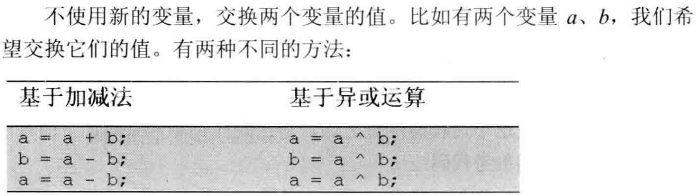

### 2 实现单例模式

```java
public class Q2Singleton {

    private static volatile Q2Singleton singleton;
    private static Object object;
    
    private Q2Singleton() {
    }

    public static Q2Singleton getInstance() {
		if (singleton == null) {
            synchronized (object) {
                if (singleton == null) {
                    singleton = new Q2Singleton();
                }
            }
        }
        return singleton;
    }
}
```

初步创建单例模式：**将构造函数设为私有的**，添加一个**静态的变量**singleton，在静态方法中判断该变量是否为空，为空的时候创建一个实例。

用于多线程环境：创建实例的时候加上同步操作。

优化效率的版本：在加锁前再判断一次该变量是否为空，为空才加锁，避免加锁的开销。

```java
public class Q2Singleton {

    private static Q2Singleton singleton = new Q2Singleton();

    private Q2Singleton() {
    }

    public static Q2Singleton getSingleton() {
        return singleton;
    }
}
```

更好的写法：利用静态构造函数（类的初始化过程），确保只调用一次。

- Java虚拟机必须保证一个类的\<clinit>()方法在多线程环境中被正确地加锁同步，因此多个线程同时初始化一个类时，只会有一个线程去执行该类的\<clinit>()方法，其他线程都需要阻塞等待。

```java
public class Q2Singleton {

    private Q2Singleton() {
    }

    public static Q2Singleton getSingleton() {
        return Nested.singleton;
    }

    static class Nested {
        static Q2Singleton singleton = new Q2Singleton();
    }
}
```

按需创建的写法：定义一个内部类，将该变量定义到内部类中，第一次用到内部类时才创建实例。

### 3 数组中重复的数字

一个长度为n的数组，所有数字都在0~n-1范围内。找出某个重复的数字。

解法1：先排序再找，时间复杂度$O(nlogn)$。

```java
import java.util.Random;

public class Q3DupNum {
    public static void main(String[] args) {
        int N = 20;
        int[] nums = new int[N];
        Random random = new Random();
        for (int i = 0; i < N; i++) {
            nums[i] = random.nextInt(N-1);
        }
        System.out.println(dupNum(nums));
    }

    public static int dupNum(int[] nums) {
        int n = nums.length;
        Quick(nums);
        for (int i = 0; i < n - 1; i++) {
            if (nums[i] == nums[i + 1])
                return nums[i];
        }
        return -1;
    }

    private static void Quick(int[] nums) {
        Quick(nums, 0, nums.length - 1);
    }

    private static void Quick(int[] nums, int left, int right) {
        if (left >= right) return;
        int j = partion(nums, left, right);
        Quick(nums, left, j - 1);
        Quick(nums, j + 1, right);
    }

    private static int partion(int[] nums, int left, int right) {
        int t = nums[left];
        int i = left + 1, j = right;
        while (true) {
            while (i <= right && nums[i] <= t) i++;
            while (j > left && nums[j] >= t) j--;
            if (i >= j)
                break;
            swap(nums, i, j);
        }
        swap(nums, left, j);
        return j;
    }

    private static void swap(int[] nums, int i, int j) {
        int t = nums[i];
        nums[i] = nums[j];
        nums[j] = t;
    }
}

[2, 11, 6, 12, 12, 4, 15, 7, 5, 15, 4, 17, 3, 13, 9, 1, 8, 12, 14, 10]
[1, 2, 3, 4, 4, 5, 6, 7, 8, 9, 10, 11, 12, 12, 12, 13, 14, 15, 15, 17]
4
```

解法2：利用散列表记录出现情况，时间复杂度$O(n)$，空间复杂度$O(n)$。这种解法不会修改数组。

```java
public class Q3DupNum {
    public static void main(String[] args) {
        int[] nums = new int[]{2, 3, 1, 0, 4, 5, 6};
        System.out.println(dupNum(nums));
    }

    public static int dupNum(int[] nums) {
        int n = nums.length;
        int[] count = new int[n];
        for (int i = 0; i < nums.length; i++) {
            count[nums[i]]++;
            if (count[nums[i]] > 1)
                return nums[i];
        }
        return -1;
    }
}
```

解法3：由于数组中的数字都在0~n-1范围内，如果没有重复数字，那排序后下标为i的数字就是i。因此可以利用这个规律对数组进行重排：扫描到下标为$i$的数字$m$时，如果$i==m$，接着扫描下一个；如果$i!=m$，比较$m$与索引为$m$的数字是否相等，如果$m=nums[m]$，则找到了一个重复数字，否则交换下标为$i$和$m$的数字，重复这个过程。时间复杂度$O(n)$，空间复杂度$O(1)$。

```java
import java.util.Arrays;
import java.util.Random;

public class Q3DupNum {
    public static void main(String[] args) {
        int N = 10;
        int[] nums = new int[N];
        Random random = new Random();
        for (int i = 0; i < N; i++) {
            nums[i] = random.nextInt(N - 1);
        }
        System.out.println(Arrays.toString(nums));
        System.out.println(dupNum(nums));
    }

    public static int dupNum(int[] nums) {
        if (nums == null && nums.length == 0) return -1;
        for (int num : nums) {
            if (num < 0 || num >= nums.length)
                return -1;
        }
        for (int i = 0; i < nums.length; i++) {
            if (i == nums[i]) continue;
            if (nums[i] == nums[nums[i]]) return nums[i];
            swap(nums, i, nums[i]);
        }
        return -1;
    }

    private static void swap(int[] nums, int i, int j) {
        int t = nums[i];
        nums[i] = nums[j];
        nums[j] = t;
    }
}


[4, 2, 5, 0, 2, 0, 4, 2, 4, 3]
0
```

一个长度为n+1的数组，所有数字都在1~n范围内。**不修改数组**找出某个重复的数字。

可以利用散列表，但空间使用为$O(n)$，下面为一种使用$O(1)$的方法。

```java
package cn.dut.offer;

import java.util.Arrays;
import java.util.Random;

public class Q3DupNum2 {
    public static void main(String[] args) {
        int N = 10;
        int[] nums = new int[N];
        Random random = new Random();
        for (int i = 0; i < N; i++) {
            nums[i] = random.nextInt(N - 1) + 1;
        }
        System.out.println(Arrays.toString(nums));
        System.out.println(dupNum(nums));
    }

    public static int dupNum(int[] nums) {
        if (nums == null && nums.length == 0) return -1;
        int start = 1, end = nums.length - 1;
        while (start <= end) {
            int mid = (end - start) / 2 + start;
            int count = countRange(nums, start, mid);
            if (start == end) {
                if (count > 1) return start;
                else break;
            }
            if (count > mid - start + 1)
                end = mid;
            else
                start = mid + 1;
        }
        return -1;
    }

    private static int countRange(int[] nums, int start, int end) {
        int count = 0;
        for (int i = 0; i < nums.length; i++) {
            if (nums[i] >= start && nums[i] <= end)
                count++;
        }
        return count;
    }
}
```

思路：长度为n+1，所有数字在1~n之间，至少有一个重复数字。利用二分查找的想法，m为中间数字，首先检查1~m这个区间，如果数组中该区间的数字数目超过m，那么该区间一定包含重复数字；否则m+1~n的区间一定包含重复数字。

由于每次检查的区间是start~mid，因此该区间包含重复数字，那就让end设为mid。如果不包含，那就让start设为mid+1。

二分调用所需时次数为$O(logn)$，每次调用遍历一遍数组，为$O(n)$，因此总时间复杂度$O(nlogn)$。

### 4 二维数组中的查找

在一个二维数组中，每一行都按照从左到右递增的顺序排序，每一列都按照从上到下递增的顺序排列。输入一个整数，判断数组中是否含有该整数。

```java
package cn.dut.offer;

public class Q4 {
    public static void main(String[] args) {
        int[][] array = new int[][]{
                {1, 2, 8, 9},
                {2, 4, 9, 12},
                {4, 7, 10, 13},
                {6, 8, 11, 15}
        };
        System.out.println(new Q4().find(array, 6));
    }

    public boolean find(int[][] array, int num) {
        if (array == null || array.length == 0) return false;
        int rows = array.length;
        int cols = array[0].length;
        int row = 0;
        int col = cols - 1;
        while (row < rows && col >= 0) {
            if (array[row][col] > num) {
                col--;
            } else if (array[row][col] < num) {
                row++;
            } else {
                return true;
            }
        }
        return false;
    }
}
```

思路：由于往右或往下均为增大的方向，因此可以从右上角或左下角的元素开始查找。右上角的元素大于被查找元素，则排除这一列，因为下面的元素都比它大；小于被查找元素，则排除这一行，因为左面的元素都比它小。


### 5 替换空格

把字符串中每个空格替换成“%20”。

```java
package cn.dut.offer;

import java.util.Arrays;

public class Q5 {
    public static void main(String[] args) {
        String str = "we are happy.";
        /*long t1 = System.currentTimeMillis();
        for (int i = 0; i < 1000000; i++) {
            str = str.replaceAll("\\s", "%20");
            str = replace(str);
            str = replace2(str);
        }
        System.out.println(str + ", cost time: " + (System.currentTimeMillis() - t1) / 1000.0);*/

        char[] chars = new char[18];
        for (int i = 0; i < str.length(); i++) {
            chars[i] = str.charAt(i);
        }
        System.out.println(Arrays.toString(chars));
        replace3(chars);
        System.out.println(Arrays.toString(chars));
    }

    public static String replace(String s) {
        StringBuilder sb = new StringBuilder();
        for (char c : s.toCharArray()) {
            if (c == ' ') sb.append("%20");
            else sb.append(c);
        }
        return sb.toString();
    }

    public static String replace2(String s) {
        String t = "";
        for (char c : s.toCharArray()) {
            if (c == ' ') t = t.concat("%20");
            else t = t.concat("" + c);
        }
        return t;
    }

    public static void replace3(char[] chars) {
        if (chars == null || chars.length == 0) return;
        int length = chars.length;

        int oldLength = 0, numOfSpace = 0;
        while (oldLength<length && chars[oldLength] != '\0') {
            if (chars[oldLength] == ' ') numOfSpace++;
            oldLength++;
        }

        int newLength = oldLength + 2 * numOfSpace;
        if (newLength > length) return;

        int right = newLength - 1, left = oldLength - 1;
        while (left >= 0 && left < right) {
            if (chars[left] != ' ') {
                chars[right--] = chars[left];
            }else {
                chars[right--] = '0';
                chars[right--] = '2';
                chars[right--] = '%';
            }
            left--;
        }
    }
}
```

这道题如果使用Java的一些api可以直接完成，如`replaceAll()`、直接拼接字符串/`concat()`或`StringBuilder`，而且Java的字符串无法在原地完成操作。如果使用C/C++且要求不能使用额外空间，那就应当考虑提前计算好替换后的长度，从后往前替换字符。


```
int right = newLength - 1, left = oldLength - 1;
```

Java中字符串末尾没有'\0'，索引应当初始化为`len-1`，而C/C++初始化为len，则是考虑到了'\0'。

### 6 从尾到头打印链表

输入一个链表的头节点，从尾到头反过来打印出每个节点的值。

```java
package cn.dut.offer;

public class Q6 {
    static class ListNode {
        int val;
        ListNode next;

        public ListNode(int val) {
            this.val = val;
        }
    }

    public static void main(String[] args) {
        int[] vals = new int[]{1, 3, 5, 6, 9, 8, 4, 3};
        ListNode dummy = new ListNode(-1);
        ListNode head = dummy;
        for (int i = 0; i < vals.length; i++) {
            head.next = new ListNode(vals[i]);
            head = head.next;
        }
        head = dummy.next;
        reversePrint(head);
    }

    public static void reversePrint(ListNode x) {
        if (x == null) return;
        reversePrint(x.next);
        System.out.print(x.val + " ");
    }
    
    public static void reversePrint2(ListNode x) {
        Stack<ListNode> stack = new Stack<>();

        while (x != null) {
            stack.push(x);
            x = x.next;
        }

        while (!stack.empty()) {
            ListNode pop = stack.pop();
            System.out.print(pop.val + " ");
        }
    }
}
```

先遍历的节点后打印，使用栈可以实现这种顺序。显式使用栈或直接后序遍历即可。

### 7 重建二叉树

输入二叉树的前序遍历和中序遍历结果，重建该二叉树。

```java
package cn.dut.offer;

import java.util.LinkedList;
import java.util.Queue;
import java.util.Stack;

public class Q7 {
    static class TreeNode {
        int val;
        TreeNode left;
        TreeNode right;

        public TreeNode(int val) {
            this.val = val;
        }
    }

    public static void main(String[] args) {
        int[] pre = new int[]{1, 2, 4, 7, 3, 5, 6, 8};
        int[] mid = new int[]{4, 7, 2, 1, 5, 3, 8, 6};
        TreeNode head = reconstruct(pre, mid, 0, pre.length - 1, 0, mid.length - 1);
        preOrderPrint2(head);
        System.out.println();
        inOrderPrint(head);
        System.out.println();
        postOrderPrint(head);
        System.out.println();
        levelOrderPrint(head);

    }

    private static TreeNode reconstruct(int[] pre, int[] mid, int preLeft, int preRight, int midLeft, int midRight) {
        if (preLeft > preRight || midLeft > midRight) return null;
        int rootIndex = -1;
        for (int i = midLeft; i <= midRight; i++) {
            if (mid[i] == pre[preLeft]) {
                rootIndex = i;
                break;
            }
        }
        if (rootIndex == -1) throw new RuntimeException("invalid data.");
        TreeNode root = new TreeNode(pre[preLeft]);
        int leftLength = rootIndex - midLeft;
        int leftPreRight = preLeft + leftLength;
        root.left = reconstruct(pre, mid, preLeft + 1, leftPreRight, midLeft, rootIndex - 1);
        root.right = reconstruct(pre, mid, leftPreRight + 1, preRight, rootIndex + 1, midRight);
        return root;
    }

    private static void preOrderPrint(TreeNode root) {
        if (root == null) return;
        System.out.print(root.val + " ");
        preOrderPrint(root.left);
        preOrderPrint(root.right);
    }
}
```

前序遍历结果的第一个数一定是根节点，因此在中序遍历结果中找到它的位置，左边为根节点的左子树，右边为右子树。这样就得到了左子树和右子树的遍历序列，因此可以递归地进行重建。


#### 非递归遍历二叉树的方法

```java
    private static void preOrderPrint2(TreeNode root) {
        Stack<TreeNode> stack = new Stack<>();
        TreeNode t = root;
        while (t != null || !stack.empty()) {
            while (t != null) {
                System.out.print(t.val + " ");
                stack.push(t);
                t = t.left;
            }
            if (!stack.empty()) {
                t = stack.pop();
                t = t.right;
            }
        }
    }

    private static void inOrderPrint(TreeNode root) {
        Stack<TreeNode> stack = new Stack<>();
        TreeNode t = root;
        while (t != null || !stack.empty()) {
            while (t != null) {
                stack.push(t);
                t = t.left;
            }
            if (!stack.empty()) {
                t = stack.pop();
                System.out.print(t.val + " ");
                t = t.right;
            }
        }
    }

    private static void postOrderPrint(TreeNode root) {
        Stack<TreeNode> stack = new Stack<>();
        TreeNode cur;
        TreeNode pre = null;
        stack.push(root);
        while (!stack.empty()) {
            cur = stack.peek();
            if ((cur.left == null && cur.right == null) || (pre != null && (pre == cur.left || pre == cur.right))) {
                System.out.print(cur.val + " ");
                pre = stack.pop();
            } else {
                if (cur.right != null) stack.push(cur.right);
                if (cur.left != null) stack.push(cur.left);
            }
        }
    }

    private static void levelOrderPrint(TreeNode root) {
        Queue<TreeNode> queue = new LinkedList<>();
        queue.add(root);
        while (!queue.isEmpty()) {
            TreeNode node = queue.poll();
            System.out.print(node.val + " ");
            if (node.left != null) queue.add(node.left);
            if (node.right != null) queue.add(node.right);
        }
    }
```

前序：首先沿着左子树深入，每遇到一个节点就将其压入栈，同时打印（每个节点都是该子树的根节点，总先打印根节点），当左节点为空时，弹出栈，转向右节点。

中序：首先沿着左子树深入，每遇到一个节点就将其压入栈，当左节点为空时，弹出栈，此时打印（总先打印（相对于还没有被打印的根节点的）左节点），转向右节点。

后序：打印根节点有两种情况，一是它没有子节点，二是子节点都已经被访问过，这两种情况是根节点出栈的条件。因此可以使用一个指针记录上一个访问过的节点，如果是当前节点的子节点，就可以打印，并且出栈；否则依次将它的右节点、左节点入栈（左右根）。

层次：使用队列进行BFS即可。

### 8 二叉树的下一个节点

给定一课二叉树和其中一个节点，如何找出中序遍历的下一个节点？树中的节点除了有两个分别指向左、右子节点的指针，还有一个指向父节点的指针。

```java
private TreeNode inOrderNext(TreeNode query) {
    if (query == null) return null;
    TreeNode next = null;
    if (query.right != null) {
        TreeNode right = query.right;
        while (right.left != null) {
            right = right.left;
        }
        next = right;
    } else if (query.parent != null) {
        TreeNode current = query;
        TreeNode parent = query.parent;
        while (parent != null && current == parent.right) {
            current = parent;
            parent = parent.parent;
        }
        next = parent;
    }
    return next;
}
```

中序遍历的顺序为左、根、右。

对于一个节点，如果它有右节点，那么下一个遍历节点为右子树中最左边的节点，如b-e-h；

如果它没有右节点，那么先找到它的父节点，如果它是父节点的左节点，那么下一个遍历节点为它的父节点，如h-e；

否则往上回退，直到找到一个左节点，那么下一个遍历节点为这个节点的父节点，如i-e-b-a。


### 9 用两个栈实现队列

用两个栈实现一个队列，具有在队列尾部插入节点和在队列头部删除节点的功能。

```java
package cn.dut.offer;

import java.util.Scanner;
import java.util.Stack;

public class Q9 {

    static class CQueue<T> {
        private Stack<T> stack1;
        private Stack<T> stack2;

        public CQueue() {
            stack1 = new Stack<>();
            stack2 = new Stack<>();
        }

        public void appendTail(T item) {
            stack1.push(item);
        }

        public T deleteHead() {
            if (!stack2.empty()) {
                return stack2.pop();
            } else {
                while (!stack1.empty()) {
                    stack2.push(stack1.pop());
                }
                if (!stack2.empty()) return stack2.pop();
                else throw new RuntimeException("queue is empty.");
            }
        }

        public boolean empty() {
            return stack1.empty() && stack2.empty();
        }
    }

    public static void main(String[] args) {
        CQueue<String> q = new CQueue<>();

        Scanner sc = new Scanner(System.in);
        while (sc.hasNext()) {
            String next = sc.next();
            if (!next.equals("-")) {
                q.appendTail(next);
            } else if (!q.empty()) {
                System.out.print(q.deleteHead() + " ");
            }
        }
    }
}
```

栈1用于加入元素时使用，此时先进后出；栈2用于删除元素时使用，将栈1的元素加入栈2，此时先进先出。

对于删除操作不用在栈1和栈2之间来回移动元素，当栈2为空时将栈1所有元素移动过来，栈2不为空时直接将栈顶元素出栈，并不影响新加入元素的出队顺序。

#### 用两个队列实现一个栈

```java
	static class CStack<T> {
        private Queue<T> queue1;
        private Queue<T> queue2;

        public void push(T item) {
            queue1.add(item);
        }

        public T pop() {
            while (queue1.size() > 1) {
                queue2.add(queue1.poll());
            }
            T t = queue1.poll();
            Queue q = queue1;
            queue1 = queue2;
            queue2 = q;
            return t;
        }

        public CStack() {
            queue1 = new LinkedList<>();
            queue2 = new LinkedList<>();
        }

        public boolean empty() {
            return queue1.size() == 0 && queue2.size() == 0;
        }
    }

    public static void main(String[] args) {
        CStack<String> stack = new CStack<>();

        Scanner sc = new Scanner(System.in);
        while (sc.hasNext()) {
            String next = sc.next();
            if (!next.equals("-")) {
                stack.push(next);
            } else if (!stack.empty()) {
                System.out.print(stack.pop() + " ");
            }
        }
    }
```

利用队列的当前容量作为辅助手段，队列1用于入栈操作，每当需要出栈操作时，将队列1的前N-1个元素出队，加入到队列2中，然后队列1出队最后一个元素，即为返回元素，满足后进先出。然后将两个队列的地址互换即可。

### 10 斐波那契数列

求斐波那契数列的第n项。

```java
package cn.dut.offer;

public class Q10 {

    public static void main(String[] args) {
        Q10 q10 = new Q10();
        final int n = 45;

        long t1 = System.currentTimeMillis();
        System.out.println(q10.fib(n) + " cost: " + (System.currentTimeMillis() - t1) / 1000.0);

        long t2 = System.currentTimeMillis();
        int[] mem = new int[n + 1];
        System.out.println(q10.fib(n, mem) + " cost: " + (System.currentTimeMillis() - t2) / 1000.0);

        long t3 = System.currentTimeMillis();
        System.out.println(q10.fib2(n) + " cost: " + (System.currentTimeMillis() - t3) / 1000.0);
    }

    public int fib2(int n) {
        if (n <= 0) return 0;
        if (n == 1 || n == 2) return 1;
        int pre = 1, cur = 1;
        int res;
        for (int i = 3; i <= n; i++) {
            res = pre + cur;
            pre = cur;
            cur = res;
        }
        return cur;
    }

    public int fib(int n) {
        if (n <= 0) return 0;
        if (n == 1 || n == 2) return 1;
        return fib(n - 1) + fib(n - 2);
    }

    public int fib(int n, int[] mem) {
        if (n <= 0) return 0;
        if (n == 1 || n == 2) return 1;
        if (mem[n] != 0) return mem[n];
        mem[n] = fib(n - 1, mem) + fib(n - 2, mem);
        return mem[n];
    }
}
```

为了健壮性，最好将`n<=0`和`n==1`、`n==2`的情况直接返回。

#### 青蛙跳台阶问题

一只青蛙一次可以跳上1级台阶，也可以跳上2级台阶。求该青蛙跳上一个n级台阶总共有多少种跳法。

解法其实与斐波那契数列相同，但它包含着动态规划的思想。

跳上n级台阶，那么一定是从n-1或n-2级台阶跳上来的，因此问题转化为跳上n-1或n-2级台阶共有多少种跳法。以此类推，一定会到达基本情况，即跳上1级或2级台阶。

或者从基本情况出发，跳上1级台阶只有1种跳法，2级台阶有两种跳法。跳上n级台阶，可以先选择跳1级，那么剩下n-1级，或者选择跳2级，那么剩下n-2级。


### 11 旋转数组的最小数字

把一个数组最开始的若干个元素搬到数组的末尾，称之为数组的旋转。输入一个递增排序的数组的一个旋转，输出旋转数组的最小元素。如数组`{3,4,5,1,2}`为`{1,2,3,4,5}`的一个旋转，该数组的最小值为1。

- 不合意的解法

  ```java
  class Solution {
      public int minArray(int[] numbers) {
          int n = numbers.length;
          int res = Integer.MAX_VALUE;
          for(int i = n-1; i>=0; i--)
              if(numbers[i] < res) res = numbers[i];
          return res; 
      }
  }
  ```

  没有用到旋转的特性，需要遍历一遍数组，复杂度为$O(n)$。

- 二分查找

  ```java
  class Solution {
      public int minArray(int[] numbers) {
          int n = numbers.length;
          int left = 0, right = n - 1;
          int mid = left;
          while(numbers[left] >= numbers[right]) {
              mid = (right - left) / 2 + left;
              if(numbers[mid] == numbers[left] && numbers[left] == numbers[right])
                  return mainOrder(numbers, left, right);
              if(numbers[mid] >= numbers[left]) left = mid;
              else if(numbers[mid] <= numbers[right]) right = mid;
              if(right - left == 1){
                  mid = right;
                  break;
              }
          }
          return numbers[mid];
      }
  
      private int mainOrder(int[] numbers, int left, int right) {
          int res = numbers[left];
          for(int i = left + 1; i <= right; i++)
              if(numbers[i] <= res) res = numbers[i];
          return res;
      }
  }
  ```
  
  由于通常情况下旋转数组`{3,4,5,1,2}`的前半部分总比后半部分大，因此循环条件设置为left元素大于等于right元素，每次获得mid位置元素后，如果它比left元素大，说明它还在前半部分，于是将left设置为mid；如果它比right元素小，说明它在后半部分，于是将right设置为mid。如果right元素与left元素相邻，此时仍然满足条件left元素大于等于right元素，则right元素即为最小元素。
  
  特殊情况处理：
  
  
  
  当left、mid、right元素都相同时，此时无法判断mid元素到底属于前半部分还是后半部分。在这种情况下只能进行顺序查找。

### 12 矩阵中的路径

```
请设计一个函数，用来判断在一个矩阵中是否存在一条包含某字符串所有字符的路径。路径可以从矩阵中的任意一格开始，每一步可以在矩阵中向左、右、上、下移动一格。如果一条路径经过了矩阵的某一格，那么该路径不能再次进入该格子。例如，在下面的3×4的矩阵中包含一条字符串“bfce”的路径（路径中的字母用加粗标出）。

[["a","b","c","e"],
["s","f","c","s"],
["a","d","e","e"]]

但矩阵中不包含字符串“abfb”的路径，因为字符串的第一个字符b占据了矩阵中的第一行第二个格子之后，路径不能再次进入这个格子。

示例 1：
输入：board = [["A","B","C","E"],["S","F","C","S"],["A","D","E","E"]], word = "ABCCED"
输出：true


示例 2：
输入：board = [["a","b"],["c","d"]], word = "abcd"
输出：false


提示：
	1 <= board.length <= 200
	1 <= board[i].length <= 200
```

- 垃圾写法

  ```java
  package cn.dut.offer;
  
  import java.util.ArrayList;
  import java.util.List;
  
  public class Q12 {
  
      public static void main(String[] args) {
          char[][] board = new char[][]{  {'a', 'b', 'c', 'e'},
                                          {'s', 'f', 'c', 's'},
                                          {'a', 'd', 'e', 'e'}};
          Q12 q12 = new Q12();
          System.out.println(q12.exist(board, "abce"));
      }
  
      List<String> results = new ArrayList<>();
      public boolean exist(char[][] board, String word) {
          if (board == null || board.length == 0 || board[0].length == 0) return false;
          int rows = board.length;
          int cols = board[0].length;
          boolean[][] visited = new boolean[rows][cols];
          StringBuilder sb = new StringBuilder();
          for (int i = 0; i < rows; i++) {
              for (int j = 0; j < cols; j++) {
                  backtrack(board, word, i, j, sb, visited);
                  if (!results.isEmpty() && word.equals(results.get(0))) {
                      return true;
                  }
              }
          }
          return false;
      }
  
      public void backtrack(char[][] board, String word, int i, int j, StringBuilder sb, boolean[][] visited) {
          if (sb.length() == word.length() && word.equals(sb.toString())) {
              results.add(sb.toString());
              return;
          }
          if (i >= 0 && i <= board.length - 1 && j >= 0 && j <= board[0].length - 1 && !visited[i][j]) {
              sb.append(board[i][j]);
              visited[i][j] = true;
              backtrack(board, word, i - 1, j, sb, visited);
              backtrack(board, word, i, j - 1, sb, visited);
              backtrack(board, word, i + 1, j, sb, visited);
              backtrack(board, word, i, j + 1, sb, visited);
              sb.deleteCharAt(sb.length() - 1);
              visited[i][j] = false;
          }
      }
  }
  ```

- 更巧妙的写法

  ```java
  class Solution {
      
      public boolean exist(char[][] board, String word) {
          if (board == null || board.length == 0 || board[0].length == 0) return false;
          int rows = board.length;
          int cols = board[0].length;
          boolean[][] visited = new boolean[rows][cols];
          for (int i = 0; i < rows; i++) {
              for (int j = 0; j < cols; j++) {
                  if(backtrack(board, word, i, j, 0, visited)) return true;
              }
          }
          return false;
      }
  
      public boolean backtrack(char[][] board, String word, int i, int j, int curLen, boolean[][] visited) {
          if (curLen == word.length()) {
              return true;
          }
          boolean flag = false;
          if (i >= 0 && i <= board.length - 1 && j >= 0 && j <= board[0].length - 1 && board[i][j] == word.charAt(curLen) && !visited[i][j]) {
              curLen++;
              visited[i][j] = true;
              flag = backtrack(board, word, i - 1, j, curLen, visited) ||
                      backtrack(board, word, i, j - 1, curLen, visited) ||
                      backtrack(board, word, i + 1, j, curLen, visited) ||
                      backtrack(board, word, i, j + 1, curLen, visited);
              curLen--;
              visited[i][j] = false;
          }
          return flag;
      }
  }
  ```

  使用回溯法，由于不知道起点在矩阵中的哪个位置，因此只能对每个位置都进行一遍回溯。

  但这道题并不需要将路径保存下来，因为target字符串已经是路径了，在回溯过程中使用一个变量保存当前匹配的长度，判断当前字符是否是路径中的字符即可，如果不是就完全不需要继续回溯。

  另外回溯函数也可以使用返回值，只要四个方向上有一个能达成target路径即可，使用或关系完成。

### 13 机器人的运动范围

```
地上有一个m行n列的方格，从坐标 [0,0] 到坐标 [m-1,n-1] 。一个机器人从坐标 [0, 0] 的格子开始移动，它每次可以向左、右、上、下移动一格（不能移动到方格外），也不能进入行坐标和列坐标的数位之和大于k的格子。例如，当k为18时，机器人能够进入方格 [35, 37] ，因为3+5+3+7=18。但它不能进入方格 [35, 38]，因为3+5+3+8=19。请问该机器人能够到达多少个格子？

示例 1：
输入：m = 2, n = 3, k = 1
输出：3

示例 2：
输入：m = 3, n = 1, k = 0
输出：1

提示：
	1 <= n,m <= 100
	0 <= k <= 20
```

- DFS

  ```java
  class Solution {
      int m;
      int n;
      int k;
      boolean[][] visited;
  
      public int movingCount(int m, int n, int k) {
          //dfs
          this.m = m;
          this.n = n;
          this.k = k;
          this.visited = new boolean[m][n];
          return dfs(0, 0, 0, 0);
      }
  
      public int dfs(int i, int j, int si, int sj) {
          if (i > m - 1 || j > n - 1 || k < si + sj || visited[i][j] == true) return 0;
          visited[i][j] = true;
          return 1 + dfs(i + 1, j, (i + 1) % 10 == 0 ? si - 8 : si + 1, sj) + dfs(i, j + 1, si, (j + 1) % 10 == 0 ? sj - 8 : sj + 1);
      }
  }
  ```

  dfs的参数列表为当前的坐标$(i,j)$以及当前坐标的数位和。

  当一个坐标从$9\rightarrow10$时，数位和会$-8$，否则数为和$+1$，注意这里的数位和是从0累加上来的，不需要单独计算。

- BFS

  ```java
  class Solution {
      public int movingCount(int m, int n, int k) {
  
          Queue<int[]> queue = new LinkedList<>();
          boolean[][] visited = new boolean[m][n];
          queue.add(new int[]{0, 0});
          visited[0][0] = true;
          int res = 0;
  
          while (!queue.isEmpty()) {
              int[] pos = queue.poll();
              int i = pos[0], j = pos[1];
              if (i >= 0 && i < m && j + 1 >= 0 && j + 1 < n && !visited[i][j + 1] && can(i, j + 1, k)) {
                  queue.add(new int[]{i, j + 1});
                  visited[i][j + 1] = true;
              }
              if (i + 1 >= 0 && i + 1 < m && j >= 0 && j < n && !visited[i + 1][j] && can(i + 1, j, k)) {
                  queue.add(new int[]{i + 1, j});
                  visited[i + 1][j] = true;
              }
              res++;
          }
          return res;
      }
  
      public boolean can(int i, int j, int k) {
          int sum = 0;
          while (i > 0) {
              sum += i % 10;
              i /= 10;
          }
          while (j > 0) {
              sum += j % 10;
              j /= 10;
          }
          return sum <= k;
      }
  }
  ```

### 14 剪绳子

```
给你一根长度为 n 的绳子，请把绳子剪成整数长度的 m 段（m、n都是整数，n>1并且m>1），每段绳子的长度记为 k[0],k[1]...k[m-1] 。请问 k[0]*k[1]*...*k[m-1] 可能的最大乘积是多少？例如，当绳子的长度是8时，我们把它剪成长度分别为2、3、3的三段，此时得到的最大乘积是18。

示例 1：
输入: 2
输出: 1
解释: 2 = 1 + 1, 1 × 1 = 1

示例 2:
输入: 10
输出: 36
解释: 10 = 3 + 3 + 4, 3 × 3 × 4 = 36

提示：
	2 <= n <= 58
```

- 动态规划

  ```java
  class Solution {
      public int cuttingRope(int n) {
          if(n < 2) return 0;
          if(n == 2) return 1;
          if(n == 3) return 2;
  
          int[] res = new int[n+1];
          res[0] = 0;
          res[1] = 1;
          res[2] = 2;
          res[3] = 3;
          return cuttingRope(n, res);
      }
  
      public int cuttingRope(int n, int[] res) {
          if(res[n] != 0) return res[n];
          for(int i = 1; i < n; i++) {
              res[n] = Math.max(res[n], cuttingRope(i, res) * cuttingRope(n-i, res));
          }
          return res[n];
      }
  }
  ```

  状态方程：$f(n)=max(f(i)\times f(n-i))，i\in(0,n)$，即一段长度为n的绳子，首先剪一刀，得到长度为i和长度为n-i的两端绳子，乘积结果应当等于这两段绳子的乘积结果的积。由于并不知道一分为二的时候要剪多少，因此需要做出选择，即1/n-1，2/n-2等等，这些情况下的最大值即为最终结果。

  注意之处：绳子长度本身为1、2、3时，最终结果应当为0、1、2。但是当绳子长度大于3时，计算过程中遇到的子绳子长度为1、2、3，它们应当为1、2、3。如长度为4，剪为1/3，乘积为3；剪为2/2，乘积为4。

- 贪心

  ```java
  class Solution {
      public int cuttingRope(int n) {
          if(n < 2) return 0;
          if(n == 2) return 1;
          if(n == 3) return 2;
  
          int timesOf3 = n / 3;
          if(n - 3 * timesOf3 == 1) 
              timesOf3 -= 1;
          int timesOf2 = (n - 3 * timesOf3)/2;
          return (int) Math.pow(3, timesOf3) * (int) Math.pow(2, timesOf2);
      }
  }
  ```

  尽可能地划分出3，剩下4时，划分2。

  这是由于$n\geq5$时，$2(n-2)\gt n$，$3(n-3)\gt n$且$3(n-3)\gt 2(n-2)$，因此尽可能多剪为长度为3的绳子。而当$n=4$时，$2\times2\gt1\times3$，因此剩余长度为4时剪为长度为2的绳子。

### 15 二进制中1的个数

```
请实现一个函数，输入一个整数，输出该数二进制表示中 1 的个数。例如，把 9 表示成二进制是 1001，有 2 位是 1。因此，如果输入 9，则该函数输出 2。
```

- 巧妙方法

  ```java
  public class Solution {
      // you need to treat n as an unsigned value
      public int hammingWeight(int n) {
          int count = 0;
          while(n != 0) {
              n = n & (n - 1);
              count++;
          }
          return count;
      }
  }
  ```

  直接将整数右移，由于负数时右移需要保持负号，因此填补的是1。这样写无法处理负数。

  或者将一个数1每次左移1位，与整数位与，直到它变为负，这样需要循环32次。

  巧妙方法为每次将整数减1再和原整数位与，就是让它最右边的1归零，而左边各位均不变。因此可以让n与n-1位与，这样有几个1就循环几次。如$1100-1=1011$，$1100 \& 1011=1000$。

  

### 16 数值的整数次方

```
实现函数double Power(double base, int exponent)，求base的exponent次方。不得使用库函数，同时不需要考虑大数问题。

示例 1:
输入: 2.00000, 10
输出: 1024.00000

示例 2:
输入: 2.10000, 3
输出: 9.26100

示例 3:
输入: 2.00000, -2
输出: 0.25000
解释: 2-2 = 1/22 = 1/4 = 0.25

说明:
	-100.0 < x < 100.0
	n 是 32 位有符号整数，其数值范围是 [−231, 231 − 1] 
```

- 比较傻的方法

  ```java
  class Solution {
      public double myPow(double x, int n) {
          if(x == 0.0) return 0.0;
          if(n == 0.0) return 1.0;
          if(x == 1.0) return x;
          if(x == -1.0) return n % 2 == 0 ? -x : x;
          
          final double eps = 1e-10;
          long N = n;
          N = N > 0 ? N : -N;
          x = n > 0 ? x : 1.0 / x;
          double res = 1.0;
          for(long i = 1; i <= N; i++) {
              res = res * x;
              if(abs(res) < eps) return x < 0 ? -0.0 : 0.0;
          }
          return res;
      }
  
      public double abs(double x) {
          return x < 0 ? -x : x;
      }
  }
  ```

  对各种特殊情况直接处理；n可能取到整数的最小值，此时取反会超过范围，因此放入long类型再取绝对值；

  对于类似$0.1^{100000000}$的情况，使用一个epsilon进行限制，直接返回0。

- 递归写法

  ```java
  class Solution {
      public double myPow(double x, int n) {
          if(n == 0) return 1.0;
          if(n == 1) return x;
          if(n == -1) return 1.0 / x;
          double half = myPow(x, n / 2);
          double mod = myPow(x, n % 2);
          return half * half * mod;
      }
  }
  ```

  由于$a^n=\left\{\begin{aligned} &a^\frac{n}{2}\times a^\frac{n}{2}\times a^0& n为偶数 \\ &a^\frac{n-1}{2}\times a^\frac{n-1}{2}\times a^1&n为奇数\end{aligned}\right.$，因此可以使用递归在`O(log(n))`时间内完成。

### 17 打印从1到最大的n位数

```
输入数字 n，按顺序打印出从 1 到最大的 n 位十进制数。比如输入 3，则打印出 1、2、3 一直到最大的 3 位数 999。

示例 1:
输入: n = 1
输出: [1,2,3,4,5,6,7,8,9]
```

- 字符串相加

  ```java
  package cn.dut.offer;
  
  public class Q17 {
      public static void main(String[] args) {
          final int n = 3;
          StringBuilder res = new StringBuilder("1");
          while (res.length() <= n) {
              System.out.print(res.toString() + " ");
              res = strAdd(res);
          }
      }
  
      private static StringBuilder strAdd(StringBuilder res) {
          int j = res.length() - 1;
          int num = res.charAt(j) - '0' + 1;
          int carry = num / 10;
          res.deleteCharAt(j);
          res.insert(j, num % 10 + "");
          while (carry == 1 && j > 0) {
              j--;
              num = res.charAt(j) - '0' + carry;
              carry = num / 10;
              res.deleteCharAt(j);
              res.insert(j, num % 10 + "");
          }
          if (carry == 1) res.insert(0, '1');
          return res;
      }
  }
  ```

  由于n没有指定，因此无法保证数字类型能够容纳，因此需要考虑使用字符串或者数组表示大数。Java中字符串可能更灵活一点。C++中的字符串与数组类似，需要提前指定好字符串的长度。

  字符串初始化为“1”，然后采用字符串模拟数字相加的方法，每次为字符串表示的数字+1，并打印。

  这里需要考虑进位的情况，例如`99+1=100`，当进位为1且没有到达数字最高位时，循环相加，最高位处理完之后如果还有进位就在字符串开头新加一个“1”。

- 递归写法

  ```java
      public void printMaxNDigits(int n) {
          if (n <= 0) return;
          char[] number = new char[n];
  
          for (int i = 0; i < 10; i++) {
              number[0] = (char) (i + '0');
              printMaxNDigitsRecursively(number, n, 0);
          }
      }
  
      public void printMaxNDigitsRecursively(char[] number, int length, int index) {
          if (index == length - 1) {
              print(number);
              return;
          }
          for (int i = 0; i < 10; i++) {
              number[index + 1] = (char) (i + '0');
              printMaxNDigitsRecursively(number, length, index + 1);
          }
          System.out.println();
      }
  
      public void print(char[] number) {
          boolean isBeginning0 = true;
          for (int i = 0; i < number.length; i++) {
              if (isBeginning0 && number[i] != '0')
                  isBeginning0 = false;
              if (!isBeginning0)
                  System.out.print(number[i]);
          }
          System.out.print("\t");
      }
  ```

  打印1-999…就是所有n位数字的全排列，因此可以使用类似回溯的方法递归解决。

### 18 O(1)时间删除链表的节点

给定单向链表的头指针和一个节点指针，定义一个函数在`O(1)`时间内删除该节点。


如果只给定了值，那么需要遍历链表，找到被删除节点的前一个节点，才能完成删除操作。

现在给出了被删除节点的指针，那么是知道它后面节点的信息的，因此可以将它的值替换为下一个节点的值，然后将它指向下下个节点，这样与删除的效果类似。

需要处理的特殊情况是，如果链表中只有一个节点，那么直接将头指针设为null即可。如果被删除节点是最后一个节点，那么只能通过遍历找到它的前一个节点，然后进行删除。

平均时间复杂度为$[(n-1)O(1)+O(n)]/n$仍然为`O(1)`。

另外`O(1)`的时间复杂度基于节点指针确实指向了链表中的节点，否则为了确定此事也需要`O(n)`的时间。

#### 删除链表中重复的节点

在一个链表中删除重复节点。

```
0->0->1->1->1->3->4->5->5->6->6->7->7->8->8->8->8->8->9->9
3->4
```

```java
package cn.dut.offer;

import java.util.Random;

public class Q18 {

    static class ListNode {
        int val;
        ListNode next;

        public ListNode(int val) {
            this.val = val;
        }
    }

    public static void main(String[] args) {
        ListNode head = null;
        Random random = new Random();
        for (int i = 0; i < 20; i++) {
            int val = random.nextInt(10);
            if (head == null) {
                head = new ListNode(val);
            } else {
                if (head.val >= val) {
                    ListNode oldHead = head;
                    head = new ListNode(val);
                    head.next = oldHead;
                } else {
                    ListNode tmpHead = head;
                    while (tmpHead.next != null && tmpHead.next.val < val) tmpHead = tmpHead.next;
                    ListNode tmp = tmpHead.next;
                    tmpHead.next = new ListNode(val);
                    tmpHead.next.next = tmp;
                }
            }
        }

        ListNode tmpHead = head;
        while (tmpHead != null) {
            System.out.print(tmpHead.val + "->");
            tmpHead = tmpHead.next;
        }
        System.out.println();
        tmpHead = new Q18().deleteDup(head);
        while (tmpHead != null) {
            System.out.print(tmpHead.val + "->");
            tmpHead = tmpHead.next;
        }
    }

    public ListNode deleteDup(ListNode head) {
        if (head == null) return null;
        ListNode pre = null;
        ListNode cur = head;
        ListNode next = head.next;
        while (next != null) {
            if (cur.val != next.val) {
                pre = cur;
                cur = next;
                next = next.next;
            } else {
                while (next != null && cur.val == next.val) next = next.next;
                if (pre == null) head = next;//说明开始的节点就重复
                else pre.next = next;
                cur = next;
                if (next != null) next = next.next;
            }
        }
        return head;
    }
}
```

由于这个题需要把重复的节点全部删掉，一个不留，因此使用三个指针操作。

### 19 正则表达式

```
请实现一个函数用来匹配包含'. '和'*'的正则表达式。模式中的字符'.'表示任意一个字符，而'*'表示它前面的字符可以出现任意次（含0次）。在本题中，匹配是指字符串的所有字符匹配整个模式。例如，字符串"aaa"与模式"a.a"和"ab*ac*a"匹配，但与"aa.a"和"ab*a"均不匹配。

示例 1:
输入:
s = "aa"
p = "a"
输出: false
解释: "a" 无法匹配 "aa" 整个字符串。


示例 2:
输入:
s = "aa"
p = "a*"
输出: true
解释: 因为 '*' 代表可以匹配零个或多个前面的那一个元素, 在这里前面的元素就是 'a'。因此，字符串 "aa" 可被视为 'a' 重复了一次。


示例 3:
输入:
s = "ab"
p = ".*"
输出: true
解释: ".*" 表示可匹配零个或多个（'*'）任意字符（'.'）。


示例 4:
输入:
s = "aab"
p = "c*a*b"
输出: true
解释: 因为 '*' 表示零个或多个，这里 'c' 为 0 个, 'a' 被重复一次。因此可以匹配字符串 "aab"。


示例 5:
输入:
s = "mississippi"
p = "mis*is*p*."
输出: false

	s 可能为空，且只包含从 a-z 的小写字母。
	p 可能为空，且只包含从 a-z 的小写字母以及字符 . 和 *，无连续的 '*'。
```

```java
class Solution {
    public boolean isMatch(String s, String p) {
        if (s == null || p == null)
            return false;
        return match(s, p, 0, 0);
    }

    private boolean match(String s, String p, int sPointer, int pPointer) {
        if (sPointer == s.length() && pPointer == p.length())
            return true;
        if (sPointer != s.length() && pPointer == p.length())
            return false;
        if (pPointer + 1 < p.length() && p.charAt(pPointer + 1) == '*') {
            if (sPointer < s.length() && (p.charAt(pPointer) == s.charAt(sPointer) || p.charAt(pPointer) == '.'))
                return match(s, p, sPointer + 1, pPointer + 2)
                        || match(s, p, sPointer + 1, pPointer)
                        || match(s, p, sPointer, pPointer + 2);
            else return match(s, p, sPointer, pPointer + 2);
        }
        if (sPointer < s.length() && (s.charAt(sPointer) == p.charAt(pPointer) || p.charAt(pPointer) == '.'))
            return match(s, p, sPointer + 1, pPointer + 1);
        return false;
    }
}
```

正则表达式匹配就是画出模式字符串对应的非确定有限状态机（NFA），然后在给定字符串上模拟它的运行。

NFA是一个有向图，可以用有向图的模型来实现。这本书给出的解法使用递归挺巧妙的，非确定的情况是使用或运算模拟的。

由于Java没有指针并且字符串末尾也没有'\0'，因此需要用一个int值模拟指针，并且使用该值判断匹配字符串是否越界（因为判断匹配成功与否的条件只有两个：一是两个指针均到达了末尾，说明匹配成功；二是模式字符串的指针已经到达了末尾，但匹配字符串的指针还没有，说明匹配失败。但是注意状态机运行的情况中存在模式字符串指针不动，匹配字符串指针移动的情况，因此可能会发生匹配字符串越界）。


状态机遇到”*“且与当前字符相同时，接下来的三种可能运行情况：

`match(s, p, sPointer + 1, pPointer + 2)`：进入到下一个状态，并且检查下一个字符。
`match(s, p, sPointer + 1, pPointer)`：保持原状态不变，并且检查下一个字符。
`match(s, p, sPointer, pPointer + 2)`：忽视掉当前状态，仍然检查当前字符。因为"*"代表可能出现0~任意次，因此可以直接跳过它，如字符串”bab“只有在这种情况下会匹配成功。

### 20 表示数值的字符串

```
请实现一个函数用来判断字符串是否表示数值（包括整数和小数）。例如，字符串"+100"、"5e2"、"-123"、"3.1416"、"0123"都表示数值，但"12e"、"1a3.14"、"1.2.3"、"+-5"、"-1E-16"及"12e+5.4"都不是。
```

- 有限状态自动机（DFA）

  

  作者：jyd
  链接：https://leetcode-cn.com/problems/biao-shi-shu-zhi-de-zi-fu-chuan-lcof/solution/mian-shi-ti-20-biao-shi-shu-zhi-de-zi-fu-chuan-y-2/
  来源：力扣（LeetCode）
  著作权归作者所有。商业转载请联系作者获得授权，非商业转载请注明出处。

  虽然知道应该用DFA，但这个题的情况太复杂了。一方面状态转移图考虑不全面，另一方面使用if-else编程也不太清晰明了。

  ```java
  class Solution {
      public boolean isNumber(String s) {
          if (s == null || s.length() == 0) return false;
          Map[] states = {
                  new HashMap(){{ put(' ',0); put('s',1); put('d',2); put('.',4); }},
                  new HashMap(){{ put('d',2); put('.',4); }},
                  new HashMap(){{ put('d',2); put('e',5); put('.',3); put(' ',8); }},
                  new HashMap(){{ put('d',3); put('e',5); put(' ',8); }},
                  new HashMap(){{ put('d',3); }},
                  new HashMap(){{ put('d',7); put('s',6); }},
                  new HashMap(){{ put('d',7); }},
                  new HashMap(){{ put('d',7); put(' ',8); }},
                  new HashMap(){{ put(' ',8); }}
          };
          char t;
          int p = 0;
          for (char c : s.toCharArray()) {
              if (c >= '0' && c <= '9') t = 'd';
              else if (c == '+' || c == '-') t = 's';
              else if (c == ' ' || c == 'e' || c == '.') t = c;
              else t = '?';
              if (!states[p].containsKey(t)) return false;
              p = (int) states[p].get(t);
          }
          return p == 2 || p == 3 || p == 7 || p == 8;
      }
  }
  ```

  使用map数组存储状态转移表，这里有个初始化map的奇技淫巧：匿名内部类+实例化代码块。但仅仅为了代码简洁，最好不要用这种方式初始化，它会生成很多不必要的内部类，加重类加载器负担，还可能造成内存泄漏。

- 基于规则

  ```java
  class Solution {
      public boolean isNumber(String s) {
          if(s==null||s.length()==0) return false;
  
          boolean numSeen = false;
          boolean dotSeen = false;
          boolean eSeen = false;
  
          char[] chars = s.strip().toCharArray();
          for(int i=0; i<chars.length; i++) {
              char c = chars[i];
              if(c >= '0' && c <= '9') {
                  numSeen = true;
              } else if(c == '.') {
                  if(dotSeen || eSeen) return false;
                  dotSeen = true;
              } else if(c == 'e') {
                  if(!numSeen || eSeen) return false;
                  eSeen = true;
                  numSeen = false;
              } else if(c == '+' || c == '-') {
                  if(i != 0 && (chars[i-1] != 'e' || chars[i-1] != 'E')) return false;
              } else {
                  return false;
              }
          }
          return numSeen;
      }
  }
  ```

  首先去掉字符串两边的空格字符；定义三个状态，numSeen、dotSeen、eSeen。

  规则：

  1. 遇到数字，numSeen为true。
  2. 遇到"."，如果已经遇到过"."或者"e"，返回false，如2.2.2，1e2.2；否则dotSeen为true。
  3. 遇到"e"，如果没有遇到过数字或者已经遇到过"e"，返回false，如e2，1e2e3；否则eSeen为true，并且将numSeen重置为false。
  4. 遇到"+"、"-"，如果它不在开头并且前一个字符不是"e"，返回false。
  5. 其他情况均为false。
  6. 结束遍历后，有效状态为numSeen，而不是直接返回true。如1.e，最后numSeen被重置，仍然返回false。

### 21 调整数组顺序使奇数位于偶数前面

```
输入一个整数数组，实现一个函数来调整该数组中数字的顺序，使得所有奇数位于数组的前半部分，所有偶数位于数组的后半部分。

示例：
输入：nums = [1,2,3,4]
输出：[1,3,2,4] 
注：[3,1,2,4] 也是正确的答案之一。

提示：
	1 <= nums.length <= 50000
	1 <= nums[i] <= 10000
```

- 双指针

    ```java
    class Solution {
        public int[] exchange(int[] nums) {
            if(nums==null || nums.length==0) return new int[0];
            int n = nums.length;
            int left = 0, right = n-1;

            while(left<right) {
                while(left<right && nums[left]%2!=0) left++;
                while(left<right && nums[right]%2==0) right--;
                if(left<right) {
                    int t = nums[left];
                    nums[left] = nums[right];
                    nums[right] = t;
                }
            }
            return nums;
        }
    }
    ```

### 22 链表中倒数第k个节点

```
输入一个链表，输出该链表中倒数第k个节点。为了符合大多数人的习惯，本题从1开始计数，即链表的尾节点是倒数第1个节点。例如，一个链表有6个节点，从头节点开始，它们的值依次是1、2、3、4、5、6。这个链表的倒数第3个节点是值为4的节点。

示例：
给定一个链表: 1->2->3->4->5, 和 k = 2.
返回链表 4->5.
```

- 先遍历一遍获取长度

- 双指针

  ```java
  /**
   * Definition for singly-linked list.
   * public class ListNode {
   *     int val;
   *     ListNode next;
   *     ListNode(int x) { val = x; }
   * }
   */
  class Solution {
      public ListNode getKthFromEnd(ListNode head, int k) {
          if(head==null || k<=0) return null;
          ListNode left = head;
          ListNode right = head;
          int i=1;
          for(;i<=k;i++) {
              if(right==null) break;
              right = right.next;
          }
          if(i<=k) return null;
          while(right!=null){
              left = left.next;
              right = right.next;
          }
          return left;
      }
  }
  ```

  right先移动k步，然后同时移动left和right，直到right为null，此时left指向倒数第n个节点。

  关键是考虑鲁棒性，处理k大于链表长度的情况。

  当k小于等于链表长度时，移动k步后正常退出循环，计数i比k大1。

  当k大于链表长度时，移动到链表末尾靠break退出循环，计数i小于等于k。

  如果采用先移动k-1步的方式，那么可以用right是否为null判断k合不合理。

  ```java
  class Solution {
      public ListNode getKthFromEnd(ListNode head, int k) {
          if(head == null || k <= 0) return null;
          ListNode left = head;
          ListNode right = head;
          for(int i = 0; i < k - 1; i++) {
              if(right == null) break;
              right = right.next;
          }
          if(right == null) return null;
          while(right.next != null){
              left = left.next;
              right = right.next;
          }
          return left;
      }
  }
  ```

### 23 链表中环的入口节点

如果一个链表中包含环，如何找出环的入口节点？

- 使用set记忆

  ```
  public ListNode entry(ListNode head) {
  	Set<ListNode> mem = new HashSet<>();
  	while(head != null) {
  		if(mem.contains(head)) return head;
  		mem.add(head);
  		head = head.next;
  	}
  	return head;
  }
  ```

- 双指针

  ```java
  public ListNode entry(ListNode head) {
  	if(head == null) return null;
  	ListNode slow = head;
  	ListNode fast = head.next;
  	while(slow != fast) {
  		if(slow != null) slow = slow.next;
  		if(fast != null) fast = fast.next;
  		if(fast != null) fast = fast.next;
  	}
  	if(slow == null) return null;
      
  	int count = 0;
  	fast = slow.next;
  	while(slow != fast) {
  		slow = slow.next;
  		fast = fast.next.next;
  		count++;
  	}
  	count++;
      
  	slow = head;
  	fast = head;
  	for(int i=0; i<count; i++, fast = fast.next);
  	while(slow != fast) {
  		slow = slow.next;
  		fast = fast.next;
  	}
  	return slow;
  }
  ```

  首先用快慢指针判断是否有环，当slow==fast时，它们为null则没有环。

  然后继续用快慢指针对环的节点计数，当slow==fast时，计数器还需要加1。例如slow：3-4-5-6，fast：4-6-4-6，循环进行了三次，但有4个节点。

  最后用双指针，类似于22的思路，环有n个节点，则fast先移动n步，然后slow和fast同时移动，当它们相等时则为入口节点。

  

### 24 反转链表

```
定义一个函数，输入一个链表的头节点，反转该链表并输出反转后链表的头节点。

示例:
输入: 1->2->3->4->5->NULL
输出: 5->4->3->2->1->NULL

限制：
0 <= 节点个数 <= 5000
```

- 循环

  ```java
  /**
   * Definition for singly-linked list.
   * public class ListNode {
   *     int val;
   *     ListNode next;
   *     ListNode(int x) { val = x; }
   * }
   */
  class Solution {
      public ListNode reverseList(ListNode head) {
          if(head == null) return null;
          ListNode pre = null;
          ListNode cur = head;
          ListNode next;
  
          while(cur != null) {
              next = cur.next;
              cur.next = pre;
              pre = cur;
              cur = next;
          }
          return pre;
      }
  }
  ```

- 递归

  ```java
  class Solution {
      public ListNode reverseList(ListNode head) {
          if(head == null) return null;
          if(head.next == null) return head;
          ListNode rt = reverseList(head.next);
          head.next.next = head;
          head.next = null;
          return rt;
      }
  }
  ```

  首先沿着链表深入，到达尾节点时停止，返回尾节点。沿着递归树回退时，修改每个节点和下一个节点的指向。如返回到4时，`head.next.next = head;`：$$1\rightarrow2\rightarrow3\rightarrow4\leftrightarrow5$$，`head.next = null;`：$$1\rightarrow2\rightarrow3\rightarrow4\leftarrow5$$。

### 25 合并两个排序链表

```
输入两个递增排序的链表，合并这两个链表并使新链表中的节点仍然是递增排序的。

示例1：
输入：1->2->4, 1->3->4
输出：1->1->2->3->4->4

限制：
0 <= 链表长度 <= 1000
```

- 迭代

  ```java
  class Solution {
      public ListNode mergeTwoLists(ListNode l1, ListNode l2) {
          ListNode dummy = new ListNode(1);
          ListNode head = dummy;
  
          while(l1 != null && l2 != null) {
              if(l1.val < l2.val) {
                  head.next = l1;
                  l1 = l1.next;
              }else {
                  head.next = l2;
                  l2 = l2.next;
              }
              head = head.next;
          }
          if(l1 != null) head.next = l1;
          if(l2 != null) head.next = l2;
          return dummy.next;
      }
  }
  ```
  
- 递归

  ```java
  class Solution {
      public ListNode mergeTwoLists(ListNode l1, ListNode l2) { 
          if(l1 == null) return l2;
          if(l2 == null) return l1;
          if(l1.val <= l2.val){
              l1.next = mergeTwoLists(l1.next, l2);
              return l1;
          } else{
              l2.next = mergeTwoLists(l1, l2.next);
              return l2;
          }   
      }
  }
  ```

  `l1`较小时，则需要递归地解决`l1`剩下的链表和`l2`链表的融合问题，然后将融合后的结果赋值给`l1`的`next`指针；反之亦然。

  例如`l1：1-2-4`，`l2：0-3-5`

  `0<1`，因此递归地解决`1-2-4`与`3-5`的融合问题，将该问题的结果赋给`0`这个节点，并返回它，最终结果就是`0-子问题结果`。

  `1<3`，因此递归地解决`2-4`与`3-5`的融合问题，将该问题的结果赋给`1`这个节点，并返回它，最终结果就是`0-1-子问题结果`。

  以此类推。

### 26 树的子结构

```
输入两棵二叉树A和B，判断B是不是A的子结构。(约定空树不是任意一个树的子结构)
B是A的子结构， 即 A中有出现和B相同的结构和节点值。

例如:
给定的树 A:

     3
    / \
   4   5
  / \
 1   2
给定的树 B：

   4 
  /
 1
返回 true，因为 B 与 A 的一个子树拥有相同的结构和节点值。

示例 1：
输入：A = [1,2,3], B = [3,1]
输出：false


示例 2：
输入：A = [3,4,5,1,2], B = [4,1]
输出：true

限制：
0 <= 节点个数 <= 10000
```

- 超级慢的写法

  ```java
  /**
   * Definition for a binary tree node.
   * public class TreeNode {
   *     int val;
   *     TreeNode left;
   *     TreeNode right;
   *     TreeNode(int x) { val = x; }
   * }
   */
  class Solution {
      public boolean isSubStructure(TreeNode A, TreeNode B) {
          if(A == null || B == null) return false;
          Stack<TreeNode> stack = new Stack<>();
          boolean flag = false;
          while(A!=null || !stack.empty()) {
              while(A!=null){
                  flag = sub(A, B);
                  if(flag) return flag;
                  stack.push(A);
                  A = A.left;
              }
              if(!stack.empty()){
                  A = stack.pop();
                  A = A.right;
              }
          }
          return flag;
      }
      public boolean sub(TreeNode A, TreeNode B) {
          if(A==null && B!=null) return false;
          if(A!=null && B!=null && B.val != A.val) return false;
          if(A==null && B==null || A!=null && B==null) return true;
          return sub(A.left, B.left) && sub(A.right, B.right);
      }
  }
  ```

  首先A、B有一个为空直接返回false。

  对A树进行一个前序遍历，在每个节点上再进行B树的匹配。

  匹配过程满足三条规则：

  1. A节点已经为空了，而B节点不为空，不匹配。
  2. 两节点均不为空，但值不一样，不匹配。
  3. 两节点均为空，或者A节点不为空，B节点为空，匹配。

  经过前两条规则的判断后，进入尾递归时一定是两节点值相同的情况，此时递归判断它们的左右子树是否满足。
  
  这三个判断直观，但有点啰嗦，可以优化为
  
  ```java
  if(B==null) return true;
  if(A==null) return false;
  if(B.val != A.val) return false;
  ```
  
  但顺序非常重要，一定要先判断B。

- 递归

  ```java
  class Solution {
      public boolean isSubStructure(TreeNode A, TreeNode B) {
          boolean flag = false;
          if(A!=null && B!=null) {
              if(A.val == B.val)
                  flag = sub(A, B);
              if(!flag)
                  flag = isSubStructure(A.left, B);
              if(!flag)
                  flag = isSubStructure(A.right, B);
          }
          return flag;
      }
      public boolean sub(TreeNode A, TreeNode B) {
          if(B==null) return true;
          if(A==null) return false;
          if(B.val != A.val) return false;
          return sub(A.left,B.left) && sub(A.right, B.right);
      }
  }
  ```

  仍然是前序遍历A树，节点相同时判断子树是否相同。

### 27 二叉树的镜像

```
请完成一个函数，输入一个二叉树，该函数输出它的镜像。

例如输入：
     4
   /   \
  2     7
 / \   / \
1   3 6   9
镜像输出：
     4
   /   \
  7     2
 / \   / \
9   6 3   1

示例 1：
输入：root = [4,2,7,1,3,6,9]
输出：[4,7,2,9,6,3,1]

限制：
0 <= 节点个数 <= 1000
```

```java
class Solution {
    public TreeNode mirrorTree(TreeNode root) {
        if(root == null) return null;
        TreeNode left = root.left;
        TreeNode right = root.right;
        root.right = mirrorTree(left);
        root.left = mirrorTree(right);
        return root;
    }
}
```

递归地交换一个节点的左右子节点即可，但是注意首先将子树的引用保存下来，避免直接交换导致引用丢失。

如果使用无返回值的函数，或者循环写法，则应显式地交换左右子节点。


```java
class Solution {
    public TreeNode mirrorTree(TreeNode root) {
        if(root == null) return null;
        Stack<TreeNode> stack = new Stack<>();
        TreeNode rt = root;
        while(root != null || !stack.empty()) {
            while(root!=null) {
                TreeNode t = root.right;
                root.right = root.left;
                root.left = t;
                stack.push(root);
                root = root.left;
            }
            if(!stack.empty()){
                root = stack.pop();
                root = root.right;
            }
        }
        return rt;
    }
}
```

### 28 对称的二叉树

```
请实现一个函数，用来判断一棵二叉树是不是对称的。如果一棵二叉树和它的镜像一样，那么它是对称的。

例如，二叉树 [1,2,2,3,4,4,3] 是对称的。
    1
   / \
  2   2
 / \ / \
3  4 4  3
但是下面这个 [1,2,2,null,3,null,3] 则不是镜像对称的:
    1
   / \
  2   2
   \   \
   3    3
   
示例 1：
输入：root = [1,2,2,3,4,4,3]
输出：true


示例 2：
输入：root = [1,2,2,null,3,null,3]
输出：false

限制：
0 <= 节点个数 <= 1000
```

- 错误思路

  ```java
  /**
   * Definition for a binary tree node.
   * public class TreeNode {
   *     int val;
   *     TreeNode left;
   *     TreeNode right;
   *     TreeNode(int x) { val = x; }
   * }
   */
  class Solution {
      public boolean isSymmetric(TreeNode root) {
          if(root == null) return false;
          TreeNode mirror = doMirror(root);
          return isSymmetric(root, mirror);
      }
  
      public boolean isSymmetric(TreeNode root, TreeNode mirror) {
          if(root == null && mirror != null || root != null && mirror == null) return false;  
          if(root == null && mirror == null) return true;
          if(root.val != mirror.val) return false;
          return isSymmetric(root.left, mirror.left) && isSymmetric(root.right, mirror.right);
      }
  
      public TreeNode doMirror(TreeNode root) {
          if(root == null) return null;
          TreeNode left = root.left;
          TreeNode right = root.right;
          root.left = doMirror(right);
          root.right = doMirror(left);
          return root;
      }
  }
  ```

  首先将树镜像，然后比较它们是否相同。树的实例只有一个，执行Mirror后会改变树，引用mirror和root实际指向同一棵树。

- 正确思路
  
    	```java
      class Solution {
        public boolean isSymmetric(TreeNode root) {
              if(root == null) return true;
              List<Integer> pre = new ArrayList<>();
              List<Integer> preS = new ArrayList<>();
              preOrder(root, pre);
              preSymmetircOrder(root, preS);
              for(int i=0; i<pre.size(); i++) {
                  Integer p = pre.get(i);
                  Integer ps = preS.get(i);
                  if(p==null || ps==null) return false;
                  else if(!p.equals(ps)) return false;
              }
              return true;
          }

          public void preOrder(TreeNode root, List<Integer> list) {
              if(root == null) {
                  list.add(null);
                  return;
              }
              list.add(root.val);
              preOrder(root.left, list);
              preOrder(root.right, list);
          }
          public void preSymmetircOrder(TreeNode root, List<Integer> list) {
              if(root == null) {
                  list.add(null);
                  return;
              }
              list.add(root.val);
              preSymmetircOrder(root.right, list);
              preSymmetircOrder(root.left, list);
          }
      }
    ```

  如果一个树对称，那么它的前序遍历序列（根左右）和前序对称遍历序列（根右左）相同。

  巧妙的写法
  
  ```java
  class Solution {
      public boolean isSymmetric(TreeNode root) {
          if(root == null) return true;
          return isSymmetric(root.left, root.right);
      }
  
      public boolean isSymmetric(TreeNode left, TreeNode right) {
          if(left == null && right == null) return true;
          if(left == null || right == null) return false;  
          if(left.val != right.val) return false;
          return isSymmetric(left.left, right.right) && isSymmetric(left.right, right.left);
      }
  }
  ```
  
  一对兄弟节点，左节点的左孩子和右节点的右孩子相同，左节点的右孩子和右节点的左孩子相同。
  
  `left.left left.right`为前序遍历`right.right right.left`为前序对称遍历。
#### 由表示完全二叉树的数组构建树

  ```java
  public static void main(String[] args) {
      Q28 q28 = new Q28();
      Integer[] total = new Integer[]{1, 2, 2, null, 3, null, 3};
      TreeNode root = q28.construct(total, 0);
      q28.preOrder(root);
  }
  public TreeNode construct(Integer[] total, int i) {
      if (i >= total.length) return null;
      if(total[i] == null) return null;
      TreeNode root = new TreeNode(total[i]);
      root.left = construct(total, i * 2 + 1);
      root.right = construct(total, i * 2 + 2);
      return root;
  }
  ```

### 29 顺时针打印矩阵

```
输入一个矩阵，按照从外向里以顺时针的顺序依次打印出每一个数字。

示例 1：
输入：matrix = [[1,2,3],[4,5,6],[7,8,9]]
输出：[1,2,3,6,9,8,7,4,5]

示例 2：
输入：matrix = [[1,2,3,4],[5,6,7,8],[9,10,11,12]]
输出：[1,2,3,4,8,12,11,10,9,5,6,7]

限制：
	0 <= matrix.length <= 100
	0 <= matrix[i].length <= 100
```

```java
class Solution {
    public int[] spiralOrder(int[][] matrix) {
        if(matrix == null || matrix.length == 0 || matrix[0].length ==0) return new int[]{};
        int n = matrix.length, m = matrix[0].length;
        int top = 0, bottom = n - 1, left = 0, right = m - 1;
        int[] res = new int[n*m];
        int count = 0;
        while(true) {
            for(int i=left; i<=right; i++) {
                res[count++] = matrix[top][i];
                if(i+1 > right) top++;
            }
            if(top > bottom || left > right) break;
            for(int i=top; i<=bottom; i++) {
                res[count++] = matrix[i][right];
                if(i+1 > bottom) right--;
            }
            if(top > bottom || left > right) break;
            for(int i=right; i>=left; i--) {
                res[count++] = matrix[bottom][i];
                if(i-1 < left) bottom--;
            }
            if(top > bottom || left > right) break;
            for(int i=bottom; i>=top; i--) {
                res[count++] = matrix[i][left];
                if(i-1 < top) left++;
            }
            if(top > bottom || left > right) break;
        }

        return res;
    }
}
```

### 30 包含min函数的栈

```
定义栈的数据结构，请在该类型中实现一个能够得到栈的最小元素的 min 函数在该栈中，调用 min、push 及 pop 的时间复杂度都是 O(1)。

示例:
MinStack minStack = new MinStack();
minStack.push(-2);
minStack.push(0);
minStack.push(-3);
minStack.min();   --> 返回 -3.
minStack.pop();
minStack.top();      --> 返回 0.
minStack.min();   --> 返回 -2.

提示：
	各函数的调用总次数不超过 20000 次
```

```java
class MinStack {

    class Node {
        int val;
        Node next;
        public Node(int x) {
            val = x;
        }
    }
    Node first;
    Node minNode;
    /** initialize your data structure here. */
    public MinStack() {

    }
    
    public void push(int x) {
        Node oldFirst = first;
        first = new Node(x);
        first.next = oldFirst;
        if(minNode == null) minNode = first;
        else if(x < minNode.val) minNode = first;
    }
    
    public void pop() {
        if(first == minNode) {
            Node temp = first.next;
            minNode = temp;
            while(temp != null) {
                if(temp.val < minNode.val) minNode = temp;
                temp = temp.next;
            }
        }
        first = first.next;
    }
    
    public int top() {
        if(first!=null) return first.val;
        else return 0;
    }
    
    public int min() {
        if(minNode!=null) return minNode.val;
        else return 0;
    }
}
```

`push`中更新记录最小值的节点`minNode`。`pop`中判断最小节点是不是栈顶节点。

虽然通过了，但`pop`似乎不一定是`O(1)`，例如栈的状态为`5432`，再`push`个1变为`15432`，此时`pop`后应当更新`minNode`，必须得遍历一遍链表才能得知。

```java
public void push(int x) {
    Node oldFirst = first;
    first = new Node(x);
    first.next = oldFirst;
    if(minNode == null) {
        minNode = new Node(x);
    } else if(x < minNode.val){
        oldFirst = minNode;
        minNode = new Node(x);
        minNode.next = oldFirst;
    } else {
        oldFirst = minNode;
        minNode = new Node(minNode.val);
        minNode.next = oldFirst;
    }
}

public void pop() {
    first = first.next;
    minNode = minNode.next;
}
```

使用辅助栈记录最小节点，以空间换取`O(1)`的性能。


### 31 栈的压入、弹出序列

```
输入两个整数序列，第一个序列表示栈的压入顺序，请判断第二个序列是否为该栈的弹出顺序。假设压入栈的所有数字均不相等。例如，序列 {1,2,3,4,5} 是某栈的压栈序列，序列 {4,5,3,2,1} 是该压栈序列对应的一个弹出序列，但 {4,3,5,1,2} 就不可能是该压栈序列的弹出序列。

示例 1：
输入：pushed = [1,2,3,4,5], popped = [4,5,3,2,1]
输出：true
解释：我们可以按以下顺序执行：
push(1), push(2), push(3), push(4), pop() -> 4,
push(5), pop() -> 5, pop() -> 3, pop() -> 2, pop() -> 1

示例 2：
输入：pushed = [1,2,3,4,5], popped = [4,3,5,1,2]
输出：false
解释：1 不能在 2 之前弹出。

提示：
	0 <= pushed.length == popped.length <= 1000
	0 <= pushed[i], popped[i] < 1000
	pushed 是 popped 的排列。
```

- 使用辅助栈

  ```java
  class Solution {
      public boolean validateStackSequences(int[] pushed, int[] popped) {
          int n = pushed.length, m = popped.length;
          if(n != m) return false;
  
          Stack<Integer> stack = new Stack<>();
          int top = 0;
          for(int i=0; i<m; i++) {
              if(!stack.empty() && stack.peek().equals(popped[i])){
                  stack.pop();
                  continue;
              }
              if(top == n) break; //已经没有可以压入栈的元素了
              for(int j=top; j<n; j++) {
                  if(pushed[j] != popped[i]) stack.push(pushed[j]);
                  else {
                      top = j + 1;
                      break;
                  }
              }
          }
          if(stack.empty()) return true;
          else return false;
      }
  }
  ```

  顺序遍历popped，首先判断当前元素是否为栈顶元素，如果是就从栈顶弹出并检查下一个元素，否则将pushed数组中它之前的所有元素入栈，将一个标记指向它下一个元素，用于记录下次入栈元素的位置。

  当栈顶元素和当前检查元素不同，而popped中已经没有元素可以被压入栈时，说明不匹配，直接break。
  
  ```java
  class Solution {
      public boolean validateStackSequences(int[] pushed, int[] popped) {
          Stack<Integer> stack = new Stack<>();
  
          int i = 0;
          for(int num : pushed) {
              stack.push(num);
              while(!stack.isEmpty() && stack.peek() == popped[i]) {
                  stack.pop();
                  i++;
              }
          }
  
          return stack.isEmpty();
      }
  }
  ```
  
  一种更清晰的思路，遍历pushed，首先压入栈，当栈顶元素和popped元素不相同时，继续压入栈。否则开始弹出，当最终栈为空时，说明匹配。
  
  ```
  pushed:12345
  popped:45321
  
  1入栈，1和4不相同，继续。
  2入栈，2和4不相同，继续。
  3入栈，3和4不相同，继续。
  4入栈，4和4相同，于是4出栈，考虑popped下一个元素。
  5入栈，5和5相同，于是5出栈，考虑popped下一个元素。栈顶元素3和3相同，于是3出栈，考虑popped下一个元素。以此类推
  ```

### 32 从上到下打印二叉树

```
从上到下打印出二叉树的每个节点，同一层的节点按照从左到右的顺序打印。

例如:
给定二叉树: [3,9,20,null,null,15,7],

    3
   / \
  9  20
    /  \
   15   7

返回：
[3,9,20,15,7]

提示：
	节点总数 <= 1000
```

- BFS

  ```java
  /**
   * Definition for a binary tree node.
   * public class TreeNode {
   *     int val;
   *     TreeNode left;
   *     TreeNode right;
   *     TreeNode(int x) { val = x; }
   * }
   */
  class Solution {
      public int[] levelOrder(TreeNode root) {
          if(root == null) return new int[]{};
          Queue<TreeNode> queue = new LinkedList<>();
          List<Integer> list = new ArrayList<>();
          queue.add(root);
          while(!queue.isEmpty()){
              TreeNode t = queue.poll();
              list.add(t.val);
              if(t.left != null) queue.add(t.left);
              if(t.right != null) queue.add(t.right);
          }
          int[] res = new int[list.size()];
          for(int i=0; i<list.size(); i++) {
              res[i] = list.get(i);
          }
          return res;
      }
  }
  ```

  使用BFS进行层次遍历。

```
从上到下按层打印二叉树，同一层的节点按从左到右的顺序打印，每一层打印到一行。

例如:
给定二叉树: [3,9,20,null,null,15,7],
    3
   / \
  9  20
    /  \
   15   7
   
返回其层次遍历结果：
[
  [3],
  [9,20],
  [15,7]
]

提示：
	节点总数 <= 1000
```

- BFS

  ```java
  class Solution {
      public List<List<Integer>> levelOrder(TreeNode root) {
          if(root == null) return new ArrayList<List<Integer>>();
          Queue<TreeNode> queue = new LinkedList<>();
          List<List<Integer>> res = new ArrayList<>();
          queue.add(root);
          while(!queue.isEmpty()){
              List<Integer> tmpList = new ArrayList<>();
              int sz = queue.size();
              for(int i=0; i<sz; i++) {
                  TreeNode t = queue.poll();
                  tmpList.add(t.val);
                  if(t.left!=null) queue.add(t.left);
                  if(t.right!=null) queue.add(t.right);
              }
              res.add(tmpList);
          }
          return res;
      }
  }
  ```

  只要将一层的节点一起出队即可。注意`queue.size()`不能写在循环判断里，否则循环条件动态变化；但可以写在初始化语句，然后`i--`。

```
请实现一个函数按照之字形顺序打印二叉树，即第一行按照从左到右的顺序打印，第二层按照从右到左的顺序打印，第三行再按照从左到右的顺序打印，其他行以此类推。

例如:
给定二叉树: [3,9,20,null,null,15,7],
    3
   / \
  9  20
    /  \
   15   7

返回其层次遍历结果：
[
  [3],
  [20,9],
  [15,7]
]

提示：
	节点总数 <= 1000
```

- BFS的模板，容器为栈

  ```java
  class Solution {
      public List<List<Integer>> levelOrder(TreeNode root) {
          if(root == null) return new ArrayList<List<Integer>>();
          Stack<TreeNode> stack4odd = new Stack<>();
          Stack<TreeNode> stack4even = new Stack<>();
          List<List<Integer>> res = new ArrayList<>();
          stack4even.push(root);
          int round = 0;
          while(!stack4even.isEmpty() || !stack4odd.isEmpty()){
              List<Integer> tmpList = new ArrayList<>();
              Stack<TreeNode> stack4Pop = round % 2 == 0 ? stack4even : stack4odd;
              Stack<TreeNode> stack4Push = round % 2 == 0 ? stack4odd : stack4even;
              int sz = stack4Pop.size();
              for(int i=0; i<sz; i++) {
                  TreeNode t = stack4Pop.pop();
                  tmpList.add(t.val);
                  if(round % 2 != 0){
                      if(t.right!=null) stack4Push.push(t.right);
                      if(t.left!=null) stack4Push.push(t.left); 
                  } else {
                      if(t.left!=null) stack4Push.push(t.left);
                      if(t.right!=null) stack4Push.push(t.right);
                  }
              }
              res.add(tmpList);
              round++;
          }
          return res;
      }
  }
  ```

  使用两个栈，分别保存偶数层和奇数层的节点，并且偶数层时，从左往右push，奇数层时从右往左push。

  例如

  ```
  	  1
  	/	\
     2	 3
    / \	/ \
   4	 5 6   7
  ```

  第0层，1出偶数栈时，奇数栈push2、3

  第1层，3、2出奇数栈时，偶数栈push7、6、5、4

  第2层，4、5、6、7出偶数栈。

  可以看到出栈的顺序满足题目条件。

- BFS，容器为队列

  ```java
  class Solution {
      public List<List<Integer>> levelOrder(TreeNode root) {
          List<List<Integer>> list = new ArrayList<>();
          Queue<TreeNode> queue = new LinkedList<>();
          if(root != null) queue.add(root);
          while(!queue.isEmpty()) {
              LinkedList<Integer> tmp = new LinkedList<>();
              for(int i=queue.size();i>0;i--) {
                  TreeNode node = queue.poll();
                  if(list.size()%2 == 0) tmp.addLast(node.val);
                  else tmp.addFirst(node.val);
                  if(node.left != null) queue.add(node.left);
                  if(node.right != null) queue.add(node.right);
              }
              list.add(tmp);
          }
          return list;
      }
  }
  ```

  仍然使用队列，但添加节点时使用双向链表完成不同顺序的添加。

  使用最终结果`list`的`size`作为添加顺序的判断条件，即`list`的`size`为奇数时，在头部添加，`addFirst`；为偶数时，在尾部添加，`addLast`。

### 33 二叉搜索树的后序遍历序列

```
输入一个整数数组，判断该数组是不是某二叉搜索树的后序遍历结果。如果是则返回 true，否则返回 false。假设输入的数组的任意两个数字都互不相同。

参考以下这颗二叉搜索树：

     5
    / \
   2   6
  / \
 1   3

示例 1：
输入: [1,6,3,2,5]
输出: false

示例 2：
输入: [1,3,2,6,5]
输出: true

提示：
	数组长度 <= 1000
```

```java
class Solution {
    public boolean verifyPostorder(int[] postorder) {
        if (postorder == null || postorder.length == 0) return true;
        int n = postorder.length;
        return verifyPostorder(postorder, 0, n - 1);
    }

    public boolean verifyPostorder(int[] postorder, int lo, int hi) {
        int left = lo;
        for (; left < hi; left++) {
            if (postorder[left] > postorder[hi]) break;
        }
        int right = left;
        for (; right < hi; right++) {
            if (postorder[right] < postorder[hi]) return false;
        }
        boolean leftFlag = true;
        if (lo < left - 1)
            leftFlag = verifyPostorder(postorder, lo, left - 1);
        boolean rightFlag = true;
        if (left < right - 1)
            rightFlag = verifyPostorder(postorder, left, right - 1);
        return leftFlag && rightFlag;
    }
}
```

规律：

```
     5
    / \
   2   6
  / \
 1   3

示例 1：
输入: [1,6,3,2,5]
输出: false

示例 2：
输入: [1,3,2,6,5]
输出: true
```

二叉搜索树的后序遍历序列，数组的最后一个元素为根节点，且前边的元素分为小于根节点和大于根节点的连续的两部分，如果对已经认为是右子树的子数组进行遍历，发现了小于根节点的元素，说明这个序列不是后序遍历序列。找出两部分子数组，即左右子树，递归地进行判断，注意继续进行判断的条件，子数组中至少包含两个元素，一个元素的子树所有遍历序列都一样。

```java
class Solution {
    public boolean verifyPostorder(int[] postorder) {
        return verifyPostorder(postorder, 0, postorder.length-1);
    }

    private boolean verifyPostorder(int[] postorder, int left, int right) {
        if(left >= right) return true;

        int i = left;
        while(postorder[i] < postorder[right]) i++;
        int j = i;
        while(postorder[j] > postorder[right]) j++;

        return j==right && verifyPostorder(postorder, left, i-1) && verifyPostorder(postorder, i, j-1);
    }
}
```

思路与上面一致，但这个写法更容易理解一些。

### 34 二叉树中和为某一值的路径

```
输入一棵二叉树和一个整数，打印出二叉树中节点值的和为输入整数的所有路径。从树的根节点开始往下一直到叶节点所经过的节点形成一条路径。

示例:
给定如下二叉树，以及目标和 sum = 22，
              5
             / \
            4   8
           /   / \
          11  13  4
         /  \    / \
        7    2  5   1

返回:
[
   [5,4,11,2],
   [5,8,4,5]
]

提示：
	节点总数 <= 10000
```

- 回溯

  ```java
  /**
   * Definition for a binary tree node.
   * public class TreeNode {
   *     int val;
   *     TreeNode left;
   *     TreeNode right;
   *     TreeNode(int x) { val = x; }
   * }
   */
  class Solution {
      List<List<Integer>> res = new ArrayList<>();
  
      public List<List<Integer>> pathSum(TreeNode root, int sum) {
          if(root == null) return res;
          List<Integer> path = new ArrayList<>();
          backtrack(root, sum, path);
          return res;    
      }
  
      public void backtrack(TreeNode x, int sum, List<Integer> path) {
          if(x == null) return;
          if(x.left == null && x.right == null && sum - x.val == 0) {
              path.add(x.val);
              res.add(new ArrayList<Integer>(path));
              path.remove(path.size()-1);
              return;
          }
          path.add(x.val);
          backtrack(x.left, sum - x.val, path);
          backtrack(x.right, sum - x.val, path);
          path.remove(path.size()-1);
      }
  }
  ```

  前序遍历：首先将根节点的值加入到路径中。

  记录到达下一个节点时剩余的和，当已经到达叶子节点，判断剩余和是否与节点值相等，如果是就将它加入路径，并将路径加入最终结果，但记得一定要在路径中删除该叶子节点，因为它临时添加的，不在回溯的步骤里。

  正向记录和也可以，在添加一个节点后判断是否满足条件，仍然要记得删除叶子节点：

  ```java
  class Solution {
      List<List<Integer>> res = new ArrayList<>();
  
      public List<List<Integer>> pathSum(TreeNode root, int sum) {
          if(root == null) return res;
          List<Integer> path = new ArrayList<>();
          backtrack(root, 0, sum, path);
          return res;    
      }
  
      public void backtrack(TreeNode x, int currentSum, int targetSum, List<Integer> path) {
          if(x == null) return;
          path.add(x.val);
          if(x.left == null && x.right == null && currentSum + x.val == targetSum) {
              res.add(new ArrayList<Integer>(path));
              path.remove(path.size() - 1);
              return;
          }
          backtrack(x.left, currentSum + x.val, targetSum, path);
          backtrack(x.right, currentSum + x.val, targetSum, path);
          path.remove(path.size() - 1);
      }
  }
  ```


### 35 复杂链表的复制

  ```
  请实现 copyRandomList 函数，复制一个复杂链表。在复杂链表中，每个节点除了有一个 next 指针指向下一个节点，还有一个 random 指针指向链表中的任意节点或者 null。
  
  示例 1：
  输入：head = [[7,null],[13,0],[11,4],[10,2],[1,0]]
  输出：[[7,null],[13,0],[11,4],[10,2],[1,0]]
  
  示例 2：
  输入：head = [[1,1],[2,1]]
  输出：[[1,1],[2,1]]
  
  示例 3：
  输入：head = [[3,null],[3,0],[3,null]]
  输出：[[3,null],[3,0],[3,null]]
  
  示例 4：
  输入：head = []
  输出：[]
  解释：给定的链表为空（空指针），因此返回 null。
  
  提示：
  	-10000 <= Node.val <= 10000
  	Node.random 为空（null）或指向链表中的节点。
  ```

- 图的遍历

  ```java
  /*
  // Definition for a Node.
  class Node {
      int val;
      Node next;
      Node random;
  
      public Node(int val) {
          this.val = val;
          this.next = null;
          this.random = null;
      }
  }
  */
  class Solution {
      Map<Node, Node> existed = new HashMap<>();
      public Node copyRandomList(Node head) {
          if(head == null) return null;
          if(existed.containsKey(head)) return existed.get(head);
          Node copy = new Node(head.val);
          existed.put(head, copy);
          copy.next = copyRandomList(head.next);
          copy.random = copyRandomList(head.random);
          return copy;
      }
  }
  ```

- 迭代

  ```java
  class Solution {
      public Node copyRandomList(Node head) {
          if(head == null) return null;
          Map<Node, Node> map = new HashMap<>();
          Node headKey = head;
          while(head != null) {
              map.put(head, new Node(head.val));
              head = head.next;
          }
          head = headKey;
          while(head != null) {
              map.get(head).next = map.get(head.next);
              map.get(head).random = map.get(head.random);
              head = head.next;
          }
          return map.get(headKey);
      }
  }
  ```

  不管遍历还是迭代，关键都是使用map建立原节点和复制节点的映射关系。

  ```java
  class Solution {
      public Node copyRandomList(Node head) {
          if(head == null) return null;
          Map<Node, Node> map = new HashMap<>();
          Node headKey = head;
          while(head != null) {
              if(!map.containsKey(head))
                  map.put(head, new Node(head.val));
              if(!map.containsKey(head.next) && head.next != null)
                  map.put(head.next, new Node(head.next.val));
              map.get(head).next = map.get(head.next);
              if(!map.containsKey(head.random) && head.random != null)
                  map.put(head.random, new Node(head.random.val));
              map.get(head).random = map.get(head.random);
              head = head.next;
          }
  
          return map.get(headKey);
      }
  }
  ```

  写在一个循环里不仅可读性差，而且由于包含了更多`containsKey()`，耗时反而更久。

- 原地操作，不使用辅助空间

  ```java
  class Solution {
      public Node copyRandomList(Node head) {
          if(head == null) return null;
          Node t = copy(head);
          t = buildRandom(t);
          head = reconnect(t);
          return head;
      }
  
      public Node copy(Node head) {
          Node h = head;
          while(h != null) {
              Node t = new Node(h.val);
              t.next = h.next;
              t.random = null;
              h.next = t;
              h = t.next;
          }
          return head;
      }
  
      public Node buildRandom(Node head) {
          Node h = head;
          while(h != null) {
              Node hCopy = h.next;
              if(h.random != null)
                  hCopy.random = h.random.next;
              h = hCopy.next;
          }
          return head;
      }
  
      public Node reconnect(Node head) {
          Node copyHead = head.next;
          Node hCopy = head.next;
          while(head != null) {
              head.next = hCopy.next;
              head = head.next;
              if(head != null) hCopy.next = head.next;
              hCopy = hCopy.next;
          }
          return copyHead;
      }
  }
  ```

  

  

  

### 36 二叉搜索树与双向链表

```
输入一棵二叉搜索树，将该二叉搜索树转换成一个排序的循环双向链表。要求不能创建任何新的节点，只能调整树中节点指针的指向。

为了让您更好地理解问题，以下面的二叉搜索树为例：

我们希望将这个二叉搜索树转化为双向循环链表。链表中的每个节点都有一个前驱和后继指针。对于双向循环链表，第一个节点的前驱是最后一个节点，最后一个节点的后继是第一个节点。

下图展示了上面的二叉搜索树转化成的链表。“head” 表示指向链表中有最小元素的节点。

特别地，我们希望可以就地完成转换操作。当转化完成以后，树中节点的左指针需要指向前驱，树中节点的右指针需要指向后继。还需要返回链表中的第一个节点的指针。
```

											

- 中序遍历

  ```java
  class Solution {
      Node lastOfList = null;
  
      public Node treeToDoublyList(Node root) {
          if(root == null) return null;
          Node first = TreeMin(root);
          Node last = TreeMax(root);
          treeToDoublyListR(root);
          first.left = last;
          last.right = first;
          return first;
      }
  
      public void treeToDoublyListR(Node x) {
          if(x == null) return;
          Node current = x;
          if(current.left!=null) 
              treeToDoublyListR(current.left);
          current.left = lastOfList;
          if(lastOfList!=null) lastOfList.right = current;
          lastOfList = current;
          if(current.right!=null)
              treeToDoublyListR(current.right);
      }
  
      public Node TreeMax(Node root) {
          if(root == null) return null;
          while(root.right != null) root = root.right; 
          return root;
      }
  
      public Node TreeMin(Node root) {
          if(root == null) return null;
          while(root.left != null) root = root.left; 
          return root;
      }
  }
  ```

  二叉搜索树的中序遍历序列是排好序的，因此使用中序遍历处理连接关系。

  对于当前节点（10），它左边已经是处理好的链表，需要将当前节点的左连接指向链表的最后一个节点（8），而最后一个节点的右连接指向当前节点，更新链表的最后节点为当前节点，接着遍历当前节点的下一个节点（12）。因此需要一个变量来保存当前链表最后一个节点的位置。

  

  leetcode上这道题需要把首尾节点连起来，因此可以转换前就先找到最小和最大节点。

  另外由于Java的函数参数没有引用类型，变量需要为全局变量。

### 37 序列化二叉树

```
请实现两个函数，分别用来序列化和反序列化二叉树。

示例: 

你可以将以下二叉树：

    1
   / \
  2   3
     / \
    4   5

序列化为 "[1,2,3,null,null,4,5]"
```

- 层次遍历序列

    ```java
    public class Codec {
    
        // Encodes a tree to a single string.
        public String serialize(TreeNode root) {
            if(root == null) return "";
            StringBuilder sb = new StringBuilder("[");
            Queue<TreeNode> queue = new LinkedList<>();
            queue.add(root);
            while(!queue.isEmpty()){
                TreeNode t = queue.poll();
            	if(t!=null) {
                    sb.append(t.val + ",");
                    queue.add(t.left);
                    queue.add(t.right);
                } else {
                    sb.append("null,");
                }
            }
            sb.setCharAt(sb.length()-1, ']');
            return sb.toString();
        }
    
        // Decodes your encoded data to tree.
        public TreeNode deserialize(String data) {
            if(data==null||"".equals(data)) return null;
            data = data.substring(1, data.length()-1);
            String[] strs = data.split(",");
            Integer[] levelOrder = new Integer[strs.length];
            for(int i=0; i<strs.length; i++) {
                levelOrder[i] = "null".equals(strs[i]) ? null : Integer.parseInt(strs[i]);
            }
            return construct(levelOrder, 0);
        }

        public TreeNode construct(Integer[] levelOrder, int i) { 
            if(i >= levelOrder.length) return null;
            if(levelOrder[i] == null) return null;
            TreeNode t = new TreeNode(levelOrder[i]);
            t.left = construct(levelOrder, i * 2 + 1);
            t.right = construct(levelOrder, i * 2 + 2);
            return t;
        }
    }
    ```
    
    ~~看了示例原本想序列化为完全二叉树，`"[1,2,3,null,null,4,5]"`，但是并不容易实现。层次遍历时只是将它们加入了队列，但向数组加入null是在该层的节点都加入数组之后，因此这样只是得到了`"[1,2,null,null,3,4,5]"`。~~

    层次遍历只要将null也按顺序加入队列即可，太笨了。。。

- 前序遍历序列

  ```java
  public class Codec {
  
      // Encodes a tree to a single string.
      public String serialize(TreeNode root) {
          if(root == null) return "";
          StringBuilder sb = new StringBuilder("[");
          serialize(root, sb);
          sb.setCharAt(sb.length()-1, ']');
          return sb.toString();
      }
  
      public void serialize(TreeNode x, StringBuilder sb) {
          if(x == null) {
              sb.append("null,");
              return;
          }
          sb.append(x.val + ",");
          serialize(x.left, sb);
          serialize(x.right, sb);
      }
  
      // Decodes your encoded data to tree.
      public TreeNode deserialize(String data) {
          if(data == null || "".equals(data)) return null;
          data = data.substring(1, data.length()-1);
          String[] strs = data.split(",");
          Integer[] preOrder = new Integer[strs.length];
          for(int i=0; i<strs.length; i++) {
              preOrder[i] = "null".equals(strs[i]) ? null : Integer.parseInt(strs[i]);
          }
          return construct(preOrder);
      }
      int curIndex = 0;
      public TreeNode construct(Integer[] preOrder) { 
          if(preOrder[curIndex] == null){
              curIndex++;
              return null;
          } 
          TreeNode t = new TreeNode(preOrder[curIndex]);
          curIndex++;
          t.left = construct(preOrder);
          t.right = construct(preOrder);
          return t;
      }
  }
  ```

  记录树的带有`null`的前序遍历序列，如`[1,2,null,null,3,4,null,null,5,null,null]`。

  反序列化时，使用一个全局索引，从左往右读取数组中的每一个值：读取到的是数值，则创建节点，并指向下一个值；读取到`null`，则指向下一个值，并返回`null`。由于`null`全部被记录下来，因此创建好左节点后，左节点对应子树的最后一个右叶子节点，一定会在数组中对应两个null，它们将该叶子节点的左右连接处理完成后，下一个索引对应的值则来到右节点，因此`curIndex`在创建节点后需要加一次，而在为null的时候需要自加。

  另外该题处理字符串比较麻烦。

### 38 字符串的排列

```
输入一个字符串，打印出该字符串中字符的所有排列。
你可以以任意顺序返回这个字符串数组，但里面不能有重复元素。

示例:
输入：s = "abc"
输出：["abc","acb","bac","bca","cab","cba"]

限制：
1 <= s 的长度 <= 8
```

- 回溯

  ```java
  class Solution {
      public String[] permutation(String s) {
          if(s == null || "".equals(s)) return new String[]{};
          Set<String> res = new HashSet<>();
          StringBuilder sb = new StringBuilder();
          boolean[] used = new boolean[s.length()];
          backtrack(s, used, sb, res);
          return res.toArray(String[]::new);
      }
  
      public void backtrack(String s, boolean[] used, StringBuilder sb, Set<String> res) {
          if(sb.length() == s.length()) {
              res.add(sb.toString());
              return;
          }
          for(int i = 0; i < s.length(); i++) {
              if(used[i]) continue;
              used[i] = true;
              sb.append(s.charAt(i));
              backtrack(s, used, sb, res);
              sb.deleteCharAt(sb.length()-1);
              used[i] = false;
          }
      }
  }
  ```

  方法毫无疑问是回溯，但是细节不同会导致速度上的巨大差异。这里原始地使用sb保存路径，用boolean数组保存使用过的元素（但它不能对重复元素作出区分），使用set容器去除重复元素，代价就是非常慢（81ms）。

  ```java
  class Solution {
      public String[] permutation(String s) {
          if(s == null || "".equals(s)) return new String[]{};
          List<String> res = new ArrayList<>();
          backtrack(s.toCharArray(), 0, res);
          return res.toArray(String[]::new);
      }
  
      public void backtrack(char[] s, int curPos, List<String> res) {
          if(curPos == s.length-1) {
              res.add(String.valueOf(s));
              return;
          }
          Set<Character> seen = new HashSet<>();
          for(int i = curPos; i < s.length; i++) {
              if(seen.contains(s[i])) continue;
              seen.add(s[i]);
              swap(s, i, curPos);
              backtrack(s, curPos+1, res);
              swap(s, i, curPos);
          }
      }
  
      public void swap(char[] s, int i, int j) {
          char temp = s[i];
          s[i] = s[j];
          s[j] = temp;
      }
  }
  ```

  更好的思路是使用字符串的字符数组，每一层的递归固定一个数，直接交换后面的元素即可。

  如字符串“abc”，在curPos=1这一层的递归中，循环中i=2时，交换1和2位置的字符，即变成“acb”，进入curPos=2这一层的递归，此时curPos已经指向最后一个元素，因此保存路径即可。

  这时仍然可以使用set来保存路径，消除重复，耗时大概24ms。

  更优的做法是在每一层的递归中加入一个set，保存已经出现过的字符，当遇到重复字符时直接跳过，耗时大概21ms。这时已经不需要保存路径的set容器了，将其改成list容器，速度提升到9ms。

### 39 数组中出现次数超过一半的元素

```
数组中有一个数字出现的次数超过数组长度的一半，请找出这个数字。
你可以假设数组是非空的，并且给定的数组总是存在多数元素。
 
示例 1:
输入: [1, 2, 3, 2, 2, 2, 5, 4, 2]
输出: 2

限制：
1 <= 数组长度 <= 50000
```

- 使用map保存，遍历一遍数组即可。但实际上`containsKey()`非常耗时，反而达不到`O(n)`。

- 先排序，再判断，`O(nlogn)`。

  ```java
  class Solution {
      public int majorityElement(int[] nums) {
          if(nums==null||nums.length == 0) return 0;
          merge(nums);
          int max = nums[0];
          int count = 1;
          for(int i=1; i< nums.length; i++) {
              if(nums[i] == nums[i-1]){
                  count++;
                  if(count > nums.length / 2)
                      return max;
              } else {
                  max = nums[i];
                  count = 1;
              }
          }
          return max;
      }
  
      public void merge(int[] nums) {
          int[] copy = new int[nums.length];
          merge(nums, 0, nums.length-1, copy);
      }
  
      public void merge(int[] nums, int left, int right, int[] copy) {
          if(left >= right) return;
          int mid = left + (right - left) / 2;
          merge(nums, left, mid, copy);
          merge(nums, mid + 1, right, copy);
          if(nums[mid] > nums[mid + 1])
          	sort(nums, left, mid, right, copy);
      }
  
      public void sort(int[] nums, int left, int mid, int right, int[] copy){
          int i = left, j = mid + 1;
          for (int k = left; k <= right; k++) {
              copy[k] = nums[k];
          }
          while(i<=mid || j<=right) {
              if(i<= mid && j<=right && copy[i] >= copy[j]) nums[left++] = copy[j++];
              else if(i<= mid && j<=right && copy[i] < copy[j]) nums[left++] = copy[i++];
              else if(i <= mid) nums[left++] = copy[i++];
              else if(j <= right) nums[left++] = copy[j++]; 
          }
          /*
          for (int k = left; k <= right; k++)
              if (i > mid) nums[k] = copy[j++];
              else if (j > right) nums[k] = copy[i++];
              else if (copy[i] > copy[j]) nums[k] = copy[j++];
              else nums[k] = copy[i++];
          */
      }
  }
  ```

  - 该题明确测试用例中数组有一个数出现次数超过一半。如果为了找出现次数最多的元素，可以

    ```java
    class Solution {
        public int majorityElement(int[] nums) {
            if(nums==null||nums.length == 0) return 0;
            Arrays.sort(nums);
            int max = nums[0];
            int curmax = nums[0];
            int count = 1;
            int curcount = 1;
            for(int i=1; i< nums.length; i++) {
                if(nums[i] == nums[i-1]){
                    curcount++;
                } else {
                    if(curcount >= count){
                        count = curcount;
                        max = curmax;
                    }
                    curmax = nums[i];
                    curcount = 1;
                }
            }
            if(curcount >= count){
                count = curcount;
                max = curmax;
            }
            return max;
        }
    }
    ```

- `O(n)`基于`partion`函数，需要修改数组

  ```java
  class Solution {
      private Random random = new Random();
      public int majorityElement(int[] nums) {
          if(nums==null||nums.length == 0) return 0;
  
          int left = 0, right = nums.length - 1, middle = nums.length / 2;
          int index = partion(nums, left, right);
          while(index != middle) {
              if(index < middle) {
                  left = index + 1;
                  index = partion(nums, left, right);
              }else {
                  right = index - 1;
                  index = partion(nums, left, right);
              }
          }
          
          int res = nums[index];
          if(!checkMoreThanHalf(nums, res)) return 0;
          return res;
      }
  
      private boolean checkMoreThanHalf(int[] nums, int res) {
          int count = 0;
          for(int i =0; i<nums.length; i++) {
              if(nums[i]==res){
                  count++;
                  if(count > nums.length / 2)
                      return true;
              }  
          }
          return false;
      }
  
      private int partion(int[] nums, int left, int right) {
          int p = random.nextInt(right - left + 1) + left;
          swap(nums, left, p);
          int i = left + 1, j = right;
          while(true) {
              while(i<=right && nums[i] <= nums[left]) i++;
              while(j>left && nums[j] >= nums[left]) j--;
              if(i >= j) break;
              swap(nums, i, j);
          }
          swap(nums, left, j);
          return j;
      }
  
      private void swap(int[] nums, int i, int j) {
          int temp = nums[i];
          nums[i] = nums[j];
          nums[j] = temp;
      }
  }
  ```

  思路：一个数在数组中出现次数超过一半，那么排序后它一定在数组中间出现，因此问题转化为找数组的中位数，或者说第length/2大的数，因此可以使用快速排序中的partion函数完成。

  这里对数组的合法性做了一个检测，确保结果确实出现了大于一半的次数。

  实际提交后发现这种方法比直接对数组排序后进行计数要慢很多，可能是数组很大时递归调用过深？

- 真正的`O(1)`，找规律

  ```java
  class Solution {
  
      public int majorityElement(int[] nums) {
          if(nums==null||nums.length == 0) return 0;
  
          int count = 1;
          int res = nums[0];
          for(int i = 1; i < nums.length; i++) {
              if(nums[i] == res) {
                  count++;
              }else {
                  count--;
                  if(count == 0){
                      res = nums[i];
                      count = 1;
                  }   
              }
          }
          return res;
      }
  }
  ```

  思路：遍历数组时维护两个值，一个是数组中的数字，一个是出现次数。当当前数字与保存值相同时，次数加1，不同时，次数减1。当次数减为0时，更新保存值，并出现次数重新设置为1。由于有一个数出现次数超过其他所有元素，因此最后一次设置为1的数就是要找的数。

  如`2,2,1,1,2,2,1`、`2,2,2,2,1,1,1`不管怎么排列，这个规律都满足。

### 40 最小的k个数

```
输入整数数组 arr ，找出其中最小的 k 个数。例如，输入4、5、1、6、2、7、3、8这8个数字，则最小的4个数字是1、2、3、4。

示例 1：
输入：arr = [3,2,1], k = 2
输出：[1,2] 或者 [2,1]

示例 2：
输入：arr = [0,1,2,1], k = 1
输出：[0]

限制：
	0 <= k <= arr.length <= 10000
	0 <= arr[i] <= 10000
```

- 排序，`O(nlogn)`

  ```java
  class Solution {
      public int[] getLeastNumbers(int[] arr, int k) {
          Arrays.sort(arr);
          int[] res = new int[k];
          for(int i=0; i<k; i++) {
              res[i] = arr[i];
          }
          return res;
      }
  }
  ```

- 切分法，基于`partion`函数，`O(n)`，需要修改数组

  ```java
  class Solution {
      Random random = new Random();
      public int[] getLeastNumbers(int[] arr, int k) {
          if(arr==null||arr.length == 0||k<= 0||k>arr.length) return new int[]{};
          if(k==arr.length) return arr;
          
          int left = 0, right = arr.length -1;
          int index = partion(arr, left, right);
          while(index != k-1) {
              if(index < k-1) {
                  left = index + 1;
                  index = partion(arr, left, right);
              } else {
                  right = index - 1;
                  index = partion(arr, left, right);
              }
          }
  
          int[] res = new int[k];
          for(int i=0; i<k; i++) {
              res[i] = arr[i];
          }
          return res;
      }
  
      private int partion(int[] arr, int left, int right) {
          int p = random.nextInt(right - left + 1) + left;
          swap(arr, left, p);
          int i = left + 1, j = right;
          while(true) {
              while(i<=right&& arr[i] <= arr[left]) i++;
              while(j>left&& arr[j] >= arr[left]) j--;
              if(i>=j) break;
              swap(arr, i, j);
          }
          swap(arr, left, j);
          return j;
      }
  
      private void swap(int[] arr, int i, int j) {
          int temp = arr[i];
          arr[i] = arr[j];
          arr[j] = temp;
      }
  }
  ```

  这与直接找第k小的数是一样的，因为切分法完成查找时前面的元素都小于被查找元素。这里需要注意的是输入的k索引是从1开始的，即第1小的数，第n小的数，而索引需要定位到0，n-1。

- `O(nlogk)`，不修改数组

  ```java
  class Solution {
      public int[] getLeastNumbers(int[] arr, int k) {
          if(arr==null||arr.length == 0||k<= 0||k>arr.length) return new int[]{};
          if(k==arr.length) return arr;
  
          PriorityQueue<Integer> maxHeap = new PriorityQueue<>(new Comparator<Integer>(){
              @Override
              public int compare(Integer o1, Integer o2) {
                  return o2 - o1;
              }
          });
          for(int i=0; i<arr.length; i++) {
              if(maxHeap.size() < k)
                  maxHeap.add(arr[i]);
              else {
                  Integer max = maxHeap.peek();
                  if(arr[i] < max) {
                      maxHeap.poll();
                      maxHeap.add(arr[i]);
                  }
              }
          }
          int[] res = new int[k];
          int i = 0 ;
          for(Integer item : maxHeap) {
              res[i++] = item;
          }
          return res;
      }
  }
  ```

  使用一个容器保存数字，当容量不超过k时，把数直接放进去；当容量等于k之后，每遇到一个数，将其与容器中最大的数比较，小于它则替换掉它，否则保持不变。

  容器使用最大堆实现的优先队列，因此可以满足`O(logk)`的时间复杂度。

  

### 41 数据流的中位数

```
如何得到一个数据流中的中位数？如果从数据流中读出奇数个数值，那么中位数就是所有数值排序之后位于中间的数值。如果从数据流中读出偶数个数值，那么中位数就是所有数值排序之后中间两个数的平均值。

例如，
[2,3,4] 的中位数是 3
[2,3] 的中位数是 (2 + 3) / 2 = 2.5

设计一个支持以下两种操作的数据结构：
	void addNum(int num) - 从数据流中添加一个整数到数据结构中。
	double findMedian() - 返回目前所有元素的中位数。
	
示例 1：
输入：
["MedianFinder","addNum","addNum","findMedian","addNum","findMedian"]
[[],[1],[2],[],[3],[]]
输出：[null,null,null,1.50000,null,2.00000]

示例 2：
输入：
["MedianFinder","addNum","findMedian","addNum","findMedian"]
[[],[2],[],[3],[]]
输出：[null,null,2.00000,null,2.50000]

限制：
	最多会对 addNum、findMedia进行 50000 次调用。
```

- 使用最大堆和最小堆

  ```java
  class MedianFinder {
  
      PriorityQueue<Integer> minHeap = new PriorityQueue<>();
      PriorityQueue<Integer> maxHeap;
  
      /** initialize your data structure here. */
      public MedianFinder() {
          maxHeap = new PriorityQueue<>(new Comparator<Integer>(){
              @Override
              public int compare(Integer o1, Integer o2) {
                  return o2 - o1;
              }
          });
      }
      
      public void addNum(int num) {
          int sz = minHeap.size() + maxHeap.size();
          if(sz == 0) {//没有元素时先向maxHeap添加，因为奇数时要向向minHeap添加。
              maxHeap.add(num);
              return;
          }
          if(sz % 2 == 0) {
              if(num < minHeap.peek()) maxHeap.add(num);
              else {
                  maxHeap.add(minHeap.poll());
                  minHeap.add(num);
              }
          } else {
              if(num > maxHeap.peek()) minHeap.add(num);
              else {
                  minHeap.add(maxHeap.poll());
                  maxHeap.add(num);
              }
          }
      }
      
      public double findMedian() {
          int sz = minHeap.size() + maxHeap.size();
          if(sz % 2 == 0)
              return (minHeap.peek() + maxHeap.peek())/2.0;
          else
              return maxHeap.peek();
      }
  }
  
  /**
   * Your MedianFinder object will be instantiated and called as such:
   * MedianFinder obj = new MedianFinder();
   * obj.addNum(num);
   * double param_2 = obj.findMedian();
   */
  ```

  这个思路真是太巧妙了：中位数就是数组排序后中间的一个值或两个值的平均值，偶数情况下，中间的两个值左边的都小于它们，右边的都大于它们，但这两部分内其实排不排序无所谓，只要满足中间的两个值满足这个条件即可。因此可以左边可以使用最大堆，右边使用最小堆，保证两个堆的容量只差不超过1即可。

  

  具体插入数值时，两个容器的容量之和为奇数时，插入其中一个，偶数时插入另一个即可实现。另外只要注意数值关系，如插入最小堆时，若数值小于最大堆的最大值，则弹出它加入到最小堆，并将数值插入最大堆即可。

  计算中位数时，容量为奇数，则从偶数情况时插入的那个堆找，如代码中偶数情况插入最大堆，则从最大堆找。容量为偶数则计算二者的平均值即可。

  

  

### 42 连续子数组的最大和

```
输入一个整型数组，数组里有正数也有负数。数组中的一个或连续多个整数组成一个子数组。求所有子数组的和的最大值。
要求时间复杂度为O(n)。

示例1:
输入: nums = [-2,1,-3,4,-1,2,1,-5,4]
输出: 6
解释: 连续子数组 [4,-1,2,1] 的和最大，为 6。

提示：
	1 <= arr.length <= 10^5
	-100 <= arr[i] <= 100
```

- 动态规划

  ```java
  class Solution {
      public int maxSubArray(int[] nums) {
          if(nums == null || nums.length == 0) return 0;
          int max = nums[0];
          for(int i=1; i<nums.length; i++) {
              if(nums[i-1] > 0)
                  nums[i] += nums[i-1];
              max = Math.max(nums[i], max); 
          }
          return max;
      }
  }
  ```

  ```java
  class Solution {
      public int maxSubArray(int[] nums) {
          if(nums == null || nums.length == 0) return 0;
          int[] mem = new int[nums.length];
          maxSubArray(nums, nums.length-1, mem);
          int max = mem[0];
          for(int i=1; i<mem.length; i++)
              if(mem[i] > max) max = mem[i];
          return max;
      }
      private int maxSubArray(int[] nums, int pos, int[] mem) {
          if(pos == 0){
              mem[pos] = nums[pos];
              return nums[pos];
          } 
          if(mem[pos] != 0) return mem[pos];
          mem[pos-1] = maxSubArray(nums, pos - 1, mem);
          if(mem[pos-1]<0){
              mem[pos] = nums[pos];
              return nums[pos];
          } 
          mem[pos] = nums[pos] + mem[pos-1];
          return mem[pos];
      }
  }
  ```

  这道题的动态规划思路与数组的规律相同：逐渐累加数组，如果前一个元素是负的，那就不要累加，在每一个位置判断当前元素和最大值哪个更大。

  

  递归方程含义：$f(i)$表示以i位置结尾子数组的最大和。如果i-1位置的最大和已经小于等于0，那么加上它一定小于等于i位置的元素本身，所以不用加，否则继续累加。

  下面的递归形式的代码更直接地表达递归方程，但是速度会更慢。

### 43 1~n整数中1出现的次数

```
输入一个整数 n ，求1～n这n个整数的十进制表示中1出现的次数。
例如，输入12，1～12这些整数中包含1 的数字有1、10、11和12，1一共出现了5次。

示例 1：
输入：n = 12
输出：5

示例 2：
输入：n = 13
输出：6

限制：
	1 <= n < 2^31
```

- 暴力法：对每个数 不断求10的余数。复杂度`O(nlogn)`。

- 找规律：复杂度`O(logn)`。

  ```java
  class Solution {
      public int countDigitOne(int n) {
          if(n <= 0) return 0;
          return numberOf1(String.valueOf(n));
      }
  
      private int numberOf1(String num) {
          if(num.length() == 0) return 0;
  
          int first = num.charAt(0) - '0';
          int length = num.length();
  
          if(length == 1 && first == 0) return 0;
          if(length == 1 && first > 0) return 1;
  
          int numFirst = 0;
          if(first > 1)
              numFirst = PowerBy10(length - 1);
          else if(first == 1)
              numFirst = Integer.parseInt(num.substring(1)) + 1;
  
          int numOther = first * (length - 1) * PowerBy10(length - 2);
          int numRecursive = numberOf1(num.substring(1));
          return numFirst + numOther + numRecursive;
      }
  
      private int PowerBy10(int n) {
          int res = 1;
          for(int i=0; i<n; i++)
              res *= 10;
          return res;
      }
  }
  ```

  如21345：首先把数分为两段，1~1345和1346~21345，这是因为解决了后一段的问题，前一段可以用递归解决，这是这个算法最巧妙的一点。

  对于1346~21345，首先考虑1出现在最高位的情况，如果最高位大于1，那么1将出现在10000~19999，共10000次，即$10^{len-1}$。如果最高位是1，如11345，那么1将出现在10000~11345，共1346次，即1345+1。

  然后考虑1出现在低位上的情况，对于四位数，一位选择1，其他三位有10种情况，因此四位数共有$4\times10^3$种。然后最高位2为这种情况出现的次数，即1346~11345，11346~21345，因此1出现在低位上的次数为$2\times4\times10^3$，即$最高位\times (len-1) \times10^{len-2}$。

  然后递归地解决1345的情况即可。

### 44 数字序列中某一位的数字

```
数字以0123456789101112131415…的格式序列化到一个字符序列中。在这个序列中，第5位（从下标0开始计数）是5，第13位是1，第19位是4，等等。
请写一个函数，求任意第n位对应的数字。

示例 1：
输入：n = 3
输出：3

示例 2：
输入：n = 11
输出：0

限制：
	0 <= n < 2^31
```

- 找规律

  ```java
  class Solution {
      public int findNthDigit(int n) {
          if(n < 0) return -1;
          int res = -1;
          int digits = 1;
          while(true) {
              long numOfDigits = countNumOfDigits(digits);
              if(n < numOfDigits){
                  res = calNumOfn(n, digits);
                  break;
              }
              n -= numOfDigits;
              digits++;
          }
          return res;
      }
      private int calNumOfn(int n, int digits) {
          int base = digits > 1 ? 1 : 0;
          for(int i=1; i<digits; i++)
              base *= 10;
          int num = n / digits + base;
          int pos = n % digits;
          return String.valueOf(num).charAt(pos) - '0';
      }
      private long countNumOfDigits(int digits) {
          if(digits == 1) return 10;
          int pow = 1;
          for(int i = 1; i < digits; i++)
              pow *= 10;
          return (long)digits * 9 * pow;
      }
  }
  ```

  如1001位：序列的前10位为0~9，$1001>10$，因此直接排除掉前10位，从后面的序列（10开始）中找$1001-10=991$位的数字。接下来180位为10~99，$991>180$，因此直接排除掉这180位，从后面的序列（100开始）中找$991-180=811$位的数字。接下来的2700位为100~999，$811<2700$，因此这一定是一个三位数中的一位。

  $811\div3=270···1$，因此对应于从100开始的第270个数，即370的第1个位置，7。注意从0开始计数，因此不是369，而是370。

  编码上这是一个循环过程，首先从位数为1开始，判断输入的索引是否小于当前位数需要在字符串中占据的长度。计算占据的位数时，注意用long类型，一个9位数占据的长度为$9\times9\times10^8$已经超过INT_MAX。

### 45 把数组排成最小的数

```
输入一个非负整数数组，把数组里所有数字拼接起来排成一个数，打印能拼接出的所有数字中最小的一个。

示例 1:
输入: [10,2]
输出: "102"

示例 2:
输入: [3,30,34,5,9]
输出: "3033459"

提示:
	0 < nums.length <= 100
	
说明: 
	输出结果可能非常大，所以你需要返回一个字符串而不是整数
	拼接起来的数字可能会有前导 0，最后结果不需要去掉前导 0
```

- 找规则

  ```java
  class Solution {
      public String minNumber(int[] nums) {
          if(nums == null || nums.length == 0) return "";
          sort(nums);
          StringBuilder sb = new StringBuilder();
          for(int i = 0; i<nums.length; i++)
              sb.append(String.valueOf(nums[i]));
          return sb.toString();
      }
  
      private void sort(int[] nums) {
          for(int i = 1; i < nums.length; i++){
              int t = nums[i];
              int j = i;
              for(; j > 0 && greater(nums[j-1], t); j--) {
                  nums[j] = nums[j-1];
              }
              nums[j] = t;
          }
      }
  
      private boolean greater(int a, int b) {
          String ab = String.valueOf(a)+String.valueOf(b);
          String ba = String.valueOf(b)+String.valueOf(a);
          return ab.compareTo(ba) >= 0;
      }
  }
  ```

  数组长度为100，这显然不适合用全排列。因此需要找一个规则，比较两个数字，判断哪一个应该排在另一个前面，即拼接后的数字哪个更小。有了比较规则便可以使用各种排序方法对数组排序，排序后的数组自然满足最小数字。

  这个规则很简单，就是两个整数a、b，拼接成字符串（避免使用数字类型可能的溢出）后比较ab大还是ba大，由于拼接后全是数字字符且长度相等，因此可以直接比较大小。ab大即表示a大。

  这个思路也非常巧妙。

  耗时情况：插入排序13ms，归并排序6ms，快速排序14ms。

### 46 把数字翻译成字符串

```
给定一个数字，我们按照如下规则把它翻译为字符串：0 翻译成 “a” ，1 翻译成 “b”，……，11 翻译成 “l”，……，25 翻译成 “z”。一个数字可能有多个翻译。请编程实现一个函数，用来计算一个数字有多少种不同的翻译方法。

示例 1:
输入: 12258
输出: 5
解释: 12258有5种不同的翻译，分别是"bccfi", "bwfi", "bczi", "mcfi"和"mzi"

提示：
	0 <= num < 231
```

- 动态规划

  ```java
  class Solution {
      public int translateNum(int num) {
          if(num < 0) return 0;
          return translateNum(String.valueOf(num).toCharArray());
      }
  
      private int translateNum(char[] num) {
          int[] counts = new int[num.length];
          int count;
          for(int i=num.length -1; i>=0; i--) {
              if(i < num.length - 1) count = counts[i+1];
              else count = 1;
              if(i < num.length - 1) {
                  int d1 = num[i] - '0';
                  int d2=  num[i + 1] - '0';
                  int d = 10 * d1 + d2;
                  if(d >= 10 && d <= 25)
                      if(i < num.length - 2)
                          count +=  counts[i+2];
                      else count += 1;
              }
              counts[i] = count;
          }
          return counts[0];
      }
  }
  ```

  如123：从左往右考虑，有两种翻译1的情况，第一种为单独翻译1，然后剩下23；第二种为翻译12，然后剩下3。翻译完1后，翻译2，因此这是一个可以用递归解决的问题。

  写出递归方程：定义$f(i)$为第i个位置数字的翻译数目，则$f(i)=f(i+1)+g(i,i+1)f(i+2)$，当i、i+1位置组成的数字在10~25之间时才可以翻译。

  这里有点奇怪为什么单独翻译123中的1时，它的数目直接为翻译2的数目，直觉上应该是$1+f(1)$，但举例一下，单独翻译1的数目为1/2/3或1/23，可以看到这就是翻译2的数目。

  递归版：

  ```java
  class Solution {
      public int translateNum(int num) {
          if(num < 0) return 0;
          return translateNum(String.valueOf(num).toCharArray(), 0);
      }
  
      private int translateNum(char[] num, int pos) {
          if(pos >= num.length - 1) return 1;
          int d1 = num[pos] - '0';
          int d2 = num[pos + 1] - '0';
          int d = 10 * d1 + d2;
          int res = translateNum(num, pos + 1);
          if(d >= 10 && d <= 25)
              res += translateNum(num, pos + 2);
          return res;
      }
  }
  ```

  由于这个问题输入的是整数，递归不深，速度也还行。

### 47 礼物的最大价值

```
在一个 m*n 的棋盘的每一格都放有一个礼物，每个礼物都有一定的价值（价值大于 0）。你可以从棋盘的左上角开始拿格子里的礼物，并每次向右或者向下移动一格、直到到达棋盘的右下角。给定一个棋盘及其上面的礼物的价值，请计算你最多能拿到多少价值的礼物？

示例 1:
输入: 
[
  [1,3,1],
  [1,5,1],
  [4,2,1]
]
输出: 12
解释: 路径 1→3→5→2→1 可以拿到最多价值的礼物

提示：
	0 < grid.length <= 200
	0 < grid[0].length <= 200
```

- 动态规划

  ```java
  class Solution {
      public int maxValue(int[][] grid) {
          if(grid == null || grid.length == 0 || grid[0].length == 0) return 0;
          int rows = grid.length, cols = grid[0].length;
          int[][] sum = new int[rows][cols];
          
          for(int i=0; i<rows; i++) {
              for (int j=0; j<cols; j++) {
                  if(i-1>=0 && j-1 >=0)
                      sum[i][j] = grid[i][j] + Math.max(sum[i-1][j], sum[i][j-1]);
                  else if(j-1 >= 0)
                      sum[i][j] = grid[i][j] + sum[i][j-1];
                  else if(i-1 >= 0)
                      sum[i][j] = grid[i][j] + sum[i-1][j];
                  else
                      sum[i][j] = grid[i][j];
              }
          }
          return sum[rows-1][cols-1];
      }
  }
  ```

  数组大小200，而且也不用记录路径，因此不适合用DFS/回溯。只能往右/往下走，还要记录走到右下角时的最大值，因此可以考虑动态规划。

  转移方程也很直白：使用一个同样大小的数组记录每个位置上的最大价值，则有$sum[i][j]=grid[i][j]+max(sum[i-1][j],sum[i][j-1])$。对于上边界和左边界额外处理一下即可。

  优化空间的写法：

  ```java
  class Solution {
      public int maxValue(int[][] grid) {
          if(grid == null || grid.length == 0 || grid[0].length == 0) return 0;
          int rows = grid.length, cols = grid[0].length;
          int[] sum = new int[cols];
          
          for(int i=0; i<rows; i++) {
              for (int j=0; j<cols; j++) {
                  int left = 0, up = 0;
                  if(i > 0)
                      up = sum[j];
                  if(j > 0)
                      left = sum[j-1];
                  sum[j] = Math.max(up, left) + grid[i][j];
              }
          }
          return sum[cols-1];
      }
  }
  ```

  由于遍历相当于一行一行扫描的，计算时只需要左边和上边两个元素的值，因此用一个列数组就能保存所需信息。

  ```
  例如
  1 3 1
  1 5 1
  4 2 1
  sum数组初始化为[0,0,0]。
  遍历完第一行时，[1，4，5]。
  遍历第二行第一个元素1时，sum[0]就是上边的元素。当遍历第二个元素5时，sum[1]就是上边的元素，而sum[0]已经更新为左边的元素。
  ```

### 48 最长不含重复字符的子字符串

```
请从字符串中找出一个最长的不包含重复字符的子字符串，计算该最长子字符串的长度。

示例 1:
输入: "abcabcbb"
输出: 3 
解释: 因为无重复字符的最长子串是 "abc"，所以其长度为 3。

示例 2:
输入: "bbbbb"
输出: 1
解释: 因为无重复字符的最长子串是 "b"，所以其长度为 1。

示例 3:
输入: "pwwkew"
输出: 3
解释: 因为无重复字符的最长子串是 "wke"，所以其长度为 3。
     请注意，你的答案必须是 子串 的长度，"pwke" 是一个子序列，不是子串。
     
提示：
	s.length <= 40000
```

- 滑动窗口

  ```java
  class Solution {
      public int lengthOfLongestSubstring(String s) {
          if(s == null || s.length() == 0) return 0;
          int[] counts = new int[128];
          int left = 0, right = 0;
          int res = 0;
          while(right < s.length()) {
              char c = s.charAt(right);
              counts[c]++;
              right++;
              while(counts[c] > 1) {
                  char d = s.charAt(left);
                  counts[d]--;
                  left++;
              }
              res = Math.max(res, right - left);
          }
          return res;
      }
  }
  ```

  ```java
  class Solution {
      public int lengthOfLongestSubstring(String s) {
          Map<Character, Integer> dic = new HashMap<>();
          int i = -1, res = 0;
          for(int j = 0; j < s.length(); j++) {
              if(dic.containsKey(s.charAt(j)))
                  i = Math.max(i, dic.get(s.charAt(j))); // 更新左指针 i
              dic.put(s.charAt(j), j); // 哈希表记录
              res = Math.max(res, j - i); // 更新结果
          }
          return res;
      }
  }
  ```

- 动态规划

  ```java
  class Solution {
      public int lengthOfLongestSubstring(String s) {
          if(s == null || s.length() == 0) return 0;
          int[] pos = new int[128];
          Arrays.fill(pos, -1);
          
          int pre = 0;
          int res = 0;
          for(int i=0; i < s.length(); i++) {
              int flag = 1;
              if(pos[s.charAt(i)] != -1){
                  int distance = i - pos[s.charAt(i)];
                  if(distance <= pre){
                      flag = 0;
                      pre = distance; 
                  }    
              }
              pos[s.charAt(i)] = i;
              pre = pre + flag * 1;
              if(pre > res) res = pre;
          }
          return res;
      }
  }
  ```

  首先写出转移方程：定义$f(i)$为以第i个字符结尾的不包含重复字符的最长子字符串的长度。则有

  $f(i)=f(i-1)+flag\times1$。

  当当前字符在$f(i-1)$的对应的字符串中出现过时，则$f(i)$就等于这两个重复字符的距离。如"dvdf"，遇到第二个d时，d的位置索引存在，计算距离为2，而$f(1)$为2，说明d出现在$f(1)$对应的字符串中，因此$f(2)$就等于这个距离，2。

  否则，当前字符没有出现过，或出现在$f(i-1)$的对应的字符串之前，$f(i)$按照转移方程计算即可。如"abba"，遇到第2个a时，a的位置索引存在，计算距离为3，而$f(2)$为1，说明a并没有出现在$f(2)$对应的字符串中，因此继续计算，$f(3)=f(2)+1=2$。

  因此需要一个数组记录当前字符最后出现的位置，初始化为-1，表示还没有出现过。

### 49 丑数

```
我们把只包含质因子 2、3 和 5 的数称作丑数（Ugly Number）。求按从小到大的顺序的第 n 个丑数。

示例:
输入: n = 10
输出: 12
解释: 1, 2, 3, 4, 5, 6, 8, 9, 10, 12 是前 10 个丑数。

说明:  
	1 是丑数。
	n 不超过1690。
```

- 暴力解法

  ```java
  class Solution {
      public int nthUglyNumber(int n) {
          int count = 0;
          int num = 0;
          while(count < n) {
              num++;
              if(isUgly(num))
                  count++;
          }
          return num;
      }
  
      private boolean isUgly(int num) {
          while(num % 2 == 0)
              num /= 2;
          while(num % 3 == 0)
              num /= 3;
          while(num % 5 == 0)
              num/= 5;
          return num == 1 ? true : false;
      }
  }
  ```

  一个丑数，不断地除以2、3、5最终一定会得到1。

- 有点像动态规划的解法

  ```java
  class Solution {
      public int nthUglyNumber(int n) {
          if(n <= 0) return 0;
          int[] ugly = new int[n];
          ugly[0] = 1;
          int nextUglyIndex = 1;
          int uglyby2 = 0;
          int uglyby3 = 0;
          int uglyby5 = 0;
  
          while(nextUglyIndex < n) {
              int min = Min(ugly[uglyby2] * 2, ugly[uglyby3] * 3, ugly[uglyby5] * 5);
              ugly[nextUglyIndex] = min;
              if(ugly[uglyby2] * 2 == ugly[nextUglyIndex]) uglyby2++;
              if(ugly[uglyby3] * 3 == ugly[nextUglyIndex]) uglyby3++;
              if(ugly[uglyby5] * 5 == ugly[nextUglyIndex]) uglyby5++;
              nextUglyIndex++;
          }
          return ugly[n-1];
      }
  
      private int Min(int a, int b, int c) {
          int t = a < b ? a : b;
          return t < c ? t : c;
      }
  }
  ```

  不对每一个数都进行判断了，而是按从小到大的顺序计算第n个丑数是什么。

  一个丑数可以被2、3、5整除，那就反过来思考，一个丑数是由另一个丑数乘以2、3、5得到的，这样就需要一个数组来保存已经得到的丑数。

  另一个关键是怎么按从小到大的顺序计算，这就有点类似动态规划的思想，第一个丑数为1，那么1乘以因子2、因子3、因子5得到2、3、5三个丑数，选择最小的，因此第二个丑数是2。这时计算第三个丑数时，因为1对于因子2已经填入数组了，因此这时可以使用2乘以因子2，1乘以因子3、1乘以因子5得到4、3、5三个丑数，于是选择 3，以此类推。每当一个数对于因子已经填入了数组时`ugly[uglyby2] * 2 == ugly[nextUglyIndex]`，就挪动因子的索引，下次计算使用新的数进行计算，这个过程如下。

  ```
  因子：2  3  5		使用的丑数：	选择最小的填入数组：
  	 2  3  5		1 1 1		2
  	 4  3  5		2 1 1		3
  	 4  6  5		2 2 1		4
  	 6  6  5		3 2 1		5
  	 6  6  10		3 2 2		6
  	 8  9  10		4 3 2		8
  	 10 9  10		5 3 2		9
  	 ......
  ```

### 50 第一次只出现一次的字符

```
在字符串 s 中找出第一个只出现一次的字符。如果没有，返回一个单空格。 s 只包含小写字母。

示例:
s = "abaccdeff"
返回 "b"

s = "" 
返回 " "

限制：
0 <= s 的长度 <= 50000
```

- hash

  ```java
  class Solution {
      public char firstUniqChar(String s) {
          if(s == null || s.length() == 0) return ' ';
          int[] firstAppearIndex = new int[256];
          Arrays.fill(firstAppearIndex, -1);
          for(int i = 0; i < s.length(); i++) {
              char c = s.charAt(i);
              if(firstAppearIndex[c] == -1) {
                  firstAppearIndex[c] = i;
              } else if(firstAppearIndex[c] >= 0) {
                  firstAppearIndex[c] = -2;
              }
          }
          int first = Integer.MAX_VALUE;
          for(int i = 0; i < firstAppearIndex.length; i++) {
              if(firstAppearIndex[i] >= 0 && firstAppearIndex[i] < first)
                  first = firstAppearIndex[i];
          }
          return first == Integer.MAX_VALUE ? ' ' : s.charAt(first);
      }
  }
  ```

  用一个数组作为hash表，初始化为-1，表示未出现。遍历数组，当第一次出现时，记录其索引，当第二次出现时，将对应索引设为-2，表示重复。最后遍历hash表找到最小的索引就是第一次出现的唯一字符。

  或者简单一点，遍历两遍原数组，第一遍记录出现次数，第二遍判断当前字符的出现次数是否为1。

  ```java
  class Solution {
      public char firstUniqChar(String s) {
          if(s == null || s.length() == 0) return ' ';
          int[] firstAppearIndex = new int[256];
          for(int i = 0; i < s.length(); i++)
              firstAppearIndex[s.charAt(i)]++;
          for(int i = 0; i < s.length(); i++)
              if(firstAppearIndex[s.charAt(i)] == 1) return s.charAt(i);    
          return ' ';
      }
  }
  ```

### 51 数组中的逆序对

```
在数组中的两个数字，如果前面一个数字大于后面的数字，则这两个数字组成一个逆序对。输入一个数组，求出这个数组中的逆序对的总数。

示例 1:
输入: [7,5,6,4]
输出: 5

限制：
0 <= 数组长度 <= 50000
```

- 分治/归并排序

  ```java
  class Solution {
      private int res = 0;
      public int reversePairs(int[] nums) {
          if(nums == null || nums.length == 0) return 0;
          merge(nums);
          return res;
      }
  
      private void merge(int[] nums) {
          int[] copy = new int[nums.length];
          merge(nums, copy, 0, nums.length - 1);
      }
  
      private void merge(int[] nums, int[] copy, int left, int right) {
          if(left >= right) return;
          int mid = left + (right - left) / 2;
          merge(nums, copy, left, mid);
          merge(nums, copy, mid + 1, right);
          if(nums[mid] > nums[mid + 1])
          	sort(nums, copy, left, mid, right);
      }
  
      private void sort(int[] nums, int[] copy, int left, int mid, int right) {
          int i = mid, j = right;
          for(int k = left; k <= right; k++)
              copy[k] = nums[k];
          for(int k = right; k >= left; k--) {
              if(i<left) nums[k] = copy[j--];
              else if(j <= mid) nums[k] = copy[i--];
              else if(copy[i] > copy[j]){
                  res += j - mid;
                  nums[k] = copy[i--];
              } else nums[k] = copy[j--];
          }
      }
  }
  ```

  如果比较一个数和它之后的所有数，$O(n^2)$复杂度。因此可以考虑分治，首先比较一个数和它相邻的数，然后排好序。然后再比较一个排好序的小数组和另一个排好序的小数组，这个过程如图：

  

  从两个数组的右侧开始考虑，7比6还大，说明6前边的所有数都可以与7构成逆序对，因此结果+2，然后将7放入数组中。然后5没有6大，不构成逆序对，将6放入数组中。然后5比4大，因此构成逆序对，结果+1，等等。

  采用分治且由小到大，这个过程就是归并排序。

### 52 两个链表的第一个公共节点

```
输入两个链表，找出它们的第一个公共节点。

如下面的两个链表：
在节点 c1 开始相交。

示例 1：
输入：intersectVal = 8, listA = [4,1,8,4,5], listB = [5,0,1,8,4,5], skipA = 2, skipB = 3
输出：Reference of the node with value = 8
输入解释：相交节点的值为 8 （注意，如果两个列表相交则不能为 0）。从各自的表头开始算起，链表 A 为 [4,1,8,4,5]，链表 B 为 [5,0,1,8,4,5]。在 A 中，相交节点前有 2 个节点；在 B 中，相交节点前有 3 个节点。

示例 2：
输入：intersectVal = 2, listA = [0,9,1,2,4], listB = [3,2,4], skipA = 3, skipB = 1
输出：Reference of the node with value = 2
输入解释：相交节点的值为 2 （注意，如果两个列表相交则不能为 0）。从各自的表头开始算起，链表 A 为 [0,9,1,2,4]，链表 B 为 [3,2,4]。在 A 中，相交节点前有 3 个节点；在 B 中，相交节点前有 1 个节点。

示例 3：
输入：intersectVal = 0, listA = [2,6,4], listB = [1,5], skipA = 3, skipB = 2
输出：null
输入解释：从各自的表头开始算起，链表 A 为 [2,6,4]，链表 B 为 [1,5]。由于这两个链表不相交，所以 intersectVal 必须为 0，而 skipA 和 skipB 可以是任意值。
解释：这两个链表不相交，因此返回 null。

注意：
	如果两个链表没有交点，返回 null.
	在返回结果后，两个链表仍须保持原有的结构。
	可假定整个链表结构中没有循环。
	程序尽量满足 O(n) 时间复杂度，且仅用 O(1) 内存。
```

					I

- 直接法

  ```java
  /**
   * Definition for singly-linked list.
   * public class ListNode {
   *     int val;
   *     ListNode next;
   *     ListNode(int x) {
   *         val = x;
   *         next = null;
   *     }
   * }
   */
  public class Solution {
      public ListNode getIntersectionNode(ListNode headA, ListNode headB) {
          int len1 = 0, len2 = 0;
          ListNode ha = headA, hb = headB;
          while(ha !=null) {
              len1++;
              ha = ha.next;
          }
          while(hb != null) {
              len2++;
              hb = hb.next;
          }
          if(len1 - len2 >= 0)
              for(int i = 0; i < len1 - len2; i++)
                  headA = headA.next;
          else
              for(int i = 0; i < len2 - len1; i++)
                  headB = headB.next;
          while(headA!=null && headB!=null){
              if(headA == headB) return headA;
              headA = headA.next;
              headB = headB.next;
          }
          return null;
      }
  }
  ```

  遍历三遍链表即可，因为两个链表的长度不一样，出发点不一样，因此先获取长度，让它们出发点相同。然后遍历即可，当两个引用指向同一个节点时返回；遍历结束返回null。

- 栈：公共节点出现在链表尾部，因此希望从尾部开始往回比较。这样可以利用两个辅助栈，将两条链表的节点保存起来。如果两个栈的top元素一开始就不同，那么没有公共节点；否则就不断弹出，直到top元素不相同，则最近一次弹出的元素就是公共节点。（不对啊，两个节点，但是值相同的情况是无法做出区分的。）

### 53 在排序数组中查找数字

```
统计一个数字在排序数组中出现的次数。

示例 1:
输入: nums = [5,7,7,8,8,10], target = 8
输出: 2

示例 2:
输入: nums = [5,7,7,8,8,10], target = 6
输出: 0

限制：
0 <= 数组长度 <= 50000
```

- 利用二分查找找左右边界

  ```java
  class Solution {
      public int search(int[] nums, int target) {
          if(nums == null || nums.length == 0) return 0;
          int n = nums.length;
          int left = 0, right = n-1;
  
          while(left <= right) {
              int mid = left + (right - left) / 2;
              if(nums[mid] < target) left = mid + 1;
              else if(nums[mid] > target) right = mid - 1;
              else right = mid - 1;
          }
          if(left >= n || nums[left] != target) return 0;
          int leftBound = left;
  
          left = 0;
          right = n-1;
          while(left <= right) {
              int mid = left + (right - left) / 2;
              if(nums[mid] < target) left = mid + 1;
              else if(nums[mid] > target) right = mid - 1;
              else left = mid + 1;
          }
          if(right < 0 || nums[right] != target) return 0;
          return right - leftBound + 1;
      }
  }
  ```

  这道题非常直白，因此肯定不是直接遍历的解法。使用两次二分查找分别找到指定数字的左右边界即可。

```
一个长度为n-1的递增排序数组中的所有数字都是唯一的，并且每个数字都在范围0～n-1之内。在范围0～n-1内的n个数字中有且只有一个数字不在该数组中，请找出这个数字。

示例 1:
输入: [0,1,3]
输出: 2

示例 2:
输入: [0,1,2,3,4,5,6,7,9]
输出: 8

限制：
1 <= 数组长度 <= 10000
```

- 直接法

  ```java
  class Solution {
      public int missingNumber(int[] nums) {
          if(nums[nums.length - 1] != nums.length) return nums.length;
          if(nums[0] != 0) return 0;
          for(int i=0; i<nums.length-1; i++)
              if(nums[i]+1 != nums[i+1])
                  return nums[i] + 1;
          return -1;
      }
  }
  ```

  因为是排好序的，且只少一个数字，因此有三种情况：

  例如数组长度为5，可能

  缺头：1，2，3，4，5

  缺尾：0，1，2，3，4

  缺中间：0，2，3，4，5

  前两种情况直接处理，最后这种情况遍历处理。

- 直接法2

  求出0~n-1的和，再求出数组中所有数字的和，两者相减就是不存在的数。

- 二分查找，`O(logn)`

  ```java
  class Solution {
      public int missingNumber(int[] nums) {
          int len = nums.length;
          if(nums[len - 1] != len) return len;
          if(nums[0] != 0) return 0;
          int left = 0, right = len - 1;
          while(left <= right) {
              int mid = left + (right - left) / 2;
              if(nums[mid] == mid) left = mid + 1;
              else {
                  if(mid - 1 >= 0 && nums[mid - 1] == mid - 1 || mid == 0)
                      return mid;
                  else
                      right = mid - 1;
              }
          }
          return left;
      }
  }
  ```

  注意到一个规律：不存在的数之前的所有数，和它们自己的下标是相同的，而这之后的所有数，和它们自己的下标均不同，因此问题转化为查找第一个和自己下标不同的数。

  使用二分查找：当前数与其下标相同时，不存在的数一定出现在它之后，因此`left=mid+1`。当前数与其下标不同时，需要寻找到第一个，因此考察它是不是数组中第一个数，或者它左边一个数与其下标是否相同，满足条件之一说明它就是第一个与自己下标不同的数，否则缩减右边界`right=mid-1`。

  特殊情况：所有的数与其下标均相同，最终left的值将变为数组的长度，正好为不存在的数。

  当然两个特殊情况均可以像直接法中那样优化，直接返回。

```
数组中数值和下标相等的元素。假设一个单调递增的数组里每个元素都是整数并且唯一。编写一个函数找出数组中任意一个数值等于其下标的元素，如数组{-3,-1,1,3,5}中，数字3和它的下标相等。
```

直接使用二分查找即可，目标值target动态地为每一次计算出来的mid。

### 54 二叉搜索树的第k大节点

```
给定一棵二叉搜索树，请找出其中第k大的节点。

示例 1:
输入: root = [3,1,4,null,2], k = 1
   3
  / \
 1   4
  \
   2
输出: 4

示例 2:
输入: root = [5,3,6,2,4,null,null,1], k = 3
       5
      / \
     3   6
    / \
   2   4
  /
 1
输出: 4

限制：
1 ≤ k ≤ 二叉搜索树元素个数
```

- 直观但较笨的做法

  ```java
  class Solution {
  
      public int kthLargest(TreeNode root, int k) {
          List<Integer> list = new ArrayList<>();
          inOrder(root, list);
          return list.get(list.size() - k);
      }
  
      private void inOrder(TreeNode x, List<Integer> list) {
          if(x == null) return;
          inOrder(x.left, list);
          list.add(x.val);
          inOrder(x.right, list);
      }
  }
  ```

  中序遍历就是二叉搜索树的顺序序列，因此可以保存下来然后找倒数第k个元素。

- 从最大元素往回找

  ```java
  class Solution {
      int k, res;
      public int kthLargest(TreeNode root, int k) {
          if(root == null) return 0;
          this.k = k;//cur
          kthLargestCore(root);
          return res;
      }
  
      private void kthLargestCore(TreeNode root) {
          if(root == null) return;
          kthLargestCore(root.right);
          k--;
          if(k == 0) res = root.val;
          kthLargestCore(root.left);
      }
  }
  ```

  用给定的k作为一个计数器，首先不断地向右深入，因为最大的节点是就是最右边的节点。找到最大的节点后，开始沿着遍历路径往回爬，每退出一个节点，k--，意为接下来找新的第k大的元素。当k==0时，说明当前节点就是所要结果。

  这里其实还是中序遍历，只是顺序变成了右、根、左。

### 55 二叉树的深度

```
输入一棵二叉树的根节点，求该树的深度。从根节点到叶节点依次经过的节点（含根、叶节点）形成树的一条路径，最长路径的长度为树的深度。

例如：
给定二叉树 [3,9,20,null,null,15,7]，

    3
   / \
  9  20
    /  \
   15   7

返回它的最大深度 3 。

提示：
	节点总数 <= 10000
```

```java
class Solution {
    public int maxDepth(TreeNode root) {
        if(root == null) return 0;
        return maxDepth(root, 1);
    }

    private int maxDepth(TreeNode x, int curDepth) {
        if(x == null) return curDepth - 1;
        int leftDepth = maxDepth(x.left, curDepth + 1);
        int rightDepth = maxDepth(x.right, curDepth + 1);
        return leftDepth > rightDepth ? leftDepth : rightDepth;
    }
}
```

使用一个变量保存当前深度。

更简洁的写法：

```java
class Solution {
    public int maxDepth(TreeNode root) {
        if(root == null) return 0;
        int leftDepth = maxDepth(root.left);
        int rightDepth = maxDepth(root.right);
        return leftDepth > rightDepth ? leftDepth + 1 : rightDepth + 1;
    }
}
```

```
输入一棵二叉树的根节点，判断该树是不是平衡二叉树。如果某二叉树中任意节点的左右子树的深度相差不超过1，那么它就是一棵平衡二叉树。

示例 1:
给定二叉树 [3,9,20,null,null,15,7]

    3
   / \
  9  20
    /  \
   15   7

返回 true 。

示例 2:
给定二叉树 [1,2,2,3,3,null,null,4,4]

       1
      / \
     2   2
    / \
   3   3
  / \
 4   4

返回 false 。

限制：
	1 <= 树的结点个数 <= 10000
```

- 后序遍历，在获得深度的基础上直接判断

  ```java
  class Solution {
      boolean isBalanced = true;
      public boolean isBalanced(TreeNode root) {
          if(root == null) return true;
          isBalancedCore(root);
          return isBalanced;
      }
  
      private int isBalancedCore(TreeNode x) {
          if(x == null) return 0;
          int leftDepth = isBalancedCore(x.left);
          int rightDepth = isBalancedCore(x.right);
          if(leftDepth - rightDepth > 1 || leftDepth - rightDepth < -1)
              isBalanced = false;
          return leftDepth > rightDepth ? leftDepth + 1 : rightDepth + 1;
      }
  }
  ```

  Java中没有引用传递，因此得通过返回值获取当前节点的左右子树深度。

  C++则可以定义一个深度变量作为函数参数，通过引用传递，在之后的迭代中改变它的值，从而获得当前节点的左右子树深度。

  

### 56 数组中数字出现的次数

```
一个整型数组 nums 里除两个数字之外，其他数字都出现了两次。请写程序找出这两个只出现一次的数字。要求时间复杂度是O(n)，空间复杂度是O(1)。

示例 1：
输入：nums = [4,1,4,6]
输出：[1,6] 或 [6,1]

示例 2：
输入：nums = [1,2,10,4,1,4,3,3]
输出：[2,10] 或 [10,2]

限制：
	2 <= nums.length <= 10000
```

- 异或的性质

  ```java
  class Solution {
      public int[] singleNumbers(int[] nums) {
          int n = nums.length;
  
          int xor = 0;
          for(int i =0; i< n; i++) 
              xor ^= nums[i];
  
          int pos = 1;
          while((xor & pos) == 0) pos <<= 1;
  
          int[] res = new int[2];
          for(int i=0; i<n; i++)
              if((nums[i] & pos) == 0)
                  res[0] ^= nums[i];
              else
                  res[1] ^= nums[i];
          return res;
      }
  }
  ```

  难点是时间复杂度为`O(1)`，不能排序，空间复杂度为`O(1)`，不能使用Map。因为题目强调其他数字都出现了两次，因此考虑到异或的性质，即`a^a=0`。如果数组中只有一个数字出现了一次，那么将数组中所有的数字异或一遍后的结果就是这个数。

  现在数组中有两个数字出现了一次，将数组中所有的数字异或一遍后得到的是这两个数字的异或结果。这个异或结果中的1表明了两个数不相同的部分，因此可以任选一个1，以这个1的位置将数组分为两部分。

  ```
  例如[4,5,4,6,7,7]
  100
  101
  100
  110
  111
  111
  异或后的结果为011，任取一个1，比如最后一个1，将数组分为[4,4,6][5,7,7]
  ```

  两部分中分别包含了这两个不相同的数字，因此可以利用异或的性质将它们找出来。

  ps：任取1的时候，可以使用一种更好的做法，即`pos&(-pos)`得到最右边的1，这是利用了计算机使用补码存储负数的原理，如5为101，则-5为011（不包含符号位)。

```
在一个数组 nums 中除一个数字只出现一次之外，其他数字都出现了三次。请找出那个只出现一次的数字。

示例 1：
输入：nums = [3,4,3,3]
输出：4

示例 2：
输入：nums = [9,1,7,9,7,9,7]
输出：1

限制：
	1 <= nums.length <= 10000
	1 <= nums[i] < 2^31
```

- 位运算

  ```java
  class Solution {
      public int singleNumber(int[] nums) {
          int[] binaryBitSum = new int[32];
          for(int i=0; i<nums.length; i++) {
              calBinaryBitSum(binaryBitSum, nums[i]);
          }
          for(int i=0; i<32; i++)
              binaryBitSum[i] %= 3;
          int res = 0;
          for(int i=0; i<32; i++)
              res += binaryBitSum[i] * (int) Math.pow(2, 31-i);
          return res;
      }
  
      private void calBinaryBitSum(int[] binaryBitSum, int num) {
          int i = 31;
          while(num > 0) {
              binaryBitSum[i] += num % 2;
              num /= 2;
              i--;
          }
      }
  }
  ```

  出现3次则不能再用异或的性质，因此换一种思路：出现了3次的数，它的二进制表示上每一位都能被3整除。

  因此可以使用一个长度为32的数组保存所有数的位上的和。

  上面这种写法较low，求和使用了while循环和取余操作等。

  ```java
  class Solution {
      public int singleNumber(int[] nums) {
          int[] binaryBitSum = new int[32];
          for(int i=0; i<nums.length; i++) {
              int bitMask = 1;
              for(int j = 31; j>=0; j--) {
                  int bit = nums[i] & bitMask;
                  if(bit != 0)
                      binaryBitSum[j] += 1;
                  bitMask <<= 1;
              }
          }
          int res = 0;
          for(int i=0; i<32; i++){
              res <<= 1;
              res += binaryBitSum[i] % 3;
          }
          return res;
      }
  }
  ```

- DFA：有点硬核，先跳过。

### 57 和为s的两个数字

```
输入一个递增排序的数组和一个数字s，在数组中查找两个数，使得它们的和正好是s。如果有多对数字的和等于s，则输出任意一对即可。

示例 1：
输入：nums = [2,7,11,15], target = 9
输出：[2,7] 或者 [7,2]

示例 2：
输入：nums = [10,26,30,31,47,60], target = 40
输出：[10,30] 或者 [30,10]

限制：
	1 <= nums.length <= 10^5
	1 <= nums[i] <= 10^6
```

- 没有看清题目的解法

  ```java
  class Solution {
      public int[] twoSum(int[] nums, int target) {
          if(target < 1) return new int[]{};
  
          Set<Integer> set = new HashSet<>();
          for(int i = 0; i < nums.length; i++) {
              if(set.contains(target - nums[i]))
                  return new int[]{nums[i],target - nums[i]};
              set.add(nums[i]);
          }
          return new int[]{};
      }
  }
  ```

  如果是无序数组可以这么做，但题目为有序数组。

- 双指针

  ```java
  class Solution {
      public int[] twoSum(int[] nums, int target) {
          if(target < 1) return new int[]{};
  
          int left = 0, right = nums.length-1;
          while(left < right){
              int l = nums[left], r = nums[right];
              if(l + r == target) return new int[]{l, r};
              else if(l + r < target) left++;
              else right--;
          }
          return new int[]{};
      }
  }
  ```

  有序数组，因此可以使用两个指针计算当前和，小于target则左指针右移，大于target则右指针左移。

  使用双指针求和类似的题还有：q15 三数之和，q16 最接近的三数之和。

```
输入一个正整数 target ，输出所有和为 target 的连续正整数序列（至少含有两个数）。
序列内的数字由小到大排列，不同序列按照首个数字从小到大排列。

示例 1：
输入：target = 9
输出：[[2,3,4],[4,5]]

示例 2：
输入：target = 15
输出：[[1,2,3,4,5],[4,5,6],[7,8]]

限制：
	1 <= target <= 10^5
```

- 滑动窗口

  ```java
  class Solution {
      public int[][] findContinuousSequence(int target) {
          if(target <= 0) return new int[][]{};
          List<int[]> res = new ArrayList<>();
          int max = (target + 1) / 2;
          int left = 1, right = 2;
          int sum = 3;
          while(left < max) {
              if(sum < target) {
                  right++;
                  sum += right;
              } else if (sum == target) {
                  int[] temp = new int[right - left + 1];
                  int start = left;
                  for(int i = 0; i < temp.length; i++) temp[i] = start++;
                  res.add(temp);
                  right++;
                  sum += right;
              } else {
                  sum -= left;
                  left++;
              }
          }
          return res.toArray(new int[][]{});
      }
  }
  ```

  连续整数序列不超过`(target+1)/2`，如和为9，则需要遍历的序列为`1,2,3,4,5`。

  利用双指针，计算`left`和`right`之间的数的和，小于`target`则`right`右移，等于时将序列记录下来，大于时则`left`右移缩小窗口。

### 58 翻转单词顺序

```
输入一个英文句子，翻转句子中单词的顺序，但单词内字符的顺序不变。为简单起见，标点符号和普通字母一样处理。例如输入字符串"I am a student. "，则输出"student. a am I"。

示例 1：
输入: "the sky is blue"
输出: "blue is sky the"

示例 2：
输入: "  hello world!  "
输出: "world! hello"
解释: 输入字符串可以在前面或者后面包含多余的空格，但是反转后的字符不能包括。

示例 3：
输入: "a good   example"
输出: "example good a"
解释: 如果两个单词间有多余的空格，将反转后单词间的空格减少到只含一个。

说明：
	无空格字符构成一个单词。
	输入字符串可以在前面或者后面包含多余的空格，但是反转后的字符不能包括。
	如果两个单词间有多余的空格，将反转后单词间的空格减少到只含一个。
```

- 从后往前将单词添加进sb

  ```java
  class Solution {
      public String reverseWords(String s) {
          if(s == null || s.length() == 0) return "";
          s = strip(s);
          StringBuilder sb = new StringBuilder();
          int j = s.length();
          for(int i=s.length()-1; i>=0; i--) {
              if(i==0 || s.charAt(i) != ' ' && s.charAt(i - 1) == ' ') {
                  sb.append(s, i, j);
                  if(i != 0) sb.append(' ');
              } else if(s.charAt(i) == ' ' && s.charAt(i - 1) != ' ') {
                  j = i;
              }
          }
          return sb.toString();
      }
      private String strip(String s) {
          int i=0, j=s.length()-1;
          while(i < s.length() && s.charAt(i) == ' ') i++;
          while(j >= 0 && s.charAt(j) == ' ') j--;
          if(i <= j) return s.substring(i, j + 1);
          else return "";
      }
  }
  ```

  j用来记录当前单词的末尾。

  从字符串末尾开始遍历字符。对于当前字符，有两种情况：

  当前字符不是空格，前一个是空格，或者已经到达第一个字符，将该单词添加进sb。

  当前字符为空格，前一个不是空格，则更新单词末尾标记。

  更好的写法：不要用for循环，每次只能观察一个元素，使用while循环。

  ```java
  class Solution {
      public String reverseWords(String s) {
          if(s == null || s.length() == 0) return "";
          s = s.strip();
          StringBuilder sb = new StringBuilder();
          int j = s.length(), i = j - 1;
          while(i >= 0) {
              while(i >= 0 && s.charAt(i) != ' ') i--;
              sb.append(s, i+1, j).append(' ');
              while(i >= 0 && s.charAt(i) == ' ') i--;
              j = i + 1;
          }
          return sb.toString().strip();
      }
  }
  ```

  当然还可以直接利用更多的Java库函数，如split。

- 纯人工操作，不使用功能性较强的库函数

  ```java
  class Solution {
      public StringBuilder strip(String s){
          int left = 0;
          int right = s.length() - 1;
          while(left <= right && s.charAt(left)==' ') left++;
          while(left <= right && s.charAt(right)==' ') right--;
          
          StringBuilder sb = new StringBuilder();
          char temp;
          while(left <= right){
              temp = s.charAt(left);
              if(temp != ' ') sb.append(temp);
              else if(sb.charAt(sb.length()-1) != ' ') sb.append(temp);
              left++;
          }
          return sb;
      }
  
      public StringBuilder reverse(StringBuilder sb, int left, int right){
          char temp;
          while(left < right){
              temp = sb.charAt(right);
              sb.setCharAt(right, sb.charAt(left));
              sb.setCharAt(left, temp);
              left++;
              right--;
          }
          return sb;
      }
  
      public StringBuilder reverseWord(StringBuilder sb){
          int start = 0;
          int end = 0;
          while(start < sb.length()){
              while(end<sb.length()&&sb.charAt(end)!=' ') end++;
              sb = reverse(sb, start, end-1);
              end++;
              start = end;
          }
          return sb;
      }
  
      public String reverseWords(String s) {
          StringBuilder sb = strip(s);
          sb = reverse(sb, 0, sb.length()-1);
          return reverseWord(sb).toString();
      }
  }
  ```

  strip函数首先去掉左右两侧的空格，然后去掉单词之间多余的空格：当遇到非空格字符时，添加进sb；当遇到空格字符时，如果前一个字符还不是空格，添加进sb。

  reverse函数用于在指定的范围[left, right]翻转字符。

  reverseWord函数用于探索每个单词的范围，并翻转它。

  入口函数reverseWords为主题思路，即首先去除字符串中多余的空格，然后翻转整个字符串，然后将每个翻转过的单词再翻转回来。

```
字符串的左旋转操作是把字符串前面的若干个字符转移到字符串的尾部。请定义一个函数实现字符串左旋转操作的功能。比如，输入字符串"abcdefg"和数字2，该函数将返回左旋转两位得到的结果"cdefgab"。

示例 1：
输入: s = "abcdefg", k = 2
输出: "cdefgab"

示例 2：
输入: s = "lrloseumgh", k = 6
输出: "umghlrlose"

限制：
	1 <= k < s.length <= 10000
```

- 库函数

  ```java
  class Solution {
      public String reverseLeftWords(String s, int n) {
          return s.substring(n, s.length()) + s.substring(0, n);
      }
  }
  ```

- 沿用翻转的思路

  ```java
  class Solution {
      public String reverseLeftWords(String s, int n) {
          //注意n限制在1到字符串长度之间。因此不需要考虑取余。
          char[] chars = s.toCharArray();
          int len = chars.length;
          reverse(chars, 0, len-1);
          reverse(chars, 0, len-1-n);
          reverse(chars, len-n, len-1);
          return String.valueOf(chars);
      }
  
      private void reverse(char[] chars, int left, int right) {
          while(left <= right) {
              char c = chars[left];
              chars[left] = chars[right];
              chars[right] = c;
              left++;
              right--;
          }
      }
  }
  ```
  
  如abcde，k=2，翻转后变为edcba，再将前len-k个字符翻转、后k个字符翻转，变为cdeab。

### 59 滑动窗口的最大值

```
给定一个数组 nums 和滑动窗口的大小 k，请找出所有滑动窗口里的最大值。

示例:
输入: nums = [1,3,-1,-3,5,3,6,7], 和 k = 3
输出: [3,3,5,5,6,7] 
解释: 

  滑动窗口的位置                最大值
---------------               -----
[1  3  -1] -3  5  3  6  7       3
 1 [3  -1  -3] 5  3  6  7       3
 1  3 [-1  -3  5] 3  6  7       5
 1  3  -1 [-3  5  3] 6  7       5
 1  3  -1  -3 [5  3  6] 7       6
 1  3  -1  -3  5 [3  6  7]      7

提示：
你可以假设 k 总是有效的，在输入数组不为空的情况下，1 ≤ k ≤ 输入数组的大小。
```

- 暴力法

  ```java
  class Solution {
      public int[] maxSlidingWindow(int[] nums, int k) {
          if(nums == null || nums.length == 0 || k == 0) return new int[]{};
          int len = nums.length;
          int[] res = new int[len - k + 1];
          for(int i = 0; i<res.length; i++) {
              int max = nums[i];
              for(int j = i + 1; j < i + k; j++)
                  if(nums[j] > max) max = nums[j];
              res[i] = max;
          }
          return res;
      }
  }
  ```

- 双向队列

  ```java
  class Solution {
      public int[] maxSlidingWindow(int[] nums, int k) {
          if(nums == null || nums.length == 0 || k == 0) return new int[]{};
          int len = nums.length;
          List<Integer> res = new ArrayList<>();
          Deque<Integer> queue = new LinkedList<>();
  
          for(int i=0; i<k; i++) {
              while(!queue.isEmpty() && nums[i] >= nums[queue.peekLast()])
                  queue.pollLast();
              queue.add(i);
          }
          for(int i=k; i<len; i++) {
              res.add(nums[queue.peekFirst()]);
              while(!queue.isEmpty() && nums[i] >= nums[queue.peekLast()])
                  queue.pollLast();
              if(!queue.isEmpty() && i - queue.peekFirst() == k)
                  queue.pollFirst();
              queue.add(i);
          }
          res.add(nums[queue.peekFirst()]);
          
          int[] resArray = new int[res.size()];
          for(int i = 0; i < res.size(); i++)
              resArray[i] = res.get(i);
          return resArray;
      }
  }
  ```
  
  主要思路是使用一个双向队列保存窗口的最大值以及可能为最大值的元素的**索引**。
  
  
  
  以{1,3,-1,-3,5,3,6,7}和k=3为例，
  
  首先考虑前k个元素。1加入队列末尾，然后遇到3，大于1，那么1不可能为最大值，于是将1踢出队列，将3加入队列末尾。然后遇到-1，它不大于3，但是可能会在3移出窗口后成为最大元素，因此同样加入队列末尾（3，-1）。
  
  此时前k个元素已经遍历结束，因此可以向结果数组添加上一个窗口的最大值了，同时考虑剩下的元素，遍历剩下的每个元素时添加一次窗口的最大值。
  
  遇到-3时，添加上一个窗口的最大值**3**，-3不大于-1，因此它可能成为最大值；此时-3的索引与队列中所保存的最大值3的索引距离为2，即窗口还没有滑过3，可以将它加入队列末尾（3，-1，-3）。这也是为何队列中保存索引。
  
  遇到5时，添加上一个窗口的最大值**3**，5大于-3，-3不可能成为最大值，移除-3；同理移除-1、3。虽然实际上是窗口滑出了3，但是3是因为不能成为最大值的逻辑被删除的。此时队列为空，将5加入队列末尾（5）。
  
  遇到3时，同理，添加上一个窗口的最大值**5**，3加入队列末尾（5，3）。遇到6时，同理，添加上一个窗口的最大值**5**，将3、5踢出队列，6加入队列末尾（6）。遇到7时，添加上一个窗口的最大值**6**，将6踢出队列，7加入队列末尾（7）。此时遍历完所有元素，还有以7结尾的窗口没有添加最大值，再将队列头部元素**7**添加进结果，因此最终为{3，3，5，5，6，7}。

```
请定义一个队列并实现函数 max_value 得到队列里的最大值，要求函数max_value、push_back 和 pop_front 的均摊时间复杂度都是O(1)。

若队列为空，pop_front 和 max_value 需要返回 -1

示例 1：
输入: 
["MaxQueue","push_back","push_back","max_value","pop_front","max_value"]
[[],[1],[2],[],[],[]]
输出: [null,null,null,2,1,2]

示例 2：
输入: 
["MaxQueue","pop_front","max_value"]
[[],[],[]]
输出: [null,-1,-1]

限制：
	1 <= push_back,pop_front,max_value的总操作数 <= 10000
	1 <= value <= 10^5
```

- 使用一个链表

  ```java
  class MaxQueue {
      
      private Node first;
      private Node last;
      private int maxValue = -1;
  
      static class Node {
          int val;
          Node next;
          public Node(int x) {
              val = x;
          }
      }
  
      public MaxQueue() {
  
      }
      
      public int max_value() {
          return maxValue;
      }
      
      public void push_back(int value) {
          if(first == null) {
              first = new Node(value);
              last = first;
              maxValue = value;
          } else {
              Node t = last;
              last = new Node(value);
              t.next = last;
              if(value > maxValue) maxValue = value;
          }
      }
      
      public int pop_front() {
          if(first != null){
              int rtv = first.val;
              first = first.next;
              if(rtv == maxValue) {
                  maxValue = -1;
                  Node t = first;
                  while(t != null) {
                      if(t.val > maxValue) maxValue = t.val;
                      t = t.next;
                  }
              }
              return rtv;
          } 
          else return -1;
      }
  }
  ```
  
  
  使用一个链表构建队列，题目意思也不是优先队列，仍然满足先入先出的顺序，只是有一个获取最大值的函数。这样使用一个变量保存最大值，在入队时更新它，可以做到`max_value`、`push_back`的时间复杂度为`O(1)`，但是`pop_front`的复杂度可能为`O(n)`，当出队元素就是最大值时，需要再找一遍最大值。
  
- 使用两个现成的双向队列

  ```java
  class MaxQueue {
      Deque<Integer> data;
      Deque<Integer> max;
      public MaxQueue() {
          data = new ArrayDeque<>();
          max = new ArrayDeque<>();
      }
      
      public int max_value() {
          if(max.isEmpty()) return -1;
          else return max.peekFirst();
      }
      
      public void push_back(int value) {
          while(!max.isEmpty() && value >= max.peekLast())
              max.pollLast();
          max.addLast(value);    
          data.addLast(value);
      }
      
      public int pop_front() {
          if(data.isEmpty()) return -1;
          else {
              int rtv = data.pollFirst();
              if(rtv == max.peekFirst())
                  max.pollFirst();
              return rtv;
          }
      }
  }
  ```
  
  使用类似上一题的思路，一个队列用于保存数据，进行正常地先入先出，另一个队列用于保存当前队列中的最大值或可能成为最大值的元素。
  
  例如入队1，data为`1`，max为`1`。此时入队3，data为`1,3`，但1不可能为最大值了，因此max为`3`。此时入队2，data为`1,3,2`，2可能会成为最大值，因此max为`3,2`。此时取最大值的操作就是取max的第一个元素。出队时，data中的元素正常出队，但是检查一下它是否为最大值，如果是则需要将max的第一个元素也出队。
  
  这样使用两个队列三个操作都满足`O(1)`的要求，但实际运行（可能与leetcode的测试用例有关）并没有上面的链表快。

### 60 n个骰子的点数

```
把n个骰子扔在地上，所有骰子朝上一面的点数之和为s。输入n，打印出s的所有可能的值出现的概率。

你需要用一个浮点数数组返回答案，其中第 i 个元素代表这 n 个骰子所能掷出的点数集合中第 i 小的那个的概率。

示例 1:
输入: 1
输出: [0.16667,0.16667,0.16667,0.16667,0.16667,0.16667]

示例 2:
输入: 2
输出: [0.02778,0.05556,0.08333,0.11111,0.13889,0.16667,0.13889,0.11111,0.08333,0.05556,0.02778]

限制：
1 <= n <= 11
```

- 超时的递归

  ```java
  class Solution {
      public double[] twoSum(int n) {
          if(n < 1) return new double[0];
          double[] appearTimes = new double[6*n-n+1];
  
          for(int sum = n; sum <= 6 * n; sum++) {
              calAppearTimes(appearTimes, sum, sum, 1, n);
          }
  
          double total = Math.pow(6, n);
          for(int i=0; i<appearTimes.length; i++) {
              appearTimes[i] /= total;
          }
          return appearTimes;
      }
  
      private void calAppearTimes(double[] appearTimes, int sum, int curSum, int nth, int n) {
          if(nth > n){
              if(curSum == 0)
                  appearTimes[sum - n]++;
              return;
          }
          for(int j = 1; j <= 6; j++)
              if(curSum - j >= 0)
                  calAppearTimes(appearTimes, sum, curSum - j, nth + 1, n);
      }
  }
  ```

  n个骰子可能出现的点数为n~6n，因此用一个6n-n+1长的数组保存每个点数的概率。

  点数为m时的概率为，点数为m的次数/n个骰子的全排列数，如2个骰子点数为3的概率：出现次数2/全排列数36。

  可以使用递归来解决：对于每一个sum，首先考虑第一个骰子的点数，然后从curSum中减去它，接着考虑下一个骰子，直到考虑完n个骰子的点数，如果curSum为0则对应出现次数加1。这样只考虑curSum等于sum的情况，很多计算出来的curSum都浪费掉了，效率非常低。

  优化一下：对于每一个点数（相当于第一个骰子的点数），考虑剩下n-1个骰子的点数，并将每次用完骰子，计算出当前和后，直接为对应的数组元素加1。

  ```java
  class Solution {
      public double[] twoSum(int n) {
          if(n < 1) return new double[0];
          double[] appearTimes = new double[6*n-n+1];
  
          for(int i = 1; i <= 6; i++) {
              calAppearTimes(appearTimes, i, n, n);
          }
          
          double total = Math.pow(6, n);
          for(int i=0; i<appearTimes.length; i++) {
              appearTimes[i] /= total;
          }
          return appearTimes;
      }
  
      private void calAppearTimes(double[] appearTimes, int sum, int remained, int total) {
          if(remained == 1) {
              appearTimes[sum - total]++;
              return;
          }
          for(int i = 1; i<= 6; i++) {
              calAppearTimes(appearTimes, sum + i, remained - 1, total);
          }
      }
  }
  ```


- 迭代（动态规划）

  ```java
  class Solution {
      public double[] twoSum(int n) {
          if(n < 1) return new double[0];
          int[][] appearTimes = new int[2][6 * n + 1];//将索引和点数和对齐，0不使用
  
          int flag = 0;//用于在两个数组之间切换
          for(int i = 1; i <= 6; i++) {//第一个骰子，各点数出现次数均为1
              appearTimes[flag][i] = 1;
          }
          for(int k = 2; k <= n;k++) {//从第二个到第n个骰子
              for(int i = 0; i < k; i++)//首先将另一个数组k之前的元素置零，因为k个骰子点数和至少从k开始
                  appearTimes[1-flag][i] = 0;
              for(int i = k; i <= 6 * k; i++) {//点数和从k到6k，计算每一个和的出现次数
                  appearTimes[1-flag][i] = 0;//累加前首先将上一轮循环计算的值清空
                  for(int j = 1; j <= i && j <= 6; j++)//累加当前元素的前6个元素，同时得满足前j个元素存在，即i-j>=0
                      appearTimes[1-flag][i] += appearTimes[flag][i-j];
              }
              flag = 1 - flag;//切换数组，下一轮使用另一个数组保存结果。如果没有下一轮，则相当于切换到保存最终结果的数组（本轮循环的计算结果是保存在1-flag的数组中的）。
          }
  
          double[] res = new double[6 * n - n + 1];//因为最终要返回一个不包含0元素的数组。
          double total = Math.pow(6, n);//n个骰子的全排列数
          for(int i = 0, j = n; i < res.length; i++, j++) {
              res[i] = appearTimes[flag][j] / total;//上面解释了这里为什么用flag。
          }
          return res;
      }
  }
  ```
  
  
  更费空间，但更容易操控的代码：
  
  ```java
    class Solution {
        public double[] twoSum(int n) {
            if(n < 1) return new double[0];
            int[][] appearTimes = new int[n + 1][6 * n + 1];
            for(int i = 1; i <= 6; i++)
                appearTimes[1][i] = 1;
            for(int i = 2; i <= n; i++) {
                for(int j = i; j <= 6 * i; j++) {
                    for(int k = 1; k <= 6 && j - k >= i - 1; k++) {
                        appearTimes[i][j] += appearTimes[i - 1][j - k];
                    }
                }
            }
            double[] res = new double[6 * n - n + 1];
            double total = Math.pow(6, n);
            for(int i = 0; i < res.length; i++) {
                res[i] = appearTimes[n][i + n] / total;
            }
            return res;
        }
    }
  ```
  
  这种思路为：加上一个骰子，和为n出现的次数为上一轮循环中点数和为n-1、n-2、n-3、n-4、n-5、n-6的次数总和。
  
  ```
    	0	1	2	3	4	5	6	7	8	……
    0										……
    1	0	1	1	1	1	1	1	0	0	……
    2	0	0	1	2	3	4	5	6	5	……
    3	0	0	0	1	3	6	10	15	21	……
  ```
  
  比如有两个骰子，现在想要知道点数和为3的出现次数，可以假设当前骰子投了1，那么出现次数应该加上剩余骰子投出2的出现次数；它投出了2，继续加上剩余骰子投出1的出现次数，以此类推，即加上剩余骰子投出n-1、n-2、n-3、n-4、n-5、n-6的次数。

### 61 扑克牌中的顺子

```
从扑克牌中随机抽5张牌，判断是不是一个顺子，即这5张牌是不是连续的。2～10为数字本身，A为1，J为11，Q为12，K为13，而大、小王为 0 ，可以看成任意数字。A 不能视为 14。

示例 1:
输入: [1,2,3,4,5]
输出: True

示例 2:
输入: [0,0,1,2,5]
输出: True

限制：
数组长度为 5 
数组的数取值为 [0, 13] .
```

```java
class Solution {
    public boolean isStraight(int[] nums) {
        if(nums == null || nums.length != 5) return false;
        insertion(nums);
        int numOfZero = 0;
        int numOfSpace = 0;
        for(int i=0; i<nums.length; i++) {
            if(nums[i] == 0) numOfZero++;
            else if(i + 1 <nums.length) {
                int space = nums[i + 1] - nums[i];
                if(space == 0) return false;
                numOfSpace += space - 1;
            }
        }
        if(numOfSpace <= numOfZero) return true;
        else return false;
    }

    private void insertion(int[] nums) {
        for(int i = 1; i < nums.length; i++) {
            int t = nums[i];
            int j = i;
            for(; j > 0 && nums[j - 1] > t; j--)
                nums[j] = nums[j - 1];
            nums[j] = t;
        }
    }
}
```

如果不怎么玩牌的话首先得理解清楚顺子：5张牌之间的间隔均为1，与排序与否无关。有大小王（零）则可以替代任何位置。

思路为首先排序，然后找出0的个数，就是可以替换的位置的个数。然后统计不为零的数之间的间隔，在这期间如果遇到间隔为0的，即出现对子，直接返回false。当间隔小于等于可替换位置的个数时，说明是顺子，否则不是。

如`00135`，可替换位置有2个，间隔为3-1-1+5-3-1=2个，因此是顺子`12345`。

`00136`，可替换位置有2个，间隔为3个，因此不是顺子。

`00134`，可替换位置有2个，间隔为1个，因此是顺子，可以为`12345`。

### 62 圆圈中最后剩下的数字

```
0,1,,n-1这n个数字排成一个圆圈，从数字0开始，每次从这个圆圈里删除第m个数字。求出这个圆圈里剩下的最后一个数字。

例如，0、1、2、3、4这5个数字组成一个圆圈，从数字0开始每次删除第3个数字，则删除的前4个数字依次是2、0、4、1，因此最后剩下的数字是3。

示例 1：
输入: n = 5, m = 3
输出: 3

示例 2：
输入: n = 10, m = 17
输出: 2

限制：
	1 <= n <= 10^5
	1 <= m <= 10^6
```

- 环形链表，超时

  ```java
  class Solution {
      static class Node{
          int val;
          Node next;
          public Node(int x) { val = x;}
      }
      private Node first;
      private Node last;
  
      public int lastRemaining(int n, int m) {
  
          for(int i = n-1; i>=0; i--) {
              if(i==n-1) {
                  first = new Node(i);
                  last = first;
              } else {
                  Node oldFirst = first;
                  first = new Node(i);
                  first.next = oldFirst;
              }
          }
          
          if(m == 1) {
              return last.val;
          } else {
              last.next = first;
              while(n > 1) {
              for(int i = 0; i < m - 2; i++)
                  first = first.next;
                  first.next = first.next.next;
                  first = first.next;
                  n--;
              }
          }
      
          return first.val;
      }
  }
  ```

  构建链表，注意m的取值，m为1时就相当于顺序删除，直接取最后一个元素即可；m不为1时则将链表接为环形链表，然后开始删除操作，以n作为计数器。

- 数学

  ```java
  class Solution {
      public int lastRemaining(int n, int m) {
          int last = 0;
          for(int i = 2; i <= n; i++)
              last = (last + m) % i;
          return last;
      }
  }
  ```

  假设`f(n,m)`表示从n个数的环中，下标为0~n-1，每次删除第m个数，最后剩下的数的下标。

  假设剩下的数下标为y，即`f(n,m)=y`。表示从下标0开始，数y+1个数就得到这个剩下的数。

  如果是n-1个数，下标为0~n-2，最后剩下的数下标为x，即`f(n-1,m)=x`。表示从下标0开始数x+1个数就得到这个剩下的数。

  那么不从下标0开始数，从下标i开始数，就是从下标i开始数x+1个数。当超过数组末尾时，再跳回开头（用取余操作模拟环）。这点就是从完整的环中删除第一个数之后，剩余n-1个数时需要从删除的数这个下标开始数x+1个数的情况。

  删除的第一个数的下标为`(m-1)%n`，此时剩余n-1个数，应当从`(m-1)%n`开始数x+1个数，得到与完整的n个数相同的结果，即递推公式为：

  `y=f(n,m)=[(m-1)%n+x+1]%n`。

  化简：

  ```
  f(n,m)=[(m-1)%n+x+1]%n
  =(m-1)%n+(x+1)%n
  =(m+x)%n
  =[m+f(n-1,m)]%n
  ```

### 63 股票的最大利润

```
假设把某股票的价格按照时间先后顺序存储在数组中，请问买卖该股票一次可能获得的最大利润是多少？

示例 1:
输入: [7,1,5,3,6,4]
输出: 5
解释: 在第 2 天（股票价格 = 1）的时候买入，在第 5 天（股票价格 = 6）的时候卖出，最大利润 = 6-1 = 5 。
     注意利润不能是 7-1 = 6, 因为卖出价格需要大于买入价格。

示例 2:
输入: [7,6,4,3,1]
输出: 0
解释: 在这种情况下, 没有交易完成, 所以最大利润为 0。

限制：
0 <= 数组长度 <= 10^5
```

- 滑动窗口

  ```java
  class Solution {
      public int maxProfit(int[] prices) {
          if(prices.length == 1) return 0;
          int profit = 0;
          int left = 0, right = 0;
          while(right < prices.length - 1) {
              right++;
              if(prices[right] < prices[left]) {
                  left = right;
              } else {
                  profit = Math.max(profit, prices[right] - prices[left]);
              }
          }
          return profit;
      }
  }
  ```

  左指针用于记录股票的最低价格，右指针移动比较当前价格和最低价格，进行更新最低价格或更新利润。

### 64 求1+2+...+n

```
求 1+2+...+n ，要求不能使用乘除法、for、while、if、else、switch、case等关键字及条件判断语句（A?B:C）。

示例 1：
输入: n = 3
输出: 6

示例 2：
输入: n = 9
输出: 45

限制：
	1 <= n <= 10000
```

- 利用短路终止递归

  ```java
  class Solution {
      public int sumNums(int n) {
          boolean x = n > 1 && (n += sumNums(n - 1)) > 0;
          return n;
      }
  }
  ```

  由于不能用乘除法，无法用公式。由于不能用for、while，因此不能用循环。虽然不能用判断语句，但递归的终止其实不止这一种思路。

  利用与运算符的短路即可完成终止递归，当递归到n=1时，左边为false，忽略右边的递归，返回1。

- 利用异常完成递归

  ```java
  class Solution {
      private int[] t = new int[]{0};
      public int sumNums(int n) {
          try{
              return t[n];
          }catch(Exception e){
              return n + sumNums(n-1);
          }
      }
  }
  ```

  定义一个数组，尝试访问下标为100的元素，此时抛出索引越界异常，在异常处理中完成递归。当递归到n=0时，数组中包含0，因此正常返回0，递归结束。

### 65 不用加减乘除做加法

```
写一个函数，求两个整数之和，要求在函数体内不得使用 “+”、“-”、“*”、“/” 四则运算符号。

示例:
输入: a = 1, b = 1
输出: 2

提示：
	a, b 均可能是负数或 0
	结果不会溢出 32 位整数
```

```java
class Solution {
    public int add(int a, int b) {
        int sum = 0, carry = 0;
        while(true) {
            sum = a ^ b;
            carry = (a & b) << 1;
            if(carry == 0) break;
            a = sum;
            b = carry;
        }
        return sum;
    }
}
```

肯定考虑位运算，关键是找出加法的规律。0+0，1+1该位都是0；0+1、1+0该位都是1，因此可以用异或描述。1+1会产生进位，其他都不产生，因此可以用与描述。

其次对于任何进制，加法是首先把每一位上的数计算出来，再加上进位。

如05+27，首先计算5+7、0+2，可得到22，然后加上进位10，得到32。

对于二进制，如2+3，即010+011。首先使用异或获得当前位的和，即010^011=001。然后考虑进位，即010&011=010，进位会在左移一位的位置处进行相加。因此对001和100再次使用上述过程，得到101。



### 66 构建乘积数组

```
给定一个数组 A[0,1,…,n-1]，请构建一个数组 B[0,1,…,n-1]，其中 B 中的元素 B[i]=A[0]×A[1]×…×A[i-1]×A[i+1]×…×A[n-1]。不能使用除法。

示例:
输入: [1,2,3,4,5]
输出: [120,60,40,30,24]

提示：
	所有元素乘积之和不会溢出 32 位整数
	a.length <= 100000
```

```java
class Solution {
    public int[] constructArr(int[] a) {
        int len = a.length;
        if(len == 0) return new int[0];
        int[] b = new int[len];
        b[0] = 1; 
        for(int i = 1; i < len; i++) {
            b[i] = b[i - 1] * a[i - 1];
        }
        int t = 1;
        for(int i = len - 2; i >= 0; i--) {
            t *= a[i + 1];
            b[i] *= t;
        }
        return b;
    }
}
```

利用两次错位相乘避开当前元素。

从左往右时计算`A[0]×A[1]×…×A[i-1]`，从右往左时计算`A[i+1]×…×A[n-1]`。

```
从左往右：b[i] = b[i - 1] * a[i - 1];
a	1	2	3	4	5
b	1	1	2	6	24
从右往左：t *= a[i + 1]; b[i] *= t;		
a	1		2		3		4		5
b	1*120	1*60	2*20	6*5		24
```

### 67 atoi

```
写一个函数 StrToInt，实现把字符串转换成整数这个功能。不能使用 atoi 或者其他类似的库函数。

首先，该函数会根据需要丢弃无用的开头空格字符，直到寻找到第一个非空格的字符为止。
当我们寻找到的第一个非空字符为正或者负号时，则将该符号与之后面尽可能多的连续数字组合起来，作为该整数的正负号；假如第一个非空字符是数字，则直接将其与之后连续的数字字符组合起来，形成整数。
该字符串除了有效的整数部分之后也可能会存在多余的字符，这些字符可以被忽略，它们对于函数不应该造成影响。
注意：假如该字符串中的第一个非空格字符不是一个有效整数字符、字符串为空或字符串仅包含空白字符时，则你的函数不需要进行转换。
在任何情况下，若函数不能进行有效的转换时，请返回 0。

说明：
假设我们的环境只能存储 32 位大小的有符号整数，那么其数值范围为 [−231,  231 − 1]。如果数值超过这个范围，请返回  INT_MAX (231 − 1) 或 INT_MIN (−231) 。

示例 1:
输入: "42"
输出: 42

示例 2:
输入: "   -42"
输出: -42
解释: 第一个非空白字符为 '-', 它是一个负号。
     我们尽可能将负号与后面所有连续出现的数字组合起来，最后得到 -42 。

示例 3:
输入: "4193 with words"
输出: 4193
解释: 转换截止于数字 '3' ，因为它的下一个字符不为数字。

示例 4:
输入: "words and 987"
输出: 0
解释: 第一个非空字符是 'w', 但它不是数字或正、负号。
     因此无法执行有效的转换。

示例 5:
输入: "-91283472332"
输出: -2147483648
解释: 数字 "-91283472332" 超过 32 位有符号整数范围。 
     因此返回 INT_MIN (−231) 。
```

- DFA

  ```java
  class Solution {
      public int strToInt(String str) {
          final String START = "START";
          final String SIGN = "SIGN";
          final String IN_NUMBER = "IN_NUMBER";
          final String END = "END";
          String curStat = START;
          boolean sign = true;
          int res = 0;
          int boundary = Integer.MAX_VALUE / 10;
          for(char c : str.toCharArray()) {
              if(curStat == START) {
                  if(c == ' ') continue;
                  else if(c == '+' || c == '-') {
                      sign = c == '+';
                      curStat = SIGN;
                  } else if(c >= '0' && c <= '9') {
                      res += c - '0';
                      curStat = IN_NUMBER;
                  } else curStat = END;
              } else if(curStat == SIGN || curStat == IN_NUMBER) {
                  if(c >= '0' && c <= '9') {
                      int digit = c - '0';
                      if(res > boundary || res == boundary && digit > 7)
                          return sign ? Integer.MAX_VALUE : Integer.MIN_VALUE;
                      res = 10 * res + digit;
                  } else curStat = END;
              } else break;
          }
          return sign ? res : -res;
      }
  }
  ```

  是用DFA来理清逻辑，但这道题其实并没有正则表达式匹配（q19）/表示数值的字符串（q20）那么复杂。但这道题似乎不太能用q20那种编码方式完成，q20里只需要进行状态转移，而这道题遇到一个字符还需要记录或者处理，而这个处理是依赖于当前状态的。

  

  更简单的编码：

  ```java
  class Solution {
      public int strToInt(String str) {
          char[] c = str.trim().toCharArray();
          if(c.length == 0) return 0;
          int i = 1;
          int sign = 1;
          if(c[0] == '-') sign = -1;
          else if(c[0] != '+') i = 0;
          int res = 0;
          int bundary = Integer.MAX_VALUE/10;
          for(int j = i; j < c.length; j++){
              if(c[j] < '0' || c[j] > '9') break;
              if(res > bundary || res == bundary && c[j] > '7') return sign == 1 ? Integer.MAX_VALUE : Integer.MIN_VALUE;
              res = res * 10 + (c[j] - '0');  
          }
          return res*sign;
           
      }
  }
  ```

  首先移除开头的空格。然后可以发现，符号位如果有效，那一定是在第一个字符上，因此可以先判断第一个字符，如果第一个字符既不是“+”也不是“-”，那就干脆从头开头判断。

  接下来遍历剩下的字符，只要当前字符不是数字，立刻break。因为处理完可能存在的符号位，剩下的所有字符只有数字是有效的。

### 68 二叉搜索树的最近公共祖先

```
给定一个二叉搜索树, 找到该树中两个指定节点的最近公共祖先。

百度百科中最近公共祖先的定义为：“对于有根树 T 的两个结点 p、q，最近公共祖先表示为一个结点 x，满足 x 是 p、q 的祖先且 x 的深度尽可能大（一个节点也可以是它自己的祖先）。”

例如，给定如下二叉搜索树:  root = [6,2,8,0,4,7,9,null,null,3,5]

示例 1:
输入: root = [6,2,8,0,4,7,9,null,null,3,5], p = 2, q = 8
输出: 6 
解释: 节点 2 和节点 8 的最近公共祖先是 6。

示例 2:
输入: root = [6,2,8,0,4,7,9,null,null,3,5], p = 2, q = 4
输出: 2
解释: 节点 2 和节点 4 的最近公共祖先是 2, 因为根据定义最近公共祖先节点可以为节点本身。

说明:
	所有节点的值都是唯一的。
	p、q 为不同节点且均存在于给定的二叉搜索树中。
```

```java
class Solution {
    public TreeNode lowestCommonAncestor(TreeNode root, TreeNode p, TreeNode q) {
        if(root == null) return null;
        if(p.val <= root.val && q.val >= root.val || p.val >= root.val && q.val <= root.val) return root;
        TreeNode t = null;
        if(p.val <= root.val && q.val <= root.val) t = lowestCommonAncestor(root.left, p, q);
        if(p.val >= root.val && q.val >= root.val) t = lowestCommonAncestor(root.right, p, q);
        return t;
    }
}
```

根据二叉搜索树的特点，左节点的值小于右节点的值。如果p、q都小于当前节点，那么最近祖先一定在左子树中，否则在右子树中。由于最近祖先可以为节点本身，因此p小于等于当前节点，q大于等于当前节点，或者p大于等于当前节点，q小于等于当前节点时，当前节点就是p、q的最近公共祖先。

```
给定一个二叉树, 找到该树中两个指定节点的最近公共祖先。

百度百科中最近公共祖先的定义为：“对于有根树 T 的两个结点 p、q，最近公共祖先表示为一个结点 x，满足 x 是 p、q 的祖先且 x 的深度尽可能大（一个节点也可以是它自己的祖先）。”

例如，给定如下二叉树:  root = [3,5,1,6,2,0,8,null,null,7,4]

示例 1:
输入: root = [3,5,1,6,2,0,8,null,null,7,4], p = 5, q = 1
输出: 3
解释: 节点 5 和节点 1 的最近公共祖先是节点 3。

示例 2:
输入: root = [3,5,1,6,2,0,8,null,null,7,4], p = 5, q = 4
输出: 5
解释: 节点 5 和节点 4 的最近公共祖先是节点 5。因为根据定义最近公共祖先节点可以为节点本身。

说明:
	所有节点的值都是唯一的。
	p、q 为不同节点且均存在于给定的二叉树中。
```

- 使用辅助空间

  ```java
  class Solution {
      List<List<TreeNode>> paths = new ArrayList<>();
      public TreeNode lowestCommonAncestor(TreeNode root, TreeNode p, TreeNode q) {
          List<TreeNode> path = new ArrayList<>();
          backtrack(root, p, path);
          backtrack(root, q, path);
  
          List<TreeNode> path1 = paths.get(0);
          List<TreeNode> path2 = paths.get(1);
          int sz = Math.min(path1.size(), path2.size());
          for(int i=0; i<sz-1; i++){
              if(path1.get(i+1) != path2.get(i+1)) return path1.get(i);
          }
          return path1.get(sz - 1);
      }
  
      private void backtrack(TreeNode root, TreeNode x, List<TreeNode> path) {
          if(root == null) return;
          else if(root == x) {
              path.add(x);
              paths.add(new ArrayList<>(path));
              path.remove(path.size()-1);
          }
          path.add(root);
          backtrack(root.left, x, path);
          backtrack(root.right, x, path);
          path.remove(path.size()-1);
      }
  }
  ```

  使用辅助空间记录两条路径，然后找最后一个相同的节点。

  如`3 5 1 2`和`3 5 4 8`，则5为2和8的最近公共祖先。

- 后序遍历

  ```java
  class Solution {
      public TreeNode lowestCommonAncestor(TreeNode root, TreeNode p, TreeNode q) {
          if(root == null || root == p || root == q) return root;
          TreeNode left = lowestCommonAncestor(root.left, p, q);
          TreeNode right = lowestCommonAncestor(root.right, p, q);
          if(left != null && right != null) return root;
          if(left != null) return left;
          if(right != null) return right;
          return null;    
      }
  }
  ```

  使用后序遍历先访问左右子节点，只要找到指定的节点，便可以向上传递回去。用两个变量`left`和`right`记录左子树和右子树返回的节点。如果`left`和`right`都不为空，说明要找的两个节点一个位于左子树，一个位于右子树，因此返回当前的根节点。如果`left`不为空，`right`为空，说明它们均位于左子树；均位于右子树为类似的情况。

