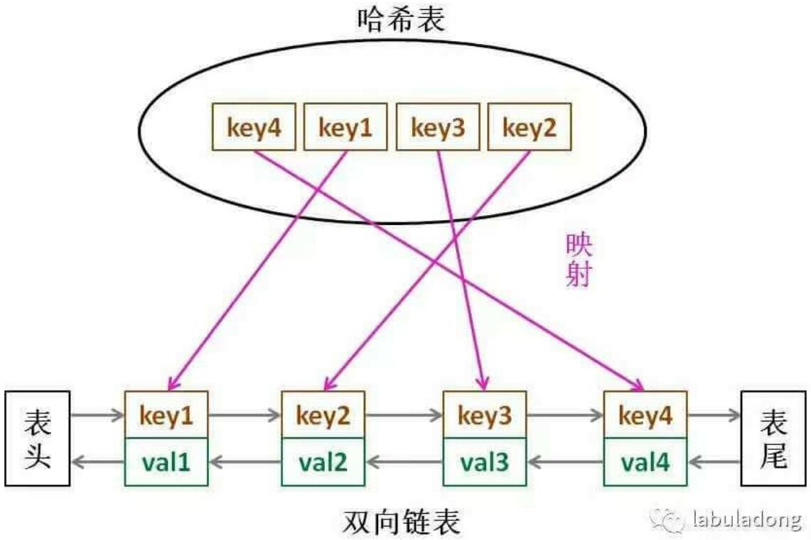

### 基础数据结构

#### 栈

##### 数组实现的栈

```java
package cn.dut.chapter1_3;

import java.util.Iterator;
import java.util.Scanner;

public class ResizingArrayStack<Item> implements Iterable<Item> {

    private Item[] elems = (Item[]) new Object[1];
    private Integer N = 0;

    void push(Item item) {
        if (N == elems.length) resize(2 * elems.length);
        elems[N] = item;
        N++;
    }

    Item pop() {
        if (isEmpty()) throw new RuntimeException("stack is empty!");
        Item popElem = elems[N - 1];
        elems[N - 1] = null;
        N--;
        if (N > 0 && N == elems.length / 4) resize(elems.length / 2);
        return popElem;
    }

    private void resize(int max) {
        Item[] temp = (Item[]) new Object[max];
        for (int i = 0; i < N; i++) {
            temp[i] = elems[i];
        }
        elems = temp;
    }

    boolean isEmpty() {
        return N == 0;
    }

    int size() {
        return N;
    }

    @Override
    public Iterator<Item> iterator() {
        return new ReverseArrayIterator();
    }

    private class ReverseArrayIterator implements Iterator<Item> {
        private int i = N;

        @Override
        public boolean hasNext() {
            return i > 0;
        }

        @Override
        public Item next() {
            return elems[--i];
        }
    }

    public static void main(String[] args) {
        ResizingArrayStack<String> s = new ResizingArrayStack<>();
        Scanner sc = new Scanner(System.in);
        while (sc.hasNext()) {
            String item = sc.next();
            if (!item.equals("-"))
                s.push(item);
            else if (!s.isEmpty())
                System.out.print(s.pop() + " ");
        }
        System.out.println("(" + s.size() + " left on stack)");
    }
}
```

* 数组实现的栈通过定义一个变量N，既表示当前容量，又用来取出栈顶元素（即索引为N-1）。

* 使用泛型实现不同类数据的封装。

* Java不支持泛型数组的创建，使用Object数组强制转换。

* push与pop方法对当前容量N进行判断，动态扩容或缩减容量。

* 实现iterable接口，覆盖iterator方法，使栈支持迭代操作。

* 使用内部类实现迭代器类（实现iterator接口），它可以访问栈的成员变量，覆盖hasNext和next方法。

  * hasNext方法检测当前节点是否为null。
  * next方法保存当前节点的值，并指向下一个节点。

* 优点：

  * 每项操作的用时与集合大小无关。
  * 空间需求不超过集合大小乘以一个常数。
  
* 缺点：
	* 动态调整数组大小时的赋值操作耗时与栈当前容量成正比。  

##### 链表实现的栈

```java
package cn.dut.chapter1_3;

import java.util.Iterator;
import java.util.Scanner;

public class ListStack<Item> implements Iterable<Item> {
    private Node first = null;
    private int N = 0;

    @Override
    public Iterator<Item> iterator() {
        return new Itr();
    }

    private class Itr implements Iterator<Item> {
        Node current = first;
        @Override
        public boolean hasNext() {
            return current != null;
        }

        @Override
        public Item next() {
            Item val = current.val;
            current = current.next;
            return val;
        }
    }
    private class Node {
        private Item val;
        private Node next;
    }

    public void push(Item item){
        Node oldFirst = first;
        first = new Node();
        first.val = item;
        first.next = oldFirst;
        N++;
    }
    public Item pop(){
        if (isEmpty()) throw new RuntimeException("stack is empty!");
        Node pop = first;
        first = first.next;
        pop.next = null;//为了垃圾回收
        N--;
        return pop.val;
    }
    public boolean isEmpty(){
        return first == null;
    }
    public int size(){
        return N;
    }

    public static void main(String[] args) {
        ListStack<String> s = new ListStack<>();
        Scanner sc = new Scanner(System.in);
        while (sc.hasNext()) {
            String item = sc.next();
            if (!item.equals("-"))
                s.push(item);
            else if (!s.isEmpty())
                System.out.print(s.pop() + " ");
        }
        System.out.println("(" + s.size() + " left on stack)");
    }
}
```

* 链表实现的栈具有一个头节点first，成员变量N表示当前容量。

* 使用泛型实现不同类数据的封装。

* 实现iterable接口，覆盖iterator方法，使栈支持迭代操作。

* 使用内部类实现迭代器类（实现iterator接口），它可以访问栈的成员变量，覆盖hasNext和next方法。

  * hasNext方法检测当前节点是否为null。
  * next方法保存当前节点的值，并指向下一个节点。

* 优点：

  * 每项操作的用时与集合大小无关。
  * 空间需求和集合大小成正比。

#### 背包

```java
package cn.dut.chapter1_3;

import java.util.Iterator;

public class Bag<Item> implements Iterable<Item> {
    private Node first;
    private int N;

    private class Node {
        Item item;
        Node next;

        public Node(Item item) {
            this.item = item;
        }
    }

    @Override
    public Iterator<Item> iterator() {
        return new Itr();
    }

    private class Itr implements Iterator<Item> {
        Node x = first;

        @Override
        public boolean hasNext() {
            return x != null;
        }

        @Override
        public Item next() {
            Item rtValue = x.item;
            x = x.next;
            return rtValue;
        }
    }

    public boolean isEmpty() {
        return N == 0;
    }

    public int size() {
        return N;
    }

    public void add(Item item) {
        Node oldFirst = first;
        first = new Node(item);
        first.next = oldFirst;
        N++;
    }
}
```

#### 链表实现的队列

```java
package cn.dut.chapter1_3;

import java.util.Iterator;
import java.util.Scanner;

public class ListQueue<Item> implements Iterable<Item> {
    private Node first;
    private Node last;
    private int N;

    @Override
    public Iterator<Item> iterator() {
        return new Itr();
    }

    private class Itr implements Iterator<Item>{
        Node current = first;

        @Override
        public boolean hasNext() {
            return current != null;
        }

        @Override
        public Item next() {
            Item val = current.val;
            current = current.next;
            return val;
        }
    }
    private class Node {
        private Item val;
        private Node next;
    }

    public void enqueue(Item item) {
        Node oldLast = last;
        last = new Node();
        last.val = item;
        if(isEmpty()) first = last;//添加第一个元素
        else oldLast.next = last;
        N++;
    }

    public Item dequque() {
        if (isEmpty()) throw new RuntimeException("queue is empty!");
        Node pop = first;
        first = first.next;
        pop.next = null;
        if(isEmpty()) last = null;//如果弹出后队列为空
        N--;
        return pop.val;
    }

    public boolean isEmpty() {
        return first == null;
    }

    public int size() {
        return N;
    }

    public static void main(String[] args) {
        ListQueue<String> s = new ListQueue<>();
        Scanner sc = new Scanner(System.in);
        while (sc.hasNext()) {
            String item = sc.next();
            if (!item.equals("-"))
                s.enqueue(item);
            else if (!s.isEmpty())
                System.out.print(s.dequque() + " ");
        }
        System.out.println("(" + s.size() + " left on queue)");
    }
}
```

* 链表实现的栈具有一个头节点first，一个尾节点last，成员变量N表示当前容量。
* 使用泛型实现不同类数据的封装。
* 入队操作需要判断是否添加的是第一个节点（因为与栈的元素添加顺序不同），出队操作需要判断出队后队列是否为空，维护尾节点。
  * 栈：
    * null
    * null ⬅ A
    * null ⬅ A ⬅ B
  * 队列：
    * null
    * A ➡ null
    * A ➡ B ➡ null
* 实现iterable接口，覆盖iterator方法，使栈支持迭代操作。
* 使用内部类实现迭代器类（实现iterator接口），它可以访问栈的成员变量，覆盖hasNext和next方法。

  * hasNext方法检测当前节点是否为null。
  * next方法保存当前节点的值，并指向下一个节点。
* 优点：

  * 每项操作的用时与集合大小无关。
  * 空间需求和集合大小成正比。

| 数据结构 |              优点              |             缺点             |
| :------: | :----------------------------: | :--------------------------: |
|   数组   |  通过索引可以直接访问任何元素  | 在初始化时需要知道元素的数量 |
|   链表   | 使用的空间大小和元素数量成正比 |   需要通过引用访问任意元素   |

#### 优先队列

##### 无序数组实现的优先队列

```Java
package cn.dut.chapter2_4;

import java.util.Arrays;
import java.util.Scanner;

public class MaxPQDisorderedArray<Key extends Comparable<Key>> {

    private Key[] elems;
    private int N = 0;

    public MaxPQDisorderedArray() {
        elems = (Key[]) new Comparable[1];
    }

    public MaxPQDisorderedArray(int max) {
        elems = (Key[]) new Comparable[max];
    }

    public MaxPQDisorderedArray(Key[] a) {
        elems = (Key[]) new Comparable[a.length];
        for (int i = 0; i < a.length; i++) {
            elems[i] = a[i];
        }
        N = a.length;
    }

    public void insert(Key v) {
        if (N == elems.length) resize(2 * N);
        elems[N++] = v;
    }

    public Key max() {
        if (isEmpty()) throw new RuntimeException("队列为空！");
        Key max = elems[0];
        for (int i = 1; i < N; i++)
            if (less(max, elems[i]))
                max = elems[i];
        return max;
    }

    public Key delMax() {
        if (isEmpty()) throw new RuntimeException("队列为空！");
        int maxIndex = 0;
        for (int i = 1; i < N; i++)
            if (less(elems[maxIndex], elems[i]))
                maxIndex = i;
        exch(N - 1, maxIndex);
        Key max = elems[N - 1];
        elems[N - 1] = null;
        N--;
        if (N > 0 && N == elems.length / 4) resize(elems.length / 2);
        return max;
    }

    private void resize(int sz) {
        Key[] temp = (Key[]) new Comparable[sz];
        for (int i = 0; i < N; i++) {
            temp[i] = elems[i];
        }
        elems = temp;
    }

    public boolean isEmpty() {
        return N == 0;
    }

    public int size() {
        return N;
    }

    private boolean less(Key v, Key w) {
        return v.compareTo(w) < 0;
    }

    private void exch(int i, int j) {
        Key t = elems[i];
        elems[i] = elems[j];
        elems[j] = t;
    }

    public static void main(String[] args) {
        MaxPQDisorderedArray<Integer> pq = new MaxPQDisorderedArray<>();
        Scanner sc = new Scanner(System.in);
        while (sc.hasNext()) {
            pq.insert(sc.nextInt());
        }
        System.out.println(Arrays.toString(pq.elems));
        System.out.println(pq.delMax());
        System.out.println(Arrays.toString(pq.elems));
    }
}
```

- 类似数组实现的栈，insert方法和push方法相同，即放入元素时不考虑顺序问题。删除最大元素时，delMax中加入一段找出最大元素索引的代码，然后将它和边界元素交换后删除即可。
- 对数组进行动态调整，保持当前容量为数组容量的一半左右。
- 构建泛型数组时使用父接口直接创建，然后强行转换。

##### 有序数组实现的优先队列

```Java
package cn.dut.chapter2_4;

import java.util.Arrays;
import java.util.Scanner;

public class MaxPQOrderedArray<Key extends Comparable<Key>> {

    private Key[] elems;
    private int N = 0;

    public MaxPQOrderedArray() {
        elems = (Key[]) new Comparable[1];
    }

    public MaxPQOrderedArray(int max) {
        elems = (Key[]) new Comparable[max];
    }

    public MaxPQOrderedArray(Key[] a) {
        elems = (Key[]) new Comparable[a.length];
        for (int i = 0; i < a.length; i++) {
            elems[i] = a[i];
        }
        N = a.length;
    }

    public void insert(Key v) {
        if (N == elems.length) resize(2 * N);

        if (isEmpty()) {
            elems[N] = v;
        } else {
            int i = N - 1;
            for (; i >= 0 && less(v, elems[i]); i--) {
                elems[i + 1] = elems[i];
            }
            elems[++i] = v;
        }
        N++;
    }

    public Key max() {
        if (isEmpty()) throw new RuntimeException("队列为空！");
        return elems[N - 1];
    }

    public Key delMax() {
        if (isEmpty()) throw new RuntimeException("队列为空！");
        Key max = elems[N - 1];
        elems[N - 1] = null;
        N--;
        if (N > 0 && N == elems.length / 4) resize(elems.length / 2);
        return max;
    }

    private void resize(int sz) {
        Key[] temp = (Key[]) new Comparable[sz];
        for (int i = 0; i < N; i++) {
            temp[i] = elems[i];
        }
        elems = temp;
    }

    public boolean isEmpty() {
        return N == 0;
    }

    public int size() {
        return N;
    }

    private boolean less(Key v, Key w) {
        return v.compareTo(w) < 0;
    }

    public static void main(String[] args) {
        MaxPQOrderedArray<Integer> pq = new MaxPQOrderedArray<>();
        Scanner sc = new Scanner(System.in);
        while (sc.hasNext()){
            pq.insert(sc.nextInt());
        }
        System.out.println(Arrays.toString(pq.elems));
        System.out.println(pq.delMax());
        System.out.println(Arrays.toString(pq.elems));
    }
}
```

- 类似数组实现的栈，插入元素时就考虑顺序问题，insert方法中加入一段类似插入排序的代码，保证边界元素始终为最大元素。delMax方法与pop方法相同。
- 对数组进行动态调整，保持当前容量为数组容量的一半左右。
- 构建泛型数组时使用父接口直接创建，然后强行转换。

##### 堆实现的优先队列

```java
package cn.dut.chapter2_4;

import java.util.Arrays;
import java.util.Scanner;

public class MaxPQHeap<Key extends Comparable<Key>> {

    private Key[] pq;
    private int N = 0;

    public MaxPQHeap() {
        pq = (Key[]) new Comparable[2];
    }

    public MaxPQHeap(int maxN) {
        pq = (Key[]) new Comparable[maxN + 1];
    }

    public MaxPQHeap(Key[] a) {
        pq = (Key[]) new Comparable[a.length + 1];
        for (int i = 0; i < a.length; i++) {
            pq[i + 1] = a[i];
            swim(i + 1);
        }
        N = a.length;
    }

    public void insert(Key v) {
        if (N == pq.length - 1) resize(2 * pq.length);
        pq[++N] = v;
        swim(N);
    }

    public Key max() {
        if (isEmpty()) throw new RuntimeException("队列为空！");
        return pq[1];
    }

    public Key delMax() {
        if (isEmpty()) throw new RuntimeException("队列为空！");
        Key max = pq[1];
        exch(1, N--);
        pq[N + 1] = null;
        sink(1);
        if (N > 0 && N == pq.length / 4) resize(pq.length / 2);
        return max;
    }

    private void swim(int k) {
        while (k > 1 && less(k / 2, k)) {
            exch(k / 2, k);
            k /= 2;
        }
    }

    private void sink(int k) {
        while (2 * k <= N) {
            int j = 2 * k;
            if (j < N && less(j, j + 1)) j++;
            if (!less(k, j)) break;
            exch(k, j);
            k = j;
        }
    }

    private void resize(int sz) {
        Key[] temp = (Key[]) new Comparable[sz];
        for (int i = 1; i <= N; i++) {
            temp[i] = pq[i];
        }
        pq = temp;
    }

    public boolean isEmpty() {
        return N == 0;
    }

    public int size() {
        return N;
    }

    private boolean less(int i, int j) {
        return pq[i].compareTo(pq[j]) < 0;
    }

    private void exch(int i, int j) {
        Key t = pq[i];
        pq[i] = pq[j];
        pq[j] = t;
    }

    public static void main(String[] args) {
        MaxPQHeap<Integer> pq = new MaxPQHeap<>();
        Scanner sc = new Scanner(System.in);
        while (sc.hasNext()){
            pq.insert(sc.nextInt());
        }
        System.out.println(Arrays.toString(pq.pq));
        System.out.println(pq.delMax());
        System.out.println(Arrays.toString(pq.pq));
    }
}
```

- 堆有序：每个节点大于等于它的两个子节点。
- 使用完全二叉树来表达一个二叉堆，可以使用数组表示，即将二叉树的节点按照层级顺序放入数组中，此时一个节点的父节点为k/2，子节点为2k和2k+1。从数组索引为1的位置开始放置元素。
- 由下至上的堆有序化操作，swim：如果某个节点比它的父节点更大，则需要通过交换这个两个节点来修复堆。这个操作需要循环进行，直到该节点遇到一个更大的父节点，此时堆有序。
- 由上至下的堆有序化操作，sink：如果某个节点比它的子节点更小，则需要通过交换这个两个节点来修复堆。交换的这个子节点首先选择左子节点，再检验其是否有右子节点且左子节点小于右子节点，如果是就选择右子节点进行交换。这个操作同样需要循环进行，直到该节点比其子节点都大时，堆有序。
- 对数组进行动态调整，保持当前容量为数组容量的一半左右。
- 构建泛型数组时使用父接口直接创建，然后强行转换。
- 对于优先队列的操作，插入操作每次将元素放在数组最后，然后执行一次swim保持堆有序；删除最大元素操作就是直接取出堆顶的元素，即索引为1的元素，将其与最后一个元素交换，并执行一次sink保持堆有序。


#### 符号表（双列集合）/查找算法

##### 链表实现的无序符号表

```java
package cn.dut.chapter3_1;

import edu.princeton.cs.algs4.StdIn;

import java.util.ArrayList;
import java.util.List;

public class SequentialSearchST<Key, Value> {

    private Node first;

    private class Node {
        private Key key;
        private Value val;
        private Node next;

        public Node(Key key, Value val, Node next) {
            this.key = key;
            this.val = val;
            this.next = next;
        }
    }

    public void put(Key key, Value val) {
        if (val == null) {
            delete(key);
            return;
        }
        Node head = first;
        while (head != null && !head.key.equals(key)) head = head.next;
        if (head != null) head.val = val;
        else {
            head = first;
            first = new Node(key, val, head);
        }

        /*for (Node x = first; x != null; x = x.next)
            if (key != null && key.equals(x.key)) {
                x.val = val;
                return;
            }
        first = new Node(key, val, first);*/
    }

    public Value get(Key key) {
        Node head = first;
        while (head != null && !head.key.equals(key)) head = head.next;
        if (head != null) return head.val;
        else return null;

        /*for (Node x=first;x!=null;x = x.next)
            if (key!=null&&key.equals(x.key))
                return x.val;
        return null;*/
    }

    public void delete(Key key) {
        if (isEmpty()) throw new RuntimeException("ST为空！");
        /*//弱删除
        put(key, null);*/
        //强删除
        if (first.key.equals(key)) {
            if (size() == 1) {
                first = null;
            } else {
                Node del = first;
                first = del.next;
                del.next = null;
            }
            return;
        }
        Node head = first;
        while (head != null) {
            if (head.next != null && !head.next.key.equals(key))
                head = head.next;
            else break;
        }
        if (head.next != null) {
            Node del = head.next;
            head.next = del.next;
            del.next = null;
        }
    }

    public boolean contains(Key key) {
        return get(key) != null;
    }

    public boolean isEmpty() {
        return size() == 0;
    }

    public int size() {
        Node head = first;
        int size = 0;
        while (head != null) {
            size++;
            head = head.next;
        }
        return size;
    }

    public Iterable<Key> keys() {
        List<Key> keys = new ArrayList<>();
        for (Node x = first; x != null; x = x.next) {
            keys.add(x.key);
        }
        return keys;
    }

    public static void main(String[] args) {
        SequentialSearchST<String, Integer> st = new SequentialSearchST<>();
        for (int i = 0; !StdIn.isEmpty(); i++) {
            String key = StdIn.readString();
            st.put(key, i);
        }
        for (String key : st.keys()) {
            System.out.println(key + " " + st.get(key));
        }
        System.out.println(st.size());
        st.delete("L");
        st.put("b", null);
        System.out.println("--------------");
        for (String key : st.keys()) {
            System.out.println(key + " " + st.get(key));
        }
        System.out.println(st.size());
    }
}
```

##### 基于二分查找使用数组实现的有序符号表

```java
package cn.dut.chapter3_1;

import edu.princeton.cs.algs4.StdIn;

import java.util.LinkedList;
import java.util.Queue;

public class BinarySearchST<Key extends Comparable<Key>, Value> {
    private Key[] keys;
    private Value[] vals;
    private int N;

    public BinarySearchST(int capacity) {
        keys = (Key[]) new Comparable[capacity];
        vals = (Value[]) new Comparable[capacity];
    }

    public int size() {
        return N;
    }

    public boolean isEmpty() {
        return N == 0;
    }

    public Value get(Key key) {
        if (isEmpty()) return null;//rank需要遍历数组，判断N为0可以加速
        int index = rank(key);
        if (index < N && keys[index].compareTo(key) == 0) return vals[index];
        else return null;
    }

    public int rank(Key key) {//使用二分查找找到key所在的位置/应该插入的位置
        int lo = 0, hi = N - 1;
        while (lo <= hi) {
            int mid = lo + (hi - lo) / 2;
            int cmp = key.compareTo(keys[mid]);
            if (cmp < 0) hi = mid - 1;
            else if (cmp > 0) lo = mid + 1;
            else return mid;//如果key存在则返回mid
        }
        return lo;//key不存在，它应该插入的位置正好为退出循环后的lo
    }

    public void put(Key key, Value val) {
        if (val == null) {//如果设置的值为null，就删除这个key
            delete(key);
            return;
        }
        if (N == keys.length) resize(2 * N);
        int index = rank(key);
        if (index < N && keys[index].compareTo(key) == 0) {//如果key已存在，修改它的值即可
            vals[index] = val;
            return;
        }
        for (int j = N; j > index; j--) {//key不存在，则从index索引开始整体往后挪一个位置
            keys[j] = keys[j - 1];
            vals[j] = vals[j - 1];
        }
        keys[index] = key;
        vals[index] = val;
        N++;
    }

    public boolean contains(Key key) {
        int i = rank(key);
        if (i < N && keys[i].compareTo(key) == 0) return true;
        else return false;
    }

    public void delete(Key key) {
        if (isEmpty()) throw new RuntimeException("符号表为空！");
        int i = rank(key);
        if (i < N && keys[i].compareTo(key) == 0) {//如果key存在才删除
            for (int j = i + 1; j < N; j++) {//将索引后面的元素整体往前挪一位即可
                keys[j - 1] = keys[j];
                vals[j - 1] = vals[j];
            }
            keys[N - 1] = null;
            vals[N - 1] = null;
            N--;
        }
        if (N > 0 && N == keys.length / 4) resize(keys.length / 2);
    }

    private void resize(int sz) {
        Key[] tempkeys = (Key[]) new Comparable[sz];
        Value[] tempvals = (Value[]) new Comparable[sz];
        for (int i = 0; i < N; i++) {
            tempkeys[i] = keys[i];
            tempvals[i] = vals[i];
        }
        keys = tempkeys;
        vals = tempvals;
    }

    public Key min() {
        return keys[0];
    }

    public Key max() {
        return keys[N - 1];
    }

    public Key floor(Key key) {//找小于等于key的键
        int i = rank(key);
        if (i < N && keys[i].compareTo(key) == 0) return keys[i];//如果要查找的key存在，则返回它
        if (i == 0) return null;//如果要查找的key比所有key都小，则返回null
        return keys[i - 1];//要查找的key不存在，并且它不是最小，则返回上一个key。
    }

    public Key ceiling(Key key) {//找大于等于key的键
        int i = rank(key);
        if (i == N) return null;//如果要查找的key比所有的key都大，则返回null
        return keys[i];//不管要查找的key存不存在，i索引处的key都满足条件。因为rank返回的就是key所在的位置/应该插入的位置，这个应该插入的位置刚好就是大于key的第一个键。
    }

    public Key select(int k) {
        if (k < 0 || k >= N) throw new RuntimeException("索引超出数组范围");
        return keys[k];
    }

    public void deleteMin() {
        delete(min());
    }

    public void deleteMax() {
        delete(max());
    }

    public int size(Key lo, Key hi) {
        if (hi.compareTo(lo) < 0) return 0;
        else if (contains(hi)) return rank(hi) - rank(lo) + 1;
        else return rank(hi) - rank(lo);
    }

    public Iterable<Key> keys(Key lo, Key hi) {
        Queue<Key> q = new LinkedList<>();
        for (int i = rank(lo); i < rank(hi); i++) {
            q.add(keys[i]);
        }
        if (contains(hi))
            q.add(keys[rank(hi)]);
        return q;
    }

    public Iterable<Key> keys() {
        return keys(min(), max());
    }

    public static void main(String[] args) {
        BinarySearchST<String, Integer> st = new BinarySearchST<>(1);
        for (int i = 0; !StdIn.isEmpty(); i++) {
            String key = StdIn.readString();
            st.put(key, i);
        }
        for (String key : st.keys()) {
            System.out.println(key + " " + st.get(key));
        }
    }
}
```

##### 二叉查找树实现的有序符号表

```java
package cn.dut.chapter3_1;

import edu.princeton.cs.algs4.StdIn;

import java.util.LinkedList;
import java.util.Queue;

public class BinarySearchTree<Key extends Comparable<Key>, Value> {

    private Node root;

    private class Node {
        private Key key;
        private Value val;
        private Node left;
        private Node right;
        private int N;

        public Node(Key key, Value val, int N) {
            this.key = key;
            this.val = val;
            this.N = N;
        }
    }

    public int size() {
        return size(root);
    }

    private int size(Node x) {
        if (x == null) return 0;
        else return x.N;
    }

    public Value get(Key key) {
        return get(key, root);
    }

    private Value get(Key key, Node x) {
        if (x == null) return null;
        int cmp = key.compareTo(x.key);
        if (cmp < 0) return get(key, x.left);
        else if (cmp > 0) return get(key, x.right);
        else return x.val;
    }

    public void put(Key key, Value val) {
        root = put(key, val, root);//这里必须给root赋值，第一次会更新root的地址，后续会更新root的信息。
    }

    private Node put(Key key, Value val, Node x) {//有返回值是为了修改N值，另外新节点需要进行连接，因此也需要返回。
        if (x == null) return new Node(key, val, 1);
        int cmp = key.compareTo(x.key);
        if (cmp < 0) x.left = put(key, val, x.left);//如果查找到了会走最后一条else，如果没查找到这里返回一个新节点，正好将其连接上
        else if (cmp > 0) x.right = put(key, val, x.right);
        else x.val = val;
        x.N = size(x.left) + size(x.right) + 1;
        return x;
    }

    public Key min() {
        return min(root).key;
    }

    private Node min(Node x) {
        if (x.left != null)
            return min(x.left);
        return x;
    }

    public Key max() {
        return max(root).key;
    }

    private Node max(Node x) {
        if (x.right != null)
            return max(x.right);
        return x;
    }

    public Key floor(Key key) {
        return floor(key, root).key;
    }

    private Node floor(Key key, Node x) {
        if (x == null) return null;
        int cmp = key.compareTo(x.key);
        if (cmp == 0) return x;
        else if (cmp < 0) return floor(key, x.left);
        Node t = floor(key, x.right);
        if (t != null) return t;
        else return x;
    }

        public Key ceiling(Key key) {
        return ceiling(key, root).key;
    }

    private Node ceiling(Key key, Node x) {
        if (x == null) return null;
        int cmp = key.compareTo(x.key);
        if (cmp == 0) return x;
        else if (cmp > 0) return ceiling(key, x.right);
        Node t = ceiling(key, x.left);
        if (t != null) return t;
        else return x;
    }
    
    public Key select(int k) {
        return select(k, root).key;
    }

    private Node select(int k, Node x) {
        if (x == null) return null;
        int numLeft = size(x.left);
        if (numLeft > k) return select(k, x.left);
        else if (numLeft < k) return select(k - numLeft - 1, x.right);
        else return x;
    }

    public int rank(Key key) {
        return rank(key, root);
    }

    private int rank(Key key, Node x) {
        if (x == null) return 0;
        int cmp = key.compareTo(x.key);
        if (cmp > 0) return 1 + size(x.left) + rank(key, x.right);
        else if (cmp < 0) return rank(key, x.left);
        else return size(x.left);
    }

    public void deleteMin() {
        deleteMin(root);
    }

    private Node deleteMin(Node x) {
        if (x.left == null)
            return x.right;
        x.left = deleteMin(x.left);
        x.N = size(x.left) + size(x.right) + 1;
        return x;
    }

    public void deleteMax() {
        deleteMax(root);
    }

    private Node deleteMax(Node x) {
        if (x.right == null)
            return x.left;
        x.right = deleteMin(x.right);
        x.N = size(x.left) + size(x.right) + 1;
        return x;
    }

    public void delete(Key key) {
        root = delete(key, root);
    }

    private Node delete(Key key, Node x) {
        if (x == null) return null;
        int cmp = key.compareTo(x.key);
        if (cmp < 0) x.left = delete(key, x.left);
        else if (cmp > 0) x.right = delete(key, x.right);
        else {
            if (x.right == null) return x.left;
            if (x.left == null) return x.right;
            Node t = x;
            x = min(t.right);
            x.right = deleteMin(t.right);
            x.left = t.left;
        }
        x.N = size(x.left) + size(x.right) + 1;
        return x;
    }

    public Iterable<Key> keys() {
        return keys(min(), max());
    }

    public Iterable<Key> keys(Key lo, Key hi) {
        Queue<Key> queue = new LinkedList<>();
        keys(root, queue, lo, hi);
        return queue;
    }

    private void keys(Node x, Queue<Key> queue, Key lo, Key hi) {//类似于中序遍历
        if (x == null) return;
        int cmplo = lo.compareTo(x.key);
        int cmphi = hi.compareTo(x.key);
        if (cmplo < 0) keys(x.left, queue, lo, hi);//在到达lo节点之前遍历左子树
        if (cmplo <= 0 && cmphi >= 0) queue.add(x.key);//如果该节点在lo和hi之间，将其加入队列
        if (cmphi > 0) keys(x.right, queue, lo, hi);//在到达hi节点之前遍历右子树
    }

    public static void main(String[] args) {
        BinarySearchTree<String, Integer> st = new BinarySearchTree<>();
        for (int i = 0; !StdIn.isEmpty(); i++) {
            String key = StdIn.readString();
            st.put(key, i);
        }
        System.out.println(st.keys("A","T"));
        for (String key : st.keys()) {
            System.out.println(key + " " + st.get(key));
        }
    }
}
```

- 二叉查找树每个节点都有一个可以比较的键和相关的值，且每个节点的键都大于其左子树中任意节点的键而小于右子树的任意节点的键。

- 递归的形象理解：为什么叫递归树，递归调用前的代码为沿着树往下走，递归调用后的代码为沿着树往上爬。

- 查找的递归算法：如果树是空的，则查找未命中；如果被查找的键和根节点的键相等，查找命中，否则就递归地在适当的子树中继续查找，如果被查找的键较小就选择左子树，较大则选择右子树。

  

- 插入的递归算法：如果树是空的，就返回一个含有该键值对的新节点；如果被查找的键和根节点的键相等，就更改节点的值。如果被查找的键小于根节点的键，就递归地在左子树中插入该键，否则在右子树中插入该键。

  

- 最小键的递归算法：如果根节点的左链接为空，则最小键就是根节点；如果左链接非空，那么最小键就是左子树中的最小键。

- 向下取整的递归算法：如果给定的键key小于二叉查找树的根节点的键，那么小于等于key的最大键一定在根节点的左子树中；如果给定的键大于二叉查找树的根节点，那么只有当根节点右子树中存在小于等于key的节点时，小于等于key的最大键才会出现在右子树中，否则根节点就是小于等于key的最大键。

  

- 选择操作的递归算法：找排名为k的键，如果左子树中的节点数t大于k，就递归地在左子树中查找排名为k的键；如果t等于k，就返回根节点的键；如果t小于k，就递归地在右子树中查找排名为(k-t-1)的键。

  

- 排名的递归算法：选择的逆操作，如果给定的键和根节点的键相等，返回左子树中的节点总数t；如果给定的键小于根节点，递归地返回该键在左子树中的排名；如果给定的键大于根节点，递归地返回t+1加上它在右子树中的排名。

- 删除最小键的递归算法：不断深入根节点的左子树中，直到遇见一个空链接，然后将指向该节点的链接指向它的右子树。

  

- 删除的递归算法：如果被删除的节点左子树（右子树）为空，直接返回其右子树（左子树）；否则使用被删除节点右子树中的最小节点替换该节点，这样仍然能保证树的有序性。具体过程为

  1. 将指向被删除节点x的链接保存为t；
  2. 将x保存为它的后继节点，即min(t.right)；
  3. 将x的右链接指向deleteMin(t.right)，即后继节点的父节点；
  4. 将x的左链接设为t.left。

  

- 范围查找的递归算法：采用中序遍历来遍历树，即首先遍历满足条件的节点的左子树，然后使用队列（Queue）将满足条件的节点的键加入队列，然后遍历满足条件的节点的右子树。

  

##### 红黑树实现的有序符号表

```java
package cn.dut.chapter3_1;

public class RedBlackTree<Key extends Comparable<Key>, Value> {
    private static final boolean RED = true;
    private static final boolean BLACK = false;

    private Node root;

    private class Node {
        Key key;    //键
        Value val;  //值
        Node left;  //左子节点
        Node right; //右子节点
        int N;  //该节点的节点数量
        boolean color;  //其父节点指向该节点的链接颜色

        public Node(Key key, Value val, int N, boolean color) {
            this.key = key;
            this.val = val;
            this.N = N;
            this.color = color;
        }
    }

    private boolean isRED(Node x) {
        if (x == null) return false;
        else return x.color == RED;
    }

    private int size(Node x) {
        if (x == null) return 0;
        else return x.N;
    }

    private void flipColors(Node h) {
        h.color = RED;
        h.left.color = BLACK;
        h.right.color = BLACK;
    }

    private Node rotateLeft(Node h) {
        Node x = h.right;
        h.right = x.left;
        x.left = h;
        x.color = h.color;
        h.color = RED;
        x.N = h.N;
        h.N = 1 + size(h.left) + size(h.right);
        return x;
    }

    private Node rotateRight(Node h) {
        Node x = h.left;
        h.left = x.right;
        x.right = h;
        x.color = h.color;
        h.color = RED;
        x.N = h.N;
        h.N = 1 + size(h.left) + size(h.right);
        return x;
    }

    public Value get(Key key) {
        if (key == null) throw new RuntimeException("key is null");
        return get(root, key);
    }

    private Value get(Node x, Key key) {
        if (x == null) return null;
        int cmp = key.compareTo(x.key);
        if (cmp < 0) return get(x.left, key);
        else if (cmp > 0) return get(x.right, key);
        else return x.val;
    }

    public void put(Key key, Value val) {
        if (key == null) throw new RuntimeException("key is null");
        root = put(root, key, val);
        root.color = BLACK;
    }

    private Node put(Node x, Key key, Value val) {
        if (x == null) return new Node(key, val, 1, RED);//新节点是直接返回的，因此下边处理链接颜色的时候是从这个新节点的父节点开始的
        int cmp = key.compareTo(x.key);
        if (cmp < 0) x.left = put(x.left, key, val);
        else if (cmp > 0) x.right = put(x.right, key, val);
        else x.val = val;
        //这三步操作是对同一个节点一起进行的，但是必须为该顺序关系
        if (isRED(x.right) && !isRED(x.left))
            x = rotateLeft(x);
        if (isRED(x.left) && isRED(x.left.left))//先判断x.left，如果它为null第一项返回false，判断就结束了。它部位null的时候第二项一定不会出现空指针异常
            x = rotateRight(x);
        if (isRED(x.left) && isRED(x.right))
            flipColors(x);
        x.N = 1 + size(x.left) + size(x.right);
        return x;
    }
}

```

- 红黑树的定义是含有红黑链接并满足以下条件的二叉查找树：
  - 红链接均为左链接；
  - 没有任何一个节点同时和两条红链接相连；
  - 该树是完美黑色平衡的，即任意空链接到根节点的路径上的黑链接数量相同。

- 节点中定义一个布尔变量color，如果指向它的链接是红色的，就用true表示，黑色则为false。

- 旋转：解决出现红色右链接或两条连续的红链接的情况。

  

- 插入：沿着插入点到根节点的路径向上移动时，在所经过的每个节点中顺序完成以下操作，就能完成插入操作：

  - 如果右子节点是红色的，而左子节点是黑色的，进行左旋转；
  - 如果左子节点是红色的，且它的左子节点也是红色的，进行右旋转；
  - 如果左右子节点均为红色，进行颜色转换。

  

- 删除操作太难了，先放弃。

各种符号表的性能：


##### B-树

- 当数据量太大以至于无法将数据读入内存中或树的深度过大时，二叉树查找需要进行大量的磁盘I/O操作，导致查询效率低下。因此B-树采用多叉树的结构减少树的深度，从而减少磁盘I/O操作的次数。它更好地支持对保存在磁盘或者网络上的符号表进行外部查找，即不将数据保存在树中（不将要查询的数据以树形结构读入内存中），而是构造一棵由键的副本组成的树，每个副本都关联着一条链接。

- 选择一个参数M构造一棵多向树，每个节点最多含有M-1对键和链接最少含有M/2对键和链接；根节点可以含有少于M/2对键和链接，但不能少于2对。

- 外部查找的应用常常将会将索引和数据隔离，B-树通过两种不同类型的节点做到这一点：

  - 内部节点：含有与页相关联的键的副本。
  - 外部节点：含有指向实际数据的引用（如磁盘地址）。

  

  含有*的都是内部节点。

- B-树的性能：在实际应用中选择适当的参数M，查找的成本是常数级别的。

##### 基于拉链的散列表

```java
package cn.dut.chapter3_1;

import java.util.ArrayList;
import java.util.List;

public class SeparateChainingHashST<Key, Value> {
    private int N; //键值对总数
    private int M; //散列表的大小
    private SequentialSearchST<Key, Value>[] st; //存放链表对象的数组

    public SeparateChainingHashST() {
        this(997);
    }

    public SeparateChainingHashST(int M) {
        this.M = M;
        st = (SequentialSearchST<Key, Value>[]) new SequentialSearchST[M];//使用强制转换创建泛型数组
        for (int i = 0; i < M; i++) {
            st[i] = new SequentialSearchST<>();//初始化散列表中每一条链表
        }
    }

    private int hash(Key key) {
        return (key.hashCode() & 0x7fffffff) % M;//屏蔽符号位，避免出现负数索引
    }

    public Value get(Key key) {
        if (key == null) throw new RuntimeException("key is null.");
        return st[hash(key)].get(key);
    }

    public void put(Key key, Value val) {
        if (key == null) throw new RuntimeException("key is null.");
        st[hash(key)].put(key, val);
        N++;
    }

    public void delete(Key key) {
        if (key == null) throw new RuntimeException("key is null.");
        st[hash(key)].delete(key);
        N--;
    }

    public int size() {
        return N;
    }
    
    public Iterable<Key> keys() {
        List<Key> keys = new ArrayList<>();
        for (int i = 0; i < st.length; i++) {
            for (Key key : st[i].keys()) {
                keys.add(key);
            }
        }
        return keys;
    }
}
```

- 将大小为M的数组中的每一个元素指向一条链表，链表中每个节点存储散列值为该元素的索引的键值对。尽可能选择大的M，使得所有链表都尽可能短，保证高效的查找。

- 链表的平均长度为N/M，未命中和插入操作所需的比较次数为~N/M。
- 保存链表的数组也可以进行动态调整，以保证链表的长度较短。

##### 基于线性探测的散列表

```java
package cn.dut.chapter3_1;

import java.util.HashSet;
import java.util.List;
import java.util.Set;

public class LinearProbingHashST<Key, Value> {

    private Key[] keys;
    private Value[] vals;
    private int N; //键值对总数
    private int M = 16; // 线性探测表大小

    public LinearProbingHashST() {
        keys = (Key[]) new Object[M];
        vals = (Value[]) new Object[M];
    }

    public LinearProbingHashST(int cap) {
        M = cap;
        keys = (Key[]) new Object[M];
        vals = (Value[]) new Object[M];
    }

    /*//这样只靠复制数组的resize会造成新数组中前一半占满了而后一半没有使用
    private void resize(int sz) {
        Key[] keytemp = (Key[]) new Object[sz];
        Value[] valtemp = (Value[]) new Object[sz];

        for (int i = 0; i < M; i++) {
            if (keys[i] != null) {
                keytemp[i] = keys[i];
                valtemp[i] = vals[i];
            }
        }

        keys = keytemp;
        vals = valtemp;
        M = sz;
    }*/

    private void resize(int sz) {
        LinearProbingHashST<Key, Value> t = new LinearProbingHashST<>(sz);

        for (int i = 0; i < M; i++)
            if (keys[i] != null)
                t.put(keys[i], vals[i]);

        keys = t.keys;
        vals = t.vals;
        M = t.M;
        //N仍然是当前键值对的数目
    }

    private int hash(Key key) {
        return (key.hashCode() & 0x7fffffff) % M;
    }


    public Value get(Key key) {
        if (key == null) throw new RuntimeException("key is null.");
        int i = hash(key);
        while (keys[i] != null) { //注意这个循环包括put里面的循环能结束的根本原因是存在扩容，所以一定会出现为空的情况。
            if (keys[i].equals(key))
                return vals[i];
            i = (i + 1) % M;
        }
        return null;
    }

    public void put(Key key, Value val) {
        if (key == null) throw new RuntimeException("key is null.");
        if (val == null) {
            delete(key);
            return;
        }
        if (N >= M / 2) resize(2 * M);
        int i = hash(key);
        while (keys[i] != null) { //出现冲突时，当前索引下的键一定不是null
            if (keys[i].equals(key)) { //因此需要往后移动，判断有没有和当前key相同的键
                vals[i] = val;
                return;
            }
            i = (i + 1) % M;
        }
        keys[i] = key;
        vals[i] = val;
        N++;
    }

    public void delete(Key key) {
        if (!contains(key)) return;

        int i = hash(key);
        while (!keys[i].equals(key)) {
            i = (i + 1) % M;
        }
        keys[i] = null;
        vals[i] = null;
        N--;
        i = (i + 1) % M;
        while (keys[i] != null) {//将指定的key和val删除后，它右侧的一串元素，直到遇到空为止，都需要重新放回探测表。
            Key keyRedo = keys[i];
            Value valRedo = vals[i];
            keys[i] = null;
            vals[i] = null;
            N--;
            put(keyRedo, valRedo);
            i = (i + 1) % M;
        }
        if (N > 0 && N <= M / 8) resize(M / 2);
    }

    public int size() {
        return N;
    }
    
    public boolean contains(Key key) {
        if (key == null) return false;
        int i = hash(key);
        while (keys[i] != null) {
            if (keys[i].equals(key))
                return true;
            i = (i + 1) % M;
        }
        return false;
    }

    public Iterable<Key> keys() {
        Set<Key> keys = new HashSet<>();
        for (int i = 0; i < M; i++) {
            if (this.keys[i] != null)
                keys.add(this.keys[i]);
        }
        return keys;
    }
}
```

- 用大小为M的并行数组保存N个键值对，其中M>N，使用数组中的空位解决冲突，称为开放地址散列表。
- 发生冲突时，直接检查下一个位置，可能有三种情况：命中（相同）、未命中（为空）、继续查找（不相同）。
- 删除时需要将被删除键右侧的元素重新放回散列表，因为直接删除会导致后面的元素无法被查找。
- 线性探测散列表的使用率为$\alpha=N/M$，它不能达到1，即散列表不能被占满，因为此时未命中的查找会导致无限循环。而命中和未命中所需的探测次数分别约为$\frac{1}{2}(1+\frac{1}{1-\alpha})$和$~\frac{1}{2}(1+\frac{1}{(1-\alpha)^2})$。
- 由于上一条原因，$\alpha$不能达到1，也不能太高，因此线性探测散列表的实现必须动态调整数组大小，以保证使用率不超过$1/2$，此时命中和未命中所需的探测次数约为1.5和2.5次。

散列表是在时间和空间上做出权衡的典型算法，它分为两步，第一步是用散列函数将被查找的键转化为数组的一个索引，第二步是处理冲突。

散列函数：

- 正整数：除留余数法，使用素数使散列值的分布更好。

- 浮点数：将键表示为二进制数，然后使用除留余数法。

- 字符串：将字符串当作一个N位的R进制值，将它除以M并取余。

  ```java
  int hash = 0;
  for (int i = 0; i < s.length; i++)
  	hash = (R * hash + s.charAt(i)) % M;
  ```

对于组合键，如日期、字符串，尽可能使用每一部分信息。

两种解决冲突的方法：拉链法和线性探测法。

散列表的局限性：

- 每种类型的键都需要一个优秀的散列函数；
- 性能保证来自于散列函数的质量；
- 散列函数的计算可能复杂且昂贵；
- 难以支持有序性的符号表操作。

##### R向单词查找树

```java
package cn.dut.chapter5_2;

import java.util.LinkedList;
import java.util.Queue;

public class TrieST<Value> {
    private static int R = 256;
    private Node root;

    private static class Node {
        //不加static它是一个普通的内部类，这样创建数组时因为外部类带有泛型，导致内部类也不能创建类型为自己的数组
        //但加上static后它相当于一个普通类，泛型又不能从外部进入静态域，变量val只能用Object类型替代。
        private Object val;
        private Node[] next = new Node[R];
    }

    public Value get(String key) {
        if (key == null) throw new RuntimeException("key is null");
        Node x = get(root, key, 0);
        if (x == null) return null;
        return (Value) x.val;
    }

    private Node get(Node x, String key, int d) {
        if (x == null) return null;
        //注意get中不用判断该节点是否有值，只要查找到key的末尾，说明单词树中确实存在要查找的字符串，
        //但是只有这个节点在创建单词树的时候赋了值，它才是我们主观上认为存在的。
        if (d == key.length()) return x;
        char c = key.charAt(d);
        return get(x.next[c], key, d + 1);
    }

    public void put(String key, Value val) {
        if (key == null) throw new RuntimeException("key is null");
        if (val == null) {
            delete(key);
            return;
        }
        root = put(root, key, val, 0);
    }

    private Node put(Node x, String key, Value val, int d) {
        //没有就创建一个新的节点，但是并不立即返回
        if (x == null) x = new Node();
        //判断是否已经到达key的末尾，如果是就赋新值或修改值，并直接返回。
        if (d == key.length()) {
            x.val = val;
            return x;
        }
        //否则继续查找下一个字符
        char c = key.charAt(d);
        //通过返回的节点赋值给当前节点的节点数组中对应的位置完成树的构造
        x.next[c] = put(x.next[c], key, val, d + 1);
        return x;
    }

    private void delete(String key) {
        if (key == null) throw new RuntimeException("key is null");
        root = delete(root, key, 0);
    }

    /*private Node delete(Node x, String key, int d) {
        if (x == null) return null;
        if (d == key.length() && x.val != null) {
            x.val = null;
            return x;
        }
        if (d == key.length()) return x;
        char c = key.charAt(d);
        x.next[c] = delete(x.next[c], key, d + 1);
        for (char i = 0; i < R; i++)//这四行返回代码一定是对每个节点要用的，而且是在递归调用之后，沿节点返回时如果它没有子节点就直接返回null将它删除掉
            if (x.next[i] != null)
                return x;
        return null;
    }*/


    private Node delete(Node x, String key, int d) {
        if (x == null) return null;
        if (d == key.length()) x.val = null;//只要到达了字符串末尾（即找到了要查找的key），并不用管它到底有没有值，直接设成null就行。如果找不到也不会执行这一步，因为早就返回null了。
        else {//在没有查找到之前一直递归往下搜索
            char c = key.charAt(d);
            x.next[c] = delete(x.next[c], key, d + 1);
        }
        //下面的代码写在递归调用后，即逐层往上对每个结点的操作，这样如果某个节点被删除掉之后导致父节点也没有子节点了，这样对父节点也会进行删除操作。
        //如果这个节点本身有值，即这个字符串还要用，那就返回节点
        if (x.val != null) return x;
        //如果它没有值，还没有子节点就直接返回null将它删除掉，有子节点说明可能由其他要用的字符串，就返回节点。
        for (char i = 0; i < R; i++)
            if (x.next[i] != null)
                return x;
        return null;
    }

    public Iterable<String> keys() {
        return keysWithPrefix("");
    }

    private Iterable<String> keysWithPrefix(String pre) {
        Queue<String> queue = new LinkedList<>();
        collect(queue, get(root, pre, 0), pre);//需要先获取到前缀字符串pre所对应的节点，即找到前缀所对应的子树
        return queue;
    }

    private void collect(Queue<String> q, Node x, String pre) {
        if (x == null) return;
        //找到一个节点的值不为空，则将当前保存下来的字符串pre添加到队列中
        if (x.val != null) q.add(pre);
        //对每一个节点的链接数组的每一个节点进行递归搜索
        for (char c = 0; c < R; c++)
            collect(q, x.next[c], pre + c);//将字符c添加进字符串中
    }

    public Iterable<String> keysThatMatch(String pat) {
        Queue<String> queue = new LinkedList<>();
        collect(queue, root, "", pat);
        return queue;
    }

    private void collect(Queue<String> queue, Node x, String pre, String pat) {
        int d = pre.length();//首先获取当前节点对应的字符串pre的长度，在开始时它是0，随着逐渐添加进来新的字符，长度逐渐变大
        if (x == null) return;
        if (d == pat.length() && x.val != null) queue.add(pre);//如果与模式字符串匹配，且当前字符串pre确实有值，就加到队列中
        if (d == pat.length()) return;//如果与模式字符串匹配，但当前字符串pre没有值，即它并不是一个有效的字符串，就直接返回
        char next = pat.charAt(d);//模式字符串当前要搜索的字符，由pre的长度来进行控制
        for (char c = 0; c < R; c++)
            if (next == '.' || next == c)//只有通配符以及要搜索的字符才接着递归collect
                collect(queue, x.next[c], pre + c, pat);
    }

    public String longestPrefixOf(String s) {
        int length = search(root, s, 0, 0);//通过找到最长前缀的长度，然后用substring获得字符串
        return s.substring(0, length);
    }

    private int search(Node x, String s, int d, int length) {
        if (x == null) return 0;
        if (x.val != null) length = d;//只要当前节点有值，那就先把长度记录下来，只有有值的节点才可能是最长前缀
        if (d == s.length()) return length;//如果到达了字符串末尾，那就直接返回当前记录下来的length，即最近一次记录下来的length
        char c = s.charAt(d);//没有到达末尾就根据s的下一个字符继续往下搜索
        return search(x.next[c], s, d + 1, length);
    }

    public int size() {
        return size(root);
    }

    private int size(Node x) {
        if (x == null) return 0;
        int cnt = 0;
        if (x.val != null) cnt++;
        for (char c = 0; c < R; c++)
            cnt += size(x.next[c]);
        return cnt;
    }


    public static void main(String[] args) {
        String s = "";
        char c = 65;
        System.out.println(s + c);
    }

}
```

- 每个节点只有一个指向它的节点，它自己含有R条链接，对应含有R个字符的字母表。

- 值为空的节点在符号表中没有对应的键，它们的存在是为了简化单词查找树中的查找操作。

  

- 字符和键隐式地保存在数据结构中，通过索引0至R-1隐式地表示每个每个字符。

- 查找示例：

  

- 插入示例：

  

- 查找所有键：维护一个字符串，保存从根节点出发的路径上的一系列字符。

  

  查找指定前缀的键：首先调用查找方法找到前缀所对应的节点位置，然后从该节点开始查找所有键。

  

- 删除：首先找到键所对应的节点并将它的值设为null。如果该节点含有一个非空的链接指向某个节点，那么就不需要再进行其他操作。如果它的所有链接均为null，那就从树中删除这个节点。如果删除这个节点导致它的父节点的所有链接均为null，那就继续删除它的父节点。

  

- 优点：查找命中与未命中所需要的时间成本非常小。缺点：字符表较大时，键的数量和长度两个因素会使单词查找树占用巨大的空间。

- 针对缺点的解决方案：三向单词查找树。它同时具有的优点是能够很好地适应实际应用中可能出现的被查找键的不规则性。

##### 跳表（只包含键的简化版)

```java
package cn.dut.chapter1_3;

import java.util.Arrays;
import java.util.Random;

public class SkipList {

    private static final int MAX_LEVEL = 16;//最大索引层数，算上最底层的链表
    private int levelCount = 1;//当前的层数
    private Node head = new Node();//头节点
    private Random random = new Random();

    public Node find(int value) {
        Node p = head;
        for (int i = levelCount - 1; i >= 0; i--) {
            while (p.next[i] != null && p.next[i].data < value)
                p = p.next[i];
        }
        if (p.next[0] != null && p.next[0].data == value)
            return p.next[0];
        else
            return null;
    }

    /**
     * 首先通过随机函数计算该节点出现的层级，然后找到每一层要插入位置的前一个节点，然后更新连接。
     *
     * @param value
     */
    public void insert(int value) {
        int level = randomLevel();
        Node newNode = new Node(value, level);

        Node[] update = new Node[level];
        Arrays.fill(update, head);

        Node p = head;
        for (int i = level - 1; i >= 0; i--) {
            while (p.next[i] != null && p.next[i].data < value)
                p = p.next[i];
            update[i] = p;//找到每一层要插入位置的前一个节点
        }

        for (int i = 0; i < level; i++) {
            newNode.next[i] = update[i].next[i];
            update[i].next[i] = newNode;
        }

        if (levelCount < level) levelCount = level;
    }

    /**
     * 首先找到每一层要插入位置的前一个节点，然后更新连接。
     *
     * @param value
     */
    public void delete(int value) {
        Node[] update = new Node[levelCount];
        Node p = head;
        for (int i = levelCount - 1; i >= 0; i--) {
            while (p.next[i] != null && p.next[i].data < value)
                p = p.next[i];
            update[i] = p;//找到每一层要删除位置的前一个节点
        }

        if (p.next[0] != null && p.next[0].data == value) {
            for (int i = levelCount - 1; i >= 0; i--) {
                if (update[i].next[i] != null && update[i].next[i].data == value)
                    update[i].next[i] = update[i].next[i].next[i];
            }
        }
    }

    private int randomLevel() {
        int level = 1;
        for (int i = 1; i < MAX_LEVEL; i++) {
            if (random.nextInt() % 2 == 1) level++;
        }
        return level;
    }

    private class Node {
        private int data = -1;
        private Node[] next = new Node[MAX_LEVEL];
        private int maxLevel = 0;//该节点所在的最高层数

        public Node() {
        }

        public Node(int data, int maxLevel) {
            this.data = data;
            this.maxLevel = maxLevel;
        }

        @Override
        public String toString() {
            StringBuilder builder = new StringBuilder();
            builder.append("{data:");
            builder.append(data);
            builder.append("; leves: ");
            builder.append(maxLevel);
            builder.append(" }");
            return builder.toString();
        }
    }
}
```


- 节点定义中，包含一个节点数组，记录每一层的下一个节点地址，一个变量，记录当前节点出现的最高层数。

  ```
  例如节点4：
  next = {5，6，6，null}
  maxLevel = 2
  ```

#### 图

##### 无向图

```java
package cn.dut.chapter4_1;

import cn.dut.chapter1_3.Bag;
import java.util.Scanner;

public class Graph {

    private final int V;    //顶点数目
    private int E;  //边的数目
    private Bag<Integer>[] adj; //邻接表

    public Graph(int V) {
        this.V = V;
        this.E = 0;
        adj = (Bag<Integer>[]) new Bag[V];//构造并初始化邻接表
        for (int i = 0; i < V; i++) {
            adj[i] = new Bag<>();
        }
    }

    public Graph(Scanner sc) {
        this(sc.nextInt()); //第一个数为顶点数目，初始化图
        int E = sc.nextInt();   //第二个数为边的数目
        for (int i = 0; i < E; i++) {   //读入两个顶点，为它们添加边
            int v = sc.nextInt();
            int w = sc.nextInt();
            addEdge(v, w);
        }
    }

    public int V() {
        return V;
    }

    public int E() {
        return E;
    }

    public void addEdge(int v, int w) {
        adj[v].add(w);
        adj[w].add(v);
        E++;
    }

    public Iterable<Integer> adj(int v) {
        return adj[v];
    }

    /*public int degreeOwn(int v) {
        return adj[v].size();
    }*/

    /*public static int degree(Graph G, int v) {
        return G.adj[v].size();
    }*/

    public static int degree(Graph G, int v) {
        int degree = 0;
        for (int w : G.adj(v)) degree++;
        return degree;
    }

    public static int maxDegree(Graph G) {
        int maxDegree = 0;
        for (int v = 0; v < G.V(); v++) {
            int degree = Graph.degree(G, v);
            if (degree > maxDegree)
                maxDegree = degree;
        }
        return maxDegree;
    }

    public static double avgDegree(Graph G) {
        return 2 * G.E() / G.V(); //顶点会参与两次addEdge
    }

    public static int numberOfSelfLoops(Graph G) {//自环个数
        int count = 0;
        for (int v = 0; v < G.V(); v++)
            for (int w : G.adj(v))
                if (v == w) count++;
        return count / 2;//添加自环的时候addEdge也会调用两次
    }

    @Override
    public String toString() {
        String s = V + " vertices, " + E + " edges.\n";
        for (int v = 0; v < V(); v++) {
            s += v + ": ";
            for (int w : adj(v))
                s += w + " ";
            s += "\n";
        }
        return s;
    }
}
```

- 图的几种表示方法：
  - 邻接矩阵：V乘V的布尔矩阵。
  - 边的数组：一个Edge类的数组，类中定义两个int变量。
  - 邻接表数组：以顶点为索引的数组，每个元素为一个链表，含有与该顶点相邻的节点。

##### 符号无向图

```java
package cn.dut.chapter4_1;

import cn.dut.chapter3_1.LinearProbingHashST;

import java.io.File;
import java.io.FileNotFoundException;
import java.util.Scanner;

public class SymbolGraph {
    private LinearProbingHashST<String, Integer> st;	//符号名 - 索引
    private String[] keys;	//索引 - 符号名
    private Graph G;

    public SymbolGraph(String filename, String delim) {	//文件路径与分隔符
        Scanner sc = null;
        try {
            sc = new Scanner(new File(filename));
        } catch (FileNotFoundException e) {
            e.printStackTrace();
        }
        st = new LinearProbingHashST<>();	
        while (sc.hasNextLine()) {	//读入一行
            String[] a = sc.nextLine().split(delim);	//将这行按照分隔符分割
            for (int i = 0; i < a.length; i++)	//将出现的非重复的字符串加入符号表
                if (!st.contains(a[i]))
                    st.put(a[i], st.size());	//使用符号表的大小动态变化来作为每个键的索引
        }
		//此时符号表的大小就是图含有的节点数
        keys = new String[st.size()];
        for (String key : st.keys()) {	//反向索引，通过索引（值）获取键
            keys[st.get(key)] = key;
        }

        G = new Graph(st.size());
        try {
            sc = new Scanner(new File(filename));
        } catch (FileNotFoundException e) {
            e.printStackTrace();
        }
        while (sc.hasNextLine()) {	//读入一行
            String[] a = sc.nextLine().split(delim);	//将这行按照分隔符分割
            int v = st.get(a[0]);	//将第一个顶点与其他顶点相连。
            for (int i = 1; i < a.length; i++) {
                G.addEdge(v, st.get(a[i]));
            }
        }
    }

    public boolean contains(String s) {
        return st.contains(s);
    }

    public int index(String s) {
        return st.get(s);
    }

    public String name(int v) {
        return keys[v];
    }

    public Graph G() {
        return G;
    }

    public static void main(String[] args) {
        String filename = "./data/routes.txt";
        String delim = " ";
        SymbolGraph sg = new SymbolGraph(filename, delim);
        Graph G = sg.G();

        Scanner sc = new Scanner(System.in);
        while (sc.hasNext()) {
            String source = sc.next();
            for (int w : G.adj(sg.index(source))) {
                System.out.println("    " + sg.name(w));
            }
        }
    }
}
```


##### 有向图

```java
package cn.dut.chapter4_1;

import cn.dut.chapter1_3.Bag;

import java.util.Scanner;

public class Digraph {

    private Bag<Integer>[] adj;
    private int E;
    private final int V;

    public Digraph(int V) {
        this.V = V;
        adj = (Bag<Integer>[]) new Bag[V];
        for (int i = 0; i < V; i++) {
            adj[i] = new Bag<>();
        }
    }

    public Digraph(Scanner sc) {
        this(sc.nextInt());
        int E = sc.nextInt();
        for (int i = 0; i < E; i++) {
            int v = sc.nextInt();
            int w = sc.nextInt();
            addEdge(v, w);
        }
    }

    public int V() {
        return V;
    }

    public int E() {
        return E;
    }

    public void addEdge(int v, int w) {//有向图与无向图唯一的区别就是只存在v->w的边
        adj[v].add(w);
        E++;
    }

    public Iterable<Integer> adj(int v) {
        return adj[v];
    }

    public Digraph reverse() {//求当前图的反图
        Digraph reverseG = new Digraph(V);
        for (int v = 0; v < V; v++) {
            for (int w : adj[v]) {
                reverseG.addEdge(w,v);
            }
        }
        return reverseG;
    }

    @Override
    public String toString() {
        String s = V + " verticals, " + E + " edges.\n";
        for (int v = 0; v < V; v++) {
            s += v + ": ";
            for (int w : adj[v]) {
                s += w + " ";
            }
            s += "\n";
        }
        return s;
    }
}
```


### 算法

#### LRU

```java
package cn.dut.chapter3_1;

import java.util.HashMap;
import java.util.Map;

public class LRU {

    class Node {
        private int key, val;
        private Node prev, next;

        public Node(int key, int val) {
            this.key = key;
            this.val = val;
        }
    }

    class DoubleList {
        private int size;
        private Node first;
        private Node last;

        public void addFirst(Node x) {//添加到链表头，O1
            if (first == null) {
                first = x;
                last = x;
            } else {
                Node oldFirst = first;
                first = x;
                first.next = oldFirst;
                oldFirst.prev = first;
            }
            size++;
        }

        public void remove(Node x) {//直接指定节点删除，O1。通过map映射获得。
            if (x == null) return;
            if (x == first) {
                first = first.next;
                if (first != null) first.prev = null;
                size--;
            } else if (x == last) {
                removeLast();
            } else {
                Node prev = x.prev;
                Node next = x.next;
                prev.next = next;
                next.prev = prev;
                size--;
            }
        }

        public Node removeLast() {//删除最后一个节点，O1
            if (last == null) return null;
            else {
                Node rt = last;
                Node prev = last.prev;
                if (prev != null) prev.next = null;
                last = prev;
                size--;
                return rt;
            }
        }

        public int size() {
            return size;
        }
    }

    private Map<Integer, Node> map;
    private DoubleList cache;
    private int cap;

    public LRU(int cap) {
        this.cap = cap;
        map = new HashMap<>();
        cache = new DoubleList();
    }

    public int get(int key) {
        if (!map.containsKey(key))
            return -1;
        int val = map.get(key).val;
        put(key, val);
        return val;
    }

    public void put(int key, int val) {
        Node x = new Node(key, val);

        if (map.containsKey(key)) {
            cache.remove(map.get(key));
            cache.addFirst(x);
            map.put(key, x);
        } else {
            if (cap == cache.size()) {
                Node last = cache.removeLast();
                map.remove(last.key);
            }
            cache.addFirst(x);
            map.put(key, x);
        }
    }

    public static void main(String[] args) {
        LRU lruCache = new LRU(2);
        lruCache.put(1, 1);
        lruCache.put(2, 3);
        System.out.println(lruCache.get(2));
        lruCache.put(3, 3);
        System.out.println(lruCache.get(1));
        lruCache.put(2, 4);
        System.out.println(lruCache.get(2));
        lruCache.put(1, 3);
        System.out.println(lruCache.get(3));
    }
}

```

- LRU（least recently used）缓存淘汰策略，有两种操作，put和get，需要达成O1时间效率。当队列满了之后，每次put，如果是新元素，将队尾的元素删除掉，将新的元素放入队头，如果是旧元素，修改它的值并移动到队头。每次get之后，不存在则返回-1，存在则返回值并移动到队头。

  

- LRU 缓存算法的核⼼数据结构就是哈希链表，双向链表和哈希表的结合体。删除⼀个节点不光要得到该节点本⾝的指针，也需要操作其前驱节点的指针，⽽双向链表才能⽀持直接查找前驱，保证操作的时间复杂度O(1)。

#### 并查集

```java
package cn.dut.chapter1_5;

import java.util.Arrays;
import java.util.Scanner;

public class UnionFind {
    private int[] id;
    private int count;

    public UnionFind(int N) {
        id = new int[N];
        for (int i = 0; i < N; i++) {
            id[i] = i;
        }
        count = N;
    }

    public void union(int p, int q) {
        int pid = find(p);
        int qid = find(q);
        if (pid == qid)
            return;
        for (int i = 0; i < id.length; i++) {
            if (id[i] == pid) {
                id[i] = qid;
            }
        }
        count--;
    }

    public int find(int p) {
        return id[p];
    }

    public boolean connected(int p, int q) {
        return find(p) == find(q);
    }

    public int count() {
        return count;
    }

    public static void main(String[] args) {
        Scanner sc = new Scanner(System.in);
        int N = sc.nextInt();
        UnionFind unionFind = new UnionFind(N);
        while (sc.hasNext()) {
            int p = sc.nextInt();
            int q = sc.nextInt();
            if (unionFind.connected(p, q)) continue;
            unionFind.union(p, q);
            System.out.println(Arrays.toString(unionFind.id));
        }
        System.out.println(Arrays.toString(unionFind.id));
        System.out.println(unionFind.count() + " components.");
    }
}
```

```Java
package cn.dut.chapter1_5;

import java.util.Arrays;
import java.util.Scanner;

public class QuickUnionFind {
    private int[] id;
    private int count;

    public QuickUnionFind(int N) {
        id = new int[N];
        for (int i = 0; i < N; i++) {
            id[i] = i;
        }
        count = N;
    }

    public void union(int p, int q) {
        int pRoot = find(p);
        int qRoot = find(q);
        if (pRoot == qRoot) return;
        id[pRoot] = id[qRoot];
        count--;
    }

    public int find(int p) {
        while (p != id[p]) p = id[p];
        return p;
    }

    public boolean connected(int p, int q) {
        return find(p) == find(q);
    }

    public int count() {
        return count;
    }

    public static void main(String[] args) {
        Scanner sc = new Scanner(System.in);
        int N = sc.nextInt();
        QuickUnionFind unionFind = new QuickUnionFind(N);
        while (sc.hasNext()) {
            int p = sc.nextInt();
            int q = sc.nextInt();
            if (unionFind.connected(p, q)) continue;
            unionFind.union(p, q);
            System.out.println(Arrays.toString(unionFind.id));
        }
        System.out.println(Arrays.toString(unionFind.id));
        System.out.println(unionFind.count() + " components.");
    }
}
```

```Java
package cn.dut.chapter1_5;

import java.util.Arrays;
import java.util.Scanner;

public class WeightedQuickUnionFind {
    private int[] id;
    private int count;
    private int[] sz;

    public WeightedQuickUnionFind(int N) {
        id = new int[N];
        sz = new int[N];
        for (int i = 0; i < N; i++) {
            id[i] = i;
            sz[i] = 1;
        }
        count = N;
    }

    public void union(int p, int q) {
        int pRoot = find(p);
        int qRoot = find(q);
        if (pRoot == qRoot) return;
        if (sz[pRoot] < sz[qRoot]) {
            id[pRoot] = id[qRoot];
            sz[qRoot] += sz[pRoot];
        } else {
            id[qRoot] = id[pRoot];
            sz[pRoot] += sz[qRoot];
        }
        count--;
    }

    public int find(int p) {
        while (p != id[p]) p = id[p];
        return p;
    }

    public boolean connected(int p, int q) {
        return find(p) == find(q);
    }

    public int count() {
        return count;
    }

    public static void main(String[] args) {
        Scanner sc = new Scanner(System.in);
        int N = sc.nextInt();
        WeightedQuickUnionFind unionFind = new WeightedQuickUnionFind(N);
        while (sc.hasNext()) {
            int p = sc.nextInt();
            int q = sc.nextInt();
            if (unionFind.connected(p, q)) continue;
            unionFind.union(p, q);
            System.out.println(Arrays.toString(unionFind.id));
        }
        System.out.println(Arrays.toString(unionFind.id));
        System.out.println(unionFind.count() + " components.");
    }
}
```

* 构造一个和元素数目相同的数组，指明每个元素所在的集合；定义一个变量表示集合的数目。
* 最初版本：
  * find函数直接返回当前索引的数组元素，即id[p]。
  * 这样union函数每次连接p和q时，需要遍历数组，更新所有与p处相同的元素。
* 改进版本： 
  * find函数用父链表的形式访问根节点元素，即 while (p != id[p]) p = id[p];
  * 这样union函数每次连接p和q时，只需找到p和q的根节点元素，然后更新其中一个元素。

* 最终版本：
  * 维护一个数组，记录每个节点作为根节点的树的尺寸，即节点数。在归并操作时，将小树归并到大树上。


#### 排序

##### 选择排序

```java
package cn.dut.chapter2_1;

import edu.princeton.cs.algs4.StdDraw;
import edu.princeton.cs.algs4.StdRandom;

public class Selection {
    public static void sort(Comparable[] a) {
        for (int i = 0; i < a.length; i++) {
            int minIndex = i;
            for (int j = i + 1; j < a.length; j++) {
                if (less(a[j], a[minIndex])) minIndex = j;
            }
            exch(a, i, minIndex);
        }
    }

    private static boolean less(Comparable v, Comparable w) {
        return v.compareTo(w) < 0;
    }

    private static void exch(Comparable[] a, int i, int j) {
        Comparable tmp = a[i];
        a[i] = a[j];
        a[j] = tmp;
    }

    public static void main(String[] args) {
        int N = 50;
        Double[] a = new Double[N];
        for (int i = 0; i < N; i++) {
            a[i] = StdRandom.uniform();
        }
        sort(a);
    }
}
```

* 外循环遍历所有元素，内循环找出最小元素的索引，在外循环中进行交换。

* 运行时间和输入无关。

* 数据移动最少。

* 需要N次交换和约$N^2/2$次比较。

##### 插入排序

```java
package cn.dut.chapter2_1;

import edu.princeton.cs.algs4.StdRandom;

public class Insertion {
    public static void sort(Comparable[] a) {
        for (int i = 1; i < a.length; i++) {
            for (int j = i; j > 0 && less(a[j], a[j - 1]); j--) {
                exch(a, j, j - 1);
            }
        }
    }

    public static void sort2(Comparable[] a) {
        for (int i = 1; i < a.length; i++) {
            Comparable tmp = a[i];
            int j = i;
            for (; j > 0 && less(tmp, a[j - 1]); j--) {
                a[j] = a[j - 1];
            }
            a[j] = tmp;
        }
    }

    private static boolean less(Comparable v, Comparable w) {
        return v.compareTo(w) < 0;
    }

    private static void exch(Comparable[] a, int i, int j) {
        Comparable tmp = a[i];
        a[i] = a[j];
        a[j] = tmp;
    }

    public static void main(String[] args) {
        int N = 50;
        Double[] a = new Double[N];
        for (int i = 0; i < N; i++) {
            a[i] = StdRandom.uniform();
        }
        sort2(a);
    }
}
```

* 外循环从第一个元素开始遍历，内循环往左考虑，当前元素小于前一个元素就交换，直到当前元素大于前一个元素。

* 适合小规模数组和部分有序的数组。

* 平均需要约$N^2/4$次比较及约$N^2/4$次交换。

* 数组规模较大时，sort2要比sort1快得多。

##### 希尔排序

```java
package cn.dut.chapter2_1;

import edu.princeton.cs.algs4.StdRandom;

public class Shell {
    public static void sort(Comparable[] a) {
        int h = 1;
        while (h < a.length / 3) h = 3 * h + 1;
        while (h >= 1) {
            for (int i = h; i < a.length; i += h) {
                for (int j = i; j >= h && less(a[j], a[j - h]); j -= h) {
                    exch(a, j, j - h);
                }
            }
            h /= 3;
        }
    }

    public static void sort2(Comparable[] a) {
        int h = 1;
        while (h < a.length / 3) h = 3 * h + 1;
        while (h >= 1) {
            for (int i = h; i < a.length; i += h) {
                Comparable tmp = a[i];
                int j = i;
                for (; j >= h && less(tmp, a[j - h]); j -= h) {
                    a[j] = a[j - h];
                }
                a[j] = tmp;
            }
            h /= 3;
        }
    }

    private static boolean less(Comparable v, Comparable w) {
        return v.compareTo(w) < 0;
    }

    private static void exch(Comparable[] a, int i, int j) {
        Comparable tmp = a[i];
        a[i] = a[j];
        a[j] = tmp;
    }

    public static void main(String[] args) {
        int N = 50;
        Double[] a = new Double[N];
        for (int i = 0; i < N; i++) {
            a[i] = StdRandom.uniform();
        }
        sort2(a);
    }
}
```

- 基于插入排序，设置增量序列，对每个增量执行插入排序，将h个子数组独立排序。

- 运行时间小于平方级别。

##### 归并排序

```java
package cn.dut.chapter2_1;

import edu.princeton.cs.algs4.StdRandom;

public class Merge {

    public static void sort(Comparable[] a) {
        Comparable[] aux = new Comparable[a.length];
        sort(a, aux, 0, a.length - 1);
    }

    public static void sort(Comparable[] a, Comparable[] aux, int lo, int hi) {
        if (lo >= hi) return;
        int mid = lo + (hi - lo) / 2;
        sort(a, aux, lo, mid);
        sort(a, aux, mid + 1, hi);
        merge(a, aux, lo, mid, hi);
    }

    public static void merge(Comparable[] a, Comparable[] aux, int lo, int mid, int hi) {
        int i = lo, j = mid + 1;
        for (int k = lo; k <= hi; k++) {
            aux[k] = a[k];
        }
        for (int k = lo; k <= hi; k++) {
            if (i > mid) a[k] = aux[j++];
            else if (j > hi) a[k] = aux[i++];
            else if (less(aux[i], aux[j])) a[k] = aux[i++];
            else a[k] = aux[j++];
        }
    }

    private static boolean less(Comparable v, Comparable w) {
        return v.compareTo(w) < 0;
    }

    private static void exch(Comparable[] a, int i, int j) {
        Comparable tmp = a[i];
        a[i] = a[j];
        a[j] = tmp;
    }

    public static void main(String[] args) {
        int N = 20;
        Double[] a = new Double[N];
        for (int i = 0; i < N; i++) {
            a[i] = StdRandom.uniform();
        }
        sort(a);
    }
}
```

```java
package cn.dut.chapter2_1;

import edu.princeton.cs.algs4.StdDraw;
import edu.princeton.cs.algs4.StdRandom;

public class Merge {

    public static void sort(Comparable[] a) {
        Comparable[] aux = new Comparable[a.length];
        sort(a, aux, 0, a.length - 1);
    }

    public static void sort(Comparable[] a, Comparable[] aux, int lo, int hi) {
        if (lo >= hi) return;
        int mid = lo + (hi - lo) / 2;
        sort(a, aux, lo, mid);
        sort(a, aux, mid + 1, hi);
        //数组元素较少时使用插入排序
        if ((hi - lo + 1) <= 15) {
            sortInsertion(a, lo, hi);
            return;
        }
        //由于先对小的子数组排序，大一点的归并可能是不需要的，只要mid位的数字已经小于mid+1位的数字
        if (less(a[mid + 1], a[mid]))
            merge(a, aux, lo, mid, hi);
    }

    public static void merge(Comparable[] a, Comparable[] aux, int lo, int mid, int hi) {
        int i = lo, j = mid + 1;
        for (int k = lo; k <= hi; k++) {
            aux[k] = a[k];
        }
        for (int k = lo; k <= hi; k++) {
            if (i > mid) a[k] = aux[j++];
            else if (j > hi) a[k] = aux[i++];
            else if (less(aux[i], aux[j])) a[k] = aux[i++];
            else a[k] = aux[j++];
        }
    }

    public static void sortInsertion(Comparable[] a, int lo, int hi) {
        for (int i = lo + 1; i <= hi; i++) {
            Comparable tmp = a[i];
            int j = i;
            for (; j > lo && less(tmp, a[j - 1]); j--) {
                a[j] = a[j - 1];
            }
            a[j] = tmp;
        }
    }

    private static boolean less(Comparable v, Comparable w) {
        return v.compareTo(w) < 0;
    }

    private static void exch(Comparable[] a, int i, int j) {
        Comparable tmp = a[i];
        a[i] = a[j];
        a[j] = tmp;
    }

    public static void main(String[] args) {
        int N = 60;
        Double[] a = new Double[N];
        for (int i = 0; i < N; i++) {
            a[i] = StdRandom.uniform();
        }
        sort(a);
    }
}
```

```java
package cn.dut.chapter2_1;

import edu.princeton.cs.algs4.StdRandom;

public class MergeBU {

    public static void sort(Comparable[] a) {
        Comparable[] aux = new Comparable[a.length];
        for (int sz = 1; sz < a.length; sz += sz)
            for (int lo = 0; lo < a.length - sz; lo += sz + sz)
                merge(a, aux, lo, lo + sz - 1, Math.min(lo + sz + sz - 1, a.length - 1));
    }

    public static void merge(Comparable[] a, Comparable[] aux, int lo, int mid, int hi) {
        int i = lo, j = mid + 1;
        for (int k = lo; k <= hi; k++) {
            aux[k] = a[k];
        }
        for (int k = lo; k <= hi; k++) {
            if (i > mid) a[k] = aux[j++];
            else if (j > hi) a[k] = aux[i++];
            else if (less(aux[i], aux[j])) a[k] = aux[i++];
            else a[k] = aux[j++];
        }
    }

    private static boolean less(Comparable v, Comparable w) {
        return v.compareTo(w) < 0;
    }

    private static void exch(Comparable[] a, int i, int j) {
        Comparable tmp = a[i];
        a[i] = a[j];
        a[j] = tmp;
    }

    public static void main(String[] args) {
        int N = 60;
        Double[] a = new Double[N];
        for (int i = 0; i < N; i++) {
            a[i] = StdRandom.uniform();
        }
        sort(a);
    }
}
```

- 归并排序采用分治的思想，递归地将数组分成两半分别排序，再将结果归并起来。
- 时间复杂度为NlogN，但所需额外空间与N成正比。
- 改进之处：对小的子数组采用插入排序加快速度；归并前加一个判断条件，如果a[mid]<=a[mid+1]，说明要归并的两个子数组整体上已经有序，不需要归并；不将元素复制到辅助数组（未实现）。
- 先写sort后写merge，先将小数组归并，再将大数组归并。
- 自顶向下：采用递归，将大数组化整为零解决问题。自底向上：采用循环，从最小尺寸开始归并操作，循序渐进增大归并尺寸解决问题。
- 归并排序复杂度的意义：归并排序在最坏情况的比较次数为~NlogN，这是其他排序算法复杂度的上限；任何排序算法都不能使用少于~NlogN次比较将数组排序，这是其他排序算法复杂度的下限。

##### 快速排序

```Java
package cn.dut.chapter2_1;

import edu.princeton.cs.algs4.StdDraw;
import edu.princeton.cs.algs4.StdRandom;

public class Quick {

    public static void sort(Comparable[] a) {
        StdRandom.shuffle(a);
        sort(a, 0, a.length - 1);
    }

    public static void sort(Comparable[] a, int lo, int hi) {
        if (lo >= hi) return;
        int j = partition(a, lo, hi);
        sort(a, lo, j - 1);
        sort(a, j + 1, hi);
    }

    public static int partition(Comparable[] a, int lo, int hi) {
        Comparable pivot = a[lo];
        int i = lo, j = hi + 1;
        while (true) {
            while (less(a[++i], pivot)) {
                if (i == hi) break;
            }
            while (less(pivot, a[--j])) {
                if (j == lo) break;
            }
            if (i >= j) break;
            exch(a, i, j);
        }
        exch(a, lo, j);
        return j;
    }

    private static boolean less(Comparable v, Comparable w) {
        return v.compareTo(w) < 0;
    }

    private static void exch(Comparable[] a, int i, int j) {
        Comparable tmp = a[i];
        a[i] = a[j];
        a[j] = tmp;
    }

    public static void main(String[] args) {
        int N = 60;
        Double[] a = new Double[N];
        for (int i = 0; i < N; i++) {
            a[i] = StdRandom.uniform();
        }
        sort(a);
    }
}
```

- 快速排序采用分治的思想，递归地将数组分成两部分，每次保证两部分整体有序，即切分点左边的数据小于右边的数据。
- 时间复杂度为NlogN，且只需要常数空间。
- 改进之处：将数组随机排序或随机选择主元以避免切分过于不平衡；小数组使用插入排序；数组中具有较多重复值时可以改用三向切分，时间复杂度会降为线性。
- 先写partition后写sort，先将大数组按切分点保证整体有序，然后递归解决左右子数组。
- 自顶向下：采用递归，将大数组化整为零解决问题。

##### 堆排序

```java
package cn.dut.chapter2_4;

import edu.princeton.cs.algs4.StdDraw;
import edu.princeton.cs.algs4.StdRandom;

public class Heap {

    public static void sort(Comparable[] a) {
        int N = a.length;
        for (int k = N / 2; k >= 1; k--)
            sink(a, k, N);
        while (N > 1) {
            exch(a, 1, N--);
            sink(a, 1, N);
        }
    }

    private static void sink(Comparable[] a, int k, int N) {
        while (2 * k <= N) {
            int j = 2 * k;
            if (j < N && less(a, j, j + 1)) j++;
            if (!less(a, k, j)) break;
            exch(a, k, j);
            k = j;
        }
    }

    private static boolean less(Comparable[] a, int i, int j) {
        return a[--i].compareTo(a[--j]) < 0;
    }

    private static void exch(Comparable[] a, int i, int j) {
        i--;
        j--;
        Comparable tmp = a[i];
        a[i] = a[j];
        a[j] = tmp;
    }

    public static void main(String[] args) {
        int N = 50;
        Double[] a = new Double[N];
        for (int i = 0; i < N; i++) {
            a[i] = StdRandom.uniform();
        }
        sort(a);
    }
}
```

- 堆排序分为两个阶段，一是堆的构造阶段，二是下沉排序阶段。

- 堆使用完全二叉树的结构，因此可以使用数组表示。它的构造非常巧妙，从数组的中间往左开始扫描，使用sink操作构造子堆。这是因为数组后面一般元素均为叶子节点，它们分别已经是一个子堆的根节点了，因此从N/2的位置开始，跳过剩下一半的元素即可。

  

- 接下来每次从堆有序的数组中取出第一个元素，即最大元素，将其与数组最后一个元素交换，然后对第一个元素使用一次sink操作修复堆的秩序即可。

  

- sink的计算索引最好用1进行计算，要实现a[0]到a[N-1]的排序，将exch()和less()的实现中索引-1即可。

- 优点：唯一能同时最优地利用空间和时间的方法。缺点：在现代系统中无法利用缓存，因为堆排序的数组元素比较很少是相邻的其他元素，缓存未命中的次数远高于其他比较算法，如快速排序、归并排序。

排序算法的性能：


#### 字符串排序

##### 字符表

```java
package cn.dut.chapter5_1;

import java.io.File;
import java.io.FileNotFoundException;
import java.util.Scanner;

public class Alphabet {

    private char[] alphabet;//用来保存出现的字符
    private int[] inverse;//用字符所对应的整数值作为索引，反向检索它在字符表中的位置
    private int R;//字符表的大小

    public Alphabet(String s) {
        boolean[] unicode = new boolean[Character.MAX_VALUE];
        for (int i = 0; i < s.length(); i++) {
            char c = s.charAt(i);
            if (unicode[c]) throw new RuntimeException("字符 " + c + " 重复.");
            unicode[c] = true;
        }

        alphabet = s.toCharArray();
        R = alphabet.length;

        inverse = new int[Character.MAX_VALUE];
        for (int i = 0; i < inverse.length; i++)
            inverse[i] = -1;
        // can't use char since R can be as big as 65,536
        for (int c = 0; c < R; c++) //利用每一个char的int值来作为索引
            inverse[alphabet[c]] = c;
    }
	//根据索引查找字符
    public char toChar(int index) {
        if (index < 0 || index >= R) throw new RuntimeException("索引越界");
        return alphabet[index];
    }
	//给定字符，返回它在字符表中的索引
    public int toIndex(char c) {
        return inverse[c];
    }

    public boolean contains(char c) {
        return toIndex(c) >= 0;
    }

    public int R() {
        return R;
    }
	//表示字符表中的字符所需要的二进制位数，如ASCII码表需要8位
    public int lgR() {
        return (int) (Math.log(R) / Math.log(2));
    }
	//将一个字符串表示为它在字符表中所对应的索引数组
    public int[] toIndices(String s) {
        int[] indices = new int[s.length()];
        for (int i = 0; i < s.length(); i++) {
            indices[i] = toIndex(s.charAt(i));
        }
        return indices;
    }
	//将一个索引数组转换为对应的字符串
    public String toChars(int[] indices) {
        StringBuilder sb = new StringBuilder();
        for (int i = 0; i < indices.length; i++) {
            sb.append(toChar(indices[i]));
        }
        return sb.toString();
    }

    public static void main(String[] args) throws FileNotFoundException {
        Alphabet alpha = new Alphabet("ABCDR");
        int R = alpha.R();
        int[] count = new int[R];
        String s = new Scanner(new File("./data/abra.txt")).useDelimiter("\\A").next();
        System.out.println(s);
        int N = s.length();
        for (int i = 0; i < N; i++) {
            if (alpha.contains(s.charAt(i)))
                count[alpha.toIndex(s.charAt(i))]++;
        }
        for (int c = 0; c < R; c++) {
            System.out.println(alpha.toChar(c) + " " + count[c]);
        }

        System.out.println("abcd".charAt(4));
    }

}
```

##### 基数排序

- 将字符串数组中出现的每一个字符看作一个R进制的数，对每一位进行排序。

###### 键索引计数法

- 基数排序的基本思想。

- 第一步为频率统计：

  使用int数组count[]统计每个键出现的频率。如果键为r，则将count[r+1]加1，这样做是为了方便下一步转换为索引，即统计了键r之前有多少个元素，也就是它应当出现位置的索引。因此创建数组时需要额外一个位置，即需要R+1。

  

- 第二步为将频率转换为索引：

  任意给定的键的起始索引均为所有较小的键所对应的出现频率之和。

  

- 第三步为数据分类，即排序过程：

  根据索引表，将所有元素移动到一个辅助数组aux[]中，只需遍历一遍数组即排序完成。每个元素在aux[]中的位置由它的键所对应的count[]中的值决定，移动之后将count[]中对应元素的值加1，保证count[r]总是下一个键为r的元素在aux[]中的索引位置。

- 第四步为回写：

  将结果复制回原数组。

###### 低位优先（LSD）

```java
package cn.dut.chapter5_1;

public class LSD {
    private static final int R = 256;

    public static void sort(String[] a, int W) {
        int N = a.length;
        String[] aux = new String[N];

        for (int d = W - 1; d >= 0; d--) {
            int[] count = new int[R + 1];
            //统计第d位置处字符的出现频率
            for (int i = 0; i < N; i++) {
                count[a[i].charAt(d) + 1]++;
            }

            //计算该字符应当出现的位置索引
            for (int r = 0; r < R; r++) {
                count[r + 1] += count[r];
            }

            //根据位置索引排序
            for (int i = 0; i < N; i++) {
                aux[count[a[i].charAt(d)]++] = a[i];
            }

            //回写
            for (int i = 0; i < N; i++) {
                a[i] = aux[i];
            }
        }

    }
}
```

- 如果字符串的长度均为W，那就从右向左以每个位置的字符作为键，用键索引计数法将字符串排序W遍。

- 适用于字符串的长度均相等的情况，能产生稳定的排序结果（相对位置不发生改变）。

  

###### 高位优先（MSD）

```java
package cn.dut.chapter5_1;

public class MSD {

    private static int R = 256;
    private static final int M = 15;//小数组切换阈值
    private static String[] aux;

    private static int charAt(String s, int d) {
        return d < s.length() ? s.charAt(d) : -1;
    }

    public static void sort(String[] a) {
        int N = a.length;
        aux = new String[N];
        sort(a, 0, N - 1, 0);
    }

    private static void sort(String[] a, int lo, int hi, int d) {
        if (hi <= lo + M) {
            insertionSort(a, lo, hi, d);
            return;
        }

        int[] count = new int[R + 2];
        //统计出现频率
        for (int i = lo; i <= hi; i++)
            count[charAt(a[i], d) + 2]++;   //count[1]记录了长度为d（即索引d上没有元素）的字符串的数量
        //将频率转换为索引
        for (int r = 0; r < R + 1; R++)
            //count[0]是没有被使用的，总为0，即count[0]就是那些长度为d，即短字符串的应该出现的位置索引，这样对子字符串数组排序后它们总会在最前面。
            //count[1] += count[0]，count[1]就是第一个字符出现的位置索引
            count[r + 1] += count[r];
        //排序
        for (int i = lo; i <= hi; i++)
            aux[count[charAt(a[i], d) + 1]++] = a[i];   //注意索引是出现频率的前一个值
        //回写
        for (int i = lo; i <= hi; i++)
            a[i] = aux[i - lo]; //aux中是从0位置开始放的，因此需要用i-lo映射到a中的i
        //递归地以每个字符为键进行排序
        for (int r = 0; r < R; r++)
            //注意此时count数组已经表示排序结束后的索引，每个位置的值刚好表示下一个字符开始的索引，因此以lo为开始处，
            //对count[r]至count[r + 1] - 1这个子字符串数组，以下一列的字符开始进行排序。
            sort(a, lo + count[r], lo + count[r + 1] - 1, d + 1);
    }

    //该插入排序假设两个字符串的前d个字符都相同。
    private static void insertionSort(String[] a, int lo, int hi, int d) {
        for (int i = lo; i <= hi; i++)
            for (int j = i; j > lo && less(a[j], a[j - 1], d); j--)
                exch(a, j, j - 1);
    }

    private static boolean less(String v, String w, int d) {
        return v.substring(d).compareTo(w.substring(d)) < 0;
    }

    private static void exch(String[] a, int i, int j) {
        String tmp = a[i];
        a[i] = a[j];
        a[j] = tmp;
    }
}
```

- 更加通用的字符串排序，处理字符串的长度不相等的情况。

- 使用递归的思想，从左向右遍历所有字符。

- 处理到达字符串末尾的情况：`charAt(String s, int d)`方法，超过字符串长度的位置时将返回-1。将count[1]位置用于记录长度为d的字符串，转换为索引时count[0]表示这些短字符串出现的索引，其实就是0，意味着它们始终出现在子字符串数组排序的最前端。因此创建count[]数组时需要为R+2长度。

  

- 改进手段：

  - 由于采用递归，每个字符串都会产生一个只含有它自己的子数组，而每次排序时都需要重新初始化一个count[]数组，并将它们转化为索引，这样的代价非常高。因此对小型子数组采用插入排序，它接受一个额外的参数d，假设该子数组中各个字符串前d个字符都是相同的。

  - 等值键较多时，切换插入排序方法的条件不会出现，递归方法就会检查所有相同键中的每一个字符。

  - 辅助数组aux[]的创建是在递归调用中的，因此所需空间与递归调用深度相关，即与这些字符串的公共前缀长度相关，可能会产生大量空子数组。

    

  - 可以使用三向切分的快速排序对上述两种情况进行优化。

#### 排序的应用

##### 统计不重复元素的个数

```java
Quick.sort(a);
int count = 1;
for(int i=1; i<a.length; i++){
	if(a[i].compareTo(a[i-1])!=0)
		count++;
}
```

##### 利用快速排序的切分法找到第k小元素

```java
public static Comparable select(Comparable[] a, int k){
    StdRandom.shuffle(a);
    int lo = 0, hi = a.length - 1;
    while (hi > lo) {
        int j = partition(a, lo, hi);
        if (j == k) return a[k];
        else if (j > k) hi = j - 1;
        else if (j < k) lo = j + 1;
    }
    return a[k];
}
```

##### 利用后缀排序查找字符串中的最长重复子字符串

```java
package cn.dut.chapter6;

import cn.dut.chapter5_1.MSD;

public class SuffixArray {

    private final String[] suffixes;
    private final int N;

    public SuffixArray(String s) {
        N = s.length();
        suffixes = new String[N];
        for (int i = 0; i < N; i++) {
            suffixes[i] = s.substring(i);
        }
        MSD.sort(suffixes);
    }

    public int length() {
        return N;
    }

    public String select(int i) {
        return suffixes[i];
    }

    public int index(int i) {
        //排序后的后缀数组中第i个字符串在原字符串中的起始位置。
        //后缀字符串的长度就说明了它的起始位置。
        return N - suffixes[i].length();
    }

    public int lcp(int i) {
        return lcp(suffixes[i], suffixes[i - 1]);
    }

    private int lcp(String s, String t) {
        int len = Math.min(s.length(), t.length());
        for (int i = 0; i < len; i++) {
            if (s.charAt(i) != t.charAt(i)) return i;
        }
        return len;
    }

    public int rank(String key) {
        int lo = 0, hi = N - 1;
        while (lo <= hi) {
            int mid = lo + (hi - lo) / 2;
            if (key.compareTo(suffixes[mid]) < 0) hi = mid - 1;
            else if (key.compareTo(suffixes[mid]) > 0) lo = mid + 1;
            else return mid;
        }
        return lo;
    }
    
    public static void main(String[] args) {
        String text = StdIn.readAll();
        int N = text.length();
        SuffixArray sa = new SuffixArray(text);
        String lrs = "";
        for (int i = 1; i < N; i++) {
            int length = sa.lcp(i);
            if (length > lrs.length())
                lrs = sa.select(i).substring(0, length);
        }
        System.out.println(lrs);
    }
}
```

- 使用`substring()`方法创建一个由字符串s的所有后缀字符串组成的数组，然后将该数组排序。关键在于原字符串的每个子字符串都是数组中某个后缀字符串的前缀，在排序后，最长重复子字符串会出现在数组中的相邻位置。

  

- 除去后缀字符串数组的排序时间，它的查找时间成本是重复子字符串长度的平方级别。

  

- 基于后缀数组的改进算法时间成本可以达到线性时间。

#### 查找

##### 二分查找

```java
package cn.dut.chapter1_2;

import edu.princeton.cs.algs4.In;
import edu.princeton.cs.algs4.StdIn;
import edu.princeton.cs.algs4.StdOut;

import java.util.Arrays;

public class BinarySearch {

    public static int rank(int key, int[] a){
        int lo = 0;
        int hi = a.length -1;
        while(lo <= hi){
            int mid = lo + (hi - lo)/2;
            if(key < a[mid]) hi = mid-1;
            else if(key > a[mid]) lo = mid+1;
            else return mid;
        }
        return -1;
    }
    
    public static int rank(int key, int[] a, int lo, int hi) {
        if (hi < lo) return -1;
        int mid = lo + (hi - lo) / 2;
        if (key < a[mid]) return rank(key, a, lo, mid - 1)
        else if (key > a[mid]) return rank(key, a, lo + 1, hi);
        else return mid;
    }
    
    public static void main(String[] args) {
        int[] a = {1,6,5,56,95,84,23,15};
        Arrays.sort(a);
        int i = rank(1, a);
        System.out.println(i);
    }
}
```

##### 寻找左右边界的二分查找

```java
int binary_search(int[] nums, int target) {
    int left = 0, right = nums.length - 1; 
    while(left <= right) {
        int mid = left + (right - left) / 2;
        if (nums[mid] < target) {
            left = mid + 1;
        } else if (nums[mid] > target) {
            right = mid - 1; 
        } else if(nums[mid] == target) {
            // 直接返回
            return mid;
        }
    }
    // 直接返回
    return -1;
}

int left_bound(int[] nums, int target) {
    int left = 0, right = nums.length - 1;
    while (left <= right) {
        int mid = left + (right - left) / 2;
        if (nums[mid] < target) {
            left = mid + 1;
        } else if (nums[mid] > target) {
            right = mid - 1;
        } else if (nums[mid] == target) {
            // 别返回，锁定左侧边界
            right = mid - 1;
        }
    }
    // 最后要检查 left 越界的情况
    if (left >= nums.length || nums[left] != target)
        return -1;
    return left;
}

int right_bound(int[] nums, int target) {
    int left = 0, right = nums.length - 1;
    while (left <= right) {
        int mid = left + (right - left) / 2;
        if (nums[mid] < target) {
            left = mid + 1;
        } else if (nums[mid] > target) {
            right = mid - 1;
        } else if (nums[mid] == target) {
            // 别返回，锁定右侧边界
            left = mid + 1;
        }
    }
    // 最后要检查 right 越界的情况
    if (right < 0 || nums[right] != target)
        return -1;
    return right;
}
```

##### 子字符串匹配

```java
package cn.dut.chapter5_2;

public class SubstringSearch {

    //暴力解法1
    public static int searchv1(String txt, String pat) {
        if (txt == null || pat == null) return -1;
        int N = txt.length();
        int M = pat.length();
        if (M > N) return -1;
        
        for (int i = 0; i <= N - M; i++) {
            int j;
            for (j = 0; j < M; j++)
                if (txt.charAt(i + j) != pat.charAt(j))
                    break;//跳出当前的比较
            if (j == M) return i;//只有到了pat的末尾才说明匹配上
        }
        return N;
    }
	//暴力解法2
    public static int searchv2(String txt, String pat) {
        if (txt == null || pat == null) return -1;
        int i, N = txt.length();
        int j, M = pat.length();
        if (M > N) return -1;

        for (i = 0, j = 0; i < N && j < M; i++) {
            if (txt.charAt(i) == pat.charAt(j)) j++;
            else {
                i -= j; //回退txt指针到下一个字符的位置，可以看到虽然是单层循环，但由于回退的原因仍然是暴力解法。
                j = 0;  //回退pat指针到初始字符位置
            }
        }
        if (j == M) return i - M;
        else return N;
    }

    public static void main(String[] args) {
        String txt = "AAAAAAAAAB";
        String pat = "AAAAB";
        int res = searchv2(txt, pat);
        System.out.println(res);
    }
} 
```

```java
package cn.dut.chapter5_2;

public class KMP {
    private String pat;
    private int[][] dfa;

    public KMP(String pat) {
        this.pat = pat;
        int M = pat.length();
        int R = 256;
        dfa = new int[R][M];
        dfa[pat.charAt(0)][0] = 1;
        for (int X = 0, j = 1; j < M; j++) {
            for (int c = 0; c < R; c++)
                dfa[c][j] = dfa[c][X];  //复制匹配失败情况下的值
            dfa[pat.charAt(j)][j] = j + 1;//设置匹配成功情况下的值
            X = dfa[pat.charAt(j)][X];  //更新重启状态
        }
    }

    public int search(String txt) { 
        int i, j, N = txt.length(), M = pat.length();
        for (i = 0, j = 0; i < N && j < M; i++)
            j = dfa[pat.charAt(i)][j];//在txt上运行dfa
        if (j == M) return i - M;
        else return N;
    }
}
```

- KMP子字符串匹配算法：

  - 基本思想是当出现不匹配时，就能知晓一部分文本内容，利用这些信息避免将指针回退到所有这些已知的字符之前。关键在于提前判断如何重新开始查找，而这种判断只取决于模式本身。

    

  - 在KMP算法中，**文本指针i不会回退**，而是使用一个数组$dfa[][]$来记录匹配失败时模式指针j应该回退多远。

    - 对于上图情况，第6个字符匹配失败，此时模式指针$dfa[B][5] = 1$。模式可能匹配的下一个位置应该从$i-dfa[txt.charAt(i)][j] = 6-dfa[txt.charAt(6)][5] = 6-1=5$处开始（即第6个字符A）。

      从该位置开始的$dfa[txt.charAt(i)][j]$（即1）个字符和模式的前$dfa[txt.charAt(i)][j]$（即1）个字符相同（都为B），因此无需回退指针$i$，只需要将$j$设为$dfa[txt.charAt(i)][j]$（即1，从模式的第二个字符开始匹配），并将$i$加1即可。

  - 确定有限状态机（DFA）：

    

    - 工作原理：模式中的每个字符都对应一个状态，每个状态能够转换为字母表中的任意字符。这些转换中只有从$j$到$j+1$为一条匹配转换。

      当在标记为$j$的状态中检查文本中的第$i$个字符时，沿着转换$dfa[txt.charAt(i)][j]$前进，并继续检查下一个文本中的字符。每读取一个字符就移动到下一个状态，直到到达停止状态，就找到了匹配字符串。

    - 对于该模式ABABAC的各种状态： 
      $j=0$：第一个字符A遇到A，表明当前字符匹配成功，下一个要匹配字符应当为B，即模式指针$dfa[A][0] = 1$；其他情况为失败，下一个要匹配字符还应当为第一个A，即模式指针$dfa[B/C][0] = 0$。
      $j=1$：第二个字符B遇到A，表明当前字符匹配失败，但当前字符A正好是前一个匹配成功的字符（因为它是从A上来的），下一个要匹配字符还应当为第二个B，即指针模式$dfa[A][1] = 1$（即前一个匹配成功的字符是不用重新比较的，例如AAABAC，直接判断第三个字符是否为B即可）；遇到B，表明当前字符匹配成功，下一个要匹配的字符应当为第三个A，即模式指针$dfa[B][1] = 2$；遇到C，表明当前字符串匹配失败，而且当前字符C也不是前一个匹配成功的字符，下一个要匹配的字符应当为第一个A，即模式指针$dfa[C][1] = 0$（从头开始，例如ACABAC，从第三个字符开始与模式从头匹配）。

      等等。

    - 示例：

      

  - 如何构造DFA数组：重启状态X有点难理解，先放掉。整体思想仍然是靠DFA来构造DFA，从左往右一列一列地计算每一个值，因为后面每一列都依赖于前面的状态。

    

  - 最坏情况也是线性复杂度。

```java
package cn.dut.chapter5_2;

public class BoyerMoore {
    private int[] right;
    private String pat;

    public BoyerMoore(String pat) {
        int R = 256;
        this.pat = pat;
        right = new int[R];
        for (int i = 0; i < R; i++) {
            right[i] = -1;  //不包含在模式字符串中的字符的值为-1
        }
        for (int i = 0; i < pat.length(); i++) {
            right[pat.charAt(i)] = i;   //包含在模式字符串中的字符的值为它在其中出现的最右位置
        }
    }

    /*public int search(String txt) {
        int i, j = 0, N = txt.length(), M = pat.length();
        for (i = 0; i <= N - M; i++) {
            for (j = M - 1; j >= 0; j--) {
                if (txt.charAt(i + j) == pat.charAt(j)) continue;
                else break;
            }
            if (j == -1) break;
            if (j <= right[txt.charAt(i + j)]) continue;
            else i += j - right[txt.charAt(i + j)] - 1;
        }
        if (j == -1) return i;
        else return N;
    }*/

    public int search(String txt) {
        int N = txt.length(), M = pat.length();
        int skip;
        for (int i = 0; i <= N - M; i += skip) {
            skip = 0;
            for (int j = M - 1; j >= 0; j--) {
                if (txt.charAt(i + j) != pat.charAt(j)) {
                    skip = j - right[txt.charAt(i + j)];//不匹配时计算跳跃量
                    if (skip < 1) skip = 1;//确保至少右移一个位置
                    break;
                }
            }
            if (skip == 0) return i;//每次外循环初始化skip为0，如果匹配成功是不需要跳跃的
        }
        return N;
    }

    public static void main(String[] args) {
        String txt = "AAAAAAABAA";
        String pat = "BAA";
        BoyerMoore kmp = new BoyerMoore(pat);
        int res = kmp.search(txt);
        System.out.println(res);
    }
}
```

- Boyer-Moore子字符串匹配算法：适用于**可以回退**的情况，从右向左扫描模式字符串并将它和文本匹配。

- 启发式的处理不匹配的字符：使用数组$right[]$记录字母表中每个字符在模式中出现的**最靠右**的地方，它表示如果该字符在文本中且查找时造成了一次匹配失败，应该向右跳跃多远。（目的是使当前字符与在模式中出现的最右的该字符对齐）。

  例如$j=5$时N与E不匹配，N出现的最右位置为0，则应当将$i$移动$5-0=5$个位置。

  例如$j=10$时S与E不匹配，S出现的最右位置为-1（没有出现），则应当将$i$移动$5-(-1)=6$个位置。

  

- 工作流程：索引$i$在文本中从左向右移动，索引$j$在模式中从右向左移动，检查所有的$j$，`txt.chatAt(i+j)`和`pat.chatAt(j)`是否相等。如果出现了一次不匹配，则将索引$i$向右移动`j-right[txt.charAt(i+j)]`，只要该值大于等于1即可，出现使$i$向左移动的情况都使它只向右移动1个位置。

- 完整的Boyer-Moore算法需要加入与KMP算法类似的跳跃表，可以为最坏情况保证线性级别的运行时间。

```java
package cn.dut.chapter5_2;

public class RabinKarp {
    String pat;
    private int hashOfPat;
    private int Q = 997;//散列函数所用的素数
    private int R = 256;//字母表大小，或者说R进制数
    private int M;//模式字符串的长度
    private int RM;//R的M-1次方对于Q的余数

    public RabinKarp(String pat) {
        this.pat = pat;
        M = pat.length();
        hashOfPat = hash(pat, M);
        RM = (int) Math.pow(R, M - 1.0) % Q;
    }

    private int hash(String key, int M) {
        int hash = 0;
        for (int i = 0; i < M; i++) {
            hash = (hash * R + key.charAt(i)) % Q;
        }
        return hash;
    }

    private boolean check(String txt, int i) {
        for (i = 0; i < M; i++) {
            if (txt.charAt(i) != pat.charAt(i)) return false;
        }
        return true;
    }

    public int search(String txt) {
        int N = txt.length();
        int hashOfTxt = hash(txt, M);//直接计算前M个字符对应的hash，如果匹配就直接返回
        if (hashOfPat == hashOfTxt && check(txt, 0)) return 0;
        for (int i = M; i < N; i++) {//否则从第M个字符开始，往右一位一位地计算新的hash
            hashOfTxt = ((hashOfTxt + txt.charAt(i - M) * (Q - RM)) * R + txt.charAt(i)) % Q;
            if (hashOfTxt == hashOfPat && check(txt, i - M + 1)) return i - M + 1;
        }
        return N;
    }

    /*public int search(String txt) {
        int N = txt.length();
        int hashOfCurrentString = 0;
        for (int i = 0; i < N; i++) {
            if (i < M) {
                hashOfCurrentString = (hashOfCurrentString * R + txt.charAt(i)) % Q;
            } else {
                hashOfCurrentString = ((hashOfCurrentString + txt.charAt(i - M) * (Q - RM)) * R + txt.charAt(i)) % Q;
            }
            //System.out.println(i + " " + hashOfCurrentString);
            if (hashOfCurrentString == hashOfPat) return i - M + 1;
        }
        return N;
    }*/

    public static void main(String[] args) {
        String txt = "AAAAAABAA";
        String pat = "BA";
        RabinKarp kmp = new RabinKarp(pat);
        int res = kmp.search(txt);
        System.out.println(res);
    }
}
```

- Rabin-Karp子字符串匹配算法：基于散列的查找算法，基本思想为计算模式字符串的散列函数，然后用相同的散列函数计算文本中所有可能的$M$个字符的子字符串散列值进行匹配。如果找到了一个散列值和模式字符串相同的子字符串，再验证两者是否匹配。

  

- 快速计算子字符串散列值的关键：

  - 文本中起始于位置$i$的含有$M$个字符的子字符串所对应的$R$进制数为

    $x_i=t_iR^{M-1}+t_{i+1}R^{M-2}+···+t_{i+M-1}R^0$

    右移一位后的子字符串所对应的R进制数为

    $x_{i+1}=(x_i-t_iR^{M-1})R+t_{i+M}$

    直观例子：“314159”，前5位“31415”对应十进制数为$3×10^4+1×10^3+···+5×10^0$

    右移一位“14159”对应十进制数为$(31415-3×10^4)×10+9$。

  - 而取余操作的一个基本性质是在每次算术操作之后都将结果取余，等价于完成所有算术操作之后再将最终结果取余。

    

    即每一次右移一位计算子字符串的散列值时，直接使用余数进行计算即可。

    - 为了保证所有的数结果为正，取余操作正常（因为括号中是一个减法操作，使用余数计算时不一定能保证结果为正），额外加了一个Q（图中的997，因为最后还是用它取余，并无影响）。

- 检查`check()`可以采用蒙特卡洛算法，没太明白怎么做。似乎是使用一个很大的Q值，然后随机产生很多个字符串，检查它们的散列值和模式的散列值是否冲突（但随机产生很多字符串不耗时吗？）。这种做法保证运行时间为线性，且出错概率极小。

  如果直接检查字符串对应字符是否匹配，叫做拉斯维加斯算法。这种做法保证正确性，且运行时间极其接近线性。

各种匹配算法比较：


##### 正则表达式

```java
package cn.dut.chapter5_2;

import cn.dut.chapter1_3.Bag;
import cn.dut.chapter1_3.ListStack;
import cn.dut.chapter4_2.Digraph;
import cn.dut.chapter4_2.DirectedDFS;

public class NFA {

    private char[] re;//匹配转换
    private int M;//状态数量
    private Digraph G;//ε-转换

    public NFA(String regexp) {
        ListStack<Integer> ops = new ListStack<>();
        re = regexp.toCharArray();
        M = re.length;
        G = new Digraph(M + 1);//包括一个接受状态

        for (int i = 0; i < M; i++) {
            int lp = i;
            if (re[i] == '(' || re[i] == '|')
                ops.push(i);
            else if (re[i] == ')') {//遇到右括号
                int or = ops.pop();//弹出一个字符
                if (re[or] == '|') {//如果已经是或操作符，那就构造连接
                    lp = ops.pop();//再弹出一个字符，一定是与当前右括号对应的左括号
                    G.addEdge(lp, or + 1);
                    G.addEdge(or, i);
                } else lp = or;//也可能是一个内层嵌套的左括号，这样需要接着查看下一个字符
            }
            if (i < M - 1 && re[i + 1] == '*') {//先确保没有越界，然后处理单个字符的闭包或是闭包表达式（内层嵌套的括号应该是用于闭包表达式）的情况
                G.addEdge(lp, i + 1);
                G.addEdge(i + 1, lp);
            }
            if (re[i] == '(' || re[i] == '*' || re[i] == ')')//添加顺序的ε-转换，注意或操作符在判断范围内。可以看到整个流程是没有对具体的字符做处理的，就是因为匹配转换已经体现在了正则表达式对应的字符数组re中
                G.addEdge(i, i + 1);
        }
    }

    public boolean recognizes(String txt) {
        Bag<Integer> pc = new Bag<>();
        DirectedDFS dfs = new DirectedDFS(G, 0); //查找所有从状态0通过ε-转换可达的状态
        for (int v = 0; v < G.V(); v++)
            if (dfs.marked(v)) pc.add(v);

        for (int i = 0; i < txt.length(); i++) {
            //计算txt[i+1]可能到达的所有NFA状态
            Bag<Integer> match = new Bag<>();
            for (Integer v : pc)//对于集合中的每个状态
                if (v < M)
                    if (re[v] == txt.charAt(i) || re[v] == '.')//如果它与当前字符匹配成功，就将它的匹配状态加入到match集合中（也就是说它离开转换的状态会有多种）
                        match.add(v + 1);
            pc = new Bag<>();
            dfs = new DirectedDFS(G, match);//对于匹配状态的集合进行可达性分析，查找它们通过ε-转换可达的状态。
            for (int v = 0; v < G.V(); v++)
                if (dfs.marked(v)) pc.add(v);
        }
        for (Integer v : pc) if (v == M) return true;   //如果最终可能到达的状态集合存在接受状态，说明匹配成功。
        return false;
    }
}
```

- 模式（描述一种语言的详细说明），或者说语言（一种语言就是一个字符串的集合），描述方式有三种操作：

  - 连接操作，如模式AB表示语言{AB}
  - 或操作|，在模式中指定多种可能的匹配，如模式A|B表示语言{A, B}
  - 闭包操作*，将模式的部分重复任意次数，如模式A\*表示语言{A, AA, AAA, …}

  连接操作的优先级高于或操作，如AB|BCD表示的语言是{AB, BCD}。

  闭包操作的优先级高于连接操作，如AB\*表示由一个A和0个或多个B的字符串组成，{A, AB, ABB, …}。

  使用括号可以改变默认的优先级顺序，如C(AC|B)D表示{CACD, CBD}，(AB)*表示{AB, ABAB, ABABAB, …}。

  $\epsilon$为空字符串记号，它存在于所有的文本字符串中。

- 缩略写法

  - 字符集描述符，只用一个或几个字符来直接表示一个字符集。

  

  ​	"."表示通配符；补集应该是不包含在[]其中的字符。

  - 闭包的简写，指定重复的次数。

    

  - 转义字符。

    "\\"	"."	"|"	"*"	"("	")"	"\t"制表符	"\n"换行符	"\s"任意空白字符

- 典型应用：

  

- 非确定有限状态自动机（NFA）

  - 约定将正则表达式中所有的模式都包含在括号中，因此NFA中第一个状态对应左括号，最后一个状态对应右括号。

    

    - 这个图是不是少画了一条从1-4的边?

  - NFA中状态的转换有两种方式：

    - 如果当前状态和字母表中的一个字符对应且文本中的当前字符和该字符匹配，自动机可以扫过文本中的该字符并转换到下一个状态，称为匹配转换，如2-3、4-5、6-7、7-8、9-10。
    - 自动机可以不扫描文本中的任何字符转换到另一个状态，称为$\epsilon-$转换，如0-1、1-2、1-6等等。

    由于离开一个状态的转换可能有多种，因此它的运行是不确定的。

  - 自动机的表示：正则表达式本身给出了所有的状态名，用char数组re[]保存正则表达式本身，它也表示了匹配转换（如果re[i]存在于字母表中，那么就存在一个从$i$到$i+1$的匹配转换，如上示例）。

    $\epsilon-$转换使用有向图来表示。

  - 自动机的运行：需要记录自动机在检查当前输入字符时可能遇到的所有状态的集合（使用dfs），直到文本结束时，如果可能到达的状态集合中含有接受状态，则匹配成功；否则说明自动机会停滞，匹配失败。

    

  - 自动机的构造规则：

    - 连接操作：状态的匹配转换和字母表中的字符的对应关系就是连接操作的实现。

    - 括号：将正则表达式字符串中所有左括号的索引压入栈中，每遇到一个右括号，会通过某种方式将左括号弹出（见代码）。

    - 闭包操作：

      

    - 或表达式：

      

    构造示例：

    

#### 深度优先搜索

##### 查找路径（无向图/有向图）

```java
package cn.dut.chapter4_1;

import cn.dut.chapter1_3.ListStack;

import java.io.File;
import java.io.FileNotFoundException;
import java.util.Scanner;

public class DepthFirstPaths {
    private boolean[] marked;//顶点是否被访问过
    private int[] edgeTo;//从起点到一个顶点的已知路径上的最后一个顶点
    private final int s;

    public DepthFirstPaths(Graph G, int s) {
        marked = new boolean[G.V()];
        edgeTo = new int[G.V()];
        this.s = s;
        dfs(G, s);
    }

    private void dfs(Graph G, int v) {
        marked[v] = true;
        for (int w : G.adj(v))
            if (!marked[w]) {//确保第一次访问时记录，如果不是需要在第一次访问时做操作，将判断条件放在函数开头部分应该也是可以的
                edgeTo[w] = v; //在由边v-w第一次访问任意w时，将edgeTo[w]设为v来记录这条路径。
                //dfs前的代码为进入下一节点前做的事情
                dfs(G, w);
            }
    }

    public boolean hasPathTo(int v) {
        return marked[v]; //只要被访问过就一定存在一条路径
    }

    public Iterable<Integer> pathTo(int v) {
        if (!hasPathTo(v)) return null;
        ListStack<Integer> stack = new ListStack<>();
        while (v != s) {
            stack.push(v);
            v = edgeTo[v];
        }
        stack.push(s);//最后压入栈的是起点，先打印的一定是起点
        return stack;
    }

    public static void main(String[] args) throws FileNotFoundException {
        Scanner sc = new Scanner(new File("./data/tinyCG.txt"));
        Graph G = new Graph(sc);
        int s = 1;
        DepthFirstPaths search = new DepthFirstPaths(G, s);
        for (int v = 0; v < G.V(); v++) {
            System.out.print(s + " to " + v + ": ");
            if (search.hasPathTo(v)) {
                for (int x : search.pathTo(v)) {
                    System.out.print(x + " ");
                }
            }
            System.out.println();
        }
    }
}
```

##### 连通分量（无向图）

```java
package cn.dut.chapter4_1;

import cn.dut.chapter1_3.Bag;

import java.io.File;
import java.io.FileNotFoundException;
import java.util.Scanner;

public class CC {
    private boolean[] marked;
    private int[] id;	//记录每个顶点所属连通分量id，从0开始记起
    private int count = 0;	//记录连通分量的数目

    public CC(Graph G) {
        marked = new boolean[G.V()];
        id = new int[G.V()];
        for (int v = 0; v < G.V(); v++) {	//对于图中的每个节点进行检查
            if (!marked[v]) {	//如果还没有被访问过，就进行搜索
                dfs(G, v);
                count++;	//对于该节点所有的连通分量搜索完成后，id+1。
            }
        }
    }

    private void dfs(Graph G, int v) {
        marked[v] = true;
        id[v] = count;	//将该节点标记为当前分量id
        for (int w : G.adj(v)) {
            if (!marked[w]) {
                dfs(G, w);
            }
        }
    }

    public int count() {
        return count;
    }

    public boolean connected(int v, int w) {
        return id[v] == id[w];
    }

    public int id(int v) {
        return id[v];
    }

    public static void main(String[] args) throws FileNotFoundException {
        Scanner sc = new Scanner(new File("./data/tinyG.txt"));
        Graph G = new Graph(sc);
        CC cc = new CC(G);
        int M = cc.count();
        System.out.println(M + " components.");

        Bag<Integer>[] components = (Bag<Integer>[]) new Bag[M];
        for (int i = 0; i < M; i++) {
            components[i] = new Bag<>();
        }

        for (int v = 0; v < G.V(); v++) {
            components[cc.id(v)].add(v);
        }

        for (int i = 0; i < M; i++) {
            for (int v : components[i]) {
                System.out.print(v + " ");
            }
            System.out.println();
        }
    }
}
```

##### 是否为无环图（无向图）

```java
public class Cycle {
    private boolean[] marked;
    private boolean hasCycle;
    public Cycle(Graph G) {
        marked = new boolean[G.V()];
        for (int s = 0; s < G.V(); s++) {
            if (!marked[s]) {
                dfs(G, s, s);
            }
        }
    }
    public void dfs(Graph G, int v, int u) { //v为当前检查的节点，u为上一个节点
        marked[v] = true;
        for (int w : G.adj(v))	//对于当前节点v的邻接点w
            if(!marked[w]) dfs(G, w, v);	//w没有访问过，那就继续访问，并且将v带过去
            else if (w != u) hasCycle = true;	//w已经被访问过了，如果w不是上一个带过来的节点u，那说明w与当前节点v也是相连的，u、v、w三者构成一个环。
        
    }
    public boolean hasCycle() {
        return hasCycle;
    }
}
```

##### 是否为二分图（无向图）

```java
public class TwoColor {
    private boolean[] marked;
    private boolean[] color;
    private boolean isTwoColorable = true;
    
    public TwoColor(Graph G) {
        marked = new boolean[G.V()];
        color = new boolean[G.V()];
        for (int s = 0; s < G.V(); s++)
            if (!marked[s])
                //color[s] = true;	//这里赋个初始值应该是可以的
                dfs(G, s);      
    }
    
    public void dfs(Graph G, int v) {
        marked[v] = true;
        for (int w : G.adj(v)) {
            if (!marked[w]){
                //color[w] = false;	//这里必须采用动态写法 不能写死
                color[w] = !color[v];
                dfs(G, w);
            } else if (color[w]==color[v]) isTwoColorable = false;
        }
    }
    
    public boolean isBipartite() {
        return isTwoColorable;
    } 
}
```

##### 可达性（有向图）

```java
package cn.dut.chapter4_1;

import cn.dut.chapter1_3.Bag;

import java.io.File;
import java.io.FileNotFoundException;
import java.util.Scanner;

public class DirectedDFS {
    private boolean[] marked;

    public DirectedDFS(Digraph G, int s) {
        marked = new boolean[G.V()];
        dfs(G, s);
    }

    public DirectedDFS(Digraph G, Iterable<Integer> sources) {
        marked = new boolean[G.V()];
        for (int s : sources)
            if (!marked[s]) dfs(G, s);
    }

    private void dfs(Digraph G, int v) {
        marked[v] = true;

        for (int w : G.adj(v)) {
            if (!marked[w]) {
                dfs(G, w);
            }
        }
    }

    public boolean marked(int v) {
        return marked[v];
    }

    public static void main(String[] args) throws FileNotFoundException {
        Scanner sc = new Scanner(new File("./data/tinyDG.txt"));
        Digraph G = new Digraph(sc);

        Bag<Integer> sources = new Bag<>();
        sources.add(2);

        DirectedDFS reachable = new DirectedDFS(G, sources);

        for (int v = 0; v < G.V(); v++)
            if (reachable.marked(v))
                System.out.print(v + " ");

    }
}
```

##### 寻找有向环与拓扑排序（有向图）

```java
package cn.dut.chapter4_1;

import cn.dut.chapter1_3.ListStack;

public class DirectedCycle {
    private boolean[] marked;
    private int[] edgeTo;
    private boolean[] onStack;//判断一个节点是否在栈上，它类似标记的作用，但是递归调用退出时就应该把该节点从栈上弹出
    private ListStack<Integer> cycle;//用于存储环的路径

    public DirectedCycle(Digraph G) {
        marked = new boolean[G.V()];
        onStack = new boolean[G.V()];
        edgeTo = new int[G.V()];
        for (int v = 0; v < G.V(); v++) {
            if (!marked[v])
                dfs(G, v);
        }
    }

    public void dfs(Digraph G, int v) {
        marked[v] = true;
        onStack[v] = true;  //进入当前的递归调用，因此该节点入栈了
        for (int w : G.adj(v)) {
            if (hasCycle()) {
                return;
            } else if (!marked[w]) {//如果没有标记过就进入该节点
                edgeTo[w] = v;
                dfs(G, w);
            } else if (onStack[w]) {//如果被标记过了，它如果还在栈上，说明这个节点是有邻接点的，而此时它同时是节点v的邻接点，即绕回来了说明有环。
                cycle = new ListStack<>();
                for (int x = v; x != w; x = edgeTo[x])
                    cycle.push(x);
                cycle.push(w);
                cycle.push(v);
            }
        }
        onStack[v] = false;//如果没有邻接点它会直接出栈，在递归调用过程中直接出栈的元素一定是末尾节点，末尾节点肯定不会在环中。
    }

    public boolean hasCycle() {
        return cycle != null;
    }

    public Iterable<Integer> cycle() {
        return cycle;
    }
}
```


```java
package cn.dut.chapter4_1;

import cn.dut.chapter1_3.ListQueue;
import cn.dut.chapter1_3.ListStack;

public class DepthFirstOrder {
    private boolean[] marked;
    private ListQueue<Integer> pre;
    private ListQueue<Integer> post;
    private ListStack<Integer> reversePost;

    public DepthFirstOrder(Digraph G) {
        marked = new boolean[G.V()];
        pre = new ListQueue<>();
        post = new ListQueue<>();
        reversePost = new ListStack<>();
        for (int v = 0; v < G.V(); v++)
            if (!marked[v])
                dfs(G, v);
    }

    private void dfs(Digraph G, int v) {
        marked[v] = true;
        pre.enqueue(v);
        for (int w : G.adj(v)) {
            if (!marked[w]) {
                dfs(G, w);
            }
        }
        post.enqueue(v);
        reversePost.push(v);
    }

    public Iterable<Integer> pre() {
        return pre;
    }

    public Iterable<Integer> post() {
        return post;
    }

    public Iterable<Integer> reversePost() {
        return reversePost;
    }

}
```

- 3种排列顺序：

  - 前序：递归调用前将顶点加入队列，即DFS访问节点的顺序。
  - 后序：递归调用后将顶点加入队列，即DFS访问节点完成时的顺序。
  - 逆后序：递归调用后将顶点压入栈。

  

```java
package cn.dut.chapter4_1;

public class Topological {  // 一幅有向无环图的拓扑排序即为所有顶点的逆后序排序
    private Iterable<Integer> order;

    public Topological(Digraph G) {
        DirectedCycle cyclefinder = new DirectedCycle(G);
        if (!cyclefinder.hasCycle()) {
            DepthFirstOrder dfs = new DepthFirstOrder(G);
            order = dfs.reversePost();
        }
    }

    public Iterable order() {
        return order;
    }

    public boolean isDAG() {
        return order != null;
    }
}
```

- 拓扑排序用于解决任务调度类问题，通常需要以下三步：
  - 指明任务和优先级条件（画出任务完成优先级的有向图）；
  - 不断检测并去除有向图的所有环，以确保存在可行方案；
  - 使用拓扑排序解决调度问题（排出任务完成顺序）。

##### 强连通性（有向图）

```java
package cn.dut.chapter4_1;

import cn.dut.chapter1_3.Bag;

import java.io.File;
import java.io.FileNotFoundException;
import java.util.Scanner;

public class SCC {
    private boolean[] marked;
    private int[] id;
    private int count = 0;

    public SCC(Digraph G) {
        marked = new boolean[G.V()];
        id = new int[G.V()];
        DepthFirstOrder order = new DepthFirstOrder(G.reverse());
        for (int v : order.reversePost()) {
            if (!marked[v]) {
                dfs(G, v);
                count++;
            }
        }
    }

    private void dfs(Digraph G, int v) {
        marked[v] = true;
        id[v] = count;
        for (int w : G.adj(v)) {
            if (!marked[w]) {
                dfs(G, w);
            }
        }
    }

    public int count() {
        return count;
    }

    public boolean stronglyConnected(int v, int w) {
        return id[v] == id[w];
    }

    public int id(int v) {
        return id[v];
    }

    public static void main(String[] args) throws FileNotFoundException {
        Scanner sc = new Scanner(new File("./data/tinyG.txt"));
        Digraph G = new Digraph(sc);
        SCC cc = new SCC(G);
        int M = cc.count();
        System.out.println(M + " components.");

        Bag<Integer>[] components = (Bag<Integer>[]) new Bag[M];
        for (int i = 0; i < M; i++) {
            components[i] = new Bag<>();
        }

        for (int v = 0; v < G.V(); v++) {
            components[cc.id(v)].add(v);
        }

        for (int i = 0; i < M; i++) {
            for (int v : components[i]) {
                System.out.print(v + " ");
            }
            System.out.println();
        }
    }
}
```

- 两个顶点是强连通的，当且仅当它们都在一个普通的有向环中。
- Kosaraju算法：仅在连通分量的代码中添加了几行，它需要
  - 在一幅有向图$G$中，使用拓扑排序计算它的反向图$G^R$，即得到$G^R$的逆后序排列。
  - 在G中按照这个逆后序排列进行标准的DFS访问所有未标记的顶点。
  - 所有在同一个递归DFS调用中被访问的顶点都在同一个强连通分量。

#### 广度优先搜索

##### 查找路径（无向图/有向图）

```java
package cn.dut.chapter4_1;

import cn.dut.chapter1_3.ListQueue;
import cn.dut.chapter1_3.ListStack;

import java.io.File;
import java.io.FileNotFoundException;
import java.util.Scanner;

public class BreadthFirstPaths {
    private boolean[] marked;
    private int[] edgeTo;
    private final int s;

    public BreadthFirstPaths(Graph G, int s) {
        marked = new boolean[G.V()];
        edgeTo = new int[G.V()];
        this.s = s;
        bfs(G, s);
    }

    /*private void bfs(Graph G, int s) {
        ListQueue<Integer> queue = new ListQueue<>();
        queue.enqueue(s);
        while (!queue.isEmpty()) {
            int quit = queue.dequque();
            marked[quit] = true;    //标记必须在访问到它的时候就进行，即for循环内，无论bfs还是dfs。这样出队列的时候才标记会导致一些节点被多次入队。
            for (int w : G.adj(quit)) {
                if (!marked[w]) {
                    edgeTo[w] = quit;
                    queue.enqueue(w);
                }
            }
        }
    }*/

    private void bfs(Graph G, int s) {
        ListQueue<Integer> queue = new ListQueue<>();
        marked[s] = true;
        queue.enqueue(s);
        while (!queue.isEmpty()) {
            int v = queue.dequque();
            for (int w : G.adj(v)) {
                if (!marked[w]) {
                    edgeTo[w] = v;
                    marked[w] = true;
                    queue.enqueue(w);
                }
            }
        }
    }

    public boolean hasPathTo(int v) {
        return marked[v];
    }

    public Iterable<Integer> pathTo(int v) {
        if (!hasPathTo(v)) return null;
        ListStack<Integer> stack = new ListStack<>();
        while (v != s) {
            stack.push(v);
            v = edgeTo[v];
        }
        stack.push(s);
        return stack;
    }

    public static void main(String[] args) throws FileNotFoundException {
        Scanner sc = new Scanner(new File("./data/tinyCG.txt"));
        Graph G = new Graph(sc);
        int s = 1;
        DepthFirstPaths search = new DepthFirstPaths(G, s);
        for (int v = 0; v < G.V(); v++) {
            System.out.print(s + " to " + v + ": ");
            if (search.hasPathTo(v)) {
                for (int x : search.pathTo(v)) {
                    System.out.print(x + " ");
                }
            }
            System.out.println();
        }
    }
}
```

#### 霍夫曼压缩

```java
package cn.dut.chapter5_2;

import edu.princeton.cs.algs4.BinaryStdIn;
import edu.princeton.cs.algs4.BinaryStdOut;
import edu.princeton.cs.algs4.MinPQ;

public class Huffman {
    private static int R = 256;//ASCII字母表

    private static class Node implements Comparable<Node> {
        //单词查找树中的节点
        private char ch;//内部节点不会使用该变量
        private int freq;//展开过程不会使用该变量
        private final Node left, right;

        Node(char ch, int freq, Node left, Node right) {
            this.ch = ch;
            this.freq = freq;
            this.left = left;
            this.right = right;
        }

        public boolean isLeaf() {
            return left == null && right == null;
        }

        @Override
        public int compareTo(Node o) {
            return 0;
        }
    }

    public static void compress() {
        //读取输入
        String s = BinaryStdIn.readString();
        char[] input = s.toCharArray();
        //统计字符出现频率
        int[] freq = new int[R];
        for (int i = 0; i < input.length; i++) {
            freq[input[i]]++;
        }
        //构造霍夫曼编码树
        Node root = buildTrie(freq);
        //构造编码表
        String[] st = buildCode(root);
        //将霍夫曼编码树写入输出流
        writeTrie(root);
        //打印字符总数
        BinaryStdOut.write(input.length);
        //使用编码表处理输入
        for (int i = 0; i < input.length; i++) {
            String code = st[input[i]];
            for (int j = 0; j < code.length(); j++)
                if (code.charAt(j) == '1') BinaryStdOut.write(true);
                else BinaryStdOut.write(false);
        }
        BinaryStdOut.close();
    }

    public static void expand() {
        //解码
        Node root = readTrie();
        int N = BinaryStdIn.readInt();//需要直到编码了多少个字符。
        for (int i = 0; i < N; i++) {
            Node x = root;
            while (!x.isLeaf()) {
                if (BinaryStdIn.readBoolean())
                    x = x.right;
                else x = x.left;
            }
            BinaryStdOut.write(x.ch);
        }
        BinaryStdOut.close();
    }

    private static String[] buildCode(Node root) {
        //构造编码表，即每个字符最终对应的二进制编码
        String[] st = new String[R];
        buildCode(st, root, "");
        return st;
    }

    private static void buildCode(String[] st, Node x, String s) {
        //使用霍夫曼编码树递归构造编码表
        if (x.isLeaf()) {
            st[x.ch] = s;
            return;
        }
        //向左移动则加一个0，向右移动则加一个1
        buildCode(st, x.left, s + '0');
        buildCode(st, x.right, s + '1');
    }

    private static Node buildTrie(int[] freq) {
        //使用多棵单节点树初始化优先队列
        MinPQ<Node> pq = new MinPQ<>();
        for (char c = 0; c < R; c++)
            if (freq[c] > 0)
                pq.insert(new Node(c, freq[c], null, null));
        while (pq.size() > 1) {//最终队列中只存在一个节点
            //合并两棵频率最小的树
            Node x = pq.delMin();
            Node y = pq.delMin();
            Node parent = new Node('\0', x.freq + y.freq, x, y);
            pq.insert(parent);
        }
        return pq.delMin();
    }

    private static void writeTrie(Node x) {
        //前序遍历，根左右
        if (x.isLeaf()) {
            BinaryStdOut.write(true);
            BinaryStdOut.write(x.ch);
        }
        BinaryStdOut.write(false);
        writeTrie(x.left);
        writeTrie(x.right);
    }

    private static Node readTrie() {
        if (BinaryStdIn.readBoolean())//读取的是叶子节点，则构造包含该字符的叶子节点
            return new Node(BinaryStdIn.readChar(), 0, null, null);//词频在解码时不会被使用
        return new Node('\0', 0, readTrie(), readTrie());//读取的是内部节点，则构造不包含任何字符的节点，它的左右子树需要分别递归调用自己构造
    }
}
```

- 压缩过程：
  - 读取输入；
  - 将输入中的每个char值的出现频率制成表格（使用数组隐式表示的符号表）；
  - 根据频率构造霍夫曼编码树；
  - 构造编码表，将输入中每个char值和一个比特字符串相关联（使用数组隐式表示的符号表）；
  - 将霍夫曼编码树编码为比特字符串并写入输出流；
  - 将单词总数编码为比特字符串并写入输出流；
  - 使用编码表翻译每个输入字符并写入输出流。
- 解码过程：
  - 读取霍夫曼编码树；
  - 读取需要解码的字符数量；
  - 使用霍夫曼编码树将比特流解码。

- 单词查找树的节点：每个节点保存两个链接，以及一个实例变量ch用于表示叶子节点中需要被编码的字符，一个实例变量freq用于表示当前节点的子树的字符出现频率。

- 单词查找树的构造：为了得到每个字符出现的频率，需要先读取一遍整个输入流，再次读取一遍才能进行压缩。思路是使用一个优先队列保存独立的节点，然后根据节点的频率进行树的构造。

  

- 写入和读取单词查找树：只传输编码后的比特流是没法解码的，因此需要将单词查找树也写入比特流。思路是使用前序遍历保存单词查找树：当访问一个内部节点时，写入一个比特0，当访问一个叶子节点时，写入一个比特1，接着是该叶子节点中字符的8位ASCII编码。

  