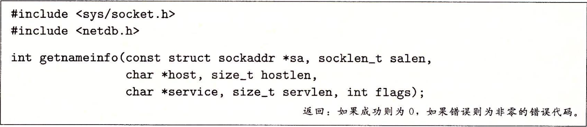

### 第一部分 程序结构和执行

#### 第二章 信息的表示和处理

##### 2.1 信息存储

* 机器级程序讲内存视为一个非常大的字节数组，称为虚拟内存。内存的每个字节都由一个唯一的数字来标识，称为地址，所有可能地址的集合称为虚拟地址空间。

* 每台计算机都有一个字长，指明指针数据的标称大小。由于虚拟地址是以这样的一个字来编码，所以字长决定的最重要的系统参数就是虚拟地址空间的最大大小。

* 即使是完全一样的进程，运行在不同的操作系统上也会有不同的编码规则，因此二进制代码是不兼容的。

  

### 第三部分 程序间的交互和通信

#### 第十章 系统级I/O

##### 10.1 Unix I/O

- 一个Linux文件就是一个m个字节的序列，所有的I/O设备都被模型化为文件，而所有的输入/输出都被当作对相应文件的读和写来执行。
- 这种将设备映射为文件的方式，允许Linux内核引出一个简单、低级的应用接口，使得所有的输入/输出都能以一种统一且一致的方式来执行：
  - 打开文件：一个应用程序通过要求内核打开相应的文件，表明它想要访问一个I/O设备。内核从描述符池中返回一个描述符（非负整数）来标识这个文件。
  - shell创建的每个进程开始时都有三个打开的文件：标准输入（描述符为0）、标准输出（描述符为1）和标准错误（描述符为2）。
  - 改变当前的文件位置（从文件开头起始的字节偏移量）：对于每个打开的文件，内核保持一个文件位置k，初始为0。
  - 读写文件：一个读操作就是从文件复制n个字节到内存，从当前文件位置k开始，将k增加到k+n。当k>=m时执行读操作会触发一个成为end-of-file（EOF）的条件。类似地，写操作就是从内存复制n个字节到一个文件，从当前文件位置k开始，然后更新k。
  - 关闭文件：当应用完成了对文件的访问之后，通知内核关闭这个文件。内核会释放文件打开时创建的数据结构（内存中），并将描述符归还到描述符池。

##### 10.2 文件

- 每个Linux文件都有一个类型来表明它在系统中的角色：

  - 普通文件（regular file）包含任意数据。如文本文件（只含有ASCII或Unicode字符的普通文件），二进制文件（所有其他文件）。

  - 目录（directory）是包含一组链接的文件，其中每个连接都将一个文件名映射到一个文件，这个文件可能是另一个目录。每个目录至少含有两个条目：“.”是到该目录自身的链接，“..“是到目录层次结构中父目录的链接。

    

  - 套接字（socket）是用来与另一个进程进行跨网络通信的文件。

  - 其他文件类型包括命名通道（named pipe）、符号链接（symbolic link）、以及字符和块设备（character and block device）。

- Linux内核将所有文件都组织成一个目录层次结构，由名为/的根目录确定。系统中每个文件都是根目录的直接或间接后代。

  

  目录层次结构中的位置用路径名来指定，包括绝对路径名和相对路径名。

##### 10.3 打开和关闭文件

- 进程通过调用`open`函数打开一个已存在的文件或创建新文件。

  

  它将filename转换成一个文件描述符，并返回描述符数字。

  flags参数指明进程打算如何访问这个文件：

  - O_RDONLY
  - O_WRONLY
  - O_RDWR

  flags参数也可以是一个或者更多位掩码的或，为写操作提供一些额外的指示：

  - O_CREAT：文件不存在，创建一个新的文件
  - O_TRUNC：文件已经存在，就截断它
  - O_APPEND：在每次写操作前，设置文件位置到文件的末尾

  如`fd = open("foo.txt", O_WRONLY|O_APPEND, 0);`

  mode参数指定了新文件的访问权限位。

  

  每个进程都有一个umask，它是通过调用`umask`函数来设置的。当进程通过带某个mode参数的open函数调用来创建一个新文件时，文件的访问权限被设置为`mode & ~ umask`。

  ```c
  //例如创建一个文件拥有者可以读写、其他人只能读的文件：
  #difine DEF_MODE S_IRUSR|S_IWUSR|S_IRGRP|S_IWGRP|S_IROTH|S_IWOTH;
  #difine DEF_UMASK S_IWGRP|S_IWOTH;
  umask(DEF_UMASK);
  fd = open("foo.txt", O_CREAT|O_TRUNC|O_WRONLY, DEF_MODE)
  ```

- 进程通过`close`函数关闭一个打开的文件。

  

##### 10.4 读和写文件

- 应用程序是通过分别调用`read`和`write`函数来执行输入和输出的。

  

  `read`函数从描述符为fd的当前文件位置复制最多n个字节到内存位置buf。

  `write`函数从内存位置buf复制至多n个字节到描述符fd的当前文件位置。

  - `size_t`类型为`unsigned long`，而`ssize_t`为`long`，因为出错会返回-1。

- 某些情况下，`read`和`write`传送的字节比应用程序要求的要少，这些不足值不表示出错，例如

  - 读时遇到EOF。
  - 从终端读取文本行。`read`函数将一次传送一个文本行。
  - 读和写网络套接字。内部缓冲延迟和较长的网络延迟会引起`read`和`write`返回不足值。

##### 10.6 读取文件元数据

- 应用程序通过调用`stat`和`fstat`函数，检索到关于文件的信息。

  

  文件的元数据包括

  

  `st_size`成员包含了文件的字节数大小。`st_mode`成员编码了文件访问许可位和文件类型。

##### 10.7 读取目录内容

- 应用程序可以通过`readdir`系列函数来读取目录的内容。

  

  `opendir`函数以路径名为参数，返回指向目录流的指针。流是对条目有序列表的抽象，这里指目录项的列表。

  

  每个目录项都是一个结构：

  ```c
  struct dirent {
  	ino_t d_ino;	//文件位置
  	char d_name[256];	//文件名
  }
  ```

  

  `closedir`函数关闭流并释放其所有的资源。

##### 10.8 共享文件

- 内核用三个相关的数据结构来表示打开的文件：

  - 描述符表：每个进程都有独立的描述符表，它的表项是由进程打开的文件描述符来索引的。每个打开的描述符表项指向文件表中的一个表项。
  - 打开文件表：打开的文件的集合是由一张文件表来表示的，所有的进程共享这张表。每个文件表的表项组成包括当前的文件位置、引用计数（指向该表项的的描述符表项数）以及一个指向v-node表中对应表项的指针。关闭一个描述符会减少对应的引用计数，直到它为零时，内核将会删除这个文件表表项。
  - v-node表：所有的进程共享。每个表包含stat结构中的大多数信息。

  

  

  打开文件表有点像描述符表的一个详细的副本，似乎是有几个描述符就有几个文件项，v-node表才是真正的对应文件信息的表，所以打开文件表可以指向同一个文件。

##### 10.9 I/O重定向

- I/O重定向操作符允许用户将磁盘文件和标准输入输出联系起来。如`ls > foo.txt`，执行ls命令，将输出重定向到文本文件中。

  

  `dup2`函数复制描述符表项oldfd到描述符表项newfd，覆盖newfd以前的内容。

##### 10.10 标准I/O

- C语言定义的一组高级输入输出函数，包括打开和关闭文件的函数（fopen和fclose）、读和写的函数（fread和fwrite）、读和写字符串的函数（fgets和fputs）以及格式化I/O函数（scanf和printf）。

- 标准I/O将一个打开的文件模型化为一个流，即一个指向FILE类型的结构的指针。

- 标准I/O基于Unix I/O实现，对于大多数应用程序而言是优于Unix I/O的选择，但是对于标准I/O和网络文件的一些相互不兼容的限制，Unix I/O更适用于网络应用程序。

  - 跟在输出函数之后的输入函数。
  - 跟在输入函数之后的输出函数。

  一个流中可以既输入又输出，但是需要应用程序调用`lseek`函数重置当前的文件位置，而对于套接字文件使用`lseek`函数是非法的。

#### 第十一章 网络编程

##### 11.1 客户端-服务端编程模型

- 每个网络应用都是基于客户端-服务端模型的。基本操作是事务，由以下四步组成：

  - 当一个客户端需要服务时，它向服务器发送一个请求，发起一个事务。

  - 服务器收到请求后，解释它，并以适当的方式操作它的资源。

  - 服务器给客户端发送一个响应，并等待下一个请求。

  - 客户端收到响应并处理它。

- 客户端和服务器都是进程，因此它们也可以在一台主机上，一台主机上也可以运行许多不同的客户端和服务器。

- 这个事务也不是数据库事务，不存在原子性等特性。

##### 11.2 网络

- 对主机而言，网络只是又一种I/O设备，是数据源和数据接收方。

- 局域网（local area network）：一个以太网段包括一些电缆和一个集线器。

  - 集线器不加分辨地将从一个端口上收到的每个位复制到其他所有的端口上。
  - 一个主机发送的帧包括一些固定长度的头部，用于标识来源、目的地和长度，以及有效信息载荷。每个主机都能看到这个帧，但只有目的主机实际读取。
  - 使用一些电缆和网桥，多个以太网段可以连接成较大的局域网，桥接以太网。

  

- 广域网（wide area network）：多个不兼容的局域网通过叫做路由器的特殊计算机连接起来，组成一个互联网络。

  

- 通过一层运行在每台主机和路由器上的协议软件，消除不兼容的网络之间的差异。例如IP协议具有下面两种基本能力：

  - 命名机制：互联网络协议通过一种一致的主机地址格式，为每台主机分配一个唯一标识。
  - 传送机制：互联网络协议通过定义一种把数据位捆扎成不连续的包的统一方式，使传输数据具有统一的格式。

  

##### 11.3 因特网

- 每台因特网主机都运行实现TCP/IP协议的软件。
- 因特网的客户端和服务端混合使用套接字接口函数和Unix I/O函数来进行通信。
- 因特网可以看作一个世界范围的主机集合，满足以下特性：
  - 主机集合被映射为一组32位的IP地址。
  - 这组IP地址被映射为一组称为因特网域名（internet domain name）的标识符。
  - 因特网主机上的进程能够通过连接（connection）和任何其他因特网主机上的进程通信。

- IP地址：一个IP地址就是一个32位无符号整数。IP地址总是以网络字节顺序（大端法）存放的，即使主机字节顺序是小端法。

  Unix提供在网络和主机字节顺序间实现转换的函数。

  

  IP地址和点分十进制字符串转换的函数。

  

- 因特网域名：域名是一组用句点分割的单词。域名集合形成了一个层次结构，每个域名编码了它在这个层次中的结构。

  

  获取二级域名后就可以在该子域下创建任何新的域名。

  域名到IP地址集合的映射通过分布世界范围的数据库，域名系统（DNS）完成。DNS数据库由主机条目结构组成，其中每条定义了一组域名和一组IP地址之间的映射。

  

- 因特网连接：一个套接字是连接的一个端点。每个套接字都有相应的套接字地址，由一个因特网地址和一个16位的整数端口组成，“地址：端口”。

  当客户端发起一个连接请求时，客户端套接字地址中的端口是由内核自动分配的，称为临时端口。而服务器上套接字地址中的端口通常是和某个服务对应的端口，如web服务（http）常用端口80，电子邮件服务（smtp）使用端口25。`/etc/services`文件可以查看服务名与端口之间的映射。

  一个连接是由它两端的套接字地址唯一确定的。这对套接字地址叫做套接字对，表示为（cliaddr：cliport，servaddr：servport）。

  

##### 11.4 套接字接口

- 套接字接口是一组函数，它们和Unix I/O结合起来，用以创建网络应用。一次事务的上下文中套接字接口的使用：

  

- 套接字地址结构

  从Linux内核的角度看，一个套接字就是通信的一个端点。从Linux程序的角度看，套接字就是一个有相应描述符的打开文件。

  

  sockaddr_in为因特网的套接字地址结构。

- socket函数

  客户端和服务器使用socket函数来创建一个套接字描述符。

  

  如果想要使套接字成为连接的一个端点，可以用如下的硬编码调用socket函数：

  ```c
  clinetfd = socket(AF_INET, SOCK_STREAM, 0);
  ```

  其中，AF_INET表示使用32位IP地址（IPv4），SOCK_STREAM表示这个套接字是连接的一个端点。

- connect函数

  客户端通过调用connect函数来建立和服务器的连接。

  

  connect函数试图与套接字地址为addr的服务器建立一个因特网连接，其中addrlen是sizeof(sockaddr_in)。它会阻塞，直到连接成功或发生错误。

- bind函数

  剩下的套接字函数如bind、listen、accept，服务器用来和客户端建立连接。

  

  bind函数告诉内核将addr中的服务器套接字地址和套接字描述符sockfd联系起来。

- listen函数

  

  默认情况，内核认为socket函数创建的描述符是主动套接字，即将自己当作是客户端。调用listen函数告诉内核，现在创建的套接字是作为服务器用的，即将sockfd从主动套接字转换为监听套接字，可以接受来自客户端的连接请求。

  backlog参数表示排队中的连接的数量，超过该值后直接拒绝连接请求。

- accept函数

  

  accept函数等待来自客户端的连接请求到达侦听描述符listenfd，然后将客户端的套接字地址填写到addr，并返回一个已连接描述符，这个描述符可以用于使用Unix I/O和客户端通信。

  监听描述符作为客户端连接请求的一个端点，通常被创建一次后，存在于服务器整个生命周期。已连接描述符是客户端和服务器已经建立的连接的一个端点，每次接受连接都会创建一次，为一个客户端服务结束后就关闭。

  

- 主机和服务的转换

  Linux提供了一些强大的函数实现二进制套接字地址结构和主机名、主机地址、服务名和端口号的字符串表示之间的相互转化。

  - getaddrinfo函数：将主机名、主机地址、服务名和端口号的字符串表示转化成套接字地址结构。

    

    给定host和service（套接字地址的两个组成部分，host可以是域名或点分十进制IP地址，service可以是服务名或十进制端口号），getaddrinfo函数返回result，它是一个指向addrinfo结构的链表的指针，其中每个结构指向对应host和service的套接字结构。

    

    客户端调用getaddrinfo后，遍历该链表，依次尝试每个套接字地址，直到调用socket和connect成功，尝试建立连接。类似地，服务器尝试每个套接字地址，直到调用socket和bind成功，描述符被绑定到一个合法的套接字地址。

    （给定了host和service为什么不能直接得到唯一的套接字地址，而是一个列表，还要不停去尝试？）

  - getnameinfo函数：将一个套接字地址结构转换成相应的主机和服务名字符串。

    

    sa指向长度为salen字节的套接字地址结构，host指向长度为hostlen字节的缓冲区，service指向长度为servlen字节的缓冲区。该函数将套接字地址结构转换成对应的主机和服务名字符串，并将它们复制到缓冲区。

    flags是一个位掩码，修改默认行为：

    - NI_NUMERICHOST：返回数字地址字符串而不是域名。
    - NI_NUMERICSERV：返回端口号而不是服务名。


##### 11.5 Web服务器

- Web基础：Web客户端和服务器之间的交互用的是一个基于文本的应用级协议，HTTP。即浏览器打开一个到服务器的因特网连接，请求一些内容。服务器响应所请求的内容，关闭连接。浏览器读取内容并显示出来。

- Web内容：与MIME（Multipurpose Internet Mail Extensions）类型相关的字节序列。

  Web服务器以两种方式提供内容：

  - 取一个磁盘文件，并将它的内容返回给客户端，即静态内容。
  - 运行一个可执行文件，并将它的输出返回给客户端，即动态内容。

  每条由Web服务器返回的内容都是和它管理的某个文件相关联的。这些文件中的每一个都有一个唯一的名字，统一资源定位符（Universal Resource Locator）。

- HTTP事务：可以使用`telnet`指令和因特网上的任何Web服务器执行事务。

  

  首先打开一个到指定套接字地址的连接。然后输入一个请求以发起事务（5~7）。

  - HTTP请求：由一个请求行、零个或多个请求报头、一个空文本行组成。

    请求行格式为：`method URI version`。

    - method包括get、post、options、head、put、delete、trace。

    - URI（Uniform Resource Identifier）是相应URL的后缀，包括文件名和可选参数。

    - version表明该请求遵循的HTTP版本。

    请求报头为服务器提供额外的信息，格式为`header-name：header-data`。

    - Host报头在HTTP/1.1中是需要的，因为代理缓存会使用这个报头，如果传输过程中代理发现本地有客户端所请求的内容的缓存，会直接返回给客户端。

    空文本行终止报头，指示服务器发送所请求的内容。

  - HTTP响应：一个相应行，零个或多个响应报头，一个空文本行，一个响应体。

    响应行格式为`version status-code status-message`。

    - version表明响应所遵循的HTTP版本。

    - 状态码是一个3位整数，表明对请求的处理。

    - 状态消息给出与状态码等价的英文描述。

      

    响应报头提供了关于响应的附加信息，如响应体内容的MIME类型，字节长度等。

    空文本行终止报头。接着响应体包含被请求的内容。

- 服务动态内容

  - 客户端将参数传递给服务器：get请求的参数在URI中传递。一个“？”字符分隔文件名和参数，每个参数之间使用“&”字符分隔开。

  - 服务器将参数传递给子进程：子进程将CGI（Common Gateway Interface）环境变量“QUERY_STRING” 设置为参数的字符串，执行CGI程序时使用getenv函数引用它。对于其他信息同样是通过这种方式传递给子进程。

  - 子进程将它的输出发送到标准输出，而在此之前它将标准输出重定向到和客户端相关联的已连接描述符，即发送到标准输出就会到达客户端。

    

    