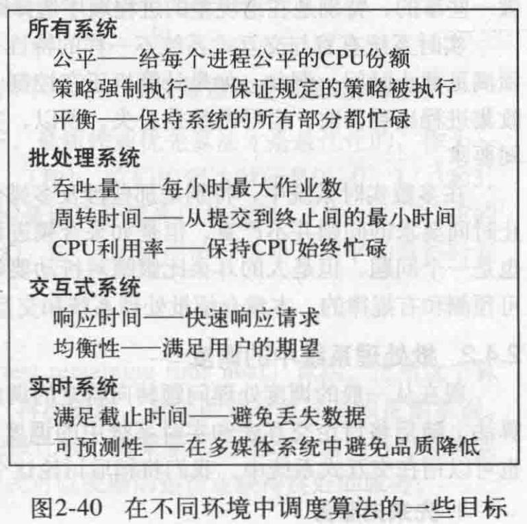
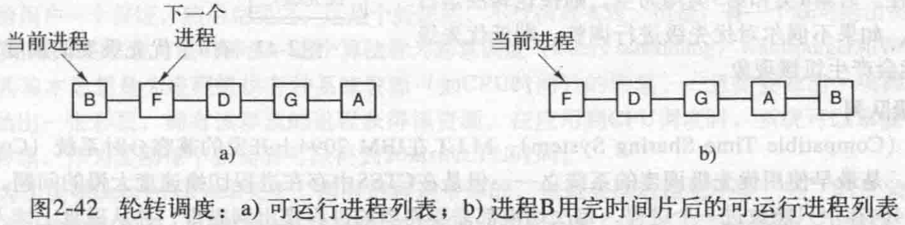
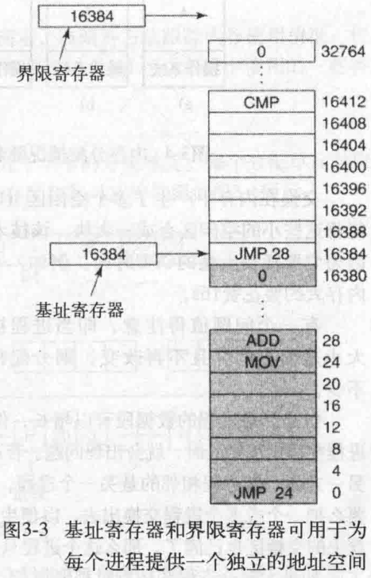

### 第一章 引论

多数计算机有两种运行模式：内核态和用户态。软件中最基础的部分，操作系统运行在内核态，具有对所有硬件的完全访问权，可以执行机器能够运行的所有指令。软件的其余部分运行在用户态，只使用机器指令中的一个子集。

用户接口程序（shell或GUI）处于用户态程序中的最低层次（它们并不是操作系统的一部分），允许用户运行其他程序。


操作系统有两个基本独立的任务：

- 扩展机器的功能以隐去硬件的繁琐，即向应用程序提供基本的抽象（如进程是对CPU的抽象、地址空间是对内存的抽象、文件是对硬盘的抽象）。
- 作为资源管理者管理硬件资源。

资源管理有两种不同方式实现多路复用资源，即时间上复用（如单核CPU上执行多个程序）或空间上复用（多个程序同时存在于主存中）。

常用的POSIX系统调用：


- fork用于创建一个原有进程的精确副本，即子进程，包括所有的文件描述符、寄存器等内容。返回值在子进程中为零，在父进程中等于子进程的进程标识符（process identifier）。

  父子进程是Unix系统的概念，Windows中没有进程层次的概念（但是任务管理器可以看到“结束进程树”？）。

- waitpid用于父进程等待子进程终止。

- execve用于子进程执行第一个参数给定的文件，第二个参数为指向变量数组的指针。

  

- lseek用于改变文件位置指针的值，第一个参数是文件描述符，第二个参数是偏移量，第三个参数是相对于文件起始位置、当前位置或末尾位置。返回值为文件的绝对位置。

- mount用于挂载一个文件系统，第一个参数是存储器的块特殊文件名称，第二个参数是挂在位置，第三个参数说明要安装的文件系统是只读的还是可读写的。

### 第二章 进程与线程

#### 2.1 进程

- 进程模型：计算机上所有可运行的软件，被组织成若干顺序进程，简称进程。一个进程就是一个正在执行程序的实例，包括程序计数器、寄存器和变量的当前值。

  物理的程序计数器只有一个，因此程序运行时，将其逻辑程序计数器装入实际的程序计数器，单核CPU在任意时刻仅有一个进程是活跃的。

  

- 进程的创建：4种主要事件会导致进程的创建：

  - 系统初始化。包括前台进程，即与用户交互的那些进程；后台进程，处理电子邮件、Web页面、新闻、打印之类的活动，也叫守护进程。
  - 正在运行的程序执行了创建进程的系统调用。
  - 用户请求创建一个新的进程。如键入一个命令或打开一个图标。
  - 一个批处理作业的初始化。大型机用于处理多份作业。

  Unix系统中通过fork创建一个与调用进程相同的副本，它们具有相同的内存映像、同样的环境字符串和同样的打开文件。然后子进程执行execve系统调用，修改其内存映像并运行一个新的程序。之所以安排两步，是为了允许该子进程处理其文件描述符，完成对标准输入、标准输出、标准错误的重定向。
  
  进程创建后，父进程与子进程有各自不同的地址空间。可写的内存是不能共享的。

- 进程的终止：4种条件引起进程终止：

  - 正常退出（自愿）。
  - 出错退出（自愿）。程序中预设好的错误情况发生时产生的退出。例如`cc foo.c`编译该文件，但该文件不存在，因此编译器出错退出。
  - 严重错误（非自愿）。出现运行时的错误情况引起退出，通常由于程序中的错误所致。例如执行了一条非法指令、引用不存在的内存、除数为零等。
  - 被其他进程杀死（非自愿）。如kill系统调用。

- 进程的层次结构：父进程与子进程保持关联，子进程可以创建更多的子进程，在这个结构中每个进程只有一个父进程，即一棵树结构。

  Unix启动时，一个成为init的特殊进程出现在启动映像中。它为每个终端创建一个新进程，然后等待登录。登陆进程执行shell准备接收命令，然后启动更多的进程。

  Windows中没有进程层次的概念，所有的进程都是地位相同的。

- 进程的状态：进程之间经常需要相互作用，一个进程的输出可能作为另一个进程的输入。当一个进程在逻辑上不能继续运行时，它就会被阻塞，例如等待可以使用的输入，或者处于就绪，例如等待被分配CPU时间。三种状态：

  - 运行态：该时刻进程实际占用CPU。

  - 就绪态：可运行，但因为其他进程正在运行而暂时停止。

  - 阻塞态：除非某种外部事件发生，否则进程不能运行。

    

- 进程的实现：为了实现进程模型，操作系统维护着一张表格，即进程表。每个进程占用一个进程表项，包含了进程状态的重要信息。

  

  当发生中断时，当前进程的信息就是被保存在对应的进程表项中。

- 多道程序设计模型：假设一个进程进行I/O操作的时间与其停留在内存中的时间比为p，当内存中同时有n个进程时，所有的进程都在等待I/O的概率是$p^n$，因此CPU利用率为$1-p^n$。

  

#### 2.2 线程

传统操作系统中，每个进程有一个地址空间和一个执行线程。

- 线程的使用：为什么使用线程：

  - 不同的进程具有不同的地址空间和数据，而只有引入多线程的概念，才能让并行实体拥有共享同一个地址空间和所有可用数据的能力。

  - 线程比进程更轻量级，比进程更容易创建和撤销。

  - 如果存在大量的计算和I/O处理，多个线程允许这些活动彼此重叠进行，加快执行速度。

    

    一个线程用于和用户交互，监听键盘鼠标事件；一个线程用于进行文档的重新格式化；一个线程用于定时将RAM上的内容写到磁盘保存。

- 经典的线程模型：

  - 进程是一个程序的资源集合，有存放程序正文、数据和其他资源的地址空间。这些资源包括打开的文件、子进程、即将发生的定时器、信号处理程序、账号信息等等。

    进程拥有一个或多个执行的线程，线程中有一个程序计数器，用来记录接着执行哪条指令；有寄存器，用来保存当前的工作变量；有一个堆栈，用来记录执行历史。

    进程用于把资源集中到一起，线程则是在CPU上被调度执行的实体。

    

  - 当多线程进程在单CPU中运行时，线程轮流运行。

  - 和传统进程一样，线程可以处于4种状态：运行、阻塞、就绪、终止。

  - 在多线程的情况下，进程通常会从当前的单个线程开始，这个线程有能力通过调用一个库函数（thread_create）创建新的线程。当一个线程完成工作后，可以通过调用一个库函数（thread_exit）退出。thread_join，允许线程等待另一个特定线程退出（等待某个任务完成）。thread_yield，允许线程自动放弃CPU从而让另一个线程执行。

- POSIX线程：IEEE标准定义的线程包pthread。

- 在用户空间/内核中实现线程：
  - 把整个线程包放在用户空间，内核按照单线程进程的方式管理。

    每个进程需要有其专用的线程表，用来跟踪该进程中的线程。

    优点是用户级线程包可以在不支持线程的操作系统上实现；不需要陷入内核，线程切换非常快；允许每个线程有自己的调度算法。

    缺点是实现阻塞系统调用比较困难，即线程调用系统调用时会停止其他所有的线程；缺页中断问题，即线程读取不在内存上的指令时，进程会被阻塞（因为内核不知道线程的存在），等待I/O读取这个指令到内存，尽管其他线程可以运行，但是进程被阻塞了就全部停止了；线程永久运行问题，一个线程开始运行，其他线程就不能运行，因为在一个单独的进程中没有时钟中断，不能用轮转调度的方式调度线程（上面说的线程切换指的是线程都是在代码中显式方式进行切换？）。

  - 在内核中有用来记录系统中所有线程的线程表。

    所有能够阻塞线程的调用都以系统调用的方式实现，这样代价较大（可以使用线程池的方式回收线程），但是当一个线程阻塞时，内核可以选择运行同一个进程中的另一个线程或者另一个进程中的线程。

    线程引起缺页中断问题时，内核可以检查该进程是否有其他线程可以运行，缺点仍然是进行系统调用代价较大。

    

  - 混合实现：使用内核级线程，然后将用户级线程与某些或全部内核线程多路复用。内核只识别内核级线程，并对其进行调度。每个内核级线程有一个可以轮流使用的用户级线程集合。

    

#### 2.3 进程间通信

存在的问题：一个进程如何把信息传递给另一个进程；两个或更多进程在关键活动中不会出现交叉（例如两个进程争夺最后一个飞机座位）；进程之间如何保证正确的执行顺序。

- 竞争条件：两个或多个进程同时读写某些共享数据，而最后的结果取决与进程运行的精确时序，称为竞争条件。

- 临界区：把对共享内存进行访问的程序片段称为临界区域。

  如果通过适当安排，使两个进程不能同时处于临界区中，就能避免竞争条件。为了使并发进程能够正确高效地协作，一个好的解决方案需要满足4个条件：

  - 任何两个进程不能同时处于其临界区。
  - 不应对CPU的速度和数量做任何假设。
  - 临界区外运行的进程不得阻塞其他进程。
  - 不得使进程无限期等待进入临界区。

  

- 忙等待的互斥：几种实现互斥的方案。

  - 屏蔽中断：单处理器系统中，使每个进程在刚刚进入临界区后立即屏蔽所有中断，在就要离开之前再打开中断。

    将屏蔽中断的权力交给用户程序比较危险；多核系统其他的CPU同样能访问共享变量。

  - 锁变量：一个共享的锁变量，进程检查它的值以确定是否进入临界区。

    它本身就是一个共享变量，因此并不根本上解决问题。

  - 严格轮换法：

    

    用一个turn变量记录轮到哪个进程进入临界区。初始时，turn为0，进程0进入临界区，而进程1处于不停检测turn变量是否为1的循环中。当进程0离开临界区后，将turn设置为1，此时轮到进程1进入临界区。

    连续测试一个变量直到某个值出现，称为**忙等待**。用于忙等待的锁，称为**自旋锁**。

    由于进程执行速度的原因，如果进程1在临界区外，而turn变量为1，此时进程0将必须等待进程1将turn变量设置为0，即进程0被一个临界区外的进程所阻塞，这违背了条件3，因此并不高效。

  - Peterson解法：

    

    开始时，没有进程处于临界区。进程0调用enter_region，设置数组元素和turn表明它要进入临界区，如果进程1没有动作，那么进程0正常进入运行。如果进程1此时也调用enter_region，由于`interested[0]==TRUE`，因此它会阻塞在循环处，直到进程0执行leave_region将数组元素设置为FALSE。

    如果进程0和进程1同时调用enter_region，由于turn会被其中一个覆盖掉，两个数组元素都为TRUE，因此其中一个进程必然满足无限循环的条件被阻塞，另一个则进入临界区。

  - TSL指令：硬件指令，`TSL RX, LOCK`，测试并加锁，它由硬件保证同步（锁总线）。类似的指令XCHG。

    

- 睡眠与唤醒

  sleep是一个将引起调用进程阻塞的系统调用，即被挂起，直到另外一个进程将其唤醒。

  wakeup调用有一个参数，即要被唤醒的进程。

- 信号量

  用一个整型变量来累计唤醒次数。两种原子操作down和up，类似于sleep和wakeup。

  down检查信号量是否大于0，若大于0，则将其值减1，若为0，则进程将睡眠。

  up将信号量的值加1，如果该信号量有睡眠进程，则值仍然为0，但唤醒该进程。

  ```
  信号量为 2 1 0
  线程1 执行，信号量-1为1	执行完毕
  线程2 执行，信号量-1为0
  线程3 信号量为0，阻塞	被唤醒，执行，信号量仍然为0
  ```

- 互斥量

  不使用信号量的计数功能，即只有两种状态的变量：加锁或解锁。0表示解锁，其他表示加锁。

  当一个线程需要访问临界区时，调用mutex_lock，如果该互斥量当前是解锁的，则进入临界区。

  如果该互斥量已经是加锁的，则调用线程被阻塞，直到临界区中的进程调用mutex_unlock。

  

  注意这里不需要忙等待，获取锁失败时，调用thread_yield将CPU让给另一个线程。在下次运行时再对锁进行测试。

- 管程

  一种高级同步原语，它是语言层面上提供的同步。一个管程是一个由过程、变量、数据结构等组成的一个集合。

  管程有一个重要特性：任一时刻管程中只能有一个活跃进程。当一个进程调用管程过程时，前几条指令将检查在管程中是否存在其他活跃进程，如果有则调用进程进入阻塞状态。

  Java中的synchronized关键字中的代码即为管程。

- 消息传递

- 屏障

  在每个阶段的结尾安置屏障，当一个进程到达屏障时被阻拦，直到所有进程都到达该屏障为止。

  

- 避免锁：读-复制-更新

#### 2.4 调度

- 进程行为：几乎所有进程的I/O请求和计算都是交替突发的。

  

  a为计算密集型，b为I/O密集型

- 何时调度：有几种情形：

  - 创建一个新进程后，需要决定先运行父进程还是子进程。
  - 在一个进程退出时，需要从就绪进程中选择一个。
  - 当一个进程阻塞时，需要选择另一个进程运行。
  - 在一个I/O中断发生时，需要选择一个进程运行。如被阻塞的等待该I/O的进程，或者中断发生时运行的进程等。

- 调度算法分类：

  - 非抢占式：挑选一个进程，让其运行到被阻塞，或自己放弃CPU。
  - 抢占式：挑选一个进程，让其运行到某个固定时段的最大值，然后选择另一个进程。

- 调度算法目标：

  

- 交互式系统中的调度：

  - 轮转调度：每个进程被分配一个时间段，允许进程在该时间段内运行。

    

    缺点是时间片的长度设置，设置过短导致进程切换频繁，很多时间浪费在管理进程上，设置过长导致后面的进程等待时间过长，响应太慢。

  - 优先级调度：每个进程被赋予一个优先级，允许优先级最高的可运行进程先运行。

    切换进程的方式有两种，一种是随着时钟运行降低当前进程的优先级，当低于次高优先级的进程时进行切换；另一种仍然是赋予每个进程一个允许运行的最大时间片。

    

    对进程按优先级分组，内部使用轮转调度。缺点是高优先级的进程存在时，不会理会低优先级的进程，如果不调整优先级，则低优先级进程会产生饥饿现象。

  - 多级队列：最高优先级的进程运行一个时间片，次高优先级的进程运行两个时间片，再次一级运行四个时间片，以此类推。当一个进程用完分配的时间片后，优先级下调。

    这样可以使开始时高优先级的进程运行频次逐渐下降，为低优先级进程让出CPU。

  - 最短进程优先

  - 保证调度：有n个进程，则保证每个进程获得CPU时间的1/n，需要记录一个进程自创建起占用的CPU时间。

  - 彩票调度

  - 公平分享调度：考虑进程所属用户，例如两个用户的进程，为每个用户分配50%。

- 线程调度
  - 用户级线程：内核调度进程，进程中的线程调度程序调度线程。进程的时间片执行结束后，进程被切换。
  - 内核级线程：内核调度线程，可以不考虑线程属于哪个进程。同样地赋予线程一个时间片，执行完毕后线程被挂起。

### 第三章 内存管理

#### 3.1 无存储器抽象

程序直接访问物理内存地址，如`MOV REGISTER1, 1000`，这样很容易破坏操作系统，也很难实现多道程序运行。

- 组织内存：

  

#### 3.2 地址空间

- 地址空间是一个进程可以用于寻址内存的一套地址集合。每个进程都有一个自己的地址空间，它独立于其他进程的地址空间。

- 动态重定位：把每个进程的地址空间映射到物理内存的不同部分。

  当一个进程运行时，程序的起始物理地址装载到基址寄存器中，程序的长度装载到界限寄存器中。

  

  第一个程序装载时基址和界限值分别为0和16384。第二个程序装载时为16384和32768。

  第二个程序的程序指令为`JMP 28`，但是执行时硬件将其翻译为`JMP 16412`，同时会检查这个地址是否越过界限值，以避免错误。

- 交换技术

  通常情况下，物理内存并不足以容纳所有进程。有两种处理内存超载的通用方法：交换技术和虚拟内存。

  - 交换技术把一个进程完整地调入内存（注意这里还是物理内存），运行一段时间后，将其存入硬盘。

  - 虚拟内存能使程序只有一部分被调入内存的情况下运行。

  

  交换在内存中产生了多个空闲区，通过把所有的进程尽可能向下移动，有可能将这些小的空闲区合成一大块，该技术称为内存紧缩。

  如果进程的所需内存固定且不发生变化，则分配比较简单。如果进程的数据段可以增长，那么没有空间时需要把该进程移动到一个足够大的空间，或者把其他进程交换出去给它腾出空间。如果大部分进程的数据段都可以增长，那么可以在换入或移动进程时为它分配额外的内存。

  

- 空闲内存管理

  有两种方法跟踪内存使用情况：位图和空闲区链表。

  - 使用位图的存储管理：内存被划分为几个字或几千字节不定的分配单元。每个分配单元对应位图中的一位，0表示空闲，1表示占用。

    

    缺点是在位图中找指定长度的连续0串是耗时的操作。

  - 使用链表的存储管理：链表中的节点包含四个域：进程或空闲区的标记，起始地址，长度和指向下一节点的指针。使用双向链表更加方便。

    

    为一个进程分配内存时，有几种方法。如首次适配，即从链表头开始搜索，直到找到一个足够大的空闲区，然后将它分解为进程和剩余空闲区两部分；下次适配，即找到空闲区后记录这个位置，下次从这个位置开始搜索；最佳适配，即搜索整个链表，找出能容纳进程的最小的空闲区；最差适配，即分配最大的空闲区。

#### 3.3 虚拟内存

每个程序拥有自己的地址空间，这个空间被分割成许多块，每一块称为一页，每一页有连续的地址范围。这些页被映射到物理内存，但并不是所有的页都必须在内存中才能运行程序。当程序引用到一部分在物理内存中的地址范围时，由硬件立即执行必要的映射，当程序引用到一部分不在物理内存中的地址范围时，由操作系统负责将缺失的部分装入物理内存并重新执行失败的指令。

**虚拟内存的实现，是通过将虚拟地址空间分解成页，将每一页或者映射到物理内存的某个页框，或者解除映射**。

- 分页技术

  由程序产生的地址称为虚拟地址，它们构成一个虚拟地址空间。虚拟地址由内存管理单元（MMU，一个物理芯片）映射到物理地址。

  虚拟地址空间按照固定大小划分成被称为页面的若干单元，在物理内存中对应的单元称为页框，页面和页框大小通常是相同的。RAM和磁盘之间的交换总是以整个页面为单元进行的。

  

  例如程序访问地址0时，0送入MMU，MMU发现0位于页面0，它对应页框2，因此MMU把地址变换为8192，即0-4095的虚拟地址都将被映射到8192-12287。

  当程序访问一个没有映射的地址时，如32780，MMU会使CPU陷入操作系统，称为缺页中断或缺页错误。操作系统会找到一个很少使用的页框并把它写入到磁盘上，然后把需要访问的页面读到回收的页框中，修改映射关系，重新启动引起陷阱的指令。例如系统选择页框1，则将页面1标记为未映射，然后将页面8中的“x”标记为1，即页面8将映射到页框1。

- 页表

  虚拟地址到物理地址的映射（MMU的原理）：虚拟地址被分为虚拟页号（高位）和偏移量（低位）两部分。选择不同的位数可以决定页面的数量和每页的大小。例如16位地址，高4位作为页号，低12位作为偏移量，即分成16个页面，每个页面4096字节。

  页号可以作为页表的索引，以找到该页面对应的页框号。将页框号与偏移量拼接，则为实际的物理地址。

  

  - 页表项结构：

    

    页框号用于找到实际的物理地址。在/不在位用于表示虚拟页面有没有到物理内存的映射。

    保护位指出一个页允许什么类型的访问，即读、写还是执行。

    修改位/脏位记录一个页面是否被修改过，修改过则必须将其写入磁盘，否则没修改过直接丢弃即可（磁盘中的副本仍然有效）。

    访问位记录一个页面是否被访问或者访问的次数，用于发生缺页中断时选择淘汰的页面。

    高速缓存禁止位用于禁止该页面被高速缓存，有时需要读取新的数据，而不是一直读取旧的缓存数据。

- 加速分页过程

  两个问题：一是虚拟地址到物理地址的映射必须快，二是如果虚拟地址空间很大，则页表也会很大。

  页表实现在硬件如寄存器阵列中，页表较大时代价高昂，且每次进程切换都需要重新装载整个页表（每一个进程都有自己的虚拟地址空间，对应一个页表映射）。页面实现在内存中，每执行一条指令，都需要更多次的内存访问查找页表项，性能更差。

  - 转换检测缓冲区：基于大多数程序总是对少量的页面进行多次的访问，因此只有少数页表项被反复读取的事实。为计算机设置一个硬件设备即转换检测缓冲区，将虚拟地址直接映射到物理地址，而不再访问内存中的页表。

    

    将一个虚拟页号与TLB中所有的项进行匹配，如果存在，则直接得到页框号，而不必访问内存。如果不存在，则进行正常的内存页表查询，然后在TLB中淘汰一个表项，用新的页表项代替。

- 针对大内存的页表

  - 多级页表

    

    32位虚拟地址被划分为10位的PT1域、10位的PT2域和12位的Offset域。页面大小为4KB，共2^20个页面。（顶级页表为什么只用3个？这样怎么对应100万个页面？）

  - 倒排页表：每个页框对应一个表项，而不是每个虚拟页面对应一个表项。这虽然节省了大量空间，但从虚拟地址映射到物理地址变得困难。解决方案是使用TLB记录频繁使用的页面，当TLB失效时，再搜索整个倒排列表。

### 第六章 死锁

#### 6.1 资源

资源：需要排他性使用的对象，可以是硬件设备或是一组信息。

- 可抢占式资源和不可抢占式资源

  可抢占式资源可以从拥有它的进程中抢占而不会产生任何副作用，如存储器。

  不可抢占式资源是指在不引起相关的计算失败的情况下，无法把它从占有它的进程处抢占过来，如光盘刻录机。

  死锁通常与不可抢占式资源有关，有关可抢占式资源的潜在死锁通常可以通过在进程之间重新分配资源而化解。

- 资源获取

  一个进程请求几个资源都不存在资源竞争。当两个进程请求多个资源时，使用信号量保护资源，可以保证每个资源只被一个进程拿到，但请求资源的顺序可能造成死锁。

  

  a中的请求顺序保证其中一个线程拿到资源1，另一个被阻塞。但b中可能出现两个线程分别拿到资源1和资源2，然后分别请求另一个资源，此时出现死锁。

#### 6.2 死锁

规范定义：如果一个进程集合中的每个进程都在等待只能由该进程集合中的其他进程才能引发的事件，那么该进程集合就是死锁的。

由于所有的进程都在等待，所以没有一个进程能引发可以唤醒其他进程的事件，因此所有的进程只能无限期等待。这一模型假设进程中只有一个线程，并且无法由时钟中断唤醒。

大多数情况下，进程等待的事件是其他进程释放资源，这种死锁称为资源死锁。

- 资源死锁的条件：

  - 互斥条件：每个资源要么已经分配给了一个进程，要么就是可用的。
  - 占有和等待条件：已经得到了某个资源的进程可以再请求新的资源。
  - 不可抢占条件：已经分配给一个进程的资源不能强制性地被抢占，只能由占有它的进程显式释放。
  - 环路等待条件：死锁发生时，系统中一定有由两个或两个以上的进程组成的一条环路，该环路中的每个进程都在等待着下一个进程所占有的资源。

  死锁发生时，这四个条件一定同时满足。通过破坏上述条件可以预防死锁。

- 死锁建模

  使用有向图建立模型：圆形节点表示进程，方形节点表示资源。圆形到方形的有向边表示该进程正在请求该资源，并且被阻塞，处于等待状态。方形到圆形的有向边表示该资源已被请求、授权并被进程占用。

  

  处理死锁的策略：

  - 忽略该问题。
  - 检测死锁并恢复。
  - 仔细对资源进行调度分配，动态地避免死锁。
  - 通过破坏引起死锁的四个必要条件之一，防止死锁发生。

#### 6.3 鸵鸟算法

  把头埋到沙子里，假装没有问题发生。这要看死锁发生的频度和严重性。

#### 6.4 死锁检测和恢复

- 检测：
  - 每种类型一个资源的死锁检测：构造一张资源分配图，然后检测图中是否存在环。

    

  - 每种类型多个资源的死锁检测：基于矩阵的检测算法。

- 恢复：

  - 利用抢占恢复：临时将某个资源从它的当前所有者那里转移给另一个进程。
  - 利用回滚恢复：类似于备份，周期性地将进程的状态写入一个文件，以备以后重启。
  - 通过杀死进程恢复：一种是杀死环内的一个进程；另一种是杀掉一个环外的进程，当然需要该进程持有环内的进程所需要的资源。

#### 6.5 死锁避免

避免死锁的主要算法是基于一个安全状态的概念。

- 资源轨迹图：直观感受安全状态。

  

  横轴表示A进程运行，纵轴表示B进程运行。A由r进入s时，请求打印机。B由s进入t时，请求绘图仪。由于两个进程只能不断执行，即只能往右上放行进，如果到达了矩形1256中，那么接下来一定会产生死锁，即处于不安全状态。阴影部分表示两个进程都拥有一个资源，这是实际上不可能发生的区域，即死锁区域。

  因此最好通过调度A、B进程，在t点处不给B进程分配绘图仪，使A进程直接运行到I4，然后再运行B进程。

- 安全状态和不安全状态

  

  依次让B、C、A进程工作即可保证所有进程都完成工作。

  

  不安全状态（b）下系统无法保证所有进程都完成工作。

- 单个资源的银行家算法

  判断对请求的满足是否会导致进入不安全状态，如果是就拒绝请求，否则就予以分配。为了检查状态是否安全，银行家（系统）需要考虑剩余贷款（资源）是否足够满足一个客户（线程）。

  

- 多个资源的银行家算法

  类似多个资源的死锁检测算法，使用矩阵记录一些信息。

  

  检查一个状态是否安全（是否会导致死锁）的算法为：

  1. 检查“仍然需要的资源”中是否有一行，对应的资源数均小于等于可用资源A。如果不存在这样的行，那么会进入死锁状态，因为任何进程都无法得到需要的资源，阻塞等待。
  2. 如果找到一行，那么可以假设它获取所需的资源，并运行结束。将该线程标记为终止，并将归还的资源加到A上。
  3. 重复以上两步，直到所有进程被标记为终止，那么初始状态就是安全的。如果出现资源需求不能满足的情况，则发生死锁，即初始状态不安全。

  算法的局限：很少有进程能够在运行前就知道其所需要的最大资源，进程数也在不断变化等等。

#### 6.6 死锁预防

- 资源死锁的条件：
  - 互斥条件：每个资源要么已经分配给了一个进程，要么就是可用的。
  - 占有和等待条件：已经得到了某个资源的进程可以再请求新的资源。
  - 不可抢占条件：已经分配给一个进程的资源不能强制性地被抢占，只能由占有它的进程显式释放。
  - 环路等待条件：死锁发生时，系统中一定有由两个或两个以上的进程组成的一条环路，该环路中的每个进程都在等待着下一个进程所占有的资源。

- 破坏互斥条件：如果资源不被一个进程独占，那么死锁肯定不会产生。但是不可行，两个进程同时操作一个资源会造成混乱，除非使用假脱机技术。

- 破坏占有和等待条件：只要禁止已持有资源的进程再等待其他资源就可以消除死锁。

  例如在进程开始前请求所需的全部资源。这样做的问题是进程通常在运行前不知道需要多少资源，而且效率低下，它可能使用某个资源一小段时间，但是要在整个工作时间内把资源都占住。

- 破坏不可抢占条件：需要资源具有虚拟化的能力。

- 破坏环路条件：将所有资源编号，进程可以在任何时刻提出资源请求，但是所有请求必须按照资源编号的升序提出，或者不允许进程请求比它占用资源编号低的资源。

  

  例如A占有2，B占有4。A提出申请4，4大于A占有的资源编号2，但是4被使用，因此阻塞等待。而B提出申请2，这是不被允许的，因为B占有的资源编号为4。这样避免了死锁，但问题是资源数目巨大时编号方法难以使用。

#### 6.7 其他问题

- 通信死锁：进程A向进程B发送一个信息，发送之后处于等待回信的阻塞状态。但是信息在传输过程丢失，进程B也处于一个等待来信的阻塞状态。

  通常中断通信死锁的方式为超时检测，发送者发送之后开始计时，超过规定时间没有收到回信便重新发送一次信息。

- 活锁：进程发现它不能获取所需要的下一个锁时，就会释放已获得的锁，然后等待1ms并再次尝试。这样可能会出现两个进程交替进行这件事情的情况，即进程A占有资源1，请求资源2，进程B占有资源2，请求资源1，它们发现请求失败，于是进程A释放资源1，进程B释放资源2，然后进程A获取到资源1，进程B获取到资源2，又重复这个过程。进程没有阻塞，但是也没有继续往下运行。

  

- 饥饿：虽然进程没有死锁，但永远得不到需要的资源。例如最短作业优先的调度算法，可能导致长作业永远不能进行。可以采取先到先服务的调度算法来避免。