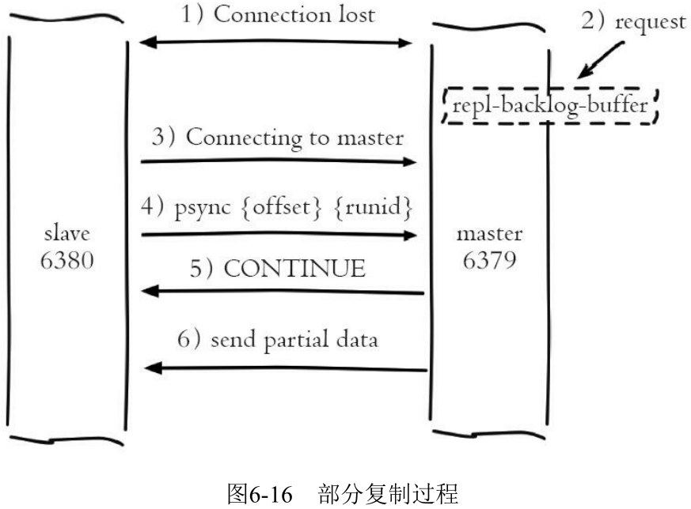
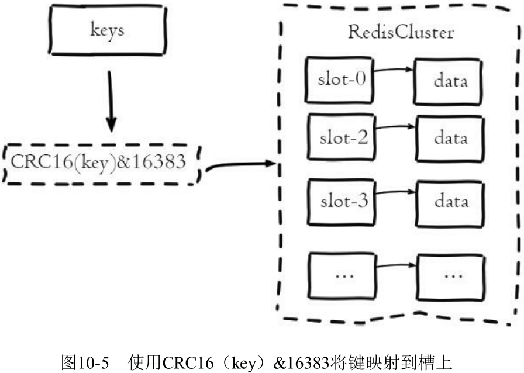
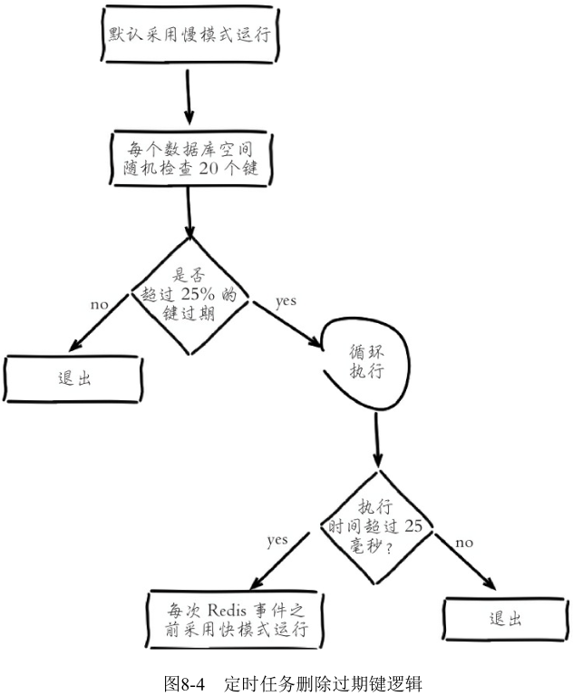

#### Java基础

##### Java简要介绍

Java是一种以面向对象为主要特性的语言，它通过字节码和虚拟机的形式实现跨平台。面向对象的主要特性是封装、继承、多态。

##### ArrayList Vector CopyOnWriteArrayList异同

- 它们都是单列容器，底层都使用数组实现。
- ArrayList是非同步的，Vector是同步的，CopyOnWriteArrayList可以做到只有写入与写入需要同步，写入时不影响读取操作，这是因为它的所有可变操作（add，remove等等）都是通过创建底层数组的新副本来实现的，即底层数组不会被修改，只会被替换。
- Array类通过反射提供动态创建和访问数组的功能。

##### hashmap hashtable concurrenthashmap异同

- 它们都是双列容器，hashtable concurrenthashmap都是懒加载（put的时候创建数组）。

- hashmap底层为数组+链表/红黑树，可以存储null键和null值，非同步。

  - 为什么用红黑树不用AVL树（平衡二叉树），因为红黑树插入和删除节点后的调整比AVL树更快，而查询性能损失并不多。

  - ```
    (h = key.hashCode()) ^ (h >>> 16)
    ```

    hash函数：为什么高16位和低16位异或，因为高低位都参与到计算中，尽可能降低hash冲突。

  - ```
    (n - 1) & hash
    ```

    为什么HashMap的数组长度要取2的整数幂，因为这样（数组长度-1）正好相当于一个“低位掩码”，与key的hash做与运算，得到数组下标。本质上是因为除数为2的幂次时，取余操作等价于被除数和（除数-1）的与操作。

  - 扩容时，数组上单个的元素使用`(新容量 - 1) & hash`重新散列，链表上的元素，一些保持在原始位置，另一些使用原始位置+旧数组容量作为新的位置。

    ```
    因为扩容时直接乘以2，数组长度始终保持为2的幂，它的二进制码只有一个1。
    通过if ((e.hash & oldCap) == 0)选出保持在原来位置以及要放入新位置的元素。
    ```

  - 链表转红黑树的阈值为什么是8，因为与泊松分布有关，hash函数选择比较好的时候，链表的长度到达8给可能性很小。但不能避免用户选择不好的hash函数。

  - JDK8中做的优化：

    - 链表长度大于8且数组长度大于64时，链表会转换为红黑树。

    - 插入时在链表尾部插入，为了避免多线程环境下rehash形成环（当然多线程环境下还是不安全的）。

      

    - entry被node替代，因为加入了树节点。

    - 先插入再扩容。

- hashtable底层为数组+链表，不可以存储null键和null值，同步。

- concurrenthashmap底层分情况，不可以存储null键和null值，线程安全，所有变量使用volatile修饰。

  - JDK1.7为分段的数组+链表，通过给每个段进行加锁ReentrantLock，实现线程安全。
  - JDK1.8为Node数组+链表/红黑树，并发控制使用synchronized和CAS来操作。
    - synchronized：将数组节点作为锁，更新值或尾部插入节点。
    - CAS：数组的空位置插入节点。
  - 1.8的锁粒度更小，并且使用内置锁替代重入锁。使用红黑树进行优化。
  - 扩容主要思想：使用一个新数组存放扩容过程中的节点。对原数组中某一个位置进行迁移时，使用synchronized将它锁定，并进行类似hashmap的迁移。迁移后将该位置设置为一个ForwardingNode，它的hash为-1，用来告知其他线程这个位置已经处理过。

##### hashmap linkedhashmap treemap异同

- hashmap基于数组+链表/红黑树实现，linkedhashmap基于hashmap和双向链表实现（继承hashmap，node添加before和after两个指针），treemap基于红黑树实现。

  

- hashmap不能保证数据有序，linkedhashmap记录了数据的插入顺序（迭代器根据双向链表遍历，因此有序），treemap能够把它保存的记录根据键排序。

##### 重写equals方法的时候需要重写hashCode方法

因为equals方法默认比较两个对象的地址，重写equals方法后，为了让逻辑上相等的对象返回相同的hashcode，需要重写hashcode方法，否则hashmap这些用到hashcode的类会认为两个逻辑上相等的对象不相等。

如果两个对象相等（equal），它们的hashcode一定相同；

如果两个对象有相同的hashcode，它们不一定相等（equal）。

##### string为什么定义成final

- string应用太广，为了安全性考虑，因为不可变的对象天生线程安全，另外类加载机制使用字符串定位class文件。不可被继承也就不会出现破坏语义的子类。
- 其次可以用于实现字符串常量池，节省内存空间，提高效率。
- 怎么做到不可变的：class定义为final，byte数组定义为private final，绝大部分方法都是返回新的string。

##### instanceof的作用与原理

- `A instanceof B` 判断object A是否为class B的实例或其子类实例（B也可以为接口）。
- 原理：判断B是否在A的所有父类、实现的接口组成的集合里。

##### 如何获取无符号类型

```
System.out.println((Integer.MAX_VALUE<<1) & 0xFFFFFFFFL);
```

##### 抽象类和接口

- 抽象类主要用于捕捉子类的通用特性，是对类的抽象。
- 接口是抽象方法/功能的集合，是对行为的抽象。
- 相同之处：
  - 它们都不能被实例化、位于继承的顶端。
  - 都具有抽象方法。
- 不同之处：
  - 关键字不同。
  - 抽象类可以有构造函数，接口不能。
  - 一个类只能继承一个抽象类，但可以实现多个接口。

##### 封装

- 把一些属性和方法封装到一个类里，并且提供修饰符来控制访问权限。
- 好处是提高代码的复用性、隐藏细节（private修饰符）、方便扩展与维护（数据与操作不分离）。

##### 继承

- 子类继承父类的属性和方法，但子类可以拥有自己的属性和方法，也可以重写父类的方法。
- 好处是提高代码的复用性和扩展性。

##### 多态

- 多态是指引用变量所指向的具体类型以及调用的方法是在运行期间才能确定的，具体体现在使用父类或接口的引用变量指向子类或实现类的实例对象。
- 可以分为编译时多态（方法重载，通过静态分派实现）和运行时多态（方法重写，通过动态分派实现）。
  - 重载：发生在同一个类中，相同的名字，不同的参数列表。
  - 重写：子类对父类的方法进行重新实现。
- 好处是降低耦合，提高扩展性（方法的接收参数不用随着子类的增多而产生变化）。

##### 反射

- 运行过程中动态获取类的信息，或者动态调用对象的方法。
- 应用场景：运行过程中动态加载字节码文件，动态代理。
- 原理：通过获取类加载后在堆中生成的class对象，获取该类的信息。
- 获取反射的三种方法：
  - Class.forName(全限定名)。会立即进行类的初始化。
  - 类名.class。不会引发类的初始化。
  - 对象的getClass()方法。

##### 泛型

- 参数化类型，也就是说所操作的数据类型被指定为一个参数。这种参数类型用在类、接口和方法的创建中，分别构成泛型类、泛型接口和泛型方法。
- 好处是提供类型检查，保证类型安全（放Integer的列表不会放Float），消除代码中的强制类型转换。用在方法上可以提高代码的复用性。
- Java的泛型实现方式为“类型擦除式泛型”，它只在程序源码中存在，编译成字节码后，全部泛型类型都被替换为原来的裸类型，并在相应位置插入了强制转型代码。

##### I/O流

- 按流的流向，划分为输入流和输出流。

- 按操作单元，划分为字节流和字符流。

- 按流的角色，划分为节点流（file、pipe、array这种节点）和处理流（缓冲、序列化、打印）。

  

##### 创建对象的四种方式

- 通过new关键字，调用实例构造器。
- 通过反射，如当前类对象的newInstance()方法。
- 通过反序列化。
- 通过深拷贝，调用重写的clone方法。

##### 深拷贝与浅拷贝

- 深拷贝是复制一个对象之后，引用类型引用的对象，复制独立的一份。
- 浅拷贝是复制一个对象之后，引用类型只复制引用，不复制引用的对象。

- Cloneable接口中的clone方法是浅拷贝。
- 如何实现深拷贝：
  - 继承Cloneable接口，重写clone方法。
  - 利用序列化。

##### 序列化与反序列化

- 序列化是将**对象**转换为字节流，而反序列化则是把对象从字节流中读取出来。
- 作用为完整地保存和传递对象。
- 如何实现：实现Serializable接口，通过ObjectInputStream和ObjectOutputStream中的方法进行序列化和反序列化。
- 序列号作为类的版本信息，在反序列化过程中用于告知接收者应该使用与序列号相同的类。
- static和transient类型的成员数据不能被序列化。因为static代表类的状态，transient代表对象的临时数据。
- 序列化的方式：XML、JSON、YAML、Java自带的序列化。

##### BIO、NIO、AIO

- BIO：同步阻塞式IO。线程进行IO操作时需要被挂起，等待IO操作完成。以这种模式进行通信的服务器，对于每条连接都创建一条线程去处理，因此并发访问量增加后，线程数目膨胀，造成服务器宕机。适用于连接数目比较少的场景。

  采用线程池可以避免线程数目膨胀，达到伪异步IO的效果，但是本质上仍然是同步阻塞IO，因此无法达成高的并发量。

- NIO：同步非阻塞式IO。线程进行IO操作时不需要被挂起，但通过轮询方式检查IO操作是否就绪。Java NIO通过一个多路复用器Selector轮循多个通道Channel，某个Channel的IO就绪时就会被选择出来进行后续的IO操作。适用于连接数目多且连接比较短的场景，如聊天服务器。

- AIO：异步IO。线程进行IO操作时不需要等待和轮询，IO操作完成时由内核通知。通过事件和回调机制实现。适用于连接数目多且连接比较长的场景。AIO目前在Linux下还没有完全实现，而且需要考虑适用场景，因此并不是无脑选择AIO。

#### Java线程与同步相关

##### 锁：互斥（阻塞）同步

- volatile：轻量级的同步机制，仅仅⽤来保证该变量对所有线程的并发可⻅性，但不保证原⼦性。可以用于禁止指令的重排序。

  因为会在赋值后多执行一条带有Lock前缀的空操作（内存屏障，意味着之前所有的操作已经执行完成），它会将当前处理器缓存行的数据写回到内存，同时使其他处理器里缓存了该内存地址的数据无效。这样就会使该数据对其他线程立即可见。

  但是写操作并不是原子性的，通常有好几条字节码指令，因此不能保证多个线程同时修改数据时的一致性。可以与原子类的CAS操作结合，实现原子性。

  volatile变量通常用作状态标志。

- synchronized：语言内置的互斥锁，保证可见性与原子性。

  同步代码块在字节码层面由monitorenter和monitorexit完成，标记为synchronized的方法会在方法表中ACC_SYNCHRONIZED字段体现，底层使用ObjectMonitor作为锁对象，它保存一些信息，如被哪条线程持有，重入次数等。

  JDK6之后有一些升级，如偏向锁、轻量级锁、锁粗化、锁消除、自适应自旋等。

  - 偏向锁：锁偏向于第一个获取它的线程，如果之后没有线程尝试争夺，那么该线程不需要同步操作。
  - 轻量级锁：避免使用ObjectMonitor，直接使用CAS在对象头进行一些锁信息的设置，如果更新成功，即代表该线程拥有了这个对象的锁。如果出现两条以上的线程争用同一个锁的情况，那轻量级锁就不再有效，必须要膨胀为重量级锁。

- Lock：显式互斥锁，底层通过AQS实现。主要有ReentrantLock和ReentrantReadWriteLock。

  相比synchronized，用法更加灵活，但需要手动释放锁。提供了一些更高级的功能，比如

  - 等待的线程超过时间后放弃等待。
  - 公平锁，等待最久的线程获得锁（AQS的线程等待队列）。它的实现为，当前线程如果满足在队列中没有前驱节点时，才会使用CAS修改同步状态变量。而非公平锁为任何一个线程都可以直接使用CAS修改同步状态变量，如果成功了就直接获得锁。
  - 支持条件对象。

  基本上是根据互斥量（AQS的state变量）来实现的，即0表示锁空闲，其他值表示锁被占用。

  读写锁可以做到读数据时允许多个线程同时进入临界区，而写数据时，所有线程都是互斥的。
  
  - 读写锁还可以用于实现锁降级，即写锁降为读锁。
  - 读写锁的公平锁实现中，读线程要给写线程让步。非公平锁实现中则不确定。
  
- 不可重入锁通常使用wait方法实现

  ```java
  public class Lock{
      private volatile boolean isLocked = false;
      public synchronized void lock() throws InterruptedException{
          while(isLocked){
              wait();
          }
          isLocked = true;
      }
      public synchronized void unlock(){
          isLocked = false;
          notify();
      }
  }
  ```

##### AQS

- AbstractQueuedSynchronizer：Lock的底层实现，为实现阻塞锁和相关同步器（信号量、事件等）提供一个框架。
- AQS维护了一个volatile语义(支持多线程下的可见性)的共享资源变量state和一个FIFO**线程**等待队列(线程竞争state被阻塞时会进入此队列)。
- 拥有两种线程模式：
  - 独占模式（互斥量）：只有单个线程能够成功获取资源并执行，如ReentrantLock。
  - 共享模式（信号量）：多个线程可成功获取资源并执行，如Semaphore/CountDownLatch等。
    - CountDownLatch 的作⽤就是允许 count 个线程阻塞在⼀个地⽅，直⾄所有线程的任务都执⾏完毕。
- state状态变量用在不同的同步器上具有不同的语义，如ReentrantLock表示重入次数，Semaphore表示允许的线程数量，CountDownLatch表示还没有到达的线程数量。

##### 死锁

资源死锁通常是一个线程需要持有两个锁才能继续执行，但它和另一个线程互相占有一个对方持有的锁，等待对方释放。主要原因是循环依赖，两个线程获取锁的顺序交错/不确定。

- 发生条件：一个资源只能被一个进程占用，而且不能被抢占，但这个进程还能申请新的资源。当死锁发生时，进程之间存在资源的循环依赖。
  - 互斥条件：每个资源要么已经分配给了一个进程，要么就是可用的。
  - 占有和等待条件：已经得到了某个资源的进程可以再请求新的资源。
  - 不可抢占条件：已经分配给一个进程的资源不能强制性地被抢占，只能由占有它的进程显式释放。
  - 环路等待条件：死锁发生时，系统中一定有由两个或两个以上的进程组成的一条环路，该环路中的每个进程都在等待着下一个进程所占有的资源。

- 解决方法有：
  - 固定加锁的顺序（例如给资源编号）。
  - 开放调用，调用某个方法时不需要持有锁，而是只保护涉及操作共享变量的代码块。
  - 使用具有定时功能的显式锁。

##### 原子类：非阻塞同步

- 原理：使用volatile变量和CAS操作，结合起来实现原子性和可见性。volatile变量会保证一个线程执行完毕的结果先写入内存，让其他线程可见，这样与期望值的比较就能发挥作用。

- CAS：更新一个变量时，首先将拿到的内存值与期望值比较，如果相同，则将它更新为新值。如果不相同，则将期望值更新为内存值，**并自旋不停地尝试**。**它的关键其实在于CAS是CPU指令级别的原子操作，因此比较并交换的操作是原子的**。
- 原子变量类包括基本数据类型、数组、引用类型、对象的属性等。带有版本信息的原子类，可以解决ABA问题。

##### ThreadLocal

ThreadLocal提供线程私有的变量，可以用于一些线程之间需要隔离的操作，如对于数据库的连接需要每个线程独占。

提供一个set方法，使用map集合将ThreadLocal对象和变量关联起来。**每个Thread对象持有一个ThreadLocalMap对象（懒加载）**，调用get方法时，当前线程的ThreadLocal对象作为key获取它对应的值。


ThreadLocalMap的key使用弱引用，为了使threadlocal对象能被GC回收，但是不调用remove的话，value可能存在内存泄漏。


##### Java线程

- 使用操作系统的原生线程1对1映射。

- 使用抢占式线程调度，有10个线程优先级。

- 定义了6种线程状态：新建（还没有调用start方法）、运行、阻塞、限时等待、等待、结束。

  

- 创建线程的方式：继承Thread类、实现Runnable接口、实现Callable接口、线程池。

  - Runnable无返回值，不能声明异常。而Callable有返回值，可以声明异常。

##### Java线程池

线程的集合，当请求到来时给它分配一个空闲线程，任务完成后回到线程池中而不是销毁。

为什么用它，因为为每个请求开启一个线程，一方面线程的创建和销毁开销比较大，另一方面请求过多或收到恶意攻击将导致程序崩溃。因此使用线程池可以减少对线程生命周期的管理，提高性能。另外，使用线程池还可以根据项目灵活地控制并发的数目。

- 线程池API：

  ThreadPoolExecutor类最为常用，一般使用Executors工厂方法来配置。它的函数签名为

  ```java
  public ThreadPoolExecutor(int corePoolSize,
                          int maximumPoolSize,
                          long keepAliveTime,//线程数超过核心线程数时，闲置的线程等待的最大时间
                          TimeUnit unit,
                          BlockingQueue<Runnable> workQueue,
                          ThreadFactory threadFactory,
                          RejectedExecutionHandler handler)
  ```

  - 如果运行的线程数小于corePoolSize，则新创建线程来处理请求，即使其他线程是空闲的。
  - 如果运行的线程数大于corePoolSize，小于maximumPoolSize，则仅当任务队列满时才创建新线程。
  - 如果设置corePoolSize和maximumPoolSize相同， 则创建了固定大小的线程池。
  - 如果设置maximumPoolSize为一个巨大的值如Integer.MAX_VALUE，则允许线程池适应任意大小的并发任务。

  任务队列有三种排队策略：

  - 直接提交给线程（同步移交，如**SynchronousQueue**）。
  - 无界限的队列（超过核心线程数就放入队列等待，如**LinkedBlockingQueue**）
  - 有界限的队列（需要权衡队列容量与最大线程容量，如**ArrayBlockingQueue**）。

  拒绝任务有四种策略：

  - 直接抛出异常（AbortPolicy）。
  - 用调用者所在线程来执行任务（CallerRunsPolicy）。
  - 直接丢弃该任务（DiscardPolicy）。
  - 丢弃最老的一个任务（DiscardOldestPolicy）。

  默认实现的池：

  - newFixedThreadPool，一个固定线程数的线程池。

    ```java
    public static ExecutorService newFixedThreadPool(int nThreads) {
    	return new ThreadPoolExecutor(nThreads, nThreads,
                                        0L, TimeUnit.MILLISECONDS,
                                        new LinkedBlockingQueue<Runnable>());
    }
    ```

  - newCachedThreadPool，直接提交给线程的、最大线程数为Integer.MAX_VALUE的线程池。

    ```java
    public static ExecutorService newCachedThreadPool() {
        return new ThreadPoolExecutor(0, Integer.MAX_VALUE,
                                        60L, TimeUnit.SECONDS,
                                        new SynchronousQueue<Runnable>());
    }
    ```

  - newSingleThreadExecutor，单个工作线程的线程池。保证所有任务的执行顺序按照任务的提交顺序执行。

    ```java
    public static ExecutorService newSingleThreadExecutor() {
    return new FinalizableDelegatedExecutorService
            	(new ThreadPoolExecutor(1, 1,
                                        0L, TimeUnit.MILLISECONDS,
                                        new LinkedBlockingQueue<Runnable>()));
    }
    ```

- 开启线程执行池中的任务的方法execute和submit的区别

  - execute只能接受Runnable类型的任务， submit可以接受Runnable或者Callable类型。
  - execute没有返回值，submit返回一个Future对象，通过它的get方法可以获取任务完成时的返回值。

- 线程池执行(execute方法)流程：当然取决于具体的线程池实现，通常情况下是

  

- 阻塞队列：当队列满时，队列会阻塞插入元素的线程，直到队列不满。队列为空时，获取元素的线程会等待队列变为非空。

  为什么用阻塞队列不用非阻塞队列：使用非阻塞队列，当队列满的时候，新的任务将无法得到保留。

##### wait()和sleep()的区别

- 它们都能用于线程的暂停。
- wait来自Object类，sleep来自Thread类。
- wait只能在同步代码块/同步方法中使用，sleep可以在任意处使用。
- wait会释放执行权和锁，sleep会释放执行权但不释放锁。
- wait不指定时间需要notify或notifyAll唤醒，sleep到时间就会自动唤醒。
  - notify只能唤醒一个线程，通常适用于所有线程等待的条件相同，并且同一时刻只能有一个线程执行的情况。notifyAll更优先，因为可以避免可能出现的信号丢失情况。
- wait的底层实现：JVM层面通过ObjectMonitor对象的wait()方法实现，linux层面通过系统调用pthread_cond_wait()阻塞在条件变量上。

##### 为什么调用start而不直接调用run方法

- 因为调⽤ start ⽅法⽅可启动线程并使线程进⼊就绪状态，⽽ run ⽅法只是 thread 的⼀个普通
  ⽅法调⽤，还是在主线程⾥执⾏。

#### Java虚拟机

##### 运行时数据区

方法区、堆，线程共享，栈（虚拟机栈，本地方法栈）、程序计数器，线程私有。

- 方法区用于存放加载的类型信息、常量、静态变量等。

- 堆用于存放对象。
- 栈用于存放局部变量、操作数栈、方法出口等。
- 程序计数器用于指示当前线程执行的字节码指令行号。

##### new指令创建对象过程

1. 首先检查类型是否已被加载、解析和初始化过。
2. 类型检查通过后，为对象分配一块内存空间。
3. 将内存空间初始化为0，对对象头进行设置。
4. 执行实例构造函数，对对象进行初始化。

- 对象的内存布局：对象头、实例数据和对齐填充。

  - 对象头：通常包括两类信息
    - Mark Word：存储对象自身的运行时数据，如哈希码、GC分代年龄、锁状态标志、线程持有的锁、偏向线程ID、偏向时间戳等。
    - 类型指针：对象指向它的类型元数据的指针。
    - 数组长度：当对象为数组时，用于记录数组的长度。
- 对象的访问方式有句柄和直接指针两种，Java为直接指针。
  - 句柄为栈上保存句柄的地址，句柄保存对象的地址以及对象类型的地址。
  - 直接指针为栈上直接保存对象的地址，类型信息通过对象头的类型指针获取。

##### 垃圾收集

  - 如何判断对象存活：引用计数法、可达性分析。
  - 垃圾收集算法：
       - 标记-清除：首先标记出所有需要回收的对象，在标记完成后，统一回收掉所有被标记的对象。适用于老年代。
            - 执行效率不稳定，如果Java堆中包含大量对象，且大部分是需要被回收的，则会进行大量标记和清除操作。
          - 清除后会产生大量不连续的内存碎片，可能导致分配较大对象时无法找到足够的连续内存而提前再次触发垃圾收集。
       - 标记-复制：划分内存，垃圾回收时将存活对象复制到另一块内存。适用于新生代。
            - 对象存活率较高时执行效率低。
            - 需要额外的空间进行分配担保，如果另一块survivor满了只能直接放到老年代。
       - 标记-整理：标记存活对象，让所有存活的对象向内存空间一端移动，然后直接清理掉边界以外的内存。适用于老年代。
            - 移动存活对象并更新所有引用这些对象的地方比较耗时，且必须全程暂停用户应用程序。
- 分代收集算法：在新⽣代中，每次收集都会有⼤量对象死去，所以可以选择”标记-复制“算法，只需要付出少量对象的复制成本就可以完成每次垃圾收集。⽽⽼年代的对象存活⼏率是⽐较⾼的，⽽且没有额外的空间对它进⾏分配担保，所以我们必须选择“标记-清除”或“标记-整理”算法进⾏垃圾收集。
  - 经典垃圾收集器：基于分代收集理论，通常为两类，一类用于收集新生代，一类用于收集老年代。

    - Serial：新生代收集器，基于标记-复制算法。单线程工作。
    - ParNew：新生代收集器，基于标记-复制算法。多线程工作。
    - Parallel Scavenge：新生代收集器，基于标记-复制算法。多线程工作。可以控制吞吐量。
    - Serial Old：老年代收集器，基于标记-整理算法。单线程工作。
    - Parallel Scavenge Old：老年代收集器，基于标记-整理算法。多线程工作。可以控制吞吐量。
    - Concurrent Mark Sweep：老年代收集器，基于标记-清除算法。多线程工作。可以并发标记和清除，低停顿。
    - Garbage First：混合收集器，基于标记-复制算法。基于Region的堆内存设计，根据Region的价值进行回收，停顿时间可控。
      - CMS和Garbage First的标记：初始标记，标记GC Roots直接关联到的对象；并发标记，对堆中的对象进行可达性分析，标记出存活的对象；最终标记，修正变更的标记。
  - 过程：当一个对象已经不存在指向它的引用时，它成为可回收的对象。虚拟机会额外启动一条垃圾收集线程对这些可回收对象进行回收，总体过程就是**先通过可达性分析进行标记，然后回收**。
  - 时机：
      - Minor-GC：Eden空间不足时。
      - Full-GC：老年代空间不足时，或者调用System.gc()。
  - 有垃圾收集为什么还会产生内存泄漏：
    - IO连接、数据库连接、网络连接等不显式关闭则会造成内存泄漏。
    - 静态集合类、匿名内部类、threadlocal等也可能造成内存泄漏。
- 堆中分配对象的基本策略：
     - 优先在eden区分配，当eden区满时，进行一次新生代的垃圾收集，将存活的对象搬到survivor区，两块survivor区轮替使用。当存活对象的年龄增长到15时，进入老年代。
     - 大对象会直接进入老年代，避免来回复制。
- 四种引用：
     * 强引用：最传统的引用定义，即类似“Object obj = new Object()"的引用关系，只要引用关系存在，这些对象就不会被回收。
     * 软引用：关联有用但非必须的对象，当发生内存溢出异常前，这些对象会被列入回收范围进行第二次回收，如果回收后还没有足够的内存，才会抛出内存溢出异常。
     * 弱引用：关联非必须的对象，但强度更弱，这些对象只能生存到下一次垃圾收集发生为止，无论当前内存是否足够。
     * 虚引用：关联的对象生存时间不会有任何影响，唯一目的是这个对象被回收时收到一个系统通知。

##### class文件

采用无符号数和表两种数据类型存储数据。结构为魔数、虚拟机版本、常量池表、访问标志、继承关系、字段表、方法表、属性表。

```java
ClassFile {
    u4 magic; //Class ⽂件的标志
    u2 minor_version;//Class 的⼩版本号
    u2 major_version;//Class 的⼤版本号
    u2 constant_pool_count;//常量池的数量
    cp_info constant_pool[constant_pool_count-1];//常量池
    u2 access_flags;//Class 的访问标记
    u2 this_class;//当前类
    u2 super_class;//⽗类
    u2 interfaces_count;//接⼝
    u2 interfaces[interfaces_count];//⼀个类可以实现多个接⼝
    u2 fields_count;//Class ⽂件的字段属性
    field_info fields[fields_count];//⼀个类会可以有个字段
    u2 methods_count;//Class ⽂件的⽅法数量
    method_info methods[methods_count];//⼀个类可以有个多个⽅法
    u2 attributes_count;//此类的属性表中的属性数
    attribute_info attributes[attributes_count];//属性表集合
}
```

##### 类加载机制

虚拟机把描述类的class文件加载到内存，对数据进行校验、解析和初始化的过程。

类加载的过程为**加载**、连接（**验证、准备、解析**）、**初始化**。

- 加载：通过类的全限定名获取class文件，将它转化为方法区的运行时数据结构，在堆中生成一个对应的Class对象。
- 验证：class文件格式校验、类的元数据验证、方法体的字节码验证、符号引用验证。
- 准备：为类中定义的静态变量分配内存并设置初始值。
- 解析：将常量池内的符号引用替换为直接引用。
  
  - 符号引用：全限定名、字段名称、方法名称、描述符（描述一个类型、数组或方法）。
  
    - 对于数组类型，每一维度使用一个前置的“[”字符描述，例如：
  
      1. “java.lang.String\[][]” -> “[[Ljava/lang/String;”
      2. "int[]" -> "[I"
  
      描述方法时，按照先参数列表、后返回值的顺序描述。参数列表按照参数的顺序放在一组小括号内，例如
  
      1. void inc() -> ()V
      2. java.lang.String toString() -> ()Ljava/lang/String;
      3. int indexOf(char[] source, int sourceOffset, int sourceCount, char[] target, int targetOffset, int targetCount, int fromIndex) -> ([CII[CIII)I
- 初始化：执行类构造器方法，根据代码的内容初始化静态变量。

##### 类加载器

在虚拟机外部实现，通过一个类的全限定名获取它的class文件。不同的类加载器加载的同一个class文件也不是一个类。

- 类加载架构：三层类加载器，双亲委派模型。

  启动类加载器，扩展类加载器（平台类加载器，JDK9），应用程序类加载器。它们管理的范围不同，确保程序运行的稳定性，避免类的重复加载，如java.lang.Object类只会由启动类加载器加载，所有的java.lang.Object类都是同一个。

  工作机制：一个类加载器收到的类加载请求后，首先把它委派给父类加载器去完成，每一层都是如此。只有当父类加载器无法完成加载请求时，子类加载器才会尝试完成。


##### 方法调用

解析调用和分派调用两种。

  - 解析调用：静态方法、私有方法、实例构造器等非虚方法，在类加载的解析阶段就能确定方法的版本。
  - 分派调用：静态分派（重载，编译时根据传递的参数确定方法版本）、动态分派（重写，运行时根据对象的实际类型确定方法版本）。

##### Java内存模型

- Java内存模型将内存分为了**主内存和工作内存**。所有的变量都存储在主内存中，每条线程拥有自己的工作内存，其中保存被该线程使用的变量的主内存副本，线程对变量的所有操作都必须在工作内存中进行，而不能直接读写主内存中的数据。不同线程之间无法直接访问对方工作内存中的变量，线程间变量值的传递均需要通过主内存完成。

- 定义了几个原子的内存操作，用于完成主内存与工作内存之间的交互。

- 定义了volatile变量的使用规则。

- 先行发生原则。定义了两项操作之间的偏序关系，操作A先行发生于操作B，就是操作B发生之前，操作A产生的影响能被操作B观察到。

  - 程序次序规则：在一个线程内，按照控制流顺序，书写在前面的操作先行发生于书写在后面的操作。
  - 管程锁定规则：一个unlock操作先行发生于后面（时间上）对同一个锁的lock操作。
  - volatile变量规则：对一个volatile变量的写操作先行发生于后面（时间上）对这个变量的读操作。
  - 线程启动规则：Thread对象的start()方法先行发生于此线程的每一个动作。
  - 线程终止规则：线程中的所有操作都先行发生于对此线程的终止检测。通过Thread::join()方法、Thread::isAlive()方法检测线程是否已终止。
  - 线程中断规则：对线程interrupt()方法的调用先行发生于被中断线程（的代码）检测到中断事件的发生。通过Thread::interrupted()方法检测是否有中断发生。
  - 对象终结规则：一个对象的初始化完成先行发生于它的finalize()方法的开始。
  - 传递性：如果操作A先行发生于操作B，操作B先行发生于操作C，那么操作A先行发生于操作C。

  

  A先行发生于B，A一定先发生于B，但A先发生于B，A不一定先行发生于B。如上图C可能先发生于E，也可能不先发生于E，但C一定不是先行发生于E。

#### 操作系统

##### 进程的创建过程

1. 将代码和静态数据（例如初始化变量）加载到内存。
2. 创建和初始化栈和堆。
3. 进行I/O设置，如默认打开3个文件，用于标准输入、输出和错误。
4. 找到程序的入口函数。

进程空间如下：由低地址到高地址主要为代码段、数据段、堆（向上生长）、内存映射段（打开的文件）、栈（向下生长）。


##### 进程、线程之间的区别与通信方式

- 进程是一个正在运行的程序的实例，它是系统分配资源的独立单位。它包含程序运行的所有资源，如程序正文、打开的文件、程序计数器等。

  线程是进程的执行单元，每个进程至少有一条线程，它是CPU调度的的基本单位。它包含程序计数器、寄存器、栈等。

- 进程之间的通信方式有（用于进程之间的数据交互或同步）
  - 管道（pipeline）：管道是一种半双工的通信方式，数据只能单向流动，而且只能在具有亲缘关系的进程间使用，**其思想是在内存中创建一个共享文件**。
  - 信号量：用一个整型变量记录可以进入临界区的最大进程数。
  - 信号：用于通知接收进程某个事件已经发生，如`kill -9`。
  - 消息队列：消息队列是由消息的链表，存放在内核中并由消息队列标识符标识。
  - 共享内存。
  - 套接字（socket）：通常用于不同机器的进程之间通信，如互联网。
- 线程之间的通信方式有（与进程类似）
  - 锁机制：各种互斥锁、条件变量。
  - 信号量：用一个整型变量记录可以进入临界区的最大线程数。两种原子操作down和up。当一个线程进入临界区时，使用down检查信号量是否大于0，若大于0，则将其值减1，若为0，则线程将睡眠。当一个线程离开临界区时，使用up将信号量的值加1，如果该信号量有睡眠线程，则值仍然为0，但唤醒该线程。
  - 信号：类似Java中的wait/notify方法。
  - 消息队列。
  - 共享变量。

##### 同步IO/异步IO

同步IO中，用户进程发起IO操作后需要等待（阻塞）或轮询（非阻塞）IO操作是否就绪，然后将数据从内核态拷贝到用户态，这个过程也需要阻塞。

异步IO中，用户进程发起IO操作后返回，继续运行。IO操作完成时得到通知，数据从内核态拷贝到用户态的过程由内核完成，因此全程不需要阻塞。


- 同步IO的特点：
  - 同步IO指的是用户进程触发I/O操作并等待或者轮询的去查看I/O操作是否就绪。
  - 同步IO的执行者是IO操作的发起者。
  - 同步IO需要发起者进行内核态到用户态的数据拷贝过程，所以这里必须阻塞。

- 异步IO的特点：
  - 异步IO是指用户进程触发I/O操作以后就立即返回，继续开始做自己的事情，而当I/O操作已经完成的时候会得到I/O完成的通知。
  - 异步IO的执行者是内核线程，内核线程将数据从内核态拷贝到用户态，所以这里没有阻塞。

##### 任务调度算法

- 轮转调度：每个进程被分配一个时间段，允许进程在该时间段内运行。

  缺点是时间片的长度设置，设置过短导致进程切换频繁，很多时间浪费在管理进程上，设置过长导致后面的进程等待时间过长，响应太慢。

- 优先级调度/多级反馈队列：每个队列被赋予一个优先级，允许高优先级队列中的可运行进程先运行。在每一个优先级队列里可以使用轮转调度。

  规则1：如果A的优先级 > B的优先级，运行A（不运行B）。
  规则2：如果A的优先级 = B的优先级，轮转运行A和B。
  规则3：工作进入系统时，放在最高优先级（最上层队列）。
  规则4：一旦工作用完了其在某一层中的时间配额（无论中间主动放弃了多少次CPU），就降低其优先级（移入低一级队列）。
  规则5：经过一段时间S，就将系统中所有工作重新加入最高优先级队列。
  
- 当然还有先到先服务、短作业优先等等。

- 多处理器调度算法有：O(1)调度程序、完全公平调度程序（CFS）以及BF调度程序（BFS，brain fuck scheduler，脑残调度器）。

##### 虚拟内存/交换空间

- 局部性原理：
  - 时间局部性指，当一个数据被访问后，它很有可能会在不久的将来被再次访问，比如循环代码中的数据或指令本身。
  - 空间局部性指，当程序访问地址为x的数据时，很有可能会紧接着访问x周围的数据，比如遍历数组或指令的顺序执行。

- 内存管理机制：

  - 块式管理：将内存分为固定⼤⼩的块，每个块中只包含⼀个进程。连续的内存分配。
  - 段式管理：将内存划分为段，每个段具有自己的逻辑信息，如程序段、栈段、堆段。不连续的内存分配。
  - 页式管理：将内存划分为页。不连续的内存分配。
  - 段页式管理：不是为进程的整个地址空间提供单个页表，而是为每个逻辑分段各提供一个。

  分段和分页的区别：

  - 都是为了提⾼内存利⽤率，减少内存碎⽚。都是不连续的内存分配。
  - ⻚的⼤⼩是固定的，由操作系统决定；⽽段的⼤⼩不固定，因为它包含逻辑信息，取决于当前运⾏的程序。

- 为什么需要虚拟地址空间

  - 为了安全，避免程序访问物理内存的任意位置。
  - 多道程序运行，否则每个程序可能都会使用同一个位置。

- 虚拟内存使得应⽤程序认为它拥有连续的可⽤的内存（⼀个连续完整的地址空间），⽽实际上，它
  通常是被分隔成多个物理内存碎⽚，还有部分暂时存储在外部磁盘存储器上，在需要时进⾏数据交
  换。

  通常通过分页交换技术实现，将虚拟地址空间分解成页，通过页表将每一页或者映射到物理内存的某个页框，或者解除映射。

- 快表（translation-lookaside buffer，TLB）：作为页表的高速硬件缓存，记录常用的页表项，加速虚拟地址到物理地址的转换。

- 页面置换算法：
  - OPT，最优页面置换算法：标记一个页面下次被使用时需要经过多少条指令，然后置换出标记最大的页面。但是不可实现。
  - FIFO，先进先出页面置换算法：队列头最先进来的页面将被置换出去。
  - LRU，最近最少使用页面置换算法：每当新加入一个页面，或一个页面被使用，将它放入链表头，链表满的时候置换出链表尾的页面。
  
- CPU寻址/虚拟地址到物理地址的映射（MMU的原理）：虚拟地址被分为虚拟页号（高位）和偏移量（低位）两部分。选择不同的位数可以决定页面的数量和每页的大小。例如16位地址，高4位作为页号，低12位作为偏移量，即分成16个页面，每个页面4096字节。

  页号可以作为页表的索引，以找到该页面对应的页框号。将页框号与偏移量拼接，则为实际的物理地址。

  通常情况下操作系统的每一个进程都有一个页表。为了解决页表过大的问题，通常的解决方案有多级页表、倒排页表（整个操作系统只有一个页表）。
  
  

##### 上下文切换

上下文切换是指CPU的控制权由运行任务转移到另外一个就绪任务。

- 让步式上下文切换。执行线程主动释放CPU，与锁竞争严重程度成正比，可通过减少锁竞争来避免。
- 抢占式上下文切换。线程因分配的时间片用尽而被迫放弃CPU或者被其他优先级更高的线程所抢占，一般由于线程数大于CPU可用核心数引起，可通过调整线程数，适当减少线程数来避免。

##### Linux

- 常用指令
  - CPU使用率

    通过top、ps -aux、pidstat等工具，可以找到具体的进程。perf可以分析具体的事件。

  - 查看进程IO占用

    iotop、iostat、pidstat

  - 查看本机各端口的网络连接情况

    netstat

  - 查看文件信息

    stat
  
  - 查看僵尸进程：`ps -aux | grep Z`。
  
  - 根据关键字查看日志中关键字的上下10行：`grep -C 10 "SGD" 0.py`。
  
- 启动过程
  1. 加载BIOS硬件信息。
  2. 读取引导文件，引导内核。
  3. 运行init进程，设定运行级别（如单用户模式/多用户模式，有无网络支持等等）。
  4. 建立终端，用户登录。
  
- 重定向和管道是怎么实现的？

  通过fork和exec的分离，即创建子进程后并不马上执行另一个程序，等实际调用exec时再进行，这中间可以用于完成其他功能。
  
  - fork操作运用写时复制技术，子进程只能共享fork操作时的内存数据。
  - fork创建的子进程不需要拷贝父进程的物理内存空间，但是会复制父进程的空间内存页表。
  
- 怎么创建线程：通过pthread_create函数。

#### 计算机网络

##### MAC地址

- 长48位，由厂商识别码和厂商内识别码来保证不重复。

  

##### 端口

- 端口号用于识别同一台计算机中进行通信的不同应用程序，也被称为程序地址。

##### NAT

- NAT（Network Address Translator）是用于在本地网络中使用私有地址，在连接互联网时使用全局IP的技术。当私有网络内的多台机器同时与外部进行通信时，将端口号一起转换（NAPT）。

##### 五层/七层网络体系

- 应用层：HTTP、SMTP、FTP、DNS、SSH、DHCP

  - 作用：负责具体应用的传输规则。

- 传输层：TCP、UDP

  - 作用：负责在两台主机的两个进程之间建立逻辑信道，提供通用的数据传输。

- 网络层：IP、ARP、ICMP、各种路由协议（RIP、OSPF、BGP）

  - 作用：负责在整个网络中通过路由将数据包传输到对方主机。

- 数据链路层：以太网、PPP、各种WLAN协议（IEEE802.11、蓝牙）

  - 作用：负责在局域网中传递数据包（包含目标地址和上层协议等辅助信息）。

- 物理层

  - 作用：利用光纤、电缆、无线信道正确地传输比特（电压不能变形）。
  

与OSI七层网络体系的区别在于表示层和会话层被取消，作用融入到应用层中。表示层起类似于将本地的字符编码转换为网络传输使用的字符编码的作用。会话层决定何时建立连接，并不实际建立连接，这是传输层的作用。

##### TCP/UDP

- UDP（user data protocol）提供面向无连接的通信，可以随时发送数据，不需要接收端进行确认。

  不提供流量控制、丢包重发等等复杂的控制功能，因此不能保证可靠传输。

  不提供拥塞控制，网络出现拥塞后不会使发送端降低速率。

  面向报文，一次传输交付一个完整报文，因此传输时不合并、拆分，不存在粘包问题。

  支持一对一、一对多、多对一和多对多的通信。

- TCP（transmission control protocol）提供面向有连接的通信。

  提供了数据传输时充分的控制功能（确认应答、重发控制、流量控制、拥塞控制等），以实现可靠性传输。

  面向字节流，传输时拆分为数据段，因此可能出现粘包问题。

  提供一对一的全双工通信。

- 三次握手：假设B处于监听状态，A首先向B发送一个请求报文，SYN=1。然后B向A发送一个回复报文，SYN=1，ACK=1。最后A再进行确认，向B发送一个回复报文，ACK=1。这个过程种虽然没有实际数据，但需要双方确定序列号。

  为什么三次：一个角度是避免失效的连接请求发送到服务端，服务端直接建立连接浪费资源。另一个角度是确认双方的收发功能都没有问题。

  为什么B发送时SYN=1：为了告诉客户端这确实是对建立连接请求的回应。

- 四次挥手：A要断开连接，向B发送一个请求报文，FIN=1。然后B向A发送一个回复报文，ACK=1，表明B知道要断开连接了，此时处于半断开状态（A已经不会再给B发送数据）。然后B可能还有数据要发送，因此等剩余数据发送完毕后，向A发送一个回复报文，FIN=1。然后A再进行确认，向B发送一个回复报文，ACK=1，接着等待一段时间（TIME_WAIT状态，2MSL），一方面确保最后这个报文到达了B，另一方面确保本次连接产生的所有报文都从网络中消失。

  如果没有 TIME_WAIT 状态，A不再保存这个连接的信息，收到一个不存在的连接的包，A会响应 RST 包，导致 B 端异常响应。 此时， TIME_WAIT 是为了保证全双工的 TCP 连接正常终止。

- TCP的状态：

  

- 确认应答（停止等待协议，属于ARQ的机制）：发送端发送一个分组就停下来，等待对方确认后再发送下一个。

- 重发控制（ARQ，automatic repeat request，自动重传请求协议）：发送端发包后计算往返时间，将往返时间和偏差相加作为重发时间间隔。再次发送时，以2、4的指数增长。

  

- 滑动窗口/流量控制（连续ARQ）：发送端控制一个滑动窗口，滑动窗口内的数据不需要进行确认即可直接发送，接收端通常采用累积确认的方式，对按序到达的最后一个包进行确认，发送端收到这个确认后将滑动窗口向后推进。滑动窗口大小由接收端的缓存大小所确认的，以确保接收端来得及接收数据。

- 拥塞控制（慢启动、拥塞避免、快重传、快恢复）：发送端控制一个拥塞窗口，通信开始时为了避免发送一个大数据导致网络瘫痪，使用慢启动算法，即拥塞窗口设置为一个报文段，每收到一个ACK，拥塞窗口增加一个报文段。当拥塞窗口超过慢启动阈值后，拥塞窗口呈线性增长，即拥塞避免算法。

  当出现超时重发时，慢启动阈值设置为当前窗口的一半，并将拥塞窗口回归1个报文段。

  当出现重复确认应答时，即快重传算法，慢启动阈值设置为当前窗口的一半，并将拥塞窗口设置为慢启动阈值，即快恢复算法。

  

- 提高网络利用率的规范

  - Nagle算法：仅当满足已发送的数据都已经收到ACK，或可以发送MSS长度的数据时进行发送数据，否则就延迟发送数据。
  - 延迟确认应答：接收端收到数据后不马上发送ACK，避免每次接收到数据后由于缓冲区的占用发送小的窗口大小。
  - 捎带应答：确认应答和回执数据通过一个包发送。例如三次握手中服务器给客户都发送ACK和SYN在一个包中。

- TCP的长连接与短链接

  取决于怎么使用，短连接为建立连接-传输数据-断开连接，然后再建立连接-传输数据-断开连接的模式。长连接为建立连接-传输数据-保持连接-传输数据-断开连接。

  长连接是通过Keep-Alive机制实现的，某条连接在一定时间内（一般时间为 7200s）没有动作，**服务端**将发送KeepAlive探针以确定连接存活，探测失败后重试10次，每次间隔时间75s，所有探测失败后，才认为当前连接已经不可用。但这个是在传输层上的连接存活，不能保证应用层面的连接可用性。

  - **TCP KeepAlive处于传输层，由操作系统负责发送，能够判断应用层进程存在，网络通畅，但无法判断应用层进程阻塞或死锁等问题，即连接存在，但已经不可用。**

  HTTP的Keep-Alive意在连接复用，而TCP的Keep-Alive意在探测连接存活。

  服务端缓解长连接压力：服务端可以清理那些长时间没有通信的连接，或者限制客户端的最大空闲连接时长。

- 应用层保活机制/心跳：**客户端**会开启一个定时任务，定时对已经建立连接的对端应用发送心跳请求，服务端则需要特殊处理该请求，返回响应。如果心跳持续多次没有收到响应，客户端会认为连接不可用，主动断开连接。


##### IP/ICMP/路由

- IP地址

  

- ICMP（Internet Control Message Protocol）用于确认网络是否正常、遇到异常时的问题诊断。

- 路由器根据路由控制表转发IP数据包。它根据收到的数据包中目标主机的IP地址，根据最长匹配原则，在路由控制表中查找得到下一个应该接收的路由器。

- 主要路由协议

  

  - 距离向量算法：以距离作为代价，根据距离和方向决定目标网络或主机的方法。每个路由器可以持有不同的信息，因此可能出现路由循环等不稳定情况。
  - 链路状态算法：在了解网络整体连接状态的基础上生成路由控制表的方法。每个路由器都持有相同的信息，这样可以保证路由的正确稳定。

##### DNS


- 首先找浏览器缓存、本地hosts文件、路由器缓存。查询时，主机向本地域名服务器（包括ISP的DNS服务器）的查询一般采用递归查询，本地域名服务器向根域名服务器（包括顶级域名服务器）的查询一般采用迭代查询。
- 解析类型：
  1. A：指定域名对应的IPv4地址。
  2. AAAA：指定域名对应的IPv6地址。
  3. NS：域名服务器记录，用来指定该域名由哪个DNS服务器来进行解析。
  4. MX：邮件交换记录，它指向一个邮件服务器，用于电子邮件系统发邮件时根据收信人的地址后缀来定位邮件服务器。
  5. CNAME：别名解析。可以将注册的不同域名都转到一个域名记录上，由这个域名记录统一解析管理，与A记录不同的是，CNAME别名记录设置的可以是一个域名的描述而不一定是IP地址。

##### HTTP

- 请求报文由请求行（请求方法、请求 URI、协议版本）、请求首部字段、空文本行和请求体构成。

  响应报文由响应行（协议版本、状态码、用以解释状态码的原因短语）、响应首部字段、空文本行和响应体构成。

- HTTP的通信过程：建⽴TCP连接->发送请求⾏->发送请求头->（到达服务器）发送响应⾏->发送响应头->发送响应数据->断开TCP连接。

- 输入URL显示页面的过程：

  1. DNS解析

  2. TCP连接
  3. 发送HTTP请求
  4. 服务器处理请求并返回HTTP报⽂
  5. 浏览器解析渲染⻚⾯

- URI和URL：

  - URL（Uniform Resource Locator，统一资源定位符），即使用路径标识一个资源。
  - URI（Uniform Resource Identifier，统一资源标识符），即用一个字符串去唯一地标识一个资源，因此URL是URI的一种具体的实现。

- HTTP1.0和1.1的区别：

  - 支持的方法有区别，如OPTIONS只有1.1支持。
  - 首部字段有区别。
  - 1.1默认支持持久连接、管线化（连续发送请求）。
  - **HTTP2**采用二进制格式，支持服务器推送。

- HTTP和HTTPS的区别：

  - HTTP不需要加密、认证，因此不太安全，但是速度快。HTTPS需要加密、认证，更加安全，但是更慢。
  - HTTP端口号80。HTTPS端口号443。
  - HTTP是单纯的应用层协议，HTTPS涉及SSL协议，它是传输层的协议。

- HTTPS的证书类型：单域名、多域名、通配符、DV、OV、EV。

- HTTPS的工作过程：建立连接时，服务器向客户端发送自己的CA证书，客户端根据证书对服务端进行认证，然后用证书中的公钥对接下来要使用的共享密钥进行加密，发送给服务端。服务端使用自己的私钥解密，接下来的通信过程使用共享密钥进行通信。

- GET和POST方法的区别：

  - 都可以用于请求。
  
  - GET方法的请求参数在URI中，长度有限，相对不安全。POST方法的请求参数在请求体中，长度没有限制，相对安全。
    
  - GET方法通常是单纯为了获取资源。POST方法可以向服务器传递更多信息，更改资源，例如通过表单进行注册（当然表单也可以使用get方法）。
  
- cookie和session：HTTP本身不保存通信的状态，通过它们保存状态。

  - cookie只能存储字符串，在客户端保存状态（如sessionID），发送请求时会携带cookie告知服务端。可以保存在客户端进程或者保存在硬盘上。cookie是不可跨域名的，但是通过设置域名可以让具有相同后缀的域名共享cookie。
  - session可以存储任何类型的数据，在服务端保存状态（如user信息），通过接收到的cookie得知状态信息。可以保存在服务端进程或者redis缓存中。session通常需要搭配cookie使用，以确定使用哪个session，当客户端禁用cookie时，服务端可以通过在URL中传递sessionID来进行判断。
  - session在第一次请求时被创建，之后直到销毁，中间的时间为一次会话。
  - session什么时候被销毁？
    1. 服务器关闭。
    2. session对象调用invalidate() 。
    3. session默认失效时间 30分钟。
  - 用户直接点击关闭浏览器，服务端的解决方法：
    1. 在所有的客户端页面里使用js的window.onclose来监视浏览器的关闭动作，然后向服务器发送一个请求来关闭Session。
    2. 使用 ajax 方式维持一个“心跳”访问，服务端会记录每一个 SessonID 最后心跳时间，超时后关闭。

- 状态码

  - 100 continue

    101 switching protocols

  - 200 ok

    204 no content

    206 partial content 范围请求成功

  - 301 moved permanently 永久性重定向

    302 found 临时性重定向

    307 temporary redirect 临时性重定向 不会把post变为get

  - 400 bad request 请求报文有语法错误

    401 unauthorized 认证失败

    403 forbidden 禁止访问

    404 not found 资源未找到

  - 500 internal server error

    503 service unavailable 服务不可用（忙或者维护）

- 首部

  - 通用首部：cache-control、date、upgrade、via
  - 请求首部：accept、host、user-agent
  - 响应首部：content-type、location、server
  
- XSS（跨站脚本攻击）与CSRF（跨站请求伪造）如何预防：

  - XSS：使用HttpOnly的cookie。
  - CSRF：检查Referer首部。
  
- WebSocket是 HTML5 开始提供的一种在单个 TCP 连接上进行全双工通讯的协议，可以让服务器将数据主动推送给客户端。

#### MySQL

##### 数据库三大范式

- 第一范式：每个列都不可以再拆分，例如一个列为“进货”，但“进货”可能包含“数量”和“单价”两个部分。
- 第二范式：在第一范式的基础上，非主键列**完全**依赖于主键，而不能是依赖于主键的一部分。
- 第三范式：在第二范式的基础上，非主键列**只**依赖于主键，不依赖于其他非主键。

##### 和权限相关的表

- user：记录允许连接到服务器的用户帐号信息，里面的权限是全局级的。
- db：记录各个帐号在各个数据库上的操作权限。
- host：配合db权限表对给定主机上数据库级操作权限作更细致的控制。这个权限表不受GRANT和REVOKE语句的影响。
- table_priv：记录数据表级的操作权限。
- columns_priv：记录数据列级的操作权限。

##### 架构


1. **连接层**：最上层是一些客户端和连接服务。主要完成一些类似于连接处理、授权认证、及相关的安全方案。在该层上引入了线程池的概念，为通过认证安全接入的客户端提供线程。同样在该层上可以实现基于SSL的安全链接。服务器也会为安全接入的每个客户端验证它所具有的操作权限。
2. **服务层**：第二层服务层，主要完成大部分的核心服务功能， 包括查询解析、分析、优化、缓存、以及所有的内置函数，所有跨存储引擎的功能也都在这一层实现，包括触发器、存储过程、视图等。
3. **引擎层**：第三层存储引擎层，存储引擎真正的负责了MySQL中数据的存储和提取，服务器通过API与存储引擎进行通信。不同的存储引擎具有的功能不同，这样我们可以根据自己的实际需要进行选取。
4. **存储层**：第四层为数据存储层，主要是将数据存储在运行于该设备的文件系统之上，并完成与存储引擎的交互。

- MySQL 的查询流程：验证身份、查询缓存、缓存不存在则解析SQL，优化并执行。

##### 存储引擎

常见的存储引擎有 InnoDB、MyISAM、Memory和NDB。前两者的主要区别如下：

- InnoDB 支持事务，MyISAM 不支持。
- InnoDB 支持外键，MyISAM 不支持。
- InnoDB 是聚簇索引，MyISAM 是非聚簇索引。
- InnoDB 最小的锁粒度是行锁，MyISAM最小的锁粒度是表锁。

##### 数据类型

主要包括以下五大类：

1. 整数类型：BIT、BOOL、TINYINT、SMALLINT、MEDIUMINT、 INT、 BIGINT
2. 浮点数类型：FLOAT、DOUBLE、DECIMAL
3. 字符串类型：CHAR、VARCHAR、TINYTEXT、TEXT、MEDIUMTEXT、LONGTEXT、TINYBLOB、BLOB、MEDIUMBLOB、LONGBLOB
4. 日期类型：Date、DateTime、TimeStamp、Time、Year
5. 其他数据类型：BINARY、VARBINARY、ENUM、SET、Geometry、Point、MultiPoint、LineString、MultiLineString、Polygon、GeometryCollection等

##### 索引

索引是用于高效获取数据的数据结构，类似字典里面的目录。

- 索引的分类：
  - 按数据结构：hash、b+树等。
  
  - 按物理存储：聚簇索引与非聚簇索引。聚簇索引的叶子节点就是数据节点，而非聚簇索引的叶子节点保存指向数据的地址。
    
    
    
    - 覆盖索引：通过索引直接获得要查询的信息，而不用再根据主键进行聚簇索引的查询，即回表查询。
    
  - 按逻辑：
    - 主键索引：数据列不允许重复，不允许为NULL，一个表只能有一个主键。
    - 普通索引：基本的索引类型，没有唯一性的限制，允许为NULL值。
    - 唯一索引：数据列不允许重复，允许为NULL值，一个表允许多个列创建唯一索引。
      - 联合索引：在多个字段上创建的索引，可以是普通索引或唯一索引。
    - 全文索引：主要用来查找文本中的关键字，而不是直接与索引中的值相比较。
      - 全文索引通常使用倒排索引实现，即一个关联数组，表现形式为`{单词，单词所在文档的ID}`，还可以加上单词出现的位置。
      - 语法为在`WHERE`子句中使用`MATCH(列名1,列名2...) AGAINST(单词...)`。
  
- 使用索引的优缺点：
  - 优点是提高数据检索效率；降低数据排序成本。
  - 缺点是需要额外的空间保存；降低更新表的速度。

- 常见的索引类型有：hash表，b树、b+树。
  - hash表查找时，根据key调用hash函数计算对应的hashcode，找到对应的数据行地址，根据地址得到对应的数据。

  - B树是一种多叉搜索树，每个节点有多个子节点。每个节点保存key，key对应的数据以及指向下一层节点的指针。查找时从根节点出发，直到找到对应的key。

  - B+树是B树的变种，主要区别在于B+树的非叶子节点只能保存key和指向下一层节点的指针。叶子节点之间通过指针连接，构成一个有序的双向链表。

  MySQL的索引使用B+树，不使用hash、红黑树、B树的原因是：索引文件很大，不能全部读入内存，而红黑树和B树层数较多，会涉及更多的磁盘I/O操作。而hash不支持范围查找、不支持排序等操作。（注意B树、B+树本身就具有顺序性，一个节点左边的数据均小于当前节点，右边的数据均大于当前节点）

  而使用B+树的好处有：

  - 磁盘IO代价更低：非叶子节点节点没有保存key对应的数据，因此非叶子节点节点相对B树更小，这样在磁盘的一个block上可以存储更多key的信息。
  - 查询效率更加稳定：只有叶子节点保存key对应的数据，因此查询所有数据都需要从根节点到叶子节点。
  - 在范围操作上效率更高：因为只需要遍历叶子节点就相当于遍历整棵树。
  
- 创建索引的原则：

  - 主键和外键等经常用于连接的字段可以创建索引。
  - 经常查询的字段可以创建索引。
  - 经常用在where子句的字段可以创建索引。
  - 经常用在order by、group by子句的字段可以创建索引。
  - 经常进行修改的字段避免创建索引。
  - 重复值比较多的字段避免建立索引。
  - 限制表上的索引数目。

- 创建索引的语句：

  ```sql
  CREATE INDEX indexName ON table_name (column_name);
  CREATE UNIQUE INDEX index_name ON table_name (column_list);
  
  ALTER TABLE table_name ADD {KEY|INDEX} index_name (column_list);
  ```

- 联合索引的命中规则：

  
  
  1. MySQL联合索引遵循最左前缀匹配规则，即从联合索引的最左列开始向右匹配，直到遇到匹配终止条件。例如联合索引(col1, col2, col3), where条件为col1=`a` AND col2=`b`可命中该联合索引的(col1,col2)前缀部分, where条件为col2=`b` AND col3=`c`不符合最左前缀匹配，不能命中该联合索引。 
  
  2. 匹配终止条件为范围操作符(如>, <, between, like等)或函数等不能应用索引的情况。例如联合索引(col1, col2, col3), where条件为col1=`a` AND col2>1 AND col3=`c`, 在col2列上为范围查询，匹配即终止，只会匹配到col1，不能匹配到(col1, col2, col3). 
  
  3. where条件中的顺序不影响索引命中。例如联合索引(col1, col2, col3), where条件为col3=`c` AND col2=b AND col1=`a`, MySQL优化器会自行进行优化，可命中联合索引(col1, col2, col3). 
  
     

##### 事务

事务是由一组SQL语句组成的逻辑处理单元。

事务四大特性ACID：原子性（Atomicity）、一致性（Consistency）、隔离性（Isolation）、持久性（Durability）。

- 原子性：事务是最小的操作单位，这些操作要么全部成功，要么全部失败。
- 一致性：事务操作前后，数据库的完整性约束不被破坏（unique的字段不会出现重复）。
  - 实体完整性，保证表中有一个主键。
  - 域完整性，保证每列的值满足特定条件，如各种数据类型，unique，not null。
  - 参照完整性，保证两个表之间的关系，如外键。
- 隔离性：事务之间相互独立，一个事务的操作不影响另一个事务。
- 持久性：一个事务提交之后，数据库会持久化地保存数据。

事务的隔离性是通过锁实现，而事务的原子性、一致性和持久性则是通过事务日志实现 。

- redo log（重做日志）实现A和D。事务开启时，事务中的操作结果（即物理日志，并不保存SQL语句）都会先写入重做日志，提前刷新到磁盘上持久化。

  

- undo log（回滚日志）实现C。回滚日志记录数据在每个操作前的状态。有insert和update两种undo日志，insert undo记录插入行主键列的值，进行rollback操作时，根据主键定位到具体的记录，进行删除操作；update undo针对update和delete操作，记录update操作导致发生改变的列。

##### 事务隔离级别

事务隔离级别：读未提交、读已提交、可重复读、串行化。

用于解决脏读、不可重复读、幻读的问题。

- 脏读：一个事务读到另一个事务还未提交的数据。

- 不可重复读：一个事务中多次读取同一个数据，结果出现不一致。

- 幻读：一个事务使用相同的SQL两次读取，第二次读取到其他事务新插入的行。

  

  如果没有间隙锁锁定（3，6）范围，会话B可能再插入一条b=3的记录，因为b没有唯一约束。这时会话A再次执行相同的SQL就会读取到会话B新插入的行。如果条件是b>3则会锁定（3，+∞）范围。

##### MVCC（乐观锁思想）

- 数据多版本并发控制（MultiVersion Concurrency Control），不用加任何锁， 通过一定机制**生成一个数据请求时间点的一致性数据快照** （`Snapshot`)，并用这个快照来提供一定级别 （语句级或事务级） 的**非锁定一致性读取**，即针对要读取的行正在被修改，具有排他锁，无法获取共享锁读取的情况。

- MVCC 的实现是**通过保存数据在某个时间点的快照来实现的**。具体地，通过在每行记录后面保存两个隐藏的列来实现，一个保存了行的创建版本号，一个保存行的删除版本号，根据undo日志生成一个创建版本号小于当前版本号的快照。 

- 在隔离级别READ COMMITED和REPEATABLE READ下，默认使用MVCC进行一致性非锁定读取。READ COMMITED总是读取行的最新版本，而REPEATABLE READ总是读取事务开始时的行版本。

##### 锁（悲观锁思想）

- 锁类型：
  - 按类别分：
    - 共享锁，读锁：进行数据的读取时，对数据加上共享锁。共享锁可以同时加多个。
    
      语句为`SELECT ... LOCK IN SHARE MODE`。
    
    - 排他锁，写锁：进行数据的写入时，对数据加上排他锁。排他锁只可以加一个，和其他的读锁、写锁都互斥。
    
      语句为`SELECT ... FOR UPDATE`。
  - 按粒度分：
    - 行级锁：开销大，加锁慢；会出现死锁；锁定粒度最小，发生锁冲突的概率最低，并发度也最高。
    - 页级锁：开销和加锁时间界于表锁和行锁之间；会出现死锁；锁定粒度界于表锁和行锁之间，并发度一般。（B+树索引的叶子节点为一个数据页，可能存放几行数据）
    - 表级锁：开销小，加锁快；不会出现死锁；锁定粒度大，发生锁冲突的概率最高，并发度最低。
- innoDB的行锁算法：
  - InnoDB中的行锁的实现依赖于索引，一旦某个加锁操作没有使用到索引，那么该锁就会退化为表锁。
  
  - **记录锁**：存在于包括主键索引在内的**唯一索引**中，锁定单条索引记录。
  
  - **间隙锁**：存在于**非唯一索引**中，锁定**开区间**范围内的一段间隔，它是基于**临键锁**实现的。
  
  - **临键锁**：存在于**非唯一索引**中，每个数据行上的非唯一索引列上都存在这种锁，它是一种特殊的**间隙锁**，锁定一段**左开右闭**的索引区间。当查询的索引唯一时，它会降级为记录锁。
  
    间隙锁和临键锁用于避免幻读，在REPEATABLE READ隔离级别下使用。READ COMMITED隔离级别仅会使用记录锁。
- 数据库的死锁是指两个以上事务在执行过程中，因争夺锁资源而造成的一种相互等待的现象。它的产生同样是由于两个以上事务以不同的顺序锁定资源。
  
  - InnoDB目前处理死锁的方法是，将持有最少行级排他锁的事务进行回滚。

##### 隔离级别与锁的关系

- 在Read Uncommitted级别下，读取数据不需要加共享锁，这样就不会跟被修改的数据上的排他锁冲突。
- 在Read Committed级别下，读操作需要加共享锁，但是在**语句执行完**以后释放共享锁。
- 在Repeatable Read级别下，读操作需要加共享锁，但是在事务提交之前并不释放共享锁，也就是必须等待**事务执行完毕**以后才释放共享锁。
- SERIALIZABLE 是限制性最强的隔离级别，因为该级别锁定整个范围的键，并一直持有锁，直到事务完成。

##### 主从复制

- slave 会从 master 读取 binlog 来进行数据同步。
  - binlog有三种格式：STATEMENT格式记录SQL语句，ROW格式记录表的行更改情况，MIXED格式默认记录SQL语句，个别情况下记录行更改情况。
  - binlog与redo log的区别：
    - binlog会记录所有与数据库有关的日志记录，包括其他引擎的日志，redo log只记录innoDB的事务日志。
    - binlog是逻辑日志，记录SQL语句，redo log是物理日志，记录物理页的变化情况。
    - binlog仅在事务提交时写入磁盘，redo log在事务进行中不断写入磁盘。
- 三个步骤

  - master将改变记录到二进制日志（binary log）。

  - salve 将 master 的 binary log events 拷贝到它的中继日志（relay log）。
  - slave 重做中继日志中的事件，将改变应用到自己的数据库中。MySQL 复制是异步且是串行化的。


##### 分布式事务

XA事务由一个或多个资源管理器、一个事务管理器以及一个应用程序组成。

- 资源管理器：提供访问事务资源的方法。通常一个数据库就是一个资源管理器。
- 事务管理器：协调参与全局事务中的各个事务。和各个资源管理器通信。
- 应用程序：指定全局事务中的操作。

分布式事务采用两段式提交（two-phase commit，2pc）：

1. 第一阶段，所有参与全局事务的节点都开始准备，告诉事务管理器它们准备好提交了。
2. 第二阶段，事务管理器告诉资源管理器执行提交还是回滚。

##### SQL

- SQL基础语句：

  - 数据库：

    - 创建数据库，并指定字符集：`create database 数据库名称 character set 字符集名;`
    - 查询所有数据库的名称：`show databases;`
    - 修改数据库的字符集：`alter database 数据库名称 character set 字符集名称;`
    - 删除数据库：`drop database 数据库名称;`

  - 表：

    - 创建表：

      ```sql
      create table 表名(
      				列名1 数据类型1 该列所需约束,
      				列名2 数据类型2 该列所需约束,
      				....
      				列名n 数据类型n 该列所需约束,
          			该表所需约束1, 该表所需约束2 ....
      			);
      ```

    - 查询某个数据库中所有的表名称：`show tables;`

    - 修改表：

      ```sql
      1. 修改表名
      	alter table 表名 rename to 新的表名;
      2. 修改表的字符集
      	alter table 表名 character set 字符集名称;
      3. 添加一列
      	alter table 表名 add 列名 数据类型;
      4. 修改列名称 类型
      	alter table 表名 change 列名 新列名 新数据类型;
      	alter table 表名 modify 列名 新数据类型;
      5. 删除列
      	alter table 表名 drop 列名;
      ```

    - 删除表：`drop table 表名;`

  - 表中数据：

    - 添加数据：`insert into 表名(列名1,列名2,...列名n) values(值1,值2,...值n);`

    - 删除数据：`delete from 表名 [where 条件]`

    - 修改数据：`update 表名 set 列名1 = 值1, 列名2 = 值2,... [where 条件];`

    - 查询数据：

      ```sql
      select
      	字段列表
      from
      	表名列表
      where
      	条件列表
      group by
      	分组字段
      having
      	分组之后的条件
      order by
      	排序
      limit
      	分页限定
      ```

- SQL与HQL的区别
  - SQL面向数据库查询，HQL面向对象查询。
  - SQL中使用表名、字段进行查询，HQL使用类名+类对象、对象的属性进行查询。

- SQL查询的一些细节
  - 一条完整sql的执行顺序：

    `FROM/JOINS	   WHERE	GROUP BY	HAVING	 SELECT	  DISTINCT	 ORDER BY	LIMIT`。

  - 排序是不稳定的：

    - 如果能使用索引进行排序，可以避免文件排序，因为索引的B+树叶子结点的顺序是唯一且一定的。
    
    - 需要文件排序（filesort）的时候采用快速排序或堆排序，它们是不稳定的排序算法，也就是对于重复值是不能保证顺序的。
    
  - explain：显示一条查询语句的执行信息，如用到的索引、预估查询的行数、访问方式（只访问索引、范围查询、全表扫描）、使用索引排序还是文件排序，等等。

    

    - id：sql执行的顺序，从大到小执行。

    - select_type：查询中每个select子句的类型。

      ```
      (1) SIMPLE(简单SELECT,不使用UNION或子查询等)
      (2) PRIMARY(查询中若包含任何复杂的子部分,最外层的select被标记为PRIMARY)
      (3) UNION(UNION中的第二个或后面的SELECT语句)
      (4) DEPENDENT UNION(UNION中的第二个或后面的SELECT语句，取决于外面的查询)
      (5) UNION RESULT(UNION的结果)
      (6) SUBQUERY(子查询中的第一个SELECT)
      (7) DEPENDENT SUBQUERY(子查询中的第一个SELECT，取决于外面的查询)
      (8) DERIVED(派生表的SELECT, FROM子句的子查询)
      (9) UNCACHEABLE SUBQUERY(一个子查询的结果不能被缓存，必须重新评估外链接的第一行)
      ```

    - table：显示这一行的数据是关于哪张表的。

    - type：在表中找到所需行的方式，又称“访问类型”。

      ```
        常用的类型有： ALL, index,  range, ref, eq_ref, const, system, NULL（从左到右，性能从差到好）
      ALL：Full Table Scan， MySQL将遍历全表以找到匹配的行
        index: Full Index Scan，index与ALL区别为index类型只遍历索引树
      range:只检索给定范围的行，使用一个索引来选择行
        ref: 表示上述表的连接匹配条件，即哪些列或常量被用于查找索引列上的值
      eq_ref: 类似ref，区别就在使用的索引是唯一索引，对于每个索引键值，表中只有一条记录匹配，简单来说，就是多表连接中使用primary key或者 unique key作为关联条件
        const、system: 当MySQL对查询某部分进行优化，并转换为一个常量时，使用这些类型访问。如将主键置于where列表中，MySQL就能将该查询转换为一个常量,system是const类型的特例，当查询的表只有一行的情况下，使用system
      NULL: MySQL在优化过程中分解语句，执行时甚至不用访问表或索引，例如从一个索引列里选取最小值可以通过单独索引查找完成。
      ```

    - possible_keys：指出MySQL能使用哪个索引在表中找到记录，查询涉及到的字段上若存在索引，则该索引将被列出，但不一定被查询使用。

    - key：显示MySQL实际决定使用的键（索引）。

    - key_len：表示索引中使用的字节数，可通过该列计算查询中使用的索引的长度。‘

    - ref：表示上述表的连接匹配条件，即哪些列或常量被用于查找索引列上的值。

    - rows：表示MySQL根据表统计信息及索引选用情况，估算的找到所需的记录所需要读取的行

    - Extra：该列包含MySQL解决查询的详细信息，有以下几种情况：

    	```
      Using where:列数据是从仅仅使用了索引中的信息而没有读取实际的行动的表返回的，这发生在对表的全部的请求列都是同一个索引的部分的时候，表示mysql服务器将在存储引擎检索行后再进行过滤
      Using temporary：表示MySQL需要使用临时表来存储结果集，常见于排序和分组查询
      Using filesort：MySQL中无法利用索引完成的排序操作称为“文件排序”
      Using join buffer：改值强调了在获取连接条件时没有使用索引，并且需要连接缓冲区来存储中间结果。如果出现了这个值，那应该注意，根据查询的具体情况可能需要添加索引来改进能。
      Impossible where：这个值强调了where语句会导致没有符合条件的行。
      Select tables optimized away：这个值意味着仅通过使用索引，优化器可能仅从聚合函数结果中返回一行
    	```

  - select * 性能：与select所有列性能基本相同，但是如果不需要所有的列，就尽量写出具体需要查询的列。

  - CHAR(N)和VARCHAR(N)中的N都是字符个数，这意味着字符编码为1字节，占用为N字节，字符编码为3字节，占用为3N字节。当然VARCHAR只保存实际占用的空间，而CHAR会用0x20进行填充。

  - count(*) 和 count(1)和count(列名)区别：

    - 前两个包含所有的列，不会忽略null；第三个只包含列名对应的列，会忽略null。
    - 根据列名是否为主键，count(1)和count(列名)的执行速度有所区别。

  - in和exists区别：

    - exists判断子查询是否有记录返回。

    - in判断A是否在集合B内。

      ```mysql
      SELECT * FROM A WHERE A.id IN (SELECT id FROM B);
      -- 这条语句首先将B的id都列出来，然后对A的每一个id，判断它是否在集合B以内。有点类似一个双重循环。
      SELECT * FROM A WHERE EXISTS (SELECT * from B WHERE B.id = A.id);
      -- 这条语句对A的每一个id，直接在B中进行条件查询，有记录返回，就把这个id对应的记录列出来。否则看下一个id，这样就是一个一重循环，查询的过程是很快的。
      ```

  - union和union all的区别：
    - 都是将两个结果集合并为一个。
    - union会筛选到重复的记录，而union all不会。
    - union会对结果集进行排序（按select关键字后的第一个字段），而union all不会。

  - where和having的区别：

    - where 在分组之前进行限定，如果不满足条件，则不参与分组。having在分组之后进行限定，如果不满足结果，则不会被查询出来。
    - where 后不可以跟聚合函数，having可以进行聚合函数的判断。

  - 内连接、外连接、交叉连接（笛卡尔积）：

    

    - 内连接：取得两张表中满足存在连接匹配关系的记录。

    - 外连接：取得两张表中满足存在连接匹配关系的记录，以及某张表（或两张表）中不满足匹配关系的记录。

    - 交叉连接：显示两张表所有记录一一对应的结果。

      ```
      表1 A B
      表2 C D
      交叉连接：AC AD BC BD
      ```
      
    - 交叉连接的性能最差、内连接和外连接效率差不多，需要看具体情况。

- SQL如何优化
  - 最主要的是避免进行全表扫描（没有用上索引）。
    - 范围查询、调用函数。
    - 全模糊`%...%`查询。
    - where子句中进行is null判断。
    - where子句中进行`<>`或`!=`判断。
  - 在where子句涉及的列上适当地创建索引。
  - 少写子查询，多用连接操作（join）。
  - 避免使用select *，查询需要的字段。
  - 用EXISTS替代IN。

#### Redis

Redis（REmote Dictionary Server）是一种非关系型数据库，将数据以键值对的形式保存在内存中，也可以持久化到硬盘中。主要应用在缓存（键过期）、排行榜、计数器、消息队列（发布订阅功能）、通过集合的操作（交并等）完成好友关系等。

##### 为什么快

- 纯内存存储。
- IO多路复用技术。
- 单线程架构，不存在上下文切换。

##### 两种持久化机制：RDB 和 AOF

  - RDB（redis database）：当前进程的数据生成快照存入到磁盘中。适用于全量备份，且加载RDB恢复数据远远快于AOF的方式。

    自动触发：

    - 使用save配置：

      ```
      save 900 1 #在900秒(15分钟)之后，如果⾄少有1个key发⽣变化，Redis就会⾃动触发BGSAVE命令创建快照。
      save 300 10 #在300秒(5分钟)之后，如果⾄少有10个key发⽣变化，Redis就会⾃动触发BGSAVE命令创建快照。
      save 60 10000 #在60秒(1分钟)之后，如果⾄少有10000个key发⽣变化，Redis就会⾃动触发BGSAVE命令创建快照。
      ```

    - 从节点执行全量复制操作，主节点自动执行bgsave生成RDB文件并发送给从节点。

    - 执行debug reload命令重新加载Redis。

    - 默认情况下执行shutdown命令时，如果没有开启AOF持久化功能则自动执行bgsave。

    手动触发：

    - save：阻塞当前Redis服务器，直到RDB过程完成为止。
    - bgsave：Redis进程执行fork操作创建子进程，RDB持久化过程由子进程负责，完成后自动结束。阻塞只发生在fork阶段，一般时间很短。

  - AOF（append-only-file）：以独立日志的方式把写指令都记录下来，重启redis时再执行它们恢复数据。适用于实时地持久化数据，因为只记录写指令。

    步骤：
    
    1. 所有的写入命令以redis文本协议格式追加到aof_buf（缓冲区）中。
    
    2. AOF缓冲区根据对应的策略向硬盘做同步操作。
    
       ```
       appendfsync always #每次有数据修改发⽣时都会写⼊AOF⽂件,这样会严重降低Redis的速度。
       appendfsync everysec #每秒钟同步⼀次，显式地将多个写命令同步到硬盘。
       appendfsync no #让操作系统决定何时进⾏同步。
       ```
    
    3. 随着AOF文件越来越大，需要定期对AOF文件进行重写，达到压缩的目的。
    
       ```
       文件可以变小的原因：
       1.进程内已经超时的数据不再写入文件。
       2.旧的AOF文件含有无效命令，如del key1、hdel key2等，新的AOF文件只保留最终数据的写入命令。
       3.多条写命令可以合并为一个，如：lpush list a、lpush list b、lpush list c可以转化为：lpush list a b c。
       ```
    
    4. 当Redis服务器重启时，可以加载AOF文件进行数据恢复。

##### 主从复制

- 通过复制机制，数据集可以存在多个副本（从节点）。这些副本可以应用于读写分离、故障转移（failover）、实时备份等场景。

  存在的问题：

  1. 一旦主节点出现故障，需要手动将一个从节点晋升为主节点，同时需要修改应用方的主节点地址，还需要命令其他从节点去复制新的主节点，整个过程都需要人工干预。
  2. 主节点的写能力受到单机的限制。
  3. 主节点的存储能力受到单机的限制。

- 建立复制：`slaveof{masterHost}{masterPort}`。这条指令也可以用于切换主节点，但是会删除所有的旧数据。步骤：

  1. 保存主节点（master）信息。
  2. 建立socket连接：从节点（slave）内部通过每秒运行的定时任务维护复制相关逻辑，当定时任务发现存在新的主节点后，会尝试与该节点建立网络连接。
  3. 发送ping命令：连接建立成功后从节点发送ping请求进行首次通信，检测主从之间网络套接字是否可用以及主节点当前是否可接受处理命令。
  4. 权限验证：如果主节点设置了requirepass参数，则需要密码验证，从节点必须配置masterauth参数保证与主节点相同的密码才能通过验证。
  5. 同步数据集：对于首次建立复制的场景，主节点会把持有的数据全部发送给从节点。
  6. 命令持续复制：主节点会持续地把写命令发送给从节点，保证主从数据一致性。

- 全量复制和部分复制：

  - 全量复制一般用于初次复制场景。

    

  - 部分复制用于处理在主从复制中因网络闪断等原因造成的数据丢失场景。`psync{runId}{offset}`命令的原理：

    1. 需要主从节点维护各自的复制偏移量。
    2. 主节点维护一个复制积压缓冲区，保存最近复制的数据命令，用于部分复制和复制命令丢失的数据补救。
    3. 每个Redis节点启动后都会动态分配一个40位的十六进制字符串作为运行ID，用于唯一识别redis节点。当主节点重启后，ip和port都没变化，但是数据可能发生了变更，此时再从偏移量开始复制数据是不安全的，如果可以确保数据不会发生变化，那么可以通过设置保证每次启动的运行ID相同。

    

- 心跳机制：主节点默认每隔10秒对从节点发送ping命令，判断从节点的存活性和连接状态。从节点在主线程中每隔1秒发送`replconf ack{offset}`命令，给主节点上报自身当前的复制偏移量。

- 断开复制：`slaveof no one`。

- 查看复制信息：`info replication`。

- 拓扑：

  - 一主一从：当应用写命令并发量较高且需要持久化时，可以只在从节点上开启AOF，这样既保证数据安全性同时也避免了持久化对主节点的性能干扰。
  - 一主多从：读占比较大的场景，可以把读命令发送到从节点来分担主节点压力。一些比较耗时的读命令，如：keys、sort等，可以在其中一台从节点上执行，防止慢查询对主节点造成阻塞从而影响线上服务的稳定性。写并发量较高的场景，多个从节点会导致主节点写命令的多次发送从而过度消耗网络带宽，同时也加重了主节点的负载影响服务稳定性。
  - 树状主从：通过引入复制中间层，可以有效降低主节点负载和需要传送给从节点的数据量。

##### 哨兵：Sentinel

- Sentinel节点本身就是独立的Redis节点（redis进程），只不过它们不存储数据，只支持部分命令。

- 目的：当主节点出现故障时，Redis Sentinel能自动完成故障发现和故障转移，并通知应用方，从而实现真正的高可用。

- 基本思想：Redis Sentinel是一个分布式架构，其中包含若干个Sentinel节点和Redis数据节点，每个Sentinel节点会对数据节点和其他Sentinel节点进行监控，当它发现节点不可达时，会对节点做下线标识。如果被标识的是主节点，它还会和其他Sentinel节点进行“协商”，当大多数Sentinel节点都认为主节点不可达时，它们会**选举出一个Sentinel节点**来完成自动故障转移的工作（将一个slave提升为新master，并将其他数据节点的复制来源指向新master），同时会将这个变化实时通知给Redis应用方。

  

- 基本原理：

  - 三个定时监控任务：
    1. 每隔10秒，每个Sentinel节点会向主节点和从节点发送`info`命令获取最新的拓扑结构。
    2. 每隔2秒，每个Sentinel节点会向Redis数据节点的`__sentinel__：hello`频道上发送该Sentinel节点对于主节点的判断以及当前Sentinel节点的信息，同时每个Sentinel节点也会订阅该频道，来了解/发现其他Sentinel节点以及它们对主节点的判断。
    3. 每隔1秒，每个Sentinel节点会向主节点、从节点、其余Sentinel节点发送一条`ping`命令做一次心跳检测，来确认这些节点当前是否可达。
  - 主观下线和客观下线：
    - 当心跳检测超时后没有得到回复，Sentinel节点就会对该节点做失败判定，这个行为叫做主观下线。
    - 当主观下线的是主节点，Sentinel节点会向其他Sentinel节点询问对主节点的判断，当大部分Sentinel节点（超过quorum个数）都对主节点的下线做了同意判定，那么这个判定就是客观下线。
  - 领导者Sentinel节点选举：Raft算法，但基本上谁先完成客观下线，谁就是领导者。
  - 故障转移过程：有领导者节点进行
    1. 在从节点列表中选出一个最好的节点（没掉过线的、从节点优先级高的、复制偏移量大的）作为新的主节点。
    2. 对第一步选出来的从节点执行slaveof no one命令让其成为主节点。
    3. 向剩余的从节点发送命令，让它们成为新主节点的从节点。
    4. Sentinel节点集合会将原来的主节点更新为从节点，并保持着对其关注，当其恢复后命令它去复制新的主节点。

- 功能：

  - 监控：Sentinel节点会定期检测Redis数据节点、其余Sentinel节点是否可达。
  - 通知：Sentinel节点会将故障转移的结果通知给应用方。
  - 主节点故障转移：实现从节点晋升为主节点并维护后续正确的主从关系。
  - 配置提供者：在Redis Sentinel结构中，客户端在初始化的时候连接的是Sentinel节点集合，从中获取主节点信息。

- 启动：`redis-sentinel redis-sentinel-26379.conf`。

- 客户端初始化时连接的是Sentinel节点集合，通过订阅Sentinel节点的+switch-master频道，获取redis数据节点的变化通知。

- 由于故障迁移是针对主节点的，从节点下线了就会导致客户端失联，为了保证读写分离时从节点的高可用，可以将所有从节点看作资源池，根据数据节点情况的消息通知选择连接。

##### 集群

- 数据分布：分布式数据库首先要解决把整个数据集按照分区规则映射到多个节点的问题，常见的分区规则有哈希分区和顺序分区。

  - Redis Cluser采用虚拟槽分区，所有的键根据哈希函数映射到0~16383整数槽内，计算公式：`slot = CRC16（key）& 16383`。每一个节点负责维护一部分槽以及槽所映射的键值数据。

    - 为什么是16384个槽？
      1. 因为消息通信时占用容量最大的部分是发送节点负责的槽信息（char型数组，以位图形式记录），即`unsigned char myslots[CLUSTER_SLOTS/8]`，16384个槽占用2kb，而65536个槽将占用8kb。
      2. 集群主节点数量基本上不会超过1000，因此16384也能保证每个主节点有足够的槽。

    

  - 集群功能限制：
    1. key批量操作支持有限。如mset、mget，只支持具有相同slot值的key执行批量操作。
    2. key事务操作支持有限。只支持多key在同一节点上的事务操作。
    3. key作为数据分区的最小粒度，因此不能将一个大的键值对象如hash、list等映射到不同的节点。
    4. 不支持多数据库空间。单机下的Redis可以支持16个数据库，集群模式下只能使用一个数据库空间，即db0。
    5. 复制结构只支持一层，从节点只能复制主节点，不支持嵌套树状复制结构。

- 搭建集群需要三个步骤：

  1. 准备节点。每个节点需要开启配置`cluster-enabled yes`。
  2. 节点握手。由客户端发起命令`cluster meet{ip}{port}`。在集群内任意节点上执行cluster meet命令加入新节点，握手状态会通过消息在集群内传播，这样其他节点会自动发现新节点并发起握手流程。
  3. 分配槽。通过`cluster addslots`命令为节点分配槽。每个key会映射为一个固定的槽，只有当节点分配了槽，才能响应和这些槽关联的键命令。另外，使用`cluster replicate{nodeId}`命令让一个节点成为从节点，负责故障转移。
  
- 集群通信：Redis集群采用P2P的Gossip（流言）协议，节点之间彼此不断通信交换信息，一段时间后所有的节点都会知道集群完整的信息。

  

  - 所有的消息格式划分为：消息头和消息体。消息头包含发送节点自身状态数据，如节点id、槽映射、节点标识（主从角色，是否下线）等。消息体会携带集群1/10的其他节点状态数据。

    ```C
    typedef struct {
        char sig[4]; /*  信号标示 */
        uint32_t totlen; /*  消息总长度 */
        uint16_t ver; /*  协议版本 */
        uint16_t type; /*  消息类型 , 用于区分 meet,ping,pong 等消息 */
        uint16_t count; /*  消息体包含的节点数量，仅用于 meet,ping,ping 消息类型 */
        uint64_t currentEpoch; /*  当前发送节点的配置纪元 */
        uint64_t configEpoch; /*  主节点 / 从节点的主节点配置纪元 */
        uint64_t offset; /*  复制偏移量 */
        char sender[CLUSTER_NAMELEN]; /*  发送节点的 nodeId */
        unsigned char myslots[CLUSTER_SLOTS/8]; /*  发送节点负责的槽信息 */
        char slaveof[CLUSTER_NAMELEN]; /*  如果发送节点是从节点，记录对应主节点的 nodeId */
        uint16_t port; /*  端口号 */
        uint16_t flags; /*  发送节点标识 , 区分主从角色，是否下线等 */
        unsigned char state; /*  发送节点所处的集群状态 */
        unsigned char mflags[3]; /*  消息标识 */
        union clusterMsgData data; /*  消息正文 */
    } clusterMsg;
    ```

  - ping/meet消息解析流程：

    1. 解析消息头，如果发送节点是新节点且消息是meet类型，则加入到本地节点列表；如果是已知节点，则尝试更新发送节点的状态。
    2. 解析消息体，如果包含新节点，则尝试发起与新节点的meet握手流程；如果是已知节点，则判断该节点是否下线。
    3. 回复pong消息，其他节点采用类似的流程处理。

  - 集群内节点通信每秒执行10次，每秒会随机选取5个最久没有通信的节点发送ping消息，最后通信时间大于timeout/2的节点立刻发送ping消息。

- 集群伸缩：通过迁移节点负责的槽进行灵活地扩容和收缩。

  - 扩容步骤：

    1. 准备新节点。

    2. 加入集群。

    3. 迁移槽和数据。

       

  - 收缩步骤：

    1. 首先需要确定下线节点是否有负责的槽，如果是，需要把槽迁移到其他节点。
    2. 当下线节点不再负责槽或者本身是从节点时，就可以通知集群内其他节点忘记`cluster forget`下线节点，当所有的节点忘记该节点后可以正常关闭。

- 请求路由：

  - MOVED重定向：在集群模式下，Redis接收任何键相关命令时首先计算键对应的槽，再根据槽找出所对应的节点，如果节点是自身，则处理键命令；否则回复MOVED重定向错误，通知客户端请求正确的节点。

    每个节点保存其他节点的槽信息，以此作为重定向的依据。

    ```c
    typedef struct clusterState {
      	clusterNode *myself; /*  自身节点 ,clusterNode 代表节点结构体 */
      	clusterNode *slots[CLUSTER_SLOTS]; /*16384个槽和节点映射数组，数组下标代表对应的槽 */
        
        clusterNode *migrating_slots_to[CLUSTER_SLOTS];/*  正在迁出的槽节点数组 */
    	clusterNode *importing_slots_from[CLUSTER_SLOTS];/*  正在迁入的槽节点数组 */
        
        dict *nodes;/*当前集群内所有节点的字典集合，key为节点ID，value为对应节点 ClusterNode 结构 */
        ...
    } clusterState;
    typedef struct clusterNode {
        int flags; /*  当前节点状态 , 如 : 主从角色，是否下线等 */
        mstime_t ping_sent; /*  最后一次与该节点发送 ping 消息的时间 */
        mstime_t pong_received; /*  最后一次接收到该节点 pong 消息的时间 */
        ...
    } clusterNode;
    ```

  - smart客户端：通过在内部维护slot→node的映射关系（slots缓存），在本地实现键到节点的查找，从而保证IO效率的最大化，而MOVED重定向负责协助Smart客户端更新slot→node映射。

  - ASK重定向：slot对应的数据从源节点到目标节点迁移过程中，如果数据不在源节点，则源节点回复ASK重定向，通知客户端请求目标节点。

    MOVED重定向与ASK重定向的区别：MOVED重定向说明键对应的槽已经明确指定到新的节点，因此需要更新slots缓存。而ASK重定向说明集群正在进行slot数据迁移，客户端不会更新slots缓存。

- 故障转移：

  - 故障发现：通过消息传播机制实现。

    1. 主观下线：集群中每个节点都会定期向其他节点发送ping消息，接收节点回复pong消息作为响应。如果在cluster-node-timeout时间内通信一直失败，则发送节点会认为接收节点存在故障，把接收节点标记为主观下线（pfail）状态。

    2. 客观下线：通过Gossip消息传播，集群内节点不断收集到故障节点的下线报告。当**半数以上**持有槽的**主节点**都标记某个节点是主观下线时，该节点被标记为客观下线。

       

       维护故障链表：每个节点ClusterNode结构中都会存在一个下线链表结构，保存了其他主节点针对当前节点的下线报告。下线报告具有过期时间，过期的下线报告将被删除。

       ```c
       //下线报告结构
       typedef struct clusterNodeFailReport {
           struct clusterNode *node; /*  报告该节点为主观下线的节点 */
           mstime_t time; /*  最近收到下线报告的时间 */
       } clusterNodeFailReport;
       ```

       尝试客观下线：首先统计有效的下线报告数量，当下线报告大于槽主节点数量一半时，标记对应故障节点为客观下线状态。向集群广播一条fail消息，通知所有的节点将故障节点标记为客观下线。

  - 故障恢复：当从节点通过内部定时任务发现自身复制的主节点进入客观下线时，将会触发故障恢复流程。

    1. 资格检查：每个从节点都要检查最后与主节点的断线时间，判断是否有资格替换故障的主节点。

    2. 准备选举时间：当从节点符合故障转移资格后，根据自己的复制偏移量，更新触发选举的时间。**复制偏移量大的从节点将优先发起选举**。

       ```c
       struct clusterState {
           ...
           mstime_t failover_auth_time; /*  记录之前或者下次将要执行故障选举时间 */
           int failover_auth_rank; /*  记录当前从节点排名 */
       }
       ```

    3. 发起选举：更新配置纪元、广播选举消息。

    4. 选举投票：当从节点收集到N/2+1个持有槽的主节点投票时，从节点可以执行替换主节点操作。

    5. 替换主节点：取消复制操作、将主节点负责的槽委托给自己，并向集群广播消息。

##### 哨兵与集群的区别与适用场景

- 集群模式的数据是分布式存储的，可以突破单机的存储限制，对于高的写并发量支持更好。
- 哨兵模式的数据全部在主节点上，会受单机的存储限制，并且写入操作只能在主节点进行，不能支持高的写入并发量。
- 集群模式下publish命令会对所有节点进行广播，加重带宽消耗，因此频繁应用发布/订阅模式时使用哨兵模式。

##### 缓存穿透、缓存击穿、缓存雪崩三大问题

- 缓存穿透：客户持续向服务器查询不存在的key。先在Redis中查询，查询不到后去数据库中查询。
  - 如何避免：做好参数校验、对查询结果为空的情况也进行一个时效缓存、使用布隆过滤器快速判断key是否存在。
- 缓存击穿：一个key对应的数据过期了，这时收到大量的请求，只能到数据库中查询。
  - 如何避免：设置另一个短期key来锁住当前key的访问，访问结束再删除该短期key。
- 缓存雪崩：大量缓存集中在某一个时间段失效，这时收到大量的请求，只能到数据库中查询。
  - 如何避免：不同缓存的过期时间设置随机，本地也进行一些缓存等等。

##### 数据淘汰机制

为一个key设置过期时间，然后使用定期删除和惰性删除两种方式删除过期的数据。

- 定期删除：每隔一段时间随机抽取一些key，将过期的key删除。采用了自适应算法，根据键的过期比例、使用快慢两种速率模式回收键，删除逻辑相同。

  快模式下超时时间为1ms，每2秒执行1次删除任务。

  慢模式下超时时间为25ms，每秒执行10次删除任务。

  

- 惰性删除：过期的key被访问时再进行删除。

如果没有删干净导致内存耗尽，通过内存溢出控制策略淘汰过期的数据。

1. no-eviction：默认策略，不会删除任何数据，拒绝所有写入操作并返回客户端错误信息。
2. volatile-lru：根据LRU算法删除设置了超时属性（expire）的键，直到腾出足够空间为止。
3. allkeys-lru：根据LRU算法删除键，不管数据有没有设置超时属性，直到腾出足够空间为止。
4. volatile-random：随机删除过期键，直到腾出足够空间为止。
5. allkeys-random：随机删除所有键，直到腾出足够空间为止。
6. volatile-ttl：根据键值对象的ttl属性，删除最近将要过期数据。

##### 共享对象池

- Redis维护一个[0-9999]的整数对象池，用于节约内存。使用共享对象时，该共享对象的引用计数增加。

  

  只有整数对象是因为整数对象池复用的几率最大，而其他类型的对象比较操作太耗时。

- 为什么开启maxmemory和LRU淘汰策略后对象池无效？

  LRU算法需要获取对象最后被访问时间，以便淘汰最长未访问数据，每个对象最后访问时间存储在redisObject对象的lru字段。对象共享意味着多个引用共享同一个redisObject，这时lru字段也会被共享，导致无法获取每个对象的最后访问时间。如果没有设置maxmemory，直到内存被用尽Redis也不会触发内存回收，所以共享对象池可以正常工作。

##### 五种数据类型

- 字符串类型 string
  - 应用场景：缓存、计数、共享session。
- 哈希类型 hash
  - 应用场景：保存关系型表的数据。
- 列表类型 list
  - 应用场景：消息队列。
- 集合类型 set
  - 应用场景：标签、抽奖（随机选出集合中的一个或多个元素，`srandmember`）、社交。
- 有序集合类型 zset
  - 通过给每一个元素设置一个分数实现有序。


选用不同的编码是为了实现效率和空间的平衡。编码只会由小内存编码到大内存编码转换，不会回退。

##### 底层数据结构

- 简单动态字符串（SDS）：额外定义len属性以及free属性记录字符串的长度以及buf数组未使用的字节数量。

- 链表：双向链表。具有头、尾指针。无环。带长度计数器。

- 字典：数组+链表的形式。

  - 采用渐进式rehash，每次对字典执行操作时，将原数组一个链表上的所有键值对rehash到新字典上，在此期间查找、删除、更新操作会在两个字典上进行，添加操作只会在新字典上进行。

- 跳跃表：一种**有序**数据结构，通过保存多层的索引，达到快速找到元素的目的。插入节点时通过概率确定它所在的最高层次，避免复杂度退化。

  

- 整数集合：用于保存整数值的集合数据类型，它可以保存类型为int16_t、int32_t 或者int64_t 的整数值，并且存储有序、不重复。

  

- 压缩列表：由一系列特殊编码的连续内存块组成的顺序型数据结构。前三个值记录列表所占字节长度、尾节点位置、节点个数，每个节点记录自己的类型、长度及前一个节点的长度。

  

##### Redis并发竞争key的解决方案

多个客户端同时去设置一个key，这样无法保证顺序。

- 分布式锁+时间戳：使用redis的setnx，键为锁的名字，值为时间戳。设置成功的客户端获得锁，可以进行操作，设置失败的客户端则需要等待。时间戳用于确保顺序。
- 使用消息队列。

##### 如何保证缓存与数据库的双写一致性

- 写请求串行化：更新之前先获取分布式锁，获得之后才能去数据库更新这个数据，获取不到就进行等待，超时后就返回更新失败。更新完之后去刷新缓存。
- Cache Aside Pattern：更新时先把数据存到数据库中，成功后，再让缓存失效。

##### 发生阻塞的原因

- 内在原因：

  1. **API使用不合理**，如数据量大时使用`keys *`造成的阻塞问题，可以使用scan命令进行渐进式地遍历键，但是需要多次执行scan。

     ```
     scan cursor [match pattern] [count number]
     ·cursor是必需参数，实际上cursor是一个游标，第一次遍历从0开始，每次scan遍历完都会返回当前游标的值，直到游标值为0，表示遍历结束。
     ·match pattern是可选参数，它的作用的是做模式的匹配，这点和keys的模式匹配很像。
     ·count number是可选参数，它的作用是表明每次要遍历的键个数，默认值是10，此参数可以适当增大。
     ```

  2. CPU饱和，可能是使用了复杂度高的API，或者过度的内存优化，如ziplist。

  3. **持久化时发生阻塞**，如fork阻塞（fork子进程用于持久化）、AOF刷盘阻塞（由于硬盘压力导致主进程为了数据安全而等待子进程持久化的完成）等。

- 外部原因：

  1. **CPU竞争**，如部署了其他CPU密集型的服务，或者redis实例绑定了CPU，但开启了持久化会导致子进程跟父进程进行CPU竞争。
  2. 存在内存交换。
  3. **网络问题**，如连接拒绝、网络延迟、网卡软中断等。

##### 慢查询

- 慢查询日志就是系统在命令执行前后计算每条命令的执行时间，当超过预设阀值，就将这条命令的相关信息（例如：发生时间，耗时，命令的详细信息）记录下来，可以用于检测API使用不合理造成的阻塞。
- slowlog-log-slower-than和slowlog-max-len来配置预设阈值和记录条数。

##### 事务

- Redis提供了简单的事务功能（不支持事务中的回滚特性），将一组需要一起执行的命令放到multi和exec两个命令之间。multi命令代表事务开始，exec命令代表事务结束，discard停止事务的执行。

#### Spring相关

- spring framework是一个用于企业应用开发的轻量级开源框架，包含很多子模块。

  - spring是一个轻量级的控制反转(IoC)和面向切面(AOP)的容器框架。
  - springmvc是一个基于MVC模型的web框架。
  - spring data提供基于spring的数据库访问。
  - spring cloud提供分布式系统的解决方案。

  

- spring boot

  - 是一个简化Spring开发的框架，简省了繁重的配置，提供了各种启动器。
  - 核心注解：@SpringBootApplication，包含了@SpringBootConfiguration（实现配置文件的功能）、@EnableAutoConfiguration（开启自动配置）、@ComponentScan（组件扫描）三个注解。
  - starter：提供了自动化配置类，用于自动管理依赖及版本。一般命名为 `XXXAutoConfiguration` ，在这个配置类中通过条件注解来决定一个配置是否生效，然后它还会提供一系列的默认配置，也允许开发者根据实际情况自定义相关配置。
  - 自动装配：通过@EnableAutoConfiguration注解实现，它通过导入AutoConfigurationImportSelector类加载所有starter的META-INF/spring.factories文件中的配置信息，将所有符合自动装配条件（@Conditional）的bean注入到IOC容器中。

- IOC
  
  - 反转控制，是⼀种设计思想，代码中尽量不使用new这种强引用，因为会导致比较高的代码耦合。因此将原本在程序中⼿动创建对象的控制权以及对象之间的依赖关系，交给IOC容器（map对象）统一创建和管理。
    - 构造器依赖注⼊。
    - Setter方法注⼊。
  - IOC容器的创建过程：AnnotationConfigApplicationContext的构造函数执行
    1. this() 初始化bean读取器和扫描器。
    2. register() 注册bean配置类，主要是处理bean的一些注解，然后将它以键值对形式保存下来。
    3. refresh() 创建ioc容器，载入bean定义，完成容器初始化工作。
  
- bean
  
  - 生命周期：主要分为四个阶段：实例化 -> 属性赋值 -> 初始化 -> 销毁。
    
    
    
    - 单例对象：创建容器时被创建，销毁容器时被销毁。
    - 多例对象：使用对象时创建新的实例对象，对象消亡时被垃圾回收器回收。
    
  - 实例化bean的三种方式：
    - 默认无参构造函数
    - 静态工厂
    - 实例工厂
    
  - 作用域：通过@Scope设置。
  
    - singleton：（默认）Spring IOC容器将单个bean定义绑定到单个对象实例。
    - prototype：单个bean定义可以被绑定到多个对象实例。
    - request：单个bean定义被绑定到单个的Http请求⽣命周期。就是每⼀次HTTP请求都有属于他⾃⼰的单独实例创建，这个只在web-aware的Spring ApplicationContext中有效。
    - session：单个bean的定义会被绑定到Http Session的⽣命周期中，这个只在web-aware的Spring
      ApplicationContext中有效。
    - application：单个bean的定义会被绑定到ServletContext的⽣命周期中，这个只在web-aware的SpringApplicationContext中有效。
    - websocket：单个bean的定义会被绑定到WebSocket的⽣命周期中，这个只在web-aware的Spring
      ApplicationContext中有效。
    
  - 循环依赖的解决方案：使用一个map，创建对象的时候，获取它的字段，然后从map中取出对应的对象注入到字段，如果还没有该对象，则递归地去创建对象。
  
    ```java
    	/**
         * 放置创建好的bean Map
         */
        private static Map<String, Object> cacheMap = new HashMap<>(2);
    
        public static void main(String[] args) {
            // 假装扫描出来的对象
            Class[] classes = {A.class, B.class};
            // 假装项目初始化实例化所有bean
            for (Class aClass : classes) {
                getBean(aClass);
            }
            // check
            System.out.println(getBean(B.class).getA() == getBean(A.class));
            System.out.println(getBean(A.class).getB() == getBean(B.class));
        }
    
        @SneakyThrows
        private static <T> T getBean(Class<T> beanClass) {
            // 本文用类名小写 简单代替bean的命名规则
            String beanName = beanClass.getSimpleName().toLowerCase();
            // 如果已经是一个bean，则直接返回
            if (cacheMap.containsKey(beanName)) {
                return (T) cacheMap.get(beanName);
            }
            // 将对象本身实例化
            Object object = beanClass.getDeclaredConstructor().newInstance();
            // 放入缓存
            cacheMap.put(beanName, object);
            // 把所有字段当成需要注入的bean，创建并注入到当前bean中
            Field[] fields = object.getClass().getDeclaredFields();
            for (Field field : fields) {
                field.setAccessible(true);
                // 获取需要注入字段的class
                Class<?> fieldClass = field.getType();
                String fieldBeanName = fieldClass.getSimpleName().toLowerCase();
                // 如果需要注入的bean，已经在缓存Map中，那么把缓存Map中的值注入到该field即可
                // 如果缓存没有 继续创建
                field.set(object, cacheMap.containsKey(fieldBeanName)
                        ? cacheMap.get(fieldBeanName) : getBean(fieldClass));
            }
            // 属性填充完成，返回
            return (T) object;
        }
    ```
  
- 将⼀个**类**声明为Spring的 bean 的注解：@Component、@Repository、@Service、@Controller。

- @Component 和 @Bean 的区别是什么？
  1. 作⽤对象不同:  @Component 注解作⽤于类，⽽ @Bean 注解作⽤于⽅法。
  2. @Component 通常是通过类路径扫描（@ComponentScan）来⾃动侦测以及⾃动装配到Spring容器中。@Bean 注解通常是我们在标有该注解的⽅法中定义产⽣这个 bean，告诉Spring这是某个类的实例。
  3. @Bean 注解⽐  Component 注解的⾃定义性更强，⽽且很多地⽅我们只能通过  @Bean 注解来注册bean。⽐如当我们引⽤第三⽅库中的类需要装配到  Spring 容器时，则只能通过@Bean 来实现。

- 事务

  - Spring 管理事务的⽅式
  - 编程式事务，在代码中硬编码。
    
  - 声明式事务，在配置⽂件中配置（XML或注解）。
    
  - 隔离级别：

    - TransactionDefinition.ISOLATION_DEFAULT：使⽤后端数据库默认的隔离级别。
    - TransactionDefinition.ISOLATION_READ_UNCOMMITTED。
    - TransactionDefinition.ISOLATION_READ_COMMITTED。
    - TransactionDefinition.ISOLATION_REPEATABLE_READ。
    - TransactionDefinition.ISOLATION_SERIALIZABLE。

  - 事务传播行为：当事务方法A被另一个事务方法B调用时，事务方法A应该如何进行。

    - 七种事务传播类型：

      | 事务行为                  | 说明                                                         |
      | ------------------------- | ------------------------------------------------------------ |
      | PROPAGATION_REQUIRED      | 支持当前事务，假设当前没有事务。就新建一个事务               |
      | PROPAGATION_SUPPORTS      | 支持当前事务，假设当前没有事务，就以非事务方式运行           |
      | PROPAGATION_MANDATORY     | 支持当前事务，假设当前没有事务，就抛出异常                   |
      | PROPAGATION_REQUIRES_NEW  | 新建事务，假设当前存在事务。把当前事务挂起                   |
      | PROPAGATION_NOT_SUPPORTED | 以非事务方式运行操作。假设当前存在事务，就把当前事务挂起     |
      | PROPAGATION_NEVER         | 以非事务方式运行，假设当前存在事务，则抛出异常               |
      | PROPAGATION_NESTED        | 如果当前存在事务，则在嵌套事务内执行。如果当前没有事务，则执行与PROPAGATION_REQUIRED类似的操作。 |

    - 通过注解`@Transactional(propagation = Propagation.REQUIRED)`指定传播类型。

- AOP
  
  - 面向切面编程，将业务逻辑的不同部分（如事务处理、⽇志管理、权限控制等）隔离，或者将重复代码抽取出来，通过动态代理的方式在运行期将它们结合起来。这样可以减少重复代码、降低耦合度，便于扩展和维护。spring使用两种动态代理方式：
    
    - JDK动态代理：被代理对象需要有接口。
    - CGLib动态代理：被代理对象没有接口。
    
  - Spring AOP 和 AspectJ AOP 有什么区别？
  
    Spring AOP 属于运⾏时增强，⽽ AspectJ 是编译时增强。 Spring AOP 基于代理(Proxying)，⽽
    AspectJ 基于字节码操作(Bytecode Manipulation)。
  
- springmvc：

  - 简化的工作原理：请求发送到DispatcherServlet，DispatcherServlet请求对应的Controller，接下来处理业务逻辑，返回ModelAndView对象。ViewResolver找到实际的视图，DispaterServlet进行视图渲染，然会作为响应传回客户端。
  - @ResponseBody：响应 json  数据。
    该注解用于将 @Controller 的方法返回的对象，通过 HttpMessageConverter 接口转换为指定格式的
    数据如：json，xml 等，通过 Response 响应给客户端。@RestController也可以直接返回json，直接返回json属于RESTful Web服务，即前后端分离。

#### 设计模式

##### 组合与继承

“有一个”关系使用组合，“是一个”关系使用继承。

##### 六大原则

- 单一职责：一个类只负责一个功能。
- 开闭原则：对象(类、模块、函数等)应该对于扩展是开放的，但是对于修改是封闭的。
- 里氏替换原则：所有引用基类的地方必须能透明地使用其子类的对象。
- 依赖倒置原则：
  - 上层模块不应该依赖底层模块，它们都应该依赖于抽象。
  - 抽象不应该依赖于细节，细节应该依赖于抽象。
- 接口隔离原则：
  - 客户端不应该依赖它不需要的接口。
  - 类间的依赖关系应该建立在最小的接口上。
- 迪米特法则：一个实体应当尽可能少的与其他实体之间发生相互作用。

##### 代理模式

给某一个对象提供一个代理，并由代理对象控制对原对象的访问引用。

##### 策略模式

定义一族算法，把它们封装起来（称为“策略”），然后在运行时选择一个算法。

##### 装饰器模式

用synchronizedList方法将ArrayList封装为同步对象。

##### 观察者模式

定义对象间的一种一对多的依赖关系，当一个对象的状态发生改变时，所有依赖于它的对象都得到通知并被自动更新。

##### 建造者模式

```java
public class NutritionFacts {
    private final int servingSize;
    private final int servings;
    private final int calories;
    private final int fat;
    private final int sodium;
    private final int carbohydrate;

    public static class Builder {
        private final int servingSize;
        private final int servings;
        private int calories;
        private int fat;
        private int sodium;
        private int carbohydrate;

        public Builder(int servingSize, int servings) {
            this.servingSize = servingSize;
            this.servings = servings;
        }

        public Builder calories(int val) {
            calories = val;
            return this;
        }

        public Builder fat(int val) {
            fat = val;
            return this;
        }

        public Builder sodium(int val) {
            sodium = val;
            return this;
        }

        public Builder carbohydrate(int val) {
            carbohydrate = val;
            return this;
        }

        public NutritionFacts build() {
            return new NutritionFacts(this);
        }
    }

    private NutritionFacts(Builder builder) {
        servingSize = builder.servingSize;
        servings = builder.servings;
        fat = builder.fat;
        calories = builder.calories;
        sodium = builder.sodium;
        carbohydrate = builder.carbohydrate;
    }
}
```

##### 工厂模式

- 简单工厂模式
- 工厂方法模式
- 抽象工厂模式

##### 单例模式

```java
public class Singleton{

    private volatile static Singleton instance = null;
    private Singleton() {}

    public static Singleton getInstance() {
            if (instance == null) {
                synchronized (Singleton.class) {
                    if (instance == null) {
                        instance = new Singleton();
                    }
                }
            }
            return instance;
     }
}
```

双重检测实现单例模式。要点：

- 将构造函数设为私有。

- 在获取对象时，如果对象还没有被创建则加锁，创建对象。注意里面的判断语句避免两条线程同时通过外面的判断语句，结果先后获得锁并创建两次对象。

- 使用volatile修饰变量，禁止重排序，避免其他线程获取没有初始化的对象。因为new在字节码指令上分好几步，因此可能出现instance不为null，但还没有初始化的情况。

#### 常用公式

##### 欧几里得算法求最大公约数

- `gcd(a,b) = gcd(b,a mod b)`

  ```java
  private static int gcd(int a, int b) {
      if(b == 0) return a;
      return gcd(b, a % b);
  }
  ```

- 最小公倍数基于最大公约数，得到a和b的最大公约数d后，最小公倍数为a/d*b。

##### n!中有多少个质因子p

- n!中有$$\frac{n}{p}+\frac{n}{p^2}+\frac{n}{p^3}+···$$个质因子p。

  如10！中有2个5，出现在5，10两个数。

  10！中有8个2，出现在2、4、6、8、10五个数，10/2=5，10/4=2，10/8=1。

  ```java
  int cal(int n, int p) {
  	int ans = 0;
  	while(n > 0) {
  		ans += n / p;
  		n /= p;
  	}
  	return ans;	
  }
  ```

##### 组合数公式C(m,n)

- 直接采用阶乘计算的方式容易导致数的范围超过long，因此可以通过递推公式计算。$$C_n^m$$表示从n个中选出m个的方案数，因此可以选择第一个，然后从剩下n-1个中选择m-1个，也可以不选择第一个，然后从剩下n-1个中选择m个，即$$C_n^m=C_{n-1}^{m-1}+C_{n-1}^m$$。边界条件为$$C_n^n=C_n^0=1$$。

  ```java
  int C(int n, int m) {
  	if(m == 0 || n == m) return 1;
  	return C(n - 1, m - 1) + C(n - 1, m);
  }
  ```

  这样会导致很多重复计算，可以使用记忆集优化。

- 一个更吊的方法是根据定义式的变形计算：

  

  ```java
  int C(int n, int m) {
  	int ans = 1;
  	for(int i = 1; i <= m; i++) {
  		ans *= (n - m + i) / i;
  	}
  	return ans;
  }
  ```

##### 牛顿迭代法求平方根

- $$x_{n+1}=\frac{1}{2}(x_n+\frac{c}{x_n})$$

  			```java
     private static double sqrt(double c) {
         if (c < 0) return Double.NaN;
         double eps = 1e-15;
         double t = c;
         while (Math.abs(t - c / t) > eps) {
             t = 0.5 * (t + c / t);
         }
         return t;
     }
  ```

##### 二分法求平方根

```java
private static double sqrtBin(double c) {
    if (c < 0) return Double.NaN;
    double left, right;
    if (c >= 1) {
        left = 0;
        right = c;
    } else {
        left = c;
        right = 1;
    }
    double mid = left + (right - left) / 2;
    while (Math.abs(mid * mid - c) > 1e-10) {
        if (mid * mid < c) left = mid;
        else right = mid;
        mid = left + (right - left) / 2;
    }
    return mid;
}
```

##### 判断素数

- ```java
  private static boolean isPrime(int n) {
      if (n < 2) return false;
      for (int i = 2; i * i <= n; i++)//注意n不能接近int上限，否则应当先计算sqrt(n)。
          if (n % i == 0) return false;
      return true;
  }
  ```

- 计算[2，n)的素数个数

  ```java
  int countPrimes(int n) {
      boolean[] isPrim = new boolean[n];
      Arrays.fill(isPrim, true);
      for (int i = 2; i * i < n; i++)
      	if (isPrim[i])
      		for (int j = i * i; j < n; j += i)
      			isPrim[j] = false;
      int count = 0;
      for (int i = 2; i < n; i++)
      	if (isPrim[i]) count++;
      return count;
  }
  ```

##### 快速求幂算法

- 公式：$$a^b=a*a^{b-1},b为奇数；a^b=(a^{b/2})^2,b为偶数.$$

  ```java
  private static int pow(int a, int b) {
      if(b == 0) return 1;
      if(b == 1) return a;
  
      if(b % 2 == 1) {
          return a * pow(a, b-1);
      } else {
          int sub = pow(a, b/2);
          return sub * sub;
      }
  }
  ```
  
  ```java
  private static int pow(int a, int b) {
      int res = 1;
      while (b > 0) {
          if ((b & 1) == 1) {
              res *= a;
          }
          a *= a;
          b >>= 1;
      }
      return res;
  }
  ```
  
  

##### 蒙特卡洛法求Pi

```java
public class Pi {
    public static void main(String[] args) {
        Random random = new Random();
        int inCircle = 0;
        int total = 10000000;
        float x, y;
        for (int i = 0; i < total; i++) {
            x = random.nextInt(10000001) / 10000000.0f;
            y = random.nextInt(10000001) / 10000000.0f;
            if ((x - 0.5) * (x - 0.5) + (y - 0.5) * (y - 0.5) <= 0.25) inCircle++;
        }
        System.out.println(inCircle * 4.0f / total);
    }
}
```

#### 常用数据结构与算法

##### 快速排序

```java
private static void Quick(int[] nums) {
    Quick(nums, 0, nums.length - 1);
}

private static void Quick(int[] nums, int left, int right) {
    if (left >= right) return;
    int j = partion(nums, left, right);
    Quick(nums, left, j - 1);
    Quick(nums, j + 1, right);
}

private static int partion(int[] nums, int left, int right) {
    int t = nums[left];
    int i = left + 1, j = right;
    while (true) {
        while (i <= right && nums[i] <= t) i++;
        while (j > left && nums[j] >= t) j--;
        if (i >= j)
            break;
        swap(nums, i, j);
    }
    swap(nums, left, j);
    return j;
}

private static void swap(int[] nums, int i, int j) {
    int t = nums[i];
    nums[i] = nums[j];
    nums[j] = t;
}
```

##### 归并排序

```java
public void merge(int[] nums) {
    int[] copy = new int[nums.length];
    merge(nums, 0, nums.length-1, copy);
}

public void merge(int[] nums, int left, int right, int[] copy) {
    if(left >= right) return;
    int mid = left + (right - left) / 2;
    merge(nums, left, mid, copy);
    merge(nums, mid + 1, right, copy);
    if(nums[mid] > nums[mid + 1])
    	sort(nums, left, mid, right, copy);
}

public void sort(int[] nums, int left, int mid, int right, int[] copy){
    int i = left, j = mid + 1;
    for (int k = left; k <= right; k++) {
        copy[k] = nums[k];
    }

    for (int k = left; k <= right; k++)
        if (i > mid) nums[k] = copy[j++];
        else if (j > right) nums[k] = copy[i++];
        else if (copy[i] > copy[j]) nums[k] = copy[j++];
        else nums[k] = copy[i++];
}
```

##### 堆排序

```c++
#include "iostream"

using namespace std;

void sink(int heap[], int k, int n) {
    while (2 * k <= n) {
        int j = 2 * k;
        if (j < n && heap[j] < heap[j + 1]) j++;
        if (heap[k] > heap[j]) break;
        swap(heap[k], heap[j]);
        k = j;
    }
}

void heap_sort(int a[], int len) {
    for (int i = len / 2; i >= 1; --i) {
        sink(a, i, len - 1);
    }

    for (int j = len - 1; j > 1; --j) {
        swap(a[1], a[j]);
        sink(a, 1, j - 1);
    }
}

int main() {
    int arr[] = {0, 56, 55, 57, 82, 85, 68, 66, 92, 99, 98};
    heap_sort(arr, 11);
    return 0;
}
```

##### 二分查找

```java
int binary_search(int[] nums, int target) {
    int left = 0, right = nums.length - 1; 
    while(left <= right) {
        int mid = left + (right - left) / 2;
        if (nums[mid] < target) {
            left = mid + 1;
        } else if (nums[mid] > target) {
            right = mid - 1; 
        } else if(nums[mid] == target) {
            // 直接返回
            return mid;
        }
    }
    // 直接返回
    return -1;
}

int left_bound(int[] nums, int target) {
    int left = 0, right = nums.length - 1;
    while (left <= right) {
        int mid = left + (right - left) / 2;
        if (nums[mid] < target) {
            left = mid + 1;
        } else if (nums[mid] > target) {
            right = mid - 1;
        } else if (nums[mid] == target) {
            // 别返回，锁定左侧边界
            right = mid - 1;
        }
    }
    // 最后要检查 left 越界的情况
    if (left >= nums.length || nums[left] != target)
        return -1;
    return left;
}

int right_bound(int[] nums, int target) {
    int left = 0, right = nums.length - 1;
    while (left <= right) {
        int mid = left + (right - left) / 2;
        if (nums[mid] < target) {
            left = mid + 1;
        } else if (nums[mid] > target) {
            right = mid - 1;
        } else if (nums[mid] == target) {
            // 别返回，锁定右侧边界
            left = mid + 1;
        }
    }
    // 最后要检查 right 越界的情况
    if (right < 0 || nums[right] != target)
        return -1;
    return right;
}
```

##### KMP

```java
public class KMP {
    private String pat;
    private int[][] dfa;

    public KMP(String pat) {
        this.pat = pat;
        int M = pat.length();
        int R = 256;
        dfa = new int[R][M];
        dfa[pat.charAt(0)][0] = 1;
        for (int X = 0, j = 1; j < M; j++) {
            for (int c = 0; c < R; c++)
                dfa[c][j] = dfa[c][X];  //复制匹配失败情况下的值
            dfa[pat.charAt(j)][j] = j + 1;//设置匹配成功情况下的值
            X = dfa[pat.charAt(j)][X];  //更新重启状态
        }
    }

    public int search(String txt) { 
        int i, j, N = txt.length(), M = pat.length();
        for (i = 0, j = 0; i < N && j < M; i++)
            j = dfa[pat.charAt(i)][j];//在txt上运行dfa
        if (j == M) return i - M;
        else return N;
    }
}
```

##### LRU缓存淘汰策略

```java
package cn.dut.chapter3_1;

import java.util.HashMap;
import java.util.Map;

public class LRU {

    class Node {
        private int key, val;
        private Node prev, next;

        public Node(int key, int val) {
            this.key = key;
            this.val = val;
        }
    }

    class DoubleList {
        private int size;
        private Node first;
        private Node last;

        public void addFirst(Node x) {//添加到链表头，O1
            if (first == null) {
                first = x;
                last = x;
            } else {
                Node oldFirst = first;
                first = x;
                first.next = oldFirst;
                oldFirst.prev = first;
            }
            size++;
        }

        public void remove(Node x) {//直接指定节点删除，O1。通过map映射获得。
            if (x == null) return;
            if (x == first) {
                first = first.next;
                if (first != null) first.prev = null;
                size--;
            } else if (x == last) {
                removeLast();
            } else {
                Node prev = x.prev;
                Node next = x.next;
                prev.next = next;
                next.prev = prev;
                size--;
            }
        }

        public Node removeLast() {//删除最后一个节点，O1
            if (last == null) return null;
            else {
                Node rt = last;
                Node prev = last.prev;
                if (prev != null) prev.next = null;
                last = prev;
                size--;
                return rt;
            }
        }

        public int size() {
            return size;
        }
    }

    //假设双向链表提供addFirst(Node) remove(Node) removeLast() size()方法
    private Map<Integer, Node> map;
    private DoubleList cache;
    private int cap;

    public LRU(int cap) {
        this.cap = cap;
        map = new HashMap<>();
        cache = new DoubleList();
    }

    public int get(int key) {
        if (!map.containsKey(key))
            return -1;
        int val = map.get(key).val;
        put(key, val);
        return val;
    }

    public void put(int key, int val) {
        Node x = new Node(key, val);

        if (map.containsKey(key)) {
            cache.remove(map.get(key));
            cache.addFirst(x);
            map.put(key, x);
        } else {
            if (cap == cache.size()) {
                Node last = cache.removeLast();
                map.remove(last.key);
            }
            cache.addFirst(x);
            map.put(key, x);
        }
    }
}
```


##### 大顶堆实现的优先队列

```java
package cn.dut.test;

public class MaxPQ {

    private int[] pq;
    private int N;

    public MaxPQ(int cap) {
        pq = new int[cap + 1];
    }

    private boolean less(int i, int j) {
        return pq[i] < pq[j];
    }

    private void swap(int i, int j) {
        int t = pq[i];
        pq[j] = pq[i];
        pq[i] = t;
    }

    private void swim(int k) {
        while (k > 1 && less(k / 2, k)) {
            swap(k / 2, k);
            k /= 2;
        }
    }

    private void sink(int k) {
        while (2 * k <= N) {
            int j = 2 * k;
            if (j < N && less(j, j + 1)) j++;
            if (!less(k, j)) break;
            swap(k, j);
            k = j;
        }
    }

    private void insert(int val) {
        if (N == pq.length - 1) ;//扩容
        pq[++N] = val;
        swim(N);
    }

    private int deleteMax() {
        if (N == 0) ;//抛出异常
        int t = pq[1];
        swap(1, N);
        pq[N] = -1;
        N--;
        sink(1);
        return t;
    }
}
```

##### 跳表

```java
package cn.dut.chapter1_3;

import java.util.Arrays;
import java.util.Random;

public class SkipList {

    private static final int MAX_LEVEL = 16;//最大索引层数，算上最底层的链表
    private int levelCount = 1;//当前的层数
    private Node head = new Node();//头节点
    private Random random = new Random();

    public Node find(int value) {
        Node p = head;
        for (int i = levelCount - 1; i >= 0; i--) {
            while (p.next[i] != null && p.next[i].data < value)
                p = p.next[i];
        }
        if (p.next[0] != null && p.next[0].data == value)
            return p.next[0];
        else
            return null;
    }

    /**
     * 首先通过随机函数计算该节点出现的层级，然后找到每一层要插入位置的前一个节点，然后更新连接。
     *
     * @param value
     */
    public void insert(int value) {
        int level = randomLevel();
        Node newNode = new Node(value, level);

        Node[] update = new Node[level];
        Arrays.fill(update, head);

        Node p = head;
        for (int i = level - 1; i >= 0; i--) {
            while (p.next[i] != null && p.next[i].data < value)
                p = p.next[i];
            update[i] = p;//找到每一层要插入位置的前一个节点
        }

        for (int i = 0; i < level; i++) {
            newNode.next[i] = update[i].next[i];
            update[i].next[i] = newNode;
        }

        if (levelCount < level) levelCount = level;
    }

    /**
     * 首先找到每一层要插入位置的前一个节点，然后更新连接。
     *
     * @param value
     */
    public void delete(int value) {
        Node[] update = new Node[levelCount];
        Node p = head;
        for (int i = levelCount - 1; i >= 0; i--) {
            while (p.next[i] != null && p.next[i].data < value)
                p = p.next[i];
            update[i] = p;//找到每一层要删除位置的前一个节点
        }

        if (p.next[0] != null && p.next[0].data == value) {
            for (int i = levelCount - 1; i >= 0; i--) {
                if (update[i].next[i] != null && update[i].next[i].data == value)
                    update[i].next[i] = update[i].next[i].next[i];
            }
        }
    }

    private int randomLevel() {
        int level = 1;
        for (int i = 1; i < MAX_LEVEL; i++) {
            if (random.nextInt() % 2 == 1) level++;
        }
        return level;
    }

    private class Node {
        private int data = -1;
        private Node[] next = new Node[MAX_LEVEL];
        private int maxLevel = 0;//该节点所在的最高层数

        public Node() {
        }

        public Node(int data, int maxLevel) {
            this.data = data;
            this.maxLevel = maxLevel;
        }
    }
}
```


##### 二叉搜索树

```java
package cn.dut.test;

public class BST {

    class Node {
        private Integer key;
        private Integer val;
        private Node left;
        private Node right;

        public Node(Integer key, Integer val) {
            this.key = key;
            this.val = val;
        }
    }

    private Node root;

    public Integer get(Integer key) {
        return get(key, root);
    }

    private Integer get(Integer key, Node x) {
        if (x == null) return null;
        if (key < x.key) return get(key, x.left);
        else if (key > x.key) return get(key, x.right);
        else return x.val;
    }

    public void put(Integer key, Integer val) {
        root = put(key, val, root);
    }

    private Node put(Integer key, Integer val, Node x) {
        if (x == null) return new Node(key, val);
        if (key < x.key) x.left = put(key, val, x.left);
        else if (key > x.key) x.right = put(key, val, x.right);
        else x.val = val;
        return x;
    }
}
```

##### 红黑树

定义：

- 有红色、黑色两种节点。
- 根节点为黑色。
- 叶子节点为黑色的空节点。
- 不会出现两个连续的红色节点。
- 完美黑色平衡的，即任意空链接到某个节点的路径上的黑链接数量相同。

三种操作：

- 如果右子节点是红色的，而左子节点（包括黑色的空节点）是黑色的，进行左旋转；
- 如果左子节点是红色的，且它的左子节点也是红色的，进行右旋转；
- 如果左右子节点均为红色，进行颜色转换。


##### 并查集

```c++
//
// Created by hp on 2020/9/16.
//

#include "iostream"

using namespace std;
const int max_n = 105;

int parents[max_n];

int find(int a) {
    int b = a;
    while (a != parents[a]) a = parents[a];
    while (b != parents[b]) {
        int c = b;
        b = parents[b];
        parents[c] = a;
    }
    return a;
}

void conn(int a, int b) {
    int fa = find(a);
    int fb = find(b);
    if (fa != fb)
        parents[fa] = fb;
}

int main(void) {
    int n, m;
    scanf("%d%d", &n, &m);
    for (int i = 1; i < max_n; ++i) {
        parents[i] = i;
    }

    for (int j = 0; j < m; ++j) {
        int a, b;
        scanf("%d%d", &a, &b);
        conn(a, b);
    }

    int res = 0;
    for (int k = 1; k <= n; ++k) {
        if (k == parents[k]) res++;
    }

    printf("%d", res);
}
```

##### dijkstra：单源最短路径

```c++
#include "iostream"

using namespace std;

const int max_v = 10; //最大顶点数
const int INF = 0x3f3f3f3f; //表示无穷大，即不可达
bool vis[max_v] = {false}; //记录已经访问过的节点
int dis[max_v]; //记录每个顶点到集合S的最短距离
int G[max_v][max_v]; //邻接矩阵记录图
int n, m, s; //n为顶点数，m为边数，s为起点
int pre[max_v]; //记录前驱节点，用于遍历获得路径

void dijkstra(int s) {
    fill(dis, dis + max_v, INF); //初始化距离数组
    dis[s] = 0; //起点到集合S的距离为0

    for (int i = 0; i < n; ++i) {
        int u = -1, MIN = INF;
        for (int j = 0; j < n; ++j) { //寻找未访问顶点中距离集合S最近的顶点
            if (!vis[j] && dis[j] < MIN) {
                u = j;
                MIN = dis[j];
            }
        }
        if (u == -1) return; //如果找不到，则剩下的顶点和集合S不连通
        vis[u] = true; //标记u为已访问
        for (int k = 0; k < n; ++k) { //以u为中介点，更新其他顶点到起点s的最短距离
            if (!vis[k] && G[u][k] != INF && dis[u] + G[u][k] < dis[k]) {
                dis[k] = dis[u] + G[u][k];
                pre[k] = u;
            }
        }
    }
}

void dfs(int s, int t) {
    if (s == t) {
        printf("\n%d ", s);
        return;
    }
    dfs(s, pre[t]);
    printf("%d ", t);
}

int main() {
    scanf("%d%d%d", &n, &m, &s);
    fill(G[0], G[0] + max_v * max_v, INF); //初始化图
    int u, v, w;
    for (int i = 0; i < m; ++i) {
        scanf("%d%d%d", &u, &v, &w);
        G[u][v] = w;
    }

    dijkstra(s);

    for (int j = 0; j < n; ++j) {
        printf("%d ", dis[j]);
    }

    dfs(s, 5);
    return 0;
}
```

##### floyd：多源最短路径

```c++
void floyd() {
	for(int k = 0; k < n; k++) {
		for(int i = 0; i < n; i++) {
			for(int j = 0; j < n; j++) {
				if(G[i][k] != INF && G[k][j] != INF && G[i][k] + G[k][j] < G[i][j]) {
					G[i][j] = G[i][k] + G[k][j];
				}
			}
		}
	}
}
```

##### 最小生成树(无向图)

- prim，适合于边多的情况（n个顶点循环n次）

  ```c++
  #include "iostream"
  
  using namespace std;
  
  const int max_v = 10; //最大顶点数
  const int INF = 0x3f3f3f3f; //表示无穷大，即不可达
  bool vis[max_v] = {false}; //记录已经访问过的节点
  int dis[max_v]; //记录每个顶点到集合S的最短距离
  int G[max_v][max_v]; //邻接矩阵记录图
  int n, m, s; //n为顶点数，m为边数，s为起点
  
  int prim(int s) {
      fill(dis, dis + max_v, INF); //初始化距离数组
      dis[s] = 0; //起点到集合S的距离为0
  	int sum = 0; //记录最小生成树的权重
      
      for (int i = 0; i < n; ++i) { //循环n次
          int u = -1, MIN = INF;
          for (int j = 0; j < n; ++j) { //寻找未访问顶点中距离集合S最近的顶点
              if (!vis[j] && dis[j] < MIN) {
                  u = j;
                  MIN = dis[j];
              }
          }
          if (u == -1) return; //如果找不到，则剩下的顶点和集合S不连通
          vis[u] = true; //标记u为已访问
          sum += d[u];
          for (int k = 0; k < n; ++k) { //以u为中介点，更新其他顶点到集合S的最短距离
              if (!vis[k] && G[u][k] != INF && G[u][k] < dis[k]) {
                  dis[k] = G[u][k];
              }
          }
      }
      
      return sum;
  }
  
  int main() {
      scanf("%d%d%d", &n, &m, &s);
      fill(G[0], G[0] + max_v * max_v, INF); //初始化图
      int u, v, w;
      for (int i = 0; i < m; ++i) {
          scanf("%d%d%d", &u, &v, &w);
          G[u][v] = G[v][u] = w; //无向图
      }
  
      int res = prim(s);
  	printf("%d", res);
      return 0;
  }
  ```

- kruskal，适合于边少的情况（m条边循环m次）

  ```c++
  const int MAX_E = 1000; //最大边数
  const int MAX_V = 1000; //最大顶点数
  
  struct edge {
  	int u, v; //边的两个顶点
  	int weight; //边权重
  } E[MAX_E];
  
  bool cmp(edge a, edge b) {
  	return a.weight < b.weight;
  }
  
  int parents[MAX_V]; //并查集数组
  int find(int a){ //并查集查询函数
  	while (a != parents[a]) a = parents[a];
      while (b != parents[b]) {
          int c = b;
          b = parents[b];
          parents[c] = a;
      }
      return a;
  }
  
  int kruskal(int n, int m) { //n为顶点数，m为边数
  	int ans = 0, num_edge = 0; //ans为最小生成树的权重之和，num_edge为当前树的边数
  	for(int i = 1; i <= n; i++) { //并查集初始化
  		parents[i] = i;
  	}
  	sort(E, E + m, cmp); //将边按照权重从小到大排序
  	
  	for(int i = 0; i < m; i++) {
  		int faU = find(E[i].u);
  		int faV = find(E[i].v);
  		if(faU != faV) { //如果两个顶点不在一个集合中
  			parents[faU] = faV; //将两个集合合并
  			ans += E[i].weight;
  			num_edge++; //当前树的边增加1
  			if(num_edge == n - 1) break; //树满足边数等于顶点数-1，因此满足时直接退出循环
  		}
  	}
  	
  	if(num_edge != n - 1) return -1; //存在不连通的分量
  	else return ans;
  } 
  ```

##### 拓扑排序

```c++
vector<int> G[MAX_V]; // 邻接表
int n, m, indegree[MAX_V]; //顶点数、边数、入度

bool topologicalSort() {
	int num = 0; //记录加入拓扑排序的顶点数
	queue<int> q; //如果有多个入度为0的顶点，根据需要可以选择优先队列
	for(int i = 0; i < n; i++) {
		if(indegree[i] == 0) q.push(i); //将所有入度为0的顶点入队
	}
	
	while(!q.empty()) {
		int u = q.front(); //取出队首元素
		printf("%d", u); //处理，加入容器或者输出
		q.pop();
		
		for(int i = 0; i < G[u].size(); i++) {
			int v = G[u][i]; //队首元素的后继节点
			indegree[v]--; //将顶点v的入度减1
			if(indegree[v] == 0) q.push(v); //如果顶点v的入度为0，则加入队列
		}
		
		G[u].clear(); //清空顶点u的所有出边
		num++; //加入拓扑排序的顶点数加1
	}
	
	if(num == n) return true; //顶点数为n说明排序成功
	else return false; //说明有环
}
```

##### 布隆过滤器

- 布隆过滤器是一种概率型的数据结构，可以高效的插入和查询，不支持删除，关键是通过位图的长度和hash函数的个数保证误判率在可接受范围内。根据查询结果确定一个key一定不存在或可能存在。

- 它由一个bit数组（位图）和多个hash函数实现。

  开始时位图上全部为0，存入一个key时，用所有的hash函数计算，将对应的位置标记为1。

  对一个key进行查询时，如果所有的位都是1，那么这个key可能存在；有一位不为1，那么这个key一定不存在。

- 应用：

  - 去重，如避免爬虫爬取相同的url，秒杀系统检查用户是否重复购买。
  - 大容量查询，如垃圾邮箱名单、网页黑名单。
  - 解决缓存穿透。

##### 正则表达式匹配例子

- ipv4地址的正则表达式写法：

  ipv4地址为X.X.X.X，X在0至255之间。因此可以划分255：

  0~99：`[1-9]?\d`

  100~199：`1\d{2}`

  200~249：`2[0-4]\d`

  250~255：`25[0-5]`

  因此最终为`^(([1-9]?\d|1\d{2}|2[0-4]\d|25[0-5])\.){3}([1-9]?\d|1\d{2}|2[0-4]\d|25[0-5])$`。

##### 中缀表达式转后缀表达式

使用一个栈保存操作符，使用一个队列保存后缀表达式。从左向右扫描中缀表达式：

1. 如果碰到操作数，就将操作数加入队列。
2. 如果碰到操作符，将其与操作符栈顶的操作符进行优先级比较。
   - 如果当前操作符优先级高（左括号>乘除法>加减法），则入栈。
   - 如果当前操作符优先级低于或等于栈顶操作符，则不断弹出栈顶操作符，加入队列。若遇到右括号，则不断弹出栈顶操作符，加入队列，直到左括号被弹出。
3. 重复1、2两步，直到中缀表达式扫描完毕，若栈不为空，则将剩余栈顶元素依次弹出，并加入队列。

计算后缀表达式时，使用一个操作数栈。从左向右扫描后缀表达式：

1. 如果碰到操作数，将操作数入栈。
2. 如果碰到操作符，则从操作数栈弹出两个元素，并进行计算。

#### 旅游网

- 表：用户表、线路表、收藏表。

- 针对servlet过多的问题：写一个BaseServlet继承HttpServlet，重写service方法，在service方法中通过反射获取请求的方法名，执行对应方法。其他servlet继承BaseServlet，以不同的方法名标识不同的功能，被请求时通过继承的service方法完成请求。

- 注册：首先检查保存在session中的验证码，通过后获取表单信息，利用beanutils封装到user对象，然后调用service层方法，判断数据库中是否有username相同的用户，如果有则注册失败，否则注册成功。

  验证码在访问注册页面时请求CheckcodeServlet获取，保存到session中。为了避免同一个验证码重复使用，处理请求时在获取后立刻remove掉。验证码通过BufferedImage类生成，通过ImageIO类写回服务器。

  ```html
  <input type="text" id="check" name="check" class="check">
  
  <script type="text/javascript">
      //图片点击事件
      function changeCheckCode(img) {
      	img.src = "checkCode?" + new Date().getTime();
      }
  </script>
  ```

  后续可以让用户进行激活，如发送邮件，让用户点击链接，链接中包含注册时为用户生成的uuid，通过此消息激活用户。

- 登录：首先检查保存在session中的验证码，通过后获取表单信息，利用beanutils封装到user对象，然后调用service层方法，判断数据库中是否有username和password对应的用户，有则登陆成功，否则登陆失败。登陆成功时，为了在服务端记录用户状态，可以将sessionid与此user对象保存到session中，并给客户端发送cookie，传递sessionid（这个cookie可以由服务器自动生成）。

  用户主动退出登录，则调用session.invalidate方法销毁session。如果用户直接关闭浏览器，等待seesion过期即可，当然也可以主动处理。

- 分页：封装一个pagebean对象，包含总记录条数、总页码数、当前页码数、每页显示条数，记录列表。根据当前页码数和每页显示条数，结合LIMIT子句进行查询。

- 收藏：建一个表用于保存收藏信息，包含用户id、线路id、收藏日期。

- 搜索：根据参数是否为空，拼接sql字符串进行查询。

- 一些web技术：

  - 域对象：

    - ServletContext的域是整个web应⽤。
  - session的域是一次会话。
  - request的域仅仅代表⼀次http请求。
  
- 转发和重定向：
  
    - 转发发生在服务器端，不会改变URL，仍然属于当次的请求，只能跳转到当前web应用下的资源。
    
      通常用于处理完成后显示处理结果。
    
  - 重定向发生在浏览器端，会改变URL，进行一次新的请求，可以跳转到任意资源。
  
    通常用于提交表单后重定向回主页。
  
- Servlet
  
  - 定义：在服务器端运行的程序，通常情况下用来处理HTTP的请求和响应。
    - 生命周期（单例的）：
    1. 当第一次访问时，Servlet被创建，并执行init方法初始化。
      2. 每次访问Servlet时，service方法都会被调用一次。
      3. 当服务器关闭时，调用destroy方法销毁Servlet。
  
  - Ajax
  
    - 定义：一种异步请求数据，创建动态网页的web技术，可以实现页面的局部刷新。
  
    - 原理：通过XmlHttpRequest对象来向服务器发送异步请求，当它的readyState属性为4，status为200时，请求完成，然后在回调函数中用JavaScript来操作DOM而更新页面。
  
    - 步骤：
  
      ```javascript
      //ajax编写步骤
      // 1、创建XMLHttpRequest对象
          var xhr = new XMLHttpRequest();
      // 2、设置请求参数
          xhr.open(请求方式,请求地址,异步或同步);
      // 3、设置回调函数
        xhr.onreadystatechange = function(){
              if(xhr.reasyState===4){
                if(xhr.status === 200) {
                      //5、接受响应
                      console.log(xhr.responseText);
                  }
              }
          }
      // 4、发送请求
          xhr.send();
      ```
  
    - JSON（JavaScript Object Notation）：一种轻量级的数据交换格式。包含数字、字符串、对象、数组类型。一些合法的JSON的实例：
  
      ```json
      {"a": 1, "b": [1, 2, 3]}
      [1, 2, "3", {"a": 4}]
      3.14
      "plain_text"
      ```

#### 博客项目

- 主要难点：
  - 整个网页的设计，包括每个页面的功能，实体类之间的关系，与前端的交互。
  - 一些比较重要的功能都是用开源的库解决的，如markdown编辑器、markdown转html、页面排版、目录生成等等。
  - thymeleaf、jpa、springboot的一些使用。

- 为什么用thymeleaf模板引擎：

  - 搭配springboot开发非前后端分离的小型个人项目比较方便。
  - 不影响html的正常渲染，看静态页面比较方便。

- 为什么用spring data jpa：Spring Data JPA是Spring提供的一套对JPA操作更加高级的封装，是在JPA规范下的专门用来进行数据持久化的解决方案。

  - 设计好实体类可以直接生成表。
  - 表之间的关系不复杂，对性能要求不高，简单的sql可以直接调用。

- 主要功能：

  - 前端展示：主页、博客详情页、分类、标签、归档。
  - 后台管理：管理员登录、博客写入与管理、分类管理、标签管理（增删改查）。

  

  - 一些实现：

    - 封装好的数据通过model.addAttribute返回给前端，重定向的消息，如登陆失败，操作失败等等通过RedirectAttributes的addFlashAttribute方法返回给前端。

    - 通常显示一个结果可以使用return “xxx”，如果结果有更新，可以使用return “redirect:xxx”进行重定向，重新获取更新后的资源。
    
    - 关系维护：
    
      ```java
      //一个type中有多个blog
      @OneToMany(mappedBy = "type")//关系被维护端，通过每个blog中的type维护该列表
      private List<Blog> blogs = new ArrayList<>();
      
      //blog和tag的关系为多对多
      @ManyToMany(cascade = {CascadeType.PERSIST})//设置级联关系，将当前blog新增的tags也新增到Tag类的tags列表中
      private List<Tag> tags = new ArrayList<>();
      
      ```
    
    //tag和blog的关系为多对多
      @ManyToMany(mappedBy = "tags")
    private List<Blog> blogs = new ArrayList<>();
      ```
    
    - dao接口，需要继承JpaRepository、JpaSpecificationExecutor接口并给定泛型。
    
      ```java
      //继承JpaSpecificationExecutor<Blog>以支持封装条件查询
      public interface BlogRepository extends JpaRepository<Blog, Long>, JpaSpecificationExecutor<Blog> {
      
          @Query("select b from Blog b where b.recommend = true")
          List<Blog> findTop(Pageable pageable);
      
          //将第二个参数即query字符串传入对应位置
          @Query("select b from Blog b where b.title like concat('%', :query, '%') or b.content like concat('%', :query, '%')")
          Page<Blog> findByQuery(Pageable pageable, @Param("query") String query);
      
          @Modifying
          @Query("update Blog b set b.views = b.views + 1 where b.blogId=:blogId")
          int updateViews(@Param("blogId") Long id);
      
          @Query("select function('date_format', b.updateTime, '%Y') as year from Blog b group by function('date_format', b.updateTime, '%Y') order by year desc")
          List<String> findGroupYear();
      
        @Query("select b from Blog b where function('date_format', b.updateTime, '%Y') = :year")
          List<Blog> findByYear(@Param("year") String year);
    }
      ```
    
    - 动态条件查询：dao接口需要继承JpaSpecificationExecutor接口。在findAll方法中使用Specification的匿名内部类对象，重写toPredicate方法。其中root代表被查询的对象，criteriaQuery为查询条件的容器，criteriaBuilder有一些条件方法，可以进行条件查询、模糊查询等。
    
      ```java
      public Page<Blog> listBlog(Pageable pageable, BlogQuery blogQuery) {
              return blogRepository.findAll(new Specification<Blog>() {
                  //root代表被查询的对象，criteriaQuery为查询条件的容器，criteriaBuilder可以进行条件查询、模糊查询等
                  @Override
                  public Predicate toPredicate(Root<Blog> root, CriteriaQuery<?> cq, CriteriaBuilder cb) {
                      List<Predicate> predicates = new ArrayList<>();
                      if (!"".equals(blogQuery.getTitle()) && blogQuery.getTitle() != null)
                          //第一个参数为模糊查询的属性，第二个参数为查询条件
                          predicates.add(cb.like(root.<String>get("title"), "%" + blogQuery.getTitle() + "%"));
                      //注意，页面中让分类条件传入的值为Long类型的值，即主键
                      if (blogQuery.getTypeId() != null)
                          predicates.add(cb.equal(root.<Type>get("type").get("typeId"), blogQuery.getTypeId()));
                      //如果查询推荐，则进行该条件查询，否则不用
                      if (blogQuery.isRecommend())
                          predicates.add(cb.equal(root.<Boolean>get("recommend"), blogQuery.isRecommend()));
                      cq.where(predicates.toArray(new Predicate[predicates.size()]));
                      return null;
                }
              }, pageable);
        }
      ```

    - 分页查询：使用Pageable对象，利用@PageableDefault注解指定每页的条数、排序字段和顺序。findAll方法传递Pageable对象后返回Page对象。
    
      ```java
    public String index(@PageableDefault(value = Configuration.INDEX_BLOGS, sort = {"updateTime"}, direction = Sort.Direction.DESC) Pageable pageable, Model model, HttpSession session)
      ```
    
    - 联合查询：使用Join对象连接两个表，使用cb对象构建查询条件
    
      ```java
      public Page<Blog> listBlog(Pageable pageable, Long tagId) {
          return blogRepository.findAll(new Specification<Blog>() {
              @Override
              public Predicate toPredicate(Root<Blog> root, CriteriaQuery<?> criteriaQuery, CriteriaBuilder criteriaBuilder) {
                  //关联查询，blog表关联tag表
                  Join<Object, Object> join = root.join("tags");
                  return criteriaBuilder.equal(join.get("tagId"), tagId);
              }
          }, pageable);
      }
      ```

- 辅助功能：

  - 异常处理：自定义404、500页面由springboot处理，自定义error页面由一个异常处理器处理。

    ```java
    @ControllerAdvice//拦截所有带有controller注解的控制器
    public class ControllerExceptionHandler {
    
        //获取用于记录当前类处理过程的日志记录对象
        private final Logger logger = LoggerFactory.getLogger(this.getClass());
    
        @ExceptionHandler(Exception.class) //标明它是异常处理方法，可以处理Exception级别的异常
        public ModelAndView exceptionHandler(HttpServletRequest request, Exception e) throws Exception {
            logger.error("Request URL: {}, Exception: {}", request.getRequestURL(), e);
    
            //如果是带有响应状态的异常，直接抛出让springboot处理
            if (AnnotationUtils.findAnnotation(e.getClass(), ResponseStatus.class) != null) {
                throw e;
            }
    
            ModelAndView mv = new ModelAndView();
            //将访问的url和异常信息传递回前端
            mv.addObject("url", request.getRequestURL());
            mv.addObject("exception", e);
            //跳转页面
            mv.setViewName("error/error");
            return mv;
        }
    }
    ```

  - 登录拦截：自定义一个过滤器，拦截直接访问管理页面的请求。

    ```java
    /**
     * 过滤器的配置，拦截哪些访问
     */
    @Configuration
    public class WebConfig implements WebMvcConfigurer {
        @Override
        public void addInterceptors(InterceptorRegistry registry) {
            registry.addInterceptor(new LoginInterceptor())
                    .addPathPatterns("/admin/**")
                    .excludePathPatterns("/admin")
                    .excludePathPatterns("/admin/login");//排除掉登录页面的访问拦截
        }
    }
    
    /**
     * 自定义登录过滤器，避免未登录进入管理页面
     */
    public class LoginInterceptor extends HandlerInterceptorAdapter {
        @Override
        public boolean preHandle(HttpServletRequest request, HttpServletResponse response, Object handler) throws Exception {
            if (request.getSession().getAttribute("user") == null) {
                response.sendRedirect("/admin");
                return false;
            }
            return true;
        }
    }
    ```

  - 日志记录：使用AOP的方式记录日志内容，如请求url、访问者ip等。

  - 访客记录：使用AOP的方式记录访问者IP、访问次数、上次访问时间。

- 遇到的问题：

  - 细节上的问题：

    - 文件编码格式错误

    - XML中节点定义错误

    - 连接Mysql6需要指定时区

    - 实体类中的字段加了验证，在controller中方法的对象必须加@Valid。

    - 更新博客时创建时间、查看数被重新设置为空。因为它们在前端页面没有隐藏域，每次更新时springmvc创建好的blog对象这些字段都是null。通过反射获取这些值为空的字段，更新时将这些空字段忽略掉。

    - 使用mvn打包时遇到错误，将pom.xml的maven编译插件设置为11即可。

    - 数据库的编码问题，连接数据库的时候指定了编码格式，但实际上编码格式不统一。

      

  - 版本上的问题：

    - 配置类继承WebMvcConfigurationSupport添加一个过滤器，静态资源加载失败，因为它会屏蔽springboot的自动配置。而WebMvcConfigurerAdapter是过时的，因为WebMvcConfigurer接口新增了默认方法。
    - 后端校验的@NotBlank注解无法引入，因为springboot2.3后spring-boot-starter-web的依赖项已经去除了依赖hibernate-validator，需要手动引入。

  - 前端遇到的问题：

    - 一个单选框选择后需要一个清除按钮，但清除时不能只设置文本内容，还应该清除表单中对应域的value属性。实际操作时发现`removeAttr()`方法不起效果，只能设置为空字符串。

#### 微服务

当一个单体应用的功能越做越多时，系统的开发和维护，包括性能会受到很大的限制。微服务就是要将单体应用中不同的服务拆分，数据库也做拆分，通过控制层调用相应的服务给前端进行展示。

还需要用到监控系统进行监控，日志系统排查故障，服务自动发现与注册（高峰期部署新的服务节点），熔断与限流等服务保护功能。