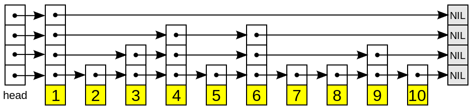

#### Java基础

##### ArrayList Vector Array异同

- ArrayList和Vector都是单列容器，底层都使用数组实现。
- ArrayList是非同步的，Vector是同步的。
- Array通过反射提供动态创建和访问数组的功能。

##### hashmap hashtable concurrenthashmap异同

- 它们都是双列容器。

- hashmap底层为数组+链表/红黑树，可以存储null键和null值，非同步。

  - 为什么用红黑树不用AVL树，因为红黑树插入和删除节点后的调整比AVL树更快，而查询性能损失并不多。

  - ```
    (h = key.hashCode()) ^ (h >>> 16)
    ```

    为什么高16位和低16位异或，因为高低位都参与到计算中，尽可能降低hash冲突。

  - ```
    (n - 1) & hash
    ```

    为什么HashMap的数组长度要取2的整数幂，因为这样（数组长度-1）正好相当于一个“低位掩码”，与key的hash做与运算，得到数组下标。

  - 链表转红黑树的阈值为什么是8，因为与泊松分布有关，hash函数选择比较好的时候，链表的长度到达8给可能性很小。但不能避免用户选择不好的hash函数。

  - JDK8中做的优化：

    - 链表长度大于8且数组长度大于64时，链表会转换为红黑树。

    - 插入时在链表尾部插入，为了避免多线程环境下rehash形成环（当然多线程环境下还是不安全的）。

      

    - entry被node替代，因为加入了树节点。

    - 先插入再扩容。

- hashtable底层为数组+链表，不可以存储null键和null值，同步。

- concurrenthashmap底层

  - JDK1.7为分段的数组+链表，通过给每个段进行加锁ReentrantLock，实现线程安全。
  - JDK1.8为Node数组+链表/红黑树，并发控制使用Synchronized和CAS来操作。
  - 1.8的锁粒度更小，并且使用内置锁替代重入锁。使用红黑树进行优化。

##### hashmap linkedhashmap treemap异同

- linkedhashmap基于hashmap和双向链表实现，treemap基于红黑树实现。
- hashmap不能保证数据有序，linkedhashmap记录了数据的插入顺序，treemap能够把它保存的记录根据键排序。

##### 重写equals方法的时候需要重写hashCode方法

因为equals方法默认比较两个对象的地址，重写equals方法后，为了让逻辑上相同的对象返回相同的hashcode，需要重写hashcode方法。

##### string为什么定义成final

- string应用太广，为了安全性考虑，因为不可变的对象天生线程安全，另外类加载机制使用字符串定位class文件。不可被继承也就不会出现破坏语义的子类。
- 其次可以用于实现字符串常量池，节省内存空间，提高效率。

##### 如何获取无符号类型

```
System.out.println((Integer.MAX_VALUE<<1) & 0xFFFFFFFFL);
```

##### 抽象类和接口

- 抽象类主要用于捕捉子类的通用特性，是对类的抽象。
- 接口是抽象方法/功能的集合，是对行为的抽象。
- 相同之处：
  - 它们都不能被实例化、位于继承的顶端。
  - 都具有抽象方法。
- 不同之处：
  - 关键字不同。
  - 抽象类可以有构造函数，接口不能。
  - 一个类只能继承一个抽象类，但可以实现多个接口。

##### 多态

- 多态是指引用变量所指向的具体类型以及调用的方法是在运行期间才能确定的，具体体现在使用父类或接口的引用变量指向子类或实现类的实例对象。
- 可以分为编译时多态（方法重载，通过静态分派实现）和运行时多态（方法重写，通过动态分派实现）。

##### 反射

- 运行过程中动态获取类的信息，或者动态调用对象的方法。
- 应用场景：运行过程中动态加载字节码文件，动态代理。
- 原理：通过获取类加载后在堆中生成的class对象，获取该类的信息。
- 获取反射的三种方法：
  - Class.forName(全限定名)。
  - 类名.class。
  - 对象的getClass()方法。

##### 深拷贝与浅拷贝

- 深拷贝是复制一个对象之后，引用类型引用的对象，复制独立的一份。
- 浅拷贝是复制一个对象之后，引用类型只复制引用，不复制引用的对象。

- Cloneable接口中的clone方法是浅拷贝。
- 如何实现深拷贝：
  - 继承Cloneable接口，重写clone方法。
  - 利用序列化。

##### 序列化与反序列化

- 序列化是将**对象**转换为字节流，而反序列化则是把对象从字节流中读取出来。
- 作用为完整地保存和传递对象。
- 如何实现：实现Serializable接口，通过ObjectInputStream和ObjectOutputStream中的方法进行序列化和反序列化。
- 序列号作为类的版本信息，在反序列化过程中用于告知接收者应该使用与序列号相同的类。
- static和transient类型的成员数据不能被序列化。因为static代表类的状态，transient代表对象的临时数据。

##### BIO、NIO、AIO

- BIO：同步阻塞式IO。线程进行IO操作时需要被挂起，等待IO操作完成。以这种模式进行通信的服务器，对于每条连接都创建一条线程去处理，因此并发访问量增加后，线程数目膨胀，造成服务器宕机。适用于连接数目比较少的场景。

  采用线程池可以避免线程数目膨胀，达到伪异步IO的效果，但是本质上仍然是同步阻塞IO，因此无法达成高的并发量。

- NIO：同步非阻塞式IO。线程进行IO操作时不需要被挂起，但通过轮询方式检查IO操作是否就绪。Java NIO通过一个多路复用器Selector轮循多个通道Channel，某个Channel的IO就绪时就会被选择出来进行后续的IO操作。适用于连接数目多且连接比较短的场景，如聊天服务器。

- AIO：异步IO。线程进行IO操作时不需要等待和轮询，IO操作完成时由内核通知。通过事件和回调机制实现。适用于连接数目多且连接比较长的场景。AIO目前在Linux下还没有完全实现，而且需要考虑适用场景，因此并不是无脑选择AIO。

#### Java线程与同步相关

##### 锁：互斥（阻塞）同步

- volatile：轻量级的同步机制，仅仅⽤来保证该变量对所有线程的并发可⻅性，但不保证原⼦性。可以用于禁止指令的重排序。

  因为会在赋值后多执行一条带有Lock前缀的空操作（内存屏障，意味着之前所有的操作已经执行完成），它会将当前处理器缓存行的数据写回到内存，同时使其他处理器里缓存了该内存地址的数据无效。这样就会使该数据对其他线程立即可见。

  但是写操作并不是原子性的，通常有好几条字节码指令，因此不能保证多个线程同时修改数据时的一致性。可以与原子类的CAS操作结合，实现原子性。

- synchronized：语言内置的互斥锁，保证可见性与原子性。

  同步代码块在字节码层面由monitorenter和monitorexit完成，标记为synchronized的方法会在方法表中ACC_SYNCHRONIZED字段体现，底层使用ObjectMonitor作为锁对象，它保存一些信息，如被哪条线程持有，重入次数等。

  JDK6之后有一些升级，如偏向锁、轻量级锁、锁粗化、锁消除、自适应自旋等。

- Lock：显式互斥锁，底层通过AQS实现。主要有ReentrantLock和ReentrantReadWriteLock。

  相比synchronized，用法更加灵活，但需要手动释放锁。提供了一些更高级的功能，比如

  - 等待的线程可以放弃等待。
  - 公平锁，先到先服务（使用队列完成）。
  - 支持条件对象。

  基本上是根据互斥量（AQS的state变量）来实现的，即0表示锁空闲，其他值表示锁被占用。

  读写锁可以做到读数据时允许多个线程同时进入临界区，而写数据时，所有线程都是互斥的。

##### AQS

- AbstractQueuedSynchronizer：Lock的底层实现，为实现阻塞锁和相关同步器（信号量、事件等）提供一个框架。
- AQS维护了一个volatile语义(支持多线程下的可见性)的共享资源变量state和一个FIFO线程等待队列(多线程竞争state被阻塞时会进入此队列)。
- 拥有两种线程模式：
  - 独占模式：只有单个线程能够成功获取资源并执行，如ReentrantLock。
  - 共享模式：多个线程可成功获取资源并执行，如Semaphore/CountDownLatch等。
- 通过state变量实现可重入的机制。

##### 死锁

资源死锁通常是一个线程需要持有两个锁才能继续执行，但它和另一个线程互相占有一个对方持有的锁，等待对方释放。主要原因是循环依赖，两个线程获取锁的顺序交错/不确定。解决方法有：

- 固定加锁的顺序。
- 开放调用，调用某个方法时不需要持有锁，而是只保护涉及操作共享变量的代码块。
- 使用具有定时功能的显式锁。

##### 原子类：非阻塞同步

- CAS：更新一个变量时，首先将拿到的内存值与期望值比较，如果相同，则将它更新为新值。如果不相同，则将期望值更新为内存值，**并自旋不停地尝试**。**它的关键其实在于CAS是CPU指令级别的原子操作，因此必然会保证一个线程执行完毕的结果先写入内存，让其他线程可见，这样与期望值的比较就能发挥作用。**
- 原子变量类包括基本数据类型、数组、引用类型、对象的属性等。带有版本信息的原子类，可以解决ABA问题。

##### ThreadLocal

ThreadLocal提供线程私有的变量，可以用于一些线程之间需要隔离的操作，如对于数据库的连接需要每个线程独占。

提供一个set方法，使用map集合将ThreadLocal对象和变量关联起来。**每个Thread对象持有一个map集合**，调用get方法时，当前线程的ThreadLocal对象作为key获取它对应的值。

##### Java线程

- 使用操作系统的原生线程1对1映射。

- 使用抢占式线程调度，有10个线程优先级。

- 定义了6种线程状态：新建、运行、阻塞、限时等待、无限期等待（类似于就绪）、结束。

  

- 创建线程的方式：继承Thread类、实现Runnable接口、实现Callable接口、线程池。

##### Java线程池

线程的集合，当请求到来时给它分配一个空闲线程，任务完成后回到线程池中而不是销毁。

为什么用它，因为为每个请求开启一个线程，一方面线程的创建和销毁开销比较大，另一方面请求过多或收到恶意攻击将导致程序崩溃。因此使用线程池可以减少对线程生命周期的管理，提高性能。另外，使用线程池还可以根据项目灵活地控制并发的数目。

- 线程池API：

  ThreadPoolExecutor类最为常用，一般使用Executors工厂方法来配置。它的函数签名为

  ```java
  public ThreadPoolExecutor(int corePoolSize,
                          int maximumPoolSize,
                          long keepAliveTime,
                          TimeUnit unit,
                          BlockingQueue<Runnable> workQueue,
                          ThreadFactory threadFactory,
                          RejectedExecutionHandler handler)
  ```

  - 如果运行的线程数小于corePoolSize，则新创建线程来处理请求，即使其他线程是空闲的。
  - 如果运行的线程数大于corePoolSize，小于maximumPoolSize，则仅当任务队列满时才创建新线程。
  - 如果设置corePoolSize和maximumPoolSize相同， 则创建了固定大小的线程池。
  - 如果设置maximumPoolSize为一个巨大的值如Integer.MAX_VALUE，则允许线程池适应任意大小的并发任务。

  任务队列有三种排队策略：

  - 直接提交给线程（同步移交，如**SynchronousQueue**）。
  - 无界限的队列（超过核心线程数就放入队列等待，如**LinkedBlockingQueue**）
  - 有界限的队列（需要权衡队列容量与最大线程容量，如**ArrayBlockingQueue**）。

  拒绝任务有四种策略：

  - 直接抛出异常。
  - 用调用者所在线程来执行任务。
  - 直接丢弃该任务。
  - 丢弃最老的一个任务。

  默认实现的池：

  - newFixedThreadPool，一个固定线程数的线程池。

    ```java
    public static ExecutorService newFixedThreadPool(int nThreads) {
    	return new ThreadPoolExecutor(nThreads, nThreads,
                                        0L, TimeUnit.MILLISECONDS,
                                        new LinkedBlockingQueue<Runnable>());
    }
    ```

  - newCachedThreadPool，直接提交给线程的、最大线程数为Integer.MAX_VALUE的线程池。

    ```java
    public static ExecutorService newCachedThreadPool() {
        return new ThreadPoolExecutor(0, Integer.MAX_VALUE,
                                        60L, TimeUnit.SECONDS,
                                        new SynchronousQueue<Runnable>());
    }
    ```

  - SingleThreadExecutor，单个工作线程的线程池。

    ```java
    public static ExecutorService newSingleThreadExecutor() {
    return new FinalizableDelegatedExecutorService
            	(new ThreadPoolExecutor(1, 1,
                                        0L, TimeUnit.MILLISECONDS,
                                        new LinkedBlockingQueue<Runnable>()));
    }
    ```

- 阻塞队列：当队列满时，队列会阻塞插入元素的线程，直到队列不满。队列为空时，获取元素的线程会等待队列变为非空。

  为什么用阻塞队列不用非阻塞队列：使用非阻塞队列，当队列满的时候，新的任务将无法得到保留。

#### Java虚拟机

##### 运行时数据区

方法区、堆，线程共享，栈（虚拟机栈，本地方法栈）、程序计数器，线程私有。

- 方法区用于存放加载的类型信息、常量、静态变量等。

- 堆用于存放对象。
- 栈用于存放局部变量、操作数栈、方法出口等。
- 程序计数器用于指示当前线程执行的字节码指令行号。

##### new指令创建对象过程

1. 首先检查类型是否已被加载、解析和初始化过。
2. 类型检查通过后，为对象分配一块内存空间。
3. 将内存空间初始化为0，对对象头（类的信息、哈希码、GC年龄等）进行设置。
4. 执行实例构造函数，对对象进行初始化。

- 对象的内存布局：对象头、实例数据和对齐填充。

  对象的访问方式有句柄和直接指针两种，Java为直接指针。

##### 垃圾收集

  - 如何判断对象存活：引用计数法、可达性分析。
  - 垃圾收集算法：标记-清除，标记-复制，标记-整理。
  - 经典垃圾收集器：基于分代收集理论，通常为两类，一类用于收集新生代，一类用于收集老年代。

    - Serial：新生代收集器，基于标记-复制算法。单线程工作。
    - ParNew：新生代收集器，基于标记-复制算法。多线程工作。
    - Parallel Scavenge：新生代收集器，基于标记-复制算法。多线程工作。可以控制吞吐量。
    - Serial Old：老年代收集器，基于标记-整理算法。单线程工作。
    - Parallel Scavenge Old：老年代收集器，基于标记-整理算法。多线程工作。可以控制吞吐量。
    - CMS：老年代收集器，基于标记-清除算法。多线程工作。可以并发标记和清除，低停顿。
    - Garbage First：混合收集器，基于标记-复制算法。基于Region的堆内存设计，根据Region的价值进行回收，停顿时间可控。
      - CMS和Garbage First的标记：初始标记，标记GC Roots直接关联到的对象；并发标记，对堆中的对象进行可达性分析，标记出存活的对象；最终标记，修正变更的标记。
  - 过程：当一个对象已经不存在指向它的引用时，它成为可回收的对象。虚拟机会额外启动一条垃圾收集线程对这些可回收对象进行回收，总体过程就是**先通过可达性分析进行标记，然后回收**。
  - 有垃圾收集为什么还会产生内存泄漏：
    - IO连接、数据库连接、网络连接等不显式关闭则会造成内存泄漏。
    - 静态集合类、匿名内部类等也可能造成内存泄漏。

##### class文件

采用无符号数和表两种数据类型存储数据。结构为魔数、虚拟机版本、常量池表、访问标志、继承关系、字段表、方法表、属性表。

##### 类加载机制

虚拟机把描述类的class文件加载到内存，对数据进行校验、解析和初始化的过程。

类加载的过程为加载、连接（验证、准备、解析）、初始化、使用和卸载。

- 加载：通过类的全限定名获取class文件，将它转化为方法区的运行时数据结构，在堆中生成一个对应的Class对象。
- 验证：class文件格式校验、类的元数据验证、方法体的字节码验证、符号引用验证。
- 准备：为类中定义的静态变量分配内存并设置初始值，初始化虚方法表。
- 解析：将常量池内的符号引用替换为直接引用。
- 初始化：执行类构造器方法，根据代码的内容初始化静态变量。

##### 类加载器

在虚拟机外部实现，通过一个类的全限定名获取它的class文件。不同的类加载器加载的同一个class文件也不是一个类。

- 类加载架构：三层类加载器，双亲委派模型。

  启动类加载器，扩展类加载器（平台类加载器，JDK9），应用程序类加载器。它们管理的范围不同，确保程序运行的稳定性，如java.lang.Object类只会由启动类加载器加载，所有的java.lang.Object类都是同一个。

  工作机制：一个类加载器收到的类加载请求后，首先把它委派给父类加载器去完成，每一层都是如此。只有当父类加载器无法完成加载请求时，子类加载器才会尝试完成。


##### 方法调用

解析调用和分派调用两种。

  - 解析调用：静态方法、私有方法、实例构造器等非虚方法，在解析阶段就能确定方法的版本。
  - 分派调用：静态分派（重载，编译时根据传递的参数确定方法版本）、动态分派（重写，运行时根据实际对象确定方法版本）。

##### Java内存模型

- Java内存模型将内存分为了**主内存和工作内存**。所有的变量都存储在主内存中，每条线程拥有自己的工作内存，其中保存被该线程使用的变量的主内存副本，线程对变量的所有操作都必须在工作内存中进行，而不能直接读写主内存中的数据。不同线程之间无法直接访问对方工作内存中的变量，线程间变量值的传递均需要通过主内存完成。
- 定义了几个原子操作，用于完成主内存与工作内存之间的交互。
- 定义了volatile变量的使用规则。
- 先行发生原则。

#### 操作系统

##### 进程、线程之间的区别与通信方式

- 进程是一个正在运行的程序的实例，它是系统分配资源和调度的独立单位。它包含程序运行的所有资源，如程序正文、打开的文件、程序计数器等。

  线程是进程的执行单元，每个进程至少有一条线程，它是CPU调度的的基本单位。它包含程序计数器、寄存器、堆栈等。

- 进程之间的通信方式有（用于进程之间的数据交互或同步）
  - 管道（pipeline）：管道是一种半双工的通信方式，数据只能单向流动，而且只能在具有亲缘关系的进程间使用。
  - 信号量：用一个整型变量记录可以进入临界区的最大进程数。
  - 信号：用于通知接收进程某个事件已经发生，如`kill -9`。
  - 消息队列：消息队列是由消息的链表，存放在内核中并由消息队列标识符标识。
  - 共享内存。
  - 套接字（socket）：通常用于不同机器的进程之间通信，如互联网。
- 线程之间的通信方式有（与进程类似）
  - 锁机制：各种互斥锁、条件变量。
  - 信号量：用一个整型变量记录可以进入临界区的最大线程数。两种原子操作down和up，类似于sleep和wakeup。当一个线程进入临界区时，使用down检查信号量是否大于0，若大于0，则将其值减1，若为0，则线程将睡眠。当一个线程离开临界区时，使用up将信号量的值加1，如果该信号量有睡眠线程，则值仍然为0，但唤醒该线程。
  - 信号：类似Java中的wait/notify方法。
  - 消息队列。
  - 共享变量。

##### 同步IO/异步IO

同步IO中，用户进程发起IO操作后需要等待（阻塞）或轮询（非阻塞）IO操作是否就绪，然后将数据从内核态拷贝到用户态，这个过程也需要阻塞。

异步IO中，用户进程发起IO操作后返回，继续运行。IO操作完成时得到通知，数据从内核态拷贝到用户态的过程由内核完成，因此全程不需要阻塞。


- 同步IO的特点：
  - 同步IO指的是用户进程触发I/O操作并等待或者轮询的去查看I/O操作是否就绪。
  - 同步IO的执行者是IO操作的发起者。
  - 同步IO需要发起者进行内核态到用户态的数据拷贝过程，所以这里必须阻塞。

- 异步IO的特点：
  - 异步IO是指用户进程触发I/O操作以后就立即返回，继续开始做自己的事情，而当I/O操作已经完成的时候会得到I/O完成的通知。
  - 异步IO的执行者是内核线程，内核线程将数据从内核态拷贝到用户态，所以这里没有阻塞。

##### 任务调度算法

- 轮转调度：每个进程被分配一个时间段，允许进程在该时间段内运行。

  缺点是时间片的长度设置，设置过短导致进程切换频繁，很多时间浪费在管理进程上，设置过长导致后面的进程等待时间过长，响应太慢。

- 优先级调度：每个进程被赋予一个优先级，允许优先级最高的可运行进程先运行。在每一个优先级组里可以使用轮转调度。

  切换进程的方式有两种，一种是随着时钟运行降低当前进程的优先级，当低于次高优先级的进程时进行切换；另一种仍然是赋予每个进程一个允许运行的最大时间片。
  
- 当然还有先到先服务、短作业优先等等。

##### 虚拟内存

- 通过分页交换技术实现，将虚拟地址空间分解成页，将每一页或者映射到物理内存的某个页框，或者解除映射。
- 页面置换算法：
  - OPT，最优页面置换算法：标记一个页面下次被使用时需要经过多少条指令，然后置换出标记最大的页面。但是不可实现。
  - FIFO，先进先出页面置换算法：队列头最先进来的页面将被置换出去。
  - LRU，最近最少使用页面置换算法：每当新加入一个页面，或一个页面被使用，将它放入链表头，链表满的时候置换出链表尾的页面。

##### 上下文切换

上下文切换是指CPU的控制权由运行任务转移到另外一个就绪任务。

- 让步式上下文切换。执行线程主动释放CPU，与锁竞争严重程度成正比，可通过减少锁竞争来避免。
- 抢占式上下文切换。线程因分配的时间片用尽而被迫放弃CPU或者被其他优先级更高的线程所抢占，一般由于线程数大于CPU可用核心数引起，可通过调整线程数，适当减少线程数来避免。

##### Linux

- 常用指令
  - CPU使用率

    通过top、ps、pidstat等工具，可以找到具体的进程。perf可以分析具体的事件。

  - 查看进程IO占用

    iotop、pidstat

  - 查看本机各端口的网络连接情况

    netstat

  - 根据关键字查看日志中关键字的上下10行：`grep -C 10 "SGD" 0.py`。

- 启动过程
  1. 加载BIOS硬件信息。
  2. 读取引导文件，引导内核。
  3. 运行init进程，设定运行级别（如单用户模式/多用户模式，有无网络支持等等）。
  4. 建立终端，用户登录。

#### 计算机网络

##### MAC地址

- 长48位，由厂商识别码和厂商内识别码来保证不重复。

##### NAT

- NAT（Network Address Translator）是用于在本地网络中使用私有地址，在连接互联网时使用全局IP的技术。当私有网络内的多台机器同时与外部进行通信时，将端口号一起转换（NAPT）。

##### 五层/七层网络体系

- 应用层：HTTP、SMTP、FTP、DNS、SSH、DHCP

- 传输层：TCP、UDP

- 网络层：IP、ARP、ICMP、各种路由协议（RIP、OSPF、BGP）

- 数据链路层：以太网、PPP、各种WLAN协议（IEEE802.11、蓝牙）

- 物理层

  与OSI七层网络体系的区别在于表示层和会话层被取消，作用融入到应用层和传输层中。

##### TCP/UDP

- UDP（user data protocol）提供面向无连接的通信，可以随时发送数据，不需要接收端进行确认。

  不提供流量控制、丢包重发等等复杂的控制功能，因此不能保证可靠传输。

  不提供拥塞控制，网络出现拥塞后不会使发送端降低速率。

  面向报文，一次传输交付一个完整报文，因此传输时不合并、拆分，不存在粘包问题。

  支持一对一、一对多、多对一和多对多的通信。

- TCP（transmission control protocol）提供面向有连接的通信，而且是全双工通信。

  提供了数据传输时充分的控制功能，以实现可靠性传输。

  面向字节流，传输时拆分为数据段，因此可能出现粘包问题。

  提供一对一的通信。

- 三次握手：假设B处于监听状态，A首先向B发送一个请求报文，SYN=1。然后B向A发送一个回复报文，SYN=1，ACK=1。最后A再进行确认，向B发送一个回复报文，ACK=1。这个过程种虽然没有实际数据，但需要双方确定序列号。

  为什么三次：一个角度是避免失效的连接请求发送到服务端，服务端直接建立连接浪费资源。另一个角度是确认双方的收发功能都没有问题。

- 四次挥手：A要断开连接，向B发送一个请求报文，FIN=1。然后B向A发送一个回复报文，ACK=1，表明B知道要断开连接了，此时处于半断开状态（A已经不会再给B发送数据）。然后B可能还有数据要发送，因此等剩余数据发送完毕后，向A发送一个回复报文，FIN=1。然后A再进行确认，向B发送一个回复报文，ACK=1，接着等待一段时间（TIME_WAIT状态，2MSL），确保最后这个报文到达了B，以及本次连接产生的所有报文都从网络中消失。

- 重发控制（ARQ，停止等待协议）：发送端发包后计算往返时间，将往返时间和偏差相加作为重发时间间隔。再次发送时，以2、4的指数增长。

- 滑动窗口/流量控制（连续ARQ）：发送端控制一个滑动窗口，滑动窗口内的数据不需要进行确认即可直接发送，接收端通常采用累积确认的方式，对按序到达的最后一个包进行确认，发送端收到这个确认后将滑动窗口向后推进。不考虑阻塞的情况下，窗口大小由接收端的缓存大小所确认的，以确保接收端来得及接收数据。

- 拥塞控制（慢启动、拥塞避免、快重传、快恢复）：发送端控制一个拥塞窗口，通信开始时为了避免发送一个大数据导致网络瘫痪，使用慢启动算法，即拥塞窗口设置为一个报文段，每收到一个ACK，拥塞窗口增加一个报文段。当拥塞窗口超过慢启动阈值后，拥塞窗口呈线性增长，即拥塞避免算法。

  当出现超时重发时，慢启动阈值设置为当前窗口的一半，并将拥塞窗口回归1个报文段。

  当出现重复确认应答时，即快重传算法，慢启动阈值设置为当前窗口的一半，并将拥塞窗口设置为慢启动阈值，即快恢复算法。

  

- 提高网络利用率的规范

  - Nagle算法：仅当满足已发送的数据都已经收到ACK，或可以发送MSS长度的数据时进行发送数据，否则就延迟发送数据。
  - 延迟确认应答：接收端收到数据后不马上发送ACK，避免每次接收到数据后由于缓冲区的占用发送小的窗口大小。
  - 捎带应答：确认应答和回执数据通过一个包发送。例如三次握手中服务器给客户都发送ACK和SYN在一个包中。

- TCP的长连接与短链接

  取决于怎么使用，短连接为建立连接-传输数据-断开连接，然后再建立连接-传输数据-断开连接的模式。长连接为建立连接-传输数据-保持连接-传输数据-断开连接。

  长连接是通过Keep-Alive机制实现的，在一定时间内（一般时间为 7200s）在链路上没有数据传送的情况下，**服务端**将发送相应的KeepAlive探针以确定连接存活，探测失败后重试10次，每次间隔时间75s，所有探测失败后，才认为当前连接已经不可用。但这个是在传输层上的连接存活，不能保证应用层面的连接可用性。

  - **TCP KeepAlive处于传输层，由操作系统负责，能够判断进程存在，网络通畅，但无法判断进程阻塞或死锁等问题。**

  HTTP的Keep-Alive意在连接复用，而TCP的Keep-Alive意在探测连接存活。

  服务端缓解长连接压力：服务端可以清理那些长时间没有通信的连接，或者限制客户端的最大空闲连接时长。

- 应用层心跳：**客户端**会开启一个定时任务，定时对已经建立连接的对端应用发送心跳请求，服务端则需要特殊处理该请求，返回响应。如果心跳持续多次没有收到响应，客户端会认为连接不可用，主动断开连接。

  - 优化：利用正常的请求来作为心跳。

##### 路由

- 路由器根据路由控制表转发IP数据包，它根据收到的数据包中目标主机的IP地址，在路由控制表中查找得到下一个应该接收的路由器。

##### HTTP

- 请求报文由请求行（请求方法、请求 URI、协议版本）、请求首部字段、空文本行和请求体构成。

  响应报文由响应行（协议版本、状态码、用以解释状态码的原因短语）、响应首部字段、空文本行和响应体构成。

- HTTP的通信过程：建⽴TCP连接->发送请求⾏->发送请求头->（到达服务器）发送响应⾏->发送响应头->发送响应数据->断TCP连接。

- HTTP1.0和1.1的区别：

  - 支持的方法有区别，如OPTIONS只有1.1支持。
  - 首部字段有区别。
  - 1.1支持持久连接、管线化（连续发送请求）。

- HTTP和HTTPS的区别：

  - HTTP不需要加密、认证，因此不太安全，但是速度快。HTTPS需要加密、认证，更加安全，但是更慢。
  - HTTP端口号80。HTTPS端口号443。
  - HTTP是单纯的应用层协议，HTTPS涉及SSL协议，它是传输层的协议。

- HTTPS的证书类型：单域名、多域名、通配符、DV、OV、EV。

- HTTPS的工作过程：建立连接时，服务器向客户端发送自己的CA证书，客户端根据证书对服务端进行认证，然后用证书中的公钥对接下来要使用的共享密钥进行加密，发送给服务端。服务端使用自己的私钥解密，接下来的通信过程使用共享密钥进行通信。

- GET和POST方法的区别：

  - 都可以用于请求。

  - GET方法的请求参数在URI中，长度有限，相对不安全。POST方法的请求参数在请求体中，长度没有限制，相对安全。

  - GET方法单纯为了获取资源。POST方法可以向服务器传递更多信息，更改资源，例如通过表单进行注册。

- 状态码

  - 100 continue

    101 switching protocols

  - 200 ok

    204 no content

    206 partial content 范围请求成功

  - 301 moved permanently 永久性重定向

    302 found 临时性重定向

    307 temporary redirect 临时性重定向 不会把post变为get

  - 400 bad request 请求报文有语法错误

    401 unauthorized 认证失败

    403 forbidden 禁止访问

    404 not found 资源未找到

  - 500 internal server error

  - 503 service unavailable 服务不可用（忙或者维护）

- 首部

  - 通用首部：cache-control、date、upgrade、via
  - 请求首部：accept、host、user-agent
  - 响应首部：content-type、location、server

#### MySQL

##### 架构


1. **连接层**：最上层是一些客户端和连接服务。主要完成一些类似于连接处理、授权认证、及相关的安全方案。在该层上引入了线程池的概念，为通过认证安全接入的客户端提供线程。同样在该层上可以实现基于SSL的安全链接。服务器也会为安全接入的每个客户端验证它所具有的操作权限。
2. **服务层**：第二层服务层，主要完成大部分的核心服务功能， 包括查询解析、分析、优化、缓存、以及所有的内置函数，所有跨存储引擎的功能也都在这一层实现，包括触发器、存储过程、视图等。
3. **引擎层**：第三层存储引擎层，存储引擎真正的负责了MySQL中数据的存储和提取，服务器通过API与存储引擎进行通信。不同的存储引擎具有的功能不同，这样我们可以根据自己的实际需要进行选取。
4. **存储层**：第四层为数据存储层，主要是将数据存储在运行于该设备的文件系统之上，并完成与存储引擎的交互。

- MySQL 的查询流程：验证身份、查询缓存、缓存不存在则解析SQL，优化并执行。

##### 存储引擎

常见的存储引擎有 InnoDB、MyISAM、Memory和NDB。前两者的主要区别如下：

- InnoDB 支持事务，MyISAM 不支持。
- InnoDB 支持外键，MyISAM 不支持。
- InnoDB 是聚簇索引，MyISAM 是非聚簇索引。
- InnoDB 最小的锁粒度是行锁，MyISAM最小的锁粒度是表锁。

##### 数据类型

主要包括以下五大类：

1. 整数类型：BIT、BOOL、TINYINT、SMALLINT、MEDIUMINT、 INT、 BIGINT
2. 浮点数类型：FLOAT、DOUBLE、DECIMAL
3. 字符串类型：CHAR、VARCHAR、TINYTEXT、TEXT、MEDIUMTEXT、LONGTEXT、TINYBLOB、BLOB、MEDIUMBLOB、LONGBLOB
4. 日期类型：Date、DateTime、TimeStamp、Time、Year
5. 其他数据类型：BINARY、VARBINARY、ENUM、SET、Geometry、Point、MultiPoint、LineString、MultiLineString、Polygon、GeometryCollection等

##### 索引

索引是帮助MySQL高效获取数据的数据结构，类似字典里面的目录。

- 索引的分类：
  - 按数据结构：hash、b+树等。
  - 按物理存储：聚簇索引与非聚簇索引。聚簇索引的叶子节点就是数据节点，而非聚簇索引的叶子节点保存指向对应数据的指针。
  - 按逻辑：主键索引、单列索引、多列索引等。

- 使用索引的优缺点：
  - 优点是提高数据检索效率；降低数据排序成本。
  - 缺点是需要额外的空间保存；降低更新表的速度。

- 常见的索引类型有：hash表，b树、b+树。
  - hash表查找时，根据key调用hash函数计算对应的hashcode，找到对应的数据行地址，根据地址得到对应的数据。

  - B树是一种多叉搜索树，每个节点有多个子节点。每个节点保存key，key对应数据的地址以及指向下一层节点的指针。查找时从根节点出发，直到找到对应的key。

  - B+树是B树的变种，主要区别在于B+树的非叶子节点只能保存key和指向下一层节点的指针。叶子节点之间通过指针连接，构成一个有序链表。

  MySQL的索引使用B+树，不使用hash、红黑树、B树的原因是：索引文件很大，不能全部读入内存，而红黑树和B树层数较多，会涉及更多的磁盘I/O操作。而hash不支持范围查找、不支持排序等操作。

  而使用B+树的好处有：

  - 磁盘IO代价更低：非叶子节点节点没有指向数据地址的指针，因此非叶子节点节点相对B树更小，这样在磁盘的一个block上可以存储更多key的信息。
  - 查询效率更加稳定：只有叶子节点保存指向数据地址的指针，因此查询所有数据都需要从根节点到叶子节点。
  - 在范围操作上效率更高：因为只需要遍历叶子节点就相当于遍历整棵树。

##### 事务

事务是由一组SQL语句组成的逻辑处理单元。

事务四大特性ACID：原子性（Atomicity）、一致性（Consistency）、隔离性（Isolation）、持久性（Durability）。

- 原子性：事务是最小的操作单位，这些操作要么全部成功，要么全部失败。
- 一致性：事务操作前后，数据库的完整性约束不被破坏（unique的字段不会出现重复）。
- 隔离性：事务之间相互独立，一个事务的操作不影响另一个事务。
- 持久性：一个事务提交之后，数据库会持久化地保存数据。

事务的隔离性是通过锁实现，而事务的原子性、一致性和持久性则是通过事务日志实现 。

- redo log（重做日志）实现持久化和原子性。事务开启时，事务中的操作都会先写入重做日志，提前刷新到磁盘上持久化。
- undo log（回滚日志）实现一致性。回滚日志记录数据在每个操作前的状态。

##### 事务隔离级别

事务隔离级别：读未提交、读已提交、可重复读、串行化。

用于解决脏读、不可重复读、幻读的问题。

- 脏读：一个事务读到另一个事务还未提交的数据。
- 不可重复读：一个事务中多次读取同一个数据，结果出现不一致。
- 幻读：一个事务使用相同的SQL两次读取，第二次读取到其他事务新插入的行。（实际情况是事务一查询一条记录不存在，接下来准备插入，此时事务二插入了一条记录，导致事务一的插入操作失败。）

##### MVCC（乐观锁思想）

数据多版本并发控制（MultiVersion Concurrency Control），不用加任何锁， 通过一定机制**生成一个数据请求时间点的一致性数据快照** （`Snapshot`)，并用这个快照来提供一定级别 （语句级或事务级） 的一致性读取。

MVCC 的实现是**通过保存数据在某个时间点的快照来实现的**。具体地，通过在每行记录后面保存两个隐藏的列来实现。这两个列，一个保存了行的创建版本号，一个保存行的删除版本号。

##### 锁（悲观锁思想）

- 锁类型：
  - 行级锁：开销大，加锁慢；会出现死锁；锁定粒度最小，发生锁冲突的概率最低，并发度也最高。
  - 页级锁：开销和加锁时间界于表锁和行锁之间；会出现死锁；锁定粒度界于表锁和行锁之间，并发度一般。（LIMIT子句）
  - 表级锁：开销小，加锁快；不会出现死锁；锁定粒度大，发生锁冲突的概率最高，并发度最低。
- innoDB的行锁算法：
  - 记录锁（Record Locks）：单个行记录上的锁。对索引项加锁，锁定符合条件的行。
  - 间隙锁（Gap Locks）：当使用范围条件而不是相等条件检索数据，对于键值在条件范围内但并不存在的记录，叫做“间隙”。InnoDB 也会对这个“间隙”加锁，这种锁机制就是所谓的间隙锁。（避免幻读）
  - 临键锁(Next-key Locks)：临键锁，是记录锁与间隙锁的组合，它的封锁范围，既包含索引记录，又包含索引区间。（避免幻读）
- 数据库的死锁产生同样是由于两个事务以不同的顺序锁定资源。
  - InnoDB目前处理死锁的方法是，将持有最少行级排他锁的事务进行回滚。

##### 主从复制

- slave 会从 master 读取 binlog 来进行数据同步。

- 三个步骤

- - master将改变记录到二进制日志（binary log）。
  - salve 将 master 的 binary log events 拷贝到它的中继日志（relay log）。
  - slave 重做中继日志中的事件，将改变应用到自己的数据库中。MySQL 复制是异步且是串行化的。

##### SQL与HQL的区别

- SQL面向数据库查询，HQL面向对象查询。
- SQL中使用表名、字段进行查询，HQL使用类名+类对象、对象的属性进行查询。

##### SQL查询的一些细节

- count(*) 和 count(1)和count(列名)区别：

  - 前两个包含所有的列，不会忽略null；第三个只包含列名对应的列，会忽略null。
  - 根据列名是否为主键，count(1)和count(列名)的执行速度有所区别。

- in和exists区别：

  - exists判断子查询是否有记录返回。

  - in判断A是否在集合B内。

    ```mysql
    SELECT * FROM A WHERE A.id IN (SELECT id FROM B);
    -- 这条语句首先将B的id都列出来，然后对A的每一个id，判断它是否在集合B以内。有点类似一个双重循环。
    SELECT * FROM A WHERE EXISTS (SELECT * from B WHERE B.id = A.id);
    -- 这条语句对A的每一个id，直接在B中进行条件查询，有记录返回，就把这个id对应的记录列出来。否则看下一个id，这样就是一个一重循环，查询的过程是很快的。
    ```

- union和union all的区别：
  - 都是将两个结果集合并为一个。
  - union会筛选到重复的记录，而union all不会。
  - union会对结果集进行排序（按select关键字后的第一个字段），而union all不会。

- where和having的区别：

  - where 在分组之前进行限定，如果不满足条件，则不参与分组。having在分组之后进行限定，如果不满足结果，则不会被查询出来。
  - where 后不可以跟聚合函数，having可以进行聚合函数的判断。

- 内连接、外连接、交叉连接（笛卡尔积）：

  

  - 内连接：取得两张表中满足存在连接匹配关系的记录。

  - 外连接：取得两张表中满足存在连接匹配关系的记录，以及某张表（或两张表）中不满足匹配关系的记录。

  - 交叉连接：显示两张表所有记录一一对应的结果。

    ```
    表1 A B
    表2 C D
    交叉连接：AC AD BC BD
    ```

##### SQL如何优化

- 最主要的是避免进行全表扫描。
- 在where子句涉及的列上适当地创建索引。
- 避免使用select *，查询需要的字段。
- 少写子查询，多用连接操作（join）。
- 用EXISTS替代IN。

#### Redis

Redis是一种非关系型数据库，将数据以键值对的形式保存在内存中，也可以持久化到硬盘中。主要应用在缓存、排行榜、消息队列、通过集合的操作（交并等）完成好友关系等。

##### 两种持久化机制：RDB 和 AOF

  - RDB：当前进程的数据生成快照存入到磁盘中。适用于全量备份。
  - AOF：把写指令都记录下来，重启redis时再执行它们恢复数据。适用于实时地持久化数据，因为只记录写指令。

##### Sentinel（哨兵）

哨兵通过发送命令，等待Redis服务器响应，从而监控运行的多个Redis实例。可以在master宕机时自动进行**故障切换**，将slave切换成master。

- 故障切换过程：假设主服务器宕机，哨兵1先检测到这个结果，系统并不会马上进行failover过程，仅仅是哨兵1主观的认为主服务器不可用，这个现象成为**主观下线**。当后面的哨兵也检测到主服务器不可用，并且数量达到一定值时，那么哨兵之间就会进行一次投票，投票的结果由一个哨兵发起，进行failover操作。切换成功后，就会通过发布订阅模式，让各个哨兵把自己监控的从服务器实现切换主机，这个过程称为**客观下线**。这样对于客户端而言，一切都是透明的。

##### 缓存穿透、缓存击穿、缓存雪崩三大问题

- 缓存穿透：客户持续向服务器查询不存在的key。先在Redis中查询，查询不到后去数据库中查询。
  - 如何避免：对查询结果为空的情况也进行缓存、对请求参数进行过滤。
- 缓存击穿：一个key对应的数据过期了，这时收到大量的请求，只能到数据库中查询。
  - 如何避免：设置另一个短期key来锁住当前key的访问，访问结束再删除该短期key。
- 缓存雪崩：大量缓存集中在某一个时间段失效，这时收到大量的请求，只能到数据库中查询。
  - 如何避免：不同缓存的过期时间设置随机。

##### 数据淘汰机制

为一个key设置过期时间，然后使用定期删除和惰性删除两种方式删除过期的数据。

- 定期删除：每隔一段时间随机抽取一些过期的key进行删除。
- 惰性删除：过期的key被访问时再进行删除。

##### 五种数据类型

- 字符串类型 string
- 哈希类型 hash
- 列表类型 list
- 集合类型 set
- 有序集合类型 zset

##### 底层数据结构

- 简单动态字符串（SDS）：额外定义len属性以及free属性记录字符串的长度以及buf数组未使用的字节数量。

- 链表：双向链表。具有头、尾指针。无环。带长度计数器。

- 字典：数组+链表的形式。

- 跳跃表：一种**有序**数据结构，通过保存多层的索引，达到快速找到元素的目的。可以通过概率选择加入到上一层索引的节点，避免复杂度退化。

  

- 整数集合：用于保存整数值的集合数据类型，它可以保存类型为int16_t、int32_t 或者int64_t 的整数值，并且保证集合中不会出现重复元素。

- 压缩列表：由一系列特殊编码的连续内存块组成的顺序型数据结构。前三个值记录列表长度、尾节点位置、节点个数，每个节点记录自己的类型及长度。

#### Spring Boot

- 是 Spring 开源组织下的子项目，主要简化了使用 Spring 的难度，简省了繁重的配置，提供了各种启动器，开发者能快速上手。
- 核心注解：@SpringBootApplication，包含了@SpringBootConfiguration（实现配置文件的功能）、@EnableAutoConfiguration（开启自动配置）、@ComponentScan（组件扫描）三个注解。
- starter：提供了一个自动化配置类，一般命名为 `XXXAutoConfiguration` ，在这个配置类中通过条件注解来决定一个配置是否生效，然后它还会提供一系列的默认配置，也允许开发者根据实际情况自定义相关配置。
- IOC：反转控制，代码中尽量不使用new这种强引用，因为会导致比较高的代码耦合。Spring使用IOC容器（map对象）统一创建和管理对象，降低代码耦合。
  - 构造器依赖注⼊。
  - Setter方法注⼊。
- IOC容器的创建过程：AnnotationConfigApplicationContext的构造函数执行
  - this() 初始化bean读取器和扫描器。
  - register() 注册bean配置类，主要是处理bean的一些注解，然后将它以键值对形式保存下来。
  - refresh() 创建ioc容器，载入bean定义，完成容器初始化工作。
- bean的生命周期：
  - 单例对象：创建容器时被创建，销毁容器时被销毁。
  - 多例对象：使用对象时创建新的实例对象，对象消亡时被垃圾回收器回收。
- 实例化bean的三种方式：
  - 默认无参构造函数
  - 静态工厂
  - 实例工厂
- 单例：通过@Scope设置singleton、prototype等。
- AOP：面向切面编程，将业务逻辑的不同部分隔离，或者将重复代码抽取出来，通过动态代理的方式在运行期将它们结合起来。这样可以减少重复代码、降低耦合度，便于扩展和维护。
  - JDK动态代理：被代理对象需要有接口。
  - CGLib动态代理：被代理对象没有接口。
- @ResponseBody：响应 json  数据。
  该注解用于将 Controller 的方法返回的对象，通过 HttpMessageConverter 接口转换为指定格式的
  数据如：json，xml 等，通过 Response 响应给客户端。

#### 设计模式

##### 代理模式

给某一个对象提供一个代理，并由代理对象控制对原对象的访问引用。

#### 常用公式

##### 欧几里得算法求最大公约数

- `gcd(a,b) = gcd(b,a mod b)`

  ```java
  private static int gcd(int a, int b) {
      if(b == 0) return a;
      return gcd(b, a % b);
  }
  ```

##### 牛顿迭代法求平方根

- $$x_{n+1}=\frac{1}{2}(x_n+\frac{c}{x_n})$$

  			```java
     private static double sqrt(double c) {
         if (c < 0) return Double.NaN;
         double eps = 1e-15;
         double t = c;
         while (Math.abs(t - c / t) > eps) {
             t = 0.5 * (t + c / t);
         }
         return t;
     }
  ```

##### 二分法求平方根

```java
private static double sqrtBin(double c) {
    if (c < 0) return Double.NaN;
    double left, right;
    if (c >= 1) {
        left = 0;
        right = c;
    } else {
        left = c;
        right = 1;
    }
    double mid = left + (right - left) / 2;
    while (Math.abs(mid * mid - c) > 1e-10) {
        if (mid * mid < c) left = mid;
        else right = mid;
        mid = left + (right - left) / 2;
    }
    return mid;
}
```

##### 判断素数

- ```java
  private static boolean isPrime(int n) {
      if (n < 2) return false;
      for (int i = 2; i * i <= n; i++)
          if (n % i == 0) return false;
      return true;
  }
  ```

- 计算[2，n)的素数个数

  ```java
  int countPrimes(int n) {
      boolean[] isPrim = new boolean[n];
      Arrays.fill(isPrim, true);
      for (int i = 2; i * i < n; i++)
      	if (isPrim[i])
      		for (int j = i * i; j < n; j += i)
      			isPrim[j] = false;
      int count = 0;
      for (int i = 2; i < n; i++)
      	if (isPrim[i]) count++;
      return count;
  }
  ```

##### 快速求幂算法

- 公式：$$a^b=a*a^{b-1},b为奇数；a^b=(a^{b/2})^2,b为偶数.$$

  ```java
  private static int pow(int a, int b) {
      if(b == 0) return 1;
      if(b == 1) return a;
  
      if(b % 2 == 1) {
          return a * pow(a, b-1);
      } else {
          int sub = pow(a, b/2);
          return sub * sub;
      }
  }
  ```

#### 常用数据结构与算法

##### 快速排序

```java
private static void Quick(int[] nums) {
    Quick(nums, 0, nums.length - 1);
}

private static void Quick(int[] nums, int left, int right) {
    if (left >= right) return;
    int j = partion(nums, left, right);
    Quick(nums, left, j - 1);
    Quick(nums, j + 1, right);
}

private static int partion(int[] nums, int left, int right) {
    int t = nums[left];
    int i = left + 1, j = right;
    while (true) {
        while (i <= right && nums[i] <= t) i++;
        while (j > left && nums[j] >= t) j--;
        if (i >= j)
            break;
        swap(nums, i, j);
    }
    swap(nums, left, j);
    return j;
}

private static void swap(int[] nums, int i, int j) {
    int t = nums[i];
    nums[i] = nums[j];
    nums[j] = t;
}
```

##### 归并排序

```java
public void merge(int[] nums) {
    int[] copy = new int[nums.length];
    merge(nums, 0, nums.length-1, copy);
}

public void merge(int[] nums, int left, int right, int[] copy) {
    if(left >= right) return;
    int mid = left + (right - left) / 2;
    merge(nums, left, mid, copy);
    merge(nums, mid + 1, right, copy);
    if(nums[mid] > nums[mid + 1])
    	sort(nums, left, mid, right, copy);
}

public void sort(int[] nums, int left, int mid, int right, int[] copy){
    int i = left, j = mid + 1;
    for (int k = left; k <= right; k++) {
        copy[k] = nums[k];
    }

    for (int k = left; k <= right; k++)
        if (i > mid) nums[k] = copy[j++];
        else if (j > right) nums[k] = copy[i++];
        else if (copy[i] > copy[j]) nums[k] = copy[j++];
        else nums[k] = copy[i++];
}
```

##### 二分查找

```java
int binary_search(int[] nums, int target) {
    int left = 0, right = nums.length - 1; 
    while(left <= right) {
        int mid = left + (right - left) / 2;
        if (nums[mid] < target) {
            left = mid + 1;
        } else if (nums[mid] > target) {
            right = mid - 1; 
        } else if(nums[mid] == target) {
            // 直接返回
            return mid;
        }
    }
    // 直接返回
    return -1;
}

int left_bound(int[] nums, int target) {
    int left = 0, right = nums.length - 1;
    while (left <= right) {
        int mid = left + (right - left) / 2;
        if (nums[mid] < target) {
            left = mid + 1;
        } else if (nums[mid] > target) {
            right = mid - 1;
        } else if (nums[mid] == target) {
            // 别返回，锁定左侧边界
            right = mid - 1;
        }
    }
    // 最后要检查 left 越界的情况
    if (left >= nums.length || nums[left] != target)
        return -1;
    return left;
}

int right_bound(int[] nums, int target) {
    int left = 0, right = nums.length - 1;
    while (left <= right) {
        int mid = left + (right - left) / 2;
        if (nums[mid] < target) {
            left = mid + 1;
        } else if (nums[mid] > target) {
            right = mid - 1;
        } else if (nums[mid] == target) {
            // 别返回，锁定右侧边界
            left = mid + 1;
        }
    }
    // 最后要检查 right 越界的情况
    if (right < 0 || nums[right] != target)
        return -1;
    return right;
}
```

##### KMP

```java
public class KMP {
    private String pat;
    private int[][] dfa;

    public KMP(String pat) {
        this.pat = pat;
        int M = pat.length();
        int R = 256;
        dfa = new int[R][M];
        dfa[pat.charAt(0)][0] = 1;
        for (int X = 0, j = 1; j < M; j++) {
            for (int c = 0; c < R; c++)
                dfa[c][j] = dfa[c][X];  //复制匹配失败情况下的值
            dfa[pat.charAt(j)][j] = j + 1;//设置匹配成功情况下的值
            X = dfa[pat.charAt(j)][X];  //更新重启状态
        }
    }

    public int search(String txt) { 
        int i, j, N = txt.length(), M = pat.length();
        for (i = 0, j = 0; i < N && j < M; i++)
            j = dfa[pat.charAt(i)][j];//在txt上运行dfa
        if (j == M) return i - M;
        else return N;
    }
}
```

##### LRU缓存淘汰策略

```java
package cn.dut.chapter3_1;

import java.util.HashMap;
import java.util.Map;

public class LRU {

    class Node {
        private int key, val;
        private Node prev, next;

        public Node(int key, int val) {
            this.key = key;
            this.val = val;
        }
    }

    class DoubleList {
        private int size;
        private Node first;
        private Node last;

        public void addFirst(Node x) {//添加到链表头，O1
            if (first == null) {
                first = x;
                last = x;
            } else {
                Node oldFirst = first;
                first = x;
                first.next = oldFirst;
                oldFirst.prev = first;
            }
            size++;
        }

        public void remove(Node x) {//直接指定节点删除，O1。通过map映射获得。
            if (x == null) return;
            if (x == first) {
                first = first.next;
                if (first != null) first.prev = null;
                size--;
            } else if (x == last) {
                removeLast();
            } else {
                Node prev = x.prev;
                Node next = x.next;
                prev.next = next;
                next.prev = prev;
                size--;
            }
        }

        public Node removeLast() {//删除最后一个节点，O1
            if (last == null) return null;
            else {
                Node rt = last;
                Node prev = last.prev;
                if (prev != null) prev.next = null;
                last = prev;
                size--;
                return rt;
            }
        }

        public int size() {
            return size;
        }
    }

    //假设双向链表提供addFirst(Node) remove(Node) removeLast() size()方法
    private Map<Integer, Node> map;
    private DoubleList cache;
    private int cap;

    public LRU(int cap) {
        this.cap = cap;
        map = new HashMap<>();
        cache = new DoubleList();
    }

    public int get(int key) {
        if (!map.containsKey(key))
            return -1;
        int val = map.get(key).val;
        put(key, val);
        return val;
    }

    public void put(int key, int val) {
        Node x = new Node(key, val);

        if (map.containsKey(key)) {
            cache.remove(map.get(key));
            cache.addFirst(x);
            map.put(key, x);
        } else {
            if (cap == cache.size()) {
                Node last = cache.removeLast();
                map.remove(last.key);
            }
            cache.addFirst(x);
            map.put(key, x);
        }
    }
}
```


##### 大顶堆实现的优先队列

```java
package cn.dut.test;

public class MaxPQ {

    private int[] pq;
    private int N;

    public MaxPQ(int cap) {
        pq = new int[cap + 1];
    }

    private boolean less(int i, int j) {
        return pq[i] < pq[j];
    }

    private void swap(int i, int j) {
        int t = pq[i];
        pq[j] = pq[i];
        pq[i] = t;
    }

    private void swim(int k) {
        while (k > 1 && less(k / 2, k)) {
            swap(k / 2, k);
            k /= 2;
        }
    }

    private void sink(int k) {
        while (2 * k <= N) {
            int j = 2 * k;
            if (j < N && less(j, j + 1)) j++;
            if (!less(k, j)) break;
            swap(k, j);
            k = j;
        }
    }

    private void insert(int val) {
        if (N == pq.length - 1) ;//扩容
        pq[++N] = val;
        swim(N);
    }

    private int deleteMax() {
        if (N == 0) ;//抛出异常
        int t = pq[1];
        swap(1, N);
        pq[N] = -1;
        N--;
        sink(1);
        return t;
    }
}
```

##### 跳表

```java
package cn.dut.chapter1_3;

import java.util.Arrays;
import java.util.Random;

public class SkipList {

    private static final int MAX_LEVEL = 16;//最大索引层数，算上最底层的链表
    private int levelCount = 1;//当前的层数
    private Node head = new Node();//头节点
    private Random random = new Random();

    public Node find(int value) {
        Node p = head;
        for (int i = levelCount - 1; i >= 0; i--) {
            while (p.next[i] != null && p.next[i].data < value)
                p = p.next[i];
        }
        if (p.next[0] != null && p.next[0].data == value)
            return p.next[0];
        else
            return null;
    }

    /**
     * 首先通过随机函数计算该节点出现的层级，然后找到每一层要插入位置的前一个节点，然后更新连接。
     *
     * @param value
     */
    public void insert(int value) {
        int level = randomLevel();
        Node newNode = new Node(value, level);

        Node[] update = new Node[level];
        Arrays.fill(update, head);

        Node p = head;
        for (int i = level - 1; i >= 0; i--) {
            while (p.next[i] != null && p.next[i].data < value)
                p = p.next[i];
            update[i] = p;//找到每一层要插入位置的前一个节点
        }

        for (int i = 0; i < level; i++) {
            newNode.next[i] = update[i].next[i];
            update[i].next[i] = newNode;
        }

        if (levelCount < level) levelCount = level;
    }

    /**
     * 首先找到每一层要插入位置的前一个节点，然后更新连接。
     *
     * @param value
     */
    public void delete(int value) {
        Node[] update = new Node[levelCount];
        Node p = head;
        for (int i = levelCount - 1; i >= 0; i--) {
            while (p.next[i] != null && p.next[i].data < value)
                p = p.next[i];
            update[i] = p;//找到每一层要删除位置的前一个节点
        }

        if (p.next[0] != null && p.next[0].data == value) {
            for (int i = levelCount - 1; i >= 0; i--) {
                if (update[i].next[i] != null && update[i].next[i].data == value)
                    update[i].next[i] = update[i].next[i].next[i];
            }
        }
    }

    private int randomLevel() {
        int level = 1;
        for (int i = 1; i < MAX_LEVEL; i++) {
            if (random.nextInt() % 2 == 1) level++;
        }
        return level;
    }

    private class Node {
        private int data = -1;
        private Node[] next = new Node[MAX_LEVEL];
        private int maxLevel = 0;//该节点所在的最高层数

        public Node() {
        }

        public Node(int data, int maxLevel) {
            this.data = data;
            this.maxLevel = maxLevel;
        }
    }
}
```


##### 二叉搜索树

```java
package cn.dut.test;

public class BST {

    class Node {
        private Integer key;
        private Integer val;
        private Node left;
        private Node right;

        public Node(Integer key, Integer val) {
            this.key = key;
            this.val = val;
        }
    }

    private Node root;

    public Integer get(Integer key) {
        return get(key, root);
    }

    private Integer get(Integer key, Node x) {
        if (x == null) return null;
        if (key < x.key) return get(key, x.left);
        else if (key > x.key) return get(key, x.right);
        else return x.val;
    }

    public void put(Integer key, Integer val) {
        root = put(key, val, root);
    }

    private Node put(Integer key, Integer val, Node x) {
        if (x == null) return new Node(key, val);
        if (key < x.key) x.left = put(key, val, x.left);
        else if (key > x.key) x.right = put(key, val, x.right);
        else x.val = val;
        return x;
    }
}
```

##### 红黑树

定义：

- 有红色、黑色两种节点。
- 根节点为黑色。
- 叶子节点为黑色的空节点。
- 不会出现两个连续的红色节点。
- 完美黑色平衡的，即任意空链接到某个节点的路径上的黑链接数量相同。

三种操作：

- 如果右子节点是红色的，而左子节点（包括黑色的空节点）是黑色的，进行左旋转；
- 如果左子节点是红色的，且它的左子节点也是红色的，进行右旋转；
- 如果左右子节点均为红色，进行颜色转换。


##### 正则表达式匹配例子

- ipv4地址的正则表达式写法：

  ipv4地址为X.X.X.X，X在0至255之间。因此可以划分255：

  0~99：`[1-9]?\d`

  100~199：`1\d{2}`

  200~249：`2[0-4]\d`

  250~255：`25[0-5]`

  因此最终为`^(([1-9]?\d|1\d{2}|2[0-4]\d|25[0-5])\.){3}([1-9]?\d|1\d{2}|2[0-4]\d|25[0-5])$`。

#### 实验室项目

可解释性：主要分为四部分内容。

- 一是可视化解释，就是通过可视化的方式，揭示图像中的哪些部分对于模型的预测起正向作用。
- 二是诊断，就是研究数据对于模型以及解释的影响，比如影响函数研究缺失一幅训练样本对于模型预测的影响、对抗样本对于各种可视化解释的影响。
- 三是模型特征的编码，就是通过其他的传统模型，构建本身可解释性良好的模型，去逼近深度模型。
- 四是可解释性技术的评估指标。

#### 缺点

- 技术上掌握得不够深入。
- 性格方面比较容易紧张。有时候有点固执，比如一个问题可能问一下人就可以解决，但我就是要自己给它解决了。